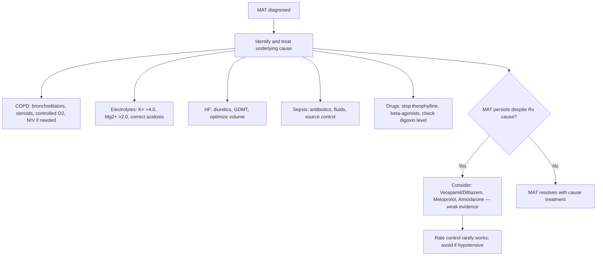

# Multifocal Atrial Tachycardia (MAT)

Related: [[../Cardiology MOC|Cardiology MOC]] · [[../Davidson Chapter 16 - Cardiology Hierarchy|Cardiology Hierarchy]] · [[../Arrhythmias and Cardiac Conduction Disorders|Arrhythmias and Cardiac Conduction Disorders]] · [[Supraventricular arrhythmias]] · [[Chronic Obstructive Pulmonary Disease]] · [[Heart Failure]] · [[Electrolyte Disorders]] · [[Sepsis]]

> [!important]
> MAT is a **marker of severe underlying illness**, not a primary arrhythmia. FCPS/MRCP exams test: **treat the underlying cause** (COPD exacerbation, electrolyte disturbance, sepsis, HF), **diagnostic criteria** (≥3 P wave morphologies, irregular R-R), and **avoid rate control drugs** — they don't work and may worsen hemodynamics.

## Learning Objectives
- Define MAT using strict ECG criteria (≥3 P wave morphologies, irregular R-R, rate 100-150)
- Identify the strong association with COPD, respiratory failure, electrolyte disturbances
- Apply the "treat the cause" principle — rate control is ineffective and potentially harmful
- Differentiate from AF, atrial flutter with variable block, wandering atrial pacemaker
- Recognize MAT as a poor prognostic marker in hospitalized patients

## Definition
**Multifocal atrial tachycardia (MAT)** = irregular narrow-complex tachycardia with **≥3 distinct P wave morphologies** originating from **multiple ectopic atrial foci**.
- Rate: typically 100-150 bpm
- **Irregularly irregular** R-R intervals
- **≥3 different P wave shapes** in same lead
- Varying PR intervals (≥3)
- Isoelectric baseline between P waves (distinct from AF)

**Wandering Atrial Pacemaker (WAP)** = same ECG criteria but rate **<100 bpm**

## Pathophysiology
- **Multiple ectopic atrial foci** firing independently → varying P morphology and PR intervals
- **Not re-entrant** — automaticity/focal triggered activity
- **Triggers**: hypoxemia, hypercapnia, acidosis, catecholamines, electrolyte shifts, atrial stretch
- **Reversible** if underlying cause corrected

## Causes (In Order of Frequency)

| Category | Conditions |
|----------|------------|
| **Pulmonary (60-85%)** | **COPD exacerbation** (most common), acute respiratory failure, pneumonia, pulmonary embolism, pneumothorax |
| **Cardiac** | Acute decompensated heart failure, post-cardiac surgery, acute MI (especially inferior), pericarditis |
| **Metabolic/Electrolyte** | **Hypokalemia**, hypomagnesemia, hypophosphatemia, acid-base disturbances |
| **Sepsis/Systemic** | Sepsis, septic shock, post-operative stress |
| **Drugs** | Theophylline toxicity, beta-agonists, digoxin toxicity, catecholamine infusions |
| **Other** | Hypothyroidism (rare), pulmonary hypertension |

> [!warning]
> **COPD exacerbation + new onset MAT** = classic exam vignette. **Theophylline toxicity** must be excluded in COPD patients on theophylline.

## Clinical Features
- **Often asymptomatic** — discovered incidentally on ECG
- **Symptoms from underlying disease**: dyspnea, hypoxemia, fever, confusion
- **Palpitations** if rate fast
- **Hemodynamic instability** rare unless rate very fast or severe LV dysfunction
- **Signs of underlying cause**: wheezing (COPD), JVD/edema (HF), fever (sepsis)

## ECG Criteria (Strict — All Required for Diagnosis)
| Criterion | Finding |
|-----------|---------|
| **P wave morphologies** | **≥3 distinct P wave shapes** in same lead (typically II, V1) |
| **R-R interval** | **Irregularly irregular** |
| **PR intervals** | **≥3 distinct PR intervals** |
| **Rate** | 100-150 bpm (typically) |
| **Baseline** | **Isoelectric** between P waves (distinguishes from AF) |
| **QRS** | Narrow (<120 ms) unless pre-existing BBB |

> [!tip]
> **Lead V1 is best for seeing P wave morphologies** — upright, biphasic, inverted P waves often visible.

## Differential Diagnosis

| Condition | Distinguishing Feature |
|-----------|------------------------|
| **Atrial fibrillation** | No distinct P waves, fibrillatory baseline, no isoelectric segments |
| **Atrial flutter with variable block** | Sawtooth F waves, atrial rate ~300, regular F-F intervals |
| **Wandering atrial pacemaker (WAP)** | **Rate <100 bpm**, same ≥3 P morphologies |
| **Frequent APCs** | Underlying sinus rhythm with ectopic P's; P morphologies = 1 sinus + 1 ectopic |
| **AVNRT/AVRT** | Regular, sudden onset/offset, 1-2 P morphologies max |

## Management Algorithm



## Specific Treatments (Low Yield — Cause Treatment is Key)

| Agent | Role | Evidence |
|-------|------|----------|
| **Verapamil / Diltiazem** | Historically used | May ↓ rate modestly; risk hypotension, negative inotropy |
| **Beta-blockers** (metoprolol) | Alternative | May worsen bronchospasm in COPD; limited efficacy |
| **Amiodarone** | Refractory cases | Low doses; side effect profile |
| **Magnesium** | If hypomagnesemia | Often coexists with hypokalemia |

> [!warning]
> **DC cardioversion NOT indicated** — not a re-entrant tachycardia, will recur immediately.
> **Anticoagulation NOT routinely needed** — stroke risk unclear, not like AF. Consider if other indications (HF, prior stroke).

## Complications
- **Hemodynamic compromise** if rate >150 with severe LV dysfunction
- **Tachycardia-induced cardiomyopathy** (rare, requires sustained very high rates)
- **Progression to AF** — MAT and AF often coexist; shared substrates (atrial stretch, inflammation)

## Prognosis
- **MAT itself is benign** if rate controlled
- **Mortality driven by underlying illness** — in-hospital mortality 30-60% (reflects severity of COPD/sepsis/HF)
- **MAT resolves** in 50-80% with treatment of underlying cause
- **Recurrence common** if chronic lung/heart disease persists

## Red Flags / Exam Traps
- **MAT = marker of severe illness** — don't just treat the rhythm
- **Never cardiovert** — not a shockable rhythm, will recur
- **Beta-blockers may worsen COPD** — avoid non-selective; cardioselective with caution
- **Verapamil/diltiazem cause hypotension** — especially in sepsis, HF, hypovolemia
- **Theophylline toxicity** — classic cause in COPD; check level
- **Don't anticoagulate like AF** — no clear embolic risk data

## FCPS/MRCP High-Yield Points
- **MAT = ≥3 P morphologies + irregular R-R + isoelectric baseline**
- **COPD exacerbation = #1 cause** (60-85%)
- **Treat the cause** (bronchodilators, K+/Mg2+ repletion, HF Rx, stop theophylline)
- **Rate control drugs ineffective** — verapamil/beta-blockers/amiodarone weak evidence, risk hypotension
- **WAP = MAT but rate <100 bpm**
- **No DC cardioversion, no routine anticoagulation**
- **High mortality reflects underlying disease, not MAT itself**

## Common Viva Questions
1. What are the ECG criteria for MAT?
2. What is the most common cause of MAT?
3. How does MAT differ from AF and WAP?
4. Why is verapamil not first-line for MAT?
5. Is anticoagulation indicated in MAT?
6. What is wandering atrial pacemaker?

## Common Confusions / Exam Traps
- Treating MAT like AF (rate control + anticoagulation) — WRONG
- Calling irregular narrow-complex tachy with 2 P morphologies "MAT" — needs ≥3
- Using beta-blockers in COPD-MAT — bronchospasm risk
- Attempting cardioversion — futile
- Missing theophylline toxicity in COPD patient on theophylline

## Mind Map
```mermaid
mindmap
  root((Multifocal Atrial Tachycardia))
    ECG Criteria
      ≥3 P morphologies
      Irregular R-R
      ≥3 PR intervals
      Isoelectric baseline
      Rate 100-150
    Causes
      COPD (60-85%) ★
      HF
      Electrolytes (K+, Mg2+)
      Sepsis
      Theophylline toxicity
    Differential
      AF (no P, chaos)
      AFL variable block (sawtooth)
      WAP (rate <100)
    Management
      Treat cause (COPD, K+/Mg, HF, drugs)
      Rate control futile
      No cardioversion
      No anticoagulation
    Prognosis
      Benign rhythm
      Mortality = underlying disease
```

## One-Page Revision Summary
- **MAT**: ≥3 P morphologies, irregular R-R, isoelectric baseline, rate 100-150
- **COPD exacerbation** = most common cause (check theophylline level)
- **Treat cause**: bronchodilators, K+>4/Mg>2, diurese HF, stop theophylline
- **Rate control drugs don't work** (verapamil/beta-blockers/amiodarone weak, risky)
- **WAP** = same ECG but rate <100
- **No cardioversion, no routine anticoagulation**
- **Mortality = underlying illness severity**

## 24-Hour Recall Prompts
- State all 4 strict ECG criteria for MAT
- List 5 causes of MAT
- Differentiate MAT vs AF vs WAP
- Explain why rate control is not recommended

## 7-Day / 15-Day / 30-Day Revision Tracker
- [ ] Day 1 completed
- [ ] 24-hour recall completed
- [ ] Day 7 revision completed
- [ ] Day 15 revision completed
- [ ] Day 30 revision completed

## Must Know / Should Know / Nice to Know
### Must Know
- MAT ECG criteria (≥3 P, irregular, isoelectric)
- COPD = #1 cause
- Treat cause, not rate
- WAP = rate <100
- No cardioversion/anticoagulation

### Should Know
- Theophylline toxicity association
- Electrolyte triggers (K+, Mg2+)
- Verapamil/beta-blocker risks in COPD
- Differentiation from variable block AFL

### Nice to Know
- MAT in post-cardiac surgery
- Coexistence with AF
- Long-term outcomes in chronic lung disease

## Self-Test Scorecard
- Understanding /10
- Recall /10
- ECG diagnosis /10
- MCQ performance /10
- Viva confidence /10
- **Total /50**

> [!tip]
> **Interpretation**: <35 = weak topic; 35-44 = acceptable but insecure; 45+ = strong exam-ready topic.

## Exam Answer Modes
### Long Answer Skeleton
1. Definition + strict ECG criteria (4 items)
2. Pathophysiology (multiple ectopic foci)
3. Causes table (COPD, HF, electrolytes, sepsis, drugs)
4. Differential diagnosis table (AF, AFL, WAP)
5. Management: treat cause algorithm
6. Why rate control fails
7. Prognosis

### Short Note Skeleton
- MAT = ≥3 P morph + irregular R-R + isoelectric + rate 100-150
- COPD #1 cause (theophylline check)
- Treat cause (K>/Mg>, COPD Rx, HF Rx)
- Rate control ineffective
- WAP = <100 bpm

### Viva One-Liners
- "MAT = ≥3 P wave shapes + irregular R-R + isoelectric"
- "COPD exacerbation = most common cause of MAT"
- "Treat the COPD, not the MAT"
- "WAP = MAT but rate <100"
- "Don't cardiovert, don't anticoagulate MAT"

### Ward-Case Discussion Points
- "65M, COPD exacerbation, new irregular narrow tachy 110, ≥3 P shapes" → "MAT. Treat COPD: bronchodilators, steroids, controlled O2. Check K+/Mg2+/theophylline. No verapamil."
- "70F, decompensated HF, irregular tachy 120, multiple P waves" → "MAT. Diurese, optimize GDMT, correct electrolytes. No rate control drugs."

### Last-Night-Before-Exam Sheet
- MAT criteria: ≥3 P, irregular, isoelectric, 100-150
- COPD #1 cause
- Treat cause → MAT resolves
- WAP = rate <100
- No cardioversion, no anticoagulation

## Summary
**Multifocal atrial tachycardia (MAT)** is an **irregular narrow-complex tachycardia** characterized by **≥3 distinct P wave morphologies**, **irregular R-R intervals**, **≥3 PR intervals**, and an **isoelectric baseline** at rates 100-150 bpm. It reflects **multiple ectopic atrial foci** firing chaotically, triggered by **COPD exacerbation (60-85%)**, heart failure, electrolyte disturbances (hypokalemia, hypomagnesemia), sepsis, or theophylline toxicity. **Management is exclusively directed at the underlying cause** — bronchodilators/steroids for COPD, K+/Mg2+ repletion, heart failure optimization, theophylline cessation. **Rate control agents (verapamil, beta-blockers, amiodarone) are ineffective and may cause hypotension.** Wandering atrial pacemaker (WAP) is the same entity at rate <100 bpm. **No cardioversion, no routine anticoagulation.** Prognosis depends on the severity of the underlying illness.

## MCQs (10)
1. Minimum number of distinct P wave morphologies required for MAT diagnosis:
   A. 2
   B. **3**
   C. 4
   D. 5
2. Most common cause of MAT:
   A. Acute MI
   B. **COPD exacerbation**
   C. Thyrotoxicosis
   D. Pulmonary embolism
3. ECG feature distinguishing MAT from atrial fibrillation:
   A. Rate >100
   B. **Isoelectric baseline between P waves**
   C. Narrow QRS
   D. Irregular rhythm
4. Wandering atrial pacemaker (WAP) differs from MAT by:
   A. <3 P morphologies
   B. **Rate <100 bpm**
   C. Regular R-R
   D. Absent P waves
5. Recommended management for MAT in COPD exacerbation:
   A. Verapamil 5 mg IV
   B. Metoprolol 5 mg IV
   C. **Treat COPD: bronchodilators, steroids, correct K+/Mg2+, check theophylline**
   D. Synchronized cardioversion
6. Why is DC cardioversion NOT indicated in MAT?
   A. Rate too slow
   B. **Not a re-entrant tachycardia; will recur immediately**
   C. Always hemodynamically stable
   D. QRS too narrow
7. Is routine anticoagulation indicated in MAT (like AF)?
   A. Yes, CHA2DS2-VASc based
   B. **No — unclear embolic risk, not routinely recommended**
   C. Only if rate >130
   D. Only if EF <40%
8. Theophylline toxicity as cause of MAT — typical patient:
   A. Young asthmatic on inhalers
   B. **COPD patient on oral theophylline with new MAT**
   C. Post-MI patient
   D. Thyrotoxic patient
9. Verapamil in MAT — major limitation:
   A. Causes bradycardia
   B. **Hypotension, negative inotropy; rate control often fails**
   C. Worsens COPD (bronchospasm)
   D. Proarrhythmic
10. MAT prognosis:
    A. Poor due to arrhythmia itself
    B. **Driven by underlying illness severity; MAT resolves with cause treatment**
    C. Excellent, always benign
    D. High stroke risk

## SBA Questions (10)
1. 68M, COPD on theophylline, presents with dyspnea, HR 115 irregular. ECG: ≥3 P morphologies, isoelectric baseline. Theophylline level 25 μg/mL. Best management:
   A. Verapamil
   B. **Stop theophylline, treat COPD, correct electrolytes**
   C. Metoprolol
   D. Cardioversion
2. 72F, decompensated HF, HR 120 irregular narrow, multiple P waves. K+ 3.1, Mg2+ 1.5. Management:
   A. Amiodarone
   B. **K+/Mg2+ replacement, diuresis, optimize GDMT**
   C. Diltiazem
   D. Digoxin
3. 55M, sepsis, HR 130 irregular, ≥3 P morphologies. BP 90/60. Next step:
   A. Metoprolol 5 mg IV
   B. **Fluids, antibiotics, source control, correct electrolytes**
   C. Verapamil 5 mg IV
   D. Cardioversion
4. ECG shows irregular narrow-complex tachycardia at 95 bpm with ≥3 distinct P wave morphologies. Diagnosis:
   A. MAT
   B. **Wandering atrial pacemaker (WAP)**
   C. AF
   D. Atrial flutter with variable block
5. In MAT, P wave morphology in lead V1 typically shows:
   A. All upright
   B. **Upright, biphasic, and inverted morphologies**
   C. All inverted
   D. All identical
6. Which drug is relatively contraindicated in COPD patient with MAT?
   A. Verapamil
   B. **Non-selective beta-blocker (propranolol)**
   C. Amiodarone
   D. Magnesium sulfate
7. MAT vs AF — key ECG differentiator:
   A. Rate
   B. **Isoelectric baseline + distinct P morphologies in MAT**
   C. QRS width
   D. Rhythm regularity
8. 40F, post-thoracotomy day 2, new MAT. Most likely trigger:
   A. Theophylline
   B. **Post-operative stress, pain, catecholamines, atrial irritation**
   C. Thyrotoxicosis
   D. PE
9. WAP management:
   A. Same as MAT (treat cause)
   B. Beta-blockers
   C. Cardioversion
   D. **Usually asymptomatic, no treatment needed unless symptomatic**
10. MAT recurrence after initial resolution:
    A. Rare if cause treated
    B. **Common if chronic underlying disease persists (COPD, HF)**
    C. Never recurs
    D. Always progresses to AF

## Flashcards
- Q: MAT 4 ECG criteria?
  A: ≥3 P morph, irregular R-R, ≥3 PR, isoelectric baseline, rate 100-150
- Q: #1 cause MAT?
  A: COPD exacerbation (60-85%)
- Q: MAT management?
  A: Treat cause (COPD, K+/Mg, HF, stop theophylline) — rate control futile
- Q: WAP vs MAT?
  A: WAP = rate <100, same ECG criteria
- Q: Cardioversion in MAT?
  A: No — not re-entrant, recurs
- Q: Anticoagulation in MAT?
  A: No routine — unclear stroke risk
- Q: Theophylline + MAT?
  A: Stop theophylline, check level
- Q: Verapamil in MAT?
  A: Weak efficacy, hypotension risk
- Q: Prognosis MAT?
  A: Benign rhythm; mortality = underlying disease

## Answer Key with Explanations
### MCQs
1. **B** — Strict criteria require ≥3 distinct P wave morphologies.
2. **B** — COPD exacerbation accounts for 60-85% of MAT cases.
3. **B** — AF has chaotic baseline, no isoelectric segments; MAT has distinct P waves with isoelectric baseline.
4. **B** — WAP = identical ECG criteria but rate <100 bpm.
5. **C** — Treat underlying cause; rate control drugs ineffective and risky.
6. **B** — MAT is multifocal automaticity, not re-entry; cardioversion doesn't alter substrate.
7. **B** — No large RCT supports anticoagulation in MAT; stroke risk uncertain, not equivalent to AF.
8. **B** — COPD patient on theophylline with new MAT = classic theophylline toxicity presentation.
9. **B** — Verapamil may cause hypotension and negative inotropy; rate control often fails.
10. **B** — MAT itself benign; mortality reflects COPD/sepsis/HF severity.

### SBAs
1. **B** — Theophylline toxicity + COPD → stop drug, treat COPD, correct electrolytes.
2. **B** — HF + hypokalemia/hypomagnesemia → electrolyte repletion + HF optimization.
3. **B** — Sepsis → fluids/antibiotics/source control/electrolytes. No rate control in shock.
4. **B** — Rate <100 with ≥3 P morphologies = WAP.
5. **B** — V1 shows multiple P vectors: upright, biphasic, negative.
6. **B** — Non-selective BB causes bronchospasm in COPD.
7. **B** — MAT has isoelectric baseline + 3+ distinct P waves; AF has neither.
8. **B** — Post-op: surgical stress, catecholamines, atrial irritation from pericardiotomy.
9. **D** — WAP usually asymptomatic, rate <100; treat if symptomatic.
10. **B** — Recurrence common if COPD/HF chronic; reflects disease control.

---