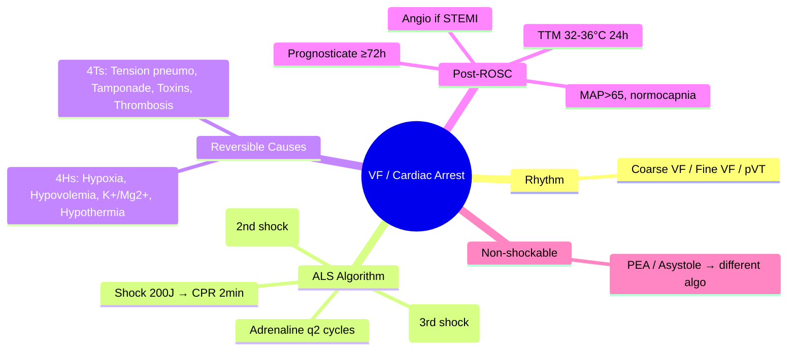

# Ventricular Fibrillation & Cardiac Arrest Rhythms

Related: [[../Cardiology MOC|Cardiology MOC]] · [[../Davidson Chapter 16 - Cardiology Hierarchy|Cardiology Hierarchy]] · [[../Arrhythmias and Cardiac Conduction Disorders|Arrhythmias and Cardiac Conduction Disorders]] · [[Ventricular arrhythmias and bradyarrhythmias]] · [[Monomorphic ventricular tachycardia]] · [[Polymorphic ventricular tachycardia and torsades de pointes]] · [[Advanced Life Support]] · [[Post-cardiac arrest care]] · [[ICD indications]] · [[Syncope]]

> [!important]
> VF = **chaotic, disorganized ventricular electrical activity** with **no effective cardiac output** — a **shockable** cardiac arrest rhythm. FCPS/MRCP exams test: **ALS algorithm** (shock → CPR → adrenaline → shock → amiodarone), **reversible causes (4Hs/4Ts)**, **post-ROSC care** (targeted temperature management, urgent coronary angiography), and **differentiation from fine VF/asystole/PEA**.

## Learning Objectives
- Define VF and distinguish from fine VF, pulseless VT, PEA, asystole
- Execute ALS algorithm for shockable rhythms (VF/pVT) per Resuscitation Council UK / ERC 2021
- Identify and treat reversible causes: **4Hs + 4Ts**
- Apply post-ROSC management: TTM, coronary angiography, hemodynamic optimization, neurological prognostication
- Differentiate cardiac arrest rhythms: VF vs pVT vs PEA vs asystole
- Determine ICD indications for VF survivors

## Definition
**Ventricular Fibrillation (VF)** = **chaotic, disorganized, irregular ventricular electrical activity** with **no organized QRS complexes** and **no effective cardiac output** — **pulseless**, **unresponsive**, **apneic**.
- **Coarse VF**: amplitude >3 mm (recent, higher defibrillation success)
- **Fine VF**: amplitude <3 mm (prolonged, lower success; may mimic asystole)
- **Pulseless VT (pVT)**: wide-complex regular tachycardia, no pulse — **managed identically to VF**

## ALS Algorithm for Shockable Rhythms (VF/pVT) — ERC 2021

```mermaid
flowchart TD
A[Unresponsive, not breathing, no pulse] --> B[Start CPR: 30:2, 100-120/min, 5-6cm depth]
B --> C[Attach defibrillator / monitor]
C --> D{Rhythm shockable? VF/pVT}
D -->|Yes| E[SHOCK: 200J biphasic (or 360J monophasic)]
E --> F[Immediate CPR 2 min — NO rhythm check]
F --> G[Rhythm check]
G --> H{Still shockable?}
H -->|Yes| I[SHOCK 200J]
I --> J[CPR 2 min]
J --> K[ADRENALINE 1mg IV/IO — after 2nd shock]
K --> L[CPR 2 min]
L --> M[Amiodarone 300mg IV — after 3rd shock]
M --> N[CPR 2 min]
N --> O{Still shockable?}
O -->|Yes| P[SHOCK 200J]
P --> Q[CPR 2 min]
Q --> R[Adrenaline 1mg — every 2nd cycle]
R --> S[Consider 2nd amiodarone 150mg after 5th shock]
D -->|No| T[Non-shockable: PEA/Asystole — separate algorithm]
```

## Drug Doses in Cardiac Arrest (VF/pVT)

| Drug | Dose | Timing | Notes |
|------|------|--------|-------|
| **Adrenaline (Epinephrine)** | **1 mg IV/IO** (10 mL 1:10,000) | **After 2nd shock**, then **every 2nd cycle** (every 3-5 min) | α: vasoconstriction ↑ CPP; β: ↑ contractility |
| **Amiodarone** | **300 mg IV** bolus (5 mL 50mg/mL) | **After 3rd shock** | 2nd dose **150 mg** after 5th shock if recurrent |
| **Lidocaine** | 100 mg IV (1-1.5 mg/kg) | Alternative to amiodarone | If amiodarone unavailable |
| **Magnesium** | 2 g IV | **Only if TdP** (polymorphic VT + long QT) | Not routine in VF |
| **Sodium bicarbonate** | 50 mmol IV | **Only if** TCA overdose, hyperkalemia, TCA | Not routine; may worsen intracellular acidosis |
| **Calcium** | 10 mL 10% calcium chloride | **Only if** hyperkalemia, hypocalcemia, Ca-channel blocker OD | Not routine |

## Reversible Causes — 4Hs + 4Ts

| H's | T's |
|-----|-----|
| **Hypoxia** | **Tension pneumothorax** |
| **Hypovolemia** | **Tamponade (cardiac)** |
| **Hypo-/Hyperkalemia** | **Toxins** (drugs, poisons) |
| **Hypothermia** | **Thrombosis** (coronary — MI; pulmonary — PE) |
| **Hydrogen ion (acidosis)** | **Trauma** |
| **Hypoglycemia** | |
| **Hyperglycemia** | |

> [!tip]
> **Think 4Hs/4Ts during EVERY rhythm check** — treat the cause, not just the rhythm.

## Post-ROSC Management (Post-Cardiac Arrest Care)

| Intervention | Target / Details |
|--------------|------------------|
| **Airway/Ventilation** | Intubate if GCS<8; SpO2 94-98%; PaCO2 4.5-5.5 kPa (normocapnia) |
| **Hemodynamics** | MAP >65 mmHg; norepinephrine first-line; echo for LV function |
| **Targeted Temperature Management (TTM)** | **32-36°C for 24h** (TTM2: 33°C not superior to 36°C); prevent fever >37.7°C for 72h |
| **Coronary Angiography** | **Urgent (<2h)** if STEMI on ECG; **Consider** if no STEMI but suspicion (TTM2: early angiography benefit unclear if no STEMI) |
| **Glucose Control** | 6-10 mmol/L (avoid hypoglycemia) |
| **Seizure Prophylaxis** | Treat clinical seizures; prophylactic levetiracetam debated |
| **Neurological Prognostication** | **Wait ≥72h** post-ROSC (after rewarming); multimodal: EEG, SSEP, NSE, MRI |
| **ICD** | **Class I** if VF not due to reversible cause (secondary prevention) |

## Differentiation of Cardiac Arrest Rhythms

| Rhythm | ECG | Pulse | Management |
|--------|-----|-------|------------|
| **VF** | Chaotic, irregular, no QRS | No | **Shock → CPR → Adrenaline → Shock → Amiodarone** |
| **Pulseless VT** | Wide, regular, >150 bpm | No | **Same as VF** |
| **Fine VF** | Very low amplitude (<3mm) | No | **Shock** (may need higher energy); check gain |
| **PEA** | Organized electrical activity | No | **Non-shockable**: CPR → Adrenaline → 4Hs/4Ts |
| **Asystole** | Flat line (confirm gain, leads) | No | **Non-shockable**: CPR → Adrenaline → 4Hs/4Ts |

## Special Causes of VF

| Cause | Specific Management |
|-------|---------------------|
| **Acute MI** | **Urgent coronary angiography + PCI** (culprit lesion) |
| **Electrolyte** (K+/Mg2+) | Correct before/during resuscitation |
| **Torsades de Pointes** | **Mg2+ 2g IV**; pacing/isoproterenol; NOT standard VF algorithm |
| **Channelopathy** (Brugada, LQTS, CPVT) | ICD; avoid triggers; genetic testing |
| **Commotio cordis** | Chest blow → VF; immediate CPR + defibrillation |
| **Drug-induced** | Stop offending agent; specific antidotes (e.g., lipid emulsion for LA toxicity) |

## Prognosis & Outcomes

| Metric | Value |
|--------|-------|
| **Survival to discharge (OHCA)** | 8-10% (varies by system) |
| **Survival with good neurological outcome (CPC 1-2)** | 5-8% |
| **Bystander CPR** | Doubles survival |
| **Early defibrillation (<5 min)** | Survival >50% |
| **Shockable rhythm (VF/pVT)** | 20-25% survival vs <5% non-shockable |

## Red Flags / Exam Traps
- **Shocking asystole/PEA** → delays CPR, no benefit
- **Delaying adrenaline** → give after 2nd shock, then every 2nd cycle
- **Giving amiodarone before 3rd shock** → wait until after 3rd shock
- **Not checking 4Hs/4Ts** → most common error in ALS
- **Confusing fine VF with asystole** → increase gain, check leads
- **Routine sodium bicarbonate/calcium** → not indicated, may harm
- **Post-ROSC hyperventilation** → cerebral vasoconstriction, worse outcome
- **Prognosticating <72h** → wait for rewarming + sedation clearance

## FCPS/MRCP High-Yield Points
- **VF/pVT = shockable** → immediate defibrillation (200J biphasic)
- **ALS sequence**: Shock → 2min CPR → Shock → **Adrenaline 1mg** → 2min CPR → Shock → **Amiodarone 300mg** → 2min CPR → Adrenaline q2 cycles
- **4Hs/4Ts** — identify and treat reversible causes
- **Post-ROSC**: TTM 32-36°C for 24h; urgent angiography if STEMI; MAP>65; normocapnia; prognosticate ≥72h
- **Fine VF = shockable** (not asystole) — increase gain to confirm
- **ICD Class I** for VF survivor (secondary prevention) if not reversible

## Common Viva Questions
1. What is the ALS algorithm for VF?
2. When do you give adrenaline and amiodarone in VF?
3. What are the 4Hs and 4Ts?
4. Post-ROSC management priorities?
5. How do you differentiate fine VF from asystole?
6. ICD indications after VF arrest?

## Common Confusions / Exam Traps
- Adrenaline before 2nd shock → wrong timing
- Amiodarone after 1st shock → wait for 3rd shock
- Shocking PEA/asystole → no benefit, delays CPR
- Sodium bicarbonate routinely → not indicated
- Prognostication at 24h → wait ≥72h post-rewarming
- ICD for reversible cause (e.g., electrolyte) → not indicated

## Mind Map


## One-Page Revision Summary
- **VF** = chaotic, no pulse, no organized QRS → **shockable**
- **ALS**: Shock 200J → CPR 2min → Shock → **Adrenaline 1mg (2nd shock)** → CPR → Shock → **Amiodarone 300mg (3rd shock)** → CPR → Adrenaline q2 cycles
- **4Hs/4Ts** at every rhythm check
- **Post-ROSC**: TTM 32-36°C 24h; Angio if STEMI; MAP>65; Prognosticate ≥72h
- **ICD Class I** for VF survivor (secondary prevention) if no reversible cause
- **Don't shock** PEA/asystole; don't give bicarb/calcium routinely

## 24-Hour Recall Prompts
- Recite ALS VF algorithm with drug timing
- List 4Hs + 4Ts
- State post-ROSC targets (TTM, MAP, CO2, Angio)
- ICD indication for VF survivor
- Differentiate fine VF vs asystole

## 7-Day / 15-Day / 30-Day Revision Tracker
- [ ] Day 1 completed
- [ ] 24-hour recall completed
- [ ] Day 7 revision completed
- [ ] Day 15 revision completed
- [ ] Day 30 revision completed

## Must Know / Should Know / Nice to Know
### Must Know
- VF = shockable; ALS sequence with drug timing
- 4Hs/4Ts
- Post-ROSC: TTM, angio if STEMI, prognosticate ≥72h
- ICD for VF survivor (no reversible cause)

### Should Know
- Fine VF vs asystole differentiation
- TTM temperature debate (TTM2)
- Neurological prognostication multimodal
- Special causes: channelopathies, commotio cordis

### Nice to Know
- Mechanical CPR devices
- ECPR (extracorporeal CPR) criteria
- Long-term neurocognitive outcomes

## Self-Test Scorecard
- Understanding /10
- Recall /10
- ALS algorithm /10
- MCQ performance /10
- Viva confidence /10
- **Total /50**

> [!tip]
> **Interpretation**: <35 = weak topic; 35-44 = acceptable but insecure; 45+ = strong exam-ready topic.

## Exam Answer Modes
### Long Answer Skeleton
1. Definition: VF = chaotic, no output, shockable
2. ALS algorithm with exact drug timing
3. 4Hs/4Ts table
4. Post-ROSC care bundle (TTM, angio, hemodynamics, neuro)
5. ICD indications
5. Special situations (TdP, channelopathies)

### Short Note Skeleton
- VF = shockable; pVT same algo
- Shock 200J → CPR 2' → Shock → Adrenaline (2nd) → CPR → Shock → Amiodarone (3rd) → CPR → Adrenaline q2 cycles
- 4Hs/4Ts
- Post-ROSC: TTM 32-36°C, angio if STEMI, MAP>65, prognosis ≥72h
- ICD secondary prevention if no reversible cause

### Viva One-Liners
- "VF = shockable; pVT same"
- "Shock → CPR 2' → Shock → Adrenaline (2nd) → Shock → Amiodarone (3rd)"
- "4Hs/4Ts at every rhythm check"
- "Post-ROSC: TTM 32-36°C, angio if STEMI, prognosis ≥72h"
- "Fine VF = shockable; increase gain to distinguish from asystole"
- "ICD for VF survivor if no reversible cause"

### Ward-Case Discussion Points
- "50M, witnessed VF, downtime 4min, ROSC after 2 shocks, STEMI on ECG" → "TTM 33°C 24h. URGENT coronary angiography. MAP>65. Prognosticate day 3+."
- "65F, unwitnessed, asystole, no ROSC 20min" → "Non-shockable algo. CPR + Adrenaline q2 cycles. 4Hs/4Ts. Consider stopping if no ROSC + no reversible cause."
- "30M, VF arrest, no STEMI, normal echo, Brugada on ECG" → "ICD secondary prevention. Genetic testing. Family screening. Avoid fever, QT drugs."

### Last-Night-Before-Exam Sheet
- VF: shockable 200J biphasic
- Adrenaline 1mg after 2nd shock, then q2 cycles
- Amiodarone 300mg after 3rd shock, 150mg after 5th
- 4Hs/4Ts every rhythm check
- Post-ROSC: TTM 32-36°C, STEMI→cath, MAP>65, neuro≥72h
- ICD if no reversible cause

## Summary
**Ventricular fibrillation (VF)** and **pulseless VT** are **shockable cardiac arrest rhythms** — chaotic (VF) or organized wide-complex (pVT) with no effective output. **ALS algorithm**: **Shock 200J biphasic → 2min CPR → Shock → Adrenaline 1mg IV (after 2nd shock) → 2min CPR → Shock → Amiodarone 300mg IV (after 3rd shock) → 2min CPR → Adrenaline 1mg every 2nd cycle**. **Identify 4Hs/4Ts** at every pause. **Post-ROSC**: **Targeted temperature management 32-36°C for 24h**, **urgent coronary angiography if STEMI**, MAP >65 mmHg, normocapnia, **neurological prognostication ≥72h post-rewarming**. **ICD secondary prevention (Class I)** for VF survivor if no reversible cause. **Differentiate**: fine VF (shockable, increase gain) vs asystole (non-shockable); PEA (organized electrical, no pulse) = non-shockable. **Red flags**: don't shock asystole/PEA; don't give routine bicarbonate/calcium; prostigate ≥72h.

## MCQs (10)
1. Defibrillation energy for biphasic defibrillator in VF:
   A. 150J
   B. **200J**
   C. 300J
   D. 360J
2. Adrenaline 1mg IV timing in VF ALS:
   A. After 1st shock
   B. **After 2nd shock**
   C. After 3rd shock
   D. Immediately
3. Amiodarone dose and timing in VF:
   A. 150mg after 1st shock
   B. 300mg after 2nd shock
   C. **300mg after 3rd shock**
   D. 150mg after 3rd shock
4. Non-shockable cardiac arrest rhythms:
   A. VF and pVT
   B. VF and fine VF
   C. **PEA and asystole**
   D. pVT and PEA
5. Post-ROSC targeted temperature management target:
   A. 28-32°C
   B. **32-36°C**
   C. 36-37°C
   D. 33°C exactly
6. Time to neurological prognostication post-ROSC:
   A. Immediately
   B. 24h
   C. **≥72h (after rewarming)**
   D. 1 week
7. Fine VF vs asystole differentiation:
   A. Fine VF has organized complexes
   B. **Increase gain/amplitude on monitor**
   C. Check for pulse
   D. Give atropine
8. ICD indication after VF arrest (secondary prevention):
   A. All VF survivors regardless of cause
   B. **VF survivor with NO reversible cause**
   C. Only if EF <35%
   D. Only if structural HD present
9. Routine use of sodium bicarbonate in cardiac arrest:
   A. Recommended
   B. **Not recommended (may worsen intracellular acidosis)**
   C. Only if arrest >10min
   D. Only in pediatric
10. Most common reversible cause of VF in acute MI:
    A. Hypoxia
    B. **Coronary thrombosis (4Ts — Thrombosis)**
    C. Hyperkalemia
    D. Tamponade

## SBA Questions (10)
1. 55M, VF arrest, 2nd shock delivered, CPR ongoing. Next drug:
   A. Amiodarone 300mg
   B. **Adrenaline 1mg IV**
   C. Lidocaine 100mg
   D. Sodium bicarbonate 50mmol
2. 60F, VF, 3rd shock given, CPR. Next drug:
   A. Adrenaline 1mg
   B. **Amiodarone 300mg IV**
   C. Atropine 1mg
   D. Calcium chloride 10mL
3. Post-ROSC after VF arrest, STEMI on ECG. Coronary angiography:
   A. Next day
   B. **Urgent (<2h)**
   C. After 72h
   D. Only if recurrent VF
4. VF arrest survivor, no reversible cause, EF 45%. ICD:
   A. Not indicated
   B. **Class I indicated**
   C. Class IIa
   D. Class IIb
5. Fine VF on monitor — action:
   A. Treat as asystole
   B. **Increase gain, confirm VF, then shock**
   C. Give atropine
   D. CPR only
6. Post-ROSC target MAP:
   A. >50 mmHg
   B. **>65 mmHg**
   C. >80 mmHg
   D. >90 mmHg
7. TTM2 trial conclusion:
   A. 33°C superior to 36°C
   B. **33°C not superior to 36°C; fever prevention key**
   C. 36°C harmful
   D. TTM not beneficial
8. 4Hs include all EXCEPT:
   A. Hypoxia
   B. Hypovolemia
   C. **Hyperglycemia (not a classic H)**
   D. Hypokalemia
9. 4Ts include all EXCEPT:
   A. Tension pneumothorax
   B. Tamponade
   C. **Tachycardia**
   D. Thrombosis (coronary/pulmonary)
10. Adrenaline repeat interval in VF ALS:
    A. Every cycle
    B. **Every 2nd cycle (every 3-5 min)**
    C. Every 3rd cycle
    D. Once only

## Flashcards
- Q: VF defib energy?
  A: 200J biphasic (360J monophasic)
- Q: Adrenaline timing?
  A: After 2nd shock, then q2 cycles
- Q: Amiodarone timing?
  A: 300mg after 3rd shock; 150mg after 5th
- Q: Non-shockable rhythms?
  A: PEA, asystole
- Q: Post-ROSC TTM?
  A: 32-36°C for 24h
- Q: Prognostication?
  A: ≥72h post-rewarming
- Q: 4Hs/4Ts?
  A: H: hypoxia, hypovolemia, K+/Mg2+, hypothermia; T: tension pneumo, tamponade, toxins, thrombosis
- Q: Fine VF vs asystole?
  A: ↑ gain to distinguish
- Q: ICD for VF survivor?
  A: Class I if no reversible cause
- Q: Bicarb in arrest?
  A: Not routine

## Answer Key with Explanations
### MCQs
1. **B** — 200J biphasic is standard; 360J monophasic.
2. **B** — ERC 2021: adrenaline after 2nd shock, then every 2nd cycle.
3. **C** — Amiodarone 300mg after 3rd shock; 150mg after 5th shock if recurrent.
4. **C** — PEA and asystole are non-shockable; VF/pVT are shockable.
5. **B** — TTM2: 32-36°C for 24h; 33°C not superior to 36°C; prevent fever.
6. **C** — Prognostication at ≥72h post-rewarming, off sedation.
7. **B** — Fine VF amplitude <3mm; increase gain to distinguish from asystole.
8. **B** — ICD Class I for VF survivor if no reversible cause identified.
9. **B** — Sodium bicarbonate not routinely recommended; specific indications only.
10. **B** — Coronary thrombosis (acute MI) = 4Ts "Thrombosis".

### SBAs
1. **B** — After 2nd shock → adrenaline 1mg.
2. **B** — After 3rd shock → amiodarone 300mg.
3. **B** — STEMI on post-ROSC ECG → urgent angiography (<2h).
4. **B** — VF survivor, no reversible cause → ICD Class I (secondary prevention).
5. **B** — Fine VF: increase gain to confirm, then shock per VF algorithm.
6. **B** — MAP >65 mmHg target post-ROSC.
7. **B** — TTM2: 33°C not superior to 36°C; fever prevention is key.
8. **C** — Classic 4Hs: Hypoxia, Hypovolemia, Hypo/hyperkalemia, Hypothermia (acidosis sometimes added).
9. **C** — Classic 4Ts: Tension pneumothorax, Tamponade, Toxins, Thrombosis.
10. **B** — Adrenaline every 2nd cycle (approx every 3-5 minutes).

---

## PasTest Scenario SBAs (Clinical Vignettes)

> **Auto-generated PasTest/Mediscope-style scenario SBAs** grounded in the authored source. Each scenario tests a real clinical fact (triad, specific sign, contraindication, trial, first-line Rx) extracted from the topic. *Source: Ch 16: Cardiology — Premature Ventricular Contractions (PVCs)*

**Q1.** Which of the following features is most specific or characteristic of Premature Ventricular Contractions (PVCs)?

  - **A.** Cardinal symptoms
  - **B.** A feature common to many acute inflammatory conditions
  - **C.** A non-specific sign that does not localise the diagnosis
  - **D.** An investigation finding rather than a clinical feature

  > **Answer: A** — Cardinal symptoms
  >
  > *Source:* **Cardinal symptoms**: chest pain (typical: central, crushing, radiating to jaw/left arm, exertion-related; atypical more common in women, elderly, diabetics), dyspnoea (exertional, orthopnoea, PND, n

