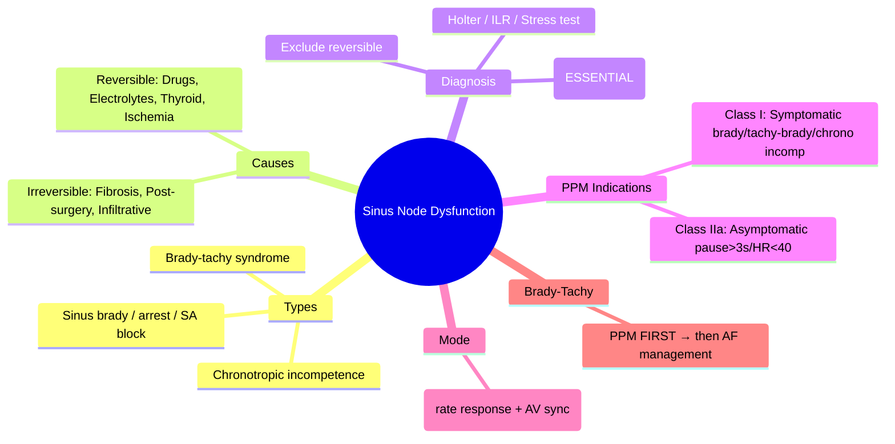

# Sinus Node Dysfunction (Sick Sinus Syndrome)

Related: [[../Cardiology MOC|Cardiology MOC]] · [[../Davidson Chapter 16 - Cardiology Hierarchy|Cardiology Hierarchy]] · [[../Arrhythmias and Cardiac Conduction Disorders|Arrhythmias and Cardiac Conduction Disorders]] · [[Ventricular arrhythmias and bradyarrhythmias]] · [[Atrioventricular block]] · [[Complete heart block]] · [[Pacemaker indications]] · [[Syncope]]

> [!important]
> Sinus node dysfunction (SND) = failure of sinus node to generate/propagate impulses appropriately. FCPS/MRCP exams test: **bradycardia-tachycardia syndrome**, **diagnostic criteria** (symptom-rhythm correlation), **reversible causes** (drugs, electrolytes), and **permanent pacing indications** (Class I: symptomatic bradycardia). **Asymptomatic sinus bradycardia ≠ SND.**

## Learning Objectives
- Define sinus node dysfunction and its electrophysiologic mechanisms
- Recognize clinical presentations: sinus bradycardia, sinus arrest, SA block, chronotropic incompetence, brady-tachy syndrome
- Correlate symptoms with arrhythmia (symptom-rhythm correlation essential for diagnosis)
- Identify reversible causes: drugs (BB, CCB, digoxin), electrolytes, hypothyroidism, infiltration
- Apply permanent pacemaker indications (Class I: symptomatic bradycardia; Class IIa: chronotropic incompetence)
- Differentiate from physiologic sinus bradycardia (athletes, sleep) and AV block

## Definition
**Sinus node dysfunction (SND)** = inability of the sinus node to generate impulses at a rate appropriate for metabolic demand, or to conduct impulses to the atria.
- **Sick sinus syndrome** = clinical syndrome of SND + symptoms (syncope, fatigue, dyspnea, confusion)
- **Not** = asymptomatic sinus bradycardia (athletes, sleep, beta-blocker on board)

## Classification (Electrophysiologic)

| Type | Mechanism | ECG Finding |
|------|-----------|-------------|
| **Sinus bradycardia** | ↓ automaticity | HR <50 bpm (awake), normal P morphology |
| **Sinus arrest/pause** | Failure of impulse formation | Pause >3s, no P wave, no relationship to basic cycle |
| **SA exit block** | Failure of impulse propagation | **Type I (Wenckebak)**: progressive PP shortening then pause; **Type II**: pause = multiple of PP |
| **Chronotropic incompetence** | Inadequate HR response to exercise | HR fails to reach 85% predicted max (220-age) |
| **Bradycardia-tachycardia syndrome** | Alternating brady + tachy (AF/AT/AFL) | Most common clinical presentation; AF termination → long pause |

## Causes

| Reversible | Irreversible |
|------------|--------------|
| **Drugs**: Beta-blockers, CCB (non-DHP), digoxin, amiodarone, lithium, sympatholytics | **Idiopathic fibrosis** (age-related) |
| **Electrolytes**: Hyperkalemia, hypercalcemia | **Post-cardiac surgery** (AV node ablation, valve surgery, congenital repair) |
| **Endocrine**: Hypothyroidism, hypothermia | **Infiltrative**: Amyloid, sarcoidosis, hemochromatosis |
| **Autonomic**: Vasovagal, carotid sinus hypersensitivity | **Inflammatory**: Lyme, Chagas, rheumatic |
| **Ischemia**: Inferior MI (RCA → sinus node artery) | **Neoplastic** |
| **Sleep apnea** | **Congenital** (rare) |

## Clinical Features

| Symptom | Mechanism |
|---------|-----------|
| **Syncope/presyncope** | Bradycardia/pause → cerebral hypoperfusion |
| **Fatigue, exercise intolerance** | Chronotropic incompetence |
| **Dyspnea, HF symptoms** | Low CO, tachycardia-induced CM |
| **Palpitations** | Tachycardia phase (AF/AFL/AT) in brady-tachy |
| **Confusion, memory decline** | Cerebral hypoperfusion (elderly) |
| **Asymptomatic** | Incidental finding |

> [!tip]
> **Brady-tachy syndrome** = AF terminates → prolonged sinus pause (>3s) → syncope. **Most common presentation for permanent pacing.**

## Diagnostic Criteria (ESC 2018)

**Definitive SND** = Symptom-rhythm correlation:
- Symptomatic bradycardia (<40 bpm or pauses >3s) **with symptoms**
- Chronotropic incompetence (HR <85% predicted max + symptoms)
- Brady-tachy syndrome (documented)

**Probable SND** = Asymptomatic ECG findings + no reversible cause:
- Sinus bradycardia <40 bpm awake
- Sinus pause >3s
- SA block on ECG/Holter
- After excluding drugs/electrolytes/hypothyroidism

## Diagnostic Workup

| Test | Yield |
|------|-------|
| **ECG** | Baseline brady, SA block, AF |
| **48h Holter / 7-14d patch** | Document brady/pauses, correlate symptoms, detect tachy |
| **Exercise stress test** | Chronotropic incompetence (HR <85% max) |
| **ILR (implantable loop recorder)** | Infrequent symptoms, symptom-rhythm correlation |
| **EPS** | Not routine; SN recovery time >525ms, corrected SNRT >1500ms |
| **TFT, electrolytes, drug review** | **Mandatory first steps** |

## Management Algorithm

```mermaid
flowchart TD
A[Suspected SND] --> B{Reversible cause?}
B -->|Yes| C[Stop offending drugs / Correct electrolytes / Treat hypothyroidism]
B -->|No| D[Symptom-rhythm correlation?]
D -->|Yes (Symptomatic)| E[Permanent Pacemaker — Class I]
D -->|No (Asymptomatic)| F{Pause >3s or HR<40 awake?}
F -->|Yes| G[PPM Class IIa (consider)]
F -->|No| H[Observe, no pacing]
E --> I[DDDR Mode — rate-responsive]
```

## Permanent Pacemaker Indications (ESC/ACC)

### Class I (Definite)
| Indication | Details |
|------------|---------|
| **Symptomatic bradycardia** (syncope, fatigue, dyspnea) **with** documented bradycardia/pause | HR <40 bpm awake, pauses >3s, SA block, sinus arrest |
| **Brady-tachy syndrome** | Symptomatic bradycardia during/after tachyarrhythmia (AF/AFL) |
| **Chronotropic incompetence** | Symptomatic + HR <85% predicted max on stress test |

### Class IIa (Recommended)
| Indication | Details |
|------------|---------|
| **Asymptomatic** sinus pauses >3s or HR <40 bpm awake | After excluding reversible causes |
| **SA block** (type II) with pauses >3s | |

### Class III (Not Indicated)
- Asymptomatic sinus bradycardia >40 bpm
- Drug-induced bradycardia (reversible)
- Sleep-related bradycardia

## Pacemaker Mode Selection

| Clinical Scenario | Mode | Rationale |
|-------------------|------|-----------|
| **SND with intact AV** | **DDDR** (or AAIR if young/no AV disease) | AV synchrony + rate response |
| **SND + AV block** | **DDDR** | Both sinus and AV disease |
| **Chronotropic incompetence** | **DDDR** (rate response essential) | Exercise-induced symptoms |
| **Permanent AF** | **VVIR** | No atrial tracking needed |

> [!tip]
> **DDDR preferred over AAIR** — preserves AV synchrony, allows future AV block detection, rate response for chronotropic incompetence.

## Bradycardia-Tachycardia Syndrome (Specific Management)

| Phase | Management |
|-------|------------|
| **Bradicardia** | Permanent pacemaker FIRST (prevents pause post-cardioversion/ablation) |
| **Tachycardia** | AF: rate control (BB/CCB/digoxin) or rhythm control (ablation); Anticoagulation per CHA2DS2-VASc |
| **Sequence** | **PPM → then tachy management** (avoids bradycardia from antiarrhythmics/cardioversion) |

## Medical Therapy (If Pacing Deferred/Contraindicated)
| Drug | Use | Caution |
|------|-----|---------|
| **Theophylline** | Mild ↑ HR (adenosine antagonist) | Limited evidence; seizures, arrhythmias |
| **Cilostazol** | ↑ HR via PDE3 inhibition | Off-label; not first-line |
| **Discontinue offending drugs** | **First step always** | BB, CCB, digoxin, amiodarone |

## Complications
- **Pacemaker syndrome** (VVI pacing) → upgrade to DDDR
- **Tachycardia-induced CM** (if tachy uncontrolled)
- **Thromboembolism** (AF in brady-tachy) → anticoagulation
- **Lead complications** (dislodgement, fracture, infection)

## Prognosis
- **With PPM**: Normal life expectancy; symptoms resolve in 80-90%
- **Without PPM (symptomatic)**: Recurrent syncope, falls, tachycardia-induced CM, reduced QoL
- **Mortality**: Driven by comorbidities (age, HF, vascular disease), not SND itself

## Red Flags / Exam Traps
- **Pacing asymptomatic bradycardia** (athlete, sleep, on BB) → not indicated
- **Missing reversible causes** (drugs, hypothyroidism, electrolytes) before PPM
- **Treating tachy first in brady-tachy** → antiarrhythmics worsen brady → syncope; **PPM first**
- **VVI mode in SND** → pacemaker syndrome; use **DDDR**
- **Chronotropic incompetence** = exercise symptoms + HR <85% max; PPM Class I if symptomatic

## FCPS/MRCP High-Yield Points
- **SND = symptomatic bradycardia/pauses/chronotropic incompetence** (not asymptomatic brady)
- **Reversible causes FIRST**: drugs (BB, CCB, digoxin), hypothyroidism, electrolytes
- **Brady-tachy syndrome** = most common clinical presentation; **PPM first**, then tachy management
- **DDDR preferred** (AV synchrony + rate response)
- **Class I PPM**: symptomatic brady <40/pause>3s, brady-tachy, chronotropic incompetence
- **Symptom-rhythm correlation ESSENTIAL** for diagnosis

## Common Viva Questions
1. What is sick sinus syndrome?
2. How do you diagnose sinus node dysfunction?
3. What is bradycardia-tachycardia syndrome and its management?
4. Permanent pacemaker indications for SND?
5. Why DDDR mode preferred in SND?
6. Differentiate sinus bradycardia from SND?

## Common Confusions / Exam Traps
- Asymptomatic sinus bradycardia = SND (NO — SND requires symptoms)
- Athlete's bradycardia = SND (NO — physiologic)
- Treating tachy before PPM in brady-tachy (WRONG — PPM first)
- VVI for SND (NO — pacemaker syndrome; DDDR)
- Not checking drugs/thyroid/electrolytes before PPM

## Mind Map


## One-Page Revision Summary
- **SND** = symptomatic bradycardia/pauses/chronotropic incompetence (not asymptomatic)
- **Reversible FIRST**: drugs (BB, CCB, digoxin), hypothyroidism, electrolytes
- **Brady-tachy syndrome**: AF + pauses → syncope; **PPM first**, then tachy Rx
- **PPM Class I**: symptomatic (syncope/fatigue/dyspnea) + brady<40/pause>3s/chrono incomp/brady-tachy
- **DDDR** mode (rate response + AV synchrony)
- **Chronotropic incompetence** = exercise symptoms + HR <85% (220-age)

## 24-Hour Recall Prompts
- List 6 reversible causes of SND
- Define brady-tachy syndrome management sequence
- State Class I PPM indications for SND
- Explain why DDDR not VVI
- Differentiate physiologic brady from SND

## 7-Day / 15-Day / 30-Day Revision Tracker
- [ ] Day 1 completed
- [ ] 24-hour recall completed
- [ ] Day 7 revision completed
- [ ] Day 15 revision completed
- [ ] Day 30 revision completed

## Must Know / Should Know / Nice to Know
### Must Know
- SND = symptomatic bradycardia/pauses/chrono incomp
- Reversible causes: drugs, thyroid, electrolytes
- Brady-tachy = PPM first
- PPM Class I: symptomatic brady, brady-tachy, chrono incomp
- DDDR mode

### Should Know
- SA block types (Wenckebach vs Type II)
- SNRT/Corr SNRT in EPS
- Theophylline/cilostazol as bridge
- Pacemaker syndrome with VVI

### Nice to Know
- Sinus node re-entry tachycardia (rare)
- Genetic SND (SCN5A, HCN4)
- Leadless PPM (Micra) for SND

## Self-Test Scorecard
- Understanding /10
- Recall /10
- Diagnosis /10
- MCQ performance /10
- Viva confidence /10
- **Total /50**

> [!tip]
> **Interpretation**: <35 = weak topic; 35-44 = acceptable but insecure; 45+ = strong exam-ready topic.

## Exam Answer Modes
### Long Answer Skeleton
1. Definition + classification (brady, arrest, SA block, chrono incomp, brady-tachy)
2. Reversible causes table
3. Diagnostic criteria (symptom-rhythm correlation essential)
4. Brady-tachy syndrome (mechanism, management sequence)
5. PPM indications (Class I, IIa) + mode selection (DDDR)
6. Medical therapy alternatives

### Short Note Skeleton
- SND = symptomatic brady/pauses/chrono incomp
- Reversible: drugs, thyroid, electrolytes
- Brady-tachy = PPM first, then AF Rx
- PPM Class I: symptomatic brady<40/pause>3s, brady-tachy, chrono incomp
- DDDR preferred
- Symptom-rhythm correlation essential

### Viva One-Liners
- "SND = symptomatic bradycardia, not asymptomatic"
- "Brady-tachy = PPM FIRST, then AF management"
- "DDDR for SND — rate response + AV sync"
- "Reversible causes: BB, CCB, digoxin, thyroid, K+"
- "Class I PPM: symptomatic brady, brady-tachy, chrono incomp"

### Ward-Case Discussion Points
- "75F on metoprolol/diltiazem, syncope, HR 38, pauses 4s" → "Drug-induced. Stop drugs, observe 48h. If persists → DDDR."
- "70M, AF with syncope, Holter: pause 5s post-cardioversion" → "Brady-tachy. DDDR first. Then anticoagulation + rate/rhythm control for AF."
- "65F, exertional dyspnea, HR 50 at rest, 85% max predicted on stress" → "Chronotropic incompetence. Symptomatic → DDDR Class I."

### Last-Night-Before-Exam Sheet
- SND = symptomatic brady/pauses/chrono incomp
- Reversible: drugs, thyroid, K+, Ca2+
- Brady-tachy: PPM FIRST
- PPM Class I: symptomatic brady, brady-tachy, chrono incomp
- DDDR mode
- Symptom-rhythm correlation essential

## Summary
**Sinus node dysfunction (SND)** = **symptomatic** failure of sinus node automaticity/conduction — **not** asymptomatic bradycardia. **Types**: sinus bradycardia (<40 awake), sinus arrest/pause (>3s), SA exit block (Wenckebach Type I or Type II), **chronotropic incompetence** (inadequate HR response to exercise), **bradycardia-tachycardia syndrome** (alternating brady + AF/AFL). **Reversible causes FIRST**: drugs (beta-blockers, non-DHP CCB, digoxin, amiodarone), hypothyroidism, electrolytes (hyperK, hyperCa), inferior MI, sleep apnea. **Diagnosis requires symptom-rhythm correlation** (Holter, ILR, stress test). **Brady-tachy syndrome** = most common presentation; **permanent pacemaker FIRST**, then tachyarrhythmia management. **PPM Class I**: symptomatic bradycardia/pause, brady-tachy, chronotropic incompetence. **Mode: DDDR** (rate response + AV synchrony). **Chronotropic incompetence** = exercise symptoms + HR <85% predicted max.

## MCQs (10)
1. Sick sinus syndrome requires which essential diagnostic criterion?
   A. Sinus bradycardia <60 bpm
   B. **Symptom-rhythm correlation**
   C. SA block on ECG
   D. Age >65
2. Most common clinical presentation of SND:
   A. Sinus bradycardia
   B. **Bradycardia-tachycardia syndrome**
   C. Sinus arrest
   D. Chronotropic incompetence
3. Reversible cause of SND — which is NOT reversible?
   A. Beta-blocker
   B. Hypothyroidism
   C. Hyperkalemia
   D. **Idiopathic fibrosis**
4. Bradycardia-tachycardia syndrome — correct management sequence:
   A. Ablate AF first, then PPM
   B. **PPM first, then manage tachyarrhythmia**
   C. Antiarrhythmic first, then PPM
   D. Rate control only
5. Preferred pacemaker mode for SND with intact AV conduction:
   A. VVI
   B. AAI
   C. **DDDR**
   D. VDD
6. Chronotropic incompetence definition:
   A. HR <60 at rest
   B. **Failure to reach 85% predicted max HR (220-age) with symptoms**
   C. HR <40 at rest
   D. Sinus pause >3s
7. Class I PPM indication for SND:
   A. Asymptomatic pause 2.5s
   B. **Symptomatic bradycardia with documented brady/pause**
   C. Asymptomatic HR 45 bpm
   D. Drug-induced bradycardia
8. SA exit block Type I (Wenckebach) ECG:
   A. Fixed PP, then sudden pause
   B. **Progressive PP shortening, then pause <2x PP**
   C. Pause = exact multiple of PP
   D. Irregular PP
9. Drug FIRST to review in elderly with new SND:
   A. ACE inhibitor
   B. **Beta-blocker / CCB / Digoxin**
   C. Statin
   D. Diuretic
10. SA block Type II ECG:
    A. Progressive PP shortening
    B. **Pause = exact multiple of basic PP interval**
    C. Irregular PP
    D. No pause

## SBA Questions (10)
1. 78F on metoprolol/diltiazem, syncope, HR 38, pauses 4s on Holter. Next:
   A. Permanent DDDR
   B. **Stop metoprolol/diltiazem, observe 48h**
   C. Atropine infusion
   D. Isoproterenol
2. 72M, recurrent syncope, Holter: AF 120 → converts to sinus → pause 6s → syncope. Best:
   A. Amiodarone for AF
   B. **DDDR first, then AF management**
   C. AV node ablation + PPM
   D. Beta-blocker for AF
3. 60F, exertional dyspnea, HR 55 at rest, achieves 75% max HR on stress. No syncope. Next:
   A. DDDR
   B. **Observe — asymptomatic chronotropic incompetence not Class I**
   C. Theophylline
   C. Stress test repeat
4. 80M, permanent AF, HR 40, pauses 4s, syncope. Pacemaker mode:
   A. DDDR
   B. **VVIR**
   C. AAIR
   D. VVI
5. SA block Type II — pause duration:
   A. <2x PP
   B. **Exact multiple of PP**
   C. >3s always
   D. Variable
6. Which drug can be tried if PPM contraindicated in SND?
   A. Digoxin
   B. **Theophylline (adenosine antagonist)**
   C. Amiodarone
   D. Verapamil
7. Brady-tachy syndrome — anticoagulation:
   A. Not needed (tachy terminates)
   B. **Per CHA2DS2-VASc (AF present)**
   C. Only if EF<40%
   D. Only if prior stroke
8. Symptom-rhythm correlation for SND — best test for infrequent symptoms:
   A. 24h Holter
   B. **ILR (implantable loop recorder)**
   C. 12-lead ECG
   D. Exercise test
9. Young athlete, HR 42, asymptomatic, normal echo. Management:
   A. DDDR
   B. **Reassure — physiologic bradycardia**
   C. Stop exercise
   D. Theophylline
10. Post-cardiac surgery (AVR) day 3, HR 38, asymptomatic, on amiodarone. Best:
    A. Permanent PPM
    B. **Stop amiodarone, observe — often transient**
    C. Temporary pacing
    D. Theophylline

## Flashcards
- Q: SND definition?
  A: Symptomatic brady/pauses/chrono incomp (not asymptomatic)
- Q: Brady-tachy mgmt?
  A: PPM FIRST → then tachy Rx
- Q: PPM Class I?
  A: Symptomatic brady<40/pause>3s, brady-tachy, chrono incomp
- Q: Mode for SND?
  A: DDDR (rate response + AV sync)
- Q: Reversible causes?
  A: Drugs (BB, CCB, dig), thyroid, electrolytes, MI
- Q: Chronotropic incompetence?
  A: Exercise symptoms + HR<85% max
- Q: Brady-tachy anticoag?
  A: Per CHA2DS2-VASc (AF present)
- Q: SA block Type I?
  A: Progressive PP shortening, pause <2x PP
- Q: SA block Type II?
  A: Pause = multiple of PP
- Q: Athlete HR 42?
  A: Physiologic, reassure

## Answer Key with Explanations
### MCQs
1. **B** — SND diagnosis requires symptoms correlated with bradyarrhythmia (Holter/ILR).
2. **B** — Brady-tachy syndrome is the most common symptomatic presentation.
3. **D** — Idiopathic fibrosis is irreversible; drugs/thyroid/electrolytes reversible.
4. **B** — PPM first prevents bradycardia from antiarrhythmics/cardioversion.
5. **C** — DDDR provides rate response + AV synchrony; VVI causes pacemaker syndrome.
6. **B** — Chronotropic incompetence = symptomatic + HR <85% (220-age) on stress test.
7. **B** — Class I requires symptoms + documented brady/pause.
8. **B** — SA block Type I = progressive PP shortening, pause <2x PP (Wenckebach).
9. **B** — Beta-blockers, CCB, digoxin are top reversible offenders.
10. **B** — Type II = fixed PR equivalent for SA node; pause = exact multiple of PP.

### SBAs
1. **B** — Drug-induced bradycardia: stop offending drugs first, observe recovery.
2. **B** — Brady-tachy: PPM first (DDDR), then anticoagulation + rate/rhythm control for AF.
3. **B** — Asymptomatic chronotropic incompetence = not Class I PPM; observe.
4. **B** — Permanent AF = VVIR (no atrial tracking needed).
5. **B** — Type II SA block: pause = exact multiple of basic PP interval.
6. **B** — Theophylline (adenosine antagonist) has modest chronotropic effect.
7. **B** — AF in brady-tachy: anticoagulate per CHA2DS2-VASc.
8. **B** — ILR for infrequent symptoms (<1/week); Holter for frequent (>1/week).
9. **B** — Athlete with asymptomatic bradycardia = physiologic, reassure.
10. **B** — Post-op amiodarone bradycardia often transient; stop amiodarone, observe.

---

## PasTest Scenario SBAs (Clinical Vignettes)

> **Auto-generated PasTest/Mediscope-style scenario SBAs** grounded in the authored source. Each scenario tests a real clinical fact (triad, specific sign, contraindication, trial, first-line Rx) extracted from the topic. *Source: Ch 16: Cardiology — Sinus node dysfunction (sick sinus syndrome)*

**Q1.** Which of the following features is most specific or characteristic of Sinus node dysfunction (sick sinus syndrome)?

  - **A.** Cardinal symptoms
  - **B.** A feature common to many acute inflammatory conditions
  - **C.** A non-specific sign that does not localise the diagnosis
  - **D.** An investigation finding rather than a clinical feature

  > **Answer: A** — Cardinal symptoms
  >
  > *Source:* **Cardinal symptoms**: chest pain (typical: central, crushing, radiating to jaw/left arm, exertion-related; atypical more common in women, elderly, diabetics), dyspnoea (exertional, orthopnoea, PND, n

