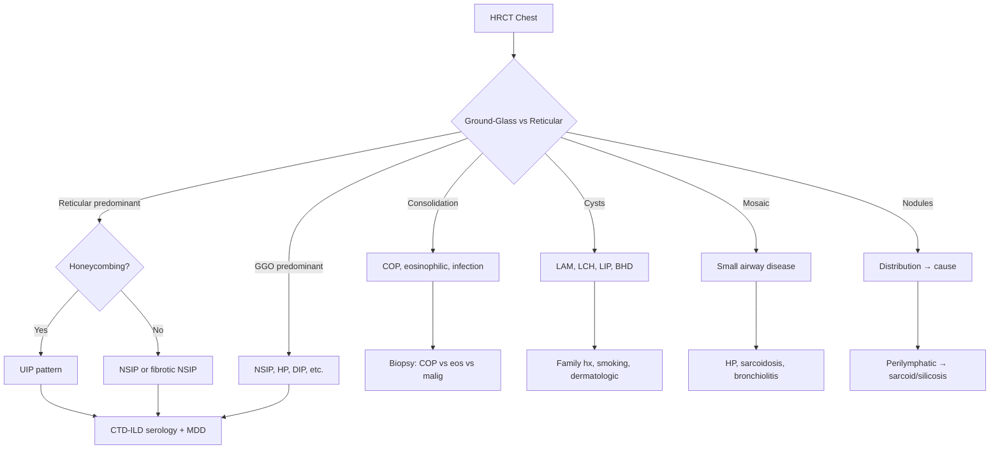

# CT chest pattern approach

> [!important]
> **HRCT (high-resolution CT)** of the chest is the cornerstone of ILD diagnosis. Recognising the major patterns (UIP, NSIP, ground-glass, consolidation, mosaic, cysts, nodules) narrows the differential and guides further workup, often avoiding the need for lung biopsy.

Related: [[Interstitial Lung Disease]], [[Chest X-Ray Approach]], [[Idiopathic pulmonary fibrosis|Idiopathic pulmonary fibrosis]], [[Sarcoidosis]]

> [!tip] **FCPS/MRCP pearl**: **UIP pattern** (subpleural, basal reticulation + honeycombing + traction bronchiectasis, minimal GGO) in an old male smoker = **IPF**. **NSIP** (bilateral, basal, homogeneous GGO with fine reticulation) in a young woman = **CTD-ILD** (esp. SSc). **MDD** (multidisciplinary discussion) is the gold standard for ILD diagnosis.

## 1. Learning Objectives
- Identify the 7 major HRCT patterns
- Recognise the typical disease associations
- Apply systematic HRCT interpretation
- Distinguish UIP, NSIP, ground-glass, consolidation, mosaic, cysts, nodules
- Apply to ILD differential diagnosis

## 2. HRCT Technique

- **High-resolution** (1–1.5 mm slices)
- **Supine + prone** (to differentiate dependent atelectasis from true disease)
- **Inspiration + expiration** (air-trapping in small airway disease)
- **Without contrast** (unless vasculature needed)

## 3. The 7 Major HRCT Patterns

### 1. UIP (Usual Interstitial Pneumonia)
| Feature | Detail |
|---------|--------|
| **Distribution** | Subpleural, basal |
| **Reticulation** | Coarse |
| **Honeycombing** | Present (cysts in clusters) |
| **Traction bronchiectasis** | Present |
| **GGO** | Minimal |
| **Distribution** | Bilateral, often asymmetric |

**Causes**: IPF, CTD-UIP (RA, SSc), asbestosis, chronic HP, drug (amiodarone, nitrofurantoin)

### 2. NSIP (Non-Specific Interstitial Pneumonia)
| Feature | Detail |
|---------|--------|
| **Distribution** | Bilateral, basal, subpleural sparing possible |
| **GGO** | Predominant (homogeneous) |
| **Reticulation** | Fine |
| **Honeycombing** | Minimal or absent |
| **Distribution** | Symmetric |

**Causes**: CTD-ILD (esp. SSc, PM/DM, Sjögren), drug, HP, idiopathic

### 3. Ground-Glass Opacity (GGO)
- Hazy ↑attenuation, vessels visible
- **Causes**: HP, NSIP, DIP, PCP, alveolar proteinosis, pulmonary oedema, drug, infection

### 4. Consolidation
- Dense ↑attenuation, vessels obscured
- **Causes**: COP, eosinophilic pneumonia, lymphoma, adenocarcinoma, lipoid pneumonia, infection

### 5. Mosaic Attenuation
- Patchy areas of ↓ and ↑ density
- **Air-trapping on expiratory** = small airway disease
- **Causes**: HP, sarcoidosis, constrictive bronchiolitis, asthma

### 6. Cysts
- Thin-walled air spaces
- **Causes**: LAM, LCH, LIP, Birt-Hogg-Dubé, honeycomb (UIP)

### 7. Nodules
- **Centrilobular**: HP, sarcoidosis, respiratory bronchiolitis, infection
- **Perilymphatic**: sarcoidosis, silicosis, lymphangitic carcinomatosis
- **Random**: miliary TB, metastases, fungal, sarcoidosis

## 4. HRCT Pattern Recognition Algorithm

## 5. Disease-Specific HRCT Findings

| Disease | HRCT pattern |
|---------|--------------|
| **IPF** | UIP (subpleural, basal, honeycombing) |
| **NSIP** | Bilateral basal GGO + fine reticulation |
| **Sarcoidosis** | Bilateral hilar nodes, perilymphatic nodules, upper-zone fibrosis |
| **HP** | Centrilobular nodules + GGO + mosaic (chronic → fibrosis) |
| **DIP** | Diffuse GGO + small cysts (smokers) |
| **RB-ILD** | Centrilobular nodules + GGO (smokers) |
| **LCH** | Cysts + nodules, upper zones (smokers) |
| **LAM** | Diffuse thin-walled cysts, women of childbearing age |
| **LIP** | Cysts + nodules, often with Sjögren/HIV |
| **COP** | Subpleural/perilobular consolidation, migratory |
| **Eosinophilic pneumonia** | Peripheral "photographic negative of pulmonary oedema" |
| **Asbestosis** | Subpleural lines, pleural plaques, UIP-like |
| **Silicosis/coal** | Upper-zone nodules ± progressive massive fibrosis |
| **Lymphangitic carcinomatosis** | Perilymphatic thickening/nodules (interlobular septa) |
| **PCP** | Diffuse GGO in HIV |
| **Alveolar proteinosis** | "Crazy paving" (GGO + interlobular septal thickening) |
| **Lipoid pneumonia** | Consolidation with fat density |

## 6. Diagnosis

### Systematic HRCT interpretation
1. **Distribution**: upper vs lower; central vs peripheral; diffuse vs focal
2. **Pattern**: reticular, nodular, GGO, consolidation, cystic, mosaic
3. **Specific signs**: honeycombing, traction bronchiectasis, tree-in-bud, cavitation
4. **Associated**: lymphadenopathy, pleural effusion, pleural plaques
5. **Clinical correlation**: age, smoking, exposure, symptoms

### MDD (multidisciplinary discussion)
- **Pulmonologist + radiologist + pathologist** (when biopsy)
- Combines clinical + imaging + (pathology)
- Gold standard for ILD diagnosis

## 7. Management

### Based on pattern
- **UIP in appropriate clinical context** → IPF diagnosis (no biopsy needed)
- **Other patterns** → CTD screen, biopsy as needed
- **Treat underlying cause**

### HRCT in follow-up
- Monitor disease progression
- Detect complications (lung cancer, infection)
- Assess treatment response

## 8. FCPS/MRCP High-Yield Summary

| Domain | Key points |
|--------|------------|
| **UIP** | Subpleural, basal, reticular, honeycombing → IPF, CTD, asbestosis |
| **NSIP** | Basal, homogeneous GGO, fine reticulation → CTD-ILD |
| **GGO** | HP, NSIP, DIP, PCP, PAP |
| **Consolidation** | COP, eosinophilic, infection, malignancy |
| **Mosaic** | HP, sarcoidosis, bronchiolitis (air-trapping) |
| **Cysts** | LAM, LCH, LIP, BHD |
| **Nodules** | Distribution → cause |
| **MDD** | Gold standard for ILD diagnosis |
| **HRCT** | Cornerstone of ILD workup |

## 9. MCQs (10)

1. UIP pattern is most characteristic of:
   A. Sarcoidosis
   B. **IPF**
   C. LAM
   D. Hypersensitivity pneumonitis
   E. LCH
   **Answer: B** — UIP = IPF (in appropriate context).

2. NSIP pattern is most commonly associated with:
   A. IPF
   B. Sarcoidosis
   C. **CTD-ILD (esp. SSc)**
   D. LAM
   E. Asbestosis
   **Answer: C** — NSIP = CTD-ILD.

3. Crazy paving pattern on HRCT is seen in:
   A. IPF
   B. **Pulmonary alveolar proteinosis**
   C. Sarcoidosis
   D. LAM
   E. Asbestosis
   **Answer: B** — PAP = crazy paving.

4. Centrilobular nodules in a bird fancier with chronic exposure suggest:
   A. IPF
   B. **Hypersensitivity pneumonitis**
   C. Sarcoidosis
   D. LAM
   E. Sarcoidosis
   **Answer: B** — HP = centrilobular nodules.

5. Bilateral hilar lymphadenopathy + perilymphatic nodules suggests:
   A. IPF
   B. **Sarcoidosis**
   C. LAM
   D. Asbestosis
   E. NSIP
   **Answer: B** — Sarcoidosis.

6. Diffuse thin-walled cysts in a young woman suggest:
   A. LCH
   B. **LAM**
   C. IPF
   D. Sarcoidosis
   E. LIP
   **Answer: B** — LAM (lymphangioleiomyomatosis).

7. Upper-lobe cystic disease in a smoker suggests:
   A. LAM
   B. **LCH (Langerhans cell histiocytosis)**
   C. IPF
   D. Sarcoidosis
   E. NSIP
   **Answer: B** — LCH.

8. Photographic negative of pulmonary oedema on HRCT:
   A. UIP
   B. **Chronic eosinophilic pneumonia**
   C. COP
   D. IPF
   E. DIP
   **Answer: B** — CEP.

9. Perilymphatic nodules (along bronchovascular bundles, fissures, subpleural):
   A. HP
   B. **Sarcoidosis**
   C. LAM
   D. DIP
   E. LCH
   **Answer: B** — Sarcoidosis (perilymphatic distribution).

10. The HRCT pattern of "tree-in-bud" suggests:
    A. UIP
    B. **Endobronchial spread of infection (e.g. TB, atypical)**
    C. Sarcoidosis
    D. LAM
    E. LIP
    **Answer: B** — Tree-in-bud = bronchiolitis/endobronchial infection.

## 10. SBA Questions (10)

1. A 70-year-old male smoker has HRCT: subpleural, basal reticulation, honeycombing, minimal GGO. Most likely:
   A. NSIP
   B. **IPF (UIP pattern)**
   C. Sarcoidosis
   D. HP
   E. LAM
   **Answer: B** — UIP in old male smoker = IPF.

2. The most sensitive HRCT finding for ILD:
   A. Honeycombing
   B. **GGO (earliest finding)**
   C. Consolidation
   D. Cysts
   E. Nodules
   **Answer: B** — GGO earliest.

3. A 50-year-old woman with SSc has HRCT: bilateral basal homogeneous GGO with fine reticulation. Pattern:
   A. UIP
   B. **NSIP**
   C. COP
   D. DIP
   E. LCH
   **Answer: B** — NSIP.

4. HRCT in chronic HP shows:
   A. UIP only
   B. **Centrilobular nodules + GGO + mosaic + air-trapping (can mimic UIP if chronic)**
   C. Cavitation
   D. Pleural effusion
   E. Miliary
   **Answer: B** — HP pattern.

5. Air-trapping on expiratory HRCT is characteristic of:
   A. UIP
   B. **Small airway disease (HP, bronchiolitis)**
   C. Consolidation
   D. Cavitation
   E. Mass
   **Answer: B** — Air-trapping = small airway.

6. Honeycombing in subpleural, basal distribution is pathognomonic of:
   A. NSIP
   B. **UIP (IPF)**
   C. COP
   D. DIP
   E. NSIP
   **Answer: B** — UIP.

7. A patient has HRCT showing GGO with superimposed interlobular septal thickening ("crazy paving"). Most likely:
   A. UIP
   B. **Pulmonary alveolar proteinosis (PAP)**
   C. Sarcoidosis
   D. LAM
   E. Asbestosis
   **Answer: B** — PAP.

8. HRCT in LAM shows:
   A. UIP
   B. **Diffuse thin-walled cysts in women**
   C. Consolidation
   D. Pleural plaques
   E. Mass
   **Answer: B** — LAM.

9. The most common HRCT pattern in asymptomatic drug-induced ILD:
   A. Honeycombing
   B. **GGO (acute) or NSIP (chronic)**
   C. Cavitation
   D. Mass
   E. None
   **Answer: B** — GGO/NSIP.

10. MDD is essential for ILD diagnosis because:
    A. CT alone is sufficient
    A. **Single-modality diagnosis is often insufficient; MDD integrates clinical + imaging + pathology**
    B. Lung biopsy is contraindicated
    C. Always needed
    D. None
    **Answer: A** — MDD integrates all data.

## 11. Flashcards

- **Q: UIP pattern features?**
  A: Subpleural, basal, reticulation, honeycombing, traction bronchiectasis, minimal GGO.

- **Q: UIP most common cause?**
  A: IPF (idiopathic pulmonary fibrosis).

- **Q: NSIP pattern features?**
  A: Bilateral, basal, homogeneous GGO, fine reticulation.

- **Q: NSIP most common cause?**
  A: CTD-ILD (esp. SSc).

- **Q: Crazy paving?**
  A: GGO + interlobular septal thickening → PAP.

- **Q: Centrilobular nodules + mosaic?**
  A: Hypersensitivity pneumonitis.

- **Q: Bilateral hilar nodes + perilymphatic nodules?**
  A: Sarcoidosis.

- **Q: Diffuse thin-walled cysts in young woman?**
  A: LAM.

- **Q: Upper-zone cysts in smoker?**
  A: LCH.

- **Q: Photographic negative of pulmonary oedema?**
  A: Chronic eosinophilic pneumonia.

## 12. Answer Key with Explanations

### MCQs
1. **B**  2. **C**  3. **B**  4. **B**  5. **B**  6. **B**  7. **B**  8. **B**  9. **B**  10. **B**

### SBAs
1. **B**  2. **B**  3. **B**  4. **B**  5. **B**  6. **B**  7. **B**  8. **B**  9. **B**  10. **A**

## 13. Summary

HRCT chest is the cornerstone of ILD diagnosis. 7 major patterns: UIP (IPF), NSIP (CTD-ILD), GGO (HP, NSIP, DIP), consolidation (COP, eos, infection), mosaic (HP, small airway), cysts (LAM, LCH), nodules (distribution-dependent). MDD (multidisciplinary discussion) is the gold standard for ILD diagnosis.

## 14. Local Navigation
- **Parent Heading**: [[../Functional Anatomy, Physiology, and Investigations|Functional Anatomy, Physiology, and Investigations]]
- **Parent Topic Group**: [[../Functional Anatomy, Physiology, and Investigations/Respiratory investigations and interpretation|Respiratory investigations and interpretation]]
- **Chapter Map**: [[../Davidson Chapter 17 - Respiratory Medicine Hierarchy|Respiratory Medicine Hierarchy]]
- **Chapter MOC**: [[../Respiratory MOC|Respiratory MOC]]
- **Related**: [[Interstitial Lung Disease]] · [[Idiopathic pulmonary fibrosis|Idiopathic pulmonary fibrosis]] · [[Sarcoidosis]] · [[Chest X-Ray Approach]]

## PasTest Scenario SBAs (Clinical Vignettes)

> **Auto-generated PasTest/Mediscope-style scenario SBAs** grounded in the authored source. Each scenario tests a real clinical fact (triad, specific sign, contraindication, trial, first-line Rx) extracted from the topic. *Source: Ch 17: Respiratory Medicine — CT chest pattern approach*

**Q1.** What is the most appropriate first-line therapy for CT chest pattern approach?

  - **A.** Treat underlying cause
  - **B.** An advanced/surgical therapy reserved for refractory disease
  - **C.** Symptomatic treatment only, no disease-modifying therapy
  - **D.** Empiric broad-spectrum therapy without specific indication

  > **Answer: A** — Treat underlying cause
  >
  > *Source:* **Treat underlying cause**

