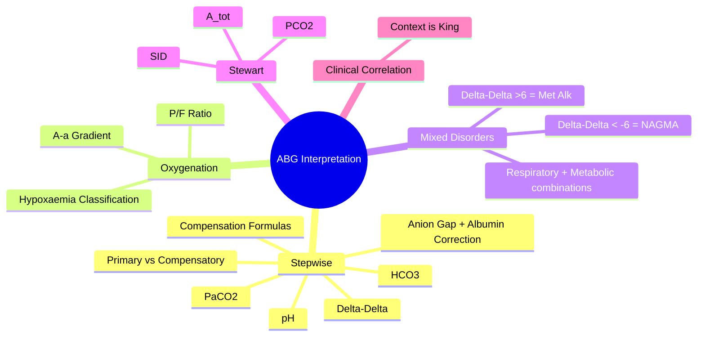

# ABG Interpretation

Related: [[Acid-Base and Electrolyte Emergencies]], [[Respiratory Failure]], [[Oxygen Therapy and NIV]]

> [!important]
> **Systematic ABG interpretation** = essential skill for acute medicine. **Stepwise approach**: pH → PaCO₂ → HCO₃⁻ → compensation → anion gap → delta-delta. **Key FCPS/MRCP**: Henderson-Hasselbalch vs Stewart, compensation formulas (Winter's), albumin-corrected AG, delta-delta for mixed disorders, oxygenation assessment (A-a gradient).

## Learning Objectives
- Apply stepwise ABG interpretation algorithm
- Identify primary acid-base disorders and appropriate compensation
- Calculate anion gap, albumin-corrected AG, delta-delta
- Assess oxygenation (A-a gradient, P/F ratio)
- Recognise mixed acid-base disorders

## Normal Values (Adult, Sea Level)
| Parameter | Range |
|-----------|-------|
| **pH** | 7.35 – 7.45 |
| **PaCO₂** | 4.7 – 6.0 kPa (35 – 45 mmHg) |
| **PaO₂** | 11 – 13 kPa (80 – 100 mmHg) |
| **HCO₃⁻** | 22 – 26 mmol/L |
| **Base Excess** | -2 to +2 mmol/L |
| **Lactate** | <2 mmol/L |
| **Anion Gap** | 8 – 12 mmol/L (albumin-corrected) |

## Stepwise ABG Interpretation (Traditional Approach)

### Step 1: pH → Acidaemia or Alkalaemia?
- **pH <7.35** → **Acidaemia**
- **pH >7.45** → **Alkalaemia**
- **pH 7.35-7.45** → Normal (but may be compensated mixed disorder)

### Step 2: PaCO₂ → Respiratory Component
| PaCO₂ | Interpretation |
|-------|----------------|
| **↑ (>6.0 kPa)** | Respiratory acidosis (or compensation for metabolic alkalosis) |
| **↓ (<4.7 kPa)** | Respiratory alkalosis (or compensation for metabolic acidosis) |
| **Normal** | No primary respiratory disorder |

### Step 3: HCO₃⁻ → Metabolic Component
| HCO₃⁻ | Interpretation |
|-------|----------------|
| **↓ (<22 mmol/L)** | Metabolic acidosis (or compensation for respiratory alkalosis) |
| **↑ (>26 mmol/L)** | Metabolic alkalosis (or compensation for respiratory acidosis) |
| **Normal** | No primary metabolic disorder |

### Step 4: Match Primary Disorder with pH
| Primary Disorder | pH Direction |
|------------------|--------------|
| Respiratory acidosis | ↓ (acidaemia) |
| Respiratory alkalosis | ↑ (alkalaemia) |
| Metabolic acidosis | ↓ (acidaemia) |
| Metabolic alkalosis | ↑ (alkalaemia) |

### Step 5: Assess Compensation (Appropriate vs Inadequate vs Mixed)

#### Respiratory Acidosis Compensation
| Type | Expected HCO₃⁻ Change |
|------|-----------------------|
| **Acute** | HCO₃⁻ ↑ **1 mmol/L** per **10 mmHg (1.3 kPa)** PaCO₂ rise |
| **Chronic** | HCO₃⁻ ↑ **4 mmol/L** per **10 mmHg (1.3 kPa)** PaCO₂ rise |

#### Respiratory Alkalosis Compensation
| Type | Expected HCO₃⁻ Change |
|------|-----------------------|
| **Acute** | HCO₃⁻ ↓ **2 mmol/L** per **10 mmHg (1.3 kPa)** PaCO₂ fall |
| **Chronic** | HCO₃⁻ ↓ **5 mmol/L** per **10 mmHg (1.3 kPa)** PaCO₂ fall |

#### Metabolic Acidosis Compensation (Winter's Formula)
**Expected PaCO₂ = 1.5 × HCO₃⁻ + 8 ± 2 mmHg**

#### Metabolic Alkalosis Compensation
**Expected PaCO₂ = 0.7 × HCO₃⁻ + 20 ± 5 mmHg**

### Step 6: Anion Gap (If Metabolic Acidosis)
**AG = Na⁺ − (Cl⁻ + HCO₃⁻)**

**Albumin-Corrected AG = AG + 2.5 × (40 − Albumin g/L)**

**MUDPILES** (High AG Metabolic Acidosis):
- **M**ethanol, **U**raemia, **D**KA, **P**araldehyde, **I**ron/**I**soniazid, **L**actic acidosis, **E**thylene glycol, **S**alicylate

### Step 7: Delta-Delta (ΔΔ) — Unmask Mixed Metabolic Disorders
- **ΔAG = Measured AG − Normal AG (12)**
- **ΔHCO₃⁻ = Normal HCO₃⁻ (24) − Measured HCO₃⁻**
- **ΔΔ = ΔAG − ΔHCO₃⁻**

| ΔΔ Value | Interpretation |
|----------|----------------|
| **≈ 0** | Pure high AG metabolic acidosis |
| **> +6 (or >0.6 mmol/L)** | Concomitant **metabolic alkalosis** |
| **< −6 (or < −0.6 mmol/L)** | Concomitant **normal AG metabolic acidosis** |

## Oxygenation Assessment

### A-a Gradient
**A-a gradient = PAO₂ − PaO₂**

**PAO₂ = FiO₂ × (760 − 47) − PaCO₂ / 0.8** (at sea level, FiO₂ 0.21: PAO₂ = 150 − PaCO₂/0.8)

| Age | Normal A-a Gradient |
|-----|---------------------|
| <30 yrs | <10 mmHg |
| 30-60 yrs | 10-15 mmHg |
| >60 yrs | 15-20 mmHg |

**Elevated A-a gradient** → V/Q mismatch, shunt, diffusion limitation (NOT pure hypoventilation)

### P/F Ratio (PaO₂/FiO₂)
| P/F Ratio | Severity (ARDS) |
|-----------|-----------------|
| >300 | Normal / Mild |
| 200-300 | Mild ARDS |
| 100-200 | Moderate ARDS |
| <100 | Severe ARDS |

## Stewart Approach (Strong Ion Difference)
- **SID = [Strong Cations] − [Strong Anions] = (Na⁺ + K⁺ + Ca²⁺ + Mg²⁺) − (Cl⁻ + Lactate)**
- **Normal SID ≈ 40-42 mEq/L**
- **Metabolic acidosis** = ↓ SID (hyperchloraemia, lactic acidosis)
- **Metabolic alkalosis** = ↑ SID (hypochloraemia, volume contraction)
- **A_tot** = weak acids (albumin, phosphate) → affects pH independently

## Common Mixed Disorders (ICU Patterns)
| Mixed Disorder | Typical Scenario |
|----------------|------------------|
| **Metabolic acidosis + Respiratory alkalosis** | Sepsis (lactic acidosis + hyperventilation) |
| **Metabolic acidosis + Respiratory acidosis** | Cardiac arrest, severe COPD + DKA |
| **Metabolic alkalosis + Respiratory acidosis** | Vomiting + COPD |
| **Metabolic acidosis + Metabolic alkalosis** | DKA + vomiting (ΔΔ >6) |
| **High AG + Normal AG acidosis** | ΔΔ < −6 (e.g., DKA + diarrhoea) |

## ABG Interpretation Checklist (Rapid)
1. **pH** → acidaemia/alkalaemia
2. **PaCO₂** → respiratory component
3. **HCO₃⁻** → metabolic component
4. **Primary vs compensatory**
4. **Compensation appropriate?** (Winter's, etc.)
5. **Anion gap** (if metabolic acidosis)
6. **Delta-delta** (if high AG)
6. **Oxygenation** (A-a gradient, P/F ratio)
7. **Clinical correlation**

## FCPS/MRCP High-Yield Points
1. **Stepwise**: pH → PaCO₂ → HCO₃⁻ → primary → compensation → AG → ΔΔ
2. **Winter's Formula**: PaCO₂ = 1.5×HCO₃⁻ + 8 ± 2 (metabolic acidosis)
3. **Albumin-corrected AG**: AG + 2.5×(40−Alb)
4. **Mixed disorders**: ΔΔ >+6 = met alk; ΔΔ < −6 = NAGMA
5. **A-a gradient**: elevated = V/Q mismatch/shunt; normal = pure hypoventilation
5. **P/F ratio**: ARDS severity stratification
6. **Stewart**: SID = strong cations − strong anions; A_tot = weak acids

## Common Viva Questions
1. Stepwise ABG interpretation
2. Winter's formula application
3. Anion gap + delta-delta interpretation
5. Mixed acid-base disorders identification
6. A-a gradient vs P/F ratio
7. Compensation formulas

## Common Confusions / Exam Traps
- **Winter's formula** only for metabolic acidosis
- **Delta-delta** only for high AG metabolic acidosis
- **Albumin correction** essential for AG (hypoalbuminaemia → falsely low AG)
- **Compensation never normalises pH** (pH remains abnormal)
- **A-a gradient** normal in pure hypoventilation; elevated in V/Q mismatch/shunt
- **P/F ratio** requires FiO₂; not valid on room air alone for ARDS diagnosis

## Mnemonics
- **ABG STEPS**: **pH → PaCO₂ → HCO₃ → Compensate → AG → ΔΔ**
- **MUDPILES**: **M**ethanol, **U**raemia, **D**KA, **P**araldehyde, **I**ron/**I**soniazid, **L**actic, **E**G, **S**alicylate
- **WINTER'S**: **P**aCO₂ = **1.5**×**H**CO₃ + **8** ± **2**
- **DELTA-DELTA**: **ΔAG − ΔHCO₃** → **+6** = met alk; **−6** = NAGMA
- **A-A GRADIENT**: **P**aO₂ = **F**iO₂×713 − **P**aCO₂/**0.8**; **A**-**A** = **P**A−**P**a

## Mind Map


## Flowchart
```mermaid
flowchart TD
  A[ABG Result] --> B{pH <7.35 or >7.45?}
  B -->|Yes| C{Primary Respiratory or Metabolic?}
  C -->|PaCO2 Abnormal Primary| D[Respiratory Acidosis/Alkalosis\nCheck Compensation Formula]
  C -->|HCO3 Abnormal Primary| E[Metabolic Acidosis/Alkalosis\nCalculate AG\nCheck Winter's/Compensation]
  E --> F{High AG?}
  F -->|Yes| G[MUDPILES\nDelta-Delta\n>+6 = Met Alk, <-6 = NAGMA]
  F -->|No| H[Normal AG Acidosis (RTA, Diarrhoea)]
```

## Suggested Visuals / Image Notes
- ABG interpretation flowchart
- Compensation formulas table
- Winter's formula worked example
- Delta-delta worked example
- A-a gradient vs P/F ratio comparison

## Suggested Video References
- ABG interpretation masterclass (ICU)
- Acid-base physiology (Stewart approach)

## One-Page Revision Summary
- **ABG Steps**: pH → PaCO₂ → HCO₃⁻ → Primary → Compensation → AG → ΔΔ
- **Winter's**: PaCO₂ = 1.5×HCO₃⁻ + 8 ± 2 (metabolic acidosis)
- **Albumin-corrected AG** = AG + 2.5×(40−Alb)
- **ΔΔ** = ΔAG − ΔHCO₃⁻; **>+6** = met alk; **<−6** = NAGMA
- **A-a gradient** = PAO₂ − PaO₂; normal <10-20 by age
- **P/F ratio** = PaO₂/FiO₂; ARDS: mild 200-300, mod 100-200, severe <100
- **Compensation**: Winter's, respiratory formulas
- **MUDPILES** for high AG
- **ΔΔ** unmasks mixed metabolic disorders

## 24-Hour Recall Prompts
- Walk through ABG stepwise interpretation
- State Winter's formula
- Calculate AG and ΔΔ from sample ABG
- State A-a gradient formula and normal values

## 7-Day / 15-Day / 30-Day Revision Tracker
- [ ] Day 1 completed
- [ ] 24-hour recall completed
- [ ] Day 7 revision completed
- [ ] Day 15 revision completed
- [ ] Day 30 revision completed

## Must Know / Should Know / Nice to Know
### Must Know
- ABG stepwise interpretation
- Winter's formula
- Anion gap + albumin correction
- Delta-delta interpretation
- Winter's formula
- A-a gradient and P/F ratio
- Compensation formulas

### Should Know
- Albumin-corrected AG
- Delta-delta calculation
- Stewart approach basics
- Mixed disorder patterns
- ARDS Berlin criteria

### Nice to Know
- Stewart/Fencl quantitative approach
- Strong ion difference calculations
- Base excess vs bicarbonate
- Non-bicarbonate buffers
- Quantitative acid-base physiology

## Self-Test Scorecard
- Understanding: /10
- Recall: /10
- MCQ Performance: /10
- SBA Performance: /10
- Viva Confidence: /10
- Total: /50

> [!tip]
> Interpretation: <35 = weak topic, 35-44 = acceptable but insecure, 45+ = strong exam-ready topic.

## Exam Answer Modes
### Long Answer Skeleton
- ABG stepwise approach
- Compensation formulas table
- AG + albumin correction
- ΔΔ interpretation
- Oxygenation assessment
- Mixed disorders identification

### Short Note Skeleton
- ABG steps flowchart
- Compensation formulas box
- AG + ΔΔ box
- Oxygenation box
- Mixed disorders table

### Viva One-Liners
- "ABG: pH → PaCO₂ → HCO₃⁻ → Primary → Compensation → AG → ΔΔ"
- "AG = Na − (Cl + HCO₃); Corrected = AG + 2.5×(40−Alb)"
- "Winter's: PaCO₂ = 1.5×HCO₃ + 8 ± 2"
- "ΔΔ = ΔAG − ΔHCO₃; >+6 = met alk; <−6 = NAGMA"
- "A-a gradient = PAO₂ − PaO₂; PAO₂ = FiO₂×713 − PaCO₂/0.8"
- "P/F ratio = PaO₂/FiO₂; ARDS: mild 200-300, mod 100-200, severe <100"
- "MUDPILES for high AG: Methanol, Uraemia, DKA, Paraldehyde, Iron/Isoniazid, Lactic, EG, Salicylate"
- "Compensation never normalises pH"
- "A-a gradient normal in hypoventilation; elevated in V/Q mismatch/shunt"
- "P/F ratio needs FiO₂; ARDS: mild 200-300, mod 100-200, severe <100"

### Ward-Case Discussion Points
- DKA: pH 7.1, PaCO₂ 3.5, HCO₃ 10, AG 28 → high AG metabolic acidosis, appropriate Winter's
- COPD exacerbation: pH 7.25, PaCO₂ 8, HCO₃ 32 → chronic respiratory acidosis + metabolic alkalosis
- Sepsis: pH 7.2, PaCO₂ 3, HCO₃ 14, lactate 8 → high AG metabolic acidosis + respiratory alkalosis (ΔΔ)
- Vomiting + COPD: pH 7.5, PaCO₂ 7, HCO₃ 34 → metabolic alkalosis + respiratory acidosis (ΔΔ >+6)

### Last-Night-Before-Exam Sheet
- Steps: pH→PaCO2→HCO3→Primary→Comp→AG→ΔΔ
- Winter: PaCO2=1.5×HCO3+8±2
- AG Corr: AG+2.5(40-Alb)
- ΔΔ>6=Alk, ΔΔ<-6=NAGMA
- A-a Grad: PAO2-PaO2
- P/F: PaO2/FiO2
- MUDPILES
- Comp never normalizes pH

## Summary
**Systematic ABG interpretation**: **pH → PaCO₂ → HCO₃⁻ → primary disorder → compensation → anion gap → delta-delta**. **Compensation formulas**: Winter's (PaCO₂ = 1.5×HCO₃⁻ + 8 ± 2), respiratory (acute/chronic). **Anion gap** = Na⁺ − (Cl⁻ + HCO₃⁻); **albumin-corrected** = AG + 2.5×(40−Albumin). **Delta-delta** = ΔAG − ΔHCO₃⁻; **>+6** = concurrent metabolic alkalosis; **<−6** = concurrent normal AG acidosis. **Oxygenation**: A-a gradient = PAO₂ − PaO₂; **P/F ratio** = PaO₂/FiO₂ (ARDS severity). **MUDPILES** for high AG metabolic acidosis. **Compensation never normalises pH**.

## MCQs (10)
1. Winter's formula for expected PaCO₂ in metabolic acidosis:
   A. PaCO₂ = HCO₃⁻ + 15
   B. **PaCO₂ = 1.5×HCO₃⁻ + 8 ± 2**
   C. PaCO₂ = 2×HCO₃⁻ + 5
   D. PaCO₂ = HCO₃⁻ × 1.5
2. Albumin-corrected anion gap formula:
   A. AG − 2.5×(40−Alb)
   B. AG + 2.5×(Alb−40)
   C. **AG + 2.5×(40−Alb)**
   D. AG × (40/Alb)
3. Delta-delta > +6 in high AG metabolic acidosis indicates:
   A. Pure high AG acidosis
   B. **Concomitant metabolic alkalosis**
   C. Concomitant respiratory acidosis
   D. Concomitant normal AG acidosis
4. Normal A-a gradient in a 25-year-old:
   A. <5 mmHg
   B. **<10 mmHg**
   C. <15 mmHg
   D. <20 mmHg
5. P/F ratio for severe ARDS:
   A. <100
   B. <150
   C. <200
   D. <300

## SBA Questions (10)
1. ABG: pH 7.25, PaCO₂ 5.2 kPa, HCO₃⁻ 18 mmol/L. Primary disorder:
   A. Respiratory acidosis
   B. **Metabolic acidosis with appropriate respiratory compensation**
   C. Mixed respiratory and metabolic acidosis
   D. Respiratory alkalosis
2. ABG: pH 7.30, PaCO₂ 6.5 kPa, HCO₃⁻ 28 mmol/L. Winter's formula for expected PaCO₂:
   A. 1.5×28+8 = 50 mmHg
   B. 1.5×28+8 = 6.7 kPa
   C. **Not applicable (not metabolic acidosis)**
   D. 0.7×28+20 = 39.6 mmHg
3. High AG metabolic acidosis with ΔΔ = +8 indicates:
   A. Pure high AG acidosis
   B. **Concomitant metabolic alkalosis**
   C. Concomitant respiratory alkalosis
   D. Concomitant respiratory acidosis
4. A-a gradient elevated in all EXCEPT:
   A. Pneumonia
   B. PE
   C. **Pure hypoventilation (drug overdose)**
   D. ARDS
5. P/F ratio 150 on FiO₂ 0.6 indicates:
   A. Mild ARDS
   B. **Moderate ARDS**
   C. Severe ARDS
   D. No ARDS

## Flashcards
- Q: Winter's formula
  A: PaCO₂ = 1.5×HCO₃⁻ + 8 ± 2
- Q: Albumin-corrected AG
  A: AG + 2.5×(40−Alb)
- Q: ΔΔ > +6
  A: Concomitant metabolic alkalosis
- Q: ΔΔ < -6
  A: Concomitant normal AG acidosis
- Q: A-a gradient normal <30y
  A: <10 mmHg
- Q: P/F ratio ARDS
  A: Mild 200-300, Mod 100-200, Severe <100
- Q: MUDPILES
  A: Methanol, Uraemia, DKA, Paraldehyde, Iron/Isoniazid, Lactic, EG, Salicylate
- Q: Compensation never
  A: Normalises pH

## Answer Key with Explanations
### MCQs
1. **B** — Winter's formula: PaCO₂ = 1.5×HCO₃⁻ + 8 ± 2
2. **C** — Albumin-corrected AG = AG + 2.5×(40−Alb)
3. **B** — ΔΔ > +6 = concomitant metabolic alkalosis
4. **B** — Normal A-a gradient <10 mmHg in <30yrs
5. **A** — Severe ARDS: P/F <100

### SBAs
1. **B** — pH low, PaCO₂ low, HCO₃⁻ low → metabolic acidosis with respiratory compensation (expected PaCO₂ = 1.5×18+8 = 35 mmHg ≈ 4.7 kPa; actual 5.2 kPa = appropriate).
2. **C** — Winter's formula applies ONLY to metabolic acidosis; here primary respiratory acidosis.
3. **B** — ΔΔ > +6 = concomitant metabolic alkalosis.
4. **C** — Pure hypoventilation = normal A-a gradient (hypoxaemia due to low PAO₂ only).
5. **B** — P/F 150 on FiO₂ 0.6 (≈ 90 mmHg / 0.6 = 150) → moderate ARDS (100-200).

## Flashcards
- Q: Winter's formula
  A: PaCO₂ = 1.5×HCO₃⁻ + 8 ± 2
- Q: Albumin-corrected AG
  A: AG + 2.5×(40−Alb)
- Q: ΔΔ > +6
  A: Concomitant metabolic alkalosis
- Q: ΔΔ < -6
  A: Concomitant normal AG acidosis
- Q: A-a gradient normal <30y
  A: <10 mmHg
- Q: P/F ratio ARDS
  A: Mild 200-300, Mod 100-200, Severe <100
- Q: MUDPILES
  A: Methanol, Uraemia, DKA, Paraldehyde, Iron/Isoniazid, Lactic, EG, Salicylate
- Q: Compensation never
  A: Normalises pH

## Answer Key with Explanations
### MCQs
1. **B** — Winter's formula standard.
2. **C** — Albumin correction adds 2.5 per g/L below 40.
3. **B** — ΔΔ > +6 indicates additional metabolic alkalosis.
4. **B** — <10 mmHg for age <30.
5. **A** — Severe ARDS P/F <100.

### SBAs
1. **B** — pH low, PaCO₂ low, HCO₃⁻ low → metabolic acidosis; PaCO₂ 5.2 ≈ expected 4.7 (appropriate).
2. **C** — Winter's only for metabolic acidosis; this is respiratory acidosis.
3. **B** — ΔΔ > +6 = concomitant metabolic alkalosis.
4. **C** — Pure hypoventilation = normal A-a gradient.
5. **B** — P/F 150 = moderate ARDS (100-200).

---