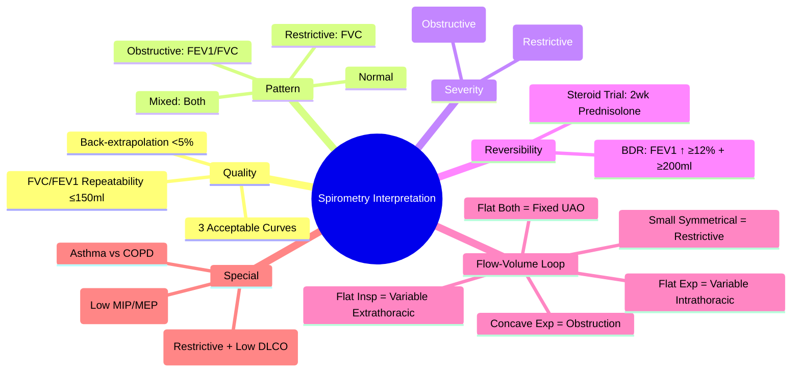

# Spirometry Interpretation

Related: [[ABG Interpretation]], [[COPD]], [[Asthma]], [[Interstitial Lung Disease]], [[Airway Diseases]]

> [!important]
> **Spirometry** = cornerstone of respiratory diagnosis. **Key FCPS/MRCP**: FEV₁/FVC ratio (LLN vs fixed 0.7), obstructive vs restrictive vs mixed, reversibility testing, flow-volume loop patterns, severity grading (GOLD, asthma control).

## Learning Objectives
- Interpret spirometry systematically (Quality → Pattern → Severity → Reversibility)
- Distinguish obstructive, restrictive, and mixed patterns
- Apply LLN vs fixed ratio for obstruction
- Interpret flow-volume loops
- Apply reversibility criteria (bronchodilator, steroid trial)
- Grade severity (GOLD, asthma control)

## Quality Criteria (ATS/ERS)
| Parameter | Acceptable | Repeatability |
|-----------|------------|---------------|
| **FVC** | ≥3 acceptable manoeuvres | 2 best FVC within **150 mL** (or 100 mL if FVC <1L) |
| **FEV₁** | ≥3 acceptable manoeuvres | 2 best FEV₁ within **150 mL** (or 100 mL if FEV₁ <1L) |
| **Start of test** | Back-extrapolated volume <5% FVC or 150 mL | — |
| **End of test** | Plateau ≥1 sec or no volume change ≥1 sec | — |
| **Cough/glottis closure** | None in first second | — |

> **Unacceptable quality** → results unreliable; repeat or note limitations.

## Key Spirometric Indices

| Index | Definition | Normal |
|-------|------------|--------|
| **FVC** | Forced Vital Capacity | >80% predicted |
| **FEV₁** | Forced Expiratory Volume in 1st second | >80% predicted |
| **FEV₁/FVC** | Ratio | **>0.7** (or **LLN**) |
| **FEF₂₅₋₇₅** | Forced Expiratory Flow 25-75% | >65% predicted |
| **PEF** | Peak Expiratory Flow | >80% predicted |
| **FIF** | Forced Inspiratory Flow | — |
| **MVV** | Maximum Voluntary Ventilation | >80% predicted |

## Reference Values
- **Predicted values**: GLI (Global Lung Function Initiative) 2012 — age, sex, height, ethnicity
- **LLN (Lower Limit of Normal)** = 5th percentile of predicted distribution
- **Fixed ratio (0.7)** vs **LLN**: **LLN preferred** (avoids overdiagnosis in elderly, underdiagnosis in young)

> **FCPS/MRCP tip**: **LLN is gold standard** for obstruction; fixed 0.7 overdiagnoses in >65, underdiagnoses in <40.

## Systematic Interpretation (5 Steps)

### 1. Quality Check
- 3 acceptable curves, FVC/FEV₁ repeatability ≤150 mL
- If poor quality → "suboptimal, interpret with caution"

### 2. Identify Pattern

| Pattern | FEV₁/FVC | FVC | FEV₁ | Typical Diseases |
|---------|----------|-----|------|------------------|
| **Normal** | >LLN (or >0.7) | >80% pred | >80% pred | — |
| **Obstructive** | **<LLN** (or **<0.7**) | Normal/↑ | **↓↓** | Asthma, COPD, bronchiectasis, CF |
| **Restrictive** | Normal/↑ (>LLN) | **↓↓** | ↓ (proportional) | ILD, chest wall, neuromuscular, obesity |
| **Mixed** | **<LLN** | **↓↓** | **↓↓** | COPD + ILD, kyphoscoliosis + COPD |

> **FEV₁/FVC <LLN = obstruction**; **FVC <LLN + normal ratio = restriction**

### 3. Severity Grading (If Obstructive / Restrictive)

#### Obstruction (COPD — GOLD)
| GOLD Grade | FEV₁ % Predicted |
|------------|------------------|
| 1 (Mild) | ≥80% |
| 2 (Moderate) | 50–79% |
| 3 (Severe) | 30–49% |
| 4 (Very Severe) | <30% |

#### Restriction
| Grade | FVC % Predicted |
|-------|-----------------|
| Mild | 70–79% |
| Moderate | 50–69% |
| Severe | <50% |

### 4. Reversibility Testing

#### Bronchodilator Reversibility (BDR)
- **Standard**: 400 µg salbutamol (4 puffs via spacer) → repeat spirometry at 15 min
- **Significant reversibility** = **FEV₁ increase ≥12% AND ≥200 mL** from baseline
- **Asthma**: typically >12% + ≥200 mL (often >400 mL)
- **COPD**: may show some reversibility (but <12% / <200 mL typical)

#### Corticosteroid Trial (if BDR negative)
- **Prednisolone 30-40 mg/day × 2 weeks** → repeat spirometry
- **Positive**: FEV₁ increase ≥12% + ≥200 mL or PEF variability >20%

### 5. Flow-Volume Loop Patterns

| Pattern | Appearance | Diagnosis |
|---------|------------|-----------|
| **Normal** | Smooth expiratory curve, triangular inspiratory | Normal |
| **Obstructive** | **Concave ("scooped") expiratory limb**; reduced PEF | Asthma, COPD, bronchiectasis |
| **Restrictive** | **Small, symmetrical loop**; reduced FVC, preserved shape | ILD, chest wall, neuromuscular |
| **Fixed upper airway obstruction** | **Flattened inspiratory AND expiratory** plateau | Tracheal stenosis, goitre |
| **Variable extrathoracic obstruction** | **Flattened inspiratory** limb only | Vocal cord dysfunction, laryngeal tumour |
| **Variable intrathoracic obstruction** | **Flattened expiratory** limb only | Tracheomalacia, intrathoracic tumour |

## Special Patterns

### Asthma
- **Obstruction + significant reversibility** (FEV₁ ↑ ≥12% + ≥200 mL)
- **Diurnal PEF variability** >20% (or >10% if on treatment)
- **Bronchial hyperresponsiveness** (methacholine/histamine challenge PC₂₀ <4 mg/mL)

### COPD
- **Post-BD FEV₁/FVC <0.7 (or LLN)** + **FEV₁ <80% pred**
- **Limited reversibility** (<12% / <200 mL typically)
- **Flow-volume loop**: concave expiratory limb, reduced PEF

### Bronchiectasis
- **Obstructive pattern** (often moderate-severe)
- **Reversibility** variable
- **HRCT** diagnostic (signet ring, tram tracks)

### IPF / ILD
- **Restrictive**: FVC ↓, FEV₁/FVC normal/↑, TLC ↓ (if measured)
- **Flow-volume loop**: small, symmetrical
- **DLCO** disproportionately reduced

### Neuromuscular / Chest Wall
- **Restrictive** + reduced MIP/MEP
- **Flow-volume loop**: small, "truncated" inspiratory/expiratory
- **MIP** < -60 cmH₂O (normal >80); **MEP** < 80 cmH₂O (normal >100)

## Summary Table (Quick Look)

| Pattern | FEV₁/FVC | FVC | FEV₁ | FEF₂₅₋₇₅ | DLCO | Flow-Volume Loop |
|---------|----------|-----|------|----------|------|------------------|
| **Normal** | >LLN | >80% | >80% | >65% | Normal | Normal triangle |
| **Obstructive** | **<LLN** | Normal/↑ | **↓↓** | **↓↓** | Normal/↓ (emphysema) | **Concave expiratory** |
| **Restrictive** | Normal/↑ | **↓↓** | ↓ (prop.) | Normal/↓ | ↓ (ILD) | **Small, symmetrical** |
| **Fixed UAO** | <LLN | ↓ | ↓↓ | ↓ | Normal | **Flat insp + exp** |
| **Variable Extrathoracic** | <LLN | ↓ | ↓ | ↓ | Normal | **Flat inspiratory** |
| **Variable Intrathoracic** | <LLN | ↓ | ↓↓ | ↓↓ | Normal | **Flat expiratory** |

## Common Spirometry Pitfalls (Exam Traps)
| Pitfall | Correction |
|---------|------------|
| **Fixed 0.7 ratio in elderly** | Use **LLN** (overdiagnoses obstruction in elderly) |
| **Submaximal effort** | Check repeatability (≤150 mL), back-extrapolation |
| **Air leak / cough** | Invalidates manoeuvre; repeat |
| **Interpreting FEV₁ alone** | Must use FEV₁/FVC ratio |
| **Ignoring FVC in obstruction** | FVC may be ↑ (air trapping) |
| **Reversibility without BDR** | Always document salbutamol response |
| **Fixed 0.7 in young** | Use LLN (underdiagnoses obstruction) |
| **Assuming obstruction = asthma** | Could be COPD, bronchiectasis, CF; check reversibility |

## FCPS/MRCP High-Yield Points
1. **LLN > Fixed 0.7** for obstruction diagnosis (ATS/ERS)
2. **Obstruction** = FEV₁/FVC < LLN; **Restriction** = FVC < LLN + ratio normal
3. **Reversibility** = FEV₁ ↑ ≥12% AND ≥200 mL post-400 µg salbutamol
4. **Asthma** = obstruction + reversibility + variability; **COPD** = obstruction + limited reversibility
5. **Flow-volume loop**: concave = obstruction; flattened insp = variable extrathoracic; flattened exp = variable intrathoracic; flattened both = fixed UAO
5. **Restrictive** = FVC ↓, FEV₁/FVC normal/↑; confirm with TLC (body plethysmography)
6. **DLCO** ↓ in emphysema/ILD; normal in asthma/chronic bronchitis
6. **MIP/MEP** for neuromuscular/chest wall restriction
7. **Mixed pattern** = FEV₁/FVC <LLN + FVC <LLN (e.g., COPD + IPF, kyphoscoliosis + COPD)

## Common Viva Questions
1. Systematic spirometry interpretation
2. LLN vs fixed ratio
3. Reversibility criteria
4. Flow-volume loop patterns
5. Obstructive vs restrictive differentiation
6. Asthma vs COPD spirometry
8. Restrictive pattern causes
9. DLCO interpretation
9. Fixed vs variable airway obstruction

## Common Confusions / Exam Traps
- **Fixed 0.7 in 70yo** → use LLN (false positive obstruction)
- **FEV₁/FVC <0.7 but FVC low** → mixed or restriction (check FVC)
- **Reversibility = FEV₁ increase only** → must be **≥12% AND ≥200 mL**
- **Concave loop = asthma/COPD** (not specific)
- **DLCO normal in asthma** (unless remodelling), ↓ in emphysema/IPF
- **MIP/MEP** must be measured for neuromuscular restriction

## Mnemonics
- **SPIROMETRY STEPS**: **Q**uality → **P**attern → **S**everity → **R**eversibility → **L**oop
- **OBSTRUCTION**: **F**EV₁/**F**VC **<LLN**
- **RESTRICTION**: **F**VC **<LLN**, **R**atio **N**ormal
- **REVERSIBILITY**: **12% + 200mL**
- **FLOW-VOLUME**: **C**oncave = **O**bstruction; **F**lat **I**nsp = **E**xtrathoracic; **F**lat **E**xp = **I**ntrathoracic; **F**lat **B**oth = **F**ixed
- **RESTRICTIVE**: **F**VC **D**own, **R**atio **N**ormal

## Mind Map


## Flowchart
```mermaid
flowchart TD
  A[Spirometry Results] --> B{Quality OK?\n3 curves, repeatability OK?}
  B -->|No| C[Suboptimal - Interpret with Caution]
  B -->|Yes| D{FEV1/FVC <LLN?}
  D -->|Yes| E[Obstructive Pattern]
  D -->|No| F{FVC <LLN?}
  F -->|Yes| G[Restrictive Pattern]
  F -->|No| H[Normal]
  E --> I{Reversibility?\nFEV1 ↑ ≥12% + 200mL}
  I -->|Yes| J[Asthma Likely]
  I -->|No| K[COPD / Bronchiectasis / CF]
  G --> L{TLC Confirmed Low?\n(Body Plethysmography)}
  L -->|Yes| M[Restrictive Confirmed]
  L -->|No| N[Possible Pseudorestriction]
```

## Suggested Visuals / Image Notes
- Flow-volume loop patterns (normal, obstructive, restrictive, UAO types)
- Reversibility criteria box
- GOLD severity table
- LLN vs fixed ratio graph (age vs FEV₁/FVC)

## Suggested Video References
- Spirometry interpretation masterclass (ATS/ERS)
- Flow-volume loop patterns

## One-Page Revision Summary
- **Quality first**: 3 curves, repeatability ≤150 mL
- **Obstruction**: FEV₁/FVC < LLN (preferred) or <0.7
- **Restriction**: FVC < LLN, FEV₁/FVC normal/↑
- **Reversibility**: FEV₁ ↑ ≥12% AND ≥200 mL post-400 µg salbutamol
- **Asthma**: obstruction + reversibility + variability
- **COPD**: obstruction + limited reversibility (post-BD FEV₁/FVC <0.7)
- **Flow-volume loop**: concave exp = obstruction; flat insp = var extrathoracic; flat exp = var intrathoracic; flat both = fixed UAO; small symmetrical = restriction
- **Restriction**: confirm with TLC (body plethysmography)
- **DLCO**: ↓ emphysema/ILD; normal asthma/chronic bronchitis
- **MIP/MEP**: neuromuscular/chest wall

## 24-Hour Recall Prompts
- State LLN vs fixed ratio rationale
- List reversibility criteria
- Draw flow-volume loop for obstruction, restriction, fixed UAO, var extrathoracic, var intrathoracic
- State GOLD grades

## 7-Day / 15-Day / 30-Day Revision Tracker
- [ ] Day 1 completed
- [ ] 24-hour recall completed
- [ ] Day 7 revision completed
- [ ] Day 15 revision completed
- [ ] Day 30 revision completed

## Must Know / Should Know / Nice to Know
### Must Know
- Quality criteria (3 curves, repeatability 150 mL)
- Obstruction = FEV₁/FVC < LLN
- Restriction = FVC < LLN + normal ratio
- Reversibility = FEV₁ ↑ ≥12% + ≥200 mL
- Flow-volume patterns (5 types)
- GOLD grades

### Should Know
- LLN vs fixed 0.7 rationale
- Reversibility criteria details
- Flow-volume loop patterns
- TLC measurement for restriction
- DLCO in different diseases
- MIP/MEP for neuromuscular

### Nice to Know
- GLI reference equations
- Specific challenge testing (methacholine)
- Impulse oscillometry
- Forced oscillation technique
- Multiple breath washout

## Self-Test Scorecard
- Understanding: /10
- Recall: /10
- MCQ Performance: /10
- SBA Performance: /10
- Viva Confidence: /10
- Total: /50

> [!tip]
> Interpretation: <35 = weak topic, 35-44 = acceptable but insecure, 45+ = strong exam-ready topic.

## Exam Answer Modes
### Long Answer Skeleton
- Quality check
- Pattern recognition (obstructive/restrictive/mixed)
- Severity grading (GOLD, restriction grades)
- Reversibility criteria
- Flow-volume loop analysis
- Special patterns (UAO, neuromuscular)
- Confirmation of restriction (TLC)

### Short Note Skeleton
- Quality checklist
- Pattern table (obstructive/restrictive/mixed)
- Reversibility box
- Flow-volume loop sketches
- GOLD table

### Viva One-Liners
- "Obstruction = FEV₁/FVC < LLN; Restriction = FVC < LLN + normal ratio"
- "Reversibility = FEV₁ ↑ ≥12% AND ≥200 mL post-400 µg salbutamol"
- "LLN > 0.7 for elderly (avoids overdiagnosis); LLN < 0.7 for young (avoids underdiagnosis)"
- "Concave expiratory limb = obstruction; Flat inspiratory = var extrathoracic; Flat expiratory = var intrathoracic; Flat both = fixed UAO; Small symmetrical = restriction"
- "Asthma = obstruction + reversibility + variability; COPD = obstruction + limited reversibility"
- "Restriction confirmed by TLC (body plethysmography)"
- "DLCO ↓ in emphysema/IPF; normal in asthma/chronic bronchitis"
- "MIP < -60, MEP < 80 → neuromuscular/chest wall restriction"

### Ward-Case Discussion Points
- 65yo smoker, FEV₁/FVC 0.65, FEV₁ 55% pred, BDR 8% → COPD
- 25yo wheezy, FEV₁/FVC 0.68, FEV₁ 70% pred, BDR 18% + 300mL → Asthma
- 50yo dyspnoea, FEV₁/FVC 0.82, FVC 60% pred, TLC 65% pred → Restrictive (ILD?) → HRCT
- 40yo, FEV₁/FVC 0.72, FEV₁ 85%, FVC 80% → Normal (but check LLN for age)

### Last-Night-Before-Exam Sheet
- Quality: 3 curves, 150ml repeat
- Obstruct: FEV1/FVC < LLN
- Restrict: FVC < LLN, Ratio Normal
- Reversible: FEV1 up 12% + 200ml
- Loop: Concave=Obs, Flat Insp=Var Extra, Flat Exp=Var Intra, Flat Both=Fixed UAO, Small=Restrict
- GOLD: 1≥80, 2=50-79, 3=30-49, 4<30
- DLCO: Emph ↓, IPF ↓, Asthma Normal
- Confirm Restrict: TLC (Plethysmography)

## Summary
**Quality first**: 3 acceptable curves, FVC/FEV₁ repeatability ≤150 mL. **Obstruction** = FEV₁/FVC < LLN (<0.7 fixed). **Restriction** = FVC < LLN + FEV₁/FVC normal/↑. **Reversibility** = FEV₁ ↑ ≥12% + ≥200 mL post-400 µg salbutamol. **Flow-volume loops**: concave exp = obstruction; flat insp = var extrathoracic; flat exp = var intrathoracic; flat both = fixed UAO; small = restriction. **GOLD**: 1 (≥80%), 2 (50-79%), 3 (30-49%), 4 (<30%). **Restriction confirmed by TLC** (body plethysmography). **DLCO** ↓ in emphysema/IPF; normal in asthma/chronic bronchitis. **MIP/MEP** for neuromuscular.

## MCQs (10)
1. A 65-year-old smoker has FEV₁/FVC 0.68 (LLN 0.65), FEV₁ 55% pred. BDR 8%. Diagnosis:
   A. Asthma
   B. **COPD (GOLD 2)**
   C. Asthma-COPD overlap
   D. Bronchiectasis
2. Reversibility criteria:
   A. FEV₁ ↑ 10%
   B. **FEV₁ ↑ ≥12% AND ≥200 mL**
   C. FVC ↑ 10%
   D. FEV₁/FVC ↑ 10%
3. Flow-volume loop: flattened inspiratory limb only:
   A. Fixed UAO
   B. **Variable extrathoracic obstruction**
   C. Variable intrathoracic obstruction
   D. Restrictive
4. Restrictive pattern spirometry:
   A. FEV₁/FVC <0.7
   B. **FVC < LLN, FEV₁/FVC normal/↑**
   C. FEV₁/FVC < LLN, FVC < LLN
   D. FEF₂₅₋₇₅ ↑
5. DLCO in emphysema:
   A. Normal
   B. **Reduced**
   C. Increased
   D. Variable

## SBA Questions (10)
1. 62-year-old smoker, FEV₁/FVC 0.62 (LLN 0.66), FEV₁ 45% pred, BDR 5%. GOLD grade:
   A. GOLD 1
   B. GOLD 2
   C. **GOLD 3**
   D. GOLD 4
2. 30-year-old wheezy, FEV₁/FVC 0.68, FEV₁ 70% pred. Post-salbutamol FEV₁ ↑ 18% (300 mL). Diagnosis:
   A. COPD
   B. **Asthma**
   C. ACOS
   D. Bronchiectasis
3. Flow-volume loop: flattened inspiratory AND expiratory:
   A. Variable extrathoracic
   B. Variable intrathoracic
   C. **Fixed upper airway obstruction**
   D. Asthma
4. Restrictive pattern confirmed by:
   A. FEV₁/FVC < LLN
   B. **TLC < LLN (body plethysmography)**
   C. FEF₂₅₋₇₅ reduced
   D. DLCO reduced
5. BDR positive criteria:
   A. FEV₁ ↑ 10%
   B. **FEV₁ ↑ ≥12% AND ≥200 mL**
   C. FVC ↑ 12%
   D. FEV₁/FVC ↑ 10%

## Flashcards
- Q: Obstruction definition
  A: FEV1/FVC < LLN
- Q: Restriction definition
  A: FVC < LLN + FEV1/FVC normal
- Q: Reversibility criteria
  A: FEV1 ↑ ≥12% AND ≥200mL post 400mcg salbutamol
- Q: Concave expiratory limb
  A: Obstruction
- Q: Flat inspiratory limb
  A: Variable extrathoracic obstruction
- Q: Flat expiratory limb
  A: Variable intrathoracic obstruction
- Q: Flat both limbs
  A: Fixed upper airway obstruction
- Q: Small symmetrical loop
  A: Restrictive
- Q: GOLD grades
  A: 1≥80, 2=50-79, 3=30-49, 4<30
- Q: DLCO in emphysema
  A: Reduced

## Answer Key with Explanations
### MCQs
1. **B** — FEV₁/FVC <LLN, FEV₁ 55% = GOLD 2; BDR 8% = limited reversibility → COPD.
2. **B** — Reversibility = FEV₁ ↑ ≥12% AND ≥200 mL.
3. **B** — Flat inspiratory only = variable extrathoracic obstruction (e.g., VCD).
4. **B** — Restriction = FVC < LLN + normal ratio (confirm with TLC).
5. **B** — Emphysema destroys alveolar capillary bed → ↓ DLCO.

### SBAs
1. **C** — FEV₁ 45% = GOLD 3 (30-49%).
2. **B** — BDR 18% + 300 mL = significant reversibility → Asthma.
3. **C** — Flat both = fixed UAO (tracheal stenosis, goitre).
4. **B** — TLC by body plethysmography confirms restriction.
5. **B** — ≥12% + ≥200 mL = significant reversibility.

## Flashcards
- Q: Obstruction
  A: FEV1/FVC < LLN
- Q: Restriction
  A: FVC < LLN, Ratio Normal
- Q: Reversibility
  A: FEV1 up 12% + 200mL
- Q: Loop Concave Exp
  A: Obstruction
- Q: Loop Flat Insp
  A: Var Extrathoracic
- Q: Loop Flat Exp
  A: Var Intrathoracic
- Q: Loop Flat Both
  A: Fixed UAO
- Q: Loop Small
  A: Restriction
- Q: GOLD
  A: 1≥80, 2=50-79, 3=30-49, 4<30
- Q: DLCO Emphysema
  A: Reduced

## Answer Key with Explanations
### MCQs
1. **B** — FEV₁ 55% = GOLD 2; BDR 8% = limited reversibility → COPD.
2. **B** — Reversibility = 12% + 200 mL.
3. **B** — Flat inspiratory = variable extrathoracic.
4. **B** — Restriction = FVC < LLN + normal ratio.
5. **B** — Emphysema → ↓ DLCO.

### SBAs
1. **C** — FEV₁ 45% = GOLD 3 (30-49%).
2. **B** — Reversibility 18% + 300 mL = asthma.
3. **C** — Flat both limbs = fixed UAO.
4. **B** — TLC by plethysmography confirms restriction.
5. **B** — ≥12% + 200 mL = BDR positive.

---