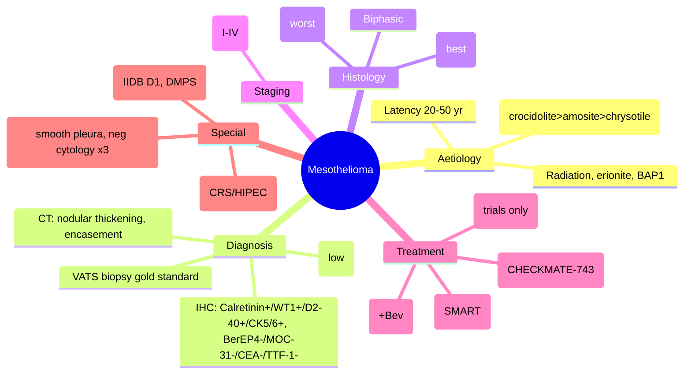

# Mesothelioma (Malignant Pleural Mesothelioma - MPM)

Related: [[Malignant pleural effusion]], [[Asbestosis]], [[Lung cancer]], [[Pleural aspiration and chest drain basics]], [[Talc pleurodesis]], [[Industrial compensation]]

> [!important]
> **Malignant pleural mesothelioma (MPM)** = primary malignancy of the **pleura** (rarely peritoneum/pericardium). **Asbestos exposure** is the **principal cause** (latency 20–50 years). **Poor prognosis** (median survival 9–12 months). Key FCPS/MRCP: **Asbestos link**, **immunohistochemistry** (Calretinin+, WT1+, D2-40+, CK5/6+, BerEP4-, MOC-31-, TTF-1-), **CT findings** (thickened pleura, nodularity, encasement), **BTS/NICE management** (chemotherapy: cisplatin+pemetrexed ± bevacizumab; immunotherapy: nivolumab+ipilimumab; radiotherapy for port sites; VATS for diagnosis/palliation), **benign asbestos pleural effusion (BAPE)** differential, **industrial compensation**.

## Learning Objectives
- Recognise **asbestos exposure history** and **latency period** (20–50 years)
- Interpret **CT chest** findings (unilateral pleural thickening, nodularity, mediastinal fixation, volume loss)
- Differentiate **MPM from metastatic adenocarcinoma** using **immunohistochemistry panel** (Calretinin, WT1, D2-40, CK5/6 vs BerEP4, MOC-31, CEA, TTF-1, Napsin A)
- Apply **BTS/NICE staging** (IMIG/TNM) and **prognostic scores** (EORTC, CALGB)
- Manage with **first-line chemotherapy** (cisplatin/carboplatin + pemetrexed ± bevacizumab) and **immunotherapy** (nivolumab + ipilimumab)
- Know **radiotherapy indications** (port site prophylaxis controversial, palliative for pain/chest wall)
- Diagnose **Benign Asbestos Pleural Effusion (BAPE)** — diagnosis of exclusion
- Guide patients on **industrial injuries disablement benefit** (UK)

## Definition
**Malignant pleural mesothelioma (MPM)** = primary malignant neoplasm arising from **mesothelial cells** of the **pleura** (90% pleural, 10% peritoneal, rare pericardial/tunica vaginalis).

**Incidence**: ~2,500/year in UK (peaking 2020s), male:female ~5:1, median age 70–75 years.

## Core Anatomy
### 1. Pleural anatomy relevant to mesothelioma
- **Visceral pleura** (covers lung) and **parietal pleura** (lines chest wall, diaphragm, mediastinum)
- **Pleural space** normally 10–20 mL serous fluid
- **Lymphatic drainage**: parietal pleura → mediastinal nodes → thoracic duct
- **Mesothelial cells** line both surfaces → malignant transformation

### 2. Spread patterns
- **Local**: Direct invasion of chest wall, diaphragm, pericardium, lung parenchyma, mediastinum
- **Lymphatic**: Ipsilateral then contralateral mediastinal nodes, supraclavicular
- **Haematogenous**: Liver, bone, brain, adrenal (late)
- **Transdiaphragmatic**: Peritoneal mesothelioma (10%)

### 3. Asbestos bodies
- **Asbestos fibres** (amphibole > chrysotile) inhaled → reach pleural space via lymphatics or direct penetration
- **Ferruginous bodies** (asbestos fibres coated in iron-protein) in lung tissue/pleural fluid = exposure marker
- **Pleural plaques** (calcified, diaphragmatic, posterolateral) = **exposure marker**, NOT mesothelioma (but increase risk)

## Core Physiology
### Carcinogenesis
1. **Asbestos fibres** (especially amphiboles: crocidolite, amosite) → phagocytosed by mesothelial cells/macrophages
2. **Frustrated phagocytosis** (long fibres) → ROS, RNS, chronic inflammation
3. **Genotoxic effects**: Chromosomal damage (deletions in 3p, 9p21/CDKN2A, 13q, 22q/NF2)
4. **Tumour suppressor loss**: **BAP1** (BRCA1-associated protein 1), **CDKN2A** (p16), **NF2** (merlin)
4. **Latency**: 20–50 years from first exposure to clinical disease

### Pathophysiology of symptoms
- **Pleural thickening** → restricts lung expansion → dyspnoea
- **Nodular encasement** → fixes mediastinum → superior vena cava syndrome, phrenic nerve palsy
- **Pleural effusion** (exudate, often haemorrhagic) → compression atelectasis
- **Chest wall invasion** → pain (intercostal nerves), palpable mass
- **Diaphragmatic invasion** → referred shoulder tip pain (phrenic nerve)

## Normal Values / Important Cut-offs
### Prognostic Scores
| Score | Factors | Risk Groups |
|-------|---------|-------------|
| **EORTC** | Stage, histology, performance status, LDH, WBC, platelets | Low/Intermediate/High (median OS 12–20 mo vs 6–9 mo) |
| **CALGB** | Performance status, histology, stage, platelets, LDH, age | Similar |
| **Lung Mesothelioma Prognostic Index (LMPI)** | Stage, histology, PS, LDH, platelets, NLR | Continuous |

### Histological Subtypes (WHO)
| Subtype | Frequency | Prognosis | Key Features |
|---------|-----------|-----------|--------------|
| **Epithelioid** | **~60%** | **Best** (median 12–24 mo) | Uniform cells, tubulopapillary, glandular; Calretinin+, WT1+, CK5/6+ |
| **Sarcomatoid** | ~10-20% | **Worst** (median 6–9 mo) | Spindle cells, desmoplastic; vimentin+, cytokeratin variable; resistant to chemo |
| **Biphasic (mixed)** | ~20-30% | Intermediate | Both epithelioid + sarcomatoid components (>10% each) |

### Staging (IMIG / TNM 8th Edition)
| Stage | Description | Median Survival |
|-------|-------------|-----------------|
| **IA** | Ipsilateral parietal ± visceral pleura, no nodal/metastatic | ~20–30 mo |
| **IB** | IA + visceral pleura involvement | ~18–25 mo |
| **II** | IB + ipsilateral hilar/internal mammary nodes | ~15–20 mo |
| **IIIA** | IIIA = locally advanced (chest wall, pericardium, diaphragm) + nodes | ~12–16 mo |
| **IIIB** | Contralateral nodes, supraclavicular, extensive local invasion | ~10–14 mo |
| **IV** | Distant metastases | ~6–9 mo |

## Classification
### By histology (as above)
### By site
- **Pleural** (90%) — MPM
- **Peritoneal** (10%) — often with ascites, better prognosis with CRS/HIPEC
- **Pericardial** (<1%)
- **Tunica vaginalis** (rare)

### By asbestos association
- **Occupational** (shipbuilding, construction, insulation, automotive)
- **Para-occupational** (family contact via contaminated work clothes)
- **Environmental** (near asbestos mines/factories)
- **Spontaneous** (no identifiable exposure — rare, <5%)

## Etiology / Causes
### Asbestos Types (Risk Hierarchy)
| Type | Fibre | Potency | Use |
|------|-------|---------|-----|
| **Crocidolite (blue)** | Amphibole | **Highest** | Insulation, cement |
| **Amosite (brown)** | Amphibole | **High** | Insulation board |
| **Chrysotile (white)** | Serpentine | Lower (but still causative) | Cement, brakes, textiles |
| **Tremolite/Actinolite/Anthophyllite** | Amphibole | High | Contaminants |

### Other Risk Factors
- **Radiation** (thoracic radiotherapy for lymphoma)
- **Erionite** (zeolite mineral, Turkey villages — extremely high risk)
- **SV40 virus** (controversial, possibly cofactor)
- **Genetic**: **BAP1 germline mutation** (mesothelioma predisposition syndrome — uveal melanoma, RCC, meningioma)

## Risk Factors
- **Occupational exposure** (shipyard, construction, power plants, automotive brake repair, asbestos mining/milling)
- **Duration/intensity** of exposure (dose-response)
- **Latency** 20–50 years (peak incidence 2020s in UK)
- **Male sex** (occupational exposure pattern)
- **Age >60** (latency)
- **Smoking** — **NOT a direct risk factor** for mesothelioma (but synergises for lung cancer)

## Pathophysiology (Detailed)
1. **Inhalation** of asbestos fibres → deposition at bifurcations, lower lobes
2. **Migration** to pleural space via lymphatics or direct penetration
3. **Mesothelial cell uptake** → frustrated phagocytosis (long fibres)
4. **Chronic inflammation** → ROS, cytokines (TNF-α, IL-6, IL-8)
5. **Genetic damage**: CDKN2A (p16) deletion 70%, NF2 mutation 40%, BAP1 loss 60%
6. **Clonal expansion** → malignant mesothelial cells
7. **Local invasion** → pleural thickening, nodularity, effusion
8. **Late dissemination** → nodes, contralateral, distant

## Clinical Features
### History
- **Dyspnoea** (progressive, effusion + restriction) — **most common**
- **Chest pain** (pleuritic, dull, chest wall invasion) — **common**
- **Weight loss**, anorexia, fatigue
- **Night sweats** (less common than TB)
- **Asbestos exposure history** (occupational, DIY, family) — **critical**

### Examination
- **Effusion signs**: dull percussion, reduced breath sounds, reduced expansion
- **Pleural thickening**: palpable nodules, chest wall fixation
- **Mediastinal fixation**: trachea central/pulled to affected side
- **Clubbing** (uncommon, <10%)
- **Superior vena cava obstruction** (late, mediastinal invasion)
- **Horner's syndrome** (apical invasion)
- **Phrenic nerve palsy** (diaphragmatic invasion)
- **Signs of peritoneal spread** (ascites, abdominal mass)

### Paraneoplastic
- **Hypoglycaemia** (IGF-II secretion, rare)
- **Thrombocytosis** (IL-6)
- **Hypercoagulability** (Troussseau's)

## Investigations
### 1. Imaging
**CXR (PA erect)**
- **Unilateral pleural effusion** (often large, haemorrhagic)
- **Pleural thickening** (diffuse, nodular, circumferential)
- **Volume loss** (ipsilateral hemithorax smaller)
- **Mediastinal shift** (fixed, not shifted by effusion)

**CT Thorax with IV contrast — KEY INVESTIGATION**
- **Pleural thickening** (>1 cm, nodular, circumferential = MPM)
- **"Encasement" of lung** (thickened visceral pleura)
- **Mediastinal fixation/invasion**
- **Chest wall/diaphragm invasion**
- **Nodal involvement** (ipsilateral → contralateral)
- **Contralateral pleural disease**
- **Peritoneal disease** (if present)
- **Volumetric assessment** (for surgery planning)

**PET-CT** (staging)
- **High SUV** in pleural thickening/nodules
- **Detects occult nodal/distant mets** (upstages 15-20%)

**MRI** (selected)
- **Chest wall/diaphragm invasion** (better soft tissue)
- **Brachial plexus invasion** (Pancoast-type)

### 2. Pleural Fluid Analysis
**Diagnostic aspiration (US-guided)**
| Parameter | MPM Typical |
|-----------|-------------|
| **Appearance** | Serosanguineous / haemorrhagic |
| **Exudate** | Light's criteria positive |
| **Cell count** | Variable (often neutrophilic early, lymphocytic later) |
| **Cytology** | **Positive ~30-40% only** (low sensitivity) |
| **Biomarkers** | **Mesothelin** (↑ in epithelioid, not sarcomatoid), **Fibulin-3**, **Osteopontin** (not routine) |

> **FCPS/MRCP tip**: **Fluid cytology sensitivity only 30-40%** for MPM. **Negative cytology does NOT exclude** — need **thoracoscopic biopsy**.

### 3. Tissue Diagnosis (Gold Standard)
| Method | Yield | Indication |
|--------|-------|------------|
| **Image-guided cutting needle** (US/CT) | 60-70% | First-line if accessible, but **risk of tract seeding** |
| **Thoracoscopic (VATS/LAT) biopsy** | **>95%** | **Preferred** — multiple biopsies, direct vision, allows talc poudrage |
| **Open biopsy** | Rarely needed | Failed VATS |

### 4. Immunohistochemistry (CRITICAL for Differentiation)
| Marker | MPM (Epithelioid) | Metastatic Adenocarcinoma (Lung/Breast/GI) |
|--------|-------------------|--------------------------------------------|
| **Calretinin** | **Positive** | Negative |
| **WT1** | **Positive** | Negative (except ovarian/ genital) |
| **D2-40 (Podoplanin)** | **Positive** | Negative |
| **CK5/6** | **Positive** | Negative |
| **BerEP4 (Epithelial antigen)** | **Negative** | **Positive** |
| **MOC-31** | **Negative** | **Positive** |
| **CEA** | **Negative** | **Positive** |
| **TTF-1** | **Negative** | **Positive** (lung primary) |
| **Napsin A** | **Negative** | **Positive** (lung adenocarcinoma) |
| **ER/PR** | Negative | Positive (breast) |
| **PAX8** | Negative | Positive (renal, ovarian, thyroid) |

> **Diagnostic panel**: **Calretinin + WT1 + D2-40 + CK5/6 (mesothelial) + BerEP4 + MOC-31 + CEA + TTF-1 + Napsin A (adenocarcinoma)**. **At least 2 mesothelial + 2 adenocarcinoma markers**.

### 5. Staging Workup
- **CT chest/abdomen** (+pelvis if peritoneal suspected)
- **PET-CT** (nodal/metastatic staging)
- **EBUS/EUS** if nodal staging unclear
- **MRI** if chest wall/brachial plexus invasion suspected
- **Laparoscopy** if peritoneal involvement suspected

## Interpretation Frameworks
### 1. MPM vs Metastatic Adenocarcinoma (Pleural Fluid / Biopsy)
| Feature | MPM | Metastatic Adenocarcinoma |
|---------|-----|---------------------------|
| **Pleural thickening** | Diffuse, nodular, circumferential | Focal, mass-like |
| **Effusion** | Haemorrhagic, large | Variable |
| **Cytology sensitivity** | Low (30-40%) | Higher (50-70%) |
| **Immunohistochemistry** | Calretinin+, WT1+, D2-40+, CK5/6+, BerEP4-, MOC-31-, CEA-, TTF-1- | Calretinin-, WT1-, D2-40-, CK5/6-, BerEP4+, MOC-31+, CEA+, TTF-1+ (lung) |
| **Mesothelin** | Elevated (epithelioid) | Usually normal |

### 2. Benign Asbestos Pleural Effusion (BAPE) vs MPM
| Feature | BAPE | MPM |
|---------|------|-----|
| **Asbestos exposure** | Yes | Yes |
| **Effusion** | Exudate, often haemorrhagic | Exudate, haemorrhagic |
| **Cytology** | **Negative ×3** (mesothelial hyperplasia) | Positive (30-40%) / Negative |
| **CT pleura** | **Smooth, <1 cm, no nodules** | **Nodular, >1 cm, circumferential** |
| **Pleural biopsy** | **Non-neoplastic** (fibrosis, mesothelial hyperplasia) | **Malignant mesothelial proliferation** |
| **Course** | Self-limiting (months), may recur | Progressive |

> **BAPE = diagnosis of exclusion** after negative cytology ×3, negative biopsy, smooth pleura on CT.

### 3. Pleural Plaques vs Mesothelioma
- **Plaques**: **Circumscribed**, **calcified**, **posterolateral/diaphragmatic** parietal pleura, **no malignant potential** (but exposure marker)
- **Mesothelioma**: **Diffuse**, **nodular**, **visceral + parietal**, **malignant**

## Diagnosis
**Definitive**: **Histology + Immunohistochemistry** (Calretinin+, WT1+, D2-40+, CK5/6+, BerEP4-, MOC-31-, CEA-, TTF-1-)
**Clinical**: Asbestos exposure + compatible imaging + exclusion of metastasis

**Diagnostic algorithm**:
```
Suspected MPM (asbestos exposure + unilateral effusion/thickening)
    ↓
US-guided pleural aspiration → cytology (30-40% yield)
    ↓
If negative + high suspicion → **VATS/LAT biopsy** (gold standard, >95%)
    ↓
Immunohistochemistry panel (mesothelial vs adenocarcinoma markers)
    ↓
CT/PET-CT staging (IMIG/TNM)
    ↓
Multidisciplinary discussion (respiratory, oncology, thoracic surgery, palliative)
```

## Differential Diagnosis
| Differential | Key Differentiators |
|--------------|---------------------|
| **Metastatic adenocarcinoma** (lung, breast, ovarian, gastric) | Focal pleural mass, adenocarcinoma markers +ve (BerEP4, MOC-31, CEA, TTF-1), mesothelial markers -ve |
| **Benign asbestos pleural effusion (BAPE)** | Negative cytology ×3, smooth thin pleura on CT, self-limiting, diagnosis of exclusion |
| **Pleural plaques** | Circumscribed, calcified, parietal only, no effusion typically, benign |
| **TB pleuritis** | Lymphocytic exudate, ADA >40, low glucose, AFB/PCR +ve, chronic |
| **Rheumatoid pleuritis** | Very low glucose, low pH, high LDH, RF +ve in fluid, known RA |
| **Pseudomesotheliomatous hyperplasia** (post-infection, post-TB, drug) | Reactive mesothelial proliferation, benign cytology, resolves with treatment of underlying cause |

## Management
### 1. Multidisciplinary Team (MDT) — Mandatory
- Respiratory physician, thoracic surgeon, clinical oncologist, radiologist, pathologist, palliative care, specialist nurse

### 2. First-Line Systemic Therapy
| Regimen | Population | Evidence |
|---------|------------|----------|
| **Cisplatin 75 mg/m² + Pemetrexed 500 mg/m²** (Day 1 q21d) + **Folic acid + B12** | **Fit patients** (PS 0-1) | **MAPS trial** (if bevacizumab added) |
| **Carboplatin AUC 5 + Pemetrexed** + Folic acid + B12 | **Unfit for cisplatin** (renal, neuropathy, elderly) | Similar efficacy, better tolerance |
| **Nivolumab 3 mg/kg + Ipilimumab 1 mg/kg** q3wk ×4 → **Nivolumab 480 mg q4wk** | **All comers** (PS 0-1) | **CHECKMATE-743** (OS benefit vs chemo) |
| **Nivolumab + Ipilimumab** (checkmate-743) | **First-line preferred for non-epithelioid / unfit for chemo** | Improved OS in sarcomatoid/biphasic |

> **FCPS/MRCP tip**: **Pemetrexed requires folic acid 350–1000 µg daily (start 1 week before) + vitamin B12 1000 µg IM q3 cycles** to reduce toxicity (mucositis, myelosuppression). **Cisplatin hydration** mandatory.

### 3. Surgery (Controversial / Selected)
| Procedure | Indication | Evidence |
|-----------|------------|----------|
| **EPP (Extrapleural Pneumonectomy)** — lung + pleura + pericardium + diaphragm | **Highly selected** stage I-IIIA epithelioid, N0, good PS, specialist centre | **MARS 2** (no survival benefit vs no surgery); **MARS 1** (harm) |
| **P/D (Pleurectomy/Decortication)** — pleurectomy + lung sparing | More common now, lower morbidity | **MARS 2** compared P/D vs no surgery — ongoing |
| **Partial pleurectomy** | Palliation (trapped lung, effusion) | Symptom control |

> **Current consensus**: **Surgery only in clinical trials / highly selected epithelioid early stage** at specialist centres. **Not standard of care**.

### 4. Radiotherapy
| Indication | Dose/Technique |
|------------|----------------|
| **Port site prophylaxis** (post-VATS/drain) | **Controversial** — **SMART trial** (no benefit), **NICE/BTS: not routine** |
| **Palliative** (chest wall pain, mediastinal compression) | 20 Gy / 5 fractions or 30 Gy / 10 fractions |
| **Hemithoracic radiotherapy** (post-EPP) | Historical (SMART trial), high toxicity (pneumonitis) |

### 4. Second-Line / Relapsed
- **Nivolumab ± Ipilimumab** (if not used first-line)
- **Pembrolizumab** (PD-L1 ≥1%)
- **Gemcitabine / Vinorelbine** (single agent)
- **Clinical trials** (ADCs, CAR-T, targeted agents)

### 5. Symptom Control (Palliative)
- **Dyspnoea**: IPC (first-line for trapped lung), talc pleurodesis (if expandible), opioids, benzodiazepines, fan therapy
- **Pain**: WHO ladder, intercostal nerve block, radiotherapy, PCA
- **Fatigue/anorexia**: Dexamethasone short course, nutritional support
- **Ascites** (peritoneal mets): Paracentesis, IP chemotherapy

## Drug Interactions / Contraindications / Cautions
### Pemetrexed
- **Folic acid + B12 mandatory** (reduce mucositis, myelosuppression)
- **Renal impairment** (CrCl <45: avoid cisplatin; CrCl <30: avoid pemetrexed)
- **NSAIDs** (avoid 2 days before/after cisplatin — renal)
- **Penicillins** (avoid — ↓ pemetrexed clearance)

### Cisplatin
- **Hydration** (pre/post 2–3L with mannitol/furosemide) — nephroprotection
- **Ototoxicity, neuropathy, nausea** — monitor, prophylactic antiemetics (5-HT3 + NK1 + dexamethasone)

### Immunotherapy (Nivolumab/Ipilimumab)
- **Immune-related AEs**: colitis, hepatitis, pneumonitis, endocrinopathies, dermatitis
- **Steroids ≥1 mg/kg prednisolone** for Grade ≥2
- **Avoid** in active autoimmune disease (relative)

## Procedures / Indications / Contraindications
### VATS/LAT Biopsy
**Indication**: Suspected MPM (diagnostic gold standard), staging, talc poudrage
**Contraindication**: Unfit for GA, extensive adhesions, no pleural space
**Complications**: Air leak, bleeding, tract seeding (rare with port site radiotherapy - controversial)

### Talc Pleurodesis (via VATS poudrage or drain slurry)
**Indication**: Expandible lung, symptomatic effusion, good prognosis
**Talc**: 4g graded in 50 mL saline
**Contraindication**: Trapped lung, active infection, main bronchus obstruction

### IPC (Indwelling Pleural Catheter)
**Indication**: Trapped lung, poor prognosis, failed pleurodesis, patient preference
**Advantage**: Outpatient, immediate relief, spontaneous pleurodesis ~30-50%

## Procedure Mini-Sections
### VATS Biopsy + Talc Poudrage
1. **GA, single-lung ventilation**
2. **3–4 ports** (camera 10mm, instruments 5–10mm)
3. **Inspect** pleural cavity — note extent, nodules, lung entrapment
4. **Multiple biopsies** (parietal + visceral, ≥5 samples, >1 cm deep)
5. **Talc poudrage** (4g graded) under direct vision if expandible lung
6. **Chest drain** (24–28F), underwater seal
7. **Post-op**: Analgesia (epidural/PCA), mobilisation, drain until <150 mL/day

## Complications
### Disease-related
- **Superior vena cava obstruction** (mediastinal invasion)
- **Horner's syndrome** (apical invasion)
- **Phrenic nerve palsy** (diaphragmatic invasion)
- **Brachial plexopathy** (apical/chest wall)
- **Massive haemothorax** (vascular erosion)
- **Trapped lung** (visceral peel)
- **Distant metastases** (liver, bone, brain, adrenal)

### Treatment-related
- **Chemo**: Myelosuppression, nephrotoxicity (cisplatin), neuropathy, mucositis
- **Immunotherapy**: Pneumonitis (monitor — fatal if missed), colitis, hepatitis, endocrinopathy
- **Radiotherapy**: Pneumonitis (hemithoracic), oesophagitis, fibrosis
- **Surgery**: Air leak (prolonged), empyema, arrhythmia (post-EPP), respiratory failure

## Red Flags / Emergencies
- **SVC obstruction** → urgent oncology/radiotherapy/stent
- **Massive haemothorax** → BAE, surgery
- **Immunotherapy pneumonitis** → **high-dose steroids (1-2 mg/kg prednisolone) + hold immunotherapy**
- **Septic shock** (post-procedure) → antibiotics, source control
- **Acute dyspnoea** (trapped lung, large effusion) → urgent drainage

## Special Situations
### Peritoneal Mesothelioma
- **10% of mesothelioma**, asbestos exposure
- **Ascites**, abdominal pain, distension
- **CRS/HIPEC** (cytoreductive surgery + heated intraperitoneal chemo) — **only curative-intent option**, median 30–50 mo
- **Systemic chemo**: Cisplatin + pemetrexed (less effective than pleural)

### BAPE (Benign Asbestos Pleural Effusion)
- **Asbestos exposure**, exudate, **negative cytology ×3**, **smooth pleura on CT**
- **Self-limiting** (weeks-months), may recur
- **Diagnosis of exclusion** (negative VATS biopsy)
- **No increased mesothelioma risk** (controversial — some say yes)

### Pleural Plaques
- **Circumscribed calcified plaques**, posterolateral/diaphragmatic parietal pleura
- **Benign**, **no malignant potential**, **exposure marker**
- **No treatment needed**, reassurance
- **Compensable** in UK (Industrial Injuries Disablement Benefit — prescribed disease D1)

### Asbestos-Related Compensation (UK)
| Scheme | Criteria |
|--------|----------|
| **Industrial Injuries Disablement Benefit (IIDB)** — Prescribed Disease D1 (mesothelioma), D3 (asbestosis), D5 (bilateral diffuse pleural thickening), D9 (pleural plaques — only if symptomatic) | **Occupational exposure** (listed occupations), medical diagnosis |
| **Diffuse Mesothelioma Payment Scheme (DMPS)** | Mesothelioma, unable to trace employer/insurer |
| **Civil litigation** | Employer negligence, exposure >20 years ago |

## Prognosis
| Factor | Better Prognosis |
|--------|------------------|
| **Histology** | **Epithelioid** > Biphasic > Sarcomatoid |
| **Stage** | **Early (I-II)** > Advanced (III-IV) |
| **Performance status** | **PS 0-1** |
| **Age** | **<70** |
| **Biomarkers** | Low LDH, normal platelets, low NLR, low mesothelin |
| **Treatment** | **Multimodal (if eligible)** / Immunotherapy (CHECKMATE-743) |

**Overall median survival**: 9–12 months (epithelioid 12–24 mo, sarcomatoid 6–9 mo)

## Topic Correlation
- [[Malignant pleural effusion]] — effusion management
- [[Asbestosis]] — asbestos exposure, pleural plaques
- [[Lung cancer]] — differential (TTF-1, Napsin A)
- [[Pleural aspiration and chest drain basics]] — diagnosis
- [[Talc pleurodesis]] — effusion control
- [[Industrial compensation]] — UK benefits

## FCPS/MRCP High-Yield Points
1. **Asbestos exposure** (latency 20–50 years) — **crocidolite > amosite > chrysotile**
2. **Pleural plaques** = exposure marker (calcified, parietal, benign); **MPM** = diffuse nodular pleural thickening
3. **Immunohistochemistry**: **Calretinin+, WT1+, D2-40+, CK5/6+** (mesothelial); **BerEP4-, MOC-31-, CEA-, TTF-1-** (adenocarcinoma)
4. **Cytology sensitivity low** (30-40%) → **VATS biopsy gold standard**
5. **Histology**: Epithelioid (best), Biphasic, Sarcomatoid (worst)
6. **First-line**: **Cisplatin/Carboplatin + Pemetrexed + Folic acid/B12** (± Bevacizumab); **Nivolumab + Ipilimumab** (CHECKMATE-743 — OS benefit)
7. **Surgery**: **Not standard** (MARS 2 no benefit); only trials/highly selected
8. **Radiotherapy**: **Port site prophylaxis NOT routine** (SMART trial negative)
9. **BAPE** = diagnosis of exclusion (smooth pleura, neg cytology ×3, neg biopsy)
10. **Compensation**: IIDB (Prescribed Disease D1), DMPS, civil litigation

## Common Viva Questions
1. Asbestos types and latency
2. Pleural plaques vs mesothelioma vs BAPE
3. Immunohistochemistry panel for mesothelioma vs adenocarcinoma
4. Staging (IMIG/TNM) and prognostic factors
5. First-line chemotherapy (cisplatin+pemetrexed, folic acid/B12) and immunotherapy
6. Surgery controversy (MARS trials)
7. Radiotherapy port site prophylaxis (SMART trial)
8. BAPE diagnostic criteria
9. UK compensation schemes

## Common Confusions / Exam Traps
- **Pleural plaques = mesothelioma** — WRONG (plaques = exposure marker, benign)
- **Cytology negative = no mesothelioma** — WRONG (sensitivity 30-40%, need VATS biopsy)
- **Chrysotile (white) asbestos = safe** — WRONG (still causes mesothelioma, less potent)
- **Surgery standard for early stage** — WRONG (MARS 2: no survival benefit for P/D; EPP harmful)
- **Port site radiotherapy routine** — WRONG (SMART trial negative, NICE says not routine)
- **Pemetrexed without folic acid/B12** — WRONG (severe toxicity)
- **BAPE = early mesothelioma** — WRONG (benign, self-limiting, diagnosis of exclusion)
- **All mesothelioma = epithelioid** — WRONG (sarcomatoid 10-20%, biphasic 20-30%, worse prognosis)

## Mnemonics
- **ASBESTOS TYPES**: **C**rocidolite (blue, worst) > **A**mosite (brown) > **C**hrysotile (white, least)
- **MESOTHELIOMA IHC**: **C**alretinin, **W**T1, **D**2-40, **C**K5/6 = **Mesothelial +**; **B**erEP4, **M**OC-31, **C**EA, **T**TF-1 = **Adeno +** (Mesothelial = CWDT, Adeno = BMCT)
- **MPM HISTOLOGY**: **E**pithelioid (best), **B**iphasic (middle), **S**arcomatoid (worst) — **EBS**
- **BAPE**: **B**enign **A**sbestos **P**leural **E**ffusion = **S**mooth pleura, **N**eg cytology x3, **E**xclusion diagnosis
- **MAPS/CHECKMATE**: **M**APS = Cis/Pem + **Bev**; **CHECKMATE-743** = **Nivo + Ipi** (OS benefit)

## Mind Map


## Flowchart
```mermaid
flowchart TD
    A[Suspected MPM\nAsbestos exposure + unilateral effusion/thickening] --> B[CT Thorax + PET-CT]
    B --> C[US-guided Aspiration\nCytology x3]
    C --> D{Cytology Positive?}
    D -- YES --> E[MPM Confirmed → Staging → MDT]
    D -- NO --> F[VATS/LAT Biopsy\nMultiple samples >1cm deep]
    F --> G{IHC Panel}
    G -- Mesothelial + → H[MPM Confirmed]
    G -- Adenocarcinoma + → I[Metastatic → Find Primary]
    H --> J[Staging CT/PET-CT\nIMIG/TNM]
    J --> K[MDT Discussion]
    K --> L{Treatment Decision}
    L -- Fit, epithelioid/biphasic --> M[Cisplatin/Carboplatin + Pemetrexed\n± Bevacizumab\n+ Folic acid/B12]
    L -- Unfit / sarcomatoid --> N[Nivolumab + Ipilimumab\n(CHECKMATE-743)]
    L -- Poor PS / advanced --> O[Best supportive care\nIPC / talc / palliative RT]
```

## Suggested Visuals / Image Notes
- CT: diffuse nodular pleural thickening, lung encasement, volume loss
- PET-CT: high SUV pleural rind
- IHC panel: mesothelial vs adenocarcinoma markers
- VATS biopsy technique
- Pleural plaques vs mesothelioma comparison
- BAPE smooth pleura vs MPM nodular
- Compensation flowchart

## Suggested Video References
- BTS mesothelioma guideline
- NICE NG199 mesothelioma
- MAPS trial (cisplatin/pemetrexed/bevacizumab)
- CHECKMATE-743 (nivolumab+ipilimumab)
- MARS 2 trial (surgery)
- SMART trial (port site RT)
- VATS biopsy for mesothelioma
- Asbestos exposure and compensation

## One-Page Revision Summary
- **Asbestos**: crocidolite > amosite > chrysotile, latency 20-50 yr
- **Plaques** = exposure marker (calcified, parietal, benign); **MPM** = diffuse nodular thickening
- **IHC**: Calretinin+, WT1+, D2-40+, CK5/6+ (mesothelial); BerEP4-, MOC-31-, CEA-, TTF-1- (adeno)
- **Cytology 30-40%** → VATS biopsy gold standard
- **Histology**: Epithelioid > Biphasic > Sarcomatoid
- **First-line**: Cis/Carbo + Pem + Folate/B12 (± Bev); Nivo+Ipi (CHECKMATE-743)
- **Surgery**: MARS 2 no benefit (trials only)
- **RT port site**: NOT routine (SMART negative)
- **BAPE**: smooth pleura, neg cytology x3, exclusion diagnosis
- **Compensation**: IIDB D1, DMPS, civil

## 24-Hour Recall Prompts
- Asbestos types and potency order
- IHC panel (mesothelial vs adeno markers)
- Cytology sensitivity and next step
- Histology subtypes and prognosis
- First-line chemo (+folate/B12) and immuno
- Surgery trial (MARS 2) and RT (SMART)
- BAPE criteria
- UK compensation schemes

## 7-Day / 15-Day / 30-Day Revision Tracker
- [ ] Day 1 completed
- [ ] 24-hour recall completed
- [ ] Day 7 revision completed
- [ ] Day 15 revision completed
- [ ] Day 30 revision completed

## Must Know / Should Know / Nice to Know
### Must Know
- Asbestos link, latency, types
- CT findings (diffuse nodular thickening)
- IHC panel (mesothelial vs adenocarcinoma markers)
- Cytology low sensitivity → VATS biopsy
- Histology subtypes and prognosis
- First-line chemo (cisplatin/carboplatin + pemetrexed + folate/B12) and immuno (nivo+ipi)
- Surgery not standard (MARS 2), port site RT not routine (SMART)
- BAPE = exclusion diagnosis
- UK compensation (IIDB D1, DMPS)

### Should Know
- Staging (IMIG/TNM)
- Prognostic scores (EORTC, CALGB)
- Biomarkers (mesothelin, fibulin-3)
- Peritoneal mesothelioma (CRS/HIPEC)
- Para-occupational/environmental exposure
- Immunotherapy irAE management

### Nice to Know
- BAP1 germline mutation syndrome
- Erionite exposure (Turkey)
- SV40 controversy
- Novel therapies (ADCs, CAR-T, targeted)
- Cost-effectiveness of screening (no proven benefit)
- Mesothelioma registries

## Self-Test Scorecard
- Understanding: /10
- Recall: /10
- MCQ Performance: /10
- SBA Performance: /10
- Viva Confidence: /10
- Total: /50

> [!tip]
> Interpretation: <35 = weak topic, 35-44 = acceptable but insecure, 45+ = strong exam-ready topic.

## Exam Answer Modes
### Long Answer Skeleton
- Aetiology (asbestos types, latency, other causes)
- Clinical features, asbestos exposure history
- Imaging (CT/PET findings)
- Diagnosis: cytology (low sensitivity) → VATS biopsy (gold standard) → IHC panel
- Histological subtypes and prognostic significance
- Staging (IMIG/TNM)
- Management: first-line chemo (cisplatin/carboplatin+pemetrexed+folate/B12±bev), immunotherapy (nivo+ipi), surgery (MARS 2), RT (SMART), palliative
- BAPE differential
- UK compensation schemes

### Short Note Skeleton
- Asbestos types + latency box
- IHC panel table (mesothelial vs adeno markers)
- Diagnostic algorithm flowchart
- Histology + prognosis table
- Treatment algorithm (chemo vs immuno vs palliative)
- BAPE box
- Compensation box

### Viva One-Liners
- "Asbestos: crocidolite (blue) > amosite (brown) > chrysotile (white); latency 20–50 years"
- "Pleural plaques = exposure marker (calcified, parietal, benign); Mesothelioma = diffuse nodular visceral+parietal thickening"
- "IHC: Calretinin+, WT1+, D2-40+, CK5/6+ = mesothelial; BerEP4-, MOC-31-, CEA-, TTF-1- = adenocarcinoma"
- "Cytology sensitivity 30-40% → VATS biopsy gold standard for diagnosis"
- "Histology: Epithelioid (best, 12-24 mo) > Biphasic > Sarcomatoid (worst, 6-9 mo)"
- "First-line: Cisplatin/Carboplatin + Pemetrexed + Folic acid 350-1000µg daily + B12 1000µg IM q3cyc (± Bevacizumab 15mg/kg)"
- "Immunotherapy: Nivolumab + Ipilimumab (CHECKMATE-743) — OS benefit, especially sarcomatoid"
- "Surgery: MARS 2 (P/D vs no surgery) — no survival benefit; EPP (MARS 1) harmful"
- "Radiotherapy: Port site prophylaxis NOT routine (SMART trial negative)"
- "BAPE: Asbestos exposure + exudate + negative cytology ×3 + smooth pleura on CT + negative VATS biopsy = diagnosis of exclusion"
- "UK compensation: IIDB Prescribed Disease D1 (mesothelioma), D3 (asbestosis), D5 (diffuse pleural thickening), D9 (plaques if symptomatic); DMPS if no employer found"

### Ward-Case Discussion Points
- 72M former shipyard worker, dyspnoea, CT: R diffuse nodular pleural thickening, volume loss, effusion → VATS biopsy → epithelioid MPM, stage IIIA → carboplatin + pemetrexed + folate/B12 (cisplatin contraindicated - renal)
- 55F para-occupational exposure (husband's work clothes), L effusion, CT smooth pleura, neg cytology ×3, neg VATS biopsy → BAPE → reassurance, monitor, IIDB D9 claim for plaques
- 60M sarcomatoid MPM, PS 1, stage IV → nivolumab + ipilimumab (CHECKMATE-743 showed greatest benefit in non-epithelioid) → monitor for pneumonitis, colitis

### Last-Night-Before-Exam Sheet
- Asbestos: Crocidolite > Amosite > Chrysotile, 20-50yr latency
- Plaques = exposure marker (benign); MPM = diffuse nodular thickening
- IHC: Calretinin/WT1/D2-40/CK5/6 + = mesothelial; BerEP4/MOC-31/CEA/TTF-1 + = adeno
- Cytology 30-40% → VATS biopsy
- Histology: Epithelioid > Biphasic > Sarcomatoid
- Chemo: Cis/Carbo + Pem + Folate/B12 (± Bev)
- Immuno: Nivo + Ipi (CHECKMATE-743)
- Surgery: MARS 2 no benefit; RT: SMART no port site RT
- BAPE: smooth pleura, neg cytology x3, exclusion
- Comp: IIDB D1, DMPS

## Summary
**Malignant pleural mesothelioma (MPM)** = primary pleural malignancy, **asbestos exposure** (crocidolite > amosite > chrysotile, latency 20–50 years). **CT**: diffuse nodular pleural thickening, lung encasement, volume loss. **Diagnosis**: cytology sensitivity **30-40%** → **VATS biopsy gold standard** → **IHC**: Calretinin+, WT1+, D2-40+, CK5/6+ (mesothelial); BerEP4-, MOC-31-, CEA-, TTF-1- (adenocarcinoma). **Histology**: Epithelioid (best, 12–24 mo) > Biphasic > Sarcomatoid (worst, 6–9 mo). **First-line**: **Cisplatin/Carboplatin + Pemetrexed + Folic acid/B12** (± Bevacizumab); **Nivolumab + Ipilimumab** (CHECKMATE-743, OS benefit, especially non-epithelioid). **Surgery**: **MARS 2 — no survival benefit** (trials only). **Radiotherapy**: **Port site prophylaxis NOT routine** (SMART trial negative). **BAPE** = smooth pleura, negative cytology ×3, negative biopsy = diagnosis of exclusion. **UK Compensation**: IIDB Prescribed Disease D1 (mesothelioma), DMPS, civil litigation.

## MCQs (10)
1. **Most potent asbestos type** for mesothelioma risk:
   A. Chrysotile (white)
   B. **Crocidolite (blue)**
   C. Amosite (brown)
   D. Tremolite

2. **Latency period** from asbestos exposure to mesothelioma:
   A. 5–10 years
   B. 10–15 years
   C. **20–50 years**
   D. 1–5 years

3. **Pleural plaques** — which statement is TRUE?
   A. Premalignant, progress to mesothelioma
   B. **Benign exposure marker, calcified, parietal pleura**
   C. Require surgical resection
   D. Always associated with effusion

4. **Immunohistochemistry** — mesothelioma POSITIVE markers:
   A. BerEP4, MOC-31, CEA, TTF-1
   B. **Calretinin, WT1, D2-40, CK5/6**
   C. Napsin A, TTF-1, p40
   D. CD30, CD15, PAX5

5. **Cytology sensitivity** for mesothelioma:
   A. 80-90%
   B. 60-70%
   C. **30-40%**
   D. 10-20%

6. **Histological subtype** with BEST prognosis:
   A. Sarcomatoid
   B. Biphasic
   C. **Epithelioid**
   D. Desmoplastic

7. **First-line chemotherapy** for mesothelioma (MAPS trial):
   A. Cisplatin + Gemcitabine
   B. **Cisplatin/Carboplatin + Pemetrexed + Folic acid/B12 (± Bevacizumab)**
   C. Carboplatin + Paclitaxel
   D. Pemetrexed alone

8. **CHECKMATE-743** trial — immunotherapy regimen showing OS benefit:
   A. Pembrolizumab monotherapy
   B. **Nivolumab + Ipilimumab**
   C. Atezolizumab + Bevacizumab
   D. Durvalumab + Tremelimumab

9. **MARS 2 trial** (surgery for mesothelioma) — conclusion:
   A. P/D improves survival
   B. EPP improves survival
   C. **No survival benefit for P/D vs no surgery**
   D. Surgery standard for stage I-II

10. **Benign Asbestos Pleural Effusion (BAPE)** diagnosis requires:
    A. Positive cytology for mesothelial cells
    B. **Negative cytology ×3, smooth pleura on CT, negative VATS biopsy (exclusion diagnosis)**
    C. Elevated mesothelin
    D. Pleural plaques on CT

## SBA Questions (10)
1. A 68M former lagger, cough, weight loss, R pleural effusion. CT: diffuse nodular pleural thickening, volume loss. VATS biopsy: epithelioid mesothelioma. Renal function: eGFR 35. First-line chemo?
   A. Cisplatin + Pemetrexed
   B. **Carboplatin AUC 5 + Pemetrexed + Folic acid/B12**
   C. Cisplatin + Gemcitabine
   D. Pemetrexed alone

2. A 55F para-occupational exposure, L effusion. CT: smooth pleural thickening <1cm, no nodules. Cytology negative ×3. VATS biopsy: benign. Diagnosis?
   A. Early mesothelioma
   B. **Benign Asbestos Pleural Effusion (BAPE)**
   C. TB pleuritis
   D. Rheumatoid effusion

3. Immunohistochemistry panel to differentiate mesothelioma from lung adenocarcinoma:
   A. TTF-1, Napsin A, p40, CK5/6
   B. **Calretinin, WT1, D2-40, CK5/6 (mesothelial) + BerEP4, MOC-31, CEA, TTF-1 (adeno)**
   C. Calretinin, WT1, D2-40, CK5/6 only
   D. CEA, CA125, CA19-9, CEA

4. A 60M sarcomatoid mesothelioma, stage IV, PS 1. Best first-line treatment?
   A. Carboplatin + Pemetrexed
   B. **Nivolumab + Ipilimumab (CHECKMATE-743 — greatest benefit in non-epithelioid)**
   C. Best supportive care only
   C. Cisplatin + Pemetrexed + Bevacizumab

5. Port site radiotherapy after VATS biopsy for mesothelioma:
   A. Routine for all
   B. **Not routine (SMART trial negative)**
   C. Only if malignant cells in drain
   D. Only for sarcomatoid

6. Patient with mesothelioma, compromised lung function (FEV1 45%), trapped lung on CT. Best dyspnoea palliation?
   A. Talc pleurodesis
   B. VATS parietal pleurectomy
   C. **Indwelling pleural catheter (IPC)**
   D. Repeated therapeutic aspiration

7. Asbestos exposure history — which occupation has HIGHEST risk?
   A. Office worker in 1980s building
   B. **Shipyard insulation worker (1960s-70s)**
   C. Teacher in school with asbestos ceiling tiles
   D. Resident near asbestos factory (environmental)

8. Industrial Injuries Disablement Benefit (IIDB) prescribed disease for mesothelioma:
   A. D3
   B. **D1**
   C. D5
   D. D9

9. Mesothelioma with epithelioid histology, stage II, PS 0. MARS 2 trial relevance:
   A. Surgery standard of care
   B. **Surgery not standard; only in clinical trials / highly selected centres**
   C. EPP recommended
   D. Extrapleural pneumonectomy improves survival

10. Diffuse Mesothelioma Payment Scheme (DMPS) eligibility:
    A. All mesothelioma patients
    B. **Mesothelioma where employer/insurer cannot be traced**
    C. Only occupational exposure
    D. Only if IIDB claim failed

## Flashcards
- Q: Asbestos potency order
  A: Crocidolite > Amosite > Chrysotile
- Q: Latency period
  A: 20-50 years
- Q: Pleural plaques
  A: Benign exposure marker, calcified, parietal
- Q: Mesothelioma IHC +
  A: Calretinin, WT1, D2-40, CK5/6
- Q: Mesothelioma IHC -
  A: BerEP4, MOC-31, CEA, TTF-1
- Q: Cytology sensitivity
  A: 30-40%
- Q: Best histology
  A: Epithelioid
- Q: First-line chemo
  A: Cis/Carbo + Pem + Folate/B12 (+Bev)
- Q: Immuno OS benefit
  A: Nivo+Ipi (CHECKMATE-743)
- Q: Surgery trial
  A: MARS 2 no benefit
- Q: BAPE
  A: Smooth pleura, neg cytology x3, exclusion
- Q: Compensation
  A: IIDB D1, DMPS

## Answer Key with Explanations
### MCQs
1. **B** — Crocidolite (blue amphibole) highest mesothelioma potency.
2. **C** — Latency 20-50 years (peak incidence 2020s UK).
3. **B** — Plaques = benign exposure marker (calcified, parietal).
4. **B** — Mesothelial markers: Calretinin, WT1, D2-40, CK5/6.
5. **C** — Cytology sensitivity only 30-40% for MPM.
6. **C** — Epithelioid best prognosis (12-24 mo).
7. **B** — MAPS: Cis/Carbo + Pem + Folate/B12 (± Bev 15mg/kg).
8. **B** — CHECKMATE-743: Nivo + Ipi OS benefit vs chemo.
9. **C** — MARS 2: no survival benefit for P/D vs no surgery.
10. **B** — BAPE = exclusion diagnosis (smooth pleura, neg cytology ×3, neg biopsy).

### SBAs
1. **B** — eGFR 35 = cisplatin contraindicated → carboplatin + pemetrexed.
2. **B** — Smooth pleura, neg cytology ×3, neg biopsy = BAPE.
3. **B** — Need both mesothelial (+) and adenocarcinoma (+) panels for differentiation.
4. **B** — CHECKMATE-743: greatest OS benefit in sarcomatoid/biphasic with Nivo+Ipi.
5. **B** — SMART trial: port site RT no benefit → not routine.
6. **C** — Trapped lung = pleurodesis contraindicated → IPC.
7. **B** — Shipyard insulation (crocidolite/amosite) highest risk.
8. **B** — IIDB Prescribed Disease D1 = mesothelioma.
9. **B** — MARS 2: surgery not standard; trials only.
10. **B** — DMPS: mesothelioma + cannot trace employer/insurer.

### Flashcards
All correct as written.

---

## PasTest Scenario SBAs (Clinical Vignettes)

> **Auto-generated PasTest/Mediscope-style scenario SBAs** grounded in the authored source. Each scenario tests a real clinical fact (triad, specific sign, contraindication, trial, first-line Rx) extracted from the topic. *Source: Ch 17: Respiratory Medicine — Mesothelioma*

**Q1.** Which of the following features is most specific or characteristic of Mesothelioma?

  - **A.** Pleural plaques
  - **B.** A feature common to many acute inflammatory conditions
  - **C.** A non-specific sign that does not localise the diagnosis
  - **D.** An investigation finding rather than a clinical feature

  > **Answer: A** — Pleural plaques
  >
  > *Source:* BAPE)** | Negative cytology ×3, smooth thin pleura on CT, self-limiting, diagnosis of exclusion |
| **Pleural plaques** | Circumscribed, calcified, parietal only, no effusion typically, benign |
| **T

**Q2.** What is the most appropriate first-line therapy for Mesothelioma?

  - **A.** Dyspnoea
  - **B.** An advanced/surgical therapy reserved for refractory disease
  - **C.** Symptomatic treatment only, no disease-modifying therapy
  - **D.** Empiric broad-spectrum therapy without specific indication

  > **Answer: A** — Dyspnoea
  >
  > *Source:* **Dyspnoea**: IPC (first-line for trapped lung), talc pleurodesis (if expandible), opioids, benzodiazepines, fan therapy

