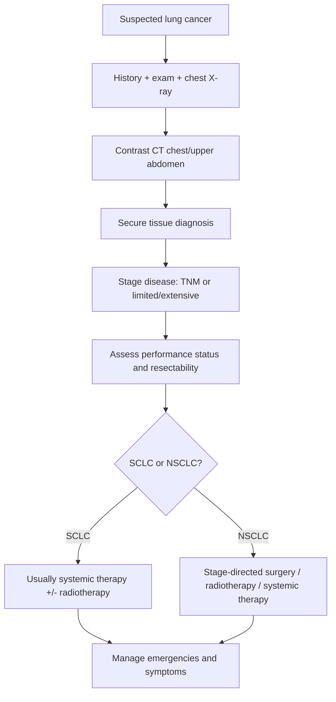
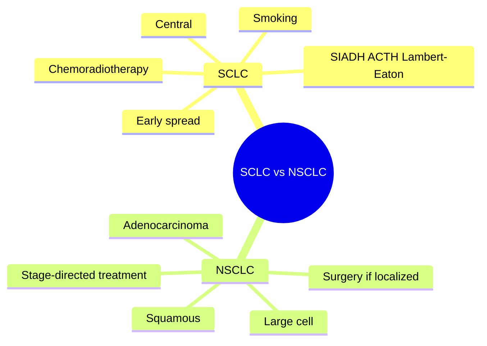
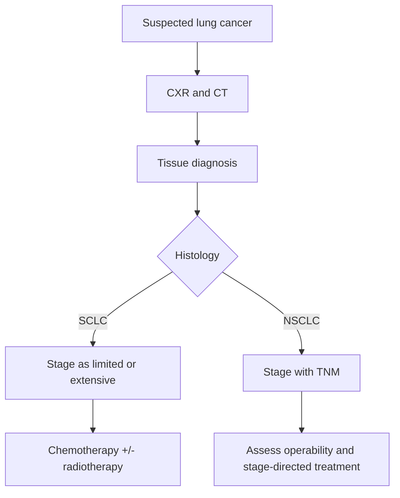

# Small-cell vs non-small-cell lung cancer

> [!important]
> The single most important exam distinction is that **small-cell lung cancer (SCLC)** is usually **central, strongly smoking-related, early metastatic, and treated mainly with chemoradiotherapy**, whereas **non-small-cell lung cancer (NSCLC)** is a broader group often considered for **surgery or stage-directed multimodal treatment** when localized.

Related: [[Lung Cancer]], [[Chest X-Ray Approach]], [[Hemoptysis]], [[Thoracic Malignancy/Superior vena cava obstruction|Superior vena cava obstruction]], [[Thoracic Malignancy/Pancoast tumor and local invasion syndromes|Pancoast tumor and local invasion syndromes]], [[Thoracic Malignancy/Mesothelioma|Mesothelioma]]

> [!tip]
> In FCPS/MRCP, questions often revolve around **classification, smoking association, paraneoplastic syndromes, staging logic, resectability, and oncologic emergencies**.

## Learning Objectives
- Distinguish SCLC from NSCLC by pathology, location, behavior, and treatment logic.
- Understand bronchopulmonary anatomy relevant to tumor location and local spread.
- Recognize alarm symptoms, chest X-ray/CT clues, and common metastatic/paraneoplastic patterns.
- Apply investigation and staging logic for suspected primary lung cancer.
- Recall high-yield emergency and viva points.

## Definition
Primary bronchogenic lung cancers are broadly divided into:
- **Small-cell lung cancer (SCLC)**
- **Non-small-cell lung cancer (NSCLC)**, which includes adenocarcinoma, squamous cell carcinoma, and large-cell carcinoma

### Core concept
This distinction matters because:
- **SCLC** behaves aggressively, metastasizes early, and is usually not treated surgically
- **NSCLC** may be resectable if localized and fit for curative therapy

## Core Anatomy
### 1. Bronchopulmonary tree and central vs peripheral lesions
- Central tumors arise near major bronchi and hilar structures.
- Peripheral tumors arise in distal lung parenchyma.
- **SCLC** and **squamous carcinoma** are classically more central.
- **Adenocarcinoma** is often peripheral.

### 2. Hilar, mediastinal, pleural, and apical spread
- Hilar and mediastinal nodes determine staging and compressive symptoms.
- Pleural involvement may produce malignant effusion.
- Apical spread may involve brachial plexus, ribs, and sympathetic chain causing a **Pancoast syndrome**.

### 3. Recurrent laryngeal and phrenic nerve relevance
- recurrent laryngeal nerve palsy -> hoarseness
- phrenic nerve involvement -> hemidiaphragm elevation
- SVC compression -> facial swelling, venous distension

## Core Physiology
### 1. How lung cancer causes respiratory symptoms
- endobronchial obstruction -> cough, wheeze, post-obstructive collapse/infection
- pleural disease -> dyspnea, chest pain, effusion
- reduced functional lung parenchyma -> exertional dyspnea

### 2. Smoking and carcinogenesis
- chronic toxin exposure causes epithelial dysplasia and malignant transformation
- central airway carcinogenesis is strongly linked to smoking

### 3. Why SCLC behaves aggressively
- neuroendocrine biology
- high proliferative rate
- early nodal and distant spread
- high initial response to chemotherapy/radiotherapy but frequent relapse

## Normal Values / Important Cut-offs
### Useful practical thresholds
- There is no single “diagnostic blood cut-off” for lung cancer.
- Important practical thresholds are **staging- and performance-based**, not purely laboratory-based.

### High-yield clinical cut-offs/flags
- unexplained hemoptysis in a smoker or older adult -> urgent imaging pathway
- new persistent cough >3 weeks, unexplained weight loss, persistent focal CXR abnormality, recurrent same-site pneumonia -> evaluate for malignancy
- hypercalcemia, hyponatremia, and unexplained clubbing are important systemic clues

## Classification
### 1. Major pathological split
| Group | Main subtypes |
|---|---|
| **SCLC** | small-cell neuroendocrine carcinoma |
| **NSCLC** | adenocarcinoma, squamous cell carcinoma, large-cell carcinoma |

### 2. Clinical behavior split
| Feature | SCLC | NSCLC |
|---|---|---|
| Growth/metastasis | rapid, early spread | variable, often slower than SCLC |
| Usual location | central | adenocarcinoma often peripheral; squamous often central |
| Surgery | uncommon | important option if localized and operable |
| Main treatment logic | chemoradiotherapy | surgery, radiotherapy, systemic therapy depending on stage |

### 3. Staging shorthand
- **SCLC**: often taught as **limited stage** vs **extensive stage**
- **NSCLC**: commonly staged using **TNM**

## Etiology / Causes
### Major causes/risk factors for primary lung cancer
- cigarette smoking
- passive smoke exposure
- occupational exposures: asbestos, radon, silica, diesel, heavy metals
- prior chest radiation
- chronic fibrotic lung disease in some cases
- genetic susceptibility

## Risk Factors
- heavy smoking history
- increasing age
- COPD and chronic lung damage
- occupational carcinogen exposure
- prior malignancy or radiation
- family history in selected cases

## Pathophysiology
### SCLC
- usually central neuroendocrine tumor
- infiltrates early
- frequent nodal/mediastinal spread
- common distant metastases: liver, bone, brain, adrenal
- strongly associated with paraneoplastic syndromes such as SIADH and ectopic ACTH

### NSCLC
- includes biologically diverse tumors
- local growth may produce cough, collapse, hemoptysis, pleural involvement, chest wall invasion
- metastasis occurs but can be later than SCLC in some cases
- molecular drivers may influence targeted therapy in subsets, especially adenocarcinoma

## Clinical Features
### Local respiratory symptoms
- persistent cough
- hemoptysis
- dyspnea
- chest pain
- recurrent or non-resolving pneumonia
- wheeze from focal airway obstruction

### Constitutional symptoms
- weight loss
- anorexia
- fatigue

### Local invasion clues
- hoarseness
- superior vena cava obstruction
- Pancoast syndrome: shoulder pain, arm pain/weakness, Horner syndrome
- pleural effusion

### Metastatic symptoms
- bone pain
- focal neurological deficit or seizure
- jaundice less commonly from liver metastasis burden
- adrenal involvement may be silent

### Paraneoplastic clues
- **SCLC**: SIADH, ectopic ACTH, Lambert-Eaton myasthenic syndrome
- **Squamous NSCLC**: hypercalcemia via PTHrP
- clubbing / hypertrophic osteoarthropathy more often with NSCLC, especially adenocarcinoma

## Approach / Algorithm

## Investigations
### 1. Chest X-ray
May show:
- hilar mass
- collapse/consolidation
- non-resolving opacity
- pleural effusion
- apical lesion

### 2. CT chest with upper abdomen
Key imaging step:
- defines primary lesion
- nodal involvement
- pleural/chest wall invasion
- adrenal/liver spread

### 3. Tissue diagnosis
Methods depend on lesion site:
- bronchoscopy / endobronchial biopsy for central lesions
- CT-guided biopsy for peripheral lesions
- EBUS-guided nodal sampling
- pleural fluid cytology or pleural biopsy when relevant

### 4. Staging tests
- PET-CT where available/appropriate
- MRI brain in selected high-risk settings, especially SCLC or neurologic symptoms
- bone imaging if metastatic concern

### 5. Baseline assessment
- CBC, U&E, LFT
- calcium
- sodium
- performance status
- pulmonary function testing if surgery considered

## Interpretation Frameworks
### 1. SCLC vs NSCLC table
| Feature | SCLC | NSCLC |
|---|---|---|
| Smoking association | very strong | strong, especially squamous; adenocarcinoma can occur in non-smokers too |
| Location | often central | variable; adenocarcinoma often peripheral |
| Growth/metastasis | rapid, early | relatively slower/heterogeneous |
| Paraneoplastic tendency | SIADH, ACTH, Lambert-Eaton | hypercalcemia, clubbing, HOA more typical in some subtypes |
| Surgical role | limited | important in localized disease |

### 2. Histology clue framework
| Histology | Typical clue |
|---|---|
| Squamous carcinoma | central, smoking-related, cavitation, hypercalcemia |
| Adenocarcinoma | peripheral, pleural involvement, non-smoker possibility |
| Small-cell carcinoma | central, bulky mediastinal nodes, early dissemination, paraneoplastic syndromes |

### 3. Chest X-ray / CT clue framework
| Finding | Suggestion |
|---|---|
| Hilar mass + collapse | central obstructing tumor |
| Apical mass | think Pancoast tumor |
| Pleural effusion | pleural involvement or metastatic disease |
| Mediastinal widening/nodes | advanced central malignancy, especially SCLC possibility |

## Diagnosis
Diagnosis requires:
- radiological suspicion of a primary thoracic malignancy
- **histological or cytological confirmation** whenever feasible
- staging to guide treatment intent

## Differential Diagnosis
| Differential | Clues favoring it |
|---|---|
| **Tuberculosis** | fever, cavitation, chronic infective picture, microbiology support |
| **Pneumonia** | acute infective symptoms and radiological resolution after treatment |
| **Mesothelioma** | pleural rind/exposure history, pleural-dominant disease |
| **Metastatic lesion to lung** | known extra-thoracic primary |
| **Benign pulmonary nodule** | stable imaging over time, benign pattern |
| **Lymphoma / mediastinal mass** | dominant nodal/mediastinal pattern and systemic clues |

## Tables / Comparison Charts
### Key management logic
| Tumor type | Curative pathway if possible | Common non-surgical pathway |
|---|---|---|
| SCLC | rare surgical role in very limited cases | chemotherapy +/- thoracic radiotherapy |
| NSCLC | surgery if localized and operable | radiotherapy, chemotherapy, immunotherapy, targeted therapy depending on stage |

### Common paraneoplastic associations
| Tumor type | Association |
|---|---|
| SCLC | SIADH, ectopic ACTH, Lambert-Eaton syndrome |
| Squamous NSCLC | hypercalcemia |
| Adenocarcinoma / NSCLC | clubbing, hypertrophic osteoarthropathy |

## Management
### 1. General principles
- establish tissue diagnosis and stage
- assess performance status and comorbidities
- relieve symptoms and treat emergencies
- discuss in multidisciplinary oncology/thoracic team

### 2. SCLC treatment logic
- usually systemic chemotherapy
- thoracic radiotherapy in selected limited-stage disease
- prophylactic cranial irradiation in selected settings depending on protocol and response
- surgery uncommon because disease is often disseminated at presentation

### 3. NSCLC treatment logic
- surgery if localized and patient is operable
- adjuvant or neoadjuvant systemic therapy in selected cases
- radical radiotherapy or chemoradiation if unresectable but potentially treatable
- advanced disease: systemic therapy, immunotherapy, targeted therapy when appropriate

### 4. Symptom and emergency management
- oxygen if hypoxemic
- analgesia for chest pain/bone pain
- treat post-obstructive infection
- urgent management of SVC obstruction, spinal cord compression, or malignant central airway obstruction when present

## Drug Interactions / Contraindications / Comorbidity Cautions
- Poor pulmonary reserve may limit surgical options.
- Renal/hepatic dysfunction can affect chemotherapy suitability and dosing.
- Steroids may transiently improve some emergency states but do not replace definitive oncologic management.
- Smoking cessation remains important even after diagnosis.
- Hemoptysis and airway obstruction require careful anticoagulation decisions if concurrent PE or AF exists.

## Procedures / Indications / Contraindications
### Common procedures
- bronchoscopy with biopsy
- EBUS-guided nodal sampling
- CT-guided transthoracic biopsy
- pleural aspiration / pleural biopsy if pleural disease is present

## Procedure Mini-Sections
### Procedure: Bronchoscopy with biopsy
- **Indications:** central lesion, hemoptysis workup, endobronchial obstruction
- **Contraindications:** relative; severe hypoxemia/instability may require optimization
- **Complications:** bleeding, hypoxemia, arrhythmia
- **Viva pearls:** especially useful for central tumors such as many SCLCs and squamous cancers

### Procedure: CT-guided lung biopsy
- **Indications:** peripheral lesion requiring tissue diagnosis
- **Contraindications:** relative in severe emphysema/coagulopathy
- **Complications:** pneumothorax, bleeding
- **Viva pearls:** common for peripheral adenocarcinoma-type lesions

## Complications
- hemoptysis
- post-obstructive pneumonia
- pleural effusion
- SVC obstruction
- spinal cord compression from metastasis
- brain metastasis
- hypercalcemia or hyponatremia

## Red Flags / Emergencies
- massive hemoptysis
- superior vena cava obstruction
- stridor / central airway obstruction
- spinal cord compression
- seizures or focal deficits from brain metastasis
- severe hypercalcemia or profound hyponatremia

## Prognosis
- **SCLC** generally has worse prognosis because of early dissemination despite initial treatment responsiveness.
- **NSCLC** prognosis depends heavily on stage and operability.
- Performance status, metastatic burden, and molecular profile also influence outcomes.

## Topic Correlation
- [[Lung Cancer]] for broader core topic
- [[Thoracic Malignancy/Superior vena cava obstruction|Superior vena cava obstruction]] for emergency complication
- [[Thoracic Malignancy/Pancoast tumor and local invasion syndromes|Pancoast tumor and local invasion syndromes]] for apical local spread
- [[Hemoptysis]] for presentation logic
- [[Chest X-Ray Approach]] for imaging interpretation

## Special Situations
### 1. Non-resolving pneumonia
- always consider an obstructing lung tumor, especially in older smokers
- same-site recurrent pneumonia is particularly suspicious

### 2. Poor surgical candidate
- severe COPD, frailty, or cardiac disease may shift intent away from surgery even in NSCLC

### 3. Paraneoplastic presentation first
- hyponatremia, Cushingoid features, proximal weakness, or Lambert-Eaton syndrome may be the clue before a mass is obvious

### 4. Apical lesion
- shoulder pain plus Horner syndrome should trigger Pancoast thinking

## FCPS/MRCP High-Yield Points
- SCLC vs NSCLC is a **management-defining split**.
- SCLC: central, smoking-related, early metastasis, paraneoplastic syndromes, usually not surgical.
- NSCLC: broader group; surgery matters if localized.
- Squamous carcinoma -> hypercalcemia; SCLC -> SIADH/ACTH/Lambert-Eaton.
- A non-resolving or recurrent same-site pneumonia may hide bronchogenic carcinoma.

## Common Viva Questions
1. Why is the distinction between SCLC and NSCLC important?
2. Which histological subtype is most associated with SIADH?
3. Which subtype is often peripheral?
4. Why is surgery usually not offered in SCLC?
5. What are the red-flag complications of lung cancer?

## Common Confusions / Exam Traps
- Calling all lung cancers “bronchogenic carcinoma” without specifying the SCLC vs NSCLC split.
- Forgetting that adenocarcinoma may occur in non-smokers.
- Missing hypercalcemia as a clue to squamous carcinoma.
- Assuming a persistent infiltrate is only pneumonia without considering obstructing cancer.
- Confusing staging systems: SCLC often simplified as limited/extensive, NSCLC commonly described with TNM.

## Mnemonics
### **SCLC = Small, Spreads Soon, Secretes**
- **Small** cell morphology
- **Spreads soon**
- **Secretes** ectopic hormones / paraneoplastic syndromes

## Mind Map

## Flowchart

## Suggested Visuals / Image Notes
- Table image comparing SCLC and NSCLC
- Diagram of central vs peripheral lung tumors
- Pancoast syndrome and SVC obstruction visual summary
- CXR examples: hilar mass, collapse, apical mass, pleural effusion

## Suggested Video References
- Lung cancer classification and staging overview
- Chest X-ray approach for hilar mass and collapse
- Paraneoplastic syndromes in thoracic oncology

## One-Page Revision Summary
- **SCLC:** central, smoking-related, neuroendocrine, early spread, SIADH/ACTH/Lambert-Eaton, usually chemoradiotherapy.
- **NSCLC:** adenocarcinoma, squamous, large-cell; stage with TNM; surgery possible if localized.
- **Adenocarcinoma:** often peripheral.
- **Squamous:** central, smoking-related, hypercalcemia.
- **Red flags:** hemoptysis, SVC obstruction, Pancoast signs, non-resolving pneumonia, brain/bone metastasis symptoms.
- **Diagnosis:** CT + tissue diagnosis + staging.

## 24-Hour Recall Prompts
- Write a 5-point comparison between SCLC and NSCLC.
- List 3 paraneoplastic syndromes and their tumor associations.
- Explain why surgery is usually not the main treatment for SCLC.
- State the causes of a non-resolving same-lobe pneumonia in an older smoker.
- Draw a quick map of central vs peripheral lung cancer clues.

## 7-Day / 15-Day / 30-Day Revision Tracker
- [ ] Day 1 completed
- [ ] 24-hour recall completed
- [ ] Day 7 revision completed
- [ ] Day 15 revision completed
- [ ] Day 30 revision completed

## Must Know / Should Know / Nice to Know
### Must Know
- SCLC vs NSCLC core differences
- smoking and site associations
- resectability and treatment logic
- common paraneoplastic syndromes
- oncologic red flags

### Should Know
- tissue diagnosis methods by lesion location
- central vs peripheral imaging clues
- Pancoast and SVC obstruction pathways

### Nice to Know
- molecularly targeted therapy details by mutation subtype
- fine pathology distinctions beyond exam essentials

## My Weak Points
- [ ] I can compare SCLC and NSCLC in under 1 minute.
- [ ] I remember paraneoplastic associations by subtype.
- [ ] I can explain when surgery is appropriate in lung cancer.

## Self-Test Scorecard
- Understanding: /10
- Recall: /10
- MCQ Performance: /10
- SBA Performance: /10
- Viva Confidence: /10
- Total: /50

> [!tip]
> Interpretation: **<35** = weak topic, **35-44** = acceptable but insecure, **45+** = strong exam-ready topic.

## Exam Answer Modes
### Long Answer Skeleton
- classification
- pathology and anatomy
- risk factors and pathophysiology
- clinical features and complications
- investigations and staging
- treatment according to SCLC vs NSCLC

### Short Note Skeleton
- define SCLC and NSCLC
- compare key features
- list paraneoplastic syndromes and treatment logic

### Viva One-Liners
- SCLC spreads early and is usually treated non-surgically.
- NSCLC includes adenocarcinoma and squamous carcinoma.
- Squamous carcinoma -> hypercalcemia; SCLC -> SIADH/ACTH.

### Ward-Case Discussion Points
- smoking history and red flags
- imaging clue pattern
- histology route for tissue diagnosis
- staging and resectability
- emergency complication screening

### Last-Night-Before-Exam Sheet
- **SCLC = central, smoking, spreads soon, secretes hormones**
- **NSCLC = surgery matters if localized**
- **Squamous -> hypercalcemia**
- **SCLC -> SIADH / ACTH / Lambert-Eaton**
- **Persistent same-site pneumonia -> think obstructing tumor**

## Summary
The distinction between small-cell and non-small-cell lung cancer is fundamental because it predicts behavior, paraneoplastic associations, staging style, and treatment strategy. SCLC is aggressive and usually managed with systemic therapy and radiotherapy, whereas NSCLC may be resectable and is treated according to stage, operability, and molecular profile.

## MCQs (10)
1. Which statement best describes small-cell lung cancer?
   A. Usually peripheral and slow growing
   B. Often central with early metastasis
   C. Usually managed primarily with surgery
   D. Rarely associated with smoking

2. NSCLC includes all EXCEPT:
   A. adenocarcinoma
   B. squamous cell carcinoma
   C. large-cell carcinoma
   D. small-cell neuroendocrine carcinoma

3. Which malignancy is most associated with SIADH?
   A. adenocarcinoma
   B. mesothelioma
   C. small-cell lung cancer
   D. metastatic melanoma

4. Which subtype is classically often peripheral?
   A. adenocarcinoma
   B. small-cell carcinoma
   C. squamous carcinoma only central always
   D. carcinoid only

5. Hypercalcemia is classically associated with:
   A. squamous cell carcinoma
   B. SCLC
   C. adenocarcinoma only
   D. mesothelioma

6. The usual simplified staging language for SCLC is:
   A. Dukes staging
   B. TNM only in all cases
   C. limited vs extensive stage
   D. Child-Pugh staging

7. A Pancoast tumor classically arises in the:
   A. diaphragm
   B. lung apex
   C. carina only
   D. trachea only

8. Recurrent same-lobe pneumonia in an older smoker should raise suspicion for:
   A. asthma alone
   B. pulmonary edema only
   C. obstructing bronchogenic carcinoma
   D. simple viral URTI

9. The key investigation to confirm histology is:
   A. ESR only
   B. tissue diagnosis by biopsy/cytology
   C. pulse oximetry
   D. skin prick test

10. Which statement about surgery is most accurate?
    A. It is the main treatment for most SCLCs
    B. It has no role in any NSCLC
    C. It is mainly considered for localized operable NSCLC
    D. It is contraindicated in all thoracic malignancy

## SBA Questions (10)
1. A 64-year-old heavy smoker presents with weight loss, hyponatremia, and a central hilar mass with mediastinal enlargement. The most likely diagnosis is:
   A. adenocarcinoma
   B. small-cell lung cancer
   C. mesothelioma
   D. pulmonary embolism

2. A 58-year-old woman has a peripheral upper-lobe lung mass on CT. Histology is sought because management depends on whether this is SCLC or NSCLC. The most likely NSCLC subtype in a peripheral lesion is:
   A. adenocarcinoma
   B. small-cell carcinoma
   C. squamous carcinoma always
   D. lymphoma

3. A patient with bronchogenic carcinoma develops shoulder pain, arm weakness, ptosis, and miosis. This most likely indicates:
   A. SIADH
   B. Pancoast tumor with local invasion
   C. pulmonary edema
   D. asthma exacerbation

4. An older smoker has persistent right upper-zone consolidation despite antibiotics. The best next step is:
   A. stop all evaluation
   B. assume tuberculosis without imaging
   C. investigate for an obstructing lung malignancy with further imaging/tissue pathway
   D. repeat antibiotics indefinitely

5. Which feature most strongly favors SCLC over NSCLC?
   A. early widespread metastasis and paraneoplastic syndromes
   B. frequent curative surgery
   C. peripheral solitary nodule in a non-smoker only
   D. long indolent course always

6. A patient with suspected NSCLC is being assessed for surgery. Which additional assessment is particularly important?
   A. pulmonary reserve / fitness assessment
   B. fundoscopy only
   C. stool culture only
   D. thyroid ultrasound only

7. Hypercalcemia in a smoker with a central lung mass most strongly suggests:
   A. squamous cell carcinoma
   B. small-cell carcinoma
   C. mesothelioma
   D. PCP pneumonia

8. Which emergency complication should be recognized urgently in lung cancer?
   A. superior vena cava obstruction
   B. uncomplicated allergic rhinitis
   C. plantar fasciitis
   D. migraine without aura

9. A patient with SCLC responds initially to chemotherapy but later relapses. This pattern is best explained by:
   A. indolent biology
   B. aggressive biology with early dissemination despite initial treatment sensitivity
   C. absence of metastatic potential
   D. purely benign pathology

10. Which test pathway best summarizes confirmation of suspected primary lung cancer?
    A. chest X-ray only
    B. ABG only
    C. CT imaging plus tissue diagnosis and staging
    D. spirometry only

## Flashcards
- Q: What are the two major groups of primary bronchogenic lung cancer?
  A: Small-cell lung cancer and non-small-cell lung cancer.
- Q: Which lung cancer is classically associated with SIADH and ectopic ACTH?
  A: Small-cell lung cancer.
- Q: Which NSCLC subtype is often peripheral?
  A: Adenocarcinoma.
- Q: Which subtype is classically linked to hypercalcemia?
  A: Squamous cell carcinoma.
- Q: Why is surgery usually limited in SCLC?
  A: Because it usually presents with early dissemination and nodal/metastatic spread.
- Q: What syndrome suggests an apical lung tumor with local invasion?
  A: Pancoast syndrome.

## Answer Key with Explanations
### MCQs
1. **B** — SCLC is usually central, smoking-related, and metastasizes early.
2. **D** — Small-cell carcinoma is not part of the NSCLC group.
3. **C** — SIADH is a classic paraneoplastic association of SCLC.
4. **A** — Adenocarcinoma is classically peripheral.
5. **A** — Squamous carcinoma is classically associated with hypercalcemia.
6. **C** — SCLC is commonly summarized as limited versus extensive stage.
7. **B** — Pancoast tumors arise at the lung apex.
8. **C** — Recurrent same-lobe pneumonia may reflect an obstructing tumor.
9. **B** — Tissue confirmation is required for histological classification.
10. **C** — Surgery is most relevant in localized operable NSCLC.

### SBAs
1. **B** — Central mass plus hyponatremia strongly suggests SCLC with SIADH.
2. **A** — Peripheral NSCLC is often adenocarcinoma.
3. **B** — Shoulder pain, arm weakness, and Horner syndrome indicate Pancoast involvement.
4. **C** — Persistent focal consolidation after antibiotics requires malignancy evaluation.
5. **A** — Early spread and paraneoplastic syndromes are classic SCLC features.
6. **A** — Operability depends heavily on cardiopulmonary reserve and performance status.
7. **A** — Hypercalcemia classically points toward squamous cell carcinoma.
8. **A** — SVC obstruction is a major thoracic oncologic emergency.
9. **B** — SCLC often responds initially but relapses because of aggressive disseminated disease.
10. **C** — Proper diagnosis requires imaging, tissue confirmation, and staging.
