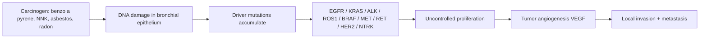
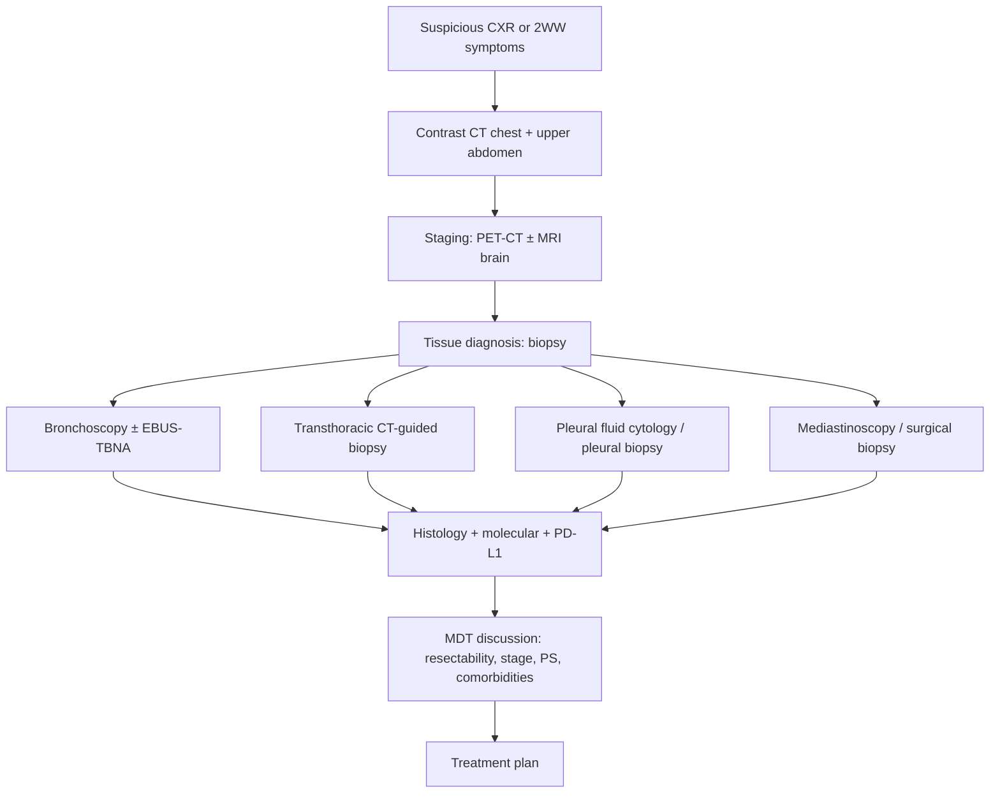
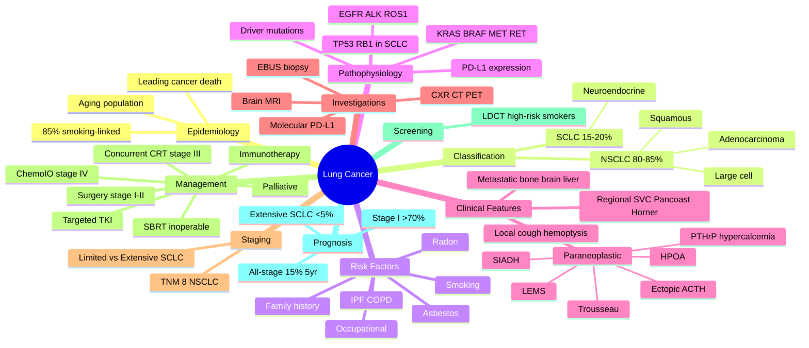
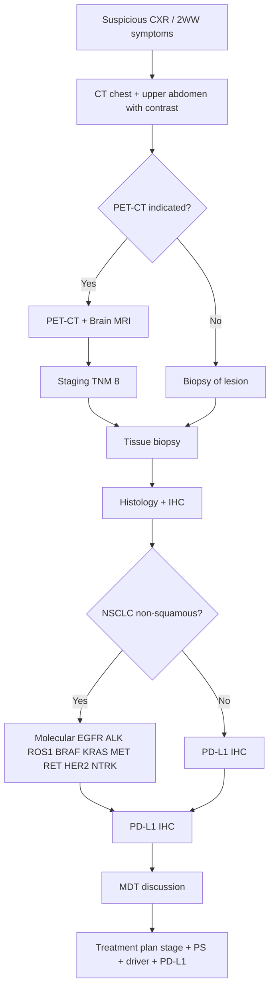

# Lung Cancer

> [!important]
> **Lung cancer** is the **leading cause of cancer-related death worldwide** (≈1.8 million deaths/year; GLOBOCAN 2022). It is broadly classified into **non-small cell lung cancer (NSCLC, 80–85%)** and **small cell lung cancer (SCLC, 15–20%)**, with major differences in biology, staging, and management. **Smoking accounts for ~85% of cases**, and **outcomes remain poor** because most patients present with advanced (metastatic) disease.

Related: [[COPD]] · [[Hemoptysis]] · [[Pleural Effusion]] · [[Chest X-Ray Approach]] · [[Pneumonia]] · [[Bronchiectasis]] · [[Tuberculosis]] · [[ABG Interpretation]] · [[Spirometry Interpretation]] · [[Interstitial and Diffuse Parenchymal Lung Diseases/Idiopathic pulmonary fibrosis|Idiopathic pulmonary fibrosis]] · [[Thoracic Malignancy]]

> [!tip]
> **FCPS/MRCP pearl**: Lung cancer is the **MCC cancer death in both sexes** globally. Any new suspicious mass on CXR in a smoker >40 years → **2-week-wait CT chest**. **SCLC = central, smoking-related, paraneoplastic (SIADH, ectopic ACTH, Lambert-Eaton)**. **Squamous = central, cavitating, hypercalcaemia (PTHrP)**. **Adenocarcinoma = peripheral, most common in non-smokers, EGFR/ALK/ROS1/PD-L1 targetable**. **Large cell = peripheral, undifferentiated, poor prognosis**.

## Learning Objectives

- Define lung cancer, classify NSCLC vs SCLC, and recognise histologic subtypes and their clinical signatures.
- Describe the epidemiology and risk factors (smoking, asbestos, radon, occupational, genetic).
- Recognise clinical features including local, metastatic, and **paraneoplastic syndromes**.
- Apply the **TNM 8th edition** staging and the **limited vs extensive** SCLC dichotomy.
- Order and interpret investigations: CXR, contrast CT chest/abdomen/pelvis, **PET-CT**, **MRI brain**, **EBUS/mediastinoscopy**, biopsy, **molecular testing (EGFR/ALK/ROS1/BRAF/KRAS/PD-L1)**.
- Build an evidence-based management plan: surgery (early NSCLC), SBRT, chemotherapy, radiotherapy, **targeted therapy**, and **immunotherapy**.
- Discuss **screening** (low-dose CT in heavy smokers), **prognosis** (overall 5-yr ≈10–20%), and **complications** (SVC syndrome, Pancoast, Horner's, malignant effusion).

## Definition

**Lung cancer** is a malignant neoplasm arising from the respiratory epithelium (bronchi, bronchioles, alveoli). Histologically:

| Type | Frequency | Key features |
|------|-----------|--------------|
| **Non-small cell lung cancer (NSCLC)** | **80–85%** | Slower-growing, often resectable when early |
| &nbsp;&nbsp;• Adenocarcinoma | ~40% of all | Peripheral, most common in non-smokers and women, **mucinous variant** |
| &nbsp;&nbsp;• Squamous cell carcinoma | ~25–30% | Central, cavitating, **hypercalcaemia** (PTHrP) |
| &nbsp;&nbsp;• Large cell carcinoma | ~5–10% | Peripheral, undifferentiated, poor prognosis |
| **Small cell lung cancer (SCLC)** | **15–20%** | Central, aggressive, **paraneoplastic (SIADH, ectopic ACTH, Lambert-Eaton)**, early metastasis |

> [!critical] **Adenocarcinoma in situ (AIS)** and **minimally invasive adenocarcinoma (MIA)** are pre-invasive lesions with excellent prognosis post-resection (>95% 5-yr survival).

## Core Anatomy

### Airway and lung anatomy relevant to lung cancer

| Region | Cancer relevance |
|--------|------------------|
| **Trachea & carina** | Rare primary squamous/adeno; SVC runs anterior-right |
| **Main/lobar bronchi (central)** | Squamous & SCLC predominate; cough, haemoptysis, post-obstructive pneumonia |
| **Segmental bronchi** | Adenocarcinoma tends to arise distally |
| **Peripheral lung parenchyma** | Adenocarcinoma, large cell, metastases |
| **Apex (Pancoast region)** | Sulcus tumours → Horner's, brachial plexus invasion, shoulder pain |
| **Mediastinum (lymph nodes)** | N-staging; paratracheal, subcarinal, hilar, aortopulmonary |
| **Pleura** | Malignant pleural effusion (M1a) |
| **Chest wall / ribs** | Direct invasion (T3), rib metastases |
| **Diaphragm, recurrent laryngeal n.** | Phrenic/RLN palsy → hoarseness, raised hemidiaphragm |

### Lymph node stations (IASLC, key for N-staging)

- **N1**: ipsilateral peribronchial, hilar (stations 10–14)
- **N2**: ipsilateral mediastinal + subcarinal (stations 2–9)
- **N3**: contralateral mediastinal/hilar, supraclavicular (station 1)

## Core Physiology

- **Tumour doubling time** correlates with histology: SCLC has very short doubling time (often <90 days) → early metastasis; adenocarcinoma typically slower.
- **Local effects**: airway obstruction → atelectasis, post-obstructive pneumonia; invasion → pleural effusion, SVC compression, Pancoast, vocal cord palsy.
- **Metastatic spread**:
  - **Lymphatic** → mediastinal, supraclavicular (especially left)
  - **Haematogenous** → bone (pain, hypercalcaemia), brain (seizures, focal deficit), liver, adrenal, contralateral lung
  - **Trans-coelomic / pleural seeding** → malignant effusion
- **Paraneoplastic mechanisms**:
  - **SIADH** (small cell) → ectopic ADH
  - **Ectopic ACTH** (small cell) → Cushing's
  - **PTHrP** (squamous) → hypercalcaemia
  - **Lambert-Eaton myasthenic syndrome (LEMS)** → antibodies vs presynaptic Ca²⁺ channels
  - **Hypertrophic pulmonary osteoarthropathy (HPOA)** → periosteal reaction
  - **Trousseau's syndrome** → migratory thrombophlebitis
  - **Anti-NMDA / anti-Hu / anti-Yo encephalitis** (small cell)

## Normal Values / Important Cut-offs

| Parameter | Value | Comment |
|-----------|-------|---------|
| **Lung cancer 5-yr survival (all stages)** | **~10–20%** (UK ~15%) | Largely unchanged historically |
| **5-yr survival stage I NSCLC (resected)** | **70–90%** | Early detection critical |
| **5-yr survival extensive SCLC** | <5% | Aggressive disease |
| **NICE 2-week-wait referral criteria (lung)** | CXR suggestive of lung cancer OR ≥40 with haemoptysis | Urgent CT |
| **Smoking pack-years (high risk for screening)** | ≥30 pack-years | USPSTF / NHS Lung Health Check |
| **LDCT screening age range** | 55–74 (USPSTF) / 55–74 (UK NHS LHC) | Annual scan |
| **Mediastinal nodes short axis (CT)** | >10 mm = suspicious | Combined with PET |
| **Pleural fluid pH** | <7.2 | Suggests need for drainage in malignant effusion |
| **SCC antigen, CEA, Cyfra 21-1** | Trend markers | Not diagnostic; help monitor treatment |

## Classification

### WHO 2021 classification (simplified for exam)

| Group | Subtypes |
|-------|----------|
| **NSCLC** | Adenocarcinoma (with lepidic, acinar, papillary, micropapillary, solid, mucinous variants), Squamous, Large cell, Adenosquamous, Sarcomatoid |
| **Neuroendocrine** | Carcinoid (typical/atypical), SCLC, Large cell neuroendocrine |
| **Salivary-gland type** | Mucoepidermoid, adenoid cystic |
| **Mesenchymal / others** | Sarcomas, lymphomas, metastases |

### Clinical classification for management

- **NSCLC**: staged by **TNM 8th edition**; treatment depends on stage + performance status + driver mutations + PD-L1 status
- **SCLC**: staged **limited** (confined to one hemithorax, including ipsilateral nodes, that can be encompassed in a single radiotherapy field) vs **extensive** (anything beyond) — or use TNM 8th

## Etiology / Causes

### Major risk factors

| Factor | Comment |
|--------|---------|
| **Tobacco smoking (cigarettes)** | **~85% of all lung cancers**. Risk proportional to pack-years; continued smoking worsens outcomes. |
| **Second-hand (passive) smoking** | ~20–30% increased risk in non-smokers |
| **Asbestos exposure** | Synergistic with smoking (multiplicative). Mesothelioma + bronchogenic Ca. |
| **Radon gas** | Second leading cause after smoking; uranium decay in soil; affects miners and basement dwellings |
| **Occupational** | Arsenic, chromium, nickel, beryllium, cadmium, diesel exhaust, silica, coal tar, soot |
| **Ionising radiation** | Post-radiotherapy, atomic-bomb survivors |
| **Air pollution** | PM2.5, biomass fuel smoke (esp. in women, never-smokers) |
| **Previous lung disease** | COPD (independent risk), IPF, TB scars (scar adenocarcinoma) |
| **Family history** | 2-fold risk if first-degree relative affected |
| **Genetic susceptibility** | EGFR germline variants, BRCA2, TP53 |
| **HIV / immunosuppression** | Increased risk |

> [!important] **Smoking + asbestos** = **multiplicative** (not additive) risk — e.g. ~50–90× normal in heavy smokers with asbestos exposure.

## Risk Factors

- **Age** >50, **male sex** (incidence falling in men, rising in women)
- **Cumulative tobacco exposure** (pack-years); pipe/cigar > cigarettes per gram (deeper inhalation)
- **E-cigarette / vaping** — uncertain long-term risk; acute EVALI
- **Low socio-economic status**
- **Diet** low in fruits/vegetables (weak); nitrosamines in cured meat
- **Hormone replacement therapy** (possible small increase in adenocarcinoma)

## Pathophysiology

### Molecular pathogenesis of NSCLC

### Hallmarks of SCLC
- **Neuroendocrine differentiation** (chromogranin, synaptophysin, CD56 positive)
- **TP53 + RB1 loss** in nearly all cases
- **Small blue cells**, high N:C ratio, salt-and-pepper chromatin, crush artefact
- **Rapid growth**, early metastasis, paraneoplastic syndromes

### Pre-invasive lesions
- **Squamous**: dysplasia → carcinoma in situ → invasive SCC
- **Adenocarcinoma**: atypical adenomatous hyperplasia (AAH) → AIS → MIA → invasive adenocarcinoma

## Clinical Features

### Symptoms and signs (by mechanism)

| Mechanism | Features |
|-----------|----------|
| **Local tumour** | Cough (new/changed), haemoptysis, dyspnoea, wheeze (monophonic), stridor, chest pain, post-obstructive pneumonia |
| **Regional invasion** | Hoarseness (recurrent laryngeal n.), dysphagia (oesophagus), SVC syndrome, Horner's, Pancoast, pleural/pericardial effusion, chest wall pain |
| **Metastatic** | Bone pain, pathological fracture, headache, seizures, focal neuro deficit, weight loss, anorexia, hepatomegaly, lymphadenopathy |
| **Paraneoplastic** | Hypercalcaemia (PTHrP), hyponatraemia (SIADH), Cushing's (ectopic ACTH), LEMS, HPOA, Trousseau's, neuromyopathy |

### Key syndromes (high-yield)

| Syndrome | Mechanism | Cancer type |
|----------|-----------|-------------|
| **Pancoast tumour** (superior sulcus) | Apical tumour invading brachial plexus + sympathetic chain | Usually squamous or adenocarcinoma |
| → Shoulder pain, arm pain (C8/T1) | | |
| → **Horner's syndrome**: ptosis, miosis, anhidrosis | Sympathetic chain invasion | |
| → Hand muscle wasting | T1 motor involvement | |
| **SVC syndrome** | Mediastinal mass compressing SVC | SCLC, NHL, squamous |
| → Facial/arm swelling, JVP↑, plethora, headache, cyanosis | | |
| **Horner's** (isolated) | Sympathetic chain → apex | Pancoast |
| **SIADH** (euvolaemic hyponatraemia) | Ectopic ADH | **SCLC** |
| **Ectopic ACTH** (Cushing's) | Ectopic ACTH | **SCLC**, carcinoid |
| **Hypercalcaemia** (PTHrP) | PTHrP secretion | **Squamous** |
| **Lambert-Eaton** (proximal weakness, ↑with use) | Anti-VGCC antibodies | **SCLC** |
| **HPOA** (clubbing, periostitis) | VEGF/PDGF | Adenocarcinoma |
| **Trousseau's** (migratory thrombophlebitis) | Mucins, tissue factor | Adenocarcinoma |

> [!critical] **SVC syndrome is an oncologic emergency** — urgent imaging, IV steroids, consider SVC stent, radiotherapy/chemo depending on histology.

## Approach / Algorithm

### Diagnostic algorithm

### Who to refer (NICE NG122 2WW)

- CXR suggestive of lung cancer
- ≥40 years with **haemoptysis**
- Finger clubbing with unexplained cough / SOB / chest signs
- **Cervical/supraclavicular lymphadenopathy** consistent with lung cancer
- Persistent chest infection, chest pain, weight loss, anorexia, dyspnoea, fatigue in smoker

## Investigations

### First-line

| Test | Purpose |
|------|---------|
| **CXR** | First test; may show mass, effusion, atelectasis, consolidation, lymphadenopathy, post-obstructive pneumonia |
| **Contrast CT chest + upper abdomen** | Defines primary, nodal, adrenal/liver mets |
| **Full blood count, LFTs, Ca²⁺, LDH, ALP** | Baseline, hypercalcaemia, liver/bone involvement |
| **Clotting, renal, spirometry, fitness for surgery** | Pre-op workup |

### Staging and tissue

| Test | Purpose |
|------|---------|
| **¹⁸F-FDG PET-CT** | Staging; detect distant metastasis and mediastinal nodes |
| **MRI brain ± contrast** | For staging in NSCLC; SCLC always |
| **EBUS-TBNA** (endobronchial ultrasound) | Mediastinal/hilar node sampling for N-staging |
| **EUS-FNA** | Subdiaphragmatic nodes, L adrenal |
| **Bronchoscopy + biopsy/EBUS** | Central lesions; brushings, washings, cryo-biopsy |
| **CT-guided percutaneous lung biopsy** | Peripheral lesions |
| **Mediastinoscopy / VATS biopsy** | If EBUS inconclusive |
| **Pleural fluid cytology / pleural biopsy** | Malignant effusion |
| **Sputum cytology** | Occasionally positive in central tumours |
| **Molecular testing** | **EGFR, ALK, ROS1, BRAF, KRAS G12C, MET, RET, HER2, NTRK** in non-squamous NSCLC + biopsies from never/light smokers |
| **PD-L1 immunohistochemistry (TPS %)** | All NSCLC; guides immunotherapy |
| **Brain MRI / CT with contrast** | Symptomatic or staging |

### Pre-treatment fitness assessment

- **WHO/ECOG performance status** (0–4)
- **Lung function** (FEV₁, FVC, DLCO, predicted post-op FEV₁ >40%, DLCO >40%)
- **Cardiac assessment** (CPET if borderline)
- **Nutritional status, weight loss >10% (poor prognostic)**
- **Smoking cessation** — improve surgical and RT outcomes

## Diagnosis

- **Confirmed by histology + immunohistochemistry** + (for NSCLC non-squamous) **molecular profiling** and **PD-L1 IHC**.
- **Tissue is the issue** — every effort to obtain adequate sample for genomic and PD-L1 testing (re-biopsy on progression if needed).
- **Liquid biopsy** (ctDNA) for EGFR T790M at progression on TKI, where tissue not available.

## Differential Diagnosis

| Condition | Distinguishing features |
|-----------|--------------------------|
| **Pneumonia (especially post-obstructive)** | Fever, productive cough, response to antibiotics, but **persistent opacity or recurrent at same site** → think cancer |
| **TB (especially apical)** | Cavity + constitutional symptoms, positive TB tests, endemic area |
| **Lung abscess** | Cavitating lesion with air-fluid level, fever, leukocytosis |
| **Pulmonary embolism (infarction)** | Pleuritic pain, hypoxia, wedge-shaped peripheral opacity |
| **Granulomatosis with polyangiitis (GPA)** | Cavitating nodules, sinus/renal involvement, c-ANCA |
| **Sarcoidosis / lymphoma** | Mediastinal/hilar lymphadenopathy, B-symptoms |
| **Benign hamartoma / carcinoid** | Well-defined, "popcorn" calcification |
| **Metastatic disease from elsewhere** | Multiple nodules, known primary |
| **Pancoast abscess / apical TB** | Mimics Pancoast tumour |

## Tables / Comparison Charts

### Histology at a glance

| Feature | Adenocarcinoma | Squamous | Large cell | SCLC |
|---------|----------------|----------|------------|------|
| **Frequency** | ~40% | ~25–30% | ~5–10% | ~15–20% |
| **Location** | Peripheral | Central | Peripheral | Central (hilar/perihilar) |
| **Cavitation** | Rare | **Common** | Occasional | Rare |
| **Smoking link** | Weaker (also non-smokers) | Strong | Strong | **Very strong** |
| **Hypercalcaemia** | – | **PTHrP** | – | – (ectopic ACTH/SIADH) |
| **Paraneoplastic** | HPOA, Trousseau's | Hypercalcaemia | – | SIADH, ACTH, LEMS |
| **Histology markers** | TTF-1+, Napsin A | p40+, CK5/6 | Negative for others | TTF-1+, chromogranin, synaptophysin, CD56 |
| **Driver mutations** | EGFR, ALK, KRAS, ROS1, BRAF, MET, RET, HER2, NTRK | FGFR, PI3K, SOX2 amp | None specific | TP53, RB1 loss |
| **Surgery** | Yes if early | Yes if early | Yes if early | Usually not (chemo/RT) |
| **Chemotherapy** | Yes (platinum-based) | Yes | Yes | Platinum + etoposide |
| **Targeted Rx** | EGFR/ALK/etc. TKIs | Limited | Limited | Limited |
| **Immunotherapy** | Yes (PD-L1 high) | Yes | Yes | Yes (atezolizumab/durvalumab) |

### Paraneoplastic syndromes cheat sheet

| Syndrome | Substance | Tumour |
|----------|-----------|--------|
| **Hypercalcaemia** | PTHrP | Squamous |
| **Hyponatraemia** | ADH (SIADH) | SCLC |
| **Cushing's** | ACTH | SCLC, carcinoid |
| **LEMS** | Anti-VGCC Ab | SCLC |
| **HPOA / clubbing** | VEGF | Adenocarcinoma |
| **Trousseau's** | Mucins/TF | Adenocarcinoma |
| **Gynaecomastia** | β-hCG | Large cell |
| **Carcinoid syndrome** | 5-HT | Carcinoid |

### TNM 8 (NSCLC) — key points

| T | Definition |
|---|------------|
| T1 | ≤3 cm; T1a ≤1 cm, T1b 1–2 cm, T1c 2–3 cm |
| T2 | 3–5 cm or main bronchus / visceral pleura / atelectasis |
| T3 | 5–7 cm or chest wall / phrenic n. / separate nodule same lobe |
| T4 | >7 cm or mediastinum / heart / great vessels / carina / separate nodule ipsilateral different lobe |

| N | Definition |
|---|------------|
| N0 | No nodes |
| N1 | Ipsilateral peribronchial / hilar |
| N2 | Ipsilateral mediastinal / subcarinal |
| N3 | Contralateral mediastinal/hilar, supraclavicular |

| M | Definition |
|---|------------|
| M0 | No distant mets |
| M1a | Separate nodule contralateral lobe; pleural/pericardial nodules; malignant effusion |
| M1b | Single extrathoracic met |
| M1c | Multiple extrathoracic mets |

**Stage grouping** (I–IV; multiple substages) — see IASLC 8th edition.

## Management

### Principles

- **MDT (multidisciplinary team)** discussion is mandatory
- **Stage + performance status + comorbidities + driver mutations + PD-L1** drive choice
- **Smoking cessation** at every step

### NSCLC — stage-based

| Stage | Treatment |
|-------|-----------|
| **I (T1–2a, N0)** | **Surgical resection** (lobectomy ± systematic node dissection) preferred; SBRT if medically inoperable. ± adjuvant chemotherapy (stage IB high-risk, II). |
| **II** | Surgery + **adjuvant chemotherapy** (cisplatin + vinorelbine); consider adjuvant **osimertinib** (EGFR-mut) or **atezolizumab** (PD-L1+). |
| **III** (locally advanced) | **Concurrent chemoradiotherapy** (cisplatin + etoposide + RT) ± **durvalumab** consolidation (PACIFIC) for unresectable stage III |
| **III resectable** | Neoadjuvant **nivolumab + chemo** (CheckMate 816) or perioperative chemo-IO |
| **IV non-oncogene-addicted** | **Platinum-based chemo + immunotherapy** (pembrolizumab, atezolizumab, cemiplimab) based on PD-L1; pembrolizumab monotherapy if PD-L1 ≥50% |
| **IV oncogene-addicted** | **Targeted therapy first** (see below) |

### Targeted therapy (NSCLC — driver-mutation specific)

| Driver | Frequency | First-line targeted agent |
|--------|-----------|--------------------------|
| **EGFR sensitising** (ex19del, L858R) | ~15% adenocarcinoma, more in never-smokers / Asians | **Osimertinib** (3rd-gen TKI) |
| **ALK rearrangement** | ~3–5% | **Alectinib** (preferred) or lorlatinib |
| **ROS1** | ~1–2% | Entrectinib / crizotinib |
| **BRAF V600E** | ~1–3% | Dabrafenib + trametinib |
| **KRAS G12C** | ~13% adenocarcinoma | **Sotorasib** / adagrasib (post-chemo) |
| **MET ex14 skipping** | ~2–3% | Capmatinib / tepotinib |
| **RET fusion** | ~1–2% | Selpercatinib / pralsetinib |
| **HER2 (mut)** | ~2% | Trastuzumab deruxtecan |
| **NTRK fusion** | <1% | Larotrectinib / entrectinib |

### Immunotherapy (NSCLC)

- **PD-L1 ≥50%** → pembrolizumab monotherapy possible
- **PD-L1 <50%** → chemo-IO combination
- **Adjuvant** atezolizumab (stage II–III) or pembrolizumab
- **Neoadjuvant** nivolumab + chemo (resectable stage IB–IIIA)
- **Consolidation** durvalumab after concurrent CRT (PACIFIC)

### SCLC management

| Stage | Treatment |
|-------|-----------|
| **Limited** | **Concurrent chemoradiotherapy** (cisplatin/carboplatin + etoposide + thoracic RT) ± prophylactic cranial irradiation (PCI) if response |
| **Extensive** | **Platinum + etoposide + atezolizumab/durvalumab** (1st line); second-line lurbinectedin, topotecan; PCI if response |

### Radiotherapy

- **SBRT (stereotactic body RT)** for medically inoperable early-stage NSCLC (high local control)
- **Palliative RT** for bone pain, brain mets, SVC syndrome
- **Endobronchial brachytherapy / debulking** for airway obstruction

### Surgery — fitness and procedure

- **Lobectomy** is the standard
- **Pneumonectomy** for central tumours
- **Wedge / segmentectomy** for very small peripheral or limited reserve
- **VATS (video-assisted thoracoscopic surgery)** preferred where feasible
- **Fitness**: FEV₁ >1.5 L (lobectomy) or >2 L (pneumonectomy); predicted post-op FEV₁ >40%, DLCO >40%; CPET if borderline

### Palliative and supportive care

- **Malignant pleural effusion**: thoracentesis, indwelling pleural catheter, pleurodesis
- **Bone metastases**: bisphosphonates / denosumab, palliative RT
- **Brain metastases**: dexamethasone, whole-brain RT, SRS (stereotactic radiosurgery)
- **Pain, dyspnoea, nutrition, psychological support**
- **Early specialist palliative care referral** improves QoL and survival (Temel et al., NEJM 2010)

## Drug Details Table

| Drug | Class | Typical dose / schedule | Mechanism | Key adverse effects | FCPS/MRCP pearl |
|------|-------|-------------------------|-----------|---------------------|-----------------|
| **Cisplatin** | Platinum chemo | 75 mg/m² IV q3 weeks | DNA cross-link | Nephrotoxicity, ototoxicity, neuropathy, severe nausea | Pre-hydrate, amifostine for kidney, antiemetics (5-HT3 + NK1 + dex) |
| **Carboplatin** | Platinum chemo | AUC 5–6 IV q3 weeks | DNA cross-link | Myelosuppression (esp. thrombocytopenia), less nephrotoxicity | Calvert formula for dose |
| **Pemetrexed** | Antifolate | 500 mg/m² IV q3 weeks | Thymidylate synthase, DHFR, GARFT inhibition | Mucositis, nephrotoxicity, myelosuppression, rash | **Non-squamous only**; folic acid + B12 supplementation |
| **Etoposide** | Topo-II inhibitor | 100 mg/m² IV D1–3 | DNA strand breaks | Myelosuppression, hypotension (infusion), alopecia | SCLC backbone |
| **Paclitaxel / Docetaxel** | Taxane | Pac 200 mg/m², Doc 75 mg/m² q3 wk | Microtubule stabilisation | Neuropathy, neutropenia, alopecia, fluid retention | Premed dex + antihistamine |
| **Gemcitabine** | Antimetabolite | 1000–1250 mg/m² D1,8 q3 wk | Nucleoside analogue | Flu-like, myelosuppression | NSCLC option |
| **Vinorelbine** | Vinca alkaloid | 25–30 mg/m² weekly | Microtubule disruption | Neutropenia, neuropathy, constipation | Often used in adjuvant setting |
| **Pembrolizumab** | Anti-PD-1 | 200 mg IV q3 wk | Releases T-cell brake | Immune-related AEs (colitis, hepatitis, pneumonitis, thyroiditis, hypophysitis, rash) | PD-L1 ≥50% monotherapy; combined with chemo otherwise |
| **Nivolumab** | Anti-PD-1 | 240 mg q2 wk or 480 mg q4 wk | Same | irAEs | Neoadjuvant + chemo in resectable |
| **Atezolizumab** | Anti-PD-L1 | 1200 mg IV q3 wk | Same | irAEs | SCLC extensive + EP; adjuvant NSCLC |
| **Durvalumab** | Anti-PD-L1 | 10 mg/kg q2 wk | Same | irAEs | Consolidation after CRT (PACIFIC) |
| **Osimertinib** | 3rd-gen EGFR TKI | 80 mg PO daily | Irreversible EGFR T790M / sensitising | Diarrhoea, rash, paronychia, ILD, QTc | First-line EGFR-mut; CNS-active |
| **Alectinib** | ALK TKI | 600 mg PO BID | ALK inhibition | Hepatotoxicity, bradycardia, myalgia, vision changes | Preferred 1L ALK+ |
| **Crizotinib** | ALK/ROS1 TKI | 250 mg PO BID | ALK/ROS1/MET | Nausea, oedema, vision changes, ↑LFTs | Earlier ALK; superseded by alectinib |
| **Sotorasib** | KRAS G12C inhibitor | 960 mg PO daily | Covalent KRAS G12C inhibitor | Diarrhoea, ↑LFTs, fatigue | 2L+ KRAS G12C |
| **Dabrafenib + Trametinib** | BRAF + MEK inhibitor | 150 mg BID + 2 mg daily | BRAF V600E + downstream MEK | Pyrexia, rash, uveitis, ↓LVEF | BRAF V600E |
| **Selpercatinib** | RET TKI | 120 mg BID (wt <50 kg) / 160 mg BID (≥50 kg) | RET | ↑LFTs, hypertension, QTc, dry mouth | RET fusion |
| **Capmatinib / Tepotinib** | MET TKI | 400 mg BID / 450 mg daily | MET ex14 | Oedema, nausea, ↑LFTs | MET ex14 skipping |
| **Trastuzumab deruxtecan** | Anti-HER2 ADC | 5.4–6.4 mg/kg q3 wk | HER2-targeted topo-I payload | ILD, cytopenias, nausea | HER2-mut NSCLC |
| **Larotrectinib / Entrectinib** | TRK inhibitor | 100 mg BID | TRK fusion | Dizziness, weight gain, fatigue | Tissue-agnostic NTRK |
| **Denosumab** | Anti-RANKL mAb | 120 mg SC q4 wk | ↓Osteoclast activity | Hypocalcaemia, ONJ, atypical femur # | Bone mets |
| **Zoledronic acid** | Bisphosphonate | 4 mg IV q3–4 wk | Osteoclast inhibition | Renal toxicity, flu-like, hypocalcaemia | Bone mets / hypercalcaemia |
| **Dexamethasone** | Steroid | 4 mg q6h PO/IV | ↓Oedema, anti-inflammatory | Hyperglycaemia, mood, GI, adrenal | Brain mets / SVC / pain |
| **Ondansetron + Aprepitant + Dex** | Antiemetic combo | Standard | 5-HT3 + NK1 + steroid | Constipation, headache, fatigue | Highly emetogenic chemo |

## Drug Interactions / Contraindications / Comorbidity Cautions

- **Platinum chemo + nephrotoxic drugs** (aminoglycosides, NSAIDs, ACE-i): monitor U&E, hydration
- **Cisplatin + aminoglycosides** = ototoxicity synergy
- **Pemetrexed + NSAIDs** in CKD = avoid
- **Immune checkpoint inhibitors**: avoid in **active autoimmune disease** (relative), **organ transplant recipients** (high rejection risk), **chronic steroid >10 mg pred equivalent** (reduced efficacy); hold before major surgery
- **EGFR TKIs + CYP3A4 inhibitors/inducers** (azole antifungals, rifampicin, carbamazepine, St John's Wort) — adjust dose
- **Osimertinib + QT-prolonging drugs** — monitor ECG
- **Crizotinib + strong CYP3A inhibitors** — reduce dose
- **Pneumonitis risk** with immunotherapy ± RT — high-dose steroids if grade ≥2
- **Pre-existing ILD (e.g. IPF)** → cautious with immunotherapy and TKIs (especially EGFR TKI, gefitinib)

## Procedures / Indications / Contraindications

### Procedure Mini-Sections

#### Procedure: Bronchoscopy (± EBUS-TBNA)
- **Indications**: central lesion, mediastinal/hilar node sampling, staging, therapeutic debulking, haemoptysis control
- **Contraindications**: uncorrected coagulopathy, refractory hypoxaemia, unstable cardiovascular status
- **Complications**: bleeding, pneumothorax, infection, airway oedema
- **Viva pearls**: combine with EBUS for mediastinal staging; washings/brushings + forceps biopsy improves yield; cryo-biopsy for diffuse disease

#### Procedure: CT-guided percutaneous lung biopsy
- **Indications**: peripheral lesion not reachable by bronchoscopy
- **Contraindications**: severe COPD (bullae adjacent), coagulopathy, refractory cough, single lung
- **Complications**: pneumothorax (15–25%), haemoptysis, air embolism (rare)
- **Viva pearls**: always send for molecular + PD-L1; coordinate with pathology before biopsy to ensure adequate tissue

#### Procedure: Mediastinoscopy / VATS
- **Indications**: negative/non-diagnostic EBUS, need for definitive nodal staging, surgical resection
- **Contraindications**: severe comorbidities, hostile neck/mediastinum (e.g. previous surgery)
- **Complications**: recurrent laryngeal nerve palsy, vascular injury, chyle leak, pneumothorax
- **Viva pearls**: gold standard for mediastinal staging before surgery; replaced largely by EBUS in modern practice

#### Procedure: Thoracentesis / Indwelling pleural catheter
- **Indications**: malignant pleural effusion, symptomatic relief
- **Contraindications**: coagulopathy, skin infection
- **Complications**: pneumothorax, re-expansion pulmonary oedema, infection
- **Viva pearls**: send fluid for cytology, pH, LDH, protein, glucose, culture; **pH <7.2 + symptomatic = drain**

## Complications

| Complication | Mechanism | Management |
|--------------|-----------|------------|
| **SVC syndrome** | Mediastinal compression | Urgent imaging; IV dex; SVC stent; RT/chemo |
| **Spinal cord compression** | Vertebral mets | Urgent MRI; high-dose dex; RT; surgical decompression if needed |
| **Brain metastases / raised ICP** | Haematogenous spread | Dex, whole-brain RT, SRS |
| **Hypercalcaemia** | PTHrP / bone resorption | IV fluids, bisphosphonate, calcitonin, dialysis |
| **SIADH (hyponatraemia)** | Ectopic ADH | Fluid restriction ± demeclocycline / tolvaptan; treat tumour |
| **Malignant pleural effusion** | Pleural seeding | Drainage; pleurodesis; indwelling catheter |
| **Malignant pericardial effusion / tamponade** | Direct/pericardial mets | Pericardiocentesis; pericardial window |
| **Pathological fracture** | Bone mets | Stabilisation, RT, bisphosphonates/denosumab |
| **Haemoptysis (massive)** | Tumour erosion of vessels | Bronchoscopy, bronchial artery embolisation, RT |
| **Post-obstructive pneumonia / lung abscess** | Airway obstruction | Antibiotics, airway recanalisation (RT, debulking) |
| **Lambert-Eaton / limbic encephalitis / subacute cerebellar degeneration** | Paraneoplastic | 3,4-diaminopyridine (LEMS), tumour Rx, IVIG/plasmapheresis |
| **Trousseau's syndrome (migratory thrombophlebitis)** | Mucins/TF | LMWH (superior to warfarin) |
| **HPOA / digital clubbing** | VEGF/PDGF | Treat tumour; NSAIDs |
| **Paraneoplastic cerebellar degeneration** | Anti-Yo / anti-Hu | Tumour Rx, immunosuppression |
| **Pneumothorax post-biopsy** | Procedural | Chest drain if needed |

## Red Flags / Emergencies

- **SVC syndrome** (facial swelling, plethora, JVP↑, stridor, headache)
- **Massive haemoptysis** (>200 mL/24 h)
- **Spinal cord compression** (back pain, sensory level, bladder/bowel dysfunction)
- **Raised ICP / seizures** from brain mets
- **Severe hypercalcaemia** (>3.5 mmol/L; confusion, polyuria, arrhythmias)
- **Malignant pericardial tamponade** (Beck's triad)
- **Severe hyponatraemia** (Na⁺ <125; seizures, coma)
- **Massive pleural effusion** with respiratory failure
- **Tumour lysis syndrome** (rare in solid tumours, esp. after chemo in bulky disease)

## Prognosis

| Stage | 5-yr survival (NSCLC) |
|-------|------------------------|
| **IA1** | 90%+ |
| **IA2** | 85% |
| **IA3** | 80% |
| **IB** | 73% |
| **IIA** | 65% |
| **IIB** | 56% |
| **IIIA** | 41% |
| **IIIB** | 24% |
| **IIIC** | 12% |
| **IVA** | 10% |
| **IVB** | <5% |

- **SCLC limited** 2-yr ~20–40%; **extensive** 2-yr <5%
- **Adverse prognostic factors**: advanced stage, poor PS (≥2), >10% weight loss, male, high LDH, low albumin, >2 metastatic sites, EGFR-wild adenocarcinoma with low PD-L1

## Special Situations

- **Pregnancy**: avoid CT/PET; CXR with shielding, MRI for staging; surgery in 2nd trimester if needed; chemotherapy (platinum agents) after 1st trimester; **avoid TKIs, immunotherapy**
- **HIV / immunosuppression**: same approach; coordinate with HIV team; PI drug interactions (e.g. TKIs metabolised by CYP3A4 with PIs)
- **Elderly (>75)**: careful PS assessment; SBRT or single-agent chemo; less IO tolerance
- **Post-pneumonectomy**: avoid high-FiO₂ and excessive fluid; FEV₁ monitoring
- **Never-smokers with adenocarcinoma**: prioritise **EGFR, ALK, ROS1, RET, MET, HER2, BRAF, KRAS, NTRK** testing
- **Lung cancer in HIV** — same staging and treatment; check for drug interactions with ART

## Topic Correlation

- **Smoking-related**: [[COPD]] (synergistic risk), cardiovascular disease
- **Paraneoplastic**: Hyponatraemia (SIADH), Hypercalcaemia (PTHrP), Cushing's syndrome (ectopic ACTH), Lambert-Eaton → see Neuromuscular junction disorders
- **Pleural effusion**: [[Pleural Effusion]] (malignant), Malignant pleural effusion
- **Surgery** → see Thoracic Surgery / Pre-op assessment
- **Imaging**: [[Chest X-Ray Approach]] (solitary pulmonary nodule workup), HRCT
- **Pneumonia** differential: [[Pneumonia]] (post-obstructive pneumonia, non-resolving pneumonia)
- **TB mimic**: [[Tuberculosis]] (apical cavitation, scar carcinoma)
- **Hemoptysis**: [[Hemoptysis]] (massive haemoptysis in cavitating SCC)

## FCPS/MRCP High-Yield Summary

| Domain | Key points |
|--------|------------|
| **Epidemiology** | Leading cause of cancer death worldwide; ~85% linked to smoking |
| **Classification** | NSCLC (80–85%) vs SCLC (15–20%); NSCLC further into adeno/squamous/large cell |
| **Key histologic markers** | Adeno: TTF-1+, Napsin A. Squamous: p40+, CK5/6. SCLC: chromogranin, synaptophysin, CD56 |
| **Local triad** | Cough, dyspnoea, chest pain; ± haemoptysis, recurrent pneumonia |
| **Pan-symptom complexes** | SVC syndrome, Horner's, Pancoast, hoarseness (RLN), bone pain, focal neuro deficit |
| **Paraneoplastic high-yield** | SIADH (SCLC), ectopic ACTH (SCLC), PTHrP hypercalcaemia (squamous), LEMS (SCLC), HPOA, Trousseau's |
| **Screening** | **Annual low-dose CT (LDCT)** for high-risk (≥30 pack-years, age 55–74, ex-smoker quit <15 yr) |
| **Staging** | TNM 8 for NSCLC; limited vs extensive for SCLC; always PET-CT + brain imaging for SCLC |
| **Tissue** | Mandatory for histology + molecular + PD-L1; re-biopsy at progression |
| **Surgery** | Lobectomy for stage I–II NSCLC; fitness by FEV₁, DLCO, CPET |
| **SBRT** | Curative option for medically inoperable early-stage NSCLC |
| **Concurrent CRT** | Standard for unresectable stage III NSCLC; + durvalumab consolidation |
| **Adjuvant** | Chemo for stage II+; osimertinib for EGFR-mut; atezo/pembro for PD-L1+ |
| **Neoadjuvant** | Nivolumab + chemo in resectable NSCLC |
| **SCLC 1L** | Limited: concurrent CRT + PCI if response. Extensive: platinum/etoposide + atezolizumab or durvalumab |
| **Targeted therapy (1L)** | EGFR → osimertinib. ALK → alectinib. ROS1 → entrectinib. KRAS G12C → sotorasib (2L+). BRAF → dabrafenib+trametinib. MET ex14 → capmatinib. RET → selpercatinib. HER2-mut → T-DXd. NTRK → larotrectinib |
| **PD-L1** | ≥50% → pembro monotherapy; <50% → chemo-IO |
| **2L+ NSCLC** | Docetaxel + ramucirumab; sotorasib (KRAS G12C); T-DXd (HER2); lorlatinib (ALK post-alectinib) |
| **Palliative care** | Early specialist referral improves QoL and survival |
| **5-yr survival** | All-stage ~15%; stage I >70%; extensive SCLC <5% |
| **Smoking cessation** | Slows decline; improves treatment outcomes |
| **Mesothelioma** | Asbestos, pleural, p16 FISH + calretinin/WT-1; pemetrexed + cisplatin |

## Common Viva Questions

| Question | Expected answer |
|----------|-----------------|
| What is the most common cause of cancer death worldwide? | **Lung cancer**. |
| What proportion of lung cancers are linked to smoking? | ~85% in Western populations. |
| Name the four major histologic subtypes of lung cancer. | Adenocarcinoma, squamous cell, large cell, small cell. |
| Which is the most common type in non-smokers? | **Adenocarcinoma**. |
| Which subtype cavitates and causes hypercalcaemia? | **Squamous cell carcinoma** (PTHrP). |
| Which subtype causes SIADH and ectopic ACTH? | **Small cell lung cancer**. |
| What is the typical immunohistochemistry for adenocarcinoma? | TTF-1+, Napsin A. |
| What is the immunohistochemistry for squamous cell carcinoma? | p40+, CK5/6. |
| What is the staging classification for SCLC? | **Limited** (one hemithorax, single RT field) vs **extensive** (beyond). |
| What staging system is used for NSCLC? | **TNM 8th edition** (IASLC). |
| What is the gold standard for tissue diagnosis? | **Histology + IHC + molecular + PD-L1** on adequate biopsy. |
| What investigations are required to stage lung cancer? | Contrast CT, **PET-CT**, **MRI brain** (in NSCLC) and always in SCLC; **EBUS-TBNA** for mediastinum. |
| When is brain MRI indicated in NSCLC? | Stage II+ or any neurological symptoms. |
| What is the curative option for stage I NSCLC in a fit patient? | **Surgical lobectomy** (VATS preferred) + systematic lymph node dissection. |
| What is the alternative curative option for medically inoperable early NSCLC? | **Stereotactic body radiotherapy (SBRT)**. |
| What is the standard for unresectable stage III NSCLC? | **Concurrent chemoradiotherapy** + **durvalumab** consolidation. |
| What is the first-line treatment for EGFR-mutated NSCLC? | **Osimertinib** (3rd-gen EGFR TKI). |
| What is the first-line ALK inhibitor? | **Alectinib** (preferred) or lorlatinib. |
| When is pembrolizumab monotherapy first-line in NSCLC? | **PD-L1 TPS ≥50%**. |
| What is the first-line regimen for extensive SCLC? | Platinum + etoposide + **atezolizumab or durvalumab**. |
| What is Pancoast tumour? | Apical tumour invading the brachial plexus and sympathetic chain → shoulder pain, **Horner's**, hand muscle wasting. |
| What is Horner's triad? | **Ptosis, miosis, anhidrosis** (ipsilateral). |
| What is SVC syndrome? | Mediastinal mass compressing SVC → facial swelling, plethora, JVP↑, headache; emergency. |
| What is the most common paraneoplastic syndrome in SCLC? | **SIADH** (also ectopic ACTH, LEMS). |
| What is LEMS? | Lambert-Eaton myasthenic syndrome — antibodies to presynaptic voltage-gated Ca²⁺ channels → proximal weakness improving with use; associated with **SCLC**. |
| What is the screening test for high-risk smokers? | **Low-dose CT (LDCT)** annually. |
| What are the LDCT screening criteria? | Age 55–74, ≥30 pack-year history, current smoker or quit <15 years (USPSTF). |
| What is the prognostic significance of weight loss >10%? | Poor prognosis. |
| What is the role of palliative care in metastatic lung cancer? | Early referral improves **QoL and survival** (Temel NEJM 2010). |
| What is the difference between M1a, M1b, M1c? | M1a = contralateral nodule / malignant effusion; M1b = single extrathoracic; M1c = multiple extrathoracic mets. |
| What is Trousseau's syndrome? | Migratory thrombophlebitis due to mucin/tissue factor secretion — associated with **adenocarcinoma**; treat with LMWH. |

## Common Confusions / Exam Traps

| Confusion | Clarification |
|-----------|---------------|
| "Squamous = peripheral" | **No** — squamous is **central**; adenocarcinoma is peripheral |
| "Adenocarcinoma = smokers only" | **No** — most common type in non-smokers and women |
| "SCLC is curable with surgery" | **No** — usually disseminated; surgery only in very early T1–2,N0 (<5%) |
| "Hypercalcaemia is from bone mets only" | **PTHrP** causes hypercalcaemia in squamous without bone mets |
| "All lung cancer needs brain MRI" | Mandatory in SCLC and NSCLC stage II+ or symptomatic |
| "PD-L1 is the only biomarker" | **EGFR, ALK, ROS1, BRAF, KRAS, MET, RET, HER2, NTRK** also needed for adenocarcinoma |
| "SCLC is treated with surgery" | Limited SCLC = concurrent CRT; surgery in <5% (very early) |
| "Never-smokers don't get lung cancer" | Adenocarcinoma is most common in non-smokers; still screen symptomatic patients |
| "PET-CT replaces biopsy" | **No** — tissue mandatory for histology, molecular, PD-L1 |
| "Hypercalcaemia of malignancy is treated with calcium" | **No** — IV fluids, **bisphosphonate** (zoledronate), calcitonin; calcium may worsen |
| "Radiotherapy cures mesothelioma" | Limited role; pemetrexed + cisplatin is mainstay |
| "Smoking cessation is not worth it after diagnosis" | **False** — improves treatment tolerance and survival |

## Mnemonics

- **Lung cancer paraneoplastic associations** — **"SLAP CHT"**:
  - **S**IADH, **L**ambert-Eaton → **S**mall cell
  - **A**denocarcinoma → HPOA, Trousseau's
  - **P**THrP → hypercalcaemia → **S**quamous
  - **C**ushing's → ectopic ACTH → small cell
  - **H**ypertrophic osteoarthropathy → adenocarcinoma
  - **T**rousseau's → adenocarcinoma

- **Histology site & smoking** — **"PACS"**:
  - **P**eripheral → **A**denocarcinoma, **C**entral → **S**quamous
  - And remember: **Small cell = Strongly smoking-related + Systemic paraneoplastic**

- **Driver mutations in adenocarcinoma** — **"EGAR-KABOOM"**:
  - **E**GFR, **G** (NTRK), **A**LK, **R**OS1, **K**RAS G12C, **A**lt (BRAF, HER2, MET ex14, RET)

- **Staging essentials** — **"TNM"**:
  - **T**umour size + invasion
  - **N**odes (ipsilateral vs contralateral)
  - **M**etastasis (intrathoracic M1a vs extrathoracic M1b/M1c)

- **Pancoast features** — **"SHARP"**:
  - **S**houlder pain
  - **H**orner's
  - **A**rm (brachial plexus)
  - **R**ib destruction
  - **P**T1 weakness (hand)

## Mind Map

## Flowchart — Diagnostic & Staging Pathway

## Suggested Visuals / Image Notes

- **CXR**: unilateral hilar mass, post-obstructive collapse, malignant pleural effusion, rib erosion
- **CT chest**: spiculated peripheral nodule (adenocarcinoma), central mass ± cavitation (squamous), bulky mediastinal nodes (SCLC)
- **PET-CT**: hypermetabolic primary + mediastinal nodes + adrenal/liver/bone uptake
- **Brain MRI**: ring-enhancing metastasis with surrounding oedema
- **Histology photos**: glandular (adeno), keratin pearls + intercellular bridges (squamous), small blue cells with crush artefact (SCLC)
- **IHC chart**: TTF-1 / p40 / chromogranin positivity patterns

## One-Page Revision Summary

- **Lung cancer = leading cancer death**; **85% smoking-related**
- **NSCLC 80–85%** (adeno peripheral, squamous central, large cell); **SCLC 15–20%** (central, paraneoplastic, TP53+RB1 loss)
- **Clinical**: cough, haemoptysis, dyspnoea, weight loss, bone pain, focal neuro deficit; **SVC syndrome, Pancoast, Horner's, hoarseness** = regional red flags
- **Paraneoplastic**: **SIADH + ACTH + LEMS (SCLC), PTHrP (SCC), HPOA + Trousseau's (adeno)**
- **Investigation**: CXR → contrast CT → PET-CT → brain MRI → biopsy (EBUS / percutaneous / mediastinoscopy) + molecular (EGFR/ALK/ROS1/BRAF/KRAS G12C/MET/RET/HER2/NTRK) + PD-L1 IHC
- **Staging**: TNM 8 (NSCLC), limited vs extensive (SCLC)
- **Management**:
  - **Stage I–II NSCLC** → surgery (lobectomy) ± adjuvant chemo; SBRT if inoperable
  - **Stage III** → concurrent CRT + durvalumab (PACIFIC) or neoadjuvant nivo+chemo (resectable)
  - **Stage IV NSCLC**:
    - **Driver mutation** → targeted TKI (osimertinib, alectinib, sotorasib, etc.)
    - **No driver** → chemo + IO (pembrolizumab, atezolizumab, cemiplimab); pembro monotherapy if PD-L1 ≥50%
  - **SCLC**:
    - **Limited** → concurrent CRT + PCI if response
    - **Extensive** → platinum/etoposide + atezolizumab/durvalumab + PCI if response
- **Screening**: annual LDCT, age 55–74, ≥30 pack-years, ex-smoker quit <15 years
- **Prognosis**: all-stage 5-yr ~15%; stage I >70%; extensive SCLC <5%
- **Stop smoking**, encourage **pulmonary rehab**, **early palliative care**, **molecular retesting at progression**

## 24-Hour Recall Prompts

- State the 4 histologic subtypes of lung cancer and the typical location + smoking association of each.
- Name 5 paraneoplastic syndromes and the subtype each is associated with.
- List the key components of lung cancer staging investigations.
- Outline the treatment approach to early-stage NSCLC, locally advanced NSCLC, and metastatic NSCLC.
- Outline the treatment approach to limited and extensive SCLC.
- Name 5 targetable driver mutations in NSCLC and their first-line agents.
- Recall the LDCT screening criteria and prognosis by stage.
- List 4 emergency presentations of lung cancer and first-line management.

## 7-Day / 15-Day / 30-Day Revision Tracker
- [ ] Day 1 completed
- [ ] 24-hour recall completed
- [ ] Day 7 revision completed
- [ ] Day 15 revision completed
- [ ] Day 30 revision completed

## Must Know / Should Know / Nice to Know

### Must Know
- Classification (NSCLC vs SCLC) and histologic subtypes + IHC markers
- Risk factors, especially smoking and asbestos synergy
- Clinical features including paraneoplastic syndromes and Pancoast/Horner's/SVC
- TNM 8 and limited vs extensive SCLC
- Investigations: CXR, CT, PET-CT, brain MRI, biopsy, molecular, PD-L1
- Treatment by stage: surgery, SBRT, concurrent CRT, chemo-IO, targeted therapy
- LDCT screening criteria
- 5-yr survival figures
- Smoking cessation and palliative care

### Should Know
- Specific driver mutations and TKIs (EGFR, ALK, ROS1, KRAS G12C, BRAF, MET, RET, HER2, NTRK)
- PACIFIC trial and consolidation durvalumab
- CheckMate 816 neoadjuvant nivo+chemo
- Adjuvant atezolizumab / pembrolizumab
- SCLC: PCI, lurbinectedin, topotecan
- Mesothelioma basics
- Performance status assessment and CPET
- Brain metastases management (WBRT, SRS, dex)

### Nice to Know
- Mesothelioma details (p16 FISH, calretinin, pemetrexed/cisplatin)
- Trousseau's mechanism (mucins, tissue factor)
- Alectinib vs lorlatinib for ALK
- Histology of pre-invasive lesions (AAH, AIS, MIA)
- IASLC 8th edition sub-stage 5-yr survival numbers
- Rare hereditary syndromes (Li-Fraumeni)

## My Weak Points
- 

## Self-Test Scorecard
- Understanding: /10
- Recall: /10
- MCQ Performance: /10
- SBA Performance: /10
- Viva Confidence: /10
- Total: /50

> [!tip] Interpretation: <35 = weak topic, 35–44 = acceptable but insecure, 45+ = strong exam-ready topic.

## Exam Answer Modes

### Long Answer Skeleton
- Definition + epidemiology (smoking %) → Risk factors → Histology + IHC → Clinical features (local, regional, metastatic, paraneoplastic) → Investigations (CXR, CT, PET-CT, brain MRI, biopsy, molecular, PD-L1) → Staging (TNM 8 + SCLC limited/extensive) → Management (by stage, by mutation, by PD-L1) → Complications / emergencies → Prognosis → Prevention / screening.

### Short Note Skeleton
- Histologic classification → Paraneoplastic syndromes (table) → TNM essentials → Treatment overview (NSCLC by stage; SCLC limited vs extensive) → Screening.

### Viva One-Liners
- "Lung cancer is the leading cause of cancer death worldwide; ~85% are smoking-related; classified into NSCLC (80–85%) and SCLC (15–20%)."
- "Squamous cell carcinoma is central, cavitates, and causes PTHrP-mediated hypercalcaemia."
- "Small cell lung cancer is strongly associated with paraneoplastic syndromes — SIADH, ectopic ACTH, and Lambert-Eaton."
- "Adenocarcinoma is the most common type in non-smokers, is peripheral, and harbours targetable driver mutations (EGFR, ALK, ROS1, KRAS G12C, BRAF, MET ex14, RET, HER2, NTRK)."
- "First-line for EGFR-mutated NSCLC is osimertinib; for ALK is alectinib; for PD-L1 ≥50% NSCLC is pembrolizumab monotherapy."
- "Limited SCLC = concurrent chemoradiotherapy; extensive SCLC = platinum/etoposide + atezolizumab or durvalumab."

### Ward-Case Discussion Points
- Smoking cessation at every opportunity
- Performance status and fitness for surgery / chemo / IO
- Tissue acquisition strategy (which biopsy for which lesion)
- Molecular + PD-L1 testing turnaround and results
- MDT discussion and stage-driven treatment
- Management of malignant pleural effusion (thoracentesis, IPC, pleurodesis)
- Bone health (bisphosphonate/denosumab)
- Brain metastases (dex, WBRT, SRS)
- Early palliative care referral
- Vaccination (influenza, pneumococcal, COVID-19)

### Last-Night-Before-Exam Sheet
- NSCLC vs SCLC frequency, location, smoking link
- Paraneoplastic: SIADH + ACTH + LEMS (SCLC); PTHrP (SCC); HPOA + Trousseau (adeno)
- Pancoast = shoulder pain + Horner's + hand weakness
- SVC syndrome = emergency
- TNM 8 + SCLC limited/extensive
- Treatment: stage I → surgery; stage III → concurrent CRT + durvalumab; stage IV → driver → TKI; PD-L1 ≥50% → pembro
- Targeted: EGFR/osi, ALK/alectinib, KRAS G12C/sotorasib
- SCLC: limited CRT; extensive EP + atezo/durva + PCI
- Screening: LDCT, 55–74, ≥30 pack-years
- 5-yr survival: all-stage 15%; stage I >70%

## Summary

Lung cancer is the leading cause of cancer death globally and is closely tied to tobacco exposure. It is divided into **NSCLC (80–85%)** — adenocarcinoma (peripheral, targetable drivers), squamous (central, cavitating, PTHrP-mediated hypercalcaemia), large cell — and **SCLC (15–20%)** (central, aggressive, paraneoplastic: SIADH, ectopic ACTH, Lambert-Eaton). Presentation may be local (cough, haemoptysis, recurrent pneumonia), regional (SVC syndrome, Pancoast tumour, Horner's, hoarseness), metastatic (bone pain, brain lesions, liver), or paraneoplastic. **Staging** uses **TNM 8 for NSCLC** and **limited vs extensive for SCLC**, requiring **PET-CT, brain MRI, and tissue for histology + molecular testing (EGFR, ALK, ROS1, BRAF, KRAS G12C, MET, RET, HER2, NTRK) + PD-L1 IHC**. **Management** is stage-driven: surgery (lobectomy) ± adjuvant chemotherapy/IO for early NSCLC; **SBRT** for inoperable early disease; **concurrent chemoradiotherapy + durvalumab** for stage III; for stage IV NSCLC, **targeted therapy** for driver-mutated disease and **chemo-immunotherapy** (pembrolizumab, atezolizumab, cemiplimab) for driver-negative disease; for SCLC, **concurrent CRT + PCI** in limited and **platinum-etoposide + atezolizumab/durvalumab** in extensive disease. **LDCT screening** in heavy smokers reduces mortality. Prognosis remains poor (5-yr ~15%) but improves markedly with early detection and targeted/IO therapy. **Smoking cessation, early palliative care, and MDT decision-making** are cornerstones of management.

## MCQs (10)

1. A 65-year-old male smoker with a 50 pack-year history presents with weight loss and a new peripheral spiculated nodule. Biopsy shows TTF-1+, Napsin A positive. What is the most likely diagnosis?
   - A) Squamous cell carcinoma
   - B) Small cell lung cancer
   - C) Adenocarcinoma
   - D) Large cell carcinoma
   - E) Carcinoid tumour
   **Answer: C** — Peripheral location + TTF-1+/Napsin A = **adenocarcinoma**.

2. A 60-year-old smoker presents with lethargy, polyuria, and constipation. CXR shows a central cavitating mass. Serum calcium is 3.3 mmol/L, PTH suppressed. The most likely mechanism of hypercalcaemia is:
   - A) Bone metastasis
   - B) PTHrP secretion
   - C) Ectopic vitamin D
   - D) Primary hyperparathyroidism
   - E) Sarcoidosis
   **Answer: B** — Central cavitating mass + PTHrP-mediated hypercalcaemia = **squamous cell carcinoma**.

3. Which of the following is a paraneoplastic syndrome classically associated with small cell lung cancer?
   - A) Hypercalcaemia from PTHrP
   - B) Hypertrophic pulmonary osteoarthropathy
   - C) SIADH
   - D) Trousseau's syndrome
   - E) Horner's syndrome
   **Answer: C** — SIADH from ectopic ADH is a classic SCLC association.

4. A patient with EGFR exon 19 deletion-mutated NSCLC has disease progression on gefitinib. What is the most appropriate next-line targeted therapy?
   - A) Erlotinib
   - B) Crizotinib
   - C) Osimertinib
   - D) Pembrolizumab
   - E) Bevacizumab
   **Answer: C** — Osimertinib is a 3rd-gen EGFR TKI active against T790M; preferred in 1L and on T790M-mediated resistance.

5. A 70-year-old with stage IIIA NSCLC is medically inoperable. Best curative-intent treatment?
   - A) Palliative radiotherapy
   - B) Chemotherapy alone
   - C) Concurrent chemoradiotherapy + durvalumab consolidation
   - D) EGFR TKI
   - E) Surgery
   **Answer: C** — Standard for unresectable stage III NSCLC; **PACIFIC** trial.

6. A 50-year-old presents with facial swelling, JVP distension, and plethora. CXR shows a mediastinal mass. Most urgent next step?
   - A) Outpatient CT
   - B) IV dexamethasone + contrast CT + SVC stent/oncology referral
   - C) Arrange biopsy first
   - D) Echocardiogram
   - E) Bone scan
   **Answer: B** — SVC syndrome is an emergency; treat with steroids + stent/RT.

7. Annual LDCT screening is recommended for which of the following?
   - A) 30-year-old never-smoker
   - B) 40-year-old with 5 pack-year smoking history
   - C) 60-year-old with 35 pack-year history, currently smoking
   - D) 50-year-old with 10 pack-year history, quit 20 years ago
   - E) All non-smokers >50
   **Answer: C** — USPSTF: age 55–74, ≥30 pack-years, current smoker or quit <15 yr.

8. A patient with Lambert-Eaton myasthenic syndrome should be investigated for which underlying malignancy?
   - A) Breast cancer
   - B) Small cell lung cancer
   - C) Colon cancer
   - D) Lymphoma
   - E) Renal cell carcinoma
   **Answer: B** — LEMS is a classic paraneoplastic syndrome of **SCLC**.

9. A patient with metastatic adenocarcinoma, non-smoker, has an ALK rearrangement. Best first-line therapy?
   - A) Cisplatin + pemetrexed
   - B) Pembrolizumab
   - C) Osimertinib
   - D) Alectinib
   - E) Sotorasib
   **Answer: D** — Alectinib is the preferred 1L ALK TKI.

10. Trousseau's syndrome (migratory thrombophlebitis) is most commonly associated with which type of lung cancer?
    - A) Squamous
    - B) Small cell
    - C) Large cell
    - D) Adenocarcinoma
    - E) Carcinoid
    **Answer: D** — Trousseau's is associated with mucin-producing **adenocarcinoma**.

## SBA Questions (10)

1. A 62-year-old man with a new 3 cm spiculated peripheral nodule on CT, biopsy showing adenocarcinoma. PD-L1 TPS 70%, EGFR/ALK/ROS1/KRAS/BRAF negative, PS 0. What is the most appropriate first-line therapy?
   - A) Platinum + pemetrexed
   - B) Pembrolizumab monotherapy
   - C) Cisplatin + pemetrexed + pembrolizumab
   - D) Osimertinib
   - E) Alectinib
   **Answer: B** — PD-L1 ≥50% with no driver mutation, PS 0–1 → **pembrolizumab monotherapy** is acceptable.

2. A patient with NSCLC and a solitary brain metastasis is found to have an EGFR exon 19 deletion. Best treatment strategy?
   - A) Whole-brain radiotherapy alone
   - B) Osimertinib alone
   - C) Surgical resection of brain met only
   - D) Platinum-based chemotherapy
   - E) Atezolizumab + chemotherapy
   **Answer: B** — EGFR-mut NSCLC with brain mets responds well to **osimertinib** (high CNS penetrance).

3. A 55-year-old with biopsy-proven SCLC, limited stage, PS 0. Best treatment?
   - A) Surgery
   - B) Platinum + etoposide + thoracic radiotherapy concurrently
   - C) Carboplatin + paclitaxel
   - D) Pembrolizumab
   - E) Atezolizumab alone
   **Answer: B** — Limited SCLC = **concurrent chemoradiotherapy** (platinum/etoposide + thoracic RT), with **PCI** if good response.

4. A patient with metastatic adenocarcinoma develops a malignant pleural effusion. He is symptomatic. pH 7.10, LDH 1200. Next step?
   - A) Observe
   - B) Pleural aspiration only
   - C) Therapeutic drainage / indwelling pleural catheter
   - D) Oral steroids
   - E) Pleurodesis with talc
   **Answer: C** — pH <7.2 + symptomatic = drain; consider IPC for recurrent effusion.

5. A patient with NSCLC progresses after platinum + pembrolizumab. Repeat biopsy shows MET exon 14 skipping. Best therapy?
   - A) Docetaxel
   - B) Capmatinib
   - C) Osimertinib
   - D) Erlotinib
   - E) Atezolizumab
   **Answer: B** — Capmatinib is a MET TKI for MET ex14-mutated NSCLC.

6. A 60-year-old with a peripheral 1.5 cm NSCLC, PS 0, FEV₁ 2.0 L, DLCO 80%, no nodes. Best management?
   - A) Stereotactic body radiotherapy
   - B) Surgical lobectomy (VATS) + systematic node dissection
   - C) Concurrent chemoradiotherapy
   - D) Palliative care
   - E) Chemo-immunotherapy
   **Answer: B** — Small peripheral stage I NSCLC in a fit patient → **surgical lobectomy** is curative.

7. A 70-year-old with NSCLC is medically inoperable (FEV₁ 0.6 L, severe COPD). Stage IA. Best curative approach?
   - A) Best supportive care
   - B) Surgical lobectomy
   - C) Stereotactic body radiotherapy (SBRT)
   - D) Chemotherapy alone
   - E) Radiofrequency ablation
   **Answer: C** — SBRT is curative for medically inoperable early-stage NSCLC.

8. A patient with extensive SCLC responds well to platinum + etoposide + atezolizumab. Brain MRI clear. What additional therapy is recommended?
   - A) Whole-brain radiotherapy only
   - B) Prophylactic cranial irradiation (PCI) if good response
   - C) Surgery
   - D) Lorlatinib
   - E) Bevacizumab
   **Answer: B** — PCI in extensive SCLC responders reduces brain mets and improves survival.

9. A patient on osimertinib for EGFR-mut NSCLC develops new skin rash, diarrhoea, and paronychia. Most likely mechanism?
   - A) Disease progression
   - B) EGFR TKI class effect
   - C) Hypersensitivity
   - D) Anaphylaxis
   - E) Opportunistic infection
   **Answer: B** — Rash, diarrhoea, paronychia are characteristic **EGFR TKI** adverse effects.

10. A 45-year-old non-smoker with metastatic adenocarcinoma is found to have a ROS1 fusion. Best first-line therapy?
    - A) Cisplatin + pemetrexed
    - B) Pembrolizumab
    - C) Crizotinib or entrectinib
    - D) Erlotinib
    - E) Atezolizumab
    **Answer: C** — Crizotinib or entrectinib is 1L for ROS1-rearranged NSCLC.

## Flashcards

- **Q: Most common cause of cancer death worldwide?**
  A: Lung cancer.

- **Q: What percentage of lung cancers are smoking-related?**
  A: ~85%.

- **Q: Most common lung cancer type in non-smokers?**
  A: Adenocarcinoma.

- **Q: Which lung cancer subtype cavitates and causes PTHrP-mediated hypercalcaemia?**
  A: Squamous cell carcinoma.

- **Q: Classic paraneoplastic syndromes of small cell lung cancer?**
  A: SIADH, ectopic ACTH (Cushing's), Lambert-Eaton myasthenic syndrome.

- **Q: IHC markers of lung adenocarcinoma?**
  A: TTF-1+, Napsin A.

- **Q: IHC markers of squamous cell carcinoma?**
  A: p40+, CK5/6.

- **Q: IHC markers of small cell lung cancer?**
  A: Chromogranin, synaptophysin, CD56 (neuroendocrine markers) + TTF-1.

- **Q: Pancoast tumour triad?**
  A: Shoulder/arm pain (brachial plexus) + Horner's syndrome + hand muscle wasting (T1).

- **Q: SVC syndrome — what to do?**
  A: Emergency — IV dexamethasone, contrast CT, SVC stent / RT / chemo depending on histology.

- **Q: TNM 8 N3 definition?**
  A: Contralateral mediastinal or hilar nodes, or supraclavicular nodes.

- **Q: First-line for EGFR-mutated NSCLC?**
  A: Osimertinib (3rd-gen EGFR TKI).

- **Q: First-line for ALK-rearranged NSCLC?**
  A: Alectinib (or lorlatinib).

- **Q: First-line for PD-L1 ≥50% NSCLC with no driver?**
  A: Pembrolizumab monotherapy (PS 0–1).

- **Q: Standard for unresectable stage III NSCLC?**
  A: Concurrent chemoradiotherapy + durvalumab consolidation (PACIFIC).

- **Q: First-line for extensive SCLC?**
  A: Platinum + etoposide + atezolizumab or durvalumab.

- **Q: What is the screening test for high-risk smokers?**
  A: Annual low-dose CT (LDCT).

- **Q: USPSTF LDCT screening criteria?**
  A: Age 55–74, ≥30 pack-years, current smoker or quit <15 yr.

- **Q: 5-yr survival all-stage NSCLC?**
  A: ~15%.

- **Q: Most appropriate curative option for medically inoperable stage I NSCLC?**
  A: SBRT (stereotactic body radiotherapy).

- **Q: Driver-mutation whose inhibitor is sotorasib?**
  A: KRAS G12C.

- **Q: Driver-mutation whose inhibitor is selpercatinib?**
  A: RET fusion.

- **Q: Trousseau's syndrome mechanism and tumour?**
  A: Migratory thrombophlebitis from mucin/tissue factor — associated with **adenocarcinoma**.

- **Q: 5-yr survival stage I NSCLC (resected)?**
  A: 70–90%.

## Answer Key with Explanations

### MCQs
1. **C** — Peripheral nodule + TTF-1+/Napsin A = adenocarcinoma.
2. **B** — Central cavitating mass + PTHrP hypercalcaemia = squamous cell carcinoma.
3. **C** — SIADH is a classic SCLC paraneoplastic syndrome.
4. **C** — Osimertinib covers T790M resistance and is 1L for EGFR-mut.
5. **C** — Concurrent CRT + durvalumab is standard for unresectable stage III.
6. **B** — SVC syndrome is an emergency; steroids + stent/RT.
7. **C** — USPSTF LDCT screening criteria.
8. **B** — LEMS → look for SCLC.
9. **D** — Alectinib is 1L for ALK-rearranged NSCLC.
10. **D** — Trousseau's = adenocarcinoma (mucin).

### SBAs
1. **B** — PD-L1 ≥50% → pembrolizumab monotherapy.
2. **B** — Osimertinib has high CNS activity; preferred for EGFR-mut with brain mets.
3. **B** — Limited SCLC = concurrent CRT + PCI if response.
4. **C** — pH <7.2 + symptomatic malignant effusion → drain / IPC.
5. **B** — Capmatinib targets MET ex14.
6. **B** — Stage I NSCLC in fit patient → surgical lobectomy (VATS).
7. **C** — Medically inoperable stage I NSCLC → SBRT.
8. **B** — PCI for SCLC responders reduces brain mets and improves survival.
9. **B** — EGFR TKI class effects: rash, diarrhoea, paronychia.
10. **C** — ROS1 fusion → crizotinib or entrectinib.

## Local Navigation
- **Parent Heading**: [[Thoracic Malignancy|Thoracic Malignancy]]
- **Parent Topic Group**: [[Thoracic Malignancy/Thoracic Malignancies|Thoracic Malignancies]]
- **Chapter Map**: [[Davidson Chapter 17 - Respiratory Medicine Hierarchy|Respiratory Medicine Hierarchy]]
- **Chapter MOC**: [[Respiratory MOC|Respiratory MOC]]
- **Drug Reference**: [[../../Clinical Therapeutics and Good Prescribing|Drugs]]
- **Related**: [[COPD]] · [[Hemoptysis]] · [[Pleural Effusion]] · [[Chest X-Ray Approach]] · [[Pneumonia]] · [[Bronchiectasis]] · [[Tuberculosis]] · [[ABG Interpretation]] · [[Spirometry Interpretation]] · [[Interstitial and Diffuse Parenchymal Lung Diseases/Idiopathic pulmonary fibrosis|Idiopathic pulmonary fibrosis]] · [[Thoracic Malignancy]] · [[Palliative Care]]
