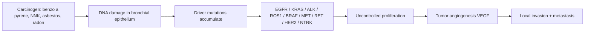

# Lung Cancer

> [!important]
> **Lung cancer** is the **leading cause of cancer-related death worldwide** (≈1.8 million deaths/year; GLOBOCAN 2022). It is broadly classified into **non-small cell lung cancer (NSCLC, 80–85%)** and **small cell lung cancer (SCLC, 15–20%)**, with major differences in biology, staging, and management. **Smoking accounts for ~85% of cases**, and **outcomes remain poor** because most patients present with advanced (metastatic) disease.

Related: [[COPD]] · [[Hemoptysis]] · [[Pleural Effusion]] · [[Chest X-Ray Approach]] · [[Pneumonia]] · [[Bronchiectasis]] · [[Tuberculosis]] · [[ABG Interpretation]] · [[Spirometry Interpretation]] · [[Interstitial and Diffuse Parenchymal Lung Diseases/Idiopathic pulmonary fibrosis|Idiopathic pulmonary fibrosis]] · [[Thoracic Malignancy]]

> [!tip]
> **FCPS/MRCP pearl**: Lung cancer is the **MCC cancer death in both sexes** globally. Any new suspicious mass on CXR in a smoker >40 years → **2-week-wait CT chest**. **SCLC = central, smoking-related, paraneoplastic (SIADH, ectopic ACTH, Lambert-Eaton)**. **Squamous = central, cavitating, hypercalcaemia (PTHrP)**. **Adenocarcinoma = peripheral, most common in non-smokers, EGFR/ALK/ROS1/PD-L1 targetable**. **Large cell = peripheral, undifferentiated, poor prognosis**.

## 1. Learning Objectives

- Define lung cancer, classify NSCLC vs SCLC, and recognise histologic subtypes and their clinical signatures.
- Describe the epidemiology and risk factors (smoking, asbestos, radon, occupational, genetic).
- Recognise clinical features including local, metastatic, and **paraneoplastic syndromes**.
- Apply the **TNM 8th edition** staging and the **limited vs extensive** SCLC dichotomy.
- Order and interpret investigations: CXR, contrast CT chest/abdomen/pelvis, **PET-CT**, **MRI brain**, **EBUS/mediastinoscopy**, biopsy, **molecular testing (EGFR/ALK/ROS1/BRAF/KRAS/PD-L1)**.
- Build an evidence-based management plan: surgery (early NSCLC), SBRT, chemotherapy, radiotherapy, **targeted therapy**, and **immunotherapy**.
- Discuss **screening** (low-dose CT in heavy smokers), **prognosis** (overall 5-yr ≈10–20%), and **complications** (SVC syndrome, Pancoast, Horner's, malignant effusion).

## 2. Definition

**Lung cancer** is a malignant neoplasm arising from the respiratory epithelium (bronchi, bronchioles, alveoli). Histologically:

| Type | Frequency | Key features |
|------|-----------|--------------|
| **Non-small cell lung cancer (NSCLC)** | **80–85%** | Slower-growing, often resectable when early |
| &nbsp;&nbsp;• Adenocarcinoma | ~40% of all | Peripheral, most common in non-smokers and women, **mucinous variant** |
| &nbsp;&nbsp;• Squamous cell carcinoma | ~25–30% | Central, cavitating, **hypercalcaemia** (PTHrP) |
| &nbsp;&nbsp;• Large cell carcinoma | ~5–10% | Peripheral, undifferentiated, poor prognosis |
| **Small cell lung cancer (SCLC)** | **15–20%** | Central, aggressive, **paraneoplastic (SIADH, ectopic ACTH, Lambert-Eaton)**, early metastasis |

> [!critical] **Adenocarcinoma in situ (AIS)** and **minimally invasive adenocarcinoma (MIA)** are pre-invasive lesions with excellent prognosis post-resection (>95% 5-yr survival).

## 3. Core Anatomy

### Airway and lung anatomy relevant to lung cancer

| Region | Cancer relevance |
|--------|------------------|
| **Trachea & carina** | Rare primary squamous/adeno; SVC runs anterior-right |
| **Main/lobar bronchi (central)** | Squamous & SCLC predominate; cough, haemoptysis, post-obstructive pneumonia |
| **Segmental bronchi** | Adenocarcinoma tends to arise distally |
| **Peripheral lung parenchyma** | Adenocarcinoma, large cell, metastases |
| **Apex (Pancoast region)** | Sulcus tumours → Horner's, brachial plexus invasion, shoulder pain |
| **Mediastinum (lymph nodes)** | N-staging; paratracheal, subcarinal, hilar, aortopulmonary |
| **Pleura** | Malignant pleural effusion (M1a) |
| **Chest wall / ribs** | Direct invasion (T3), rib metastases |
| **Diaphragm, recurrent laryngeal n.** | Phrenic/RLN palsy → hoarseness, raised hemidiaphragm |

### Lymph node stations (IASLC, key for N-staging)

- **N1**: ipsilateral peribronchial, hilar (stations 10–14)
- **N2**: ipsilateral mediastinal + subcarinal (stations 2–9)
- **N3**: contralateral mediastinal/hilar, supraclavicular (station 1)

## 4. Core Physiology

- **Tumour doubling time** correlates with histology: SCLC has very short doubling time (often <90 days) → early metastasis; adenocarcinoma typically slower.
- **Local effects**: airway obstruction → atelectasis, post-obstructive pneumonia; invasion → pleural effusion, SVC compression, Pancoast, vocal cord palsy.
- **Metastatic spread**:
  - **Lymphatic** → mediastinal, supraclavicular (especially left)
  - **Haematogenous** → bone (pain, hypercalcaemia), brain (seizures, focal deficit), liver, adrenal, contralateral lung
  - **Trans-coelomic / pleural seeding** → malignant effusion
- **Paraneoplastic mechanisms**:
  - **SIADH** (small cell) → ectopic ADH
  - **Ectopic ACTH** (small cell) → Cushing's
  - **PTHrP** (squamous) → hypercalcaemia
  - **Lambert-Eaton myasthenic syndrome (LEMS)** → antibodies vs presynaptic Ca²⁺ channels
  - **Hypertrophic pulmonary osteoarthropathy (HPOA)** → periosteal reaction
  - **Trousseau's syndrome** → migratory thrombophlebitis
  - **Anti-NMDA / anti-Hu / anti-Yo encephalitis** (small cell)

## 5. Normal Values / Important Cut-offs

| Parameter | Value | Comment |
|-----------|-------|---------|
| **Lung cancer 5-yr survival (all stages)** | **~10–20%** (UK ~15%) | Largely unchanged historically |
| **5-yr survival stage I NSCLC (resected)** | **70–90%** | Early detection critical |
| **5-yr survival extensive SCLC** | <5% | Aggressive disease |
| **NICE 2-week-wait referral criteria (lung)** | CXR suggestive of lung cancer OR ≥40 with haemoptysis | Urgent CT |
| **Smoking pack-years (high risk for screening)** | ≥30 pack-years | USPSTF / NHS Lung Health Check |
| **LDCT screening age range** | 55–74 (USPSTF) / 55–74 (UK NHS LHC) | Annual scan |
| **Mediastinal nodes short axis (CT)** | >10 mm = suspicious | Combined with PET |
| **Pleural fluid pH** | <7.2 | Suggests need for drainage in malignant effusion |
| **SCC antigen, CEA, Cyfra 21-1** | Trend markers | Not diagnostic; help monitor treatment |

## 6. Classification

### WHO 2021 classification (simplified for exam)

| Group | Subtypes |
|-------|----------|
| **NSCLC** | Adenocarcinoma (with lepidic, acinar, papillary, micropapillary, solid, mucinous variants), Squamous, Large cell, Adenosquamous, Sarcomatoid |
| **Neuroendocrine** | Carcinoid (typical/atypical), SCLC, Large cell neuroendocrine |
| **Salivary-gland type** | Mucoepidermoid, adenoid cystic |
| **Mesenchymal / others** | Sarcomas, lymphomas, metastases |

### Clinical classification for management

- **NSCLC**: staged by **TNM 8th edition**; treatment depends on stage + performance status + driver mutations + PD-L1 status
- **SCLC**: staged **limited** (confined to one hemithorax, including ipsilateral nodes, that can be encompassed in a single radiotherapy field) vs **extensive** (anything beyond) — or use TNM 8th

## 7. Etiology / Causes

### Major risk factors

| Factor | Comment |
|--------|---------|
| **Tobacco smoking (cigarettes)** | **~85% of all lung cancers**. Risk proportional to pack-years; continued smoking worsens outcomes. |
| **Second-hand (passive) smoking** | ~20–30% increased risk in non-smokers |
| **Asbestos exposure** | Synergistic with smoking (multiplicative). Mesothelioma + bronchogenic Ca. |
| **Radon gas** | Second leading cause after smoking; uranium decay in soil; affects miners and basement dwellings |
| **Occupational** | Arsenic, chromium, nickel, beryllium, cadmium, diesel exhaust, silica, coal tar, soot |
| **Ionising radiation** | Post-radiotherapy, atomic-bomb survivors |
| **Air pollution** | PM2.5, biomass fuel smoke (esp. in women, never-smokers) |
| **Previous lung disease** | COPD (independent risk), IPF, TB scars (scar adenocarcinoma) |
| **Family history** | 2-fold risk if first-degree relative affected |
| **Genetic susceptibility** | EGFR germline variants, BRCA2, TP53 |
| **HIV / immunosuppression** | Increased risk |

> [!important] **Smoking + asbestos** = **multiplicative** (not additive) risk — e.g. ~50–90× normal in heavy smokers with asbestos exposure.

## 8. Risk Factors

- **Age** >50, **male sex** (incidence falling in men, rising in women)
- **Cumulative tobacco exposure** (pack-years); pipe/cigar > cigarettes per gram (deeper inhalation)
- **E-cigarette / vaping** — uncertain long-term risk; acute EVALI
- **Low socio-economic status**
- **Diet** low in fruits/vegetables (weak); nitrosamines in cured meat
- **Hormone replacement therapy** (possible small increase in adenocarcinoma)

## 9. Pathophysiology

### Molecular pathogenesis of NSCLC



### Hallmarks of SCLC
- **Neuroendocrine differentiation** (chromogranin, synaptophysin, CD56 positive)
- **TP53 + RB1 loss** in nearly all cases
- **Small blue cells**, high N:C ratio, salt-and-pepper chromatin, crush artefact
- **Rapid growth**, early metastasis, paraneoplastic syndromes

### Pre-invasive lesions
- **Squamous**: dysplasia → carcinoma in situ → invasive SCC
- **Adenocarcinoma**: atypical adenomatous hyperplasia (AAH) → AIS → MIA → invasive adenocarcinoma

## 10. Clinical Features

### Symptoms and signs (by mechanism)

| Mechanism | Features |
|-----------|----------|
| **Local tumour** | Cough (new/changed), haemoptysis, dyspnoea, wheeze (monophonic), stridor, chest pain, post-obstructive pneumonia |
| **Regional invasion** | Hoarseness (recurrent laryngeal n.), dysphagia (oesophagus), SVC syndrome, Horner's, Pancoast, pleural/pericardial effusion, chest wall pain |
| **Metastatic** | Bone pain, pathological fracture, headache, seizures, focal neuro deficit, weight loss, anorexia, hepatomegaly, lymphadenopathy |
| **Paraneoplastic** | Hypercalcaemia (PTHrP), hyponatraemia (SIADH), Cushing's (ectopic ACTH), LEMS, HPOA, Trousseau's, neuromyopathy |

### Key syndromes (high-yield)

| Syndrome | Mechanism | Cancer type |
|----------|-----------|-------------|
| **Pancoast tumour** (superior sulcus) | Apical tumour invading brachial plexus + sympathetic chain | Usually squamous or adenocarcinoma |
| → Shoulder pain, arm pain (C8/T1) | | |
| → **Horner's syndrome**: ptosis, miosis, anhidrosis | Sympathetic chain invasion | |
| → Hand muscle wasting | T1 motor involvement | |
| **SVC syndrome** | Mediastinal mass compressing SVC | SCLC, NHL, squamous |
| → Facial/arm swelling, JVP↑, plethora, headache, cyanosis | | |
| **Horner's** (isolated) | Sympathetic chain → apex | Pancoast |
| **SIADH** (euvolaemic hyponatraemia) | Ectopic ADH | **SCLC** |
| **Ectopic ACTH** (Cushing's) | Ectopic ACTH | **SCLC**, carcinoid |
| **Hypercalcaemia** (PTHrP) | PTHrP secretion | **Squamous** |
| **Lambert-Eaton** (proximal weakness, ↑with use) | Anti-VGCC antibodies | **SCLC** |
| **HPOA** (clubbing, periostitis) | VEGF/PDGF | Adenocarcinoma |
| **Trousseau's** (migratory thrombophlebitis) | Mucins, tissue factor | Adenocarcinoma |

> [!critical] **SVC syndrome is an oncologic emergency** — urgent imaging, IV steroids, consider SVC stent, radiotherapy/chemo depending on histology.

## 11. Approach / Algorithm

### Diagnostic algorithm

```mermaid
flowchart TD
    A[Suspicious CXR or 2WW symptoms] --> B[Contrast CT chest + upper abdomen]
    B --> C[Staging: PET-CT ± MRI brain]
    C --> D[Tissue diagnosis: biopsy]
    D --> D1[Bronchoscopy ± EBUS-TBNA]
    D --> D2[Transthoracic CT-guided biopsy]
    D --> D3[Pleural fluid cytology / pleural biopsy]
    D --> D4[Mediastinoscopy / surgical biopsy]


*[Content truncated for rendering — see lung-cancer.md for full content]*
