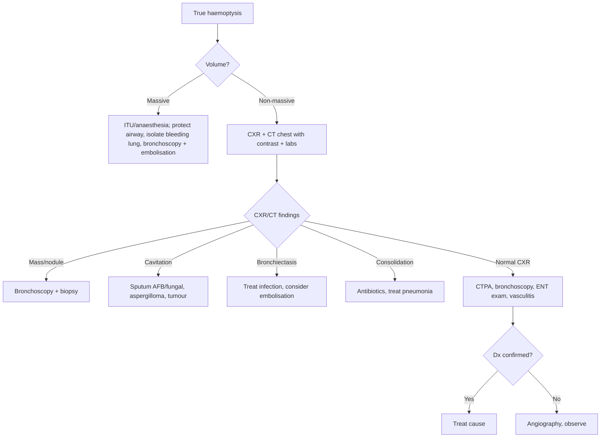

# Haemoptysis (Hemoptysis)

> [!important]
> **Haemoptysis** is the **expectoration of blood from the lower respiratory tract** (below the glottis). It ranges from **blood-streaked sputum to massive (>200 mL in 24 h) life-threatening haemorrhage**. Common causes include **bronchiectasis, lung cancer, pneumonia, TB, and PE**, but **massive haemoptysis** carries high mortality and requires urgent airway protection and intervention.

Related: [[Bronchiectasis]], [[Tuberculosis]], [[Lung Cancer]], [[Pneumonia]], [[Pulmonary Embolism]], [[Respiratory Failure]], [[ABG Interpretation]], [[Oxygen Therapy and NIV]], [[Chest X-Ray Approach]], [[Spirometry Interpretation]]

> [!tip] **FCPS/MRCP pearl**: Always distinguish **true haemoptysis** (from below glottis) from **haematemesis** (GI bleed) and **epistaxis** (nasal source). **Massive haemoptysis** (>200 mL/24 h or >100 mL/episode) = anaesthetic/ITU emergency. **Bronchiectasis + TB are the most common causes of massive haemoptysis worldwide**. **First investigation**: CXR (localises in 50–80%); **CT + bronchoscopy** for definitive diagnosis.

## 1. Definition

**Haemoptysis** = coughing up blood from the lower respiratory tract.

### Severity grading
| Severity | Volume | Action |
|----------|--------|--------|
| **Non-massive (scant–mild)** | <30 mL/24 h | Outpatient workup if stable |
| **Moderate** | 30–200 mL/24 h | Admit, urgent workup |
| **Massive** | >200 mL/24 h OR >100 mL/episode OR rapid airway compromise | Anaesthetic/ITU emergency, airway protection, bronchoscopy, embolisation |

> [!warning] **Massive haemoptysis** = **asphyxiation from blood filling the airways is the usual cause of death** (not exsanguination). Priorities are **airway protection (intubate, isolate lung with bleeding) and bleeding control (bronchoscopy, embolisation, surgery)**.

## 2. Pathophysiology

### Source of bleeding
- **High-pressure bronchial arteries** (90% of cases) — originate from aorta, supply airways; susceptible to chronic inflammation → neovascularisation, friable vessels
- **Low-pressure pulmonary arteries** (5%) — ruptured by PE, infection, vasculitis
- **Capillary bleeding** — alveolar haemorrhage (vasculitis, coagulopathy)

### Mechanisms
- **Chronic inflammation** (bronchiectasis, TB) → neovascularisation → vessel rupture
- **Tumour invasion** (lung cancer) → erosion into vessels
- **Cavitary disease** (TB, aspergilloma) → vessel erosion
- **Vascular abnormalities** (PE, AVM, vasculitis)
- **Coagulopathy** + minor lung insult

## 3. Aetiology

### By frequency
| Cause | Notes |
|-------|-------|
| **Bronchiectasis** | Most common cause of massive haemoptysis worldwide |
| **Lung cancer** | Squamous most often; central, cavitating |
| **TB (active or old)** | Common in endemic areas; Rasmussen aneurysm |
| **Pneumonia** | Especially with Klebsiella (currant-jelly sputum) |
| **PE** | Usually mild; pulmonary infarction |
| **Bronchitis** | Common benign cause |
| **Fungal** | Aspergilloma in pre-existing cavity |
| **Vasculitis** | GPA (Wegener's), MPA, EGPA |
| **AVM** | Hereditary haemorrhagic telangiectasia |
| **Coagulopathy** | Anticoagulants, thrombocytopenia, DIC, leukaemia |
| **Cardiac** | Mitral stenosis (pulmonary hypertension), LV failure |
| **Trauma / iatrogenic** | Bronchoscopy, biopsy, PA catheter, CVC |
| **Drugs** | Antiplatelets, anticoagulants, cocaine, thrombolytics |
| **Endometriosis** (catamenial) | Cyclical haemoptysis with menstruation |
| **Idiopathic / cryptogenic** | 5–10%; diagnosis of exclusion |

## 4. Clinical Features

### History
- **Volume of blood** (estimated by cupfuls, spoonfuls)
- **Frequency** (single episode vs recurrent)
- **Preceding symptoms**: cough, fever, night sweats, weight loss (cancer, TB)
- **Smoking** (cancer, COPD)
- **TB exposure**, prior TB, immigration from endemic area
- **Recent immobilisation, surgery, OCP** (PE)
- **Aspergillus exposure** (cavitary disease)
- **Epistaxis, oral ulceration, haematuria, rash** (vasculitis)
- **Menstrual cycle** (catamenial)
- **Drugs** (anticoagulants, antiplatelets, cocaine)
- **Prior bronchiectasis, CF, lung disease**

### Examination
- **Vital signs**: RR, HR, BP, SpO₂, temperature
- **Volume status**: signs of shock (massive bleed)
- **Anaemia**: pallor
- **Cachexia, clubbing** (cancer, chronic disease)
- **Lymphadenopathy** (malignancy, TB)
- **Chest exam**: focal crackles, wheeze, dullness, pleural rub
- **Cardiac**: murmurs (mitral stenosis), raised JVP
- **ENT**: epistaxis, oral cavity
- **Skin**: telangiectasia (HHT), rash (vasculitis, SLE)
| **Differentiating from haematemesis** | |
| **pH** | Haemoptysis alkaline, haematemesis acidic |
| **Colour** | Bright red (haemoptysis) vs dark brown (haematemesis) |
| **Mixed with** | Sputum (haemoptysis) vs food (haematemesis) |
| **Preceded by** | Cough (haemoptysis) vs vomiting (haematemesis) |
| **Foamy** | Yes (haemoptysis) — frothy sputum |

## 5. Investigations

### First-line
| Test | Role |
|------|------|
| **CXR** | Localises bleeding in 50–80%; masses, consolidation, cavities |
| **FBC, U&E, LFT, clotting** | Anaemia, coagulopathy, renal (vasculitis) |
| **ABG** | Oxygenation; alveolar haemorrhage ↑A-a gradient |
| **Sputum** | Culture, AFB, cytology |
| **ECG** | Right heart strain, ischaemia |
| **BNP** | Cardiac cause |
| **Urinalysis** | Vasculitis (haematuria) |

### Second-line
- **CTPA** — PE; **CT chest with contrast** — most useful for localising bleeding, masses, bronchiectasis, aspergilloma
- **Bronchoscopy (rigid preferred for massive)** — direct visualisation, biopsy, therapeutic (laser, electrocautery, iced saline, adrenaline, balloon tamponade)
- **Angiography (bronchial artery)** — definitive diagnosis + therapeutic embolisation
- **Echocardiogram** — mitral stenosis, pulmonary hypertension
- **Vasculitis screen** — ANCA, anti-GBM, ANA, complement
- **Coagulation** — coagulation profile, mixing studies

## 6. Diagnosis — algorithm

## 7. Management

### Massive haemoptysis — emergency
1. **Airway** — intubation with **large-bore ETT (≥8.0 mm)**; consider selective intubation of non-bleeding lung with patient in **lateral decubitus (bleeding side down)**
2. **Breathing** — high-flow O₂, suction
3. **Circulation** — large-bore IV access, fluid resuscitation, cross-match
4. **Localise** — CXR / CT / bronchoscopy (rigid preferred for visualisation and intervention)
5. **Bleeding control**:
   - **Bronchoscopic**: iced saline, adrenaline, laser, electrocautery, **bronchial blocker** (e.g. Fogarty)
   - **Bronchial artery embolisation (BAE)** — first-line interventional for massive
   - **Surgical resection** — last resort (lobectomy, pneumonectomy)
6. **Reverse coagulopathy** — vitamin K, FFP, PCC, platelets
7. **Treat underlying cause** — antibiotics, anti-TB, chemotherapy

### Non-massive
- **Admit**, monitor SpO₂, IV access
- **CXR + CT chest** (or directly CT if high suspicion)
- **Treat underlying cause** (infection, inflammation, cancer, PE)
- **Reversal of anticoagulation** if appropriate
- **Cough suppression** (codeine) — cautious, avoid suppressing productive cough
- **Tranexamic acid** — controversial; possible benefit
- **Bronchoscopy** for diagnostic and therapeutic

### Specific treatment
| Cause | Treatment |
|-------|-----------|
| **Bronchiectasis** | Antibiotics, postural drainage, BAE for recurrent/massive |
| **Lung cancer** | Resection, radiotherapy (including endobronchial brachytherapy), BAE |
| **TB** | Anti-TB therapy |
| **Aspergilloma** | Surgical resection if isolated; BAE; itraconazole/voriconazole |
| **PE** | Anticoagulation |
| **Vasculitis (GPA)** | Steroids + cyclophosphamide/rituximab |
| **AVM** | Embolisation |
| **Mitral stenosis** | Diuretics, valve intervention |
| **Coagulopathy** | Reverse anticoagulation, replace factors/platelets |

## 8. Complications
- **Asphyxiation** (main cause of death in massive)
- **Exsanguination** (rare)
- **Aspiration pneumonia** (blood to non-bleeding lung)
- **ARDS** (from blood + inflammatory response)
- **Airway obstruction, atelectasis**
- **Secondary infection**
- **Anaemia**
- **Death** (massive: 30–50% mortality if untreated)

## 9. FCPS/MRCP High-Yield Summary

| Domain | Key points |
|--------|------------|
| **Definition** | Blood from lower respiratory tract |
| **Massive** | >200 mL/24 h or >100 mL/episode |
| **Death in massive** | Usually asphyxiation, not exsanguination |
| **Most common cause (massive)** | Bronchiectasis + TB worldwide |
| **Common causes (mild)** | Bronchitis, bronchiectasis, cancer, TB, PE |
| **CXR** | First investigation; localises 50–80% |
| **CT** | Best non-invasive test |
| **Bronchoscopy** | Diagnostic + therapeutic (rigid for massive) |
| **Bronchial artery embolisation** | First-line interventional for massive |
| **Surgery** | Last resort |
| **Airway** | Lateral decubitus (bleeding side down), selective intubation |
| **Distinguish from haematemesis** | pH, colour, food, cough/vomit, frothy |
| **Vasculitis** | Consider in recurrent + extrapulmonary features |

## 10. Common Viva Questions

| Question | Expected answer |
|----------|-----------------|
| Define massive haemoptysis. | >200 mL/24 h or >100 mL/episode or rapid airway compromise. |
| What is the most common cause of massive haemoptysis? | Bronchiectasis and TB (worldwide). |
| What is the most common cause of death in massive haemoptysis? | **Asphyxiation** from blood filling the airways. |
| How do you distinguish haemoptysis from haematemesis? | pH, colour, food, cough/vomit, frothy sputum, melaena. |
| First-line investigation? | CXR. |
| Best non-invasive investigation? | CT chest with contrast. |
| First-line interventional for massive? | Bronchial artery embolisation (BAE). |
| Position of patient with massive haemoptysis? | Lateral decubitus, **bleeding side down**. |
| 3 drug causes? | Anticoagulants, antiplatelets, cocaine, thrombolytics. |
| 3 vasculitis causes? | GPA (Wegener's), MPA, EGPA, anti-GBM (Goodpasture). |

## 11. Confusions & Mnemonics

**Causes of haemoptysis** — **"BATTLE CAMP"**: **B**ronchiectasis, **A**VM, **T**B, **T**umour, **L**ung abscess, **E**mbolism, **C**oagulopathy, **A**lveolar haemorrhage, **M**itral stenosis, **P**neumonia

**Massive haemoptysis management** — **"A-B-C-D-E"**: **A**irway (intubate, lateral decubitus), **B**reathing (O₂), **C**irculation (IV access, fluid), **D**iagnose/localise (CXR, CT, bronchoscopy), **E**mbolise/surgery

**Distinguish from haematemesis** — **"Haemoptysis = C**oughed, **B**right red, **F**rothy, **A**lkaline"

## 12. Local Navigation
- **Chapter MOC**: [[../Respiratory MOC|Respiratory MOC]]
- **Related**: [[Bronchiectasis]] · [[Tuberculosis]] · [[Lung Cancer]] · [[Pneumonia]] · [[Pulmonary Embolism]] · [[Respiratory Failure]] · [[ABG Interpretation]] · [[Oxygen Therapy and NIV]] · [[Chest X-Ray Approach]] · [[Spirometry Interpretation]] · [[Pleural Effusion]]

## 13. MCQs (10)

1. Massive haemoptysis is defined as:
   A. >500 mL/24 h
   B. **>200 mL/24 h or >100 mL/episode**
   C. >50 mL total
   D. Any blood
   E. Recurrent
   **Answer: B** — >200 mL/24 h or >100 mL/episode.

2. Most common cause of massive haemoptysis worldwide:
   A. Lung cancer
   B. **Bronchiectasis (and TB)**
   C. Pneumonia
   D. PE
   E. Vasculitis
   **Answer: B** — Bronchiectasis + TB.

3. Most common cause of death in massive haemoptysis:
   A. Exsanguination
   B. **Asphyxiation from blood in airways**
   C. Shock
   D. PE
   E. MI
   **Answer: B** — Asphyxiation, not exsanguination.

4. Most useful initial investigation:
   A. CTPA
   B. **CXR**
   C. Bronchoscopy
   D. CT
   E. ABG
   **Answer: B** — CXR localises in 50–80%.

5. Best non-invasive imaging for haemoptysis:
   A. CXR
   B. **CT chest with contrast**
   C. V/Q
   D. MRI
   E. Ultrasound
   **Answer: B** — CT best non-invasive.

6. First-line interventional for massive haemoptysis:
   A. Surgery
   B. **Bronchial artery embolisation (BAE)**
   C. Bronchoscopy only
   D. Ligation
   E. Radiotherapy
   **Answer: B** — BAE first-line.

7. Distinguishing feature of haemoptysis vs haematemesis:
   A. Dark colour for haemoptysis
   B. **Bright red, frothy, alkaline, mixed with sputum**
   C. Coffee-ground
   D. Melaena
   E. Acidic
   **Answer: B** — Bright red, frothy, alkaline, with sputum.

8. Position of patient with massive haemoptysis:
   A. Supine
   B. **Lateral decubitus, bleeding side down**
   C. Prone
   D. Sitting upright
   E. Trendelenburg
   **Answer: B** — Bleeding side down to protect non-bleeding lung.

9. Cancer-associated massive haemoptysis management:
   A. Conservative only
   B. **BAE + radiotherapy +/− surgery**
   C. Antibiotics
   D. Steroids
   E. Chemo only
   **Answer: B** — Multi-modal.

10. First step in massive haemoptysis management:
    A. Bronchoscopy
    B. **Airway protection (intubation if needed)**
    C. CXR
    D. Embolisation
    E. CT
    **Answer: B** — Airway first.

## 14. SBA Questions (10)

1. A 50-year-old with bronchiectasis has 300 mL haemoptysis. First step:
   A. CXR
   B. **Protect airway + IV access + cross-match + prepare for bronchoscopy/BAE**
   C. Discharge
   D. Oral antibiotics
   E. Steroids
   **Answer: B** — Resuscitate + secure airway.

2. A 60-year-old smoker with weight loss and recurrent small-volume haemoptysis. Most likely:
   A. Bronchiectasis
   B. **Lung cancer**
   C. TB
   D. PE
   E. Pneumonia
   **Answer: B** — Cancer: smoker + weight loss + haemoptysis.

3. A 25-year-old with episodic haemoptysis around menstruation. Diagnosis:
   A. Endometriosis
   B. **Catamenial haemoptysis (thoracic endometriosis)**
   C. Sarcoid
   D. TB
   E. None
   **Answer: B** — Catamenial = cyclical with menses.

4. A 45-year-old with haemoptysis, sinusitis, glomerulonephritis, ANCA positive. Diagnosis:
   A. Sarcoid
   B. **Granulomatosis with polyangiitis (GPA)**
   C. TB
   D. Asthma
   E. Cancer
   **Answer: B** — GPA.

5. A 55-year-old with sudden pleuritic pain, mild haemoptysis, A-a gradient, D-dimer ↑. Diagnosis:
   A. Pneumonia
   B. **Pulmonary embolism**
   C. Asthma
   D. TB
   E. Cancer
   **Answer: B** — PE with pulmonary infarction.

6. Haemoptysis with cavitating lesion and air crescent sign:
   A. TB
   B. **Aspergilloma (mycetoma)**
   C. Cancer
   D. Abscess
   E. Wegener's
   **Answer: B** — Aspergilloma classic.

7. First-line treatment of aspergilloma with recurrent haemoptysis:
   A. Antifungal only
   B. **Surgical resection if isolated; BAE for inoperable**
   C. Steroids
   D. Observation
   E. Radiotherapy
   **Answer: B** — Surgery or BAE.

8. Recurrent haemoptysis in a known bronchiectasis patient despite antibiotics:
   A. Lobe resection
   B. **BAE first; surgery if recurrent**
   C. Transplant
   D. Steroids
   E. Anticoagulation
   **Answer: B** — BAE first.

9. Rigid vs flexible bronchoscopy in massive haemoptysis:
   A. Flexible preferred
   B. **Rigid preferred (better airway control + suction + intervention)**
   C. Both equal
   D. Neither
   E. CT only
   **Answer: B** — Rigid bronchoscopy in massive.

10. Haemoptysis in pregnancy - first investigation:
    A. CTPA
    B. **CXR; if needed, proceed cautiously with imaging**
    C. Bronchoscopy
    D. MRI
    E. No investigation
    **Answer: B** — CXR first; minimise radiation if pregnant.

## 15. Flashcards

- **Q: Massive haemoptysis definition?**
  A: >200 mL/24 h or >100 mL/episode.

- **Q: Most common cause of massive haemoptysis?**
  A: Bronchiectasis (and TB).

- **Q: Most common cause of death in massive haemoptysis?**
  A: Asphyxiation from blood in airways.

- **Q: Best initial test?**
  A: CXR.

- **Q: Best non-invasive test?**
  A: CT chest with contrast.

- **Q: First-line interventional?**
  A: Bronchial artery embolisation (BAE).

- **Q: Distinguishing haemoptysis from haematemesis?**
  A: Haemoptysis: bright red, frothy, alkaline, mixed with sputum, preceded by cough.

- **Q: Position of patient?**
  A: Lateral decubitus, bleeding side down.

- **Q: What is aspergilloma?**
  A: Fungal ball in pre-existing cavity (TB, sarcoid) with air crescent sign.

- **Q: Catamenial haemoptysis?**
  A: Cyclical haemoptysis with menstruation (thoracic endometriosis).

## 16. Answer Key with Explanations

### MCQs
1. **B** — >200 mL/24 h.
2. **B** — Bronchiectasis.
3. **B** — Asphyxiation.
4. **B** — CXR.
5. **B** — CT with contrast.
6. **B** — BAE.
7. **B** — Bright red, frothy, alkaline, sputum.
8. **B** — Lateral decubitus, bleeding side down.
9. **B** — Multi-modal.
10. **B** — Airway first.

### SBAs
1. **B** — Resuscitate.
2. **B** — Lung cancer.
3. **B** — Catamenial.
4. **B** — GPA.
5. **B** — PE.
6. **B** — Aspergilloma.
7. **B** — Surgery or BAE.
8. **B** — BAE first.
9. **B** — Rigid bronchoscopy.
10. **B** — CXR first.

## PasTest Scenario SBAs (Clinical Vignettes)

> **Auto-generated PasTest/Mediscope-style scenario SBAs** grounded in the authored source. Each scenario tests a real clinical fact (triad, specific sign, contraindication, trial, first-line Rx) extracted from the topic. *Source: Ch 17: Respiratory Medicine — Hemoptysis*

**Q1.** What is the most appropriate first-line therapy for Hemoptysis?

  - **A.** Treat underlying cause
  - **B.** An advanced/surgical therapy reserved for refractory disease
  - **C.** Symptomatic treatment only, no disease-modifying therapy
  - **D.** Empiric broad-spectrum therapy without specific indication

  > **Answer: A** — Treat underlying cause
  >
  > *Source:* **Treat underlying cause** (infection, inflammation, cancer, PE)

