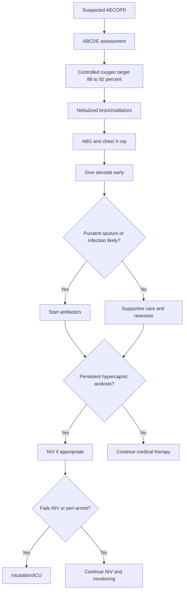
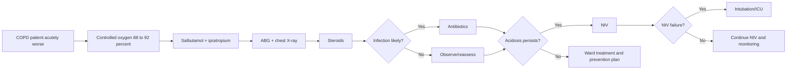

# Acute exacerbation of COPD

> [!important]
> **Acute exacerbation of COPD (AECOPD)** is an acute worsening of dyspnea, cough, and/or sputum beyond usual day-to-day variation that requires a change in treatment. In exams it is a major cause of **acute hypercapnic respiratory failure**, hospitalization, NIV use, and avoidable death if oxygen is prescribed unsafely.

Related: [[COPD]], [[Asthma]], [[Respiratory Failure]], [[ABG Interpretation]], [[Spirometry Interpretation]], [[Oxygen Therapy and NIV]], [[Chest X-Ray Approach]], [[Pneumonia]]

> [!tip]
> FCPS/MRCP questions commonly test **trigger recognition, COPD vs asthma logic, controlled oxygen prescription, ABG interpretation, antibiotic/steroid indications, NIV criteria, intubation triggers, and common mistakes such as over-oxygenation**.

## Learning Objectives
- Define AECOPD and distinguish it from stable COPD, asthma exacerbation, pneumonia, pulmonary edema, and pulmonary embolism.
- Understand the airway and gas-exchange physiology underlying hypoxemia, hypercapnia, dynamic hyperinflation, and respiratory muscle fatigue.
- Interpret ABG and chest X-ray clues safely.
- Apply a structured treatment approach including oxygen, bronchodilators, steroids, antibiotics when appropriate, NIV, and escalation.
- Recognize red flags, contraindications, and common exam traps.

## Definition
AECOPD is an **acute clinical deterioration** in a patient with COPD characterized by worsening respiratory symptoms that are more than normal day-to-day variation and necessitate additional treatment.

### Practical bedside definition
Think of AECOPD when a COPD patient develops worsening:
- dyspnea
- cough
- sputum volume
- sputum purulence
- wheeze/chest tightness
- exercise intolerance or reduced function

## Core Anatomy
### 1. Conducting airways and small airways
- COPD mainly affects **small airways** and in many patients also the alveolar units.
- During exacerbation, inflamed airways become more narrowed due to:
  - edema
  - bronchospasm
  - mucus hypersecretion
  - retained secretions

### 2. Alveolar and acinar structures
- Emphysematous destruction reduces elastic recoil and support for small airways.
- This promotes expiratory airway collapse and air trapping during acute illness.

### 3. Respiratory muscles
- Hyperinflation flattens the diaphragm.
- In exacerbation, the diaphragm works at a mechanical disadvantage and may fatigue.

### 4. Pulmonary vasculature
- Chronic hypoxic vasoconstriction may already be present.
- Acute worsening of gas exchange increases strain on the right ventricle and may precipitate cor pulmonale decompensation.

> [!important]
> AECOPD is an **airflow obstruction + secretion load + dynamic hyperinflation + gas-exchange failure** problem.

## Core Physiology
### 1. Increased airflow limitation
Exacerbation worsens pre-existing obstruction because of:
- increased airway inflammation
- mucus plugging
- bronchoconstriction
- infection-triggered edema

### 2. Dynamic hyperinflation
- Expiratory flow limitation prevents full lung emptying.
- End-expiratory lung volume rises.
- Work of breathing increases.
- Dyspnea worsens and respiratory muscles tire.

### 3. Ventilation-perfusion mismatch
- Worsened airway obstruction creates more poorly ventilated but perfused lung units.
- Result: **hypoxemia**.

### 4. Hypercapnia logic
Hypercapnia develops when:
- alveolar ventilation falls
- dead space fraction rises
- work of breathing becomes unsustainable
- respiratory muscles fatigue

### 5. Oxygen-induced CO2 retention
In susceptible COPD patients, excessive oxygen can worsen CO2 retention because of:
- worsened V/Q mismatch
- reduced hypoxic pulmonary vasoconstriction
- Haldane effect

> [!warning]
> In AECOPD, oxygen is a **drug**. Too little is dangerous, but too much may worsen hypercapnia and acidosis.

## Normal Values / Important Cut-offs
### ABG
- pH: **7.35–7.45**
- PaCO2: **35–45 mmHg** or **4.7–6.0 kPa**
- PaO2: **80–100 mmHg** or **10.7–13.3 kPa**
- HCO3-: **22–26 mmol/L**

### Oxygen target in COPD exacerbation
- If risk of hypercapnic respiratory failure: **target SpO2 88–92%**
- If COPD diagnosis is uncertain but retention risk exists, use controlled oxygen and check ABG early.

### Severity clues
- worsening dyspnea with inability to speak full sentences
- RR >30/min or marked work of breathing
- drowsiness/confusion
- silent or very poor air entry
- acidosis on ABG
- persistent hypoxemia despite controlled oxygen

### NIV trigger concept
Typical indication in AECOPD:
- **persistent hypercapnic acidosis** despite optimal medical therapy, e.g. pH **<7.35** with raised PaCO2

## Classification
### 1. By etiology
- infective exacerbation
- non-infective exacerbation
- mixed trigger exacerbation

### 2. By severity of current episode
- mild: managed with short-acting bronchodilators only
- moderate: requires bronchodilators + antibiotics and/or steroids
- severe: requires hospital assessment, often hypoxemia/hypercapnia or significant functional limitation

### 3. By gas-exchange pattern
- no respiratory failure
- type 1 respiratory failure
- type 2 respiratory failure
- acute on chronic hypercapnic respiratory failure

## Etiology / Causes
### Common triggers
- viral infection
- bacterial infection
- air pollution / smoke exposure
- poor inhaler adherence
- stopping maintenance therapy
- heart failure or ischemia
- pulmonary embolism
- pneumothorax
- sedatives/opioids

### Infective clues
- increased sputum purulence
- increased sputum volume
- fever may or may not be present
- CXR may show concomitant pneumonia

## Risk Factors
- severe baseline COPD
- frequent prior exacerbations
- chronic hypercapnia
- home oxygen or NIV use
- smoking continuation
- poor nutrition / frailty
- cardiac comorbidity
- bronchiectasis overlap
- prior ICU/NIV/intubation

## Pathophysiology
AECOPD usually reflects acute amplification of chronic disease:
- airway inflammation rises
- mucus production increases
- secretions become difficult to clear
- expiratory airflow worsens
- dynamic hyperinflation rises
- oxygenation falls
- CO2 clearance may fail
- respiratory muscles fatigue

Final common pathway:
- dyspnea
- tachypnea
- use of accessory muscles
- worsening ABG
- respiratory failure if untreated

## Clinical Features
### Symptoms
- worsening breathlessness
- increased cough
- more sputum
- purulent sputum
- wheeze
- chest tightness
- reduced exercise tolerance
- fatigue or morning headache if hypercapnic

### Signs
- tachypnea
- accessory muscle use
- prolonged expiration
- diffuse wheeze or diminished breath sounds
- cyanosis
- flap or drowsiness in hypercapnia
- peripheral edema if cor pulmonale

### Severe deterioration clues
- confusion or reduced consciousness
- exhaustion
- silent chest / minimal air entry
- hemodynamic instability
- new arrhythmia

## Approach / Emergency Algorithm

## Investigations
### Immediate
- pulse, BP, RR, temperature
- SpO2
- mental status
- ECG if arrhythmia/chest pain

### ABG
Essential if:
- SpO2 low
- controlled oxygen started
- severe breathlessness
- drowsiness/confusion
- suspected hypercapnia
- poor response to initial treatment

### Chest X-ray
Useful to detect:
- pneumonia
- pneumothorax
- pulmonary edema
- large effusion

### Laboratory tests
- FBC
- U&E
- CRP if infection assessment needed
- sputum culture in selected hospitalized/recurrent cases
- troponin if ischemia suspected

## Interpretation Frameworks
### 1. ABG interpretation in AECOPD
1. Check oxygenation.
2. Check PaCO2.
3. Check pH.
4. Look for chronic compensation via bicarbonate.
5. Decide whether this is acute, chronic, or acute-on-chronic respiratory failure.

#### Common patterns
| ABG pattern | Interpretation |
|---|---|
| Low PaO2 with normal/low PaCO2 | hypoxemic exacerbation without major ventilatory failure yet |
| Low PaO2 + high PaCO2 + near-normal pH + raised HCO3- | chronic CO2 retainer with compensation |
| Low PaO2 + high PaCO2 + low pH | **acute on chronic hypercapnic respiratory failure** |

### 2. Oxygen therapy interpretation
- Use **Venturi mask or controlled oxygen** if hypercapnia risk.
- Recheck ABG after oxygen initiation.
- A rising PaCO2 with falling pH after uncontrolled oxygen is a classic exam scenario.

### 3. Chest X-ray clues
- hyperinflation may be baseline
- focal consolidation suggests pneumonia trigger
- cardiomegaly/edema suggest LV failure
- pleural line suggests pneumothorax

### 4. Spirometry logic
- Formal spirometry is **not** for acute confirmation during severe exacerbation.
- Use prior COPD diagnosis and acute clinical picture.
- Spirometry is revisited after recovery.

## Diagnosis
AECOPD is a **clinical diagnosis** in a known or strongly suspected COPD patient with acute worsening of respiratory symptoms requiring treatment change.

Diagnosis is strengthened by:
- infective symptoms
- hypoxemia/hypercapnia on ABG
- CXR excluding or identifying alternative/trigger diagnoses

## Differential Diagnosis
| Differential | Clues favoring it |
|---|---|
| **Asthma exacerbation** | younger age, more variable symptoms, atopy, stronger reversibility history |
| **Pneumonia** | fever, focal crackles, consolidation on CXR |
| **Pulmonary embolism** | pleuritic pain, sudden unexplained hypoxemia, VTE risk factors |
| **Pneumothorax** | sudden unilateral pain, asymmetry, acute deterioration |
| **Acute LV failure** | orthopnea, crackles, edema, cardiogenic CXR pattern |
| **Sedative/opioid effect** | depressed mental state, hypoventilation history |
| **Bronchiectasis exacerbation** | large-volume purulent sputum, recurrent infections, CT history |

### Asthma vs AECOPD
| Feature | Asthma exacerbation | AECOPD |
|---|---|---|
| Age | often younger | usually older |
| Smoking history | may be absent | common |
| Symptom variability | marked | chronic progressive background |
| Oxygen target | 94–98% usually | 88–92% if retention risk |
| Hypercapnia significance | late ominous sign | may occur earlier / acute-on-chronic |

## Management
### Immediate treatment
1. **Controlled oxygen** to target **88–92%**.
2. **Nebulized bronchodilators**:
   - salbutamol
   - ipratropium
3. **Systemic steroids early**:
   - e.g. prednisolone **40 mg daily for 5 days** in typical exam practice.
4. **Assess need for antibiotics**.
5. **Repeat ABG** if hypercapnic risk or initial abnormality.
6. **Escalate to NIV** if acidosis persists.

### Bronchodilators
- Nebulized salbutamol commonly used.
- Add ipratropium in moderate-severe attacks.
- Metered-dose inhaler with spacer may be suitable in milder exacerbation.

### Steroids
Benefits:
- shorten recovery time
- improve lung function
- reduce treatment failure and relapse

### Antibiotics
Use when bacterial infection is likely, especially with:
- increased sputum purulence
- increased sputum volume
- fever/inflammatory features
- radiographic pneumonia

Common exam principle: choose according to local policy and severity; do not give automatically to every exacerbation.

### NIV
#### Indications
- persistent respiratory acidosis despite optimal medical therapy
- rising PaCO2 with increased work of breathing
- patient still cooperative and protecting airway

#### Benefits
- reduces intubation
- reduces mortality
- improves gas exchange

#### Contraindications / relative unsuitability
- reduced consciousness / inability to protect airway
- vomiting/high aspiration risk
- facial trauma or mask intolerance
- hemodynamic instability
- peri-arrest state

### Intubation and ICU
Consider when:
- NIV fails
- worsening acidosis or exhaustion
- refractory hypoxemia
- inability to protect airway
- arrest/near-arrest

## Drug Interactions / Contraindications / Cautions
### Oxygen
- avoid uncontrolled high-flow oxygen if CO2 retention risk exists
- titrate and recheck ABG

### Beta2 agonists
- tachycardia
- tremor
- hypokalemia
- arrhythmia risk

### Anticholinergics
- generally safe
- caution in glaucoma exposure to nebulized mist

### Steroids
- hyperglycemia
- delirium/mood effects
- infection concerns do not justify withholding needed short-course therapy

### Sedatives/opioids
- may worsen hypoventilation and CO2 retention
- use great caution

## Procedures / Indications / Contraindications
### ABG sampling
**Indication:** suspected hypercapnic respiratory failure, severe exacerbation, oxygen titration.

### NIV
**Indication:** hypercapnic acidosis despite treatment.

**Contraindication:** unprotected airway, agitation preventing mask use, peri-arrest state.

### Intubation
**Indication:** failure of NIV or life-threatening deterioration.

## Procedure Mini-Sections
### ABG in AECOPD
- **Why:** defines hypoxemia, hypercapnia, and acidosis
- **Pearl:** do it early after starting controlled oxygen
- **Complication:** pain, hematoma

### NIV setup pearl
- **Goal:** unload respiratory muscles and improve alveolar ventilation
- **Pitfall:** delaying escalation when NIV is clearly failing

## Complications
- acute on chronic hypercapnic respiratory failure
- pneumonia/sepsis
- arrhythmia
- pneumothorax
- cor pulmonale decompensation
- need for ventilation
- steroid complications / hyperglycemia

## Red Flags / Emergencies
- drowsiness/confusion
- silent chest or very poor air entry
- worsening acidosis
- persistent hypoxemia
- hemodynamic instability
- inability to clear secretions
- NIV failure

## Special Situations
### COPD with pneumonia overlap
- often needs antibiotics
- oxygen and ABG logic remain critical

### Asthma-COPD overlap
- may respond better to bronchodilators/steroids
- still prescribe oxygen cautiously if CO2 retention risk exists

### Elderly/frail patient
- lower reserve
- delirium, aspiration, and heart failure may complicate presentation

## Prognosis
- Exacerbations accelerate functional decline.
- Need for hospitalization/NIV predicts higher future mortality and readmission.
- Prevention after recovery is as important as acute treatment.

## Topic Correlation
- [[COPD]] covers baseline disease, spirometric diagnosis, and long-term care.
- [[Respiratory Failure]] and [[ABG Interpretation]] are essential for exam logic.
- [[Oxygen Therapy and NIV]] anchors safe oxygen and ventilatory support.
- [[Pneumonia]] is a common trigger and mimic.

## FCPS/MRCP High-Yield Points
- AECOPD often presents with **worsened dyspnea + sputum volume/purulence**.
- **Target SpO2 is 88–92%** if hypercapnic risk exists.
- ABG must be checked early in severe cases.
- **Over-oxygenation can worsen hypercapnia**.
- Steroids shorten recovery; antibiotics are used when bacterial infection is likely.
- **NIV is lifesaving** in persistent hypercapnic acidosis.
- Differentiate from asthma, pneumonia, PE, pneumothorax, and LV failure.

## Common Viva Questions
- Define acute exacerbation of COPD.
- What oxygen target do you use and why?
- How do you interpret ABG in acute on chronic respiratory failure?
- When do you start antibiotics?
- What are NIV indications and contraindications?
- How do you differentiate AECOPD from acute asthma?

## Common Confusions / Exam Traps
- Giving uncontrolled high-flow oxygen without ABG follow-up.
- Assuming all exacerbations need antibiotics.
- Missing pneumonia or pneumothorax as the true cause of deterioration.
- Confusing chronic compensated hypercapnia with acute decompensation.
- Delaying NIV despite persistent hypercapnic acidosis.

## Mnemonics
### **COPD CARE** for AECOPD
- **C**ontrolled oxygen
- **O**bserve ABG
- **P**uffs/nebulizers
- **D**rugs: steroids ± antibiotics
- **C**onsider NIV
- **A**ssess triggers
- **R**echeck gases
- **E**scalate if failing

## Mind Map
- AECOPD
  - triggers
    - infection
    - smoke/pollution
    - PE/pneumothorax/LVF
  - physiology
    - obstruction
    - hyperinflation
    - VQ mismatch
    - hypercapnia
  - tests
    - ABG
    - CXR
    - ECG
  - treatment
    - oxygen 88 to 92
    - bronchodilators
    - steroids
    - antibiotics if indicated
    - NIV if acidotic
  - dangers
    - over-oxygenation
    - rising CO2
    - NIV failure

## Flowchart

## Suggested Visuals / Image Notes
- ABG pattern table: chronic vs acute-on-chronic CO2 retention
- Venturi mask oxygen target box
- COPD exacerbation vs asthma exacerbation comparison table
- CXR clue panel: pneumonia, pneumothorax, edema

## Suggested Video References
- Short review on **AECOPD emergency management and NIV indications**
- Video on **ABG interpretation in COPD exacerbation**
- Viva-style review on **controlled oxygen in COPD**

## One-Page Revision Summary
### AECOPD rapid sheet
- **Definition:** acute worsening of COPD symptoms requiring treatment change
- **Main symptoms:** dyspnea, sputum volume, sputum purulence, wheeze
- **Main dangers:** hypoxemia, hypercapnia, acidosis, pneumonia trigger, pneumothorax, LVF mimic
- **Oxygen target:** **88–92%** if CO2 retention risk
- **Initial treatment:** controlled oxygen, bronchodilators, steroids, assess antibiotics, ABG, CXR
- **ABG pearl:** acute on chronic failure = high CO2 + low pH on background raised HCO3-
- **NIV:** for persistent hypercapnic acidosis despite treatment
- **Do not:** over-oxygenate, delay ABG, miss pneumonia/pneumothorax, delay NIV

## 24-Hour Recall Prompts
- State the oxygen target in AECOPD.
- Why can over-oxygenation worsen COPD exacerbation?
- When do you give antibiotics?
- What ABG pattern suggests acute on chronic hypercapnic respiratory failure?
- What are the indications for NIV?
- Name five differentials of AECOPD.

## 7-Day / 15-Day / 30-Day Revision Tracker
- **Day 1:** Write emergency treatment steps from memory.
- **Day 7:** Interpret three sample ABG patterns for COPD exacerbation.
- **Day 15:** Compare AECOPD vs acute asthma vs pneumonia.
- **Day 30:** Reproduce NIV indications/contraindications and escalation logic from a blank page.

## Must Know / Should Know / Nice to Know
### Must Know
- oxygen target 88–92%
- ABG interpretation
- steroid role
- antibiotic indications
- NIV indications

### Should Know
- Haldane/VQ logic of CO2 rise with oxygen
- common mimics and triggers
- contraindications to NIV

### Nice to Know
- detailed outpatient prevention strategies and advanced phenotype-driven care

## My Weak Points
- Do I remember the exact oxygen target?
- Can I distinguish acute from chronic hypercapnia?
- Do I know when antibiotics are indicated?
- Can I state when NIV should start and when it should stop?

## Self-Test Scorecard
- Understanding /10
- Recall /10
- ABG interpretation /10
- MCQ performance /10
- Viva confidence /10

**Interpretation:**
- **<35/50** = weak topic
- **35–44/50** = fair
- **45+/50** = strong exam-ready topic

## Exam Answer Modes
### Short note mode
AECOPD is an acute worsening of symptoms in a COPD patient requiring treatment change. Clinically it presents with worsening dyspnea, cough, wheeze, and increased sputum volume or purulence. Key management is controlled oxygen to target 88–92%, bronchodilators, early systemic steroids, antibiotics when infection is likely, ABG monitoring, and NIV for persistent hypercapnic acidosis.

### Viva mode
- Define it.
- State common triggers.
- Give oxygen target.
- Mention ABG and CXR.
- State antibiotic indications.
- Explain NIV indications and escalation.

### Ward-case mode
In a COPD patient with acute dyspnea, start controlled oxygen, assess severity, give bronchodilators and steroids, send ABG, look for pneumonia/pneumothorax/LVF, decide on antibiotics, and escalate to NIV if hypercapnic acidosis persists.

## Summary
AECOPD is a high-yield respiratory emergency where safe care depends on **controlled oxygen, early ABG interpretation, bronchodilators, steroids, selective antibiotics, and timely NIV/escalation**.

## MCQs (10)
1. The target oxygen saturation in a COPD exacerbation with hypercapnia risk is:
   - A. 70–75%
   - B. 80–85%
   - C. 88–92%
   - D. 94–98%
   - E. 100%

2. Which symptom most strongly suggests infective AECOPD?
   - A. Weight gain over 6 months
   - B. Increased sputum purulence
   - C. Isolated ankle pain
   - D. Chronic snoring
   - E. Hair loss

3. An ABG shows low PaO2, high PaCO2, low pH, and raised HCO3-. This suggests:
   - A. Pure metabolic alkalosis
   - B. Acute on chronic hypercapnic respiratory failure
   - C. Normal ABG
   - D. Isolated pulmonary embolism only
   - E. Simple anxiety

4. Which treatment is most appropriate early in hospitalized AECOPD?
   - A. Routine intubation for all patients
   - B. Controlled oxygen, bronchodilators, and steroids
   - C. No oxygen at all
   - D. Antibiotics for every patient regardless of trigger
   - E. Formal spirometry before treatment

5. Which is a common consequence of excessive oxygen in susceptible COPD?
   - A. Immediate cure of bronchospasm
   - B. Worsening CO2 retention
   - C. Severe metabolic alkalosis only
   - D. Elimination of sputum production
   - E. Prevention of pneumonia

6. NIV is most indicated in AECOPD when there is:
   - A. Mild cough only
   - B. Hypercapnic acidosis despite medical treatment
   - C. Completely normal ABG
   - D. Isolated rhinorrhea
   - E. Stable asymptomatic wheeze

7. Which diagnosis is an important mimic of AECOPD?
   - A. Cataract
   - B. Tension headache
   - C. Pulmonary embolism
   - D. Psoriasis
   - E. Otitis externa

8. Formal spirometry during a severe acute exacerbation is:
   - A. the key emergency test before treatment
   - B. generally not the immediate test of choice
   - C. mandatory before oxygen
   - D. more important than ABG
   - E. contraindicated forever

9. Which finding most strongly suggests need for urgent escalation?
   - A. Mild tremor after salbutamol
   - B. Improving dyspnea
   - C. Drowsiness with worsening acidosis
   - D. Stable appetite
   - E. Productive cough alone

10. Antibiotics in AECOPD are best used when:
   - A. every patient has COPD
   - B. bacterial infection is likely, e.g. purulent sputum
   - C. bronchodilators are unavailable
   - D. spirometry is normal
   - E. patient is under 40 years old

## SBA Questions (10)
1. A 69-year-old smoker with known COPD presents with worsening breathlessness and purulent sputum. SpO2 is 84% on air. What is the best initial oxygen strategy?
   - A. No oxygen until ABG returns
   - B. High-flow uncontrolled oxygen until saturation is 100%
   - C. Controlled oxygen targeting SpO2 88–92%
   - D. Room air only
   - E. Intubation immediately without treatment

2. An ABG in a COPD exacerbation shows pH 7.29, PaCO2 8.4 kPa, PaO2 7.3 kPa on controlled oxygen. What is the best next step if initial bronchodilators and steroids have been given?
   - A. Discharge home
   - B. Start NIV if no contraindication
   - C. Stop oxygen entirely
   - D. Give only cough syrup
   - E. Repeat spirometry instead

3. A COPD patient acutely worsens and has sudden pleuritic chest pain with unilateral reduction in breath sounds. What complication should be excluded urgently?
   - A. Sarcoidosis
   - B. Pneumothorax
   - C. Tuberculosis meningitis
   - D. Pulmonary fibrosis
   - E. Sleep apnea

4. A patient with COPD exacerbation receives too much uncontrolled oxygen. Which ABG trend is most likely?
   - A. Falling PaCO2 with rising pH in every case
   - B. Rising PaCO2 with worsening acidosis
   - C. Normalization of all values immediately
   - D. Isolated metabolic acidosis only
   - E. No ABG change ever occurs

5. A 72-year-old man with COPD exacerbation has increased sputum purulence and volume. What additional treatment is most appropriate?
   - A. Routine anticoagulation only
   - B. Antibiotics
   - C. Stop bronchodilators
   - D. Bronchoscopy immediately for all cases
   - E. Sedation for dyspnea

6. Which feature best differentiates asthma exacerbation from AECOPD?
   - A. Both always occur in smokers
   - B. Asthma usually has greater historical variability and reversibility
   - C. COPD never wheezes
   - D. Asthma never causes hypoxemia
   - E. COPD never responds to steroids

7. A patient on NIV becomes more drowsy and acidotic. What is the best interpretation?
   - A. Good response to NIV
   - B. NIV failure requiring urgent escalation
   - C. Discharge is now appropriate
   - D. ABG should be ignored
   - E. Continue same plan for 24 hours without review

8. A 67-year-old woman with COPD exacerbation also has orthopnea, bibasal crackles, and edema. Which competing diagnosis should be considered strongly?
   - A. Migraine
   - B. Acute left ventricular failure
   - C. Appendicitis
   - D. Nephrotic syndrome
   - E. Otitis media

9. In hospitalized AECOPD, which investigation is most helpful for identifying pneumonia or pneumothorax?
   - A. Stool culture
   - B. Spirometry only
   - C. Chest X-ray
   - D. Skin biopsy
   - E. EEG

10. A frail COPD patient is confused, cyanosed, and tiring despite treatment. What is the best action?
   - A. Delay review until morning
   - B. Urgent senior/ICU escalation for ventilatory support decision
   - C. Stop oxygen and send home
   - D. Give only oral mucolytic
   - E. Ignore the confusion as baseline aging

## Flashcards
- Q: What is the usual oxygen target in AECOPD with hypercapnia risk?
  A: **88–92%**.
- Q: What symptom suggests bacterial infective exacerbation?
  A: **Increased sputum purulence**.
- Q: What ABG pattern suggests acute on chronic hypercapnic respiratory failure?
  A: **Low PaO2 + high PaCO2 + low pH**, often with raised bicarbonate.
- Q: What is the role of steroids in AECOPD?
  A: They shorten recovery and reduce treatment failure.
- Q: When are antibiotics used in AECOPD?
  A: When bacterial infection is likely, especially with purulent sputum.
- Q: What is the key ventilatory support for persistent hypercapnic acidosis in AECOPD?
  A: **NIV**.
- Q: Name three dangerous mimics of AECOPD.
  A: Pneumonia, pneumothorax, pulmonary embolism.
- Q: Why should oxygen be controlled in COPD exacerbation?
  A: Excess oxygen can worsen CO2 retention and acidosis.
- Q: Is formal spirometry the acute emergency test in severe AECOPD?
  A: No, ABG is more urgent.
- Q: What indicates NIV failure?
  A: Worsening drowsiness, acidosis, or inability to tolerate/benefit from support.

## Answer Key with Explanations
### MCQs
1. **C. 88–92%**
   - This is the safe target range for COPD patients at risk of hypercapnic respiratory failure.
2. **B. Increased sputum purulence**
   - Purulence strongly suggests bacterial infective exacerbation.
3. **B. Acute on chronic hypercapnic respiratory failure**
   - Raised bicarbonate suggests chronic compensation; low pH indicates acute decompensation.
4. **B. Controlled oxygen, bronchodilators, and steroids**
   - This is the core early bundle.
5. **B. Worsening CO2 retention**
   - Excess oxygen can precipitate rising PaCO2 and acidosis.
6. **B. Hypercapnic acidosis despite medical treatment**
   - This is a classic NIV indication.
7. **C. Pulmonary embolism**
   - PE is a key mimic and must be considered when the story is atypical.
8. **B. generally not the immediate test of choice**
   - Formal spirometry is not the acute priority during severe exacerbation.
9. **C. Drowsiness with worsening acidosis**
   - This implies dangerous decompensation.
10. **B. bacterial infection is likely, e.g. purulent sputum**
   - Antibiotics are selective, not universal.

### SBAs
1. **C. Controlled oxygen targeting SpO2 88–92%**
   - Safe oxygen prescription is the first principle.
2. **B. Start NIV if no contraindication**
   - Persistent acidotic hypercapnia after initial therapy is a classic NIV scenario.
3. **B. Pneumothorax**
   - Sudden unilateral findings strongly suggest pneumothorax.
4. **B. Rising PaCO2 with worsening acidosis**
   - This is the feared consequence of over-oxygenation in susceptible patients.
5. **B. Antibiotics**
   - Purulent sputum supports bacterial infective exacerbation.
6. **B. Asthma usually has greater historical variability and reversibility**
   - This is a major differentiator.
7. **B. NIV failure requiring urgent escalation**
   - Deterioration on NIV needs immediate reassessment.
8. **B. Acute left ventricular failure**
   - LVF is an important competing diagnosis.
9. **C. Chest X-ray**
   - CXR is high-yield for pneumonia or pneumothorax.
10. **B. Urgent senior/ICU escalation for ventilatory support decision**
   - Confusion and cyanosis despite treatment signal severe decompensation.
