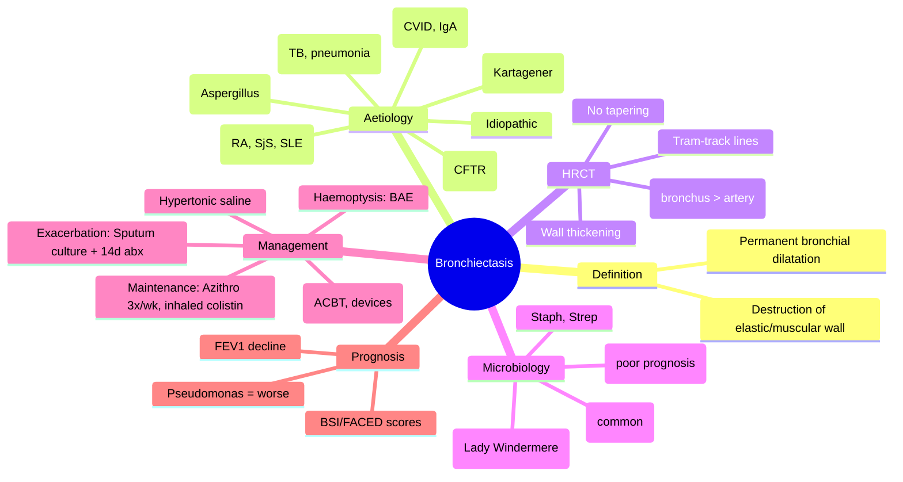

# Bronchiectasis and Suppurative Airway Disease

Related: [[Airway diseases]], [[COPD]], [[Cystic fibrosis]], [[ABPA]], [[Chronic bronchitis]], [[Recurrent infections]], [[Haemoptysis]], [[Pseudomonas]], [[NTM]], [[Cystic fibrosis-related bronchiectasis]]

> [!important]
> **Bronchiectasis** = **permanent abnormal dilatation of bronchi** due to **destruction of elastic and muscular components** from **chronic inflammation/infection**. **Key FCPS/MRCP**: **Daily productive cough** (copious purulent sputum), **recurrent infections**, **HRCT: tram-track lines, signet rings, bronchial wall thickening**, **Pseudomonas aeruginosa** = worse prognosis, **airway clearance + antibiotics**, **FEV1 decline predictor**, **surgery rarely**, **NTM/MAC** in non-CF.

## Learning Objectives
- Define bronchiectasis and distinguish from COPD, chronic bronchitis, asthma
- Identify **aetiology** (post-infective, immune deficiency, CF, ABPA, primary ciliary dyskinesia, connective tissue disease)
- Recognise **clinical features** (daily purulent sputum, recurrent exacerbations, haemoptysis, clubbing)
- Interpret **HRCT** (tram-track, signet ring, bronchial wall thickening, lack of tapering)
- Apply **severity scores** (Bronchiectasis Severity Index - BSI, FACED)
- Manage **airway clearance** (physiotherapy, devices, mucolytics) + **antibiotics** (exacerbation vs maintenance)
- Screen for **Pseudomonas** (worse prognosis) and **NTM/MAC** (especially non-CF, elderly women)
- Apply **exacerbation management** (sputum culture, antibiotics 14d, airway clearance intensification)
- Recognise **complications** (massive haemoptysis, respiratory failure, cor pulmonale, amyloidosis)

## Definition
**Bronchiectasis** = **permanent, abnormal dilatation of bronchi** resulting from **destruction of elastic and muscular components** of bronchial walls due to **chronic necrotising inflammation and infection**. **Bronchi lose normal tapering** → dilated, thick-walled, mucus-filled.

> **FCPS/MRCP tip**: **Bronchiectasis ≠ COPD**. **Daily purulent sputum** = hallmark. **HRCT = gold standard**. **Pseudomonas = worse prognosis**.

## Aetiology (Common Causes)
| Category | Examples | Proportion |
|----------|----------|------------|
| **Post-infective** | TB (post-TB bronchiectasis), severe pneumonia, whooping cough, measles, adenovirus | **~30-40%** (historically) |
| **Immune deficiency** | **Primary** (IgG subclass def, CVID, IgA def), **Secondary** (HIV, immunosuppression, steroids) | ~10-20% |
| **Cystic fibrosis (CF)** | CFTR mutation | **Common in young adults** (separate entity) |
| **ABPA** | Aspergillus fumigatus hypersensitivity | ~5-10% |
| **Primary ciliary dyskinesia (PCD)** | Kartagener's (situs inversus), recurrent sinusitis/otitis | Rare |
| **Connective tissue disease** | RA, Sjögren's, SLE, MCTD, SSc | ~5-10% |
| **Inflammatory bowel disease** | Crohn's, UC | Rare |
| **Allergic bronchopulmonary aspergillosis** | Aspergillus sensitisation | ~5-10% |
| **Post-obstructive** | Tumour, foreign body, stricture | Rare |
| **Idiopathic** | No identifiable cause | **~30-40%** (modern series) |

> **FCPS/MRCP tip**: **Post-infective (TB/pneumonia) + Idiopathic = majority**. **Screen for immune deficiency** (IgG, IgA, IgM, CVID) and **CTD** (ANA, RF, CCP, ANCA).

## Pathophysiology
1. **Initial insult** (infection, immune defect, obstruction) → airway inflammation
2. **Neutrophil infiltration** → release **elastase, proteases, ROS, MMPs** → destroy bronchial wall elastin/muscle
3. **Impaired mucociliary clearance** → mucus stasis → bacterial colonisation
4. **Vicious cycle (Cole's hypothesis)**: Infection → inflammation → structural damage → impaired clearance → more infection
5. **Bronchial wall destruction** → permanent dilatation, thickened walls, mucus plugging
6. **Chronic colonisation** (Pseudomonas, Haemophilus, Streptococcus, NTM) → persistent inflammation

## Clinical Features
### Classic Triad
1. **Chronic daily cough** (productive, **copious purulent sputum**, often morning)
2. **Recurrent lower respiratory infections** (≥3/year = frequent exacerbator)
2. **Haemoptysis** (streaks to massive, from dilated bronchial arteries)

### Additional Features
- **Breathlessness** (progressive, due to airflow obstruction + airway inflammation)
- **Wheeze** (variable)
- **Weight loss**, fatigue (chronic inflammation)
- **Clubbing** (~5-10%, more in severe/fibrotic)
- **Sinusitis/rhinitis** (common, especially PCD, ABPA, CTD)
- **Fever** (during exacerbations)
- **Chest pain** (pleuritic if pleural involvement)

### Examination
- **Coarse crackles** (bibasal, mid-inspiratory, "Velcro" but coarser than IPF)
- **Wheeze** (if airflow obstruction)
- **Digital clubbing** (late)
- **Signs of cor pulmonale** (late: JVP, peripheral oedema)
- **Signs of aetiology**: CTD (joints, skin), PCD (situs inversus, rhinitis), CF (malnutrition, steatorrhoea)

## Investigations
### 1. HRCT Chest (Gold Standard)
| Finding | Description |
|---------|-------------|
| **Tram-track lines** | **Parallel thickened bronchial walls** (longitudinal view) |
| **Signet rings** | **Dilated bronchus (outer) + thickened wall (inner) > adjacent pulmonary artery** (cross-section) |
| **Lack of bronchial tapering** | **Bronchi visible within 1cm of pleural surface** |
| **Bronchial wall thickening** | **Wall thickness >50% of diameter** |
| **Mucus plugging** | **Air-fluid levels, finger-in-glove opacities** |
| **Mosaic attenuation** | Air-trapping on expiratory CT |
| **Honeycombing** | Late, fibrosis (not typical bronchiectasis) |

> **FCPS/MRCP tip**: **Signet ring + tram-track = bronchiectasis**. **Dilated bronchus > pulmonary artery = diagnostic**.

### 2. Sputum Microbiology (At Stability + Exacerbation)
| Pathogen | Frequency | Significance |
|----------|-----------|--------------|
| **Haemophilus influenzae** | Most common | Standard therapy |
| **Pseudomonas aeruginosa** | **~20-30%** (increasing with severity) | **Worse prognosis**, more exacerbations, faster FEV1 decline, needs anti-pseudomonal therapy |
| **Streptococcus pneumoniae** | Common | Standard |
| **Staphylococcus aureus** | Including MRSA | Anti-staph coverage |
| **Moraxella catarrhalis** | Common | Standard |
| **NTM/MAC** | **Non-CF, elderly women** (Lady Windermere syndrome) | Specific therapy needed |
| **Aspergillus** | ABPA, colonisation | Check IgE, precipitins |

> **FCPS/MRCP tip**: **Pseudomonas = worse prognosis**. **Chronic Pseudomonas = consider maintenance antibiotics**. **NTM/MAC in non-CF elderly women = Lady Windermere syndrome**.

### 3. Immune/Autimmune Screen
- **Immunoglobulins** (IgG, IgA, IgM, subclasses) → CVID, IgG subclass deficiency
- **ANA, RF, CCP, ANCA, ENA** → CTD (RA, Sjögren's, SLE, vasculitis)
- **HIV** (if risk factors)
- **CF screen** (sweat chloride, genetics) if young/unexplained
- **Ciliary function** (nasal nitric oxide, brush biopsy) if PCD suspected

### 4. Lung Function
- **Obstructive pattern** (↓ FEV1, ↓ FEV1/FVC) — most common
- **Restrictive** (if extensive fibrosis)
- **↓ DLCO** (if emphysema/fibrosis)
- **Serial FEV1** → **rate of decline predictor** (>50mL/yr = poor prognosis)

### 5. Severity Scores (Prognostic)
| Score | Components | Use |
|-------|------------|-----|
| **BSI (Bronchiectasis Severity Index)** | Age, BMI, FEV1%, hospitalisations, exacerbations, MRC dyspnoea, colonisation (Pseudomonas), radiology extent | **Mortality prediction** (0–4 low, 5–8 moderate, ≥9 high) |
| **FACED** | FEV1, Age, Chronic Pseudomonas, Exacerbations, Dyspnoea (MRC) | **Simpler**, mortality prediction |

## Management
### 1. Airway Clearance (Cornerstone, Daily)
| Technique | Description |
|-----------|-------------|
| **Active cycle of breathing technique (ACBT)** | Breathing control, deep breathing, forced expiration (huff) |
| **Postural drainage + percussion** | Gravity-assisted, manual chest physiotherapy |
| **Mechanical devices** | Flutter valve, Acapella, RC-Cornet, PEP mask |
| **High-frequency chest wall oscillation** | Vest therapy (expensive, selected) |
| **Exercise** | Aerobic + resistance (improves clearance, QoL) |

### 2. Mucolytics
| Agent | Indication |
|-------|------------|
| **Hypertonic saline (6–7%)** | Nebulised, pre-physiotherapy (improves clearance) |
| **Dornase alfa (rhDNase)** | CF primarily; **unproven in non-CF bronchiectasis** |
| **Carbocisteine / Erdosteine / N-acetylcysteine** | Oral mucolytics (modest benefit) |

### 3. Exacerbation Management (Antibiotics 14 Days)
| Step | Action |
|------|--------|
| **1. Sputum culture** (ideally pre-antibiotics) | Guide targeted therapy |
| **2. Increase airway clearance** | 2–4x/day during exacerbation |
| **3. Empiric antibiotics** (if culture pending) | Based on previous isolates: H. influenzae → co-amoxiclav/azithro; Pseudomonas → ciprofloxacin/levofloxacin IV/oral; MRSA → doxycycline/linezolid |
| **3. Targeted therapy** (when culture back) | Narrow to sensitivities |
| **4. Duration** | **14 days** (standard); 21d if Pseudomonas |
| **5. IV vs oral** | IV if severe (sepsis, failed oral, malabsorption, Pseudomonas) |

### 4. Maintenance / Prophylactic Antibiotics (If Frequent Exacerbations)
| Criteria | Regimen |
|----------|---------|
| **≥3 exacerbations/year** despite optimal airway clearance | **Azithromycin 250mg 3x/week** (or 500mg 3x/week) — macrolide anti-inflammatory + antimicrobial |
| **Chronic Pseudomonas** + frequent exacerbations | **Inhaled colistin** (1-2 MU BD) **or** inhaled tobramycin (300mg BD) ± oral ciprofloxacin |
| **NTM/MAC** | **Macrolide-based regimen** (azithromycin + ethambutol + rifampicin) |
| **Monitoring** | Sputum cultures 3–6 monthly, hearing (aminoglycosides), QT (macrolides), LFT |

### 5. Management of Specific Aetiologies
| Aetiology | Specific Management |
|-----------|---------------------|
| **Cystic fibrosis** | CFTR modulators (Kaftrio), hypertonic saline, dornase alfa, anti-pseudomonal therapy, nutrition |
| **ABPA** | Steroids + itraconazole, omalizumab if refractory |
| **Immune deficiency (CVID)** | IVIG replacement (400–600mg/kg q3–4wk) |
| **CTD-related** | Treat underlying CTD (immunosuppression) |
| **PCD** | Airway clearance, ENT management, fertility counselling |
| **Post-TB** | Standard bronchiectasis management |

### 6. Haemoptysis Management
| Severity | Management |
|----------|------------|
| **Streaks/minor** | Reassurance, antibiotics if infective, airway clearance |
| **Moderate** (50–200mL) | Admit, IV antibiotics, bronchial artery embolisation (BAE) if recurrent |
| **Massive** (>200mL/24h or >100mL/hr) | **ICU, airway protection, BAE (definitive), surgery if BAE fails** |

## Complications
| Complication | Details |
|--------------|---------|
| **Recurrent exacerbations** | Frequent exacerbator phenotype (≥3/yr) |
| **Massive haemoptysis** | Bronchial artery hypertrophy → life-threatening |
| **Respiratory failure** | Progressive airflow obstruction + chronic infection |
| **Cor pulmonale** | Late, hypoxic pulmonary hypertension |
| **Amyloidosis (AA)** | Chronic inflammation → renal/hepatic/cardiac deposition |
| **Lung abscess** | Cavitation from necrotising infection |
| **Empyema** | Pleural infection |

## Prognosis
- **Median survival**: ~10–15 years post-diagnosis (highly variable)
- **Predictors of poor outcome**: Low FEV1, Pseudomonas colonisation, frequent exacerbations, low BMI, age, extensive HRCT, BSI high score
- **FEV1 decline**: ~30–50 mL/yr (accelerated vs normal 20–30)

## Topic Correlation
- [[Airway diseases]] — COPD, asthma overlap
- [[Cystic fibrosis]] — CF bronchiectasis
- [[ABPA]] — Aspergillus-related
- [[NTM/MAC]] — Lady Windermere syndrome
- [[CTD-ILD]] — RA/Sjögren's bronchiectasis
- [[Pleural diseases]] — empyema, haemothorax

## FCPS/MRCP High-Yield Points
1. **Bronchiectasis** = permanent bronchial dilatation, **daily purulent sputum**, recurrent infections
2. **HRCT**: **Tram-track lines, signet rings, bronchial wall thickening**, lack of tapering
3. **Aetiology**: Post-infective (TB/pneumonia), immune deficiency, CF, ABPA, CTD, idiopathic
4. **Pseudomonas** = worse prognosis, more exacerbations, faster FEV1 decline → anti-pseudomonal therapy
5. **Airway clearance** = cornerstone (ACBT, devices, hypertonic saline)
6. **Exacerbation**: Sputum culture → 14 days antibiotics (anti-pseudomonal if Pseudomonas)
7. **Maintenance antibiotics**: ≥3 exacerbations/yr → **azithromycin 250mg 3x/week**; chronic Pseudomonas → inhaled colistin/tobramycin
8. **NTM/MAC in non-CF**: Elderly women, mid-lung nodules/bronchiectasis (Lady Windermere)
9. **Massive haemoptysis** → bronchial artery embolisation (BAE)
10. **BSI/FACED** scores for prognosis

## Common Viva Questions
1. Bronchiectasis vs COPD vs chronic bronchitis
2. HRCT findings (signet ring, tram-track)
3. Aetiology and investigations (immune screen, CTD, CF)
7. Pseudomonas significance and management
8. Exacerbation management (culture, antibiotics, duration)
9. Maintenance antibiotics (azithromycin, inhaled colistin)
10. Haemoptysis management (BAE)
11. NTM/MAC Lady Windermere syndrome
12. BSI/FACED scores

## Common Confusions / Exam Traps
- **Bronchiectasis = COPD** — NO (different pathology, daily purulent sputum, HRCT different)
- **Dornase alfa for all bronchiectasis** — NO (CF only, unproven in non-CF)
- **Pseudomonas = treat every isolation** — NO (chronic colonisation vs infection; treat exacerbations)
- **Azithromycin daily** — NO (250mg 3x/week for prophylaxis; QT prolongation risk)
- **NTM = treat all** — NO (assess clinical/radiological significance; ATS criteria)
- **Dornase alfa = for all** — NO (CF only)
- **Bronchiectasis = always idiopathic** — NO (screen for immune deficiency, CTD, CF, ABPA)
- **Massive haemoptysis = intubate first** — NO (BAE is definitive, protect airway)

## Mnemonics
- **BRONCHIECTASIS CAUSES**: **P**ost-infective, **I**mmune deficiency, **C**F, **A**BPA, **C**TD, **P**CD, **I**diopathic = **PICCPI** (wait... **POSTINFECTIVE, IMMUNE, CF, ABPA, CTD, PCD, IDIOPATHIC**)
- **HRCT FINDINGS**: **T**ram-track, **S**ignet ring, **W**all thickening, **N**o tapering = **TSWN**
- **PSEUDOMONAS BAD**: **P**rognosis worse, **S**everity higher, **E**xacerbations more, **U**nresponsive to standard abx, **D**ecline faster, **O**nly anti-pseudo abx, **M**aintenance inhaled, **E**xacerbations frequent, **A**lways culture
- **BRONCHIECTASIS MANAGEMENT**: **A**irway clearance (daily), **B**ronchodilators if obstructed, **C**ulture sputum, **D**rugs (antibiotics 14d), **E**xacerbation prompt, **T**argeted therapy, **A**zithromycin maintenance, **S**urgery rarely, **I**mmunoglobulins if CVID, **S**urgery rarely = **ABCDETASSIS**

## Mind Map


## Flowchart
```mermaid
flowchart TD
    A[Chronic daily purulent sputum + recurrent infections] --> B[HRCT Chest]
    B --> C{Signet rings + Tram-track?}
    C -- YES --> D[BRONCHIECTASIS DIAGNOSED]
    C -- NO --> E[Alternative: COPD, COPD+bronchiectasis, CTD, PCD]
    D --> F[Investigate Aetiology\nSputum cultures, IgG/IgA/IgM, ANA/RF/CCP/ANCA, HIV, Sweat chloride, Ciliary function]
    F --> G{Aetiology Identified?}
    G -- YES --> H[Specific Management (CF, ABPA, CVID, CTD, PCD)]
    G -- NO --> I[Idiopathic]
    H --> J[Core Management]
    I --> J
    J --> K[Airway Clearance Daily (ACBT, devices, hypertonic saline)]
    K --> L[Exacerbation: Sputum culture + 14d antibiotics]
    L --> M{Frequent Exacerbations (≥3/yr)?}
    M -- YES --> N[Maintenance: Azithromycin 250mg 3x/wk\nIf Pseudomonas: Inhaled colistin/tobramycin]
    M -- NO --> O[Continue core management]
    O --> P[Monitor: FEV1, BSI/FACED, Sputum cultures q3-6mo]
```

## One-Page Revision Summary
- **Bronchiectasis** = permanent bronchial dilatation, daily purulent sputum, recurrent infections
- **HRCT**: Signet ring (bronchus > artery), tram-track, wall thickening, no tapering
- **Aetiology**: Post-infective, immune deficiency, CF, ABPA, CTD, PCD, idiopathic
- **Pseudomonas** = worse prognosis, faster FEV1 decline, needs anti-pseudomonal therapy
- **Airway clearance** = daily ACBT, devices, hypertonic saline (CORNERSTONE)
- **Exacerbation** = sputum culture → 14d antibiotics (anti-pseudomonal if Pseudomonas)
- **Maintenance abx**: ≥3/yr → azithromycin 250mg 3x/wk; chronic Pseudomonas → inhaled colistin/tobramycin
- **NTM/MAC**: elderly women, mid-lung (Lady Windermere)
- **Haemoptysis**: BAE definitive
- **BSI/FACED** for prognosis

## 24-Hour Recall Prompts
- Bronchiectasis definition + classic triad
- HRCT 4 classic findings
- 5 aetiologies + proportions
- Pseudomonas significance + management
- Airway clearance techniques (3)
- Exacerbation management steps
- Maintenance antibiotics criteria + agents
- Lady Windermere syndrome
- Haemoptysis management
- BSI/FACED components

## 7-Day / 15-Day / 30-Day Revision Tracker
- [ ] Day 1 completed
- [ ] 24-hour recall completed
- [ ] Day 7 revision completed
- [ ] Day 15 revision completed
- [ ] Day 30 revision completed

## Must Know / Should Know / Nice to Know
### Must Know
- Bronchiectasis definition, classic triad
- HRCT findings (signet ring, tram-track)
- Aetiology categories
- Pseudomonas = poor prognosis
- Airway clearance daily
- Exacerbation: culture + 14d abx
- Maintenance abx criteria
- Haemoptysis → BAE
- NTM/MAC Lady Windermere
- BSI/FACED scores

### Should Know
- Immune workup (IgG, IgA, CVID)
- CF screening (sweat chloride)
- ABPA diagnosis (IgE, bronchiectasis)
- PCD (Kartagener, situs inversus)
- CTD associations
- Dornase alfa (CF only)
- Hypertonic saline vs dornase
- Inhaled antibiotics (colistin, tobramycin)
- BAE for haemoptysis

### Nice to Know
- PCD genetics
- Anti-inflammatory macrolides mechanism
- Anti-fibrotics in bronchiectasis
- Surgical resection (rare)
- Lung transplant criteria
- Amyloidosis complication
- Lung function trajectories
- Quality of life measures (QOL-B, SGRQ)
- Microbiome in bronchiectasis

## Self-Test Scorecard
- Understanding: /10
- Recall: /10
- MCQ Performance: /10
- SBA Performance: /10
- Viva Confidence: /10
- Total: /50

> [!tip]
> Interpretation: <35 = weak topic, 35-44 = acceptable but insecure, 45+ = strong exam-ready topic.

## Exam Answer Modes
### Long Answer Skeleton
- Definition, classic triad, pathophysiology (vicious cycle)
- Aetiology table with proportions
- HRCT findings (signet ring, tram-track, wall thickening, no tapering)
- Microbiology (common pathogens, Pseudomonas significance)
- Severity scores (BSI, FACED)
- Management: airway clearance (daily), mucolytics, exacerbation (culture + 14d abx), maintenance (azithromycin, inhaled antibiotics), haemoptysis (BAE)
- Aetiology-specific management (CF, ABPA, CVID, CTD, PCD, NTM)
- Complications, prognosis, scores (BSI, FACED)

### Short Note Skeleton
- Definition + triad box
- HRCT box
- Aetiology table
- Management algorithm
- Pseudomonas box
- Maintenance abx box
- Haemoptysis box
- Scores box

### Viva One-Liners
- "Bronchiectasis = permanent bronchial dilatation, daily purulent sputum, recurrent infections"
- "HRCT: Signet ring (bronchus > artery), tram-track, wall thickening, no tapering"
- "Aetiology: Post-infective (TB/pneumonia), immune deficiency, CF, ABPA, CTD, PCD, idiopathic"
- "Pseudomonas = worse prognosis, faster FEV1 decline, more exacerbations, anti-pseudomonal therapy"
- "Airway clearance daily = cornerstone (ACBT, devices, hypertonic saline)"
- "Exacerbation = sputum culture + 14 days antibiotics (anti-pseudomonal if Pseudomonas)"
- "Maintenance antibiotics: ≥3 exacerbations/yr → azithromycin 250mg 3x/week; chronic Pseudomonas → inhaled colistin/tobramycin"
- "NTM/MAC in non-CF = elderly women, mid-lung (Lady Windermere syndrome)"
- "Massive haemoptysis = bronchial artery embolisation (BAE) definitive"
- "BSI = age, BMI, FEV1%, hospitalisations, exacerbations, MRC, Pseudomonas, radiology extent"
- "FACED = FEV1, Age, Chronic Pseudomonas, Exacerbations, Dyspnoea"
- "Dornase alfa = CF only, unproven in non-CF bronchiectasis"
- "ABPA = asthma + central bronchiectasis + IgE >1000 + Aspergillus sensitisation"

### Ward-Case Discussion Points
- 55M, daily purulent sputum 5yrs, 4 exacerbations/yr, Pseudomonas on culture, FEV1 55% → bronchiectasis, frequent exacerbator, chronic Pseudomonas → airway clearance, hypertonic saline, azithromycin 250mg 3x/wk + inhaled colistin
- 30F CF, daily sputum, FEV1 65%, M. abscessus on culture → CF bronchiectasis, NTM management, CFTR modulator (Kaftrio), airway clearance, consider inhaled amikacin
- 70F non-smoker, cough 2yrs, HRCT mid-lung bronchiectasis + nodules, MAC on culture → Lady Windermere syndrome → azithromycin + ethambutol + rifampicin, monitor LFT/vision/hearing
- 45M RA, bronchiectasis, daily sputum, recurrent infections → CTD-related bronchiectasis, optimise RA control (RTX if refractory), airway clearance, standard bronchiectasis management

### Last-Night-Before-Exam Sheet
- Bronchiectasis = Perm dilatation, daily purulent sputum, recurrent infx
- HRCT: Signet ring, Tram-track, Wall thickening, No tapering
- Causes: TB/pneumonia, immune def, CF, ABPA, CTD, PCD, idiopathic
- Pseudomonas = Bad (prognosis, FEV1 decline, exacerbations)
- Airway clearance DAILY: ACBT, devices, hypertonic saline
- Exacerbation: Culture + 14d abx (anti-pseudo if PsA)
- Maintenance: ≥3/yr → Azithro 250mg 3x/wk; PsA → inhaled colistin/tobramycin
- NTM/MAC: Elderly women, mid-lung = Lady Windermere
- Haemoptysis: BAE definitive
- BSI/FACED = Prognosis
- Dornase = CF ONLY

## Summary
**Bronchiectasis** = **permanent bronchial dilatation** from **chronic inflammation/infection** destroying bronchial elastic/muscular components. **Classic triad**: **daily purulent sputum**, **recurrent infections**, **haemoptysis**. **HRCT gold standard**: **signet rings** (dilated bronchus > adjacent artery), **tram-track lines** (parallel wall thickening), **bronchial wall thickening**, **lack of tapering**. **Aetiology**: post-infective (TB/pneumonia), immune deficiency (CVID, IgA), CF, ABPA, CTD, PCD, idiopathic. **Pseudomonas** = worse prognosis, faster FEV1 decline, needs anti-pseudomonal therapy. **Management**: **daily airway clearance** (ACBT, devices, hypertonic saline) = cornerstone. **Exacerbation**: sputum culture → **14 days antibiotics** (anti-pseudomonal if Pseudomonas). **Maintenance**: ≥3 exacerbations/yr → **azithromycin 250mg 3x/week**; chronic Pseudomonas → **inhaled colistin/tobramycin**. **NTM/MAC** in non-CF elderly women = **Lady Windermere syndrome**. **Massive haemoptysis** → **bronchial artery embolisation (BAE)**. **Prognosis**: **BSI/FACED** scores predict mortality. **Dornase alfa = CF only**.

## MCQs (10)
1. **Hallmark symptom** of bronchiectasis:
   A. Nocturnal wheeze
   B. **Daily purulent sputum**
   C. Dry cough at night
   D. Exertional dyspnoea only

2. **HRCT signet ring sign** = 
   A. Dilated bronchus with thickened wall > adjacent pulmonary artery
   B. Mucus plug in bronchus
   C. Centrilobular nodule
   D. Pleural thickening

3. **Most common aetiology** of bronchiectasis in modern series:
   A. Cystic fibrosis
   B. **Post-infective + Idiopathic**
   C. Immune deficiency
   D. ABPA

4. **Pseudomonas aeruginosa** in bronchiectasis indicates:
   A. Better prognosis
   B. **Worse prognosis, faster FEV1 decline, more exacerbations**
   C. Need for immediate surgery
   D. Allergic bronchopulmonary aspergillosis

4. **Cornerstone of bronchiectasis management**:
   A. Long-term oral steroids
   B. **Daily airway clearance (ACBT, devices, hypertonic saline)**
   C. Prophylactic antibiotics in all
   D. Surgical resection

5. **Exacerbation management** — antibiotic duration:
   A. 5 days
   B. 7 days
   C. **14 days**
   D. 21 days (always)

6. **Maintenance azithromycin** for frequent exacerbations:
   A. 500mg daily
   B. **250mg 3x/week**
   C. 500mg 3x/week
   D. 250mg daily

6. **Lady Windermere syndrome** refers to:
   A. CF with Pseudomonas
   B. **NTM/MAC bronchiectasis in elderly non-CF women**
   C. Post-TB bronchiectasis
   D. ABPA with central bronchiectasis

7. **Massive haemoptysis** in bronchiectasis — definitive treatment:
   A. High-dose steroids
   B. **Bronchial artery embolisation (BAE)**
   C. Intubation and ventilation
   D. Pneumonectomy

8. **BSI (Bronchiectasis Severity Index)** includes:
   A. Only FEV1 and age
   B. **Age, BMI, FEV1%, hospitalisations, exacerbations, MRC, Pseudomonas, radiology extent**
   C. Only Pseudomonas and exacerbations
   D. Only FACED components

9. **Dornase alfa (rhDNase)** in bronchiectasis:
   A. First-line for all
   B. **CF only, unproven in non-CF bronchiectasis**
   C. Only for Pseudomonas
   D. Only for ABPA

## SBA Questions (10)
1. A 55M, daily purulent sputum 5 years, 4 exacerbations/year, Pseudomonas on culture, FEV1 55%. Best long-term management?
   A. Oral prednisolone
   B. **Airway clearance + azithromycin 250mg 3x/week + inhaled colistin**
   C. Continuous oral ciprofloxacin
   D. Lung transplant referral

2. A 30F with CF, recurrent exacerbations, M. abscessus on culture. Best microbiological management?
   A. Azithromycin alone
   B. **Azithromycin + ethambutol + rifampicin + consider inhaled amikacin**
   C. Levofloxacin alone
   D. No antibiotics (colonisation only)

3. A 70F non-smoker, 2-year cough, HRCT: mid-lung bronchiectasis + nodules, MAC culture +. Best diagnosis?
   A. CF
   A. **Lady Windermere syndrome (NTM/MAC bronchiectasis)**
   C. TB
   D. Sarcoidosis

4. Bronchiectasis exacerbation — when to use IV antibiotics?
   A. All exacerbations
   B. **Severe sepsis, failed oral, malabsorption, Pseudomonas requiring IV anti-pseudomonal**
   C. Only if Pseudomonas
   D. Never

5. Maintenance inhaled antibiotics for chronic Pseudomonas — first-line:
   A. Inhaled ciprofloxacin
   B. **Inhaled colistin or tobramycin**
   C. Inhaled aztreonam
   D. Inhaled ceftazidime

6. Bronchiectasis vs COPD — key distinguishing feature:
   A. Age of onset
   B. **Daily copious purulent sputum**
   C. Smoking history
   C. FEV1/FVC ratio

7. A 45F with RA, HRCT shows bronchiectasis. Sputum: H. influenzae. Best management?
   A. Steroids for RA
   B. **Airway clearance + standard exacerbation management (co-amoxiclav for H. influenzae)**
   C. Azathioprine
   D. Rituximab

8. Lady Windermere syndrome — typical patient:
   A. Young male smoker with CF
   B. **Elderly non-CF woman with MAC bronchiectasis**
   C. Middle-aged male with ABPA
   D. Child with PCD

8. Bronchiectasis + massive haemoptysis — immediate intervention:
   A. High-dose steroids
   B. Intubation
   C. **Bronchial artery embolisation (BAE)**
   D. Pneumonectomy

9. Dornase alfa in non-CF bronchiectasis — evidence:
   A. Reduces exacerbations
   B. **Unproven, not recommended (CF only)**
   C. Improves FEV1
   D. Reduces sputum volume

## Flashcards
- Q: Bronchiectasis triad
  A: Daily purulent sputum, recurrent infx, haemoptysis
- Q: HRCT signs
  A: Signet ring, tram-track, wall thickening, no taper
- Q: Causes
  A: Post-inf, immune def, CF, ABPA, CTD, PCD, idiopathic
- Q: Pseudomonas
  A: Worse prognosis, FEV1 decline, anti-pseudo abx
- Q: Airway clearance
  A: ACBT, devices, hypertonic saline (daily)
- Q: Exacerbation
  A: Culture + 14d abx
- Q: Maintenance abx
  A: ≥3/yr → azithro 250mg 3x/wk; PsA → inhaled colistin
- Q: Lady Windermere
  A: Elderly women, MAC, mid-lung
- Q: Haemoptysis
  A: BAE definitive
- Q: BSI/FACED
  A: Prognosis scores
- Q: Dornase
  A: CF only

## Answer Key with Explanations
### MCQs
1. **B** — Daily purulent sputum is the hallmark symptom.
2. **A** — Signet ring = dilated bronchus (outer) + thickened wall (inner) > adjacent pulmonary artery.
3. **B** — Post-infective + idiopathic account for majority.
4. **B** — Pseudomonas = worse prognosis, faster FEV1 decline, more exacerbations.
5. **B** — Daily airway clearance (ACBT, devices, hypertonic saline) is cornerstone.
6. **C** — Standard antibiotic course for exacerbation = 14 days.
7. **B** — Azithromycin 250mg 3x/week for prophylaxis.
7. **B** — Lady Windermere = NTM/MAC bronchiectasis in elderly non-CF women.
8. **B** — BAE is definitive for massive haemoptysis.
9. **B** — BSI includes age, BMI, FEV1%, hospitalisations, exacerbations, MRC, Pseudomonas, radiology extent.
10. **B** — Dornase alfa = CF only, unproven in non-CF.

### SBAs
1. **B** — Frequent exacerbations + chronic Pseudomonas → airway clearance + azithromycin 3x/wk + inhaled colistin.
2. **B** — M. abscessus in CF → macrolide + ethambutol + rifampicin ± inhaled amikacin (multi-drug).
3. **B** — Elderly woman + mid-lung bronchiectasis + MAC = Lady Windermere syndrome.
4. **B** — IV antibiotics for severe sepsis, failed oral, malabsorption, or Pseudomonas needing IV anti-pseudomonal.
5. **B** — Inhaled colistin or tobramycin first-line for chronic Pseudomonas.
6. **B** — Daily copious purulent sputum distinguishes bronchiectasis from COPD.
7. **B** — RA with bronchiectasis → standard bronchiectasis management + optimise RA control.
8. **B** — Lady Windermere = elderly non-CF women with MAC bronchiectasis.
8. **C** — BAE is definitive for massive haemoptysis.
9. **B** — Dornase alfa unproven in non-CF bronchiectasis (CF only).

### Flashcards
All correct as written.

---
