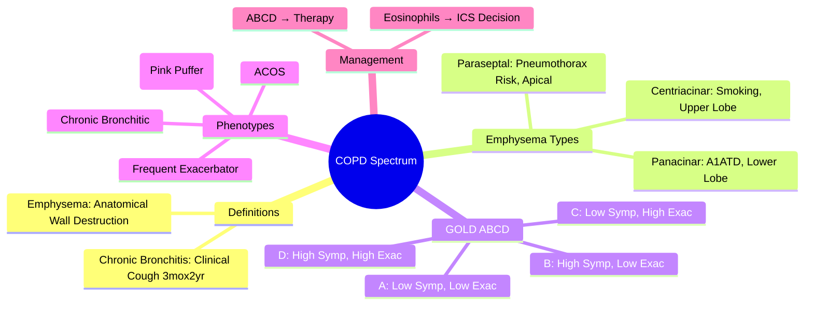
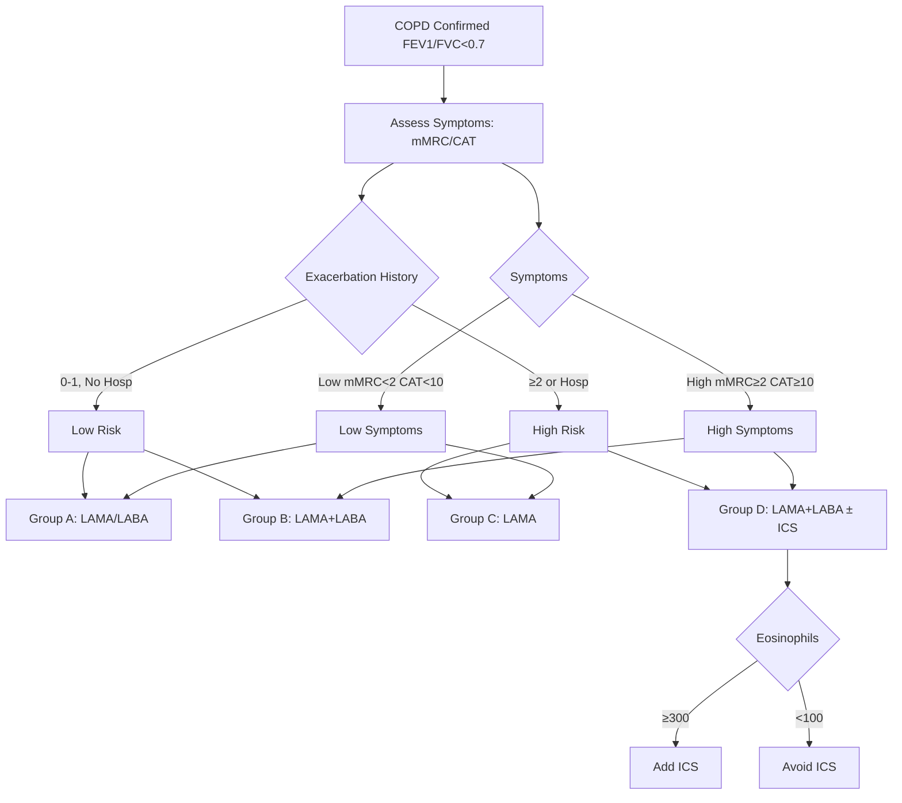

# Chronic Bronchitis and Emphysema Phenotypes (COPD Spectrum)

Related: [[COPD]], [[Emphysema]], [[Chronic bronchitis]], [[Asthma]], [[Airway Diseases/COPD spectrum|COPD spectrum]], [[Airway Diseases/Acute exacerbation of COPD|Acute exacerbation of COPD]]

> [!important]
> **COPD** = heterogeneous syndrome; **phenotyping** guides prognosis and therapy. **Chronic bronchitis** (clinical) vs **emphysema** (anatomical) — overlap common. **GOLD ABCD assessment** integrates symptoms, exacerbation risk, spirometry. Key FCPS/MRCP: chronic bronchitis definition, emphysema types (centri/pan/para-septal), GOLD classification, overlap with asthma (ACOS), prognostic phenotypes.

## Learning Objectives
- Define chronic bronchitis (clinical) vs emphysema (pathological)
- Classify emphysema types (centriacinar, panacinar, paraseptal) and radiological features
- Apply GOLD 2023 ABCD classification for symptom/exacerbation assessment
- Differentiate COPD from asthma and ACOS (asthma-COPD overlap syndrome)
- Recognise prognostic phenotypes (frequent exacerbator, rapid decliner, comorbidity burden)

## Definition
| Term | Definition |
|------|------------|
| **Chronic bronchitis** | **Clinical**: productive cough on most days for **≥3 months in 2 successive years** (excl. other causes) |
| **Emphysema** | **Anatomical**: **permanent enlargement of airspaces distal to terminal bronchiole** with destruction of alveolar walls, without fibrosis |
| **COPD** | **Common preventable/treatable disease** characterised by **persistent respiratory symptoms and airflow limitation** (post-bronchodilator FEV₁/FVC <0.7) due to airway/alveolar abnormalities |

> **FCPS/MRCP tip**: Chronic bronchitis = **clinical definition** (cough × 3mo × 2yrs); Emphysema = **anatomical/pathological** (destroyed alveoli). A patient can have one, both, or neither (small airways disease).

## Emphysema Types (Pathological/Anatomical)

| Type | Acinar Region Destroyed | Distribution | Causes | Radiology |
|------|------------------------|--------------|--------|-----------|
| **Centriacinar (centrilobular)** | **Respiratory bronchioles** (central acinus); alveoli distal spared | **Upper lobes, apical segments** | **Smoking**, coal dust | **Centrilobular lucencies** with central dots (pulm artery) — "holes in honeycomb" |
| **Panacinar (panlobular)** | **Entire acinus** (respiratory bronchioles + alveoli + ducts) | **Lower lobes, bases** | **Alpha-1 antitrypsin deficiency**, IV Ritalin abuse | **Diffuse lucency**, uniform, few/no vessels; **basal predominance** |
| **Paraseptal (distal acinar)** | **Alveolar ducts/sacs** (periphery of acinus); subpleural | **Upper lobes, apices, pleura** | Smoking, idiopathic, HIV | **Subpleural cysts/blebs** (1-10mm), along fissures/pleura; predisposes to **spontaneous pneumothorax** |
| **Irregular (paracicatricial)** | Adjacent to **fibrosis/scars** | Adjacent to scars | Post-TB, post-surgical, rheumatoid lung | Adjacent to fibrosis; localised |

> **FCPS/MRCP tip**: **Centriacinar = smoking (upper lobe)**; **Panacinar = A1ATD (lower lobe)**; **Paraseptal = pneumothorax risk (apical cysts)**.

## Clinical Phenotypes (Observational)

| Phenotype | Features | Prognosis / Management |
|-----------|----------|------------------------|
| **Chronic bronchitic** | Daily productive cough, frequent infections, **hypercapnia**, cor pulmonale risk | Frequent exacerbations; benefit from mucolytics, long-term macrolides |
| **Emphysematous ("pink puffer")** | **Dyspnoea** predominant, **weight loss**, barrel chest, pursed-lip breathing, **normocapnic/hypocapnic** | Better survival if early; pulmonary rehab critical |
| **Frequent exacerbator** | **≥2 exacerbations/yr** (or ≥1 hospitalization) | High mortality; target with ICS/LAMA/LABA, azithromycin, vaccination |
| **Rapid decliner** | FEV₁ decline **>50-60 mL/yr** (vs normal 20-30) | Poor prognosis; consider augmentation (A1ATD), transplant eval |
| **Comorbidity-dominant** | CVD, osteoporosis, depression, lung cancer, sarcopenia, metabolic syndrome | Multidisciplinary care; treat comorbidities aggressively |
| **Asthma-COPD Overlap (ACOS)** | Features of both; eosinophilia, reversibility, atopy, early onset | **ICS essential**; avoid LAMA monotherapy; better steroid response |

> **GOLD 2023** moved away from "phenotypes" to **treatable traits** but above remain clinically useful for exams.

## GOLD 2023 ABCD Assessment (Simplified)

### Step 1: Spirometry Grade (post-BD FEV₁/FVC <0.7)
| Grade | FEV₁ % predicted |
|-------|-----------------|
| GOLD 1 (Mild) | ≥80% |
| GOLD 2 (Moderate) | 50-79% |
| GOLD 3 (Severe) | 30-49% |
| GOLD 4 (Very Severe) | <30% |

### Step 2: Symptom Burden
- **mMRC ≥2** OR **CAT ≥10** = **High symptoms** (B/D)
- **mMRC 0-1** AND **CAT <10** = **Low symptoms** (A/C)

### Step 3: Exacerbation History
- **≥2 moderate exacerbations/yr** OR **≥1 hospitalization** = **High risk** (C/D)
- **0-1 moderate, no hospitalization** = **Low risk** (A/B)

### ABCD Groups
| Group | Symptoms | Exacerbation Risk | Initial Therapy |
|-------|----------|-------------------|----------------|
| **A** | Low | Low | Bronchodilator (LAMA or LABA) |
| **B** | High | Low | LAMA + LABA (dual bronchodilation) |
| **C** | Low | High | **LAMA** (preferred) or LAMA+LABA |
| **D** | High | High | **LAMA+LABA** (+ ICS if eosinophils ≥300) |

> **FCPS/MRCP tip**: **Eosinophils ≥300/µL** → add ICS to dual bronchodilation in Group D. **Eosinophils <100** → avoid ICS (pneumonia risk).

## ACOS (Asthma-COPD Overlap Syndrome)
| Feature | Favours Asthma | Favours COPD | ACOS (Overlap) |
|---------|----------------|--------------|----------------|
| Age of onset | <20 yrs | >40 yrs | Intermediate |
| Symptom variability | High (diurnal) | Persistent | Variable |
| Reversibility | **>12% & >200mL** | Limited | Partial |
| Atopy/eosinophilia | Yes | No | Yes |
| Smoking history | No/light | Heavy | Variable |
| **ICS response** | **Excellent** | Variable/poor | **Good** |

> **ACOS**: treat as **both** — ICS essential + dual/triple bronchodilation; avoid LAMA monotherapy.

## Investigations for Phenotyping
| Tool | Phenotyping Value |
|------|-------------------|
| **HRCT** | Emphysema type/distribution (centri vs pan vs paraseptal), bronchiectasis, air trapping |
| **Spirometry + reversibility** | Obstruction severity, reversibility (>12% + 200mL = asthma/ACOS) |
| **DLCO** | Emphysema severity (↓ in emphysema; normal in chronic bronchitis) |
| **Blood eosinophils** | Predicts ICS response (≥300 = good response; <100 = avoid ICS) |
| **Sputum eosinophils** | >3% = eosinophilic phenotype |
| **6MWT / BODE index** | Prognostic (BODE: BMI, FEV₁, mMRC, 6MWT) |

## Management by Phenotype

| Phenotype | Key Management |
|-----------|----------------|
| **Chronic bronchitic** | LAMA/LABA + mucolytics (carbocisteine/erdosteine); consider azithromycin 250mg 3x/wk if ≥3 exacerbations/yr |
| **Emphysematous** | Pulmonary rehab (core); LVRS/valves if upper lobe predominant + low exercise capacity |
| **Frequent exacerbator (EOS ≥300)** | **Triple therapy** (ICS/LAMA/LABA); add azithromycin/roflumilast if still exacerbating |
| **Frequent exacerbator (EOS <100)** | **Dual bronchodilation (LAMA/LABA)**; avoid ICS; add roflumilast/azithromycin |
| **ACOS** | **ICS/LABA** core + LAMA if needed; avoid LAMA monotherapy |
| **Rapid decliner** | Exclude A1ATD; consider transplant referral; aggressive comorbidity control |

## Prognostic Indices
| Index | Components | Mortality Prediction |
|-------|-----------|----------------------|
| **BODE** | BMI, FEV₁%pred, mMRC, 6MWT | 4-yr mortality (0-2 low, 3-6 int, 7-10 high) |
| **ADO** | Age, Dyspnoea (mMRC), Obstruction (FEV₁%) | Simple, validated |
| **DOSE** | Dyspnoea, Obstruction, Smoking, Exacerbations | Dynamic, predicts exacerbations |

## Complications by Phenotype
| Phenotype | Key Complications |
|-----------|-------------------|
| **Chronic bronchitic** | Frequent exacerbations, cor pulmonale, hypercapnic respiratory failure, lung cancer |
| **Emphysematous** | Spontaneous pneumothorax (paraseptal), weight loss/cachexia, pulmonary hypertension |
| **Frequent exacerbator** | Accelerated lung function decline, hospitalisation, mortality, steroid side effects |
| **ACOS** | Steroid side effects, poorer control if misdiagnosed as pure COPD |

## FCPS/MRCP High-Yield Points
1. **Chronic bronchitis** = clinical (cough 3mo×2yr); **emphysema** = anatomical (alveolar destruction)
2. **Centriacinar** = smoking (upper lobe); **Panacinar** = A1ATD (lower lobe); **Paraseptal** = pneumothorax risk
3. **GOLD ABCD**: symptoms (mMRC/CAT) + exacerbation history → guides therapy
5. **Eosinophils ≥300** → add ICS; **<100** → avoid ICS
6. **ACOS**: features of both → **ICS essential**, avoid LAMA monotherapy
7. **BODE index** = BMI + FEV₁ + mMRC + 6MWT (prognostic)
7. **Frequent exacerbator** = ≥2/yr or 1 hospitalization → target with triple therapy (if EOS high) or dual + azithromycin/roflumilast
8. **DLCO** ↓ in emphysema; normal in pure chronic bronchitis
9. **Azithromycin 250mg 3x/wk** reduces exacerbations in frequent exacerbators
9. **Roflumilast** (PDE4 inhibitor) for chronic bronchitic phenotype + FEV₁<50% + frequent exacerbations

## Common Viva Questions
1. Define chronic bronchitis vs emphysema
2. Classify emphysema types and smoking association
3. GOLD ABCD classification and initial therapy per group
4. ACOS definition and management differences from COPD
5. Blood eosinophil threshold for ICS use
6. BODE index components and prognostic value
6. Frequent exacerbator phenotype management
7. DLCO in emphysema vs chronic bronchitis

## Common Confusions / Exam Traps
- **Chronic bronchitis ≠ COPD** (can have chronic bronchitis without airflow limitation)
- **Centriacinar ≠ panacinar** (upper vs lower lobe, smoking vs A1ATD)
- **ACOS ≠ asthma** (needs dual bronchodilation + ICS; not ICS alone)
- **ICS in low eosinophils** → increased pneumonia risk, no benefit
- **Azithromycin** = chronic macrolide for exacerbation reduction (not acute treatment)
- **Roflumilast** = PDE4 inhibitor, for chronic bronchitic + frequent exacerbations + FEV₁<50%
- **BODE** = BMI, Obstruction (FEV₁), Dyspnoea (mMRC), Exercise (6MWT) — not "Body"

## Mnemonics
- **EMPHYSEMA TYPES**: **C**entriacinar = **C**igarette (smoking, upper); **P**anacinar = **P**rotease deficiency/A1ATD (basal); **P**araseptal = **P**neumothorax (apical cysts)
- **GOLD ABCD**: **A**symptomatic/Low risk; **B**reathless/Low risk; **C**alm/High risk; **D**yspnoeic/High risk
- **ICS THRESHOLD**: **300** = ICS go; **100** = ICS no
- **BODE**: **B**MI, **O**bstruction (FEV₁), **D**yspnoea (mMRC), **E**xercise (6MWT)
- **ACOS**: **A**sthma + **CO**PD = **O**verlap **S**yndrome → **I**CS essential

## Mind Map

## Flowchart

## Suggested Visuals / Image Notes
- Emphysema types: centriacinar vs panacinar vs paraseptal HRCT
- GOLD ABCD assessment algorithm
- BODE index nomogram
- ACOS vs COPD vs asthma comparison table

## Suggested Video References
- GOLD 2023 guidelines walkthrough
- COPD phenotyping in clinical practice

## One-Page Revision Summary
- **Chronic bronchitis** = cough 3mo×2yr; **Emphysema** = alveolar destruction
- **Centriacinar** = smoking, upper lobe; **Panacinar** = A1ATD, lower lobe; **Paraseptal** = pneumothorax risk
- **GOLD ABCD**: symptoms (mMRC/CAT) + exacerbation history → 4 groups
- **Eosinophils ≥300** → ICS indicated; **<100** → avoid ICS
- **ACOS** = asthma + COPD features → **ICS essential** + dual bronchodilation
- **Frequent exacerbator** ≥2/yr → triple therapy (if eos high) or dual + azithro/roflumilast
- **BODE** = BMI + FEV₁ + mMRC + 6MWT
- **DLCO** ↓ in emphysema, normal in chronic bronchitis

## 24-Hour Recall Prompts
- Define chronic bronchitis vs emphysema
- List 3 emphysema types + smoking association
- State GOLD ABCD groups and first-line therapy
- Define ACOS and its treatment

## 7-Day / 15-Day / 30-Day Revision Tracker
- [ ] Day 1 completed
- [ ] 24-hour recall completed
- [ ] Day 7 revision completed
- [ ] Day 15 revision completed
- [ ] Day 30 revision completed

## Must Know / Should Know / Nice to Know
### Must Know
- Chronic bronchitis vs emphysema definitions
- 3 emphysema types (centri/pan/paraseptal) + lobe association
- GOLD ABCD groups + first-line therapy
- Eosinophil threshold for ICS (300/100)
- ACOS = ICS essential

### Should Know
- Phenotype clinical features (chronic bronchitic vs emphysematous)
- Frequent exacerbator management (triple vs dual + azithro/roflumilast)
- BODE/ADO/DOSE indices
- DLCO pattern (emphysema low, bronchitis normal)
- ACOS management (ICS essential + dual bronchodilation)

### Nice to Know
- Blood eosinophil cut-offs derivation
- Roflumilast specific indications
- LVRS/valve criteria
- Sputum eosinophils vs blood
- Long-term macrolide resistance concerns

## Self-Test Scorecard
- Understanding: /10
- Recall: /10
- MCQ Performance: /10
- SBA Performance: /10
- Viva Confidence: /10
- Total: /50

> [!tip]
> Interpretation: <35 = weak topic, 35-44 = acceptable but insecure, 45+ = strong exam-ready topic.

## Exam Answer Modes
### Long Answer Skeleton
- Definitions (clinical vs anatomical)
- Emphysema classification table
- GOLD ABCD algorithm
- Phenotype-based management
- ACOS differentiation
- Prognostic indices

### Short Note Skeleton
- Emphysema types table
- GOLD ABCD box
- Eosinophil threshold box
- ACOS vs COPD table

### Viva One-Liners
- "Chronic bronchitis = clinical (cough 3mo×2yr); Emphysema = anatomical (alveolar destruction)"
- "Centriacinar = smoking, upper lobe; Panacinar = A1ATD, lower lobe; Paraseptal = pneumothorax risk"
- "GOLD ABCD: symptoms + exacerbation history → A/B/C/D therapy"
- "Eosinophils ≥300 → ICS add; <100 → ICS avoid"
- "ACOS = asthma + COPD features → ICS essential + LAMA/LABA"
- "BODE = BMI + FEV₁ + mMRC + 6MWT"
- "Frequent exacerbator: ≥2/yr → triple if eos high, dual+azithro if eos low"
- "DLCO low in emphysema, normal in chronic bronchitis"
- "Centriacinar = smoking (upper); Panacinar = A1ATD (lower)"

### Ward-Case Discussion Points
- COPD patient with 3 exacerbations/yr, eosinophils 350 → triple therapy
- COPD with eosinophils 50, 2 exacerbations → LAMA/LABA + roflumilast (no ICS)
- Mixed asthma/COPD features → treat as ACOS (ICS/LABA + LAMA)
- Rapid decliner (FEV₁ decline 80mL/yr) → A1ATD screen, transplant eval

### Last-Night-Before-Exam Sheet
- Chronic Bronchitis = Cough 3mo×2yr
- Emphysema Types: Centri (smoke, upper), Pan (A1ATD, lower), Paraseptal (pneumothorax)
- GOLD: A/B/C/D by Symptoms + Exac
- Eosinophils: ≥300 ICS+, <100 ICS-
- ACOS: ICS essential
- BODE: BMI, FEV1, mMRC, 6MWT

## Summary
COPD = heterogeneous spectrum. **Chronic bronchitis** (clinical: cough 3mo×2yr) vs **emphysema** (anatomical: alveolar destruction). **Emphysema types**: centriacinar (smoking, upper), panacinar (A1ATD, lower), paraseptal (pneumothorax, apical). **GOLD ABCD** stratifies by symptoms (mMRC/CAT) + exacerbation history → guides therapy. **Eosinophils** guide ICS: **≥300 add ICS**, **<100 avoid ICS**. **ACOS** = features of both → **ICS essential** + LAMA/LABA. **Phenotypes**: chronic bronchitic (hypercapnic, infective), emphysematous (pink puffer), frequent exacerbator (≥2/yr), ACOS. **BODE** = BMI, FEV₁, mMRC, 6MWT. **Frequent exacerbator** → triple therapy if eosinophilic, dual + azithromycin/roflumilast if not.

## MCQs (10)
1. Chronic bronchitis is defined clinically as:
   A. Productive cough for ≥3 weeks
   B. **Productive cough for ≥3 months in 2 consecutive years**
   C. Productive cough with FEV₁/FVC <0.7
   C. Daily sputum production for 6 months
2. **Centriacinar emphysema** is associated with:
   A. Alpha-1 antitrypsin deficiency
   B. **Cigarette smoking**
   C. HIV infection
   D. Connective tissue disease
3. **Panacinar emphysema** predominantly affects:
   A. **Lower lobes / bases**
   B. Upper lobes / apices
   C. Mid zones
   D. Apical segments only
4. GOLD Group D = High symptoms + High exacerbation risk. First-line therapy:
   A. LAMA alone
   B. LABA alone
   C. **LAMA + LABA (+ ICS if eosinophils ≥300)**
   D. SABA prn only
5. Blood eosinophil threshold for **adding ICS** in COPD:
   A. ≥100/µL
   B. **≥300/µL**
   C. ≥500/µL
   D. ≥1000/µL

## SBA Questions (10)
1. A 65-year-old smoker with COPD has FEV₁ 45%, mMRC 3, CAT 18, one hospitalization for exacerbation last year. Blood eosinophils 50/µL. GOLD group and therapy:
   A. Group B: LAMA+LABA
   B. Group C: LAMA
   C. **Group D: LAMA+LABA (no ICS)**
   D. Group D: LAMA+LABA+ICS
2. Patient with COPD, FEV₁ 60%, two exacerbations last year requiring oral steroids, eosinophils 350/µL. Best initial maintenance:
   A. LAMA monotherapy
   B. LAMA+LABA
   C. **LAMA+LABA+ICS (triple)**
   D. LABA+ICS only
3. Patient with chronic cough × 3 months × 2 years, FEV₁/FVC 0.65, no reversibility. This defines:
   A. Asthma
   B. **Chronic bronchitis phenotype of COPD**
   C. Bronchiectasis
   D. Chronic bronchitis without COPD
3. Emphysema type with **lower lobe predominance**:
   A. Centriacinar
   B. **Panacinar**
   C. Paraseptal
   D. Irregular
4. Best predictor of ICS response in COPD:
   A. FEV₁ % predicted
   B. **Blood eosinophil count**
   C. mMRC dyspnoea score
   D. Number of exacerbations
4. **ACOS (Asthma-COPD Overlap)** key feature:
   A. Requires LAMA monotherapy
   B. **Requires ICS (essential)**
   C. No reversibility
   D. Normal eosinophils
5. **BODE index** components:
   A. BMI, FEV₁, SaO₂, 6MWT
   B. **BMI, FEV₁, mMRC, 6MWT**
   C. BP, FEV₁, mMRC, 6MWT
   D. BMI, FVC, mMRC, 6MWT
5. **Centriacinar emphysema** is characteristically:
   A. Basal, panacinar
   B. **Upper lobe, centriacinar**
   C. Subpleural cysts
   D. Adjacent to fibrosis
5. **Frequent exacerbator** phenotype (eosinophils 50/µL) — best add-on to dual bronchodilation:
   A. ICS
   B. **Roflumilast or azithromycin**
   C. Theophylline
   D. Oral steroids

## Flashcards
- Q: Chronic bronchitis definition
  A: Productive cough ≥3 months × 2 consecutive years
- Q: Emphysema definition
  A: Permanent enlargement of airspaces distal to terminal bronchiole with wall destruction
- Q: Centriacinar emphysema
  A: Smoking, upper lobe, respiratory bronchioles
- Q: Panacinar emphysema
  A: A1AT deficiency, lower lobe, whole acinus
- Q: Paraseptal emphysema
  A: Subpleural, apical, pneumothorax risk
- Q: GOLD Group D therapy
  A: LAMA+LABA (+ICS if eos≥300)
- Q: ICS threshold in COPD
  A: ≥300 add, <100 avoid
- Q: BODE components
  A: BMI, FEV1, mMRC, 6MWT
- Q: ACOS management
  A: ICS essential + LAMA/LABA
- Q: Frequent exacerbator + low eos
  A: Dual + azithromycin/roflumilast

## Answer Key with Explanations
### MCQs
1. **B** — Chronic bronchitis clinical definition: cough ≥3 months × 2 consecutive years.
2. **B** — Centriacinar = smoking related.
3. **A** — Panacinar = lower lobe (A1ATD).
4. **C** — Group D = high symptoms + high risk → LAMA+LABA ± ICS (if eos≥300).
5. **B** — Eosinophils ≥300/µL indicates ICS benefit.

### SBAs
1. **C** — mMRC 3 + CAT 18 = high symptoms; 1 hospitalization = high risk → Group D. Eosinophils 50 (<100) → no ICS. Therapy: LAMA+LABA.
2. **C** — Two exacerbations + eosinophils 350 → triple therapy (ICS/LAMA/LABA).
3. **B** — Chronic productive cough + airflow limitation = chronic bronchitis phenotype of COPD.
4. **B** — Panacinar = lower lobes (A1ATD).
5. **B** — Blood eosinophils best predict ICS response.
5. **B** — ACOS = ICS essential.
6. **B** — BODE = BMI, FEV₁, mMRC, 6MWT.
7. **B** — Centriacinar = upper lobe, smoking-related.
8. **B** — Low eosinophils (<100) → avoid ICS; add roflumilast/azithromycin.

## Flashcards
- Q: Chronic bronchitis definition
  A: Productive cough ≥3 months × 2 consecutive years
- Q: Emphysema definition
  A: Permanent enlargement of airspaces distal to terminal bronchiole with wall destruction
- Q: Centriacinar emphysema
  A: Smoking, upper lobe, respiratory bronchioles
- Q: Panacinar emphysema
  A: A1AT deficiency, lower lobe, whole acinus
- Q: Paraseptal emphysema
  A: Subpleural, apical, pneumothorax risk
- Q: GOLD Group D therapy
  A: LAMA+LABA (+ICS if eos≥300)
- Q: ICS threshold in COPD
  A: ≥300 add, <100 avoid
- Q: BODE components
  A: BMI, FEV1, mMRC, 6MWT
- Q: ACOS management
  A: ICS essential + LAMA/LABA
- Q: Frequent exacerbator + low eos
  A: Dual + azithromycin/roflumilast

## Answer Key with Explanations
### MCQs
1. **B** — Chronic bronchitis clinical definition.
2. **B** — Centriacinar = smoking.
3. **A** — Panacinar = lower lobes.
4. **C** — Group D = LAMA+LABA ± ICS.
5. **B** — Eosinophils ≥300 → ICS benefit.

### SBAs
1. **C** — Group D + eos 50 → LAMA+LABA (no ICS).
2. **C** — Two exacerbations + eos 350 → triple therapy.
3. **B** — Chronic bronchitis definition met.
4. **B** — Panacinar = lower lobe.
5. **B** — Blood eosinophils predict ICS response.
5. **B** — ACOS requires ICS.
6. **B** — BODE = BMI, FEV₁, mMRC, 6MWT.
7. **B** — Centriacinar = upper lobe.
8. **B** — Low eos → avoid ICS; add roflumilast/azithromycin.

---
## Additional MCQs (6–10)

6. Which COPD phenotype is characterised by **chronic cough and sputum production**?
   A. Emphysema-predominant
   B. **Chronic bronchitis-predominant ("blue bloater")**
   C. Mixed
   D. ACOS
   E. Asthma
   **Answer: B** — Chronic cough + sputum for ≥3 months/year × 2 consecutive years = chronic bronchitis.

7. Emphysema-predominant COPD typically presents with:
   A. Cyanosis and oedema
   B. **Hyperinflation, ↓DLCO, mild hypoxaemia ("pink puffer")**
   C. Chronic productive cough
   D. Frequent exacerbations
   E. Type 2 failure early
   **Answer: B** — Pink puffer: thin, hyperinflated, pursed-lip breathing, ↓DLCO.

8. Chronic bronchitis-predominant COPD ("blue bloater") typically has:
   A. ↓DLCO
   B. **Hypercapnia, hypoxaemia, cor pulmonale**
   C. Weight loss
   D. Pursed-lip breathing
   E. Normal PaCO₂
   **Answer: B** — Blue bloater: cyanotic, obese, hypercapnic, oedematous.

9. The pathological hallmark of **emphysema** is:
   A. Bronchial inflammation
   B. **Permanent enlargement of airspaces distal to terminal bronchioles + wall destruction**
   C. Mucus hypersecretion
   D. Bronchospasm
   E. Airway oedema
   **Answer: B** — Emphysema = airspace enlargement + wall destruction (no fibrosis).

10. Centriacinar emphysema typically affects:
    A. Whole acinus
    B. **Upper lobes, smoking-related**
    C. Lower lobes
    D. Diffusely
    E. Subpleural
    **Answer: B** — Centriacinar = upper lobe predominance, smoking-related.

## Additional SBAs (6–10)

6. A COPD patient has FEV₁ 50%, frequent exacerbations, chronic cough, sputum, and cor pulmonale. Phenotype:
   A. Emphysema-predominant
   B. **Chronic bronchitis-predominant (frequent exacerbator)**
   C. Asthma
   D. ACOS
   E. Bronchiectasis
   **Answer: B** — Chronic cough + sputum + exacerbations + cor pulmonale = chronic bronchitis phenotype.

7. A 65-year-old thin smoker with pursed-lip breathing, hyperinflated lungs, ↓DLCO, mild hypoxaemia. Phenotype:
   A. Chronic bronchitis
   B. **Emphysema-predominant (pink puffer)**
   C. Asthma
   D. Bronchiectasis
   E. ACOS
   **Answer: B** — Emphysema phenotype.

8. Panacinar emphysema is associated with:
   A. Smoking
   B. **α1-antitrypsin deficiency (lower lobe)**
   C. Asthma
   D. TB
   E. Bronchiectasis
   **Answer: B** — Panacinar = lower lobe, A1AT deficiency.

9. Paraseptal emphysema affects:
   A. Whole acinus
   B. **Distal acinus, subpleural, associated with spontaneous pneumothorax**
   C. Upper lobe only
   D. Lower lobe only
   E. Diffuse
   **Answer: B** — Paraseptal = subpleural, distal acinus, young adult spontaneous PTX.

10. COPD frequent-exacerbator phenotype is defined as:
    A. ≥1 exacerbation/year
    B. **≥2 exacerbations/year (or ≥1 leading to hospital admission)**
    C. ≥5/year
    D. Only when severe
    E. Only in winter
    **Answer: B** — Frequent exacerbator = ≥2/year or ≥1 hospitalisation.

## Local Navigation
- **Parent Heading**: [[../Airway Diseases|Airway Diseases]]
- **Parent Topic Group**: [[../Airway Diseases/COPD spectrum|COPD spectrum]]
- **Chapter Map**: [[../Davidson Chapter 17 - Respiratory Medicine Hierarchy|Respiratory Medicine Hierarchy]]
- **Chapter MOC**: [[../Respiratory MOC|Respiratory MOC]]
- **Drug Reference**: [[../../Clinical Therapeutics and Good Prescribing|Drugs]]
- **Related**: [[COPD]] · [[Acute exacerbation of COPD]] · [[Alpha-1 antitrypsin deficiency]] · [[Long-term oxygen therapy in COPD]]
