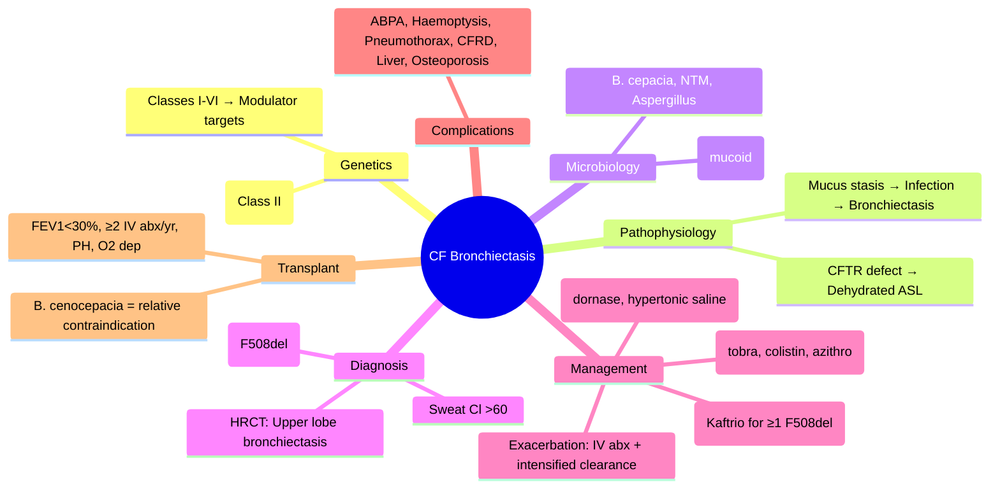

# Cystic Fibrosis-Related Bronchiectasis

Related: [[Bronchiectasis]], [[Cystic Fibrosis]], [[ABPA]], [[Pseudomonas], [Airway Diseases/Bronchiectasis and suppurative airway disease|Bronchiectasis and suppurative airway disease]]

> [!important]
> **CF bronchiectasis** = universal in CF; **CFTR dysfunction** → dehydrated mucus → chronic infection → progressive bronchiectasis. **Median survival ~40-50 yrs** (improving with modulators). **Key FCPS/MRCP**: CFTR mutation classes, *Pseudomonas* chronology, modulator therapy (eg ivacaftor/tezacaftor/elexacaftor), ABPA in CF, transplant criteria.

## Learning Objectives
- Understand CFTR pathophysiology and genotype-phenotype correlation
- Recognise CF bronchiectasis features (early onset, upper lobe, *Pseudomonas*, ABPA risk)
- Apply modulator therapy criteria (CFTR mutation-specific)
- Manage acute exacerbations and chronic suppressive therapy
- Apply lung transplant referral criteria in CF

## Definition
**Cystic Fibrosis (CF)** = autosomal recessive disorder of **CFTR** (cystic fibrosis transmembrane conductance regulator) on **chromosome 7q31** → defective chloride/bicarbonate transport → **thick, dehydrated mucus** → **pancreatic insufficiency, bronchiectasis, chronic sinusitis, male infertility**.

## Core Genetics & Pathophysiology
| Aspect | Details |
|--------|---------|
| **Gene** | *CFTR* (7q31.2), >2000 mutations identified |
| **Inheritance** | Autosomal recessive |
| **Common mutation** | **F508del** (Class II, ~70% alleles in Caucasians) |
| **CFTR Classes** | I: no synthesis; **II: misfolding (F508del)**; III: gating defect; IV: conductance; V: reduced synthesis; VI: reduced stability |
| **Pathophysiology** | Loss of Cl⁻ secretion + ↑ Na⁺ absorption (ENaC) → **dehydrated ASL** → mucus stasis → bacterial colonisation → neutrophilic inflammation → **bronchiectasis** |

## CFTR Mutation Classes & Modulator Targets
| Class | Defect | Example | Modulator Target |
|-------|--------|---------|------------------|
| I | No protein synthesis | G542X, W1282X | **None** (nonsense suppression investigational) |
| **II** | **Misfolding/trafficking** | **F508del** (ΔF508) | **Correctors** (tezacaftor, elexacaftor) + **potentiator** (ivacaftor) |
| III | Gating defect | G551D | **Potentiator** (ivacaftor) |
| IV | Reduced conductance | R117H | **Potentiator** (ivacaftor) |
| V | Reduced synthesis | 3849+10kb C→T | **Potentiator** (ivacaftor) ± corrector |
| VI | Reduced stability | 1811+1.6kbA→G | **Potentiator** + corrector |

## Clinical Features of CF Bronchiectasis
| Feature | Typical Presentation |
|---------|----------------------|
| **Onset** | Infancy/childhood (diagnosed via newborn screening in UK) |
| **Cough/sputum** | Chronic, purulent, daily |
| **Recurrent exacerbations** | Increasing frequency with age |
| **Microbiology evolution** | *S. aureus* (childhood) → *H. influenzae* → **P. aeruginosa** (adolescence/adulthood) → **mucoid Pseudomonas**, *Burkholderia cepacia* complex, *Stenotrophomonas*, NTM |
| **Complications** | **ABPA** (7-15%), massive haemoptysis, pneumothorax, cor pulmonale, CF-related diabetes (CFRD), osteoporosis, liver disease, infertility |

## Microbiology Chronology
| Age | Typical Pathogens |
|-----|-------------------|
| **<5 yrs** | *S. aureus* (MSSA/MRSA), *H. influenzae* |
| **5-18 yrs** | *P. aeruginosa* (non-mucoid → mucoid) |
| **Adult** | **Mucoid P. aeruginosa**, *B. cepacia* complex, *S. maltophilia*, *Achromobacter*, NTM (*M. abscessus*) |

## Investigations
| Test | Purpose |
|------|---------|
| **Sweat chloride** | **Gold standard** diagnosis: >60 mmol/L = CF; 30-59 = intermediate; <30 = normal |
| **Genotype** | Confirm F508del, other mutations; guides modulator eligibility |
| **Sputum culture** | Quarterly (or monthly if unstable); *Pseudomonas*, NTM, fungi |
| **HRCT chest** | Bronchiectasis extent (upper lobe > lower lobe in CF); mucus plugging, air trapping |
| **Spirometry** | FEV₁ decline tracking; FEV₁ <30% = severe |
| **LFTs, DEXA, OGTT** | Liver disease, bone density, CFRD screening (annual OGTT >10 yrs) |

## Management

### 1. Airway Clearance (Daily, lifelong)
- **Physiotherapy**: active cycle of breathing technique (ACBT), autogenic drainage, PEP devices, oscillating PEP (Flutter®, Acapella®)
- **Mucoactives**: **dornase alfa** (2.5 mg nebulised daily; reduces viscosity), **hypertonic saline** 7% (twice daily; improves mucus clearance)
- **Exercise**: aerobic + resistance training (improves clearance, bone density)

### 2. Chronic Suppressive Therapy
| Agent | Indication | Dose |
|-------|------------|------|
| **Inhaled tobramycin** (TOBI®) | Chronic *P. aeruginosa* | 300 mg nebulised bd × 28 days on/off |
| **Inhaled colistimethate** (Colistin) | *P. aeruginosa* if tobramycin intolerant/resistant | 1-2 MU nebulised bd |
| **Inhaled aztreonam** (Cayston®) | *P. aeruginosa* alternative | 75 mg nebulised tds × 28 days on/off |
| **Oral azithromycin** | Anti-inflammatory, ↓ exacerbations | 250 mg 3x/week (long-term) |

### 3. Acute Exacerbation Management
- **Antibiotics**: IV (2 weeks) for FEV₁ drop >10%, increased sputum, systemic symptoms
  - **P. aeruginosa**: IV **piperacillin-tazobactam** + **tobramycin** (or **ceftazidime** + **aminoglycoside**); **meropenem** if resistant
  - **B. cepacia**: combination based on sensitivities (often **co-trimoxazole** + **ceftazidime** + **temocillin**)
  - **NTM**: multi-drug regimens (clarithromycin + ethambutol + rifampicin)
- **Airway clearance**: intensify (4-6x/day)
- **Steroids**: if ABPA or significant wheeze
- **Nutrition**: high-calorie, pancreatic enzyme replacement (PERT), fat-soluble vitamins

### 4. CFTR Modulator Therapy (Game-Changing)
| Regimen | Mutation | Age | Effect |
|---------|----------|-----|--------|
| **Ivacaftor** (Kalydeco®) | Gating (Class III: G551D, S1251N, etc.) | ≥4 mo | Potentiator: ↑ open probability |
| **Tezacaftor/Ivacaftor** (Symkevi®) | **F508del homozygote** or F508del/residual function | ≥6 yr | Corrector + potentiator |
| **Elexacaftor/Tezacaftor/Ivacaftor** (Kaftrio®/Trikafta®) | **≥1 F508del** (covers ~90% of patients) | ≥6 yr | **Triple therapy** (2 correctors + potentiator) — **≥10-15% FEV₁ improvement**, ↓ exacerbations, ↓ sweat Cl⁻ |

> **FCPS/MRCP tip**: **Kaftrio®** = triple modulator for **≥1 F508del** (covers ~90% CF). Start early (age ≥6) to preserve lung function.

### 5. CF-Specific Complications
| Complication | Management |
|--------------|------------|
| **ABPA** | As asthma (steroids + itraconazole); higher prevalence in CF (7-15%) |
| **Massive haemoptysis** | Bronchial artery embolisation (BAE); vitamins K, tranexamic acid |
| **Pneumothorax** | Chest drain; surgical pleurodesis if recurrent; transplant eval if severe |
| **CFRD** | Annual OGTT >10 yrs; insulin only (no oral agents); CFTR modulators may improve |
| **Liver disease** | Ursodeoxycholic acid 10-15 mg/kg/day; monitor LFTs, US, FibroScan |
| **Osteoporosis** | DEXA q1-2y; Ca²⁺/vit D, bisphosphonates if T-score < -2.5 |
| **Infertility** | Males: CBAVD (98%); IVF/ICSI; Females: thick cervical mucus → IUI/IVF |

## Lung Transplant Referral (CF)
| Criteria | Threshold |
|----------|-----------|
| **FEV₁** | **<30% predicted** (or rapid decline >20% in 12 mo) |
| **Exacerbations** | **≥2/yr requiring IV antibiotics** |
| **Pulmonary hypertension** | RVSP >50 mmHg on echo |
| **Oxygen dependence** | Continuous O₂ requirement |
| **Pneumothorax** | Recurrent or persistent |
| **B. cepacia complex** | *B. cenocepacia* = relative contraindication; other species = case-by-case |
| **NTM** | *M. abscessus* = concern; clearance pre-transplant preferred |

## FCPS/MRCP High-Yield Points
1. **CFTR** = Cl⁻ channel; **F508del** = Class II (misfolding) — most common
2. **Bronchiectasis** = universal in CF; **upper lobe > lower lobe** (vs non-CF)
3. **Microbiology**: *S. aureus* → *P. aeruginosa* (non-mucoid → mucoid) → *B. cepacia*/NTM
3. **Sweat chloride >60** = diagnostic
4. **Modulators**: **Kaftrio® (elexacaftor/tezacaftor/ivacaftor)** for **≥1 F508del** = game-changer
4. **Chronic Pseudomonas**: inhaled tobramycin/colistin/aztreonam cycles
5. **ABPA** more common in CF (7-15%); treats with steroids + itraconazole
6. **Transplant**: FEV₁ <30%, ≥2 IV exacerbations/yr, PH, O₂ dependence
7. **CFRD**: insulin only; annual OGTT >10 yrs
8. **B. cepacia complex**: *B. cenocepacia* = relative transplant contraindication

## Common Viva Questions
1. CFTR mutation classes and modulator targets
2. CF bronchiectasis vs non-CF (upper lobe, ABPA, Pseudomonas chronology)
3. CFTR modulator therapy classes and eligibility
4. Acute exacerbation management (antibiotics, clearance)
5. CFRD diagnosis and management
6. Lung transplant criteria in CF
6. *B. cepacia* significance in transplant

## Common Confusions / Exam Traps
- **F508del** = Class II (misfolding), **NOT** gating defect (Class III)
- **Kaftrio®** = for **≥1 F508del** (not just homozygotes)
- **Ivacaftor alone** = only for gating mutations (Class III, IV)
- **CFRD** = insulin only; **no metformin/sulfonylureas**
- **B. cepacia** = *B. cenocepacia* bad for transplant; other species less concerning
- **CF bronchiectasis** = **upper lobe** predominant (non-CF = lower lobe)
- **Sweat chloride** = diagnostic, **NOT** serum chloride
- **Pancreatic enzymes** = with every meal/snack (PERT)

## Mnemonics
- **CFTR CLASSES**: **I**=**I**nvisible (no synthesis), **II**=**I**mproper folding (F508del), **III**=**I**ncorrect gating, **IV**=**I**nadequate conductance, **V**=**V**ery little synthesis, **VI**=**V**ery unstable
- **CF MICROBIOLOGY**: **S**taph (kids) → **P**seudomonas (teens) → **B**urkholderia/NTM (adults)
- **MODULATORS**: **Ivacaftor** = potentiator (gating); **Tezacaftor/Elexacaftor** = correctors (folding); **Kaftrio** = corrector+corrector+potentiator
- **CF BRONCHIECTASIS**: **U**pper lobe, **A**BPA common, **P**seudomonas mucoid
- **TRANSPLANT**: FEV₁<30%, ≥2 IV abx/yr, PH, O₂ dep

## Mind Map


## Flowchart
```mermaid
flowchart TD
  A[CF Patient with Bronchiectasis] --> B[Daily Airway Clearance\nDornase alfa + Hypertonic saline\nExercise]
  B --> C{Chronic Pseudomonas?}
  C -->|Yes| D[Inhaled Tobramycin/Colistin/Aztreonam\n28d on/off cycles]
  C -->|No| E[Monitor cultures q3mo]
  A --> F[CFTR Modulator\n≥1 F508del → Kaftrio\nGating → Ivacaftor]
  A --> G[Exacerbation?]
  G -->|Yes| H[IV Antibiotics 14d\nPip-tazo + Aminoglycoside\nIntensify clearance\nSteroids if ABPA]
  A --> I[Annual CFRD screen (OGTT)\nDEXA, LFTs, Vit D\nVaccinations]
```

## Suggested Visuals / Image Notes
- CFTR mutation classes and modulator targets diagram
- CF bronchiectasis HRCT (upper lobe predominant)
- Pseudomonas chronology timeline
- CFTR modulator mechanism (corrector vs potentiator)

## Suggested Video References
- CFTR modulator therapy (CF Trust, ECFS)
- CF airway clearance techniques
- CFRD diagnosis and management

## One-Page Revision Summary
- **Genetics**: CFTR chr7, F508del (Class II), autosomal recessive
- **Pathophysiology**: CFTR defect → dehydrated ASL → mucus stasis → infection → bronchiectasis
- **Microbiology**: S. aureus → P. aeruginosa (mucoid) → B. cepacia/NTM
- **Diagnosis**: sweat Cl >60, genotype, HRCT (UPPER LOBE bronchiectasis)
- **Airway clearance**: dornase alfa + hypertonic saline + exercise (daily)
- **Chronic Pseudomonas**: inhaled tobramycin/colistin/aztreonam 28d on/off
- **Modulators**: Kaftrio® (elexacaftor/tezacaftor/ivacaftor) for **≥1 F508del** (covers 90%)
- **ABPA**: more common in CF (7-15%)
- **CFRD**: annual OGTT >10y; insulin only
- **Transplant**: FEV₁<30%, ≥2 IV abx/yr, PH, O₂ dep; *B. cenocepacia* = relative contraindication

## 24-Hour Recall Prompts
- List CFTR classes and which modulator targets each
- Contrast CF vs non-CF bronchiectasis (lobes, ABPA, Pseudomonas)
- State Kaftrio® eligibility and components
- List transplant criteria in CF

## 7-Day / 15-Day / 30-Day Revision Tracker
- [ ] Day 1 completed
- [ ] 24-hour recall completed
- [ ] Day 7 revision completed
- [ ] Day 15 revision completed
- [ ] Day 30 revision completed

## Must Know / Should Know / Nice to Know
### Must Know
- CFTR classes & modulator targets (F508del = Class II)
- Kaftrio for ≥1 F508del
- CF bronchiectasis = upper lobe, ABPA common, Pseudomonas chronology
- Sweat Cl >60 = diagnostic
- CFRD = insulin only, annual OGTT >10y
- Transplant: FEV₁<30%, ≥2 IV abx/yr, *B. cenocepacia* contraindication

### Should Know
- Modulator specifics (ivacaftor for gating, correctors for F508del)
- CFRD management (insulin only)
- B. cepacia complex speciation
- CF liver disease (ursodeoxycholic acid)
- Bone disease (bisphosphonates)

### Nice to Know
- Gene therapy trials
- New modulators for rare mutations
- CFTR corrector for Class I (nonsense suppression)
- *M. abscessus* management
- Fertility management in CF

## Self-Test Scorecard
- Understanding: /10
- Recall: /10
- MCQ Performance: /10
- SBA Performance: /10
- Viva Confidence: /10
- Total: /50

> [!tip]
> Interpretation: <35 = weak topic, 35-44 = acceptable but insecure, 45+ = strong exam-ready topic.

## Exam Answer Modes
### Long Answer Skeleton
- Genetics (CFTR, F508del, classes)
- Pathophysiology (ASL dehydration)
- Microbiology chronology
- Diagnosis (sweat Cl, genotype, HRCT)
- Management (clearance, suppression, modulators, exacerbations)
- Complications & transplant

### Short Note Skeleton
- CFTR classes table
- Microbiology timeline
- Modulators table (mutation → drug)
- Transplant criteria box

### Viva One-Liners
- "CFTR: F508del = Class II misfolding; G551D = Class III gating"
- "CF bronchiectasis = UPPER LOBE (non-CF = lower lobe)"
- "Pseudomonas: non-mucoid → mucoid → B. cepacia/NTM"
- "Sweat Cl >60 = diagnostic"
- "Kaftrio = elexacaftor/tezacaftor/ivacaftor for ≥1 F508del (90%)"
- "CFRD = insulin only; annual OGTT >10y"
- "Transplant: FEV₁<30%, ≥2 IV abx/yr, PH, O₂"
- "B. cenocepacia = relative transplant contraindication"
- "CF bronchiectasis = UPPER LOBE; non-CF = lower lobe"
- "ABPA in CF: 7-15%; steroids + itraconazole"

### Ward-Case Discussion Points
- 12-year-old CF, F508del homo, FEV₁ 65% → start Kaftrio®
- CF adult, mucoid Pseudomonas, 3 exacerbations/yr → inhaled tobramycin cycles
- CF patient with wheeze, eosinophilia, high IgE → ABPA → steroids + itraconazole
- CF patient listed for transplant, B. cenocepacia isolated → discuss contraindication

### Last-Night-Before-Exam Sheet
- Genetics: F508del Class II, G551D Class III
- Modulators: Kaftrio (≥1 F508del), Ivacaftor (gating)
- Microbiology: S. aureus → P. aerug → B. cepacia
- Bronchiectasis: UPPER LOBE
- Sweat Cl >60 = dx
- CFRD: insulin only
- Transplant: FEV1<30%, 2 IV abx/yr, B ceeno bad

## Summary
CF bronchiectasis = **upper lobe** predominant, **ABPA common (7-15%)**, **Pseudomonas** colonises early → mucoid → *B. cepacia*/NTM. **CFTR F508del** (Class II misfolding) most common. **Modulators**: **Kaftrio® (elexacaftor/tezacaftor/ivacaftor)** for **≥1 F508del** (covers ~90%). **Daily clearance**: dornase alfa + hypertonic saline + exercise. **Chronic Pseudomonas**: inhaled tobramycin/colistin/aztreonam cycles. **CFRD** = insulin only. **Transplant**: FEV₁<30%, ≥2 IV abx/yr, PH; *B. cenocepacia* relative contraindication.

## MCQs (10)
1. CFTR F508del mutation belongs to which class?
   A. Class I
   B. **Class II**
   C. Class III
   D. Class IV
2. CF bronchiectasis is characteristically:
   A. Lower lobe predominant
   B. **Upper lobe predominant**
   C. Mid-zone predominant
   D. Diffuse uniform
3. CFTR modulator **Kaftrio® (Trikafta®)** contains:
   A. Ivacaftor only
   B. Ivacaftor + tezacaftor
   C. **Elexacaftor + tezacaftor + ivacaftor**
   D. Tezacaftor + ivacaftor
4. CFRD management:
   A. Metformin
   B. **Insulin only**
   C. Sulfonylureas
   D. GLP-1 agonists
5. *Burkholderia cepacia* complex species that is a **relative contraindication** to lung transplant:
   A. *B. multivorans*
   B. **B. cenocepacia**
   C. *B. vietnamiensis*
   D. *B. stabilis*

## SBA Questions (10)
1. A 14-year-old CF patient (F508del homozygous) has FEV₁ 70%, chronic *P. aeruginosa* (non-mucoid). Appropriate chronic suppression:
   A. No suppression needed
   B. **Inhaled tobramycin 300 mg bd 28 days on/off**
   C. Inhaled colistin only
   D. Oral ciprofloxacin continuous
2. CF patient with ABPA. First-line treatment:
   A. Itraconazole alone
   B. **Prednisolone 0.5 mg/kg/day + itraconazole 200 mg bd**
   C. Omalizumab alone
   C. Voriconazole
3. CF patient listed for transplant. *B. cenocepacia* cultured. Transplant team decision:
   A. Proceed immediately
   B. **Relative contraindication — case-by-case discussion**
   C. Absolute contraindication
   D. Only if sensitive to antibiotics
4. CFTR mutation Class III (G551D). Best modulator:
   A. Tezacaftor/ivacaftor
   B. **Ivacaftor alone**
   C. Elexacaftor/tezacaftor/ivacaftor
   D. Lumacaftor/ivacaftor
5. CFRD screening:
   A. Fasting glucose annually from age 5
   B. HbA1c annually from age 10
   C. **Annual OGTT from age 10**
   D. Random glucose at each clinic visit

## Flashcards
- Q: CFTR F508del class
  A: Class II (misfolding)
- Q: CF bronchiectasis lobes
  A: Upper lobe predominant
- Q: Kaftrio components
  A: Elexacaftor + tezacaftor + ivacaftor
- Q: CFRD treatment
  A: Insulin only
- Q: Pseudomonas timeline
  A: S. aureus → P. aeruginosa (non-mucoid → mucoid) → B. cepacia/NTM
- Q: Sweat chloride diagnostic
  A: >60 mmol/L
- Q: CFRD screen
  A: Annual OGTT from age 10
- Q: B. cepacia transplant
  A: B. cenocepacia = relative contraindication
- Q: Modulator for G551D
  A: Ivacaftor (potentiator)
- Q: Kaftrio eligibility
  A: ≥1 F508del

## Answer Key with Explanations
### MCQs
1. **B** — F508del = Class II (misfolding/trafficking defect)
2. **B** — CF bronchiectasis = upper lobe predominant (vs non-CF lower lobe)
3. **C** — Kaftrio = elexacaftor (corrector) + tezacaftor (corrector) + ivacaftor (potentiator)
4. **B** — CFRD = insulin only (no oral agents)
5. **B** — *B. cenocepacia* = relative transplant contraindication

### SBAs
1. **B** — Chronic Pseudomonas → inhaled tobramycin 28d on/off cycles
2. **B** — ABPA = prednisolone + itraconazole (same as non-CF)
3. **B** — *B. cenocepacia* = relative contraindication, case-by-case
4. **B** — Class III (gating) → ivacaftor (potentiator) monotherapy
5. **C** — CFRD: annual OGTT from age 10

---

## PasTest Scenario SBAs (Clinical Vignettes)

> **Auto-generated PasTest/Mediscope-style scenario SBAs** grounded in the authored source. Each scenario tests a real clinical fact (triad, specific sign, contraindication, trial, first-line Rx) extracted from the topic. *Source: Ch 17: Respiratory Medicine — Cystic fibrosis-related bronchiectasis*

**Q1.** Which of the following features is most specific or characteristic of Cystic fibrosis-related bronchiectasis?

  - **A.** Sweat chloride
  - **B.** A feature common to many acute inflammatory conditions
  - **C.** A non-specific sign that does not localise the diagnosis
  - **D.** An investigation finding rather than a clinical feature

  > **Answer: A** — Sweat chloride
  >
  > *Source:* cenocepacia* bad for transplant; other species less concerning
- **CF bronchiectasis** = **upper lobe** predominant (non-CF = lower lobe)
- **Sweat chloride** = diagnostic, **NOT** serum chloride
- **

**Q2.** What is the most appropriate first-line therapy for Cystic fibrosis-related bronchiectasis?

  - **A.** Elexacaftor/Tezacaftor/Ivacaftor + ≥1 F508del + Triple therapy
  - **B.** An advanced/surgical therapy reserved for refractory disease
  - **C.** Symptomatic treatment only, no disease-modifying therapy
  - **D.** Empiric broad-spectrum therapy without specific indication

  > **Answer: A** — Elexacaftor/Tezacaftor/Ivacaftor + ≥1 F508del + Triple therapy
  >
  > *Source:* **Elexacaftor/Tezacaftor/Ivacaftor** (Kaftrio®/Trikafta®)   **≥1 F508del** (covers ~90% of patients)   ≥6 yr   **Triple therapy** (2 correctors + potentiator) — **≥10-15% FEV₁ improvement**, ↓ exacerb

