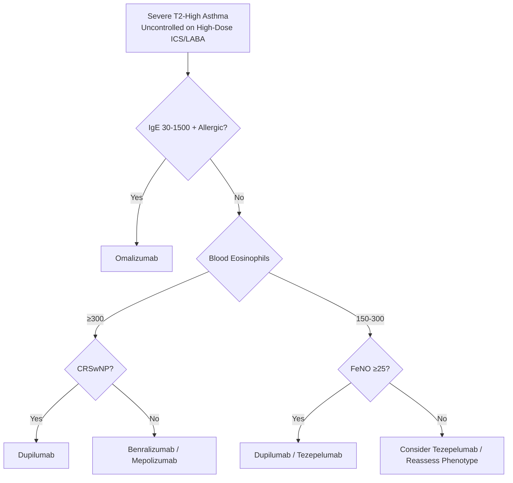
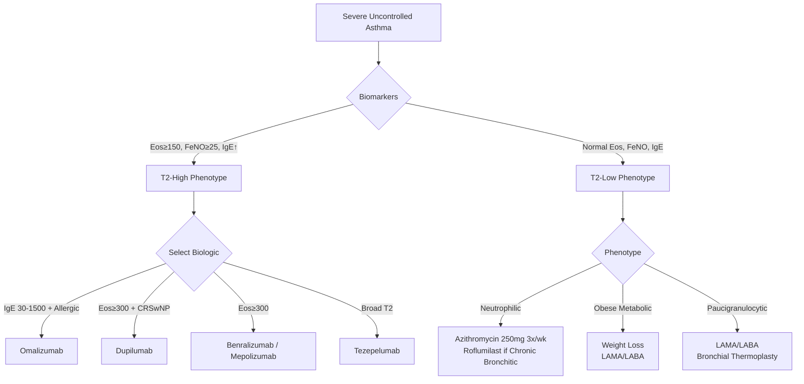

# Eosinophilic and Phenotype-Guided Asthma

Related: [[Asthma]], [[Severe asthma]], [[ABPA]], [[EGPA]], [[Biologics]], [[Airway Diseases/Difficult-to-treat and severe asthma|Difficult-to-treat and severe asthma]]

> [!important]
> **Phenotype-guided therapy** = precision medicine for asthma. **Eosinophilic phenotype** = **blood/sputum eosinophilia, late-onset, sinusitis, nasal polyps, steroid-responsive**. **Biologics** target T2 inflammation (anti-IgE, anti-IL5/5R, anti-IL4Rα, anti-TSLP). **Non-T2 phenotypes** = neutrophilic, paucigranulocytic, obese-metabolic → different targets. Key FCPS/MRCP: T2-high vs T2-low, biologic selection criteria, eosinophil thresholds, FeNO, steroid-sparing.

## Learning Objectives
- Classify asthma phenotypes (T2-high vs T2-low, eosinophilic vs neutrophilic vs paucigranulocytic)
- Apply biomarker thresholds (blood eosinophils, FeNO, periostin, IgE) for phenotype classification
- Select appropriate biologic based on phenotype, IgE, eosinophils, exacerbation history
- Apply stepping criteria (GINA 2023) for biologic initiation and response assessment
- Differentiate eosinophilic asthma from EGPA, ABPA, Churg-Strauss

## Definition
**Eosinophilic asthma** = asthma phenotype characterised by **type 2 (T2) airway inflammation** with **eosinophilic infiltration** of airways and blood, driven by **IL-4, IL-5, IL-13**. Typically **late-onset (≥18 yrs)**, **severe**, **steroid-responsive**, with comorbid **chronic rhinosinusitis with nasal polyps (CRSwNP)**.

## Pathophysiology — T2-High Inflammation
| Cytokine | Source | Effect |
|----------|--------|--------|
| **IL-4** | Th2 cells, ILC2 | IgE class switching, IgE production |
| **IL-5** | Th2 cells, ILC2 | Eosinophil differentiation, survival, recruitment |
| **IL-13** | Th2 cells, ILC2 | Mucus hypersecretion, airway hyperresponsiveness, IgE, remodelling |
| **TSLP/IL-33/IL-25** | Epithelium (alarmin) | Activates ILC2, Th2 |

> **T2-high** = eosinophils, FeNO, IgE ↑; **T2-low** = neutrophilic / paucigranulocytic.

## Clinical Phenotypes (Haldar et al. / Moore et al. Cluster Analysis)

| Phenotype | Demographics | Key Features | Biomarkers |
|-----------|--------------|--------------|------------|
| **Early-onset allergic** | Childhood onset, atopy, rhinitis | Good ICS response | High IgE, eosinophils, FeNO |
| **Late-onset eosinophilic** | **Adult onset (≥18-40 yrs)**, often female | **CRSwNP**, aspirin-exacerbated (AERD), steroid-dependent | **High blood/spu eos, FeNO, T2 cytokines** |
| **Obese non-eosinophilic** | Obese, female, late onset | Minimal T2 inflammation, metabolic dysfunction | Low eos, FeNO; neutrophilic/paucigranulocytic |
| **Smoking-associated** | Current/ex-smoker | Mixed obstructive/restrictive, poor ICS response | Low eos, neutrophilic |
| **Obese non-eosinophilic** | Obese, late onset | Minimal T2 inflammation | Low eos, FeNO; neutrophilic/paucigranulocytic |

> **Eosinophilic phenotype** = **late-onset eosinophilic** + **early-onset allergic** (both T2-high).

## Diagnostic Biomarkers (T2-High Identification)

| Biomarker | Cut-off for T2-High | Utility |
|-----------|---------------------|---------|
| **Blood eosinophils** | **≥150 cells/µL** (some use ≥300) | Accessible, repeatable; guides anti-IL5/5R |
| **Sputum eosinophils** | **≥2-3%** | Gold standard for airway inflammation; invasive |
| **FeNO (Exhaled NO)** | **≥25 ppb** (adults); **≥20 ppb** (children) | Non-invasive, T2 airway inflammation; guides ICS/biologics |
| **Serum IgE** | **>100 IU/mL** (or >75 IU/mL) | Guides omalizumab; also elevated in ABPA |
| **Periostin** | >50 ng/mL (research) | IL-13 induced; correlates with eosinophils; not routine |

> **FCPS/MRCP tip**: **Blood eosinophils ≥150/µL** = primary screening for **T2-high**; **FeNO ≥25 ppb** confirms airway T2 inflammation. **Both elevated** = high confidence T2-high.

## Biologics for Severe Eosinophilic Asthma (GINA 2023 Step 5)

| Biologic | Target | Indication Criteria (typical) | Dosing | Monitoring |
|----------|--------|------------------------------|--------|------------|
| **Omalizumab** | **IgE** (anti-IgE) | **IgE 30-1500 IU/mL**, weight-based, **≥1 exacerbation/yr**, FeNO >20 ppb | 75-375 mg SC q2-4wk (by IgE/weight) | IgE levels, exacerbation rate |
| **Mepolizumab** | **IL-5** (anti-IL5) | **Blood eos ≥150** (or ≥300 in past yr), **≥2 exacerbations/yr**, on high-dose ICS+LABA | 100 mg SC q4wk | Blood eos, exacerbations |
| **Benralizumab** | **IL-5Rα** (anti-IL5R, NK cell apoptosis) | **Blood eos ≥300** (or ≥150 with exacerbations), on high-dose ICS+LABA | 30 mg SC q4wk ×3, then q8wk | Blood eos (near zero), exacerbations |
| **Dupilumab** | **IL-4Rα** (blocks IL-4/IL-13) | **Blood eos ≥150** (or FeNO ≥25), **≥2 exacerbations/yr** or OCS-dependent, **CRSwNP** comorbid | 200 mg SC q2wk (300mg loading) | Blood eos, FeNO, exacerbations |
| **Tezepelumab** | **TSLP** (upstream alarmin) | **Broad T2-high** (eos ≥150, FeNO ≥25, IgE elevated), exacerbations on high-dose ICS/LABA | 210 mg SC q4wk | Exacerbations, eos, FeNO |

> **FCPS/MRCP tip**: **Blood eosinophils** = primary biologic selector: **≥300 → benralizumab/mepolizumab/dupilumab/tezepelumab**; **IgE 30-1500** → **omalizumab**; **CRSwNP + eosinophilic** → **dupilumab**; **broad T2** → **tezepelumab**.

## Biologic Selection Algorithm (Simplified)


> **Tezepelumab** = upstream (TSLP), broadest T2 coverage, approved for broad severe asthma regardless of specific biomarker threshold.

## Phenotype-Guided Non-Biologic Therapy
| Phenotype | Preferred Controller | Add-on if Uncontrolled |
|-----------|---------------------|------------------------|
| **Eosinophilic (T2-high)** | **High-dose ICS/LABA** | **LAMA** (tiotropium) → **Biologic** (Step 5) |
| **Neutrophilic (T2-low)** | **LAMA/LABA** (ICS optional) | **Azithromycin 250mg 3x/wk** (macrolide) → **Roflumilast** (if chronic bronchitic) |
| **Paucigranulocytic** | **LAMA/LABA** | **Azithromycin** / **Bronchial thermoplasty** (selected) |
| **Obese non-eosinophilic** | Weight loss, LAMA/LABA | Metabolic optimization, bariatric surgery eval |
| **AERD (Aspirin-Exacerbated)** | **Aspirin desensitisation** + LTRA (montelukast) → Biologic (dupilumab good for CRSwNP) |

## Non-T2 (T2-Low) Phenotypes
| Phenotype | Features | Biomarkers | Treatment |
|-----------|----------|------------|-----------|
| **Neutrophilic** | Neutrophils in sputum >60%, often smoking, obesity, infection | Sputum neutrophils >60%, IL-8, IL-17, IL-1β | LAMA/LABA, azithromycin 250mg 3x/wk, roflumilast (if chronic bronchitic) |
| **Paucigranulocytic** | Normal eos + neutrophils, often mild, early disease | Normal eos, normal neutrophils, normal FeNO | LAMA/LABA, ICS optional |
| **Obese metabolic** | Obesity, female, late onset, GERD, sleep apnoea | Low eos, low FeNO, neutrophilic or paucigranulocytic | Weight loss, LAMA/LABA, metabolic optimisation |

## Differential Diagnosis: Eosinophilic Asthma Mimics
| Condition | Key Differentiators |
|-----------|---------------------|
| **ABPA** | Central bronchiectasis, IgE >1000, *Aspergillus* sensitisation, high-attenuation mucus |
| **EGPA (Churg-Strauss)** | **Systemic vasculitis**: neuropathy, purpura, cardiac, GI; ANCA+ (40%), eosinophilia >1500 |
| **Eosinophilic granulomatosis** | Tissue eosinophilic infiltrates + granulomas (eosinophilic pneumonia, EGPA) |
| **Hypereosinophilic syndrome** | Eos >1500 × 6mo, organ damage (heart, CNS, skin), FIP1L1-PDGFRA |
| **Hyper-IgE syndrome** | **Recurrent staph abscesses**, coarse face, retained primary teeth, skeletal |
| **Tropical pulmonary eosinophilia** | Filariasis, high IgE/eos, cough, radiographic infiltrates, responds to DEC |

## Biologic Response Assessment (GINA Step 5 Review)
| Timepoint | Criteria for Response |
|-----------|----------------------|
| **4 months** | **↓ Exacerbations ≥50%**, **↓ OCS dose**, **↑ FEV₁ ≥100mL**, **↓ ACQ/ACT** |
| **12 months** | Sustained response → continue; consider dose reduction/extension |

> **Non-response at 4 months** → switch biologic (different target) or reassess phenotype (T2-low misclassified?)

## Complications of Uncontrolled Eosinophilic Asthma
- **Airway remodelling**: subepithelial fibrosis, smooth muscle hypertrophy → fixed airflow limitation
- **Corticosteroid dependence** → Cushing's, osteoporosis, diabetes, cataract
- **Airway mucus plugging** → atelectasis, recurrent infections
- **CRSwNP progression** → anosmia, facial pain, recurrent sinus surgery

## FCPS/MRCP High-Yield Points
1. **T2-high** = eosinophils, FeNO, IgE ↑; **T2-low** = neutrophilic/paucigranulocytic
2. **Blood eosinophils ≥150/µL** = T2-high screen; **≥300** = biologic eligibility (anti-IL5/5R)
3. **FeNO ≥25 ppb** = airway T2 inflammation; supports biologic/ICS
3. **Biologic selection**: IgE 30-1500 → **omalizumab**; eos ≥300 → **benralizumab/mepolizumab**; eos ≥150 + FeNO≥25/CRSwNP → **dupilumab**; broad T2 → **tezepelumab**
4. **Benralizumab** = **IL-5Rα**, depletes eosinophils via NK cells (q8wk after loading)
5. **Dupilumab** = **IL-4Rα** (blocks IL-4/13), best for **CRSwNP + eosinophilic asthma**
5. **Omalizumab** = **IgE 30-1500**, allergic phenotype
6. **Response at 4 months**: ↓ exacerbations ≥50%, ↓ OCS, ↑ FEV₁
6. **Non-T2 phenotypes**: neutrophilic (azithromycin), obese-metabolic (weight loss), paucigranulocytic

## Common Viva Questions
1. Classify asthma phenotypes (T2-high vs T2-low)
2. Biomarker thresholds for T2-high (eosinophils, FeNO, IgE)
4. Biologic selection algorithm (omalizumab vs mepolizumab/benralizumab vs dupilumab vs tezepelumab)
5. Difference between mepolizumab (anti-IL5) and benralizumab (anti-IL5R)
6. Dupilumab indications (CRSwNP, eosinophilic asthma, OCS-dependent)
6. Aspirin-exacerbated respiratory disease (AERD) management
7. Non-T2 phenotypes and treatment

## Common Confusions / Exam Traps
- **Mepolizumab vs Benralizumab**: both target IL-5 pathway but **mepolizumab = anti-IL5 (ligand), benralizumab = anti-IL5R (receptor, NK cell apoptosis)** → benralizumab q8wk, more complete eos depletion
- **Omalizumab** for **allergic** (IgE 30-1500); **not** for non-allergic eosinophilic asthma
- **Dupilumab** = **IL-4Rα** (blocks IL-4 & IL-13) → best for **CRSwNP + eosinophilic asthma**
- **Tezepelumab** = **TSLP** (upstream) → broadest T2 coverage, no specific biomarker threshold
- **Blood eosinophils** fluctuate — use **trend**, not single value (≥2 measurements)
- **FeNO** affected by smoking (↓), atopy (↑), ICS (↓) — interpret in context
- **Non-T2 asthma** (neutrophilic/obese) — **biologics DON'T work**; treat with azithromycin/weight loss

## Mnemonics
- **BIOLOGIC TARGETS**: **O**malizumab = **O** IgE; **M**epolizumab = **M** IL-5; **B**enralizumab = **B** IL-5R; **D**upilumab = **D** IL-4R; **T**ezepelumab = **T** TSLP
- **EOS THRESHOLDS**: **150** = screen; **300** = anti-IL5/5R; **150+ FeNO/CRSwNP** = dupilumab
- **PHENOTYPES**: **E**arly **A**llergic, **L**ate **E**os, **O**bese **N**on-Eos, **S**moking
- **AERD**: **A**spirin **E**xacerbated **R**espiratory **D**isease = **S**inusitis + **A**sthma + **A**spirin sensitivity

## Mind Map
```mermaid
mindmap
  root((Phenotype-Guided Asthma))
    T2-High (Eosinophilic)
      Biomarkers: Eos≥150, FeNO≥25, IgE↑
      Phenotypes: Early Allergic, Late-Onset Eos
      Biologics: Omalizumab (IgE), Mepo/Benra (IL-5/5R), Dupilumab (IL-4R), Tezepe (TSLP)
    T2-Low
      Neutrophilic: Azithromycin, Roflumilast
      Obese-Metabolic: Weight loss, LAMA/LABA
      Paucigranulocytic: LAMA/LABA
    Mimics
      ABPA (Central bronchiectasis, IgE>1000)
      EGPA (Vasculitis, ANCA, Neuropathy)
      HES (Eos>1500x6mo, Organ damage)
```

## Flowchart


## Suggested Visuals / Image Notes
- Biologic targets and mechanisms diagram
- Biomarker threshold table
- Biologic selection algorithm
- Asthma phenotype clusters (Haldar/Moore)

## Suggested Video References
- GINA 2023 severe asthma biologic algorithm
- Biologics mechanism of action (ERS)
- AERD diagnosis and management

## One-Page Revision Summary
- **T2-high**: eos ≥150, FeNO ≥25, IgE ↑ → biologics target T2 pathway
- **Phenotypes**: early allergic, late-onset eosinophilic, obese non-eos, neutrophilic, smoking
- **Biologics**: omalizumab (IgE 30-1500), mepolizumab (IL-5, eos≥150), benralizumab (IL-5Rα, eos≥300), dupilumab (IL-4Rα, eos≥150+FeNO/CRSwNP), tezepelumab (TSLP, broad T2)
- **Benralizumab** = IL-5Rα, NK apoptosis, q8wk dosing
- **Dupilumab** = IL-4Rα, blocks IL-4/13, best for CRSwNP
- **Omalizumab** = anti-IgE, allergic, IgE 30-1500
- **Tezepelumab** = TSLP, upstream, broad T2
- **Non-T2**: neutrophilic (azithromycin), obese (weight loss), paucigranulocytic
- **AERD**: aspirin desensitisation + LTRA + biologic (dupilumab)
- **Response at 4mo**: ≥50% ↓ exacerbations, ↓ OCS, ↑ FEV₁

## 24-Hour Recall Prompts
- List T2-high biomarkers and cut-offs
- Match biologics to targets (IgE, IL-5, IL-5R, IL-4R, TSLP)
- State benralizumab vs mepolizumab difference
- State dupilumab indication (CRSwNP + eosinophilic)

## 7-Day / 15-Day / 30-Day Revision Tracker
- [ ] Day 1 completed
- [ ] 24-hour recall completed
- [ ] Day 7 revision completed
- [ ] Day 15 revision completed
- [ ] Day 30 revision completed

## Must Know / Should Know / Nice to Know
### Must Know
- T2-high biomarkers (eos≥150, FeNO≥25, IgE)
- Biologic targets: IgE, IL-5, IL-5R, IL-4R, TSLP
- Blood eos thresholds: ≥150 screen, ≥300 anti-IL5/5R
- Benralizumab vs mepolizumab (IL-5R vs IL-5, q8wk vs q4wk)
- Dupilumab = IL-4Rα, best for CRSwNP
- Omalizumab = IgE 30-1500, allergic

### Should Know
- Biologic selection algorithm
- FeNO interpretation (smoking ↓, ICS ↓)
- AERD management (aspirin desensitisation)
- Non-T2 phenotypes (neutrophilic, obese, paucigranulocytic)
- Biologic switching criteria (4-month review)
- Blood eosinophil variability (trend > single value)

### Nice to Know
- Tezepelumab mechanism (TSLP upstream)
- Periostin as biomarker
- Bronchial thermoplasty indications
- Specific biologic trial outcomes (SIROCCO, CALIMA, LIBERTY, NAVIGATOR, SOURCE)
- Cost-effectiveness considerations

## Self-Test Scorecard
- Understanding: /10
- Recall: /10
- MCQ Performance: /10
- SBA Performance: /10
- Viva Confidence: /10
- Total: /50

> [!tip]
> Interpretation: <35 = weak topic, 35-44 = acceptable but insecure, 45+ = strong exam-ready topic.

## Exam Answer Modes
### Long Answer Skeleton
- Phenotype classification (T2-high vs T2-low, clusters)
- Biomarkers with cut-offs
- Biologic targets, indications, dosing, monitoring
- Selection algorithm
- Non-T2 phenotypes & treatment
- Mimics (ABPA, EGPA, AERD, HES)

### Short Note Skeleton
- Phenotype table
- Biomarker thresholds box
- Biologic comparison table
- Selection algorithm flowchart

### Viva One-Liners
- "T2-high = eos≥150, FeNO≥25, IgE↑"
- "Omalizumab = IgE 30-1500 (allergic)"
- "Mepolizumab = anti-IL5 (ligand); Benralizumab = anti-IL5R (receptor, NK apoptosis, q8wk)"
- "Dupilumab = IL-4Rα (blocks IL-4/13), best for CRSwNP"
- "Tezepelumab = TSLP (upstream), broad T2, no biomarker threshold"
- "Blood eos: ≥150 screen T2-high; ≥300 anti-IL5/5R"
- "FeNO ≥25 ppb = airway T2 inflammation"
- "Non-T2: neutrophilic → azithromycin; obese → weight loss; paucigranulocytic → LAMA/LABA"
- "EGPA = vasculitis + eosinophilia + ANCA + neuropathy"
- "4-month review: ≥50% ↓ exacerbations, ↓ OCS, ↑ FEV₁"

### Ward-Case Discussion Points
- Severe asthma, eos 400, CRSwNP, 3 exacerbations/yr → dupilumab (IL-4Rα, CRSwNP)
- Allergic asthma, IgE 800, eos 200, 2 exacerbations → omalizumab (IgE 30-1500)
- Severe asthma, eos 500, no CRSwNP, on OCS → benralizumab (q8wk, OCS-sparing) or mepolizumab
- Non-eosinophilic severe asthma, obese, neutrophilic sputum → weight loss, LAMA/LABA, azithromycin

### Last-Night-Before-Exam Sheet
- T2-High: Eos≥150, FeNO≥25, IgE↑
- Biologics: Omal(IgE), Mepo(IL-5), Benra(IL-5R), Dupi(IL-4R), Tezepe(TSLP)
- Benra vs Mepo: IL-5R vs IL-5; q8wk vs q4wk
- Dupi: IL-4R, CRSwNP + Eos
- Omal: IgE 30-1500
- Eos thresholds: 150 screen, 300 anti-IL5/5R
- FeNO≥25 = T2 airway
- Non-T2: Neutro(azithro), Obese(weight), Pauci(LAMA)
- AERD: Aspirin desens + LTRA + Biologic

## Summary
**Phenotype-guided asthma** = precision medicine based on T2 inflammation biomarkers. **T2-high** = **eosinophils ≥150/µL, FeNO ≥25 ppb, IgE elevated** → biologics targeting T2 pathway. **Biologics**: **omalizumab** (IgE 30-1500), **mepolizumab** (anti-IL5, eos≥150), **benralizumab** (anti-IL5R, eos≥300, q8wk), **dupilumab** (anti-IL4Rα, eos≥150+FeNO/CRSwNP), **tezepelumab** (TSLP, broad T2). **Benralizumab** = anti-IL5R, NK apoptosis, q8wk; **dupilumab** = IL-4Rα, best for CRSwNP. **Non-T2 phenotypes**: neutrophilic (azithromycin, roflumilast), obese-metabolic (weight loss), paucigranulocytic (LAMA/LABA). **Mimics**: ABPA (central bronchiectasis, IgE>1000), EGPA (vasculitis, ANCA, neuropathy), HES (eos>1500×6mo). **Response at 4mo**: ≥50% ↓ exacerbations, ↓ OCS, ↑ FEV₁.

## MCQs (10)
1. Which biologic targets **IgE** for severe allergic asthma?
   A. Mepolizumab
   B. Benralizumab
   C. **Omalizumab**
   D. Dupilumab
2. **Blood eosinophil threshold** for considering anti-IL5/5R therapy (mepolizumab/benralizumab):
   A. ≥100/µL
   B. **≥150/µL** (screen) / **≥300/µL** (strong indication)
   C. ≥500/µL
   D. ≥1000/µL
3. **Benralizumab** differs from mepolizumab by targeting:
   A. IL-4
   B. **IL-5 receptor (IL-5Rα)**
   C. TSLP
   D. IL-13
4. **Dupilumab** is the preferred biologic for:
   A. Allergic asthma only
   B. **CRSwNP + eosinophilic asthma**
   C. Neutrophilic asthma
   D. Obese non-eosinophilic asthma
5. **Tezepelumab** target:
   A. IL-5
   B. IL-4Rα
   C. **TSLP (upstream alarmin)**
   D. IgE

## SBA Questions (10)
1. A 32-year-old woman with severe eosinophilic asthma (eos 400, FeNO 45) and CRSwNP has 3 exacerbations/yr on high-dose ICS/LABA. Best biologic:
   A. Omalizumab
   B. Mepolizumab
   C. Benralizumab
   D. **Dupilumab**
2. Patient with severe asthma, IgE 500, eosinophils 100, no CRSwNP. Best biologic:
   A. Omalizumab
   B. Mepolizumab
   C. Benralizumab
   D. Dupilumab
3. Patient with severe eosinophilic asthma, eos 500, no CRSwNP, on maintenance OCS. Best OCS-sparing biologic:
   A. Omalizumab
   B. Mepolizumab
   C. **Benralizumab** (best OCS-sparing data)
   D. Dupilumab
4. Blood eosinophil threshold for anti-IL5/5R:
   A. ≥100
   B. **≥150 (screen) / ≥300 strong**
   C. ≥500
   D. ≥1000
5. Difference between mepolizumab and benralizumab:
   A. Mepolizumab = IL-5R; Benralizumab = IL-5
   B. **Mepolizumab = anti-IL5 (ligand); Benralizumab = anti-IL5R (receptor, NK apoptosis, q8wk)**
   C. Same target, different dosing
   D. Benralizumab = anti-IL4R
6. Dupilumab target:
   A. IL-5
   B. IL-5R
   C. **IL-4Rα (blocks IL-4 & IL-13)**
   D. TSLP
7. Tezepelumab target:
   A. IL-5
   B. IL-4R
   C. IgE
   D. **TSLP (upstream)**
8. CRSwNP + eosinophilic asthma → preferred biologic:
   A. Omalizumab
   B. Mepolizumab
   C. Benralizumab
   D. **Dupilumab**
9. Blood eosinophil threshold for anti-IL5/5R therapy:
   A. 50
   B. **150/300**
   C. 500
   D. 1000
10. Non-T2 asthma phenotype treated with azithromycin:
    A. Eosinophilic
    B. **Neutrophilic**
    C. Obese
    D. Paucigranulocytic

## Flashcards
- Q: Omalizumab target
  A: IgE (30-1500 IU/mL)
- Q: Mepolizumab target
  A: IL-5 (ligand)
- Q: Benralizumab target
  A: IL-5Rα (receptor), NK apoptosis, q8wk
- Q: Dupilumab target
  A: IL-4Rα (blocks IL-4 & IL-13)
- Q: Tezepelumab target
  A: TSLP (upstream)
- Q: Eosinophil thresholds
  A: ≥150 screen T2-high; ≥300 anti-IL5/5R
- Q: FeNO T2-high
  A: ≥25 ppb
- Q: Dupilumab indication
  A: CRSwNP + eosinophilic asthma
- Q: Omalizumab IgE range
  A: 30-1500 IU/mL
- Q: Benralizumab dosing
  A: 30mg SC q4wk ×3, then q8wk

## Answer Key with Explanations
### MCQs
1. **C** — Omalizumab binds free IgE.
2. **B** — ≥150/µL screens for T2-high; ≥300/µL strong indication for anti-IL5/5R.
3. **B** — Benralizumab = anti-IL5Rα (receptor); mepolizumab = anti-IL5 (ligand).
4. **B** — Dupilumab (IL-4Rα) approved for CRSwNP + eosinophilic asthma.
5. **C** — Tezepelumab targets TSLP (upstream).

### SBAs
1. **D** — CRSwNP + eosinophilic → dupilumab (IL-4Rα blocks IL-4/13, CRSwNP indication).
2. **A** — IgE 500 (in range), eos 100 (<150) → allergic phenotype → omalizumab.
3. **C** — Benralizumab has best OCS-sparing data (ZONDA trial).
4. **B** — ≥150 screen, ≥300 strong for anti-IL5/5R.
5. **B** — Mepolizumab = anti-IL5 (ligand); Benralizumab = anti-IL5R (receptor, NK apoptosis, q8wk).
6. **C** — Dupilumab = IL-4Rα, blocks IL-4 & IL-13.
7. **D** — Tezepelumab = TSLP (upstream alarmin).
8. **D** — CRSwNP + eosinophilic → dupilumab.
9. **B** — ≥150 screen, ≥300 strong indication.
10. **B** — Neutrophilic phenotype → azithromycin 250mg 3x/wk.

## Flashcards
- Q: Omalizumab target
  A: IgE (30-1500 IU/mL)
- Q: Mepolizumab target
  A: IL-5 (ligand)
- Q: Benralizumab target
  A: IL-5Rα (receptor), NK apoptosis, q8wk
- Q: Dupilumab target
  A: IL-4Rα (blocks IL-4 & IL-13)
- Q: Tezepelumab target
  A: TSLP (upstream)
- Q: Eosinophil thresholds
  A: ≥150 screen T2-high; ≥300 anti-IL5/5R
- Q: FeNO T2-high
  A: ≥25 ppb
- Q: Dupilumab indication
  A: CRSwNP + eosinophilic asthma
- Q: Omalizumab IgE range
  A: 30-1500 IU/mL
- Q: Benralizumab dosing
  A: 30mg SC q4wk ×3, then q8wk

## Answer Key with Explanations
### MCQs
1. **C** — Omalizumab binds IgE.
2. **B** — ≥150 screen, ≥300 strong for anti-IL5/5R.
3. **B** — Benralizumab = anti-IL5Rα receptor.
4. **B** — Dupilumab approved for CRSwNP + eosinophilic asthma.
5. **C** — Tezepelumab = TSLP upstream.

### SBAs
1. **D** — CRSwNP + eosinophilic → dupilumab (IL-4Rα).
2. **A** — IgE 500, eos 100 → allergic → omalizumab.
3. **C** — Benralizumab best OCS-sparing (ZONDA).
4. **B** — ≥150 screen, ≥300 strong.
5. **B** — Mepo = anti-IL5 ligand; Benra = anti-IL5R receptor.
6. **C** — Dupilumab = IL-4Rα (blocks IL-4 & IL-13).
7. **D** — Tezepelumab = TSLP upstream.
8. **D** — CRSwNP + eos → dupilumab.
9. **B** — ≥150 screen, ≥300 strong.
10. **B** — Neutrophilic = azithromycin.

---
## Additional MCQs (6–10)

6. Blood eosinophil count suggesting **eosinophilic asthma**:
   A. <100/µL
   B. **≥300/µL**
   C. <50/µL
   D. ≥1000/µL only
   E. 0/µL
   **Answer: B** — ≥300/µL (or ≥150 with prior history) supports eosinophilic phenotype.

7. FeNO threshold suggesting **steroid-responsive eosinophilic asthma** in adults:
   A. <10 ppb
   B. **≥40 ppb**
   C. <25 ppb
   D. ≥200 ppb
   E. 0 ppb
   **Answer: B** — ≥40 ppb suggests T2-high / steroid-responsive.

8. Which biologic targets **IL-5 receptor α**?
   A. Mepolizumab
   B. Reslizumab
   C. **Benralizumab**
   D. Dupilumab
   E. Omalizumab
   **Answer: C** — Benralizumab targets IL-5Rα (causes eosinophil apoptosis).

9. Which biologic targets **IL-4Rα** (blocks IL-4 and IL-13)?
   A. Mepolizumab
   B. Omalizumab
   C. **Dupilumab**
   D. Tezepelumab
   E. Benralizumab
   **Answer: C** — Dupilumab targets IL-4Rα.

10. Which biologic targets **thymic stromal lymphopoietin (TSLP)**?
    A. Mepolizumab
    B. Omalizumab
    C. Dupilumab
    D. **Tezepelumab**
    E. Benralizumab
    **Answer: D** — Tezepelumab targets TSLP (broad effect).

## Additional SBAs (6–10)

6. A 50-year-old with severe asthma has eos 800/µL, FeNO 90 ppb, IgE 200 IU/mL, multiple exacerbations. Best biologic:
   A. Omalizumab
   B. **Mepolizumab or dupilumab**
   C. Infliximab
   D. Etanercept
   E. Methotrexate
   **Answer: B** — High eos + high FeNO → anti-IL5 (mepolizumab) or anti-IL4Rα (dupilumab).

7. A severe asthma patient on omalizumab has good response. After how long should response be assessed?
   A. 1 month
   B. **4–6 months**
   C. 1 year
   D. 1 week
   E. 2 weeks
   **Answer: B** — Assess biologic response at 4–6 months.

8. Theophylline in severe asthma:
   A. First-line
   B. **Third-line add-on (narrow therapeutic index)**
   C. Never used
   D. Routine
   E. Always with biologics
   **Answer: B** — Third-line add-on, narrow therapeutic index.

9. LTRA in asthma:
   A. Always first-line
   B. **Add-on in aspirin-exacerbated, exercise-induced, viral-induced**
   C. Never used
   D. Substitute for ICS
   E. Only in severe
   **Answer: B** — Add-on in specific phenotypes.

10. Which cytokine drives eosinophil maturation in the bone marrow?
    A. IL-4
    B. IL-13
    C. **IL-5**
    D. IL-17
    E. IFN-γ
    **Answer: C** — IL-5 from Th2 cells drives eosinophil maturation.

## Local Navigation
- **Parent Heading**: [[../Airway Diseases|Airway Diseases]]
- **Parent Topic Group**: [[../Airway Diseases/Asthma spectrum|Asthma spectrum]]
- **Chapter Map**: [[../Davidson Chapter 17 - Respiratory Medicine Hierarchy|Respiratory Medicine Hierarchy]]
- **Chapter MOC**: [[../Respiratory MOC|Respiratory MOC]]
- **Drug Reference**: [[../../Clinical Therapeutics and Good Prescribing|Drugs]]
- **Related**: [[Asthma]] · [[Acute severe asthma]] · [[Difficult-to-treat and severe asthma]] · [[Occupational asthma]]
