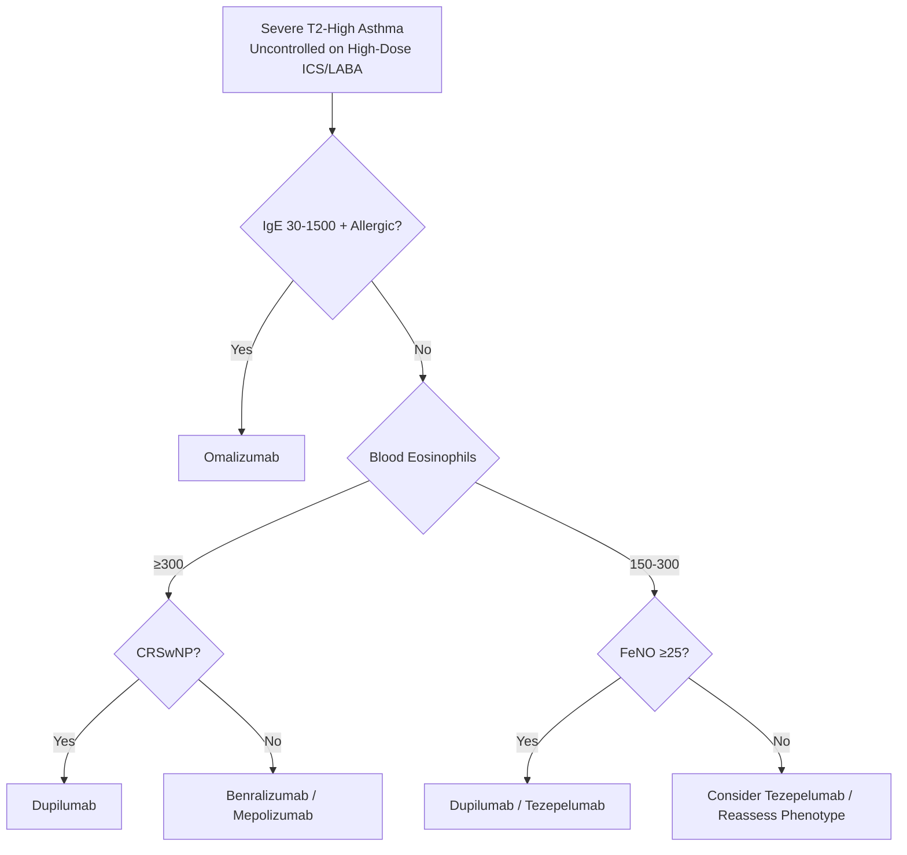

# Eosinophilic and Phenotype-Guided Asthma

Related: [[Asthma]], [[Severe asthma]], [[ABPA]], [[EGPA]], [[Biologics]], [[Airway Diseases/Difficult-to-treat and severe asthma|Difficult-to-treat and severe asthma]]

> [!important]
> **Phenotype-guided therapy** = precision medicine for asthma. **Eosinophilic phenotype** = **blood/sputum eosinophilia, late-onset, sinusitis, nasal polyps, steroid-responsive**. **Biologics** target T2 inflammation (anti-IgE, anti-IL5/5R, anti-IL4Rα, anti-TSLP). **Non-T2 phenotypes** = neutrophilic, paucigranulocytic, obese-metabolic → different targets. Key FCPS/MRCP: T2-high vs T2-low, biologic selection criteria, eosinophil thresholds, FeNO, steroid-sparing.

## 1. Learning Objectives
- Classify asthma phenotypes (T2-high vs T2-low, eosinophilic vs neutrophilic vs paucigranulocytic)
- Apply biomarker thresholds (blood eosinophils, FeNO, periostin, IgE) for phenotype classification
- Select appropriate biologic based on phenotype, IgE, eosinophils, exacerbation history
- Apply stepping criteria (GINA 2023) for biologic initiation and response assessment
- Differentiate eosinophilic asthma from EGPA, ABPA, Churg-Strauss

## 2. Definition
**Eosinophilic asthma** = asthma phenotype characterised by **type 2 (T2) airway inflammation** with **eosinophilic infiltration** of airways and blood, driven by **IL-4, IL-5, IL-13**. Typically **late-onset (≥18 yrs)**, **severe**, **steroid-responsive**, with comorbid **chronic rhinosinusitis with nasal polyps (CRSwNP)**.

## 3. Pathophysiology — T2-High Inflammation
| Cytokine | Source | Effect |
|----------|--------|--------|
| **IL-4** | Th2 cells, ILC2 | IgE class switching, IgE production |
| **IL-5** | Th2 cells, ILC2 | Eosinophil differentiation, survival, recruitment |
| **IL-13** | Th2 cells, ILC2 | Mucus hypersecretion, airway hyperresponsiveness, IgE, remodelling |
| **TSLP/IL-33/IL-25** | Epithelium (alarmin) | Activates ILC2, Th2 |

> **T2-high** = eosinophils, FeNO, IgE ↑; **T2-low** = neutrophilic / paucigranulocytic.

## 4. Clinical Phenotypes (Haldar et al. / Moore et al. Cluster Analysis)

| Phenotype | Demographics | Key Features | Biomarkers |
|-----------|--------------|--------------|------------|
| **Early-onset allergic** | Childhood onset, atopy, rhinitis | Good ICS response | High IgE, eosinophils, FeNO |
| **Late-onset eosinophilic** | **Adult onset (≥18-40 yrs)**, often female | **CRSwNP**, aspirin-exacerbated (AERD), steroid-dependent | **High blood/spu eos, FeNO, T2 cytokines** |
| **Obese non-eosinophilic** | Obese, female, late onset | Minimal T2 inflammation, metabolic dysfunction | Low eos, FeNO; neutrophilic/paucigranulocytic |
| **Smoking-associated** | Current/ex-smoker | Mixed obstructive/restrictive, poor ICS response | Low eos, neutrophilic |
| **Obese non-eosinophilic** | Obese, late onset | Minimal T2 inflammation | Low eos, FeNO; neutrophilic/paucigranulocytic |

> **Eosinophilic phenotype** = **late-onset eosinophilic** + **early-onset allergic** (both T2-high).

## 5. Diagnostic Biomarkers (T2-High Identification)

| Biomarker | Cut-off for T2-High | Utility |
|-----------|---------------------|---------|
| **Blood eosinophils** | **≥150 cells/µL** (some use ≥300) | Accessible, repeatable; guides anti-IL5/5R |
| **Sputum eosinophils** | **≥2-3%** | Gold standard for airway inflammation; invasive |
| **FeNO (Exhaled NO)** | **≥25 ppb** (adults); **≥20 ppb** (children) | Non-invasive, T2 airway inflammation; guides ICS/biologics |
| **Serum IgE** | **>100 IU/mL** (or >75 IU/mL) | Guides omalizumab; also elevated in ABPA |
| **Periostin** | >50 ng/mL (research) | IL-13 induced; correlates with eosinophils; not routine |

> **FCPS/MRCP tip**: **Blood eosinophils ≥150/µL** = primary screening for **T2-high**; **FeNO ≥25 ppb** confirms airway T2 inflammation. **Both elevated** = high confidence T2-high.

## 6. Biologics for Severe Eosinophilic Asthma (GINA 2023 Step 5)

| Biologic | Target | Indication Criteria (typical) | Dosing | Monitoring |
|----------|--------|------------------------------|--------|------------|
| **Omalizumab** | **IgE** (anti-IgE) | **IgE 30-1500 IU/mL**, weight-based, **≥1 exacerbation/yr**, FeNO >20 ppb | 75-375 mg SC q2-4wk (by IgE/weight) | IgE levels, exacerbation rate |
| **Mepolizumab** | **IL-5** (anti-IL5) | **Blood eos ≥150** (or ≥300 in past yr), **≥2 exacerbations/yr**, on high-dose ICS+LABA | 100 mg SC q4wk | Blood eos, exacerbations |
| **Benralizumab** | **IL-5Rα** (anti-IL5R, NK cell apoptosis) | **Blood eos ≥300** (or ≥150 with exacerbations), on high-dose ICS+LABA | 30 mg SC q4wk ×3, then q8wk | Blood eos (near zero), exacerbations |
| **Dupilumab** | **IL-4Rα** (blocks IL-4/IL-13) | **Blood eos ≥150** (or FeNO ≥25), **≥2 exacerbations/yr** or OCS-dependent, **CRSwNP** comorbid | 200 mg SC q2wk (300mg loading) | Blood eos, FeNO, exacerbations |
| **Tezepelumab** | **TSLP** (upstream alarmin) | **Broad T2-high** (eos ≥150, FeNO ≥25, IgE elevated), exacerbations on high-dose ICS/LABA | 210 mg SC q4wk | Exacerbations, eos, FeNO |

> **FCPS/MRCP tip**: **Blood eosinophils** = primary biologic selector: **≥300 → benralizumab/mepolizumab/dupilumab/tezepelumab**; **IgE 30-1500** → **omalizumab**; **CRSwNP + eosinophilic** → **dupilumab**; **broad T2** → **tezepelumab**.

## 7. Biologic Selection Algorithm (Simplified)

> **Tezepelumab** = upstream (TSLP), broadest T2 coverage, approved for broad severe asthma regardless of specific biomarker threshold.

## 8. Phenotype-Guided Non-Biologic Therapy
| Phenotype | Preferred Controller | Add-on if Uncontrolled |
|-----------|---------------------|------------------------|
| **Eosinophilic (T2-high)** | **High-dose ICS/LABA** | **LAMA** (tiotropium) → **Biologic** (Step 5) |
| **Neutrophilic (T2-low)** | **LAMA/LABA** (ICS optional) | **Azithromycin 250mg 3x/wk** (macrolide) → **Roflumilast** (if chronic bronchitic) |
| **Paucigranulocytic** | **LAMA/LABA** | **Azithromycin** / **Bronchial thermoplasty** (selected) |
| **Obese non-eosinophilic** | Weight loss, LAMA/LABA | Metabolic optimization, bariatric surgery eval |
| **AERD (Aspirin-Exacerbated)** | **Aspirin desensitisation** + LTRA (montelukast) → Biologic (dupilumab good for CRSwNP) |

## 9. Non-T2 (T2-Low) Phenotypes
| Phenotype | Features | Biomarkers | Treatment |
|-----------|----------|------------|-----------|
| **Neutrophilic** | Neutrophils in sputum >60%, often smoking, obesity, infection | Sputum neutrophils >60%, IL-8, IL-17, IL-1β | LAMA/LABA, azithromycin 250mg 3x/wk, roflumilast (if chronic bronchitic) |
| **Paucigranulocytic** | Normal eos + neutrophils, often mild, early disease | Normal eos, normal neutrophils, normal FeNO | LAMA/LABA, ICS optional |
| **Obese metabolic** | Obesity, female, late onset, GERD, sleep apnoea | Low eos, low FeNO, neutrophilic or paucigranulocytic | Weight loss, LAMA/LABA, metabolic optimisation |

## 10. Differential Diagnosis: Eosinophilic Asthma Mimics
| Condition | Key Differentiators |
|-----------|---------------------|
| **ABPA** | Central bronchiectasis, IgE >1000, *Aspergillus* sensitisation, high-attenuation mucus |
| **EGPA (Churg-Strauss)** | **Systemic vasculitis**: neuropathy, purpura, cardiac, GI; ANCA+ (40%), eosinophilia >1500 |
| **Eosinophilic granulomatosis** | Tissue eosinophilic infiltrates + granulomas (eosinophilic pneumonia, EGPA) |
| **Hypereosinophilic syndrome** | Eos >1500 × 6mo, organ damage (heart, CNS, skin), FIP1L1-PDGFRA |
| **Hyper-IgE syndrome** | **Recurrent staph abscesses**, coarse face, retained primary teeth, skeletal |
| **Tropical pulmonary eosinophilia** | Filariasis, high IgE/eos, cough, radiographic infiltrates, responds to DEC |

*[Truncated — see eosinophilic-and-phenotype-guided-asthma.md for full content]*
