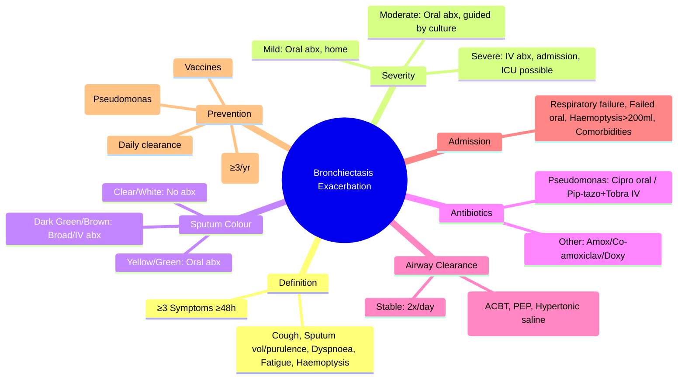
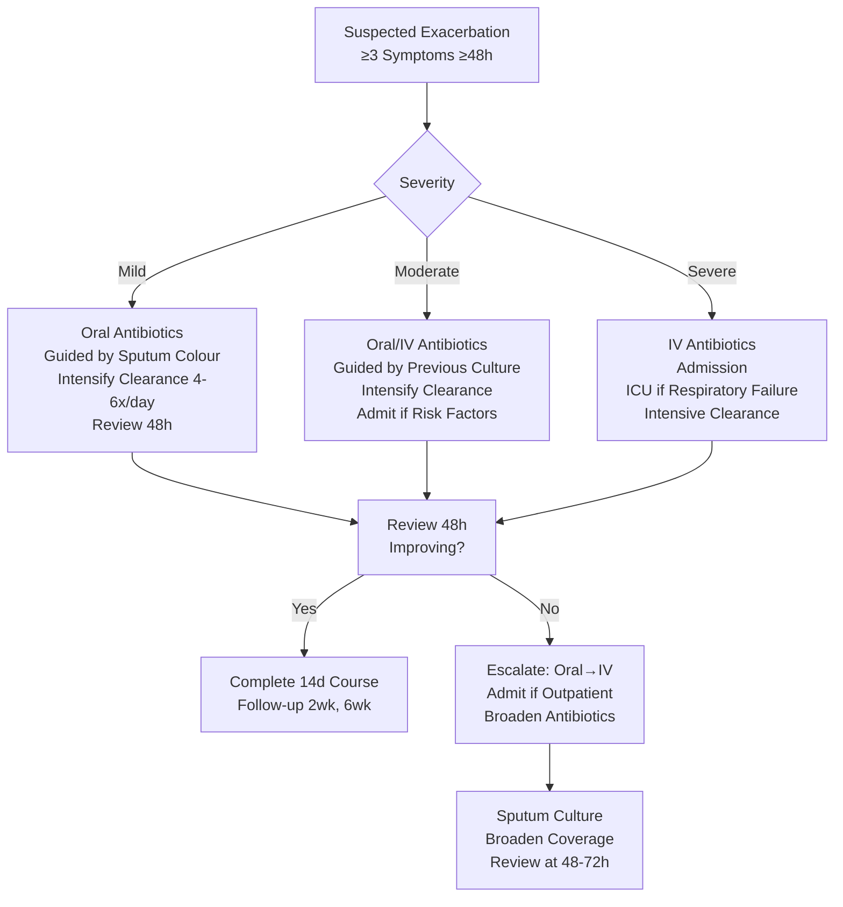

# Non-Cystic Fibrosis Bronchiectasis Exacerbation

Related: [[Bronchiectasis]], [[COPD]], [[Airway Diseases/Cystic fibrosis-related bronchiectasis|Cystic Fibrosis-Related Bronchiectasis]], [[Airway Diseases/Bronchiectasis and suppurative airway disease|Bronchiectasis and suppurative airway disease]]

> [!important]
> **Exacerbation** = sustained worsening of symptoms ≥48h beyond day-to-day variation requiring change in treatment. **Key FCPS/MRCP**: definition, colour-coded sputum management, antibiotic selection (oral vs IV), airway clearance intensification, admission criteria, prevention.

## Learning Objectives
- Define bronchiectasis exacerbation and severity grading
- Apply colour-coded sputum management (BTS)
- Select empirical and targeted antibiotics (oral vs IV)
- Intensify airway clearance during exacerbation
- Apply admission criteria and prevention strategies

## Definition
**Bronchiectasis exacerbation** = sustained worsening of ≥3 of the following for ≥48 hours, requiring change in treatment:
1. Cough frequency/severity
2. Sputum volume/consistency
3. Sputum purulence/colour
4. Breathlessness/exercise intolerance
5. Fatigue/malaise
6. Haemoptysis

## Severity Grading (Bronchiectasis Severity Index / Exacerbation Grading)
| Severity | Features | Management |
|----------|----------|------------|
| **Mild** | Increased cough/sputum, preserved function | Oral antibiotics + intensified airway clearance; home |
| **Moderate** | Increased purulence, dyspnoea, FEV₁ drop 10-20% | Oral antibiotics (guided by previous culture); consider IV if risk factors |
| **Severe** | Systemic upset (fever, tachycardia), FEV₁ drop >20%, new infiltrate, respiratory failure | **IV antibiotics**; hospital admission; airway clearance; consider ICU |

## Colour-Coded Sputum Management (BTS/ERS)
| Sputum Colour | Meaning | Action |
|---------------|---------|--------|
| **Clear/white** | Non-purulent | No antibiotics; intensify clearance |
| **Light yellow/green** | Mild-moderate purulence | Oral antibiotics if symptomatic |
| **Dark green/brown** | Heavy purulence, likely bacterial | Oral/IV antibiotics (broader spectrum) |
| **Blood-streaked** | Haemoptysis | Assess volume; antibiotics if purulent |

## Antibiotic Selection

### Empirical Oral Therapy (First-line)
| Organism | Typical Agents | Duration |
|----------|----------------|----------|
| **H. influenzae** | Amoxicillin 500mg tds, Doxycycline 100mg bd, Co-amoxiclav 625mg tds | 14 days |
| **M. catarrhalis** | Same as above | 14 days |
| **S. pneumoniae** | Amoxicillin 500mg tds, Co-amoxiclav 625mg tds | 14 days |
| **S. aureus (MSSA)** | Flucloxacillin 500mg qds, Co-amoxiclav | 14 days |
| **P. aeruginosa** (mild, first isolation) | **Ciprofloxacin 500mg bd** OR **Levofloxacin 500mg od** | 14 days |
| **Penicillin allergy** | Doxycycline/Clarithromycin/Levofloxacin | 14 days |

### IV Therapy (Severe / Pseudomonas / Failed Oral)
| Organism | Regimen | Duration |
|----------|---------|----------|
| **P. aeruginosa** | **Piperacillin-tazobactam 4.5g qds** + **Tobramycin 5-7 mg/kg/day** OR **Ceftazidime 2g tds** + **Tobramycin** OR **Meropenem 1g tds** | 14-21 days |
| **B. cepacia complex** | **Ceftazidime** + **Co-trimoxazole** ± **Temocillin** (guided by sensitivities) | 21-28 days |
| **MRSA** | **Vancomycin** 15-20 mg/kg q12h (trough 15-20) OR **Linezolid** 600mg bd | 14-21 days |
| **NTM** (*M. avium*) | **Clarithromycin 500mg bd** + **Ethambutol 15mg/kg** + **Rifampicin 10mg/kg** | ≥12 months post-culture negativity |

### Duration Guidelines
| Severity | Duration |
|----------|----------|
| **Mild/Moderate** | 14 days |
| **Severe / Pseudomonas** | 14-21 days |
| **B. cepacia / NTM** | Longer (weeks-months) |
| **Consider shorter (7-10 days)** | If rapid clinical improvement + CRP normalisation |

## Airway Clearance Intensification (During Exacerbation)
| Technique | Frequency Increase |
|-----------|-------------------|
| **ACBT** (Active Cycle of Breathing Technique) | 4-6x/day (vs 2x baseline) |
| **PEP / Oscillating PEP** | 4-6x/day, longer sessions |
| **Nebulised hypertonic saline** | 7% 4-6 mL q6h (increase from bd) |
| **Dornase alfa** | 2.5 mg nebulised bd (continue/increase) |
| **Positioning** | Gravity-assisted drainage q4-6h if hospitalised |

## Admission Criteria (Any One)
- **Severe exacerbation** (systemic upset, fever >38°C, tachycardia >120)
- **Respiratory failure** (SpO₂ <90%, PaCO₂ >6 kPa, pH <7.35)
- **Haemodynamic instability** (SBP <90, lactate >2)
- **Haemoptysis** >200 mL/24h or massive
- **Inability to manage at home** (frailty, social, IV antibiotics needed)
- **Failed oral antibiotics** (48-72h no improvement)
- **New radiological infiltrate** (pneumonia)
- **Comorbidities** (heart failure, renal failure, immunosuppression)

## Prevention Strategies (Stable State)
| Intervention | Evidence / Indication |
|--------------|----------------------|
| **Airway clearance** (daily ACBT/PEP) | Reduces exacerbation frequency |
| **Mucoactives** (dornase alfa 2.5mg nebulised bd, hypertonic saline 7% bd) | ↓ exacerbations, improves quality of life |
| **Long-term macrolides** (Azithromycin 250mg 3x/week, or Erythromycin 500mg od) | **Key for frequent exacerbators** (≥3/yr); ↓ exacerbations ~50% |
| **Inhaled antibiotics** (Colistin, Tobramycin, Aztreonam) | Chronic Pseudomonas; 28 days on/off cycles |
| **Vaccinations** | Pneumococcal (PCV20/PPSV23), Influenza annual, COVID-19, Pertussis |
| **Smoking cessation** | Critical if smoker |
| **Nutrition / Vitamin D** | Correct deficiency; protein/calorie optimisation |
| **Gastro-oesophageal reflux treatment** | PPI if reflux contributes |

## Follow-up Post-Exacerbation
| Timeline | Actions |
|----------|---------|
| **2 weeks** | Clinical review, sputum culture, spirometry, review antibiotics |
| **4-6 weeks** | Repeat sputum culture (ensure eradication), assess lung function recovery |
| **3 months** | Full review: exacerbation frequency, FEV₁ trend, sputum culture, adherence |
| **6 months** | Full MDT review if frequent exacerbator (≥3/yr) |

## FCPS/MRCP High-Yield Points
1. **Exacerbation definition**: ≥3 symptoms worsening ≥48h (cough, sputum volume/purulence, dyspnoea, fatigue, haemoptysis)
2. **Colour-coded sputum**: clear=no abx, yellow/green=oral abx, dark green/brown=broader abx
3. **Pseudomonas** = ciprofloxacin/levofloxacin oral; IV pip-tazo + tobramycin if severe
4. **Long-term azithromycin** 250mg 3x/week = first-line prevention for ≥3 exacerbations/yr
5. **IV antibiotics**: severe exacerbation, Pseudomonas, failed oral, respiratory failure
5. **Airway clearance intensification**: 4-6x/day during exacerbation
6. **Admission**: respiratory failure, haemoptysis >200mL, failed oral abx, comorbidities
7. **Prevention**: daily clearance, long-term macrolides (≥3/yr), inhaled abx for Pseudomonas, vaccination
8. **Duration**: 14 days standard; 14-21 days severe/Pseudomonas
8. **Duration**: 14 days standard; 14-21 days severe/Pseudomonas
9. **Follow-up**: sputum culture at 2 and 6 weeks post-exacerbation

## Common Viva Questions
1. Exacerbation definition and severity grading
2. Colour-coded sputum management
3. Antibiotic choice for Pseudomonas (oral vs IV)
3. Long-term macrolide indications
4. Admission criteria
5. Prevention strategies
6. IV vs oral antibiotic criteria
7. Airway clearance techniques
8. Post-exacerbation follow-up

## Common Confusions / Exam Traps
- **Not every colour change = antibiotics** (clear/mucoid = no abx)
- **Ciprofloxacin** = only oral with anti-pseudomonal activity
- **Azithromycin** = prevention only (≥3 exacerbations/yr), NOT for acute treatment
- **Duration 14 days** standard; longer for severe/Pseudomonas
- **DO NOT use inhaled antibiotics for acute exacerbation** (prevention only)
- **Clear sputum** ≠ antibiotics
- **Long-term macrolides** for PREVENTION, not treatment of acute exacerbation

## Mnemonics
- **EXACERBATION**: **E**xacerbation = **3** symptoms **48**h
- **SPUTUM COLOUR**: **C**lear = **N**o abx; **Y**ellow/**G**reen = **O**ral; **D**ark = **I**V/broad
- **PSEUDOMONAS**: **C**iprofloxacin **O**ral; **P**ip-tazo + **T**obramycin **IV**
- **AZITHROMYCIN**: **P**revention **O**nly (≥3/yr); **N**ot for acute
- **IV INDICATIONS**: **S**evere, **P**seudomonas, **F**ailed oral, **R**espiratory failure
- **CLEARANCE**: **4**x/day exacerbation; **D**aily stable

## Mind Map

## Flowchart

## Suggested Visuals / Image Notes
- Colour-coded sputum chart
- Antibiotic selection algorithm
- Airway clearance techniques diagrams
- Admission criteria checklist

## Suggested Video References
- BTS bronchiectasis exacerbation management
- Airway clearance techniques (ACBT, PEP)
- Bronchiectasis MDT discussion

## One-Page Revision Summary
- **Definition**: ≥3 symptoms worsening ≥48h (cough, sputum volume/purulence, dyspnoea, fatigue, haemoptysis)
- **Colour-coded sputum**: clear=no abx; yellow/green=oral abx; dark green/brown=broad/IV abx
- **Pseudomonas**: ciprofloxacin oral; **IV pip-tazo + tobramycin** for severe
- **IV antibiotics**: severe, Pseudomonas, failed oral, respiratory failure
- **Airway clearance**: intensify to 4-6x/day during exacerbation
- **Admission**: respiratory failure, haemoptysis >200mL, failed oral, comorbidities
- **Prevention**: daily clearance, **azithromycin 250mg 3x/wk (≥3/yr)**, inhaled abx for Pseudomonas, vaccines
- **Duration**: 14 days standard; 14-21 days severe/Pseudomonas
- **Follow-up**: sputum culture 2 & 6 weeks post-exacerbation

## 24-Hour Recall Prompts
- Define bronchiectasis exacerbation
- State colour-coded sputum antibiotic rules
- List Pseudomonas oral vs IV regimens
- State long-term azithromycin criteria and dose

## 7-Day / 15-Day / 30-Day Revision Tracker
- [ ] Day 1 completed
- [ ] 24-hour recall completed
- [ ] Day 7 revision completed
- [ ] Day 15 revision completed
- [ ] Day 30 revision completed

## Must Know / Should Know / Nice to Know
### Must Know
- Exacerbation definition (≥3 symptoms ≥48h)
- Colour-coded sputum rules
- Pseudomonas: cipro oral; pip-tazo + tobra IV
- Azithromycin 250mg 3x/wk for prevention (≥3/yr)
- IV abx criteria: severe, Pseudomonas, failed oral, resp failure
- Airway clearance intensification 4-6x/day during exacerbation

### Should Know
- Antibiotic duration (14 vs 14-21 days)
- Follow-up culture timing (2wk, 6wk)
- IV antibiotic regimens for other organisms
- Admission criteria details
- Long-term inhaled antibiotics for Pseudomonas

### Nice to Know
- Microbiome considerations
- Bronchiectasis severity indices (BSI, FACED)
- Microbiome modulation (phage therapy trials)
- Specific NTM regimens
- Cost-effectiveness of prevention strategies

## Self-Test Scorecard
- Understanding: /10
- Recall: /10
- MCQ Performance: /10
- SBA Performance: /10
- Viva Confidence: /10
- Total: /50

> [!tip]
> Interpretation: <35 = weak topic, 35-44 = acceptable but insecure, 45+ = strong exam-ready topic.

## Exam Answer Modes
### Long Answer Skeleton
- Definition and severity grading
- Colour-coded sputum algorithm
- Antibiotic selection table (oral vs IV, Pseudomonas vs others)
- Airway clearance intensification
- Admission criteria
- Prevention strategies
- Follow-up protocol

### Short Note Skeleton
- Exacerbation definition box
- Colour-coded sputum table
- Antibiotic table (oral vs IV)
- Admission criteria checklist
- Prevention algorithm

### Viva One-Liners
- "Exacerbation = ≥3 symptoms ≥48h (cough, sputum vol/purulence, dyspnoea, fatigue, haemoptysis)"
- "Sputum: clear=no abx; yellow/green=oral; dark green/brown=IV/broad"
- "Pseudomonas: cipro oral; pip-tazo + tobra IV"
- "Azithromycin 250mg 3x/wk = prevention if ≥3 exacerbations/yr"
- "IV abx if: severe, Pseudomonas, failed oral, respiratory failure"
- "Clearance: stable 2x/day; exacerbation 4-6x/day"
- "Admission: resp failure, haemoptysis >200mL, failed oral, comorbidities"
- "Prevention: daily clearance, azithromycin 250mg 3x/wk if ≥3/yr, inhaled abx for Pseudomonas"

### Ward-Case Discussion Points
- Patient with 3 exacerbations/yr, green sputum, previous Pseudomonas → start azithromycin 250mg 3x/wk + consider inhaled colistin
- Exacerbation with dark green sputum, fever, CRP 120 → IV pip-tazo + tobramycin, intensify clearance
- Patient on long-term azithromycin develops QT prolongation → switch to erythromycin or stop
- Post-exacerbation follow-up: sputum culture at 2wks negative, FEV₁ recovered → stop antibiotics

### Last-Night-Before-Exam Sheet
- Exac: ≥3 symptoms ≥48h
- Sputum: Clear=No abx, Yellow/Green=Oral, Dark=IV/Broad
- Pseudomonas: Cipro oral; Pip-tazo+Tobra IV
- Azithro: 250mg 3x/wk Prevention (≥3/yr)
- IV if: Severe, Pseud, Failed oral, Resp fail
- Clearance: Exac 4-6x/day
- Admit: Resp fail, Haemoptysis>200ml, Failed oral, Comorbidities

## Summary
**Bronchiectasis exacerbation** = ≥3 symptoms worsening ≥48h. **Sputum colour guide**: clear=no abx; yellow/green=oral abx; dark green/brown=IV/broad spectrum. **Pseudomonas**: ciprofloxacin oral; **IV pip-tazo + tobramycin**. **IV antibiotics** for severe, Pseudomonas, failed oral, respiratory failure. **Airway clearance**: intensify to 4-6x/day during exacerbation. **Admission**: respiratory failure, haemoptysis >200mL, failed oral, comorbidities. **Prevention**: daily clearance, **azithromycin 250mg 3x/wk** if ≥3 exacerbations/yr, inhaled antibiotics for chronic Pseudomonas, vaccines. **Duration**: 14 days standard; 14-21 days severe/Pseudomonas. **Follow-up**: sputum cultures at 2 and 6 weeks.

## MCQs (10)
1. Bronchiectasis exacerbation definition requires ≥3 of the following for ≥48h EXCEPT:
   A. Increased cough
   B. Increased sputum purulence
   C. **New chest pain**
   D. Increased dyspnoea
2. Sputum colour guiding antibiotic therapy:
   A. Clear/white → IV antibiotics
   B. Yellow/green → no antibiotics
   C. **Dark green/brown → broad/IV antibiotics**
   D. Blood-streaked → no antibiotics
3. Pseudomonas aeruginosa first-line oral antibiotic:
   A. Amoxicillin
   B. Doxycycline
   C. **Ciprofloxacin**
   D. Clarithromycin
4. Long-term azithromycin for bronchiectasis prevention indicated for:
   A. 1 exacerbation/year
   B. **≥3 exacerbations/year**
   C. Any Pseudomonas isolation
   D. All bronchiectasis patients
5. IV antibiotic indication:
   A. Mild exacerbation
   B. **Failed oral antibiotics after 48-72h**
   C. Yellow sputum only
   D. First exacerbation ever

## SBA Questions (10)
1. A bronchiectasis patient presents with dark green sputum, fever 38.5°C, HR 110, SpO₂ 92% on air. Previous culture: Pseudomonas aeruginosa. Best initial management:
   A. Oral ciprofloxacin 500mg bd
   B. **IV piperacillin-tazobactam 4.5g qds + tobramycin 5-7mg/kg/day**
   C. Oral ciprofloxacin + inhaled colistin
   D. Oral co-amoxiclav
2. Patient with bronchiectasis, 3 exacerbations in past year, currently stable. Best preventive strategy:
   A. Daily oral ciprofloxacin
   B. **Azithromycin 250mg 3x/week**
   C. Inhaled tobramycin cycles
   D. Monthly IV antibiotics
3. Sputum colour management:
   A. Clear → IV antibiotics
   B. Yellow/green → IV antibiotics
   C. **Yellow/green → oral antibiotics**
   D. Dark green → no antibiotics
4. Long-term azithromycin dose for exacerbation prevention:
   A. 500mg daily
   B. **250mg 3x/week**
   C. 500mg 3x/week
   D. 250mg daily
5. Airway clearance frequency during exacerbation:
   A. Once daily
   B. Twice daily
   C. **4-6 times daily**
   D. As needed

## Flashcards
- Q: Exacerbation definition
  A: ≥3 symptoms worsening ≥48h
- Q: Sputum colour rules
  A: Clear=no abx; Yellow/green=oral; Dark green/brown=broad/IV
- Q: Pseudomonas oral
  A: Ciprofloxacin 500mg bd
- Q: Pseudomonas IV
  A: Pip-tazo 4.5g qds + Tobramycin 5-7mg/kg/day
- Q: Azithromycin prevention
  A: 250mg 3x/wk if ≥3 exacerbations/yr
- Q: Clearance during exacerbation
  A: 4-6x/day (ACBT, PEP, hypertonic saline)
- Q: IV abx indications
  A: Severe, Pseudomonas, failed oral, resp failure
- Q: Admission criteria
  A: Resp failure, haemoptysis>200ml, failed oral, comorbidities
- Q: Prevention
  A: Daily clearance, azithro 3x/wk (≥3/yr), inhaled abx for Pseudomonas, vaccines
- Q: Duration
  A: 14 days standard; 14-21 days severe/Pseudomonas

## Answer Key with Explanations
### MCQs
1. **C** — Chest pain not part of exacerbation definition.
2. **C** — Dark green/brown = heavy purulence → broad/IV antibiotics.
3. **C** — Ciprofloxacin = only oral anti-pseudomonal.
4. **B** — Azithromycin 250mg 3x/wk for ≥3 exacerbations/yr.
5. **B** — Failed oral antibiotics = IV indication.

### SBAs
1. **B** — Severe exacerbation + Pseudomonas + fever/tachycardia → IV pip-tazo + tobramycin.
2. **B** — Azithromycin 250mg 3x/wk for ≥3 exacerbations/yr.
3. **C** — Yellow/green = oral antibiotics.
4. **B** — 250mg 3x/week.
5. **C** — 4-6 times daily during exacerbation.

## Flashcards
- Q: Exacerbation definition
  A: ≥3 symptoms ≥48h
- Q: Sputum colour rules
  A: Clear=no abx; Yellow/green=oral; Dark green/brown=broad/IV
- Q: Pseudomonas oral
  A: Ciprofloxacin 500mg bd
- Q: Pseudomonas IV
  A: Pip-tazo + Tobramycin
- Q: Azithromycin prevention
  A: 250mg 3x/wk if ≥3/yr
- Q: Clearance exacerbation
  A: 4-6x/day
- Q: IV abx indications
  A: Severe, Pseudomonas, failed oral, resp failure
- Q: Admission
  A: Resp fail, haemoptysis>200ml, failed oral, comorbidities
- Q: Prevention
  A: Daily clearance, azithro 3x/wk (≥3/yr), inhaled abx for Pseudomonas, vaccines
- Q: Duration
  A: 14d standard; 14-21d severe/Pseudomonas

## Answer Key with Explanations
### MCQs
1. **C** — Chest pain not in definition.
2. **C** — Dark green/brown = heavy purulence → broad/IV.
3. **C** — Ciprofloxacin only oral anti-pseudomonal.
4. **B** — Azithromycin 250mg 3x/wk for ≥3/yr.
5. **B** — Failed oral = IV indication.

### SBAs
1. **B** — Severe + Pseudomonas + systemic signs → IV pip-tazo + tobra.
2. **B** — Azithromycin 250mg 3x/wk for ≥3 exacerbations/yr.
3. **C** — Yellow/green = oral.
4. **B** — 250mg 3x/wk.
5. **C** — 4-6x/day during exacerbation.

---