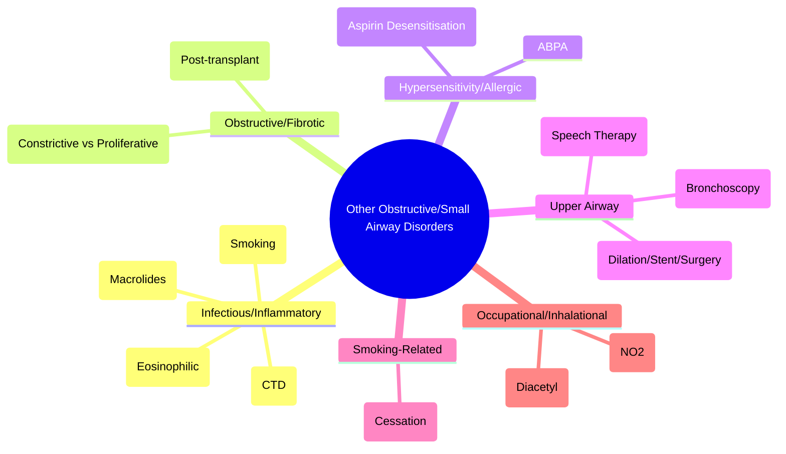
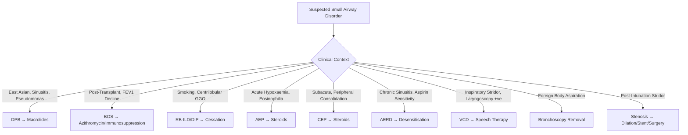

# Other Obstructive and Small-Airway Disorders

Related: [[Bronchiectasis]], [[COPD]], [[Bronchiolitis]], [[Airway Diseases]]

> [!important]
> A heterogeneous group of **uncommon** obstructive/small-airway diseases. **Key FCPS/MRCP**: distinguish from common COPD/asthma, recognise specific features, know management principles.

## Learning Objectives
- Identify and differentiate rare obstructive airway diseases
- Recognise clinical/radiological features of each condition
- Apply appropriate investigations and management
- Know when to refer for specialist opinion

## 1. Bronchiolitis Obliterans (Constrictive) — *See separate full note*
- **Pathology**: concentric fibrosis → luminal obliteration
- **Aetiologies**: post-infectious, post-transplant (BOS), CTD, inhalational, drugs
- **HRCT**: mosaic attenuation + expiratory air trapping
- **Management**: aetiology-specific; constrictive = steroid-refractory

## 2. Bronchiolitis Obliterans Organising Pneumonia (BOOP / COP)
*See [[Bronchiolitis and Obliterative Bronchiolitis#Proliferative-Bronchiolitis-BOOP-COP|Proliferative Bronchiolitis]]*
- **Pathology**: intraluminal polyps (Masson bodies)
- **HRCT**: patchy consolidation, ground-glass, "reversed halo" sign
- **Treatment**: **steroids responsive** (prednisolone 0.5-0.75 mg/kg)

## 3. Diffuse Panbronchiolitis (DPB)
| Feature | Details |
|---------|---------|
| **Epidemiology** | East Asian predominance (Japan), HLA-B54 association |
| **Pathology** | Chronic bronchiolar inflammation, neutrophil infiltrate, "panbronchiolitis" |
| **Clinical** | Chronic sinusitis, cough, purulent sputum, dyspnoea |
| **HRCT** | Centrilobular nodules, tree-in-bud, bronchial wall thickening, bronchiolar dilatation |
| **Microbiology** | *P. aeruginosa*, *H. influenzae* |
| **Treatment** | **Long-term macrolides** (erythromycin/clarithromycin 6-24 mo) — dramatic response |
| **Prognosis** | Excellent with macrolides; fatal if untreated |

## 4. Follicular Bronchiolitis
| Feature | Details |
|---------|---------|
| **Pathology** | Lymphoid follicles with germinal centres along bronchioles |
| **Associations** | **CTD** (RA, Sjögren's, SLE), HIV, immunodeficiency, hypersensitivity pneumonitis |
| **HRCT** | Centrilobular nodules, tree-in-bud, peribronchial nodules |
| **Treatment** | **Treat underlying cause**; steroids if symptomatic |

## 5. Mineral Dust Airway Disease (MDAD)
| Feature | Details |
|---------|---------|
| **Cause** | Chronic mineral dust exposure (coal, silica, mixed dust) |
| **Pathology** | Centriacinar emphysema + peribronchiolar fibrosis + dust macules |
| **Clinical** | COPD-like, often with pneumoconiosis on HRCT |
| **Differentiation** | Centriacinar emphysema + dust macules vs pure smoking COPD |
| **Management** | As COPD; dust exposure cessation |

## 6. Respiratory Bronchiolitis (RB) / RB-ILD
| Feature | Details |
|---------|---------|
| **Cause** | **Smoking** (centriacinar accumulation of pigmented macrophages) |
| **Spectrum** | **RB** (asymptomatic, incidental) → **RB-ILD** (symptomatic, dyspnoea, cough) |
| **HRCT** | Centrilobular ground-glass nodules, upper lobe predominance, upper lobe emphysema |
| **BAL** | Brown pigmented macrophages |
| **Treatment** | **Smoking cessation** (core); steroids if RB-ILD symptomatic |

## 7. Desquamative Interstitial Pneumonia (DIP)
| Feature | Details |
|---------|---------|
| **Relation** | Severe end of smoking-related ILD spectrum (RB → RB-ILD → DIP) |
| **Pathology** | Alveolar filling by macrophages (desquamated pneumocytes) |
| **HRCT** | Diffuse ground-glass opacities (lower lobe), subpleural sparing |
| **Treatment** | **Smoking cessation**; steroids if progressive |

## 8. Acute Eosinophilic Pneumonia (AEP) / Chronic Eosinophilic Pneumonia (CEP)
| Feature | AEP | CEP |
|---------|-----|-----|
| **Onset** | Acute (days) | Subacute (weeks-months) |
| **Presentation** | Acute respiratory failure, fever, eosinophilia | Subacute dyspnoea, weight loss, night sweats, "photographic negative of pulmonary edema" |
| **BAL** | Eosinophils >25% | Eosinophils >25% |
| **Imaging** | Bilateral diffuse GGO | Peripheral consolidations ("photographic negative") |
| **Treatment** | **Steroids** (dramatic response) | **Steroids** (prolonged taper; relapses common) |

## 9. Allergic Bronchopulmonary Aspergillosis (ABPA)
*See [[Airway Diseases/ABPA and bronchiectasis|ABPA and bronchiectasis]]*
- **Central bronchiectasis**, high IgE, *Aspergillus* sensitisation
- **Treatment**: steroids + itraconazole

## 10. Aspirin-Exacerbated Respiratory Disease (AERD)
| Feature | Details |
|---------|---------|
| **Triad** | Asthma + CRSwNP + Aspirin/NSAID sensitivity |
| **Pathophysiology** | COX-1 inhibition → ↑ cysteinyl leukotrienes, ↓ PGE2 |
| **Features** | Severe asthma, CRSwNP, anaphylaxis to NSAIDs |
| **Diagnosis** | Aspirin challenge (gold standard) |
| **Management** | **Aspirin desensitisation** + LTRA (montelukast) + biologics (dupilumab) |

## 11. Non-CF Bronchiectasis Exacerbation
*See [[Airway Diseases/Non-cystic fibrosis bronchiectasis exacerbation|Non-cystic fibrosis bronchiectasis exacerbation]]*
- **Antibiotics**: guided by culture; 14 days IV if severe
- **Airway clearance**: intensive during exacerbation

## 12. Alpha-1 Antitrypsin Deficiency
*See [[Airway Diseases/Alpha-1 antitrypsin deficiency|Alpha-1 antitrypsin deficiency]]*
- **Panacinar basal emphysema**, liver disease, augmentation therapy

## 13. Tracheobronchomalacia (TBM)
*See [[Airway Diseases/Tracheobronchomalacia|Tracheobronchomalacia]]*
- **Dynamic CT/bronchoscopy** for diagnosis
- **Stenting/surgery** if severe

## 14. Laryngotracheal Stenosis
| Feature | Details |
|---------|---------|
| **Causes** | Post-intubation, tracheostomy, autoimmune (GPA, relapsing polychondritis), idiopathic |
| **Presentation** | Inspiratory stridor, exertional dyspnoea, failed extubation |
| **Investigations** | Dynamic CT, bronchoscopy, flow-volume loop (inspiratory plateau) |
| **Management** | Dilation, stenting, tracheal resection/anastomosis |

## 15. Foreign Body Aspiration (Adults)
*See [[Upper Airway and Sleep-Related Breathing Disorders/Foreign body aspiration in adults|Foreign body aspiration in adults]]*
- **Immediate** bronchoscopic removal
- **Delayed**: post-obstructive pneumonia, bronchiectasis

## 16. Vocal Cord Dysfunction (VCD) / Inducible Laryngeal Obstruction (ILO)
| Feature | Details |
|---------|---------|
| **Mechanism** | Paradoxic vocal cord adduction on inspiration |
| **Presentation** | Inspiratory stridor, dyspnoea, throat tightness, often misdiagnosed as asthma |
| **Diagnosis** | Laryngoscopy (paradoxic adduction on inspiration); flow-volume loop (inspiratory plateau) |
| **Triggers** | Exercise, irritants, reflux, stress |
| **Treatment** | Speech therapy (breathing retraining), treat reflux, CBT for anxiety |

## 17. Upper Airway Obstruction
| Cause | Features |
|-------|----------|
| **Tumour** | Progressive inspiratory stridor, haemoptysis |
| **Infection** | Epiglottitis, retropharyngeal abscess (stridor, fever, drooling) |
| **Angioedema** | Acute, ACEi-related, hereditary C1 inhibitor deficiency |
| **Foreign body** | Sudden, choking, unilateral wheeze |
| **Management** | **Airway protection first** (intubation/tracheostomy), then treat cause |

## Investigation Summary Table
| Condition | Key HRCT | Spirometry | BAL / Other |
|-----------|----------|------------|-------------|
| **DPB** | Centrilobular nodules, tree-in-bud | Obstructive | Neutrophilia |
| **Follicular bronchiolitis** | Peribronchial nodules | Obstructive | Lymphocytosis |
| **RB-ILD/DIP** | Ground-glass nodules/opacities | Restrictive/Obstructive | Pigmented macrophages |
| **AEP/CEP** | GGO / peripheral consolidation | Restrictive | Eosinophils >25% |
| **Bronchiolitis obliterans** | Mosaic attenuation + air trapping | Fixed obstruction + air trapping | Normal/neutrophilia |
| **Follicular bronchiolitis** | Peribronchial nodules | Obstructive | Lymphocytosis |
| **RB-ILD** | Centrilobular GGO nodules | Obstructive | Pigmented macrophages |

## FCPS/MRCP High-Yield Points
1. **DPB** = East Asian, chronic sinusitis, *Pseudomonas*, **macrolides curative**
2. **Bronchiolitis obliterans** = mosaic attenuation + air trapping; constrictive (irreversible) vs proliferative (steroid-responsive)
3. **RB-ILD/DIP** = smoking-related; cessation = core treatment
3. **AEP/CEP** = eosinophilic pneumonia; steroids dramatic response
4. **AERD** = aspirin triad; desensitisation + montelukast + dupilumab
4. **Follicular bronchiolitis** = CTD/HIV; lymphoid follicles on HRCT
4. **VCD/ILO** = inspiratory stridor, paradoxic vocal cord adduction; speech therapy
4. **AERD** = aspirin desensitisation + montelukast + dupilumab
5. **Foreign body** = immediate bronchoscopy
6. **Laryngotracheal stenosis** = post-intubation/tracheostomy; dilation/stenting/surgery

## Common Viva Questions
1. DPB vs CF differentiation
3. Bronchiolitis obliterans types (constrictive vs proliferative)
4. DPB treatment and prognosis
5. AEP vs CEP differentiation
6. AERD diagnosis and management
7. VCD vs asthma differentiation
8. Foreign body aspiration management

## Common Confusions / Exam Traps
- **DPB** ≠ CF (East Asian, macrolides work, no pancreatic insufficiency)
- **Bronchiolitis obliterans** ≠ BOOP (constrictive vs proliferative)
- **RB-ILD** ≠ DIP (spectrum; DIP more severe)
- **VCD** ≠ asthma (inspiratory stridor, laryngoscopy diagnostic)
- **AERD** = aspirin desensitisation + montelukast + dupilumab
- **Foreign body** = immediate bronchoscopy, not antibiotics first
- **Laryngotracheal stenosis** = post-intubation/tracheostomy; inspiratory stridor

## Mnemonics
- **DPB**: **D**iffuse **P**an**B**ronchiolitis = **M**acrolides, **S**inusitis, **P**seudomonas
- **CEP vs AEP**: **C**hronic = weeks-months, peripheral; **A**cute = days, diffuse
- **VCD**: **I**nspiratory **S**tridor, **L**aryngoscopy, **S**peech therapy
- **AERD**: **A**spirin + **A**sthma + **P**olyps = **D**esensitisation + **M**ontelukast
- **FOREIGN BODY**: **B**ronchoscopy **I**mmediate

## Mind Map

## Flowchart

## Suggested Visuals / Image Notes
- DPB HRCT (centrilobular nodules, tree-in-bud)
- Bronchiolitis obliterans HRCT (mosaic attenuation + air trapping)
- CEP "photographic negative" appearance
- VCD laryngoscopy image
- Foreign body bronchoscopy
- Laryngotracheal stenosis CT

## Suggested Video References
- DPB management (Japanese guidelines)
- Bronchial thermoplasty
- VCD speech therapy
- Foreign body removal bronchoscopy

## One-Page Revision Summary
- **DPB**: East Asian, sinusitis, *Pseudomonas*, macrolides 6-24mo
- **Bronchiolitis obliterans**: mosaic attenuation + air trapping; constrictive (irreversible) vs proliferative (steroid-responsive)
- **DPB**: macrolides 6-24mo curative
- **RB-ILD/DIP**: smoking cessation; steroids if symptomatic
- **AEP/CEP**: eosinophilic pneumonia; steroids dramatic response
- **AERD**: aspirin triad; desensitisation + montelukast + dupilumab
- **VCD**: inspiratory stridor, laryngoscopy +ve, speech therapy
- **Foreign body**: immediate bronchoscopy
- **Laryngotracheal stenosis**: post-intubation/tracheostomy; dilation/stent/surgery

## 24-Hour Recall Prompts
- List 3 key features of DPB
- Contrast bronchiolitis obliterans vs BOOP
- State DPB treatment
- Describe VCD diagnosis and treatment

## 7-Day / 15-Day / 30-Day Revision Tracker
- [ ] Day 1 completed
- [ ] 24-hour recall completed
- [ ] Day 7 revision completed
- [ ] Day 15 revision completed
- [ ] Day 30 revision completed

## Must Know / Should Know / Nice to Know
### Must Know
- DPB: macrolides, East Asian, sinusitis + Pseudomonas
- Bronchiolitis obliterans: constrictive (fibrosis) vs proliferative (polyps, steroids)
- DPB: macrolides 6-24mo
- RB-ILD/DIP: smoking cessation
- AEP/CEP: eosinophilic pneumonia, steroids
- AERD: aspirin desensitisation
- VCD: inspiratory stridor, speech therapy

### Should Know
- DPB epitheliosis HRCT
- CEP "photographic negative" appearance
- Follicular bronchiolitis in CTD
- Post-transplant BOS azithromycin
- Foreign body immediate bronchoscopy
- VCD speech therapy

### Nice to Know
- DPB genetic associations
- Specific BOS grading
- DPB long-term survival
- CEP relapse rates
- AERD aspirin desensitisation protocols
- Bronchial thermoplasty indications

## Self-Test Scorecard
- Understanding: /10
- Recall: /10
- MCQ Performance: /10
- SBA Performance: /10
- Viva Confidence: /10
- Total: /50

> [!tip]
> Interpretation: <35 = weak topic, 35-44 = acceptable but insecure, 45+ = strong exam-ready topic.

## Exam Answer Modes
### Long Answer Skeleton
- Classification table
- DPB detailed (features, HRCT, macrolides)
- Bronchiolitis obliterans (constrictive vs proliferative)
- CEP/AEP
- AERD
- VCD/ILO
- Foreign body / stenosis

### Short Note Skeleton
- DPB box
- Bronchiolitis obliterans comparison
- CEP vs AEP
- AERD box
- VCD diagnosis/treatment
- HRCT table for small airway diseases

### Viva One-Liners
- "DPB: East Asian, sinusitis, Pseudomonas, macrolides 6-24mo"
- "Bronchiolitis obliterans: mosaic attenuation + air trapping; constrictive vs proliferative"
- "DPB: macrolides 6-24mo curative"
- "RB-ILD/DIP: smoking cessation"
- "CEP: photographic negative of pulmonary edema, steroids"
- "AERD: aspirin desensitisation + montelukast + dupilumab"
- "VCD: inspiratory stridor, laryngoscopy +ve, speech therapy"
- "Foreign body: immediate bronchoscopy"
- "Laryngotracheal stenosis: post-intubation, dilation/stent/surgery"

### Ward-Case Discussion Points
- Japanese patient with chronic sinusitis, cough, Pseudomonas → DPB → macrolides
- Lung transplant patient FEV1 decline → BOS → azithromycin
- Young woman with inspiratory stridor on exercise → laryngoscopy → VCD → speech therapy
- Child with acute respiratory failure, eosinophilia, diffuse GGO → AEP → steroids
- Adult with asthma + nasal polyps + aspirin sensitivity → AERD → desensitisation + dupilumab
- Post-intubation stridor → bronchoscopy → tracheal stenosis → dilation

### Last-Night-Before-Exam Sheet
- DPB: East Asian, Macrolides
- BO: Mosaic + Air trapping; Constrictive vs Proliferative
- DPB: Macrolides 6-24mo
- RB-ILD: Smoking cessation
- CEP: Photo negative, Steroids
- AERD: Desensitisation + Montelukast + Dupilumab
- VCD: Insp stridor → Laryngoscopy → Speech therapy
- Foreign body: Bronchoscopy NOW
- Stenosis: Post-intubation → Dilation/Stent/Surgery

## Summary
**Small airway disorders** are heterogeneous. **DPB** = East Asian, sinusitis, *Pseudomonas*, **macrolides 6-24mo curative**. **Bronchiolitis obliterans** = mosaic attenuation + expiratory air trapping; **constrictive** (fibrosis, irreversible) vs **proliferative/BOOP** (polyps, steroid-responsive). **BOS** = post-transplant FEV₁ decline >20%; azithromycin 250mg 3x/wk. **RB-ILD/DIP** = smoking-related; **cessation core**. **AEP/CEP** = eosinophilic pneumonia; **steroids dramatic response**. **AERD** = asthma + polyps + aspirin sensitivity; **aspirin desensitisation + montelukast + dupilumab**. **VCD/ILO** = inspiratory stridor, laryngoscopy +ve, **speech therapy**. **Foreign body** = immediate bronchoscopy. **Laryngotracheal stenosis** = post-intubation/tracheostomy; dilation/stent/surgery.

## MCQs (10)
1. **Diffuse panbronchiolitis** treatment:
   A. Corticosteroids
   B. **Long-term macrolides (6-24 months)**
   C. Azathioprine
   D. Lung transplant
2. **Constrictive bronchiolitis** histology:
   A. Intraluminal polyps (Masson bodies)
   B. **Concentric fibrosis with luminal obliteration**
   C. Eosinophilic infiltration
   D. Granulomatous inflammation
3. **DPB** characteristic microbiology:
   A. *Staphylococcus aureus*
   B. ***Pseudomonas aeruginosa***
   C. *Mycobacterium tuberculosis*
   D. *Aspergillus fumigatus*
4. **Chronic eosinophilic pneumonia** classic imaging:
   A. Diffuse ground-glass opacities
   B. **Peripheral consolidations ("photographic negative of pulmonary edema")**
   C. Centrilobular nodules
   D. Honeycombing
5. **AERD** first-line specific management:
   A. High-dose ICS
   B. **Aspirin desensitisation + montelukast**
   C. Omalizumab
   D. Bronchial thermoplasty

## SBA Questions (10)
1. A 45-year-old Japanese man with chronic sinusitis, cough, and *Pseudomonas* on sputum culture. HRCT shows centrilobular nodules and tree-in-bud. Best treatment:
   A. High-dose prednisolone
   B. **Erythromycin 500 mg daily for 6-24 months**
   C. Inhaled tobramycin
   D. Lung transplant evaluation
2. A 30-year-old woman with asthma, nasal polyps, and aspirin-induced bronchospasm. Best specific management:
   A. Omalizumab
   B. **Aspirin desensitisation + montelukast + dupilumab**
   C. Bronchial thermoplasty
   D. Azithromycin
3. A 22-year-old presents with acute hypoxaemic respiratory failure, fever, and eosinophilia. CXR shows bilateral diffuse ground-glass opacities. BAL eosinophils 40%. Diagnosis and treatment:
   A. CEP; prednisolone 0.5 mg/kg
   B. **AEP; high-dose IV methylprednisolone**
   C. ABPA; itraconazole + steroids
   D. EGPA; cyclophosphamide
4. A 35-year-old presents with inspiratory stridor on exercise, normal spirometry, laryngoscopy shows paradoxical vocal cord adduction on inspiration. Diagnosis:
   A. Laryngospasm
   B. **Vocal cord dysfunction (ILO)**
   C. Tracheal stenosis
   D. Acute asthma
5. A 2-year-old child presents with sudden choking, coughing, and unilateral wheeze. Best immediate management:
   A. Chest X-ray then antibiotics
   B. **Immediate rigid bronchoscopy for foreign body removal**
   C. Nebulised salbutamol and observation
   D. Oral steroids and observation

## Flashcards
- Q: DPB treatment
  A: Long-term macrolides (erythromycin/clarithromycin 6-24 months)
- Q: DPB microbiology
  A: Pseudomonas aeruginosa
- Q: BOOP/COP treatment
  A: Steroids (excellent response)
- Q: CEP imaging
  A: Peripheral consolidations ("photographic negative of pulmonary edema")
- Q: AERD treatment
  A: Aspirin desensitisation + montelukast + dupilumab
- Q: VCD diagnosis
  A: Laryngoscopy (paradoxical adduction on inspiration)
- Q: Foreign body
  A: Immediate bronchoscopy
- Q: Bronchiolitis obliterans HRCT
  A: Mosaic attenuation + expiratory air trapping
- Q: Constrictive vs Proliferative
  A: Constrictive = fibrosis (irreversible); Proliferative = polyps (steroids work)
- Q: CEP imaging
  A: Peripheral consolidations ("photographic negative of pulmonary edema")

## Answer Key with Explanations
### MCQs
1. **B** — DPB: long-term macrolides (erythromycin/clarithromycin 6-24 months).
2. **B** — Constrictive = concentric fibrosis/luminal obliteration.
3. **B** — Pseudomonas aeruginosa characteristic of DPB.
4. **B** — CEP = peripheral consolidations = "photographic negative of pulmonary edema".
5. **B** — Aspirin desensitisation + montelukast (LTRA) + dupilumab (CRSwNP).

### SBAs
1. **B** — DPB: macrolides 6-24 months.
2. **B** — AERD: aspirin desensitisation + montelukast + dupilumab.
3. **B** — AEP: acute hypoxaemia, diffuse GGO, eosinophilia >25% → high-dose steroids.
5. **B** — VCD: inspiratory stridor, paradoxical adduction on laryngoscopy, speech therapy.

## Flashcards
- Q: DPB treatment
  A: Macrolides 6-24 months
- Q: DPB microbiology
  A: Pseudomonas aeruginosa
- Q: CEP imaging
  A: Peripheral consolidations ("photographic negative")
- Q: AERD treatment
  A: Aspirin desensitisation + montelukast + dupilumab
- Q: VCD diagnosis
  A: Laryngoscopy (paradoxical adduction)
- Q: Foreign body
  A: Immediate bronchoscopy
- Q: BO HRCT
  A: Mosaic attenuation + air trapping
- Q: Constrictive vs Proliferative
  A: Constrictive = fibrosis (irreversible); Proliferative = polyps (steroids)
- Q: CEP imaging
  A: Peripheral consolidations ("photographic negative")
- Q: AERD = Aspirin + Asthma + Polyps

## Answer Key with Explanations
### MCQs
1. **B** — DPB: macrolides 6-24 months.
2. **B** — Constrictive = concentric fibrosis.
3. **B** — Pseudomonas aeruginosa = DPB hallmark.
4. **B** — CEP = peripheral consolidations ("photographic negative").
5. **B** — Aspirin desensitisation + montelukast + dupilumab = AERD management.

### SBAs
1. **B** — DPB: macrolides 6-24 months.
2. **B** — AERD: desensitisation + montelukast + dupilumab.
3. **B** — AEP: acute, diffuse GGO, eosinophilia → steroids.
5. **B** — VCD: inspiratory stridor, laryngoscopy +ve, speech therapy.

---