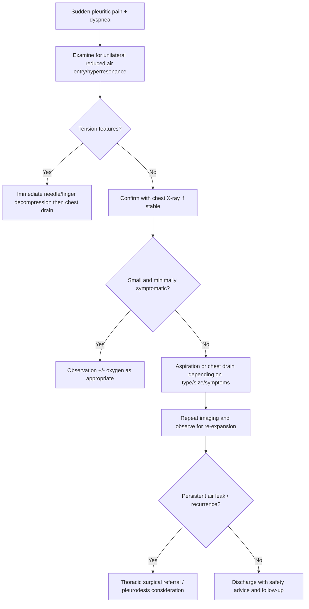
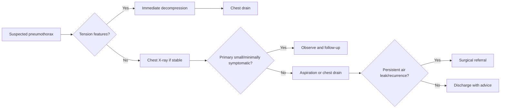

# Pneumothorax

> [!important]
> **Pneumothorax** is the presence of air in the pleural space, causing partial or complete lung collapse. In FCPS/MRCP, the key exam issues are **primary vs secondary pneumothorax, recognition of tension pneumothorax, chest X-ray clues, when to aspirate vs insert a chest drain, and the danger of sudden deterioration in patients with underlying lung disease**.

Related: [[Pleural Effusion]], [[Chest X-Ray Approach]], [[Respiratory Failure]], [[Oxygen Therapy and NIV]], [[Pleural Diseases/Primary spontaneous pneumothorax|Primary spontaneous pneumothorax]], [[Pleural Diseases/Secondary spontaneous pneumothorax|Secondary spontaneous pneumothorax]], [[Pleural Diseases/Tension pneumothorax|Tension pneumothorax]]

> [!tip]
> This is a high-yield **acute respiratory emergency** topic. Exams often test tension pneumothorax as a **clinical diagnosis** that must be decompressed immediately without waiting for imaging.

## Learning Objectives
- Define pneumothorax and distinguish primary, secondary, traumatic, iatrogenic, and tension pneumothorax.
- Understand the pleural anatomy and respiratory mechanics behind lung collapse and hemodynamic compromise.
- Interpret classic examination and chest X-ray findings.
- Apply a structured management plan including observation, aspiration, chest drain insertion, and emergency decompression.
- Recognize contraindications, red flags, recurrence risk, and special situations.

## Definition
Pneumothorax is the **presence of air within the pleural cavity** between the visceral and parietal pleura, leading to loss of negative pleural pressure and collapse of the underlying lung to a variable extent.

### Core bedside idea
- Small pneumothorax may cause pleuritic pain and dyspnea only.
- Large pneumothorax causes more breathlessness and clear unilateral signs.
- **Tension pneumothorax** is life-threatening because pressure continues to rise and impairs venous return.

## Core Anatomy
### 1. Pleural layers
- **Visceral pleura** covers the lung surface.
- **Parietal pleura** lines the thoracic wall, mediastinum, and diaphragm.
- The pleural space normally contains only a thin lubricating film.

### 2. Negative intrapleural pressure
- Normal pleural pressure is negative relative to atmosphere.
- This negative pressure keeps the lung expanded against the chest wall.
- If air enters the pleural space, the lung recoils inward.

### 3. Apex relevance
- Primary spontaneous pneumothorax often arises from rupture of **apical subpleural blebs/bullae**.
- The lung apex is a common site of radiologic detection.

### 4. Mediastinal relationships
- In tension pneumothorax, rising pressure can shift the mediastinum and compress great veins.
- This reduces venous return and cardiac output.

### 5. Diaphragm and chest wall
- Hyperresonance and reduced expansion occur on the affected side.
- In severe cases, diaphragmatic depression may appear radiologically.

> [!important]
> Pneumothorax is fundamentally a **pleural air leak + loss of negative pleural pressure + lung recoil** problem.

## Core Physiology
### 1. Lung collapse mechanics
Once pleural air accumulates:
- transpulmonary pressure falls
- alveoli partially or completely collapse in the affected region
- ventilation to that lung drops

### 2. Gas exchange consequence
- The affected lung becomes poorly ventilated.
- Perfusion may persist, causing **V/Q mismatch** and hypoxemia.
- Larger pneumothoraces cause more pronounced dyspnea.

### 3. Tension physiology
In tension pneumothorax:
- air enters pleural space and cannot escape
- pleural pressure rises progressively
- mediastinum shifts
- venous return falls
- obstructive shock may develop

### 4. Secondary pneumothorax physiology
- Patients with COPD, ILD, TB, cystic disease, or other lung pathology have poor reserve.
- Even a relatively smaller pneumothorax can cause marked hypoxemia and distress.

## Normal Values / Important Cut-offs
### Practical severity ideas
- No single universal numeric cut-off replaces clinical judgment.
- Size on chest X-ray helps, but **symptoms + underlying lung disease + hemodynamic status** matter most.

### High-risk clinical cut-offs / danger features
- hypotension
- tachycardia with shock features
- severe hypoxemia
- marked respiratory distress
- tracheal deviation / raised JVP in tension physiology
- underlying severe lung disease

### Oxygenation
- SpO2 normally should be adequate in healthy adults.
- Falling saturation suggests a larger pneumothorax, secondary pneumothorax, or tension physiology.

## Classification
### 1. By cause
- **Primary spontaneous pneumothorax (PSP)**: no clinically apparent underlying lung disease
- **Secondary spontaneous pneumothorax (SSP)**: underlying lung disease present
- traumatic pneumothorax
- iatrogenic pneumothorax

### 2. By physiological behavior
- simple/non-tension pneumothorax
- **tension pneumothorax**

### 3. By laterality and recurrence
- unilateral
- bilateral
- recurrent
- persistent air-leak pneumothorax

## Etiology / Causes
### Primary spontaneous pneumothorax
Commonly associated with:
- rupture of apical subpleural bleb/bulla
- tall, thin body habitus
- smoking

### Secondary spontaneous pneumothorax
Common causes:
- **COPD/emphysema**
- asthma (less commonly)
- tuberculosis
- interstitial lung disease
- cystic lung disease
- necrotizing infection
- malignancy

### Traumatic / iatrogenic causes
- chest trauma
- rib fracture
- central venous catheterization
- mechanical ventilation / barotrauma
- pleural procedures / biopsy

## Risk Factors
- smoking
- prior pneumothorax
- male sex in primary spontaneous pneumothorax patterns
- apical blebs/bullae
- COPD and other chronic lung disease
- positive-pressure ventilation
- thoracic procedures

## Pathophysiology
### Air-entry mechanisms
Air reaches the pleural cavity through:
- ruptured alveolus/bleb communicating with pleural space
- external chest wall injury
- iatrogenic puncture

### Effects
- lung collapse
- pleuritic pain due to parietal pleural irritation
- dyspnea due to reduced ventilation
- hypoxemia from V/Q mismatch
- hemodynamic collapse if tension develops

## Clinical Features
### Symptoms
- sudden pleuritic chest pain
- sudden breathlessness
- sometimes dry cough

### Signs
- reduced chest movement on affected side
- hyperresonant percussion note
- reduced or absent breath sounds
- decreased vocal resonance
- tachycardia

### Tension pneumothorax red flags
- severe distress
- cyanosis/hypoxemia
- hypotension
- tachycardia
- distended neck veins
- tracheal deviation away from affected side
- reduced consciousness / peri-arrest state

> [!warning]
> **Tension pneumothorax is a clinical diagnosis.** Do not delay decompression while waiting for X-ray.

## Approach / Algorithm

## Investigations
### 1. Chest X-ray
Typical findings:
- visible pleural line
- absence of peripheral lung markings beyond the pleural line
- variable lung collapse
- deep sulcus sign may be seen in supine patients
- mediastinal shift if tension

### 2. Bedside ultrasound
- may be useful in acute/emergency settings
- absent lung sliding supports pneumothorax
- not always required in classic stable cases with CXR access

### 3. ABG
Indicated in:
- severe breathlessness
- suspected hypoxemia
- secondary pneumothorax
- tension physiology or respiratory failure risk

### 4. CT chest
Useful when:
- diagnosis is uncertain
- underlying lung disease needs characterization
- persistent air leak or recurrent pneumothorax

## Interpretation Frameworks
### 1. Chest X-ray interpretation
Look for:
1. pleural line
2. absence of peripheral vascular markings
3. degree of collapse
4. mediastinal shift
5. underlying lung disease or bullae

### 2. Distinguishing tension clinically
| Feature | Simple pneumothorax | Tension pneumothorax |
|---|---|---|
| Hemodynamics | usually stable | hypotension / shock possible |
| JVP | normal | may be raised |
| Trachea | usually central | may shift away |
| Urgency | urgent but can image if stable | immediate decompression, no delay |

### 3. Primary vs secondary pneumothorax
| Feature | Primary | Secondary |
|---|---|---|
| Background lung disease | absent clinically | present |
| Reserve | usually better | poor |
| Severity from same size | less severe often | more severe often |
| Need for admission | variable | often more likely |

### 4. Oxygen therapy logic
- Oxygen may help resorption in some stable patients.
- But always prioritize **clinical status**, especially if secondary disease or tension risk exists.
- In COPD/CO2-retention overlap, avoid blind over-oxygenation; use ABG-guided care.

## Diagnosis
Diagnosis is based on:
- typical symptoms and unilateral chest signs
- imaging confirmation in stable cases
- **clinical diagnosis alone in tension pneumothorax** requiring immediate treatment

## Differential Diagnosis
| Differential | Clues favoring it |
|---|---|
| **Pulmonary embolism** | pleuritic pain, risk factors for VTE, often no unilateral hyperresonance |
| **Pneumonia** | fever, focal crackles, consolidation on CXR |
| **Acute asthma/COPD exacerbation** | bilateral wheeze usually, no pleural line |
| **ACS** | central chest pain, ECG/troponin clues |
| **Pleural effusion** | stony dullness rather than hyperresonance |

## Tables / Comparison Charts
### Pneumothorax vs pleural effusion
| Feature | Pneumothorax | Pleural effusion |
|---|---|---|
| Percussion | hyperresonant | stony dull |
| Breath sounds | reduced | reduced |
| Vocal resonance | reduced | reduced |
| CXR | pleural line, absent markings | meniscus / opacity |

## Management
### 1. Immediate principles
- assess ABCDE
- give oxygen if hypoxemic
- determine if this is tension physiology
- treat tension immediately
- use imaging if stable and diagnosis needs confirmation

### 2. Stable small primary spontaneous pneumothorax
- observation may be appropriate if minimally symptomatic
- repeat imaging and safety-net advice are important

### 3. Symptomatic or larger pneumothorax
- needle aspiration may be appropriate in selected primary spontaneous cases
- chest drain insertion is often needed if aspiration fails, pneumothorax is large/symptomatic, or secondary disease is present

### 4. Secondary spontaneous pneumothorax
- lower threshold for admission and drain-based management
- because reserve is poor and decompensation risk is higher

### 5. Tension pneumothorax
- **immediate decompression**
- do not wait for imaging
- definitive chest drain placement follows emergency decompression

### 6. Persistent air leak / recurrence
- thoracic surgery or pleurodesis may be needed
- smoking cessation advice is essential

## Drug Interactions / Contraindications / Cautions
- Avoid positive-pressure ventilation escalation without awareness that it can worsen an untreated pneumothorax.
- Aspirin/anticoagulation increases pleural procedure bleeding risk but does not cancel life-saving treatment when urgently required.
- In COPD overlap, oxygen must still be prescribed safely with ABG logic.

## Procedures / Indications / Contraindications
### Needle aspiration
**Indication:** selected stable symptomatic primary spontaneous pneumothorax.

**Contraindication/caution:** unstable/tension physiology needs emergency decompression and definitive drainage rather than delay.

### Chest drain insertion
**Indication:** failed aspiration, secondary pneumothorax, large/symptomatic pneumothorax, tension pneumothorax after decompression.

### Emergency decompression
**Indication:** suspected tension pneumothorax.

## Procedure Mini-Sections
### Chest drain basics
- **Indication:** persistent pleural air requiring evacuation
- **Preparation:** monitoring, asepsis, analgesia, correct site selection
- **Complications:** bleeding, infection, malposition, re-expansion pulmonary edema
- **Viva pearl:** never clamp a bubbling drain in active pneumothorax without clear reason

### Emergency decompression pearl
- **Why:** relieves obstructive shock physiology immediately
- **Pitfall:** waiting for chest X-ray in a crashing patient

## Complications
- tension pneumothorax
- hypoxemia
- respiratory failure in underlying lung disease
- recurrence
- persistent air leak
- hemopneumothorax
- procedure complications

## Red Flags / Emergencies
- hypotension
- severe distress
- tracheal deviation
- raised JVP
- cyanosis
- rapidly worsening breathlessness
- secondary pneumothorax with poor reserve
- mechanical ventilation–associated pneumothorax

## Special Situations
### Secondary spontaneous pneumothorax
- more dangerous than primary spontaneous pneumothorax
- small radiologic size may still be clinically severe

### Ventilated patient
- tension can evolve quickly
- sudden desaturation/hypotension should prompt urgent consideration

### Air travel / diving
- untreated pneumothorax is a contraindication to air travel and diving
- recurrence counseling is important after recovery

### Pregnancy
- treat maternal hypoxemia and tension physiology promptly
- involve appropriate multidisciplinary support if recurrent or complicated

## Prognosis
- Primary spontaneous pneumothorax often has good immediate survival but significant recurrence risk.
- Secondary spontaneous pneumothorax carries greater morbidity and mortality.
- Smoking cessation reduces recurrence risk.

## Topic Correlation
- [[Pleural Effusion]] helps compare pleural air vs fluid disorders.
- [[Chest X-Ray Approach]] is central to interpretation.
- [[Respiratory Failure]] and [[Oxygen Therapy and NIV]] matter when severe or secondary disease causes decompensation.
- The related subtopic notes on primary, secondary, and tension pneumothorax refine this umbrella topic.

## FCPS/MRCP High-Yield Points
- Pneumothorax = pleural air causing lung collapse.
- **Tension pneumothorax is a clinical diagnosis**.
- Hyperresonance + reduced breath sounds + unilateral pleuritic pain are classic.
- Secondary spontaneous pneumothorax is often more dangerous than primary.
- Needle aspiration may be used in selected primary spontaneous cases.
- Chest drain is often needed when aspiration fails or secondary disease is present.
- Never delay decompression of suspected tension pneumothorax for imaging.

## Common Viva Questions
- Define pneumothorax.
- Differentiate primary and secondary spontaneous pneumothorax.
- What are the features of tension pneumothorax?
- How do you diagnose pneumothorax on chest X-ray?
- When do you aspirate and when do you insert a chest drain?
- Why is secondary pneumothorax more dangerous?

## Common Confusions / Exam Traps
- Waiting for imaging in tension pneumothorax.
- Missing pneumothorax in a COPD patient with sudden worsening dyspnea.
- Confusing hyperresonance of pneumothorax with dullness of pleural effusion.
- Underestimating severity because the radiologic size seems modest in secondary disease.

## Mnemonics
### **TENSION** red-flag recall
- **T**racheal shift
- **E**xtreme distress
- **N**eck veins raised
- **S**hock
- **I**mmediate decompression
- **O**xygenation falling
- **N**o delay for X-ray

## Mind Map
- Pneumothorax
  - types
    - primary
    - secondary
    - traumatic
    - iatrogenic
    - tension
  - signs
    - pleuritic pain
    - dyspnea
    - hyperresonance
    - reduced breath sounds
  - tests
    - CXR
    - ABG if severe
    - ultrasound/CT when needed
  - treatment
    - observe
    - aspirate
    - chest drain
    - emergency decompression
  - dangers
    - tension
    - hypoxemia
    - recurrence

## Flowchart

## Suggested Visuals / Image Notes
- Diagram of pleural layers and lung collapse
- CXR showing pleural line and absent peripheral markings
- Tension pneumothorax mediastinal shift sketch
- PSP vs SSP comparison box

## Suggested Video References
- Short emergency review on **tension pneumothorax recognition and management**
- Video on **chest X-ray diagnosis of pneumothorax**
- Viva-style review on **aspiration vs chest drain in spontaneous pneumothorax**

## One-Page Revision Summary
### Pneumothorax rapid sheet
- **Definition:** air in pleural space causing lung collapse
- **Symptoms:** sudden pleuritic pain + dyspnea
- **Signs:** unilateral reduced expansion, hyperresonance, reduced breath sounds
- **Types:** primary, secondary, traumatic, iatrogenic, tension
- **Tension clues:** shock, tracheal shift, raised JVP, severe distress
- **Investigation:** chest X-ray if stable; no delay for imaging in tension
- **Management:** observe, aspirate, chest drain, emergency decompression for tension
- **Exam pearl:** secondary pneumothorax can be severe even when apparently small

## 24-Hour Recall Prompts
- Define pneumothorax and tension pneumothorax.
- Name the classic examination findings.
- Differentiate primary vs secondary spontaneous pneumothorax.
- When do you decompress immediately?
- What are the chest X-ray hallmarks?
- Why is secondary pneumothorax more dangerous?

## 7-Day / 15-Day / 30-Day Revision Tracker
- **Day 1:** Write the emergency management of tension pneumothorax from memory.
- **Day 7:** Compare pneumothorax vs pleural effusion clinically and radiologically.
- **Day 15:** Explain aspiration vs chest drain logic.
- **Day 30:** Reproduce primary vs secondary spontaneous pneumothorax distinctions from a blank page.

## Must Know / Should Know / Nice to Know
### Must Know
- tension pneumothorax is a clinical diagnosis
- unilateral hyperresonance + reduced breath sounds
- primary vs secondary distinctions
- when to observe vs drain

### Should Know
- role of aspiration
- recurrence prevention and smoking cessation
- procedure complications

### Nice to Know
- CT details and surgical recurrence-prevention options

## My Weak Points
- Do I act on tension clinically without waiting?
- Can I distinguish pneumothorax from pleural effusion at bedside?
- Do I remember why secondary pneumothorax is higher risk?
- Can I state chest drain indications clearly?

## Self-Test Scorecard
- Understanding /10
- Recall /10
- Imaging interpretation /10
- MCQ performance /10
- Viva confidence /10

**Interpretation:**
- **<35/50** = weak topic
- **35–44/50** = fair
- **45+/50** = strong exam-ready topic

## Exam Answer Modes
### Short note mode
Pneumothorax is the presence of air in the pleural cavity causing partial or complete lung collapse. It may be primary spontaneous, secondary spontaneous, traumatic, iatrogenic, or tension. Clinical features include sudden pleuritic chest pain, dyspnea, unilateral reduced breath sounds, and hyperresonance. Tension pneumothorax is diagnosed clinically and requires immediate decompression followed by chest drain placement.

### Viva mode
- Define pneumothorax.
- Classify it.
- Give features of tension pneumothorax.
- State CXR findings.
- Explain aspiration vs drain vs emergency decompression.

### Ward-case mode
In sudden unilateral pleuritic pain and dyspnea, examine for hyperresonance and reduced breath sounds, decide urgently if this is tension, decompress immediately if unstable, otherwise confirm with X-ray and manage according to symptoms, size, and whether the patient has underlying lung disease.

## Summary
Pneumothorax is a common and high-yield pleural emergency. Safe management depends on **recognizing tension clinically, understanding primary vs secondary risk, interpreting the chest X-ray correctly, and choosing the right intervention without delay**.

## MCQs (10)
1. Pneumothorax is defined as:
   - A. Fluid in the pleural space
   - B. Air in the pleural space
   - C. Pus in the pleural space
   - D. Blood in the alveoli
   - E. Fibrosis of the pleura

2. Which is the most dangerous form of pneumothorax?
   - A. Small primary spontaneous pneumothorax
   - B. Chronic pleural thickening
   - C. Tension pneumothorax
   - D. Tiny apical scar
   - E. Mild pleural effusion

3. Which bedside finding best supports pneumothorax?
   - A. Stony dullness to percussion
   - B. Hyperresonance with reduced breath sounds
   - C. Bilateral basal crackles only
   - D. Loud bronchial breathing centrally
   - E. Stridor only

4. A tension pneumothorax should be treated by:
   - A. Waiting for CT scan first
   - B. Immediate decompression
   - C. Outpatient spirometry
   - D. Oral antibiotics only
   - E. Delayed review next day

5. Secondary spontaneous pneumothorax is commonly associated with:
   - A. COPD
   - B. Migraine
   - C. Nephrotic syndrome
   - D. Conjunctivitis
   - E. Osteoarthritis

6. Which chest X-ray sign is most typical of pneumothorax?
   - A. Meniscus sign
   - B. Air bronchogram only
   - C. Pleural line with absent peripheral lung markings beyond it
   - D. Cardiomegaly only
   - E. Bat-wing edema only

7. In pneumothorax, pleural effusion is clinically distinguished because effusion is usually:
   - A. hyperresonant
   - B. associated with absent pleural line only
   - C. stony dull to percussion
   - D. always bilateral
   - E. always painless

8. Which statement is most correct?
   - A. All pneumothoraces are equally well tolerated
   - B. Secondary spontaneous pneumothorax may be severe even when apparently small
   - C. Tension pneumothorax always needs X-ray confirmation first
   - D. Pneumothorax never recurs
   - E. Oxygen is always contraindicated

9. Which sign suggests tension physiology?
   - A. Raised JVP with hypotension
   - B. Normal pulse and normal BP only
   - C. Isolated rhinitis
   - D. Pedal edema only
   - E. Chronic cough alone

10. A selected stable primary spontaneous pneumothorax may be managed initially with:
   - A. Needle aspiration or observation depending on severity
   - B. Emergency laparotomy
   - C. Diuretics only
   - D. Hemodialysis
   - E. Anticoagulation only

## SBA Questions (10)
1. A tall 22-year-old man presents with sudden pleuritic chest pain and unilateral reduced breath sounds. He is hemodynamically stable. What is the most likely diagnosis?
   - A. Pleural effusion
   - B. Primary spontaneous pneumothorax
   - C. Acute pancreatitis
   - D. Pulmonary fibrosis
   - E. Pericarditis only

2. A COPD patient acutely deteriorates with severe dyspnea, unilateral absent breath sounds, hypotension, and distended neck veins. What is the best next step?
   - A. Wait for chest X-ray
   - B. Immediate decompression for suspected tension pneumothorax
   - C. Start outpatient antibiotics only
   - D. Arrange spirometry first
   - E. Observe for two hours

3. A stable patient’s chest X-ray shows a visible pleural line with no lung markings peripheral to it. What does this indicate?
   - A. Pleural effusion
   - B. Pneumothorax
   - C. Pulmonary edema
   - D. Lobar pneumonia
   - E. Massive fibrosis

4. A patient with secondary spontaneous pneumothorax is more breathless than expected for the radiologic size. Why?
   - A. Underlying lung reserve is poor
   - B. Pneumothorax never affects gas exchange
   - C. Pain alone explains all symptoms
   - D. Pleural fluid must be present
   - E. X-ray is always wrong

5. Which management principle is correct in tension pneumothorax?
   - A. Imaging is mandatory before treatment
   - B. Immediate decompression is lifesaving
   - C. Bronchoscopy is first-line treatment
   - D. Antibiotics alone are sufficient
   - E. It can be safely reviewed later

6. A patient with spontaneous pneumothorax is stable but symptomatic. What intervention may be appropriate in selected primary cases?
   - A. Needle aspiration
   - B. Insulin infusion
   - C. Lumbar puncture
   - D. Oral iron
   - E. Dialysis catheter

7. Which differential is suggested by **stony dullness** rather than hyperresonance?
   - A. Pneumothorax
   - B. Pleural effusion
   - C. Tension physiology only
   - D. Pulmonary embolism only
   - E. Asthma only

8. A ventilated ICU patient suddenly desaturates and becomes hypotensive. Which diagnosis must be considered urgently?
   - A. Tension pneumothorax
   - B. Psoriasis flare
   - C. Otitis media
   - D. Migraine aura
   - E. Cataract

9. Which long-term counseling point helps reduce recurrence risk?
   - A. Smoking cessation
   - B. More salt intake
   - C. Avoid all exercise forever
   - D. Lifelong antibiotics for everyone
   - E. Ignore future chest pain

10. After emergency decompression of tension pneumothorax, what is usually required next?
   - A. Definitive chest drain placement
   - B. No further action
   - C. Outpatient echocardiography only
   - D. Oral antihistamines
   - E. Colonoscopy

## Flashcards
- Q: What is pneumothorax?
  A: Air in the pleural space causing partial or complete lung collapse.
- Q: What is the most dangerous subtype?
  A: **Tension pneumothorax**.
- Q: What are the classic chest findings?
  A: Unilateral reduced expansion, hyperresonance, reduced breath sounds.
- Q: Is tension pneumothorax a clinical or radiologic diagnosis?
  A: Primarily a **clinical diagnosis**.
- Q: What is a common cause of secondary spontaneous pneumothorax?
  A: **COPD**.
- Q: What is the typical CXR sign of pneumothorax?
  A: Pleural line with absent peripheral lung markings beyond it.
- Q: Why is secondary spontaneous pneumothorax more dangerous?
  A: Poor underlying lung reserve.
- Q: What intervention is used in suspected tension pneumothorax?
  A: Immediate decompression.
- Q: What procedure is often needed if aspiration fails or disease is secondary?
  A: Chest drain insertion.
- Q: What counseling reduces recurrence risk?
  A: Smoking cessation.

## Answer Key with Explanations
### MCQs
1. **B. Air in the pleural space**
   - This is the definition of pneumothorax.
2. **C. Tension pneumothorax**
   - It causes obstructive shock and can be rapidly fatal.
3. **B. Hyperresonance with reduced breath sounds**
   - This is the classic bedside pattern.
4. **B. Immediate decompression**
   - Tension must be treated clinically without delay.
5. **A. COPD**
   - COPD is a common cause of secondary spontaneous pneumothorax.
6. **C. Pleural line with absent peripheral lung markings beyond it**
   - This is the classic CXR sign.
7. **C. stony dull to percussion**
   - Effusion is dull; pneumothorax is hyperresonant.
8. **B. Secondary spontaneous pneumothorax may be severe even when apparently small**
   - Clinical impact depends on reserve as well as size.
9. **A. Raised JVP with hypotension**
   - This suggests tension physiology.
10. **A. Needle aspiration or observation depending on severity**
   - Selected stable primary cases may be managed this way.

### SBAs
1. **B. Primary spontaneous pneumothorax**
   - Young tall thin patients classically present this way.
2. **B. Immediate decompression for suspected tension pneumothorax**
   - Do not wait for imaging in a crashing patient.
3. **B. Pneumothorax**
   - Pleural line plus absent distal markings is classic.
4. **A. Underlying lung reserve is poor**
   - Secondary disease makes the same size more dangerous.
5. **B. Immediate decompression is lifesaving**
   - This is the core emergency step.
6. **A. Needle aspiration**
   - Appropriate in selected stable primary spontaneous cases.
7. **B. Pleural effusion**
   - Effusion gives stony dullness.
8. **A. Tension pneumothorax**
   - Positive-pressure ventilation can precipitate this rapidly.
9. **A. Smoking cessation**
   - It helps reduce recurrence risk.
10. **A. Definitive chest drain placement**
   - Decompression is temporizing; definitive pleural drainage is usually needed next.
