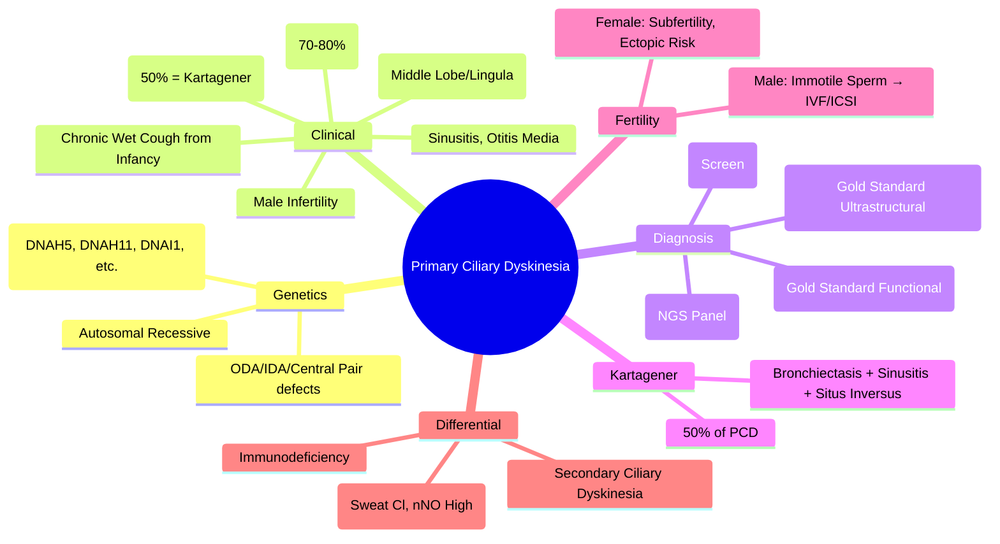

# Primary Ciliary Dyskinesia (PCD)

Related: [[Bronchiectasis]], [[Kartagener syndrome]], [[Airway Diseases/Bronchiectasis and suppurative airway disease|Bronchiectasis and suppurative airway disease]], [[Cystic fibrosis-related bronchiectasis]]

> [!important]
> **PCD** = **autosomal recessive** defect in ciliary structure/function → **impaired mucociliary clearance** → **recurrent respiratory infections, bronchiectasis, sinusitis, situs inversus (50% = Kartagener syndrome)**. **Diagnostic**: high-speed video microscopy (+/– TEM) + genetic testing. **Key FCPS/MRCP**: Kartagener triad, diagnostic criteria, differentiation from CF, fertility issues.

## Learning Objectives
- Recognise PCD clinical features (neonatal respiratory distress, chronic sinusitis, bronchiectasis, situs inversus)
- Apply diagnostic criteria (clinical + nasal NO + high-speed video microscopy + TEM + genetics)
- Differentiate from CF, immunodeficiency, primary immunodeficiency
- Manage airway clearance, infections, fertility, genetic counselling

## Definition
**Primary Ciliary Dyskinesia (PCD)** = **autosomal recessive** genetic disorder of **ciliary structure/function** → **impaired mucociliary clearance** → chronic upper/lower airway disease, laterality defects, fertility issues.

## Genetics
| Aspect | Details |
|--------|---------|
| **Inheritance** | **Autosomal recessive** (most); rare X-linked (RPGR) |
| **Genes** | >40 genes identified (DNAH5, DNAH11, DNAI1, DNAI2, CCDC39, CCDC40, RSPH1, RSPH4A, etc.) |
| **Defects** | Outer dynein arm (ODA), inner dynein arm (IDA), central pair, radial spokes, nexin links |
| **Prevalence** | ~1:10,000 to 1:20,000 |

## Pathophysiology
- **Normal cilia**: 9+2 microtubule arrangement → coordinated beating (12-15 Hz) → **mucociliary clearance**
- **PCD cilia**: **structural defects** (absent dynein arms, central pair, radial spokes) → **immotile, dyskinetic, or absent cilia** → **failed mucociliary clearance** → mucus stasis → recurrent infection → bronchiectasis

## Clinical Features

### Neonatal Presentation (70-80%)
- **Respiratory distress** at birth (transient tachypnoea-like)
- **Neonatal pneumonia** / prolonged oxygen requirement
- **Situs inversus** (50%) detected on CXR/US

### Childhood/Adult
| System | Features |
|--------|----------|
| **Lower airway** | Chronic wet cough from infancy, recurrent pneumonia, **bronchiectasis** (often middle lobe/lingula), **atelectasis** (RML) |
| **Upper airway** | **Chronic rhinosinusitis** (universal), nasal polyps, otitis media (glue ear), hearing loss |
| **Laterality** | **Situs inversus totalis** (50% = **Kartagener syndrome**), situs ambiguus (heterotaxy) |
| **Fertility** | **Male**: immotile sperm → infertility; **Female**: subfertility (fallopian tube cilia), ectopic pregnancy risk |
| **Other** | Hydrocephalus (rare), retinal degeneration (rare, RPGR) |

### Kartagener Syndrome (Classic Triad)
1. **Bronchiectasis**
2. **Chronic sinusitis**
3. **Situs inversus totalis**

## Diagnostic Criteria (ERS 2017 / ATS)

### Screening Test
- **Nasal nitric oxide (nNO)**: **<77 nl/min** (or <50 nl/min in children) — **highly sensitive/specific** for PCD
  - **Not** low in CF, asthma, primary immunodeficiency

### Definitive Diagnosis (Any One)
| Method | Details |
|--------|---------|
| **High-speed video microscopy (HSVM)** | **Gold standard**: visualises ciliary beat pattern/frequency; identifies dyskinesia/immotility |
| **Transmission electron microscopy (TEM)** | **Ultrastructural defects**: absent ODA/IDA, central pair, radial spokes |
| **Genetic testing** | **>40 genes** (DNAH5, DNAH11, DNAI1, DNAI2, CCDC39/40, RSPH1/4A, etc.); NGS panel OR exome |

> **Diagnostic algorithm**: Clinical suspicion → **nNO low** → **HSVM and/or TEM + genetics** → definitive diagnosis.

## Differential Diagnosis
| Condition | Differentiation |
|-----------|-----------------|
| **Cystic Fibrosis** | Sweat Cl >60, pancreatic insufficiency, different microbiology (Pseudomonas dominant) |
| **Primary Immunodeficiency** | Low immunoglobulins, recurrent non-respiratory infections, normal cilia |
| **Young's Syndrome** | Obstructive azoospermia, sinusitis, bronchiectasis, **normal cilia** |
| **Immotile Cilia Syndrome** | Older term for PCD |
| **Secondary Ciliary Dyskinesia** | Post-viral, smoking, pollutants — **reversible**, normal ultrastructure |

## Investigations

| Test | Role |
|------|------|
| **Nasal nitric oxide (nNO)** | **Screening**: <77 nl/min (highly sensitive/specific) |
| **High-speed video microscopy (HSVM)** | **Gold standard functional**: beat frequency, pattern |
| **Transmission electron microscopy (TEM)** | **Ultrastructural**: ODA/IDA/central pair defects |
| **Genetic testing (NGS panel)** | **Definitive**: >40 genes; prenatal counselling |
| **Spirometry** | Obstructive pattern; FEV₁ decline monitoring |
| **HRCT chest** | Bronchiectasis (middle lobe/lingula, lower lobes) |
| **Sinus CT** | Pansinusitis, mucosal thickening |

## Management

### 1. Airway Clearance (Daily, Lifelong)
- **Chest physiotherapy**: ACBT, autogenic drainage, PEP/oscillating PEP
- **Exercise**: aerobic + resistance
- **Mucoactives**: **dornase alfa** (off-label, evidence limited), **hypertonic saline** 7% (evidence emerging)

### 2. Infection Management
- **Prophylactic antibiotics**: not routinely recommended
- **Acute exacerbations**: guided by sputum culture (Haemophilus, Streptococcus, Staph, Pseudomonas)
- **Chronic Pseudomonas**: inhaled tobramycin/colistin (off-label, CF protocols)
- **Vaccinations**: pneumococcal, influenza, COVID-19, pertussis

### 3. Upper Airway
- **Nasal saline irrigation** (daily)
- **Topical steroids** (chronic rhinosinusitis)
- **Sinus surgery** (FESS) for polyps/refractory sinusitis
- **ENT follow-up**: audiometry, grommets if glue ear

### 4. Fertility
- **Male**: **IVF/ICSI** (sperm retrieval from testis/epididymis)
- **Female**: subfertility risk; IVF if needed; **ectopic pregnancy** risk ↑

### 5. Monitoring
| Parameter | Frequency |
|-----------|-----------|
| Spirometry (FEV₁, FVC) | 6-monthly |
| HRCT chest | 2-3 yearly (or if clinical change) |
| Sputum culture | 3-monthly (or at exacerbation) |
| ENT review | Annual (audiometry, sinus assessment) |
| Hearing test | Annual (children) |

## Genetic Counselling
- **Autosomal recessive** → 25% recurrence risk for siblings
- **Carrier testing** for siblings/parents
- **Prenatal diagnosis**: chorionic villus sampling/amniocentesis (if familial mutation known)
- **Preimplantation genetic diagnosis (PGD)** available

## Complications
| System | Complication |
|--------|--------------|
| **Lung** | Progressive bronchiectasis, respiratory failure |
| **Sinus** | Chronic pansinusitis, nasal polyps, anosmia |
| **Ear** | Conductive hearing loss (glue ear), tympanic membrane retraction |
| **Fertility** | Male infertility (immotile sperm), female subfertility, ectopic pregnancy |
| **Neuro** | Hydrocephalus (rare, CCDC39/40), retinal degeneration (RPGR) |
| **Laterality** | Heterotaxy (asplenia/polysplenia), congenital heart disease (if heterotaxy) |

## Prognosis
- **Normal life expectancy** with modern care
- **Lung function decline** slower than CF
- **Quality of life** impacted by chronic cough, sinus disease, hearing loss
- **Fertility**: IVF/ICSI successful; genetic counselling essential

## Kartagener Syndrome
- **Triad**: Bronchiectasis + Chronic sinusitis + **Situs inversus totalis**
- **Subset of PCD** (50% of PCD have situs inversus)
- **Not all situs inversus = PCD** (isolated laterality defects exist)

## FCPS/MRCP High-Yield Points
1. **PCD** = autosomal recessive, ciliary dysfunction → impaired clearance → bronchiectasis, sinusitis
2. **Kartagener triad**: Bronchiectasis + Sinusitis + **Situs inversus** (50% of PCD)
3. **Neonatal respiratory distress** (70-80%) — clue to diagnosis
4. **Nasal NO** = screening (<77 nl/min); **HSVM + TEM + genetics** = definitive
4. **Low nasal NO** distinguishes from CF (CF has normal/high nNO)
5. **Kartagener triad**: Bronchiectasis + Sinusitis + Situs inversus (50% of PCD)
6. **Male infertility** = immotile sperm; IVF/ICSI; female subfertility, ectopic risk
6. **nNO low** = PCD; **nNO normal/high** = CF
6. **Genetic**: autosomal recessive, >40 genes (DNAH5, DNAH11, DNAI1, etc.)

## Common Viva Questions
1. PCD pathophysiology and genetics
2. Diagnostic criteria (nNO, HSVM, TEM, genetics)
3. Kartagener syndrome triad
4. Differentiation from CF (nNO, sweat chloride, microbiology)
5. Fertility issues and management
6. Monitoring and long-term management

## Common Confusions / Exam Traps
- **PCD ≠ CF**: nNO **low** in PCD, **normal/high** in CF; sweat Cl **normal** in PCD
- **Situs inversus ≠ PCD** (isolated laterality defects exist); only 50% PCD have situs inversus
- **Primary vs secondary ciliary dyskinesia**: PCD = genetic, ultrastructural defects; secondary = post-viral/smoking, reversible
- **Young's syndrome** = male infertility + bronchiectasis + sinusitis, **normal cilia**
- **Neonatal distress** in PCD often misdiagnosed as TTN/RDS

## Mnemonics
- **KARTAGENER**: **K**artagener = **B**ronchiectasis + **S**inusitis + **S**itus **I**nversus
- **PCD FEATURES**: **N**eonatal distress, **O**titis media, **S**inusitis, **B**ronchiectasis, **I**nfertility, **S**itus inversus
- **PCD vs CF**: **nNO LOW** in PCD, **HIGH/NORMAL** in CF; **SWEAT Cl NORMAL** in PCD, **HIGH** in CF
- **KARTAGENER TRIAD**: **B**ronchiectasis, **S**inusitis, **S**itus **I**nversus

## Mind Map


## Flowchart
```mermaid
flowchart TD
  A[Chronic Wet Cough from Infancy\n+ Sinusitis/Otitis\n± Situs Inversus\n± Neonatal Distress] --> B[Nasal NO <77 nl/min?]
  B -->|Yes| C[High-Speed Video Microscopy (HSVM)\n+ Transmission EM (TEM)]
  B -->|No| D[Consider CF, Immunodeficiency,\nSecondary Ciliary Dyskinesia]
  C --> E{HSVM/TEM Shows\nCiliary Defect?}
  E -->|Yes| F[Genetic Testing (NGS Panel)\nConfirm Diagnosis]
  E -->|No| G[Consider Secondary Ciliary\nDyskinesia / Other]
  F --> H[Genetic Counselling\nFamily Screening\nFertility Counselling]
```

## Suggested Visuals / Image Notes
- Ciliary ultrastructure (9+2, ODA/IDA defects)
- Kartagener triad diagram
- Nasal NO measurement technique
- Ciliary beat pattern video microscopy

## Suggested Video References
- PCD diagnosis (ERS guidelines)
- High-speed video microscopy technique
- Genetic counselling in PCD

## One-Page Revision Summary
- **PCD** = autosomal recessive ciliary defect → impaired clearance → bronchiectasis, sinusitis, situs inversus
- **Kartagener**: Bronchiectasis + Sinusitis + Situs inversus (50% of PCD)
- **Neonatal distress** (70-80%) + chronic wet cough + sinusitis
- **nNO <77 nl/min** = screening; **HSVM + TEM + genetics** = definitive
- **nNO low in PCD**; **normal/high in CF** (key discriminator)
- **Sweat chloride normal** in PCD
- **Male infertility**: immotile sperm → IVF/ICSI; female subfertility
- **Kartagener**: Bronchiectasis + Sinusitis + Situs inversus (50% PCD)
- **Management**: airway clearance, infection control, ENT, fertility, genetic counselling

## 24-Hour Recall Prompts
- State Kartagener triad
- Contrast PCD vs CF (nNO, sweat Cl, microbiology)
- List PCD diagnostic criteria (nNO, HSVM, TEM, genetics)
- Describe fertility management in PCD

## 7-Day / 15-Day / 30-Day Revision Tracker
- [ ] Day 1 completed
- [ ] 24-hour recall completed
- [ ] Day 7 revision completed
- [ ] Day 15 revision completed
- [ ] Day 30 revision completed

## Must Know / Should Know / Nice to Know
### Must Know
- PCD = autosomal recessive ciliary defect
- Kartagener triad = bronchiectasis + sinusitis + situs inversus (50% PCD)
- nNO low (<77) screening; HSVM/TEM/genetics definitive
- nNO low in PCD, normal/high in CF (key discriminator)
- Male infertility (immotile sperm); IVF/ICSI
- Sweat chloride normal in PCD

### Should Know
- Neonatal distress 70-80%
- Male infertility: IVF/ICSI; female subfertility, ectopic risk
- Kartagener = 50% of PCD
- Genetic counselling (autosomal recessive, 25% sibling risk)
- Heterotaxy/asplenia if situs ambiguus

### Nice to Know
- Specific gene mutations (DNAH5, DNAH11, DNAI1, CCDC39/40, RPGR)
- Heterotaxy/asplenia with situs ambiguus
- Retinal degeneration (RPGR)
- Hydrocephalus (CCDC39/40)
- Young's syndrome differentiation

## Self-Test Scorecard
- Understanding: /10
- Recall: /10
- MCQ Performance: /10
- SBA Performance: /10
- Viva Confidence: /10
- Total: /50

> [!tip]
> Interpretation: <35 = weak topic, 35-44 = acceptable but insecure, 45+ = strong exam-ready topic.

## Exam Answer Modes
### Long Answer Skeleton
- Definition, genetics, pathophysiology
- Clinical features (neonatal, childhood, adult)
- Kartagener syndrome
- Diagnosis (nNO, HSVM, TEM, genetics)
- Differential (CF, immunodeficiency, secondary)
- Management (clearance, infections, ENT, fertility, monitoring)
- Genetic counselling

### Short Note Skeleton
- PCD definition + genetics
- Kartagener triad
- Diagnostic algorithm (nNO → HSVM/TEM → genetics)
- PCD vs CF table
- Fertility management

### Viva One-Liners
- "PCD = autosomal recessive ciliary defect → impaired clearance → bronchiectasis + sinusitis + situs inversus"
- "Kartagener = Bronchiectasis + Sinusitis + Situs inversus (50% of PCD)"
- "nNO <77 nl/min = PCD screen; CF has normal/high nNO"
- "Sweat Cl normal in PCD, high in CF — key discriminator"
- "HSVM + TEM + genetics = definitive PCD diagnosis"
- "Male infertility = immotile sperm → IVF/ICSI; female subfertility"
- "Kartagener triad: Bronchiectasis + Sinusitis + Situs inversus (50% PCD)"
- "Neonatal distress in 70-80% PCD"
- "Male infertility = IVF/ICSI; female subfertility + ectopic risk"

### Ward-Case Discussion Points
- Child with chronic cough, situs inversus, neonatal distress → nNO → HSVM → genetics → PCD diagnosis
- Male with infertility, chronic sinusitis, childhood pneumonia → PCD screen → IVF/ICSI
- Neonate with respiratory distress, situs inversus → consider PCD, check nNO
- Family screening: sibling 25% risk; carrier testing for parents

### Last-Night-Before-Exam Sheet
- PCD: Autosomal recessive, ciliary defect
- Kartagener: Bronchiectasis + Sinusitis + Situs Inversus (50%)
- nNO: <77 = PCD; CF = Normal/High
- Sweat Cl: Normal in PCD
- Diagnosis: nNO → HSVM + TEM → Genetics
- Male: IVF/ICSI; Female: Subfertile
- Kartagener: Bronch + Sinus + Situs Inversus

## Summary
**Primary Ciliary Dyskinesia (PCD)** = autosomal recessive ciliary ultrastructural/functional defect → **impaired mucociliary clearance** → **bronchiectasis, chronic sinusitis, otitis media, situs inversus (50% = Kartagener syndrome)**. **Neonatal distress (70-80%)** often first clue. **Screening**: **nasal NO <77 nl/min** (low in PCD, normal/high in CF). **Definitive**: **HSVM + TEM + genetic testing** (>40 genes). **Key discriminator from CF**: **nNO low in PCD, normal/high in CF**; **sweat Cl normal in PCD**. **Kartagener syndrome** = Bronchiectasis + Sinusitis + Situs inversus (50% of PCD). **Male infertility** = immotile sperm → IVF/ICSI; female subfertility. **Management**: airway clearance, infection control, ENT surveillance, fertility, genetic counselling.

## MCQs (10)
1. **Kartagener syndrome** triad includes:
   A. Bronchiectasis, asthma, situs inversus
   B. **Bronchiectasis, chronic sinusitis, situs inversus**
   C. Bronchiectasis, cystic fibrosis, situs inversus
   D. Bronchiectasis, sinusitis, dextrocardia
2. **Nasal nitric oxide (nNO)** in PCD:
   A. **Low (<77 nl/min)**
   B. Normal
   C. High
   D. Variable
3. **Sweat chloride** in PCD:
   A. Elevated (>60 mmol/L)
   B. **Normal**
   C. Low
   D. Not measured
4. **Kartagener syndrome** prevalence in PCD:
   A. 10%
   B. 25%
   C. **50%**
   D. 75%
5. **Male infertility** in PCD is due to:
   A. Obstructive azoospermia
   B. **Immotile sperm (flagellar dynein arm defect)**
   C. Hormonal deficiency
   C. Testicular atrophy

## SBA Questions (10)
1. A 6-week-old infant presents with respiratory distress since birth, chronic wet cough, and situs inversus on CXR. Nasal NO is 40 nl/min. Most likely diagnosis:
   A. Cystic fibrosis
   B. **Primary ciliary dyskinesia**
   C. Surfactant protein deficiency
   D. Primary immunodeficiency
2. Adult male with chronic sinusitis, bronchiectasis, and infertility. CXR shows dextrocardia. Nasal NO low. Best diagnostic test for confirmation:
   A. Sweat chloride test
   B. **High-speed video microscopy + TEM + genetics**
   C. Immunoglobulin levels
   D. HIV test
3. Key discriminator between PCD and CF:
   A. **Nasal NO (low in PCD, high/normal in CF)**
   B. Sweat chloride (high in both)
   C. Bronchiectasis pattern
   D. Chronic sinusitis
4. Kartagener syndrome is:
   A. **Bronchiectasis + Chronic sinusitis + Situs inversus (50% of PCD)**
   B. Bronchiectasis + CF + Situs inversus
   C. Bronchiectasis + Asthma + Situs inversus
   D. Bronchiectasis + Sinusitis + Dextrocardia
5. Male infertility in PCD management:
   A. Hormonal therapy
   B. **IVF/ICSI with sperm retrieval**
   C. Surgical correction
   D. Antioxidant therapy
6. Neonatal presentation of PCD:
   A. Asymptomatic
   B. **Respiratory distress in 70-80%**
   C. Meconium ileus
   D. Jaundice
6. Kartagener triad:
   A. Bronchiectasis, CF, Situs inversus
   B. **Bronchiectasis, Chronic sinusitis, Situs inversus**
   C. Bronchiectasis, Asthma, Situs inversus
   D. Bronchiectasis, Sinusitis, Dextrocardia
7. PCD vs CF key discriminator:
   A. **nNO low (PCD) vs normal/high (CF)**
   B. Sweat Cl high in both
   C. Pancreatic insufficiency in both
   D. Bronchiectasis in both
8. Genetic inheritance of PCD:
   A. Autosomal dominant
   B. **Autosomal recessive**
   C. X-linked
   D. Mitochondrial
9. nNO in CF:
   A. Low
   B. **Normal or elevated**
   C. Zero
   D. Variable
10. Kartagener syndrome prevalence in PCD:
    A. 10%
    B. 25%
    C. **50%**
    D. 75%

## Flashcards
- Q: Kartagener triad
  A: Bronchiectasis + Sinusitis + Situs inversus
- Q: PCD prevalence
  A: ~1:10,000-20,000
- Q: nNO in PCD
  A: <77 nl/min (low)
- Q: nNO in CF
  A: Normal/high
- Q: Sweat Cl in PCD
  A: Normal
- Q: Sweat Cl in CF
  A: >60 mmol/L
- Q: Kartagener = what % of PCD
  A: 50%
- Q: Male infertility in PCD
  A: Immotile sperm → IVF/ICSI
- Q: PCD inheritance
  A: Autosomal recessive
- Q: Kartagener triad
  A: Bronchiectasis + Sinusitis + Situs inversus

## Answer Key with Explanations
### MCQs
1. **B** — Kartagener = Bronchiectasis + Chronic sinusitis + Situs inversus.
2. **A** — nNO <77 nl/min in PCD (screening).
3. **B** — Sweat Cl normal in PCD.
4. **C** — 50% of PCD have situs inversus = Kartagener.
5. **B** — Immotile sperm due to dynein arm defects.

### SBAs
1. **B** — Neonatal distress + situs inversus + low nNO = PCD.
2. **B** — HSVM + TEM + genetics = definitive PCD diagnosis.
3. **A** — nNO low in PCD, high/normal in CF = key discriminator.
4. **A** — Kartagener = Bronchiectasis + Sinusitis + Situs inversus (50% PCD).
5. **B** — Male infertility = immotile sperm → IVF/ICSI.
5. **B** — 70-80% PCD present with neonatal respiratory distress.
6. **B** — Kartagener = Bronchiectasis + Sinusitis + Situs inversus.
7. **A** — nNO low in PCD, normal/high in CF = key discriminator.
8. **B** — Autosomal recessive.
9. **B** — nNO normal/high in CF.
10. **C** — 50% of PCD have situs inversus = Kartagener.

## Flashcards
- Q: Kartagener triad
  A: Bronchiectasis + Sinusitis + Situs inversus
- Q: nNO PCD
  A: <77 nl/min
- Q: nNO CF
  A: Normal/high
- Q: Sweat Cl PCD
  A: Normal
- Q: Sweat Cl CF
  A: >60 mmol/L
- Q: Kartagener % of PCD
  A: 50%
- Q: Male infertility PCD
  A: Immotile sperm → IVF/ICSI
- Q: PCD inheritance
  A: Autosomal recessive
- Q: Kartagener triad
  A: Bronchiectasis + Sinusitis + Situs inversus
- Q: Key discriminator PCD vs CF
  A: nNO (low PCD, high CF)

## Answer Key with Explanations
### MCQs
1. **B** — Kartagener = Bronchiectasis + Chronic sinusitis + Situs inversus.
2. **A** — nNO <77 nl/min in PCD.
3. **B** — Sweat Cl normal in PCD.
4. **C** — 50% of PCD have situs inversus.
5. **B** — Immotile sperm from dynein arm defects.

### SBAs
1. **B** — Neonatal distress + situs inversus + low nNO = PCD.
2. **B** — HSVM + TEM + genetics = definitive PCD diagnosis.
3. **A** — nNO low in PCD, high/normal in CF = key discriminator.
4. **A** — Kartagener = Bronchiectasis + Sinusitis + Situs inversus (50% PCD).
5. **B** — Male infertility = immotile sperm → IVF/ICSI.
5. **B** — 70-80% PCD present with neonatal respiratory distress.
6. **B** — Kartagener = Bronchiectasis + Sinusitis + Situs inversus.
7. **A** — nNO low in PCD, normal/high in CF = key discriminator.
8. **B** — Autosomal recessive.
9. **B** — nNO normal/high in CF.
10. **C** — 50% of PCD have situs inversus = Kartagener.

---
## Additional MCQs (6–10)

6. Inheritance of PCD:
   A. Autosomal dominant
   B. **Autosomal recessive (most common)**
   C. X-linked
   D. Mitochondrial
   E. Sporadic only
   **Answer: B** — Autosomal recessive (most common; >40 genes).

7. Kartagener syndrome is:
   A. Cystic fibrosis with bronchiectasis
   B. **PCD + situs inversus + chronic sinusitis**
   C. Sarcoidosis
   D. ABPA
   E. Asthma
   **Answer: B** — Kartagener = PCD + situs inversus + chronic sinusitis.

8. Diagnostic test of choice for PCD:
   A. CXR
   B. **Nasal nitric oxide (very low) + high-speed video microscopy of ciliary beat + electron microscopy**
   C. CT
   D. Spirometry
   E. ABG
   **Answer: B** — Low nasal NO + abnormal ciliary beat pattern is diagnostic.

9. PCD typically presents with:
   A. Adult-onset wheeze
   B. **Neonatal respiratory distress + chronic productive cough + situs inversus (50%)**
   C. Unilateral wheeze
   D. Haemoptysis only
   E. Asymptomatic
   **Answer: B** — Neonatal onset, chronic productive cough, situs inversus.

10. PCD management mainstay is:
    A. Oral steroids
    B. **Airway clearance + prompt antibiotics for infections + monitoring**
    C. Surgery
    D. Biologics
    E. Antifungal
    **Answer: B** — Airway clearance + antibiotics; no specific curative therapy.

## Additional SBAs (6–10)

6. PCD fertility:
   A. Normal in both
   B. **Reduced fertility (male immotile sperm, female subfertility)**
   C. Enhanced
   D. Only male
   E. Only female
   **Answer: B** — Male and female subfertility is common.

7. PCD on HRCT shows:
   A. Diffuse GGO
   B. **Bronchiectasis predominantly in upper/middle lobes + tree-in-bud + situs inversus**
   C. Pleural effusion
   D. Emphysema
   E. Normal
   **Answer: B** — Upper-lobe predominant bronchiectasis; situs inversus.

8. PCD vs CF differentiation:
   A. Same
   B. **PCD: situs inversus, normal sweat chloride, low nasal NO; CF: pancreatic insufficiency, ↑sweat Cl**
   C. Both pancreatic
   D. CF has high nasal NO
   E. PCD has ↑sweat Cl
   **Answer: B** — Key differentiators.

9. PCD treatment includes:
   A. CFTR modulators
   B. **Airway clearance, prompt antibiotics, hearing/audiology monitoring, fertility support**
   C. Steroids long-term
   D. Surgery routinely
   E. No treatment
   **Answer: B** — Multidisciplinary supportive care.

10. PCD-related infertility in males is due to:
    A. Hormonal issue
    B. **Immotile sperm flagella (same axonemal structure)**
    C. Obstruction
    D. Testicular failure
    E. Unknown
    **Answer: B** — Sperm flagella share structure with cilia; immotile.

## Local Navigation
- **Parent Heading**: [[../Airway Diseases|Airway Diseases]]
- **Parent Topic Group**: [[../Airway Diseases/Bronchiectasis and suppurative airway disease|Bronchiectasis and suppurative airway disease]]
- **Chapter Map**: [[../Davidson Chapter 17 - Respiratory Medicine Hierarchy|Respiratory Medicine Hierarchy]]
- **Chapter MOC**: [[../Respiratory MOC|Respiratory MOC]]
- **Drug Reference**: [[../../Clinical Therapeutics and Good Prescribing|Drugs]]
- **Related**: [[Bronchiectasis]] · [[Cystic fibrosis-related bronchiectasis]] · [[Asthma]]

## PasTest Scenario SBAs (Clinical Vignettes)

> **Auto-generated PasTest/Mediscope-style scenario SBAs** grounded in the authored source. Each scenario tests a real clinical fact (triad, specific sign, contraindication, trial, first-line Rx) extracted from the topic. *Source: Ch 17: Respiratory Medicine — Primary ciliary dyskinesia*

**Q1.** Which of the following features is most specific or characteristic of Primary ciliary dyskinesia?

  - **A.** Nasal nitric oxide
  - **B.** A feature common to many acute inflammatory conditions
  - **C.** A non-specific sign that does not localise the diagnosis
  - **D.** An investigation finding rather than a clinical feature

  > **Answer: A** — Nasal nitric oxide
  >
  > *Source:* al, smoking, pollutants — **reversible**, normal ultrastructure |
| Test | Role |
|------|------|
| **Nasal nitric oxide (nNO)** | **Screening**: <77 nl/min (highly sensitive/specific) |
| **High-spee

**Q2.** What is the most appropriate first-line therapy for Primary ciliary dyskinesia?

  - **A.** Nasal saline irrigation + Topical steroids + Sinus surgery
  - **B.** An advanced/surgical therapy reserved for refractory disease
  - **C.** Symptomatic treatment only, no disease-modifying therapy
  - **D.** Empiric broad-spectrum therapy without specific indication

  > **Answer: A** — Nasal saline irrigation + Topical steroids + Sinus surgery
  >
  > *Source:* Upper Airway
- **Nasal saline irrigation** (daily)
- **Topical steroids** (chronic rhinosinusitis)
- **Sinus surgery** (FESS) for polyps/refractory sinusitis
- **ENT follow-up**: audiometry, grommets 

