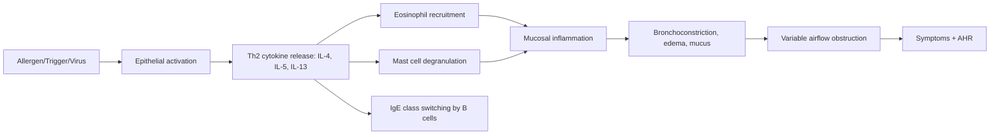
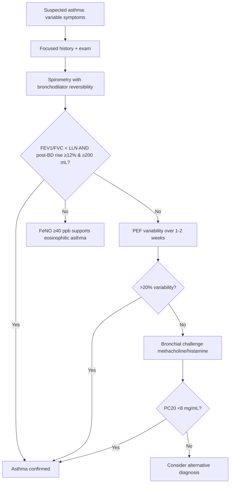
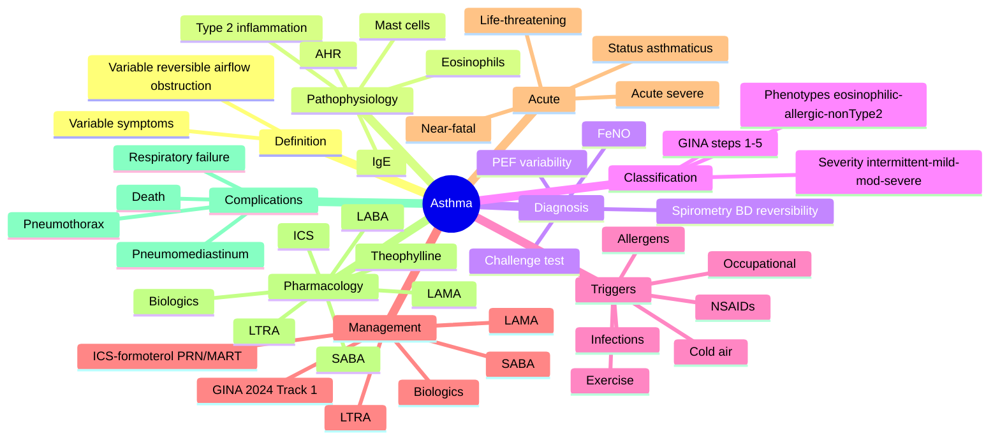
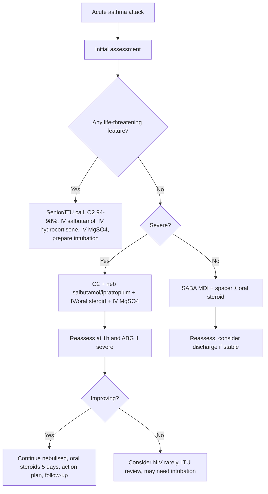

# Asthma

> [!important]
> **Asthma** is a heterogeneous chronic inflammatory airway disease characterised by **variable and reversible expiratory airflow limitation** and **airway hyperresponsiveness**, leading to recurrent wheeze, breathlessness, chest tightness, and cough.

Related: [[COPD]], [[Respiratory Failure]], [[ABG Interpretation]], [[Spirometry Interpretation]], [[Oxygen Therapy and NIV]], [[Chest X-Ray Approach]], [[Airway Diseases/Acute severe asthma|Acute severe asthma]]

> [!tip]
> **FCPS/MRCP pearl**: Asthma = **reversible** airflow obstruction (ΔFEV₁ ≥12% & ≥200 mL post-bronchodilator). Distinguish from **COPD** (less reversible), **ACOS/Asthma-COPD overlap**, and **vocal cord dysfunction** (variable extrathoracic obstruction, normal inspiratory loop).

## Learning Objectives
- Define asthma, classify severity (GINA stepwise), and recognise phenotypes.
- Describe airway anatomy/physiology relevant to bronchospasm, hyperinflation, and gas exchange.
- Apply diagnostic criteria (variable symptoms + reversible obstruction on spirometry + FeNO/peak flow variability).
- Distinguish asthma from COPD, ILD, VCD, hyperventilation, PE, and cardiac wheeze.
- Build a stepwise management plan (GINA Track 1/2, MART, SMART, ICS-formoterol reliever).
- Manage acute severe and life-threatening asthma, identify ICU triggers, and discharge planning.
- Counsel on inhaler technique, trigger avoidance, and personalised action plans.

## Definition

**Asthma (GINA 2024)**: Heterogeneous disease, usually characterised by **chronic airway inflammation**. Defined by:
- **History of respiratory symptoms** (wheeze, shortness of breath, chest tightness, cough) that **vary in intensity and over time**
- **Variable expiratory airflow limitation** (documented by spirometry/PEF)

**Operational adult diagnostic criteria** — both required:
| Criterion | Detail |
|-----------|--------|
| **Variable symptoms** | ≥2 of wheeze, breathlessness, chest tightness, cough; often worse at night/early morning, with triggers, seasonal |
| **Variable airflow limitation** | ≥1 of: (a) FEV₁/FVC < LLN or <0.75–0.80; **AND** (b) positive BD reversibility (ΔFEV₁ ≥12% & ≥200 mL); OR positive bronchial challenge; OR PEF variability >20% over 1–2 weeks |

> [!critical] **Diagnostic trap**: A single normal spirometry does not exclude asthma. Repeat when symptomatic, or perform challenge test.

## Core Anatomy

### Airway tree relevant to asthma
| Level | Components | Asthma relevance |
|-------|-----------|------------------|
| **Trachea & main bronchi** | Cartilage, smooth muscle, ciliated epithelium | Conducting zone; site of large-airway wheeze |
| **Bronchi (medium)** | Smooth muscle, submucosal glands, cartilage plates | Major site of bronchoconstriction; ICS targets inflammation here |
| **Bronchioles (<2 mm)** | No cartilage, smooth muscle, Clara cells | Site of small-airway obstruction; air-trapping on imaging |
| **Alveoli** | Type I/II pneumocytes, capillary network | Gas exchange; relative sparing in asthma (vs emphysema) |

### Key cellular players in airway wall
- **Pseudostratified ciliated columnar epithelium** — goblet cells produce mucus; cilia clear debris
- **Submucosal glands** — seromucinous; hypertrophy in chronic asthma
- **Smooth muscle layer** — wraps from trachea down to terminal bronchioles; hypertrophy/hyperplasia in asthma
- **Subepithelial basement membrane** — thickened by collagen deposition in chronic asthma
- **Mast cells, eosinophils, T-lymphocytes (Th2), dendritic cells** — inflammatory infiltrate; target of biologics

## Core Physiology

### Normal airway dynamics
- **Airway resistance** ∝ 1/r⁴ (Poiseuille) → small bronchioles dominate resistance despite larger cross-section
- **Bronchomotor tone** controlled by autonomic nervous system:
  - **Parasympathetic (vagal, M3)** → bronchoconstriction (blocked by ipratropium)
  - **Sympathetic (β2)** → bronchodilation (target of salbutamol)
  - **NANC** (i-NANC: NO, VIP → dilation; e-NANC: substance P, neurokinins → constriction)
- **Lung volumes in asthma attack**:
  - ↑ RV, ↑ FRC (air-trapping due to dynamic hyperinflation)
  - ↓ FEV₁, ↓ FVC, ↓ FEV₁/FVC
  - **Inspiratory capacity (IC) drops** — useful bedside severity marker

### Asthma pathophysiology

### Gas exchange in acute severe asthma
- **Early/mild**: hyperventilation → ↓PaCO₂, normal/↑PaO₂
- **Moderate**: ↑A-a gradient from V/Q mismatch
- **Severe/life-threatening**: **normal PaCO₂ (36–45 mmHg / 4.7–6.0 kPa) is a RED FLAG** — patient tiring; lactic acidosis develops; precipitous rise in PaCO₂ → respiratory arrest
- **ABG evolution**: resp alkalosis → normal pH/PaCO₂ → resp acidosis (dying patient)

## Classification (GINA 2024)

### GINA stepwise pharmacologic treatment (Track 1, preferred)
| Step | Preferred controller | Preferred reliever |
|------|---------------------|--------------------|
| **1** | Low-dose ICS-formoterol **as needed** (PRN) | Same as controller (ICS-formoterol) |
| **2** | Daily low-dose ICS + **ICS-formoterol PRN** (MART) | ICS-formoterol PRN |
| **3** | Low-dose **ICS-LABA** + **ICS-formoterol PRN** (MART) | ICS-formoterol PRN |
| **4** | Medium-dose **ICS-LABA** + **ICS-formoterol PRN** | ICS-formoterol PRN |
| **5** | High-dose ICS-LABA ± LAMA ± biologics ± oral steroids | ICS-formoterol PRN |

> [!tip] **Track 1 (preferred)** = **ICS-formoterol** as both controller and reliever (MART/SMART). Track 2 (alternative) uses ICS + SABA PRN — still acceptable but SABA monotherapy is now discouraged.

### Phenotype-guided biologic therapy (Step 5)
| Phenotype | Biomarker | Biologic |
|-----------|-----------|----------|
| **Eosinophilic/Th2-high** | Eos ≥300/µL, FeNO ≥50 ppb | Anti-IL5 (mepolizumab, reslizumab), anti-IL5R (benralizumab), anti-IL4Rα (dupilumab), anti-IgE (omalizumab) |
| **Allergic** | Specific IgE, skin test + | Omalizumab |
| **Non-Type 2** | Eos <150, neutrophilic | Macrolides (trial), thermoplasty (rare) |

## Etiology / Causes

### Triggers
- **Allergens** — house-dust mite, pollen, mould, animal dander, cockroach
- **Infections** — rhinovirus, influenza, RSV, Mycoplasma
- **Occupational** — flour, isocyanates, latex, wood dust, chemicals (see [[Airway Diseases/Occupational asthma|Occupational asthma]])
- **Drugs** — NSAIDs (COX-1 inhibition → leukotriene surge), β-blockers (block bronchodilation), aspirin
- **Exercise** — especially cold/dry air
- **Emotion, cold air, GERD, post-nasal drip**
- **Irritants** — smoke, pollution, diesel particulates, sulphur dioxide

### Risk factors
- **Atopy** (eczema, allergic rhinitis, food allergy)
- **Family history** of atopy/asthma
- **Obesity**
- **Maternal smoking/environmental tobacco exposure** (in utero & postnatal)
- **Premature birth, low birth weight**
- **Occupational sensitiser exposure**

## Pathophysiology

### Chronic inflammatory changes
- **Eosinophilic infiltration** (Type 2-high); neutrophilic in severe/non-Type 2
- **Mast cell, basophil, Th2 lymphocyte** activation
- **Goblet cell hyperplasia** → mucus hypersecretion
- **Sub-basement membrane collagen deposition** → "thickened BM" on biopsy
- **Smooth muscle hypertrophy/hyperplasia** → AHR
- **Airway wall oedema**

### Acute bronchoconstriction
1. Allergen cross-links IgE on mast cell → degranulation → histamine, tryptase, leukotrienes (LTC4, D4, E4), prostaglandin D2
2. Smooth muscle contraction (early response, 15–30 min)
3. **Late-phase response** (4–8 h): recruited eosinophils, Th2 cells → sustained inflammation/bronchoconstriction

### Airway hyperresponsiveness (AHR)
- **Exaggerated bronchoconstrictor response** to non-specific stimuli (methacholine, histamine, cold air)
- 10-100× more sensitive than non-asthmatics
- Improves with ICS, persists even when symptoms controlled

## Clinical Features

### Classic triad (variable)
- **Wheeze** (high-pitched, expiratory, polyphonic)
- **Breathlessness**
- **Chest tightness** ("band around chest")
- ± **Cough** (often nocturnal, may be productive of clear/white sputum)

### Pattern clues
- **Nocturnal cough/wheeze** (2–4 am dip)
- **Seasonal** (allergic)
- **Trigger-related** (exercise, cold, workplace)
- **Diurnal PEF variability >20%** — diagnostic

### Severity of chronic asthma (GINA 2024)
- **Intermittent**: symptoms <2 days/week, nocturnal ≤2/month, normal FEV₁ between attacks
- **Mild persistent**: >2 days/week but not daily, nocturnal 3–4/month, FEV₁ ≥80%
- **Moderate persistent**: daily, nocturnal >1/week, FEV₁ 60–80%
- **Severe persistent**: throughout day, frequent nocturnal, FEV₁ <60%

### Severity of acute asthma — see [[Airway Diseases/Acute severe asthma|Acute severe asthma]]

## Approach / Algorithm

### Diagnostic algorithm

### Differential diagnosis (FCPS/MRCP pearl: not all wheeze is asthma)
| Condition | Distinguishing feature |
|-----------|------------------------|
| **COPD** | Smoking history, less reversible, age >40, fixed obstruction |
| **ACOS/Asthma-COPD overlap** | Mixed features; major overlap syndrome |
| **Vocal cord dysfunction (VCD)** | Variable extrathoracic obstruction; flattening of *inspiratory* loop; normal flow-volume loop outside attack |
| **Bronchiectasis** | Daily purulent sputum, crackles, CT shows airway dilatation |
| **Heart failure ("cardiac asthma")** | Bilateral basal crackles, S3, raised BNP, no BD reversibility |
| **Pulmonary embolism** | Pleuritic pain, hypoxia, A-a gradient, normal spirometry |
| **Bronchiolitis/BO** | Post-infectious, fixed obstruction, mosaic attenuation on CT |
| **Endobronchial tumour** | Focal monophonic wheeze, weight loss, smoking |
| **Anaphylaxis** | Urticaria, angioedema, hypotension, stridor |
| **Panic/hyperventilation** | Normal SpO₂, no airflow obstruction |

## Investigations

### First-line tests
| Test | Role | Typical finding in asthma |
|------|------|---------------------------|
| **Spirometry (with BD reversibility)** | Diagnostic gold standard | FEV₁/FVC <LLN; ΔFEV₁ ≥12% & ≥200 mL post-salbutamol |
| **Peak expiratory flow (PEF)** | Variability monitoring | Diurnal variability >20% (over 1–2 weeks) |
| **FeNO (fractional exhaled NO)** | Eosinophilic inflammation biomarker | ≥40 ppb in adults suggests steroid-responsive |
| **Peripheral blood eosinophil count** | Phenotyping | ≥300/µL supports Type 2 / biologic choice |
| **Total IgE + specific IgE / skin-prick** | Allergic phenotype | Identifies allergen triggers |
| **Chest X-ray** | Exclude alternative | Hyperinflation; otherwise usually normal |

### Second-line / supportive
- **Bronchial provocation test** (methacholine/histamine) — PC20 <8 mg/mL = positive AHR
- **Sputum eosinophil count** (specialist) — ≥2% supports steroid responsiveness
- **CT chest** — to exclude alternative diagnosis (e.g., central airway lesion)
- **Allergy testing** — skin-prick or serum specific IgE
- **ABG** — only in acute severe/life-threatening attack (normal PaCO₂ is ominous)

## Diagnosis — full criteria (GINA 2024)

**Asthma is confirmed** when BOTH:
1. **Variable respiratory symptoms** (≥2 features): wheeze, SOB, chest tightness, cough
   - Usually >1 symptom type
   - Often worse at night or on waking
   - Often triggered by exercise, allergens, cold air, viruses
   - Often vary over time and intensity
2. **Variable expiratory airflow limitation** (≥1 of):
   - FEV₁/FVC <LLN (or <0.75–0.80) **AND** post-BD rise FEV₁ ≥12% & ≥200 mL
   - OR PEF diurnal variability >20% over 1–2 weeks
   - OR positive bronchial challenge
   - OR ≥4× per year FEV₁ variation

## Management

### Chronic (Stepwise, GINA 2024 Track 1 preferred)
| Step | Controller | Reliever |
|------|-----------|----------|
| 1 | Low-dose **ICS-formoterol PRN** | Same |
| 2 | Daily low-dose ICS + **ICS-formoterol PRN** | Same |
| 3 | Low-dose **ICS-LABA** + **ICS-formoterol PRN** (MART) | Same |
| 4 | Medium-dose **ICS-LABA** + **ICS-formoterol PRN** | Same |
| 5 | High-dose ICS-LABA + LAMA ± biologics ± oral steroids | Same |

### Add-on therapies
- **LTRA (montelukast, zafirlukast)** — exercise, aspirin, viral triggers; or ICS alternative
- **LAMA (tiotropium)** — Step 4+ add-on
- **Theophylline** — third-line, narrow therapeutic index
- **Anti-IgE (omalizumab)** — severe allergic asthma with elevated IgE
- **Anti-IL5 (mepolizumab, reslizumab, benralizumab)** — severe eosinophilic asthma
- **Anti-IL4Rα (dupilumab)** — moderate-severe Type 2 asthma
- **Anti-TSLP (tezepelumab)** — broad severe asthma
- **Macrolides (azithromycin 250 mg 3×/week)** — trial in non-Type 2 severe asthma
- **Bronchial thermoplasty** — rare, specialist centres

### Acute management — see [[Airway Diseases/Acute severe asthma|Acute severe asthma]] (full detail)
- **Mild-moderate**: SABA ± oral steroid burst (prednisolone 30–40 mg daily ×5 days)
- **Severe**: O₂ (target 94–98%), nebulised salbutamol + ipratropium, IV hydrocortisone 200 mg, IV magnesium sulphate 2 g over 20 min
- **Life-threatening**: senior help, consider IV salbutamol/aminophylline, ITU review, possible intubation

## Drug Details Table

| Drug | Class | Dose (adult) | Mechanism | Key adverse effects | FCPS/MRCP pearl |
|------|-------|-------------|-----------|----------------------|------------------|
| **Salbutamol** | SABA | 2.5–5 mg neb; 100–200 µg MDI | β2 agonist → smooth muscle relaxation | Tremor, tachycardia, hypokalaemia | First-line reliever (Track 2) |
| **Ipratropium** | SAMA | 500 µg neb | M3 antagonist | Dry mouth, urinary retention | Add in severe attack |
| **Beclomethasone** | ICS | 200–800 µg/day | Anti-inflammatory, ↓eosinophils | Hoarseness, oral thrush | Rinse mouth after use |
| **Budesonide/Formoterol** | ICS-LABA | 80/4.5–400/12 µg/day | ICS + LABA combo | As ICS + tremor | MART regimen |
| **Prednisolone** | Oral steroid | 30–40 mg/day ×5 days | Anti-inflammatory | Hyperglycaemia, mood, adrenal suppression | Burst ≤7 days usually safe |
| **Montelukast** | LTRA | 10 mg nocte | Leukotriene D4 receptor antagonist | Mood changes (FDA black box), GI upset | Useful in aspirin-exacerbated, exercise |
| **Tiotropium** | LAMA | 5 µg inhaled daily | M3 antagonist (long-acting) | Dry mouth, glaucoma, retention | Step 4+ add-on |
| **Mepolizumab** | Anti-IL5 | 100 mg SC 4-weekly | ↓Eosinophil maturation | Injection site, allergic reactions | Severe eosinophilic (≥150/µL) |
| **Omalizumab** | Anti-IgE | 150–375 mg SC 2–4 weekly | Binds free IgE | Anaphylaxis (rare), injection site | Allergic asthma with ↑IgE |
| **Theophylline** | Methylxanthine | 200–400 mg BD | PDE inhibition, adenosine antagonism | Nausea, arrhythmia, seizures | Narrow therapeutic index (10–20 mg/L) |
| **Magnesium sulphate** | IV | 2 g IV over 20 min | Smooth muscle relaxation, ↓AHR | Hypotension, flushing, ↓reflexes | Severe/life-threatening asthma |

## Complications
| Complication | Mechanism | Management |
|--------------|-----------|------------|
| **Status asthmaticus** | Severe refractory attack | ITU, IV bronchodilators, consider intubation |
| **Pneumothorax** | Barotrauma from severe cough/hyperinflation | Chest drain if large/symptomatic |
| **Pneumomediastinum** | Alveolar rupture | Usually self-limiting; O₂, observation |
| **Rib fractures** | Severe cough | Analgesia, TENS, treat cough |
| **Respiratory failure Type 2** | Exhaustion, mucus plugging | NIV may not help; consider intubation |
| **Atelectasis** | Mucus plugging | Physiotherapy, bronchoscopy |
| **Adverse medication effects** | Oral steroids, frequent SABA | Minimise SABA, use ICS, steroid-sparing agents |
| **Psychological impact / depression** | Chronic disease, activity limitation | CBT, support groups |
| **Reduced quality of life / work loss** | Poor control | Optimise controller, action plan |
| **Death** | Severe attack, often preventable | Education, action plan, regular review |

## FCPS/MRCP High-Yield Summary

| Domain | Key points |
|--------|------------|
| **Definition** | Heterogeneous, variable, reversible expiratory airflow limitation + symptoms |
| **Diagnostic test** | Spirometry with BD reversibility (ΔFEV₁ ≥12% & ≥200 mL) |
| **Severity (chronic)** | Intermittent / mild / moderate / severe persistent |
| **GINA 2024 first-line** | ICS-formoterol PRN (Track 1) at all steps; MART at Steps 3–5 |
| **Acute severe criteria** | PEF 33–50%, RR ≥25, HR ≥110, can't complete sentence |
| **Life-threatening** | PEF <33%, silent chest, exhaustion, cyanosis, normal/↑PaCO₂, SpO₂ <92%, bradycardia/hypotension |
| **Near-fatal** | Raised PaCO₂, requiring IPPV, pH <7.35 |
| **ABG red flag** | Normal PaCO₂ in severe attack = tiring patient → consider ITU |
| **O₂ target** | 94–98% (88–92% if risk of hypercapnia) |
| **SABA monotherapy** | No longer recommended; ICS always with SABA |
| **Stepping down** | Review every 3 months; ensure stable ≥3 months |
| **Smoking cessation** | Reduces severity, improves ICS response |
| **Biologics** | Omalizumab, mepolizumab, dupilumab, tezepelumab |
| **Trigger avoidance** | Allergens, NSAIDs, occupational, smoking |
| **Inhaler technique** | Recheck at every visit |

## Common Viva Questions

| Question | Expected answer |
|----------|-----------------|
| How do you confirm asthma? | Variable symptoms + variable airflow limitation on spirometry (ΔFEV₁ ≥12% & ≥200 mL post-BD), or PEF variability >20%, or positive challenge. |
| What is the first-line chronic treatment per GINA 2024? | ICS-formoterol PRN (Track 1) — no SABA monotherapy. |
| When is a normal PaCO₂ worrying in acute asthma? | In a patient with severe attack — indicates respiratory muscle fatigue and impending respiratory arrest. |
| What is MART? | Maintenance and Reliever Therapy: same ICS-formoterol inhaler used as both daily controller and as-needed reliever. |
| List 3 biologics used in severe asthma. | Omalizumab (anti-IgE), mepolizumab/reslizumab/benralizumab (anti-IL5/IL5R), dupilumab (anti-IL4Rα), tezepelumab (anti-TSLP). |
| What is the role of FeNO? | Biomarker of Type 2 / eosinophilic inflammation; ≥40 ppb in adults supports steroid-responsive asthma. |
| Name 3 triggers of occupational asthma. | Isocyanates (paint, plastics), flour (bakers), wood dust, animal dander (vets), latex (healthcare). |
| Differentiate asthma from VCD. | VCD: inspiratory loop flattening, normal expiratory flow, no BD response, throat tightness, no nocturnal symptom, no AHR. |
| What is the CXR finding in acute severe asthma? | Hyperinflation (>6 anterior ribs, flat diaphragm, increased retrosternal airspace), ± pneumomediastinum. |
| Why are β-blockers contraindicated in asthma? | Block β2-mediated bronchodilation, worsen bronchospasm; cardioselective β1 are safer but still avoided in severe. |
| What is aspirin-exacerbated respiratory disease (AERD)? | Samter's triad: asthma + nasal polyps + aspirin/NSAID sensitivity; managed with LTRA, aspirin desensitisation. |
| How is severe asthma defined? | Requires Step 4–5 treatment to maintain control, or remains uncontrolled despite that. |

## Common Confusions / Exam Traps

| Confusion | Clarification |
|-----------|---------------|
| "Asthma is a psychosomatic disease" | **False** — chronic airway inflammation with objective airflow limitation. |
| "Normal spirometry rules out asthma" | **False** — must test when symptomatic; otherwise use challenge test. |
| "SABA monotherapy is first-line" | **No** — GINA 2024 prefers ICS-formoterol at all steps; SABAs alone increase exacerbation risk. |
| "Peak flow variability is the best diagnostic" | Useful for monitoring, but spirometry with reversibility is preferred for diagnosis. |
| "Asthma cannot co-exist with COPD" | **False** — ACOS / asthma-COPD overlap is recognised. |
| "As-needed ICS-formoterol is the same as overuse" | SMART/MART regimens are evidence-based and reduce severe exacerbations vs SABA. |
| "Oral steroids should be tapered after a burst" | Short courses (≤7 days) do not need tapering. |
| "β2 agonists stop inflammation" | **False** — they are bronchodilators only; ICS controls inflammation. |
| "Nebulisers are always better than MDIs" | **False** — MDIs with spacer are as effective in most cases; nebulisers for severe or those unable to use MDI. |
| "Asthma doesn't kill" | **False** — 250–300,000 deaths/year globally; UK ~1,500/year. Most are preventable. |

## Mnemonics

**ASTHMA triggers** — **S**moke, **A**llergens, **T**emperature cold, **H**umor (emotion), **M**ites/dust, **A**spirin/NSAIDs

**Acute severe asthma red flags** — **NORMAL PaCO₂ IS BAD**: Normal PaCO₂ In Severe Acute attack → Bad sign

**LABA warning** — **L**ABA **A**lone **B**locks **A**nti-inflammatory control (always combine with ICS)

**GINA Step 1 Track 1** — **ICS-formoterol PRN** = SMART for mild intermittent

**Differential of wheeze** — **CHAPS**: **C**OPD, **H**F (cardiac asthma), **A**irway (FB, tumour), **P**sychogenic, **S**tenosis (tracheal)

## Mind Map

## Flowchart — Acute Management

## Suggested Visuals / Image Notes
- **CXR hyperinflation**: flattened diaphragm, >6 anterior ribs, increased lucency
- **Flow-volume loop in asthma**: scooped/concave expiratory limb; normalises post-BD
- **Flow-volume loop in VCD**: flattening of *inspiratory* limb (variable extrathoracic obstruction)
- **Spirometry before/after salbutamol** showing reversibility

## One-Page Revision Summary

- **Asthma** = variable, reversible airflow obstruction + variable symptoms
- **Diagnosis**: FEV₁/FVC <LLN + ΔFEV₁ ≥12% & ≥200 mL post-BD (or PEF variability >20% / positive challenge)
- **GINA 2024 Track 1**: ICS-formoterol PRN (Steps 1–2) → MART (Steps 3–5)
- **Severity (chronic)**: intermittent / mild / moderate / severe persistent
- **Acute severe**: PEF 33–50%, RR≥25, HR≥110, can't complete sentence
- **Life-threatening**: PEF<33%, silent chest, cyanosis, exhaustion, SpO₂<92%, normal/↑PaCO₂
- **Management acute**: O₂ 94–98%, SABA ± ipratropium nebs, IV hydrocortisone 200 mg, IV MgSO₄ 2 g
- **Discharge**: oral prednisolone 30–40 mg ×5 days, action plan, GP review 2 days, asthma clinic 4 weeks
- **Biologics**: omalizumab, mepolizumab, benralizumab, dupilumab, tezepelumab
- **Avoid**: SABA monotherapy, NSAIDs (if AERD), β-blockers, smoking

## 24-Hour Recall Prompts
- List the GINA 2024 Track 1 stepwise approach (Steps 1–5).
- Define acute severe and life-threatening asthma (each with 4 criteria).
- Outline the immediate management of acute severe asthma.
- Name 3 biologics and their targets.
- Distinguish asthma from VCD, COPD, heart failure.
- Recall 3 exam traps (SABA monotherapy, normal PaCO₂, β-blockers).

## 7-Day / 15-Day / 30-Day Revision Tracker
- [ ] Day 1 completed
- [ ] 24-hour recall completed
- [ ] Day 7 revision completed
- [ ] Day 15 revision completed
- [ ] Day 30 revision completed

## Must Know / Should Know / Nice to Know

### Must Know
- Definition, GINA diagnostic criteria, BD reversibility
- GINA 2024 Track 1 stepwise approach
- Acute severe vs life-threatening criteria
- Acute management: O₂, SABA, steroids, MgSO₄
- Distinguish from COPD, VCD

### Should Know
- Phenotype-guided biologics
- MART/SMART regimens
- FeNO, sputum eosinophils
- LTRA, LAMA, theophylline
- ABG evolution in severe attack

### Nice to Know
- AERD (Samter's triad)
- Occupational asthma patterns
- Bronchial thermoplasty
- Anti-TSLP (tezepelumab)

## My Weak Points
- 

## Self-Test Scorecard
- Understanding: /10
- Recall: /10
- MCQ Performance: /10
- SBA Performance: /10
- Viva Confidence: /10
- Total: /50

> [!tip] Interpretation: <35 = weak topic, 35–44 = acceptable but insecure, 45+ = strong exam-ready topic.

## Exam Answer Modes

### Long Answer Skeleton
- Definition (1 line) → Epidemiology (1 line) → Pathophysiology (2 paras with diagram) → Clinical features → Investigations (spirometry, BD reversibility, FeNO) → Differential (3 main) → Stepwise management (GINA 2024) → Complications → Prognosis

### Short Note Skeleton
- Definition → Diagnostic criteria → GINA stepwise (1 table) → Acute management (1 paragraph)

### Viva One-Liners
- "Asthma is a heterogeneous, chronic inflammatory airway disease with variable and reversible airflow obstruction."
- "SABA monotherapy is no longer first-line — GINA 2024 prefers ICS-formoterol PRN at all steps."
- "Normal PaCO₂ in severe attack is ominous — it means tiring patient."

### Ward-Case Discussion Points
- Inhaler technique at every visit
- Adherence assessment
- Trigger avoidance
- Personalised action plan
- Smoking cessation
- Pneumococcal and influenza vaccination
- Annual review

### Last-Night-Before-Exam Sheet
- GINA 2024 Track 1: ICS-formoterol PRN → MART
- Acute severe: PEF 33–50%, RR≥25, HR≥110, can't complete sentence
- Life-threatening: PEF<33%, silent chest, normal/↑PaCO₂, exhaustion
- Acute Rx: O₂ 94–98% + SABA nebs + IV hydrocortisone 200 mg + IV MgSO₄ 2 g
- Distinguish from COPD, VCD, cardiac asthma
- Biologics: omalizumab, mepolizumab, dupilumab, tezepelumab

## Summary

Asthma is a chronic, heterogeneous, inflammatory airway disease characterised by **variable symptoms and reversible airflow limitation**. **GINA 2024** prefers **ICS-formoterol PRN or MART** at all steps; **SABA monotherapy is no longer recommended**. **Acute severe and life-threatening attacks** are time-critical emergencies requiring **O₂, SABA ± ipratropium nebulisation, systemic steroids, and IV magnesium sulphate in severe cases**; a **normal PaCO₂ in a tiring patient is an ominous sign**. Severe eosinophilic/allergic asthma can now be targeted with biologics (omalizumab, mepolizumab, dupilumab, tezepelumab). The cornerstones of long-term control are **inhaler technique, adherence, trigger avoidance, and personalised action plans**.

## MCQs (10)

1. A 30-year-old atopic woman with episodic wheeze has spirometry: FEV₁ 75% predicted, FEV₁/FVC 0.65. After 400 µg salbutamol, FEV₁ rises to 88% predicted. What is the most likely diagnosis?
   - A) COPD
   - B) Asthma
   - C) Vocal cord dysfunction
   - D) Bronchiectasis
   - E) Heart failure
   **Answer: B** — FEV₁/FVC <0.70 with ΔFEV₁ ≥12% & ≥200 mL = reversible obstruction = asthma.

2. Which GINA 2024 (Track 1) is the preferred Step 1 therapy for a newly diagnosed adult asthmatic with intermittent symptoms?
   - A) SABA (salbutamol) PRN
   - B) Low-dose ICS + SABA PRN
   - C) Low-dose **ICS-formoterol PRN**
   - D) Low-dose ICS-LABA daily + SABA PRN
   - E) Montelukast
   **Answer: C** — Track 1 prefers ICS-formoterol PRN at all steps; SABA monotherapy is no longer recommended.

3. In acute severe asthma, which ABG finding is most concerning?
   - A) pH 7.50, PaCO₂ 30 mmHg
   - B) pH 7.45, PaCO₂ 40 mmHg
   - C) pH 7.30, PaCO₂ 50 mmHg
   - D) pH 7.20, PaCO₂ 80 mmHg
   - E) pH 7.55, PaCO₂ 25 mmHg
   **Answer: B** — Normal PaCO₂ in a tired severe asthmatic = respiratory muscle fatigue; respiratory arrest imminent.

4. Which cytokine does mepolizumab target?
   - A) IL-4
   - B) IL-5
   - C) IL-13
   - D) IgE
   - E) TSLP
   **Answer: B** — Mepolizumab is anti-IL5; reduces eosinophil maturation and survival.

5. A factory worker develops wheeze, cough, and SOB that improve on weekends and holidays. Most likely diagnosis?
   - A) COPD
   - B) Occupational asthma
   - C) Hyperventilation
   - D) Sarcoidosis
   - E) Hypersensitivity pneumonitis
   **Answer: B** — Pattern of improvement away from work = occupational asthma (sensitiser exposure).

6. First-line treatment for aspirin-exacerbated respiratory disease (AERD)?
   - A) β-blocker
   - B) Leukotriene receptor antagonist (montelukast)
   - C) SABA monotherapy
   - D) Aspirin desensitisation only
   - E) β2 agonist infusion
   **Answer: B** — LTRA blocks leukotriene pathway which is overactive in AERD.

7. What is the most useful bedside test to assess severity of airflow obstruction in acute asthma?
   - A) ABG
   - B) SpO₂
   - C) Peak expiratory flow (PEF)
   - D) Chest X-ray
   - E) Heart rate
   **Answer: C** — PEF % predicted is a key severity marker (33–50% = severe, <33% = life-threatening).

8. A 25-year-old with asthma has a flow-volume loop with flattening of the **inspiratory** limb. Most likely?
   - A) Asthma exacerbation
   - B) COPD
   - C) Vocal cord dysfunction (VCD)
   - D) Tracheal stenosis
   - E) Bronchiectasis
   **Answer: C** — Inspiratory limb flattening = variable extrathoracic obstruction = VCD.

9. The 5-year-old of an atopic mother presents with exercise-induced cough and wheeze. CXR normal. Spirometry is normal between attacks. Best next step?
   - A) Start high-dose ICS
   - B) Methacholine challenge
   - C) Open-lung biopsy
   - D) Reassure
   - E) SABA monotherapy
   **Answer: B** — Negative challenge essentially excludes asthma; positive supports it.

10. Which feature distinguishes cardiac "asthma" from bronchial asthma?
    - A) Wheeze
    - B) Bilateral basal crackles + S3 gallop
    - C) Eosinophilia
    - D) Bronchodilator response
    - E) Family history
    **Answer: B** — Pulmonary oedema causes wheezing; basal crackles, S3, raised BNP, no BD reversibility.

## SBA Questions (10)

1. A 22-year-old woman with asthma on salbutamol PRN presents with daily symptoms 4×/week, nocturnal cough 2×/month. Spirometry: FEV₁ 85% predicted. GINA Step?
   - A) Step 1
   - B) Step 2
   - C) Step 3
   - D) Step 4
   - E) Step 5
   **Answer: C** — Daily symptoms, FEV₁ 80–100% → mild persistent (GINA 2 actually; daily symptoms >2/week = Step 2 in GINA 2024). With controller needed: low-dose ICS + ICS-formoterol PRN (Step 2).

2. A 35-year-old with severe eosinophilic asthma (blood eos 600/µL) on high-dose ICS-LABA + LAMA still has 4 exacerbations/year. Most appropriate biologic?
   - A) Omalizumab
   - B) Mepolizumab
   - C) Tezepelumab
   - D) Infliximab
   - E) Rituximab
   **Answer: B** — Eosinophilic asthma (eos ≥300–1500) → anti-IL5 (mepolizumab) first choice.

3. A 40-year-old with severe persistent asthma is on high-dose ICS-LABA. ACT score is 8. What is the most appropriate next add-on?
   - A) Oral theophylline
   - B) Montelukast
   - C) LAMA (tiotropium)
   - D) Oral prednisolone long-term
   - E) SABA only
   **Answer: C** — GINA Step 5: high-dose ICS-LABA + LAMA ± biologics.

4. A patient with acute severe asthma has SpO₂ 90%, RR 30, HR 120, can't complete sentences, PEF 40% predicted. Best immediate treatment?
   - A) Oral prednisolone
   - B) Salbutamol MDI 2 puffs
   - C) High-flow O₂ + nebulised salbutamol 5 mg + ipratropium 500 µg + IV hydrocortisone 200 mg + IV MgSO₄ 2 g
   - D) IV antibiotics
   - E) Intubation immediately
   **Answer: C** — Acute severe bundle: O₂ + SABA + SAMA + systemic steroid + MgSO₄.

5. A 28-year-old baker has rhinitis and asthma that improves on holiday. Most appropriate diagnostic test?
   - A) Methacholine challenge
   - B) Specific IgE to flour / skin-prick
   - C) HRCT chest
   - D) Sputum culture
   - E) Cardiopulmonary exercise test
   **Answer: B** — Occupational asthma suspected; specific IgE / skin-prick to flour identifies sensitisation.

6. A 60-year-old with asthma-COPD overlap, FEV₁ 45% predicted, has 3 exacerbations/year. Most appropriate add-on to reduce exacerbations?
   - A) Oral steroid long-term
   - B) LAMA (tiotropium)
   - C) LTRA
   - D) Theophylline
   - E) Antibiotic prophylaxis
   **Answer: B** — LAMA added to ICS-LABA reduces exacerbations in COPD/asthma overlap.

7. A 19-year-old with brittle asthma has 5 ED visits in 3 months. O₂ sat 90% on room air, PEF 35% predicted, ABG: pH 7.35, PaCO₂ 42 mmHg. Best action?
   - A) Send home with oral steroid
   - B) Admit for observation
   - C) Admit to HDU/ITU; consider NIV/intubation
   - D) Repeat nebuliser and discharge
   - E) Schedule clinic appointment
   **Answer: C** — Normal PaCO₂ with severe attack = fatigue; warrants close monitoring/escalation.

8. A 25-year-old asthmatic on ICS-LABA presents with sudden wheeze, urticaria, angioedema, and hypotension after eating peanuts. Best immediate treatment?
   - A) Inhaled salbutamol
   - B) IM adrenaline 0.5 mg (1:1000)
   - C) IV hydrocortisone
   - D) IV aminophylline
   - E) Oral antihistamine
   **Answer: B** — Anaphylaxis → IM adrenaline is the first-line treatment (not asthma inhaler).

9. Which of the following is **least** likely to trigger occupational asthma?
   - A) Isocyanates
   - B) Flour
   - C) Latex
   - D) Animal dander
   - E) Vitamin C
   **Answer: E** — Vitamin C is not a known occupational sensitiser.

10. In GINA 2024, the recommended reliever for Step 3 (low-dose MART) is:
    - A) SABA (salbutamol)
    - B) ICS-formoterol
    - C) SAMA (ipratropium)
    - D) Oral steroid
    - E) Theophylline
    **Answer: B** — MART uses the same ICS-formoterol inhaler as both controller and reliever.

## Flashcards

- **Q: What is the GINA 2024 diagnostic criterion for asthma on spirometry?**
  A: FEV₁/FVC <LLN (or <0.75–0.80) AND ΔFEV₁ ≥12% & ≥200 mL post-bronchodilator.

- **Q: What is the preferred first-line chronic asthma treatment (GINA 2024 Track 1)?**
  A: ICS-formoterol PRN (no SABA monotherapy).

- **Q: List 4 features of acute severe asthma.**
  A: PEF 33–50%, RR ≥25, HR ≥110, inability to complete sentence in one breath.

- **Q: List 4 features of life-threatening asthma.**
  A: PEF <33%, silent chest, cyanosis, exhaustion, normal/↑PaCO₂, SpO₂ <92%, bradycardia/hypotension.

- **Q: Why is normal PaCO₂ worrying in acute severe asthma?**
  A: Indicates respiratory muscle fatigue; patient tiring and may arrest.

- **Q: What is the dose of IV magnesium sulphate in acute severe asthma?**
  A: 2 g IV over 20 minutes (single dose).

- **Q: Name 3 biologics used in severe asthma and their targets.**
  A: Omalizumab (IgE), mepolizumab/reslizumab/benralizumab (IL5/IL5R), dupilumab (IL4Rα), tezepelumab (TSLP).

- **Q: What is the SpO₂ target in acute asthma?**
  A: 94–98% (88–92% only if at risk of hypercapnia).

- **Q: What is FeNO? When is it raised?**
  A: Fractional exhaled nitric oxide; ≥40 ppb in adults suggests eosinophilic / steroid-responsive inflammation.

- **Q: What is AERD (Samter's triad)?**
  A: Asthma + nasal polyps + aspirin/NSAID sensitivity; LTRA is first-line add-on.

- **Q: What does the flow-volume loop look like in VCD?**
  A: Flattening of the *inspiratory* limb (variable extrathoracic obstruction).

- **Q: What is MART?**
  A: Maintenance and Reliever Therapy: same ICS-formoterol inhaler used as daily controller and as-needed reliever.

## Answer Key with Explanations

### MCQs
1. **B** — Spirometry confirms reversible obstruction.
2. **C** — GINA 2024 Track 1 Step 1 = ICS-formoterol PRN.
3. **B** — Normal PaCO₂ = tiring patient, ominous.
4. **B** — Mepolizumab binds IL-5.
5. **B** — Symptom pattern with workplace = occupational asthma.
6. **B** — LTRA blocks leukotriene surge in AERD.
7. **C** — PEF % predicted is the key severity marker.
8. **C** — Inspiratory loop flattening = VCD.
9. **B** — Methacholine challenge helps confirm/exclude asthma.
10. **B** — Basal crackles + S3 = cardiac failure (pulmonary oedema).

### SBAs
1. **C** (actually Step 2 in GINA 2024; low-dose ICS + ICS-formoterol PRN).
2. **B** — Mepolizumab for severe eosinophilic asthma.
3. **C** — LAMA is the GINA Step 5 add-on of choice.
4. **C** — Acute severe bundle.
5. **B** — Specific IgE identifies allergen sensitisation.
6. **B** — LAMA reduces exacerbations in overlap syndrome.
7. **C** — Normal PaCO₂ + severe attack = escalate care.
8. **B** — Anaphylaxis = IM adrenaline first-line.
9. **E** — Vitamin C is not a known occupational sensitiser.
10. **B** — MART = ICS-formoterol reliever.

## Local Navigation
- **Parent Heading**: [[../Airway Diseases|Airway Diseases]]
- **Parent Topic Group**: [[../Airway Diseases/Asthma spectrum|Asthma spectrum]]
- **Chapter Map**: [[../Davidson Chapter 17 - Respiratory Medicine Hierarchy|Respiratory Medicine Hierarchy]]
- **Chapter MOC**: [[../Respiratory MOC|Respiratory MOC]]
- **Drug Reference**: [[../../Clinical Therapeutics and Good Prescribing|Drugs]]
- **Related**: [[COPD]] · [[Respiratory Failure]] · [[ABG Interpretation]] · [[Spirometry Interpretation]] · [[Oxygen Therapy and NIV]] · [[Airway Diseases/Acute severe asthma|Acute severe asthma]] · [[Airway Diseases/Life-threatening asthma and status asthmaticus|Life-threatening asthma and status asthmaticus]] · [[Airway Diseases/Occupational asthma|Occupational asthma]] · [[Airway Diseases/Difficult-to-treat and severe asthma|Difficult-to-treat and severe asthma]]

## PasTest Scenario SBAs (Clinical Vignettes)

> **Auto-generated PasTest/Mediscope-style scenario SBAs** grounded in the authored source. Each scenario tests a real clinical fact (triad, specific sign, contraindication, trial, first-line Rx) extracted from the topic. *Source: Ch 17: Respiratory Medicine — Asthma*

**Q1.** Which of the following features is most specific or characteristic of Asthma?

  - **A.** Diurnal PEF variability >20%
  - **B.** A feature common to many acute inflammatory conditions
  - **C.** A non-specific sign that does not localise the diagnosis
  - **D.** An investigation finding rather than a clinical feature

  > **Answer: A** — Diurnal PEF variability >20%
  >
  > *Source:* wheeze** (2–4 am dip)
- **Seasonal** (allergic)
- **Trigger-related** (exercise, cold, workplace)
- **Diurnal PEF variability >20%** — diagnostic

### Severity of chronic asthma (GINA 2024)
- **Interm

