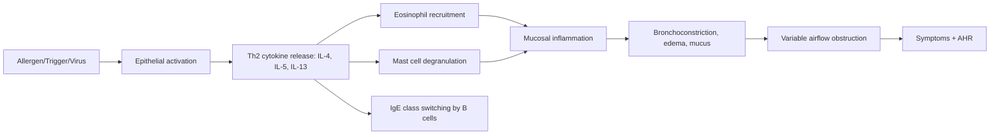
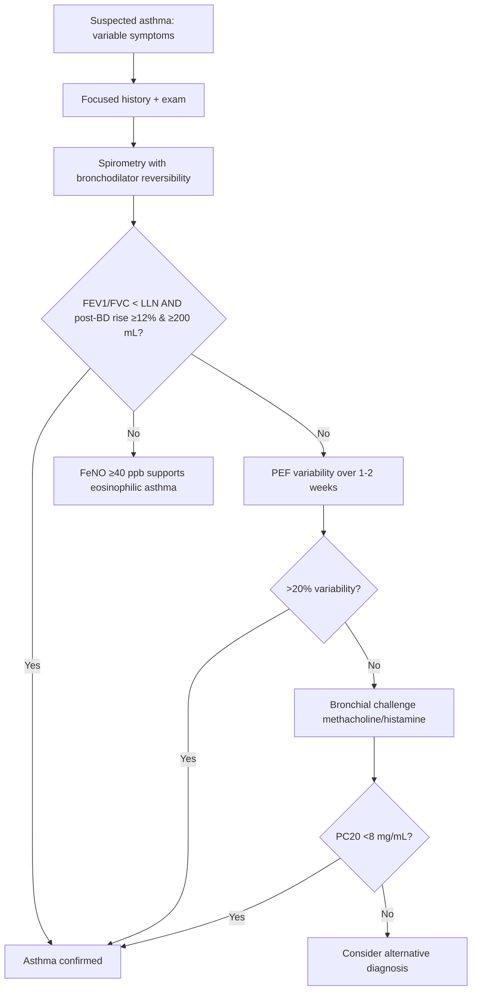

# Asthma

> [!important]
> **Asthma** is a heterogeneous chronic inflammatory airway disease characterised by **variable and reversible expiratory airflow limitation** and **airway hyperresponsiveness**, leading to recurrent wheeze, breathlessness, chest tightness, and cough.

Related: [[COPD]], [[Respiratory Failure]], [[ABG Interpretation]], [[Spirometry Interpretation]], [[Oxygen Therapy and NIV]], [[Chest X-Ray Approach]], [[Airway Diseases/Acute severe asthma|Acute severe asthma]]

> [!tip]
> **FCPS/MRCP pearl**: Asthma = **reversible** airflow obstruction (ΔFEV₁ ≥12% & ≥200 mL post-bronchodilator). Distinguish from **COPD** (less reversible), **ACOS/Asthma-COPD overlap**, and **vocal cord dysfunction** (variable extrathoracic obstruction, normal inspiratory loop).

## 1. Learning Objectives
- Define asthma, classify severity (GINA stepwise), and recognise phenotypes.
- Describe airway anatomy/physiology relevant to bronchospasm, hyperinflation, and gas exchange.
- Apply diagnostic criteria (variable symptoms + reversible obstruction on spirometry + FeNO/peak flow variability).
- Distinguish asthma from COPD, ILD, VCD, hyperventilation, PE, and cardiac wheeze.
- Build a stepwise management plan (GINA Track 1/2, MART, SMART, ICS-formoterol reliever).
- Manage acute severe and life-threatening asthma, identify ICU triggers, and discharge planning.
- Counsel on inhaler technique, trigger avoidance, and personalised action plans.

## 2. Definition

**Asthma (GINA 2024)**: Heterogeneous disease, usually characterised by **chronic airway inflammation**. Defined by:
- **History of respiratory symptoms** (wheeze, shortness of breath, chest tightness, cough) that **vary in intensity and over time**
- **Variable expiratory airflow limitation** (documented by spirometry/PEF)

**Operational adult diagnostic criteria** — both required:
| Criterion | Detail |
|-----------|--------|
| **Variable symptoms** | ≥2 of wheeze, breathlessness, chest tightness, cough; often worse at night/early morning, with triggers, seasonal |
| **Variable airflow limitation** | ≥1 of: (a) FEV₁/FVC < LLN or <0.75–0.80; **AND** (b) positive BD reversibility (ΔFEV₁ ≥12% & ≥200 mL); OR positive bronchial challenge; OR PEF variability >20% over 1–2 weeks |

> [!critical] **Diagnostic trap**: A single normal spirometry does not exclude asthma. Repeat when symptomatic, or perform challenge test.

## 3. Core Anatomy

### Airway tree relevant to asthma
| Level | Components | Asthma relevance |
|-------|-----------|------------------|
| **Trachea & main bronchi** | Cartilage, smooth muscle, ciliated epithelium | Conducting zone; site of large-airway wheeze |
| **Bronchi (medium)** | Smooth muscle, submucosal glands, cartilage plates | Major site of bronchoconstriction; ICS targets inflammation here |
| **Bronchioles (<2 mm)** | No cartilage, smooth muscle, Clara cells | Site of small-airway obstruction; air-trapping on imaging |
| **Alveoli** | Type I/II pneumocytes, capillary network | Gas exchange; relative sparing in asthma (vs emphysema) |

### Key cellular players in airway wall
- **Pseudostratified ciliated columnar epithelium** — goblet cells produce mucus; cilia clear debris
- **Submucosal glands** — seromucinous; hypertrophy in chronic asthma
- **Smooth muscle layer** — wraps from trachea down to terminal bronchioles; hypertrophy/hyperplasia in asthma
- **Subepithelial basement membrane** — thickened by collagen deposition in chronic asthma
- **Mast cells, eosinophils, T-lymphocytes (Th2), dendritic cells** — inflammatory infiltrate; target of biologics

## 4. Core Physiology

### Normal airway dynamics
- **Airway resistance** ∝ 1/r⁴ (Poiseuille) → small bronchioles dominate resistance despite larger cross-section
- **Bronchomotor tone** controlled by autonomic nervous system:
  - **Parasympathetic (vagal, M3)** → bronchoconstriction (blocked by ipratropium)
  - **Sympathetic (β2)** → bronchodilation (target of salbutamol)
  - **NANC** (i-NANC: NO, VIP → dilation; e-NANC: substance P, neurokinins → constriction)
- **Lung volumes in asthma attack**:
  - ↑ RV, ↑ FRC (air-trapping due to dynamic hyperinflation)
  - ↓ FEV₁, ↓ FVC, ↓ FEV₁/FVC
  - **Inspiratory capacity (IC) drops** — useful bedside severity marker

### Asthma pathophysiology

### Gas exchange in acute severe asthma
- **Early/mild**: hyperventilation → ↓PaCO₂, normal/↑PaO₂
- **Moderate**: ↑A-a gradient from V/Q mismatch
- **Severe/life-threatening**: **normal PaCO₂ (36–45 mmHg / 4.7–6.0 kPa) is a RED FLAG** — patient tiring; lactic acidosis develops; precipitous rise in PaCO₂ → respiratory arrest
- **ABG evolution**: resp alkalosis → normal pH/PaCO₂ → resp acidosis (dying patient)

## 5. Classification (GINA 2024)

### GINA stepwise pharmacologic treatment (Track 1, preferred)
| Step | Preferred controller | Preferred reliever |
|------|---------------------|--------------------|
| **1** | Low-dose ICS-formoterol **as needed** (PRN) | Same as controller (ICS-formoterol) |
| **2** | Daily low-dose ICS + **ICS-formoterol PRN** (MART) | ICS-formoterol PRN |
| **3** | Low-dose **ICS-LABA** + **ICS-formoterol PRN** (MART) | ICS-formoterol PRN |
| **4** | Medium-dose **ICS-LABA** + **ICS-formoterol PRN** | ICS-formoterol PRN |
| **5** | High-dose ICS-LABA ± LAMA ± biologics ± oral steroids | ICS-formoterol PRN |

> [!tip] **Track 1 (preferred)** = **ICS-formoterol** as both controller and reliever (MART/SMART). Track 2 (alternative) uses ICS + SABA PRN — still acceptable but SABA monotherapy is now discouraged.

### Phenotype-guided biologic therapy (Step 5)
| Phenotype | Biomarker | Biologic |
|-----------|-----------|----------|
| **Eosinophilic/Th2-high** | Eos ≥300/µL, FeNO ≥50 ppb | Anti-IL5 (mepolizumab, reslizumab), anti-IL5R (benralizumab), anti-IL4Rα (dupilumab), anti-IgE (omalizumab) |
| **Allergic** | Specific IgE, skin test + | Omalizumab |
| **Non-Type 2** | Eos <150, neutrophilic | Macrolides (trial), thermoplasty (rare) |

## 6. Etiology / Causes

### Triggers
- **Allergens** — house-dust mite, pollen, mould, animal dander, cockroach
- **Infections** — rhinovirus, influenza, RSV, Mycoplasma
- **Occupational** — flour, isocyanates, latex, wood dust, chemicals (see [[Airway Diseases/Occupational asthma|Occupational asthma]])
- **Drugs** — NSAIDs (COX-1 inhibition → leukotriene surge), β-blockers (block bronchodilation), aspirin
- **Exercise** — especially cold/dry air
- **Emotion, cold air, GERD, post-nasal drip**
- **Irritants** — smoke, pollution, diesel particulates, sulphur dioxide

### Risk factors
- **Atopy** (eczema, allergic rhinitis, food allergy)
- **Family history** of atopy/asthma
- **Obesity**
- **Maternal smoking/environmental tobacco exposure** (in utero & postnatal)
- **Premature birth, low birth weight**
- **Occupational sensitiser exposure**

## 7. Pathophysiology

### Chronic inflammatory changes
- **Eosinophilic infiltration** (Type 2-high); neutrophilic in severe/non-Type 2
- **Mast cell, basophil, Th2 lymphocyte** activation
- **Goblet cell hyperplasia** → mucus hypersecretion
- **Sub-basement membrane collagen deposition** → "thickened BM" on biopsy
- **Smooth muscle hypertrophy/hyperplasia** → AHR
- **Airway wall oedema**

### Acute bronchoconstriction
1. Allergen cross-links IgE on mast cell → degranulation → histamine, tryptase, leukotrienes (LTC4, D4, E4), prostaglandin D2
2. Smooth muscle contraction (early response, 15–30 min)
3. **Late-phase response** (4–8 h): recruited eosinophils, Th2 cells → sustained inflammation/bronchoconstriction

### Airway hyperresponsiveness (AHR)
- **Exaggerated bronchoconstrictor response** to non-specific stimuli (methacholine, histamine, cold air)
- 10-100× more sensitive than non-asthmatics
- Improves with ICS, persists even when symptoms controlled

## 8. Clinical Features

### Classic triad (variable)
- **Wheeze** (high-pitched, expiratory, polyphonic)
- **Breathlessness**
- **Chest tightness** ("band around chest")
- ± **Cough** (often nocturnal, may be productive of clear/white sputum)

### Pattern clues
- **Nocturnal cough/wheeze** (2–4 am dip)
- **Seasonal** (allergic)
- **Trigger-related** (exercise, cold, workplace)
- **Diurnal PEF variability >20%** — diagnostic

### Severity of chronic asthma (GINA 2024)
- **Intermittent**: symptoms <2 days/week, nocturnal ≤2/month, normal FEV₁ between attacks
- **Mild persistent**: >2 days/week but not daily, nocturnal 3–4/month, FEV₁ ≥80%
- **Moderate persistent**: daily, nocturnal >1/week, FEV₁ 60–80%
- **Severe persistent**: throughout day, frequent nocturnal, FEV₁ <60%

### Severity of acute asthma — see [[Airway Diseases/Acute severe asthma|Acute severe asthma]]

## 9. Approach / Algorithm

### Diagnostic algorithm

### Differential diagnosis (FCPS/MRCP pearl: not all wheeze is asthma)
| Condition | Distinguishing feature |
|-----------|------------------------|
| **COPD** | Smoking history, less reversible, age >40, fixed obstruction |
| **ACOS/Asthma-COPD overlap** | Mixed features; major overlap syndrome |
| **Vocal cord dysfunction (VCD)** | Variable extrathoracic obstruction; flattening of *inspiratory* loop; normal flow-volume loop outside attack |
| **Bronchiectasis** | Daily purulent sputum, crackles, CT shows airway dilatation |
| **Heart failure ("cardiac asthma")** | Bilateral basal crackles, S3, raised BNP, no BD reversibility |
| **Pulmonary embolism** | Pleuritic pain, hypoxia, A-a gradient, normal spirometry |
| **Bronchiolitis/BO** | Post-infectious, fixed obstruction, mosaic attenuation on CT |
| **Endobronchial tumour** | Focal monophonic wheeze, weight loss, smoking |
| **Anaphylaxis** | Urticaria, angioedema, hypotension, stridor |
| **Panic/hyperventilation** | Normal SpO₂, no airflow obstruction |

## 10. Investigations

*[Content truncated for rendering — see asthma.md for full content]*
