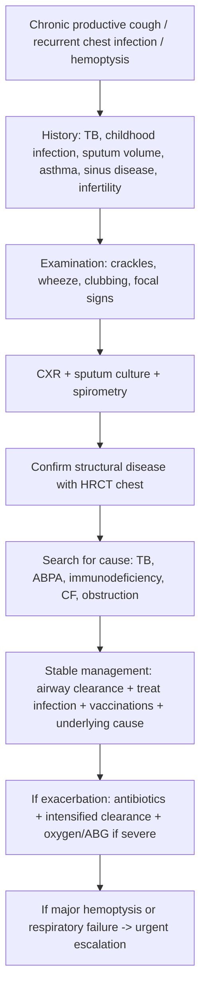
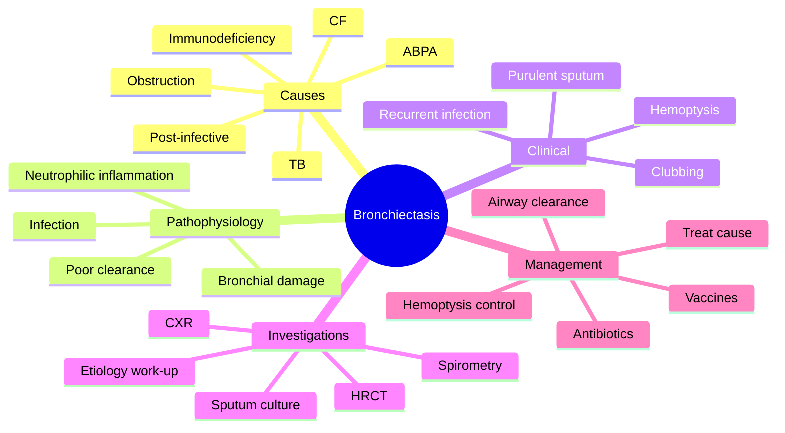
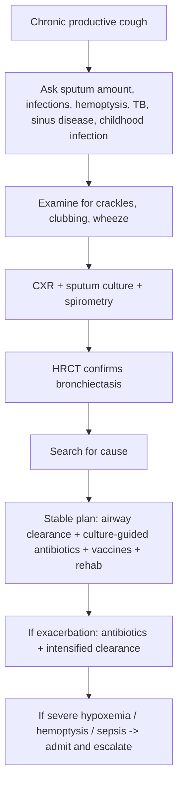

# Bronchiectasis

> [!important]
> **Bronchiectasis** is a chronic suppurative airway disease characterized by **abnormal, permanent dilatation of bronchi**, associated with **chronic cough, daily sputum production, recurrent infection, and progressive airway damage**.

Related: [[Pneumonia]], [[COPD]], [[Asthma]], [[Hemoptysis]], [[Respiratory Failure]], [[Tuberculosis]], [[ABG Interpretation]]

> [!tip]
> In FCPS/MRCP, bronchiectasis is commonly tested through **chronic productive cough, recurrent infective exacerbations, hemoptysis, HRCT diagnosis, etiological work-up, sputum microbiology, airway-clearance therapy, and differentiation from COPD, TB, lung abscess, and cystic fibrosis**.

## Learning Objectives
- Define bronchiectasis and distinguish it from other chronic sputum-producing respiratory disorders.
- Understand the bronchial anatomy and mucociliary physiology relevant to secretion clearance and chronic infection.
- Explain the “vicious cycle” of infection, inflammation, impaired clearance, and structural destruction.
- Apply a stepwise approach to diagnosis, etiological work-up, and severity assessment.
- Manage stable disease, infective exacerbations, hemoptysis, and complications in an exam-oriented way.
- Recognize key etiologies including post-infective disease, TB, immunodeficiency, ABPA, and cystic fibrosis.

## Definition
Bronchiectasis is:
- **Permanent abnormal dilatation of bronchi**
- Usually associated with:
  - chronic airway inflammation
  - repeated infection
  - impaired mucus clearance
  - chronic purulent sputum production

### Essential concept
Bronchiectasis is **not merely a radiologic finding**. It is a **clinical-radiological syndrome** where structural bronchial damage leads to chronic infection and recurrent exacerbations.

### Pathologic forms
- **Cylindrical (tubular)**
- **Varicose**
- **Cystic (saccular)**

## Core Anatomy
### 1. Tracheobronchial tree
From Gray’s + Davidson perspective:
- Trachea divides into right and left main bronchi.
- Bronchi divide into lobar and segmental bronchi, then smaller bronchi and bronchioles.
- Bronchial walls contain:
  - mucosa and ciliated epithelium
  - submucosal glands
  - smooth muscle
  - cartilage in larger bronchi

### 2. Segmental anatomy relevance
Bronchiectasis often has lobar/segmental predilection:
- **Lower lobes** commonly affected in post-infective disease.
- **Upper lobe disease** may suggest previous TB or cystic fibrosis.
- **Central bronchiectasis** is classically associated with **ABPA**.
- Localized disease suggests obstruction, foreign body, tumor, or focal post-infective scarring.

### 3. Mucociliary apparatus
Normal airway defense depends on:
- intact ciliated epithelium
- appropriate mucus viscosity
- coordinated ciliary movement
- cough reflex
- patent airways

When this system fails, secretions stagnate and infection persists.

### 4. Bronchial arterial supply
- Bronchial arteries are part of systemic circulation.
- Hypertrophied bronchial arteries contribute to **hemoptysis**, sometimes massive.

### 5. Pleural and surrounding parenchymal relationships
- Recurrent infection can extend to surrounding parenchyma.
- Fibrosis, atelectasis, pleural thickening, and volume loss may coexist.

> [!important]
> Bronchiectasis is fundamentally a disease of **damaged bronchi + impaired clearance + recurrent infection**.

## Core Physiology
### 1. Normal physiology relevant to bronchiectasis
The lungs maintain sterility via:
- mucociliary clearance
- cough mechanism
- local immune defense
- adequate ventilation of distal lung units

### 2. Pathophysiologic physiology in bronchiectasis
#### A. Impaired mucus clearance
When bronchi are dilated and inflamed:
- mucus pools within abnormal airways
- ciliary function is ineffective
- cough becomes chronic but insufficient
- bacterial colonization persists

#### B. Recurrent infection and neutrophilic inflammation
Persistent infection produces:
- neutrophil-dominant inflammation
- protease-mediated wall damage
- further bronchial dilation
- more secretions and more infection

#### C. Ventilation abnormalities
- mucus plugging causes regional hypoventilation
- airway wall thickening and collapse produce airflow obstruction
- some patients develop mixed obstructive-restrictive defects

#### D. Gas exchange abnormalities
- V/Q mismatch causes hypoxemia in advanced disease or severe exacerbation
- respiratory failure may develop in extensive bilateral disease

#### E. Hemoptysis mechanism
- chronic inflammation enlarges bronchial arteries
- fragile hypertrophied vessels may bleed

### 3. Clinical physiology pearl
Daily purulent sputum reflects ongoing **suppurative airway inflammation**, not just “chronic cough.” This is why sputum microbiology and airway clearance are central to management.

## Normal Values / Important Cut-offs
### Sputum / symptoms
- Daily mucopurulent or purulent sputum is highly suggestive clinically.
- Frequent exacerbator pattern: often considered **≥3 exacerbations/year** in severe disease contexts.

### Oxygenation / ABG
- pH: **7.35–7.45**
- PaO2: **80–100 mmHg**
- PaCO2: **35–45 mmHg**
- HCO3-: **22–26 mmol/L**
- In significant hypoxemia or respiratory failure, assess ABG.

### Spirometry
No single spirometric value diagnoses bronchiectasis, but patterns may show:
- obstruction
- mixed defect
- sometimes normal spirometry early on

### HRCT radiologic clues
Important classic signs:
- bronchial diameter greater than accompanying pulmonary artery (**signet ring sign**)
- lack of normal bronchial tapering
- visible bronchi within 1 cm of pleural surface

### Severity clues
Severe disease is suggested by:
- frequent exacerbations
- chronic colonization with **Pseudomonas aeruginosa**
- extensive bilateral disease on CT
- significant hemoptysis
- low BMI
- declining lung function
- prior hospital admissions

## Classification
## 1. Morphologic classification
| Type | Description | Clinical implication |
|---|---|---|
| Cylindrical | Uniform tubular dilatation | Often milder/earlier |
| Varicose | Irregular beaded contour | Intermediate severity |
| Cystic / saccular | Ballooned cystic bronchi | Advanced disease, severe sputum, infection risk |

## 2. By anatomical distribution
- localized / focal
- multilobar
- bilateral diffuse
- central
- upper lobe predominant
- lower lobe predominant

## 3. By etiology
- post-infective
- post-tuberculous
- cystic fibrosis-related
- immunodeficiency-related
- ABPA-related
- ciliary dysfunction-related
- traction bronchiectasis secondary to fibrosis
- obstructive lesion-related
- idiopathic

## 4. By microbiology
- non-colonized
- intermittently infected
- chronically colonized (especially **Pseudomonas**)

## Etiology / Causes
### Common causes
- Severe childhood pneumonia
- Recurrent lower respiratory tract infections
- Tuberculosis / post-TB scarring
- Measles, pertussis (classically tested)
- Obstructing lesion: foreign body, tumor, stenosis
- Cystic fibrosis
- Primary ciliary dyskinesia / Kartagener syndrome
- Immunodeficiency (e.g. hypogammaglobulinemia)
- ABPA
- Rheumatoid arthritis and other systemic inflammatory disorders
- Aspiration / reflux-related recurrent infection

### Post-infective pattern
One of the commonest exam causes. History may reveal:
- severe childhood pneumonia
- recurrent infections
- previous TB

### Cystic fibrosis clues
- younger age
- recurrent infections
- malabsorption
- nasal polyps
- infertility in males

### ABPA clues
- asthma history
- eosinophilia
- central bronchiectasis
- elevated IgE

## Risk Factors
- Prior severe lung infection
- Pulmonary TB history
- Recurrent aspiration
- Poor socioeconomic conditions / recurrent untreated infections
- Immunodeficiency
- Cystic fibrosis / ciliary dysfunction
- Longstanding asthma with ABPA
- Airway obstruction by foreign body or mass

## Pathophysiology
### The classic vicious cycle
1. Initial insult to airway defense
2. Impaired mucus clearance
3. Persistent microbial colonization/infection
4. Neutrophilic inflammation
5. Enzymatic destruction of bronchial wall
6. Bronchial dilatation
7. More secretion retention and recurrent infection

### Pathologic changes
- loss of normal bronchial wall architecture
- destruction of elastic and muscular components
- chronic mucosal edema
- ulceration
- pus within airways
- surrounding fibrosis in longstanding disease

### Consequences
- chronic productive cough
- recurrent fever/exacerbation
- hemoptysis
- airflow limitation
- hypoxemia in advanced disease
- respiratory failure and cor pulmonale in severe bilateral disease

## Clinical Features
### Symptoms
- Chronic cough
- **Large-volume daily sputum**, often purulent and worse in the morning
- Recurrent febrile chest infections
- Dyspnea
- Wheeze
- Hemoptysis
- Pleuritic chest pain during infective episodes
- Fatigue and weight loss in chronic severe disease

### Sputum clues
- copious sputum suggests established disease
- foul-smelling sputum suggests anaerobic infection
- three-layer sputum in standing jar is a classical exam point

### Examination findings
- coarse crackles, usually basal
- rhonchi / wheeze
- clubbing in chronic suppurative disease
- halitosis may be present
- signs of consolidation during exacerbation
- cyanosis in advanced disease
- features of cor pulmonale in advanced chronic hypoxic disease

### Red-flag symptoms
- major hemoptysis
- weight loss with focal disease → exclude malignancy / TB
- severe breathlessness with hypoxemia

## Approach / Algorithm

### Bedside diagnostic approach
1. Suspect bronchiectasis in a patient with **chronic purulent sputum** and recurrent chest infection.
2. Ask about:
   - childhood pneumonia
   - TB
   - asthma/ABPA
   - sinus disease/otitis
   - infertility and ciliary dysfunction clues
   - weight loss/hemoptysis
3. Examine for crackles, clubbing, wheeze, cyanosis.
4. Do basic tests: CXR, sputum microbiology, spirometry.
5. Confirm with **HRCT chest**.
6. Search actively for underlying etiology.
7. Plan long-term airway clearance + infection prevention.

## Investigations
### 1. HRCT chest — key diagnostic investigation
This is the best test to confirm bronchiectasis.
Typical findings:
- signet ring sign
- lack of bronchial tapering
- bronchi visible close to pleural surface
- cystic spaces / clustered dilated bronchi
- mucus plugging
- associated fibrosis or collapse

### 2. Chest X-ray
May show:
- tram-track opacities
- ring shadows
- cystic spaces
- volume loss
- crowding of markings
But CXR may miss mild disease.

### 3. Sputum microscopy, culture, and sensitivity
Essential to identify:
- common bacteria
- chronic colonization
- Pseudomonas aeruginosa
- resistant organisms
- mycobacterial infection if suspected

### 4. Full blood count / inflammatory markers
- leukocytosis in infection
- anemia of chronic disease or blood loss
- eosinophilia if ABPA suspected

### 5. Immunological work-up
Depending on case:
- serum immunoglobulins
- total IgE
- Aspergillus-specific tests
- eosinophil count

### 6. Microbiology for specific causes
- AFB smear/culture or molecular tests if TB suspected
- fungal studies where relevant
- sputum for nontuberculous mycobacteria if clinically indicated

### 7. Spirometry
May show:
- obstructive pattern
- mixed ventilatory defect
- reduced FEV1 in advanced disease
Used for baseline and follow-up.

### 8. Bronchoscopy
Indications:
- localized disease
- suspected obstruction / tumor / foreign body
- unexplained hemoptysis
- failure to identify cause

### 9. Tests for special etiologies
- sweat chloride / CF testing
- ciliary function studies
- autoimmune screen when appropriate
- alpha-1 antitrypsin only if overlap reasons exist

### 10. Gas exchange assessment
- pulse oximetry
- ABG if severe disease, cyanosis, drowsiness, or respiratory failure suspected

## Interpretation Frameworks
### 1. HRCT interpretation framework
Think bronchiectasis if CT shows:
- bronchial dilation greater than adjacent artery
- no normal tapering
- visible peripheral bronchi
- mucus plugging / tree-in-bud / cystic change
Then ask:
- focal or diffuse?
- upper, lower, or central distribution?
- any mass or obstruction?
- associated fibrosis or cavitation?

### 2. Etiology-by-distribution clues
- **Central bronchiectasis** → think **ABPA**
- **Upper lobe predominant** → think **CF** or **post-TB**
- **Localized focal disease** → think **obstruction** or prior localized infection
- **Diffuse bilateral disease** → think immunodeficiency, ciliary disease, post-infective, CF

### 3. Sputum interpretation
- Purulent sputum = active suppurative inflammation
- Repeated growth of **Pseudomonas** = more severe disease / worse prognosis
- Persistent negative cultures do not exclude disease if CT is typical

### 4. ABG interpretation in severe disease
- hypoxemia indicates advanced disease/exacerbation
- hypercapnia suggests ventilatory failure in severe extensive disease
- acute respiratory acidosis indicates urgent escalation

## Diagnosis
Diagnosis of bronchiectasis requires:
- suggestive clinical history (chronic productive cough, recurrent infections, hemoptysis)
- compatible imaging, especially **HRCT confirmation**
- exclusion/identification of underlying cause where possible

### Sample diagnostic statement
“Non-CF bronchiectasis, bilateral lower-lobe predominant disease, chronically colonized with Pseudomonas, currently presenting with infective exacerbation and mild hypoxemia.”

## Differential Diagnosis
| Differential | Clues favoring it over bronchiectasis |
|---|---|
| [[COPD]] | Smoking history, less copious sputum, emphysema / persistent airflow obstruction without HRCT bronchial dilatation |
| [[Asthma]] | Episodic wheeze, atopy, reversibility, usually not chronic purulent sputum |
| Tuberculosis | constitutional symptoms, TB contact/history, cavitation, upper-lobe destructive disease |
| Lung abscess | systemic sepsis, localized cavity with air-fluid level |
| Chronic bronchitis | chronic cough/sputum but no permanent bronchial dilatation on CT |
| Lung cancer | localized obstruction, hemoptysis, weight loss, focal collapse |
| Interstitial lung disease with traction bronchiectasis | fibrosis dominant, restrictive pattern, fine crackles |
| Chronic aspiration | swallow disorder, recurrent dependent-lobe infection |

## Tables / Comparison Charts
### Bronchiectasis vs COPD vs Asthma
| Feature | Bronchiectasis | COPD | Asthma |
|---|---|---|---|
| Sputum | Copious, purulent, chronic | Variable, often modest | Usually scant unless severe |
| Infections | Recurrent, prominent | Exacerbations occur | Often trigger-related rather than chronic suppuration |
| Imaging hallmark | HRCT bronchial dilatation | Hyperinflation/emphysema | Often normal between attacks |
| Hemoptysis | Common | Less prominent | Uncommon |
| Clubbing | May occur | Uncommon | Rare |
| Main pathology | Dilated infected bronchi | Airway disease + emphysema | Reversible airway inflammation |

### Etiology clues table
| Clue | Likely cause |
|---|---|
| Central bronchiectasis + asthma + eosinophilia | ABPA |
| Young patient + sinusitis + infertility | Primary ciliary dyskinesia |
| Upper lobe disease + malabsorption | Cystic fibrosis |
| Focal disease | Obstruction / foreign body / tumor |
| Previous TB | Post-tuberculous bronchiectasis |
| Recurrent infections + low immunoglobulins | Immunodeficiency |

### Common organisms
| Organism | Significance |
|---|---|
| Haemophilus influenzae | Common pathogen |
| Pseudomonas aeruginosa | Severe disease, worse prognosis |
| Streptococcus pneumoniae | Infective exacerbations |
| Moraxella catarrhalis | Recurrent exacerbation organism |
| Staphylococcus aureus | More relevant in some CF and post-viral states |

## Management
## A. Goals
- reduce sputum retention
- reduce infective exacerbations
- improve quality of life and exercise tolerance
- treat underlying cause
- prevent progression and complications

## B. Stable bronchiectasis management
### 1. Airway clearance therapy
Cornerstone of treatment.
Includes:
- chest physiotherapy
- postural drainage
- active cycle of breathing techniques
- oscillatory PEP devices where available

### 2. Hydration and secretion mobilization
- adequate hydration
- nebulized saline in selected patients
- mucolytic strategies depending on setting and tolerance

### 3. Treat underlying cause
- treat ABPA if present
- immunoglobulin replacement if relevant immunodeficiency
- remove obstructive lesion/foreign body
- manage aspiration risk
- CF-specific management when applicable

### 4. Antibiotic strategy
- treat culture-guided infection
- some patients with frequent exacerbations benefit from long-term suppressive strategies, especially specialist-directed macrolide or inhaled antibiotic approaches in selected cases

### 5. Vaccination and prevention
- annual influenza vaccine
- pneumococcal vaccination
- smoking cessation if smoker
- pulmonary rehabilitation when limited by breathlessness

### 6. Bronchodilators
May help if:
- coexistent asthma
- airflow obstruction
- wheeze or bronchospasm

### 7. Nutrition and general care
- optimize BMI and nutrition
- address fatigue and deconditioning
- manage sinus disease and upper airway issues if linked

## C. Exacerbation management
### Definition
Worsening cough, sputum volume, sputum purulence, breathlessness, malaise, or hemoptysis requiring change in treatment.

### Typical treatment
1. Send sputum for culture if possible.
2. Start **antibiotics**, ideally guided by previous culture patterns.
3. Intensify airway clearance.
4. Give bronchodilators if bronchospasm/wheeze.
5. Assess oxygen saturation and ABG if severe.
6. Look for pneumonia, pleural complication, major hemoptysis, or respiratory failure.

### Antibiotic principles
- use likely organism / prior culture guidance
- longer courses are often needed than in simple bronchitis
- Pseudomonas requires specific coverage

### Admission indications
- hypoxemia
- inability to clear secretions
- severe systemic illness
- significant hemoptysis
- social inability to cope
- respiratory failure or sepsis

## D. Hemoptysis management
- stabilize airway, breathing, circulation
- quantify severity
- correct hypoxemia
- stop anticoagulants if clinically appropriate after risk assessment
- localize source if possible
- urgent specialist input
- **bronchial artery embolization** is important for significant/recurrent bleeding

## E. Surgery
Reserved for selected cases:
- localized disease with severe symptoms despite optimal medical therapy
- recurrent major hemoptysis
- localized destroyed lobe with ongoing sepsis

## Drug Interactions / Contraindications / Comorbidity Cautions
### Macrolide cautions
- QT prolongation
- drug interactions
- hepatotoxicity
- resistance concerns
- exclude active nontuberculous mycobacterial infection before prolonged use when relevant

### Aminoglycoside / inhaled antibiotic cautions
- nephrotoxicity / ototoxicity for systemic aminoglycosides
- bronchospasm with inhaled agents in some patients

### Steroid cautions
- systemic steroids are not routine for all bronchiectasis
- consider mainly if ABPA, asthma overlap, or another specific indication exists

### Anticoagulation caution
- hemoptysis complicates anticoagulant decisions and needs individualized review

### Comorbidity cautions
- COPD/asthma overlap may confuse symptom pattern
- previous TB may coexist with structural destruction and recurrent infection
- chronic sinus disease often coexists in ciliary disorders

## Procedures / Indications / Contraindications
### Important procedures
- sputum collection and microbiology
- chest physiotherapy/postural drainage
- bronchoscopy
- bronchial artery embolization
- surgery in selected localized disease

## Procedure Mini-Sections
### 1. Postural drainage / airway clearance session
- **Indications:** chronic sputum retention, daily clearance need, exacerbation support
- **Contraindications/cautions:** massive hemoptysis, severe instability, intolerance of positions
- **Complications:** fatigue, desaturation, reflux, poor adherence
- **Viva pearl:** Airway clearance is a core long-term treatment, not an optional extra.

### 2. Bronchoscopy
- **Indications:** focal disease, obstruction suspicion, unexplained bleeding, diagnostic uncertainty
- **Contraindications/cautions:** severe hypoxemia without support, hemodynamic instability
- **Complications:** bleeding, hypoxemia, bronchospasm
- **Viva pearl:** Bronchoscopy is especially important when bronchiectasis appears localized and an obstructing lesion must be excluded.

### 3. Bronchial artery embolization
- **Indications:** significant or recurrent hemoptysis
- **Contraindications/cautions:** depends on stability and vascular anatomy assessment
- **Complications:** recurrence, chest pain, non-target embolization (rare serious neurologic risk)
- **Viva pearl:** Massive hemoptysis in bronchiectasis is usually from the bronchial circulation, not pulmonary arteries.

## Complications
- recurrent infective exacerbations
- chronic colonization with resistant organisms
- hemoptysis / massive hemoptysis
- lung abscess
- respiratory failure
- pulmonary hypertension and cor pulmonale in advanced disease
- weight loss and poor quality of life
- pleural infection rarely
- amyloidosis in longstanding severe suppurative disease (classic exam association)

## Red Flags / Emergencies
- major or massive hemoptysis
- hypoxemia / cyanosis
- sepsis with severe pneumonia-like exacerbation
- drowsiness / CO2 retention in advanced disease
- rapidly increasing breathlessness
- unilateral/focal symptoms with weight loss → exclude cancer or obstruction
- TB red flags: fever, weight loss, night sweats, upper-lobe disease

## Prognosis
Depends on:
- extent of disease
- frequency of exacerbations
- underlying cause
- presence of Pseudomonas colonization
- lung function decline
- nutritional status
- adherence to airway clearance and follow-up

Poor prognostic indicators:
- chronic Pseudomonas colonization
- frequent hospitalizations
- extensive bilateral disease
- recurrent major hemoptysis
- respiratory failure

## Topic Correlation
- [[Pneumonia]]: recurrent pneumonia may cause or complicate bronchiectasis.
- [[Tuberculosis]]: important cause of post-infective upper-lobe bronchiectasis.
- [[Hemoptysis]]: bronchiectasis is a classic cause.
- [[COPD]] and [[Asthma]]: may mimic or coexist.
- [[Respiratory Failure]]: advanced bilateral disease can progress to chronic respiratory failure.
- [[ABG Interpretation]]: useful during severe exacerbations and respiratory compromise.

## Special Situations
### 1. Post-tuberculous bronchiectasis
Think of upper-lobe destructive disease, chronic sputum, hemoptysis, and prior TB history.

### 2. Cystic fibrosis-related disease
Usually more severe, earlier onset, with recurrent infection and systemic manifestations.

### 3. ABPA-associated bronchiectasis
Treat the allergic/inflammatory driver as well as infection burden.

### 4. Elderly patients
- frailty
- poor sputum clearance
- polypharmacy
- aspiration risk
- delayed recognition of severe infection

### 5. Pregnancy
Management principles remain airway clearance, infection control, oxygenation, and multidisciplinary review if disease is significant.

### 6. Immunodeficiency
Always think of an underlying cause if recurrent infections are disproportionate or long-standing.

## FCPS/MRCP High-Yield Points
- **HRCT chest** is the key investigation to confirm bronchiectasis.
- Classical symptoms: **chronic cough + large-volume purulent sputum + recurrent infections**.
- **Hemoptysis** is a common and important complication.
- **Pseudomonas colonization** indicates more severe disease and worse prognosis.
- **Central bronchiectasis** suggests **ABPA**.
- **Upper-lobe disease** suggests **TB** or **cystic fibrosis**.
- Airway clearance physiotherapy is a **cornerstone** of management.
- Always search for a cause: post-infective, TB, obstruction, ABPA, CF, immunodeficiency.

## Common Viva Questions
1. Define bronchiectasis.
2. What is the best investigation to confirm bronchiectasis?
3. What are the common causes of bronchiectasis?
4. What is the pathophysiologic vicious cycle in bronchiectasis?
5. What organisms commonly colonize bronchiectatic airways?
6. Why does bronchiectasis cause hemoptysis?
7. What CT features suggest bronchiectasis?
8. How is stable bronchiectasis managed?
9. When would you consider bronchoscopy?
10. What are the clues to ABPA-associated bronchiectasis?

## Common Confusions / Exam Traps
- **Trap:** Diagnosing bronchiectasis clinically without confirming on HRCT.  
  **Correction:** HRCT is the key confirmatory test.
- **Trap:** Treating every chronic cough with inhalers alone.  
  **Correction:** Copious purulent sputum and recurrent infections should trigger bronchiectasis work-up.
- **Trap:** Forgetting etiological search once CT confirms disease.  
  **Correction:** Always look for TB, ABPA, immunodeficiency, CF, obstruction, and aspiration.
- **Trap:** Ignoring airway clearance and relying only on antibiotics.  
  **Correction:** Physiotherapy is fundamental long-term management.
- **Trap:** Missing malignancy in focal bronchiectasis with weight loss/hemoptysis.

## Mnemonics
### Causes mnemonic: **I CANNOT CLEAR**
- **I**mmunodeficiency
- **C**ystic fibrosis
- **A**BPA
- **N**eoplasm / obstruction
- **N**ecrotizing infection
- **O**bstructing foreign body
- **T**uberculosis
- **C**iliary dyskinesia
- **L**ung infection recurrent
- **E**xposure to aspiration
- **A**utoimmune disease
- **R**eflux / recurrent aspiration

### Core management memory aid: **CLEAR**
- **C**ulture sputum
- **L**iquefy/loosen secretions + lung physiotherapy
- **E**radicate/treat infection
- **A**ddress underlying cause
- **R**ehab + vaccines + review

## Mind Map

## Flowchart

## Suggested Visuals / Image Notes
- HRCT image showing **signet ring sign**.
- Comparison of cylindrical, varicose, and cystic bronchiectasis.
- Diagram of mucociliary dysfunction leading to secretion retention.
- Bronchial artery hypertrophy and hemoptysis concept diagram.
- Etiology-by-distribution CT map: central vs upper-lobe vs focal disease.

## Suggested Video References
- “Bronchiectasis HRCT explained”
- “Airway clearance physiotherapy in bronchiectasis”
- “ABPA and central bronchiectasis”
- “Hemoptysis approach and bronchial artery embolization”

## One-Page Revision Summary
- Bronchiectasis = **permanent bronchial dilatation** with chronic infection and impaired mucus clearance.
- Typical symptoms: **daily purulent sputum, recurrent chest infections, hemoptysis**.
- Best confirmatory test = **HRCT chest**.
- Classic CT signs: **signet ring sign**, lack of tapering, peripheral visible bronchi.
- Common causes: **post-infective, post-TB, ABPA, CF, immunodeficiency, obstruction**.
- Central disease suggests **ABPA**; upper-lobe disease suggests **TB/CF**.
- Stable management: **airway clearance + sputum-guided antibiotics + treat underlying cause + vaccines + rehab**.
- Pseudomonas colonization = more severe disease / worse prognosis.
- Massive hemoptysis may need **bronchial artery embolization**.

## 24-Hour Recall Prompts
- Define bronchiectasis without looking.
- List five causes of bronchiectasis from memory.
- Write the three classic HRCT features.
- State why hemoptysis occurs in bronchiectasis.
- Compare bronchiectasis with COPD in 4 points.
- What etiologies are suggested by central, upper-lobe, and focal disease?
- Outline stable management in 1 minute.

## 7-Day / 15-Day / 30-Day Revision Tracker
- [ ] Day 1 completed
- [ ] 24-hour recall completed
- [ ] Day 7 revision completed
- [ ] Day 15 revision completed
- [ ] Day 30 revision completed
- [ ] Redraw the bronchiectasis algorithm from memory
- [ ] Re-answer MCQs/SBAs after 1 week

## Must Know / Should Know / Nice to Know
### Must Know
- Definition and HRCT diagnosis
- Causes: post-infective, TB, ABPA, CF, immunodeficiency, obstruction
- Chronic purulent sputum + recurrent infection + hemoptysis pattern
- Airway clearance as a cornerstone of treatment
- Pseudomonas significance

### Should Know
- Morphologic types: cylindrical, varicose, cystic
- Etiology-by-distribution clues
- Bronchoscopy indications
- Bronchial artery embolization role in hemoptysis

### Nice to Know
- advanced severity scores used in specialist practice
- detailed long-term inhaled antibiotic strategies
- amyloidosis as a rare long-term complication

## My Weak Points
- [ ] I can state the HRCT diagnostic signs confidently.
- [ ] I can list the main etiologies without missing ABPA and immunodeficiency.
- [ ] I can explain why airway clearance is central, not optional.
- [ ] I can outline hemoptysis management in bronchiectasis.

## Self-Test Scorecard
- Understanding: /10
- Recall: /10
- MCQ Performance: /10
- SBA Performance: /10
- Viva Confidence: /10
- Total: /50

> [!tip]
> Interpretation: **<35 = weak topic**, **35–44 = acceptable but insecure**, **45+ = strong exam-ready topic**.

## Exam Answer Modes
### Long Answer Skeleton
- Definition
- Etiology
- Pathophysiology (vicious cycle)
- Clinical features
- Investigations with HRCT and etiological work-up
- Management of stable disease and exacerbations
- Complications and prognosis

### Short Note Skeleton
- Bronchiectasis is permanent abnormal dilatation of bronchi due to chronic infection/inflammation.
- Presents with chronic purulent sputum, recurrent infections, hemoptysis.
- Diagnose by HRCT.
- Manage with airway clearance, antibiotics, treatment of cause, and prevention.

### Viva One-Liners
- “HRCT chest is the investigation of choice.”
- “Central bronchiectasis suggests ABPA.”
- “Pseudomonas colonization is a marker of more severe disease.”
- “Airway clearance therapy is a core treatment.”

### Ward-Case Discussion Points
- quantify sputum burden and infective exacerbation frequency
- ask about TB, childhood infection, sinus disease, asthma, infertility, aspiration
- review previous sputum cultures and antibiotic exposure
- assess hemoptysis severity
- ensure physiotherapy plan and etiological work-up are documented

### Last-Night-Before-Exam Sheet
- HRCT confirms bronchiectasis
- Daily purulent sputum + recurrent infection + hemoptysis = classic triad
- Central = ABPA; upper lobe = TB/CF; focal = obstruction
- Pseudomonas = worse prognosis
- Treatment = airway clearance + antibiotics + treat cause
- Major hemoptysis -> consider bronchial artery embolization

## Summary
Bronchiectasis is a chronic suppurative airway disease marked by **permanent bronchial dilatation**, persistent infection, and impaired mucus clearance. It classically presents with **daily purulent sputum, recurrent infective exacerbations, crackles, and hemoptysis**. **HRCT chest** is the key confirmatory investigation, but good clinical care also requires an active search for underlying etiology such as **post-infective disease, TB, ABPA, cystic fibrosis, immunodeficiency, or obstruction**. Long-term management is built on **airway clearance, culture-guided antibiotics, prevention of exacerbations, and treatment of the underlying cause**, while urgent escalation is needed for **major hemoptysis, sepsis, or respiratory failure**.

## MCQs (10)
1. The investigation of choice to confirm bronchiectasis is:
   - A. Chest X-ray
   - B. HRCT chest
   - C. Peak expiratory flow
   - D. Pleural ultrasound

2. A classical clinical feature of bronchiectasis is:
   - A. Sudden isolated chest pain
   - B. Daily purulent sputum production
   - C. Dry cough only
   - D. Pure restrictive chest tightness

3. Central bronchiectasis most strongly suggests:
   - A. COPD
   - B. ABPA
   - C. Pulmonary embolism
   - D. Mitral stenosis

4. Which organism is associated with more severe disease and worse prognosis in bronchiectasis?
   - A. Pseudomonas aeruginosa
   - B. Streptococcus pyogenes
   - C. Candida albicans
   - D. Enterococcus faecalis

5. A common cause of major hemoptysis in bronchiectasis is bleeding from:
   - A. Pulmonary veins
   - B. Bronchial arteries
   - C. Left atrium
   - D. Pulmonary lymphatics

6. Which of the following is a cornerstone of long-term management?
   - A. Bed rest alone
   - B. Airway clearance physiotherapy
   - C. Routine systemic steroids for all
   - D. Antitubercular therapy for all cases

7. Upper-lobe predominant bronchiectasis should especially raise suspicion for:
   - A. TB or cystic fibrosis
   - B. Pulmonary edema
   - C. Sarcoid stage I only
   - D. Tension pneumothorax

8. Focal localized bronchiectasis should prompt evaluation for:
   - A. Obstructing lesion
   - B. Hyperthyroidism
   - C. Nephrotic syndrome
   - D. Migraine

9. Which symptom triad is most suggestive of bronchiectasis?
   - A. Weight gain, edema, orthopnea
   - B. Daily cough, purulent sputum, recurrent infections
   - C. Syncope, palpitations, chest tightness
   - D. Dry cough, rash, arthralgia only

10. Which statement is most accurate regarding diagnosis?
   - A. Bronchiectasis is diagnosed only by spirometry
   - B. A normal chest X-ray excludes bronchiectasis
   - C. HRCT is key, but etiological evaluation should also follow
   - D. Hemoptysis rules out bronchiectasis

## SBA Questions (10)
1. A 34-year-old woman has chronic daily purulent sputum, recurrent chest infections, and coarse basal crackles. Best next investigation to confirm the diagnosis?
   - A. ECG
   - B. HRCT chest
   - C. D-dimer
   - D. Echocardiography

2. A 28-year-old man with asthma, eosinophilia, very high IgE, and CT showing central bronchiectasis most likely has:
   - A. Sarcoidosis
   - B. ABPA
   - C. Alpha-1 antitrypsin deficiency
   - D. Pneumocystis infection

3. A 52-year-old woman with bronchiectasis has repeated sputum cultures growing Pseudomonas aeruginosa. This most strongly suggests:
   - A. Mild disease with excellent prognosis
   - B. Severe disease phenotype and need for closer follow-up
   - C. Purely viral disease
   - D. Lab contamination only

4. A patient with chronic sputum, previous pulmonary TB, and upper-lobe bronchiectatic change most likely has:
   - A. Post-tuberculous bronchiectasis
   - B. Primary pneumothorax
   - C. Acute asthma only
   - D. Mitral regurgitation

5. A patient with localized bronchiectasis and weight loss has recurrent hemoptysis. What important cause must be excluded?
   - A. Gastritis
   - B. Bronchial obstruction from malignancy
   - C. Hyperparathyroidism
   - D. Migraine aura

6. A 65-year-old man with known bronchiectasis presents with worse sputum purulence and breathlessness. First-line general management should include:
   - A. Ignore sputum microbiology and wait
   - B. Antibiotics plus intensified airway clearance
   - C. Immediate thoracotomy
   - D. Stop all physiotherapy

7. Which physical sign supports chronic suppurative lung disease?
   - A. Clubbing
   - B. Kayser-Fleischer ring
   - C. Splinter hemorrhage only
   - D. Mydriasis

8. A patient with diffuse bronchiectasis has recurrent sinusitis since childhood and infertility. Most likely underlying disorder?
   - A. Primary ciliary dyskinesia
   - B. Panic disorder
   - C. Hyperaldosteronism
   - D. Temporal arteritis

9. A bronchiectasis patient develops large-volume hemoptysis with hemodynamic instability. Which intervention is particularly important after stabilization?
   - A. Bronchial artery embolization
   - B. Oral antihistamine only
   - C. Routine bronchodilator monotherapy
   - D. Dialysis

10. Which statement about long-term care is most correct?
   - A. Antibiotics alone are enough; physiotherapy is optional
   - B. Etiological evaluation is unnecessary once HRCT is positive
   - C. Airway clearance, prevention, microbiology review, and cause-directed treatment are all important
   - D. All cases require surgery

## Flashcards
- Q: What is the best investigation to confirm bronchiectasis?
  A: HRCT chest.
- Q: What are the three morphologic types of bronchiectasis?
  A: Cylindrical, varicose, and cystic (saccular).
- Q: What symptom pattern is classic for bronchiectasis?
  A: Chronic daily purulent sputum with recurrent chest infections, often with hemoptysis.
- Q: What CT sign classically suggests bronchiectasis?
  A: Signet ring sign.
- Q: What does central bronchiectasis suggest?
  A: ABPA.
- Q: What does upper-lobe predominant disease suggest?
  A: Tuberculosis or cystic fibrosis.
- Q: Why does hemoptysis occur in bronchiectasis?
  A: Hypertrophied inflamed bronchial arteries bleed.
- Q: Which organism is associated with worse prognosis?
  A: Pseudomonas aeruginosa.
- Q: What is the cornerstone of long-term management?
  A: Airway clearance physiotherapy.
- Q: What urgent procedure may control major hemoptysis?
  A: Bronchial artery embolization.

## Answer Key with Explanations
### MCQs
1. **B** — HRCT chest is the confirmatory test of choice.
2. **B** — Daily purulent sputum is the classic clinical clue.
3. **B** — Central bronchiectasis is strongly associated with ABPA.
4. **A** — Chronic Pseudomonas colonization correlates with worse prognosis and more severe disease.
5. **B** — Hemoptysis often originates from hypertrophied bronchial arteries.
6. **B** — Airway clearance therapy is fundamental in chronic management.
7. **A** — Upper-lobe disease should prompt consideration of TB or cystic fibrosis.
8. **A** — Focal disease requires exclusion of obstruction, foreign body, or tumor.
9. **B** — Chronic cough, purulent sputum, and recurrent infections is the classic pattern.
10. **C** — HRCT confirms the condition, but etiological evaluation remains essential.

### SBAs
1. **B** — The best confirmatory investigation is HRCT chest.
2. **B** — Asthma + eosinophilia + high IgE + central bronchiectasis strongly suggests ABPA.
3. **B** — Repeated Pseudomonas growth indicates more severe disease burden and higher risk.
4. **A** — This is a classic post-tuberculous pattern.
5. **B** — Focal disease plus weight loss/hemoptysis requires exclusion of malignancy or obstructing lesion.
6. **B** — Exacerbations are managed with antibiotics and intensified airway clearance, guided by cultures where possible.
7. **A** — Clubbing supports chronic suppurative lung disease.
8. **A** — Chronic sinusitis + infertility + bronchiectasis suggests primary ciliary dyskinesia.
9. **A** — Significant hemoptysis often needs bronchial artery embolization after stabilization.
10. **C** — Comprehensive long-term care combines physiotherapy, prevention, infection management, and etiological treatment.
