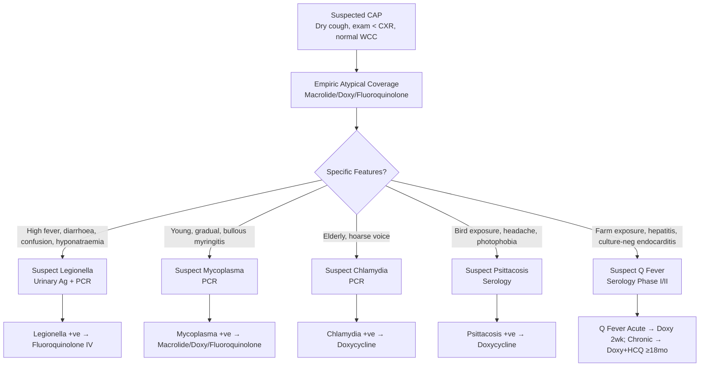

# Atypical Pneumonia

Related: [[Pneumonia]], [[Community-acquired pneumonia severity assessment]], [[Mycoplasma]], [[Chlamydia]], [[Legionella]], [[Psittacosis]], [[Q fever]], [[Coxiella]], [[Viral pneumonia]], [[Hospital-acquired and ventilator-associated pneumonia]], [[Macrolides]], [[Tetracyclines]], [[Fluoroquinolones]]

> [!important]
> **Atypical pneumonia** = pneumonia caused by **atypical pathogens** (intracellular bacteria, viruses) that **do not grow on standard media**, **Gram stain negative**, and cause **clinical syndrome** distinct from typical bacterial CAP. **Key FCPS/MRCP**: **Mycoplasma pneumoniae** (young, gradual, extra-pulmonary), **Chlamydia pneumoniae** (elderly, comorbidities), **Legionella** (severe, GI/neuro, hyponatraemia, water source), **Psittacosis** (birds), **Coxiella burnetii** (farm animals, Q fever). **Diagnosis**: PCR (respiratory), serology (paired), urinary antigen (Legionella), culture (specialised). **Treatment**: **Macrolides** (azithromycin/clarithromycin), **doxycycline**, **fluoroquinolones** (levofloxacin/moxifloxacin) — **NOT β-lactams** (intrinsically resistant).

## Learning Objectives
- Distinguish **atypical** from **typical bacterial CAP** (clinical, radiological, microbiological)
- Recognise **clinical syndromes** of each atypical pathogen (Mycoplasma, Chlamydia, Legionella, Psittacosis, Coxiella)
- Select **appropriate diagnostics** (PCR, serology, urinary antigen, culture)
- Prescribe **effective empiric and targeted therapy** (macrolides, tetracyclines, fluoroquinolones — avoid β-lactams)
- Recognise **severe/complicated presentations** (Legionella ICU, Legionella hyponatraemia, Mycoplasma Stevens-Johnson)
- Apply **public health measures** (Legionella notification, outbreak control)

## Definition
**Atypical pneumonia** = CAP caused by pathogens that:
1. **Do not grow on routine culture media** (require special media, cell culture, PCR)
2. **Gram stain negative** (no cell wall or intracellular)
3. **Produce clinical syndrome** often with **prominent extra-pulmonary symptoms**, **dry cough**, **relatively preserved examination** vs CXR findings

> **FCPS/MRCP tip**: "Atypical" = **clinical syndrome + microbiological characteristics**, not a single disease. **Key unifying feature**: **Intracellular pathogens, Gram-negative or wall-less, resistant to β-lactams**.

## Core Pathogens & Clinical Syndromes
### 1. Mycoplasma pneumoniae
| Feature | Details |
|---------|---------|
| **Epidemiology** | **Children/young adults** (5–35y), **epidemics** (3–7yr cycles), close communities (schools, barracks) |
| **Clinical** | **Gradual onset** (1–3wk), **dry hacking cough** (protracted, weeks), **fever**, headache, sore throat, **myalgia**, **ear pain** (bullous myringitis) |
| **Extra-pulmonary** | **Stevens-Johnson/SJS/TEN** (mucosal), **haemolytic anaemia** (cold agglutinins), **CNS** (encephalitis, transverse myelitis, GBS), **carditis**, **arthritis**, **rash** (maculopapular, urticarial) |
| **CXR** | **Reticulonodular**, patchy bilateral, **lower lobes** — often **worse than exam** |
| **Diagnosis** | **PCR (nasopharyngeal/throat)** — 1st line, **serology** (IgM/IgG paired), **cold agglutinins** (non-specific) |
| **Treatment** | **Macrolide** (azithromycin/clarithromycin) — **1st line**; **Doxycycline**; **Fluoroquinolone** (levo/moxifloxacin) |
| **Resistance** | **Macrolide resistance** rising (Asia > Europe/US) — **fluoroquinolone/tetracycline** if resistant |

### 2. Chlamydia pneumoniae (Chlamydophila)
| Feature | Details |
|---------|---------|
| **Epidemiology** | **Elderly**, **comorbidities** (COPD, HF), endemic, reinfection common |
| **Clinical** | **Subacute**, **mild**, often **asymptomatic/oligosymptomatic**, **hoarse voice** (laryngeal), prolonged cough |
| **Extra-pulmonary** | **Reactive arthritis**, **Guillain-Barré**, **myocarditis**, **atherosclerosis association** (controversial) |
| **CXR** | **Patchy**, often **unilateral**, lower lobes |
| **Diagnosis** | **PCR** (sputum/nasopharyngeal), **serology** (IgM/IgG/IF) — IgG persists, difficult interpretation |
| **Treatment** | **Doxycycline** (1st line), **Macrolide**, **Fluoroquinolone** |
| **Special** | **Chronic infection** possible → prolonged/repeated courses |

### 3. Legionella pneumophila (Legionnaires' Disease)
| Feature | Details |
|---------|---------|
| **Epidemiology** | **Water systems** (cooling towers, showers, hot tubs, decorative fountains), **travel-associated**, **outbreaks**, **immunocompromised/smokers/elderly** |
| **Clinical** | **High fever** (39–40°C), **rigors**, **dry cough → productive**, **severe dyspnoea**, **confusion**, **prostration** |
| **Extra-pulmonary (KEY)** | **GI** (diarrhoea 25–50%, nausea, abdominal pain), **Neuro** (confusion, encephalopathy, cerebellar signs), **Hyponatraemia** (SIADH, <130 mmol/L — **classic**), **hepatitis**, **rhabdomyolysis**, **AKI** |
| **CXR** | **Rapidly progressive**, **consolidation**, often **bilateral**, lower lobes, **pleural effusion** (20–30%) |
| **Diagnosis** | **Urinary antigen** (L. pneumophila serogroup 1) — **1st line, rapid, 70–90% sens**; **PCR** (sputum/BAL); **Culture** (BCYE agar, 3–5d, gold standard); **Serology** (paired, retrospective) |
| **Treatment** | **Fluoroquinolone** (levofloxacin/moxifloxacin) — **1st line severe**; **Macrolide** (azithro/clarithro) — alternative; **Doxycycline** |
| **Public health** | **Notifiable disease**, **outbreak investigation** (environmental sampling) |

### 4. Psittacosis (Chlamydia psittaci)
| Feature | Details |
|---------|---------|
| **Source** | **Birds** (parrots, pigeons, poultry, pet birds) — inhalation of dried droppings/secretions |
| **Clinical** | **Flu-like**, **headache** (severe), **photophobia**, **myalgia**, **dry cough**, **relative bradycardia** (pulse-temp dissociation) |
| **CXR** | **Patchy consolidation**, often **lower lobes** |
| **Diagnosis** | **Serology** (MIF, CF — paired), **PCR** (sputum/BAL) |
| **Treatment** | **Doxycycline** (1st line), **Macrolide** (azithromycin), **Fluoroquinolone** |
| **Public health** | **Bird source investigation**, **avian quarantine** |

### 5. Coxiella burnetii (Q Fever)
| Feature | Details |
|---------|---------|
| **Source** | **Farm animals** (cattle, sheep, goats — birth products, milk, urine, faeces), **aerosol** (windborne) |
| **Clinical** | **Acute**: **High fever**, **severe headache**, **pneumonia** (atypical), **hepatitis**, **myocarditis**; **Chronic**: **Endocarditis** (culture-negative), **vascular infections**, **fatigue syndrome** |
| **CXR** | **Variable** (consolidation, GGO, nodules, effusion) |
| **Diagnosis** | **Serology** (IFA — Phase I/II antibodies) — **Phase II > Phase I = acute**; **Chronic**: **Phase I ≥1:800**; **PCR** (blood/tissue) |
| **Treatment** | **Acute**: **Doxycycline 2wks**; **Chronic endocarditis**: **Doxycycline + Hydroxychloroquine ≥18 months** |
| **Public health** | **Notifiable**, **farm investigation**, **pasteurisation** |

## Comparison Table: Atypical vs Typical CAP
| Feature | **Typical CAP** (S. pneumoniae, H. influenzae) | **Atypical CAP** (Mycoplasma, Chlamydia, Legionella) |
|---------|-----------------------------------------------|-----------------------------------------------------|
| **Onset** | Acute (hours–days) | Gradual/subacute (days–weeks) |
| **Cough** | Productive (purulent) | **Dry**, non-productive |
| **Fever** | High, rigors | Variable (low-grade to high) |
| **Examination** | **Focal** (bronchial breathing, crackles) | **Non-specific**, **mild** vs CXR |
| **CXR** | **Lobar consolidation** | **Patchy, reticulonodular, diffuse** |
| **Leucocytes** | **Neutrophilia** | **Normal** or **lymphocytosis** |
| **Gram stain** | Positive (organisms seen) | **Negative** |
| **Culture** | Standard media (24–48h) | **Special media/PCR/serology** |
| **β-lactams** | **Effective** | **RESISTANT** (intrinsic) |
| **Treatment** | β-lactams ± macrolide | **Macrolides, tetracyclines, fluoroquinolones** |

## Investigations
### 1. Microbiological Diagnostics
| Pathogen | 1st Line Test | Alternative | Notes |
|----------|---------------|-------------|-------|
| **Mycoplasma** | **PCR (NP/throat)** | Serology (paired IgM/IgG), cold agglutinins | PCR >90% sens |
| **Chlamydia** | **PCR (sputum/NP)** | Serology (MIF/IF) | PCR preferred |
| **Legionella** | **Urinary antigen** (L. pneumophila sg1) | PCR (sputum/BAL), Culture (BCYE) | UA 70–90% sens (sg1 only) |
| **Psittacosis** | **Serology (MIF/CF paired)** | PCR (sputum/BAL) | No commercial antigen |
| **Coxiella** | **Serology (IFA Phase I/II)** | PCR (blood/tissue) | Phase II > Phase I = acute |

### 2. General Workup
- **CBC**: Normal/lymphocytosis (vs neutrophilia in typical)
- **CRP/ESR**: Elevated (non-specific)
- **LFTs**: **Hepatitis** (Legionella, Psittacosis, Q fever)
- **Hyponatraemia**: **Legionella** (SIADH) — **check Na+**
- **Creatinine**: AKI (Legionella, Q fever)
- **CK**: Rhabdomyolysis (Legionella)
- **Cold agglutinins**: Mycoplasma (non-specific, 50% sens)
- **Chest X-ray**: Often **worse than exam** (atypical pattern)

## Management
### 1. Empiric Therapy for CAP (Covering Atypicals)
| Severity | Regimen (Include Atypical Coverage) |
|----------|-------------------------------------|
| **Outpatient (mild)** | **Doxycycline 100mg BD** OR **Clarithromycin 500mg BD** OR **Azithromycin 500mg OD** |
| **Inpatient (moderate)** | **IV Clarithromycin 500mg BD** OR **Azithromycin 500mg OD** **+ Ceftriaxone** (if not covered by fluoroquinolone) |
| **Severe/ICU** | **Levofloxacin 500mg IV/PO OD** OR **Moxifloxacin 400mg IV/PO OD** (covers atypical + typical) |
| **Penicillin allergy** | **Doxycycline** or **Fluoroquinolone** |

> **FCPS/MRCP tip**: **Empiric CAP therapy MUST cover atypicals** (macrolide, doxycycline, or fluoroquinolone). **β-lactams alone = inadequate**.

### 2. Targeted Therapy (Confirmed Pathogen)
| Pathogen | 1st Line | Alternative | Duration |
|----------|----------|-------------|----------|
| **Mycoplasma** | **Azithromycin 500mg OD ×3–5d** (or 500mg D1 then 250mg D2–5) | Clarithromycin 500mg BD, **Doxycycline 100mg BD**, Levofloxacin 500mg OD | 7–14d (longer if complicated) |
| **Chlamydia** | **Doxycycline 100mg BD** | Azithromycin, Levofloxacin | 10–14d (longer if chronic) |
| **Legionella** | **Levofloxacin 500mg OD** (or Moxifloxacin 400mg OD) | Azithromycin 500mg OD, Clarithromycin 500mg BD | 10–14d (21d if severe/immunocompromised) |
| **Psittacosis** | **Doxycycline 100mg BD** | Azithromycin, Levofloxacin | 10–14d (21d if severe) |
| **Q Fever (Acute)** | **Doxycycline 100mg BD** | Doxy + Hydroxychloroquine (if severe) | 14–21d |
| **Q Fever (Chronic Endocarditis)** | **Doxycycline 100mg BD + Hydroxychloroquine 200mg BD** | — | **≥18 months** |

### 3. Drug Resistance
| Pathogen | Resistance Issue |
|----------|-----------------|
| **Mycoplasma** | **Macrolide resistance** (MLSb mechanism, 23S rRNA mutation) — **Asia >90%, Europe/US 5–15%** → use **doxycycline/fluoroquinolone** |
| **Legionella** | **Macrolide resistance rare**; fluoroquinolone resistance emerging |
| **Chlamydia** | **Tetracycline resistance rare**; macrolide resistance possible |

## Complications
### Pathogen-Specific
| Pathogen | Complications |
|----------|---------------|
| **Mycoplasma** | **Stevens-Johnson/TEN**, **haemolytic anaemia** (cold agglutinins), **encephalitis**, **GBS**, **myocarditis**, **arthritis**, **renal** (GMP) |
| **Legionella** | **Respiratory failure/ARDS**, **shock**, **AKI**, **rhabdo**, **confusion/encephalopathy**, **death** (10–15% treated, 40–80% untreated) |
| **Psittacosis** | **Endocarditis**, **hepatitis**, **encephalitis**, **relapse** |
| **Q Fever** | **Chronic endocarditis** (culture-negative), **vascular infections**, **fatigue syndrome**, **chronic hepatitis** |

### General
- **Severe CAP → ARDS** (all atypicals)
- **Secondary bacterial infection** (superinfection)
- **Post-infectious fatigue** (prolonged, especially Q fever, Mycoplasma)

## Red Flags / Emergencies
- **Legionella**: **Severe hyponatraemia** (<125), **confusion**, **AKI**, **shock** → ICU, fluoroquinolone IV
- **Mycoplasma**: **Stevens-Johnson** (mucosal ulceration, skin detachment) → STOP macrolide, ICU, dermatology
- **Q Fever endocarditis**: **Culture-negative endocarditis** + rural/farm exposure → serology, echo, doxy + HCQ
- **Severe CAP** (any): **CURB-65 ≥3** or **PSI Class V** → ICU assessment

## Special Situations
### Pregnancy
- **Macrolides** (azithromycin/clarithromycin/erythromycin) — **SAFE**
- **Doxycycline** — **CONTRAINDICATED** (fetal bone/teeth)
- **Fluoroquinolones** — **CONTRAINDICATED** (cartilage)
- **Legionella in pregnancy** → **Azithromycin** (or clarithromycin)

### Immunocompromised
- **Legionella** more severe (transplant, steroids)
- **Mycoplasma** — prolonged shedding, chronic infection
- **PCR preferred** over serology (serology unreliable)
- **Broader empiric coverage** (flu+ atypicals + fungi + PJP)

### Paediatric
- **Mycoplasma** = most common atypical in children >5y
- **Mycoplasma** = **Macrolide 1st line** (dose by weight)
- **Doxycycline** — **avoid <12y** (teeth staining)
- **Legionella** rare in children

## Public Health / Notification
| Pathogen | UK Notifiable? | Action |
|----------|----------------|--------|
| **Legionella** | **YES** | **Immediate notification**, outbreak investigation, environmental sampling |
| **Psittacosis** | **YES** | Bird source investigation, quarantine |
| **Q Fever (Coxiella)** | **YES** | Farm investigation, pasteurisation |
| **Mycoplasma** | No | School/nursery outbreak guidance |
| **Chlamydia pneumoniae** | No | — |

## Prognosis
| Pathogen | Mortality (Treated) | Key Factors |
|----------|---------------------|-------------|
| **Mycoplasma** | <1% (outpatient) | Stevens-Johnson, encephalitis |
| **Chlamydia** | <1% | Chronic infection, reinfection |
| **Legionella** | **5–10%** (treated), **40–80%** (untreated) | Age, immunocompromise, delay, multilobar |
| **Psittacosis** | <1% (treated) | Endocarditis, relapse |
| **Q Fever (Acute)** | <1% | Chronic endocarditis risk |
| **Q Fever (Chronic)** | **10–20%** (endocarditis) | Valvular disease, vascular grafts |

## Topic Correlation
- [[Pneumonia]] — CAP framework
- [[Community-acquired pneumonia severity assessment]] — CURB-65, PSI
- [[Viral pneumonia]] — differential
- [[Hospital-acquired and ventilator-associated pneumonia]] — HAP/VAP
- [[Immunocompromised host]] — broader context
- [[Macrolides]] / [[Tetracyclines]] / [[Fluoroquinolones]] — drug classes

## FCPS/MRCP High-Yield Points
1. **Atypical pneumonia** = intracellular pathogens, Gram-negative/wall-less, **β-lactam resistant**, dry cough, exam < CXR
2. **Mycoplasma**: Young, gradual, dry cough, **cold agglutinins**, bullous myringitis, **Stevens-Johnson**, **macrolide resistance rising**
2. **Chlamydia**: Elderly, comorbidities, hoarse voice, **doxycycline 1st line**
3. **Legionella**: Water source, high fever, **GI (diarrhoea), neuro (confusion), hyponatraemia (SIADH)**, **urinary antigen 1st line**, **fluoroquinolone 1st line severe**
4. **Psittacosis**: Birds, headache, photophobia, relative bradycardia, **doxycycline 1st line**
5. **Q Fever**: Farm animals, acute (fever, headache, hepatitis), **chronic endocarditis** (Phase I ≥1:800), **doxy + HCQ ≥18mo**
6. **Atypicals resist β-lactams** → **macrolides, doxycycline, fluoroquinolones**
7. **Empiric CAP therapy MUST cover atypicals** (macrolide, doxy, or fluoroquinolone added to β-lactam)
7. **Legionella urinary antigen** = 1st line (L. pneumophila sg1 only)
7. **Mycoplasma macrolide resistance** rising → use doxycycline/fluoroquinolone if suspected

## Common Viva Questions
1. Differentiate typical vs atypical CAP
2. Clinical features of Mycoplasma, Chlamydia, Legionella, Psittacosis, Q fever
3. Legionella specific features (hyponatraemia, GI, neuro, water source)
8. Diagnostic tests for each (urinary antigen, PCR, serology)
9. Treatment choices (macrolides, doxy, fluoroquinolones)
9. Legionella public health (notification, outbreak)
9. Macrolide resistance in Mycoplasma
10. Q fever acute vs chronic (serology phases)

## Common Confusions / Exam Traps
- **β-lactams for atypicals** = **WRONG** (intrinsically resistant — no cell wall / intracellular)
- **Legionella urinary antigen** = **only detects L. pneumophila serogroup 1** (misses other species/serogroups)
- **Mycoplasma cold agglutinins** = **non-specific** (50% sens, false + in infections, lymphoma, autoimmune)
- **Chlamydia serology** = difficult (IgG persists, cross-reactivity) → **PCR preferred**
- **Q fever serology** = **Phase II > Phase I = acute**; **Phase I ≥1:800 = chronic endocarditis**
- **Doxycycline in pregnancy/children** = **CONTRAINDICATED** (teeth/bone)
- **Fluoroquinolones in pregnancy/children** = **CONTRAINDICATED** (cartilage)
- **Macrolide resistance in Mycoplasma** = use **doxycycline/fluoroquinolone**
- **Legionella** = **notifiable**, outbreak investigation mandatory

## Mnemonics
- **ATYPICAL BUGS**: **M**ycoplasma, **C**hlamydia, **L**egionella, **P**sittacosis, **C**oxiella = **MCLPC**
- **MYCOPLASMA FEATURES**: **Y**oung, **G**radual, **D**ry cough, **C**old agglutinins, **B**ullous myringitis, **S**tevens-Johnson, **M**acrolide resistance
- **LEGIONELLA CLASSIC**: **W**ater source, **H**igh fever, **G**I (diarrhoea), **N**euro (confusion), **H**yponatraemia (SIADH), **U**rinary antigen, **F**luoroquinolone 1st line
- **Q FEVER PHASES**: **A**cute = **P**hase **II** > **I**; **C**hronic = **P**hase **I** ≥1:800 = **APIIC** (Acute Phase II > I, Chronic I)
- **ATYPICAL TREATMENT**: **M**acrolides, **D**oxycycline, **F**luoroquinolones = **MDF** (No β-lactams!)

## Mind Map
```mermaid
mindmap
  root((Atypical Pneumonia))
    Definition
      Intracellular, Gram-stain negative
      No routine culture
      B-lactam resistant
    Pathogens
      Mycoplasma (young, gradual, dry cough)
      Chlamydia (elderly, comorbidities)
      Legionella (water, severe, hyponatraemia)
      Psittacosis (birds, headache)
      Q Fever (farm, chronic endocarditis)
    Diagnosis
      Mycoplasma: PCR (1st), serology
      Chlamydia: PCR (1st)
      Legionella: Urinary Ag (1st), PCR, culture
      Psittacosis: Serology
      Q Fever: Serology (Phase I/II)
    Treatment
      Macrolides, Doxycycline, Fluoroquinolones
      NO B-lactams
    Complications
      Mycoplasma: SJS, haemolysis, neuro
      Legionella: ARDS, shock, AKI, hyponatraemia
      Q Fever: Chronic endocarditis
```

## Flowchart


## Suggested Visuals / Image Notes
- CXR comparisons: Typical lobar consolidation vs atypical reticulonodular
- Legionella urinary antigen test
- Q fever serology (Phase I vs II)
- Mycoplasma bullous myringitis
- Stevens-Johnson syndrome
- Treatment algorithm (empiric → targeted)

## Suggested Video References
- BTS/IDSA CAP Guidelines (atypical coverage)
- Legionella outbreak investigation
- Q fever serology interpretation
- Mycoplasma macrolide resistance
- Atypical CAP case discussions

## One-Page Revision Summary
- **Atypical pneumonia** = intracellular, Gram-stain negative, no routine culture, **β-lactam resistant**
- **Mycoplasma**: Young, gradual, dry cough, cold agglutinins, bullous myringitis, SJS, **macrolide resistance**
- **Chlamydia**: Elderly, comorbidities, hoarse voice, **doxycycline 1st**
- **Legionella**: Water, high fever, **diarrhoea, confusion, hyponatraemia (SIADH)**, **urinary Ag (sg1)**, **fluoroquinolone 1st line severe**
- **Psittacosis**: Birds, headache, photophobia, bradycardia, **doxycycline**
- **Q Fever**: Farm, acute fever/hepatitis, **chronic endocarditis** (Phase I ≥1:800), **doxy+HCQ ≥18mo**
- **Diagnosis**: PCR (Mycoplasma, Chlamydia, Legionella), **Urinary Ag (Legionella)**, Serology (Psittacosis, Q Fever)
- **Treatment**: **Macrolides, Doxycycline, Fluoroquinolones** — **NO β-lactams**
- **Empiric CAP**: Must cover atypicals (add macrolide/doxy/fluoroquinolone to β-lactam)
- **Pregnancy**: Azithromycin safe; Doxy/fluoroquinolone contraindicated

## 24-Hour Recall Prompts
- 5 atypical pathogens + key clinical feature each
- Legionella classic triad (GI, neuro, hyponatraemia)
- Mycoplasma extra-pulmonary (SJS, haemolysis, bullous myringitis)
- Q fever serology (Phase I vs II)
- Treatment: 1st line for each (macrolide/doxy/fluoroquinolone)
- Legionella urinary antigen limitation (sg1 only)
- Macrolide resistance in Mycoplasma
- Pregnancy safe/unsafe atypical drugs

## 7-Day / 15-Day / 30-Day Revision Tracker
- [ ] Day 1 completed
- [ ] 24-hour recall completed
- [ ] Day 7 revision completed
- [ ] Day 15 revision completed
- [ ] Day 30 revision completed

## Must Know / Should Know / Nice to Know
### Must Know
- Atypical vs typical CAP differentiation
- 5 classic pathogens + clinical features
- Legionella: hyponatraemia, GI, neuro, urinary Ag, fluoroquinolone
- Mycoplasma: young, gradual, cold agglutinins, SJS, macrolide resistance
- Q fever: acute vs chronic serology (Phase I/II), chronic endocarditis doxy+HCQ
- Treatment: macrolides, doxy, fluoroquinolones (NO β-lactams)
- Empiric CAP must cover atypicals
- Pregnancy: azithromycin safe; doxy/fluoroquinolone contraindicated

### Should Know
- Chlamydia pneumoniae (elderly, hoarse voice, doxycycline)
- Psittacosis (birds, headache, photophobia, relative bradycardia)
- Legionella urinary antigen limitation (sg1 only)
- Mycoplasma macrolide resistance epidemiology
- Chronic Q fever management (doxy+HCQ ≥18mo)
- Public health (Legionella, Psittacosis, Q fever notifiable)

### Nice to Know
- Mycoplasma bullous myringitis mechanism
- Chlamydia chronic infection/atherosclerosis link
- Legionella environmental control (temp, biocides)
- Q fever chronic fatigue syndrome
- Novel PCR panels (multiplex)
- Cost-effectiveness of Legionella urinary Ag
- Mycoplasma vaccine development

## Self-Test Scorecard
- Understanding: /10
- Recall: /10
- MCQ Performance: /10
- SBA Performance: /10
- Viva Confidence: /10
- Total: /50

> [!tip]
> Interpretation: <35 = weak topic, 35-44 = acceptable but insecure, 45+ = strong exam-ready topic.

## Exam Answer Modes
### Long Answer Skeleton
- Definition and differentiation (atypical vs typical)
- Pathogen table (epidemiology, clinical, extra-pulmonary, CXR, diagnosis, treatment)
- Legionella deep dive (syndrome, diagnosis, treatment, public health)
- Mycoplasma deep dive (syndrome, complications, resistance)
- Q fever (acute vs chronic, serology, treatment)
- Diagnostic algorithm (empiric → targeted)
- Treatment table (1st line, alternatives, duration)
- Special populations (pregnancy, paeds, immunocompromised)
- Complications and public health

### Short Note Skeleton
- Definition box
- Pathogen comparison table
- Legionella syndrome box
- Q fever serology box
- Treatment algorithm
- Public health box

### Viva One-Liners
- "Atypical = intracellular, Gram-negative/wall-less, β-lactam resistant, dry cough, exam < CXR"
- "Mycoplasma: young, gradual, dry cough, cold agglutinins, bullous myringitis, SJS, macrolide resistance"
- "Legionella: water source, high fever, diarrhoea, confusion, **hyponatraemia (SIADH)**, urinary Ag (sg1), fluoroquinolone 1st line severe"
- "Chlamydia: elderly, comorbidities, hoarse voice, doxycycline 1st line"
- "Psittacosis: birds, headache, photophobia, relative bradycardia, doxycycline"
- "Q Fever: farm, acute fever/hepatitis, **chronic endocarditis** (Phase I ≥1:800), doxy+HCQ ≥18mo"
- "Atypicals resist β-lactams → macrolides, doxycycline, fluoroquinolones"
- "Empiric CAP MUST cover atypicals (add macrolide/doxy/fluoroquinolone to β-lactam)"
- "Legionella urinary Ag = L. pneumophila sg1 only (misses other species)"
- "Mycoplasma macrolide resistance → use doxycycline/fluoroquinolone"
- "Q fever serology: Acute = Phase II > Phase I; Chronic endocarditis = Phase I ≥1:800"
- "Pregnancy: Azithromycin safe; Doxycycline/fluoroquinolones contraindicated"
- "Legionella = notifiable, outbreak investigation mandatory"

### Ward-Case Discussion Points
- 25M student, 2-week dry cough, low fever, CXR reticulonodular, cold agglutinins +ve → Mycoplasma → azithromycin (watch for SJS)
- 65M smoker, post-hotel stay, high fever, diarrhoea, confusion, Na 125, CXR consolidation → Legionella urinary Ag+ → levofloxacin IV, notify public health
- 40F farmer, fever, headache, hepatitis, culture-negative endocarditis → Q fever Phase I 1:1600 → doxy + HCQ ≥18mo
- 30F bird owner, headache, photophobia, cough, CXR patchy consolidation → Chlamydia psittaci serology+ → doxycycline

### Last-Night-Before-Exam Sheet
- Atypicals: Mycoplasma, Chlamydia, Legionella, Psittacosis, Coxiella
- Atypical = intracellular, no Gram stain, no routine culture, β-lactam resistant
- Mycoplasma: Young, gradual, dry cough, cold agglutinins, SJS, macrolide resist
- Legionella: Water, fever, GI, neuro, hyponatraemia, Urinary Ag (sg1), Fluoroquinolone
- Chlamydia: Elderly, hoarse voice, Doxycycline
- Psittacosis: Birds, headache, photophobia, Doxycycline
- Q Fever: Farm, acute vs chronic (Phase II>I vs Phase I≥1:800), Doxy+HCQ
- Treatment: Macrolide/Doxy/Fluoroquinolone (NO β-lactams)
- Empiric CAP: Add atypical cover to β-lactam
- Pregnancy: Azithro safe; Doxy/Fluoro contraindicated

## Summary
**Atypical pneumonia** = CAP caused by **intracellular pathogens** that are **Gram-stain negative**, **do not grow on routine media**, and are **intrinsically resistant to β-lactams**. **Classic pathogens**: **Mycoplasma pneumoniae** (young, gradual, dry cough, cold agglutinins, Stevens-Johnson), **Chlamydia pneumoniae** (elderly, hoarse voice), **Legionella pneumophila** (water source, high fever, **diarrhoea, confusion, hyponatraemia**, urinary antigen for L. pneumophila sg1), **Chlamydia psittaci** (birds, headache, photophobia), **Coxiella burnetii** (farm animals, **acute Q fever** vs **chronic endocarditis** with Phase I antibody ≥1:800). **Diagnosis**: **PCR** (Mycoplasma, Chlamydia, Legionella), **urinary antigen** (Legionella sg1), **serology** (Psittacosis, Q fever). **Treatment**: **Macrolides, doxycycline, fluoroquinolones** — **NO β-lactams**. **Empiric CAP therapy MUST cover atypicals**. **Legionella**: **notifiable**, outbreak investigation. **Q fever chronic endocarditis**: doxycycline + hydroxychloroquine ≥18 months. **Pregnancy**: azithromycin safe; doxycycline/fluoroquinolones contraindicated.

## MCQs (10)
1. **Atypical pneumonia pathogens** are characteristically:
   A. Gram-positive, grow on blood agar
   B. **Intracellular, Gram-stain negative, β-lactam resistant**
   C. Extracellular, produce spores
   D. Anaerobic, produce toxin

2. **Legionella pneumophila** — classic laboratory finding:
   A. Hypernatraemia
   B. **Hyponatraemia (SIADH)**
   C. Leucocytosis with left shift
   D. Elevated procalcitonin only

3. **Mycoplasma pneumoniae** — classic extra-pulmonary manifestation:
   A. Pericarditis
   B. **Stevens-Johnson syndrome / haemolytic anaemia**
   C. Renal failure
   D. Pancreatitis

4. **Urinary antigen test** for Legionella detects:
   A. All Legionella species
   B. **L. pneumophila serogroup 1 only**
   C. Legionella and Mycoplasma
   D. All atypical pathogens

5. **Q Fever chronic endocarditis** serology:
   A. Phase II > Phase I
   B. **Phase I ≥1:800**
   C. Phase I negative
   D. IgM positive only

6. **Empiric therapy for CAP** must cover atypicals with:
   A. β-lactam alone
   B. **Macrolide, doxycycline, or fluoroquinolone**
   C. Aminoglycoside
   D. Glycopeptide

7. **Chlamydia pneumoniae** — typical patient:
   A. Young adult, bullous myringitis
   B. **Elderly with comorbidities, hoarse voice**
   C. HIV, CD4 <200
   D. Bird breeder

8. **Psittacosis** — classic exposure:
   A. Contaminated water
   B. **Birds (parrots, pigeons, poultry)**
   C. Farm animals
   D. Air conditioning systems

9. **Macrolide resistance** in Mycoplasma pneumoniae:
   A. Rare (<1%)
   B. **Increasing (Asia >90%, Europe/US 5–15%)**
   C. Only in immunocompromised
   D. Not reported

10. **Doxycycline contraindicated** in:
    A. **Pregnancy and children <12 years**
    B. Renal failure only
    C. Hepatic failure only
    D. Elderly only

## SBA Questions (10)
1. A 22M student, 10-day dry cough, low fever, CXR bilateral reticulonodular. Cold agglutinins +ve. Best treatment?
   A. Amoxicillin
   B. **Azithromycin 500mg OD ×3d** (or doxycycline if macrolide resistance suspected)
   C. Ceftriaxone
   D. Vancomycin

2. A 68M post-conference hotel stay, high fever (39.5°C), diarrhoea, confusion, Na+ 128. CXR RLL consolidation. Urinary antigen +ve for L. pneumophila sg1. Best IV therapy?
   A. Clarithromycin
   B. **Levofloxacin 500mg IV OD**
   C. Ceftriaxone + Azithromycin
   D. Co-amoxiclav

3. A 45F parrot breeder, 1-week headache, photophobia, dry cough, relative bradycardia. CXR patchy LLL consolidation. Serology +ve for C. psittaci. Best treatment?
   A. **Doxycycline 100mg BD**
   B. Clarithromycin
   C. Azithromycin
   D. Levofloxacin

4. A 50M farmer, 2-week fever, headache, hepatitis. Culture-negative endocarditis suspected. Q fever serology: Phase I 1:1600, Phase II 1:200. Best treatment?
   A. Doxycycline 2 weeks
   B. **Doxycycline + Hydroxychloroquine ≥18 months**
   C. Ceftriaxone 6 weeks
   C. Vancomycin + Gentamicin

5. Empiric CAP therapy for a 60M inpatient (CURB-65=2) — which regimen covers atypicals?
   A. Ceftriaxone alone
   B. **Ceftriaxone + Clarithromycin**
   C. Amoxicillin alone
   D. Vancomycin + Piperacillin-tazobactam

6. Legionella urinary antigen — limitation:
   A. Low sensitivity (<50%)
   B. **Detects only L. pneumophila serogroup 1**
   C. Cross-reacts with Mycoplasma
   D. Only positive in severe disease

6. Mycoplasma pneumoniae — rising resistance:
   A. Fluoroquinolone resistance
   B. **Macrolide resistance (23S rRNA mutation)**
   C. Tetracycline resistance
   D. Aminoglycoside resistance

7. Q Fever serology — acute vs chronic:
   A. **Acute: Phase II > Phase I; Chronic: Phase I ≥1:800**
   B. Acute: Phase I > Phase II; Chronic: Phase II ≥1:800
   C. Both phases equal in acute
   D. IgM diagnostic for chronic

8. Pregnant woman (28 weeks) with CAP — safe atypical cover:
   A. **Azithromycin**
   B. Doxycycline
   C. Levofloxacin
   D. Tetracycline

9. Atypical pathogens — which is INTRINSICALLY RESISTANT to β-lactams?
   A. S. pneumoniae
   B. H. influenzae
   C. **M. pneumoniae**
   D. M. catarrhalis

## Flashcards
- Q: Atypical definition
  A: Intracellular, Gram-neg/wall-less, no routine culture, β-lactam resistant
- Q: Mycoplasma classic
  A: Young, gradual, dry cough, cold agglutinins, SJS
- Q: Legionella classic
  A: Water, fever, GI, neuro, hyponatraemia, urinary Ag (sg1), fluoroquinolone
- Q: Chlamydia pneumoniae
  A: Elderly, comorbidities, hoarse voice, doxycycline 1st
- Q: Psittacosis
  A: Birds, headache, photophobia, bradycardia, doxycycline
- Q: Q Fever acute
  A: Fever, headache, hepatitis, Phase II>I
- Q: Q Fever chronic
  A: Endocarditis, Phase I ≥1:800, Doxy+HCQ ≥18mo
- Q: Atypical treatment
  A: Macrolide, Doxy, Fluoroquinolone (NO β-lactams)
- Q: Legionella UA
  A: L. pneumophila sg1 only
- Q: Mycoplasma resistance
  A: Macrolide (23S rRNA) rising
- Q: Pregnancy safe
  A: Azithromycin (NO doxy/fluoro)
- Q: Q Fever phases
  A: Acute=II>I; Chronic=I≥1:800

## Answer Key with Explanations
### MCQs
1. **B** — Atypical pathogens are intracellular, Gram-stain negative, and intrinsically resistant to β-lactams.
2. **B** — Legionella causes SIADH → hyponatraemia (classic).
3. **B** — Stevens-Johnson/TEN and cold agglutinin haemolytic anaemia are classic for Mycoplasma.
4. **B** — Urinary antigen only detects L. pneumophila serogroup 1 (70–90% of cases).
5. **B** — Chronic Q fever endocarditis = Phase I IgG ≥1:800.
6. **B** — Empiric CAP must include macrolide, doxycycline, or fluoroquinolone for atypical coverage.
7. **B** — C. pneumoniae: elderly, comorbidities, hoarse voice, doxycycline 1st line.
8. **B** — Psittacosis = bird exposure (parrots, pigeons, poultry).
9. **B** — Macrolide resistance in Mycoplasma rising globally (23S rRNA mutation).
10. **A** — Doxycycline contraindicated in pregnancy (fetal teeth/bone) and children <12y (teeth staining).

### SBAs
1. **B** — Mycoplasma in young adult → azithromycin (or doxycycline if macrolide resistance).
2. **B** — Legionella severe with hyponatraemia/confusion → levofloxacin IV 1st line.
3. **A** — Psittacosis → doxycycline 1st line.
4. **B** — Chronic Q fever endocarditis → doxy + HCQ ≥18mo.
5. **B** — Ceftriaxone + clarithromycin covers typical + atypical.
6. **B** — Legionella UA only detects L. pneumophila sg1 (misses other species/serogroups).
6. **B** — Macrolide resistance (23S rRNA) is the major emerging resistance.
7. **A** — Acute Q fever: Phase II > Phase I; Chronic endocarditis: Phase I ≥1:800.
8. **A** — Azithromycin only safe option in pregnancy (doxy/fluoroquinolones contraindicated).
9. **C** — Mycoplasma lacks cell wall → intrinsically resistant to β-lactams (penicillin-binding proteins absent).

### Flashcards
All correct as written.

---

## PasTest Scenario SBAs (Clinical Vignettes)

> **Auto-generated PasTest/Mediscope-style scenario SBAs** grounded in the authored source. Each scenario tests a real clinical fact (triad, specific sign, contraindication, trial, first-line Rx) extracted from the topic. *Source: Ch 17: Respiratory Medicine — Atypical pneumonia*

**Q1.** Which of the following features is most specific or characteristic of Atypical pneumonia?

  - **A.** CBC
  - **B.** A feature common to many acute inflammatory conditions
  - **C.** A non-specific sign that does not localise the diagnosis
  - **D.** An investigation finding rather than a clinical feature

  > **Answer: A** — CBC
  >
  > *Source:* General Workup
- **CBC**: Normal/lymphocytosis (vs neutrophilia in typical)
- **CRP/ESR**: Elevated (non-specific)
- **LFTs**: **Hepatitis** (Legionella, Psittacosis, Q fever)
- **Hyponatraemia**: **L

