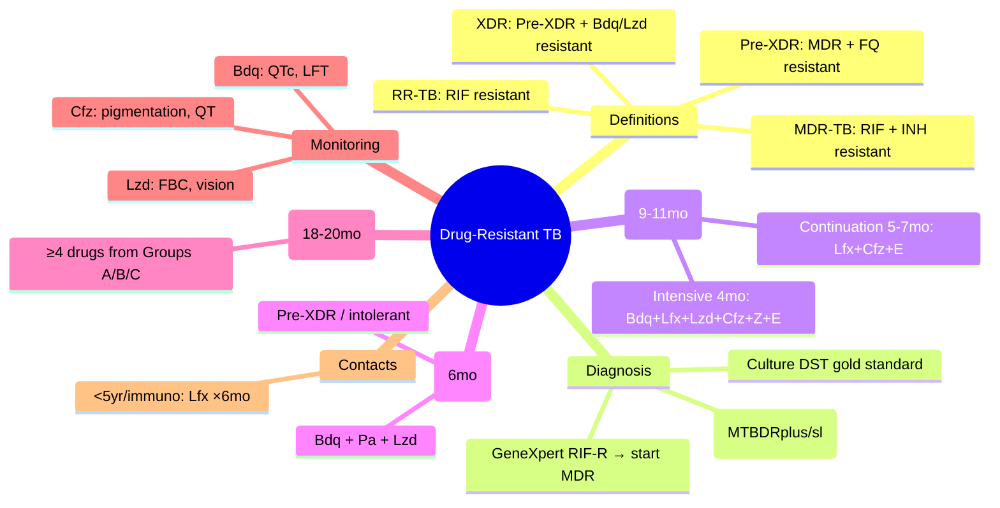

# Drug-Resistant Tuberculosis (DR-TB)

Related: [[Pulmonary tuberculosis]], [[Latent tuberculosis infection]], [[Non-tuberculous mycobacterial pulmonary disease]], [[HIV/TB coinfection]]

> [!important]
> **Drug-resistant TB** = **M. tuberculosis** resistant to ≥1 first-line anti-TB drug. **Key FCPS/MRCP**: **Definitions** (RR-TB, MDR-TB, pre-XDR, XDR), **GeneXpert RIF resistance** = trigger for MDR workup, **Shorter all-oral regimen** (Bdq+Lfx+Lzd+Cfz+Z+E ×4m → Lfx+Cfz+E ×5-7m) for MDR/RR-TB, **BPaL regimen** (Bdq+Pa+Lzd ×6m) for pre-XDR/intolerant, **Linezolid/Bedaquiline monitoring** (FBC, QT, LFT), **Contact management** (fluoroquinolone/levofloxacin for MDR contacts).

## Learning Objectives
- Define and classify **RR-TB, MDR-TB, pre-XDR-TB, XDR-TB** per WHO 2021
- Interpret **GeneXpert RIF resistance** and **LPA (MTBDRplus/sl)** results
- Prescribe **shorter all-oral MDR/RR-TB regimen** (9–11 months) with correct drugs/durations
- Prescribe **BPaL regimen** (6 months) for pre-XDR / intolerant to longer regimen
- Monitor **bedaquiline (QTc, LFT)**, **linezolid (FBC, neuropathy)**, **clofazimine (pigmentation, QT)**
- Manage **fluorescent-resistant TB** / **XDR-TB** with individualised regimens (≥4 effective drugs)
- Manage **MDR contacts** (levofloxacin prophylaxis)
- Recognise **treatment outcomes** (cure, treatment completed, failed, lost to follow-up)

## Definition
**Drug-resistant TB (DR-TB)** = M. tuberculosis resistant to **≥1 first-line anti-TB drug** demonstrated by **phenotypic DST** (culture-based) or **genotypic tests** (GeneXpert, LPA, WGS).

**WHO 2021 Classification:**
| Category | Resistance Pattern | Clinical Implication |
|----------|-------------------|---------------------|
| **DS-TB** | Susceptible to R, H, Z, E | Standard 2HRZE/4HR |
| **RR-TB** | **Rifampicin resistant** (± other drugs) | Treat as MDR-TB (RIF = cornerstone) |
| **MDR-TB** | **Rifampicin + Isoniazid resistant** | Shorter all-oral regimen (9–11mo) |
| **Pre-XDR-TB** | MDR-TB + **fluoroquinolone resistant** (Lfx/Mfx) | BPaL or individualised longer regimen |
| **XDR-TB** | Pre-XDR + **bedaquiline AND/OR linezolid resistant** | Individualised regimen, novel drugs |

> **FCPS/MRCP tip**: **RIF resistance = MDR until proven otherwise** (95% of RIF-R have INH-R). **GeneXpert RIF-R → start MDR regimen immediately** while awaiting LPA/culture DST.

## Core Anatomy / Pathophysiology
### Resistance mechanisms
| Drug | Gene | Mechanism |
|------|------|-----------|
| **Rifampicin** | *rpoB* (81-bp RRDR) | RNA polymerase β-subunit mutation → ↓ binding |
| **Isoniazid** | *katG* (catalase-peroxidase), *inhA* promoter | ↓ activation (katG) or ↑ target affinity (inhA) |
| **Pyrazinamide** | *pncA* | ↓ pyrazinamidase → ↓ active metabolite (POA) |
| **Ethambutol** | *embB* | Arabinosyl transferase mutation → ↓ binding |
| **Fluoroquinolones** | *gyrA*, *gyrB* | DNA gyrase mutation → ↓ binding |
| **Bedaquiline** | *atpE* (c-subunit), *Rv0678* (efflux pump) | ATP synthase mutation / efflux upregulation |
| **Linezolid** | *rplC* (23S rRNA), *rrl* | Ribosomal mutation → ↓ binding |

### Transmission
- **Airborne** — same as DS-TB
- **MDR-TB strains** equally transmissible (fitness cost variable)
- **Amplification** = acquiring resistance during inadequate treatment

## Normal Values / Important Cut-offs
### Diagnostic Thresholds
| Test | Result | Action |
|------|--------|--------|
| **GeneXpert MTB/RIF Ultra** | **RIF resistance DETECTED** | Start MDR regimen; send LPA/culture DST |
| **MTBDRplus (LPA)** | RIF-R and/or INH-R bands absent | Confirm MDR; send culture DST for FQ/SLI |
| **MTBDRsl (LPA)** | FQ-R and/or SLI-R bands absent | Pre-XDR/XDR suspicion; WGS/culture |
| **Phenotypic DST (MGIT)** | **MIC ≥ critical concentration** | Gold standard for all drugs |

### Bedaquiline QTc Monitoring
| QTc (Bazett) | Action |
|--------------|--------|
| **<450 ms (M) / <470 ms (F)** | Continue |
| **450–480 / 470–500** | Repeat ECG, correct electrolytes (K>4, Mg>2), review concomitant QT drugs |
| **>480 / >500** | **HOLD bedaquiline**, cardiology review, restart only if benefit>risk |

### Linezolid Myelosuppression Monitoring
| Parameter | Action |
|-----------|--------|
| **Platelets <50,000** | **HOLD linezolid**, weekly FBC until >75,000, restart 300mg OD if essential |
| **Hb <80 g/L** | Investigate, transfuse if symptomatic, consider hold |
| **Neutrophils <1,000** | Hold, G-CSF if febrile |

## Classification Summary
```
DS-TB (susceptible to R,H,Z,E)
    ↓
RR-TB (RIF resistant) ──────────────────┐
    ↓                                    │
MDR-TB (RIF + INH resistant) ───────────┤──► Shorter all-oral regimen (9-11mo)
    ↓                                    │
Pre-XDR-TB (MDR + FQ resistant) ────────┤──► BPaL (6mo) or individualised
    ↓                                    │
XDR-TB (Pre-XDR + Bdq/Lzd resistant) ───┘──► Individualised + novel drugs
```

## Etiology / Causes of Resistance
### Primary (transmitted)
- Infection with already-resistant strain
- **High in high MDR burden areas** (Eastern Europe, Central Asia, South Africa)

### Acquired (amplification)
- **Inadequate regimen** (monotherapy, wrong doses)
- **Poor adherence** (intermittent, defaulting)
- **Malabsorption** (GI surgery, HIV enteropathy)
- **Drug interactions** (rifampicin induction reducing levels)
- **Heteroresistance** (minority resistant population selected)

## Risk Factors for DR-TB
| Risk Factor | Association |
|-------------|-------------|
| **Previous TB treatment** (relapse, failure, LTFU) | **Strongest** |
| **Contact with MDR-TB case** | High |
| **HIV** (low CD4, high viral load) | Moderate |
| **Healthcare worker** in high MDR setting | Moderate |
| **Prisoner, homeless, migrant** | High |
| **Diabetes, immunosuppression** | Moderate |

## Clinical Features
- **Identical to DS-TB** (cough, fever, night sweats, weight loss, haemoptysis)
- **More severe/advanced** at presentation (delayed diagnosis)
- **Higher mortality** if untreated/incorrectly treated
- **No specific clinical features** distinguish DR-TB from DS-TB

## Investigations
### 1. Rapid Molecular (First-line)
**GeneXpert MTB/RIF Ultra** — **RIF resistance = start MDR regimen**

**Line Probe Assays (LPA) — Hain**
| Assay | Detects | Turnaround |
|-------|---------|------------|
| **MTBDRplus** | *rpoB* (RIF), *katG/inhA* (INH) | 1–2 days |
| **MTBDRsl** | *gyrA/gyrB* (FQ), *rrs/eis* (SLI: amikacin, capreomycin) | 1–2 days |

### 2. Culture DST (Gold Standard)
- **Phenotypic DST** (MGIT 960, proportion method) — **all drugs**
- **Critical concentrations** (WHO 2021): RIF 1.0, INH 0.1/0.4, EMB 5.0, PZA 100, Lfx 1.0, Mfx 0.5, Bdq 0.25, Lzd 1.0, Cfz 1.0 μg/mL

### 3. Whole Genome Sequencing (WGS)
- **Comprehensive** resistance prediction (all known genes)
- **Transmission mapping** (SNP clusters)
- **Turnaround**: 5–10 days (batch)

### 4. Monitoring During DR-TB Treatment
| Parameter | Frequency |
|-----------|-----------|
| **Sputum smear/culture** | Monthly until 2 consecutive negative, then 2-monthly |
| **LFT (ALT, AST, bilirubin)** | Baseline, 2-weekly ×1mo, then monthly |
| **FBC** (linezolid) | Weekly ×1mo, then 2-weekly |
| **ECG (QTc)** (bedaquiline) | Baseline, 2-weekly ×2mo, then monthly |
| **Electrolytes (K, Mg, Ca)** | Baseline, monthly |
| **Visual acuity/colour** (linezolid >6mo) | Monthly |
| **Audiometry** (if aminoglycosides used) | Monthly |
| **Weight, symptoms** | Monthly |

## Interpretation Frameworks
### 1. GeneXpert RIF Resistance → Algorithm
```
GeneXpert: MTB detected, RIF resistance DETECTED
    ↓
Start SHORTER ALL-ORAL MDR REGIMEN immediately
    ↓
Send sputum for LPA (MTBDRplus/sl) + Culture DST
    ↓
LPA confirms MDR (RIF-R + INH-R) → Continue regimen
LPA shows INH susceptible → Still treat as MDR (RIF-R = MDR)
Culture DST finalises FQ/SLI/Bdq/Lzd susceptibility
    ↓
If FQ susceptible → Complete shorter regimen
If FQ resistant (pre-XDR) → Switch to BPaL or individualised
If Bdq/Lzd resistant (XDR) → Individualised regimen ≥4 drugs
```

### 2. Drug Selection for Individualised Regimen (WHO 2022)
**Group drugs by efficacy/safety:**
| Group | Drugs | Priority |
|-------|-------|----------|
| **A (Core)** | **Levofloxacin/Moxifloxacin**, **Bedaquiline**, **Linezolid** | **All 3 if susceptible** |
| **B (Second-line)** | **Clofazimine**, **Cycloserine/Terizidone** | Add to make ≥4 |
| **C (Add-on)** | **Ethambutol**, **Pyrazinamide**, **Delamanid**, **Pretomanid**, **Imipenem/meropenem**, **Amikacin/Streptomycin** (injectable, last resort) | Complete regimen |

**Rule**: **≥4 likely effective drugs** in intensive phase (Group A + B + C)

### 3. Treatment Outcomes (WHO Definitions)
| Outcome | Definition |
|---------|------------|
| **Cured** | Culture negative at completion + ≥1 prior culture negative |
| **Treatment completed** | Completed regimen but no culture at end (or only 1 negative) |
| **Treatment failed** | Culture positive at month 6+ or clinical deterioration |
| **Died** | Any cause during treatment |
| **Lost to follow-up** | Interrupted ≥2 consecutive months |
| **Not evaluated** | Transferred out, outcome unknown |

## Management
### 1. Shorter All-Oral MDR/RR-TB Regimen (9–11 months) — **PREFERRED FOR MDR/RR-TB**
**Eligibility**: Confirmed MDR/RR-TB, **no FQ resistance**, **no prior exposure >1 month** to regimen drugs, **no extensive disease** (cavities OK), **non-pregnant** (bedaquiline caution)

| Phase | Duration | Drugs (Daily) |
|-------|----------|---------------|
| **Intensive** | **4 months** | **Bedaquiline (Bdq)** 400mg daily ×2wk → 200mg 3x/wk **+ Levofloxacin (Lfx)** 15–20mg/kg **+ Linezolid (Lzd)** 600mg (300mg if toxicity) **+ Clofazimine (Cfz)** 100mg **+ Pyrazinamide (Z)** 25mg/kg **+ Ethambutol (E)** 15mg/kg |
| **Continuation** | **5–7 months** (total 9–11mo) | **Levofloxacin + Clofazimine + Ethambutol** (Bedaquiline stops at 6 months total) |

**Key Points:**
- **Bedaquiline**: 400mg daily ×2 weeks → 200mg 3x/week (M/W/F) ×22 weeks (total 24 weeks)
- **Linezolid**: 600mg daily intensive phase; **reduce to 300mg** if myelosuppression/neuropathy; **stop at end of intensive phase** (month 4)
- **Clofazimine**: 100mg daily throughout (skin pigmentation reversible)
- **Pyridoxine 50mg daily** with linezolid/INH (if used)
- **Extension**: If smear positive at month 4 → extend intensive by 1–2 months

### 2. BPaL Regimen (6 months) — **FOR PRE-XDR / INTOLERANT TO SHORTER REGIMEN**
**Eligibility**: **Pre-XDR (FQ resistant)**, **XDR**, or **intolerant/contraindicated** to shorter regimen drugs

| Duration | Drugs (Daily) |
|----------|---------------|
| **6 months (26 weeks)** | **Bedaquiline** 400mg ×2wk → 200mg 3x/wk **+ Pretomanid (Pa)** 200mg **+ Linezolid** 600mg (→300mg if toxicity) |

**ZeNix/TB-PRACTECAL evidence**: ~90% favourable outcomes in pre-XDR/MDR
**Monitoring**: Linezolid myelosuppression (FBC weekly→2-weekly), Bedaquiline QTc/LFT, Pretomanid neuropathy/LFT

### 3. Individualised Longer Regimen (18–20 months) — **FOR XDR / FAILED SHORTER / COMPLEX**
**Design**: **≥4 likely effective drugs** from Groups A, B, C

**Example XDR Regimen:**
- **Group A**: Bedaquiline, Linezolid (if susceptible)
- **Group B**: Clofazimine, Cycloserine
- **Group C**: Delamanid, Pretomanid, Ethambutol, Pyrazinamide, Imipenem/meropenem

**Total duration**: 18–20 months after culture conversion

### 4. Adjunctive Surgery
- **Localised disease** (unilateral, single cavity) + **resistant strain** → **Lobectomy/pneumonectomy** + medical regimen
- **Massive haemoptysis** → Bronchial artery embolisation

### 5. MDR/RR-TB Contacts (Post-exposure Prophylaxis)
| Contact Type | Regimen |
|--------------|---------|
| **<5 years / immunocompromised** | **Levofloxacin 15–20mg/kg daily ×6 months** (preferred) |
| **Alternative** | Delamanid 50mg BD ×6mo (if FQ resistant source) |
| **Adults >5 years, immunocompetent** | Observe / consider levofloxacin if high risk |

## Drug Interactions / Contraindications / Cautions
### Bedaquiline
- **CYP3A4 substrate**: **Avoid strong inducers** (rifampicin = contraindicated in same regimen), **strong inhibitors** (azoles, macrolides) → ↑ levels
- **QT prolongation**: Avoid with other QT drugs (clofazimine, moxifloxacin, ondansetron) if possible; monitor ECG
- **Hepatotoxicity**: Monitor LFT monthly
- **Pregnancy**: Limited data; avoid if possible (animal toxicity)

### Linezolid
- **Myelosuppression**: Weekly FBC first month, then 2-weekly
- **Neuropathy** (optic, peripheral): Monthly visual acuity/colour, symptom screen
- **Serotonin syndrome**: Avoid with SSRIs/SNRIs/MAOIs
- **Lactic acidosis** (rare, >6mo use)

### Clofazimine
- **Skin pigmentation** (red-brown, reversible) — counsel patients
- **QT prolongation** (additive with bedaquiline) — monitor ECG
- **GI intolerance** (nausea, abdominal pain)

### Pretomanid
- **Peripheral neuropathy** (monitor symptoms)
- **Hepatotoxicity** (LFT monthly)
- **Male fertility** (reversible spermatogenesis suppression) — counsel men

### Cycloserine/Terizidone
- **Neuropsychiatric**: Seizures, psychosis, depression — screen baseline, pyridoxine 100mg BD reduces risk
- **Renal adjustment** (CrCl <30: 250mg OD)

## Procedures
### Bronchoscopy
- **Indication**: Sputum-scarce, need for culture/DST, haemoptysis localisation
- **Infection control**: Airborne precautions, negative pressure

### Surgical Resection
- **Indication**: Localised MDR/XDR disease, good contralateral lung function, expert centre
- **Mortality**: 3–5% in experienced centres

## Complications
### DR-TB Specific
- **Higher mortality** (MDR 15-20%, XDR 30-40%)
- **Treatment failure** → amplification to pre-XDR/XDR
- **Chronic pulmonary damage** (fibrosis, bronchiectasis, aspergilloma)
- **Drug toxicity** (linezolid myelosuppression/neuropathy, bedaquiline QT/hepatotoxicity)

### Drug-specific
| Drug | Major Toxicity | Monitoring |
|------|----------------|------------|
| **Bedaquiline** | QT prolongation, hepatotoxicity | ECG 2wk×2mo→monthly, LFT monthly |
| **Linezolid** | Myelosuppression (thrombocytopenia), neuropathy | FBC weekly×1mo→2wk, vision monthly |
| **Clofazimine** | Skin pigmentation, QT prolongation | Counsel, ECG with bedaquiline |
| **Pretomanid** | Neuropathy, hepatotoxicity, male infertility | Symptoms, LFT, counsel men |
| **Cycloserine** | Neuropsychiatric (seizures, psychosis) | Screen, pyridoxine 100mg BD |

## Red Flags / Emergencies
- **QTc >500 ms** on bedaquiline → **HOLD bedaquiline**, cardiology
- **Platelets <25,000** on linezolid → **HOLD linezolid**, haematology
- **Severe hepatitis** (ALT >10x ULN) → **HOLD all hepatotoxic drugs**
- **Psychosis/seizures** on cycloserine → **STOP cycloserine**
- **Massive haemoptysis** → BAE, surgery
- **Treatment failure** (culture positive month 6+) → DST, regimen change

## Special Situations
### Pregnancy
- **Avoid**: Bedaquiline (limited data), Linezolid (animal toxicity), Pretomanid, Cycloserine, Fluoroquinolones, Injectables
- **Use**: Ethambutol, Pyrazinamide (2nd/3rd trimester), Clofazimine (limited), Imipenem/meropenem
- **Expert consultation** mandatory

### Children
- **Bedaquiline** approved ≥6 years (≥15kg) — weight-based dosing
- **Linezolid** — dose by weight, monitor FBC/vision
- **Delamanid** approved ≥3 years
- **Short regimen** used down to 6 years (STREAM paediatric)

### HIV Coinfection
- **ART interactions**: Bedaquiline + DTG safe; Linezolid + ART OK
- **IRIS risk** with DR-TB + ART — consider prednisolone prophylaxis
- **Cotrimoxazole** prophylaxis (CD4<350)

## Prognosis
| Category | Treatment Success (WHO Global) |
|----------|-------------------------------|
| **MDR/RR-TB (shorter regimen)** | **70–75%** |
| **Pre-XDR (BPaL)** | **~90%** (ZeNix, TB-PRACTECAL) |
| **XDR (individualised)** | **40–50%** (improving with novel drugs) |
| **Failed MDR retreatment** | <30% |

## Topic Correlation
- [[Pulmonary tuberculosis]] — standard regimen, GeneXpert, monitoring
- [[Latent tuberculosis infection]] — MDR contact management
- [[HIV/TB coinfection]] — ART timing, DTG, IRIS

## FCPS/MRCP High-Yield Points
1. **RIF resistance on GeneXpert = start MDR regimen immediately** (RIF-R = MDR 95%)
2. **MDR/RR definitions**: RR = RIF resistant; MDR = RIF + INH resistant
3. **Pre-XDR** = MDR + FQ resistant; **XDR** = Pre-XDR + Bdq/Lzd resistant
4. **Shorter all-oral MDR regimen (9–11mo)**: Bdq+Lfx+Lzd+Cfz+Z+E ×4mo → Lfx+Cfz+E ×5-7mo
5. **Bedaquiline**: 400mg ×2wk → 200mg 3x/wk ×22wk; **QTc monitoring** (hold if >500ms)
6. **Linezolid**: 600mg intensive phase; **FBC weekly→2wk** (hold if platelets <50k); stop at month 4
7. **BPaL (6mo)**: Bdq + Pretomanid + Lzd — for **pre-XDR / intolerant**
7. **Individualised XDR**: ≥4 effective drugs (Groups A, B, C), 18–20 months
8. **MDR contacts**: **Levofloxacin daily ×6mo** (<5yr/immunocompromised)
9. **Treatment outcomes**: Cured (culture neg at end + prior neg), Completed, Failed, Died, LTFU

## Common Viva Questions
1. DR-TB definitions (RR, MDR, pre-XDR, XDR)
2. Shorter all-oral MDR regimen drugs and durations
3. Bedaquiline dosing and QTc monitoring
4. Linezolid toxicity and monitoring
5. BPaL regimen indications and composition
6. Individualised regimen design (Group A/B/C)
7. MDR contact management
8. GeneXpert RIF-R algorithm
9. Treatment outcome definitions
10. Drug interactions (bedaquiline CYP3A4)

## Common Confusions / Exam Traps
- **GeneXpert for monitoring** — NO, use culture (detects dead DNA)
- **Linezolid throughout regimen** — only intensive phase (4 months) in shorter regimen
- **Bedaquiline daily throughout** — 400mg daily only 2 weeks, then 200mg 3x/week
- **Short regimen for FQ resistant** — CONTRAINDICATED (use BPaL/individualised)
- **Pretomanid in women** — male fertility effect only; safe in women
- **Clofazimine pigmentation** — reversible, counsel but don't stop
- **Cycloserine without pyridoxine** — increases seizure/psychosis risk
- **Shorter regimen in pregnancy** — bedaquiline/linezolid/pretomanid avoided

## Mnemonics
- **RR MDR PRE XDR**: **R**IF Resistant = **RR**; **R**IF + **I**NH = **MDR**; **M**DR + **F**Q = **Pre-XDR**; **P**re-XDR + **B**dq/**L**zd = **XDR**
- **SHORT MDR**: **B**dq (24wk) + **L**fx + **L**zd (4mo) + **C**fz + **Z** + **E** → **L**fx + **C**fz + **E** (5-7mo)
- **BPaL**: **B**edaquiline + **P**retomanid + **L**inezolid = **6 months**
- **GROUP ABC**: **A** = Lfx/Mfx, Bdq, Lzd (core); **B** = Cfz, Cs (2nd); **C** = E, Z, Dlm, Pa, Carbapenems (add-on)
- **BEDAQUILINE QT**: **B**aseline ECG, **E**lectrolytes (K>4, Mg>2), **D**rugs (avoid QT), **A**dditive (Cfz), **Q**Tc >500 = HOLD, **U**ndertake cardiology, **L**FT monthly, **I**nteractions (CYP3A4), **N**EVER with rifampicin, **E**vidence (STREAM, NExT, TB-PRACTECAL)

## Mind Map


## Flowchart
```mermaid
flowchart TD
    A[GeneXpert: MTB detected, RIF resistance DETECTED] --> B[Start SHORTER ALL-ORAL MDR REGIMEN]
    B --> C[Send LPA + Culture DST]
    C --> D{LPA: INH resistant?}
    D -- YES --> E[Confirmed MDR → Continue shorter regimen]
    D -- NO --> F[Still treat as MDR (RIF-R = MDR)]
    C --> G{Culture DST: FQ susceptible?}
    G -- YES --> H[Complete shorter regimen (9-11mo)]
    G -- NO --> I[Pre-XDR → Switch to BPaL or individualised]
    C --> J{Culture DST: Bdq/Lzd resistant?}
    J -- YES --> K[XDR → Individualised regimen ≥4 drugs]
    J -- NO --> L[Continue as per FQ result]
```

## Suggested Visuals / Image Notes
- DR-TB classification flowchart
- Shorter regimen drug timeline
- BPaL regimen diagram
- Group A/B/C drug selection
- Bedaquiline QTc monitoring algorithm
- Linezolid FBC monitoring chart

## Suggested Video References
- WHO DR-TB guidelines 2022 update
- STREAM trial (short regimen)
- NExT trial (short regimen)
- TB-PRACTECAL (BPaL, linezolid dosing)
- ZeNix trial (BPaL pretomanid)
- MDR contact management

## One-Page Revision Summary
- **RIF-R on GeneXpert = MDR regimen immediately**
- **Definitions**: RR=RIF-R; MDR=RIF+INH-R; Pre-XDR=MDR+FQ-R; XDR=Pre-XDR+Bdq/Lzd-R
- **Shorter MDR (9-11mo)**: Bdq(24wk)+Lfx+Lzd(4mo)+Cfz+Z+E → Lfx+Cfz+E
- **Bedaquiline**: 400mg×2wk→200mg 3x/wk; QTc hold >500ms
- **Linezolid**: 600mg intensive→300mg if toxicity; FBC weekly→2wk; stop month 4
- **BPaL (6mo)**: Bdq+Pa+Lzd — pre-XDR/intolerant
- **XDR individualised**: ≥4 drugs Groups A/B/C, 18-20mo
- **MDR contacts**: Lfx daily ×6mo (<5yr/immunocompromised)
- **Outcomes**: Cured, Completed, Failed, Died, LTFU

## 24-Hour Recall Prompts
- DR-TB definitions (RR, MDR, pre-XDR, XDR)
- Shorter regimen drugs & durations
- Bedaquiline dosing & QTc thresholds
- Linezolid monitoring (FBC, vision)
- BPaL composition & indication
- Group A/B/C drugs for individualised
- MDR contact prophylaxis

## 7-Day / 15-Day / 30-Day Revision Tracker
- [ ] Day 1 completed
- [ ] 24-hour recall completed
- [ ] Day 7 revision completed
- [ ] Day 15 revision completed
- [ ] Day 30 revision completed

## Must Know / Should Know / Nice to Know
### Must Know
- DR-TB definitions and classification
- GeneXpert RIF-R → immediate MDR regimen
- Shorter all-oral MDR regimen (drugs, durations, bedaquiline/linezolid details)
- BPaL regimen (indication, drugs, duration)
- Bedaquiline QTc monitoring, Linezolid FBC/vision monitoring
- MDR contact management (levofloxacin)
- Treatment outcome definitions

### Should Know
- LPA (MTBDRplus/sl) interpretation
- Individualised regimen design (Group A/B/C)
- Pretomanid male fertility effect
- Cycloserine pyridoxine prophylaxis
- Pregnancy/paediatric adaptations
- Surgery indications

### Nice to Know
- WGS for resistance prediction
- Novel drugs in pipeline (TBAJ-587, OPC-167832, GSK-3036656)
- Host-directed therapies
- Cost-effectiveness of shorter vs long regimens
- Program implementation challenges

## Self-Test Scorecard
- Understanding: /10
- Recall: /10
- MCQ Performance: /10
- SBA Performance: /10
- Viva Confidence: /10
- Total: /50

> [!tip]
> Interpretation: <35 = weak topic, 35-44 = acceptable but insecure, 45+ = strong exam-ready topic.

## Exam Answer Modes
### Long Answer Skeleton
- DR-TB definitions (RR, MDR, pre-XDR, XDR) table
- Diagnostic algorithm (GeneXpert → LPA → Culture DST)
- Shorter all-oral MDR regimen detailed table (intensive/continuation)
- Bedaquiline & Linezolid monitoring protocols
- BPaL regimen (indication, composition, evidence)
- Individualised regimen design (Group A/B/C framework)
- MDR contact management
- Treatment outcomes definitions
- Key drug interactions and contraindications

### Short Note Skeleton
- Definitions box
- Diagnostic flowchart
- Shorter regimen timeline
- Bedaquiline/Linezolid monitoring boxes
- BPaL box
- Group A/B/C table
- Contact prophylaxis box

### Viva One-Liners
- "RIF resistance on GeneXpert = start MDR regimen immediately (95% have INH-R)"
- "RR-TB = RIF resistant; MDR = RIF+INH resistant; Pre-XDR = MDR+FQ resistant; XDR = Pre-XDR+Bdq/Lzd resistant"
- "Shorter MDR: Bdq(400mg×2wk→200mg 3x/wk ×22wk) + Lfx + Lzd(600mg×4mo) + Cfz + Z + E → Lfx+Cfz+E ×5-7mo"
- "Bedaquiline: QTc >500ms = HOLD; monitor ECG baseline, 2wk×2mo, monthly; LFT monthly"
- "Linezolid: FBC weekly×1mo→2wk; platelets <50k = HOLD; vision monthly; stop at month 4"
- "BPaL = Bdq + Pretomanid + Lzd ×6mo — for pre-XDR (FQ-R) or intolerant to shorter regimen"
- "XDR individualised: ≥4 drugs from Group A (Lfx/Mfx, Bdq, Lzd) + B (Cfz, Cs) + C (E, Z, Dlm, Pa, Carbapenems)"
- "MDR contacts <5yr/immunocompromised: Levofloxacin daily ×6 months"
- "Cured = culture neg at end + ≥1 prior culture neg; Completed = finished but no culture proof"

### Ward-Case Discussion Points
- 30M, GeneXpert MTB detected RIF-R, LPA confirms INH-R, culture DST: Lfx susceptible → shorter oral MDR regimen started, month 4 culture negative, completes 9 months
- 45F, MDR-TB, month 2 culture still positive, Lfx resistant on DST → switch to BPaL (Bdq+Pa+Lzd ×6mo), monitor QTc/FBC
- 25M, XDR-TB (FQ-R, Bdq-R on DST), individualised: Lzd + Cfz + Cs + Dlm + Pa + E + Z, 18 months post-conversion

### Last-Night-Before-Exam Sheet
- RIF-R = MDR regimen NOW
- RR=RIF-R, MDR=RIF+INH-R, Pre-XDR=MDR+FQ-R, XDR=Pre-XDR+Bdq/Lzd-R
- Short MDR: Bdq+Lfx+Lzd+Cfz+Z+E 4mo → Lfx+Cfz+E 5-7mo
- Bdq: 400mg×2wk→200mg 3x/wk; QTc>500=HOLD
- Lzd: 600mg→300mg; FBC wk→2wk; stop mo4
- BPaL: Bdq+Pa+Lzd 6mo (pre-XDR)
- XDR: ≥4 drugs Group A/B/C 18-20mo
- MDR contact: Lfx 6mo (<5yr/immuno)
- Cured=culture neg end+prior neg

## Summary
**Drug-resistant TB** classified by WHO 2021: **RR-TB** (rifampicin resistant), **MDR-TB** (rifampicin + isoniazid resistant), **pre-XDR-TB** (MDR + fluoroquinolone resistant), **XDR-TB** (pre-XDR + bedaquiline and/or linezolid resistant). **GeneXpert RIF resistance = immediate MDR regimen**. **Shorter all-oral MDR regimen (9–11 months)**: Intensive 4 months — **Bedaquiline 400mg→200mg 3x/wk + Levofloxacin + Linezolid 600mg + Clofazimine + Pyrazinamide + Ethambutol**; Continuation 5–7 months — **Levofloxacin + Clofazimine + Ethambutol** (bedaquiline stops at 6 months total). **Monitoring**: Bedaquiline QTc (hold >500ms), LFT; Linezolid FBC weekly→2-weekly (hold plt<50k), vision monthly. **BPaL (6 months)** = Bedaquiline + Pretomanid + Linezolid — for **pre-XDR** or intolerant. **XDR individualised** ≥4 drugs from Groups A/B/C for 18–20 months. **MDR contacts** <5yr/immunocompromised: **Levofloxacin daily ×6 months**.

## MCQs (10)
1. **GeneXpert MTB/RIF Ultra** shows RIF resistance detected. Next step?
   A. Wait for culture DST
   B. **Start shorter all-oral MDR regimen immediately**
   C. Repeat GeneXpert
   D. Start standard DS-TB regimen

2. **Pre-XDR-TB** definition (WHO 2021):
   A. Resistance to rifampicin only
   B. Resistance to isoniazid only
   C. **MDR-TB + fluoroquinolone resistance**
   D. MDR-TB + bedaquiline resistance

3. **Bedaquiline dosing** in shorter MDR regimen:
   A. 200mg daily throughout
   B. **400mg daily ×2 weeks → 200mg 3x/week ×22 weeks**
   C. 400mg 3x/week throughout
   D. 600mg daily ×2 weeks → 300mg daily

4. **Linezolid monitoring** — action if platelets <50,000:
   A. Reduce to 300mg
   B. **HOLD linezolid, weekly FBC until >75,000**
   C. Continue, monitor weekly
   C. Stop permanently

5. **BPaL regimen** duration and drugs:
   A. 9 months: Bdq + Lfx + Lzd
   B. **6 months: Bdq + Pretomanid + Lzd**
   C. 12 months: Bdq + Cfz + Lzd
   D. 6 months: Bdq + Pa + Cfz

6. **Shorter MDR regimen continuation phase** drugs:
   A. Bdq + Lfx + Lzd
   B. **Lfx + Cfz + E** (Bdq stops at 6 months)
   C. Bdq + Cfz + E
   D. Lfx + Lzd + Cfz

7. **MDR contact prophylaxis** for 3-year-old child:
   A. INH 6 months
   B. Rifampicin 4 months
   C. **Levofloxacin daily ×6 months**
   D. Observation only

8. **Group A drugs** for individualised DR-TB regimen:
   A. Ethambutol, Pyrazinamide, Clofazimine
   B. **Levofloxacin/Moxifloxacin, Bedaquiline, Linezolid**
   C. Cycloserine, Terizidone, Delamanid
   D. Amikacin, Streptomycin, Capreomycin

9. **XDR-TB definition** (WHO 2021):
   A. MDR + fluoroquinolone resistance
   B. **Pre-XDR + bedaquiline AND/OR linezolid resistance**
   C. Resistance to all first-line drugs
   D. Resistance to all oral drugs

10. **Treatment outcome "Cured"** requires:
    A. Clinical improvement only
    B. Culture negative at end of treatment
    C. **Culture negative at end + ≥1 prior culture negative**
    D. Smear negative at end

## SBA Questions (10)
1. A 35M, GeneXpert MTB detected, RIF resistance DETECTED. LPA MTBDRplus: RIF-R, INH-R. Culture DST: Levofloxacin susceptible. Best regimen?
   A. Standard 2HRZE/4HR
   B. **Shorter all-oral MDR (Bdq+Lfx+Lzd+Cfz+Z+E ×4mo → Lfx+Cfz+E ×5-7mo)**
   C. BPaL regimen
   D. Individualised 18-month regimen

2. Same patient, month 2 on shorter regimen: platelets 35,000 (baseline 250,000). Linezolid 600mg daily. Action?
   A. Reduce linezolid to 300mg
   B. **HOLD linezolid, weekly FBC until >75,000, restart 300mg if essential**
   C. Stop linezolid permanently
   D. Continue, monitor weekly

3. A 28F, MDR-TB, culture DST: Levofloxacin RESISTANT. No prior second-line exposure. Best regimen?
   A. Continue shorter regimen
   B. **BPaL regimen (Bdq + Pretomanid + Lzd ×6 months)**
   C. Individualised with amikacin
   D. Standard regimen with added moxifloxacin

4. Bedaquiline QTc monitoring — patient on month 3, QTc 495 ms (female). Electrolytes normal. No other QT drugs. Action?
   A. Continue bedaquiline, repeat ECG in 1 week
   B. **HOLD bedaquiline, cardiology review, correct electrolytes, restart only if benefit>risk**
   C. Reduce bedaquiline to 100mg 3x/week
   D. Switch to delamanid

5. MDR-TB contact: 4-year-old child, household contact of MDR-TB (Lfx susceptible). Prophylaxis?
   A. INH 9 months
   B. Rifampicin 4 months
   C. **Levofloxacin daily ×6 months**
   D. 3HP weekly

6. Individualised XDR regimen design — minimum effective drugs in intensive phase:
   A. 2
   B. 3
   C. **4**
   D. 5

7. Pretomanid specific monitoring:
   A. Audiometry monthly
   B. **Peripheral neuropathy symptoms, LFT monthly, male fertility counselling**
   C. Visual acuity monthly
   D. Thyroid function quarterly

8. Cycloserine neurotoxicity prophylaxis:
   A. Pyridoxine 10mg daily
   B. **Pyridoxine 100mg BD**
   C. Vitamin B12 1mg monthly
   D. No prophylaxis needed

9. Shorter MDR regimen — when to extend intensive phase?
   A. Smear positive at month 2
   B. **Smear positive at month 4**
   C. Culture positive at month 2
   D. Culture positive at month 3

10. Bedaquiline drug interaction — which is CONTRAINDICATED with bedaquiline?
    A. Dolutegravir
    B. **Rifampicin (strong CYP3A4 inducer)**
    C. Clofazimine
    D. Linezolid

## Flashcards
- Q: GeneXpert RIF-R = ?
  A: Start MDR regimen immediately
- Q: Pre-XDR = ?
  A: MDR + FQ resistant
- Q: XDR = ?
  A: Pre-XDR + Bdq/Lzd resistant
- Q: Short MDR Bdq dosing
  A: 400mg×2wk→200mg 3x/wk×22wk
- Q: Bdq QTc hold
  A: >500ms
- Q: Lzd FBC hold
  A: Platelets <50k
- Q: BPaL
  A: Bdq+Pa+Lzd 6mo (pre-XDR)
- Q: Group A drugs
  A: Lfx/Mfx, Bdq, Lzd
- Q: MDR contact
  A: Lfx daily 6mo (<5yr/immuno)
- Q: Cured definition
  A: Culture neg end + prior neg

## Answer Key with Explanations
### MCQs
1. **B** — GeneXpert RIF-R = immediate MDR regimen (WHO).
2. **C** — Pre-XDR = MDR + fluoroquinolone resistance.
3. **B** — Bdq: 400mg daily 2 weeks → 200mg 3x/week for 22 weeks (total 24 weeks).
4. **B** — Plt <50k = HOLD linezolid, weekly FBC until >75k.
5. **B** — BPaL: Bedaquiline + Pretomanid + Linezolid ×6 months.
6. **B** — Continuation: Lfx + Cfz + E (Bdq stops at 6 months, Lzd stops at month 4).
7. **C** — MDR contacts <5yr/immunocompromised: Levofloxacin daily ×6mo.
8. **B** — Group A (core): Fluoroquinolone, Bedaquiline, Linezolid.
9. **B** — XDR = Pre-XDR + Bdq and/or Lzd resistance.
10. **C** — Cured = culture neg at completion + ≥1 prior culture neg.

### SBAs
1. **B** — Confirmed MDR, FQ susceptible → shorter all-oral MDR regimen.
2. **B** — Linezolid myelosuppression: Plt<50k → HOLD, weekly FBC, restart 300mg if essential.
3. **B** — FQ resistant MDR = pre-XDR → BPaL regimen (if no prior exposure/intolerance).
4. **B** — QTc 495ms (F) = >470 → HOLD Bdq, cardiology, electrolytes, restart if benefit>risk.
5. **C** — MDR contact <5yr: Lfx daily ×6mo (WHO).
6. **C** — WHO: ≥4 likely effective drugs in intensive phase for individualised regimen.
7. **B** — Pretomanid: neuropathy, LFT, male infertility (reversible spermatogenesis suppression).
8. **B** — Cycloserine: pyridoxine 100mg BD reduces neuropsychiatric toxicity.
9. **B** — Extend intensive phase if smear positive at month 4 (not month 2).
10. **B** — Rifampicin = strong CYP3A4 inducer → reduces Bdq levels significantly (contraindicated).

### Flashcards
All correct as written.

---
