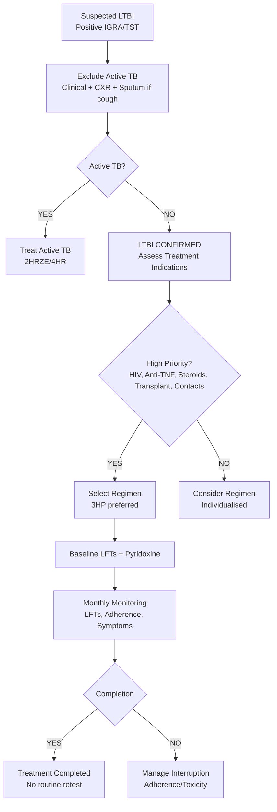

# Latent Tuberculosis Infection (LTBI)

Related: [[Pulmonary tuberculosis]], [[Drug-resistant tuberculosis]], [[HIV/TB coinfection]], [[BCG vaccination]], [[Immunosuppression]], [[TNF-alpha inhibitors]], [[Biologics]], [[Immigration screening]]

> [!important]
> **Latent TB infection (LTBI)** = **Mycobacterium tuberculosis infection** without active disease (no symptoms, normal CXR, negative microbiology). **Key FCPS/MRCP**: **IGRA > TST** (BCG independent), **treat before immunosuppression** (anti-TNF, steroids >15mg, transplant), **regimens**: 3HR, 4R, 3HP, 6H/9H, **3HP preferred** (completion), **rule out active TB first** (clinical, CXR, sputum), **monitor hepatotoxicity**.

## Learning Objectives
- Define **LTBI** and distinguish from **active TB**
- Select **appropriate test** (IGRA vs TST) and interpret in context of BCG
- Apply **treatment indications** (contacts, immunosuppression, HIV, silica, CKD, etc.)
- Prescribe **appropriate regimen** (3HP, 4R, 3HR, 6H/9H) with **monitoring**
- **Rule out active TB** before LTBI treatment (clinical, CXR, sputum)
- Manage **special populations** (HIV, pregnancy, children, CKD, liver disease)
- Monitor **hepatotoxicity** and **adherence**

## Definition
**Latent TB Infection (LTBI)** = **M. tuberculosis infection** with **immune control** but **no active disease**.
- **No symptoms** (asymptomatic)
- **Normal CXR** (or old fibrotic scars only)
- **Negative sputum** (smear/culture/PCR)
- **Positive immune test** (IGRA or TST)

> **FCPS/MRCP tip**: **LTBI ≠ Active TB**. **LTBI is NOT infectious**. **LTBI can reactivate** (5–10% lifetime, higher if immunocompromised). **IGRA preferred over TST** (BCG independent).

## Pathophysiology
1. **Inhalation** of M. tuberculosis → alveolar macrophage phagocytosis
2. **Immune response**: Th1 (IFN-γ, TNF-α) → macrophage activation → granuloma formation
3. **Containment**: Bacteria dormant in granuloma (caseous centre, fibrotic capsule)
4. **Latency**: Bacteria viable but non-replicating (dormant)
5. **Reactivation**: Immune impairment → granuloma breakdown → **active TB**

## Diagnosis
### 1. Interferon-Gamma Release Assay (IGRA) — **PREFERRED**
| Test | Principle | Advantages |
|------|-----------|------------|
| **QuantiFERON-TB Gold Plus (QFT-Plus)** | ELISA: IFN-γ response to **ESAT-6/CFP-10** (TB-specific antigens) | **BCG independent**, single visit, objective |
| **T-SPOT.TB** | ELISPOT: IFN-γ producing T-cells to ESAT-6/CFP-10 | **BCG independent**, higher sensitivity in immunocompromised |

| Feature | IGRA | TST |
|---------|------|-----|
| **BCG effect** | **None** | False + (if BCG after infancy) |
| **Sensitivity (active TB)** | ~85–90% | ~80% |
| **Specificity** | **>95%** | ~60–70% (BCG) |
| **Visits** | 1 (blood draw) | 2 (read at 48–72h) |
| **Reader bias** | None | Yes |
| **Immunocompromised** | T-SPOT > QFT | Lower sensitivity |

> **FCPS/MRCP tip**: **IGRA is preferred** for most adults. **TST only if IGRA unavailable or children <5y**.

### 2. Tuberculin Skin Test (TST / Mantoux)
- **5 TU PPD** intradermal → read **induration at 48–72h**
- **Cut-offs** (UK/NICE):
  - **≥5mm**: HIV, contacts, immunosuppressed, fibrotic CXR
  - **≥10mm**: Recent immigrants from high TB burden, healthcare workers, IVDU, prisoners
  - **≥15mm**: Low risk (no risk factors)

### 3. Ruling Out Active TB (MANDATORY Before LTBI Treatment)
| Investigation | Indication |
|---------------|------------|
| **Clinical assessment** | Cough, fever, weight loss, night sweats, haemoptysis |
| **CXR (PA erect)** | **Mandatory** — exclude active TB, old fibrosis |
| **Sputum** (×3) | GeneXpert MTB/RIF Ultra, smear, culture — if cough |
| **Symptom screen** | Standardised questionnaire |

> **FCPS/MRCP tip**: **Never treat LTBI without excluding active TB first**. **Normal CXR + no symptoms = LTBI likely**.

## Treatment Indications (Who to Treat)
### High Priority (Strong Recommendation)
| Group | Rationale |
|-------|-----------|
| **Close contacts** of pulmonary TB (especially <5y, immunocompromised) | High progression risk |
| **HIV** (any CD4) | **20–30x reactivation risk** |
| **Anti-TNF therapy** (infliximab, adalimumab, etc.) | **High reactivation risk** (screen before starting) |
| **Other biologics** (anti-IL-6, anti-IL-17, anti-IL-23, JAK inhibitors) | Increased risk |
| **Steroids ≥15mg prednisolone ≥4 weeks** | Immunosuppression |
| **Solid organ / HSCT transplant** (pre/post) | Immunosuppression |
| **CKD / Dialysis** | 10–25x risk |
| **Silicosis** | 3x risk |
| **Gastrectomy / Jejunoileal bypass** | Historical risk |
| **Head/Neck/Lung cancer** (pre-chemo/radiotherapy) | Immunosuppression |

### Lower Priority (Individualised)
- **Healthcare workers** (newly positive conversion)
- **Prisoners, homeless, IVDU** (high prevalence settings)
- **Immigrants from high TB burden countries** (screening programmes)
- **Children <5y** (household contacts)

## Treatment Regimens (Adults)
| Regimen | Duration | Dosing | Key Features |
|---------|----------|--------|--------------|
| **3HP** (3 months weekly Rifapentine + INH) | **12 weeks** | **RPT 900mg + INH 900mg + Pyridoxine 25mg weekly (DOT)** | **Preferred** (highest completion, lowest hepatotoxicity) |
| **4R** (4 months daily Rifampicin) | **4 months** | **R 10mg/kg daily (max 600mg)** | Alternative if 3HP contraindicated/unavailable |
| **3HR** (3 months daily Rifampicin + INH) | **3 months** | **R 10mg/kg + H 5mg/kg daily + Pyridoxine** | Shorter than 6H, higher hepatotoxicity than 3HP |
| **6H / 9H** (6–9 months daily INH) | **6–9 months** | **H 5mg/kg (max 300mg) + Pyridoxine** | If rifampicin contraindicated (interactions, resistance) |

> **FCPS/MRCP tip**: **3HP is preferred** (high completion, low toxicity). **3HR** if RPT unavailable. **6H/9H** if rifampicin contraindicated.

### Paediatric Dosing (Weight-Based)
| Regimen | Dosing |
|---------|--------|
| **3HP** | RPT 15mg/kg (max 900mg) + INH 15–25mg/kg (max 900mg) weekly ×12 |
| **4R** | R 15mg/kg (max 600mg) daily ×4mo |
| **3HR** | R 15mg/kg + H 10–20mg/kg daily ×3mo |

### Pyridoxine (Vitamin B6)
- **25–50mg daily** with INH-containing regimens
- **Prevents peripheral neuropathy** (especially in malnourished, HIV, diabetes, alcohol, pregnancy, renal failure)

## Monitoring During Treatment
| Parameter | Frequency |
|-----------|-----------|
| **Clinical review** (symptoms, adherence) | Monthly |
| **LFTs (ALT, AST, bilirubin)** | **Baseline, then monthly** (more often if risk factors) |
| **Symptom screen** (nausea, rash, jaundice, neuropathy) | Each visit |
| **Pyridoxine compliance** | Each visit |
| **INH/RPT adherence (DOT for 3HP)** | Weekly |

### Hepatotoxicity Grading & Action
| Grade | ALT/AST | Action |
|-------|---------|--------|
| **Grade 1** | 1–2.5x ULN | Continue, monitor weekly |
| **Grade 2** | 2.6–5x ULN | Continue, monitor 2x/week; consider holding if symptomatic |
| **Grade 3** | 5.1–10x ULN | **HOLD all drugs**, investigate, restart sequentially |
| **Grade 4** | >10x ULN | **STOP ALL**, urgent referral |

> **Restart sequence**: INH → RIF → RPT (least to most hepatotoxic)

## Special Populations

### 1. HIV
- **Screen all HIV+** at diagnosis and annually if high risk
- **IGRA preferred** (TST false - in low CD4)
- **Treat LTBI regardless of CD4** (ART + LTBI treatment reduces TB by 90%)
- **Regimen**: 3HP OK with DTG-based ART; **rifampicin → rifabutin** if on PI/NNRTI (except DTG)

### 2. Pregnancy
- **Defer LTBI treatment** until postpartum (unless high risk: HIV, recent contact)
- **If must treat**: **INH 300mg daily + Pyridoxine 25mg daily** (safe, avoid RIF/RPT in 1st trimester if possible)
- **Breastfeeding**: INH/RIF safe (low milk levels); pyridoxine for infant if on INH

### 3. Chronic Kidney Disease / Dialysis
- **INH/RIF/PZA** — **no dose adjustment** (hepatic metabolism)
- **Pyridoxine 25mg post-dialysis**
- **3HP** preferred (weekly dosing convenient)

### 4. Liver Disease
- **Child-Pugh A**: Standard regimens with close LFT monitoring
- **Child-Pugh B/C**: **Avoid INH/RIF**; consider **4R** (rifampicin only) or **INH alone** with extreme caution; expert advice

### 5. Immunosuppression (Anti-TNF, Steroids, Transplant)
- **Screen BEFORE starting** immunosuppression
- **Treat LTBI for 1 month BEFORE starting anti-TNF** if possible
- **Continue LTBI treatment** during immunosuppression

## Drug Interactions
### Rifampicin / Rifapentine — **Potent CYP3A4 Inducers**
| Affected Drugs | Management |
|----------------|------------|
| **ART (PIs, NNRTIs)** | **Switch to DTG** (50mg BD with rifampicin) or raltegravir; avoid PIs |
| **DOACs** (apixaban, rivaroxaban) | Switch to warfarin/LMWH |
| **OCP** | **Use additional contraception** (RIF reduces levels) |
| **Corticosteroids** | Increase dose (RIF induces metabolism) |
| **Antifungals (azoles)** | Avoid or use with caution (levels ↓) |
| **Immunosuppressants** (tacrolimus, cyclosporine, sirolimus) | Monitor levels, increase dose |
| **Anti-seizure** (carbamazepine, phenytoin) | Monitor levels (mutual induction) |

### Isoniazid
- **Pyridoxine** (prevents neuropathy)
- **Avoid alcohol** (hepatotoxicity)
- **Tyramine-rich foods** (mild MAOI effect — rare)

## Treatment Completion & Outcomes
| Outcome | Definition |
|---------|------------|
| **Completed** | Finished regimen within recommended time (e.g., 12 weeks for 3HP) |
| **Incomplete** | Did not finish (default, toxicity, pregnancy) |
| **Defaulted** | Missed ≥2 months consecutive |

**Post-treatment**: No routine repeat testing. **Re-infection possible** — re-screen if new exposure.

## BCG Vaccination & LTBI Testing
- **BCG** → **false + TST** (if given after infancy, multiple doses)
- **IGRA** = **BCG independent** (uses ESAT-6/CFP-10 — absent in BCG)
- **BCG scar ≠ LTBI** — IGRA/TST needed

## Cost-Effectiveness
- **3HP** most cost-effective (high completion, low toxicity)
- **Targeted testing** (high-risk groups) > population screening
- **IGRA** cost-effective vs TST (avoids false + treatment)

## Prognosis
- **Without treatment**: 5–10% lifetime reactivation (higher if immunocompromised)
- **With treatment**: 60–90% risk reduction (regimen dependent)
- **3HP**: ~80% completion, ~80% efficacy
- **4R**: ~75% completion, ~80% efficacy
- **6H/9H**: ~60% completion, ~90% efficacy (if completed)

## Topic Correlation
- [[Pulmonary tuberculosis]] — active TB
- [[Drug-resistant tuberculosis]] — MDR LTBI
- [[HIV/TB coinfection]] — HIV screening
- [[BCG vaccination]] — TST interpretation
- [[Immunosuppression]] — TNF-alpha inhibitors
- [[Occupational lung disease]] — silicosis

## FCPS/MRCP High-Yield Points
1. **LTBI** = M. tb infection, **no active disease**, **not infectious**
2. **IGRA > TST** (BCG independent, single visit, objective)
3. **Rule out active TB FIRST** (CXR, symptoms, sputum if cough)
4. **Treat before immunosuppression** (anti-TNF, steroids ≥15mg, transplant)
5. **Regimens**: **3HP preferred** (12 weekly doses, high completion), 4R, 3HR, 6H/9H
5. **Monitor LFTs monthly** (hepatotoxicity); pyridoxine with INH
6. **HIV**: screen at diagnosis, treat LTBI regardless CD4, DTG with rifampicin
7. **Pregnancy**: defer unless high risk; INH safe
8. **Rule out active TB before LTBI treatment** (never treat LTBI if active TB suspected)
9. **Rifampicin interactions**: potent CYP3A4 inducer (ART, DOACs, OCP, steroids, immunosuppressants)
10. **MDR-TB contacts**: levofloxacin/delamanid prophylaxis (specialist)

## Common Viva Questions
1. LTBI vs active TB differentiation
2. IGRA vs TST (pros/cons, BCG effect)
3. Treatment indications (who to screen/treat)
4. Regimens (3HP, 4R, 3HR, 6H/9H) — preferred, dosing, duration
5. Monitoring (LFTs, pyridoxine, adherence)
6. Special populations (HIV, pregnancy, CKD, liver disease)
7. Rifampicin drug interactions
8. BCG effect on TST vs IGRA
9. Anti-TNF screening protocol
10. MDR contact management

## Common Confusions / Exam Traps
- **Treating LTBI without excluding active TB** — **NEVER** (risk of monotherapy resistance)
- **TST positive = LTBI** — NO (could be BCG, NTM, active TB — need clinical correlation)
- **IGRA negative = no LTBI** — NO (false - in immunocompromised, early infection)
- **Treating LTBI with 2HRZE/4HR** — WRONG (that's active TB regimen)
- **Rifampicin + DOAC** = safe — WRONG (RIF reduces DOAC levels → thrombosis risk)
- **Pregnancy = contraindication to LTBI treatment** — NO (INH safe, defer if low risk)
- **BCG scar = LTBI** — NO (BCG ≠ LTBI; need IGRA/TST)
- **Rifampicin + OCP** = safe — WRONG (reduces OCP efficacy)
- **3HP = daily** — WRONG (weekly)
- **INH monotherapy = 3 months** — WRONG (6–9 months)

## Mnemonics
- **LTBI TESTS**: **I**GRA = **I**ndependent of BCG; **T**ST = **T**ainted by BCG
- **3HP REGIMEN**: **3** months, **H** weekly, **P**yridoxine
- **LTBI TREAT FIRST**: **H**IV, **A**nti-TNF, **S**teroids, **T**ransplant, **S**ilicosis, **C**KD, **C**ontacts = **HASTSCC**
- **RISPIN INDUCTION**: **R**IFampicin = **S**trong **P**450 **IN**duc**A**tor = **RISPIA**
- **INEH MONITORING**: **I**NH = **H**epatotoxicity, **N**europathy (pyridoxine), **E**fficacy (adherence), **H**epatotoxicity monitoring

## Mind Map
```mermaid
mindmap
  root((LTBI))
    Definition
      M. tb infection
      No active disease
      Not infectious
    Diagnosis
      IGRA (preferred)
      TST (if IGRA unavailable)
      Exclude active TB (CXR, sputum)
    Treatment Indications
      Contacts, HIV, Anti-TNF, Steroids, Transplant, Silicosis, CKD
    Regimens
      3HP (preferred) - 12 weekly
      4R - 4mo daily
      3HR - 3mo daily
      6H/9H - rifampicin contraindicated
    Monitoring
      Monthly LFTs
      Pyridoxine with INH
      Adherence (DOT for 3HP)
    Special
      HIV: Screen at diagnosis
      Pregnancy: Defer/INH safe
      Anti-TNF: Screen BEFORE start
      Rifampicin interactions
```

## Flowchart


## Suggested Visuals / Image Notes
- IGRA vs TST comparison table
- 3HP regimen schedule
- Hepatotoxicity grading algorithm
- Rifampicin interaction chart
- Treatment algorithm for contacts
- HIV LTBI algorithm

## Suggested Video References
- NICE NG33 LTBI guidelines
- WHO LTBI guidelines
- BTS TB guidelines
- 3HP regimen counselling
- IGRA interpretation
- Anti-TNF screening protocol

## One-Page Revision Summary
- **LTBI** = M. tb infection, no active TB, not infectious
- **IGRA preferred** over TST (BCG independent)
- **Exclude active TB FIRST** (CXR, symptoms, sputum)
- **Treat**: Close contacts, HIV, anti-TNF, steroids ≥15mg, transplant, silicosis, CKD
- **Regimens**: **3HP preferred** (RPT+INH weekly ×12, DOT, pyridoxine); 4R, 3HR, 6H/9H
- **Monitor**: Monthly LFTs, pyridoxine with INH, DOT for 3HP
- **Hepatotoxicity**: Grade 3/4 → hold all, restart INH→RIF→RPT
- **HIV**: Screen at diagnosis, treat regardless CD4, DTG with rifampicin
- **Anti-TNF**: Screen BEFORE start, treat LTBI 1mo before
- **Rifampicin interactions**: Potent CYP3A4 inducer (ART, DOACs, OCP, steroids)
- **Never treat LTBI without excluding active TB**

## 24-Hour Recall Prompts
- LTBI definition
- IGRA vs TST
- Active TB exclusion
- Treatment indications (high priority)
- 3HP regimen details
- Monitoring (LFTs, pyridoxine)
- HIV and anti-TNF specifics
- Rifampicin interactions
- Pregnancy management
- Active TB exclusion rule

## 7-Day / 15-Day / 30-Day Revision Tracker
- [ ] Day 1 completed
- [ ] 24-hour recall completed
- [ ] Day 7 revision completed
- [ ] Day 15 revision completed
- [ ] Day 30 revision completed

## Must Know / Should Know / Nice to Know
### Must Know
- LTBI definition vs active TB
- IGRA vs TST (BCG effect)
- Exclude active TB first (mandatory)
- Treatment indications (high priority groups)
- 3HP preferred regimen
- Monitoring (LFTs, pyridoxine)
- HIV and anti-TNF specifics
- Rifampicin interactions
- Active TB exclusion rule

### Should Know
- 4R, 3HR, 6H/9H alternatives
- Pregnancy management
- CKD/dialysis dosing
- Liver disease adjustments
- MDR contact management
- BCG effect on TST
- Cost-effectiveness 3HP

### Nice to Know
- MDR-TB LTBI regimens (levofloxacin/delamanid)
- TST boosting phenomenon
- IGRA conversion/reversion
- Novel biomarkers (IP-10, CXCL9)
- LTBI in children <5y
- Cost-effectiveness models
- Latent TB in healthcare workers

## Self-Test Scorecard
- Understanding: /10
- Recall: /10
- MCQ Performance: /10
- SBA Performance: /10
- Viva Confidence: /10
- Total: /50

> [!tip]
> Interpretation: <35 = weak topic, 35-44 = acceptable but insecure, 45+ = strong exam-ready topic.

## Exam Answer Modes
### Long Answer Skeleton
- Definition (LTBI vs active TB)
- Diagnosis (IGRA vs TST, active TB exclusion)
- Treatment indications (priority groups)
- Regimens (3HP, 4R, 3HR, 6H/9H) with dosing
- Monitoring (LFTs, pyridoxine, adherence)
- Special populations (HIV, pregnancy, CKD, liver, anti-TNF)
- Drug interactions (rifampicin induction)
- MDR contact management

### Short Note Skeleton
- Definition box
- IGRA vs TST table
- Regimens table
- Monitoring box
- Special populations box

### Viva One-Liners
- "LTBI = M. tb infection, no active TB, not infectious"
- "IGRA > TST (BCG independent); TST false + if BCG after infancy"
- "NEVER treat LTBI without excluding active TB first (CXR, sputum)"
- "3HP = 12 weekly doses RPT+INH+pyridoxine (DOT) — preferred"
- "Treat before: HIV, anti-TNF, steroids ≥15mg, transplant, silicosis, CKD, contacts"
- "Monitor: monthly LFTs, pyridoxine 25mg with INH, DOT for 3HP"
- "Hepatotoxicity: Grade 3/4 → hold all, restart INH→RIF→RPT"
- "HIV: screen at diagnosis, treat LTBI regardless CD4, DTG with rifampicin"
- "Anti-TNF: screen BEFORE start, treat LTBI 1mo before"
- "Rifampicin = potent CYP3A4 inducer (ART, DOACs, OCP, steroids, immunosuppressants)"
- "NEVER treat LTBI without excluding active TB first"

### Ward-Case Discussion Points
- 30F starting adalimumab for RA, IGRA+, CXR normal → LTBI → 3HP ×1mo → start adalimumab
- 40M HIV+ CD4 350, IGRA+, no symptoms, CXR normal → 3HP with DTG-based ART
- 60F on prednisolone 20mg for vasculitis, TST 15mm, CXR old fibrosis → LTBI → 3HP (rifabutin if on PI)
- 25F pregnant 20wks, household contact of smear+ TB, IGRA+ → defer LTBI treatment → treat post-partum

### Last-Night-Before-Exam Sheet
- LTBI = M. tb infection, no active TB
- IGRA > TST (BCG independent)
- Exclude active TB FIRST (CXR mandatory)
- 3HP preferred (12 weekly, DOT, pyridoxine)
- Treat: HIV, contacts, anti-TNF, steroids, transplant, silicosis, CKD
- Monitor monthly LFTs + pyridoxine
- Rifampicin = CYP3A4 inducer (ART, DOACs, OCP, steroids)
- HIV: DTG with rifampicin
- Anti-TNF: screen BEFORE, treat 1mo before
- NEVER treat LTBI without excluding active TB

## Summary
**LTBI** = **M. tuberculosis infection** without active disease (asymptomatic, normal CXR, negative sputum, positive immune test). **IGRA preferred** (BCG independent). **Must exclude active TB FIRST** (CXR mandatory, sputum if cough). **Treatment indications**: close contacts, **HIV** (any CD4), **anti-TNF** (screen before), **steroids ≥15mg/4wks**, **transplant**, **silicosis**, **CKD**, **contacts**. **Preferred regimen**: **3HP** (weekly Rifapentine 900mg + INH 900mg + pyridoxine 25mg ×12 weeks, DOT). **Alternatives**: 4R (rifampicin daily ×4mo), 3HR (daily ×3mo), 6H/9H (INH alone if rifampicin contraindicated). **Monitoring**: monthly LFTs, pyridoxine 25mg daily with INH, DOT for 3HP. **Hepatotoxicity**: grade-based hold/restart (INH→RIF→RPT). **HIV**: screen at diagnosis, treat regardless CD4, **DTG 50mg BD with rifampicin**. **Anti-TNF**: screen BEFORE, treat LTBI 1mo before. **Rifampicin**: potent CYP3A4 inducer (ART, DOACs, OCP, steroids). **Pregnancy**: defer unless high risk (INH safe). **MDR contacts**: specialist (levofloxacin/delamanid). **NEVER treat LTBI without excluding active TB first**.

## MCQs (10)
1. **Preferred test** for LTBI diagnosis in BCG-vaccinated adults:
   A. TST (Mantoux)
   B. **IGRA (QFT/T-SPOT)**
   C. CXR
   D. Sputum culture

2. **Mandatory investigation** before starting LTBI treatment:
   A. HIV test
   B. **CXR (PA erect)**
   C. Liver biopsy
   D. CT chest

3. **Preferred LTBI regimen** (NICE/WHO):
   A. 6H daily
   B. 9H daily
   C. 4R daily
   D. **3HP weekly**

4. **3HP regimen** duration and dosing:
   A. 3 months daily INH + RIF
   B. **12 weeks weekly RPT 900mg + INH 900mg + pyridoxine**
   C. 4 months daily RIF
   D. 6 months daily INH

5. **Highest priority for LTBI treatment**:
   A. Healthcare worker
   B. **HIV (any CD4)**
   C. Recent immigrant
   D. Prisoner

6. **Rifampicin interaction** — which drug requires dose adjustment?
   A. Paracetamol
   B. **DOACs (apixaban, rivaroxaban)**
   C. Metformin
   D. Aspirin

7. **Anti-TNF therapy** — LTBI screening timing:
   A. Screen after 1 month of therapy
   B. **Screen BEFORE starting anti-TNF**
   C. Screen after 3 months
   D. No screening needed

8. **HIV + LTBI** — preferred ART with rifampicin-based LTBI regimen:
   A. Efavirenz
   B. **Dolutegravir 50mg BD**
   C. Lopinavir/ritonavir
   D. Atazanavir/ritonavir

9. **Pregnancy** and LTBI treatment:
   A. Contraindicated
   B. **Defer unless high risk; INH safe if needed**
   C. 3HP preferred
   D. Rifampicin preferred

10. **Mandatory step BEFORE LTBI treatment**:
    A. Sputum culture
    B. **Exclude active TB (CXR + clinical)**
    C. Liver biopsy
    D. IGRA confirmation

## SBA Questions (10)
1. A 35F starting adalimumab for RA. IGRA+, CXR normal. Best management?
   A. Start adalimumab immediately
   B. **3HP x4 weeks, then start adalimumab**
   C. 9H INH, then adalimumab
   D. No LTBI treatment needed

2. A 40M HIV+ (CD4 200), IGRA+, no symptoms, CXR normal. Best LTBI regimen?
   A. 9H INH
   B. **3HP with dolutegravir-based ART**
   C. 4R
   D. 6H

3. A 60F on prednisolone 20mg for vasculitis, IGRA+, CXR old fibrosis. Best LTBI regimen?
   A. 3HP (rifabutin if on PI)
   B. 9H
   C. 4R
   D. No treatment (old fibrosis)

4. A 25F pregnant 20wks, household contact of smear+ TB, IGRA+. Management?
   A. 3HP now
   B. **Defer until post-partum (unless high risk)**
   C. 9H INH now
   D. 4R now

5. Rifampicin interaction — which combination is SAFE?
   A. Rifampicin + apixaban
   B. **Rifampicin + dolutegravir 50mg BD**
   C. Rifampicin + combined OCP
   D. Rifampicin + warfarin (no monitor)

5. Hepatotoxicity Grade 3 (ALT 8x ULN) on 3HP — action:
   A. Continue, monitor weekly
   B. **Hold ALL drugs, investigate, restart INH→RIF→RPT**
   C. Stop INH only, continue RPT
   D. Reduce INH dose

6. Anti-TNF therapy in patient with prior treated LTBI (completed 3HP 2 years ago). Need re-screen?
   A. Yes, re-screen
   B. **No, if completed adequate LTBI treatment**
   C. Only if IGRA negative
   D. Only if symptomatic

7. 3HP regimen — correct pyridoxine dose:
   A. 10mg daily
   B. **25mg daily**
   C. 50mg daily
   D. 100mg daily

8. TST vs IGRA — BCG effect:
   A. Both affected by BCG
   B. **TST false + if BCG; IGRA unaffected**
   C. IGRA false + if BCG
   D. Neither affected

9. MDR-TB contact — prophylaxis:
   A. 3HP
   B. 4R
   C. **Levofloxacin 6mo (specialist)**
   D. 6H

10. Active TB exclusion before LTBI treatment — minimum:
    A. CXR only
    B. **CXR + clinical assessment (+ sputum if cough)**
    C. IGRA only
    D. TST only

## Flashcards
- Q: LTBI definition
  A: M. tb infection, no active TB, not infectious
- Q: Preferred test
  A: IGRA (BCG independent)
- Q: Exclude active TB first
  A: CXR mandatory (+ sputum if cough)
- Q: Preferred regimen
  A: 3HP (RPT+INH weekly x12, DOT, pyridoxine)
- Q: Treat before immunosuppression
  A: HIV, anti-TNF, steroids≥15mg, transplant, silicosis, CKD
- Q: 3HP regimen
  A: RPT 900mg + INH 900mg + pyridoxine 25mg weekly x12
- Q: Monitoring
  A: Monthly LFTs, pyridoxine, DOT for 3HP
- Q: HIV + rifampicin
  A: DTG 50mg BD
- Q: Anti-TNF screen
  A: BEFORE start, treat LTBI 1mo before
- Q: Never treat LTBI without
  A: Excluding active TB

## Answer Key with Explanations
### MCQs
1. **B** — IGRA preferred (BCG independent).
2. **B** — CXR mandatory to exclude active TB before LTBI treatment.
3. **D** — 3HP (weekly RPT+INH ×12 weeks) is preferred.
4. **B** — 3HP = weekly RPT 900mg + INH 900mg + pyridoxine 25mg ×12 weeks.
5. **B** — HIV (any CD4) is highest priority for LTBI treatment.
6. **B** — Rifampicin induces CYP3A4 → reduces DOAC levels.
7. **B** — Screen BEFORE anti-TNF; treat LTBI 1 month prior if possible.
8. **B** — DTG 50mg BD with rifampicin (rifampicin induces DTG metabolism).
9. **B** — Defer LTBI in pregnancy unless high risk; INH safe if needed.
10. **B** — Exclude active TB (CXR + clinical +/- sputum) is mandatory.

### SBAs
1. **B** — Anti-TNF: screen before, treat LTBI 1mo before (3HP x4mo is standard).
2. **B** — HIV + LTBI: 3HP with DTG-based ART (rifampicin induces DTG, double dose).
3. **A** — Steroids ≥15mg: LTBI treatment indicated; if on PI, use rifabutin instead of RIF.
4. **B** — Pregnancy: defer unless high risk; INH safe if needed.
5. **B** — Dolutegravir 50mg BD with rifampicin is safe; DOACs, OCP, warfarin affected.
6. **B** — Grade 3/4 hepatotoxicity: hold ALL drugs, restart INH→RIF→RPT.
7. **B** — Completed adequate LTBI treatment = no re-screen needed for anti-TNF.
8. **B** — 3HP pyridoxine = 25mg daily (with weekly INH 900mg).
9. **B** — TST false + if BCG; IGRA unaffected.
10. **C** — MDR contact: levofloxacin 6mo (specialist management).

### Flashcards
All correct as written.

---

## Summary
**LTBI** = M. tuberculosis infection **without active disease** (asymptomatic, normal CXR, negative sputum, positive immune test). **IGRA preferred** over TST (BCG independent). **Must exclude active TB FIRST** (CXR mandatory, sputum if cough). **Treatment indications**: close contacts, **HIV (any CD4)**, **anti-TNF** (screen BEFORE), **steroids ≥15mg/4wks**, **transplant**, **silicosis**, **CKD**, **contacts**. **Preferred regimen**: **3HP** (weekly Rifapentine 900mg + INH 900mg + pyridoxine 25mg ×12 weeks, **DOT**). **Alternatives**: 4R (rifampicin daily ×4mo), 3HR (daily ×3mo), 6H/9H (INH alone if rifampicin contraindicated). **Monitoring**: monthly LFTs, **pyridoxine 25mg daily** with INH, **DOT for 3HP**. **Hepatotoxicity**: grade-based hold/restart (INH→RIF→RPT). **HIV**: screen at diagnosis, treat regardless CD4, **DTG 50mg BD with rifampicin**. **Anti-TNF**: screen **BEFORE**, treat LTBI 1 month before. **Rifampicin**: potent CYP3A4 inducer (ART, DOACs, OCP, steroids). **Pregnancy**: defer unless high risk (INH safe). **MDR contacts**: specialist (levofloxacin/delamanid). **NEVER treat LTBI without excluding active TB first**.

## MCQs (10)
1. **Preferred test** for LTBI in BCG-vaccinated adult:
   A. TST
   B. **IGRA**
   C. CXR
   D. Sputum

2. **Mandatory before LTBI treatment**:
   A. HIV test
   B. **CXR**
   C. Liver biopsy
   D. CT

3. **Preferred LTBI regimen**:
   A. 6H
   B. 9H
   C. 4R
   D. **3HP**

4. **3HP regimen**:
   A. Daily INH+RIF ×3mo
   B. **Weekly RPT+INH ×12wk**
   C. Daily RIF ×4mo
   D. Daily INH ×6mo

5. **Highest priority for LTBI treatment**:
   A. Healthcare worker
   B. **HIV**
   C. Immigrant
   D. Prisoner

6. **Rifampicin interaction**:
   A. Paracetamol
   B. **DOACs**
   C. Metformin
   D. Aspirin

7. **Anti-TNF screening**:
   A. After 1 month
   B. **BEFORE**
   C. After 3 months
   D. Never

8. **HIV + rifampicin LTBI**:
   A. Efavirenz
   B. **DTG 50mg BD**
   C. Lopinavir/ritonavir
   D. Atazanavir/ritonavir

9. **Pregnancy + LTBI**:
   A. Contraindicated
   B. **Defer (INH safe if needed)**
   C. 3HP preferred
   D. RIF preferred

10. **Before LTBI treatment**:
    A. Sputum
    B. **Exclude active TB (CXR)**
    C. Liver biopsy
    D. IGRA confirm

## SBA Questions (10)
1. 35F starting adalimumab, IGRA+, CXR normal. Management?
   A. Start adalimumab
   B. **3HP ×4wks → adalimumab**
   C. 9H INH
   D. No treatment

2. 40M HIV+ CD4 200, IGRA+, CXR normal. LTBI regimen?
   A. 9H
   B. **3HP + DTG ART**
   C. 4R
   D. 6H

3. 25F pregnant 20wks, household TB contact, IGRA+. Management?
   A. 3HP now
   B. **Defer post-partum**
   C. 9H INH
   D. 4R

4. Rifampicin interaction — UNSAFE combination:
   A. Rifampicin + dolutegravir 50mg BD
   B. **Rifampicin + apixaban**
   C. Rifampicin + warfarin (monitor)
   D. Rifampicin + metformin

5. Grade 3 hepatotoxicity on 3HP:
   A. Continue + weekly LFT
   B. **Hold ALL, restart INH→RIF→RPT**
   C. Stop INH only
   D. Reduce INH

6. Completed 3HP 2yrs ago, now starting anti-TNF. Re-screen?
   A. Yes
   B. **No (adequate prior treatment)**
   C. Only if IGRA-
   D. Only if symptomatic

7. 3HP pyridoxine dose:
   A. 10mg
   B. **25mg**
   C. 50mg
   D. 100mg

8. TST vs IGRA — BCG:
   A. Both affected
   B. **TST false +, IGRA unaffected**
   C. IGRA false +, TST unaffected
   D. Neither

9. MDR contact prophylaxis:
   A. 3HP
   B. 4R
   C. **Levofloxacin 6mo (specialist)**
   D. 6H

10. Minimum active TB exclusion:
    A. CXR only
    B. **CXR + clinical (+ sputum if cough)**
    C. IGRA only
    D. TST only

## Flashcards
- Q: LTBI def
  A: M. tb infection, no active TB
- Q: Test preference
  A: IGRA > TST (BCG independent)
- Q: Exclude active TB
  A: CXR mandatory + sputum if cough
- Q: Regimen pref
  A: 3HP weekly x12 (DOT, pyridoxine)
- Q: Treat before
  A: HIV, anti-TNF, steroids≥15mg, transplant, silicosis, CKD
- Q: 3HP details
  A: RPT900+INH900+pyridoxine25 weeklyx12
- Q: Monitor
  A: Monthly LFTs, pyridoxine, DOT
- Q: HIV + rifampicin
  A: DTG 50mg BD
- Q: Anti-TNF screen
  A: BEFORE, treat 1mo before
- Q: Golden rule
  A: NEVER treat LTBI without excluding active TB

## Answer Key with Explanations
### MCQs
1. **B** — IGRA preferred (BCG independent).
2. **B** — CXR mandatory to exclude active TB.
3. **D** — 3HP (weekly RPT+INH ×12 weeks) preferred.
4. **B** — 3HP = weekly RPT+INH ×12 weeks + pyridoxine.
5. **B** — HIV highest priority.
6. **B** — DOACs reduced by rifampicin induction.
7. **B** — Screen BEFORE anti-TNF, treat 1 month prior.
8. **B** — DTG 50mg BD with rifampicin (induction compensated).
9. **B** — Defer in pregnancy unless high risk; INH safe.
10. **B** — Exclude active TB (CXR + clinical +/- sputum) mandatory.

### SBAs
1. **B** — Anti-TNF: screen before, 3HP ×4 weeks before starting biologic.
2. **B** — HIV+LTBI: 3HP with DTG-based ART (rifampicin induces DTG).
3. **A** — Steroids ≥15mg: LTBI indicated; rifabutin if on PI.
4. **B** — Pregnancy: defer unless high risk; INH safe.
5. **B** — Rifampicin + DOAC = unsafe (reduced levels).
6. **B** — Grade 3/4: hold ALL, restart INH→RIF→RPT.
7. **B** — Completed adequate LTBI = no re-screen needed.
8. **B** — 3HP pyridoxine = 25mg daily.
9. **B** — TST false + BCG; IGRA unaffected.
10. **C** — MDR contact: levofloxacin 6mo specialist.

### Flashcards
All correct as written.

---
