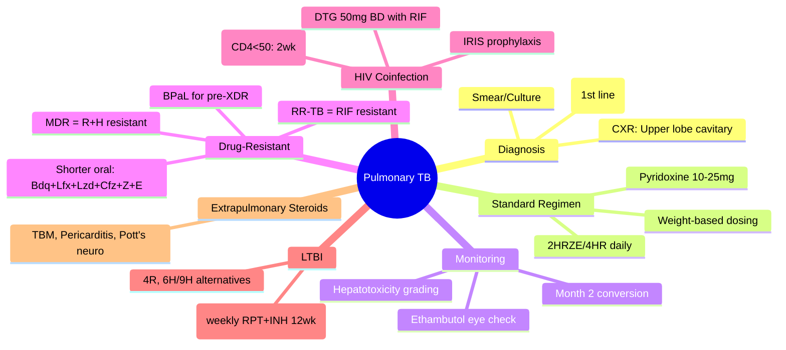
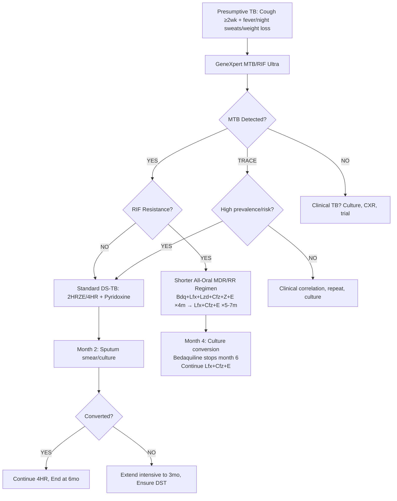

# Pulmonary Tuberculosis (TB)

Related: [[Latent tuberculosis infection]], [[Drug-resistant tuberculosis]], [[Non-tuberculous mycobacterial pulmonary disease]], [[HIV/TB coinfection]], [[Pleural effusion]], [[Empyema]], [[Bronchiectasis]]

> [!important]
> **Pulmonary TB** = **Mycobacterium tuberculosis** infection of lung parenchyma. **Global leading infectious killer**. **Key FCPS/MRCP**: **Case definitions** (bacteriologically confirmed vs clinical), **RIPE regimen** (2HRZE/4HR), **GeneXpert MTB/RIF Ultra** (first-line diagnostic), **Drug-resistant TB** definitions (RR-TB, MDR-TB, pre-XDR, XDR), **HIV coinfection** (early ART, IRIS), **Latent TB** (LTBI) treatment options, **Adverse drug reactions** (hepatotoxicity, optic neuritis, neuropathy), **TB meningitis** (steroids), **TB pericarditis** (steroids).

## Learning Objectives
- Apply **WHO case definitions** for TB (bacteriologically confirmed, clinically diagnosed)
- Use **GeneXpert MTB/RIF Ultra** as first-line diagnostic (sensitivity, rifampicin resistance detection)
- Prescribe **standard RIPE regimen** (2HRZE/4HR) with **weight-based dosing** and **pyridoxine**
- Recognise and manage **drug-resistant TB** (RR-TB, MDR-TB, pre-XDR, XDR) with **shorter all-oral regimens**
- Manage **HIV/TB coinfection** (ART timing, IRIS prophylaxis)
- Diagnose and treat **latent TB infection (LTBI)** (IGRA/TST, 3HP/4R/6H/9H regimens)
- Monitor **treatment response** (smear/culture conversion, clinical, radiological)
- Identify and manage **adverse drug reactions** (hepatotoxicity, optic neuritis, neuropathy, rash)
- Diagnose **extrapulmonary TB** (TB meningitis, pericarditis, Pott's spine, genitourinary) with steroids where indicated

## Definition
**Pulmonary tuberculosis** = disease caused by **Mycobacterium tuberculosis complex** (M. tuberculosis, M. bovis, M. africanum, M. microti) involving lung parenchyma, bronchi, or mediastinal lymph nodes.

**WHO Case Definitions (2021):**
| Category | Definition |
|----------|------------|
| **Bacteriologically confirmed** | Positive **GeneXpert MTB/RIF Ultra** OR **smear microscopy** (ZN/fluorescence) OR **culture** (solid/Liquid) from respiratory specimen |
| **Clinically diagnosed** | No bacteriological confirmation but **clinician decision** to treat based on: symptoms + CXR/CT + histology + TB contact + response to trial |
| **Drug-resistant TB** | Confirmed resistance to ≥1 first-line drug (see classification below) |

> **FCPS/MRCP tip**: **Presumptive TB** = cough ≥2 weeks + fever/night sweats/weight loss + risk factors. **Always test** (GeneXpert first-line).

## Core Anatomy
### 1. Pulmonary involvement sites
- **Primary TB** (Ghon focus): mid/lower zone subpleural lesion + hilar lymphadenopathy (Ghon complex)
- **Post-primary (reactivation) TB**: **Apical/posterior upper lobes**, **superior segments lower lobes** (high O2 tension)
- **Miliary TB**: haematogenous dissemination → 1–3mm nodules throughout lungs
- **Endobronchial TB**: bronchial spread → tree-in-bud, bronchial stenosis
- **Pleural TB**: hypersensitivity reaction (usually early, lymphocytic exudate)

### 2. Pathological spectrum
- **Granuloma** (caseating necrosis, Langhans giant cells, epithelioid histiocytes, lymphocytes)
- **Cavitation** (caseous material discharged into bronchus → infectious)
- **Fibrosis/scarring** (post-treatment, may cause bronchiectasis, aspergilloma)

## Core Physiology
### Immune response
1. **Innate**: Alveolar macrophages phagocytose → M. tb survives in phagosome (blocks phagolysosome fusion)
2. **Cell-mediated (Th1)**: CD4+ T-cells → **IFN-γ** → activates macrophages → **iNOS, phagolysosome fusion** → bacterial killing
3. **Granuloma formation**: Wall off infection (central caseation, peripheral fibrosis)
4. **Latency**: Bacteria dormant in granuloma (metabolically inactive, non-replicating)
5. **Reactivation**: Immune impairment (HIV, steroids, TNF-α inhibitors, diabetes, ageing, malnutrition) → granuloma breakdown → cavitation, spread

### Transmission
- **Airborne droplet nuclei** (1–5 µm) from cavitary pulmonary TB
- **Infectiousness**: Smear-positive > culture-positive > smear-negative
- **Household contacts**: ~30% infected (higher in children, immunocompromised)

## Normal Values / Important Cut-offs
### Diagnostic Thresholds
| Test | Threshold / Interpretation |
|------|---------------------------|
| **GeneXpert MTB/RIF Ultra** | **MTB detected** (trace/very low/low/medium/high) + **RIF resistance detected/not detected** |
| **Smear microscopy (ZN)** | **1+** = 10–99 AFB/100 fields; **2+** = 1–10/field; **3+** = >10/field |
| **Culture (MGIT liquid)** | **Positive** = growth (days to positivity correlates with burden) |
| **Xpert Ultra "trace"** | **MTB detected** but **lowest signal** — treat as TB in high-prevalence/high-risk; consider repeat/clinical correlation in low-prevalence |
| **IGRA (Quantiferon/T-SPOT)** | **Positive** = IFN-γ response to ESAT-6/CFP-10 > nil control |
| **TST (Mantoux)** | **≥10mm** induration (BCG vaccinated/non-vaccinated); **≥5mm** (HIV, contacts, immunosuppressed) |

### Drug Dosing (Weight-based, Daily)
| Drug | Daily Dose | Max Dose | Key ADR |
|------|------------|----------|---------|
| **Rifampicin (R)** | 10mg/kg (450mg <50kg, 600mg ≥50kg) | 600mg | Hepatotoxicity, orange fluids, enzyme induction, thrombocytopenia |
| **Isoniazid (H)** | 5mg/kg (300mg) | 300mg | **Peripheral neuropathy**, hepatotoxicity, pyridoxine deficiency |
| **Pyrazinamide (Z)** | 25mg/kg (1.5g <50kg, 2g 50–70kg, 2.5g >70kg) | 2.5g | **Hyperuricaemia/gout**, hepatotoxicity, GI upset |
| **Ethambutol (E)** | 15mg/kg (800mg <50kg, 1.2g ≥50kg) | 1.2g | **Optic neuritis** (colour vision, acuity), dose-related |
| **Pyridoxine** | **10–25mg daily** (with INH) | 50mg | Prevents neuropathy |

### Monitoring Schedule (Standard Regimen)
| Timepoint | Tests |
|-----------|-------|
| **Baseline** | LFT, bilirubin, creatinine, uric acid, FBC, visual acuity/colour (ethambutol), HIV, HBsAg, pregnancy test |
| **Month 2** | **Sputum smear/culture** (conversion), LFT, symptoms, weight |
| **Month 4** | Sputum culture (if month 2 positive), LFT |
| **Month 6 (end)** | Sputum smear/culture, CXR, LFT |

## Classification
### By bacteriological status
1. **Bacteriologically confirmed** (GeneXpert/smear/culture positive)
2. **Clinically diagnosed** (no bacteriological confirmation)

### By drug resistance (WHO 2021)
| Category | Resistance Pattern |
|----------|-------------------|
| **Drug-susceptible (DS-TB)** | Susceptible to all first-line (R, H, Z, E) |
| **Rifampicin-resistant (RR-TB)** | Resistant to **rifampicin** (with/without other resistance) |
| **MDR-TB** | Resistant to **rifampicin + isoniazid** |
| **Pre-XDR-TB** | MDR-TB + resistant to **any fluoroquinolone** (levo/moxifloxacin) |
| **XDR-TB** | MDR-TB + resistant to **fluoroquinolone + bedaquiline/linezolid** |

### By site
- **Pulmonary TB** (parenchymal, bronchial, miliary)
- **Extrapulmonary TB** (pleural, lymph node, meningeal, pericardial, spinal/Pott's, genitourinary, abdominal, cutaneous)

### By treatment history
- **New** (never treated, or <1 month)
- **Previously treated** (relapse, treatment failure, loss to follow-up, other)

## Etiology / Causes
**Mycobacterium tuberculosis complex:**
- **M. tuberculosis** (human, >95%)
- **M. bovis** (cattle, unpasteurised milk, resistant to pyrazinamide)
- **M. africanum** (West Africa)
- **M. microti** (rodents, rare)

## Risk Factors
| Risk Factor | Relative Risk |
|-------------|---------------|
| **HIV (CD4 <200)** | **20–30x** |
| **TNF-α inhibitors** (infliximab, adalimumab) | **4–10x** |
| **Steroids** (≥15mg prednisolone ≥4 weeks) | **2–4x** |
| **Diabetes mellitus** | **2–3x** |
| **Silicosis** | **3–30x** |
| **Malnutrition** (BMI <18.5) | **2–3x** |
| **Alcohol use disorder** | **2–3x** |
| **Smoking** | **2x** |
| **Close contact** (household) | High |
| **Healthcare workers** | Moderate |
| **Prisoners, homeless, migrants** | High |
| **Chronic kidney disease / dialysis** | High |
| **Organ transplant** | High |

## Pathophysiology
### Primary TB (Ghon complex)
1. Inhalation → alveolar macrophage (subpleural mid/lower zone)
2. Lymphatic drainage → hilar nodes
3. **Ghon focus** (subpleural granuloma) + **hilar lymphadenopathy** = **Ghon complex**
4. Usually heals (calcifies) → **latent TB infection (LTBI)**
5. **Progression**: poor immunity → primary progressive TB (cavitation, spread)

### Post-primary (Reactivation) TB
1. **Reactivation** of dormant bacilli in apical granuloma (high O2)
2. **Caseous necrosis** → cavitation
3. **Bronchogenic spread** → tree-in-bud, satellite lesions
4. **Haematogenous spread** → miliary TB, extrapulmonary sites
5. **Highly infectious** (smear-positive cavitary)

### Miliary TB
- **Haematogenous dissemination** from caseating granuloma eroding pulmonary vein
- **1–3mm nodules** diffusely in lungs + other organs
- **Acute** (sepsis-like) or **chronic** presentation

## Clinical Features
### Pulmonary TB (typical)
- **Cough ≥2 weeks** (productive, may be haemoptysis)
- **Fever** (low-grade, evening rise)
- **Night sweats**
- **Weight loss** (>10% body weight)
- **Anorexia, fatigue**
- **Haemoptysis** (cavitary erosion of vessels)
- **Chest pain** (pleuritic if pleural involvement)
- **Dyspnoea** (large effusion, miliary, advanced)

### Examination
- **Crepitations** (apical, posterior)
- **Bronchial breathing** (consolidation)
- **Reduced air entry** (effusion, collapse)
- **Clubbing** (chronic)
- **Cachexia**
- **Lymphadenopathy** (cervical, supraclavicular — scrofula)

### HIV/TB Coinfection
- **Atypical presentation**: lower zone, less cavitation, more disseminated, **smear-negative** common
- **CD4 <100**: may have **normal CXR** or **miliary pattern**
- **IRIS** (immune reconstitution inflammatory syndrome): paradoxical worsening 2–8 weeks post-ART

### Extrapulmonary TB (Key Presentations)
| Site | Features |
|------|----------|
| **TB Meningitis** | Subacute headache, fever, **cranial nerve palsies**, altered consciousness, **hydrocephalus**, **CSF: lymphocytic, high protein, low glucose** |
| **TB Pericarditis** | Chest pain, **effusion/tamponade**, **constrictive physiology**, **ECG: low voltage, electrical alternans** |
| **Pott's Spine** | **Thoracic/lumbar back pain**, kyphosis/gibbus, **neurological deficit** (paraplegia), **cold abscess** |
| **TB Lymphadenitis** | **Cervical/supraclavicular nodes**, matted, caseous, fistulous |
| **Pleural TB** | Exudate, **lymphocytic**, **ADA >40 U/L**, low glucose, often self-limiting |
| **Genitourinary TB** | Sterile pyuria, frequency, flank pain, strictures, infertility |

## Investigations
### 1. Bacteriological (First-line)
**GeneXpert MTB/RIF Ultra (Xpert Ultra) — WHO RECOMMENDED FIRST TEST**
- **Sample**: Sputum (expectorated/induced), BAL, gastric aspirate, CSF, tissue
- **Result**: **MTB detected** (trace/very low/low/medium/high) + **RIF resistance detected/not detected**
- **Time**: ~90 minutes
- **Sensitivity**: ~85-90% (culture-positive), ~60-70% (smear-negative culture-positive)
- **Specificity**: >98%
- **Ultra "trace"**: Treat as TB in high prevalence/high risk; clinical correlation in low prevalence

**Smear Microscopy (Ziehl-Neelsen or Fluorescence/Auramine)**
- **Sensitivity**: ~50-60% (culture-positive)
- **Specificity**: High (but environmental mycobacteria)
- **Quantification**: Scanty, 1+, 2+, 3+ (infectiousness)
- **Use**: Rapid preliminary, monitoring conversion (GeneXpert not for monitoring)

**Culture (Gold Standard)**
- **Solid (LJ)**: 4–8 weeks
- **Liquid (MGIT/BACTEC)**: 10–21 days
- **DST (Drug Susceptibility Testing)**: Phenotypic (proportion method) — **gold standard for resistance**
- **Species identification**: M. tuberculosis complex vs NTM

### 2. Molecular (Beyond GeneXpert)
- **Line Probe Assays (LPA)**: Hain MTBDRplus (R, H), MTBDRsl (FQ, SLI) — rapid DST
- **Whole Genome Sequencing (WGS)**: Comprehensive resistance prediction, transmission mapping

### 3. Radiological
**CXR (PA erect)**
- **Post-primary**: **Apical/posterior upper lobe** infiltrates, **cavitation**, fibrosis
- **Primary**: Lower/mid zone consolidation, hilar lymphadenopathy
- **Miliary**: **Diffuse 1–3mm nodules** (snowstorm)
- **Pleural effusion**: Often unilateral, lymphocytic exudate

**CT Thorax**
- **Tree-in-bud** (endobronchial spread)
- **Cavitation** (thick/irregular walls)
- **Centrilobular nodules**
- **Bronchiectasis** (post-TB sequelae)
- **Lymphadenopathy** (necrotic nodes)

### 4. Immunological (LTBI)
- **IGRA (Quantiferon-TB Gold Plus / T-SPOT.TB)**: **Preferred** (BCG-independent, single visit)
- **TST (Mantoux, 5 TU PPD)**: **≥10mm** (or **≥5mm** in HIV/contacts/immunosuppressed)
- **Neither distinguishes LTBI from active TB** — clinical/radiological correlation needed

### 5. HIV/Comorbidity Screening
- **HIV test** (mandatory for all TB)
- **HBsAg, HCV** (hepatotoxicity risk)
- **Diabetes** (HbA1c, glucose)
- **Renal/hepatic function** (drug dosing)
- **Pregnancy test** (women of childbearing age)

### 6. Extrapulmonary Specific
- **TB Meningitis**: **CSF** (opening pressure, lymphocytic >100, protein >1g/L, glucose <2.2 or <50% serum, **GeneXpert Ultra on CSF**, AFB smear, culture, LPA)
- **TB Pericarditis**: **Echo** (effusion, tamponade, constriction), **pericardial fluid** (ADA >40, GeneXpert)
- **Pott's Spine**: **MRI spine** (gold standard: vertebral collapse, disc destruction, paravertebral abscess, cord compression)

## Interpretation Frameworks
### 1. GeneXpert Ultra Result Interpretation
| Result | Action |
|--------|--------|
| **MTB detected, RIF resistance NOT detected** | **Standard DS-TB regimen** (2HRZE/4HR) |
| **MTB detected, RIF resistance DETECTED** | **RR-TB / MDR-TB regimen** (shorter all-oral bedaquiline-based) |
| **MTB not detected** | Consider clinical TB if high suspicion; repeat test; culture |
| **MTB detected TRACE** | **High prevalence/risk**: treat as TB; **Low prevalence**: clinical correlation, repeat, culture |

### 2. Sputum Conversion Monitoring
| Timepoint | Expected | Action if Positive |
|-----------|----------|-------------------|
| **Month 2** | **Smear/culture negative** (conversion) | Continue intensive phase to month 3; DST if not done |
| **Month 3** | Culture negative | If still positive → **treatment failure** → DST, regimen change |
| **Month 5–6** | Culture negative | Cure |

### 3. Hepatotoxicity Grading & Management
| Grade | ALT/AST | Bilirubin | Action |
|-------|---------|-----------|--------|
| **Grade 1** | 1–2.5x ULN | Normal | Continue, monitor weekly |
| **Grade 2** | 2.6–5x ULN | Normal | Continue, monitor 2x/week, consider holding Z |
| **Grade 3** | 5.1–10x ULN | >2x ULN | **HOLD ALL hepatotoxic drugs** (R, H, Z), restart sequentially |
| **Grade 4** | >10x ULN | >5x ULN | **STOP ALL**, urgent referral, rechallenge protocol |

> **Restart sequence**: E (safest) → R → H → Z (most hepatotoxic). Monitor LFT every 3–5 days.

### 4. Optic Neuritis (Ethambutol) Monitoring
- **Baseline**: Visual acuity (Snellen), **colour vision (Ishihara)**, visual fields
- **Monthly questioning**: Blurred vision, colour vision changes, scotoma
- **If symptoms**: **STOP ethambutol immediately**, ophthalmology referral
- **Usually reversible** if caught early

## Diagnosis
**Active Pulmonary TB** = **Presumptive TB** + **Bacteriological confirmation** (GeneXpert/smear/culture) **OR** **Clinical diagnosis** (compatible symptoms + CXR/CT + histology + response to trial).

**LTBI** = **Positive IGRA/TST** + **No evidence of active TB** (normal CXR, no symptoms) + **Risk factor** for progression.

## Differential Diagnosis
| Differential | Clues Against TB |
|--------------|------------------|
| **Bacterial pneumonia** | Acute, purulent sputum, neutrophilia, focal consolidation, rapid response to antibiotics |
| **Lung cancer** | Older smoker, weight loss, mass on CXR/CT, cytology positive, no fever/night sweats typically |
| **Fungal (histoplasmosis, coccidioidomycosis)** | Endemic area, granulomas, serology, culture |
| **NTM pulmonary disease** | **MAC** (nodular bronchiectatic middle lobe/lingula), **M. kansasii** (upper lobe cavitary-like TB), **culture differentiates** |
| **Sarcoidosis** | Bilateral hilar lymphadenopathy, non-caseating granulomas, ACE elevated, no fever |
| **Bronchiectasis** | Chronic productive cough, recurrent infections, CT: tram-track, signet ring |
| **COPD exacerbation** | Smoker, chronic cough, spirometry, no weight loss/night sweats |
| **Anti-TB drug reaction** | Timing related to drug start, improves on stopping |

## Management
### 1. Standard Drug-Susceptible TB Regimen (RIPE)
**Intensive Phase (2 months): HRZE daily**
- **Rifampicin (R)** 10mg/kg (450/600mg)
- **Isoniazid (H)** 5mg/kg (300mg) + **Pyridoxine 10–25mg**
- **Pyrazinamide (Z)** 25mg/kg (1.5–2.5g)
- **Ethambutol (E)** 15mg/kg (800–1200mg)

**Continuation Phase (4 months): HR daily**
- **Rifampicin + Isoniazid** (same doses) + Pyridoxine

**Total: 6 months (2HRZE/4HR)**

> **FCPS/MRCP tip**: **Daily dosing** throughout (no intermittent in intensive phase). **Directly Observed Therapy (DOT)** standard. **Weight-based dosing** critical.

### 2. Treatment Monitoring
- **Month 2**: Sputum smear + culture → **conversion expected**
- **If smear positive at month 2**: Extend intensive phase to **3 months** (total 7 months), ensure DST done
- **If culture positive at month 3**: **Treatment failure** → DST, regimen change
- **CXR at end**: Improvement expected (cavities may persist as scars)

### 3. Drug-Resistant TB Regimens (WHO 2022 Update)
**Shorter All-Oral MDR/RR-TB Regimen (9–11 months)**
| Phase | Drugs | Duration |
|-------|-------|----------|
| **Intensive** (4 months) | **Bedaquiline (B)** + **Levofloxacin (Lfx)** + **Linezolid (Lzd)** + **Clofazimine (Cfz)** + **Pyrazinamide (Z)** + **Ethambutol (E)** | 4 months |
| **Continuation** (5–7 months) | **Levofloxacin + Clofazimine + Ethambutol** (Bedaquiline stops at 6 months) | 5–7 months |

**Longer Individualised Regimen (18–20 months)**
- For **fluoroquinolone resistance** (pre-XDR) or **intolerance**
- Core: Bedaquiline, Linezolid, Clofazimine, Cycloserine/Terizidone, Delamanid, Pyrazinamide, Ethambutol
- **≥4 likely effective drugs** in intensive phase

**Pre-XDR / XDR Regimens**
- **Pre-XDR**: Add **bedaquiline + linezolid + clofazimine + cycloserine + delamanid** (individualised)
- **XDR**: **Bedaquiline + linezolid + clofazimine + cycloserine + delamanid + new drugs** (pretomanid in BPaL regimen)
- **BPaL regimen** (6 months): **Bedaquiline + Pretomanid + Linezolid** (for MDR-TB with additional resistance / intolerant)

### 4. HIV/TB Coinfection
- **ART timing**: **CD4 <50** → start ART **within 2 weeks** of TB treatment; **CD4 ≥50** → start ART **within 8 weeks** (2 months)
- **Rifampicin + ART interactions**: **Rifampicin induces CYP3A4** → reduces PI/NNRTI levels
  - **Preferred**: **Dolutegravir (DTG) 50mg BD** (with rifampicin) + TDF/3TC
  - **Alternative**: Raltegravir 800mg BD, Efavirenz 600mg (monitor)
- **IRIS prophylaxis**: **Prednisolone 1.5mg/kg ×2 weeks → taper** if high risk (CD4 <50, early ART)
- **Cotrimoxazole prophylaxis** (CD4 <350 or WHO stage 3/4)

### 5. Latent TB Infection (LTBI) Treatment
| Regimen | Duration | Dosing | Indication |
|---------|----------|--------|------------|
| **3HP** (3 months weekly Rifapentine + INH) | **12 weeks** | RPT 900mg + INH 900mg + Pyridoxine **weekly** (DOT) | **Preferred** (high completion, low hepatotoxicity) |
| **4R** (4 months daily Rifampicin) | **4 months** | R 10mg/kg daily | Alternative (if 3HP not available/contraindicated) |
| **6H/9H** (6–9 months daily INH) | 6–9 months | INH 5mg/kg + Pyridoxine daily | If rifampicin contraindicated (interactions, resistance) |

**LTBI Treatment Indications** (after excluding active TB):
- **HIV** (any CD4)
- **TNF-α inhibitor** planned/on
- **Close contacts** <5 years / immunocompromised
- **Silicosis**
- **Dialysis / transplant**
- **Fibrotic CXR changes** (old TB)
- **Healthcare workers** (policy-dependent)

### 6. Extrapulmonary TB Additions
| Site | Steroid Adjunct | Duration |
|------|-----------------|----------|
| **TB Meningitis** | **Dexamethasone 0.3–0.4mg/kg/day** (adult: 8–12mg/day) | **4–8 weeks taper** |
| **TB Pericarditis** (effusion/tamponade) | **Prednisolone 60mg/day** | **4–8 weeks taper** |
| **TB Pericarditis** (constrictive) | No proven benefit | — |
| **Pott's Spine** (with neurological deficit) | **Dexamethasone 8–12mg/day** | **4–6 weeks taper** |
| **Pleural TB** | Not routine | — |

### 6. Adverse Drug Reaction Management
| Drug | Key ADR | Management |
|------|---------|------------|
| **Rifampicin** | Hepatitis, flu-like, thrombocytopenia, orange fluids | Hepatitis: grade-based hold; thrombocytopenia: stop |
| **Isoniazid** | **Peripheral neuropathy**, hepatitis | **Pyridoxine 10–25mg daily prevents**; neuropathy: pyridoxine 100mg BD |
| **Pyrazinamide** | **Hyperuricaemia/gout**, hepatitis | Allopurinol for gout; hepatitis: grade-based hold |
| **Ethambutol** | **Optic neuritis** (colour vision, acuity) | **Monthly screening; STOP if symptoms** |
| **Linezolid** (DR-TB) | Myelosuppression (thrombocytopenia, anaemia), neuropathy | **Weekly FBC first month, then 2-weekly**; hold if platelets <50k |
| **Bedaquiline** | QT prolongation, hepatotoxicity | **Baseline + monthly ECG; LFT monitoring** |
| **Clofazimine** | Skin hyperpigmentation, GI upset | Reversible, counselling |

## Drug Interactions / Contraindications / Cautions
### Rifampicin — **Potent Enzyme Inducer (CYP3A4, 2C9, 2C19, P-gp)**
- **Reduces levels**: DOACs (apixaban, rivaroxaban), warfarin, OCP, ART (PI, NNRTI), steroids, antifungals, anticonvulsants, many others
- **Contraindicated with**: Saquinavir, atazanavir, fosamprenavir, etc.
- **Use DTG-based ART** with rifampicin (DTG 50mg BD)

### Pyrazinamide
- **Contraindicated**: Severe hepatic impairment, acute gout (relative)
- **Caution**: Renal impairment (reduce dose), diabetes (hyperuricaemia)

### Ethambutol
- **Contraindicated**: Pre-existing optic neuritis, children <5 (monitoring difficult)
- **Caution**: Renal impairment (reduce dose)

### Linezolid
- **Serotonin syndrome** with SSRIs/SNRIs/MAOIs
- **Myelosuppression** — weekly FBC monitoring

### Bedaquiline
- **QT prolongation** — avoid with other QT-prolonging drugs
- **CYP3A4 substrate** — avoid strong inducers (rifampicin, carbamazepine), inhibitors (azoles) if possible

## Procedures / Indications / Contraindications
### Bronchoscopy / BAL
**Indication**: Sputum-scarce, suspected endobronchial TB, haemoptysis localisation, immunocompromised
**Contraindication**: Severe hypoxaemia, unstable, coagulopathy

### Pleural Aspiration / Biopsy
**Indication**: Pleural effusion (TB suspected)
**Fluid**: ADA >40 U/L, lymphocytic, low glucose, GeneXpert

### Image-Guided Biopsy
**Indication**: Pott's spine, cold abscess, extrapulmonary sites

### Surgical
- **TB empyema**: Decortication
- **Massive haemoptysis**: Bronchial artery embolisation
- **Spinal TB**: Decompression + fusion (neurological deficit)
- **Constrictive pericarditis**: Pericardiectomy

## Complications
### TB-specific
- **Haemoptysis** (cavitary erosion, bronchial artery) — massive → BAE
- **Bronchiectasis** (post-TB sequelae) — chronic cough, infections
- **Aspergilloma** (fungus ball in cavity) — haemoptysis
- **Empyema** (TB empyema) — thick peel, difficult drainage
- **Pneumothorax** (subpleural cavity rupture)
- **Miliary TB** (haematogenous spread)
- **Bronchial stenosis** (endobronchial TB healing)
- **Chronic pulmonary aspergillosis (CPA)** — cavity + Aspergillus

### Drug-related
- **Hepatotoxicity** (R, H, Z) — up to 20% mild, 2–5% severe
- **Peripheral neuropathy** (INH) — prevented by pyridoxine
- **Optic neuritis** (Ethambutol) — dose/duration related
- **Hyperuricaemia/gout** (PZA)
- **Drug-induced lupus** (Rifampicin, rare)
- **QT prolongation** (Bedaquiline, Clofazimine, Moxifloxacin)

## Red Flags / Emergencies
- **Massive haemoptysis** → **Bronchial artery embolisation**, ICU, blood products
- **TB meningitis** → **Dexamethasone + empiric TB treatment** before confirmation
- **Cardiac tamponade** (TB pericarditis) → **Pericardiocentesis** + steroids
- **Spinal cord compression** (Pott's) → **Urgent MRI + surgical decompression + steroids**
- **Severe hepatotoxicity** (Grade 3/4) → **Stop all hepatotoxic drugs**, NAC, hepatology
- **IRIS** (paradoxical worsening post-ART) → **Prednisolone 1.5mg/kg taper**

## Special Situations
### Pregnancy
- **Standard regimen SAFE** (R, H, Z, E all Category B/C, benefits > risks)
- **Avoid**: Streptomycin (otal toxicity), Fluoroquinolones (cartilage), Bedaquiline (limited data), Linezolid
- **Pyridoxine mandatory** with INH
- **Breastfeeding**: All first-line drugs compatible (low milk levels); pyridoxine for infant if on INH

### Renal Impairment
- **No dose adjustment**: Rifampicin, Isoniazid (+pyridoxine), Pyrazinamide
- **Reduce dose**: **Ethambutol** (15mg/kg 3x/week post-HD), **Linezolid** (post-HD), **Bedaquiline** (monitor)
- **Avoid/Dose adjust**: Aminoglycosides (if used in DR-TB)

### Hepatic Impairment
- **Child-Pugh A/B**: Monitor LFT closely, consider 2HRZE/4HR with caution
- **Child-Pugh C**: Expert consultation, may need regimen modification (avoid Z, reduce R/H)

### Diabetes
- **Screen HbA1c** at baseline
- **Glycaemic control** worsens on rifampicin (induces metformin, sulfonylureas) → adjust
- **Pyrazinamide** → hyperuricaemia → monitor

## Prognosis
- **Drug-susceptible TB**: **Cure rate >85-90%** with standard regimen (adherence key)
- **MDR/RR-TB**: **Treatment success 60-75%** (shorter all-oral regimens improved)
- **XDR-TB**: **Success 40-50%** (BPaL regimen improving)
- **HIV coinfection**: Higher mortality if late ART, low CD4
- **TB meningitis**: Mortality 20-30% even with treatment; disability common
- **Miliary TB**: High mortality if delayed diagnosis

## Topic Correlation
- [[Latent tuberculosis infection]] — LTBI diagnosis/treatment
- [[Drug-resistant tuberculosis]] — MDR/XDR regimens
- [[Non-tuberculous mycobacterial pulmonary disease]] — MAC, M. kansasii
- [[HIV/TB coinfection]] — ART timing, IRIS
- [[Pleural effusion]] / [[Empyema]] — TB pleural/empyema
- [[Bronchiectasis]] — post-TB sequelae

## FCPS/MRCP High-Yield Points
1. **GeneXpert MTB/RIF Ultra** = first-line test (MTB + RIF resistance)
2. **Standard regimen**: **2HRZE/4HR** daily, weight-based, pyridoxine 10–25mg
3. **Monitoring**: Month 2 sputum conversion; if positive → extend intensive phase to 3 months
4. **Hepatotoxicity**: Grade-based hold; restart sequence E → R → H → Z
5. **Ethambutol**: Monthly visual acuity/colour vision; STOP if symptoms
6. **RR-TB/MDR-TB**: **Shorter all-oral** (Bedaquiline + Levofloxacin + Linezolid + Clofazimine + Z + E ×4m → Lfx + Cfz + E ×5-7m)
7. **Pre-XDR/XDR**: Individualised, BPaL (Bedaquiline + Pretomanid + Linezolid ×6m)
8. **HIV/TB**: ART within 2 weeks if CD4<50, 8 weeks if CD4≥50; DTG 50mg BD with rifampicin
9. **LTBI**: **3HP preferred** (weekly RPT+INH ×12 weeks); alternatives 4R, 6H/9H
10. **Steroids**: TB meningitis, pericarditis (effusion/tamponade), Pott's with neuro deficit

## Common Viva Questions
1. Standard TB regimen (doses, duration, pyridoxine)
2. GeneXpert Ultra interpretation (trace, RIF resistance)
3. MDR/XDR definitions and shorter all-oral regimen
4. HIV/TB coinfection (ART timing, DTG dosing, IRIS)
5. Hepatotoxicity grading and drug restart sequence
6. Ethambutol optic neuritis monitoring
7. LTBI treatment options and indications
8. TB meningitis / pericarditis / Pott's spine management
9. Drug interactions (rifampicin enzyme induction)
10. Extrapulmonary TB steroid indications

## Common Confusions / Exam Traps
- **Intermittent dosing in intensive phase** — WRONG, must be DAILY
- **GeneXpert for monitoring** — WRONG, use smear/culture (GeneXpert detects dead DNA)
- **Trace result in low prevalence** — may be false positive, clinical correlation needed
- **Stopping all drugs for Grade 1/2 hepatotoxicity** — WRONG, continue monitoring
- **Ethambutol in children <5** — avoid (monitoring difficult)
- **Rifampicin + standard ART** — reduces PI/NNRTI levels; use DTG 50mg BD
- **Pyridoxine dose** — 10–25mg daily (not 100mg unless neuropathy treatment)
- **Steroids for all TB** — only meningitis, pericardial effusion/tamponade, Pott's with neuro deficit
- **LTBI treatment without excluding active TB** — dangerous (monotherapy resistance)
- **BPaL for all MDR** — only for pre-XDR/intolerant, not standard MDR

## Mnemonics
- **RIPE REGIMEN**: **R**ifampicin 10mg/kg, **I**soniazid 5mg/kg, **P**yrazinamide 25mg/kg, **E**thambutol 15mg/kg
- **2HRZE/4HR**: **2** months **H+R+Z+E**, **4** months **H+R**
- **PYRIDOXINE**: **P**revents **N**europathy **I**N**H** — 10–25mg daily
- **HEPATOTOX RESTART**: **E**thambutol → **R**ifampicin → **I**soniazid → **P**yrazinamide (safest to most toxic)
- **MDR DRUGS**: **B**edaquiline, **L**evofloxacin, **L**inezolid, **C**lofazimine, **P**yrazinamide, **E**thambutol
- **BPaL**: **B**edaquiline + **P**retomanid + **L**inezolid (6 months)
- **HIV TB ART**: **CD4<50** → ART **2 weeks**; **CD4≥50** → ART **8 weeks** (2 months)
- **ETHAMBUTOL EYE**: **V**isual **A**cuity + **C**olour **V**ision **M**onthly

## Mind Map

## Flowchart

## Suggested Visuals / Image Notes
- CXR: Upper lobe cavitary TB, miliary pattern, primary Ghon complex
- CT: Tree-in-bud, cavitation, centrilobular nodules
- GeneXpert cartridge and result interpretation
- Hepatotoxicity grading algorithm
- MDR regimen drugTimeline
- TB meningitis CSF findings
- Pott's spine MRI

## Suggested Video References
- WHO TB guidelines 2022 update
- GeneXpert MTB/RIF Ultra technique
- MDR-TB shorter regimen (STREAM, NExT, TB-PRACTECAL)
- BPaL regimen (ZeNix, TB-PRACTECAL)
- HIV/TB coinfection management (ART timing, IRIS)
- Latent TB infection (3HP, 4R) guidelines
- TB drug adverse reaction management

## One-Page Revision Summary
- **GeneXpert Ultra** = 1st line (MTB + RIF resistance)
- **Standard**: **2HRZE/4HR** daily, weight-based, pyridoxine
- **Monitor**: Month 2 conversion; hepatotoxicity grading; ethambutol eye monthly
- **MDR/RR**: Shorter all-oral (Bdq+Lfx+Lzd+Cfz+Z+E ×4m → Lfx+Cfz+E)
- **Pre-XDR/XDR**: BPaL (Bdq+Pa+Lzd ×6m) or individualised
- **HIV/TB**: ART 2wk (CD4<50) / 8wk (CD4≥50); DTG 50mg BD with RIF
- **LTBI**: 3HP weekly ×12wk preferred; 4R, 6H/9H alternatives
- **Steroids**: TBM, pericardial effusion/tamponade, Pott's neuro
- **Key ADRs**: INH neuropathy (pyridoxine), EMB optic neuritis, PZA gout, RIF enzyme induction

## 24-Hour Recall Prompts
- Standard regimen (2HRZE/4HR) with doses
- GeneXpert Ultra interpretation (trace, RIF resistance)
- MDR definitions (RR, MDR, pre-XDR, XDR)
- HIV/TB ART timing
- Hepatotoxicity restart sequence
- LTBI regimens (3HP, 4R, 6H, 9H)
- Steroid indications (TBM, pericarditis, Pott's)

## 7-Day / 15-Day / 30-Day Revision Tracker
- [ ] Day 1 completed
- [ ] 24-hour recall completed
- [ ] Day 7 revision completed
- [ ] Day 15 revision completed
- [ ] Day 30 revision completed

## Must Know / Should Know / Nice to Know
### Must Know
- GeneXpert Ultra first-line diagnostic
- 2HRZE/4HR regimen, weight-based dosing, pyridoxine
- Month 2 sputum conversion monitoring
- Hepatotoxicity grading & restart sequence (E→R→H→Z)
- Ethambutol optic neuritis monitoring
- MDR/RR definitions & shorter all-oral regimen
- HIV/TB ART timing & DTG dosing with rifampicin
- LTBI: 3HP preferred, indications
- Steroid indications: TBM, pericarditis, Pott's neuro

### Should Know
- GeneXpert "trace" interpretation by prevalence
- Pre-XDR/XDR regimens (BPaL, individualised)
- Bedaquiline QT monitoring
- Linezolid myelosuppression monitoring
- Pregnancy/renal/hepatic adjustments
- Post-TB sequelae (bronchiectasis, aspergilloma, CPA)

### Nice to Know
- WGS for resistance prediction
- New vaccines (M72/AS01E)
- Host-directed therapies
- Cost-effectiveness of 3HP vs 4R
- Paediatric TB dosing/formulations
- TB infection control (administrative, environmental, respiratory)

## Self-Test Scorecard
- Understanding: /10
- Recall: /10
- MCQ Performance: /10
- SBA Performance: /10
- Viva Confidence: /10
- Total: /50

> [!tip]
> Interpretation: <35 = weak topic, 35-44 = acceptable but insecure, 45+ = strong exam-ready topic.

## Exam Answer Modes
### Long Answer Skeleton
- Case definitions (bacteriological vs clinical)
- Diagnostic algorithm (GeneXpert → culture → clinical)
- Standard regimen (2HRZE/4HR) with doses, pyridoxine
- Monitoring (month 2 conversion, hepatotoxicity, optic neuritis)
- Drug-resistant TB classification & shorter all-oral regimen
- HIV/TB coinfection (ART timing, DTG, IRIS)
- LTBI diagnosis (IGRA/TST) & treatment (3HP/4R/6H/9H)
- Extrapulmonary TB (TBM, pericarditis, Pott's) with steroids
- Adverse drug reactions & management
- Drug interactions (rifampicin enzyme induction)

### Short Note Skeleton
- Case definition box
- Diagnostic flowchart
- Standard regimen table
- Monitoring schedule box
- MDR regimen table
- HIV/TB box
- LTBI table
- Steroid indications box

### Viva One-Liners
- "GeneXpert Ultra = 1st line test (MTB + RIF resistance in 90 min)"
- "Standard TB = 2HRZE/4HR daily, weight-based, pyridoxine 10-25mg"
- "Month 2 sputum conversion expected; if positive → extend intensive to 3 months"
- "Hepatotoxicity: Grade 3/4 → STOP R/H/Z; restart E→R→H→Z"
- "Ethambutol: Monthly visual acuity + colour vision; STOP if symptoms"
- "RR-TB = RIF resistant; MDR = R+H resistant; Pre-XDR = MDR + FQ resistant; XDR = Pre-XDR + Bdq/Lzd resistant"
- "Shorter oral MDR: Bdq+Lfx+Lzd+Cfz+Z+E ×4m → Lfx+Cfz+E ×5-7m; Bdq stops at 6 months"
- "BPaL = Bdq + Pretomanid + Lzd ×6m (pre-XDR/intolerant)"
- "HIV/TB: CD4<50 → ART 2 weeks; CD4≥50 → ART 8 weeks; DTG 50mg BD with rifampicin"
- "LTBI: 3HP (RPT+INH weekly ×12wk) preferred; 4R daily ×4mo; 6H/9H if rifampicin contraindicated"
- "Steroids: TBM (dexamethasone 4-8wk), Pericarditis effusion/tamponade (prednisolone 4-8wk), Pott's neuro (dexamethasone 4-6wk)"

### Ward-Case Discussion Points
- 35M cough 3 weeks, weight loss, night sweats, GeneXpert: MTB detected, RIF not detected → 2HRZE/4HR + pyridoxine, month 2 smear negative → continue 4HR to 6 months
- 28F HIV CD4 30, GeneXpert MTB detected RIF detected → shorter oral MDR regimen + DTG 50mg BD + start ART within 2 weeks + prednisolone IRIS prophylaxis
- 50M on TB treatment month 1, nausea, ALT 450 (ULN 40), bilirubin normal → Grade 2 hepatotoxicity → continue, hold pyrazinamide, monitor LFT 2x/week
- 45F on ethambutol month 3, complains blurred vision, Ishihara impaired → STOP ethambutol immediately, ophthalmology referral

### Last-Night-Before-Exam Sheet
- GeneXpert Ultra 1st line
- 2HRZE/4HR + pyridoxine
- Month 2 conversion
- Hepato: Grade 3/4 stop R/H/Z, restart E→R→H→Z
- EMB: monthly eye check
- MDR: RR=RIF res, MDR=R+H res
- Shorter oral: Bdq+Lfx+Lzd+Cfz+Z+E 4m → Lfx+Cfz+E
- BPaL: Bdq+Pa+Lzd 6m
- HIV: CD4<50 ART 2wk, DTG 50mg BD
- LTBI: 3HP weekly 12wk
- Steroids: TBM, Pericarditis, Pott's neuro

## Summary
**Pulmonary TB** = **M. tuberculosis** lung infection. **Diagnosis**: **GeneXpert MTB/RIF Ultra** first-line (MTB + RIF resistance). **Standard regimen**: **2HRZE/4HR** daily, weight-based, **pyridoxine 10–25mg**. **Monitoring**: Month 2 sputum conversion; **hepatotoxicity** grade-based (restart E→R→H→Z); **ethambutol** monthly visual acuity/colour vision. **Drug-resistant**: **RR-TB** (RIF resistant), **MDR-TB** (R+H resistant), **Pre-XDR** (MDR + FQ resistant), **XDR** (Pre-XDR + Bdq/Lzd resistant). **Shorter all-oral MDR**: **Bedaquiline + Levofloxacin + Linezolid + Clofazimine + Pyrazinamide + Ethambutol ×4 months** → **Levofloxacin + Clofazimine + Ethambutol ×5–7 months**. **Pre-XDR/XDR**: **BPaL** (Bedaquiline + Pretomanid + Linezolid ×6 months). **HIV/TB**: ART within **2 weeks (CD4<50)** or **8 weeks (CD4≥50)**; **DTG 50mg BD** with rifampicin. **LTBI**: **3HP** (weekly Rifapentine+INH ×12 weeks) preferred. **Steroids**: **TB meningitis, pericardial effusion/tamponade, Pott's spine with neurological deficit**.

## MCQs (10)
1. **First-line diagnostic test** for pulmonary TB (WHO):
   A. Sputum smear microscopy
   B. Culture on LJ media
   C. **GeneXpert MTB/RIF Ultra**
   D. Chest X-ray

2. **Standard DS-TB regimen** duration and phases:
   A. 2 months HRZE + 2 months HR
   B. **2 months HRZE + 4 months HR**
   C. 3 months HRZE + 3 months HR
   D. 4 months HRZE + 2 months HR

3. **GeneXpert Ultra "trace" result** in low TB prevalence setting:
   A. Treat as TB immediately
   B. **Clinical correlation, repeat test, culture**
   C. Ignore, not TB
   D. Start MDR regimen

4. **Hepatotoxicity Grade 3** (ALT 5–10x ULN + bilirubin >2x ULN) — action:
   A. Continue all drugs
   B. Hold pyrazinamide only
   C. **Hold ALL hepatotoxic drugs (R, H, Z), restart E→R→H→Z**
   D. Stop all drugs permanently

5. **Ethambutol optic neuritis monitoring**:
   A. Visual acuity only, every 3 months
   B. **Visual acuity + colour vision (Ishihara) MONTHLY**
   C. Visual fields only, baseline only
   D. Fundoscopy monthly

6. **MDR-TB definition**:
   A. Resistance to isoniazid only
   B. Resistance to rifampicin only
   C. **Resistance to rifampicin + isoniazid**
   D. Resistance to all first-line drugs

7. **Shorter all-oral MDR regimen** intensive phase (4 months) includes:
   A. Bedaquiline + Linezolid only
   B. **Bedaquiline + Levofloxacin + Linezolid + Clofazimine + Pyrazinamide + Ethambutol**
   C. Levofloxacin + Moxifloxacin + Bedaquiline
   D. Bedaquiline + Pretomanid + Linezolid

8. **HIV/TB coinfection, CD4 30** — ART timing:
   A. Delay ART until TB treatment complete
   B. **Start ART within 2 weeks of TB treatment**
   C. Start ART at 8 weeks
   D. Start ART at 6 months

9. **LTBI treatment preferred regimen**:
   A. 9H daily
   B. 6H daily
   C. 4R daily
   D. **3HP weekly (RPT+INH) ×12 weeks**

10. **Steroid adjunct indicated** in:
    A. All pulmonary TB
    B. **TB meningitis, pericardial effusion/tamponade, Pott's spine with neuro deficit**
    C. Pleural TB only
    D. Miliary TB only

## SBA Questions (10)
1. A 40M, cough 3 weeks, weight loss, night sweats. GeneXpert: MTB detected, RIF resistance NOT detected. Month 2 sputum: smear negative, culture negative. Continue?
   A. Stop treatment (cured)
   B. **Continue HR for 4 more months (total 6 months)**
   C. Extend intensive phase to 3 months
   D. Add moxifloxacin

2. Same patient, month 1: ALT 180 (ULN 40), bilirubin 30 (ULN 20). Grade?
   A. Grade 1
   B. **Grade 2**
   C. Grade 3
   D. Grade 4

3. A 55F on ethambutol month 2, complains difficulty distinguishing red/green, visual acuity 6/12. Action?
   A. Reduce ethambutol dose
   B. **STOP ethambutol immediately, ophthalmology referral**
   C. Continue, monitor next month
   D. Switch to moxifloxacin

4. A 30M HIV+, CD4 25, newly diagnosed pulmonary TB (GeneXpert MTB detected, RIF not detected). When to start ART?
   A. After 2 months TB treatment
   B. **Within 2 weeks of starting TB treatment**
   C. At 8 weeks
   D. After TB treatment completion

5. Rifampicin interaction — which ART regimen is PREFERRED with rifampicin?
   A. Lopinavir/ritonavir + TDF/3TC
   B. Atazanavir/ritonavir + TDF/3TC
   C. **Dolutegravir 50mg BD + TDF/3TC**
   D. Efavirenz 600mg + TDF/3TC (no dose adjustment)

6. A 45M MDR-TB (rifampicin + isoniazid resistant), no fluoroquinolone resistance. Shorter oral regimen continuation phase?
   A. Bedaquiline + Linezolid + Clofazimine
   B. **Levofloxacin + Clofazimine + Ethambutol**
   C. Levofloxacin + Bedaquiline + Linezolid
   D. Moxifloxacin + Linezolid + Clofazimine

7. Pre-XDR-TB definition:
   A. MDR + resistance to bedaquiline
   B. **MDR + resistance to any fluoroquinolone**
   C. MDR + resistance to linezolid
   D. Resistance to all first-line + fluoroquinolone

8. LTBI treatment for a household contact of MDR-TB (rifampicin resistant):
   A. 3HP (rifapentine+INH)
   B. **Levofloxacin daily ×6 months (or delamanid)**
   C. 4R daily
   D. 9H daily

9. TB meningitis adjunct steroid:
   A. Prednisolone 1mg/kg
   B. **Dexamethasone 0.3–0.4mg/kg/day (8–12mg/day) ×4–8 weeks taper**
   C. Hydrocortisone 100mg IV TDS
   D. No steroid indicated

10. Massive haemoptysis in cavitary TB — emergency management:
    A. High-dose tranexamic acid
    B. **Bronchial artery embolisation (BAE)**
    C. Emergency pneumonectomy
    D. Intracavitary fibrinogen

## Flashcards
- Q: First-line TB test
  A: GeneXpert MTB/RIF Ultra
- Q: Standard regimen
  A: 2HRZE/4HR daily + pyridoxine
- Q: Month 2 monitoring
  A: Sputum smear + culture conversion
- Q: Hepatotoxicity restart
  A: E → R → H → Z
- Q: Ethambutol monitoring
  A: Monthly visual acuity + colour vision
- Q: MDR definition
  A: RIF + INH resistant
- Q: Shorter oral MDR
  A: Bdq+Lfx+Lzd+Cfz+Z+E 4m → Lfx+Cfz+E 5-7m
- Q: BPaL
  A: Bdq + Pretomanid + Lzd 6m
- Q: HIV/TB ART timing
  A: CD4<50: 2wk; CD4≥50: 8wk; DTG 50mg BD with RIF
- Q: LTBI preferred
  A: 3HP weekly 12wk
- Q: Steroids TB
  A: TBM, Pericarditis effusion/tamponade, Pott's neuro
- Q: Trace GeneXpert
  A: High prev: treat; Low prev: correlate

## Answer Key with Explanations
### MCQs
1. **C** — WHO recommends GeneXpert MTB/RIF Ultra as initial diagnostic test for TB.
2. **B** — Standard regimen: 2 months intensive (HRZE) + 4 months continuation (HR) = 6 months total.
3. **B** — Trace in low prevalence: clinical correlation, repeat, culture (may be false positive).
4. **C** — Grade 3/4 hepatotoxicity: hold ALL hepatotoxic drugs (R, H, Z); restart sequentially E→R→H→Z.
5. **B** — Ethambutol: monthly visual acuity + colour vision (Ishihara); STOP if symptoms.
6. **C** — MDR-TB = resistance to at least rifampicin + isoniazid.
7. **B** — WHO shorter all-oral MDR regimen: Bdq+Lfx+Lzd+Cfz+Z+E for 4 months intensive.
8. **B** — HIV CD4<50: start ART within 2 weeks of TB treatment (SAPIT, CAMELIA, STRIDE trials).
9. **D** — 3HP (weekly rifapentine+isoniazid ×12 weeks) is preferred LTBI regimen (high completion, low hepatotoxicity).
10. **B** — Steroids for TB meningitis (dexamethasone), pericardial effusion/tamponade (prednisolone), Pott's with neuro deficit (dexamethasone).

### SBAs
1. **B** — Culture conversion at month 2 → continue continuation phase HR to complete 6 months total.
2. **B** — ALT 180 (4.5x ULN), bilirubin 30 (1.5x ULN) = Grade 2 (ALT 2.6-5x ULN, bilirubin normal). Continue monitoring 2x/week.
3. **B** — Optic neuritis symptoms (colour vision loss) = STOP ethambutol IMMEDIATELY, ophthalmology referral.
4. **B** — CD4<50: ART within 2 weeks (SAPIT, CAMELIA, STRIDE showed mortality benefit).
5. **C** — DTG 50mg BD with rifampicin (rifampicin induces DTG metabolism, double dose compensates).
6. **B** — Continuation phase of shorter MDR: Levofloxacin + Clofazimine + Ethambutol (Bedaquiline stops at month 6).
7. **B** — Pre-XDR = MDR + fluoroquinolone resistance.
8. **B** — MDR contact: fluoroquinolone (levofloxacin) or delamanid for 6 months (rifampicin contraindicated).
9. **B** — TB meningitis: dexamethasone 0.3-0.4mg/kg/day (8-12mg) taper 4-8 weeks.
10. **B** — Massive haemoptysis: BAE is life-saving emergency intervention.

### Flashcards
All correct as written.

---

## PasTest Scenario SBAs (Clinical Vignettes)

> **Auto-generated PasTest/Mediscope-style scenario SBAs** grounded in the authored source. Each scenario tests a real clinical fact (triad, specific sign, contraindication, trial, first-line Rx) extracted from the topic. *Source: Ch 17: Respiratory Medicine — Pulmonary tuberculosis*

**Q1.** Which of the following features is most specific or characteristic of Pulmonary tuberculosis?

  - **A.** Lung cancer
  - **B.** A feature common to many acute inflammatory conditions
  - **C.** A non-specific sign that does not localise the diagnosis
  - **D.** An investigation finding rather than a clinical feature

  > **Answer: A** — Lung cancer
  >
  > *Source:* ia** | Acute, purulent sputum, neutrophilia, focal consolidation, rapid response to antibiotics |
| **Lung cancer** | Older smoker, weight loss, mass on CXR/CT, cytology positive, no fever/night sweat

**Q2.** What is the most appropriate first-line therapy for Pulmonary tuberculosis?

  - **A.** ART timing + CD4 <50 + within
  - **B.** An advanced/surgical therapy reserved for refractory disease
  - **C.** Symptomatic treatment only, no disease-modifying therapy
  - **D.** Empiric broad-spectrum therapy without specific indication

  > **Answer: A** — ART timing + CD4 <50 + within
  >
  > *Source:* **ART timing**: **CD4 <50** → start ART **within 2 weeks** of TB treatment; **CD4 ≥50** → start ART **within 8 weeks** (2 months)

