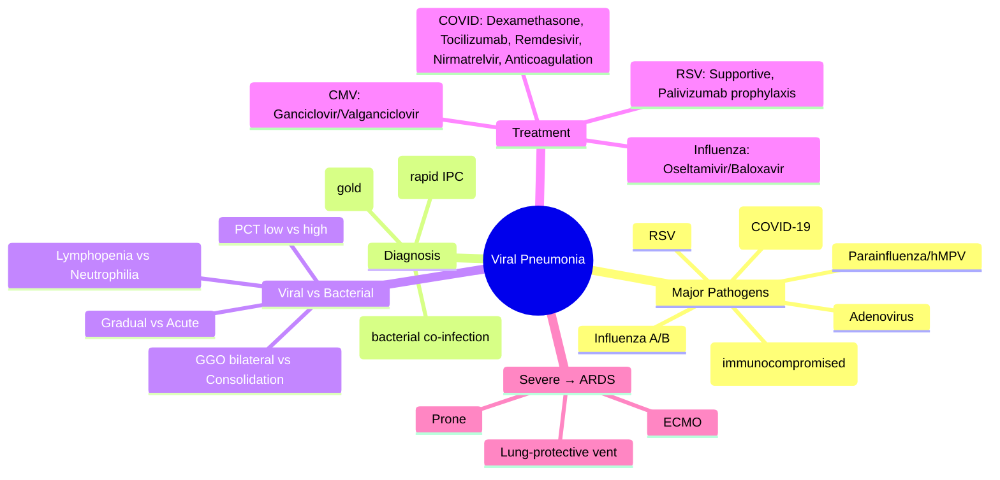

# Viral Pneumonitis and Severe Viral Pneumonia

Related: [[Pneumonia]], [[Community-acquired pneumonia severity assessment]], [[ARDS]], [[Immunocompromised host]], [[Antivirals]], [[Respiratory Failure]], [[ICU management]]

> [!important]
> **Viral pneumonitis** = viral infection causing **alveolar/interstitial inflammation** with **ground-glass opacities**, **lymphocytic infiltrate**, often **bilateral**. **Severe viral pneumonia** = progression to **hypoxaemic respiratory failure**, **ARDS**, **multi-organ dysfunction**. Key FCPS/MRCP: **Influenza** (oseltamivir <48h, ICU if severe), **COVID-19** (dexamethasone, tocilizumab, remdesivir, anticoagulation), **RSV** (supportive, palivizumab prophylaxis), **diagnosis** (PCR, antigen), **differentiation from bacterial** (procalcitonin, clinical scores).

## Learning Objectives
- Identify major viral pathogens causing pneumonia (influenza, SARS-CoV-2, RSV, parainfluenza, hMPV, adenovirus, CMV, HSV, VZV)
- Apply **diagnostic testing** (multiplex PCR, antigen, serology) and interpret **procalcitonin** for bacterial co-infection
- Manage **influenza** (neuraminidase inhibitors, baloxavir, ICU criteria)
- Manage **COVID-19** (dexamethasone, tocilizumab, remdesivir, nirmatrelvir/ritonavir, anticoagulation per RECOVERY/REMAP-CAP)
- Recognise **severe viral pneumonia** progressing to **ARDS** → lung-protective ventilation
- Manage **immunocompromised host** (CMV, HSV, VZV — specific antivirals)
- Apply **infection control** (droplet/airborne precautions, PPE)

## Definition
**Viral pneumonitis** = viral lower respiratory tract infection with **alveolar and interstitial inflammation**, typically causing **bilateral ground-glass opacities**, **lymphocytic/peripheral infiltrate**, **hypoxaemia**.

**Severe viral pneumonia** = viral pneumonia with **respiratory failure** (hypoxaemia requiring O2/HFNO/NIV/intubation), **haemodynamic instability**, **multi-organ dysfunction**, or **ARDS**.

> **FCPS/MRCP tip**: **Viral vs bacterial** — viral: gradual onset, dry cough, myalgia, headache, bilateral GGO, lymphopenia, normal/low procalcitonin. Bacterial: acute, purulent sputum, focal consolidation, neutrophilia, high procalcitonin. **Co-infection common** (influenza + S. pneumoniae, COVID + bacterial).

## Core Anatomy
### 1. Respiratory tract targeting
| Virus | Primary Target | Histology |
|-------|----------------|-----------|
| **Influenza** | Columnar epithelium (trachea, bronchi, alveoli) | Necrotising bronchiolitis, alveolar damage |
| **SARS-CoV-2** | ACE2+ cells (type II pneumocytes, endothelium) | Diffuse alveolar damage (DAD), microthrombi |
| **RSV** | Bronchiolar epithelium | Bronchiolitis, syncytia, alveolar spread |
| **Parainfluenza** | Upper + lower airway | Croup (subglottic), bronchiolitis, pneumonia |
| **hMPV** | Similar to RSV | Bronchiolitis, pneumonia |
| **Adenovirus** | Respiratory epithelium, conjunctiva, GI | Necrotising pneumonia, bronchiolitis obliterans |
| **CMV** | Endothelial/epithelial (immunocompromised) | Interstitial pneumonitis, inclusions |
| **HSV/VZV** | Mucosal epithelium, disseminate | Necrotising pneumonitis, haemorrhagic |

### 2. ACE2 receptor (SARS-CoV-2)
- **Type II pneumocytes** (surfactant production)
- **Vascular endothelium** (microthrombi, endotheliitis)
- **Cardiac, renal, GI, neuronal** (multi-organ)

## Core Physiology
### Viral pathogenesis
1. **Viral entry** → replication in respiratory epithelium
2. **Direct cytopathic effect** → cell death, barrier disruption
3. **Host immune response** → cytokines (IL-6, TNF-α, IFN-γ), lymphocyte infiltration
4. **Immunopathology** → alveolar damage, capillary leak, hyaline membranes
5. **Coagulopathy** (COVID-19) → microthrombi, pulmonary vascular thrombosis
6. **Bacterial superinfection** → epithelial damage, impaired clearance

### Gas exchange in severe viral pneumonia
- **V/Q mismatch** (atelectasis, consolidation)
- **Shunt** (alveolar flooding, ARDS)
- **Dead space** (microthrombi, vascular occlusion — COVID-19)
- **Hypoxaemia** refractory to O2 (shunt physiology)

## Normal Values / Important Cut-offs
### Severity Assessment (WHO / CURB-65 adapted)
| Parameter | Mild | Moderate | Severe / Critical |
|-----------|------|----------|-------------------|
| **SpO2 (room air)** | ≥94% | 90–93% | <90% |
| **Respiratory rate** | <24 | 24–30 | >30 |
| **Consciousness** | Normal | Normal | Altered |
| **Haemodynamics** | Stable | Stable | Shock |
| **CXR/CT** | Unilateral/patchy | Bilateral >50% | Bilateral >75% |
| **Labs** | Normal | Lymphopenia, ↑CRP | Lymphopenia, ↑D-dimer, ↑ferritin, ↑troponin |

### Procalcitonin Interpretation
| Procalcitonin | Interpretation |
|---------------|----------------|
| **<0.1 ng/mL** | Low likelihood bacterial co-infection |
| **0.1–0.25** | Possible bacterial co-infection |
| **0.25–0.5** | Likely bacterial co-infection |
| **>0.5** | High likelihood bacterial co-infection / sepsis |

> **FCPS/MRCP tip**: Procalcitonin **guides antibiotic stewardship** in viral pneumonia. **Low PCT = withhold antibiotics** unless high clinical suspicion.

### Influenza Antiviral Window
- **Oseltamivir/zanamivir/peramivir**: **Ideally <48h** from symptom onset
- **Baloxavir**: Single dose, **<48h**
- **Still beneficial** if severe/hospitalised **even >48h** (reduces viral shedding, complications)

### COVID-19 Treatment Thresholds
| Treatment | Indication |
|-----------|------------|
| **Dexamethasone 6mg/day** | **Oxygen requiring** (HFNO, NIV, intubation) — RECOVERY |
| **Tocilizumab 8mg/kg** | **CRP ≥75** + hypoxia (HFNO/NIV/intubation) — REMAP-CAP |
| **Remdesivir 200mg/100mg** | **Non-ventilated** requiring O2 (PINETREE, ACTT-1) |
| **Nirmatrelvir/ritonavir** | **Outpatient, high-risk** within 5 days (EPIC-HR) |
| **Therapeutic anticoagulation** | **Hospitalised, D-dimer elevated** (REMAP-CAP, ATTACC, ACTIV-4) |

## Classification
### By pathogen
1. **Influenza A/B** (seasonal, pandemic)
2. **SARS-CoV-2** (COVID-19, variants)
3. **RSV** (A/B subtypes)
4. **Parainfluenza 1–4**
5. **Human metapneumovirus (hMPV)**
6. **Adenovirus** (serotypes 3, 7, 21, 55)
7. **CMV** (immunocompromised)
8. **HSV/VZV** (immunocompromised, disseminated)
9. **Rhinovirus/enterovirus** (usually mild, severe in asthma/COPD)
10. **Novel/emerging** (MERS-CoV, avian influenza H5N1/H7N9)

### By host
- **Immunocompetent** (influenza, COVID, RSV, adenovirus)
- **Immunocompromised** (CMV, HSV, VZV, adenovirus, community viruses severe)

### By severity
- **Mild** (outpatient, no O2)
- **Moderate** (hospitalised, O2 ≤4L)
- **Severe** (HFNO, NIV, ICU)
- **Critical** (intubation, multi-organ failure)

## Etiology / Causes
### Seasonal patterns
- **Influenza**: Winter (Dec–Mar NH), year-round tropics
- **RSV**: Winter/early spring (bronchiolitis season)
- **COVID-19**: Waves (variant-dependent)
- **Parainfluenza**: Fall (croup), spring
- **Adenovirus**: Year-round, outbreaks military/camps
- **hMPV**: Late winter/spring

### High-risk for severe disease
| Risk Factor | Viruses |
|-------------|---------|
| **Age >65 / <2** | Influenza, RSV, COVID, hMPV |
| **Chronic lung disease** (COPD, asthma, bronchiectasis) | All |
| **Cardiovascular disease** | Influenza, COVID |
| **Immunocompromise** (chemo, transplant, HIV, steroids) | CMV, HSV, VZV, adenovirus, community viruses |
| **Obesity (BMI >30)** | COVID-19, influenza |
| **Pregnancy** | Influenza, COVID |
| **Diabetes, CKD, liver disease** | COVID, influenza |
| **Neuromuscular disease** | RSV, influenza |

## Pathophysiology (Key Viruses)

### Influenza
1. **HA/NA** bind sialic acid → entry
2. **Replication** → necrotising bronchiolitis, alveolar epithelial damage
3. **Cytokine storm** (IL-6, TNF-α, IFN) → ARDS
4. **Bacterial superinfection** (S. pneumoniae, S. aureus, H. influenzae) — impaired clearance, viral NA exposes receptors

### SARS-CoV-2 (COVID-19)
1. **Spike protein** binds **ACE2** → entry (TMPRSS2/furin priming)
2. **Type II pneumocyte infection** → surfactant loss, alveolar collapse
3. **Endothelial infection** → **endotheliitis, microthrombi, coagulopathy**
4. **Dysregulated immune response** → **IL-6 storm**, lymphopenia, macrophage activation
5. **Phenotypes**: L-type (high compliance, low recruitability) → H-type (low compliance, ARDS)

### RSV
1. **F/G proteins** → fusion, syncytia formation
2. **Bronchiolar epithelium** → necrosis, mucus, obstruction
3. **Spread to alveoli** → pneumonitis
4. **Th2-skewed response** → wheezing, eosinophilia (infants)

### CMV (immunocompromised)
1. **Reactivation** (latency in myeloid cells)
2. **Endothelial/epithelial infection** → interstitial pneumonitis
3. **Inclusion bodies** (owl's eye)
4. **High mortality** if untreated

## Clinical Features
### Typical viral pneumonia
- **Gradual onset** (1–3 days prodrome)
- **Fever**, **myalgia**, **headache**, **fatigue**
- **Dry cough** (initially)
- **Dyspnoea** (later, if severe)
- **Sore throat**, **rhinorrhoea** (influenza, COVID, RSV)
- **Anosmia/ageusia** (COVID-19 specific)
- **Wheeze** (RSV, parainfluenza, adenovirus)

### Severe viral pneumonia / ARDS
- **Hypoxaemia** (SpO2 <90% on room air)
- **Tachypnoea** (>30/min)
- **Respiratory distress** (accessory muscles, inability to speak)
- **Altered consciousness** (hypoxia, hypercapnia)
- **Haemodynamic instability** (septic shock, cytokine storm)
- **Multi-organ dysfunction** (AKI, cardiac injury, liver, coagulopathy)

### Virus-specific clues
| Virus | Distinctive Features |
|-------|---------------------|
| **Influenza** | Abrupt onset, high fever, myalgia, headache, cough, seasonal |
| **COVID-19** | Anosmia/ageusia, varied presentation, coagulopathy, long COVID |
| **RSV** | Wheeze, bronchiolitis (infants), seasonal winter |
| **Parainfluenza** | Croup (barking cough, stridor), bronchiolitis |
| **Adenovirus** | Conjunctivitis, pharyngitis, diarrhoea, severe pneumonia outbreaks |
| **hMPV** | Similar RSV, older children/adults |
| **CMV** | Immunocompromised, fever, hypoxaemia, negative routine cultures |
| **HSV/VZV** | Vesicular rash (VZV), immunocompromised, haemorrhagic pneumonitis |

## Investigations
### 1. Diagnostic Testing
**Multiplex PCR (nasopharyngeal/oropharyngeal swab) — GOLD STANDARD**
- **Respiratory viral panel**: Influenza A/B, RSV, SARS-CoV-2, parainfluenza 1–4, hMPV, adenovirus, rhinovirus, enterovirus
- **Turnaround**: 1–4 hours
- **Sensitivity**: >95% for most

**Rapid Antigen Tests**
- **Influenza Ag**: 50–70% sensitivity, specific
- **COVID-19 Ag**: 80–90% symptomatic, lower asymptomatic
- **RSV Ag**: Good in children, lower adults
- **Use**: Point-of-care, infection control decisions

**Serology** (paired acute/convalescent)
- **Retrospective** diagnosis, epidemiology
- **Not for acute management**

**Lower Respiratory Samples** (if upper negative, severe disease)
- **BAL/Bronchial wash**: Higher yield for influenza, COVID, CMV
- **CMV PCR** (quantitative): >10,000 copies/mL = significant

### 2. Bacterial Co-infection Workup
- **Procalcitonin** (serial) — **key stewardship tool**
- **Blood cultures** ×2
- **Sputum Gram stain/culture** (if productive)
- **Urinary antigens**: Legionella, Pneumococcus
- **Respiratory viral panel** + **bacterial PCR** (some panels)

### 3. Severity / Organ Dysfunction
- **ABG** (hypoxaemia, hypercapnia, pH)
- **CXR/CT**: **Bilateral ground-glass opacities** (viral pattern), **consolidation** (bacterial co-infection)
- **CT COVID-19**: **Peripheral bilateral GGO**, crazy-paving, consolidation (CO-RADS)
- **Labs**: **Lymphopenia** (COVID, influenza), **↑CRP, ↑ferritin, ↑D-dimer, ↑LDH, ↑troponin, ↑CK** (COVID cytokine storm)
- **Coagulation**: D-dimer, fibrinogen, PT/INR (COVID coagulopathy)
- **ECG/Echo**: Myocarditis, takotsubo, new LV dysfunction

## Interpretation Frameworks
### 1. Viral vs Bacterial Pneumonia
| Feature | Viral | Bacterial |
|---------|-------|-----------|
| **Onset** | Gradual (prodrome) | Acute |
| **Cough** | Dry → productive | Purulent from onset |
| **Sputum** | Scant, mucoid | Purulent, copious |
| **Fever** | High, systemic | High, toxic |
| **CXR/CT** | **Bilateral GGO**, interstitial | **Focal consolidation** |
| **WCC** | Normal/low, **lymphopenia** | **Neutrophilia** |
| **Procalcitonin** | **Low/normal** | **High** |
| **CRP** | Moderate | High |

### 2. COVID-19 Severity (WHO Ordinal Scale)
1. Uninfected
2. Ambulatory, mild
3. Ambulatory, moderate
4. Hospitalised, no O2
5. Hospitalised, O2 by mask
6. Hospitalised, HFNO/NIV
7. Intubated, ventilated
8. Intubated + vasopressors/ECMO
9. Dead

### 3. Influenza Antiviral Decision
```
Symptoms <48h + high-risk OR hospitalised → START antivirals (oseltamivir/baloxavir)
Symptoms >48h, outpatient, low-risk → consider, usually not needed
Symptoms >48h, hospitalised/severe → START (still reduces shedding/complications)
```

### 4. COVID-19 Treatment Algorithm
```
Confirmed COVID-19
    ↓
Outpatient, high-risk, <5d symptoms → Nirmatrelvir/ritonavir (Paxlovid)
    ↓
Hospitalised, no O2 → Remdesivir 3d (if high-risk) OR observe
    ↓
Hospitalised, REQUIRING O2 → Dexamethasone 6mg/day ×10d
    ↓
Hospitalised, CRP ≥75 + O2 (HFNO/NIV/intubation) → ADD Tocilizumab 8mg/kg
    ↓
Hospitalised, requiring O2 (non-ventilated) → Remdesivir 5d (200mg load, 100mg daily)
    ↓
Hospitalised, D-dimer elevated → Therapeutic anticoagulation (LMWH/UFH)
```

## Diagnosis
**Clinical + Microbiological**:
1. Compatible syndrome (fever, cough, dyspnoea, bilateral GGO)
2. **Positive viral PCR** (multiplex panel) OR **antigen** (lower sensitivity)
3. **Exclude bacterial** (low procalcitonin, no focal consolidation)
4. **Severity assessment** (O2 requirement, CURB-65, WHO scale)

## Differential Diagnosis
| Differential | Clues Against Viral |
|--------------|---------------------|
| **Bacterial CAP** | Focal consolidation, purulent sputum, neutrophilia, high PCT |
| **Atypical pneumonia** (Mycoplasma, Chlamydia, Legionella) | Subacute, extrapulmonary features, specific PCR/serology |
| **Aspiration pneumonia** | Risk factors, dependent segments, anaerobes |
| **Pneumocystis (PJP)** | HIV/CD4<200, bilateral GGO, negative viral panel, β-D-glucan |
| **TB** | Subacute/chronic, night sweats, weight loss, cavitation, AFB |
| **Non-infectious** (organising pneumonia, vasculitis, DAH) | No viral PCR, specific serology/biopsy, chronic |

## Management
### 1. General Supportive Care (ALL viral pneumonia)
- **Oxygen therapy**: Target **SpO2 92–96%** (94–98% non-COPD); HFNO/NIV/intubation per escalation
- **Fluids**: **Conservative** (avoid overload → worse oxygenation in ARDS)
- **Antipyretics/analgesia**: Paracetamol (avoid NSAIDs if possible in COVID — theoretical)
- **VTE prophylaxis**: **LMWH/UFH** for all hospitalised (COVID: therapeutic if D-dimer ↑)
- **Monitoring**: Continuous SpO2, RR, haemodynamics, renal, coagulation
- **Infection control**: **Droplet + contact** (influenza, RSV); **Airborne + contact** (COVID-19, measles, VZV) + **PPE**

### 2. Influenza-Specific Antivirals
| Drug | Dose | Duration | Notes |
|------|------|----------|-------|
| **Oseltamivir** | **75mg BD PO** (adjust renal) | **5 days** (10d if severe/ICU) | **<48h ideal**, still benefit if severe >48h |
| **Zanamivir** | 10mg (2 inhalations) BD | 5 days | Inhaled, **avoid if severe asthma/COPD** (bronchospasm) |
| **Peramivir** | 600mg IV single dose | Single | IV, renal adjust, **<48h** |
| **Baloxavir** | 40mg (80mg if ≥80kg) PO single | Single | **Cap-dependent endonuclease inhibitor**, single dose, <48h |

**Chemoprophylaxis** (oseltamivir 75mg OD ×7–10d):_close contacts high-risk, institutional outbreaks

### 3. COVID-19 Specific (Evidence-Based)
| Treatment | Population | Dose/Duration | Key Trial |
|-----------|------------|---------------|-----------|
| **Dexamethasone** | **Requiring O2** (HFNO/NIV/intubation) | 6mg PO/IV OD ×10d | RECOVERY |
| **Tocilizumab** | **CRP ≥75 + O2** (HFNO/NIV/intubation) | 8mg/kg IV (max 800mg) ×1–2d | REMAP-CAP |
| **Remdesivir** | **Non-ventilated, requiring O2** | 200mg D1, 100mg D2–5 (5d) | ACTT-1, PINETREE |
| | Ventilated | 10d course | |
| **Nirmatrelvir/ritonavir** | **Outpatient, high-risk, ≤5d** | 300/100mg BD ×5d | EPIC-HR |
| **Molnupiravir** | Outpatient, high-risk, ≤5d | 800mg BD ×5d | MOVe-OUT |
| **Therapeutic anticoagulation** | **Hospitalised, D-dimer ↑** | LMWH 1mg/kg BD or UFH aPTT | REMAP-CAP, ATTACC |
| **Convalescent plasma** | Immunocompromised, early | High-titre | Limited benefit general |
| **Monoclonal antibodies** | Outpatient high-risk (variant-dependent) | Single IV/SC | Variant-specific |

### 4. RSV / Other Viruses
- **RSV**: **Supportive only** (no licensed antiviral for adults); **Ribavirin** (aerosol) — limited use, toxic; **Palivizumab** — **prophylaxis** (preterm, CHD, CLD infants monthly ×5 doses season)
- **Parainfluenza/hMPV**: Supportive
- **Adenovirus**: **Cidofovir** (IV, nephrotoxic) — severe immunocompromised; **Brincidofovir** (oral prodrug)
- **CMV**: **Ganciclovir** 5mg/kg IV BD (induction) → **Valganciclovir** 900mg BD PO (maintenance); **Foscarnet** (ganciclovir-resistant, nephrotoxic); **Letermovir** (prophylaxis transplant)
- **HSV/VZV**: **Acyclovir** 10mg/kg IV TDS (HSV), 10–15mg/kg IV TDS (VZV) ×7–10d

### 5. Bacterial Co-infection
- **Procalcitonin-guided**: <0.1 = withhold; >0.25 = start antibiotics
- **Empirical**: Cover S. pneumoniae, S. aureus, H. influenzae (co-amoxiclav OR ceftriaxone + consider MRSA cover if risk)
- **De-escalate** at 48–72h based on cultures/PCT

### 6. ARDS Management (Severe Viral Pneumonia)
- **Lung-protective ventilation** (Vt 6ml/kg PBW, Pplat ≤30, PEEP/FiO2 table)
- **Prone** (PF <150)
- **Conservative fluids**
- **ECMO** (refractory)

## Drug Interactions / Contraindications / Cautions
### COVID-19 Specific
- **Nirmatrelvir/ritonavir**: **Strong CYP3A4 inhibitor** — **contraindicated** with many drugs (statins, anticoagulants, anticonvulsants, immunosuppressants). **Check interactions!**
- **Remdesivir**: Renal impairment (eGFR <30 — avoid IV formulation with SBECD), hepatotoxicity (monitor LFTs)
- **Tocilizumab**: Infection risk (screen TB, hepatitis), neutropenia, thrombocytopenia, GI perforation
- **Dexamethasone**: Hyperglycaemia, psychosis, infection risk (monitor)

### Influenza
- **Oseltamivir**: Renal adjust (CrCl <30: 75mg OD or 30mg BD), neuropsychiatric (rare, adolescents)
- **Baloxavir**: Avoid with polyvalent cations (antacids, supplements), not in pregnancy/lactation

### CMV
- **Ganciclovir/Valganciclovir**: **Myelosuppression** (monitor FBC), renal adjust, teratogenic
- **Foscarnet**: Nephrotoxicity, electrolyte disturbance (Ca, Mg, K, Phos), seizures

## Procedures / Indications / Contraindications
### Bronchoscopy / BAL
**Indication**: Immunocompromised, atypical presentation, suspected CMV/HSV/VZV/PJP, upper respiratory PCR negative in severe disease
**Contraindication**: Severe hypoxaemia (unless intubated), unstable haemodynamics, coagulopathy

### Intubation
**Indication**: Refractory hypoxaemia, hypercapnia, exhaustion, GCS <8, haemodynamic instability
**COVID-19**: **Airborne precautions**, RSI, video laryngoscopy, closed circuit

## Complications
### Viral-specific
- **Influenza**: **Bacterial superinfection** (S. pneumoniae, S. aureus — necrotising), **myositis/rhabdo**, **encephalitis**, **myocarditis**, **Reye's syndrome** (aspirin in children)
- **COVID-19**: **ARDS**, **thromboembolism** (PE, DVT, arterial), **cardiac injury** (myocarditis, takotsubo, MI), **AKI**, **neurological** (stroke, encephalopathy), **long COVID** (fatigue, dyspnoea, cognitive)
- **RSV**: **Apnoea** (infants), **bronchiolitis obliterans** (rare), **wheezing** persistence
- **Adenovirus**: **Bronchiolitis obliterans** (children), **bronchiectasis**
- **CMV**: **Graft loss** (transplant), **colitis**, **retinitis**, **encephalitis**

### General
- **Post-viral fatigue** (months)
- **Organising pneumonia** (COP pattern)
- **Pulmonary fibrosis** (post-ARDS)
- **Secondary bacterial pneumonia**

## Red Flags / Emergencies
- **SpO2 <90%** on room air → **admit, O2, consider HFNO/NIV/intubation**
- **RR >30**, **accessory muscle use**, **inability to speak** → **imminent respiratory failure**
- **Altered consciousness**, **hypotension** → **septic shock, ICU**
- **D-dimer very high**, **sudden pleuritic pain**, **hypoxia** → **PE** (CTPA)
- **Chest pain**, **troponin rise** → **myocarditis/MI**
- **Immunocompromised + new infiltrate** → **urgent bronchoscopy, broad coverage**

## Special Situations
### Immunocompromised Host
- **Broader differential**: CMV, HSV, VZV, PJP, fungi, Nocardia, TB
- **Lower threshold** for **BAL/bronchoscopy**, **CT**, **empirical antivirals/antifungals**
- **Quantitative CMV PCR** (monitor trends)
- **Prophylaxis**: **Letermovir** (transplant), **Valganciclovir** (high-risk)

### Pregnancy
- **Influenza**: **Oseltamivir safe** (category C, benefits outweigh risks), **vaccinate**
- **COVID-19**: Dexamethasone safe, tocilizumab limited data, remdesivir if benefit >risk, nirmatrelvir/ritonavir not recommended
- **RSV**: Maternal vaccination (Abrysvo) approved for infant protection

### Paediatric
- **RSV bronchiolitis**: Supportive, HFNO, hypertonic saline (controversial), **no routine bronchodilators/steroids/antibiotics**
- **Influenza**: Oseltamivir approved >2 weeks
- **COVID-19**: MIS-C (multisystem inflammatory syndrome) — fever, rash, conjunctivitis, cardiac, **IVIG + steroids**

### Avian Influenza (H5N1, H7N9) / MERS-CoV
- **High mortality** (H5N1 ~50%, MERS ~35%)
- **Oseltamivir** (higher dose 150mg BD, longer 10d)
- **Infection control**: **Airborne + contact + eye protection**, negative pressure
- **Report** to public health immediately

## Prognosis
- **Influenza**: Most recover 1–2 weeks; severe/ICU mortality 10–20%; high-risk higher
- **COVID-19**: Variable by variant/vaccination; overall IFR ~0.5–1%; age/comorbidity major drivers
- **RSV**: Infants/elderly high hospitalisation; mortality low in healthy adults
- **CMV pneumonia**: Mortality 30–50% in immunocompromised if untreated; better with early ganciclovir
- **Post-viral**: Fatigue, dyspnoea, fibrosis (post-ARDS)

## Topic Correlation
- [[Pneumonia]] — CAP framework, CURB-65
- [[Community-acquired pneumonia severity assessment]] — severity scores
- [[ARDS]] — severe progression management
- [[Immunocompromised host]] — CMV, HSV, PJP
- [[Antivirals]] — drug details
- [[Respiratory Failure]] — escalation, ventilation
- [[ICU management]] — supportive care

## FCPS/MRCP High-Yield Points
1. **Viral vs bacterial**: gradual onset, dry cough, bilateral GGO, lymphopenia, **low procalcitonin**
2. **Influenza**: oseltamivir 75mg BD <48h (still give if severe >48h); baloxavir single dose
3. **COVID-19**: dexamethasone 6mg if O2 requiring; tocilizumab if CRP≥75+O2; remdesivir if non-ventilated+O2; nirmatrelvir/ritonavir outpatient high-risk ≤5d; therapeutic anticoagulation if D-dimer↑
4. **RSV**: supportive only; palivizumab prophylaxis (preterm/CHD/CLD infants)
4. **CMV** (immunocompromised): quantitative PCR, ganciclovir/valganciclovir, foscarnet resistant
5. **Procalcitonin**: <0.1 = withhold antibiotics; >0.25 = bacterial co-infection likely
6. **Diagnosis**: Multiplex PCR (gold standard); antigen for rapid IPC decisions
7. **Infection control**: Airborne+contact (COVID, VZV, measles); Droplet+contact (flu, RSV)
8. **Avian flu/MERS**: high mortality, higher dose oseltamivir, airborne precautions, notify

## Common Viva Questions
1. Differentiate viral vs bacterial pneumonia (clinical, radiological, labs)
2. Influenza antiviral options and timing
3. COVID-19 treatment algorithm (dexamethasone, tocilizumab, remdesivir, anticoagulation)
4. Procalcitonin interpretation for antibiotic stewardship
5. CMV pneumonia in immunocompromised (diagnosis, treatment)
6. RSV management and prophylaxis
7. Avian influenza / MERS — recognition and management
8. Infection control precautions by virus

## Common Confusions / Exam Traps
- **Withholding oseltamivir >48h in severe hospitalised influenza** — WRONG, still beneficial
- **Giving antibiotics for low procalcitonin viral pneumonia** — avoid unless clinical suspicion
- **Using zanamivir in severe asthma/COPD** — bronchospasm risk, contraindicated
- **Nirmatrelvir/ritonavir drug interactions** — check CYP3A4 interactions (statins, DOACs, etc.)
- **Therapeutic anticoagulation for ALL COVID** — only if D-dimer elevated/hospitalised (REMAP-CAP criteria)
- **Remdesivir in ventilated patients** — 10d course, not 5d
- **Tocilizumab without CRP≥75** — not indicated (REMAP-CAP)
- **Baloxavir in pregnancy** — contraindicated
- **Palivizumab = treatment** — NO, prophylaxis only

## Mnemonics
- **VIRAL VS BACT**: **V**iral = **G**radual, **G**GO bilateral, **L**ymphopenia, **P**CT low; **B**acterial = **A**cute, **C**onsolidation focal, **N**eutrophilia, **P**CT high
- **COVID TREAT**: **D**examethasone (O2+), **T**ocilizumab (CRP≥75), **R**emdesivir (non-vent O2+), **A**nticoagulation (D-dimer↑), **N**irmatrelvir (outpatient high-risk)
- **FLU ANTIVIRALS**: **O**seltamivir (75mg BD 5d, renal adjust); **Z**anamivir (inhaled, no asthma); **P**eramivir (IV single); **B**aloxavir (single dose, <48h)
- **CMV IMMUNO**: **Q**uantitative PCR, **G**anciclovir IV → **V**alganciclovir PO, **F**oscarnet resistant

## Mind Map


## Flowchart
```mermaid
flowchart TD
    A[Suspected viral pneumonia] --> B[Multiplex PCR + Procalcitonin + CXR/CT]
    B --> C{PCT <0.1?}
    C -- YES --> D[Viral likely\nWithhold antibiotics\nMonitor PCT]
    C -- NO --> E[Bacterial co-infection likely\nStart empirical antibiotics\nDe-escalate at 48-72h]
    B --> F{Virus identified?}
    F -- Influenza --> G[Oseltamivir 75mg BD ×5d\n(>48h if severe still give)\nBaloxavir single dose <48h]
    F -- COVID-19 --> H{Severity}
    H -- Outpatient high-risk ≤5d --> I[Nirmatrelvir/ritonavir ×5d]
    H -- Hospitalised, no O2 --> J[Remdesivir 3d if high-risk\nor observe]
    H -- Hospitalised, REQUIRING O2 --> K[Dexamethasone 6mg ×10d]
    H -- CRP≥75 + O2 (HFNO/NIV/intubation) --> L[ADD Tocilizumab 8mg/kg]
    H -- Non-ventilated + O2 --> M[Remdesivir 5d]
    H -- D-dimer elevated --> N[Therapeutic anticoagulation]
    F -- RSV --> O[Supportive\nPalivizumab prophylaxis infants]
    F -- CMV (immunocompromised) --> P[Ganciclovir 5mg/kg IV BD → Valganciclovir PO]
```

## Suggested Visuals / Image Notes
- CXR/CT: viral GGO vs bacterial consolidation
- COVID-19 CT: peripheral GGO, crazy-paving
- Procalcitonin algorithm
- COVID-19 treatment algorithm
- Influenza antiviral decision tree
- RSV bronchiolitis vs pneumonia
- CMV inclusions (owl's eye)

## Suggested Video References
- WHO COVID-19 clinical management
- IDSA influenza guidelines
- RECOVERY trial dexamethasone
- REMAP-CAP tocilizumab/anticoagulation
- PINETREE remdesivir outpatient
- EPIC-HR nirmatrelvir/ritonavir
- RSV bronchiolitis management
- CMV in transplant recipients

## One-Page Revision Summary
- **Viral**: gradual, dry cough, bilateral GGO, lymphopenia, **PCT low**
- **Bacterial**: acute, purulent, focal consolidation, neutrophilia, PCT high
- **Influenza**: oseltamivir 75mg BD 5d (<48h ideal, still give if severe); baloxavir single dose
- **COVID-19**: Dexamethasone (O2+), Tocilizumab (CRP≥75+O2), Remdesivir (non-vent O2+), Nirmatrelvir (outpatient high-risk), Anticoagulation (D-dimer↑ hospitalised)
- **RSV**: Supportive only; Palivizumab prophylaxis (preterm/CHD/CLD infants)
- **CMV**: Quantitative PCR, ganciclovir IV → valganciclovir PO
- **PCT**: <0.1 withhold abx; >0.25 start abx
- **Diagnosis**: Multiplex PCR gold standard
- **IPC**: Airborne (COVID, VZV), Droplet (flu, RSV)

## 24-Hour Recall Prompts
- Viral vs bacterial pneumonia 4 key differences
- Influenza antivirals and dosing
- COVID-19 treatment by severity
- Procalcitonin thresholds
- CMV diagnosis and treatment
- RSV prophylaxis indication

## 7-Day / 15-Day / 30-Day Revision Tracker
- [ ] Day 1 completed
- [ ] 24-hour recall completed
- [ ] Day 7 revision completed
- [ ] Day 15 revision completed
- [ ] Day 30 revision completed

## Must Know / Should Know / Nice to Know
### Must Know
- Viral vs bacterial differentiation
- Influenza antiviral options, timing, renal adjustment
- COVID-19 treatment algorithm (dexamethasone, tocilizumab, remdesivir, nirmatrelvir, anticoagulation)
- Procalcitonin interpretation
- RSV supportive, palivizumab prophylaxis
- CMV in immunocompromised (PCR, ganciclovir)
- Infection control precautions

### Should Know
- COVID-19 phenotypes (L vs H type)
- Avian influenza / MERS recognition
- Baloxavir interactions/contraindications
- Remdesivir renal/hepatic monitoring
- Tocilizumab screening (TB, hepatitis)
- Post-viral syndromes (long COVID, fatigue)

### Nice to Know
- Variant-specific monoclonal antibodies
- Molnupiravir vs nirmatrelvir
- Convalescent plasma evidence
- ECMO for viral ARDS outcomes
- Vaccines (influenza, COVID, RSV maternal/elderly)
- Cost-effectiveness of multiplex PCR

## Self-Test Scorecard
- Understanding: /10
- Recall: /10
- MCQ Performance: /10
- SBA Performance: /10
- Viva Confidence: /10
- Total: /50

> [!tip]
> Interpretation: <35 = weak topic, 35-44 = acceptable but insecure, 45+ = strong exam-ready topic.

## Exam Answer Modes
### Long Answer Skeleton
- Viral vs bacterial differentiation table
- Major viral pathogens and epidemiology
- Diagnostic approach (multiplex PCR, PCT, imaging)
- Influenza management (antivirals, prophylaxis, complications)
- COVID-19 management by severity (evidence-based with trial names)
- RSV, parainfluenza, hMPV, adenovirus
- Immunocompromised viruses (CMV, HSV, VZV)
- Bacterial co-infection (PCT-guided)
- Severe viral pneumonia → ARDS management
- Special populations (pregnancy, paediatric, immunocompromised)
- Emerging viruses (avian flu, MERS)

### Short Note Skeleton
- Viral vs bacterial box
- Influenza antivirals table
- COVID-19 treatment algorithm flowchart
- PCT thresholds box
- Immunocompromised viruses table

### Viva One-Liners
- "Viral = gradual, bilateral GGO, lymphopenia, LOW PCT; Bacterial = acute, focal consolidation, neutrophilia, HIGH PCT"
- "Influenza: oseltamivir 75mg BD 5d (<48h ideal); baloxavir single dose <48h; zanamivir inhaled (no asthma); peramivir IV single"
- "COVID: Dexamethasone 6mg if O2+ (RECOVERY); Tocilizumab 8mg/kg if CRP≥75+O2 (REMAP-CAP); Remdesivir 5d if non-vent O2+; Paxlovid outpatient high-risk ≤5d; Therapeutic anticoag if D-dimer↑"
- "PCT: <0.1 withhold abx; 0.1-0.25 possible; >0.25 likely bacterial co-infection"
- "RSV: supportive ONLY; palivizumab prophylaxis preterm/CHD/CLD infants monthly ×5 doses"
- "CMV pneumonia: quantitative PCR >10k copies/mL; ganciclovir 5mg/kg IV BD → valganciclovir 900mg BD PO; foscarnet if resistant"
- "Avian flu H5N1/H7N9: high mortality, oseltamivir 150mg BD 10d, airborne precautions, notify"
- "IPC: Airborne+contact (COVID, VZV, measles); Droplet+contact (flu, RSV)"

### Ward-Case Discussion Points
- 70F unvaccinated, COVID day 5, SpO2 88% RA, CRP 120 → dexamethasone 6mg + tocilizumab 8mg/kg + remdesivir 5d + therapeutic LMWH
- 45M influenza day 2, COPD, SpO2 92% → oseltamivir 75mg BD 5d (renal adjust if needed) + consider baloxavir
- 30M post-transplant, fever, hypoxia, CMV PCR 50,000 copies/mL → ganciclovir 5mg/kg IV BD ×2-3 weeks → valganciclovir maintenance
- 6mo infant RSV bronchiolitis, SpO2 88%, RR 60 → HFNO, supportive, no bronchodilators/steroids/antibiotics routinely

### Last-Night-Before-Exam Sheet
- Viral: Gradual, GGO bilateral, lymphopenia, PCT low
- Flu: Oseltamivir 75mg BD 5d, Baloxavir single, Zanamivir inhaler (no asthma)
- COVID: Dexa O2+, Toci CRP≥75+O2, Remde non-vent O2+, Paxlovid outpt high-risk, Anticoag D-dimer↑
- PCT: <0.1 no abx, >0.25 abx
- RSV: Supportive, Palivizumab preterms
- CMV: PCR quant, Ganciclovir IV → Valgan PO
- IPC: Airborne COVID/VZV, Droplet Flu/RSV

## Summary
**Viral pneumonitis** = viral LRTI with bilateral ground-glass opacities, lymphocytic infiltrate. **Key differentiation from bacterial**: gradual onset, dry cough, bilateral GGO, lymphopenia, **low procalcitonin**. **Major pathogens**: Influenza, SARS-CoV-2, RSV, parainfluenza, hMPV, adenovirus, CMV/HSV/VZV (immunocompromised). **Diagnosis**: **Multiplex PCR** (gold standard), antigen (rapid), **procalcitonin** for bacterial co-infection. **Influenza**: **Oseltamivir 75mg BD 5d** (<48h ideal, still give if severe), **baloxavir single dose**, zanamivir/peramivir alternatives. **COVID-19**: **Dexamethasone 6mg** if requiring O2 (RECOVERY); **Tocilizumab 8mg/kg** if CRP≥75+O2 (REMAP-CAP); **Remdesivir 5d** if non-ventilated+O2; **Nirmatrelvir/ritonavir** outpatient high-risk ≤5d; **Therapeutic anticoagulation** if hospitalised+D-dimer↑. **RSV**: supportive only; **palivizumab prophylaxis** (preterm/CHD/CLD infants). **CMV**: quantitative PCR, **ganciclovir IV → valganciclovir PO**. **PCT-guided antibiotics**: <0.1 withhold, >0.25 start. **Severe** → ARDS management (lung-protective vent, prone, ECMO). **Infection control**: Airborne (COVID, VZV, measles), Droplet (flu, RSV).

## MCQs (10)
1. **Best test to differentiate viral from bacterial pneumonia** for antibiotic stewardship:
   A. CRP
   B. **Procalcitonin**
   C. WCC
   D. Chest X-ray

2. **Oseltamivir dose** for influenza treatment in adult with normal renal function:
   A. 75mg OD ×5d
   B. **75mg BD ×5d**
   C. 150mg BD ×5d
   D. 75mg BD ×10d (always)

3. **Dexamethasone in COVID-19** is indicated for:
   A. All confirmed cases
   B. Outpatient mild cases
   C. **Hospitalised patients requiring oxygen** (HFNO/NIV/intubation)
   D. Only ventilated patients

4. **Tocilizumab in COVID-19** (REMAP-CAP) indication:
   A. All hospitalised
   B. **CRP ≥75 mg/L + requiring oxygen** (HFNO/NIV/intubation)
   C. Only ventilated patients
   D. Outpatients with high risk

5. **Procalcitonin threshold** suggesting bacterial co-infection in viral pneumonia:
   A. <0.05 ng/mL
   B. **>0.25 ng/mL**
   C. >1.0 ng/mL
   D. >10 ng/mL

6. **RSV treatment** in immunocompetent adult:
   A. Oseltamivir
   B. Ribavirin IV
   C. **Supportive care only**
   D. Palivizumab

7. **CMV pneumonia diagnosis** in transplant recipient:
   A. Serum IgM
   B. **Quantitative PCR (viral load)**
   C. Chest X-ray alone
   D. Bronchoscopy without PCR

8. **Nirmatrelvir/ritonavir (Paxlovid)** for COVID-19:
   A. All confirmed cases
   B. Hospitalised patients
   C. **Outpatient, high-risk, within 5 days of symptoms**
   D. Ventilated patients

9. **Infection control** for COVID-19:
   A. Droplet + contact only
   B. **Airborne + contact + eye protection**
   C. Contact only
   D. Standard precautions

10. **Avian influenza H5N1** oseltamivir dosing:
    A. 75mg BD ×5d
    B. **150mg BD ×10d**
    C. 75mg OD ×10d
    D. 30mg BD ×5d (renal dose)

## SBA Questions (10)
1. A 68F, unvaccinated, COVID-19 day 6, SpO2 89% on room air, RR 28, CRP 140. CXR bilateral GGO. Best management?
   A. Supportive only
   B. **Dexamethasone 6mg + Tocilizumab 8mg/kg + Remdesivir 5d + Therapeutic LMWH**
   C. Nirmatrelvir/ritonavir only
   D. Remdesivir only

2. A 45M, influenza day 2, COPD (FEV1 55%), SpO2 93% on air. Best antiviral?
   A. Zanamivir inhaled
   B. **Oseltamivir 75mg BD ×5d (or baloxavir single dose)**
   C. Peramivir IV
   D. No antiviral needed

3. A 70M, COVID day 4, SpO2 94% on 2L NC, CRP 45, not high-risk outpatient. Management?
   A. Nirmatrelvir/ritonavir
   B. **Dexamethasone 6mg (requiring O2) + consider remdesivir 5d**
   C. Supportive only
   D. Tocilizumab

4. PCT 0.05 ng/mL in a patient with influenza pneumonia. Antibiotics?
   A. Start empirical co-amoxiclav
   B. **Withhold antibiotics, monitor PCT**
   C. Start azithromycin
   C. Start pip-taz

5. A 30M post-allogeneic BMT day +40, fever, hypoxia, CMV PCR 80,000 copies/mL. Treatment?
   A. Acyclovir
   B. **Ganciclovir 5mg/kg IV BD ×2–3 weeks**
   C. Foscarnet first-line
   D. Valganciclovir PO only

6. A 2mo infant (ex-preterm 32/40), RSV bronchiolitis, SpO2 88%, RR 65. Management?
   A. Salbutamol nebulisers
   B. **HFNO, supportive, NO routine bronchodilators/steroids/antibiotics**
   C. Oral prednisolone
   D. IV ceftriaxone

7. Nirmatrelvir/ritonavir contraindication — which drug interaction is MOST critical?
   A. Metformin
   B. **Simvastatin (CYP3A4 substrate — rhabdomyolysis risk)**
   C. Paracetamol
   D. Omeprazole

8. Remdesivir dosing for non-ventilated COVID requiring O2:
   A. 200mg day 1, 100mg days 2–5 (5 days total)
   B. 200mg day 1, 100mg days 2–10 (10 days total)
   C. 100mg daily ×5d
   D. Single 200mg dose

9. Tocilizumab monitoring — which is required pre-treatment?
   A. HIV test
   B. **TB screening (IGRA/TST), hepatitis B/C, baseline FBC/LFT**
   C. Echocardiogram
   D. Pulmonary function tests

10. Palivizumab indication for RSV prophylaxis:
    A. All infants <6 months
    B. **Preterm <29/40, CHD, CLD (infants) — monthly ×5 doses during season**
    C. Adults with COPD
    D. Immunocompromised adults

## Flashcards
- Q: Viral vs bacterial PCT
  A: Viral low (<0.1), Bacterial high (>0.25)
- Q: Flu antiviral window
  A: <48h ideal, but give if severe/hospitalised even >48h
- Q: Oseltamivir dose
  A: 75mg BD 5d (renal adjust CrCl<30)
- Q: COVID dexamethasone
  A: 6mg if requiring O2 (RECOVERY)
- Q: COVID tocilizumab
  A: CRP≥75 + O2 requiring (REMAP-CAP)
- Q: COVID remdesivir
  A: Non-ventilated + O2 requiring → 5d course
- Q: COVID anticoagulation
  A: Hospitalised + D-dimer↑ → therapeutic LMWH
- Q: RSV treatment
  A: Supportive only; palivizumab prophylaxis preterms
- Q: CMV diagnosis
  A: Quantitative PCR >10k copies/mL
- Q: CMV treatment
  A: Ganciclovir 5mg/kg IV BD → valganciclovir PO
- Q: IPC COVID
  A: Airborne + contact + eye protection
- Q: Paxlovid interaction
  A: CYP3A4 inhibitor — check statins, DOACs, immunosuppressants

## Answer Key with Explanations
### MCQs
1. **B** — Procalcitonin is the best biomarker for bacterial co-infection stewardship.
2. **B** — Standard adult dose 75mg BD ×5d (renal adjust if CrCl<30).
3. **C** — RECOVERY: dexamethasone benefits only those requiring respiratory support (O2/HFNO/NIV/intubation).
4. **B** — REMAP-CAP: tocilizumab for CRP≥75 + O2 requirement.
5. **B** — PCT >0.25 suggests bacterial co-infection; <0.1 supports withholding.
6. **C** — No licensed antiviral for RSV in adults; supportive only. Palivizumab = prophylaxis.
7. **B** — Quantitative PCR viral load guides diagnosis and monitoring.
8. **C** — EPIC-HR: outpatient high-risk within 5 days.
9. **B** — COVID-19 requires airborne precautions (aerosol-generating procedures, high viral load).
10. **B** — H5N1: higher dose 150mg BD, longer 10 days.

### SBAs
1. **B** — Severe COVID (SpO2<90%, CRP≥75) → full package: dexamethasone + tocilizumab + remdesivir + therapeutic anticoagulation.
2. **B** — COPD + influenza → oseltamivir ( zanamivir contraindicated in asthma/COPD). Baloxavir also option.
3. **B** — Hospitalised requiring O2 (2L) → dexamethasone 6mg (RECOVERY) + remdesivir 5d if non-ventilated (PINETREE/ACTT-1).
4. **B** — PCT <0.1 = low bacterial likelihood → withhold antibiotics, monitor.
5. **B** — CMV pneumonia: ganciclovir IV induction 2–3 weeks → valganciclovir maintenance. Foscarnet second-line.
6. **B** — RSV bronchiolitis: supportive, HFNO, NO routine bronchodilators/steroids/antibiotics (RCTs negative).
7. **B** — Ritonavir = strong CYP3A4 inhibitor → simvastatin (rhabdomyolysis), many others. MUST check interactions.
8. **A** — PINETREE/ACTT-1: 200mg load, 100mg daily ×5 days total for non-ventilated.
9. **B** — Tocilizumab screening: TB (IGRA), hepatitis B/C, FBC, LFTs, lipids.
10. **B** — Palivizumab: preterm <29/40, CHD, CLD infants, monthly ×5 doses during RSV season.

### Flashcards
All correct as written.

---

## PasTest Scenario SBAs (Clinical Vignettes)

> **Auto-generated PasTest/Mediscope-style scenario SBAs** grounded in the authored source. Each scenario tests a real clinical fact (triad, specific sign, contraindication, trial, first-line Rx) extracted from the topic. *Source: Ch 17: Respiratory Medicine — Viral pneumonitis and severe viral pneumonia*

**Q1.** Which of the following features is most specific or characteristic of Viral pneumonitis and severe viral pneumonia?

  - **A.** Anosmia/ageusia
  - **B.** A feature common to many acute inflammatory conditions
  - **C.** A non-specific sign that does not localise the diagnosis
  - **D.** An investigation finding rather than a clinical feature

  > **Answer: A** — Anosmia/ageusia
  >
  > *Source:* lly)
- **Dyspnoea** (later, if severe)
- **Sore throat**, **rhinorrhoea** (influenza, COVID, RSV)
- **Anosmia/ageusia** (COVID-19 specific)
- **Wheeze** (RSV, parainfluenza, adenovirus)

### Severe vi

**Q2.** What is the most appropriate first-line therapy for Viral pneumonitis and severe viral pneumonia?

  - **A.** Oxygen therapy + SpO2
  - **B.** An advanced/surgical therapy reserved for refractory disease
  - **C.** Symptomatic treatment only, no disease-modifying therapy
  - **D.** Empiric broad-spectrum therapy without specific indication

  > **Answer: A** — Oxygen therapy + SpO2
  >
  > *Source:* **Oxygen therapy**: Target **SpO2 92–96%** (94–98% non-COPD); HFNO/NIV/intubation per escalation

