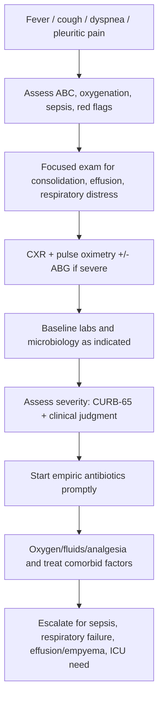
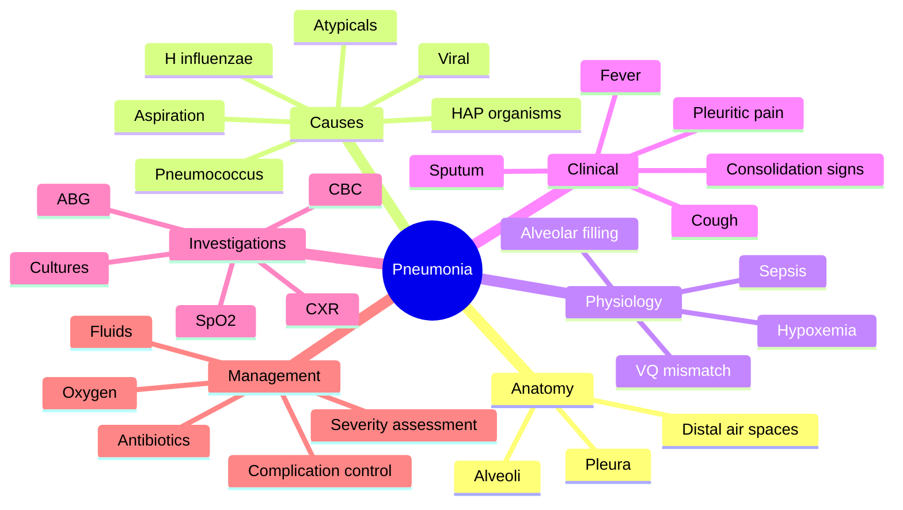
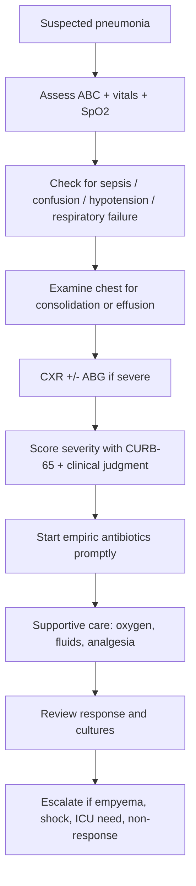

# Pneumonia

> [!important]
> **Pneumonia** is an acute infection of the lung parenchyma, especially the **alveoli and distal air spaces**, causing inflammation, alveolar exudation/consolidation, impaired gas exchange, and systemic illness. In exams, think: **cough + fever + focal chest signs + radiologic infiltrate/consolidation**.

Related: [[Respiratory Failure]], [[Pleural Effusion]], [[Tuberculosis]], [[COPD]], [[Asthma]], [[ABG Interpretation]], [[Chest X-Ray Approach]]

> [!tip]
> FCPS/MRCP questions commonly test **community-acquired pneumonia (CAP)**, severity assessment, pathogen clues, CXR interpretation, CURB-65 logic, sepsis recognition, oxygen/ABG escalation, aspiration pneumonia, atypical pneumonia, complications such as parapneumonic effusion/empyema, and antibiotic selection principles.

## Learning Objectives
- Define pneumonia and distinguish it from bronchitis, COPD exacerbation, pulmonary edema, TB, and lung abscess.
- Understand the airway and alveolar anatomy relevant to infection spread, consolidation, and pleural complications.
- Explain the physiology of V/Q mismatch, shunt physiology, hypoxemia, and respiratory distress in pneumonia.
- Apply a structured approach to diagnosis, severity assessment, microbiologic work-up, and imaging interpretation.
- Manage CAP, hospital-acquired pneumonia (HAP), aspiration pneumonia, and severe pneumonia safely in an exam-oriented manner.
- Recognize complications, red flags, and indications for ICU referral.

## Definition
Pneumonia is:
- **Infection of the pulmonary parenchyma**
- Usually involving:
  - alveoli
  - terminal bronchioles
  - interstitium to variable degree
- Causing:
  - inflammatory exudate
  - consolidation or patchy infiltrates
  - impaired oxygenation
  - systemic inflammatory response

### Core clinical concept
Pneumonia is not simply “chest infection.” It is a **potentially life-threatening lower respiratory tract infection** that may progress to **respiratory failure, sepsis, pleural complications, or death**, especially in the elderly and comorbid patient.

## Core Anatomy
### 1. Airway to alveolus pathway
From Gray’s + Davidson perspective:
- Trachea → main bronchi → lobar bronchi → segmental bronchi → bronchioles → terminal bronchioles → respiratory bronchioles → alveolar ducts → alveoli.
- Pneumonia mainly affects **distal air spaces and alveoli**, but starts after organisms gain access via inhalation, microaspiration, or hematogenous spread.

### 2. Alveoli
- Alveoli are lined mainly by:
  - **Type I pneumocytes**: gas exchange surface
  - **Type II pneumocytes**: surfactant production and repair
- Alveolar macrophages are key first-line defense cells.
- In pneumonia, alveoli fill with inflammatory fluid, neutrophils, fibrin, and cellular debris.

### 3. Lobar and segmental anatomy relevance
- **Lobar pneumonia** may involve a large contiguous part of one lobe.
- **Bronchopneumonia** tends to be patchy and centered around airways.
- **Aspiration pneumonia** often affects dependent segments:
  - posterior upper lobes or superior lower lobes in supine patients
  - basal lower lobes in upright aspiration

### 4. Pleura
- Pneumonia may extend to pleura causing:
  - pleuritic pain
  - parapneumonic effusion
  - empyema

### 5. Lymphatic and vascular relationships
- Inflammatory edema and vascular congestion contribute to radiologic opacity.
- Severe infection can disseminate into blood causing **bacteremia and sepsis**.

> [!important]
> Exam anatomy pearl: infection fills **alveoli**, reducing air content and producing **consolidation** with bronchial breathing, dull percussion, and increased vocal resonance.

## Core Physiology
### 1. Normal physiology relevant to pneumonia
Normal gas exchange requires:
- patent airways
- aerated alveoli
- intact alveolar-capillary membrane
- matching of ventilation and perfusion
- effective mucociliary and immune defense

### 2. Pathophysiology of pneumonia
#### A. Alveolar filling
Infected alveoli fill with exudate, causing:
- reduced ventilation to affected units
- decreased compliance
- increased work of breathing

#### B. V/Q mismatch and shunt physiology
- Perfusion continues through poorly ventilated or non-ventilated alveoli.
- This causes **hypoxemia**.
- Severe lobar consolidation behaves like intrapulmonary shunt.

#### C. Increased work of breathing
- tachypnea develops to maintain oxygenation and ventilation
- chest pain and reduced compliance worsen respiratory effort

#### D. Systemic inflammatory response
Cytokine release causes:
- fever
- tachycardia
- malaise
- anorexia
- confusion in elderly patients
- sepsis in severe disease

#### E. ABG changes
- Early: hypoxemia with low/normal PaCO2 due to hyperventilation
- Late/severe: rising PaCO2 suggests ventilatory failure or exhaustion

### 3. Clinical physiology pearl
The most important immediate physiologic problem in pneumonia is often **impaired oxygenation due to alveolar filling and V/Q mismatch**.

## Normal Values / Important Cut-offs
### Core vital cut-offs used in severity thinking
- Respiratory rate **≥30/min** is a severe feature.
- Systolic BP **<90 mmHg** or diastolic **≤60 mmHg** suggests severe disease/shock risk.
- Confusion is a major severity/red-flag sign.

### ABG / oxygenation
- PaO2: **80–100 mmHg**
- PaCO2: **35–45 mmHg**
- pH: **7.35–7.45**
- HCO3-: **22–26 mmol/L**
- Most acutely ill pneumonia patients without hypercapnic risk: oxygen target usually **94–98%**
- If significant COPD/hypercapnic failure risk coexists: **88–92%** may be appropriate

### Common severity tool: CURB-65
Each scores 1 point:
- **C**onfusion
- **U**rea >7 mmol/L
- **R**espiratory rate ≥30/min
- **B**lood pressure: systolic <90 or diastolic ≤60 mmHg
- age **65** or more

Clinical idea:
- **0–1**: often low risk, consider outpatient if otherwise suitable
- **2**: consider admission
- **3–5**: severe pneumonia; urgent admission / possible HDU-ICU evaluation

### Important labs
- Leukocytosis is common but not universal.
- Raised CRP/ESR/procalcitonin may support inflammation/infection but do not replace clinical judgment.

## Classification
## 1. By setting of acquisition
- **Community-acquired pneumonia (CAP)**
- **Hospital-acquired pneumonia (HAP)**
- **Ventilator-associated pneumonia (VAP)**
- **Healthcare-associated/resistant-risk contexts** depending on local practice patterns

## 2. By pattern
- **Lobar pneumonia**
- **Bronchopneumonia**
- **Interstitial / atypical pneumonia**
- **Aspiration pneumonia**

## 3. By causative organism pattern
- Typical bacterial
- Atypical bacterial
- Viral
- Fungal/opportunistic in immunocompromised states

## 4. By host status
- immunocompetent
- elderly/frail
- immunocompromised
- aspiration-prone
- structurally abnormal lung

## Etiology / Causes
### Typical common organisms in CAP
- **Streptococcus pneumoniae** — classic and very important
- Haemophilus influenzae
- Staphylococcus aureus
- Moraxella catarrhalis
- Gram-negative bacilli in selected patients

### Atypical causes
- Mycoplasma pneumoniae
- Chlamydophila pneumoniae
- Legionella pneumophila

### Viral causes
- Influenza
- RSV
- SARS-CoV-2 and other respiratory viruses

### HAP/VAP pathogens
- Gram-negative bacilli
- Pseudomonas aeruginosa
- MRSA in selected settings
- other resistant hospital flora

### Aspiration pneumonia
- mixed flora including oral anaerobic organisms in predisposed patients

## Risk Factors
- Extremes of age
- Smoking
- COPD, asthma, bronchiectasis
- Diabetes mellitus
- Chronic heart, kidney, liver disease
- Alcohol misuse
- Malnutrition
- Immunosuppression / HIV / steroids / chemotherapy
- Aspiration risk: stroke, seizures, altered consciousness, dysphagia
- Recent influenza or viral infection
- Hospitalization / ventilation for HAP/VAP

## Pathophysiology
### Pathogen entry routes
- microaspiration from oropharynx
- inhalation of droplets/aerosols
- hematogenous spread
- direct extension from nearby infection (rare)

### Stages of classical lobar pneumonia
Traditional pathology sequence:
1. **Congestion**
2. **Red hepatization**
3. **Gray hepatization**
4. **Resolution**

### Functional effects
- alveolar exudate → consolidation
- decreased lung compliance
- increased work of breathing
- V/Q mismatch and shunt → hypoxemia
- bacteremia/sepsis in severe cases

### Why elderly may present atypically
They may show:
- confusion
- falls
- anorexia
- general weakness
with less obvious fever or productive cough.

## Clinical Features
### Symptoms
- Fever
- Cough
- Sputum, often purulent
- Dyspnea
- Pleuritic chest pain
- Malaise, myalgia
- Hemoptysis may occur
- Confusion, especially in elderly

### Classical examination findings of consolidation
- tachypnea
- reduced chest expansion over affected area
- **dull percussion note**
- **bronchial breathing**
- **increased vocal resonance**
- coarse crackles / crepitations

### Atypical/viral clues
- more dry cough
- headache, myalgia
- less obvious focal consolidation initially

### Severe disease clues
- hypotension
- hypoxemia
- cyanosis
- confusion
- inability to maintain oral intake
- septic appearance

## Approach / Algorithm

### Bedside diagnostic approach
1. Suspect pneumonia with **acute cough + fever + focal chest symptoms/signs**.
2. Immediately assess:
   - oxygen saturation
   - respiratory distress
   - blood pressure
   - mental status
   - sepsis features
3. Perform chest examination for consolidation/effusion.
4. Confirm/support with **chest X-ray**.
5. Use **severity scoring + clinical judgment**.
6. Start appropriate antibiotics without unsafe delay.
7. Search for complications and the likely setting/organism pattern.

## Investigations
### 1. Chest X-ray — key confirmatory imaging
May show:
- lobar consolidation
- patchy bronchopneumonia
- interstitial infiltrates
- parapneumonic effusion
- cavitation or abscess in complicated disease

### 2. Pulse oximetry
- essential bedside test in all significant cases
- low saturation indicates severity and need for oxygen/ABG

### 3. ABG
Indications:
- severe pneumonia
- hypoxemia
- cyanosis
- respiratory distress
- drowsiness/confusion
- suspected respiratory failure

### 4. CBC
- leukocytosis common
- leukopenia may imply severe infection or immune compromise
- anemia may coexist

### 5. Urea, electrolytes, creatinine
- needed for **CURB-65** and fluid/renal assessment

### 6. CRP / inflammatory markers
- support diagnosis and follow response
- not stand-alone diagnostic tests

### 7. Blood cultures
Consider in:
- severe CAP
- sepsis
- immunocompromised patient
- failure of outpatient therapy

### 8. Sputum Gram stain/culture
More useful when:
- productive sputum available
- severe disease
- treatment failure
- unusual or resistant organism suspected

### 9. Legionella / pneumococcal antigen tests
May be considered in selected severe/atypical cases depending on local practice.

### 10. Viral testing
Important during outbreaks or when viral pneumonia is likely.

### 11. Ultrasound / CT chest
Use if:
- effusion/empyema suspected
- abscess suspected
- diagnosis uncertain
- no response to treatment
- malignancy/obstruction suspected

## Interpretation Frameworks
### 1. CXR interpretation in pneumonia
- Is there focal or multilobar opacity?
- Lobar or patchy bronchopneumonic pattern?
- Any pleural effusion?
- Any cavitation?
- Any collapse or underlying mass?
- Is this more consistent with edema, TB, or malignancy instead?

### 2. ABG interpretation in pneumonia
Typical severe pattern:
- low PaO2 from V/Q mismatch/shunt
- low/normal PaCO2 initially due to tachypnea
- rising PaCO2 later indicates fatigue/failure

### 3. Severity interpretation framework
Use both:
- **CURB-65**
- overall clinical judgment: oxygen need, sepsis, frailty, oral intake, social support, comorbid disease

### 4. Sputum/blood culture interpretation
- positive cultures help targeted therapy
- negative cultures do not exclude pneumonia
- resistant or unusual growth should be integrated with clinical context

## Diagnosis
Diagnosis is based on:
- acute clinical syndrome compatible with lower respiratory infection
- focal or diffuse chest findings supportive of parenchymal involvement
- imaging evidence of new infiltrate/consolidation, especially on **CXR**

### Sample diagnostic statement
“Community-acquired pneumonia, right lower lobe consolidation, CURB-65 score 2, with hypoxemia but no shock.”

## Differential Diagnosis
| Differential | Clues favoring it over pneumonia |
|---|---|
| Acute bronchitis | cough without focal consolidation/CXR infiltrate |
| Pulmonary edema | orthopnea, bilateral edema pattern, cardiac signs |
| [[Tuberculosis]] | chronic symptoms, weight loss, night sweats, upper-lobe disease |
| Pulmonary embolism | pleuritic pain with risk factors, often normal or nonspecific CXR |
| Lung cancer with post-obstructive change | persistent/localized/recurrent same-site opacity |
| [[COPD]] exacerbation | wheeze dominant, no clear new infiltrate |
| Lung abscess | cavity with air-fluid level, foul sputum, prolonged course |
| Organizing pneumonia / ILD | subacute, noninfective pattern, atypical imaging clues |

## Tables / Comparison Charts
### Typical vs atypical pneumonia
| Feature | Typical pneumonia | Atypical pneumonia |
|---|---|---|
| Onset | Often abrupt | More gradual |
| Sputum | Purulent common | Often scant/dry |
| CXR | Lobar/focal consolidation | Patchy/interstitial pattern |
| Systemic features | Fever common | Headache/myalgia more prominent |
| Organisms | S. pneumoniae, H. influenzae | Mycoplasma, Legionella, Chlamydophila |

### CAP vs HAP
| Feature | CAP | HAP |
|---|---|---|
| Setting | Community | ≥48h after hospital admission / hospital context |
| Common organisms | Pneumococcus etc. | Gram-negatives, resistant flora, MRSA risk |
| Resistance risk | Lower | Higher |
| Empiric therapy | Narrower | Broader depending on risk |

### Consolidation signs table
| Sign | Mechanism |
|---|---|
| Dull percussion | alveolar filling replaces air |
| Bronchial breathing | sound transmitted through consolidated lung |
| Increased vocal resonance | better sound conduction through solid tissue |
| Crackles | reopening fluid-affected small airways/alveoli |

## Management
## A. General principles
- assess severity first
- give oxygen if hypoxemic
- start empiric antibiotics promptly
- support hydration and treat sepsis
- manage comorbid disease and complications

## B. Community-acquired pneumonia (CAP)
### 1. Decide site of care
Based on:
- CURB-65
- oxygenation
- hemodynamic stability
- mental status
- frailty/comorbidity
- oral intake and social context

### 2. Empiric antibiotics
Principles:
- choose based on severity, likely organism, local resistance, allergy, and aspiration risk
- do not delay in severe pneumonia/sepsis
- step down when improving and microbiology permits

> [!important]
> In exams, antibiotic *principles* matter more than memorizing one local protocol: **early empiric therapy, appropriate spectrum, review at 48–72 h, de-escalate when possible**.

### 3. Supportive treatment
- oxygen
- fluids if dehydrated/shocked
- antipyretics / analgesia
- chest pain control
- DVT prophylaxis in admitted patients when appropriate

## C. Severe pneumonia / sepsis management
- urgent admission
- broad empiric therapy according to setting
- sepsis bundle thinking
- close monitoring of oxygenation, BP, urine output, mental status
- ICU referral if respiratory failure, shock, or rapidly progressive disease

## D. Aspiration pneumonia
- suspect in dysphagia, stroke, seizures, reduced consciousness, elderly frail patients
- cover likely aspiration flora according to local guidance
- address swallow risk and future prevention

## E. HAP/VAP
- broader resistant-organism coverage may be needed
- obtain microbiology where possible
- reassess frequently and narrow therapy when able

## F. Non-resolving pneumonia
Think of:
- wrong diagnosis
- resistant or unusual organism
- TB
- abscess/empyema
- malignancy/post-obstructive lesion
- immunocompromise

## Drug Interactions / Contraindications / Comorbidity Cautions
### Antibiotic cautions
- macrolides may prolong QT and interact with other QT-prolonging drugs
- fluoroquinolones have tendon/QT/CNS cautions and renal dose issues depending on drug
- beta-lactam allergy history must be clarified
- renal dysfunction may require dose adjustment

### Steroid caution
- steroids are **not routine for every pneumonia patient**; use only when a specific indication exists (e.g. COPD/asthma overlap, refractory septic shock according to protocol, etc.)

### Fluids caution
- avoid indiscriminate fluid overload in heart failure or renal dysfunction

### Oxygen caution
- most pneumonia patients target 94–98%
- but if significant CO2 retention risk coexists, use controlled oxygen strategy

### Comorbidity cautions
- elderly patients may decompensate quickly with delirium
- diabetes worsens infection risk and glycemic control
- COPD/asthma may coexist and complicate interpretation
- immunosuppressed patients may have unusual pathogens

## Procedures / Indications / Contraindications
### Important procedures in pneumonia care
- pulse oximetry and ABG sampling
- blood culture / sputum collection
- pleural aspiration if effusion present
- chest drain for empyema when indicated
- ICU airway/ventilation support in severe failure

## Procedure Mini-Sections
### 1. Arterial blood gas sampling
- **Indications:** severe pneumonia, hypoxemia, respiratory distress, confusion, suspected respiratory failure
- **Contraindications/cautions:** poor collateral flow/local infection/bleeding risk caution
- **Complications:** pain, hematoma, arterial injury
- **Viva pearl:** pulse oximetry tells you oxygen saturation; ABG tells you oxygenation, ventilation, and acid-base status.

### 2. Diagnostic pleural aspiration
- **Indications:** parapneumonic effusion, suspected empyema
- **Contraindications/cautions:** very small inaccessible effusion, coagulopathy, uncooperative patient without support
- **Complications:** pneumothorax, bleeding, pain
- **Viva pearl:** any significant pleural effusion with pneumonia needs assessment for complicated effusion/empyema.

### 3. Chest drain for empyema
- **Indications:** frank pus, complicated parapneumonic effusion, loculated infected fluid
- **Contraindications/cautions:** relative; depends on anatomy/coagulation/stability
- **Complications:** bleeding, organ injury, pain, persistent leak
- **Viva pearl:** antibiotics alone may be insufficient if infected pleural fluid needs drainage.

## Complications
- Respiratory failure
- Sepsis / septic shock
- Parapneumonic effusion
- Empyema
- Lung abscess
- ARDS
- Bacteremia with metastatic infection
- Delirium in elderly
- Death

## Red Flags / Emergencies
- Respiratory rate ≥30/min
- Hypoxemia / cyanosis
- Hypotension
- Confusion / reduced consciousness
- Rising PaCO2 / exhaustion
- Multilobar involvement
- Sepsis/shock
- Parapneumonic effusion/empyema
- Failure to improve on treatment

## Prognosis
Depends on:
- age
- baseline frailty/comorbidity
- severity score
- oxygenation and organ dysfunction
- organism and resistance pattern
- timeliness of therapy
- complications such as empyema or sepsis

Poor prognostic clues:
- high CURB-65
- shock/hypotension
- respiratory failure
- multilobar disease
- confusion
- immunocompromise

## Topic Correlation
- [[Respiratory Failure]]: severe pneumonia is a major cause of acute hypoxemic failure.
- [[Pleural Effusion]]: parapneumonic effusion and empyema are key complications.
- [[Tuberculosis]]: chronic or non-resolving “pneumonia” may actually be TB.
- [[COPD]] / [[Asthma]]: may coexist and affect antibiotic choice, steroids, and oxygen targets.
- [[ABG Interpretation]]: essential in severe pneumonia.
- [[Chest X-Ray Approach]]: central to diagnosis and follow-up.

## Special Situations
### 1. Elderly patient
- may present with confusion, falls, anorexia, or delirium rather than classic fever/cough
- lower threshold for admission and escalation

### 2. Immunocompromised host
- consider unusual organisms
- radiology may be atypical
- lower threshold for CT/microbiology/escalation

### 3. Aspiration-prone patient
- think of swallow dysfunction, stroke, seizures, intoxication
- dependent-lobe pattern is a clue

### 4. COPD/asthma overlap
- bronchospasm may coexist
- oxygen targets and steroid decisions require nuance

### 5. Pregnancy
- pneumonia can worsen maternal-fetal risk; ensure early recognition, oxygenation, and obstetric-safe drug thinking

## FCPS/MRCP High-Yield Points
- Pneumonia = infection of **lung parenchyma/alveoli**.
- **Chest X-ray** is the key imaging test for confirmation.
- Classical consolidation signs: **dullness, bronchial breathing, increased vocal resonance**.
- Main oxygenation problem = **V/Q mismatch / shunt from alveolar filling**.
- Use **CURB-65** for severity support, but never replace clinical judgment.
- Severe pneumonia can progress to **respiratory failure, sepsis, empyema, or ARDS**.
- Consider **aspiration**, **TB**, **malignancy**, or **resistant organisms** in non-resolving cases.
- Significant effusion may need **diagnostic aspiration** and possibly drainage.

## Common Viva Questions
1. Define pneumonia.
2. What are the classical signs of consolidation?
3. What is CURB-65?
4. What is the difference between lobar pneumonia and bronchopneumonia?
5. Why does pneumonia cause hypoxemia?
6. What are the complications of pneumonia?
7. How do you manage severe CAP?
8. When do you suspect aspiration pneumonia?
9. What are the indications for ABG in pneumonia?
10. How do you approach non-resolving pneumonia?

## Common Confusions / Exam Traps
- **Trap:** Treating “cough + fever” as simple bronchitis without assessing severity or oxygenation.  
  **Correction:** Check vitals, SpO2, CXR, and red flags.
- **Trap:** Using CURB-65 mechanically without clinical context.  
  **Correction:** Always integrate frailty, oxygen need, sepsis, and comorbidity.
- **Trap:** Missing empyema/parapneumonic effusion in persistent fever.  
  **Correction:** Repeat imaging/ultrasound and consider drainage.
- **Trap:** Calling non-resolving focal opacity “persistent pneumonia” forever.  
  **Correction:** Exclude TB, abscess, malignancy, obstruction.
- **Trap:** Giving high-flow uncontrolled oxygen to every patient with coexistent chronic CO2 retention risk.

## Mnemonics
### CURB-65
- **C**onfusion
- **U**rea >7 mmol/L
- **R**espiratory rate ≥30
- **B**lood pressure low
- age **65**+

### Pneumonia emergency scan: **SOAR**
- **S**aturation low
- **O**rientation altered
- **A**irway/breathing distressed
- **R**adiology + rapid antibiotics

## Mind Map

## Flowchart

## Suggested Visuals / Image Notes
- Diagram of normal alveolus vs consolidated alveolus.
- CXR of lobar consolidation vs bronchopneumonia.
- Dependent-lobe aspiration pneumonia diagram.
- Flowchart of CAP severity assessment and admission logic.
- Pleural effusion/empyema complication diagram.

## Suggested Video References
- “Chest X-ray consolidation explained”
- “CURB-65 and pneumonia severity assessment”
- “Pleural effusion and empyema in pneumonia”
- “ABG interpretation in acute hypoxemic respiratory failure”

## One-Page Revision Summary
- Pneumonia = **acute infection of alveoli/lung parenchyma**.
- Symptoms: **fever, cough, sputum, dyspnea, pleuritic pain**.
- Key signs of consolidation: **dullness, bronchial breathing, increased vocal resonance**.
- CXR is the main confirmatory imaging test.
- Physiologic problem: **alveolar filling → V/Q mismatch/shunt → hypoxemia**.
- Assess severity with **CURB-65 + clinical judgment**.
- Start empiric antibiotics early; do not delay in severe disease.
- Severe complications: **respiratory failure, sepsis, empyema, abscess, ARDS**.
- Non-resolving pneumonia: think **TB, malignancy, resistant organism, abscess, wrong diagnosis**.

## 24-Hour Recall Prompts
- Define pneumonia in one sentence.
- List the classical signs of consolidation from memory.
- Write CURB-65 without looking.
- Why does pneumonia cause hypoxemia?
- List four complications of pneumonia.
- Compare typical vs atypical pneumonia.
- What are the main causes of non-resolving pneumonia?

## 7-Day / 15-Day / 30-Day Revision Tracker
- [ ] Day 1 completed
- [ ] 24-hour recall completed
- [ ] Day 7 revision completed
- [ ] Day 15 revision completed
- [ ] Day 30 revision completed
- [ ] Re-draw the diagnosis/management flowchart
- [ ] Re-answer MCQs/SBAs after Day 7

## Must Know / Should Know / Nice to Know
### Must Know
- definition and alveolar involvement
- consolidation signs
- CXR role
- CURB-65
- oxygenation/ABG escalation
- major complications

### Should Know
- typical vs atypical patterns
- aspiration pneumonia clues
- pleural complications and empyema drainage logic
- non-resolving pneumonia approach

### Nice to Know
- classical pathologic stages of lobar pneumonia
- detailed urinary antigen/molecular testing nuances
- advanced ICU ventilation issues

## My Weak Points
- [ ] I can state CURB-65 without error.
- [ ] I can explain why dullness + bronchial breathing occur.
- [ ] I can differentiate pneumonia from pulmonary edema and TB.
- [ ] I can list the immediate complications requiring escalation.

## Self-Test Scorecard
- Understanding: /10
- Recall: /10
- MCQ Performance: /10
- SBA Performance: /10
- Viva Confidence: /10
- Total: /50

> [!tip]
> Interpretation: **<35 = weak topic**, **35–44 = acceptable but insecure**, **45+ = strong exam-ready topic**.

## Exam Answer Modes
### Long Answer Skeleton
- Definition
- Etiology and classification
- Pathophysiology
- Clinical features and consolidation signs
- Investigations including CXR and severity assessment
- Management of CAP/severe pneumonia and complications

### Short Note Skeleton
- Pneumonia is infection of lung parenchyma causing alveolar inflammation and consolidation.
- Presents with fever, cough, sputum, dyspnea, pleuritic chest pain.
- Signs: dullness, bronchial breathing, increased vocal resonance.
- CXR confirms/supports diagnosis.
- Treat with severity assessment, antibiotics, oxygen, and complication management.

### Viva One-Liners
- “Pneumonia is infection of the alveolar lung parenchyma.”
- “CURB-65 helps severity assessment but does not replace clinical judgment.”
- “Hypoxemia results from alveolar filling causing V/Q mismatch.”
- “Parapneumonic effusion may require aspiration or drainage.”

### Ward-Case Discussion Points
- symptom onset and sputum type
- aspiration and TB risk
- oxygenation and sepsis assessment
- CXR pattern and pleural complication check
- antibiotic timing and microbiology
- plan for reassessment if non-resolving

### Last-Night-Before-Exam Sheet
- Fever + cough + focal chest signs + CXR infiltrate = pneumonia
- Consolidation signs: dullness, bronchial breathing, ↑ vocal resonance
- CURB-65 = confusion, urea, RR, BP, age 65+
- Hypoxemia from V/Q mismatch/shunt
- Treat early with antibiotics + oxygen + supportive care
- Watch for sepsis, empyema, respiratory failure, ARDS

## Summary
Pneumonia is an acute infection of the **alveoli and lung parenchyma** that produces inflammatory exudation, consolidation, impaired gas exchange, and systemic illness. Clinically it presents with **fever, cough, sputum, dyspnea, pleuritic chest pain, and focal chest signs**, with **CXR** providing key imaging support. Good management depends on rapid severity assessment, prompt empiric antibiotics, oxygen/supportive care, and early detection of complications such as **respiratory failure, sepsis, parapneumonic effusion/empyema, abscess, and ARDS**.

## MCQs (10)
1. The most classical pathogen in community-acquired pneumonia is:
   - A. Candida albicans
   - B. Streptococcus pneumoniae
   - C. Entamoeba histolytica
   - D. Aspergillus fumigatus

2. Which physical sign most strongly suggests lung consolidation?
   - A. Hyperresonance
   - B. Bronchial breathing
   - C. Absent vocal resonance
   - D. Tracheal tug

3. In pneumonia, hypoxemia most commonly occurs because of:
   - A. Decreased atmospheric oxygen
   - B. V/Q mismatch due to alveolar filling
   - C. Only anemia
   - D. Left-to-right shunt

4. A major component of CURB-65 is:
   - A. Serum calcium
   - B. Confusion
   - C. Platelet count
   - D. Body mass index

5. Which investigation is most important to confirm/support pneumonia radiologically?
   - A. MRI brain
   - B. Chest X-ray
   - C. Echocardiogram
   - D. Abdominal ultrasound

6. Which complication may require pleural drainage?
   - A. Empyema
   - B. Allergic rhinitis
   - C. Migraine
   - D. Simple pharyngitis

7. Aspiration pneumonia is particularly likely in a patient with:
   - A. Dysphagia after stroke
   - B. Isolated eczema
   - C. Hyperthyroidism only
   - D. Migraine aura

8. A rising PaCO2 in severe pneumonia suggests:
   - A. Improvement
   - B. Ventilatory failure/exhaustion
   - C. Pure anxiety only
   - D. Normal physiology

9. Which is a classic sign of consolidation?
   - A. Increased vocal resonance
   - B. Tympanic note
   - C. Wide fixed split S2
   - D. Absent breath sounds universally

10. Non-resolving pneumonia should prompt consideration of:
   - A. TB or malignancy
   - B. Only gastritis
   - C. Migraine
   - D. Hyperparathyroidism

## SBA Questions (10)
1. A 72-year-old man presents with fever, productive cough, pleuritic chest pain, RR 32/min, BP 88/56 mmHg, and confusion. What is the best immediate overall approach?
   - A. Send home with cough syrup
   - B. Treat as severe pneumonia with urgent admission, oxygen, antibiotics, and sepsis assessment
   - C. Delay treatment until sputum culture returns
   - D. Reassure and review after one week

2. A 25-year-old with fever and cough has dullness to percussion, bronchial breathing, and increased vocal resonance over the right lower zone. The best interpretation is:
   - A. Pleural rub only
   - B. Consolidation likely due to pneumonia
   - C. Pneumothorax
   - D. Normal examination

3. A patient with pneumonia becomes more hypoxemic and ultrasound shows infected pleural fluid. What additional intervention may be required?
   - A. Pleural drainage
   - B. Thyroidectomy
   - C. Hemodialysis
   - D. Cataract surgery

4. A frail stroke patient with dysphagia develops fever and right basal infiltrates. Most likely type of pneumonia?
   - A. Aspiration pneumonia
   - B. Tropical sprue
   - C. Sarcoidosis
   - D. Migraine-related infiltrate

5. A 40-year-old with dry cough, myalgia, headache, and diffuse/interstitial chest imaging is more suggestive of:
   - A. Atypical pneumonia
   - B. Tension pneumothorax
   - C. Mitral stenosis
   - D. Nephrotic syndrome

6. A patient with severe CAP has low oxygen saturation and increasing drowsiness. Which test is most appropriate now?
   - A. ABG
   - B. Stool occult blood
   - C. Mantoux only
   - D. Bone scan

7. A patient treated for pneumonia remains febrile with persistent focal opacity after appropriate therapy. What is the next correct thinking?
   - A. Pneumonia always takes years to resolve, so ignore it
   - B. Consider abscess, empyema, TB, malignancy, resistant organism, or wrong diagnosis
   - C. Stop all investigations permanently
   - D. Diagnose asthma automatically

8. A 67-year-old with cough and fever has urea 9 mmol/L, RR 28/min, normal BP, and no confusion. CURB-65 score is:
   - A. 0
   - B. 1
   - C. 2
   - D. 4

9. Which patient factor most strongly raises suspicion of aspiration pneumonia?
   - A. Dysphagia and reduced consciousness
   - B. Mild seasonal allergy only
   - C. Simple acne
   - D. Isolated knee pain

10. Which statement about severity scoring is most accurate?
   - A. CURB-65 replaces all clinical judgment
   - B. Severity scoring supports, but does not replace, full clinical assessment
   - C. CURB-65 is used only in dermatology
   - D. It is irrelevant in pneumonia

## Flashcards
- Q: Define pneumonia.
  A: Acute infection of the lung parenchyma/alveoli causing inflammation and consolidation.
- Q: What are the classical signs of consolidation?
  A: Dull percussion, bronchial breathing, increased vocal resonance, crackles.
- Q: What is the commonest classical CAP organism?
  A: Streptococcus pneumoniae.
- Q: What causes hypoxemia in pneumonia?
  A: Alveolar filling causing V/Q mismatch and shunt physiology.
- Q: What imaging test is central to diagnosis?
  A: Chest X-ray.
- Q: What does CURB-65 stand for?
  A: Confusion, Urea, Respiratory rate, Blood pressure, age 65+.
- Q: What complication suggests need for pleural aspiration/drainage?
  A: Parapneumonic effusion or empyema.
- Q: What does rising PaCO2 in severe pneumonia suggest?
  A: Exhaustion/ventilatory failure.
- Q: Name one major differential of non-resolving pneumonia.
  A: Tuberculosis or malignancy.
- Q: What dependent-lobe infection pattern suggests aspiration?
  A: Posterior upper/superior lower lobe in supine patients, or basal lower lobe disease.

## Answer Key with Explanations
### MCQs
1. **B** — Pneumococcus is the classical and most tested CAP pathogen.
2. **B** — Bronchial breathing is a classic sign of consolidation.
3. **B** — Alveolar exudation creates low V/Q units and shunt physiology.
4. **B** — Confusion is one component of CURB-65.
5. **B** — Chest X-ray is the primary radiologic test.
6. **A** — Empyema often requires drainage in addition to antibiotics.
7. **A** — Dysphagia and aspiration risk strongly point to aspiration pneumonia.
8. **B** — Rising CO2 implies failure/exhaustion in severe lung infection.
9. **A** — Increased vocal resonance is another classic consolidation sign.
10. **A** — Persistent focal disease requires exclusion of TB, malignancy, abscess, or other alternative causes.

### SBAs
1. **B** — This is severe pneumonia/sepsis risk; urgent inpatient management is required.
2. **B** — The combination of signs points to consolidation, commonly due to pneumonia.
3. **A** — Infected pleural fluid often needs drainage.
4. **A** — Stroke with dysphagia strongly suggests aspiration pneumonia.
5. **A** — Dry cough + systemic symptoms + interstitial pattern suggests atypical pneumonia.
6. **A** — ABG is needed in deteriorating hypoxemic or drowsy patients.
7. **B** — Non-resolving pneumonia requires a broader differential and re-evaluation.
8. **C** — Age ≥65 = 1, urea >7 = 1, RR <30 = 0, no confusion = 0, BP normal = 0. Total 2.
9. **A** — Dysphagia and altered consciousness are major aspiration risks.
10. **B** — CURB-65 helps but must be integrated with the overall clinical picture.

## PasTest Scenario SBAs (Clinical Vignettes)

> **Auto-generated PasTest/Mediscope-style scenario SBAs** grounded in the authored source. Each scenario tests a real clinical fact (triad, specific sign, contraindication, trial, first-line Rx) extracted from the topic. *Source: Ch 17: Respiratory Medicine — Pneumonia*

**Q1.** What is the most appropriate first-line therapy for Pneumonia?

  - **A.** give oxygen if hypoxemic
  - **B.** An advanced/surgical therapy reserved for refractory disease
  - **C.** Symptomatic treatment only, no disease-modifying therapy
  - **D.** Empiric broad-spectrum therapy without specific indication

  > **Answer: A** — give oxygen if hypoxemic
  >
  > *Source:* give oxygen if hypoxemic

