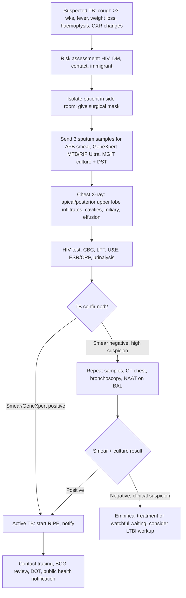
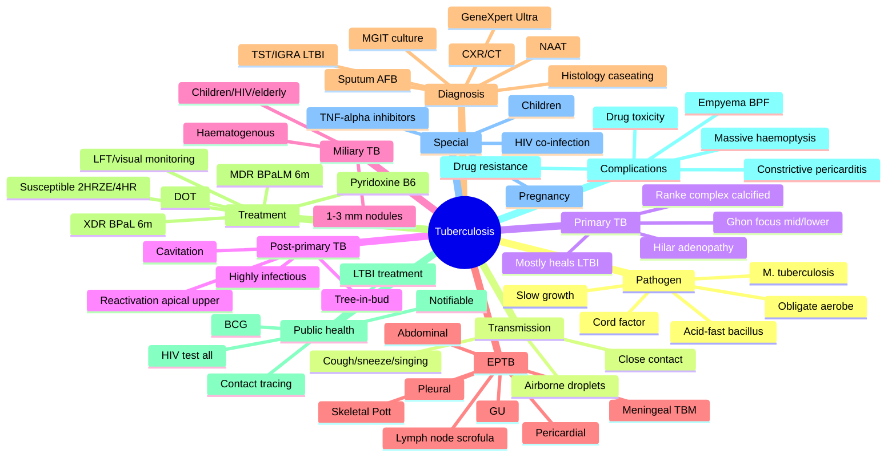
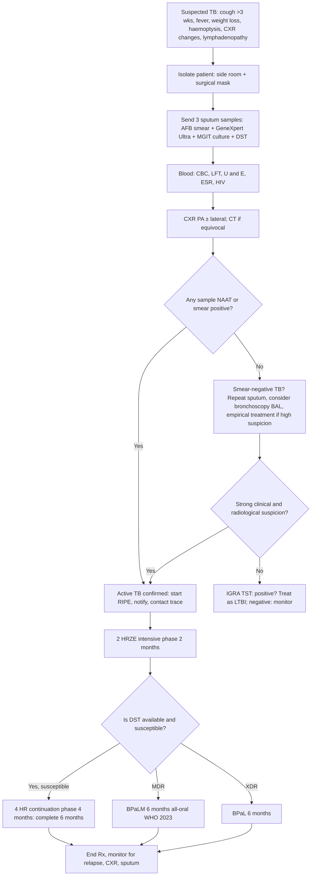

# Tuberculosis

> [!important]
> **Tuberculosis (TB)** is a chronic granulomatous infectious disease caused by *Mycobacterium tuberculosis* (occasionally *M. bovis*, *M. africanum*) that most commonly affects the **lungs (pulmonary TB, ~80%)** but can involve any organ (**extra-pulmonary TB, ~20%**). It remains the **world's leading single-agent infectious cause of death** (~1.3 million deaths/year; WHO 2023) and is a **notifiable disease** in most jurisdictions.

Related: [[Pneumonia]], [[Lung Cancer]], [[Hemoptysis]], [[Pleural Effusion]], [[ABG Interpretation]], [[Bronchiectasis]], [[Respiratory Infections/Pulmonary tuberculosis]], [[Respiratory Infections/Latent tuberculosis infection|LTBI]], [[Respiratory Infections/Drug-resistant tuberculosis|MDR/XDR-TB]], [[Respiratory Infections/Tuberculosis and mycobacterial disease|TB & mycobacterial disease]]

> [!tip]
> **FCPS/MRCP pearl**: "TB is the great mimicker." Always consider TB in: persistent cough >3 weeks, unexplained weight loss/fever, lymphadenopathy, sterile pyuria, chronic meningitis, pericardial effusion, or apical cavitating CXR lesions. **Notify the public health authority within 48 h** of suspected/confirmed pulmonary TB (Public Health Act).

## Learning Objectives
- Define TB and describe the biology of *M. tuberculosis* (acid-fast bacillus, slow-growing, obligate aerobe).
- Distinguish **primary** from **post-primary (reactivation) TB** and recognise the spectrum from **latent TB infection (LTBI)** to **active disease**.
- Identify risk factors (HIV, malnutrition, DM, immunosuppression, prisons, healthcare, silicotics).
- Recognise clinical features: constitutional, pulmonary (cough, haemoptysis, pleurisy) and extra-pulmonary (lymphatic, pleural, meningeal, miliary, skeletal, genitourinary, abdominal, pericardial).
- Order and interpret: **CXR, sputum AFB/Ziehl-Neelsen, GeneXpert MTB/RIF Ultra, MGIT culture, NAAT, TST, IGRA (T-spot.TB, QuantiFERON)**.
- Apply the **standard 6-month RIPE regimen (2HRZE / 4HR)** and manage MDR/XDR-TB per WHO 2023.
- Counsel on **BCG vaccination**, **contact tracing**, **isoniazid preventive therapy (IPT)**, and public-health notification.

## Definition

**Tuberculosis (WHO 2023)**: A communicable disease caused by *M. tuberculosis* complex, characterised by **granulomatous inflammation** and **caseous necrosis**, transmissible by **airborne droplet nuclei (<5 µm)** from patients with active pulmonary/laryngeal disease. Active disease is classified as:

- **Pulmonary TB (PTB)**: lung parenchyma ± tracheobronchial tree
  - **Smear-positive PTB**: ≥1 sputum AFB smear positive
  - **Smear-negative PTB**: sputum smear negative but NAAT/culture positive, OR clinically/radiologically diagnosed (in high-burden settings)
- **Extra-pulmonary TB (EPTB)**: pleura, lymph nodes, meninges, bones/joints, abdomen, GU, pericardium, skin, miliary

**Latent TB infection (LTBI)**: Asymptomatic infection with *M. tuberculosis*; **immune response positive (TST/IGRA)** but **no active disease**.

## Core Anatomy

### Respiratory anatomy relevant to TB
| Structure | TB relevance |
|-----------|--------------|
| **Upper lobes (apical/posterior segments)** | Highest O₂ tension → obligate aerobe *M. tb* thrives → **post-primary (reactivation) TB predilection** |
| **Lower lobes (anterior basal)** | Common site of **primary TB** focus (Ghon focus) |
| **Hilar & mediastinal lymph nodes** | Drainage site for primary focus → **Ghon/Ranke complex** with calcified node |
| **Pleura** | Direct extension or hypersensitivity → **TB pleuritis, pleural effusion (lymphocyte-predominant, exudate, ↑ADA)** |
| **Lymphatics** | Spread to nodes (scrofula), miliary haematogenous dissemination |
| **Endothelium/alveolar macrophages** | First site of bacillary encounter; **phagocytosis + immune evasion** |

### Granuloma anatomy
- **Caseating granuloma**: central **caseous necrosis** (cheese-like) surrounded by **epithelioid histiocytes**, **Langhans giant cells** (multinucleate, horseshoe-arranged nuclei), **CD4+ Th1 lymphocytes**, and a **fibrotic rim**.
- Maintains bacilli in dormant state (LTBI) but is **imperfect containment** — reactivation can occur.

## Core Physiology

### Immune response to *M. tuberculosis*
1. **Inhaled droplet nuclei** → reach alveolus
2. **Alveolar macrophage** phagocytoses bacillus; **sulphatides & cord factor** inhibit phagolysosome fusion → intracellular survival
3. **Antigen presentation** to **CD4+ Th1 cells** → IL-12 → IFN-γ release → activates macrophages
4. **Granuloma formation** at 2–6 weeks → caseous centre, Th1 rim → contains infection
5. **Cell-mediated (Type IV) hypersensitivity** → **TST positivity** at 4–6 weeks post-exposure

> [!tip] **Why TST/IGRA turn positive at 4–6 weeks** — this is the time for cell-mediated immunity to develop. **HIV-positive** patients may have **false-negative TST/IGRA** due to anergy.

### Gas exchange
- Localised disease: minimal effect
- Extensive/Miliary TB: ↓ PaO₂, ↑ A-a gradient
- Massive haemoptysis, ARDS (rare): life-threatening hypoxaemia

## Normal Values / Important Cut-offs

| Parameter | Value / cut-off | Significance |
|-----------|----------------|--------------|
| **Mantoux (TST) 5 TU PPD** | **≥5 mm** (HIV/contacts), **≥10 mm** (high-risk), **≥15 mm** (low-risk) | Positive for LTBI |
| **IGRA (T-spot.TB, QuantiFERON-TB Gold)** | Positive/negative/indeterminate | LTBI; not affected by BCG |
| **Sputum AFB smear** | ≥1 bacillus / 100 HPF | Smear-positive = highly infectious |
| **GeneXpert MTB/RIF Ultra** | Detects MTB + **rifampicin resistance** in <2 h | First-line rapid test (WHO) |
| **MGIT culture** | 1–6 weeks (gold standard) | Confirms viability + DST |
| **Pleural fluid ADA** | **>40 U/L** | Supports TB pleuritis (lymphocyte-predominant exudate) |
| **CD4 count** | <200/µL | High risk of TB reactivation & atypical presentations |

## Etiology / Causes

### *Mycobacterium tuberculosis* complex
- **M. tuberculosis** (most common) — obligate aerobe, slow-growing (generation time 15–20 h), **acid-fast bacillus (AFB)** — mycolic acid in cell wall retains carbol fuchsin (Ziehl-Neelsen / auramine-rhodamine)
- **M. bovis** — unpasteurised milk; now rare due to pasteurisation & BCG
- **M. africanum** — West Africa
- **M. microti, M. canettii** — rare

> [!tip] **Key microbiological features**: obligate aerobe (apical predilection), **acid-fast** (resists decolourisation with acid-alcohol), **slow generation** (cultures take 2–8 weeks), **cord factor (trehalose dimycolate)** → serpentine cording, virulence, granuloma induction.

### NTM (Non-tuberculous mycobacteria)
- *M. avium* complex (MAC), *M. kansasii*, *M. abscessus*
- Cause disease in immunocompromised (HIV with CD4 <50) or structural lung disease (COPD, bronchiectasis, CF)
- **NOT transmitted person-to-person**; **NOT a public health notifiable disease**
- See [[Respiratory Infections/Non-tuberculous mycobacterial pulmonary disease]]

## Risk Factors

### Host risk factors
- **HIV infection** (CD4 <200 → 20–30× increased risk; atypical/extrapulmonary common)
- **Diabetes mellitus** (3× risk)
- **Chronic kidney disease / dialysis**
- **TNF-α inhibitors, biologics, steroids, chemotherapy** — reactivation
- **Malnutrition, vitamin D deficiency**
- **Silicosis** (3–30× risk)
- **Haematologic malignancy, transplant recipients**
- **Smoking, alcohol misuse, IVDU**
- **Age (very young, elderly)**

### Environmental / exposure
- **Close contact with active pulmonary TB** (household, prisons, hospitals, hostels)
- **Healthcare workers**
- **Immigration from high-burden countries** (South Asia, sub-Saharan Africa, Eastern Europe, Russia)
- **Homelessness, IVDU**

> [!tip] **FCPS trap**: A new immigrant with a fever and a pleural effusion? Always think **TB** (until proven otherwise). A diabetic with persistent cough and apical infiltrate? Think **TB**.

## Pathophysiology

### Primary TB
1. **Inhaled droplet nuclei → reach alveolus** (typically mid-lower zone)
2. **Ghon focus** — subpleural granuloma + central caseation
3. **Lymphatic spread to hilar nodes** → **Ghon complex** (Ghon focus + caseating node)
4. **CXR**: small parenchymal infiltrate + ipsilateral hilar adenopathy ± **Ranke complex** (calcified focus + calcified node) once healed
5. **95% of immunocompetent hosts** → granuloma controls infection → **LTBI**
6. **5% → primary progressive TB** (children, HIV): large effusion, lobar consolidation, miliary spread

### Post-primary (reactivation) TB
- **Reactivation of dormant bacilli** in old Ghon focus (typically **apical/posterior upper lobe** due to high O₂)
- **Host risk factors** (HIV, DM, malnutrition, immunosuppression) cause breakdown of granuloma
- **Caseating granulomas coalesce** → central liquefaction → **cavitation** (highly infectious)
- Spread: endobronchial (tree-in-bud), haematogenous (**miliary TB**), lymphatic

### Miliary TB
- **Massive haematogenous dissemination** → small (1–5 mm) yellow-white granulomas in **lung, liver, spleen, bone marrow, choroid, meninges**
- Common in **children, HIV, elderly**
- CXR: "millet seed" pattern (innumerable 1–3 mm nodules)

## Classification

| Class | Description |
|-------|-------------|
| **0** | No TB exposure, not infected |
| **1** | TB exposure, no infection (TST/IGRA negative) |
| **2** | Latent TB infection (TST/IGRA positive, no disease) |
| **3** | Active TB disease (clinically active) |
| **4** | TB inactive (history of disease, current TST/IGRA indeterminant, no disease) |
| **5** | TB suspect (pending evaluation) |

### Anatomical classification
- **Pulmonary (PTB)** — parenchyma, airways, pleura
- **Extra-pulmonary (EPTB)** — lymph node, meningeal, pleural, skeletal, GU, abdominal, pericardial, miliary, cutaneous

### WHO drug-resistance classification
- **Mono-resistant** — resistant to 1 first-line drug
- **Poly-resistant** — resistant to ≥2 first-line drugs (not R + I)
- **MDR-TB** — resistant to **at least INH + RIF**
- **Pre-XDR-TB** — MDR + resistant to any fluoroquinolone
- **XDR-TB** — MDR + resistant to any fluoroquinolone + at least one of bedaquiline/linezolid (WHO 2021 definition)

## Clinical Features

### Constitutional
- **Fever** (often low-grade, evening, "hectic" in miliary)
- **Night sweats** (drenching)
- **Weight loss** (cachexia)
- **Anorexia, malaise, fatigue**
- **Clubbing** (chronic fibrocavitary TB)

### Pulmonary
| Feature | Description |
|---------|-------------|
| **Cough** | Insidious onset, productive (mucoid → purulent), **>2–3 weeks** is the WHO definition of "TB suspect" |
| **Haemoptysis** | Streaking to massive (Rasmussen aneurysm in upper lobe cavity) |
| **Pleuritic chest pain** | Pleural involvement |
| **Dyspnoea** | Effusion, miliary, large cavitary disease |
| **Wheeze** | Endobronchial TB, lymph node compression |

### Physical signs
- **Cachexia, fever, tachycardia**
- **Dullness, ↓ breath sounds, crackles** (consolidation, effusion)
- **Amphoric (cavernous) breath sounds** over cavity
- **Post-tussive apical crackles** (early sign)
- **Lymphadenopathy** (scrofula — cervical, supraclavicular)
- **Spinal tenderness, gibbus** (Pott's spine)

### Extra-pulmonary TB
| Site | Features |
|------|----------|
| **Lymphatic (scrofula)** | Painless cervical/supraclavicular nodes, matted, ± cold abscess, sinus |
| **Pleural** | Lymphocyte-predominant exudate, **ADA >40 U/L**, ↑ protein, low glucose |
| **Meningeal (TBM)** | Subacute fever, headache, neck stiffness, **CSF: lymphocytes, ↑protein, ↓glucose**, basal meningeal enhancement on MRI |
| **Miliary** | Fever, hepatosplenomegaly, choroidal tubercles (fundoscopy), pancytopenia |
| **Skeletal (Pott's spine)** | Thoracolumbar, vertebral collapse, gibbus, cold abscess (psoas) |
| **Genitourinary** | Sterile pyuria, haematuria, dysuria, scrotal swelling (epididymitis) |
| **Abdominal** | Ileocaecal mass, ascites (lymphocyte-rich, high ADA), hepatosplenomegaly |
| **Pericardial** | Subacute pericardial effusion → constrictive pericarditis (high ADA in fluid) |

## Approach / Algorithm

## Investigations

### Imaging
| Modality | Finding |
|----------|---------|
| **CXR** | **Post-primary**: apical/posterior upper lobe infiltrates ± cavitation, fibrosis, volume loss, calcification, endobronchial spread (tree-in-bud). **Primary**: middle/lower zone infiltrate + ipsilateral hilar adenopathy ± effusion. **Miliary**: 1–3 mm nodules throughout. **Pleural**: unilateral effusion |
| **CT chest** | Tree-in-bud, cavities, miliary nodules, mediastinal nodes, broncholiths |
| **HRCT** | Centrilobular nodules, "tree-in-bud", cavities, bronchial wall thickening |
| **MRI spine** | Pott's disease: vertebral collapse, paravertebral abscess, cord compression |

### Microbiology
| Test | Detail | Time | Sensitivity | Use |
|------|--------|------|-------------|-----|
| **Sputum AFB smear (Ziehl-Neelsen / auramine-rhodamine)** | Direct microscopy | 1 h | ~50–70% in culture-positive PTB | Rapid screening, infectiousness |
| **GeneXpert MTB/RIF Ultra (Xpert Ultra)** | Semi-automated nested PCR | <2 h | Pooled sensitivity ~88% (smear+/culture+), 67% (smear−) | **WHO recommended first-line**; also detects **RIF resistance** (rpoB mutation) |
| **MGIT culture** | Liquid culture (gold standard) | 1–6 weeks | Highest | DST, viability, species ID |
| **Solid culture (LJ media)** | Egg-based | 3–8 weeks | — | Backup, DST |
| **Drug susceptibility testing (DST)** | Phenotypic / genotypic | 1–3 weeks | — | Confirms drug resistance |
| **Line-probe assays (LPA)** | Hain MTBDRplus / MTBDRsl | 1–2 days | — | Detects INH, RIF, FQ, AG resistance |
| **Histology (caseating granulomas)** | Tissue biopsy | days | — | EPTB confirmation |

### Immunological (LTBI diagnosis)
| Test | Principle | Cut-off | Notes |
|------|-----------|---------|-------|
| **Mantoux (TST, 5 TU PPD-S)** | Type IV hypersensitivity | ≥5/10/15 mm | **Affected by BCG** (false+); false− in HIV/anergy |
| **QuantiFERON-TB Gold Plus** | IFN-γ release to ESAT-6, CFP-10 | IFN-γ >0.35 IU/mL | **Not affected by BCG**; requires viable blood |
| **T-spot.TB** | ELISpot counting IFN-γ-producing T cells | ≥8 spots | **Not affected by BCG**; less affected by immunosuppression |

> [!tip] **WHO recommends IGRA over TST in BCG-vaccinated** individuals; **TST/IGRA cannot distinguish LTBI from active TB** — they only confirm immunologic sensitisation.

### For EPTB
- **Lymph node**: excision biopsy (FNA less sensitive) — caseating granulomas + AFB
- **Pleural fluid**: lymphocyte-predominant exudate, **protein >30 g/L, ADA >40 U/L**, low glucose; **pleural biopsy** (closed/medical thoracoscopy) for histology
- **CSF (TBM)**: lymphocytes, ↑ protein, ↓ glucose (<2.2 mmol/L or <50% serum), ↑ ADA, **NAAT (Xpert Ultra on CSF) — sensitivity ~50%**
- **Urine (GU TB)**: 3 early-morning urines for AFB; **sterile pyuria** is the hallmark
- **Bone marrow / liver biopsy**: for miliary/disseminated TB

## Diagnosis

### Definitive diagnosis
- **Microbiological confirmation**: AFB smear, NAAT (GeneXpert Ultra), or culture of *M. tuberculosis* from any specimen
- **OR Histology**: caseating granulomas (compatible with TB in correct clinical context)

### Clinical/radiological diagnosis (in smear-negative cases)
- Compatible clinical features + CXR/HRCT findings + exclusion of alternative diagnosis + response to empirical therapy (in high-burden settings)

## Differential Diagnosis

| Condition | Distinguishing feature |
|-----------|------------------------|
| **Community-acquired pneumonia** | Acute onset, fever, consolidation; responds to antibiotics; no weight loss/night sweats |
| **Lung cancer** | Older smoker, weight loss, mass lesion, haemoptysis; biopsy needed |
| **Lung abscess** | Foul sputum, cavity with air-fluid level, alcohol/dental disease |
| **Bronchiectasis** | Daily purulent sputum, CT airway dilatation, recurrent infection |
| **Sarcoidosis** | Bilateral hilar lymphadenopathy, non-caseating granulomas, ↑ACE |
| **Silicosis / pneumoconiosis** | Occupational dust exposure, nodular opacities, eggshell calcification |
| **Fungal (histoplasmosis, coccidioidomycosis)** | Travel history, exposure, serology/culture |
| **Atypical mycobacteria (NTM)** | HIV (CD4 <50), structural lung disease, MAC, not TB |
| **Lymphoma** | B-symptoms, mediastinal nodes, biopsy |
| **Actinomycosis, nocardiosis** | Sinus tracts, sulphur granules |

## Tables / Comparison Charts

### Primary vs Post-primary TB

| Feature | Primary TB | Post-primary (reactivation) TB |
|---------|------------|--------------------------------|
| **Host** | Children, immunocompromised | Adults, especially with risk factors |
| **Lobe** | Middle/lower zones | **Apical/posterior upper lobe** |
| **Lymph nodes** | Hilar/mediastinal adenopathy common | Less common |
| **Cavitation** | Rare | Common |
| **Infectiousness** | Usually low | High (smear-positive cavities) |
| **Ghon focus** | Yes | Old calcified focus may be present |
| **Pleural effusion** | Common (immunological) | Less common |
| **Miliary spread** | In young/immunocompromised | In immunosuppressed |

### TST vs IGRA

| Feature | TST (Mantoux) | IGRA (QuantiFERON / T-spot.TB) |
|---------|---------------|--------------------------------|
| **Antigens** | PPD (many, including BCG cross-reactive) | ESAT-6, CFP-10, TB7.7 (TB-specific) |
| **BCG effect** | Yes (false+) | **No** |
| **Reader bias** | Yes (operator-dependent) | No (automated) |
| **Boosting** | Yes (repeat test boosts) | No |
| **2-visit requirement** | Yes (inject + read 48–72 h) | No (single blood draw) |
| **Sensitivity in HIV** | Reduced (anergy) | Slightly better but still reduced |
| **Cost** | Low | Higher |
| **Use in BCG-vaccinated** | Limited | **Preferred** |

## Management

### Treatment principles (WHO 2023, NICE NG33)
- **Standard regimen for drug-susceptible TB**: **2 HRZE / 4 HR** (6 months)
  - **Intensive phase (2 months)**: Isoniazid (H) + Rifampicin (R) + Pyrazinamide (Z) + Ethambutol (E)
  - **Continuation phase (4 months)**: Isoniazid (H) + Rifampicin (R)
- **Daily DOT** (directly observed therapy) preferred
- **Pyridoxine (vitamin B6) 10–25 mg daily** with INH to prevent peripheral neuropathy

### Drug-resistant TB (WHO 2023)
| Pattern | Regimen (BPaLM/BPaL) |
|---------|---------------------|
| **MDR/RR-TB** | **6-month BPaLM**: Bedaquiline + Pretomanid + Linezolid + Moxifloxacin (or 6 BPaL if FQ-resistant) — all-oral, shorter |
| **Pre-XDR / XDR-TB** | **6 BPaL** (bedaquiline + pretomanid + linezolid) — WHO 2023 |
| **Conventional MDR** | 9–12 months all-oral (BDQ + LZD + LFX + CFZ etc) |
| **INH-monoresistant** | 6 (RZE-LFX) |

### Adjunctive measures
- **Corticosteroids**:
  - **TBM**: dexamethasone / prednisolone (↓death & disability)
  - **TB pericarditis**: prednisolone (↓constriction)
  - **Severe miliary with hypoxaemia**
- **Pyridoxine (B6)** with INH
- **LFT monitoring** baseline + monthly (INH, RIF, EMB, Z)
- **Visual acuity** baseline + monthly on EMB
- **Notify TB team** + **contact tracing**

### Public health measures
- **Notifiable disease** in UK (under Public Health Act 1984), Bangladesh, Pakistan, India
- **Contact tracing** (concentric ring approach; WHO 2023)
- **Screening of close contacts** with TST/IGRA + CXR
- **BCG** at birth (high-burden) or selective (low-burden) per national policy
- **LTBI treatment**: 3 HR, 6 INH, 4 R, or 3HP (weekly rifapentine + INH) for contacts
- **HIV test** mandatory in all TB suspects

## Drug Details Table

| Drug | Dose (adult) | Mechanism | Key adverse effects | Monitoring | FCPS/MRCP pearl |
|------|-------------|-----------|---------------------|------------|------------------|
| **Isoniazid (H)** | 5 mg/kg (max 300 mg) daily | Inhibits mycolic acid synthesis (InhA) | Hepatotoxicity, peripheral neuropathy, drug-induced lupus, sideroblastic anaemia | LFT, peripheral neuropathy screen | **Give pyridoxine (B6) 10–25 mg daily**; slow acetylators at higher risk of neuropathy |
| **Rifampicin (R)** | 10 mg/kg (max 600 mg) daily | Inhibits DNA-dependent RNA polymerase | Hepatotoxicity, **orange body fluids**, P450 induction, flu-like, thrombocytopenia, haemolysis (G6PD) | LFT, drug interactions | **Induces CYP450** — ↓OCP, warfarin, protease inhibitors; condoms advised |
| **Pyrazinamide (Z)** | 20–25 mg/kg (max 2 g) daily | Disrupted membrane transport (acidic environment) | **Hepatotoxicity (worst)**, hyperuricaemia (gout), arthralgia, photosensitivity | LFT, uric acid | Often **first** to cause hepatotoxicity |
| **Ethambutol (E)** | 15–20 mg/kg daily | Inhibits arabinosyl transferase (cell wall) | **Optic neuritis** (red-green colour blindness), hyperuricaemia | Visual acuity, colour vision baseline + monthly | Stop if visual symptoms; safe in pregnancy |
| **Rifabutin** | 300 mg daily | Same as R; weaker P450 induction | As R; uveitis (with azithromycin), neutropenia | LFT, FBC | **Preferred in HIV** on PIs/CYP3A substrates |
| **Bedaquiline (BDQ)** | 400 mg daily ×2 wk, then 200 mg ×3/wk | Inhibits mycobacterial ATP synthase | QT prolongation, hepatotoxicity | ECG, LFT | **CYP3A** substrate; avoid with strong inducers |
| **Linezolid (LZD)** | 600 mg daily | Inhibits 50S ribosomal subunit | Myelosuppression, peripheral/optic neuropathy, serotonin syndrome (with SSRIs) | FBC, visual | Often first-line in MDR regimens |
| **Pretomanid (Pa)** | 200 mg daily | Inhibits cell wall synthesis + NO production | Hepatotoxicity, peripheral neuropathy, anaemia | LFT, FBC | WHO 2023 BPaL/BPaLM backbone |
| **Moxifloxacin (Mfx)** | 400 mg daily | Inhibits DNA gyrase (GyrA) | QT prolongation, tendinopathy, dysglycaemia | ECG | Fluoroquinolone cornerstone of MDR |
| **Levofloxacin (Lfx)** | 750–1000 mg daily | As Mfx | As Mfx | ECG | Pre-XDR backbone |
| **Streptomycin (S)** | 15 mg/kg IM (max 1 g) daily | Inhibits 30S ribosomal subunit | Ototoxicity, nephrotoxicity | Audiometry, renal | **Pregnancy CI** (ototoxic to fetus) |
| **Para-aminosalicylic acid (PAS)** | 8–12 g daily | Inhibits folate synthesis | GI upset, hypothyroidism, hepatotoxicity | TFT, LFT | Reserve drug |

> [!tip] **Hepatotoxicity rule of thumb**: If ALT >3× ULN with symptoms or >5× ULN without symptoms, **stop HRZE**; reintroduce sequentially once ALT <2× ULN. Ethambutol is **non-hepatotoxic** → continue first.

## Complications

| Complication | Mechanism | Management |
|--------------|-----------|------------|
| **Massive haemoptysis** | Rasmussen aneurysm (cavity wall), bronchiectasis | ICU, lateral position, IV fluids, **bronchial artery embolisation**, surgery |
| **TB empyema / bronchopleural fistula** | Rupture of cavity into pleura | Chest drain, surgery, prolonged chemotherapy |
| **Constrictive pericarditis** | TB pericarditis (10–20% despite Rx) | Pericardiectomy |
| **Hydrocephalus, stroke** | TBM (thick basal exudate) | VP shunt, neurosurgery |
| **Pott's paraplegia** | Cord compression by abscess/kyphus | Surgical decompression + Rx |
| **Drug-induced hepatotoxicity** | INH/RIF/Z | Stop → re-introduce sequentially |
| **Optic neuritis** | EMB | Stop EMB |
| **Multi-drug resistance** | Inappropriate Rx, default, transmission | MDR/XDR regimen; contact tracing |
| **Relapse** | Reactivation (often same strain) | Full DST, regimen re-challenge |
| **Post-TB lung disease** | Fibrosis, bronchiectasis, aspergilloma (cavity colonisation), cor pulmonale, lung cancer | Pulmonary rehab, vaccines, oxygen |

## Red Flags / Emergencies

- **Massive haemoptysis** (>200 mL in 1 episode or >600 mL/24 h) → ICU + bronchial artery embolisation
- **TBM with raised ICP / GCS ↓** → mannitol, neurosurgical input
- **Miliary TB with respiratory failure / ARDS** → ITU, may need NIV/ventilation
- **TB empyema with sepsis** → drain + IV antibiotics + anti-TB
- **TB pericarditis with tamponade** → pericardiocentesis
- **Anaphylaxis / Stevens-Johnson to anti-TB drugs** (especially thioacetazone, rifampicin) → stop + desensitise
- **Hepatotoxicity** (ALT >5× ULN) → stop hepatotoxic drugs

## Prognosis

- **Drug-susceptible PTB**: >95% cure with full 6-month RIPE
- **MDR-TB**: 60–80% cure (improving with newer regimens)
- **XDR-TB**: 50–60% cure (worse with HIV)
- **TBM**: 20–40% mortality; 30% neurological sequelae in survivors
- **Miliary TB** (especially with ARDS): 20–30% mortality
- **HIV co-infection**: mortality 2–3× higher; TB remains the leading cause of HIV death globally
- **Default rate** (loss to follow-up): major driver of MDR

## FCPS/MRCP High-Yield Summary

| Domain | Key points |
|--------|-----------|
| **Aetiology** | *M. tuberculosis*; AFB, obligate aerobe, slow growth, cord factor |
| **Transmission** | Airborne droplet nuclei (cough, sneeze, singing) — not fomites |
| **Risk factors** | HIV, DM, malnutrition, TNF-α inhibitors, silicotics, immigrants, prison, IVDU |
| **Clinical** | Cough >3 wks, fever, night sweats, weight loss, haemoptysis, lymphadenopathy |
| **CXR** | Apical/posterior upper lobe infiltrate ± cavity (post-primary); middle/lower + hilar node (primary); miliary; effusion |
| **Diagnosis** | Sputum AFB + GeneXpert Ultra + culture (gold) + DST; IGRA/TST for LTBI |
| **CSF (TBM)** | Lymphocytes, ↑ protein, ↓ glucose, ↑ ADA; **CSF Xpert Ultra** (~50% sensitive) |
| **Pleural fluid** | Lymphocyte exudate, ↑ ADA >40, ↓ glucose, ↑ protein |
| **Standard Rx** | **2 HRZE / 4 HR** (6 months) + B6 |
| **MDR Rx (WHO 2023)** | BPaLM (6 months, all-oral) |
| **Corticosteroids** | TBM, TB pericarditis, severe miliary, IRIS |
| **Hepatotoxicity** | ALT >3× ULN + symptoms or >5× ULN → stop hepatotoxic drugs; reintroduce sequentially |
| **LTBI Rx** | 3 HP (weekly), 3 HR, 6 INH, 4 R |
| **BCG** | At birth (high-burden); selective (low-burden); protects against miliary/meningeal TB, not pulmonary |
| **Contact tracing** | Concentric ring; TST/IGRA + CXR |
| **Notification** | Mandatory, within 48 h in most countries |
| **HIV co-infection** | Test all TB; start ART within 2 wks (8 wks if TBM); screen for IRIS |
| **Differential of apical cavity** | TB vs lung cancer (squamous) vs fungal vs abscess |
| **Most common EPTB** | Lymphatic (scrofula) > pleural > bone > meningeal |

## Common Viva Questions

| Question | Expected answer |
|----------|-----------------|
| What is the most common cause of TB worldwide? | *Mycobacterium tuberculosis*, an acid-fast bacillus, obligate aerobe, slow-growing |
| What is the difference between primary and post-primary TB? | Primary: first exposure, mid/lower zone, hilar node, Ghon complex; post-primary: reactivation, apical upper lobe, cavitation, highly infectious |
| How is TB transmitted? | Airborne droplet nuclei (<5 µm) from patients with active pulmonary/laryngeal TB; requires prolonged close contact |
| How do you confirm a diagnosis of TB? | GeneXpert Ultra (rapid) + culture (gold standard) on sputum/appropriate sample; CXR supportive; caseating granulomas on histology |
| What is the standard 6-month TB regimen? | 2 months HRZE (intensive) + 4 months HR (continuation), daily DOT, with pyridoxine |
| Name the 4 first-line TB drugs and their main toxicities. | INH (hepatitis, neuropathy), RIF (hepatitis, orange fluids, CYP450), PZA (hepatitis, hyperuricaemia), EMB (optic neuritis) |
| What is MDR-TB? When do you suspect it? | Resistant to INH + RIF; suspect in: previous Rx failure, contact of MDR case, default, immigrant from high-MDR area, smear-positive at 2–3 months |
| What is the new MDR regimen (WHO 2023)? | BPaLM (6 months) — Bedaquiline + Pretomanid + Linezolid + Moxifloxacin; or BPaL if FQ-resistant |
| When do you use steroids in TB? | TBM, TB pericarditis, severe miliary, IRIS, large pleural effusion with mediastinal shift |
| How does BCG vaccine work? Who gets it? | Live-attenuated *M. bovis*; neonatal in high-burden countries; selective in low-burden; protects against miliary/TBM, not pulmonary |
| What is LTBI and how is it treated? | Asymptomatic infection with positive TST/IGRA; treat with 3HP, 3HR, 6INH, or 4R to prevent reactivation |
| What is the role of GeneXpert Ultra? | Rapid NAAT (PCR) on sputum/CBF/tissue; detects MTB + rifampicin resistance in <2 h; WHO-recommended first test |
| What is the Mantoux cut-off in a BCG-vaccinated person? | TST unreliable after BCG; **use IGRA (T-spot.TB, QuantiFERON)** to confirm LTBI |
| Differentiate TB pleural effusion from parapneumonic. | TB: lymphocyte-predominant, exudate, ↑ ADA >40, ↓ glucose, ↑ protein; culture positive in <20%. Parapneumonic: neutrophil, often parapneumonic features |
| What is the most common cause of massive haemoptysis in TB? | **Rasmussen aneurysm** (aneurysm of pulmonary artery branch in cavity wall) |
| Name 4 EPTB sites and 1 feature each. | Lymph node (painless scrofula), meninges (subacute meningitis, low CSF glucose), spine (Pott's, gibbus), GU (sterile pyuria) |
| What is IRIS in TB-HIV? | Paradoxical worsening of TB after starting ART due to recovering immunity; treat with steroids + continue both; usually self-limited |
| What is contact tracing? | Screening of close contacts (household) for LTBI/active TB; concentric ring approach; offers chemo-prophylaxis |
| What is the differential of a miliary pattern on CXR? | TB, fungal (histoplasmosis), sarcoidosis, pneumoconiosis, metastases (e.g., thyroid, RCC), hypersensitivity pneumonitis |
| How long is TB treatment in pregnancy? | Standard 6 months (avoid streptomycin, ototoxic); pyridoxine + INH; safe to breastfeed if on Rx |

## Common Confusions / Exam Traps

| Confusion | Clarification |
|-----------|---------------|
| "BCG prevents TB" | BCG prevents **miliary and meningeal TB** in children; **does not prevent primary pulmonary TB or reactivation** in adults |
| "A positive Mantoux means active TB" | TST/IGRA only confirm **immune sensitisation**; cannot distinguish LTBI from active disease |
| "TST is positive in all TB patients" | **False** — HIV, severe TB, miliary, sarcoidosis, malnutrition can give **anergy** (false negative) |
| "IGRA is better than TST for active TB" | Both are imperfect for active TB; **IGRA preferred for LTBI screening in BCG-vaccinated**; for active TB, rely on microbiology + CXR |
| "Isoniazid alone is enough for active TB" | **Never** — monotherapy causes resistance; always use 4-drug RIPE for active |
| "Rifampicin turns the urine red — must be stopped" | **Harmless** — orange discolouration of body fluids (urine, sweat, tears) is expected |
| "Pyrazinamide causes kidney failure" | PZA causes **hyperuricaemia/gout**, not renal failure; **ethambutol** + **streptomycin** are nephrotoxic |
| "Rifampicin can be used in pregnancy" | Yes, it's safe; **streptomycin is contraindicated** (ototoxic to fetus) |
| "MDR-TB is treated with 6 months of HRZE" | **No** — MDR requires different regimen (BPaLM); use DST to guide |
| "TB is no longer a problem in the West" | False — re-emerging in HIV, IVDU, immigrants, prisoners; globally still #1 infectious killer |
| "If culture is negative, patient does not have TB" | False — 10–20% of PTB are culture-negative (paucibacillary); clinical/radiological diagnosis still applies |
| "BCG gives a positive Mantoux — useless test" | True in BCG-vaccinated; **use IGRA** to overcome this |
| "TB meningitis CSF is neutrophilic" | Usually **lymphocyte-predominant** (acute early TBM can be neutrophil) |
| "Sputum smear-positive patients are most infectious" | Yes; airborne precautions; isolate until 2 weeks of Rx and 3 negative smears |
| "Patients with TB can return to work immediately" | No — isolation until non-infectious (usually 2 weeks of Rx + culture conversion) |
| "INH prophylaxis is lifelong" | Standard LTBI treatment is 3–9 months; long-term INH only in very high-risk (e.g., HIV in high-burden areas) |

## Mnemonics

- **"The Four Pillars of TB"** — **HRZE** = **H**eart (INH), **R**ifampicin, **Z**-pyrazinamide, **E**thambutol
- **"APES"** for the 4 drugs' toxicities:
  - **A**ll are hepatotoxic (except E)
  - **P**yridoxine (B6) for INH to prevent neuropathy
  - **E**thambutol → **E**ye (optic neuritis)
  - **S**treptomycin → **S**ilent (ototoxic) — not in first-line anymore
- **"PZA the worst"** — Pyrazinamide = most **Z** hepatotoxic
- **"Rifampicin 5 R's"** — **R**NA pol inhibitor, **R**amps up P450, **R**ed/orange body fluids, **R**apid resistance if used alone, **R**ash/Steven-Johnson
- **"INH 4"** — **I**nhibits **N**icotinic **H**ydrazide pathway (mycolic acid); **4** features: hepato, neuro, drug-lupus, **B6** deficiency
- **"Ghon focus"** — **G**round-glass granuloma + **H**ilar node = **Ghon complex** (primary TB)
- **"Rasmussen"** — **R**upture in cavity → **M**assive **H**aemoptysis
- **"TB: top of the hill"** — TB loves the **apex** of lung (high O₂, obligate aerobe)
- **"Miliary = millet seeds"** — haematogenous dissemination, 1–3 mm nodules throughout
- **"Pott's disease"** — **P**ott's = **T**horaco**B**ack (**T8-T12** most common); cold abscess tracking to psoas
- **"TBM triad"** — **F**ever, **H**eadache, **N**eck stiffness + **low CSF glucose** (like fungal)
- **"Steroids in TB"** — **T**BM, **P**ericarditis, **M**iliary with hypoxia, **I**RIS, **P**leural (large) — **"TMP-IP"** or **"2PM + 2I"**

## Mind Map

## Flowchart — Diagnosis & Management of Suspected TB

## One-Page Revision Summary

- **TB = chronic granulomatous disease** by *M. tuberculosis* (AFB, obligate aerobe)
- **Cough >3 wks, fever, night sweats, weight loss** = suspect TB; isolate + 3 sputum
- **CXR**: post-primary = **apical/posterior upper lobe + cavitation**; primary = mid/lower + hilar node
- **Diagnosis**: GeneXpert Ultra (rapid, RIF resistance) → MGIT culture (gold) + DST
- **Pleural fluid**: lymphocyte exudate + **ADA >40 + ↓ glucose**; **CSF (TBM)**: lymphocyte + ↓ glucose + ↑ protein
- **TST/IGRA**: detect LTBI, not active disease; **IGRA preferred in BCG-vaccinated**
- **Standard Rx**: **2 HRZE / 4 HR** (6 months) + pyridoxine; daily DOT
- **MDR-TB (INH + RIF)**: BPaLM 6 months (WHO 2023); XDR: BPaL 6 months
- **Steroids**: TBM, pericarditis, severe miliary, IRIS
- **Hepatotoxicity**: ALT >5× ULN → stop HRZ; reintroduce sequentially (E first; RIF; then INH; then PZA last)
- **BCG**: protects against miliary/meningeal TB in children, not adult pulmonary TB
- **Notifiable disease**; **contact tracing** with concentric ring approach
- **LTBI Rx**: 3 HP, 3 HR, 6 INH, 4 R
- **HIV + TB**: test all; start ART within 2 wks (8 wks TBM); screen for IRIS

## 24-Hour Recall Prompts
- State the standard 6-month TB regimen with doses and toxicities.
- List 4 first-line anti-TB drugs and their main adverse effects.
- Describe the CXR findings in primary and post-primary TB.
- Outline the management of MDR-TB per WHO 2023.
- Recall 4 indications for corticosteroids in TB.
- List 3 extra-pulmonary sites and the key investigation.
- Define MDR, pre-XDR, XDR-TB.
- Recall 3 viva questions: GeneXpert, BCG, contact tracing.

## 7-Day / 15-Day / 30-Day Revision Tracker
- [ ] Day 1 completed
- [ ] 24-hour recall completed
- [ ] Day 7 revision completed
- [ ] Day 15 revision completed
- [ ] Day 30 revision completed

## Must Know / Should Know / Nice to Know

### Must Know
- Pathogen, transmission, primary vs post-primary TB
- CXR patterns: primary (mid/lower + node), post-primary (apical + cavity), miliary, pleural
- Sputum: AFB smear, GeneXpert Ultra, MGIT culture + DST
- 2 HRZE / 4 HR regimen; pyridoxine; DOT
- HIV co-infection; BCG; contact tracing; notifiable disease

### Should Know
- MDR/XDR definitions and 2023 WHO regimens (BPaLM, BPaL)
- TST vs IGRA and when to use each
- EPTB: lymph node, pleural (ADA), TBM (CSF), Pott's, GU (sterile pyuria)
- Corticosteroid indications
- Hepatotoxicity management
- LTBI treatment regimens

### Nice to Know
- BCG efficacy; new vaccines (M72/AS01E)
- IRIS in HIV-TB
- Rasmussen aneurysm
- WHO 2023 updates (BPaL, 6-month MDR)
- Molecular DST (line-probe assays, whole-genome sequencing)

## My Weak Points
-

## Self-Test Scorecard
- Understanding: /10
- Recall: /10
- MCQ Performance: /10
- SBA Performance: /10
- Viva Confidence: /10
- Total: /50

> [!tip] Interpretation: <35 = weak topic, 35–44 = acceptable but insecure, 45+ = strong exam-ready topic.

## Exam Answer Modes

### Long Answer Skeleton
- Definition (1 line) → Epidemiology (1 line) → Microbiology (*M. tuberculosis*, AFB, slow growth) → Pathophysiology (primary vs post-primary, granuloma) → Clinical features (constitutional + pulmonary + EPTB) → Investigations (sputum + CXR + GeneXpert + culture) → Differential (cancer, pneumonia, sarcoid) → Management (2 HRZE / 4 HR, MDR BPaLM) → Complications → Public health (notify, contact trace, BCG)

### Short Note Skeleton
- Definition + CXR findings → Sputum/GeneXpert → 2 HRZE / 4 HR regimen → MDR BPaLM

### Viva One-Liners
- "TB is caused by *M. tuberculosis*, an acid-fast obligate aerobe, transmitted by airborne droplet nuclei."
- "Primary TB affects mid/lower zones with hilar adenopathy; post-primary affects apical upper lobe with cavitation."
- "Standard regimen is 2 HRZE / 4 HR with pyridoxine; MDR is 6 months BPaLM."

### Ward-Case Discussion Points
- Isolation in side room with surgical mask
- 3 sputum samples for smear, GeneXpert, culture
- HIV test, LFT, visual acuity baseline
- DOT, contact tracing, public health notification
- BCG status of contacts
- Screen for IRIS if HIV
- Adherence, social support, DOT worker

### Last-Night-Before-Exam Sheet
- *M. tuberculosis* — AFB, obligate aerobe, slow growth, cord factor
- CXR: post-primary = apical + cavity; primary = mid/lower + node; miliary = millet seeds
- Diagnosis: GeneXpert Ultra → MGIT culture + DST
- Rx: 2 HRZE / 4 HR; pyridoxine; DOT
- MDR: 6-month BPaLM; XDR: BPaL (WHO 2023)
- EPTB: lymph node (scrofula), pleural (ADA), TBM (CSF low glucose), Pott's, GU (sterile pyuria)
- Steroids: TBM, pericarditis, severe miliary, IRIS
- Hepatotoxicity: ALT >5× ULN → stop HRZ
- BCG: protects against miliary/meningeal TB in children
- Notifiable; contact tracing; HIV test all

## Summary

**Tuberculosis**, caused by *Mycobacterium tuberculosis*, is the **world's leading single-agent infectious killer** and the great mimicker of medicine. It produces chronic **caseating granulomas**, most commonly in the **lungs (post-primary = apical/posterior upper lobe with cavitation; primary = mid/lower + hilar node)**. Diagnosis relies on **sputum AFB smear, GeneXpert Ultra (rapid NAAT with rifampicin resistance), MGIT culture + DST**, and supportive **CXR**. **Latent TB is identified by IGRA/TST**. Treatment is **2 HRZE / 4 HR (6 months)** with **pyridoxine** for drug-susceptible disease; **MDR/XDR-TB is treated with 6-month BPaLM or BPaL** (WHO 2023). **Corticosteroids** are added for **TBM, pericarditis, severe miliary, and IRIS**. Public health measures include **notification, contact tracing (concentric ring), BCG, and HIV testing in all patients**. The triad of clinical features (**cough, fever, weight loss) + apical CXR lesion + positive sputum NAAT** should always trigger immediate isolation and treatment.

## MCQs (10)

1. A 35-year-old immigrant from Bangladesh presents with 6-week history of cough, low-grade fever, night sweats, and 5 kg weight loss. CXR shows right apical cavitary lesion. What is the most appropriate next investigation?
   - A) Sputum cytology
   - B) Three sputum samples for AFB + GeneXpert MTB/RIF Ultra + culture
   - C) CT-guided lung biopsy
   - D) Start broad-spectrum antibiotics
   - E) Sputum for GeneXpert only
   **Answer: B** — High clinical suspicion → standard diagnostic panel: 3 sputum samples for smear, GeneXpert Ultra, and culture + DST.

2. Mantoux test is read at what time?
   - A) 6 hours
   - B) 24 hours
   - C) **48–72 hours**
   - D) 1 week
   - E) 2 weeks
   **Answer: C** — TST is read 48–72 h after intradermal injection of 5 TU PPD; measure induration (not erythema).

3. A 28-year-old HIV-positive patient with CD4 80/µL has fever, weight loss, hepatosplenomegaly, and a CXR with diffuse 1–3 mm nodules. Most likely diagnosis?
   - A) Pneumocystis jirovecii pneumonia
   - B) Kaposi sarcoma
   - C) **Miliary tuberculosis**
   - D) Lymphoma
   - E) Sarcoidosis
   **Answer: C** — Miliary TB = haematogenous dissemination with millet seed nodules; common in HIV.

4. Pleural fluid in TB pleuritis characteristically shows:
   - A) Neutrophil-predominant exudate with low ADA
   - B) Transudate
   - C) **Lymphocyte-predominant exudate with high ADA**
   - D) Eosinophil-predominant
   - E) Milky chylous
   **Answer: C** — TB pleural fluid: lymphocyte, exudate, ↑ADA (>40 U/L), ↓ glucose, ↑ protein.

5. Standard 6-month TB regimen (drug-susceptible) is:
   - A) 6 HRZE
   - B) 2 HRZE / 7 HR
   - C) **2 HRZE / 4 HR**
   - D) 9 HRZE
   - E) 12 HR
   **Answer: C** — Intensive 2 months of HRZE + continuation 4 months of HR (WHO/NICE).

6. Which drug causes orange-red discolouration of body fluids?
   - A) Isoniazid
   - B) **Rifampicin**
   - C) Pyrazinamide
   - D) Ethambutol
   - E) Streptomycin
   **Answer: B** — Rifampicin; harmless but may stain contact lenses.

7. A patient on anti-TB therapy develops ALT of 280 IU/L (5× ULN) without symptoms. Best next step?
   - A) Continue current regimen
   - B) Stop all drugs, then re-introduce sequentially
   - C) Add NAC infusion
   - D) Switch to MDR regimen
   - E) Liver biopsy
   **Answer: B** — ALT >5× ULN → stop hepatotoxic drugs (H, R, Z); re-introduce sequentially (E first, then R, then H, then Z last).

8. MDR-TB is defined as resistance to:
   - A) Any 1 first-line drug
   - B) Isoniazid + Pyrazinamide
   - C) **Isoniazid + Rifampicin**
   - D) Rifampicin + Streptomycin
   - E) All 4 first-line drugs
   **Answer: C** — MDR-TB = at least INH + RIF resistant.

9. WHO 2023 recommended regimen for MDR-TB is:
   - A) 24 months of injectables
   - B) 6 months HRZE
   - C) **6 months BPaLM (Bedaquiline + Pretomanid + Linezolid + Moxifloxacin)**
   - D) 9 months HR
   - E) 12 months streptomycin
   **Answer: C** — BPaLM 6-month all-oral regimen (WHO 2023).

10. BCG vaccination at birth is most effective at preventing which form of TB?
    - A) Adult pulmonary TB
    - B) **Miliary and meningeal TB in children**
    - C) TB lymphadenitis
    - D) Pleural TB
    - E) Genitourinary TB
    **Answer: B** — BCG has ~80% efficacy against severe (miliary, meningeal) childhood TB; minimal effect on adult pulmonary TB.

## SBA Questions (10)

1. A 30-year-old contact of a smear-positive pulmonary TB patient has a 14 mm induration on Mantoux test (no BCG). CXR is normal. Best management?
   - A) Start full 6-month HRZE
   - B) **Treat as latent TB infection (3 HP or 6 INH)**
   - C) Repeat CXR in 3 months
   - D) Start INH + RIF + PZA for 2 months
   - E) No action
   **Answer: B** — TST-positive contact without active disease → LTBI treatment to prevent reactivation.

2. A 40-year-old man with smear-positive TB on RIPE develops jaundice and ALT 350 IU/L at 6 weeks. Best management?
   - A) Continue RIPE
   - B) Switch to 9-month levofloxacin + EMB
   - C) **Stop HRZ; continue E; re-introduce sequentially as LFT improves**
   - D) Start MDR regimen
   - E) Liver transplant
   **Answer: C** — Hepatotoxicity algorithm: stop HRZ (hepatotoxic), keep E, re-challenge sequentially.

3. A 22-year-old with fever, neck stiffness, and confusion. CSF: lymphocytes 200, protein 2.5 g/L, glucose 1.0 mmol/L (serum 6). CXR shows miliary pattern. Best additional CSF test?
   - A) India ink
   - B) **GeneXpert MTB/RIF Ultra**
   - C) Cryptococcal antigen
   - D) VDRL
   - E) CSF ACE
   **Answer: B** — TBM suspected; CSF GeneXpert Ultra confirms TB rapidly (~50% sensitive in CSF).

4. A 50-year-old diabetic with apical cavitary TB on RIPE develops sudden massive haemoptysis 500 mL. Best immediate management?
   - A) Increase anti-TB dose
   - B) Bronchodilator
   - C) **ICU + IV fluids + bronchial artery embolisation**
   - D) Oral tranexamic acid
   - E) Thoracotomy
   **Answer: C** — Massive haemoptysis → ICU, lateral position, IV fluids, **bronchial artery embolisation** (Rasmussen aneurysm).

5. A 25-year-old HIV-positive patient with CD4 60/µL starts ART (TDF/FTC/EFV) 2 weeks after starting anti-TB. Now has recurrent fever, enlarging nodes, worsening CXR. Most likely?
   - A) MDR-TB
   - B) Drug toxicity
   - C) **IRIS (Immune Reconstitution Inflammatory Syndrome)**
   - D) Lymphoma
   - E) Bacterial superinfection
   **Answer: C** — IRIS: paradoxical worsening of TB after ART initiation due to immune recovery; treat with steroids + continue both.

6. A patient on RIPE for 2 months remains sputum-smear positive. Best next step?
   - A) Stop therapy
   - B) Extend intensive phase
   - C) **Send sputum for DST (drug susceptibility testing) and consider MDR-TB**
   - D) Add quinolone
   - E) Continue same regimen
   **Answer: C** — Smear-positive at 2 months → evaluate for treatment failure, MDR, non-adherence; send DST.

7. Pott's disease (spinal TB) most commonly affects which spinal level?
   - A) Cervical
   - B) **Thoracolumbar (T8–L1)**
   - C) Sacral
   - D) Coccyx
   - E) All equally
   **Answer: B** — Pott's disease predominantly affects **thoracolumbar junction**; can cause gibbus + cold abscess (psoas).

8. A nurse has positive Mantoux (18 mm) and QuantiFERON but normal CXR and no symptoms. Best management?
   - A) Full 6-month HRZE
   - B) **LTBI treatment (3 HR, 6 INH, or 3 HP)**
   - C) Repeat CXR in 6 months
   - D) BCG booster
   - E) No action
   **Answer: B** — Asymptomatic with positive TST + IGRA, normal CXR = LTBI; treat to prevent reactivation.

9. A 60-year-old on RIPE complains of decreased visual acuity and red-green colour blindness. Most likely cause?
   - A) Isoniazid
   - B) Rifampicin
   - C) Pyrazinamide
   - D) **Ethambutol (optic neuritis)**
   - E) Streptomycin
   **Answer: D** — Ethambutol → optic neuritis (red-green colour blindness first); stop EMB.

10. A woman on RIPE is found to be pregnant. Best management?
    - A) Stop all TB drugs
    - B) Continue RIPE; avoid streptomycin; add pyridoxine
    - C) Switch to levofloxacin monotherapy
    - D) Terminate pregnancy
    - E) BCG booster
    **Answer: B** — Standard regimen (HRZE) is safe in pregnancy; streptomycin (ototoxic) is contraindicated; pyridoxine for INH.

## Flashcards

- **Q: What is the standard 6-month TB regimen?**
  A: 2 months HRZE (intensive) + 4 months HR (continuation), with pyridoxine (B6).

- **Q: What 4 first-line anti-TB drugs and their main adverse effects?**
  A: **I**soniazid (hepatic, neuropathy, lupus); **R**ifampicin (hepatic, orange fluids, P450); **P**yrazinamide (hepatic, gout); **E**thambutol (optic neuritis).

- **Q: How is TB transmitted?**
  A: Airborne droplet nuclei (<5 µm) from active pulmonary/laryngeal TB; requires prolonged close contact.

- **Q: How do you confirm TB?**
  A: GeneXpert Ultra (rapid) + MGIT culture (gold) on sputum; histology (caseating granuloma); CXR supportive.

- **Q: What is the CXR finding in post-primary TB?**
  A: Apical/posterior upper lobe infiltrate with cavitation, fibrosis, endobronchial tree-in-bud.

- **Q: What is the CXR finding in primary TB?**
  A: Middle/lower zone infiltrate + ipsilateral hilar adenopathy (Ghon complex).

- **Q: What is the CXR finding in miliary TB?**
  A: Innumerable 1–3 mm nodules throughout both lungs ("millet seeds").

- **Q: Pleural fluid in TB: cell type + ADA?**
  A: Lymphocyte-predominant exudate with ADA >40 U/L, ↓ glucose, ↑ protein.

- **Q: CSF in TB meningitis: cell + glucose + protein?**
  A: Lymphocytic pleocytosis, ↓ glucose (<50% serum), ↑ protein, ↑ ADA.

- **Q: Define MDR-TB and XDR-TB.**
  A: **MDR** = INH + RIF resistant. **XDR** = MDR + FQ + BDQ/LZD resistant (WHO 2021).

- **Q: What is the WHO 2023 regimen for MDR-TB?**
  A: 6-month all-oral BPaLM (Bedaquiline + Pretomanid + Linezolid + Moxifloxacin); or 6-month BPaL if FQ-resistant.

- **Q: When are corticosteroids used in TB?**
  A: TBM, TB pericarditis, severe miliary with hypoxia, IRIS, large pleural effusion.

- **Q: What is hepatotoxicity threshold for stopping TB drugs?**
  A: ALT >3× ULN with symptoms OR >5× ULN without symptoms.

- **Q: What is the role of GeneXpert MTB/RIF Ultra?**
  A: Rapid NAAT detecting MTB + rifampicin resistance in <2 h; WHO first-line test.

- **Q: Difference between TST and IGRA?**
  A: TST = intradermal PPD, affected by BCG, operator-dependent. IGRA = blood test, ESAT-6/CFP-10, not affected by BCG.

- **Q: How is LTBI treated?**
  A: 3 HP (weekly rifapentine + INH), 3 HR, 6 INH, or 4 R.

- **Q: What is BCG efficacy?**
  A: Protects ~80% against miliary and meningeal TB in children; not effective against adult pulmonary TB.

- **Q: What is the most common cause of massive haemoptysis in TB?**
  A: **Rasmussen aneurysm** (aneurysm of pulmonary artery branch in cavity wall).

- **Q: How do you manage TB in pregnancy?**
  A: Standard HRZE (avoid streptomycin); pyridoxine; safe to breastfeed if on Rx.

- **Q: What is contact tracing?**
  A: Screening close contacts with TST/IGRA + CXR; concentric ring; offer LTBI treatment or treatment of active disease.

- **Q: What is IRIS?**
  A: Paradoxical worsening of TB after starting ART in HIV due to recovering immunity; treat with steroids + continue both.

- **Q: What is Pott's disease?**
  A: Spinal TB affecting thoracolumbar junction; vertebral collapse, gibbus, cold psoas abscess.

- **Q: Why is streptomycin contraindicated in pregnancy?**
  A: Ototoxic to fetus (CN VIII damage, congenital deafness).

## Answer Key with Explanations

### MCQs
1. **B** — Standard panel: 3 sputum AFB + GeneXpert + culture + DST.
2. **C** — TST read 48–72 h post-injection.
3. **C** — Miliary TB in HIV: haematogenous, 1–3 mm nodules.
4. **C** — TB pleuritis = lymphocyte, exudate, ↑ ADA, ↓ glucose.
5. **C** — 2 HRZE / 4 HR (6 months).
6. **B** — Rifampicin turns body fluids orange.
7. **B** — ALT >5× ULN → stop HRZ, continue E, re-challenge.
8. **C** — MDR = INH + RIF.
9. **C** — BPaLM 6 months all-oral (WHO 2023).
10. **B** — BCG protects against miliary/meningeal TB in children.

### SBAs
1. **B** — TST-positive contact, no active disease → LTBI Rx.
2. **C** — Stop HRZ, continue E, re-introduce.
3. **B** — CSF GeneXpert Ultra confirms TBM.
4. **C** — Massive haemoptysis → bronchial artery embolisation.
5. **C** — IRIS in HIV after ART.
6. **C** — Smear+ at 2 months → send DST.
7. **B** — Pott's = thoracolumbar (T8–L1).
8. **B** — LTBI Rx.
9. **D** — EMB → optic neuritis.
10. **B** — Standard regimen safe in pregnancy; avoid streptomycin.

## Local Navigation
- **Parent Heading**: [[../Respiratory Infections|Respiratory Infections]]
- **Parent Topic Group**: [[../Respiratory Infections/Tuberculosis and mycobacterial disease|Tuberculosis and mycobacterial disease]]
- **Related Files**: [[Pneumonia]] · [[Lung Cancer]] · [[Hemoptysis]] · [[Pleural Effusion]] · [[ABG Interpretation]] · [[Bronchiectasis]] · [[Respiratory Infections/Pulmonary tuberculosis]] · [[Respiratory Infections/Latent tuberculosis infection]] · [[Respiratory Infections/Drug-resistant tuberculosis]] · [[Respiratory Infections/Tuberculosis and mycobacterial disease]] · [[Respiratory Infections/Non-tuberculous mycobacterial pulmonary disease]] · [[Respiratory Infections/Atypical pneumonia]] · [[Respiratory Infections/Pneumocystis jirovecii pneumonia]] · [[Respiratory MOC]] · [[../Davidson Chapter 17 - Respiratory Medicine Hierarchy|Respiratory Medicine Hierarchy]]
- **Drug Reference**: [[../../Clinical Therapeutics and Good Prescribing|Drugs]]
- **Cross-Chapter**: [[../HIV]] · [[../Clinical Immunology and Allergy]] · [[../Infectious Disease]]
