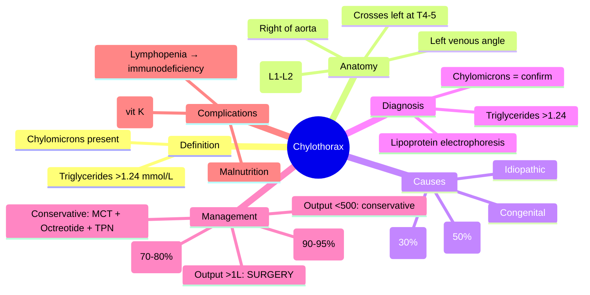
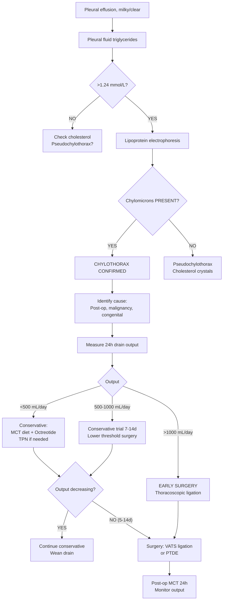

# Chylothorax

Related: [[Pleural fluid disorders]], [[Malignant pleural effusion]], [[Lymphoma]], [[Thoracic duct injury]], [[Superior vena cava obstruction]], [[Trauma]]

> [!important]
> **Chylothorax** = pleural effusion rich in **chylomicrons** (triglycerides >1.24 mmol/L) due to **thoracic duct leakage**. **Trauma/surgery** (#1 cause) and **malignancy** (lymphoma #1 malignant) are main aetiologies. Key FCPS/MRCP: **triglycerides >1.24 mmol/L + lipoprotein = diagnostic**, **conservative (MCT diet, octreotide) vs surgical (thoracic duct ligation/embolisation)**, **high-output >1L/day → early surgery**, **nutritional/immunological complications**.

## Learning Objectives
- Define chylothorax and understand thoracic duct anatomy
- Diagnose using **pleural fluid triglycerides >1.24 mmol/L** and **lipoprotein electrophoresis**
- Apply **aetiological classification** (traumatic vs malignant vs congenital vs idiopathic)
- Manage with **MCT diet, octreotide, TPN** (conservative) vs **thoracic duct ligation/embolisation** (surgical)
- Recognise **high-output (>1L/day) = early surgical referral**
- Manage complications: malnutrition, immunodeficiency, electrolyte loss

## Definition
**Chylothorax** = accumulation of **chyle** (lymph + chylomicrons) in the pleural space due to **disruption or obstruction of the thoracic duct** or its tributaries.

**Diagnostic criteria**: Pleural fluid **triglycerides >1.24 mmol/L (110 mg/dL)** **AND** **presence of chylomicrons on lipoprotein electrophoresis**.

> **FCPS/MRCP tip**: **Pseudochylothorax** (cholesterol effusion) = high cholesterol, NO chylomicrons, cholesterol crystals, chronic effusions (TB, RA). **Chylothorax** = high triglycerides, chylomicrons present.

## Core Anatomy
### 1. Thoracic duct
- **Largest lymphatic channel** in body
- **Origin**: Cisterna chyli (L1–L2, retroaortic, between azygos and aorta)
- **Course**: Ascends through **aortic hiatus** → **right of aorta** → crosses to **left at T4–T5** → ascends in **left posterior mediastinum** → terminates at **left venous angle** (junction left subclavian + left internal jugular)
- **Tributaries**: Left side of head/neck, left arm, left hemithorax, **entire lower body** (below diaphragm)
- **Right lymphatic duct**: Drains right upper body → right venous angle

### 2. Chyle composition
- **Lymph** + **chylomicrons** (dietary triglycerides absorbed in gut)
- **Triglycerides** (main lipid)
- **Lymphocytes** (predominantly T-cells)
- **Electrolytes** (similar to plasma)
- **Immunoglobulins** (IgG, IgA)
- **Fat-soluble vitamins** (A, D, E, K)

### 3. Daily flow
- **1.5–2.5 L/day** in adults (increases with fat intake)
- **High-output chylothorax** = >1 L/day → **malnutrition, immunodeficiency, rapid deterioration**

## Core Physiology
### Pathophysiology of chyle leak
1. **Thoracic duct injury/obstruction** → chyle leaks into pleural space (usually right side for low injuries, left for high)
2. **Negative intrapleural pressure** → sucks chyle from duct
3. **Continuous loss** → **protein, lymphocyte, fat, electrolyte, vitamin depletion**
4. **Immune compromise** → lymphopenia, infection risk
5. **Malnutrition** → negative nitrogen balance, fat-soluble vitamin deficiency
6. **Respiratory compromise** → large effusion → compression atelectasis

### Side of effusion
- **Right-sided** (~60%): duct injury **below T5** (most traumatic/surgical)
- **Left-sided** (~40%): duct injury **above T5** or **mediastinal obstruction** (malignancy)
- **Bilateral**: extensive malignancy, superior vena cava obstruction

## Normal Values / Important Cut-offs
### Pleural Fluid Diagnostic Criteria
| Parameter | Chylothorax | Pseudochylothorax |
|-----------|-------------|-------------------|
| **Triglycerides** | **>1.24 mmol/L (110 mg/dL)** | Low/normal |
| **Chylomicrons** | **PRESENT** | **ABSENT** |
| **Cholesterol** | Normal/mildly ↑ | **>5.18 mmol/L (200 mg/dL)** |
| **Cholesterol crystals** | Absent | **Present** |
| **Lipoprotein electrophoresis** | Chylomicrons + VLDL | LDL/HDL, no chylomicrons |
| **Cause** | Thoracic duct leak | Chronic effusion (TB, RA, malignancy) |

### Output Classification
| Output | Classification | Management Implication |
|--------|----------------|------------------------|
| **<500 mL/day** | Low-output | Conservative trial (1–2 weeks) |
| **500–1000 mL/day** | Moderate | Conservative, lower threshold for surgery |
| **>1000 mL/day** | **High-output** | **Early surgical referral** (ligation/embolisation) |

## Classification
### By aetiology
| Category | Causes | % |
|----------|--------|---|
| **Traumatic / Iatrogenic** | Cardiothoracic surgery (oesophagectomy, CABG, lung resection), central line placement, thoracic trauma, neck surgery | **~50%** |
| **Malignancy** | **Lymphoma** (most common malignant), lung cancer, metastatic nodes, Kaposi sarcoma | **~30%** |
| **Congenital / Developmental** | Lymphangiectasia, lymphangiomatosis, Turner, Noonan, Down syndrome | ~5% |
| **Infectious** | TB (mediastinal nodes), filariasis (Wuchereria) | Rare |
| **Idiopathic** | No identifiable cause | ~10% |
| **Other** | Superior vena cava obstruction, cirrhosis, sarcoidosis, amyloidosis, venous thrombosis | Rare |

### By onset
- **Acute** (post-operative, traumatic) — usually high-output
- **Subacute/chronic** (malignancy, idiopathic) — often lower output initially

## Etiology / Causes
### 1. Traumatic / Iatrogenic (most common)
- **Oesophagectomy** (highest risk, ~2-5%)
- **CABG** (internal mammary harvest)
- **Lung resection** (lobectomy, pneumonectomy)
- **Central venous catheterisation** (subclavian, IJ — guidewire/dilator trauma)
- **Neck surgery** (thyroid, parathyroid, cervical spine)
- **Thoracic trauma** (penetrating, blunt)

### 2. Malignancy
- **Lymphoma** (HL, NHL) — mediastinal nodal obstruction
- **Lung cancer** (mediastinal invasion)
- **Metastatic nodes** (breast, gastric, oesophageal)
- **Kaposi sarcoma** (HIV)

### 3. Congenital
- **Generalised lymphatic anomaly** (GLA)
- **Gorham-Stout** (vanishing bone)
- **Turner/Noonan/Down** — lymphatic dysplasia

### 4. Other
- **Filariasis** (W. bancrofti) — tropical, lymphatic obstruction
- **TB** — mediastinal nodes erode duct
- **SVC obstruction** — venous hypertension → duct rupture
- **Cirrhosis** — increased lymph production

## Risk Factors
- **Cardiothoracic surgery** (especially oesophagectomy, CABG)
- **Central line insertion** (subclavian > IJ)
- **Known lymphoma/mediastinal malignancy**
- **Congenital lymphatic disorders**
- **TB endemic areas** (filariasis)

## Pathophysiology
1. **Thoracic duct disruption** → chyle enters pleural space
2. **Negative intrathoracic pressure** (inspiration) → continuous suction of chyle
3. **Loss of**: lymphocytes (T-cells), immunoglobulins, triglycerides, electrolytes, fat-soluble vitamins
4. **Consequences**:
   - **Immunodeficiency** → infections (pneumonia, sepsis)
   - **Malnutrition** → negative nitrogen balance, weight loss
   - **Electrolyte imbalance** (hyponatraemia, hypocalcaemia)
   - **Coagulopathy** (vitamin K loss)
   - **Respiratory failure** (large effusion)

## Clinical Features
### History
- **Post-operative** (day 3–7 typical for surgical chylothorax)
- **Progressive dyspnoea** (effusion accumulation)
- **Chest discomfort** (pleuritic if inflammatory)
- **Weight loss, fatigue** (malnutrition)
- **Recurrent infections** (immunodeficiency)
- **Known malignancy** (lymphoma, lung cancer)

### Examination
- **Effusion signs**: dull percussion, reduced breath sounds, reduced fremitus/expansion
- **Large effusion**: mediastinal shift, tracheal deviation
- **Malnutrition signs**: muscle wasting, temporal wasting, oedema (hypoalbuminaemia)
- **Immunodeficiency**: recurrent infections, poor wound healing
- **Lymphadenopathy** (if malignancy)
- **SVC obstruction signs** (if mediastinal mass)

## Investigations
### 1. Imaging
**CXR**
- Pleural effusion (often large, right-sided post-op)
- Mediastinal shift if large
- May show surgical clips, sternal wires

**CT Thorax with contrast**
- **Thoracic duct anatomy** (if visible)
- **Mediastinal lymphadenopathy** (malignancy)
- **Site of leak** (extravasation of contrast if lymphangiography)
- **SVC obstruction**
- **Underlying lung pathology**

**MR Lymphangiography / Dynamic Contrast MR Lymphangiography**
- **Gold standard for leak localisation**
- Shows thoracic duct course and exact leak site

**Conventional Lymphangiography (pedal/inguinal)**
- **Oil-based contrast** (lipiodol) → visualises duct, leak site
- **Therapeutic** (lipiodol may sclerose leak)
- **Invasive**, largely replaced by MR

### 2. Pleural Fluid Analysis (DIAGNOSTIC KEY)
**Send in chilled container (prevents lipolysis)**

| Test | Chylothorax | Pseudochylothorax |
|------|-------------|-------------------|
| **Appearance** | **Milky/opalescent** (may be clear if fasting) | Milky/turbid |
| **Triglycerides** | **>1.24 mmol/L (110 mg/dL)** | <1.24 mmol/L |
| **Chylomicrons (lipoprotein electrophoresis)** | **PRESENT** | **ABSENT** |
| **Cholesterol** | Normal/mild ↑ | **>5.18 mmol/L (200 mg/dL)** |
| **Cholesterol crystals** | Absent | **Present** |
| **Cell count** | **Lymphocyte predominant** (>80%) | Variable |
| **pH** | >7.2 | Often low |
| **Glucose** | Normal | Low |
| **LDH** | Low/normal | High |

> **FCPS/MRCP tip**: **Fasting sample may appear clear** — triglycerides still >1.24 mmol/L. **Lipoprotein electrophoresis for chylomicrons is confirmatory**.

### 3. Blood Tests
- **FBC**: **lymphopenia** (loss in chyle)
- **Immunoglobulins**: **low IgG, IgA**
- **Albumin**: low (malnutrition, protein loss)
- **Electrolytes**: hyponatraemia, hypocalcaemia, hypokalaemia
- **Coagulation**: **prolonged PT/INR** (vitamin K loss)
- **Fat-soluble vitamins**: A, D, E, K deficiency
- **Total lymphocyte count** (immune monitoring)

## Interpretation Frameworks
### 1. Diagnostic Algorithm
```
Pleural effusion, milky appearance (or clear if fasting)
    ↓
Pleural fluid triglycerides
    ↓
>1.24 mmol/L?
    YES → Lipoprotein electrophoresis for chylomicrons
        Chylomicrons PRESENT → **CHYLOTHORAX CONFIRMED**
        Chylomicrons ABSENT → Consider pseudochylothorax (check cholesterol)
    NO → Not chylothorax (consider pseudochylothorax if cholesterol >5.18)
```

### 2. Aetiology Workup
| Suspected | Investigations |
|-----------|----------------|
| **Post-surgical** | Clinical context, CT if uncertain |
| **Malignancy** | **CT chest/abdomen**, **PET-CT**, **EBUS/EUS** for nodes, **pleural fluid cytology/flow cytometry** (lymphoma) |
| **Congenital** | Genetic testing, family history, MR lymphangiography |
| **Filariasis** | Blood film (microfilariae nocturnal), filarial antigen, eosinophilia |
| **TB** | Pleural fluid ADA, AFB, PCR, CT nodes |
| **Idiopathic** | Exclusion of above |

### 3. Output Monitoring
- **Measure 24-hour drain output** daily
- **<500 mL/day** → conservative likely to succeed
- **>1000 mL/day** → **high-output = early surgery**

## Diagnosis
**Confirmed by**: Pleural fluid **triglycerides >1.24 mmol/L** + **chylomicrons on lipoprotein electrophoresis**.

**Clinical context** determines aetiology (post-op, malignancy, congenital, etc.).

## Differential Diagnosis
| Differential | Key Differentiators |
|--------------|---------------------|
| **Pseudochylothorax** | Cholesterol >5.18 mmol/L, **cholesterol crystals**, **NO chylomicrons**, chronic effusion (TB, RA) |
| **Empyema** | Frank pus, pH<7.0, Gram+, triglycerides low |
| **Malignant effusion** | Cytology +ve, triglycerides low (unless chylothorax coexisting) |
| **TB effusion** | Lymphocytic, low glucose, high ADA, triglycerides low |
| **Rheumatological** | Low glucose, low pH, RF/ANA+, triglycerides low |

## Management
### 1. Conservative Management (First-line for low/moderate output)
**Indication**: Output **<500–1000 mL/day**, stable patient, post-op <7–10 days

| Intervention | Details |
|--------------|---------|
| **MCT diet** | **Medium-chain triglycerides** (C8–C10) absorbed directly into portal vein → **bypass thoracic duct**. Commercial formulas (MCT oil, Nutren, Peptamen). **Strict** — no LCT (long-chain) fats. |
| **Octreotide** | **Somatostatin analogue** → ↓ splanchnic blood flow → ↓ chyle production. **100–200 µg SC/IV TDS** or **50–100 µg/h IV infusion**. Evidence: case series, ↓ output in 3–5 days. |
| **TPN (Total Parenteral Nutrition)** | **Bowel rest** → minimal chyle production. **Indicated if**: high-output, failed MCT/octreotide, malnutrition. **Risks**: line sepsis, liver dysfunction, cost. |
| **Fat-soluble vitamin replacement** | Vitamins A, D, E, K (especially K for coagulopathy) |
| **Immunoglobulin replacement** | IVIG if severe hypogammaglobulinaemia + recurrent infections |
| **Drain management** | **Underwater seal**, measure 24h output, avoid suction (↑ leak) |

### 2. Surgical / Interventional Management
**Indications**:
- **High-output >1000 mL/day** (or >500 mL/day persistent >5–7 days)
- **Failed conservative** (output not decreasing after 7–14 days)
- **Malnutrition/immunodeficiency** worsening
- **Recurrent** after conservative success
- **Malignant chylothorax** with poor prognosis → palliative embolisation/IPC

#### A. Thoracic Duct Ligation (Thoracoscopic / Open)
- **Approach**: **Right VATS** (most leaks below T5 on right) or **Left VATS** (high leaks)
- **Technique**: Identify duct (cream infusion or lipiodol pre-op), **mass ligate** above diaphragm (T8–T10) + **pleurectomy** for pleurodesis
- **Success rate**: **90–95%** (thoracoscopic)
- **Complications**: Recurrence (5-10%), chylous ascites, pleural effusion

#### B. Percutaneous Thoracic Duct Embolisation (PTDE)
- **Interventional radiology**: pedal/inguinal lymphangiography → **coils/glue/balloon** at leak site
- **Less invasive**, good for high surgical risk patients
- **Success rate**: **70–80%** (lower than ligation)
- **Can repeat** if failed

#### C. Pleuroperitoneal Shunt / IPC
- **Palliative** for malignant chylothorax with trapped lung
- **Denver shunt** or **IPC** with regular drainage

### 3. Malignant Chylothorax Specific
- **Treat underlying malignancy** (chemo for lymphoma → often resolves chylothorax)
- **Conservative** (MCT, octreotide) while awaiting chemo effect
- **IPC** for palliation if chemo not possible / trapped lung
- **PTDE** if persistent and unfit for surgery

### 4. Congenital / Paediatric
- **MCT diet** first-line
- **Octreotide** widely used
- **Surgery** (ligation) if persistent >2–4 weeks
- **Sclerotherapy** (picibanil/OK-432, doxycycline) for lymphangiomas

## Drug Interactions / Contraindications / Cautions
### Octreotide
- **Side effects**: abdominal pain, diarrhoea/constipation, hyperglycaemia, gallstones (prolonged), bradycardia
- **Contraindication**: allergy
- **Caution**: diabetes (monitor glucose), cardiac conduction disease

### TPN
- **Line sepsis** (strict aseptic)
- **Refeeding syndrome** (start low, monitor phosphate, magnesium, potassium)
- **Liver dysfunction** (monitor LFTs)
- **Cost** (outpatient TPN complex)

### MCT Diet
- **Palatability** poor (compliance issue)
- **Essential fatty acid deficiency** if prolonged (>3–4 weeks) → add LCT supplement or switch to TPN
- **Fat-soluble vitamin malabsorption** → supplement

## Procedures / Indications / Contraindications
### Chest Drain
**Indication**: Large symptomatic effusion
**Technique**: US-guided, 10–14F pigtail, underwater seal (no suction)
**Monitor**: 24h output, triglyceride level in drain fluid

### Thoracoscopic Duct Ligation
**Indication**: High-output >1L/day, failed conservative 7–14 days
**Contraindication**: Unfit for GA, uncontrolled coagulopathy

### PTDE
**Indication**: High surgical risk, recurrent post-ligation, malignant palliative
**Contraindication**: Uncorrectable coagulopathy, contrast allergy

## Procedure Mini-Sections
### Conservative Protocol (Post-op Chylothorax)
1. **NPO** → start **TPN** OR **MCT diet** (if GI functional)
2. **Octreotide** 100 µg SC TDS (or 50 µg/h IV infusion)
3. **Chest drain** on underwater seal, measure 24h output
4. **Daily**: output, triglycerides in drain fluid, lymphocytes, albumin, electrolytes, coagulation
5. **Fat-soluble vitamins** IV/PO daily
6. **Review at day 5–7**: if output <200 mL/day → continue; if >500 mL/day → consider surgery

### Thoracoscopic Duct Ligation
1. **Pre-op**: Cream/milk + lipiodol orally/NG 4h before → visualises duct
2. **Right VATS** (4 ports, 5th–8th ICS)
3. **Identify duct** (white, above azygos, behind oesophagus)
4. **Mass ligate** with clips/ties at **T8–T10** (above diaphragm)
5. **Pleurectomy** (apical + diaphragmatic) for pleurodesis
6. **Chest drain**, underwater seal
7. **Post-op**: MCT diet 24h, then advance; monitor output

## Complications
### Chylothorax-specific
- **Malnutrition** (protein, fat, calorie loss)
- **Immunodeficiency** (lymphopenia, hypogammaglobulinaemia) → sepsis
- **Electrolyte loss** (Na, K, Ca, Mg)
- **Coagulopathy** (vitamin K deficiency)
- **Fat-soluble vitamin deficiency** (A, D, E, K)
- **Respiratory failure** (large effusion)

### Procedure complications
- **Recurrence** (5-10% post-ligation)
- **Chylous ascites** (ligation too low → backflow)
- **Pneumothorax**, **haemothorax**
- **Phrenic nerve injury** (rare)
- **Horner's syndrome** (stellate ganglion injury, left side)

## Red Flags / Emergencies
- **Output >1L/day** → **urgent surgical referral**
- **Severe lymphopenia** (<500/µL) + sepsis → IVIG, antibiotics, consider surgery
- **Coagulopathy** (INR >2) unresponsive to vitamin K → surgery
- **Rapid clinical deterioration** (malnutrition, sepsis, respiratory failure)
- **SVC obstruction** with chylothorax → stent/radiotherapy + chyle management

## Special Situations
### Post-oesophagectomy Chylothorax
- **Highest surgical risk** (~2-5%)
- **Right-sided** usually (duct injured in lower mediastinum)
- **Early octreotide + MCT/TPN** protocol
- **Ligation** via right VATS if >500 mL/day at day 5–7

### Post-CABG (IMA harvest)
- **Left-sided** usually (left IMA skeletonization)
- **Left VATS** or **median re-sternotomy**
- **Duct often high** (T4–T5 crossing)

### Paediatric Chylothorax
- **Post-cardiac surgery** (Fontan, Glenn, repair)
- **Congenital** (lymphatic anomalies)
- **MCT formula** (Portagen, Pregestimil) first-line
- **Octreotide** 1–3 µg/kg/dose TDS
- **Surgery** if >10 mL/kg/day persistent >2 weeks

### Filariasis (Tropical)
- **W. bancrofti** → lymphatic obstruction
- **DEC (diethylcarbamazine)** + albendazole
- **Chylothorax** may resolve with antifilarial
- **Surgery** if persistent

## Prognosis
- **Post-traumatic/surgical**: Excellent with ligation (>95% cure)
- **Malignant**: Depends on underlying cancer (lymphoma → good with chemo; solid tumours → poor)
- **Congenital**: Variable, often chronic/recurrent
- **Idiopathic**: Good with conservative or ligation
- **Mortality**: Mainly from **sepsis, malnutrition, respiratory failure** if untreated

## Topic Correlation
- [[Pleural fluid disorders]] — triglyceride/cholesterol framework
- [[Malignant pleural effusion]] — lymphoma chylothorax
- [[Thoracic duct injury]] — surgical anatomy
- [[Superior vena cava obstruction]] — mediastinal obstruction
- [[Pleural aspiration and chest drain basics]] — procedures

## FCPS/MRCP High-Yield Points
1. **Chylothorax** = triglycerides >1.24 mmol/L + **chylomicrons present**
2. **Pseudochylothorax** = cholesterol >5.18 mmol/L + **cholesterol crystals**, NO chylomicrons
3. **Trauma/surgery** (#1 cause), **lymphoma** (#1 malignant cause)
4. **Thoracic duct**: cisterna chyli → right of aorta → crosses to left at T4–T5 → left venous angle
5. **Right-sided** usually (low duct injury); **Left-sided** (high injury or mediastinal obstruction)
6. **Conservative**: **MCT diet** (bypasses duct) + **octreotide** + **TPN** if high-output
7. **High-output >1L/day** = **early surgical referral** (ligation > PTDE)
8. **Thoracoscopic ligation** 90-95% success (mass ligate at T8–T10)
9. **Complications**: lymphopenia → immunodeficiency, malnutrition, coagulopathy (vit K)
10. **Malignant**: treat underlying (lymphoma chemo), IPC for palliation

## Common Viva Questions
1. Diagnostic criteria for chylothorax vs pseudochylothorax
2. Thoracic duct anatomy and side of effusion
3. Conservative management (MCT, octreotide, TPN)
4. Surgical indications and techniques (ligation vs embolisation)
5. Complications of chylothorax (immunodeficiency, malnutrition)
6. Post-oesophagectomy / post-CABG specific management

## Common Confusions / Exam Traps
- **Confusing chylothorax with pseudochylothorax** — triglycerides vs cholesterol, chylomicrons vs crystals
- **Fasting sample looks clear** — still measure triglycerides (>1.24 = chylothorax)
- **Using suction on drain** — increases leak, use underwater seal only
- **Delaying surgery for high-output** — >1L/day = early ligation
- **MCT diet = normal diet** — MCT is specific medium-chain, not regular fat
- **Octreotide dose** — 100–200 µg TDS SC/IV, not mg
- **Ligation side** — right VATS for most (duct on right below T5)

## Mnemonics
- **CHYLO**: **C**hylomicrons present, **H**igh triglycerides (>1.24), **Y** = lymphatics (thoracic duct), **L**ymphocyte predominant, **O**ctreotide/MCT conservative
- **PSEUDO**: **P**seudochylothorax = **S**tars (cholesterol crystals), **E**levated cholesterol (>5.18), **U**nlike chylo (NO chylomicrons), **D**isease chronic (TB, RA), **O**therwise similar
- **THORACIC DUCT**: **T**12/L1 cisterna chyli, **H**eads up **O**n **R**ight of aorta, **A**t **T4–T5** **C**rosses to **L**eft, **I**nto **L**eft venous angle
- **MANAGE CHYLO**: **M**CT diet, **A**lbumin/vitamins, **N**octreotide, **A**ssess output, **G**o surgery if >1L, **E**MBOLISATION/ligation

## Mind Map


## Flowchart


## Suggested Visuals / Image Notes
- Thoracic duct anatomy diagram
- Pleural fluid: chylous (milky) vs pseudochylous
- Lipoprotein electrophoresis: chylomicrons
- MCT diet products
- Octreotide mechanism
- VATS ligation technique
- PTDE coil/glue placement

## Suggested Video References
- BTS pleural disease: chylothorax
- Thoracic duct anatomy and ligation
- PTDE technique
- MCT diet in chylothorax
- Post-oesophagectomy chylothorax protocol

## One-Page Revision Summary
- **Chylothorax** = TG >1.24 mmol/L + chylomicrons
- **Pseudochylothorax** = cholesterol >5.18 + crystals, NO chylomicrons
- **Duct**: cisterna chyli → right aorta → cross T4-5 left → left venous angle
- **Causes**: trauma/surgery 50%, lymphoma 30%, congenital, idiopathic
- **Right-sided** (low injury), **Left-sided** (high/mediastinal)
- **Conservative**: MCT diet + octreotide 100µg TDS + TPN
- **Output**: <500 conservative, >1L = surgery
- **Surgery**: VATS ligation (90-95%) at T8-10, PTDE (70-80%)
- **Complications**: lymphopenia, malnutrition, coagulopathy, vit deficiency

## 24-Hour Recall Prompts
- Diagnostic criteria (TG + chylomicrons)
- Pseudochylothorax differentiators
- Thoracic duct anatomy (course, termination)
- Conservative management triad
- Surgical threshold (>1L/day)
- Complications

## 7-Day / 15-Day / 30-Day Revision Tracker
- [ ] Day 1 completed
- [ ] 24-hour recall completed
- [ ] Day 7 revision completed
- [ ] Day 15 revision completed
- [ ] Day 30 revision completed

## Must Know / Should Know / Nice to Know
### Must Know
- Diagnostic criteria (TG >1.24 + chylomicrons)
- vs Pseudochylothorax (cholesterol, crystals)
- Thoracic duct anatomy
- Conservative: MCT, octreotide, TPN
- Surgical threshold >1L/day
- VATS ligation technique and success

### Should Know
- Side of effusion correlates with injury level
- Octreotide dosing and side effects
- PTDE vs ligation indications
- Malignant chylothorax management
- Paediatric/congenital nuances
- Filariasis association

### Nice to Know
- MR lymphangiography technique
- Essential fatty acid deficiency on prolonged MCT
- Sclerotherapy for lymphangiomas (OK-432)
- Cost-effectiveness TPN vs surgery
- Long-term outcomes post-ligation

## Self-Test Scorecard
- Understanding: /10
- Recall: /10
- MCQ Performance: /10
- SBA Performance: /10
- Viva Confidence: /10
- Total: /50

> [!tip]
> Interpretation: <35 = weak topic, 35-44 = acceptable but insecure, 45+ = strong exam-ready topic.

## Exam Answer Modes
### Long Answer Skeleton
- Definition, diagnostic criteria (TG, chylomicrons)
- vs Pseudochylothorax (table)
- Thoracic duct anatomy with diagram description
- Aetiology classification (trauma, malignancy, congenital)
- Diagnostic algorithm
- Management: conservative (MCT, octreotide, TPN) vs surgical (ligation, PTDE)
- Output-based algorithm
- Complications (immunodeficiency, malnutrition, coagulopathy)
- Special situations (post-op, malignant, paediatric, filariasis)

### Short Note Skeleton
- Diagnostic criteria box
- vs Pseudochylothorax table
- Thoracic duct anatomy bullet points
- Management algorithm flowchart
- Complications box

### Viva One-Liners
- "Chylothorax = TG >1.24 mmol/L + CHYLOMICRONS PRESENT"
- "Pseudochylothorax = cholesterol >5.18 + CRYSTALS, NO chylomicrons"
- "Thoracic duct: cisterna chyli L1-2 → right of aorta → crosses LEFT at T4-5 → left venous angle"
- "Right-sided = low injury (below T5); Left-sided = high injury or mediastinal obstruction"
- "Conservative: MCT diet (bypasses duct) + octreotide 100µg TDS + TPN if high-output"
- "High-output >1L/day = EARLY VATS ligation (mass ligate T8-10, 90-95% success)"
- "Complications: lymphopenia → immunodeficiency, malnutrition, coagulopathy (vit K)"
- "Post-oesophagectomy: right VATS ligation if >500mL day 5-7"
- "Malignant: treat underlying (lymphoma chemo), IPC palliative"

### Ward-Case Discussion Points
- Day 5 post-oesophagectomy, R drain output 1.2L/day, milky fluid → TG 3.5, chylomicrons +ve → high-output chylothorax → octreotide + MCT + TPN → if >1L day 7 → right VATS ligation
- 40M lymphoma, L effusion, TG 2.0, chylomicrons +ve, nodes mediastinal → malignant chylothorax → start chemo (R-CHOP) + conservative MCT/octreotide → usually resolves with chemo
- 2yo post-Fontan, chylothorax 800mL/day → MCT formula + octreotide → persistent 3 weeks → thoracic duct ligation

### Last-Night-Before-Exam Sheet
- Chylothorax: TG>1.24 + chylomicrons
- Pseudochylo: Chol>5.18 + crystals, NO chylomicrons
- Duct: Cisterna chyli → R aorta → cross T4-5 L → L venous angle
- R-sided = low injury; L-sided = high/mediastinal
- Conservative: MCT + octreotide 100µg TDS + TPN
- >1L/day = VATS ligation (T8-10, 95%)
- Complications: lymphopenia, malnutrition, coagulopathy

## Summary
**Chylothorax** = pleural effusion with **triglycerides >1.24 mmol/L** and **chylomicrons on lipoprotein electrophoresis** due to **thoracic duct disruption**. **Thoracic duct**: cisterna chyli (L1–L2) → ascends right of aorta → crosses to left at T4–T5 → terminates at left venous angle. **Aetiology**: trauma/surgery ~50% (post-oesophagectomy, CABG), lymphoma ~30%, congenital, idiopathic. **Right-sided** = low injury; **Left-sided** = high injury/mediastinal obstruction. **Diagnosis**: TG >1.24 + chylomicrons (confirmatory). **Pseudochylothorax**: cholesterol >5.18, crystals, NO chylomicrons. **Management**: Conservative = **MCT diet** (bypasses duct) + **octreotide 100 µg TDS** + **TPN** if high-output/malnourished. **Output-based**: <500 mL/day conservative; >1000 mL/day = **early VATS ligation** (mass ligate at T8–T10, 90–95% success) or **PTDE** (70–80%). **Complications**: lymphopenia → immunodeficiency, malnutrition, coagulopathy (vit K), fat-soluble vitamin deficiency.

## MCQs (10)
1. **Diagnostic threshold** for pleural fluid triglycerides in chylothorax:
   A. >0.5 mmol/L
   B. >0.8 mmol/L
   C. **>1.24 mmol/L (110 mg/dL)**
   D. >2.0 mmol/L

2. **Confirmatory test** for chylothorax:
   A. Cholesterol crystals
   B. **Chylomicrons on lipoprotein electrophoresis**
   C. High LDH
   D. Low glucose

3. **Pseudochylothorax** is characterised by:
   A. Triglycerides >1.24, chylomicrons present
   B. **Cholesterol >5.18 mmol/L, cholesterol crystals present, NO chylomicrons**
   C. Low pH, low glucose
   D. Lymphocyte predominance

4. **Thoracic duct** crosses from right to left at:
   A. T1–T2
   B. **T4–T5**
   C. T8–T9
   D. T11–T12

5. **Most common cause** of chylothorax:
   A. Lymphoma
   B. **Trauma / cardiothoracic surgery**
   C. Congenital
   D. Idiopathic

6. **MCT diet** works by:
   A. Reducing total fat intake
   B. **Medium-chain triglycerides absorbed directly into portal vein (bypass thoracic duct)**
   C. Stimulating lymphatic drainage
   D. Inhibiting chylomicron synthesis

7. **High-output chylothorax** requiring early surgery:
   A. >500 mL/day
   B. **>1000 mL/day**
   C. >1500 mL/day
   D. >2000 mL/day

8. **Thoracoscopic duct ligation** success rate:
   A. 50-60%
   B. 70-80%
   C. **90-95%**
   D. >99%

9. **Octreotide** dose for chylothorax:
   A. 10–20 µg TDS
   B. **100–200 µg TDS (SC/IV)**
   C. 1–2 mg TDS
   D. 50 µg/day continuous only

10. **Complication** of chylothorax due to lymphocyte loss:
    A. Anaemia
    B. **Immunodeficiency / recurrent infections**
    C. Thrombocytopenia
    D. Hypercoagulability

## SBA Questions (10)
1. A 65M day 5 post-oesophagectomy. R chest drain output 1.3L/day, milky fluid. Pleural fluid TG 2.8 mmol/L, chylomicrons present. Best next step?
   A. Continue observation
   B. **MCT diet + octreotide 100µg TDS + TPN, prepare for VATS ligation if output >1L at day 7**
   C. Immediate VATS ligation today
   D. Chest drain suction -20 cmH2O

2. A 40M with DLBCL, mediastinal nodes, L pleural effusion. Fluid TG 1.8 mmol/L, chylomicrons present. Management?
   A. VATS ligation
   B. **Start R-CHOP chemotherapy + conservative MCT/octreotide**
   C. PTDE
   D. IPC insertion

3. Pleural fluid: milky, TG 0.8 mmol/L, cholesterol 6.2 mmol/L, cholesterol crystals present, lipoprotein electrophoresis: NO chylomicrons. Diagnosis?
   A. Chylothorax
   B. **Pseudochylothorax**
   C. Empyema
   D. Malignant effusion

4. Post-CABG (left IMA harvest), day 3, L effusion 800mL/day, TG 2.0 mmol/L, chylomicrons +ve. Side of effusion explained by:
   A. Duct injured on right side
   B. **Left IMA harvest → duct injury high (T4-5 crossing) → left-sided**
   C. Mediastinal shift to right
   D. SVC obstruction

5. Conservative management failing after 10 days (output 600mL/day persistent). Next step?
   A. Increase octreotide to 500µg TDS
   B. **VATS thoracic duct ligation**
   C. PTDE
   D. Pleuroperitoneal shunt

6. Chylothorax complication — which is MOST characteristic?
   A. Hyperkalaemia
   B. **Lymphopenia with recurrent infections**
   C. Hypercalcaemia
   D. Polycythemia

7. Paediatric post-Fontan chylothorax, 2yo, 800mL/day (10 mL/kg/day). Failed MCT/octreotide 3 weeks. Best next step?
   A. Continue conservative
   B. **Thoracic duct ligation (thoracoscopic)**
   C. PTDE
   D. Denver shunt

8. Thoracic duct ligation — optimal ligation site:
   A. At cisterna chyli
   B. **Above diaphragm (T8–T10)**
   C. At venous angle
   D. Below azygos only

9. PTDE vs VATS ligation — which statement is TRUE?
   A. PTDE has higher success rate
   B. **VATS ligation 90-95%, PTDE 70-80%**
   C. PTDE is first-line for all
   D. VATS ligation contraindicated in malignant

10. Fat-soluble vitamin most critical to replace in chylothorax for coagulopathy:
    A. Vitamin A
    B. Vitamin D
    C. Vitamin E
    D. **Vitamin K**

## Flashcards
- Q: Chylothorax diagnostic TG
  A: >1.24 mmol/L (110 mg/dL)
- Q: Confirmatory test
  A: Lipoprotein electrophoresis → chylomicrons
- Q: Pseudochylothorax
  A: Chol>5.18, crystals, NO chylomicrons
- Q: Duct crossing
  A: T4-T5 right to left
- Q: R-sided effusion
  A: Low injury (below T5)
- Q: Conservative triad
  A: MCT + octreotide + TPN
- Q: Surgery threshold
  A: >1L/day
- Q: Ligation site
  A: T8-T10 above diaphragm
- Q: Complications
  A: Lymphopenia, malnutrition, coagulopathy (vit K)
- Q: Octreotide dose
  A: 100-200 µg TDS SC/IV

## Answer Key with Explanations
### MCQs
1. **C** — >1.24 mmol/L (110 mg/dL) is diagnostic threshold.
2. **B** — Chylomicrons on lipoprotein electrophoresis confirm chylothorax.
3. **B** — Pseudochylothorax: high cholesterol, crystals, NO chylomicrons.
4. **B** — Thoracic duct crosses midline at T4–T5.
5. **B** — Trauma/surgery ~50% (most common).
6. **B** — MCTs absorbed directly into portal circulation, bypass thoracic duct.
7. **B** — High-output >1000 mL/day = early surgical referral.
8. **C** — Thoracoscopic mass ligation 90-95% success.
9. **B** — Octreotide 100–200 µg TDS SC/IV (or 50–100 µg/h infusion).
10. **B** — Lymphocyte loss → lymphopenia → immunodeficiency.

### SBAs
1. **B** — High-output post-oesophagectomy → conservative trial (MCT/octreotide/TPN) with low threshold for VATS ligation by day 7 if persistent >1L.
2. **B** — Lymphoma chylothorax → treat underlying cancer (chemo) + conservative support; usually resolves with chemo.
3. **B** — TG normal, cholesterol high, crystals present, NO chylomicrons = pseudochylothorax.
4. **B** — Left IMA harvest injures duct at high level (T4–T5 crossing) → left-sided effusion.
5. **B** — Persistent output >500 mL after 10 days conservative → VATS ligation.
6. **B** — Lymphocyte loss in chyle → lymphopenia → immunodeficiency, infections.
7. **B** — Paediatric, >10 mL/kg/day persistent >2–3 weeks → surgical ligation.
8. **B** — Mass ligate above diaphragm (T8–T10) to avoid chylous ascites.
9. **B** — VATS ligation 90-95% success; PTDE 70-80% (lower, but less invasive).
10. **D** — Vitamin K deficiency → coagulopathy (PT/INR prolongation).

### Flashcards
All correct as written.

---
