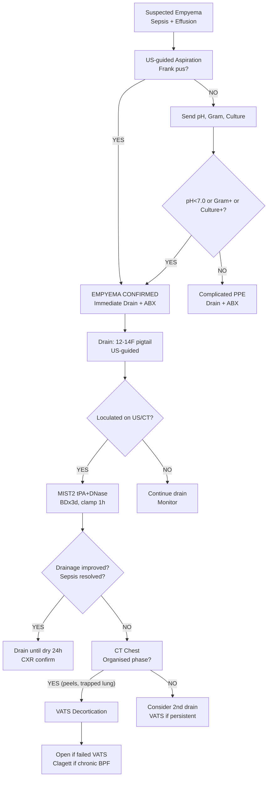

# Empyema and Pleural Infection

Related: [[Pleural fluid disorders]], [[Parapneumonic effusion]], [[Pleural aspiration and chest drain basics]], [[Pleural infection and procedures]], [[Pneumonia]], [[Bronchopleural fistula]], [[Trapped lung]], [[VATS decortication]]

> [!important]
> **Empyema** = **pus in the pleural space** OR **positive Gram stain/culture** in parapneumonic effusion. **Most advanced stage** of parapneumonic spectrum. **Key FCPS/MRCP**: frank pus = immediate drain; loculated = MIST2 tPA/DNase; organised (>3wk) = VATS decortication; mortality 15-20%; differentiate from lung abscess (air-fluid level within lung parenchyma).

## Learning Objectives
- Define empyema and distinguish from complicated parapneumonic effusion
- Recognise **frank pus** = immediate drainage indication
- Apply **MIST2 protocol** (tPA+DNase) for loculated empyema
- Identify **organised phase** (pleural peels, trapped lung) → surgical referral
- Manage **bronchopleural fistula** (air leak + pus)
- Apply **RAPID trial** evidence for early VATS vs chest drain
- Select antibiotics for community vs hospital-acquired empyema
- Recognise **empyema necessitatis** (chest wall extension)

## Definition
**Empyema** = **purulent pleural infection** defined by **ANY** of:
1. **Frank pus** aspirated from pleural space
2. **Positive Gram stain** of pleural fluid
3. **Positive culture** of pleural fluid (aerobic/anaerobic)

> **FCPS/MRCP tip**: Empyema is the **most severe stage** of parapneumonic effusion spectrum. **All empyemas require drainage** (unlike uncomplicated PPE).

## Core Anatomy
### 1. Pleural space in empyema
- **Fibrinopurulent exudate** fills pleural space
- **Septae/loculations** (fibrin strands) divide space into pockets
- **Visceral pleural peel**: fibrin + fibroblasts on lung surface
- **Parietal pleural peel**: on chest wall/diaphragm/mediastinum
- **Trapped lung**: visceral peel prevents lung re-expansion after drainage

### 2. Anatomical stages (correlate with management)
| Stage | Days | Pathology | Imaging | Management |
|-------|------|-----------|---------|------------|
| **Exudative** | 1–7 | Free fluid, low cellularity, pH >7.2 | Free-flowing US/CT | Antibiotics ± drain |
| **Fibrinopurulent** | 7–21 | **Loculated**, high neutrophils, pH <7.2, glucose ↓ | Septae on US, loculations on CT | **Drain + tPA/DNase (MIST2)** |
| **Organised** | >21 | **Pleural peels**, trapped lung | Thick enhancing peels on CT, lung trapped | **VATS decortication / Open thoracotomy** |

### 3. Spread patterns
- **Direct extension** from pneumonia (most common)
- **Haematogenous** (rare, e.g., Staph bacteraemia)
- **Direct inoculation** (trauma, surgery, oesophageal rupture)
- **Transdiaphragmatic** (subphrenic abscess, liver abscess)

## Core Physiology
### Pathophysiology of loculation
1. **Bacteria + neutrophils** → inflammatory mediators → **fibrin deposition**
2. **Fibrin strands** → **septae** → **loculated pockets**
3. **Septae** prevent free drainage → **incomplete evacuation** with single drain
4. **Anaerobic metabolism** in locules → **pH ↓, glucose ↓, lactate ↑**
5. **Fibroblast invasion** → **pleural peels** → **trapped lung**

### Gas exchange impact
- **Compression atelectasis** → shunt, hypoxaemia
- **Mediastinal shift** (if large) → contralateral lung compression
- **Trapped lung** (chronic) → persistent restriction, dyspnoea

## Normal Values / Important Cut-offs
### Empyema diagnostic criteria (ANY = empyema)
| Criterion | Threshold |
|-----------|-----------|
| **Frank pus** | Grossly purulent on aspiration |
| **Gram stain** | Positive (bacteria seen) |
| **Culture** | Positive (aerobic/anaerobic) |

### Pleural fluid in empyema (typical)
| Parameter | Typical Value |
|-----------|---------------|
| **pH** | **<7.0** (often 6.5–7.0) |
| **Glucose** | **<1.7 mmol/L** (often undetectable) |
| **LDH** | **>10,000 IU/L** (very high) |
| **WBC** | **>50,000/µL** (predominantly neutrophils) |
| **Protein** | High (exudate) |
| **Appearance** | **Frank pus / thick turbid** |

### Microbiology
| Category | Organisms |
|----------|-----------|
| **Community-acquired** | *S. pneumoniae* (most common), *S. aureus* (incl. PVL+), *S. milleri* group, anaerobes (aspiration), *H. influenzae* |
| **Hospital-acquired** | *S. aureus* (MRSA common), Gram-negatives (*Pseudomonas, Klebsiella, E. coli*), *Enterococcus*, anaerobes |
| **Post-surgical / trauma** | *S. aureus*, Gram-negatives, anaerobes |
| **Immunocompromised** | *Nocardia*, *Actinomyces*, fungi (*Candida, Aspergillus*), TB, *Pneumocystis* |

## Classification
### By aetiology
1. **Parapneumonic empyema** (most common) — complication of bacterial pneumonia
2. **Post-surgical / post-traumatic** — cardiothoracic surgery, trauma, oesophageal perforation
3. **Haematogenous** — Staph bacteraemia, endocarditis
4. **Transdiaphragmatic** — subphrenic/liver abscess
5. **Specific organisms**: TB empyema, actinomycotic, nocardial, fungal

### By stage (anatomical)
1. **Exudative** (free-flowing) — rare for frank empyema
2. **Fibrinopurulent** (loculated) — **most common presentation**
3. **Organised** (peels, trapped lung) — chronic empyema

## Etiology / Causes
### Primary pneumonia pathogens
- **S. pneumoniae** — most common overall
- **S. aureus** — severe, cavitating, PVL+ → rapid empyema
- **Anaerobes** — aspiration, dental source, foul-smelling pus
- **S. milleri group** — abscess/empyema prone
- **Gram-negatives** — hospital-acquired, severe
- **H. influenzae** — COPD

### Risk factors for empyema (vs uncomplicated PPE)
- **Age extremes** (children, elderly)
- **Diabetes mellitus**
- **Alcohol misuse**
- **Immunosuppression** (steroids, chemo, HIV, biologics)
- **COPD / chronic lung disease**
- **Malignancy**
- **Delayed / inappropriate antibiotics**
- **Aspiration risk** (dysphagia, stroke, seizures)

## Pathophysiology (Detailed)
### Fibrinopurulent phase (7–21 days) — key for intervention
1. **Bacterial inoculation** of pleural space
2. **Neutrophil influx** → release elastase, ROS, cytokines
3. **Fibrinogen → fibrin** strands
4. **Fibrin strands** → **septae** → **loculations**
5. **Loculations** = isolated pockets → **single drain ineffective**
6. **Anaerobic metabolism** in locules → **lactate ↑, pH ↓ (<7.0), glucose ↓ (<1.7)**
7. **Pus** = dead neutrophils + bacteria + fibrin + debris

### Organised phase (>21 days)
1. **Fibroblasts** invade fibrin matrix
2. **Visceral pleural peel** forms on lung → **trapped lung** (cannot re-expand)
3. **Parietal pleural peel** on chest wall → restricts expansion
4. **Chest wall fibrosis** → thoracic restriction
5. **Bronchopleural fistula** (BPF) may form (air leak + pus)

## Clinical Features
### Acute empyema (fibrinopurulent phase)
- **Fever** (often high, swinging, rigors)
- **Pleuritic chest pain**
- **Dyspnoea** (effusion size + pneumonia)
- **Cough** (purulent, foul if anaerobes)
- **Night sweats, weight loss** (subacute)
- **Sepsis features**: tachycardia, hypotension, confusion (elderly)

### Chronic empyema (organised phase)
- **Persistent low-grade fever**
- **Weight loss, anorexia**
- **Chronic dyspnoea** (trapped lung + chest wall restriction)
- **Clubbing** (if >4–6 weeks)
- **Chest wall signs**: swelling, sinus (empyema necessitatis)

### Examination
- **Effusion signs**: dull percussion, reduced breath sounds, reduced fremitus/expansion
- **Pneumonia signs** above fluid: bronchial breathing, crackles
- **Sepsis**: tachycardia, hypotension, tachypnoea, altered GCS
- **Empyema necessitatis**: chest wall erythema, swelling, fluctuant mass, draining sinus
- **BPF clue**: subcutaneous emphysema, Hamman's crunch, air leak on drain

## Investigations
### 1. Imaging
**CXR (PA erect + lateral decubitus)**
- Large effusion, often loculated (lenticular, fixed)
- **Air-fluid level** if BPF (horizontal in lung, not pleural)
- **Rib/pleural thickening** if chronic

**Ultrasound (POCUS) — ESSENTIAL**
- **Septae** (thin echogenic lines dividing fluid)
- **Debris** (echogenic swirling)
- **Thickened pleura** (>2mm, often >5mm)
- **"Split pleura sign"** (inner visceral + outer parietal, but US limited)
- **Guides drain placement** (target largest locule, avoid lung)
- **Assess drain position** post-insertion

**CT Thorax with IV contrast — GOLD STANDARD for staging**
- **Split pleura sign** (enhanced visceral + parietal pleura with fluid between) — hallmark
- **Loculations** (multiple fluid pockets)
- **Pleural thickening/enhancement** (>3mm)
- **Underlying pneumonia / abscess**
- **Bronchopleural fistula**: air in pleural space, bronchial disruption
- **Chest wall invasion** (empyema necessitatis)
- **Trapped lung**: lung collapsed away from chest wall despite drain
- **Pre-surgical planning** (VATS vs open)

### 2. Pleural Fluid Analysis (Confirmatory)
**Diagnostic aspiration under US guidance**

| Test | Empyema Typical |
|------|-----------------|
| **Appearance** | **Frank pus / thick turbid** |
| **pH** | **<7.0** (often 6.5–7.0) |
| **Glucose** | **<1.7 mmol/L** (often 0) |
| **LDH** | **>10,000 IU/L** |
| **WBC** | **>50,000** (neutrophils >90%) |
| **Gram stain** | **Positive** (sensitivity ~50-60%) |
| **Culture** | **Positive** (aerobic + anaerobic bottles) |
| **Cell diff** | Degenerate neutrophils, bacteria |

> **FCPS/MRCP tip**: **Frank pus = empyema = immediate drain**. Don't wait for pH if pus obvious.

### 3. Microbiology (Critical)
- **Blood cultures** ×2 (before antibiotics)
- **Pleural fluid**: aerobic + anaerobic culture (use blood culture bottles — ↑ yield 20-30%)
- **Gram stain** (rapid, guides early abx)
- **PCR** (if available): *S. pneumoniae, S. aureus, Legionella*
- **TB**: AFB stain, culture, PCR (if chronic/lymphocytic)
- **Fungal**: culture, galactomannan (if immunocompromised)
- **Nocardia/Actinomyces**: special media, prolonged incubation

### 4. Blood Tests
- **FBC**: neutrophilia, raised WCC (or leukopenia in severe sepsis)
- **CRP**: very high (often >300)
- **U&E, LFT, glucose, coagulation**
- **ABG**: hypoxaemia, respiratory alkalosis → metabolic acidosis if septic
- **HIV** (if risk factors/unknown)
- **Immunoglobulins** (if recurrent)

## Interpretation Frameworks
### 1. Empyema vs Complicated PPE
| Feature | Complicated PPE | Empyema |
|---------|-----------------|---------|
| **pH** | <7.2 | **<7.0** |
| **Glucose** | <3.3 mmol/L | **<1.7 mmol/L** |
| **LDH** | >1000 | **>10,000** |
| **Appearance** | Turbid | **Frank pus** |
| **Gram stain** | Negative | **Positive** |
| **Culture** | Sterile/Positive | **Positive** |
| **Management** | Drain + abx | **Drain + abx ± tPA/DNase ± VATS** |

### 2. CT Staging (Guides Management)
| CT Finding | Stage | Management |
|------------|-------|------------|
| Free fluid, thin pleura | Exudative | Drain ± abx |
| **Septae, loculations, thick enhancing pleura** | **Fibrinopurulent** | **Drain + tPA/DNase** |
| **Thick peels (>5mm), trapped lung, chest wall thickening** | **Organised** | **VATS decortication** |

### 3. RAPID Trial (Early VATS vs Chest Drain)
- **RCT**: Primary VATS vs chest drain (+ fibrinolytics if needed) for pleural infection
- **Result**: **Early VATS** → **shorter hospital stay, fewer surgical referrals, similar complications**
- **Implication**: **Lower threshold for VATS** in fibrinopurulent phase if expertise available
- **Caveat**: Not all centres have thoracic surgery on-site; drain + tPA/DNase remains standard first-line

## Diagnosis
**Clinical + Imaging + Pleural Fluid**:
1. Pneumonia/sepsis + pleural effusion
2. **US/CT**: loculated effusion, thickened pleura, split pleura sign
3. **Pleural fluid**: **frank pus** OR **positive Gram stain** OR **positive culture**
4. **pH <7.0, glucose <1.7, LDH >10,000** supportive

## Differential Diagnosis
| Differential | Clues Against Empyema |
|--------------|----------------------|
| **Complicated PPE** | No pus, Gram negative, culture sterile, pH 7.0–7.2 |
| **Lung abscess** | **Air-fluid level WITHIN lung parenchyma**, thick wall, coughs up purulent sputum, CXR: cavity with air-fluid level |
| **Malignant effusion** | Lymphocytic, glucose normal, pH >7.2, cytology +ve, chronic, no fever |
| **TB empyema** | Lymphocytic (early), very low glucose, very high LDH, ADA >40, chronic, AFB culture + |
| **Pancreatic pleural effusion** | Amylase very high, left-sided, history of pancreatitis |
| **Subphrenic abscess** | Supradiaphragmatic, may track across diaphragm, CT distinguishes |

## Management
### 1. Antibiotics (ALL empyema)
**Empirical (before culture):**
- **Community-acquired**: **Co-amoxiclav 1.2g TDS IV** OR **Ceftriaxone 2g OD IV + Metronidazole 500mg TDS IV** (covers anaerobes)
- **Hospital-acquired / risk factors**: **Piperacillin-tazobactam 4.5g QDS IV** OR **Meropenem 1g TDS IV**
- **MRSA risk** (previous MRSA, severe sepsis): **Add Vancomycin 15-20mg/kg IV TD 12h (trough 15-20)** OR **Linezolid 600mg BD IV/PO**
- **Anaerobe cover**: **Metronidazole** essential if not using co-amoxiclav/pip-taz/mero

**Duration**: **2–4 weeks IV** (total 4–6 weeks including oral step-down)
- **Step-down**: when afebrile 48h, CRP trending down, clinically stable → oral (co-amoxiclav or amoxicillin + metronidazole)
- **Adjust** per culture/sensitivity

### 2. Drainage (MANDATORY for all empyema)
**Chest drain insertion — US-guided, same sitting**

| Drain Type | Indication |
|------------|------------|
| **10–14F pigtail (Seldinger)** | Free-flowing empyema, MIST2 trial used 12-14F |
| **12–14F pigtail** | Loculated, planned tPA/DNase |
| **24–28F surgical (blunt dissection)** | Thick pus, large volume, need for manual Fibrinolysis, surgical backup |

**Technique**: Seldinger (preferred) or surgical
**Site**: US-guided, safe triangle (4th–5th ICS anterior to midaxillary)
**Connection**: Underwater seal (digital preferred)
**Suction**: -10 to -20 cmH2O if incomplete drainage
**Monitoring**: Drain volume, swing, bubbling, fluid character

### 3. Intrapleural Fibrinolytic Therapy (MIST2 Protocol)
**Indication**: **Loculated empyema** on US/CT with **incomplete drainage** after 24–48h of adequate drain
**Protocol**: **tPA 10mg + DNase 5mg** in 50mL saline, **twice daily ×3 days** via chest drain
- **Clamp drain 1 hour** after each dose
- **Flush 20mL saline** after unclamping
- **Total**: 6 doses over 3 days

**MIST2 Evidence**: tPA+DNase **significantly** ↑ fluid drainage, ↓ surgical referral (from 18% to 6%), ↓ hospital stay. **tPA alone or DNase alone = NO benefit**.

**Contraindications**:
- Active bleeding / recent bleeding
- Coagulopathy (INR >1.5, platelets <50)
- Recent surgery <7 days
- Stroke / neurosurgery <3 months
- Trauma <7 days
- Known hypersensitivity

### 4. Surgical Referral (VATS / Open)
**Indications for VATS**:
- **Failure of drain + tPA/DNase** (persistent sepsis, fever, incomplete drainage after 5–7 days)
- **Organised phase** (CT: thick pleural peels >5mm, trapped lung)
- **Bronchopleural fistula** (persistent air leak >5–7 days)
- **Empyema necessitatis** (chest wall extension)
- **Diagnostic uncertainty** (malignancy vs empyema)

**VATS Procedure**: **Decortication** (peel stripping) + **debridement** + **drain placement**
- **Visceral decortication** → re-expand trapped lung
- **Parietal decortication** → release chest wall restriction
- **Conversion to open** if dense adhesions, bleeding, inadequate exposure

**Open Thoracotomy (Decortication)**:
- Chronic empyema >4–6 weeks
- Failed VATS
- Extensive chest wall involvement
- **Clagett procedure** (open window thoracostomy) for chronic BPF with empyema

### 5. Bronchopleural Fistula (BPF) Management
**Definition**: Communication between bronchial tree and pleural space (air leak + pus)
**CT signs**: Air in pleural space, bronchial cut-off
**Management**:
1. **Drain** (large bore if high flow)
2. **Antibiotics** (cover anaerobes)
3. **NIV contraindicated** (positive pressure ↑ leak)
4. **Endobronchial valves** (selected cases, Zebrine/Spirant)
5. **Surgical**: VATS/pleural tenting, muscle flap closure
6. **Clagett procedure** (open window) for chronic BPF + empyema

## Drug Interactions / Contraindications / Cautions
### Antibiotics
- **Vancomycin**: nephrotoxicity (monitor trough, renal), Red Man syndrome (infuse ≥1h)
- **Pip-taz/Meropenem**: adjust renal dose
- **Metronidazole**: neurotoxicity (prolonged >14d), disulfiram with alcohol
- **Linezolid**: myelosuppression (monitor FBC weekly), serotonin syndrome (with SSRIs)

### tPA/DNase
- **Bleeding**: monitor Hb, drain output (frank blood = stop)
- **Allergic reactions** (rare)
- **Coagulopathy**: INR >1.5, platelets <50 = contraindication

### Analgesia
- **NSAIDs** first-line
- **Opioids**: minimal, monitor respiratory (sepsis + lung disease)
- **Intercostal block** / epidural for VATS

## Procedures / Indications / Contraindications
### Diagnostic Aspiration
**Indication**: Suspected empyema (new effusion + sepsis)
**Contraindication**: Uncorrected coagulopathy (relative), skin infection

### Chest Drain
**Indication**: ALL empyema (frank pus / positive Gram/culture)
**Contraindication**: Uncorrected coagulopathy (relative — correct first if possible but don't delay sepsis drain)
**Site**: US-guided safe triangle

### VATS Decortication
**Indication**: Organised phase (peels, trapped lung), failed medical management, BPF
**Contraindication**: Unfit for GA, uncontrolled coagulopathy, no thoracic surgery available

## Procedure Mini-Sections
### Empyema Drain (US-guided Seldinger)
1. **US**: Identify largest locule, measure depth, mark skin
2. **Prep**: Chlorhexidine, drape, local anaesthetic to parietal pleura
3. **18G needle** into fluid under US, confirm pus
4. **Guidewire** (J-tip) advance 15–20cm
5. **Dilator** over wire
6. **12–14F pigtail** over wire, curl in pleural space
7. **Remove wire**, connect to underwater seal (digital)
8. **Secure**, dressing, CXR

### MIST2 Administration via Drain
1. **Confirm**: Drain patent, swinging, in locule
2. **Prepare**: tPA 10mg (alteplase) + DNase 5mg (dornase alfa) in 50mL saline
3. **Inject** via drain side port
4. **Clamp drain 1 hour**
5. **Unclamp**, flush 20mL saline
6. **Repeat BD ×3 days** (6 doses total)
7. **Monitor**: Drain output, Hb, signs of bleeding

## Complications
### Empyema-specific
- **Bronchopleural fistula** (air leak + pus) — 10-20%
- **Trapped lung** (visceral peel) — chronic dyspnoea
- **Fibrothorax** (chest wall restriction)
- **Empyema necessitatis** (chest wall extension, sinus)
- **Sepsis / septic shock** — mortality driver
- **Haemothorax** (if vascular erosion)
- **Mediastinitis** (oesophageal rupture origin)

### Procedure complications
- **Pneumothorax** (drain insertion)
- **Bleeding** (intercostal artery, lung)
- **Organ injury** (liver/spleen if low)
- **Drain blockage** (especially small-bore with thick pus)
- **Re-expansion pulmonary oedema** (rapid drainage chronic collapse)

## Red Flags / Emergencies
- **Septic shock**: lactate >4, hypotension → fluids, vasopressors, ICU, **urgent drain**
- **Massive haemoptysis**: bronchial artery embolisation
- **Tension physiology**: large effusion + shift → urgent drain
- **BPF + NIV**: STOP NIV immediately
- **Empyema necessitatis**: surgical emergency (chest wall necrosis)

## Special Situations
### Paediatric Empyema
- **Primary VATS** often first-line (children tolerate well, single procedure)
- **Small-bore pigtail + tPA/DNase** also used
- **Common pathogens**: *S. pneumoniae, S. aureus, S. pyogenes*

### Immunocompromised (HIV, chemo, transplant)
- **Broader organisms**: *Nocardia, Actinomyces, Candida, Aspergillus, PJP, TB*
- **Lower threshold** for CT, bronchoscopy, biopsy
- **Empirical abx**: add antifungal (caspofungin/voriconazole) if risk factors
- **Galactomannan** in pleural fluid (aspergillosis)

### Post-esophagectomy / oesophageal perforation
- **Boerhaave** (vomiting) or iatrogenic
- **Gastric contents + bacteria** → severe empyema
- **Urgent surgical repair** + drainage + broad abx (pip-taz/mero + metronidazole)
- **Mortality high** if delayed >24h

### TB Empyema
- **Chronic**, often years post-primary TB
- **Pleural fluid**: lymphocytic early, neutrophilic late, **very low glucose, very high LDH, ADA >40**
- **AFB culture** (6 weeks), **PCR** (rapid)
- **Treatment**: Anti-TB (2HRZE/4HR) + **drainage** (often surgical for thick peels)
- **Corticosteroids** sometimes used for severe inflammation

## Prognosis
- **Mortality**: **15-20%** overall (higher in elderly, comorbid, delayed drainage)
- **Mortality factors**: Age >70, comorbidity, sepsis on presentation, *S. aureus* (esp. PVL+), MRSA, hospital-acquired
- **Recovery**: Most resolve with drain + abx ± tPA/DNase
- **Chronic empyema**: May need decortication, long-term restriction
- **BPF**: Prolonged course, may need Clagett procedure

## Topic Correlation
- [[Parapneumonic effusion]] — spectrum precursor
- [[Pleural fluid disorders]] — exudate framework
- [[Pleural aspiration and chest drain basics]] — procedures
- [[Pleural infection and procedures]] — detailed procedures
- [[Bronchopleural fistula]] — complication
- [[Trapped lung]] — chronic sequela
- [[VATS decortication]] — surgical management

## FCPS/MRCP High-Yield Points
1. **Empyema** = pus OR positive Gram stain/culture = **MANDATORY DRAIN**
2. **Pleural fluid**: pH <7.0, glucose <1.7, LDH >10,000, WBC >50,000
3. **Frank pus** = immediate drain, don't wait for pH
4. **Loculated** = MIST2 tPA+DNase BD×3d (tPA alone/DNase alone = NO benefit)
5. **MIST2**: tPA 10mg + DNase 5mg in 50mL saline, clamp 1h, flush 20mL
6. **Organised phase** (CT: thick peels >5mm, trapped lung) → **VATS decortication**
6. **RAPID trial**: Early VATS non-inferior, shorter stay — lower threshold for VATS
7. **Bronchopleural fistula**: air leak + pus → stop NIV, large drain, surgical if persistent
8. **Empyema necessitatis**: chest wall extension, sinus → surgical
9. **Antibiotics**: Community = co-amoxiclav OR ceftriaxone+metro; Hospital = pip-taz/mero (+ vancomycin if MRSA)
10. **Mortality 15-20%**; risk factors: age, comorbidity, delay, Staph aureus

## Common Viva Questions
1. Empyema diagnostic criteria (3 criteria)
2. Pleural fluid findings in empyema
3. MIST2 protocol and evidence
4. VATS indications (organised phase, failed medical, BPF)
5. Bronchopleural fistula management
6. RAPID trial implications
7. Differentiation from lung abscess
8. TB empyema features
9. Empyema necessitatis

## Common Confusions / Exam Traps
- **Draining with small-bore only for thick pus** — may block; consider larger or surgical
- **Using tPA alone or DNase alone** — NO benefit (MIST2: combination only)
- **Waiting for pH when frank pus obvious** — pus = drain immediately
- **Giving NIV with BPF** — worsens air leak, contraindicated
- **Confusing lung abscess with empyema** — abscess = air-fluid level IN lung parenchyma
- **Delaying VATS in organised phase** — peels won't resolve with drain/fibrinolytics
- **Missing anaerobes** — always cover with metronidazole if not using co-amoxiclav/pip-taz/mero

## Mnemonics
- **EMPYEMA**: **E**xudate, **M**ust drain, **P**us/Gram+/Culture+, **Y**ellow-green, **E**xudate pH<7.0, **M**IST2 for loculated, **A**ntibiotics 4-6wk
- **MIST2**: **M**ust **I**nclude **S**ynergistic **T**wo: **tPA 10mg + DNase 5mg BD ×3d**
- **CT STAGES**: **S**imple free → **T**hick septae (loculated, fibrinopurulent) → **A**pproach: tPA/DNase → **G**ets organised → **E**ncasing peels (trapped lung) → **S**urgery: VATS decortication
- **BPF**: **B**roncho**P**leural **F**istula — **A**ir leak + **P**us → **S**top NIV, **L**arge drain, **S**urgical

## Mind Map
```mermaid
mindmap
  root((Empyema))
    Definition
      Pus OR Gram+ OR Culture+
      Mandatory drain
    Pleural Fluid
      pH <7.0
      Glucose <1.7
      LDH >10,000
      WBC >50,000
    Stages
      Exudative (1-7d) free
      Fibrinopurulent (7-21d) LOCULATED
      Organised (>21d) PEELS, trapped lung
    Management
      ABX: community co-amoxiclav/ceftriaxone+metro; hospital pip-taz/mero
      DRAIN: all (12-14F pigtail US-guided)
      MIST2: tPA+DNase BDx3d loculated
      VATS: failed MIST2, peels, BPF
    Complications
      BPF (air leak + pus)
      Trapped lung
      Necessitatis
      Sepsis
```

## Flowchart


## Suggested Visuals / Image Notes
- CT: split pleura sign, loculations, organised peels
- US: septae, debris, thickened pleura
- Pleural fluid: frank pus vs turbid
- MIST2 protocol diagram
- VATS decortication steps
- Bronchopleural fistula CT

## Suggested Video References
- BTS pleural infection guideline
- MIST2 trial protocol and results
- RAPID trial (early VATS)
- US-guided drain for empyema
- VATS decortication technique
- Bronchopleural fistula management

## One-Page Revision Summary
- **Empyema** = pus / Gram+ / Culture+ = **DRAIN MANDATORY**
- **Pleural fluid**: pH<7.0, glu<1.7, LDH>10k, WBC>50k
- **Frank pus** = immediate drain (no pH wait)
- **Stages**: Exudative free → Fibrinopurulent LOCULATED → Organised PEELS
- **ABX**: Community co-amoxiclav/ceftriaxone+metro; Hospital pip-taz/mero
- **Drain**: 12-14F pigtail US-guided
- **MIST2**: tPA 10mg + DNase 5mg BD×3d, clamp 1h (loculated, incomplete drainage)
- **VATS**: Failed MIST2, organised peels, trapped lung, BPF
- **BPF**: Stop NIV, large drain, surgical
- **Mortality**: 15-20%

## 24-Hour Recall Prompts
- 3 diagnostic criteria for empyema
- Pleural fluid values (pH, glucose, LDH, WBC)
- MIST2 regimen and indication
- VATS indications (4)
- BPF management

## 7-Day / 15-Day / 30-Day Revision Tracker
- [ ] Day 1 completed
- [ ] 24-hour recall completed
- [ ] Day 7 revision completed
- [ ] Day 15 revision completed
- [ ] Day 30 revision completed

## Must Know / Should Know / Nice to Know
### Must Know
- Empyema definition (3 criteria)
- Mandatory drainage for all empyema
- Pleural fluid profile (pH<7.0, glucose<1.7, LDH>10k)
- Frank pus = immediate drain
- MIST2 protocol (tPA+DNase BD×3d, clamp 1h)
- VATS indications (failed MIST2, organised phase, BPF)
- BPF: stop NIV, surgical if persistent
- Antibiotics choice (community vs hospital)

### Should Know
- RAPID trial (early VATS)
- CT staging (split pleura, peels)
- TB empyema (ADA, chronic, anti-TB)
- Empyema necessitatis
- Paediatric / immunocompromised nuances
- Clagett procedure (chronic BPF)

### Nice to Know
- MIST1 vs MIST2 comparison
- Intrapleural streptokinase (historical)
- Endobronchial valves for BPF
- Cost-effectiveness VATS vs drain
- Long-term quality of life after decortication
- Biomarkers (CRP, procalcitonin, sTREM-1)

## Self-Test Scorecard
- Understanding: /10
- Recall: /10
- MCQ Performance: /10
- SBA Performance: /10
- Viva Confidence: /10
- Total: /50

> [!tip]
> Interpretation: <35 = weak topic, 35-44 = acceptable but insecure, 45+ = strong exam-ready topic.

## Exam Answer Modes
### Long Answer Skeleton
- Definition (3 criteria), pathogenesis (3 stages)
- Pleural fluid diagnosis table
- CT staging (split pleura, loculations, peels)
- Management algorithm: antibiotics (community vs hospital), drainage (all, size), MIST2 (protocol, evidence), VATS (indications, decortication)
- BPF management
- Special: TB, immunocompromised, paediatric, post-oesophageal
- Complications, prognosis, mortality factors

### Short Note Skeleton
- Definition box
- Pleural fluid table
- 3 stages diagram
- Management flowchart
- MIST2 protocol box
- VATS indications box

### Viva One-Liners
- "Empyema = pus OR Gram+ OR culture+ = MANDATORY DRAIN"
- "Pleural fluid: pH<7.0, glucose<1.7, LDH>10,000, WBC>50,000 neutrophils"
- "Frank pus = drain immediately, don't wait for pH"
- "3 stages: Exudative free (1-7d) → Fibrinopurulent LOCULATED (7-21d) → Organised PEELS (>21d)"
- "MIST2: tPA 10mg + DNase 5mg BD ×3d via drain, clamp 1h, for loculated incomplete drainage"
- "tPA alone or DNase alone = NO benefit (MIST2)"
- "Organised phase (CT peels >5mm, trapped lung) → VATS decortication"
- "RAPID: Early VATS non-inferior, shorter stay — lower threshold for VATS"
- "BPF = air leak + pus → STOP NIV, large drain, surgical if persistent"
- "Empyema necessitatis = chest wall extension, sinus → surgical emergency"
- "Antibiotics: Community co-amoxiclav/ceftriaxone+metro; Hospital pip-taz/mero (+ vancomycin if MRSA)"

### Ward-Case Discussion Points
- 65M CAP, day 3: swinging fever, US loculated R effusion, aspirate frank pus → empyema → pip-taz + 14F pigtail → day 2 incomplete → MIST2 tPA/DNase → improves → drain until dry
- 50M alcoholic, aspiration, CT: thick peels, trapped lung, chronic >6wk → organised empyema → VATS decortication (visceral + parietal peel stripping)
- 40F post-lobectomy day 10, air leak + pus in drain, CT: air in pleural space → BPF → stop NIV, large drain, endobronchial valve trial → surgical tenting if persistent

### Last-Night-Before-Exam Sheet
- Empyema = Pus/Gram+/Culture+ → DRAIN
- Fluid: pH<7.0, glu<1.7, LDH>10k, WBC>50k
- Frank pus = drain NOW
- Stages: Free → Loculated (MIST2) → Peels (VATS)
- ABX: CAP co-amoxiclav/ceftriaxone+metro; HAP pip-taz/mero
- MIST2: tPA10+DNase5 BDx3d clamp1h loculated
- VATS: failed MIST2, peels, trapped lung, BPF
- BPF: Stop NIV, surgical
- Mortality 15-20%

## Summary
**Empyema** = **purulent pleural infection** defined by **frank pus**, **positive Gram stain**, or **positive culture**. **Mandatory drainage** for all. **Three stages**: Exudative (free, 1–7d) → **Fibrinopurulent (loculated, 7–21d)** → **Organised (pleural peels, trapped lung, >21d)**. **Pleural fluid**: pH <7.0, glucose <1.7 mmol/L, LDH >10,000, WBC >50,000. **Management**: **Antibiotics** (community: co-amoxiclav/ceftriaxone+metronidazole; hospital: pip-taz/meropenem) + **Chest drain** (US-guided 12–14F pigtail). **Loculated**: **MIST2** tPA 10mg + DNase 5mg BD ×3d (clamp 1h) — **combination only**. **Organised phase** (CT: thick enhancing peels >5mm, trapped lung) → **VATS decortication**. **RAPID trial**: early VATS non-inferior, shorter stay. **BPF** (air leak + pus): stop NIV, large drain, surgical. **Empyema necessitatis**: chest wall extension → surgical. **Mortality 15-20%**.

## MCQs (10)
1. **Empyema diagnosis** requires which of the following?
   A. pH <7.2
   B. Glucose <3.3 mmol/L
   C. **Frank pus OR positive Gram stain OR positive culture**
   D. LDH >1000 IU/L

2. **Pleural fluid pH** in typical empyema:
   A. 7.2–7.4
   B. 7.0–7.2
   C. **<7.0 (often 6.5–7.0)**
   D. >7.4

3. **MIST2 trial** regimen for intrapleural fibrinolytics:
   A. Streptokinase 250,000 IU BD ×3d
   B. tPA 10mg alone BD ×3d
   C. DNase 5mg alone BD ×3d
   D. **tPA 10mg + DNase 5mg BD ×3d**

4. **MIST2 showed** which combination is effective?
   A. tPA alone
   B. DNase alone
   C. **tPA + DNase together**
   D. Neither

5. **Organised phase empyema** (CT: thick peels >5mm, trapped lung) — definitive management:
   A. Continue drain + tPA/DNase
   B. **VATS decortication**
   C. Long-term indwelling drain
   D. Intrapleural streptokinase

6. **Bronchopleural fistula (BPF)** in empyema — immediate action:
   A. Start NIV
   B. **STOP NIV immediately**
   C. Clamp chest drain
   D. Increase suction

7. **Community-acquired empyema** empirical antibiotics (BTS):
   A. Meropenem alone
   B. Vancomycin + Meropenem
   C. **Co-amoxiclav OR Ceftriaxone + Metronidazole**
   D. Piperacillin-tazobactam alone

8. **RAPID trial** compared:
   A. tPA vs DNase
   B. Small-bore vs large-bore drain
   C. **Early VATS vs chest drain (+/- fibrinolytics)**
   D. Antibiotics duration 2wk vs 4wk

9. **Empyema necessitatis** refers to:
   A. Empyema with bronchopleural fistula
   B. **Empyema extending into chest wall with sinus formation**
   C. Empyema with trapped lung
   D. Empyema requiring VATS

10. **Mortality** of empyema (overall):
    A. <5%
    B. 5-10%
    C. **15-20%**
    D. >30%

## SBA Questions (10)
1. A 70M with CAP, US shows loculated R effusion. Aspirate: thick pus, Gram+ cocci in chains. Next step?
   A. Antibiotics alone
   B. **Antibiotics + 14F pigtail drain (US-guided)**
   C. VATS immediately
   D. tPA/DNase without drain

2. Same patient, drain inserted. Day 2: drain output 50mL, persistent fever, US shows persistent loculations. Next step?
   A. Increase suction to -30 cmH2O
   B. **MIST2: tPA 10mg + DNase 5mg BD ×3d via drain**
   C. Second pigtail drain
   D. VATS immediately

3. Empyema, CT shows thick visceral peel (>5mm) and trapped lung. Drain in situ 7 days, persistent sepsis. Best management?
   A. Continue drain + tPA/DNase
   B. **VATS decortication**
   C. Intrapleural streptokinase
   D. Long-term drain

4. Post-lobectomy day 10: air leak on drain, drain fluid becomes purulent. CT: air in pleural space. Diagnosis?
   A. Simple pneumothorax
   B. **Bronchopleural fistula + empyema**
   C. Recurrent pneumonia
   D. Pulmonary embolism

5. Same patient: on NIV for hypercapnia. BPF diagnosed. Immediate action?
   A. Continue NIV, increase pressure
   B. **STOP NIV immediately**
   C. Switch to invasive ventilation
   D. Clamp drain

6. Pleural fluid analysis: pH 6.8, glucose 0.5, LDH 15,000, WBC 80,000, Gram stain negative, culture pending. Most likely?
   A. Complicated PPE
   B. **Empyema (culture will likely be positive)**
   C. Malignant effusion
   D. TB effusion

7. Contraindication to MIST2 tPA/DNase:
   A. Loculated effusion
   B. **Active bleeding, INR >1.5, platelets <50**
   C. Age >75
   D. Diabetes

8. TB empyema — pleural fluid characteristic:
   A. Neutrophilic, pH >7.2
   B. **Lymphocytic (early), very low glucose, very high LDH, ADA >40**
   C. Frank pus, Gram+
   D. Eosinophilic

9. Paediatric empyema — common first-line in many centres:
   A. Large-bore drain
   B. **Primary VATS**
   C. Observation only
   D. tPA/DNase without drain

10. Clagett procedure (open window thoracostomy) indicated for:
    A. First episode empyema
    B. **Chronic bronchopleural fistula with empyema**
    C. Uncomplicated PPE
    D. Malignant effusion

## Flashcards
- Q: Empyema diagnostic criteria (3)
  A: Frank pus, Gram+, Culture+
- Q: Pleural fluid in empyema
  A: pH<7.0, glu<1.7, LDH>10k, WBC>50k
- Q: Frank pus = ?
  A: Immediate drain
- Q: MIST2 regimen
  A: tPA10+DNase5 BDx3d clamp1h
- Q: MIST2 key finding
  A: Combination only works
- Q: Organised phase CT
  A: Thick peels >5mm, trapped lung
- Q: VATS indications
  A: Failed MIST2, peels, BPF
- Q: BPF action
  A: Stop NIV, large drain, surgical
- Q: Necessitatis
  A: Chest wall extension, sinus
- Q: ABX Community/Hospital
  A: Co-amoxiclav/Ceftriaxone+Metro vs Pip-taz/Mero

## Answer Key with Explanations
### MCQs
1. **C** — Empyema definition: frank pus OR Gram+ OR culture+ (any one).
2. **C** — Empyema pH typically <7.0.
3. **D** — MIST2: tPA 10mg + DNase 5mg BD ×3d.
4. **C** — MIST2: combination ONLY effective; each alone = no benefit.
5. **B** — Organised phase (peels, trapped lung) = VATS decortication.
6. **B** — BPF + NIV = contraindicated; stop NIV immediately.
7. **C** — Community: co-amoxiclav or ceftriaxone+metronidazole (anaerobe cover).
8. **C** — RAPID: Early VATS vs chest drain ± fibrinolytics.
9. **B** — Necessitatis = chest wall extension with sinus.
10. **C** — Empyema mortality 15-20% overall.

### SBAs
1. **B** — Frank pus = empyema = immediate drain + antibiotics.
2. **B** — Loculated + incomplete drainage → MIST2.
3. **B** — Organised phase (peels, trapped lung) → VATS decortication.
4. **B** — Post-surgical air leak + pus = BPF + empyema.
5. **B** — NIV contraindicated in BPF; stop immediately.
6. **B** — pH<7.0, glucose<1.7, LDH>10k = empyema (culture often +ve even if Gram -ve).
7. **B** — Bleeding/coagulopathy contraindicated for tPA.
8. **B** — TB empyema: lymphocytic, very low glucose, very high LDH, ADA>40.
9. **B** — Many paediatric centres: primary VATS for empyema.
10. **B** — Clagett = open window thoracostomy for chronic BPF + empyema.

### Flashcards
All correct as written.

---

## PasTest Scenario SBAs (Clinical Vignettes)

> **Auto-generated PasTest/Mediscope-style scenario SBAs** grounded in the authored source. Each scenario tests a real clinical fact (triad, specific sign, contraindication, trial, first-line Rx) extracted from the topic. *Source: Ch 17: Respiratory Medicine — Empyema and pleural infection*

**Q1.** Which of the following features is most specific or characteristic of Empyema and pleural infection?

  - **A.** Split pleura sign
  - **B.** A feature common to many acute inflammatory conditions
  - **C.** A non-specific sign that does not localise the diagnosis
  - **D.** An investigation finding rather than a clinical feature

  > **Answer: A** — Split pleura sign
  >
  > *Source:* ssess drain position** post-insertion

**CT Thorax with IV contrast — GOLD STANDARD for staging**
- **Split pleura sign** (enhanced visceral + parietal pleura with fluid between) — hallmark
- **Locula

**Q2.** What is the most appropriate first-line therapy for Empyema and pleural infection?

  - **A.** Anaerobe cover + Metronidazole
  - **B.** An advanced/surgical therapy reserved for refractory disease
  - **C.** Symptomatic treatment only, no disease-modifying therapy
  - **D.** Empiric broad-spectrum therapy without specific indication

  > **Answer: A** — Anaerobe cover + Metronidazole
  >
  > *Source:* **Anaerobe cover**: **Metronidazole** essential if not using co-amoxiclav/pip-taz/mero

