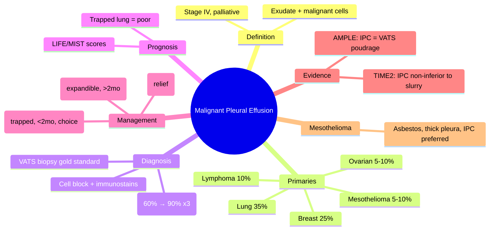

# Malignant Pleural Effusion (MPE)

Related: [[Pleural fluid disorders]], [[Lung cancer]], [[Mesothelioma]], [[Pleural aspiration and chest drain basics]], [[Indwelling pleural catheter]], [[Talc pleurodesis]], [[Trapped lung]]

> [!important]
> **Malignant pleural effusion (MPE)** = exudative effusion with **malignant cells on cytology** OR **malignant infiltration of pleura** on biopsy. **Incurable**, median survival 3–12 months. **Goal = symptom control** (dyspnoea relief). Key FCPS/MRCP: **LIFE/MIST scores for prognosis**, **talc pleurodesis vs IPC (TIME2/AMPLE)**, **trapped lung = no pleurodesis**, **cytology sensitivity ~60% (need biopsy if negative)**, **superior sulcus/mediastinal signs**.

## Learning Objectives
- Define MPE and list common primary cancers
- Interpret **pleural fluid cytology** (sensitivity, cell block, immunocytochemistry)
- Apply **prognostic scores** (LIFE, MIST, PROMISE) for survival estimation
- Choose between **talc pleurodesis** vs **indwelling pleural catheter (IPC)** using **TIME2/AMPLE** evidence
- Recognise **trapped lung** (cannot pleurodese) → IPC preferred
- Manage **recurrent effusion** and **procedure complications**

## Definition
**Malignant Pleural Effusion (MPE)** = pleural effusion caused by **malignant involvement of the pleura** (metastatic or primary mesothelioma), confirmed by:
1. **Positive pleural fluid cytology** (malignant cells)
2. **Positive pleural biopsy** (malignant infiltration)
3. **Malignant cells in pleural fluid/biopsy** in context of known malignancy with exudative effusion (clinical diagnosis if cytology negative but high suspicion)

> **FCPS/MRCP tip**: MPE = **Stage IV disease** (incurable). **Treatment goal = palliation of dyspnoea**. Median survival **3–12 months** (lung cancer ~4–6mo, breast/ovarian ~12mo, mesothelioma ~12mo).

## Core Anatomy
### 1. Pleural metastasis routes
- **Direct invasion** from adjacent lung/breast/chest wall
- **Lymphatic spread** to parietal pleura (most common) → **pleural nodules, thickening**
- **Haematogenous** seeding
- **Transdiaphragmatic** from abdominal primaries (ovary, gastric, pancreas)

### 2. Pathophysiology of MPE
- **Tumour cells** block parietal pleural lymphatics (stomata) → **impaired drainage**
- **Inflammatory cytokines** (VEGF, IL-6, IL-8) → **↑ vascular permeability** → exudate
- **Pleural tumour deposits** → **thickened, nodular pleura** on imaging
- **Trapped lung**: visceral pleural infiltration + fibrin → lung cannot re-expand

### 3. Primary cancers causing MPE (frequency)
| Cancer | % of MPE | Typical Features |
|--------|----------|------------------|
| **Lung (NSCLC/SCLC)** | **~35-40%** | Often ipsilateral, bloody, SCLC = rapid |
| **Breast** | **~25%** | Often bilateral, later recurrence, better survival |
| **Lymphoma** | ~10% | Often bilateral, mediastinal nodes, chylous possible |
| **Ovarian** | ~5-10% | Often bilateral, Meigs syndrome (benign + effusion + ascites) |
| **Mesothelioma** | ~5-10% | **Asbestos exposure**, unilateral, thick nodular pleura, bloody |
| **Gastric/pancreatic** | ~5% | Transdiaphragmatic, often right-sided |
| **Renal, melanoma, sarcoma** | Rare | Variable |

## Core Physiology
### Dyspnoea mechanism in MPE
1. **Mechanical**: fluid volume → lung compression → ↓ lung volumes, ↑ work of breathing
2. **Chest wall restriction**: large effusion → diaphragm flattening, rib cage expansion
3. **V/Q mismatch**: compressed lung → shunt
4. **Trapped lung**: visceral peel → persistent restriction after drainage
5. **Inflammatory**: cytokines → constitutional symptoms

### Re-expansion physiology
- **Expandible lung**: re-expands after drainage → pleurodesis possible
- **Trapped lung**: **cannot re-expand** → pleurodesis fails → IPC preferred

## Normal Values / Important Cut-offs
### Prognostic Scores (Survival Estimation)

**LIFE Score** (Lung cancer, Immunocompromised, Fluid volume, ECOG)
| Factor | Points |
|--------|--------|
| Non-lung primary | 1 |
| Immunocompromised | 1 |
| Effusion >50% hemithorax | 1 |
| ECOG 2–4 | 2 |
| **Total** | **0–5** |
| **Survival** | **LIFE 0: 12mo, 1: 6mo, 2: 3mo, 3: 1.5mo, 4-5: <1mo** |

**MIST Score** (Metastasis, Inflammatory markers, Symptomatic, Tumour type)
| Factor | Points |
|--------|--------|
| Extrapleural metastasis | 1 |
| CRP >30 / NLR >5 | 1 |
| Symptomatic (dyspnoea) | 1 |
| Non-lung/non-meso primary | 1 |
| **Total** | **0–4** |
| **Survival** | **MIST 0: 18mo, 1: 9mo, 2: 4mo, 3: 2mo, 4: <1mo** |

**PROMISE Score** (for IPC patients)
| Factor | Points |
|--------|--------|
| Cancer type (meso best, lung worst) | 0–2 |
| ECOG | 0–2 |
| Albumin | 0–2 |
| Neutrophil/lymphocyte ratio | 0–1 |
| Prior chemo | 0–1 |
| **Total** | **0–8** |

> **FCPS/MRCP tip**: Use **LIFE or MIST** to counsel patients. **LIFE ≥3 or MIST ≥3 = poor survival (<2mo)** → IPC preferred over pleurodesis (less invasive, faster discharge).

### Pleural Fluid in MPE
| Parameter | Typical |
|-----------|---------|
| **Exudate** | Light's criteria positive (always) |
| **pH** | Usually >7.2 (unless complicated by infection/tumour burden) |
| **Glucose** | Normal (unless very high tumour burden) |
| **LDH** | High (often >1000) |
| **Cytology** | **Positive ~60% first sample, ~90% after 3 samples** |
| **Bloody** | Common (lung, mesothelioma) |
| **Chylous** | Lymphoma, thoracic duct obstruction |

## Classification
### By primary malignancy
- Lung (NSCLC > SCLC)
- Breast
- Lymphoma
- Ovarian
- Mesothelioma
- Gastrointestinal
- Other/Unknown primary

### By cytology
- **Cytology positive** (definitive)
- **Cytology negative, biopsy positive**
- **Clinical MPE** (known cancer + exudate, no other cause, cytology negative ×3)

### By lung expandability
- **Expandible lung** → pleurodesis candidate
- **Trapped lung** → IPC only (no pleurodesis)

## Etiology / Causes
### Common primaries
1. **Lung cancer** (NSCLC adenocarcinoma/squamous, SCLC)
2. **Breast cancer** (ER+, HER2+, triple negative)
3. **Lymphoma** (DLBCL, Hodgkin)
4. **Mesothelioma** (epithelioid, sarcomatoid, biphasic)
5. **Ovarian cancer**
6. **Gastric, pancreatic, colorectal**
7. **Renal cell carcinoma**
8. **Melanoma**
9. **Unknown primary (CUP)** — investigate per CUP pathway

### Mesothelioma specifics
- **Asbestos exposure** (occupational, environmental, para-occupational)
- **Latency**: 20–50 years
- **Pleural plaques** (calcified, diaphragmatic) = exposure marker, not mesothelioma
- **Benign asbestos pleural effusion** (BAPE) = diagnosis of exclusion

## Risk Factors
- **Smoking** (lung cancer synergy with asbestos)
- **Asbestos exposure** (mesothelioma)
- **Prior malignancy** (recurrence)
- **Immunosuppression** (lymphoma risk)
- **Age >60** (most)
- **Male** (mesothelioma, lung); **Female** (breast, ovarian)

## Pathophysiology
1. **Malignant cells** reach pleura (lymphatic, direct, haematogenous)
2. **Parietal pleural infiltration** → lymphatic blockage (stomata)
3. **Tumour VEGF/IL-6/IL-8** → ↑ capillary permeability
4. **Fluid accumulation** (exudate, often haemorrhagic)
5. **Visceral pleural involvement** → **trapped lung** (fibrin + tumour)
6. **Pleural nodules/thickening** → nodularity on CT

## Clinical Features
### History
- **Dyspnoea** (progressive, main symptom)
- **Pleuritic chest pain** (if parietal involvement)
- **Cough** (often dry)
- **Weight loss, anorexia, fatigue** (cancer cachexia)
- **Known cancer history** or **new presentation**
- **Asbestos exposure history** (mesothelioma)

### Examination
- **Effusion signs**: dull percussion, reduced breath sounds, reduced fremitus/expansion
- **Large effusion**: mediastinal shift, contralateral tracheal deviation
- **Mediastinal fixation** (mesothelioma, central tumour) = poor prognostic sign
- **Superior sulcus signs** (Pancoast): Horner's, ulnar neuropathy
- **Supraclavicular nodes** (Virchow's, Troisier's)
- **Cachexia**, clubbing (lung cancer, mesothelioma)
- **Signs of primary**: breast mass, abdominal mass

## Investigations
### 1. Imaging
**CXR (PA erect)**
- Effusion (often large)
- **Pleural thickening/nodularity** (key MPE clue)
- **Mediastinal shift** (away if large, fixed if infiltration)
- **Rib destruction** (mesothelioma, metastatic)

**Ultrasound (POCUS)**
- **Complex fluid** (debris, septae)
- **Thickened pleura** (>3mm, nodular)
- **Diaphragmatic nodules**
- **Guidance** for aspiration/biopsy (target thickened areas)

**CT Thorax with IV contrast — KEY INVESTIGATION**
- **Pleural thickening** (>3mm, nodular, circumferential = MPE)
- **Pleural nodules/masses**
- **Mediastinal nodal involvement** (staging)
- **Underlying lung tumour**
- **Chest wall/rib invasion**
- **Contralateral effusion**
- **Pericardial effusion**
- **Distinguish trapped lung**: visceral peel, lung collapsed away from chest wall

**PET-CT** (if staging lung cancer/lymphoma/mesothelioma)
- **Pleural SUV uptake** (malignant vs benign thickening)
- **Distant metastasis** detection

### 2. Pleural Fluid Analysis
**Diagnostic aspiration (US-guided)**

| Test | MPE Typical |
|------|-------------|
| **Light's criteria** | **Exudate** (always) |
| **pH** | >7.2 (usually) |
| **Glucose** | Normal |
| **LDH** | High (often >1000) |
| **WBC** | Variable (lymphocytic or neutrophilic) |
| **Cytology** | **~60% sensitivity (1st sample), ~90% (3 samples)** |
| **Cell block + immunocytochemistry** | **Essential for typing** (TTF-1, Napsin A, CK7, CK20, Calretinin, WT1, D2-40, ER, HER2) |
| **Biomarkers (not routine)** | CEA, CYFRA 21-1, mesothelin (mesothelioma), NSE (SCLC) |

> **FCPS/MRCP tip**: **Send 50–100mL for cytology** (fresh, not fixed). **Cell block** allows immunostains. **Negative cytology ×3** → **thoracoscopic biopsy** (VATS or LAT) = gold standard for diagnosis.

### 3. Pleural Biopsy
| Method | Yield | Indication |
|--------|-------|------------|
| **Abram's/Cope needle (blind)** | Low (30-50%) | Obsolete |
| **Image-guided (US/CT) cutting needle** | 70-80% | First-line if cytology negative |
| **Thoracoscopic (VATS/LAT) biopsy** | **>95%** | Gold standard; also allows talc poudrage |

**VATS/LAT preferred** if fit for procedure — diagnostic + therapeutic in one.

### 4. Staging (Lung Cancer / Mesothelioma)
- **CT chest/abdomen** (+/− PET-CT)
- **EBUS/EUS** for mediastinal nodes
- **Brain MRI** (lung cancer)
- **Bone scan** (mesothelioma)

## Interpretation Frameworks
### 1. Cytology Negative — Next Steps
```
Pleural fluid cytology negative (×1)
    ↓
Repeat cytology ×2 more (total 3 samples) — ↑ yield to ~90%
    ↓
If still negative + high suspicion:
    → **Image-guided cutting needle biopsy** (US/CT) — 70-80% yield
    → **VATS/LAT biopsy** — >95% yield, allows pleurodesis
    → **Clinical diagnosis** if known cancer + exudate + no other cause
```

### 2. Expandible vs Trapped Lung (Critical for Management)
| Assessment | Expandible Lung | Trapped Lung |
|------------|-----------------|--------------|
| **CXR post-drain** | Lung re-expands to chest wall | Lung **stays collapsed**, visceral peel visible |
| **CT** | No visceral peel | **Visceral pleural thickening/peel**, lung volume ↓ |
| **Drain output** | Stops after re-expansion | Continues or lung doesn't oppose parietal pleura |
| **Pleurodesis** | **Indicated** | **CONTRAINDICATED** (will fail) |
| **IPC** | Option | **Preferred** |

### 3. Prognostication (LIFE/MIST)
- **LIFE 0–1** or **MIST 0–1** → survival >6mo → consider pleurodesis
- **LIFE ≥3** or **MIST ≥3** → survival <2mo → **IPC preferred** (less invasive, faster discharge)
- **ECOG 3-4** → comfort measures, avoid invasive procedures

## Diagnosis
**Definitive**: Positive cytology OR positive biopsy
**Clinical**: Known malignancy + exudative effusion + no other cause + negative cytology ×3
**Mesothelioma**: Histology + immunocytochemistry (Calretinin+, WT1+, D2-40+, CK5/6+, BerEP4-, MOC-31-, TTF-1-)

## Differential Diagnosis
| Differential | Clues Against MPE |
|--------------|-------------------|
| **Parapneumonic/empyema** | Fever, neutrophilia, pH<7.2, glucose<3.3, responds to antibiotics |
| **TB effusion** | Lymphocytic, very low glucose, high ADA, chronic, night sweats |
| **Paramalignant effusion** | Cancer present but effusion NOT malignant (obstruction, atelectasis, treatment effect) — cytology negative, usually small |
| **Benign asbestos pleural effusion (BAPE)** | Asbestos exposure, exudate, cytology negative ×3, diagnosis of exclusion |
| **Rheumatological (RA, SLE)** | Low glucose, low pH, chronic, RF/ANA+, no malignant cells |
| **Chylothorax** | Triglycerides >1.24 mmol/L, lymphocyte predominant (lymphoma, trauma, thoracic duct) |
| **Transudate (CHF, hepatic)** | Fails Light's, bilateral, responds to diuresis |

## Management
### 1. General Principles
- **Incurable disease** — **palliation of dyspnoea** is goal
- **Prognosticate** (LIFE/MIST) → guide invasiveness
- **Multidisciplinary** (respiratory, oncology, palliative, thoracic surgery)
- **Treat underlying cancer** (chemo, immunotherapy, targeted) — may control effusion

### 2. Therapeutic Aspiration (Diagnostic + Symptom Relief)
- **Large volume** (1–1.5L) for immediate dyspnoea relief
- **Limit to 1.5L** per session (prevent re-expansion pulmonary oedema)
- **Recurs in days-weeks** — definitive management needed

### 3. Definitive Management Options

#### A. Talc Pleurodesis (Chemical Pleurodesis)
**Indication**: Expandible lung, survival >2–3 months, fit for procedure
**Agent**: **Graded/talc** (large particle, calibrated) — **4g in 50mL saline**
**Methods**:
- **Slurry via chest drain** (bedside, 10–14F pigtail)
- **Poudrage via VATS/LAT** (operating theatre, direct vision, better distribution)
**Success criteria**: Lung opposed to chest wall, drain output <100–150mL/day, no air leak
**Success rate**: ~70-80% (poudrage slightly better than slurry)
**Complications**: Pain, fever, ARDS (rare with calibrated talc <1%), infection

#### B. Indwelling Pleural Catheter (IPC)
**Indication**: **Trapped lung**, **poor prognosis (LIFE≥3/MIST≥3)**, **failed pleurodesis**, **patient preference**, **outpatient management**
**Device**: Tunnelled catheter (PleurX®, Rocket®) with one-way valve
**Insertion**: Local anaesthetic, US-guided, outpatient/day case
**Drainage**: Patient/carer drains **2–3x/week** (or daily if symptomatic), 500–1000mL max
**Spontaneous pleurodesis**: ~30-50% over time (sympathetic pleurodesis)
**Removal**: If output <50mL/3 sessions + lung expanded on CXR
**Complications**: Infection (~5%), blockage, tract metastasis (rare), pain

#### C. TIME2 Trial (IPC vs Talc Slurry)
- **RCT**: IPC vs talc slurry (via drain) for MPE
- **Primary**: Dyspnoea score (VAS) at 6 weeks — **non-inferior**
- **Secondary**: **IPC → fewer hospital days, earlier discharge, similar symptom relief**
- **Spontaneous pleurodesis** in IPC group: ~30%
- **Conclusion**: **IPC non-inferior, better for poor prognosis/trapped lung**

#### D. AMPLE Trial (IPC vs Talc Poudrage via VATS)
- **RCT**: IPC vs VATS talc poudrage
- **Result**: **Similar dyspnoea relief, similar pleurodesis rates**
- **IPC**: less invasive, shorter stay
- **VATS**: higher upfront pleurodesis rate, but surgical risk

### 4. Management Algorithm
```mermaid
flowchart TD
    A[MPE diagnosed\nDyspnoeic] --> B[Therapeutic aspiration\n1-1.5L for immediate relief]
    B --> C{Prognosis & Lung Expandability}
    C --> D[LIFE/MIST score\nPost-drain CXR/CT:\nExpandible vs Trapped]
    D --> E{Trapped Lung?}
    E -- YES --> F[IPC only\n(Pleurodesis contraindicated)]
    E -- NO --> G{Survival >2-3mo?\nLIFE 0-2 / MIST 0-2}
    G -- YES --> H[Patient fit for procedure?]
    H -- YES --> I[Choice: IPC vs Talc\nTIME2/AMPLE: similar relief\nIPC = outpatient, less invasive\nTalc = higher initial success]
    H -- NO --> J[IPC or repeated aspiration]
    G -- NO (survival <2mo) --> K[IPC preferred\nLess invasive, faster discharge]
    I --> L[Shared decision-making\nPatient preference key]
```

### 5. Mesothelioma-Specific
- **Pleurodesis often fails** (rind prevents lung expansion)
- **IPC preferred** (symptom control, outpatient)
- **Systemic therapy**: **Cisplatin + Pemetrexed** (+/− Bevacizumab) — modest survival benefit
- **Radiotherapy**: port site prophylaxis (controversial), palliative for pain/chest wall
- **Compensation**: Industrial injuries disablement benefit (UK)

## Drug Interactions / Contraindications / Cautions
### Talc Pleurodesis
- **Contraindicated**: Trapped lung, active infection, main bronchus obstruction (no lung expansion), unfit for drain/procedure
- **ARDS risk**: <1% with calibrated talc (large particle); **avoid non-calibrated talc**
- **Pain**: Pre-emptive analgesia (NSAIDs, opioid, intercostal block)
- **Fever**: Common (self-limiting), paracetamol

### IPC
- **Contraindicated**: Skin infection at site, uncorrectable coagulopathy, trapped lung with active empyema
- **Infection**: ~5% (exit site, tunnel, pleural) — treat with antibiotics, rarely needs removal
- **Blockage**: Flush with saline, alteplase if fibrin
- **Tract metastasis**: Rare (<1%), radiotherapy if occurs

### Anticoagulation
- **Hold** for drain/IPC/biopsy (INR <1.5, platelets >50)
- **Restart** 24h post-procedure if haemostasis secure
- **DO NOT DELAY** life-saving drain for anticoagulation reversal

## Procedures / Indications / Contraindications
### Therapeutic Aspiration
**Indication**: Symptomatic large effusion (diagnostic + relief)
**Limit**: 1–1.5L per session
**Site**: US-guided, safe triangle

### Chest Drain for Talc Slurry
**Indication**: Expandible lung, good prognosis, pleurodesis planned
**Tube**: 10–14F pigtail (Seldinger)
**Talc**: 4g graded talc in 50mL saline, instill via drain, clamp 1–2h, rotate patient

### VATS Talc Poudrage
**Indication**: Expandible lung, fit for GA, diagnostic uncertainty (allows biopsy + poudrage)
**Procedure**: VATS, biopsy, break loculations, **talc poudrage (4g) under direct vision**, drain

### IPC Insertion
**Indication**: Trapped lung, poor prognosis, failed pleurodesis, patient choice
**Technique**: Local anaesthetic, US-guided, tunnelled (4–6cm subcutaneous), one-way valve

## Procedure Mini-Sections
### Talc Slurry via Drain
1. **Confirm**: Lung expanded, drain swinging, output <150mL/day, no air leak
2. **Pre-medicate**: Analgesia (paracetamol 1g + codeine 30mg or morphine 5mg IV) 30 min prior
3. **Prepare**: **4g graded talc** in 50mL saline (shake vigorously)
4. **Instill**: Via drain side port, flush 20mL saline
5. **Clamp**: 1–2 hours (some rotate patient positions)
6. **Unclamp**: Connect to underwater seal
7. **Monitor**: Pain, fever, output
8. **Remove drain**: When output <100–150mL/day (usually 2–5 days)

### IPC Insertion (Outpatient)
1. **US**: Identify fluid, mark site (4th–5th ICS safe triangle)
2. **Local anaesthetic**: Skin + parietal pleura (1% lidocaine 20mL)
3. **Incision**: 1cm at entry site
4. **Tunnel**: 4–6cm subcutaneous tract (tunneller)
5. **Pleural puncture**: Introducer needle into fluid
6. **Guidewire** → dilator → **catheter with cuff** over wire
7. **Position cuff** in tunnel, valve at skin
8. **Drain** 500–1000mL initial, connect valve cap
9. **Dressing**, teach patient/carer drainage technique

## Complications
### MPE-specific
- **Recurrent effusion** (pleurodesis failure ~20-30%)
- **Trapped lung** (chronic dyspnoea)
- **Loculated effusion** (difficult drainage)
- **Superior vena cava obstruction** (mediastinal nodes)
- **Bronchopleural fistula** (rare, post-pleurodesis)
- **Tract metastasis** (IPC, rare)
- **Empyema complicating MPE** (rare)

### Procedure-specific
- **Re-expansion pulmonary oedema** (rapid >1.5L drainage chronic)
- **Pain** (pleurodesis > IPC)
- **Fever** (pleurodesis)
- **Infection** (drain/IPC)
- **Bleeding** (biopsy/drain)
- **Pneumothorax** (drain/aspiration)

## Red Flags / Emergencies
- **SVC obstruction**: facial/arm swelling, distended neck veins, dyspnoea → urgent oncology/radiotherapy
- **Massive haemoptysis**: bronchial artery embolisation
- **Septic shock** from infected MPE → drain + antibiotics + ICU
- **Trapped lung + re-expansion oedema** → limit drainage rate

## Special Situations
### Paramalignant Effusion
- **Definition**: Cancer present but effusion **not malignant** (cytology negative ×3)
- **Mechanisms**: Lymphatic obstruction by nodes, bronchial obstruction → atelectasis, treatment effect (chemo/radiotherapy), superior vena cava obstruction
- **Management**: Treat underlying cancer, repeated aspiration if symptomatic, pleurodesis **NOT indicated** (will fail)

### Chylothorax in Malignancy
- **Lymphoma** (most common malignancy cause)
- **Thoracic duct obstruction** (mediastinal nodes)
- **Triglycerides >1.24 mmol/L**, lipoprotein present
- **Management**: Low-fat diet/ MCT diet, **thoracic duct ligation/embolisation** if persistent, IPC for palliation

### Bilateral MPE
- **Lymphoma, breast, ovarian, mesothelioma** (rare bilateral)
- **Drain symptomatic side first**, IPC bilateral if needed
- **Systemic therapy** often controls both

### MPE in Pregnancy
- Rare, usually breast cancer or lymphoma
- **Thoracentesis safe** (US-guided)
- **Pleurodesis/IPC deferred** until postpartum if possible
- **Multidisciplinary** (obstetrics, oncology, respiratory)

## Prognosis
- **Median survival**: 3–12 months overall
- **Lung cancer**: ~4–6 months
- **Breast/ovarian**: ~12 months
- **Mesothelioma**: ~12 months (epithelioid better)
- **Lymphoma**: Variable (curable with chemo)
- **Prognostic factors**: LIFE/MIST score, ECOG, cancer type, response to systemic therapy, trapped lung

## Topic Correlation
- [[Pleural fluid disorders]] — exudate framework
- [[Lung cancer]] — primary cause
- [[Mesothelioma]] — primary pleural malignancy
- [[Pleural aspiration and chest drain basics]] — procedures
- [[Indwelling pleural catheter]] — IPC details
- [[Talc pleurodesis]] — pleurodesis details
- [[Trapped lung]] — contraindication to pleurodesis
- [[Thoracic oncologic emergencies]] — SVC, etc.

## FCPS/MRCP High-Yield Points
1. **MPE** = exudate + malignant cells (Stage IV, incurable, palliation only)
2. **Cytology sensitivity**: ~60% (1st), ~90% (3 samples) → **cell block + immunostains essential**
3. **Negative cytology ×3** → **image-guided biopsy or VATS biopsy** (gold standard)
4. **Prognostication**: **LIFE/MIST scores** guide management invasiveness
5. **Trapped lung** (visceral peel on CT, no re-expansion post-drain) = **NO pleurodesis** → IPC
6. **Talc pleurodesis**: 4g graded talc, slurry (drain) vs poudrage (VATS) — ~70-80% success
7. **IPC**: tunnelled catheter, outpatient, drainage 2–3x/week, spontaneous pleurodesis ~30-50%
8. **TIME2**: IPC non-inferior to talc slurry, fewer hospital days
9. **AMPLE**: IPC similar to VATS talc poudrage
10. **Mesothelioma**: asbestos exposure, thick nodular pleura, IPC preferred, cisplatin+pemetrexed

## Common Viva Questions
1. MPE definition and common primaries
2. Cytology sensitivity and next steps if negative
3. LIFE/MIST prognostic scores
4. Trapped lung recognition and significance
5. Talc pleurodesis vs IPC (TIME2/AMPLE evidence)
6. Mesothelioma specific features
7. Paramalignant vs malignant effusion
8. Procedure complications

## Common Confusions / Exam Traps
- **Pleurodesis for trapped lung** = WILL FAIL (lung can't oppose parietal pleura)
- **Using non-calibrated talc** = ARDS risk; use **graded/calibrated talc**
- **Cytology negative = no MPE** = false (sensitivity 60%, need 3 samples + biopsy)
- **Paramalignant effusion** = cancer present but effusion benign (don't pleurodese)
- **IPC only for trapped lung** = false (also for poor prognosis, patient choice)
- **Talc poudrage vs slurry** = poudrage slightly better but needs VATS/GA
- **Mesothelioma pleurodesis** = often fails due to rind; IPC preferred

## Mnemonics
- **MPE PRIMARIES**: **L**ung (35%), **B**reast (25%), **L**ymphoma (10%), **M**esothelioma (5-10%), **O**varian (5-10%), **G**I (5%)
- **LIFE SCORE**: **L**ung primary? (0), **I**mmunocompromised, **F**luid >50%, **E**COG 2-4
- **TRAPPED LUNG**: **T**hickened visceral pleura, **R**e-expansion fails, **A**irspace collapsed, **P**leurodesis **P**rohibited, **E**xpandible? No, **D**rain → IPC
- **TIME2**: **T**alc vs **I**PC — **M**atched **E**fficacy, IPC = **L**ess hospital days

## Mind Map


## Flowchart
```mermaid
flowchart TD
    A[Suspected MPE] --> B[US-guided Aspiration\nCytology x3 + Cell block]
    B --> C{Cytology Positive?}
    C -- YES --> D[MPE CONFIRMED]
    C -- NO --> E[Image-guided Biopsy or VATS Biopsy]
    E --> F{Positive?}
    F -- YES --> D
    F -- NO --> G[Clinical MPE if known cancer + exudate + no other cause]
    D --> H[Therapeutic Aspiration 1-1.5L]
    H --> I[Post-drain CXR/CT:\nExpandible vs Trapped Lung]
    I --> J{LIFE/MIST Score}
    J --> K{Trapped Lung?}
    K -- YES --> L[IPC ONLY]
    K -- NO --> M{Survival >2-3mo?}
    M -- YES --> N[Shared Decision:\nIPC vs Talc (slurry/poudrage)]
    M -- NO --> O[IPC Preferred]
    N --> P[TIME2/AMPLE: Similar relief\nIPC = outpatient, less invasive]
```

## Suggested Visuals / Image Notes
- CT: nodules/thickening pleural, visceral peel (trapped lung)
- US: complex fluid, thickened pleura
- PET-CT: pleural SUV uptake
- IPC device and insertion
- Talc slurry vs poudrage
- LIFE/MIST score calculators

## Suggested Video References
- BTS MPE guideline
- TIME2 trial summary
- AMPLE trial summary
- IPC insertion technique
- VATS talc poudrage
- Mesothelioma diagnosis and management

## One-Page Revision Summary
- **MPE** = exudate + malignant cells (Stage IV, palliative)
- **Primaries**: Lung 35%, Breast 25%, Lymphoma 10%, Meso 5-10%
- **Cytology**: 60% (1 sample) → 90% (3 samples), **cell block + immunostains**
- **Negative cytology ×3** → **VATS biopsy** (gold standard)
- **Prognosis**: LIFE/MIST scores (guide invasiveness)
- **Trapped lung** = **no pleurodesis** → IPC
- **Talc pleurodesis**: 4g graded talc, slurry (drain) or poudrage (VATS) — 70-80% success
- **IPC**: tunnelled catheter, outpatient, 2-3x/week drainage, spontaneous pleurodesis 30-50%
- **TIME2**: IPC non-inferior to slurry, fewer hospital days
- **AMPLE**: IPC = VATS poudrage
- **Mesothelioma**: asbestos, thick rind, IPC preferred, cisplatin+pemetrexed

## 24-Hour Recall Prompts
- MPE common primaries and percentages
- Cytology sensitivity (1 vs 3 samples)
- LIFE/MIST score components
- Trapped lung = no pleurodesis
- TIME2/AMPLE key findings
- Mesothelioma management

## 7-Day / 15-Day / 30-Day Revision Tracker
- [ ] Day 1 completed
- [ ] 24-hour recall completed
- [ ] Day 7 revision completed
- [ ] Day 15 revision completed
- [ ] Day 30 revision completed

## Must Know / Should Know / Nice to Know
### Must Know
- MPE definition, Stage IV, palliative
- Common primaries and frequencies
- Cytology sensitivity, cell block, immunostains
- Next steps if cytology negative
- Trapped lung recognition and management (IPC)
- LIFE/MIST prognostic scores
- Talc pleurodesis vs IPC (TIME2/AMPLE)
- Mesothelioma specific features

### Should Know
- Paramalignant effusion definition and management
- Chylothorax in malignancy
- Bilateral MPE
- MPE in pregnancy
- Talc complications (ARDS risk with non-calibrated)
- IPC complications (infection, tract metastasis)

### Nice to Know
- Biomarkers (mesothelin, CYFRA 21-1, CEA, NSE)
- BAPE (benign asbestos pleural effusion)
- Cost-effectiveness IPC vs talc
- Randomised trial details (TIME1, TIME2, AMPLE, IPC trials)
- Immunotherapy effect on MPE control

## Self-Test Scorecard
- Understanding: /10
- Recall: /10
- MCQ Performance: /10
- SBA Performance: /10
- Viva Confidence: /10
- Total: /50

> [!tip]
> Interpretation: <35 = weak topic, 35-44 = acceptable but insecure, 45+ = strong exam-ready topic.

## Exam Answer Modes
### Long Answer Skeleton
- Definition, epidemiology, common primaries
- Pathophysiology (lymphatic block, cytokines)
- Diagnosis: cytology (sensitivity, cell block), biopsy (image-guided, VATS), clinical diagnosis
- Prognostication: LIFE/MIST scores
- Trapped lung: recognition (CT, post-drain CXR), significance
- Management algorithm: aspiration → prognosticate → trapped? → IPC : prognosis? → shared decision IPC vs talc
- Talc pleurodesis: agent, methods, success, complications
- IPC: device, insertion, drainage, spontaneous pleurodesis, complications
- Evidence: TIME2, AMPLE
- Mesothelioma: asbestos, histology, immunostains, management, compensation
- Special: paramalignant, chylous, bilateral, pregnancy

### Short Note Skeleton
- MPE definition + primaries table
- Diagnostic pathway flowchart
- LIFE/MIST score boxes
- Trapped lung box
- Management algorithm
- TIME2/AMPLE evidence box

### Viva One-Liners
- "MPE = exudate + malignant cells = Stage IV, palliation only"
- "Primaries: Lung 35%, Breast 25%, Lymphoma 10%, Mesothelioma 5-10%"
- "Cytology: 60% sensitivity first sample, 90% after 3 — CELL BLOCK for immunostains"
- "Negative cytology x3 → VATS biopsy (gold standard, >95% yield)"
- "LIFE/MIST scores prognosticate survival — guide invasiveness"
- "Trapped lung = visceral peel on CT, no re-expansion post-drain → PLEURODESIS CONTRAINDICATED → IPC"
- "Talc pleurodesis: 4g GRADED talc, slurry vs poudrage, 70-80% success"
- "IPC: tunnelled catheter, outpatient, 2-3x/week drain, 30-50% spontaneous pleurodesis"
- "TIME2: IPC non-inferior to talc slurry, fewer hospital days"
- "AMPLE: IPC similar to VATS talc poudrage"
- "Mesothelioma: asbestos, Calretinin+/WT1+/D2-40+, thick rind, IPC preferred, cisplatin+pemetrexed"

### Ward-Case Discussion Points
- 65M lung adenocarcinoma, large R effusion, cytology +ve, post-drain CXR: lung expanded, LIFE 1 → discuss IPC vs talc slurry, patient chooses outpatient IPC
- 72F breast cancer, bilateral effusions, cytology +ve, trapped lung L side → IPC bilateral, systemic chemo
- 58M mesothelioma, asbestos exposure, thick nodular pleura, trapped lung → IPC, cisplatin+pemetrexed, radiotherapy port sites

### Last-Night-Before-Exam Sheet
- MPE = Exudate + malignant cells = Stage IV
- Primaries: Lung 35%, Breast 25%, Lymphoma 10%, Meso 5-10%
- Cytology: 60% → 90% (x3), Cell block essential
- Neg x3 → VATS biopsy
- Trapped lung = Visceral peel, no re-expand = NO PLEURODESIS → IPC
- LIFE/MIST: prognosticate
- Talc: 4g graded, slurry/poudrage, 70-80%
- IPC: tunnelled, outpatient, spontaneous pleurodesis 30-50%
- TIME2: IPC non-inferior, less days
- AMPLE: IPC = VATS poudrage
- Meso: Asbestos, IPC, Cis/Pem

## Summary
**Malignant pleural effusion (MPE)** = **exudative effusion with malignant pleural involvement** (Stage IV, incurable). **Common primaries**: lung (35%), breast (25%), lymphoma (10%), mesothelioma (5-10%). **Diagnosis**: **cytology** (60% first, 90% after 3 samples + **cell block for immunostains**); negative ×3 → **VATS biopsy** (gold standard). **Prognostication**: **LIFE/MIST scores** guide management. **Trapped lung** (visceral pleural peel, no re-expansion) = **pleurodesis contraindicated → IPC**. **Management**: therapeutic aspiration → **expandible lung + survival >2mo** → shared decision **talc pleurodesis** (4g graded talc, slurry/poudrage, 70-80%) vs **IPC** (tunnelled catheter, outpatient, 30-50% spontaneous pleurodesis); **trapped lung or survival <2mo** → **IPC preferred**. **TIME2**: IPC non-inferior to talc slurry, fewer hospital days. **AMPLE**: IPC similar to VATS poudrage. **Mesothelioma**: asbestos, thick rind, IPC preferred, cisplatin+pemetrexed.

## MCQs (10)
1. **Most common cause** of malignant pleural effusion:
   A. Breast cancer
   B. **Lung cancer**
   C. Lymphoma
   D. Mesothelioma

2. **Pleural fluid cytology sensitivity** for MPE on first sample:
   A. 90%
   B. 80%
   C. **~60%**
   D. 40%

3. **Trapped lung** is a contraindication to:
   A. IPC insertion
   B. **Talc pleurodesis**
   C. Therapeutic aspiration
   D. Image-guided biopsy

4. **TIME2 trial** compared:
   A. IPC vs VATS talc poudrage
   B. **IPC vs talc slurry via chest drain**
   C. Talc slurry vs talc poudrage
   D. IPC vs repeated aspiration

5. **LIFE score** includes which factors?
   A. Lung primary, Immunocompromised, Fluid volume, ECOG
   B. Lymph nodes, Infection, Fluid protein, ECOG
   C. LDH, Immunoglobulins, Fever, ECOG
   D. Lung function, INR, Fluid pH, ECOG

6. **Graded/calibrated talc** is used for pleurodesis to reduce:
   A. Pain
   B. Fever
   C. **ARDS risk**
   D. Infection risk

7. **IPC spontaneous pleurodesis rate**:
   A. 5-10%
   B. **30-50%**
   C. 70-80%
   D. >90%

8. **Mesothelioma immunocytochemistry** — positive markers:
   A. TTF-1, Napsin A
   B. **Calretinin, WT1, D2-40, CK5/6**
   C. ER, PR, HER2
   D. CD30, CD15

9. **Paramalignant effusion** definition:
   A. Effusion with malignant cells
   B. **Cancer present but effusion NOT malignant (cytology negative)**
   C. Effusion caused by cancer treatment
   D. Effusion with paramalignant cells

10. **AMPLE trial** compared:
    A. IPC vs talc slurry
    B. **IPC vs VATS talc poudrage**
    C. Talc slurry vs poudrage
    D. IPC vs repeated aspiration

## SBA Questions (10)
1. A 68M with NSCLC adenocarcinoma, large R effusion. Cytology positive. Post-drain CXR shows full lung expansion. LIFE score 1. He wants to avoid hospital stays. Best definitive management?
   A. VATS talc poudrage
   B. **Indwelling pleural catheter (IPC)**
   C. Talc slurry via drain
   D. Repeated therapeutic aspiration

2. A 55F with ovarian cancer, large L effusion. Cytology negative ×3. CT shows nodular pleural thickening. Next diagnostic step?
   A. Repeat cytology ×3 more
   B. **VATS pleural biopsy**
   C. IPC insertion
   D. PET-CT only

3. A 70M with SCLC, large effusion, post-drain CXR shows lung trapped (visceral peel). LIFE score 3. Management?
   A. Talc slurry pleurodesis
   B. VATS talc poudrage
   C. **Indwelling pleural catheter (IPC)**
   D. Observation only

4. A 60F with breast cancer, MPE, expandible lung, LIFE score 0. She chooses talc pleurodesis. Agent and dose?
   A. Non-calibrated talc 5g
   B. **Graded talc 4g in 50mL saline**
   C. Doxycycline 100mg
   D. Bleomycin 60 units

5. Mesothelioma diagnosis — which immunostain panel is CORRECT?
   A. TTF-1+, Napsin A+, Calretinin-
   B. **Calretinin+, WT1+, D2-40+, CK5/6+, BerEP4-, MOC-31-**
   C. ER+, PR+, HER2+, Calretinin-
   D. CD30+, CD15+, Calretinin-

6. TIME2 trial — primary outcome and result:
   A. Mortality — IPC superior
   B. **Dyspnoea VAS at 6 weeks — non-inferior**
   C. Pleurodesis rate — talc superior
   D. Quality of life — talc superior

7. Contraindication to talc pleurodesis:
   A. Expandible lung
   B. **Trapped lung**
   C. Good prognosis
   D. Patient preference

8. IPC drainage regimen:
   A. Daily 2L
   B. **2-3 times per week, 500-1000mL max**
   C. Weekly 500mL
   D. Only when symptomatic

9. Superior vena cava obstruction in MPE — immediate management:
   A. Pleurodesis
   B. **Urgent oncology referral for radiotherapy/stent**
   C. IPC insertion
   D. Diuretics

10. Benign asbestos pleural effusion (BAPE) — diagnosis:
    A. Cytology positive for mesothelial cells
    B. **Asbestos exposure, exudate, cytology negative ×3, diagnosis of exclusion**
    C. High mesothelin
    D. Pleural plaques on CT

## Flashcards
- Q: MPE common primaries
  A: Lung 35%, Breast 25%, Lymphoma 10%, Mesothelioma 5-10%
- Q: Cytology sensitivity
  A: 60% (1 sample) → 90% (3 samples + cell block)
- Q: Trapped lung = ?
  A: Visceral peel, no re-expansion → NO pleurodesis → IPC
- Q: LIFE score
  A: Lung primary?, Immunocompromised, Fluid>50%, ECOG
- Q: Talc pleurodesis
  A: 4g graded talc, slurry/poudrage, 70-80% success
- Q: IPC
  A: Tunnelled catheter, outpatient, 2-3x/wk, spontaneous pleurodesis 30-50%
- Q: TIME2
  A: IPC non-inferior to talc slurry, fewer hospital days
- Q: Mesothelioma immunostains
  A: Calretinin+, WT1+, D2-40+, CK5/6+, BerEP4-, MOC-31-
- Q: Paramalignant
  A: Cancer present, effusion benign (cytology neg)
- Q: BAPE
  A: Asbestos, exudate, cytology neg x3, exclusion diagnosis

## Answer Key with Explanations
### MCQs
1. **B** — Lung cancer ~35-40% of MPE.
2. **C** — Cytology sensitivity ~60% first sample, improves to ~90% with 3 samples + cell block.
3. **B** — Trapped lung = visceral peel prevents lung apposition → pleurodesis fails → contraindicated.
4. **B** — TIME2: IPC vs talc slurry (via chest drain).
5. **A** — LIFE: non-Lung primary, Immunocompromised, Fluid >50% hemithorax, ECOG 2-4.
6. **C** — Calibrated/graded talc (large particle) reduces ARDS risk (<1% vs higher with non-calibrated).
7. **B** — IPC spontaneous pleurodesis ~30-50% over time.
8. **B** — Mesothelioma: Calretinin, WT1, D2-40, CK5/6 positive; BerEP4, MOC-31 negative.
9. **B** — Paramalignant = cancer present but effusion not malignant (cytology negative).
10. **B** — AMPLE: IPC vs VATS talc poudrage.

### SBAs
1. **B** — Expandible lung but patient wants outpatient/less invasive → IPC (TIME2: similar relief, fewer hospital days).
2. **B** — Cytology negative ×3 + high suspicion (nodular pleura) → VATS biopsy (gold standard).
3. **C** — Trapped lung + poor prognosis (LIFE 3) → IPC only (pleurodesis contraindicated).
4. **B** — Graded/calibrated talc 4g in 50mL saline (standard for pleurodesis).
5. **B** — Mesothelioma panel: Calretinin, WT1, D2-40, CK5/6 positive; epithelial markers negative.
6. **B** — TIME2 primary: dyspnoea VAS at 6 weeks, non-inferior.
7. **B** — Trapped lung = absolute contraindication to pleurodesis.
8. **B** — IPC: 2-3x/week, 500-1000mL, symptom-guided.
9. **B** — SVC obstruction = oncological emergency → urgent radiotherapy/stent.
10. **B** — BAPE: asbestos exposure + exudate + cytology neg ×3 + exclusion diagnosis.

### Flashcards
All correct as written.

---
