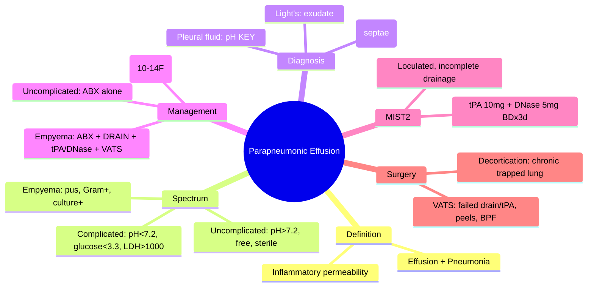
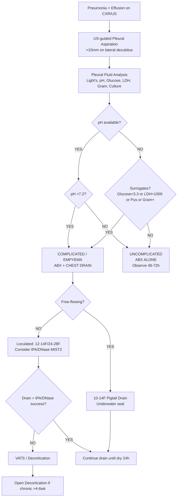

# Parapneumonic Effusion

Related: [[Pleural fluid disorders]], [[Pneumonia]], [[Empyema and pleural infection]], [[Pleural aspiration and chest drain basics]], [[Pleural infection and procedures]], [[Community-acquired pneumonia severity assessment]]

> [!important]
> **Parapneumonic effusion (PPE)** = pleural effusion **associated with pneumonia**. Spectrum: **uncomplicated (exudative, sterile)** → **complicated (poor drainage, low pH/glucose, high LDH)** → **empyema (pus / positive Gram stain/culture)**. Key FCPS/MRCP: **Light's criteria for exudate**, **pleural fluid pH <7.2 = drain**, **pH >7.2 = antibiotics alone**, **MIST2: tPA/DNase for loculated**, **BTS/ACCP algorithms**.

## Learning Objectives
- Define PPE and classify by **pleural fluid analysis** (uncomplicated vs complicated vs empyema)
- Apply **Light's criteria** and interpret **pH, glucose, LDH, Gram stain, culture**
- Use **pleural fluid pH** as key decision threshold (<7.2 = drain)
- Apply **BTS/ACCP management algorithms** for each category
- Recognise **MIST2 trial** evidence for intrapleural tPA/DNase in loculated effusions
- Differentiate from malignant effusion, TB effusion, rheumatological, transudate
- Know **chest drain size** (small-bore vs large) and **intrapleural therapy**

## Definition
**Parapneumonic effusion (PPE)** = pleural effusion occurring **in association with bacterial pneumonia** (or adjacent infection), caused by **inflammatory cytokine-mediated increased pleural permeability** and **impaired lymphatic drainage**.

**Spectrum of PPE:**
| Stage | Pleural Fluid | Management |
|-------|---------------|------------|
| **Uncomplicated (simple)** | Exudate, **pH >7.2**, glucose normal, sterile, **free-flowing** | **Antibiotics alone** (no drain) |
| **Complicated** | Exudate, **pH <7.2**, **glucose <3.3 mmol/L**, **LDH >1000**, free or loculated | **Antibiotics + CHEST DRAIN** |
| **Empyema** | **Frank pus** / **positive Gram stain/culture**, usually loculated | **Antibiotics + DRAIN + consider tPA/DNase / VATS** |

> **FCPS/MRCP tip**: **pH is the single best predictor** of need for drainage. **pH <7.2 = drain**. If pH unavailable, use glucose <3.3 mmol/L or LDH >1000 as surrogates.

## Core Anatomy
### 1. Pleural space
- **Potential space** between visceral and parietal pleura
- **Normal**: ~10–20 mL serous fluid, protein <1.5 g/dL, pH 7.60–7.64, glucose = serum
- **Lymphatics** (parietal pleura, especially diaphragmatic) drain fluid (~0.2 mL/kg/h capacity)

### 2. In pneumonia
- **Visceral pleural inflammation** → ↑ permeability → protein-rich fluid enters pleural space
- **Inflammatory cytokines** (TNF-α, IL-1, IL-8) → ↑ vascular permeability
- **Lymphatic impairment** → drainage overwhelmed
- **Bacterial translocation** → infection of pleural space (empyema)

### 3. Loculation
- **Fibrin deposition** → adhesions → septae → **loculated collections**
- **Visceral pleural peel** (fibrin + fibroblasts) → trapped lung
- **Parietal pleural peel** → restricts chest wall expansion

### 4. Surface anatomy for procedures
- **Aspiration/Drain**: **4th–5th ICS, anterior to midaxillary line (safe triangle)** — lateral to latency of pectoralis, anterior to latissimus, base 5th ICS
- **Ultrasound-guided** preferred (loculations, septae)

## Core Physiology
### Normal pleural fluid dynamics
- **Formation**: filtration from parietal pleural capillaries (Starling forces)
- **Removal**: lymphatic stomata on parietal pleura (diaphragm, mediastinum) → 0.2 mL/kg/h
- **Balance**: formation = removal → ~10–20 mL total

### In PPE
1. **Inflammation** → ↑ capillary permeability → **exudate** (protein, LDH, cells enter)
2. **Cytokines** → fibrinogen → **fibrin** → **loculations**
3. **Bacteria** enter → **empyema** (neutrophils, bacteria, low glucose, low pH)
4. **Anaerobic metabolism** by bacteria + neutrophils → **lactate ↑, pH ↓, glucose ↓**
5. **Pleural peels** form → **trapped lung** if chronic (>2–3 weeks)

## Normal Values / Important Cut-offs
### Light's Criteria (Exudate vs Transudate)
**Exudate if ANY of:**
1. **Pleural fluid protein / Serum protein > 0.5**
2. **Pleural fluid LDH / Serum LDH > 0.6**
3. **Pleural fluid LDH > 2/3 upper limit of normal serum LDH**

> **Sensitivity ~98%, Specificity ~80%** for exudate. **All PPE are exudates** (if transudate → think alternative: CHF, hepatic hydrothorax, nephrotic).

### Pleural Fluid Analysis Decision Thresholds
| Parameter | Uncomplicated | Complicated (drain) | Empyema |
|-----------|---------------|---------------------|---------|
| **pH** | **>7.2** | **<7.2** | <7.0 (often) |
| **Glucose** | >3.3 mmol/L | **<3.3 mmol/L** | Very low / undetectable |
| **LDH** | <1000 IU/L | **>1000 IU/L** | Very high (>10,000) |
| **Gram stain** | Negative | Negative / Positive | **Positive** |
| **Culture** | Sterile | Sterile / Positive | **Positive** |
| **Appearance** | Clear/yellow | Turbid | **Frank pus** |
| **WBC** | <10,000 (lymphocytic) | >10,000 (neutrophilic) | >50,000 (neutrophils) |

### Microbiology
- **Aerobes**: *S. pneumoniae*, *S. aureus*, *H. influenzae*, *Klebsiella*, Gram-negatives
- **Anaerobes**: *Peptostreptococcus*, *Bacteroides*, *Fusobacterium* (often mixed)
- **Atypicals**: *Legionella*, *Mycoplasma*, *Chlamydia* (usually no effusion or small uncomplicated)

## Classification
### By pleural fluid characteristics (clinical decision)
1. **Uncomplicated PPE** — exudate, pH >7.2, free-flowing, sterile → **antibiotics alone**
2. **Complicated PPE** — exudate, **pH <7.2** and/or glucose <3.3, LDH >1000 → **drain + antibiotics**
3. **Empyema** — pus / positive Gram stain/culture → **drain + antibiotics ± tPA/DNase ± VATS**

### By anatomical stage
1. **Exudative phase** (days 1–7): free-flowing, low cellularity, pH >7.2
2. **Fibrinopurulent phase** (days 7–21): loculated, high neutrophils, pH <7.2, glucose ↓
3. **Organising phase** (>21 days): pleural peels, trapped lung, chronic empyema

## Etiology / Causes
### Pneumonia pathogens causing PPE
| Pathogen | PPE Frequency | Typical Features |
|----------|---------------|------------------|
| **S. pneumoniae** | Most common (~40%) | Uncomplicated often; empyema in children/elderly |
| **S. aureus** | ~10-20% | Cavitating, empyema common, PVL-positive severe |
| **Anaerobes** | ~10-15% (aspiration) | Foul smell, mixed flora, dental source |
| **Gram-negatives** | ~10% (*Klebsiella*, *E. coli*, *Pseudomonas*) | Hospital-acquired, severe |
| **H. influenzae** | ~5% | COPD exacerbation |
| **Strep. milleri group** | Under-recognised | Abscess/empyema prone |

### Risk factors for PPE / Empyema
- **Age extremes** (children, elderly)
- **Comorbidities**: diabetes, alcohol, immunosuppression, COPD, malignancy
- **Aspiration risk** (dysphagia, stroke, seizures, alcohol)
- **Delayed antibiotics** / inappropriate initial therapy
- **Loculated effusion** on imaging
- **High CRP, low albumin**

## Pathophysiology
### Exudative phase (1–7 days)
- Inflammatory mediators → ↑ capillary permeability
- Protein-rich fluid enters pleural space
- Pleural fluid: neutrophilic exudate, pH >7.2, glucose normal, sterile
- **Free-flowing** on imaging

### Fibrinopurulent phase (7–21 days)
- Bacteria inoculate pleural space
- Neutrophil influx → fibrin deposition → **septae/loculations**
- Anaerobic metabolism → **glucose ↓, lactate ↑, pH ↓ (<7.2)**
- **Complicated PPE / Empyema**

### Organising phase (>21 days)
- Fibroblasts invade fibrin → **pleural peels** (visceral + parietal)
- **Visceral peel** → **trapped lung** (lung cannot re-expand after drainage)
- **Parietal peel** → chest wall restriction
- Chronic empyema → **thoracotomy / decortication** needed

## Clinical Features
### History
- **Pneumonia symptoms**: fever, cough, purulent sputum, pleuritic pain
- **Pleuritic pain** (may be reduced by effusion)
- **Dyspnoea** (effusion size + underlying pneumonia)
- **Night sweats, weight loss** (if subacute/chronic)
- **Risk factors**: alcohol, diabetes, immunosuppression, aspiration

### Examination
- **Effusion signs**: dull percussion, reduced breath sounds, reduced vocal fremitus, reduced expansion
- **Pneumonia signs**: bronchial breathing, crackles above fluid level, egophony
- **Systemic**: fever, tachycardia, hypotension (sepsis), confusion (elderly)
- **Empyema clues**: swinging fever, rigors, chest wall oedema/erythema (empyema necessitatis)

## Investigations
### 1. Imaging
**CXR (PA erect + lateral decubitus)**
- Blunted costophrenic angle (>200 mL)
- **Meniscus sign** (free fluid)
- **Lateral decubitus**: fluid layers → **free** vs **doesn't layer → loculated**
- **Free-flowing** = thin layer; **Loculated** = lenticular, fixed position

**Ultrasound (POCUS) — FIRST-LINE for characterisation**
- **Free fluid**: anechoic, layers dependently, swirling with respiration
- **Complex/Loculated**: **septae** (thin echogenic lines), **debris** (echogenic swirling), **thickened pleura** (>2mm)
- **Guidance**: for aspiration/drain (avoid lung, target largest pocket)
- **Volume estimation**: various formulas (e.g., 20 × height × width × depth)

**CT Thorax (with contrast)**
- **Enhanced pleura** (split pleura sign: inner visceral + outer parietal enhancement)
- **Loculations**, **abscesses**, **bronchopleural fistula** (air in effusion)
- **Underlying pneumonia**, **mass**, **lymphadenopathy**
- **Pre-VATS planning**

### 2. Pleural Fluid Analysis (DIAGNOSTIC KEY)
**Aspirate under US guidance if >10 mm on lateral decubitus**

| Test | Significance |
|------|--------------|
| **Appearance** | Clear → uncomplicated; Turbid → complicated; Pus → empyema |
| **Light's criteria** | Confirms exudate |
| **pH (blood gas syringe, ANAEROBIC)** | **<7.2 = drain** (most important) |
| **Glucose** | **<3.3 mmol/L = drain** |
| **LDH** | **>1000 = drain**; >10,000 suggests empyema/malignancy |
| **Cell count + diff** | Neutrophils = bacterial; Lymphocytes = TB/malignancy/viral |
| **Gram stain** | **Positive = empyema** (but sensitivity ~50%) |
| **Culture (aerobic + anaerobic)** | **Positive = empyema**; blood culture bottles improve yield |
| **Amylase** | Elevated = pancreatic / oesophageal rupture |
| **Cytology** | If malignancy suspected (not routine in PPE) |
| **Biomarkers (research)**: CRP, procalcitonin, sTREM-1 | Not routine |

### 3. Blood Tests
- **FBC**: neutrophilia, raised WCC
- **CRP**: typically very high (>200)
- **U&E, LFT, glucose**
- **Blood cultures** ×2 (before antibiotics)
- **ABG** if hypoxic/septic
- **HIV** if risk factors

## Interpretation Frameworks
### 1. Pleural Fluid pH — The Decision Maker
**Algorithm (BTS/ACCP):**
```
Pleural fluid pH available?
    YES → pH <7.2? → YES → COMPLEX/COMPLICATED → DRAIN + ABX
                    NO → pH >7.2? → YES → UNCOMPLICATED → ABX alone (observed)
    NO (sample clotted/delayed) → use surrogates:
        Glucose <3.3 mmol/L → DRAIN
        LDH >1000 IU/L → DRAIN
        Frank pus → EMPYEMA → DRAIN
        Positive Gram stain → EMPYEMA → DRAIN
```

> **FCPS/MRCP tip**: **pH MUST be measured in blood gas syringe, anaerobic, on ice, analysed within 1 hour**. Air exposure → falsely ↑ pH.

### 2. Free vs Loculated on Imaging
| Feature | Free-flowing | Loculated |
|---------|--------------|-----------|
| **CXR lateral decubitus** | Layers dependently | Fixed, lenticular |
| **Ultrasound** | Anechoic, no septae | Septae, debris, thickened pleura |
| **Drainage** | Simple drain | May need tPA/DNase / VATS |
| **Prognosis** | Better | Worse, longer stay |

### 3. Light's Criteria Application
- **All PPE are exudates** by definition (inflammatory)
- If **transudate** on Light's → **NOT PPE** → think CHF, hepatic hydrothorax, nephrotic, CPAP, urinothorax, atelectasis

### 4. MIST2 Trial (Intrapleural tPA/DNase)
- **RCT**: tPA + DNase vs placebo in loculated PPE/empyema
- **Result**: **tPA+DNase** significantly ↑ drainage, ↓ surgical referral, ↓ hospital stay
- **Regimen**: **tPA 10mg + DNase 5mg** in 50mL saline, **twice daily ×3 days** via chest drain (clamp 1h after each dose)
- **Indication**: **Loculated effusion** on US/CT with incomplete drainage
- **Contraindication**: Active bleeding, recent surgery, coagulopathy

## Diagnosis
**Clinical + Radiological + Pleural Fluid**:
1. Pneumonia + pleural effusion on imaging
2. **Pleural fluid**: exudate (Light's), neutrophilic
3. **pH/glucose/LDH** classify as uncomplicated / complicated / empyema
4. **Microbiology**: culture + Gram stain guide antibiotics

## Differential Diagnosis
| Differential | Clues Against PPE |
|--------------|-------------------|
| **Malignant effusion** | Lymphocytic, pH often >7.2, glucose normal, cytology +ve, chronic, no fever |
| **TB effusion** | Lymphocytic, very low glucose, very high LDH, ADA >40 U/L, chronic, night sweats |
| **Rheumatological (RA, SLE)** | Low glucose, low pH, but chronic, RA factor +ve, ANA +ve, no acute pneumonia |
| **Transudate (CHF, hepatic)** | Fails Light's, bilateral, responds to diuresis, no fever/pleuritis |
| **Pulmonary embolism** | Small exudate, often bloody, D-dimer +ve, CTPA +ve, no consolidation |
| **Pancreatic effusion** | Amylase very high, left-sided usually |
| **Oesophageal rupture** | Food particles, amylase high, Boerhaave (vomiting + pain) |

## Management
### 1. Antibiotics (ALL PPE)
- **Empirical**: cover likely pathogens (S. pneumoniae, S. aureus, anaerobes, Gram-neg)
- **Community-acquired**: **Co-amoxiclav 1.2g TDS IV** OR **Ceftriaxone 2g OD IV + Metronidazole 500mg TDS IV**
- **Hospital-acquired / risk factors**: **Piperacillin-tazobactam 4.5g QDS IV** OR **Meropenem 1g TDS IV**
- **Duration**: **7–14 days total** (IV to oral step-down when clinically stable)
- **Adjust** per culture/sensitivity

### 2. Uncomplicated PPE (pH >7.2, free-flowing)
- **Antibiotics alone** — **NO ROUTINE DRAINAGE**
- Monitor: repeat CXR/US at 48–72h
- If **fails to improve** or **pH drops <7.2** → drain

### 3. Complicated PPE (pH <7.2 or glucose <3.3 or LDH >1000)
- **Antibiotics + CHEST DRAIN**
- **Drain size**: **10–14F pigtail** (Seldinger, US-guided) preferred for free-flowing
- **Large bore (24–28F)** if thick pus / empyema / need for fibrinolytics
- **Underwater seal** (no suction initially)
- **Suction**: -10 to -20 cmH2O if incomplete drainage

### 4. Empyema (pus / positive Gram stain/culture)
- **Antibiotics + DRAIN + consider tPA/DNase / VATS**
- **Large bore drain** (24–28F) traditionally; **MIST2 used 12–14F**
- **Intrapleural tPA/DNase** (MIST2 protocol) if **loculated** or **incomplete drainage**
- **VATS** if **failure of drain + tPA/DNase** or **organised phase (peels)**
- **Open decortication** if chronic >4–6 weeks with trapped lung

### 5. Intrapleural Fibrinolytic Therapy (MIST2)
**Indication**: Loculated effusion on US/CT with **incomplete drainage** despite adequate drain
**Regimen**: **tPA 10mg + DNase 5mg** in 50mL saline, **BD ×3 days** via chest drain
- Clamp drain **1 hour** after each dose
- Flush with 20mL saline after
- Monitor for bleeding (rare with tPA 10mg)
**Contraindications**: Active bleeding, coagulopathy (INR >1.5, platelets <50), recent surgery <7d, stroke <3mo

### 6. Surgical Referral (VATS)
**Indications**:
- **Failure of drain ± tPA/DNase** (persistent sepsis, loculations, incomplete drainage)
- **Organised phase** (pleural peels on CT) → **decortication**
- **Bronchopleural fistula** (persistent air leak)
- **Empyema necessitatis** (chest wall extension)
- **Diagnostic uncertainty** (malignancy vs empyema)

## Drug Interactions / Contraindications / Cautions
### Antibiotics
- **Co-amoxiclav**: monitor LFTs (cholestatic hepatitis)
- **Ceftriaxone**: biliary sludge, caution in neonates (not relevant)
- **Pip-taz**: monitor renal function, adjust in renal impairment
- **Metronidazole**: neurotoxicity (peripheral neuropathy) with prolonged use
- **Aminoglycosides** (if used): nephro/ototoxicity

### tPA/DNase
- **Bleeding risk**: monitor Hb, drain output
- **Contraindicated**: recent surgery, trauma, stroke, coagulopathy
- **Allergy**: rare

### Analgesia
- **NSAIDs** first-line (drain site pain)
- **Opioids**: avoid if possible (respiratory depression in pneumonia)
- **Intercostal block** for drain insertion

## Procedures / Indications / Contraindications
### Pleural Aspiration (Diagnostic)
**Indication**: All new PPE >10mm on lateral decubitus
**Site**: US-guided, safe triangle (4th–5th ICS anterior to midaxillary)
**Needle**: 21G diagnostic, 16–18G therapeutic
**Contraindication**: Uncorrected coagulopathy (relative), skin infection

### Chest Drain Insertion
**Indication**: Complicated PPE (pH<7.2), empyema, failed antibiotics
**Site**: US-guided, safe triangle
**Tube**:
- **Free-flowing**: 10–14F pigtail (Seldinger)
- **Empyema / thick pus / loculated**: 12–14F (MIST2) or 24–28F surgical
**Technique**: Seldinger (pigtail) or surgical (blunt dissection)
**Connection**: Underwater seal (digital preferred)
**Suction**: Only if incomplete drainage (-10 to -20 cmH2O)

### Intrapleural tPA/DNase
**Indication**: Loculated effusion, incomplete drainage post-drain
**Protocol**: MIST2 (tPA 10mg + DNase 5mg BD ×3 days)
**Administration**: Via chest drain side port, clamp 1h, flush 20mL saline

## Procedure Mini-Sections
### Diagnostic Pleural Aspiration (US-guided)
1. **US**: Identify largest fluid pocket, measure depth, mark skin
2. **Prep**: Chlorhexidine, sterile drape, local anaesthetic (1% lidocaine 5–10mL)
3. **Needle**: 21G diagnostic (or 16–18G if therapeutic aspirate planned)
4. **Advance** under US guidance into fluid
5. **Aspirate** 50–100mL for analysis (pH in ABG syringe anaerobic!)
6. **Send**: pH, glucose, LDH, protein, cell count/diff, Gram stain, culture (aerobic+anaerobic in blood bottles), cytology if indicated
7. **Post-procedure CXR**: if >1L removed or symptomatic (check re-expansion oedema)

### Chest Drain (Seldinger Pigtail, US-guided)
1. **US**: Locate fluid, confirm no lung/intervening bowel
2. **Anaesthetise**: Skin → parietal pleura (aspirate fluid confirms)
3. **Needle** (18G) into fluid, confirm flow
4. **Guidewire** (J-tip) advance 15–20cm
5. **Dilator** over wire
6. **Pigtail catheter** (10–14F) over wire, curl in pleural space
7. **Remove wire**, connect to underwater seal
8. **Secure**, dressing, CXR

## Complications
### PPE / Empyema complications
- **Loculation** → incomplete drainage
- **Trapped lung** (visceral peel) → chronic dyspnoea
- **Bronchopleural fistula** (air leak + pus)
- **Empyema necessitatis** (chest wall extension, sinus formation)
- **Sepsis / septic shock**
- **Fibrothorax** (chest wall restriction)
- **Mortality**: PPE ~5-10%, empyema ~15-20% (higher in elderly/comorbid)

### Procedure complications
- **Pneumothorax** (drain/aspiration)
- **Bleeding** (intercostal artery, lung parenchyma)
- **Infection** (empyema from sterile procedure — rare)
- **Re-expansion pulmonary oedema** (rapid >1.5L from chronic)
- **Organ injury** (liver, spleen — lower inserts)

## Red Flags / Emergencies
- **Septic shock**: hypotension, lactate >2, rush drain + abx + fluids + ICU
- **Tension physiology** (large effusion + mediastinal shift): urgent drain
- **Massive haemoptysis** (bronchial artery bleed): bronchial artery embolisation
- **Air leak + pus** (bronchopleural fistula): surgical review
- **Empyema necessitatis**: chest wall swelling, sinus → surgical

## Special Situations
### Paediatric PPE / Empyema
- **Primary drainage** often with small-bore pigtail + tPA/DNase
- **VATS** early if failed (children tolerate VATS well)
- **Fibrinolytics** widely used (MIST2 evidence extrapolated)

### Immunocompromised (HIV, chemo, biologics)
- **Broader differential**: fungal (Candida, Aspergillus), Nocardia, TB, PJP
- **Lower threshold** for CT, bronchoscopy, biopsy
- **Empirical abx**: cover Pseudomonas, fungi if risk factors

### Post-pneumonectomy / post-lobectomy empyema
- **Bronchopleural fistula** common
- **Management**: drain + antibiotics + surgical closure (muscle flap)
- **Clagett procedure** (open window thoracostomy) for chronic

## Prognosis
- **Uncomplicated PPE**: resolves with antibiotics, no sequelae
- **Complicated PPE**: drains well, full recovery typical
- **Empyema**: ~15-20% mortality (elderly, comorbid, delayed drainage)
- **Chronic empyema / fibrothorax**: may need decortication, long-term dyspnoea
- **Early drainage + appropriate antibiotics** = best outcomes

## Topic Correlation
- [[Pleural fluid disorders]] — exudate/transudate framework
- [[Pneumonia]] — underlying cause
- [[Empyema and pleural infection]] — advanced stage
- [[Pleural aspiration and chest drain basics]] — procedures
- [[Pleural infection and procedures]] — detailed procedure notes
- [[Community-acquired pneumonia severity assessment]] — CURB-65, PSI

## FCPS/MRCP High-Yield Points
1. **PPE spectrum**: uncomplicated (pH>7.2) → complicated (pH<7.2) → empyema (pus/positive culture)
2. **Light's criteria**: all PPE are exudates
3. **pH <7.2 = DRAIN** (single most important threshold)
4. **Surrogates if no pH**: glucose <3.3, LDH >1000, frank pus, positive Gram stain
5. **pH sample**: blood gas syringe, anaerobic, on ice, analyse <1h
6. **Uncomplicated**: antibiotics alone (no drain)
7. **Complicated/Empyema**: antibiotics + chest drain
8. **Drain size**: 10-14F pigtail (free), 12-14F/24-28F (empyema/loculated)
9. **MIST2**: tPA+DNase BD×3d for loculated incomplete drainage
10. **VATS**: failed drain ± tPA/DNase, organised phase (peels), BPF

## Common Viva Questions
1. Classify PPE by pleural fluid analysis
2. pH threshold for drainage and why it's critical
3. Light's criteria and application
4. MIST2 trial regimen and indications
5. Drain size selection (small-bore vs large)
6. Antibiotics choice for community vs hospital PPE
7. Complicated vs empyema differentiation
8. Surrogate markers if pH unavailable

## Common Confusions / Exam Traps
- **Draining uncomplicated PPE (pH>7.2)** — NOT needed, antibiotics alone
- **Measuring pH in normal syringe/air exposure** → falsely high → missed drainage
- **Using surrogates wrongly**: glucose <3.3 OR LDH >1000 indicate drain, but pH is gold standard
- **Small-bore drain for thick empyema** — may block; consider larger or fibrinolytics
- **Giving tPA/DNase without loculations** — not indicated (MIST2: loculated)
- **Delaying VATS** in organised phase — peels won't resolve with drain alone
- **Confusing malignant effusion** (lymphocytic, chronic) with PPE (neutrophilic, acute)

## Mnemonics
- **PPE pH**: **P**leural **P**H **E**xudate — **P**H <7.2 = **D**rain; **P**H >7.2 = **A**BX alone
- **LIGHT'S**: **L**DH ratio >0.6, **I**G protein ratio >0.5, **G**lucose not in Light's, **H** LDH absolute >2/3 ULN, **T**ransudate if NONE, **S**ensitivity 98%
- **MIST2**: **M**ixed **I**n**S**ide **T**issue **2** drugs: **tPA 10mg + DNase 5mg BD ×3d**
- **STAGES**: **S**imple (exudate, pH>7.2) → **T**hick (pH<7.2, glucose↓) → **E**mpyema (pus) → **O**rganised (peels) → **S**urgery (VATS/decortication)

## Mind Map


## Flowchart


## Suggested Visuals / Image Notes
- CXR: free-flowing vs loculated PPE
- US: anechoic free fluid vs septae/debris in loculated
- CT: split pleura sign, loculations, abscess
- Pleural fluid appearance: clear vs turbid vs pus
- MIST2 protocol diagram
- VATS decortication

## Suggested Video References
- BTS pleural disease: PPE algorithm
- MIST2 trial summary and protocol
- US-guided pleural aspiration and drain
- VATS for empyema
- Pleural fluid pH measurement technique

## One-Page Revision Summary
- **PPE** = effusion with pneumonia; spectrum: uncomplicated → complicated → empyema
- **Light's**: all exudates
- **pH <7.2 = DRAIN** (gold standard)
- **Surrogates**: glucose <3.3, LDH >1000, pus, Gram+
- **Uncomplicated**: antibiotics alone
- **Complicated/Empyema**: antibiotics + drain
- **Drain**: 10-14F pigtail (free), larger/MIST2 (loculated)
- **MIST2**: tPA+DNase BD×3d for loculated
- **VATS**: failed medical mgmt, peels, BPF

## 24-Hour Recall Prompts
- PPE spectrum 3 stages
- pH threshold and surrogates
- pH sample handling
- Uncomplicated vs complicated management
- MIST2 regimen
- VATS indications

## 7-Day / 15-Day / 30-Day Revision Tracker
- [ ] Day 1 completed
- [ ] 24-hour recall completed
- [ ] Day 7 revision completed
- [ ] Day 15 revision completed
- [ ] Day 30 revision completed

## Must Know / Should Know / Nice to Know
### Must Know
- PPE definition and 3-stage spectrum
- Light's criteria (exudate)
- pH <7.2 = drain (most important)
- pH sample handling (anaerobic, ice, <1h)
- Management: uncomplicated = abx only; complicated/empyema = abx + drain
- MIST2 tPA/DNase regimen and indication
- VATS indications

### Should Know
- Free vs loculated on US/CT
- Drain size selection
- Antibiotics choice (community vs hospital)
- Complications (trapped lung, BPF, fibrothorax)
- Paediatric / immunocompromised nuances

### Nice to Know
- MIST1 vs MIST2 trial details
- Intrapleural streptokinase (historical)
- Biomarkers (CRP, sTREM-1, procalcitonin)
- Cost-effectiveness of fibrinolytics
- Long-term outcomes after decortication

## Self-Test Scorecard
- Understanding: /10
- Recall: /10
- MCQ Performance: /10
- SBA Performance: /10
- Viva Confidence: /10
- Total: /50

> [!tip]
> Interpretation: <35 = weak topic, 35-44 = acceptable but insecure, 45+ = strong exam-ready topic.

## Exam Answer Modes
### Long Answer Skeleton
- Definition, pathophysiology (3 phases)
- Classification by pleural fluid (uncomplicated/complicated/empyema table)
- Light's criteria
- Pleural fluid analysis: pH gold standard, surrogates, sample handling
- Imaging: CXR, US (septae), CT (split pleura)
- Management algorithm (BTS/ACCP)
- Antibiotics (community vs hospital)
- Drain technique, size selection
- MIST2 trial protocol and indications
- Surgical referral (VATS, decortication)
- Complications, prognosis

### Short Note Skeleton
- PPE spectrum table
- pH decision box
- Light's criteria box
- Management flowchart
- MIST2 protocol box

### Viva One-Liners
- "PPE = pneumonia + effusion; spectrum: uncomplicated (pH>7.2) → complicated (pH<7.2) → empyema (pus)"
- "Light's: exudate if protein ratio >0.5 OR LDH ratio >0.6 OR LDH >2/3 ULN"
- "**pH <7.2 = DRAIN** — single most important threshold"
- "pH sample: blood gas syringe, anaerobic, on ice, analyse within 1 hour"
- "Surrogates if no pH: glucose <3.3 mmol/L, LDH >1000, frank pus, positive Gram stain"
- "Uncomplicated PPE: antibiotics ALONE, no drain"
- "Complicated/Empyema: antibiotics + chest drain (10-14F pigtail free, larger if loculated)"
- "MIST2: tPA 10mg + DNase 5mg BD ×3 days via drain, clamp 1h, for loculated incomplete drainage"
- "VATS indications: failed drain ± tPA/DNase, organised phase (visceral peel/trapped lung), BPF"
- "Empyema necessitatis = chest wall extension, sinus formation → surgical"

### Ward-Case Discussion Points
- 65M CAP, CXR large R effusion, US free fluid, aspirate pH 7.3 glucose 4.0 → **uncomplicated** → IV co-amoxiclav, observe, repeat US 48h
- 50M alcoholic, aspiration pneumonia, US loculated R effusion, aspirate pH 6.9 glucose 1.2 LDH 5000 → **complicated** → IV pip-taz + 14F pigtail drain → day 2 incomplete drainage → **tPA/DNase MIST2** → improves
- 70F post-op, fever, US loculated effusion, aspirate frank pus → **empyema** → IV pip-taz + 28F drain → day 3 persistent sepsis, CT peels → **VATS decortication**

### Last-Night-Before-Exam Sheet
- PPE: Uncomp pH>7.2→ABX; Comp pH<7.2→ABX+DRAIN; Empyema pus→ABX+DRAIN+tPA/DNase±VATS
- Light's: Prot ratio>0.5, LDH ratio>0.6, LDH>2/3ULN
- pH<7.2=DRAIN (anaerobic syringe, ice, <1h)
- Surrogates: Glu<3.3, LDH>1000, pus, Gram+
- MIST2: tPA10+DNase5 BDx3d clamp1h loculated
- VATS: failed drain, peels, BPF
- Drain: 10-14F pigtail free; larger loculated
- ABX: CAP co-amoxiclav/ceftriaxone+metro; HAP pip-taz/mero

## Summary
**Parapneumonic effusion (PPE)** = pleural effusion in pneumonia. **Spectrum**: **Uncomplicated** (exudate, pH >7.2, free, sterile) → **Complicated** (pH <7.2, glucose <3.3, LDH >1000) → **Empyema** (pus, positive Gram/culture). **Light's criteria**: all PPE are exudates. **Key decision**: **pleural fluid pH <7.2 = chest drain** (surrogates: glucose <3.3, LDH >1000, pus, Gram+). **pH sample**: blood gas syringe, anaerobic, ice, <1h. **Management**: Uncomplicated = antibiotics alone; Complicated/Empyema = antibiotics + chest drain (10–14F pigtail free-flowing, larger if loculated/empyema). **MIST2**: tPA 10mg + DNase 5mg BD ×3d via drain for loculated incomplete drainage. **VATS**: failed medical management, organised phase (pleural peels/trapped lung), bronchopleural fistula.

## MCQs (10)
1. **Most important pleural fluid parameter** predicting need for drainage in PPE:
   A. Protein
   B. LDH
   C. **pH**
   D. Glucose

2. **Pleural fluid pH threshold** for chest drain insertion (BTS/ACCP):
   A. <7.0
   B. **<7.2**
   C. <7.4
   D. <7.6

3. **Correct handling of pleural fluid for pH measurement**:
   A. Normal syringe, room temperature, analyse within 4h
   B. **Blood gas syringe (heparinised), anaerobic, on ice, analyse within 1h**
   C. EDTA tube, refrigerate, analyse within 24h
   D. Plain tube, no special handling

4. **Uncomplicated PPE** management:
   A. Antibiotics + chest drain
   B. **Antibiotics alone**
   C. Chest drain alone
   D. Observation only

5. **MIST2 trial** regimen for intrapleural fibrinolytics:
   A. Streptokinase 250,000 IU BD ×3d
   B. **tPA 10mg + DNase 5mg BD ×3d**
   C. tPA 10mg alone BD ×3d
   D. DNase 5mg alone BD ×3d

6. **Indication for MIST2 tPA/DNase**:
   A. All PPE
   B. Free-flowing uncomplicated PPE
   C. **Loculated effusion with incomplete drainage**
   D. Only empyema with positive culture

7. **Light's criteria** for exudate — which is NOT a criterion?
   A. Pleural fluid protein / Serum protein > 0.5
   B. Pleural fluid LDH / Serum LDH > 0.6
   C. **Pleural fluid glucose / Serum glucose < 0.5**
   D. Pleural fluid LDH > 2/3 ULN serum LDH

8. **Empyema** definition:
   A. Any PPE with pH <7.2
   B. Pleural fluid glucose <3.3 mmol/L
   C. **Frank pus OR positive Gram stain/culture**
   D. LDH >1000 IU/L

9. **Chest drain size** for free-flowing complicated PPE:
   A. 28F surgical
   B. 24F surgical
   C. **10–14F pigtail (Seldinger)**
   D. 32F surgical

10. **VATS referral** for empyema — which is NOT an indication?
    A. Failed drain + tPA/DNase
    B. Organised phase with pleural peels (visceral peel/trapped lung)
    C. Bronchopleural fistula (persistent air leak)
    D. **First episode of free-flowing empyema draining well**

## SBA Questions (10)
1. A 65M with CAP, R basal consolidation + effusion. US: free fluid. Aspirate: pH 7.35, glucose 4.5, LDH 400, sterile. Management?
   A. IV antibiotics + chest drain
   B. **IV antibiotics alone, observe 48h**
   C. Chest drain only
   D. Intrapleural tPA/DNase

2. Same patient, day 3: fever persists, US now loculated with septae. Repeat aspirate: pH 6.9, glucose 1.0, LDH 8000. Management?
   A. Continue antibiotics only
   B. **IV antibiotics + 14F pigtail drain + consider tPA/DNase**
   C. VATS immediately
   D. Change antibiotics

3. A 50M alcoholic, aspiration pneumonia, R effusion with thick pus on aspiration. Gram stain: Gram+ cocci in chains. Drain size?
   A. 10F pigtail
   B. **24–28F surgical (or 12-14F for MIST2)**
   C. 14F pigtail
   D. No drain needed

4. Loculated empyema, 14F pigtail inserted, day 2: incomplete drainage, persistent sepsis. Next step?
   A. Increase suction to -30 cmH2O
   B. **tPA 10mg + DNase 5mg BD ×3d via drain (MIST2)**
   C. Second pigtail
   D. VATS immediately

5. Contraindication to intrapleural tPA/DNase:
   A. Loculated effusion
   B. **Active bleeding / coagulopathy (INR >1.5, platelets <50)**
   C. Age >70
   D. Diabetes

6. Pleural fluid pH measurement — which is CORRECT?
   A. Use plain tube, analyse within 4h
   B. **Blood gas syringe, anaerobic, on ice, analyse <1h**
   C. EDTA tube, refrigerate 24h
   D. Heparinised syringe, room temp, analyse <6h

7. Transudative effusion in a patient with pneumonia — most likely?
   A. Parapneumonic effusion
   B. **Coexisting CHF / hepatic hydrothorax / nephrotic**
   C. Early PPE before inflammation
   D. Malignant effusion

8. Organised phase empyema (>4 weeks) CT: thick visceral peel, trapped lung. Best management?
   A. tPA/DNase ×3d
   B. Long-term drain
   C. **VATS decortication (or open if chronic)**
   D. Antibiotics alone

9. Community-acquired PPE empirical antibiotics (BTS):
   A. Meropenem
   B. **Co-amoxiclav OR Ceftriaxone + Metronidazole**
   C. Piperacillin-tazobactam
   D. Vancomycin + Meropenem

10. MIST2 trial showed tPA+DNase significantly:
    A. Reduced mortality
    B. **Reduced surgical referral and hospital stay**
    C. Reduced antibiotic duration
    D. Reduced recurrent effusion rate

## Flashcards
- Q: PPE spectrum 3 stages
  A: Uncomp pH>7.2; Comp pH<7.2/glu<3.3/LDH>1000; Empyema pus/Gram+/culture+
- Q: pH threshold
  A: <7.2 = drain
- Q: pH sample handling
  A: Blood gas syringe, anaerobic, ice, <1h
- Q: Uncomplicated mgmt
  A: ABX alone
- Q: MIST2 regimen
  A: tPA 10mg + DNase 5mg BD ×3d, clamp 1h
- Q: MIST2 indication
  A: Loculated, incomplete drainage
- Q: Light's criteria
  A: Prot ratio>0.5, LDH ratio>0.6, LDH>2/3ULN
- Q: Drain size free
  A: 10-14F pigtail
- Q: VATS indications
  A: Failed drain/tPA, peels, BPF
- Q: ABX CAP PPE
  A: Co-amoxiclav or Ceftriaxone+Metro

## Answer Key with Explanations
### MCQs
1. **C** — pH is the single best predictor of drainage need.
2. **B** — pH <7.2 = drain (BTS/ACCP consensus).
3. **B** — Air exposure ↑ pH falsely; must use heparinised blood gas syringe, anaerobic, ice, analyse <1h.
4. **B** — Uncomplicated PPE (pH>7.2) = antibiotics alone, no routine drainage.
5. **B** — MIST2: tPA 10mg + DNase 5mg BD ×3d (synergistic).
6. **C** — MIST2 for loculated effusions with incomplete drainage.
7. **C** — Glucose ratio not in Light's criteria.
8. **C** — Empyema = pus or positive microbiology.
9. **C** — Small-bore pigtail (10-14F) for free-flowing; surgical/large for thick pus.
10. **D** — Free-flowing empyema draining well → continue drain, no VATS needed.

### SBAs
1. **B** — pH 7.35 >7.2 = uncomplicated → antibiotics alone.
2. **B** — pH 6.9 <7.2 + loculated = complicated → antibiotics + drain + MIST2.
3. **B** — Frank pus = empyema; larger drain (24-28F surgical) or 12-14F for MIST2.
4. **B** — Loculated incomplete drainage → MIST2 protocol.
5. **B** — Bleeding/coagulopathy contraindicated for tPA.
6. **B** — Correct pH handling: blood gas syringe, anaerobic, ice, <1h.
7. **B** — PPE are exudates; transudate with pneumonia = alternative cause (CHF etc.).
8. **C** — Organised phase with visceral peel/trapped lung → decortication (VATS or open).
9. **B** — CAP PPE: co-amoxiclav or ceftriaxone+metronidazole (anaerobe cover).
10. **B** — MIST2: ↓ surgical referral, ↓ hospital stay, ↑ drainage.

### Flashcards
All correct as written.

---

## PasTest Scenario SBAs (Clinical Vignettes)

> **Auto-generated PasTest/Mediscope-style scenario SBAs** grounded in the authored source. Each scenario tests a real clinical fact (triad, specific sign, contraindication, trial, first-line Rx) extracted from the topic. *Source: Ch 17: Respiratory Medicine — Parapneumonic effusion*

**Q1.** Which of the following features is most specific or characteristic of Parapneumonic effusion?

  - **A.** CRP
  - **B.** A feature common to many acute inflammatory conditions
  - **C.** A non-specific sign that does not localise the diagnosis
  - **D.** An investigation finding rather than a clinical feature

  > **Answer: A** — CRP
  >
  > *Source:* Blood Tests
- **FBC**: neutrophilia, raised WCC
- **CRP**: typically very high (>200)
- **U&E, LFT, glucose**
- **Blood cultures** ×2 (before antibiotics)
- **ABG** if hypoxic/septic
- **HIV** if risk

**Q2.** Which landmark clinical trial provided evidence relevant to the management of Parapneumonic effusion (specifically: tPA+DNase significantly:
    A)?

  - **A.** MIST2 trial
  - **B.** A different but related trial in the same area
  - **C.** A guideline (not a trial) addressing the same question
  - **D.** An observational/cohort study addressing similar outcomes

  > **Answer: A** — MIST2 trial
  >
  > *Source:* MIST2 trial showed tPA+DNase significantly:
    A

**Q3.** What is the most appropriate first-line therapy for Parapneumonic effusion?

  - **A.** Empirical
  - **B.** An advanced/surgical therapy reserved for refractory disease
  - **C.** Symptomatic treatment only, no disease-modifying therapy
  - **D.** Empiric broad-spectrum therapy without specific indication

  > **Answer: A** — Empirical
  >
  > *Source:* **Empirical**: cover likely pathogens (S. pneumoniae, S. aureus, anaerobes, Gram-neg)

