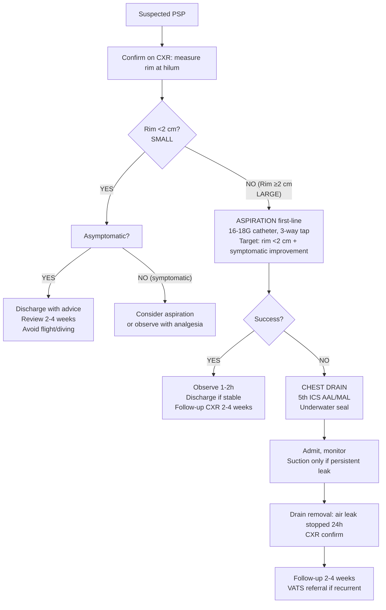

# Primary Spontaneous Pneumothorax (PSP)

Related: [[Pleural air disorders]], [[Pneumothorax]], [[Secondary spontaneous pneumothorax]], [[Tension pneumothorax]], [[Pleural aspiration and chest drain basics]]

> [!important]
> **Primary spontaneous pneumothorax (PSP)** = pneumothorax **without underlying lung disease** in a **tall, thin young male** (typically 15–35 years). Caused by **subpleural bleb rupture**. Key FCPS/MRCP: BTS size classification (rim <2cm vs ≥2cm), management algorithm (observe vs aspirate vs drain), recurrence risk ~30%, VATS referral criteria, differentiation from secondary/tension.

## 1. Learning Objectives
- Define PSP and distinguish from secondary spontaneous and tension pneumothorax
- Apply **BTS size classification** (small vs large by rim measurement) and management algorithm
- Perform **aspiration** (first-line for large PSP) and **chest drain insertion**
- Recognise **tension pneumothorax** as emergency requiring immediate decompression
- Counsel on **recurrence risk** (~30% at 1 year, ~50% at 5 years) and **VATS referral criteria**
- Differentiate from secondary, catamenial, traumatic, iatrogenic pneumothorax

## 2. Definition
**Primary spontaneous pneumothorax (PSP)** = accumulation of air in the pleural space **without clinically apparent underlying lung disease**, occurring **spontaneously** (not traumatic/iatrogenic).

**Typical patient**: Tall, thin male, age **15–35 years**, often smoker.

## 3. Core Anatomy
### 1. Subpleural blebs/bullae
- **Blebs**: air-filled spaces <1 cm in visceral pleura / subpleural region
- **Bullae**: >1 cm
- Located at **lung apices** (mechanical stress highest)
- Rupture → air enters pleural space → pneumothorax

### 2. Pleural space physiology
- Normally negative pressure (-5 cmH2O)
- Air entry → pressure equalises → lung collapses
- **Re-absorption**: pleural capillaries absorb air (~1.25% volume/day); accelerated by high-flow O2 (nitrogen washout → diffusion gradient)

### 3. Surface anatomy for procedures
- **Aspiration/Drain**: **2nd ICS MCL** (traditional) or **4th–5th ICS AAL/MAL** (safe triangle, preferred by BTS)
- **Needle**: 16–18G cannula for aspiration; 10–14F pigtail or 24–28F surgical drain

## 4. Core Physiology
### Gas re-absorption
- Rate: ~**1.25% of hemithorax volume per day** (room air)
- **High-flow O2** (FiO2 1.0) → nitrogen washout from blood → ↑ diffusion gradient → **~4x faster re-absorption** (~4–5%/day)
- **Mechanism**: N2 in pleural air diffuses into capillary blood (low PN2 on O2 therapy)

### Haemodynamic effects
- Small PSP: minimal, compensated
- Large PSP: ↓ venous return, mild hypotension, tachycardia
- **Tension physiology**: one-way valve → progressive +ve pressure → obstructive shock (see [[Tension pneumothorax]])

## 5. Normal Values / Important Cut-offs
### BTS Size Classification (CXR - AP/Supine or PA/Erect)
| Size | Rim of air (at hilum level) | Management |
|------|----------------------------|------------|
| **Small** | **<2 cm** | Observe / consider discharge if asymptomatic |
| **Large** | **≥2 cm** | **Aspiration first-line** (then drain if failed) |

> **Note**: BTS uses **rim at hilum level** (not apex). Light's criteria uses **≥3 cm apex-to-cupola** for "large" — BTS is standard for UK exams.

### Aspiration success criteria
- **Clinical improvement** + **rim <2 cm on repeat CXR** + **no tension features**

### Recurrence rates
- **~30% at 1 year**
- **~50% at 5 years**
- Higher in smokers, tall males, bilateral blebs on CT

## 6. Classification
### By aetiology
1. **Primary spontaneous** (PSP) — no underlying lung disease
2. **Secondary spontaneous** (SSP) — underlying lung disease (COPD, CF, TB, etc.)
3. **Traumatic** — penetrating/blunt
4. **Iatrogenic** — CVC, biopsy, ventilation, CPR
5. **Catamenial** — thoracic endometriosis (right-sided, perimenstrual)
6. **Tension** — haemodynamic compromise (can complicate any type)

### By size (BTS)
- **Small**: rim <2 cm at hilum
- **Large**: rim ≥2 cm at hilum

## 7. Etiology / Causes
### PSP mechanism
1. **Subpleural bleb formation** at apices (congenital/developmental, smoking-related inflammation)
2. **Rupture** → air leak into pleural space
3. **Usually self-seals** within hours-days
4. **Recurrence** if blebs persist or new blebs form

### Risk factors
- **Male sex** (M:F ~ 3:1 to 6:1)
- **Tall, thin habitus** (long apex, mechanical stress)
- **Age 15–35 years** (peak incidence)
- **Smoking** (↑ risk 9-fold in men, 22-fold in women; dose-dependent)
- **Genetic**: Marfan, Ehlers-Danlos, α1-antitrypsin deficiency, Birt-Hogg-Dubé (FLCN gene)
- **Familial** pneumothorax

## 8. Risk Factors (modifiable)
- **Smoking cessation** — single most effective preventive measure
- Avoid scuba diving / high altitude / unpressurised flight until 2 weeks post-resolution + normal CXR

## 9. Pathophysiology
1. **Bleb rupture** at apex (high mechanical stress, low perfusion)
2. **Air enters pleural space** → intrapleural pressure rises toward atmospheric
3. **Lung collapses** proportionally to air volume
4. **Pleural inflammation** → fibrin deposition, adhesions (may limit recurrence)
5. **Re-absorption** via pleural capillaries (nitrogen diffusion gradient)
6. **Leak usually seals** spontaneously (minutes to days)

## 10. Clinical Features
### History
- **Sudden onset** pleuritic chest pain (sharp, ipsilateral)
- **Dyspnoea** (mild to moderate; severe if large/underlying disease)
- **Dry cough** (occasionally)
- Often at rest, not exertion
- **No fever** (unless superinfection)
- **Previous episodes** (recurrence clue)

### Examination
| Finding | Small PSP | Large PSP |
|---------|-----------|-----------|
| **Respiratory rate** | Normal / slightly ↑ | ↑↑ |
| **Heart rate** | Normal / slightly ↑ | ↑↑ |
| **BP** | Normal | Normal / slightly ↓ |
| **Trachea** | Central | Central (deviation = TENSION) |
| **JVP** | Normal | Normal (distended = TENSION) |
| **Chest expansion** | Reduced ipsilateral | Markedly reduced ipsilateral |
| **Percussion** | Hyperresonant ipsilateral | Hyperresonant ipsilateral |
| **Breath sounds** | Reduced ipsilateral | Absent/very reduced ipsilateral |
| **Vocal fremitus** | Reduced | Reduced/absent |

> **FCPS/MRCP tip**: **Tracheal deviation and JVP distension = TENSION pneumothorax**, not simple PSP.

## 11. Approach / Management Algorithm (BTS 2023)

## 12. Investigations
### Essential
- **CXR (PA erect preferred)**: measure **rim at hilum level**, check for tension signs, underlying pathology
- **Supine/AP CXR** (if unable to stand): air collects anteriorly → **deep costophrenic angle**, **lucent hemithorax**, **visible pleural line**

### Optional / Selected
- **CT thorax**: if diagnostic uncertainty, planned surgery, suspected underlying disease, bilateral, recurrent
  - Shows **blebs/bullae** at apices
  - Guides **VATS planning** (apical pleurectomy + bullectomy)
- **ABG**: if hypoxic or severe dyspnoea (usually mild hypoxaemia)
- **Spirometry**: after resolution (baseline, rule out occult COPD)

## 13. Interpretation Frameworks
### 1. BTS Size Measurement
**On PA erect CXR**: Measure **horizontal distance from lung edge to inner chest wall at level of hilum**.
- **<2 cm** = Small
- **≥2 cm** = Large

**On supine/AP CXR**: Air anterior → look for **deep sulcus sign** (deep costophrenic angle), **lucent upper quadrant**, **visible pleural line**.

### 2. Aspiration success
**Success = ALL of**:
- Patient comfortable, RR/HR normalising
- **Repeat CXR: rim <2 cm**
- No tension features

**Failure = any of**:
- Persistent rim ≥2 cm
- Ongoing symptoms
- Tension features develop

### 3. Recurrence risk stratification
| Factor | Recurrence Risk |
|--------|----------------|
| First PSP, non-smoker | ~20-30% |
| Smoker | ~40-50% |
| Bilateral blebs on CT | ↑↑ |
| Previous recurrence | ~50% per episode |

## 14. Diagnosis
**Clinical + Radiological**:
1. Typical patient: young, tall, thin male, sudden pleuritic pain + dyspnoea
2. **CXR**: visible pleural line, no lung vessels beyond, rim measurement
3. **No underlying lung disease** on history, exam, imaging
4. **Exclude tension** (haemodynamic compromise)

## 15. Differential Diagnosis
| Differential | Clues Against PSP |
|--------------|-------------------|
| **Secondary spontaneous (SSP)** | Known lung disease (COPD, CF, TB, malignancy, PJP), older, sicker |
| **Tension pneumothorax** | **Hypotension, JVP distended, tracheal deviation, shock** |
| **Traumatic pneumothorax** | History of trauma (blunt/penetrating), rib fractures |
| **Iatrogenic pneumothorax** | Recent CVC, biopsy, ventilation, CPR |
| **Pulmonary embolism** | Pleuritic pain, but **no pleural line on CXR**, risk factors, CTPA |
| **Pericarditis** | Positional pain, friction rub, ECG changes (ST elevation), no pneumothorax on CXR |

*[Content truncated for rendering — see primary-spontaneous-pneumothorax.md for full content]*
