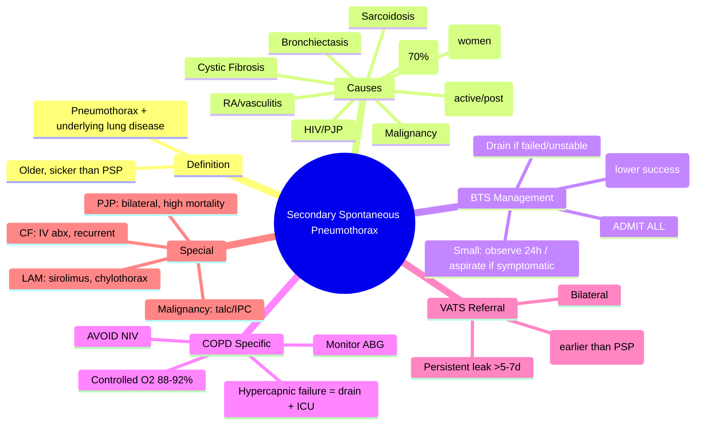
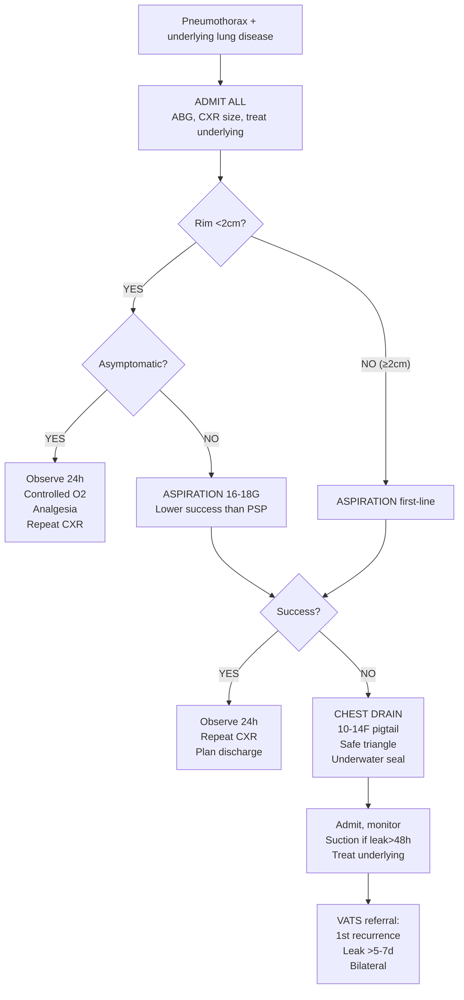

# Secondary Spontaneous Pneumothorax (SSP)

Related: [[Pleural air disorders]], [[Pneumothorax]], [[Primary spontaneous pneumothorax]], [[Tension pneumothorax]], [[Pleural aspiration and chest drain basics]], [[COPD]], [[Cystic fibrosis]], [[Tuberculosis]], [[HIV]], [[Lymphangioleiomyomatosis]]

> [!important]
> **Secondary spontaneous pneumothorax (SSP)** = pneumothorax **complicating known underlying lung disease**. Older, sicker patients than PSP. **Higher morbidity/mortality**. **BTS: ALL SSP admitting for observation**; size-based management similar but lower threshold for intervention. **Key FCPS/MRCP**: underlying causes (COPD #1), BTS management (admit all, lower aspiration threshold), higher recurrence, tension risk, mortality ~5-10%.

## Learning Objectives
- Define SSP and list major underlying causes
- Apply **BTS management algorithm** for SSP (admit all, size-guided intervention)
- Recognise **higher tension risk** and **mortality** vs PSP
- Manage **COPD pneumothorax** specifically (hypercapnia risk, NIV caution)
- Apply **VATS referral criteria** (earlier than PSP)
- Differentiate from PSP, tension, traumatic, iatrogenic

## Definition
**Secondary spontaneous pneumothorax (SSP)** = spontaneous pneumothorax occurring in a patient with **clinically apparent underlying lung disease**.

**Contrast with PSP**: older age, more comorbid, more symptomatic, higher tension risk, higher mortality, longer hospital stay.

## Core Anatomy
### Underlying pathology by disease
| Disease | Mechanism |
|---------|-----------|
| **COPD / Emphysema** | Bullae rupture (destruction of alveolar walls, loss of elastic recoil) |
| **Cystic Fibrosis** | Thick mucus obstruction → distal air trapping → cyst/bulla formation |
| **Tuberculosis** | Cavitation, bronchiectasis, pleural adhesions tear |
| **HIV / PJP** | Thin-walled cysts (PJP), necrotising infections |
| **LAM** | Cystic destruction along lymphatics (women, childbearing age) |
| **Malignancy** | Necrotic cavitating mets, bronchial obstruction |
| **Bronchiectasis** | Cystic dilation, infection weakening walls |
| **Sarcoidosis** | Fibrocystic change, bronchial distortion |
| **Connective tissue disease** | Necrobiotic nodules (rheumatoid), pleural disease |

## Core Physiology
### Why SSP worse than PSP
1. **Reduced respiratory reserve** — underlying disease limits compensation
2. **Hypercapnia risk** — especially COPD (cannot hyperventilate to blow off CO2)
3. **Poorer gas exchange** — larger shunt fraction, worse V/Q mismatch
4. **Tension physiology develops faster** — less compliant lung, higher airway pressures
5. **Air leak often larger/persistent** — diseased lung doesn't seal well
6. **Re-absorption slower** — less effective pleural capillary function

### Gas re-absorption
- Same nitrogen washout principle with high-flow O2
- **BUT caution in COPD**: high FiO2 may worsen hypercapnia (Haldane effect, loss of hypoxic drive)
- **Target SpO2 88–92%** in COPD SSP (controlled O2)

## Normal Values / Important Cut-offs
### BTS Size Classification (same as PSP)
| Size | Rim at hilum | Management |
|------|--------------|------------|
| **Small** | **<2 cm** | Admit, observe, consider aspiration if symptomatic |
| **Large** | **≥2 cm** | Admit, **aspiration first-line** (lower success rate than PSP), drain if failed |

### Key differences from PSP
| Parameter | PSP | SSP |
|-----------|-----|-----|
| **Admission** | Small asymp: discharge | **ALL admitted** |
| **Aspiration success** | ~50-60% | **~30-40%** (lower) |
| **Recurrence** | ~30% at 1yr | **~40-50%** |
| **Mortality** | <1% | **~5-10%** (age/comorbidity) |
| **Tension risk** | Low | **Higher** |
| **VATS referral** | 2nd ipsilateral | **1st recurrence often** |

## Classification
### By underlying disease (major causes)
| Disease | Prevalence in SSP | Key Features |
|---------|------------------|--------------|
| **COPD / Emphysema** | **~70%** | Older smokers, bullae, hypercapnia risk |
| **Cystic Fibrosis** | ~5% | Young adults, recurrent, cystic destruction |
| **Tuberculosis** | Variable | Cavitation, post-TB sequelae |
| **HIV / PJP** | High in HIV+ | Bilateral cysts, thin-walled |
| **LAM** | Rare | Women 20-40, cystic, chylothorax association |
| **Malignancy** | Variable | Necrotic mets, primary lung cancer |
| **Other** | | Bronchiectasis, sarcoidosis, RA nodules, endometriosis |

### By size (BTS)
- **Small**: rim <2 cm at hilum
- **Large**: rim ≥2 cm at hilum

## Etiology / Causes
### 1. COPD (most common, ~70% of SSP)
- **Bullous emphysema** — large bullae rupture
- **Risk factors**: severe airflow obstruction (FEV1 <1L), smoking, bullae on CT
- **Complications**: hypercapnic respiratory failure, higher mortality

### 2. Cystic Fibrosis
- **Mechanism**: mucus plugging → air trapping → cystic change → rupture
- **High recurrence** (~50-70%)
- **Infection risk** (Pseudomonas, Burkholderia)

### 3. Tuberculosis
- **Active TB**: cavitation + bronchopleural fistula
- **Post-TB sequelae**: bronchiectasis, fibrosis, apical scarring
- **High recurrence** if cavitation persists

### 4. HIV / Pneumocystis jirovecii pneumonia (PJP)
- **PJP**: diffuse thin-walled cysts → high spontaneous pneumothorax rate (~5-10% of PJP)
- **Bilateral** common
- **Thin walls** → tension risk high
- **Mortality high** if pneumothorax complicates PJP

### 5. Lymphangioleiomyomatosis (LAM)
- **Women, childbearing age** (20-40)
- **Diffuse thin-walled cysts** throughout lungs
- **Recurrent pneumothorax** (very high, ~70-80%)
- **Chylothorax** association
- **Renal angiomyolipomas**, TSC association

### 6. Malignancy
- **Necrotic cavitating metastases** (sarcoma, squamous mets)
- **Primary lung cancer** (cavitation, bronchial obstruction)
- **Lymphoma**
- Often **recurrent**, large air leaks

### 7. Other
- **Bronchiectasis** (CF and non-CF)
- **Sarcoidosis** (stage IV fibrocystic)
- **Rheumatoid arthritis** (necrobiotic nodules)
- **Granulomatosis with polyangiitis** (cavitation)
- **Endometriosis** (catamenial — usually right-sided)

## Risk Factors
- **Severe underlying lung disease** (FEV1 <1L in COPD)
- **Large bullae/cysts** on CT
- **Active infection** (TB, PJP, CF exacerbation)
- **Positive pressure ventilation** (NIV, BiPAP, invasive)
- **Smoking continuation** in COPD
- **Female sex** for LAM/catamenial

## Pathophysiology
1. **Underlying structural lung disease** → weakened pleural surface / bullae / cysts
2. **Trigger** (cough, infection, pressure change, spontaneous) → rupture
3. **Air leak** into pleural space
4. **Impaired sealing** (diseased lung, inflammation, infection)
5. **Larger, more persistent leak** than PSP
6. **Worse physiological impact** due to reduced reserve
7. **Slower re-absorption** (impaired pleural capillary function)

## Clinical Features
### History
- Known lung disease (COPD, CF, TB, HIV, LAM, malignancy)
- **Sudden worsening** dyspnoea + pleuritic pain
- **More severe** than PSP at same size
- **Fever** if infective trigger (TB, CF, PJP)
- **Haemoptysis** if TB, malignancy, vasculitis
- **Previous pneumothorax** (recurrence common)

### Examination
| Feature | SSP (vs PSP) |
|---------|--------------|
| **Age** | Older (mostly >50, except CF/LAM/HIV) |
| **Distress** | More marked |
| **Hypercapnia** | Common (COPD) — flap, drowsiness |
| **Tachypnoea** | More severe |
| **Tachycardia** | Marked |
| **Hypoxaemia** | More severe, less responsive to O2 |
| **Tracheal deviation** | Earlier tension sign |
| **Subcutaneous emphysema** | More common (bronchopleural fistula) |

### COPD-specific
- **Hypercapnic respiratory failure** — drowsiness, flap, ↑PaCO2
- **Caution with high-flow O2** — target SpO2 88–92%
- **NIV may worsen pneumothorax** (positive pressure → air leak)

## Approach / Management Algorithm (BTS for SSP)
```mermaid
flowchart TD
    A[SSP diagnosed: underlying lung disease + pneumothorax] --> B[ADMIT ALL\nAssess severity, ABG, CXR size]
    B --> C{Rim <2cm?\nSMALL}
    C -- YES --> D[Asymptomatic?]
    D -- YES --> E[Observe 24h\nHigh-flow O2 (caution COPD)\nAnalgesia\nRepeat CXR]
    D -- NO (symptomatic) --> F[ASPIRATION\n16-18G\nLower success than PSP]
    C -- NO (Rim ≥2cm\nLARGE) --> G[ASPIRATION first-line\n16-18G, up to 2.5L]
    G --> H{Success?}
    H -- YES --> I[Obmit 24h\nRepeat CXR\nIf stable → plan discharge]
    H -- NO --> J[CHEST DRAIN\n10-14F pigtail\n5th ICS safe triangle\nUnderwater seal]
    F --> H
    J --> K[Admit, monitor\nSuction if leak>48h\nTreat underlying disease]
    K --> L[VATS referral: earlier than PSP\n1st recurrence often]
```

## Investigations
### Essential
- **CXR (PA erect)**: size measurement, underlying changes (bullae, cysts, cavities)
- **ABG**: **critical in COPD** — assess hypercapnia, hypoxaemia, acidosis
- **SpO2 monitoring**: continuous if COPD/hypercapnia risk

### For underlying cause
- **CT thorax**: if diagnostic uncertainty, planned surgery, assess bullae/cysts/cavities
- **Sputum**: culture (TB, CF pathogens, PJP PCR), cytology (malignancy)
- **HIV test**: if unknown status + PJP/LAM suspicion
- **Serum VEGF-D**: for LAM diagnosis
- **ACE level**: sarcoidosis

## Interpretation Frameworks
### 1. BTS Size Measurement (same as PSP)
- **Rim at hilum** on PA erect CXR
- **<2 cm** = Small
- **≥2 cm** = Large
- **Supine/AP**: deep sulcus sign, lucent hemithorax, visible pleural line

### 2. Aspiration Success (lower threshold than PSP)
- **Success**: Rim <2 cm + symptomatic improvement + stable ABG
- **Failure**: Any persistent rim ≥2 cm, ongoing symptoms, ABG deterioration
- **Success rate**: ~30-40% (vs 50-60% PSP) — lower threshold for drain

### 3. COPD + Pneumothorax ABG Interpretation
| ABG Pattern | Action |
|-------------|--------|
| pH ≥7.35, PaCO2 normal/slightly ↑ | Standard management |
| **pH <7.35, PaCO2 ↑↑** | **Hypercapnic respiratory failure** — **NIV caution** (may worsen leak), consider urgent drain, controlled O2 |
| **pH <7.25, PaCO2 ↑↑↑** | **Severe** — ICU, urgent drain, controlled O2, consider intubation if drain fails |

> **FCPS/MRCP tip**: In COPD SSP, **NIV is relatively contraindicated** (positive pressure ↑ air leak). Use controlled O2, urgent drain, consider intubation if failing.

## Diagnosis
**Clinical + Radiological + Underlying Disease**:
1. Known lung disease OR new diagnosis on imaging
2. CXR: pneumothorax + underlying changes
3. Clinical context: sudden worsening dyspnoea/pain
4. Exclude tension, trauma, iatrogenic

## Differential Diagnosis
| Differential | Clues Against SSP |
|--------------|-------------------|
| **PSP** | Young, tall, thin, no lung disease, no underlying CXR changes |
| **Tension pneumothorax** | **Hypotension, JVP ↑, tracheal deviation, shock** — decompress immediately |
| **Traumatic** | History of trauma, rib fractures |
| **Iatrogenic** | Recent CVC, biopsy, ventilation |
| **Bronchopleural fistula** | Persistent large air leak, often post-surgery/infection |
| **Pneumomediastinum** | Air around heart/vessels, Hamman's crunch, no pneumothorax (or coexisting) |

## Management
### General Principles (BTS)
- **ADMIT ALL SSP** (unlike PSP)
- **Size-guided** but lower intervention threshold
- **Treat underlying disease** simultaneously
- **Controlled O2 in COPD** (SpO2 88–92%)
- **Avoid NIV** if active air leak (positive pressure worsens leak)
- **Earlier VATS referral** than PSP

### Small SSP (<2 cm rim)
**Asymptomatic**:
- Admit for **24h observation**
- **Controlled O2** (target SpO2 88–92% if COPD; 94–98% otherwise)
- **Analgesia** (NSAIDs, avoid opioids)
- **Repeat CXR at 24h** — if stable, plan discharge with follow-up

**Symptomatic** (dyspnoea, pain, hypercapnia):
- **Aspiration** (16–18G, same technique as PSP)
- Lower success rate expected
- If failed → chest drain

### Large SSP (≥2 cm rim)
- **Aspiration first-line** (16–18G, up to 2.5L)
- **Success rate ~30-40%** (lower than PSP)
- **If failed or patient unstable** → **chest drain immediately**
- **COPD**: aspirate with caution (monitor ABG), low threshold for drain

### Chest Drain (SSP)
- **Indication**: Failed aspiration, large symptomatic, tension (after needle), bilateral, hypercapnic respiratory failure
- **Tube**: **10–14F pigtail** (Seldinger) preferred; surgical 24–28F if large leak/thick fluid expected (empyema, haemothorax)
- **Site**: **5th ICS safe triangle**
- **Connection**: Underwater seal (no suction initially)
- **Suction**: If persistent leak >48h or incomplete re-expansion (-10 to -20 cmH2O)
- **Duration**: Until air leak stopped 24h + CXR re-expanded

### COPD-Specific Management
1. **Target SpO2 88–92%** (controlled O2) — avoid high FiO2
2. **Monitor ABG** serially (2–4h initially)
3. **NIV**: **AVOID** if active pneumothorax (positive pressure ↑ leak). If hypercapnic failure → urgent drain + controlled O2, consider intubation
4. **Bronchodilators**: continue (nebulised if needed)
5. **Steroids**: continue if on maintenance
6. **Antibiotics**: if infective trigger suspected

### HIV / PJP-Specific
- **High-flow O2** (not COPD) — accelerates re-absorption
- **PJP treatment** (co-trimoxazole) urgent
- **Bilateral** common — may need bilateral drains
- **High tension risk** — low threshold for drain
- **Mortality high** — ICU involvement early

### CF-Specific
- **IV antibiotics** for exacerbation pathogens (Pseudomonas, Burkholderia)
- **Airway clearance** (physiotherapy — gentle, avoid high pressure)
- **High recurrence** — early VATS discussion
- **Nutrition, enzymes** — continue

### LAM-Specific
- **Recurrent** — often bilateral
- **Hormonal** (OCP, GnRH) — limited evidence
- **Sirolimus (mTOR inhibitor)** — stabilises lung function, reduces pneumothorax risk
- **VATS + pleurodesis** early (chemical/talc at time of surgery)
- **Screen for TSC** (renal angiomyolipomas, seizures, skin lesions)

### Malignancy-Specific
- **Talc pleurodesis via drain** (if expandable lung) or **VATS talc poudrage**
- **Indwelling pleural catheter (IPC)** if trapped lung / not expandable / palliative
- **Oncology referral** for systemic therapy

## Drug Interactions / Contraindications / Cautions
### Oxygen in COPD
- **Target SpO2 88–92%** (NOT 94–98%)
- High FiO2 → loss of hypoxic drive + Haldane effect → ↑PaCO2

### NIV in SSP
- **Relatively contraindicated** with active air leak
- Positive pressure → ↑ leak → tension risk
- If hypercapnic failure: **drain first**, then reassess

### Analgesia
- **NSAIDs** first-line
- **Opioids**: avoid if possible (respiratory depression, hypercapnia risk in COPD)
- **Intercostal nerve block** for drain insertion (reduces opioid need)

### Anticoagulation
- Correct if possible before drain
- **Do not delay** life-saving drain for tension

## Procedures / Indications / Contraindications
### Aspiration (SSP)
**Indication**: Small symptomatic, Large (first-line)
**Lower success rate** than PSP — be prepared for drain
**Contraindication**: Tension (needle decompression → drain), unstable, coagulopathy (relative)

### Chest Drain
**Indication**: Failed aspiration, large unstable, tension, hypercapnic failure, bilateral
**Tube choice**:
- **Air leak only**: 10–14F pigtail
- **Air + fluid (empyema, haemothorax)**: 24–28F surgical
- **Malignancy / pleurodesis planned**: 10–14F pigtail (talc via pigtail possible)

### VATS Surgery
**Indication** (earlier than PSP):
- **1st recurrence** (vs 2nd in PSP)
- **Persistent air leak >5–7 days**
- **Bilateral SSP**
- **Failed conservative management**
- **Occupational requirement**
- **Procedure**: Apical pleurectomy + bullectomy/cystectomy ± **talc pleurodesis** (poudrage)

### Talc Pleurodesis (via drain or VATS)
- **Indication**: Recurrent SSP, malignancy, expandable lung
- **Agent**: **Talc slurry** (4g in 50mL saline via drain) or **talc poudrage** (VATS)
- **Contraindication**: Trapped lung (no re-expansion), active infection, respiratory failure
- **Complication**: Pain, fever, ARDS (rare, <1% with calibrated talc)

## Procedure Mini-Sections
### Aspiration in COPD (caution)
1. Same technique as PSP (16–18G, 2nd ICS MCL or 5th ICS AAL)
2. **Monitor SpO2, RR, consciousness** during/after
3. **ABG at 30 min and 2h** post-aspiration
4. **Stop if** worsening hypercapnia (drowsiness, ↑RR, flap)
4. Low threshold for drain

### Chest Drain in Hypercapnic COPD
1. **Pre-oxygenate** with controlled O2 (target 88–92%)
2. **Avoid sedation** or minimal (midazolam 0.5–1mg if needed)
3. **Rapid insertion** (Seldinger pigtail fastest)
4. **Connect to underwater seal immediately**
5. **ABG at 30 min, 2h, 6h**
6. **NIV only AFTER drain inserted and leak controlled**

## Complications
### Higher in SSP vs PSP
- **Tension pneumothorax** (more common, develops faster)
- **Hypercapnic respiratory failure** (COPD)
- **Persistent air leak** (weeks-months in CF/LAM/malignancy)
- **Empyema** (especially CF, post-TB, malignancy)
- **Re-expansion pulmonary oedema** (chronic collapse)
- **Mortality** ~5-10% (age, comorbidity, COPD severity)

### COPD-specific
- Hypercapnic respiratory failure requiring intubation
- Cardiovascular instability (cor pulmonale decompensation)
- Prolonged ventilation if intubated

## Red Flags / Emergencies
- **Tension signs**: hypotension, JVP ↑, tracheal deviation → **immediate needle decompression**
- **COPD + drowsiness/flap/↑PaCO2**: **hypercapnic failure** → urgent drain + controlled O2, ICU
- **Bilateral SSP**: life-threatening — bilateral drains, ICU
- **Massive air leak** (drain bubbling continuously, no re-expansion): surgical review
- **Haemopneumothorax** with >1L blood or >200mL/h: surgical

## Special Situations
### SSP in Pregnancy
- Same principles, fetal monitoring
- Controlled O2 in COPD
- VATS in 2nd trimester if needed
- Avoid radiation (shielded CXR, ultrasound)

### SSP during NIV/BiPAP
- **Stop NIV** immediately if pneumothorax suspected
- **Urgent CXR**
- **Needle decompress if tension** → drain
- **Restart NIV only after drain + no leak**

### SSP post-lung transplant
- High suspicion for anastomotic dehiscence
- Urgent surgical review
- Bronchoscopy to assess anastomosis

### Catamenial (Thoracic Endometriosis)
- **Right-sided**, perimenstrual (±72h menses)
- **Recurrent** SSP in women 20-40
- **Diaphragmatic deposits** visible at VATS
- **Hormonal** (OCP continuous, GnRH agonist) + **VATS** (excision + pleurectomy + talc)

## Prognosis
- **Mortality**: ~5-10% overall (higher in COPD >70yr, HIV/PJP, malignancy)
- **Recurrence**: ~40-50% at 1 year (higher than PSP)
- **Persistent leak**: common in CF, LAM, malignancy
- **VATS success**: >90% prevention, but underlying disease limits long-term survival in some
- **Quality of life**: limited by underlying disease

## Topic Correlation
- [[Pleural air disorders]] — classification
- [[Pneumothorax]] — overview
- [[Primary spontaneous pneumothorax]] — comparison
- [[Tension pneumothorax]] — emergency
- [[Pleural aspiration and chest drain basics]] — procedures
- [[COPD]] — most common cause
- [[Cystic fibrosis]], [[Tuberculosis]], [[HIV]], [[Lymphangioleiomyomatosis]] — specific causes

## FCPS/MRCP High-Yield Points
1. **SSP** = pneumothorax + underlying lung disease (COPD #1 cause)
2. **ADMIT ALL SSP** (unlike PSP)
3. **BTS size**: same (<2cm small, ≥2cm large at hilum)
4. **Aspiration success lower** (~30-40% vs 50-60% PSP)
5. **COPD SSP**: controlled O2 (88–92%), **AVOID NIV** (worsens leak), monitor ABG
6. **VATS referral earlier**: 1st recurrence (vs 2nd for PSP)
6. **Mortality ~5-10%** (age, comorbidity, COPD severity)
7. **HIV/PJP**: bilateral, high tension risk, high mortality
8. **LAM**: women 20-40, recurrent, sirolimus, chylothorax link
9. **CF**: recurrent, IV antibiotics, early VATS
10. **Malignancy**: talc pleurodesis or IPC

## Common Viva Questions
1. Differences between PSP and SSP management
2. COPD pneumothorax specific management (O2, NIV, ABG)
3. SSP underlying causes and their features
4. VATS referral criteria for SSP vs PSP
5. LAM / Catamenial / HIV-PJP specific features
6. Talc pleurodesis vs IPC in malignant pneumothorax

## Common Confusions / Exam Traps
- **Not admitting SSP** — all SSP admitted
- **Giving high-flow O2 to COPD SSP** — target 88–92%
- **Using NIV for COPD SSP with hypercapnia** — worsens air leak
- **Aspiration success rate same as PSP** — lower in SSP
- **VATS referral same as PSP** — earlier for SSP (1st recurrence)
- **Missing underlying cause** — always look for COPD, CF, TB, HIV, LAM, malignancy

## Mnemonics
- **SSP CAUSES**: **S**econdary **S**pontaneous **P**neumothorax — **C**OPD (70%), **A**sthma (rare), **U**C (no), **S**arcoid, **E**ndometriosis, **C**F, **A**BD HIV/PJP, **U**nknown malignancy, **S**LE/RA, **L**AM, **E**ndometriosis
- **SSP MANAGE**: **S**SP = **A**dmit **A**ll, **S**ize guide, **P**oor aspiration, **I**ntervene early, **R**ecurrence high, **M**ortality 5-10%, **A**void NIV in COPD, **N**ear VATS early, **A**ge/comorbidity, **G**O for drain, **E**xclude tension
- **COPD SSP**: **C**ontrolled O2 88-92%, **O**bserve ABG, **P**lease no NIV, **D**rain early, **E**xclude tension

## Mind Map


## Flowchart


## Suggested Visuals / Image Notes
- CXR: SSP with underlying bullae/cysts/cavities
- CT: LAM cysts, CF bronchiectasis, TB cavities
- Algorithm comparison: PSP vs SSP management
- COPD SSP: ABG monitoring, controlled O2
- VATS for recurrent SSP

## Suggested Video References
- BTS guideline: SSP algorithm
- COPD pneumothorax management (ABG, O2, NIV avoidance)
- LAM pneumothorax + sirolimus
- PJP pneumothorax in HIV
- VATS for recurrent SSP

## One-Page Revision Summary
- **SSP** = pneumothorax + underlying lung disease (COPD 70%)
- **ADMIT ALL** (vs PSP discharge small asymp)
- **BTS size**: same (<2cm small, ≥2cm large at hilum)
- **Aspiration success lower** (~30-40%)
- **COPD**: controlled O2 88-92%, AVOID NIV, ABG monitoring
- **Drain**: 10-14F pigtail, safe triangle, underwater seal
- **Mortality ~5-10%** (age, comorbidity)
- **Recurrence ~40-50%** (higher than PSP)
- **VATS referral**: 1st recurrence, leak >5-7d, bilateral (earlier than PSP)
- **Special**: LAM (women, sirolimus), PJP (bilateral, high mortality), CF (recurrent), Malignancy (talc/IPC)

## 24-Hour Recall Prompts
- SSP definition and #1 cause
- Key management difference: PSP vs SSP
- COPD SSP: O2 target, NIV status, ABG
- Aspiration success rate SSP vs PSP
- VATS referral criteria SSP

## 7-Day / 15-Day / 30-Day Revision Tracker
- [ ] Day 1 completed
- [ ] 24-hour recall completed
- [ ] Day 7 revision completed
- [ ] Day 15 revision completed
- [ ] Day 30 revision completed

## Must Know / Should Know / Nice to Know
### Must Know
- SSP definition and major causes (COPD #1)
- ADMIT ALL SSP
- BTS size classification (same as PSP)
- Aspiration first-line large SSP (lower success)
- COPD: controlled O2 88-92%, AVOID NIV, ABG monitoring
- Chest drain: small-bore, safe triangle
- VATS referral earlier (1st recurrence)
- Mortality ~5-10%

### Should Know
- LAM: women, sirolimus, chylothorax
- PJP: bilateral, high tension risk, high mortality
- CF: recurrent, IV abx, early VATS
- Malignancy: talc pleurodesis vs IPC
- Catamenial: right-sided, perimenstrual, VATS + hormonal

### Nice to Know
- Genetic causes (Birt-Hogg-Dubé, FLCN, TSC)
- VEGF-D for LAM diagnosis
- Calibrated talc vs mixed talc ARDS risk
- IPC vs talc for malignant pneumothorax RCT data
- Long-term outcomes by underlying disease

## Self-Test Scorecard
- Understanding: /10
- Recall: /10
- MCQ Performance: /10
- SBA Performance: /10
- Viva Confidence: /10
- Total: /50

> [!tip]
> Interpretation: <35 = weak topic, 35-44 = acceptable but insecure, 45+ = strong exam-ready topic.

## Exam Answer Modes
### Long Answer Skeleton
- Definition, causes table (COPD 70%, CF, TB, HIV/PJP, LAM, malignancy)
- PSP vs SSP comparison table (age, admission, aspiration success, recurrence, mortality, VATS timing)
- BTS SSP algorithm (admit all, size-guided, aspiration, drain)
- COPD-specific management (O2, NIV avoidance, ABG, hypercapnic failure pathway)
- Disease-specific nuances (LAM, PJP, CF, malignancy)
- Complications, red flags, prognosis

### Short Note Skeleton
- Definition + causes box
- PSP vs SSP comparison table
- SSP algorithm flowchart
- COPD specific box
- VATS referral box

### Viva One-Liners
- "SSP = pneumothorax + underlying lung disease; COPD 70%"
- "KEY DIFFERENCE: ALL SSP admitted; PSP small asymp discharged"
- "Aspiration first-line large SSP but success ONLY 30-40% (vs 50-60% PSP)"
- "COPD SSP: Target SpO2 88-92% (controlled O2); AVOID NIV (worsens leak); serial ABG"
- "Hypercapnic failure in COPD SSP → urgent drain + controlled O2 + ICU; NIV contraindicated"
- "VATS referral: SSP = 1st recurrence (PSP = 2nd); also leak >5-7d, bilateral"
- "Mortality SSP ~5-10% (PSP <1%)"
- "LAM: women 20-40, diffuse cysts, recurrent, sirolimus, chylothorax link"
- "PJP: bilateral cysts, high tension risk, high mortality, co-trimoxazole urgent"
- "Malignancy: talc pleurodesis if expandable; IPC if trapped lung/palliative"

### Ward-Case Discussion Points
- 68M COPD FEV1 0.8L, sudden dyspnoea, CXR large R pneumothorax, ABG pH 7.30 PaCO2 7.5 kPa → COPD SSP → controlled O2 88-92%, ABG monitoring, aspiration cautious → if fails/ABG worsens → drain + ICU, NO NIV
- 25F HIV+ CD4 80, PJP prophylaxis missed, bilateral pneumothoraces, hypoxic → HIV/PJP → bilateral drains, co-trimoxazole IV, high-flow O2, ICU
- 60M post-lobectomy day 10, persistent air leak, drain bubbling → bronchial stump leak → surgical review, VATS if >5-7d

### Last-Night-Before-Exam Sheet
- SSP = PTX + lung disease (COPD 70%)
- ADMIT ALL
- BTS: <2cm small, ≥2cm large (hilum)
- Aspiration 1st large (success 30-40%)
- COPD: O2 88-92%, NO NIV, ABG
- Drain: 10-14F pigtail, safe triangle
- VATS: 1st recurrence (PSP 2nd)
- Mortality 5-10%
- LAM: women, sirolimus
- PJP: bilateral, co-trimoxazole
- Malignancy: talc/IPC

## Summary
**Secondary spontaneous pneumothorax (SSP)** = pneumothorax complicating **underlying lung disease** (COPD ~70%, CF, TB, HIV/PJP, LAM, malignancy). **Key differences from PSP**: older/sicker, **ALL admitted**, aspiration success lower (~30-40%), recurrence higher (~40-50%), mortality ~5-10%. **BTS size same** (<2cm small, ≥2cm large at hilum). **Management**: admit all; small observe 24h/aspirate if symptomatic; large aspirate first (lower threshold for drain). **COPD SSP**: **controlled O2 (SpO2 88-92%), AVOID NIV, serial ABG**; hypercapnic failure → urgent drain + ICU. **VATS referral earlier**: 1st recurrence, leak >5-7d, bilateral. **Special**: LAM (women, sirolimus), PJP (bilateral, high mortality), CF (recurrent), malignancy (talc/IPC).

## MCQs (10)
1. **Most common cause** of secondary spontaneous pneumothorax:
   A. Cystic fibrosis
   B. Tuberculosis
   C. **COPD / Emphysema**
   D. Malignancy

2. **Key management difference**: PSP vs SSP — SSP patients:
   A. Can be discharged if small and asymptomatic
   B. **Are ALL admitted**
   C. Have higher aspiration success rates
   D. Have lower recurrence rates

3. **Aspiration success rate** in SSP (BTS):
   A. 60-70%
   B. 50-60%
   C. **30-40%**
   D. 10-20%

4. **COPD SSP** oxygen target:
   A. 94-98%
   B. **88-92%**
   C. 90-94%
   D. 92-96%

5. **NIV in COPD with active pneumothorax**:
   A. First-line for hypercapnia
   B. **Relatively contraindicated (worsens air leak)**
   C. Safe if low pressures
   D. Only contraindicated if tension

6. **VATS referral for SSP** (vs PSP):
   A. 2nd ipsilateral recurrence (same as PSP)
   B. **1st ipsilateral recurrence (earlier)**
   C. Only if bilateral
   D. Only if persistent leak >14 days

7. **Mortality** of SSP (overall):
   A. <1%
   B. 1-2%
   C. **~5-10%**
   D. >20%

8. **Lymphangioleiomyomatosis (LAM)** — typical patient:
   A. Older male smoker
   B. **Women 20-40, childbearing age**
   C. Children with CF
   D. HIV+ males

9. **PJP pneumothorax** characteristic:
   A. Unilateral, large bullae
   B. **Bilateral, thin-walled cysts, high tension risk**
   C. Associated with chylothorax
   D. Only in non-HIV immunocompromised

10. **Malignant pneumothorax** with expandable lung — preferred pleurodesis:
    A. IPC only
    B. **Talc pleurodesis (slurry via drain or poudrage VATS)**
    C. Doxycycline
    D. Autologous blood patch

## SBA Questions (10)
1. A 72M COPD (FEV1 0.9L) presents with sudden dyspnoea. CXR: R pneumothorax rim 3cm. ABG: pH 7.34, PaCO2 7.2 kPa, PaO2 8 kPa on air. Best initial management?
   A. High-flow O2 15L, aspiration
   B. **Controlled O2 88-92%, aspiration with ABG monitoring**
   C. NIV BiPAP, then aspiration
   D. Chest drain immediately

2. Same patient, 2h post-aspiration: drowsy, RR 28, SpO2 85% on controlled O2. ABG: pH 7.22, PaCO2 10.5 kPa. Next step?
   A. Start NIV
   B. **Urgent chest drain + controlled O2 + ICU referral**
   C. Increase O2 to 94-98%
   D. Intubate immediately

3. A 28F with LAM presents with 3rd R pneumothorax in 2 years. CT: diffuse cysts. Best long-term management?
   A. Repeat aspiration
   B. **VATS pleurectomy + talc poudrage + sirolimus**
   C. IPC insertion
   D. Hormonal therapy only

4. A 35M HIV+ (CD4 50) on no ART presents with dyspnoea. CXR: bilateral pneumothoraces, diffuse cysts. Most likely cause?
   A. COPD
   B. **PJP (Pneumocystis jirovecii)**
   C. TB
   D. Malignancy

5. SSP vs PSP — which statement is CORRECT?
   A. SSP has lower recurrence rate
   B. SSP has higher aspiration success
   C. **SSP: all admitted; PSP small asymp discharged**
   D. SSP VATS referral at 2nd recurrence (same as PSP)

6. Chest drain for SSP with persistent air leak day 7. Lung expanded. Best next step?
   A. Increase suction to -30 cmH2O
   B. **Talc pleurodesis via drain (4g slurry)**
   C. Second drain
   D. Observe another week

7. Catamenial pneumothorax — characteristic:
   A. Left-sided, ovulation
   B. **Right-sided, perimenstrual (±72h menses)**
   C. Bilateral, random
   D. Left-sided, post-menopausal

8. 60M known squamous lung cancer, trapped lung (no re-expansion after drain), symptomatic pneumothorax. Best palliative option?
   A. Talc pleurodesis via drain
   B. **Indwelling pleural catheter (IPC)**
   C. VATS talc poudrage
   D. Repeated aspiration

9. CF patient, 2nd pneumothorax this year, persistent leak day 10. Management?
   A. Continue drain, wait
   B. **VATS (early referral for recurrent CF pneumothorax)**
   C. Chemical pleurodesis via drain
   D. IPC

10. Re-expansion pulmonary oedema risk highest in SSP with:
    A. Acute small pneumothorax <24h
    B. **Chronic collapse >3-7 days + rapid drainage**
    C. Tension pneumothorax decompression
    D. Aspiration of 500mL

## Flashcards
- Q: SSP #1 cause
  A: COPD (70%)
- Q: PSP vs SSP admission
  A: ALL SSP admitted; PSP small asymp discharged
- Q: Aspiration success SSP
  A: 30-40% (vs 50-60% PSP)
- Q: COPD SSP O2 target
  A: 88-92%
- Q: COPD SSP NIV
  A: Contraindicated (worsens leak)
- Q: VATS referral SSP
  A: 1st recurrence (PSP 2nd)
- Q: Mortality SSP
  A: ~5-10%
- Q: LAM patient
  A: Women 20-40, sirolimus
- Q: PJP pneumothorax
  A: Bilateral, thin cysts, high mortality
- Q: Malignant PTX trapped lung
  A: IPC

## Answer Key with Explanations
### MCQs
1. **C** — COPD/emphysema accounts for ~70% of SSP.
2. **B** — BTS: ALL SSP admitted for observation (unlike PSP).
3. **C** — Aspiration success ~30-40% in SSP (vs 50-60% PSP).
4. **B** — COPD: target SpO2 88-92% (controlled O2).
5. **B** — NIV positive pressure worsens air leak; relatively contraindicated.
6. **B** — SSP: VATS at 1st recurrence; PSP: 2nd recurrence.
7. **C** — SSP mortality ~5-10% (age, comorbidity, COPD severity).
8. **B** — LAM: women of childbearing age (20-40), diffuse cysts.
9. **B** — PJP: bilateral thin-walled cysts, high tension risk, high mortality.
10. **B** — Expandable lung + malignant PTX → talc pleurodesis.

### SBAs
1. **B** — COPD SSP: controlled O2, aspiration with close ABG monitoring.
2. **B** — Hypercapnic failure (pH<7.25) → urgent drain + controlled O2 + ICU; NO NIV.
3. **B** — LAM recurrent: VATS + talc + sirolimus (mTOR inhibitor reduces pneumothorax).
4. **B** — HIV+ low CD4 + bilateral cysts + pneumothorax = PJP.
5. **C** — Core difference: ALL SSP admitted; PSP small asymptomatic discharged.
6. **B** — Persistent leak day 7, lung expanded → talc slurry pleurodesis via drain.
7. **B** — Catamenial: right-sided, perimenstrual, thoracic endometriosis.
8. **B** — Trapped lung (no re-expansion) → IPC for palliative symptom control.
9. **B** — CF recurrent pneumothorax → early VATS referral (high recurrence, infection risk).
10. **B** — Chronic collapse + rapid large-volume drainage = re-expansion oedema risk.

### Flashcards
All correct as written.

---

## PasTest Scenario SBAs (Clinical Vignettes)

> **Auto-generated PasTest/Mediscope-style scenario SBAs** grounded in the authored source. Each scenario tests a real clinical fact (triad, specific sign, contraindication, trial, first-line Rx) extracted from the topic. *Source: Ch 17: Respiratory Medicine — Secondary spontaneous pneumothorax*

**Q1.** Which of the following features is most specific or characteristic of Secondary spontaneous pneumothorax?

  - **A.** CT thorax
  - **B.** A feature common to many acute inflammatory conditions
  - **C.** A non-specific sign that does not localise the diagnosis
  - **D.** An investigation finding rather than a clinical feature

  > **Answer: A** — CT thorax
  >
  > *Source:* ia, acidosis
- **SpO2 monitoring**: continuous if COPD/hypercapnia risk

### For underlying cause
- **CT thorax**: if diagnostic uncertainty, planned surgery, assess bullae/cysts/cavities
- **Sputum**

