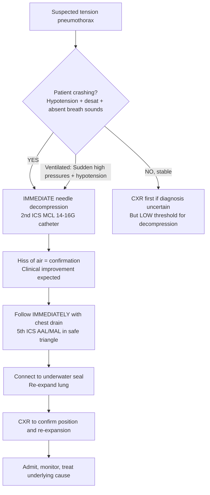
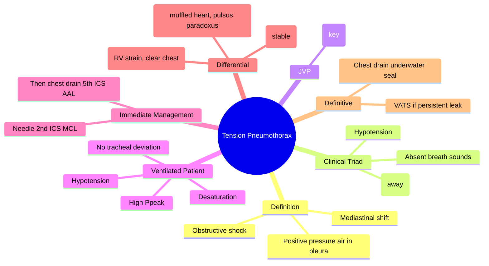
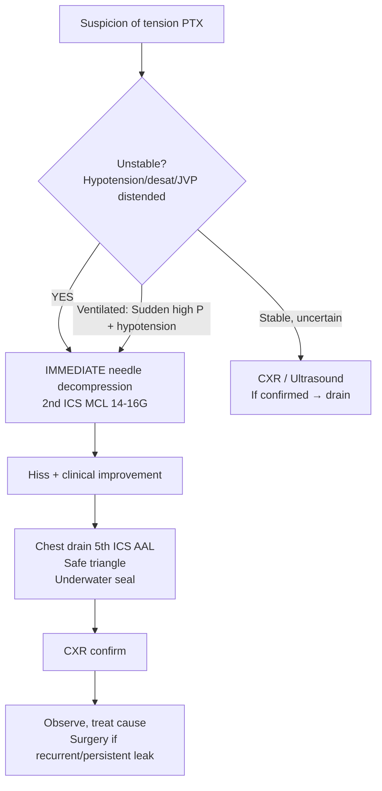

# Tension Pneumothorax

Related: [[Pleural air disorders]], [[Pneumothorax]], [[Primary spontaneous pneumothorax]], [[Secondary spontaneous pneumothorax]], [[Pleural aspiration and chest drain basics]], [[Trauma]], [[ICU emergencies]]

> [!important]
> **Tension pneumothorax** = **life-threatening** pleural air accumulation under **positive pressure** causing **mediastinal shift**, **impaired venous return**, and **obstructive shock**. **Clinical diagnosis** — immediate needle decompression **before** imaging. Key FCPS/MRCP: clinical triad (hypotension, tracheal deviation, absent breath sounds), 2nd ICS MCL needle decompression, then chest drain, ATLS/BTS algorithms.

## Learning Objectives
- Recognise tension pneumothorax as a **clinical diagnosis** requiring **immediate intervention**
- Identify the classic clinical triad and variations (ventilated vs awake patients)
- Perform **needle decompression** (2nd ICS MCL, 5th ICS AAL) and **chest drain insertion**
- Differentiate from simple pneumothorax, cardiac tamponade, massive PE, haemothorax
- Apply BTS/ATLS management algorithms

## Definition
**Tension pneumothorax** = progressive accumulation of air in the pleural space under **positive pressure** throughout the respiratory cycle, causing:
1. **Mediastinal shift** to contralateral side
2. **Impaired venous return** (IVC/SVC compression) → **obstructive shock**
3. **Compression of contralateral lung** → hypoxaemia
4. **Cardiovascular collapse** if untreated

> **FCPS/MRCP tip**: It is a **clinical diagnosis**. **Do not wait for CXR** — immediate decompression saves lives.

## Core Anatomy
### 1. Pleural space
- Potential space between visceral and parietal pleura
- Normally negative pressure (-5 cmH2O at rest)
- In tension pneumothorax: pressure becomes **positive** and rises

### 2. Mediastinal structures at risk
- **Heart and great vessels** (IVC, SVC, pulmonary vessels) — compressed → ↓ preload
- **Trachea** — deviated contralaterally
- **Contralateral lung** — compressed → shunt, hypoxaemia

### 3. Surface anatomy for decompression
- **2nd intercostal space (ICS), midclavicular line (MCL)**: traditional ATLS site
- **5th ICS, anterior axillary line (AAL) / midaxillary line (MAL)**: BTS preferred for chest drain (less subcutaneous tissue, avoids breast tissue, safer for drain)
- **Needle**: 14–16G, ≥5 cm length (adult), catheter-over-needle

### 4. "Safe triangle" for chest drain
- Anterior border: lateral edge of pectoralis major
- Posterior border: lateral edge of latissimus dorsi
- Base: 5th ICS (nipple line in males)
- Apex: axilla
- **Site**: 4th–5th ICS, anterior to midaxillary line

## Core Physiology
### Pathophysiological sequence
1. **One-way valve** air entry (visceral pleural tear + check-valve mechanism)
2. **Intrapleural pressure** becomes positive and rises with each breath
3. **Lung collapse** on affected side
4. **Mediastinal shift** → compression of heart, great vessels, contralateral lung
5. **Venous return ↓** → **cardiac output ↓** → **hypotension/shock**
6. **Contralateral lung compression** → **hypoxaemia**
7. **Cardiac arrest** if not decompressed

### Ventilated patients
- Higher risk: positive pressure ventilation forces air through pleural defect
- Clues: **sudden ↑ peak pressures**, **↓ tidal volumes**, **hypotension**, **desaturation**
- May have **no tracheal deviation** (mediastinum fixed by ventilator pressures/PEEP)

## Normal Values / Important Cut-offs
| Parameter | Tension Pneumothorax |
|-----------|---------------------|
| **Tracheal deviation** | Away from affected side (late sign) |
| **JVP** | **Distended** (impaired venous return) — **Kussmaul's sign absent** |
| **BP** | **Hypotension** (obstructive shock) |
| **Heart sounds** | **Muffled/distant** |
| **Breath sounds** | **Absent** on affected side |
| **Percussion** | **Hyperresonant** on affected side |
| **SpO2** | **Low**, refractory to O2 |
| **ETCO2 (ventilated)** | **Sudden drop** (↓ cardiac output) |

## Classification
### By aetiology
| Type | Context |
|------|---------|
| **Primary spontaneous** | Tall thin young male, no lung disease, bleb rupture |
| **Secondary spontaneous** | Underlying COPD, CF, TB, malignancy, Pneumocystis, endometriosis |
| **Traumatic** | Penetrating (stab/gunshot), blunt (rib fracture), iatrogenic (central line, biopsy, ventilation) |
| **Iatrogenic** | Central venous access, pleural aspiration, transbronchial biopsy, positive pressure ventilation |

### By clinical context
- **Awake spontaneous** (classic presentation)
- **Ventilated patient** (high peak pressures, hypotension, desaturation)
- **Trauma** (penetrating/blunt chest injury)
- **Procedural complication** (post-CVC, post-biopsy)

## Etiology / Causes
### Common
- **COPD** (bullae rupture) — most common cause of secondary spontaneous tension
- **Trauma** (rib fracture, penetrating injury)
- **Mechanical ventilation** (high PEEP, high Vt, barotrauma)
- **Central venous catheterisation** (subclavian/IJ — pleural puncture)
- **Pleural procedures** (aspiration, biopsy, drain insertion)

### Less common
- **Pneumocystis jirovecii** pneumonia (HIV) — thin-walled cysts
- **Cystic fibrosis**
- **Lymphangioleiomyomatosis (LAM)**
- **Endometriosis** (catamenial pneumothorax)
- **Malignancy** (necrotic cavitating mets)
- **TB** (cavitation)
- **Necrotising pneumonia** (Staph, Klebsiella)

## Risk Factors
- Mechanical ventilation (especially high PEEP, ARDS)
- COPD / bullous lung disease
- Trauma (chest)
- Recent pleural procedure
- Tall thin young males (primary spontaneous)
- HIV / PJP
- Connective tissue disease (Marfan, Ehlers-Danlos)

## Pathophysiology
1. **Visceral pleural breach** → air enters pleural space
2. **Flap valve mechanism** → air enters on inspiration, cannot exit on expiration
3. **Intrapleural pressure** rises progressively
4. **Lung collapses** → shunt, hypoxaemia
5. **Mediastinum shifts** → compresses IVC/SVC → ↓ venous return → ↓ CO → hypotension
6. **Contralateral lung compressed** → worsens hypoxaemia
7. **Vicious cycle** → cardiovascular collapse → PEA/asystole

## Clinical Features
### Awake patient (classic triad)
1. **Hypotension** (obstructive shock)
2. **Tracheal deviation** away from affected side (late, may be absent early)
3. **Absent breath sounds** on affected side

### Additional signs
- **Distended JVP** (impaired venous return) — **key differentiator from hypovolaemic shock**
- **Tachycardia**
- **Tachypnoea**, respiratory distress
- **Hyperresonant percussion** on affected side
- **Reduced chest expansion** on affected side
- **Cyanosis** (late)
- **Altered consciousness** (cerebral hypoperfusion)
- **Subcutaneous emphysema** (if air tracks)

### Ventilated patient (different presentation)
- **Sudden ↑ peak airway pressures**
- **Sudden ↓ delivered tidal volumes**
- **Hypotension**
- **Desaturation** (SpO2 drop)
- **ETCO2 drop** (↓ cardiac output)
- **Asymmetric chest rise**
- **Tracheal deviation often ABSENT** (PEEP fixes mediastinum)
- **JVP difficult to assess** (supine, sedated)

### Post-procedure (CVC, biopsy)
- Sudden deterioration during/after procedure
- High index of suspicion needed

## Approach / Emergency Algorithm (ATLS / BTS)

> **FCPS/MRCP tip**: **Decompress first, image later**. In exams: "A 25M post-stabbing, hypotensive, tracheal deviated, absent breath sounds left — immediate management?" → **Needle decompression 2nd ICS MCL left**.

## Investigations
### CXR (if stable enough / post-decompression)
- **Large pneumothorax** with **mediastinal shift** away from affected side
- **Flattened hemidiaphragm**
- **Widened intercostal spaces**
- **Contralateral lung compression**
- **Deep costophrenic angle** (hyperinflation)
- **May be subtle in ventilated/supine patients** (air anterior)

### Ultrasound (POCUS)
- **Absent lung sliding** on affected side
- **Lung point** (transition from sliding to no sliding) — specific for pneumothorax
- **A-lines only** (no B-lines)
- **Barcode sign** on M-mode

### ABG
- Hypoxaemia
- Respiratory alkalosis (early) → metabolic acidosis (late, shock)

### ECG
- **Electrical alternans** (if large, heart swinging)
- Right axis deviation / RBBB pattern (acute cor pulmonale)
- Low voltage

## Interpretation Frameworks
### 1. Clinical diagnosis criteria (ATLS)
**Diagnose clinically if:**
- Respiratory distress + hypotension **+**
- Absent breath sounds unilateral **+**
- JVP distended **+**
- Tracheal deviation away (late) **+/-**
- **→ DECOMPRESS IMMEDIATELY**

### 2. Differentiation from mimics
| Condition | Key Differentiators |
|-----------|---------------------|
| **Cardiac tamponade** | JVP distended, **muffled heart sounds**, **pulsus paradoxus**, clear lung fields, **echo** |
| **Massive PE** | Sudden dyspnoea, **clear chest**, **RV strain on echo**, **raised D-dimer**, **CTPA** |
| **Simple pneumothorax** | **No hypotension, no tracheal deviation, no JVP distension**, stable |
| **Massive haemothorax** | Dull percussion, hypotension, JVP may be flat (hypovolaemia), **chest drain → blood** |
| **Acute severe asthma** | Wheeze, prolonged expiration, **no tracheal deviation**, hyperinflation bilateral |

### 3. Ventilated patient clues
- **Sudden ↑ Ppeak** + **hypotension** + **desaturation** + **asymmetric chest rise** = tension until proven otherwise
- **Disconnect ventilator** → manual bag → if improves, suggests circuit issue; if not, tension likely

## Diagnosis
**Clinical diagnosis** — no time for imaging in unstable patient.

**Definitive in stable patient:**
- CXR: large pneumothorax + mediastinal shift + flattened diaphragm
- Ultrasound: absent lung sliding + lung point

## Differential Diagnosis
| Differential | Clues Against Tension |
|--------------|----------------------|
| **Cardiac tamponade** | Muffled heart sounds, pulsus paradoxus, echo: RV collapse, pericardial effusion |
| **Massive PE** | Clear lung fields, RV dilation on echo, raised D-dimer, CTPA |
| **Simple pneumothorax** | Haemodynamically stable, no mediastinal shift, no JVP distension |
| **Massive haemothorax** | Dull percussion, chest drain → bloody fluid, hypovolaemic shock |
| **Acute severe asthma/COPD** | Bilateral wheeze, no tracheal deviation, hyperinflation bilateral |
| **Aortic dissection** | Tearing pain, BP differential, widened mediastinum on CXR, CT aortogram |

## Management
### Immediate (Pre-hospital / ED / Ward / ICU)
**1. NEEDLE DECOMPRESSION — IMMEDIATE**
- **Site**: **2nd ICS, Midclavicular Line (MCL)** on affected side
- **Needle**: **14–16G cannula**, ≥5 cm length
- **Technique**: Insert perpendicular to chest wall, just above 3rd rib (avoid neurovascular bundle)
- **Confirmation**: **Hiss of air** + **clinical improvement** (BP ↑, SpO2 ↑, JVP ↓)
- **Leave catheter in place** until chest drain inserted

**2. CHEST DRAIN INSERTION — DEFINITIVE**
- **Site**: **5th ICS, Anterior Axillary Line (AAL) / Midaxillary Line (MAL)** in **safe triangle**
- **Tube**: **24–28F** (straight) or **12–14F** (pigtail) — BTS: small-bore (10–14F) often sufficient for air
- **Technique**: Seldinger (pigtail) or blunt dissection (surgical)
- **Connect**: **Underwater seal** (bottle or digital) — **NO suction initially**
- **Confirm**: Fogging, swing, air leak cessation, CXR

### Post-drain management
- **Suction**: Only if persistent air leak >24–48h or incomplete re-expansion (-10 to -20 cmH2O)
- **Observation**: 24h after air leak stops before removal
- **Removal**: In inspiration or expiration (controversial), clamp trial not needed
- **Follow-up CXR**: 24h post-removal

### Ventilated patient specific
- **Disconnect from ventilator** → manual bag with 100% O2
- **Needle decompress** → chest drain
- **Reduce PEEP** temporarily if possible
- **Lung-protective settings** after re-expansion

### Surgical referral
- Persistent air leak >5–7 days
- Recurrent pneumothorax (2nd ipsilateral or 1st contralateral)
- Failure of lung re-expansion
- **VATS pleurectomy + bullectomy** ± talc pleurodesis

## Drug Interactions / Contraindications / Cautions
### Analgesia/sedation for drain insertion
- **Local anaesthetic**: 1% lidocaine 10–20 mL (infiltrate skin, periosteum, parietal pleura)
- **IV opioid/sedative** if awake: morphine 2–5mg IV + midazolam 1–2mg IV (titrate)
- **Avoid**: excessive sedation in haemodynamically unstable

### Anticoagulation
- **Relative contraindication** for drain insertion
- If urgent: correct coagulopathy (FFP, platelets, vitamin K) **but do not delay life-saving decompression**

## Procedures / Indications / Contraindications
### Needle decompression
**Indication**: Clinical tension pneumothorax (haemodynamic compromise)
**Contraindication**: None in life-threatening situation
**Complication**: Lung laceration, vessel injury, infection, failure (catheter kinked/blocked, wrong site)

### Chest drain insertion
**Indication**: All tension pneumothorax (after needle), large symptomatic pneumothorax, persistent air leak
**Contraindication**: Uncorrected coagulopathy (relative), skin infection at site (relative)
**Complication**: Organ injury (lung, heart, diaphragm, liver/spleen), bleeding, infection, malposition, re-expansion pulmonary oedema

## Procedure Mini-Sections
### Needle decompression (2nd ICS MCL)
1. **Identify**: 2nd intercostal space, midclavicular line
2. **Prepare**: Clean skin, 14–16G IV cannula (≥5 cm), gloves
3. **Insert**: Just above 3rd rib (avoid neurovascular bundle below), perpendicular to chest wall
4. **Advance**: Until hiss of air / flashback
5. **Advance catheter**, remove needle
6. **Secure**: Tape catheter, leave open to air (or 3-way tap)
7. **Reassess**: BP, SpO2, JVP, breath sounds — **immediate improvement expected**
8. **Proceed IMMEDIATELY to chest drain**

### Chest drain (5th ICS AAL/MAL — Safe Triangle)
1. **Identify**: 5th ICS (nipple line), anterior to midaxillary line, safe triangle
2. **Anaesthetise**: 1% lidocaine — skin → muscle → parietal pleura (aspirate air confirms pleural entry)
3. **Incision**: 2 cm horizontal over 5th rib (superior border of 6th rib)
4. **Blunt dissect**: Artery forceps through muscle, puncture pleura
5. **Insert tube**: Finger guide, direct posteriorly and superiorly
6. **Confirm**: Fogging, swing, air bubbles in underwater seal
7. **Secure**: Purse-string + mattress sutures, dressing
8. **CXR**: Confirm position, lung re-expansion

## Complications
### Immediate
- **Failure to decompress** (wrong site, kinked catheter, inadequate length)
- **Lung laceration** (needle or drain)
- **Bleeding** (intercostal artery, internal mammary, lung parenchyma)
- **Organ injury** (heart, liver, spleen, diaphragm)
- **Re-expansion pulmonary oedema** (rapid re-expansion of chronically collapsed lung — limit drainage rate)

### Delayed
- **Empyema** / infection
- **Persistent air leak** (>5–7 days → surgical)
- **Recurrence** (ipsilateral ~30%, contralateral ~10%)
- **Chronic pneumothorax** (trapped lung)
- **Subcutaneous emphysema**
- **Nerve injury** (intercostal neuralgia)

## Red Flags / Emergencies
- **Haemodynamic collapse** → **immediate needle decompression**
- **Cardiac arrest** → **finger thoracostomy** (ED thoracotomy) if needle fails
- **Ventilated patient**: sudden high pressures + hypotension → **disconnect, decompress, drain**
- **Bilateral tension** (rare) → decompress both sides

## Special Situations
### Traumatic tension pneumothorax
- **ATLS**: Decompress **before** imaging if unstable
- **Chest drain** mandatory after needle
- **Look for**: haemothorax (drain → blood), cardiac tamponade, aortic injury

### Ventilator-induced (barotrauma)
- High PEEP, high driving pressure, ARDS
- Reduce PEEP/Vt after drain
- Consider permissive hypercapnia, APRV, HFOV
- **Prophylactic chest drain** before transport if known pneumothorax

### Catamenial (endometriosis)
- Recurrent, right-sided, perimenstrual
- Hormonal therapy (OCP, GnRH agonist) + VATS pleurectomy

### HIV / PJP
- Bilateral thin-walled cysts → high tension risk
- Early drain, PJP treatment, consider prophylactic pleurodesis

## Prognosis
- **Immediate decompression** → excellent outcome
- **Delayed** → obstructive shock, cardiac arrest, hypoxic brain injury, death
- **Recurrence**: Primary spontaneous ~30% (1st yr), Secondary ~40-50%
- **Mortality**: Low if treated promptly; higher in ventilated/secondary/comorbid

## Topic Correlation
- [[Pleural air disorders]] — pneumothorax classification framework
- [[Pneumothorax]] — overview of all pneumothorax types
- [[Primary spontaneous pneumothorax]] — young, tall, blebs
- [[Secondary spontaneous pneumothorax]] — COPD, underlying disease
- [[Pleural aspiration and chest drain basics]] — procedure details
- [[Trauma]] — ATLS chest trauma algorithm
- [[ICU emergencies]] — ventilator emergencies

## FCPS/MRCP High-Yield Points
1. **Clinical diagnosis** — **do not wait for CXR**
2. **Triad**: Hypotension + Tracheal deviation (away) + Absent breath sounds
3. **JVP distended** (vs flat in hypovolaemia) — key differentiator
4. **Needle decompression**: **2nd ICS MCL**, 14–16G, ≥5 cm
5. **Chest drain**: **5th ICS AAL/MAL** (safe triangle), underwater seal
5. **Ventilated patient**: sudden ↑ Ppeak + hypotension + desat = tension until proven otherwise
6. **Tracheal deviation may be ABSENT** in ventilated patients (PEEP fixes mediastinum)
7. **Pulsus paradoxus** in tamponade, **NOT** in tension pneumothorax
8. **Immediate management**: Needle → Drain → CXR (NOT CXR first)

## Common Viva Questions
1. Clinical features of tension pneumothorax
2. Site and technique of needle decompression
3. Site and technique of chest drain insertion (safe triangle)
4. Difference from cardiac tamponade and massive PE
5. Ventilated patient presentation
6. Management algorithm (ATLS/BTS)
7. Complications of chest drain
8. When to refer for surgery (VATS)

## Common Confusions / Exam Traps
- **Waiting for CXR** before decompression in unstable patient = WRONG
- **Wrong decompression site**: 5th ICS MCL (old teaching) — **current = 2nd ICS MCL**
- **Confusing with tamponade**: tamponade = muffled heart sounds, pulsus paradoxus, clear lungs
- **Forgetting ventilated patients** may lack tracheal deviation
- **Chest drain site**: 2nd ICS MCL = needle ONLY; drain = 5th ICS AAL/MAL
- **Suction immediately** = risk re-expansion oedema; start with underwater seal only
- **Clamp trial before removal** = not needed, increases recurrence risk

## Mnemonics
- **TENSION**: **T**racheal deviation (away), **E**mpyema no, **N**eedle 2nd ICS MCL, **S**hock (hypotension), **I**ntubation risk (ventilated), **O**bvious clinically, **N**o CXR first
- **NEEDLE**: **N**eedle 14-16G, **E**xpose chest, **E**nter 2nd ICS MCL, **D**irectly above 3rd rib, **L**isten for hiss, **E**valuate improvement
- **DRAIN SITE**: **D**rain 5th ICS, **R**ight at **A**nterior **A**xillary **L**ine, **I**n **S**afe **T**riangle, **E**xpand lung
- **TENSION vs TAMPONADE**: **T**racheal deviation (tension) vs **T**amponade (muffled heart, pulsus paradoxus)

## Mind Map

## Flowchart

## Suggested Visuals / Image Notes
- Surface anatomy: 2nd ICS MCL, 5th ICS AAL, safe triangle
- CXR: tension PTX with mediastinal shift, flattened diaphragm
- Ultrasound: absent lung sliding, lung point, barcode sign
- Needle decompression technique
- Chest drain insertion steps

## Suggested Video References
- ATLS needle decompression
- BTS chest drain insertion (Seldinger and surgical)
- POCUS for pneumothorax (lung sliding, lung point)
- Ventilator emergency: tension pneumothorax

## One-Page Revision Summary
- **Tension PTX** = positive pressure air in pleura → mediastinal shift → obstructive shock
- **Clinical diagnosis** — **NO CXR DELAY**
- **Triad**: Hypotension, Tracheal deviation (away), Absent breath sounds
- **JVP distended** (vs flat in hypovolaemia)
- **Ventilated**: sudden ↑ Ppeak, hypotension, desat, NO tracheal deviation
- **Needle**: 2nd ICS MCL, 14-16G, hiss of air = success
- **Drain**: 5th ICS AAL/MAL (safe triangle), underwater seal
- **Differentials**: Tamponade (muffled heart, pulsus paradoxus), Massive PE (RV strain), Simple PTX (stable)

## 24-Hour Recall Prompts
- State the clinical triad
- Needle decompression site and needle size
- Chest drain site and safe triangle borders
- 3 key differences from cardiac tamponade
- Ventilated patient clues

## 7-Day / 15-Day / 30-Day Revision Tracker
- [ ] Day 1 completed
- [ ] 24-hour recall completed
- [ ] Day 7 revision completed
- [ ] Day 15 revision completed
- [ ] Day 30 revision completed

## Must Know / Should Know / Nice to Know
### Must Know
- Clinical diagnosis, no CXR delay
- Triad + JVP distended
- Needle: 2nd ICS MCL, 14-16G
- Drain: 5th ICS AAL/MAL, safe triangle
- Ventilated patient presentation
- Differentiation from tamponade, massive PE

### Should Know
- Pathophysiology (one-way valve)
- BTS vs ATLS needle site evolution
- Re-expansion pulmonary oedema prevention
- Surgical referral criteria
- Catamenial / HIV specific contexts

### Nice to Know
- Finger thoracostomy (ED thoracotomy)
- Digital drainage systems
- Pigtail vs surgical drain evidence
- Long-term recurrence rates by aetiology
- Pleurodesis agents (talc vs doxycycline vs blood patch)

## Self-Test Scorecard
- Understanding: /10
- Recall: /10
- MCQ Performance: /10
- SBA Performance: /10
- Viva Confidence: /10
- Total: /50

> [!tip]
> Interpretation: <35 = weak topic, 35-44 = acceptable but insecure, 45+ = strong exam-ready topic.

## Exam Answer Modes
### Long Answer Skeleton
- Definition + pathophysiology (one-way valve)
- Clinical features: triad, JVP, ventilated patient differences
- Immediate management: needle decompression (site, technique, confirmation)
- Definitive management: chest drain (site, safe triangle, technique, underwater seal)
- Differential diagnosis table (tamponade, massive PE, simple PTX, haemothorax)
- Complications, surgical referral, special situations

### Short Note Skeleton
- Definition box
- Clinical triad box
- Needle vs drain site comparison
- Differential table
- Algorithm flowchart

### Viva One-Liners
- "Tension pneumothorax = clinical diagnosis, decompress immediately, no CXR first"
- "Triad: hypotension, tracheal deviation away, absent breath sounds + JVP distended"
- "Needle: 2nd ICS MCL, 14-16G catheter, ≥5 cm, hiss of air confirms"
- "Drain: 5th ICS AAL/MAL in safe triangle, underwater seal, no suction initially"
- "Ventilated patient: sudden high peak pressures + hypotension + desat, NO tracheal deviation"
- "Tamponade: muffled heart sounds, pulsus paradoxus, clear lungs, echo shows effusion"
- "Massive PE: RV strain on echo, raised D-dimer, CTPA, clear chest"
- "Re-expansion oedema: limit drainage rate in chronic collapse"

### Ward-Case Discussion Points
- 25M stabbing, BP 80/50, trachea deviated right, absent left breath sounds, JVP ↑ → LEFT tension PTX → needle 2nd ICS MCL LEFT → drain 5th ICS AAL LEFT
- 60M COPD on ventilator, sudden Ppeak 45→65, BP 130→80, SpO2 98→85, unilateral rise → tension → disconnect ventilator → needle → drain
- 30F post-subclavian CVC, sudden dyspnoea, hypotension, absent right breath sounds → iatrogenic tension PTX → needle → drain

### Last-Night-Before-Exam Sheet
- Clinical dx, no CXR first
- Triad: Hypotension, Trachea away, Absent BS, JVP ↑
- Needle: 2nd ICS MCL, 14-16G
- Drain: 5th ICS AAL/MAL, safe triangle
- Ventilated: High Ppeak, hypotension, NO tracheal deviation
- Tamponade: Muffled heart, pulsus paradoxus, echo
- PE: RV strain, D-dimer, CTPA
- No suction initially, re-expansion oedema risk

## Summary
**Tension pneumothorax** = life-threatening positive-pressure pleural air causing mediastinal shift and obstructive shock. **Clinical diagnosis** — **immediate needle decompression (2nd ICS MCL, 14-16G)** before imaging. **Classic triad**: hypotension, tracheal deviation away, absent breath sounds **+ distended JVP**. **Ventilated patients**: sudden ↑ peak pressures, hypotension, desaturation, **NO tracheal deviation**. **Definitive**: chest drain **5th ICS AAL/MAL in safe triangle**, underwater seal. **Differentials**: cardiac tamponade (muffled heart, pulsus paradoxus), massive PE (RV strain, clear chest), simple pneumothorax (stable).

## MCQs (10)
1. **Needle decompression site** for tension pneumothorax (current ATLS/BTS):
   A. 5th ICS MCL
   B. **2nd ICS MCL**
   C. 4th ICS AAL
   D. 5th ICS MAL

2. **Classic clinical triad** of tension pneumothorax:
   A. Hypotension, tracheal deviation toward, absent breath sounds
   B. **Hypotension, tracheal deviation away, absent breath sounds**
   C. Hypertension, tracheal deviation away, bronchial breathing
   D. Hypotension, tracheal deviation away, crackles

3. **JVP in tension pneumothorax**:
   A. Flat
   B. **Distended**
   C. Normal
   D. Not visible

4. **Ventilated patient** with tension pneumothorax — which is typically ABSENT?
   A. Hypotension
   B. Desaturation
   C. **Tracheal deviation**
   D. High peak pressures

5. **Chest drain insertion site** (BTS safe triangle):
   A. 2nd ICS MCL
   B. **5th ICS AAL/MAL**
   C. 4th ICS MCL
   D. 6th ICS MAL

6. **Differentiating from cardiac tamponade** — key feature of tamponade:
   A. Tracheal deviation
   B. **Muffled heart sounds + pulsus paradoxus**
   C. Hyperresonant percussion
   D. Unilateral absent breath sounds

7. **First management step** in unstable patient with suspected tension pneumothorax:
   A. CXR
   B. **Needle decompression**
   C. Chest drain
   D. Ultrasound

8. **Re-expansion pulmonary oedema** prevention:
   A. Apply high suction immediately
   B. **Limit drainage rate, no suction initially**
   C. Clamp drain for 1 hour
   D. Give furosemide prophylactically

9. **Needle size** for adult decompression:
   A. 18G
   B. 20G
   C. **14-16G**
   D. 22G

10. **Surgical referral (VATS)** indicated for:
    A. First primary spontaneous pneumothorax
    B. **Persistent air leak >5-7 days or recurrence**
    C. All secondary spontaneous pneumothorax
    D. Only if tension develops

## SBA Questions (10)
1. A 24M tall thin presents with sudden dyspnoea, BP 85/50, trachea deviated LEFT, absent breath sounds RIGHT, JVP distended. Immediate management?
   A. CXR then chest drain
   B. **Needle decompression 2nd ICS MCL RIGHT**
   C. Needle decompression 5th ICS AAL RIGHT
   D. Pericardiocentesis

2. A 65M COPD on ventilator (PEEP 10). Sudden Ppeak 35→55, BP 120→80, SpO2 96→88, unilateral chest rise LEFT. Trachea midline. Best immediate action?
   A. Increase PEEP to 15
   B. **Disconnect ventilator, needle decompress 2nd ICS MCL LEFT**
   C. CXR portable
   D. Give fluid bolus

3. A 30F 2 hours post-right subclavian CVC. Sudden dyspnoea, BP 80/40, absent RIGHT breath sounds, JVP distended, trachea deviated LEFT. CXR shows large RIGHT pneumothorax with mediastinal shift. Next step?
   A. **Needle decompression 2nd ICS MCL RIGHT then chest drain**
   B. Chest drain only
   C. Pericardiocentesis
   D. CT chest

4. Differentiating tension pneumothorax from massive PE:
   A. Both have tracheal deviation
   B. **Tension: hyperresonant percussion, absent breath sounds; PE: clear chest, RV strain on echo**
   C. Both have flat JVP
   D. Both have muffled heart sounds

5. Chest drain inserted for tension pneumothorax. Underwater seal shows bubbling. Suction?
   A. Apply -20 cmH2O suction immediately
   B. **No suction initially; only if persistent leak >24-48h or incomplete re-expansion**
   C. Clamp the drain
   D. Remove drain

6. Re-expansion pulmonary oedema risk highest in:
   A. Acute tension pneumothorax <24h
   B. **Chronic collapsed lung (>3-7 days) with rapid re-expansion**
   C. Small primary spontaneous pneumothorax
   D. Ventilator-induced pneumothorax

7. 40F recurrent RIGHT pneumothorax (3rd episode), now with persistent air leak day 7 post-drain. Best next step?
   A. Continue drain, wait
   B. **VATS pleurectomy + bullectomy ± talc pleurodesis**
   C. Second chest drain
   D. Chemical pleurodesis via drain

8. Catamenial pneumothorax — characteristic features:
   A. Left-sided, mid-cycle
   B. **Right-sided, perimenstrual, endometriosis**
   C. Bilateral, post-menopausal
   D. Left-sided, post-menopausal

9. Ventilated ARDS patient, PEEP 14. Known small RIGHT pneumothorax on CXR day 2. Being transferred for CT. Pre-transfer?
   A. Increase PEEP to 18
   B. **Prophylactic chest drain RIGHT before transport**
   C. Reduce PEEP to 5
   D. No action needed

10. Finger thoracostomy (ED thoracostomy) indicated when:
    A. First-line for all tension pneumothorax
    B. **Needle decompression failed + cardiac arrest / peri-arrest**
    C. Stable patient with confirmed pneumothorax
    D. Instead of chest drain in all trauma

## Flashcards
- Q: Needle decompression site
  A: 2nd ICS MCL, 14-16G, ≥5cm
- Q: Chest drain site
  A: 5th ICS AAL/MAL, safe triangle
- Q: Clinical triad
  A: Hypotension, trachea away absent BS, JVP ↑
- Q: Ventilated patient clues
  A: Sudden high Ppeak, hypotension, desat, NO tracheal deviation
- Q: Tamponade vs tension
  A: Tamponade = muffled heart, pulsus paradoxus, clear lungs, echo
- Q: PE vs tension
  A: PE = clear chest, RV strain, D-dimer, CTPA
- Q: Re-expansion oedema
  A: Chronic collapse + rapid re-expansion, limit drainage rate
- Q: Surgical referral
  A: Persistent leak >5-7d, recurrence, failed re-expansion

## Answer Key with Explanations
### MCQs
1. **B** — Current guideline: 2nd ICS MCL for needle decompression.
2. **B** — Trachea deviates AWAY from affected side.
3. **B** — JVP distended due to impaired venous return (obstructive shock).
4. **C** — PEEP fixes mediastinum; tracheal deviation often absent in ventilated patients.
5. **B** — Chest drain: 5th ICS AAL/MAL in safe triangle.
6. **B** — Tamponade: muffled heart sounds, pulsus paradoxus, echo shows effusion.
7. **B** — Unstable = immediate needle decompression (ATLS).
8. **B** — Underwater seal only initially; suction only if persistent leak.
9. **C** — 14-16G catheter ≥5cm for adult chest wall thickness.
10. **B** — Persistent leak >5-7d or recurrence → VATS.

### SBAs
1. **B** — Trachea deviated LEFT = RIGHT tension pneumothorax. Immediate needle 2nd ICS MCL RIGHT.
2. **B** — Ventilated: disconnect, needle decompress affected side (LEFT).
3. **A** — Iatrogenic tension PTX post-CVC → needle then drain.
4. **B** — Tension: unilateral signs, hyperresonance; PE: clear chest, RV strain.
5. **B** — No suction initially; underwater seal only. Suction if leak persists.
6. **B** — Chronic collapse (>3-7d) + rapid re-expansion = highest risk.
7. **B** — 3rd recurrence + persistent leak day 7 → VATS.
8. **B** — Catamenial: right-sided, perimenstrual, thoracic endometriosis.
9. **B** — Known pneumothorax + transport/positive pressure → prophylactic drain.
10. **B** — Finger thoracostomy = failed needle + arrest/peri-arrest.

### Flashcards
All correct as written.

---
