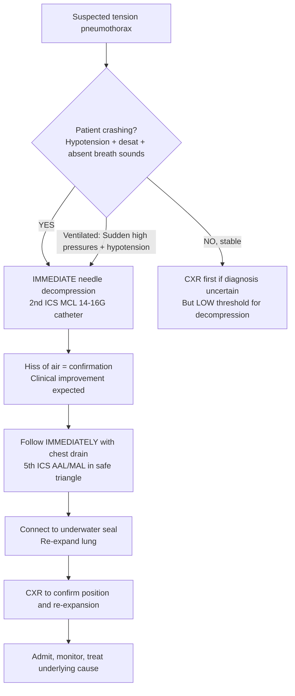

# Tension Pneumothorax

Related: [[Pleural air disorders]], [[Pneumothorax]], [[Primary spontaneous pneumothorax]], [[Secondary spontaneous pneumothorax]], [[Pleural aspiration and chest drain basics]], [[Trauma]], [[ICU emergencies]]

> [!important]
> **Tension pneumothorax** = **life-threatening** pleural air accumulation under **positive pressure** causing **mediastinal shift**, **impaired venous return**, and **obstructive shock**. **Clinical diagnosis** — immediate needle decompression **before** imaging. Key FCPS/MRCP: clinical triad (hypotension, tracheal deviation, absent breath sounds), 2nd ICS MCL needle decompression, then chest drain, ATLS/BTS algorithms.

## 1. Learning Objectives
- Recognise tension pneumothorax as a **clinical diagnosis** requiring **immediate intervention**
- Identify the classic clinical triad and variations (ventilated vs awake patients)
- Perform **needle decompression** (2nd ICS MCL, 5th ICS AAL) and **chest drain insertion**
- Differentiate from simple pneumothorax, cardiac tamponade, massive PE, haemothorax
- Apply BTS/ATLS management algorithms

## 2. Definition
**Tension pneumothorax** = progressive accumulation of air in the pleural space under **positive pressure** throughout the respiratory cycle, causing:
1. **Mediastinal shift** to contralateral side
2. **Impaired venous return** (IVC/SVC compression) → **obstructive shock**
3. **Compression of contralateral lung** → hypoxaemia
4. **Cardiovascular collapse** if untreated

> **FCPS/MRCP tip**: It is a **clinical diagnosis**. **Do not wait for CXR** — immediate decompression saves lives.

## 3. Core Anatomy
### 1. Pleural space
- Potential space between visceral and parietal pleura
- Normally negative pressure (-5 cmH2O at rest)
- In tension pneumothorax: pressure becomes **positive** and rises

### 2. Mediastinal structures at risk
- **Heart and great vessels** (IVC, SVC, pulmonary vessels) — compressed → ↓ preload
- **Trachea** — deviated contralaterally
- **Contralateral lung** — compressed → shunt, hypoxaemia

### 3. Surface anatomy for decompression
- **2nd intercostal space (ICS), midclavicular line (MCL)**: traditional ATLS site
- **5th ICS, anterior axillary line (AAL) / midaxillary line (MAL)**: BTS preferred for chest drain (less subcutaneous tissue, avoids breast tissue, safer for drain)
- **Needle**: 14–16G, ≥5 cm length (adult), catheter-over-needle

### 4. "Safe triangle" for chest drain
- Anterior border: lateral edge of pectoralis major
- Posterior border: lateral edge of latissimus dorsi
- Base: 5th ICS (nipple line in males)
- Apex: axilla
- **Site**: 4th–5th ICS, anterior to midaxillary line

## 4. Core Physiology
### Pathophysiological sequence
1. **One-way valve** air entry (visceral pleural tear + check-valve mechanism)
2. **Intrapleural pressure** becomes positive and rises with each breath
3. **Lung collapse** on affected side
4. **Mediastinal shift** → compression of heart, great vessels, contralateral lung
5. **Venous return ↓** → **cardiac output ↓** → **hypotension/shock**
6. **Contralateral lung compression** → **hypoxaemia**
7. **Cardiac arrest** if not decompressed

### Ventilated patients
- Higher risk: positive pressure ventilation forces air through pleural defect
- Clues: **sudden ↑ peak pressures**, **↓ tidal volumes**, **hypotension**, **desaturation**
- May have **no tracheal deviation** (mediastinum fixed by ventilator pressures/PEEP)

## 5. Normal Values / Important Cut-offs
| Parameter | Tension Pneumothorax |
|-----------|---------------------|
| **Tracheal deviation** | Away from affected side (late sign) |
| **JVP** | **Distended** (impaired venous return) — **Kussmaul's sign absent** |
| **BP** | **Hypotension** (obstructive shock) |
| **Heart sounds** | **Muffled/distant** |
| **Breath sounds** | **Absent** on affected side |
| **Percussion** | **Hyperresonant** on affected side |
| **SpO2** | **Low**, refractory to O2 |
| **ETCO2 (ventilated)** | **Sudden drop** (↓ cardiac output) |

## 6. Classification
### By aetiology
| Type | Context |
|------|---------|
| **Primary spontaneous** | Tall thin young male, no lung disease, bleb rupture |
| **Secondary spontaneous** | Underlying COPD, CF, TB, malignancy, Pneumocystis, endometriosis |
| **Traumatic** | Penetrating (stab/gunshot), blunt (rib fracture), iatrogenic (central line, biopsy, ventilation) |
| **Iatrogenic** | Central venous access, pleural aspiration, transbronchial biopsy, positive pressure ventilation |

### By clinical context
- **Awake spontaneous** (classic presentation)
- **Ventilated patient** (high peak pressures, hypotension, desaturation)
- **Trauma** (penetrating/blunt chest injury)
- **Procedural complication** (post-CVC, post-biopsy)

## 7. Etiology / Causes
### Common
- **COPD** (bullae rupture) — most common cause of secondary spontaneous tension
- **Trauma** (rib fracture, penetrating injury)
- **Mechanical ventilation** (high PEEP, high Vt, barotrauma)
- **Central venous catheterisation** (subclavian/IJ — pleural puncture)
- **Pleural procedures** (aspiration, biopsy, drain insertion)

### Less common
- **Pneumocystis jirovecii** pneumonia (HIV) — thin-walled cysts
- **Cystic fibrosis**
- **Lymphangioleiomyomatosis (LAM)**
- **Endometriosis** (catamenial pneumothorax)
- **Malignancy** (necrotic cavitating mets)
- **TB** (cavitation)
- **Necrotising pneumonia** (Staph, Klebsiella)

## 8. Risk Factors
- Mechanical ventilation (especially high PEEP, ARDS)
- COPD / bullous lung disease
- Trauma (chest)
- Recent pleural procedure
- Tall thin young males (primary spontaneous)
- HIV / PJP
- Connective tissue disease (Marfan, Ehlers-Danlos)

## 9. Pathophysiology
1. **Visceral pleural breach** → air enters pleural space
2. **Flap valve mechanism** → air enters on inspiration, cannot exit on expiration
3. **Intrapleural pressure** rises progressively
4. **Lung collapses** → shunt, hypoxaemia
5. **Mediastinum shifts** → compresses IVC/SVC → ↓ venous return → ↓ CO → hypotension
6. **Contralateral lung compressed** → worsens hypoxaemia
7. **Vicious cycle** → cardiovascular collapse → PEA/asystole

## 10. Clinical Features
### Awake patient (classic triad)
1. **Hypotension** (obstructive shock)
2. **Tracheal deviation** away from affected side (late, may be absent early)
3. **Absent breath sounds** on affected side

### Additional signs
- **Distended JVP** (impaired venous return) — **key differentiator from hypovolaemic shock**
- **Tachycardia**
- **Tachypnoea**, respiratory distress
- **Hyperresonant percussion** on affected side
- **Reduced chest expansion** on affected side
- **Cyanosis** (late)
- **Altered consciousness** (cerebral hypoperfusion)
- **Subcutaneous emphysema** (if air tracks)

### Ventilated patient (different presentation)
- **Sudden ↑ peak airway pressures**
- **Sudden ↓ delivered tidal volumes**
- **Hypotension**
- **Desaturation** (SpO2 drop)
- **ETCO2 drop** (↓ cardiac output)
- **Asymmetric chest rise**
- **Tracheal deviation often ABSENT** (PEEP fixes mediastinum)
- **JVP difficult to assess** (supine, sedated)

### Post-procedure (CVC, biopsy)
- Sudden deterioration during/after procedure
- High index of suspicion needed

## 11. Approach / Emergency Algorithm (ATLS / BTS)

> **FCPS/MRCP tip**: **Decompress first, image later**. In exams: "A 25M post-stabbing, hypotensive, tracheal deviated, absent breath sounds left — immediate management?" → **Needle decompression 2nd ICS MCL left**.

## 12. Investigations
### CXR (if stable enough / post-decompression)
- **Large pneumothorax** with **mediastinal shift** away from affected side
- **Flattened hemidiaphragm**
- **Widened intercostal spaces**
- **Contralateral lung compression**
- **Deep costophrenic angle** (hyperinflation)
- **May be subtle in ventilated/supine patients** (air anterior)

### Ultrasound (POCUS)
- **Absent lung sliding** on affected side
- **Lung point** (transition from sliding to no sliding) — specific for pneumothorax
- **A-lines only** (no B-lines)
- **Barcode sign** on M-mode

### ABG
- Hypoxaemia
- Respiratory alkalosis (early) → metabolic acidosis (late, shock)

### ECG
- **Electrical alternans** (if large, heart swinging)
- Right axis deviation / RBBB pattern (acute cor pulmonale)
- Low voltage

## 13. Interpretation Frameworks
### 1. Clinical diagnosis criteria (ATLS)
**Diagnose clinically if:**
- Respiratory distress + hypotension **+**
- Absent breath sounds unilateral **+**
- JVP distended **+**
- Tracheal deviation away (late) **+/-**

*[Content truncated for rendering — see tension-pneumothorax.md for full content]*
