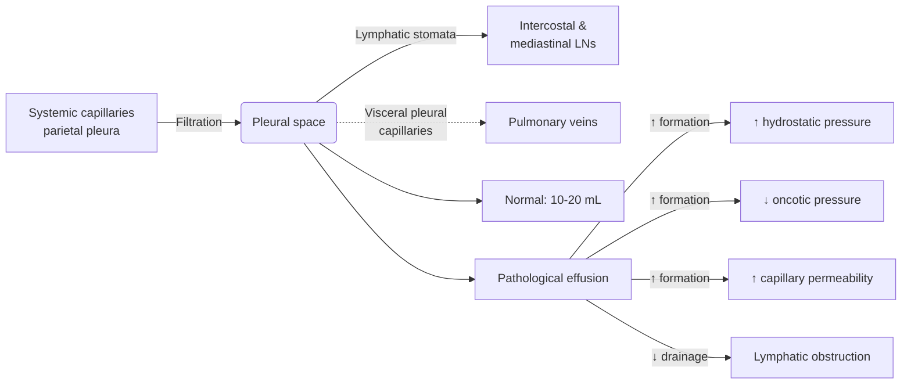
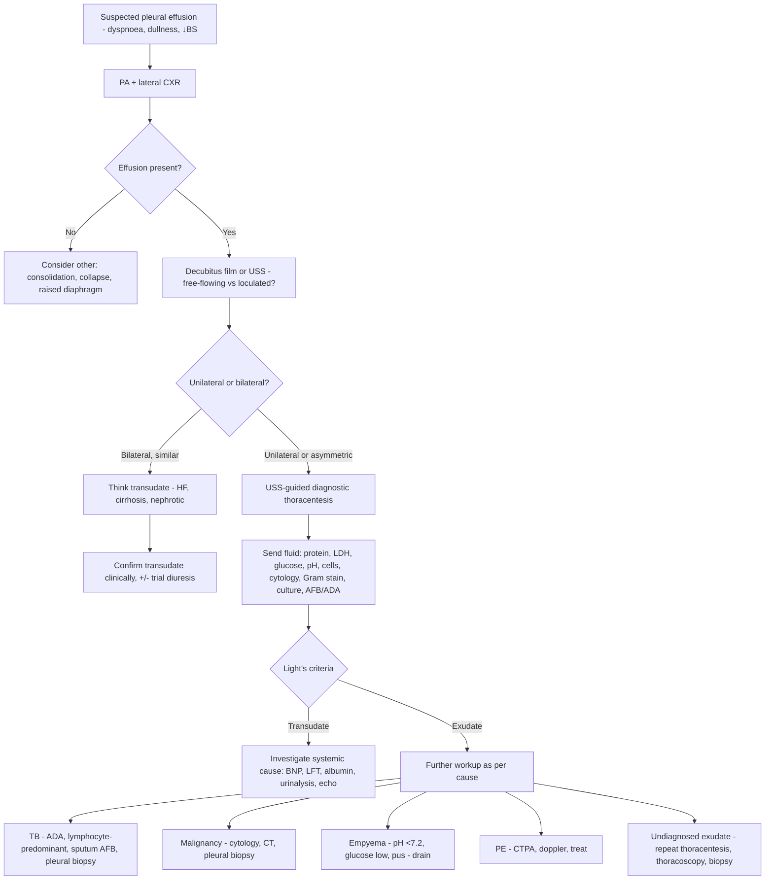
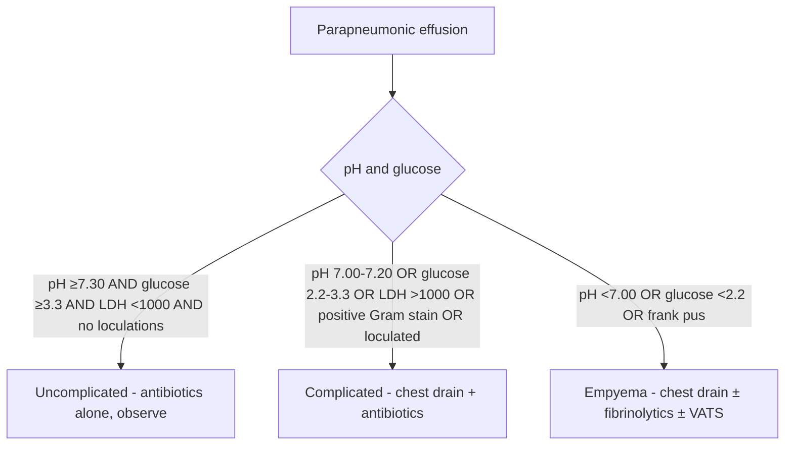
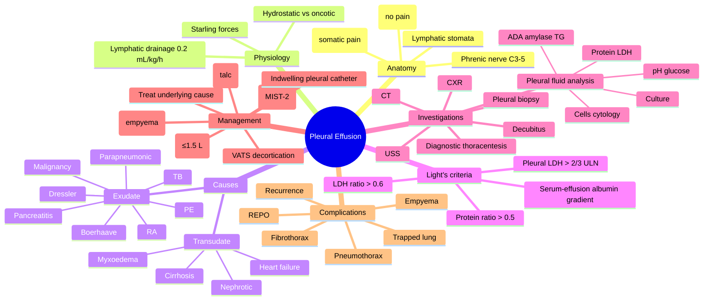
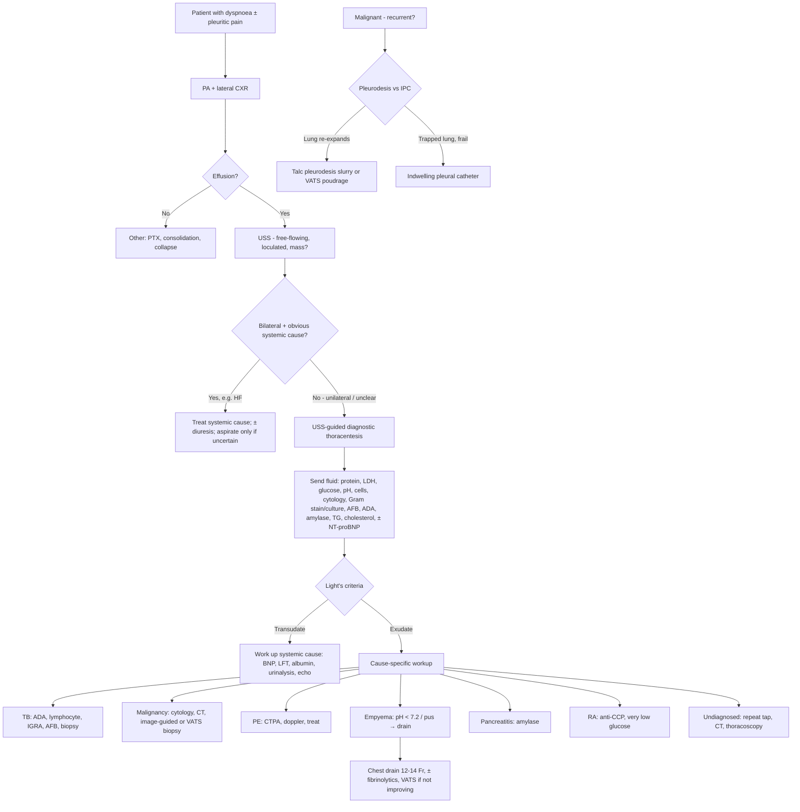

# Pleural Effusion

> [!important]
> A **pleural effusion** is an abnormal accumulation of fluid in the **pleural space** (normally 10–20 mL). The clinical approach is built on **Starling's forces** at the parietal pleura, **Light's criteria** for transudate vs exudate, and a **diagnostic algorithm** that links CXR → thoracentesis → fluid analysis → pleural biopsy. **Key FCPS/MRCP**: 200 mL fluid is the threshold for CXR blunting; **Light's criteria** (any 1 of 3 = exudate); parapneumonic effusions need **pH/glucose/LDH** to decide drainage; **malignant effusions** may need **indwelling pleural catheter** or **pleurodesis**.

Related: [[Asthma]], [[COPD]], [[Respiratory Failure]], [[ABG Interpretation]], [[Pleural Diseases/Transudate vs exudate framework|Transudate vs exudate framework]], [[Pleural Diseases/Parapneumonic effusion|Parapneumonic effusion]], [[Pleural Diseases/Malignant pleural effusion|Malignant pleural effusion]], [[Pleural Diseases/Chylothorax|Chylothorax]], [[Pleural Diseases/Hemothorax|Hemothorax]], [[Pleural Diseases/Empyema and pleural infection|Empyema and pleural infection]], [[Pleural Diseases/Pleural aspiration and chest drain basics|Pleural aspiration and chest drain basics]], [[Pneumonia]], [[Heart Failure]], [[Tuberculosis]]

> [!tip]
> **FCPS/MRCP pearl**: **First classify (transudate vs exudate)**, **then look for cause within that class**. Transudate = systemic (heart, liver, kidney). Exudate = local pleural (infection, malignancy, inflammation). A normal-looking transudate work-up that keeps producing exudate = **Light's misclassification** — re-check with **serum–effusion albumin gradient** (≥1.2 g/dL = truly transudative).

## Learning Objectives
- Describe the **pleural anatomy, microcirculation, and Starling forces** that govern pleural fluid balance.
- Define a pleural effusion and explain the **pathophysiology of transudative vs exudative** accumulation.
- Apply **Light's criteria** and the **serum–effusion albumin gradient** to classify pleural fluid accurately.
- Recognise the **clinical features** (symptoms, signs, CXR) of a pleural effusion.
- Construct a **structured investigation pathway**: CXR → decubitus/USS → thoracentesis → fluid analysis → biopsy.
- Interpret **pleural fluid biochemistry, microbiology, and cytology** (pH, glucose, LDH, protein, ADA, amylase, triglycerides, culture, cytology).
- Formulate a **management plan**: treat cause, **therapeutic thoracentesis, chest drain, fibrinolytics, VATS, pleurodesis, indwelling pleural catheter**.
- Recognise **complications** (empyema, trapped lung, trapped-lung physiology) and the **empyema staging** that drives surgical decision-making.
- Distinguish pleural effusion from **pneumothorax, consolidation, atelectasis, elevated hemidiaphragm, and lung collapse**.

## Definition

**Pleural effusion** is the pathological accumulation of fluid in the pleural space, sufficient to be detected clinically or radiologically. It is a **manifestation of disease**, not a diagnosis in itself.

| Threshold | Volume required |
|-----------|-----------------|
| Detection on lateral decubitus CXR | 5–50 mL |
| Blunting of costophrenic angle on PA CXR | 200–300 mL |
| Blunting of posterior costophrenic angle (lateral) | 50–100 mL |
| Hemithorax "white-out" | 1500–2000 mL |
| Symptomatic dyspnoea | Variable (depends on lung reserve & rate of accumulation) |

> [!critical] **Exam trap**: A rapid accumulation of <1 L can cause severe dyspnoea (lung has no time to compensate), whereas a slow accumulation of >2 L may be tolerated with minimal symptoms (slow mediastinal shift, recruitment of accessory muscles).

## Core Anatomy

### Pleural layers
- **Visceral pleura**: covers lung and lines interlobar fissures; supplied by **bronchial arteries**; **no somatic pain fibres** (autonomic only).
- **Parietal pleura**: lines chest wall, diaphragm, and mediastinum; supplied by **intercostal arteries** (costal part), **internal mammary** (anterior mediastinal part), and **intercostal/bronchial** (mediastinal part); **rich somatic innervation** → pleuritic chest pain.
- **Pleural space (cavity)**: potential space 10–20 µm wide, containing 10–20 mL of serous fluid.

### Lymphatic drainage
- **Lymphatic stomata** (5–10 µm) on the **parietal pleura** — predominantly on the **diaphragmatic** and **mediastinal** surfaces — drain fluid into intercostal and mediastinal lymph nodes.
- **Critical concept**: the lymphatic system can increase drainage **~30-fold** (from 0.2 mL/kg/h baseline) before fluid accumulates. Pleural effusions therefore imply either a **rate of formation that overwhelms lymphatics** or **lymphatic obstruction** itself (e.g., malignancy).

### Blood supply
| Layer | Arterial supply | Venous drainage |
|-------|----------------|-----------------|
| Visceral | Bronchial arteries + some pulmonary artery | Pulmonary veins |
| Parietal (costal) | Intercostal arteries | Intercostal veins → SVC |
| Parietal (diaphragmatic) | Superior phrenic + musculophrenic | Brachiocephalic + IVC |
| Parietal (mediastinal) | Bronchial + internal mammary | Azygos + internal thoracic |

### Innervation
- **Parietal pleura (costal)**: intercostal nerves (T1–T12) → **somatic** → sharp, well-localised pleuritic pain.
- **Parietal pleura (diaphragmatic central)**: **phrenic nerve (C3–C5)** → referred pain to **ipsilateral shoulder tip (C4 dermatome)**.
- **Parietal pleura (mediastinal)**: phrenic nerve.
- **Visceral pleura**: autonomic only → dull/pressure-type discomfort; pain referred via vagus.

> [!tip] **Clinical pearl**: shoulder-tip pain after pleural procedure or with effusion = **phrenic nerve irritation of central diaphragmatic pleura** (C3–5). Always assess in laparoscopic/upper-abdo surgery and post-thoracentesis.

## Core Physiology

### Starling forces in pleural fluid formation
- The pleural space behaves as a **Starling-driven system** with two opposing capillaries:
  - **Parietal pleural capillaries (systemic pressure)**: filter fluid **into** the pleural space.
  - **Visceral pleural capillaries (pulmonary pressure)**: reabsorb fluid **out** of the pleural space.
- Net filtration = `(P_cap_parietal − P_pleural)·σ − (π_cap_parietal − π_pleural)·σ`
  - **P** = hydrostatic pressure; **π** = oncotic pressure; **σ** = reflection coefficient.

| Force | Direction | Magnitude |
|-------|-----------|-----------|
| Parietal capillary hydrostatic (P_c) | Drives filtration **IN** | ~30 cmH₂O |
| Pleural hydrostatic pressure (P_pl) | Resists filtration | ~−5 cmH₂O (negative) |
| Plasma oncotic (π_c) | Resists filtration | ~34 cmH₂O |
| Pleural oncotic (π_pl) | Drives filtration | ~5 cmH₂O |

**Net result**: small net filtration from **parietal pleura** into pleural space; this is then **drained by parietal lymphatics**.

### Why a pleural space is "dry"
- Net filtration is small (~0.5–1 mL/h per hemithorax).
- **Lymphatic stomata** on parietal pleura reabsorb filtered fluid → capacity 0.2 mL/kg/h (≈ 0.7 L/day).
- Effusion forms when **formation > lymphatic capacity** OR **lymphatics are obstructed**.

### Oxygen & CO2 handling
- Visceral pleura is **very thin (≤30 µm)** and offers little diffusion barrier to gases.
- Pleural fluid is normally in equilibrium with systemic venous blood → low PO₂, high PCO₂.
- In disease, **pleural fluid pH, PO₂, PCO₂** reflect local metabolic and inflammatory activity (used in empyema, TB, rheumatoid disease).

### Pathophysiology of fluid accumulation
1. **↑ Hydrostatic pressure** in parietal/systemic capillaries (LV failure, fluid overload, constrictive pericarditis).
2. **↓ Plasma oncotic pressure** (hypoalbuminaemia: nephrotic syndrome, cirrhosis, malnutrition, protein-losing enteropathy).
3. **↑ Capillary permeability** (pleural inflammation: pneumonia, malignancy, PE, autoimmune).
4. **↓ Lymphatic drainage** (malignant infiltration of lymphatics, chylothorax from thoracic duct injury/obstruction).
5. **Fluid from another compartment** moving into pleural space (e.g., pancreatitis → pancreatic ascites tracking, oesophageal rupture → saliva, hepatic hydrothorax from diaphragmatic defects).

## Normal Values / Important Cut-offs

| Parameter | Normal pleural fluid | Threshold of note |
|-----------|----------------------|-------------------|
| Volume | 10–20 mL | >50 mL detectable on decubitus |
| Protein | <1.5 g/dL (<15 g/L) | >3 g/dL = exudate criterion |
| LDH | <50% serum ULN | >2/3 ULN serum = exudate criterion |
| pH | 7.60–7.64 | <7.20 = complicated; <7.00 = empyema tendency |
| Glucose | = plasma (3.3–5.0 mmol/L) | <3.3 mmol/L = infection, RA, malignancy |
| Cells | <1000/µL, mostly mesothelial & macrophages | >10,000 neutrophils = parapneumonic; lymphocyte predominant = TB/malignancy |
| Cholesterol | <1.55 mmol/L | >1.55 = exudate (cholesterol criterion) |
| Triglyceride | <0.56 mmol/L | >1.24 mmol/L = chylothorax; 0.56–1.24 → lipoprotein analysis |

## Classification

### 1. By mechanism (Light's criteria — the cornerstone)
| Type | Mechanism | Pleural problem? |
|------|-----------|------------------|
| **Transudate** | Systemic factor: ↑ hydrostatic, ↓ oncotic pressure | **No** — pleura is intact |
| **Exudate** | Local pleural factor: ↑ capillary permeability, ↓ lymphatic drainage | **Yes** — pleural disease present |

**Light's criteria** (any 1 of 3 = exudate):
1. Pleural protein / serum protein **> 0.5**
2. Pleural LDH / serum LDH **> 0.6**
3. Pleural LDH **> 2/3 upper limit of normal** for serum LDH

**Sensitivity 98% / Specificity 80%** for exudate → few exudates missed, but some transudates misclassified as exudate (especially patients on diuretics for heart failure).

**Serum–effusion albumin gradient** (to "rescue" misclassified transudates):
- Serum albumin − pleural albumin **> 1.2 g/dL** → re-classify as **transudate** (regardless of Light's).
- Serum – effusion protein gradient **> 3.1 g/dL** → also supports transudate.
- Cholesterol criterion: pleural cholesterol **> 1.55 mmol/L** → exudate.

### 2. By fluid character
- **Serous** (clear, straw-coloured): transudates, early parapneumonic
- **Turbid/purulent**: empyema, complicated parapneumonic
- **Blood-stained (haemorrhagic)**: trauma, malignancy, PE, TB
- **Frank blood** (PCV >50% serum): **haemothorax**
- **Milky/opalescent**: chylothorax, pseudochylothorax, empyema
- **Anchovy-paste (brown)**: amoebic (ruptured liver abscess)
- **Food particles**: oesophageal rupture
- **Black**: *Aspergillus* infection

### 3. By clinical course
- **Uncomplicated** vs **complicated parapneumonic** (pH <7.20, glucose <2.2, LDH >1000, positive Gram stain/culture, loculation) → needs chest drain.
- **Simple** vs **complex** (loculated, multiloculated) → may need fibrinolytics or VATS.

### 4. Empyema staging (Light's stages — drives surgical decision-making)
| Stage | Name | Pathology | Treatment |
|-------|------|-----------|-----------|
| **I** | Exudative | Free-flowing fluid, sterile; visceral pleura mobile | Antibiotics ± thoracentesis |
| **II** | Fibrinopurulent | Fibrin deposition, loculations, pus; tendency to peel | Chest drain ± fibrinolytics ± VATS |
| **III** | Organising | Fibroblast invasion, peel → trapped lung; thick rind | VATS decortication, surgery |

## Etiology / Causes

### Transudates (Light's negative)
| System | Cause | Mechanism |
|--------|-------|-----------|
| Cardiac | **Left heart failure** (most common cause overall) | ↑ pulmonary capillary hydrostatic pressure |
| Cardiac | **Constrictive pericarditis** | ↑ systemic venous pressure transmitted to parietal pleura |
| Hepatic | **Hepatic hydrothorax** (cirrhosis) | Trans-diaphragmatic movement of ascitic fluid via defects |
| Renal | **Nephrotic syndrome** | ↓ plasma oncotic pressure (hypoalbuminaemia) |
| Renal | **Peritoneal dialysis** | Dialysate tracks into pleural space |
| Endocrine | **Myxoedema (hypothyroidism)** | Increased capillary permeability + ↓ lymphatic drainage |
| Nutritional | **Severe malnutrition / protein-losing enteropathy** | Hypoalbuminaemia |

### Exudates (Light's positive)

| Category | Common cause | Hallmark test |
|----------|--------------|---------------|
| **Infection** | **Parapneumonic** (most common exudate) | pH, glucose, LDH, culture |
| | **Empyema** (pus in pleural space) | Frank pus, positive Gram stain/culture |
| | **Tuberculous pleuritis** | **ADA > 40 U/L**, lymphocyte-predominant, AFB/MTB PCR |
| | Viral pleuritis, fungal, parasitic | Specific serology/PCR |
| **Malignancy** | Lung, breast, lymphoma, mesothelioma, ovarian | **Cytology**, pleural biopsy (CT-guided or thoracoscopic) |
| **Pulmonary embolism** | PE with infarction | Haemorrhagic, eosinophilic; clinical context |
| **Connective tissue** | RA, SLE, Sjögren's, vasculitis | ANA, anti-CCP, complement; very low glucose in RA |
| **GI** | **Pancreatitis** (high amylase), oesophageal rupture (**Boerhaave**, low pH, salivary amylase, food) | Pleural amylase |
| **Drugs** | Nitrofurantoin, amiodarone, methotrexate, dasatinib, bromocriptine, phenytoin | Drug history |
| **Asbestos exposure** | Benign asbestos pleural effusion | Occupational history, B-read CXR |
| **Meigs syndrome** | Ovarian fibroma + ascites + effusion | Pelvic imaging |
| **Yellow nail syndrome** | Yellow nails, lymphoedema, chronic effusion | Clinical |
| **Chylothorax** | Thoracic duct injury, lymphoma | Triglycerides > 1.24 mmol/L, chylomicrons |
| **Pseudochylothorax** | Long-standing trapped effusion (TB, RA) | Cholesterol > 6.5 mmol/L, cholesterol crystals |
| **Dressler syndrome** | Post-MI autoimmune pericarditis/pleuritis | Time course (2–10 weeks post-MI) |
| **Uraemia** | Uraemic pleuritis | Renal failure context |

> [!tip] **Mnemonic for exudative causes — "MIT"**: **M**alignancy, **I**nfection (parapneumonic, TB, empyema), **T**hromboembolism (PE). Plus "CRAP": **C**onnective tissue, **R**upture (oesophagus), **A**bdominal (pancreas), **P**ost-cardiac injury (Dressler).

## Risk Factors

- **Heart failure** (most common cause of transudative effusion)
- **Cirrhosis with ascites** (hepatic hydrothorax)
- **Nephrotic syndrome**
- **Recent pneumonia / viral URTI** → parapneumonic
- **TB exposure / endemic area** (South Asia, sub-Saharan Africa, Eastern Europe)
- **Smoking** (lung cancer, mesothelioma if asbestos)
- **Occupational asbestos** (shipyard, insulation, plumbing, construction)
- **Malignancy history** (breast, lung, lymphoma, ovarian)
- **Connective tissue disease** (RA, SLE)
- **Pancreatitis, oesophageal disease**
- **Recent thoracic/abdominal surgery, trauma**
- **Central venous catheterisation, pacemaker** (haemothorax risk, chylothorax)
- **Immunosuppression** (HIV, transplant, chemotherapy)
- **Oxygen target risk of hypercapnia** (COPD) → drives careful O₂ titration

## Pathophysiology

### Transudate pathway
1. ↑ Hydrostatic pressure (LV failure) OR ↓ oncotic pressure (cirrhosis, nephrotic).
2. Increased filtration from parietal capillaries.
3. Lymphatic capacity exceeded → fluid accumulates.
4. Pleural membranes remain intact → **low protein, low LDH, no inflammation**.

### Exudate pathway
1. **Inflammation / injury** of pleura → ↑ capillary permeability.
2. Protein and LDH leak into fluid → **high protein, high LDH**.
3. **Inflammatory cells** (neutrophils in parapneumonic, lymphocytes in TB/malignancy) recruited.
4. **Fibrin deposition** → loculations, peel formation in empyema.
5. **Glucose consumed** and **acid produced** → low glucose, low pH in complicated effusions.

### Malignant effusion pathway
1. Tumour cells seed parietal/visceral pleura.
2. Direct pleural invasion → inflammation + permeability.
3. **Lymphatic obstruction** by tumour → ↓ drainage → accumulation.
4. **Permeability ↑ VEGF** (vascular endothelial growth factor) drives fluid extravasation.
5. Recurrence common after drainage unless pleurodesis achieved.

### Chylothorax
1. Disruption/obstruction of **thoracic duct** (trauma, surgery, lymphoma).
2. Chyle (lymph rich in chylomicrons, TG, lymphocytes) leaks into pleural space.
3. Milky fluid with **TG > 1.24 mmol/L**, chylomicrons on lipoprotein analysis.
4. Right-sided if duct disrupted below T5; left-sided if above.

## Clinical Features

### Symptoms
| Symptom | Mechanism | FCPS/MRCP clue |
|---------|-----------|----------------|
| **Dyspnoea** | Lung compression, ↓ lung volume | Commonest presenting symptom |
| **Pleuritic chest pain** | Inflammation of parietal pleura (somatic innervation) | Worse on inspiration/cough |
| **Dry cough** | Pleural irritation, compression of lung | Persistent, non-productive |
| **Orthopnoea** (worse lying flat) | Gravitational fluid redistribution | Suggests **cardiac** cause |
| **Fever, night sweats, weight loss** | Infection (parapneumonic, TB, empyema) or malignancy | TB or cancer workup |
| **Haemoptysis** | Associated lung pathology (malignancy, PE with infarction) | Think cancer or PE |
| **Asymptomatic** | Slow accumulation | Found incidentally |

> [!tip] **FCPS pearl**: pleuritic pain **improves as fluid accumulates** (separates inflamed pleural layers) — patient may actually feel "better" as effusion grows. Worsening pain with growing effusion = inflammatory cause (empyema, malignant infiltration).

### Physical signs
| Sign | Mechanism |
|------|-----------|
| **Inspection**: reduced expansion on affected side | Lung compressed |
| **Palpation**: ↓ tactile/vocal fremitus | Fluid interrupts vibration transmission |
| **Percussion**: **stony dull** | Fluid is denser than air-filled lung |
| **Auscultation**: ↓ or absent breath sounds | Sound muffled by fluid |
| **Vocal resonance**: ↓ to absent | Same mechanism |
| **Above effusion**: compensatory hyperinflation → **egophony** (E→A), bronchial breathing |
| **Trachea/mediastinum**: shifted **AWAY** from large effusion (mass effect) | Pleural pressures push mediastinum |
| **Trachea NOT shifted** in moderate effusion | Mediastinum still midline if effusion balanced |

> [!critical] **Exam trap**: In **consolidation** (e.g., lobar pneumonia), there is dullness to percussion **with ↑ tactile fremitus, bronchial breathing, egophony, whispering pectoriloquy**. In **pleural effusion**, dullness is **with ↓ fremitus, ↓ breath sounds, ↓ vocal resonance**. Same dullness, **opposite fremitus** — never mix these up.

### Clinical features by cause
- **Heart failure**: bilateral, often right > left, peripheral oedema, raised JVP, S3, orthopnoea, PND.
- **Hepatic hydrothorax**: ascites + right-sided (usually) effusion; ± signs of chronic liver disease.
- **Parapneumonic**: fever, productive cough, pleuritic pain, lobar crackles; acute.
- **Empyema**: fever, sepsis, anorexia, weight loss; chronic course possible.
- **Malignancy**: weight loss, cachexia, smoking history, lymphadenopathy, clubbing, asymmetric effusion, recurrent.
- **TB pleuritis**: young, endemic, subacute fever, weight loss, night sweats; lymphocyte-predominant.
- **Pulmonary embolism**: pleuritic pain, dyspnoea out of proportion to CXR, hypoxia, risk factors (Virchow's triad).
- **RA**: bilateral, long-standing, very low glucose, often male smokers with nodules.
- **Chylothorax**: post-surgical, trauma, or lymphoma features.

## Approach / Algorithm

### Diagnostic algorithm

### Thoracentesis decision
- **Always aspirate** unilateral effusion without obvious cause.
- **Skip aspiration** in clinically obvious **bilateral transudate** (HF, cirrhosis, nephrotic) responding to diuretics.
- **USS-guided** thoracentesis reduces iatrogenic pneumothorax (5–10% → <1%).

## Investigations

### 1. Imaging
| Modality | Finding |
|----------|---------|
| **PA CXR** | Blunted costophrenic angle, meniscus sign (concave upper border), mediastinal shift in large effusion |
| **Lateral CXR** | Posterior costophrenic blunting (sensitive for >50 mL) |
| **Decubitus CXR** (effusion side down) | Confirms **free-flowing**; layer of fluid shifts (>1 cm) |
| **Ultrasound (USS)** | Detects as little as 5 mL; identifies **loculations**, **septations**, safe needle site; colour Doppler differentiates effusion from atelectasis |
| **CT thorax with contrast** | Pleural thickening, nodularity, **enhancement** (malignancy, empyema rind), mediastinal nodes, lung parenchyma |
| **CTPA** | When PE suspected |
| **MRI** | For complex fluid/soft tissue characterisation (rare) |
| **PET-CT** | Staging of suspected malignant pleural disease |

### 2. Pleural fluid analysis (the cornerstone)
Send fluid in **heparinised blood gas syringe** (for pH), **EDTA tube** (cell count), **plain tube** (biochemistry), **sterile pot** (microbiology), **cytology pot**.

| Test | Use | Key thresholds |
|------|-----|----------------|
| **Protein + serum protein** | Light's criterion 1 | Ratio > 0.5 = exudate |
| **LDH + serum LDH** | Light's criteria 2 & 3 | Ratio > 0.6 OR pleural LDH > ⅔ ULN serum = exudate |
| **Glucose** | Low in complicated infection, RA, malignancy, TB, oesophageal rupture | <3.3 mmol/L = significant; <1.6 mmol/L = empyema or RA |
| **pH** (heparin syringe, ABG machine) | Complicated parapneumonic, empyema, oesophageal rupture | <7.20 = drain; <7.00 = empyema likely; <6.0 in RA |
| **Cell count + differential** | Neutrophils = acute/parapneumonic; lymphocytes = TB, malignancy; eosinophils = air/blood, drug, asbestos, parasitic | >10,000 neutrophils/µL = parapneumonic; >80% lymphocytes = TB/malignancy |
| **Cytology** | Malignancy | Sensitivity 60% (1st tap), up to 75% (repeat) |
| **Gram stain + culture + sensitivity** | Empyema, parapneumonic | Identify organism |
| **AFB smear + MGIT culture + MTB PCR (Xpert MTB/RIF)** | TB pleuritis | Sensitivity of smear low (10–20%); culture ~40%; PCR variable |
| **Adenosine deaminase (ADA) & isoenzymes** | TB pleuritis | **ADA > 40 U/L** supports TB; ADA-2 predominant in TB |
| **Amylase** | Pancreatitis, oesophageal rupture, parotid leak, malignancy | Pleural amylase > serum suggests one of these |
| **Triglycerides** | Chylothorax | >1.24 mmol/L = chylothorax; 0.56–1.24 → lipoprotein analysis for chylomicrons |
| **Cholesterol** | Pseudochylothorax, exudate criterion | >1.55 mmol/L = exudate (cholesterol criterion) |
| **NT-proBNP / BNP** | Cardiac effusion | Pleural NT-proBNP > 1500 pg/mL supports cardiac cause |
| **Haematocrit** | Haemothorax | Pleural/blood Hct > 0.5 = haemothorax |
| **Albumin** (serum + pleural) | Serum–effusion gradient | > 1.2 g/dL → reclassify as transudate |
| **Complement, ANA, anti-CCP** | Connective tissue disease | Clinical context |
| **Lactate dehydrogenase** | Complicated effusion | > 1000 U/L suggests complicated parapneumonic |
| **Rheumatoid factor / anti-CCP** | RA pleuritis | Often very high titres in pleural fluid |

### 3. Pleural biopsy
- **Image-guided (USS or CT) pleural biopsy**: for suspicious thickening or nodularity; diagnostic yield ~80% for malignancy.
- **Thoracoscopic pleural biopsy** (medical thoracoscopy / VATS): gold standard for **undiagnosed exudative effusion**; allows direct visualisation, biopsy, and **talc pleurodesis** at same sitting.
- **Closed (Abrams) needle biopsy**: historical; lower yield for malignancy (~50%) but still useful where thoracoscopy unavailable.

### 4. Adjunctive tests
- **Bloods**: FBC, U&E, LFT, albumin, BNP/NT-proBNP, ESR/CRP, LDH, amylase, coagulation, ABG, D-dimer (if PE suspected).
- **Sputum**: AFB ×3, Gram stain, cytology.
- **Tuberculin skin test (TST) / IGRA (T-spot.TB, QuantiFERON)**: TB pleuritis.
- **ECG**: low voltage with large effusion; right heart strain if PE.
- **Echocardiography**: cardiac cause assessment.
- **Urinalysis**: proteinuria in nephrotic.

## Interpretation Frameworks

### Light's criteria — quick reference
**Send pleural fluid for protein, LDH, AND serum protein, LDH. Exudate if any ONE of:**
1. Pleural/serum protein > 0.5
2. Pleural/serum LDH > 0.6
3. Pleural LDH > ⅔ upper limit of normal serum LDH

**Serum-effusion albumin gradient** (when Light's says exudate but transudate suspected):
- Gradient > 1.2 g/dL = **transudate** (typical of diuretic-treated CHF).
- Gradient < 1.2 g/dL = **exudate**.

**Cholesterol criterion** (alternative to LDH): pleural cholesterol > 1.55 mmol/L = exudate.

### Cell-count framework
| Cell type | Significance |
|-----------|--------------|
| Neutrophil predominant (>50%) | Acute: parapneumonic, PE, pancreatitis, subphrenic abscess |
| Lymphocyte predominant (>80%) | **TB**, **malignancy**, chronic effusions, RA, post-CABG |
| Eosinophil predominant (>10%) | Air or blood in pleural space, drug, asbestos, parasitic, malignancy |
| Mesothelial cells > 5% | Against TB; common in transudates |
| Atypical cells | Malignancy (cytology + immunohistochemistry) |

### pH / glucose / LDH algorithm for parapneumonic

## Diagnosis

**Diagnosis is aetiological** — once an effusion is confirmed and characterised, the underlying cause must be identified:
- Bilateral + cardiac signs + Light's negative → heart failure (BNP/NT-proBNP)
- Ascitic patient + right-sided → hepatic hydrothorax (SAAG > 1.1)
- Fever + lobar consolidation + exudate → parapneumonic
- Frank pus / pH < 7.0 / glucose very low → empyema
- Lymphocyte-predominant + ADA > 40 → TB
- Recurrent unilateral + mass on CT → malignant
- Post-MI 2–10 weeks + fever + pericardial rub → Dressler
- Milky + TG > 1.24 → chylothorax

## Differential Diagnosis

| Condition | Distinguishing features |
|-----------|------------------------|
| **Pneumothorax** | Hyper-resonant percussion, absent breath sounds, visible visceral pleural line on CXR |
| **Lobar consolidation** | Dull percussion but **↑ tactile fremitus, bronchial breathing, egophony** |
| **Lung collapse (atelectasis)** | Dullness with **↓ fremitus**, trachea/mediastinum pulled **TOWARD** the side |
| **Elevated hemidiaphragm** | Loss of clarity of diaphragmatic silhouette, no meniscus, USS shows diaphragm above |
| **Lung abscess** | CXR/CT shows cavity with air-fluid level |
| **Pleural thickening** | Irregular, nodular, immobile on decubitus/USS; CT enhancement |
| **Pleural-based mass (mesothelioma, solitary fibrous tumour)** | Pleural-based mass on CT, biopsy confirms |
| **Pericardial effusion** | Globular heart, bilateral effusions, raised JVP, pulsus paradoxus |
| **Subphrenic abscess** | Subdiaphragmatic collection on CT, raised diaphragm, sepsis |
| **Hepatic cyst / splenomegaly** | USS differentiates, transdiaphragmatic extension possible |

## Tables / Comparison Charts

### Transudate vs Exudate — key contrasts

| Feature | Transudate | Exudate |
|---------|-----------|---------|
| Mechanism | Systemic Starling's forces | Local pleural disease |
| Protein | < 3 g/dL | > 3 g/dL |
| LDH | Low | High |
| pH | > 7.40 | Often < 7.40 (variable) |
| Glucose | = plasma | Often low |
| Cells | Few mesothelial, macrophages | Inflammatory (neutrophils, lymphocytes) |
| Pleural biopsy | Normal | Often diagnostic |
| Examples | HF, cirrhosis, nephrotic | Pneumonia, malignancy, TB, PE |
| Treatment | Treat systemic cause | Treat pleural disease ± drain |

### Parapneumonic staging (Light)

| Stage | pH | Glucose | LDH | Loculations | Pus | Treatment |
|-------|-----|---------|-----|-------------|-----|-----------|
| Uncomplicated | ≥7.30 | ≥3.3 | <1000 | No | No | Antibiotics |
| Complicated | <7.20 | <2.2 | >1000 | ± | No | Drain + antibiotics |
| Empyema | <7.00 | <1.6 | >1000 | ± | Yes | Drain + antibiotics ± VATS |

### Pleural fluid biochemistry pearls

| Condition | pH | Glucose | LDH | Protein | Cells |
|-----------|-----|---------|-----|---------|-------|
| Transudate | >7.40 | = plasma | Low | Low | Few |
| Parapneumonic | Variable | Variable | Variable | ↑ | Neutrophils |
| Empyema | <7.00 | <1.6 | ↑↑ | ↑↑ | Neutrophils + debris |
| TB | <7.30 | Low | ↑ | ↑ | Lymphocytes |
| Malignancy | >7.30 | = plasma | ↑ | ↑ | Lymphocytes + malignant cells |
| RA | <7.00 | <1.6 | ↑ | ↑ | Lymphocytes + RF |
| Pancreatitis | >7.30 | = plasma | ↑ | ↑ | Neutrophils, ↑ amylase |
| Oesophageal rupture | <6.00 | Low | ↑ | ↑ | Neutrophils + food/saliva |
| Chylothorax | >7.40 | = plasma | = | Variable | Lymphocytes, ↑TG |

## Management

### Principles
1. **Treat the underlying cause** (CHF, cirrhosis, pneumonia, malignancy, TB).
2. **Drain** the fluid when symptomatic, complicated, or empyema suspected.
3. **Prevent recurrence** in malignant effusions (pleurodesis or indwelling catheter).
4. **Restore lung function** in trapped lung (decortication).

### 1. Heart failure (transudate) — HF treatment
- **Diuretics** (furosemide, spironolactone), ACEI/ARB, beta-blocker.
- **Therapeutic thoracentesis** only if large/symptomatic or diagnosis unclear.
- Effusion typically resolves with diuresis within 1–2 weeks.

### 2. Parapneumonic effusion
- **Antibiotics** for underlying pneumonia (CURB-65 guided: amoxicillin ± macrolide; or co-amoxiclav if comorbidity).
- **Therapeutic thoracentesis** if large/symptomatic.
- **Chest drain (12–14 Fr Seldinger or larger)** if:
  - pH < 7.20, glucose < 2.2 mmol/L, LDH > 1000 IU/L
  - Frank pus (empyema)
  - Loculations
  - Positive Gram stain/culture
  - Persistent symptomatic effusion despite antibiotics
- **Intrapleural fibrinolytics** (tPA 10 mg + DNase 5 mg, twice daily ×3 days) for **loculated/complex** effusions (MIST-2 trial). UK practice varies; refer to local protocol.
- **VATS (video-assisted thoracoscopic surgery)** decortication for empyema Stage II/III or failed chest drain.
- **Nutrition** — empyema is catabolic; high-protein diet.

### 3. Empyema
- **Resuscitate** (ABCs, IV fluids, sepsis bundle).
- **Antibiotics** (broad-spectrum: co-amoxiclav + metronidazole, or piperacillin-tazobactam; tailor to culture).
- **Chest drain** (large-bore 28–32 Fr) + **daily flush** + **fibrinolytics** if loculated.
- **VATS decortication** if not improving at 48–72 h.
- **Duration**: 3–6 weeks of antibiotics, guided by CRP/clinical response.

### 4. Malignant pleural effusion
- **Confirm diagnosis** (cytology, pleural biopsy, image-guided biopsy).
- **Symptomatic drainage** for dyspnoea.
- **Prevent recurrence**:
  - **Chemical pleurodesis** (talc slurry via chest drain or poudrage at VATS) — success rate ~70–90%.
  - **Indwelling pleural catheter (IPC)** (e.g., PleurX) — for trapped lung, frequent recurrence, poor performance status; drains at home.
  - **VATS** + **pleuredesis** if lung re-expands.
- **Treat underlying malignancy**: chemotherapy, radiotherapy, hormonal therapy.
- **Symptom control**: opioids, palliative care referral.

### 5. Tuberculous pleuritis
- **Standard RIPE anti-TB therapy** for 6 months (intensive 2 months HRZE, continuation 4 months HR) — same as pulmonary TB.
- **Corticosteroids** (prednisolone 0.75–1 mg/kg/day, taper over 4–6 weeks) reduce pleural fluid volume and speed symptom resolution, especially in HIV co-infected.
- **Therapeutic thoracentesis** for large/symptomatic effusion; **rarely** need chest drain.
- **Effusion often resolves on treatment** but residual pleural thickening is common.

### 6. Chylothorax
- **Treat underlying cause**: surgical repair of thoracic duct, chemotherapy for lymphoma.
- **Conservative**: low-fat, **medium-chain triglyceride (MCT)** diet (absorbed directly into portal system, bypassing lymphatics).
- **Octreotide** (somatostatin analogue) can reduce chyle flow.
- **Thoracic duct ligation** or **embolisation** for refractory cases.
- **Pleurodesis** for recurrent.

### 7. Hepatic hydrothorax
- Sodium restriction, diuretics (spironolactone + furosemide), albumin.
- **Therapeutic thoracentesis** as needed (avoid >2 L at a time → re-expansion pulmonary oedema).
- **TIPSS (transjugular intrahepatic portosystemic shunt)** for refractory.
- **Liver transplantation** is definitive.

### 8. RA pleuritis
- Treat underlying RA (DMARDs, biologics).
- Therapeutic thoracentesis; rarely pleurodesis.
- Often refractory.

### Drug details (table below).

## Drug Details Table

| Drug | Indication | Adult dose | Mechanism | Key adverse effects | FCPS/MRCP pearl |
|------|------------|------------|-----------|----------------------|------------------|
| **Furosemide** | HF, hepatic hydrothorax | 20–80 mg PO/IV daily–BD | Loop diuretic; ↓ Na/K/Cl reabsorption | Hypokalaemia, ototoxicity, dehydration | Transudate management — titrate to weight |
| **Spironolactone** | HF, hepatic hydrothorax | 25–100 mg daily | Aldosterone antagonist | Hyperkalaemia, gynaecomastia | Combine with loop for synergy |
| **Co-amoxiclav** | Parapneumonic, empyema | 1.2 g IV TDS | β-lactam + β-lactamase inhibitor | Diarrhoea, C. difficile, allergy | First-line empirical |
| **Piperacillin-tazobactam** | Severe empyema, hospital-acquired | 4.5 g IV TDS-QDS | Broad-spectrum penicillin | As above + renal dose adjustment | Severe sepsis |
| **Metronidazole** | Empyema (anaerobes) | 500 mg IV TDS | Anaerobic DNA damage | Metallic taste, peripheral neuropathy | Add for anaerobic cover |
| **Isoniazid (H)** | TB pleuritis | 5 mg/kg daily (max 300 mg) | Mycolic acid synthesis inhibitor | Hepatotoxicity, neuropathy (give B6) | Standard RIPE |
| **Rifampicin (R)** | TB pleuritis | 10 mg/kg daily (max 600 mg) | RNA polymerase inhibitor | Orange body fluids, hepatotoxicity, enzyme induction | Multiple drug interactions |
| **Pyrazinamide (Z)** | TB pleuritis | 25 mg/kg daily (max 2 g) | Unclear; converted to pyrazinoic acid | Hepatotoxicity, hyperuricaemia (gout) | Intensive phase only |
| **Ethambutol (E)** | TB pleuritis | 15 mg/kg daily | Arabinosyl transferase inhibitor | Optic neuritis (red-green colour blindness) | Stop if visual symptoms |
| **Prednisolone** | TB pleuritis, Dressler, autoimmune | 0.75–1 mg/kg/day, taper | Anti-inflammatory glucocorticoid | Hyperglycaemia, mood, osteoporosis, adrenal suppression | Adjunct in TB pleuritis + HIV |
| **Octreotide** | Chylothorax | 50–200 µg SC TDS | Somatostatin analogue; ↓ lymph flow | GI upset, gallstones | Adjunct for chyle leak |
| **Talc** (sterile) | Chemical pleurodesis | 2–5 g slurry or 4–8 g poudrage | Induces pleural inflammation & fibrosis | Fever, ARDS (rare), pain | Sterile preparation mandatory |
| **Bleomycin** | Chemical pleurodesis (alternative) | 60 IU intrapleurally | Sclerosing agent | Fever, pain, rare systemic toxicity | Less effective than talc |
| **tPA (alteplase)** | Intrapleural fibrinolysis | 10 mg IP BD × 3 days | Plasminogen activator; lyses fibrin | Bleeding, allergy | MIST-2 protocol with DNase |
| **DNase (dornase alfa)** | Intrapleural fibrinolysis | 5 mg IP BD × 3 days | DNAse; reduces fluid viscosity | None significant | Always with tPA; never alone |
| **Paracetamol** | Pleuritic pain, fever | 1 g QDS | COX inhibition | Hepatic at high dose | First-line analgesia |
| **Codeine / morphine** | Severe pleuritic pain, dyspnoea in malignancy | 30–60 mg PO 4–6 hrly (codeine); 2.5–10 mg SC/PO PRN (morphine) | Opioid analgesia | Sedation, constipation, respiratory depression | Malignant effusion palliative |

## Procedures / Indications / Contraindications

### Diagnostic thoracentesis
- **Indications**: any unexplained unilateral pleural effusion.
- **Contraindications**: uncorrected coagulopathy (INR > 1.5, platelets < 50 × 10⁹/L — but USS-guided has lower threshold), uncooperative patient, skin infection at site, very small effusion.
- **Complications**: pneumothorax (1–6%, lower with USS), bleeding, infection, re-expansion pulmonary oedema.
- **Viva pearls**: do at the **bed of the scapula, 1–2 intercostal spaces below the upper level of the effusion** (often 7th–9th intercostal space, posterior axillary line), **one rib below the upper border of dullness, ABOVE the rib** to avoid neurovascular bundle.

### Therapeutic thoracentesis
- **Indication**: large symptomatic effusion.
- **Limit**: **≤1.5 L at a time** to prevent re-expansion pulmonary oedema (REPO). Use a **three-way tap / drainage system** with controlled flow.

### Chest drain insertion
- **Indication**: empyema, complicated parapneumonic, haemothorax, large pneumothorax, post-operative.
- **Site**: **"Triangle of safety"** — bordered by anterior border of latissimus dorsi, lateral border of pectoralis major, line above nipple (5th intercostal space); **OR** lateral axillary line 4th–5th intercostal space; always **above the rib (avoid neurovascular bundle)**.
- **Size**: small-bore 10–14 Fr (Seldinger) for most effusions; large-bore 28–32 Fr for haemothorax, thick pus.
- **Complications**: pain, infection, bleeding, organ injury (lung, heart, liver, spleen, diaphragm), re-expansion pulmonary oedema, malposition.

### Pleurodesis
- **Indication**: recurrent malignant (or other) effusion after lung re-expansion.
- **Agents**: **talc** (preferred), bleomycin, doxycycline.
- **Success rate**: ~70–90% for talc.
- **Contraindications**: trapped lung, active pleural infection, chylothorax (high recurrence).

### Indwelling pleural catheter (IPC)
- **Indication**: recurrent malignant effusion, trapped lung, frail patient.
- **Mechanism**: tunneled catheter placed in pleural space; patient/carer drains at home every 1–2 days; spontaneous pleurodesis in 45–70% by 6 weeks.
- **Complications**: infection (cellulitis, empyema), catheter displacement, symptomatic loculations.

### Thoracoscopy / VATS
- **Indication**: undiagnosed exudate, malignant effusion, empyema decortication.
- **Approach**: single-port VATS under GA or medical (semi-rigid) thoracoscopy under sedation.
- **Allows**: biopsy, drainage, adhesiolysis, talc poudrage, decortication.

## Complications

| Complication | Cause | Recognition | Management |
|--------------|-------|--------------|------------|
| **Empyema** | Untreated parapneumonic | Fever, sepsis, pus on tap | Drain + antibiotics ± VATS |
| **Trapped lung** | Fibrin peel restricts visceral pleura | CXR/USS: immobile lung, cannot re-expand; **ex vacuo pneumothorax** after drainage | VATS decortication, IPC if not surgical candidate |
| **Re-expansion pulmonary oedema (REPO)** | Rapid re-expansion of chronically collapsed lung | Hypoxia, cough, frothy sputum post-drain | Stop drainage, O₂, supportive, diuretics |
| **Pneumothorax** | Iatrogenic (needle laceration) | Post-procedure CXR | Conservative if small, drain if large/symptomatic |
| **Haemothorax** | Intercostal vessel injury | Falling Hb, drainage of blood | Large-bore drain, surgical exploration if > 1500 mL or ongoing > 200 mL/h |
| **Loculations/septations** | Fibrin deposition (Stage II empyema) | USS/CT | Fibrinolytics, VATS |
| **Pleural thickening / fibrothorax** | Long-standing inflammation | Restrictive PFT, CT | Decortication if symptomatic |
| **Recurrence** | Underlying cause not controlled (malignancy) | Re-accumulation | Pleurodesis, IPC |
| **Cardiac tamponade (rare)** | Mediastinal shift compromising cardiac output | Hypotension, raised JVP, muffled heart sounds | Urgent drainage |

## Red Flags / Emergencies

- **Massive effusion** with respiratory distress → urgent therapeutic thoracentesis (≤1.5 L at a time).
- **Empyema** with sepsis → sepsis bundle + chest drain.
- **Haemothorax** > 1500 mL or > 200 mL/h → surgical exploration.
- **Tension pneumothorax** post-drain (rare) → needle decompression.
- **Trapped lung with re-expansion oedema** → ICU support, diuretics, O₂.
- **Malignant effusion in deteriorating patient** → palliative care referral.
- **TB pleuritis with HIV co-infection** → rapid workup, early anti-TB + steroids.
- **Oesophageal rupture (Boerhaave)** → surgical emergency — left-sided effusion, low pH, food particles, salivary amylase.

## Prognosis

| Cause | Prognosis |
|-------|-----------|
| Heart failure | Excellent with diuresis; recurrence common if HF poorly controlled |
| Parapneumonic (uncomplicated) | Excellent with antibiotics |
| Empyema | 10–20% mortality in elderly/comorbid; VATS improves outcomes |
| Malignant | Poor; median survival 3–12 months; palliative focus |
| TB pleuritis | Excellent with RIPE; complete resolution in 8–12 weeks |
| Chylothorax | Depends on cause; surgical series good; lymphoma prognosis depends on stage |
| RA | Variable; often chronic, refractory |
| Hepatic hydrothorax | 1-year survival ~50%; improved with TIPSS/transplant |

## Special Situations

### Pleural effusion in pregnancy
- Causes similar to non-pregnant + **physiological small effusions** in 2nd/3rd trimester (rarely symptomatic).
- Diagnostic thoracentesis safe; **avoid radiation** (CT, CTPA) where possible.
- Chest drain safe with appropriate positioning.
- Treat underlying cause; many drugs (anti-TB) safe in pregnancy.

### Pleural effusion in HIV
- Consider **TB**, **PJP** (Pneumocystis), bacterial pneumonia, **Kaposi sarcoma**, **lymphoma**, non-Hodgkin.
- Send for: ADA, MTB PCR, flow cytometry, cytology.
- **PJP** → usually dry pleura but effusions occur; consider in CD4 < 200.

### Pleural effusion in ICU
- Common; consider **ventilator-associated**, hydrostatic (fluid overload, LV failure), atelectasis, abdominal source.
- Drain large/symptomatic; USS-guided.

### Pleural effusion post-surgery
- Early: atelectasis, fluid overload, haemothorax.
- Days to weeks: Dressler (post-cardiac surgery), chylothorax (post-thoracic duct injury), trapped lung.
- Always consider PE in post-op.

### Pleural effusion in children
- **Causes differ**: parapneumonic (commonest), empyema, congenital (CCAM, sequestration), chylothorax, heart failure, malignancy (lymphoma, leukaemia, neuroblastoma, Wilms).
- Investigation similar; **USS** especially useful.

## FCPS/MRCP High-Yield Points

| Domain | Key points |
|--------|-----------|
| **Definition** | Pathological fluid in pleural space; >200 mL to blunt costophrenic angle on PA CXR |
| **Pleural anatomy** | Parietal (somatic pain, lymph drainage); visceral (no pain); negative intrapleural pressure |
| **Starling forces** | Hydrostatic (favours filtration) vs oncotic (favours reabsorption); lymphatic capacity 0.2 mL/kg/h |
| **Transudate causes** | Heart failure (most common), cirrhosis (hepatic hydrothorax), nephrotic, myxoedema |
| **Exudate causes** | Parapneumonic (most common exudate), malignancy, TB, PE, RA, pancreatitis, oesophageal rupture |
| **Light's criteria** | Pleural/serum protein > 0.5, OR pleural/serum LDH > 0.6, OR pleural LDH > ⅔ ULN serum — any 1 = exudate |
| **Serum-effusion gradient** | > 1.2 g/dL = transudate (rescue diuretic-treated HF) |
| **CXR signs** | Blunted CP angle, meniscus sign, mediastinal shift, ± underlying consolidation |
| **USS** | Sensitive (5 mL), safe tap site, loculations |
| **Pleural fluid analysis** | Protein, LDH, pH, glucose, cells, cytology, culture, AFB, ADA, amylase, TG, cholesterol, NT-proBNP |
| **pH < 7.20** | Drain — complicated parapneumonic |
| **Glucose < 2.2 mmol/L** | Empyema, RA, TB, malignancy, oesophageal rupture |
| **ADA > 40 U/L** | TB pleuritis (sensitivity ~95%) |
| **Lymphocyte-predominant** | TB, malignancy, chronic |
| **Neutrophil-predominant** | Parapneumonic, PE, pancreatitis |
| **Eosinophil > 10%** | Air/blood, drug, asbestos, parasitic, malignancy |
| **Chylothorax** | TG > 1.24 mmol/L; treat cause; MCT diet, octreotide, surgery |
| **Empyema** | Frank pus; drain + antibiotics ± VATS |
| **Treatment** | Treat cause; therapeutic tap (≤1.5 L); chest drain for empyema/complicated; VATS for trapped lung; pleurodesis/IPC for malignant recurrence |
| **REPO** | Avoid draining > 1.5 L at a time; risk with chronic large effusion |
| **Procedure site** | Posteriorly 1–2 ICS below effusion upper border; **above** rib |
| **Drain site** | "Triangle of safety" — anterior latissimus, lateral pectoralis, 5th ICS, above rib |

## Common Viva Questions

| Question | Expected answer |
|----------|-----------------|
| What are Light's criteria? | Any 1 of: pleural/serum protein > 0.5; pleural/serum LDH > 0.6; pleural LDH > ⅔ ULN serum. Exudate if any positive. |
| Give 3 causes of transudative and 3 of exudative effusion. | Transudate: heart failure, cirrhosis, nephrotic. Exudate: parapneumonic, malignancy, TB. |
| What is the most common cause of exudative pleural effusion? | Parapneumonic effusion. |
| What is the most common cause of transudative pleural effusion? | Heart failure (LV failure). |
| How do you manage a parapneumonic effusion? | Antibiotics for underlying pneumonia; thoracentesis; chest drain if pH < 7.20, glucose < 2.2, pus, or loculation; VATS if not improving. |
| What pleural fluid pH suggests empyema? | pH < 7.20 (drain) or < 7.00 (likely empyema). |
| What is the role of ADA? | Adenosine deaminase > 40 U/L supports TB pleuritis (sensitivity 90–95%); combines with lymphocyte-predominance, positive IGRA. |
| How would you investigate a unilateral exudative pleural effusion? | CXR → USS → thoracentesis → Light's criteria → fluid analysis (cytology, culture, ADA, biochemistry) → CT thorax → image-guided or thoracoscopic pleural biopsy if still undiagnosed. |
| What is the difference between chylothorax and pseudochylothorax? | Chylothorax: TG > 1.24 mmol/L, chylomicrons present, from thoracic duct disruption (trauma, surgery, lymphoma). Pseudochylothorax: high cholesterol, cholesterol crystals, chronic trapped effusion (TB, RA). |
| When is pleurodesis indicated? | Recurrent malignant (or benign) pleural effusion after lung re-expansion. Not in trapped lung, active pleural infection, or chylothorax. |
| What is the safe limit for therapeutic thoracentesis? | 1–1.5 L at a time to prevent re-expansion pulmonary oedema. |
| What is hepatic hydrothorax? | Pleural effusion in cirrhosis, usually right-sided, from trans-diaphragmatic movement of ascitic fluid. Treat with sodium restriction, diuretics, ± TIPSS, ± transplant. |
| What is Dressler syndrome? | Autoimmune pericarditis/pleuritis 2–10 weeks after MI or cardiac surgery. Treat with NSAIDs or steroids. |
| What is Meigs syndrome? | Triad of benign ovarian fibroma, ascites, and right-sided pleural effusion. Resolves with tumour removal. |
| What is the significance of milky pleural fluid? | Chylothorax (TG > 1.24), pseudochylothorax (cholesterol crystals), or empyema. |
| What is trapped lung? | Visceral pleural peel preventing lung re-expansion after drainage → "ex vacuo pneumothorax", recurrent effusion. Diagnose on USS/CT; treat with VATS decortication. |
| Why is blood-stained fluid not always malignant? | Many causes: trauma, PE, TB, asbestos, post-cardiac injury syndrome, malignancy. Malignancy accounts for ~50% of grossly bloody effusions. |
| What is the most sensitive imaging for small pleural effusion? | Ultrasound (detects as little as 5 mL); decubitus CXR (50 mL); PA CXR (200 mL). |
| What is the role of IPC? | Indwelling pleural catheter for recurrent malignant effusion, trapped lung, or frail patient — drained at home; spontaneous pleurodesis in up to 70% by 6 weeks. |
| What features differentiate pleural effusion from consolidation? | Both have dull percussion; **effusion has ↓ fremitus, ↓ breath sounds, ↓ vocal resonance**; **consolidation has ↑ fremitus, bronchial breathing, egophony**. |

## Common Confusions / Exam Traps

| Confusion | Clarification |
|-----------|---------------|
| "All transudates are HF" | HF is the **most common** cause but cirrhosis, nephrotic, myxoedema, peritoneal dialysis, constrictive pericarditis all cause transudates. |
| "Light's criteria is perfect" | 98% sensitive, ~80% specific for exudate → many transudates (especially on diuretics) misclassified. Use **serum–effusion albumin gradient > 1.2** to reclassify. |
| "Bloody fluid = malignancy" | Many causes (PE, TB, trauma, post-cardiac injury, asbestos). Gross blood = haemothorax if Hct > 50% serum. |
| "Empyema = pus on tap" | True. But "complicated parapneumonic" can be pre-pus (low pH, low glucose, high LDH, positive Gram stain) and still needs drainage. |
| "TB pleuritis is rare in UK" | Rising in high-risk groups (immunosuppressed, HIV, immigrants from endemic areas, prisoners, homeless). Don't miss. |
| "Pleural fluid pH reflects blood pH" | Pleural pH is local — reflects pleural metabolic activity. Can differ from blood. |
| "Send pleural fluid for clotting studies" | Not required unless bleeding diathesis suspected. |
| "Always insert chest drain for parapneumonic" | Only for complicated/empyema; uncomplicated effusions respond to antibiotics + observation. |
| "Pleurodesis works for everyone" | Requires lung re-expansion; trapped lung = fail → use IPC. |
| "All right-sided effusions are hepatic hydrothorax" | Hepatic hydrothorax is usually right-sided, but **parapneumonic, malignancy, TB, PE** can also be right-sided. |
| "ADA rules in TB" | ADA > 40 is sensitive but **not specific** — can be raised in empyema, lymphoma, RA. Always combine with lymphocyte-predominance + IGRA/culture/biopsy. |
| "Drain as much as possible" | Risk of **REPO** if > 1.5 L drained rapidly from chronic large effusion. |

## Mnemonics

**Causes of transudate — "HHN"**: **H**eart failure, **H**epatic (cirrhosis), **H**ypoalbuminaemia (nephrotic, malnutrition, PLE)

**Causes of exudate — "MIT"**: **M**alignancy, **I**nfection (parapneumonic, TB, empyema), **T**hromboembolism (PE). Plus "**CRAP**": **C**onnective tissue, **R**upture (oesophagus), **A**bdominal (pancreatitis), **P**ost-cardiac injury (Dressler)

**Light's criteria (1 positive = exudate)**: "**P-L-L**" — **P**rotein ratio > 0.5; **L**DH ratio > 0.6; pleural **L**DH > ⅔ ULN serum

**Indications for chest drain in parapneumonic effusion**: "**SPLAG**" — **S**melly fluid, **P**us, **L**ow pH < 7.20, **A**bnormally low glucose < 2.2, **G**ram-positive stain or positive culture

**Pleural fluid → TB**: "**ADA**" — **A**denosine **D**eaminase > 40 U/L + lymphocyte-predominance + **A**NA (yes — get IGRA + biopsy) → think TB

**Chylothorax composition**: "**TLC**" — **T**riglycerides > 1.24 mmol/L, **L**ymphocytes, **C**hylomicrons

**Re-expansion pulmonary oedema (REPO) prevention**: "**1.5 L rule**" — drain no more than 1–1.5 L at a time

**Drain site (chest drain)**: "**Triangle of Safety**" — anterior border of latissimus dorsi, lateral border of pectoralis major, horizontal line at 5th intercostal space (level of nipple)

**Needle in thoracentesis**: "**Above the rib, not below**" — neurovascular bundle runs along the **inferior** border of the rib

## Mind Map

## Flowchart — Diagnostic & Management Algorithm

## Suggested Visuals / Image Notes
- **CXR PA blunted CP angle with meniscus**: 200–300 mL effusion.
- **Decubitus film**: free-flowing layer on dependent side.
- **USS**: anechoic free fluid, septations, loculations.
- **CT pleural enhancement**: nodular thickening = malignancy; split pleura sign = empyema.
- **Pleural manometry** (trapped lung: initial pleural pressure < −20 cmH₂O, falls rapidly on aspiration).
- **Thoracoscopy view**: tumour nodules on parietal pleura.
- **Light's criteria cheat sheet**: card or chart.

## Suggested Video References
- BTS Pleural Disease Guidelines summary (thorax.org.uk)
- MIST-2 trial summary (tPA + DNase for pleural infection)
- Pleural ultrasound: probe placement, free vs loculated fluid
- VATS decortication for empyema (procedural video)
- Indwelling pleural catheter insertion (manufacturer demo)

## One-Page Revision Summary

- **Pleural effusion** = abnormal fluid in pleural space; >200 mL to blunt CP angle on PA CXR.
- **Pathophysiology**: Starling forces (hydrostatic vs oncotic) + lymphatic drainage capacity 0.2 mL/kg/h.
- **Classification**:
  - **Transudate** = systemic (HF, cirrhosis, nephrotic, myxoedema).
  - **Exudate** = local pleural (parapneumonic, malignancy, TB, PE, RA, pancreatitis, oesophageal rupture, Dressler).
- **Light's criteria** (any 1 = exudate): protein ratio > 0.5, LDH ratio > 0.6, pleural LDH > ⅔ ULN serum.
- **Misclassified transudate**: serum–effusion albumin gradient > 1.2 g/dL → transudate.
- **CXR**: blunted CP angle, meniscus, mediastinal shift (large).
- **USS**: 5 mL detection, safe tap site, loculations.
- **Pleural fluid analysis**:
  - pH < 7.20 → drain (complicated parapneumonic).
  - Glucose < 2.2 → empyema, RA, TB, malignancy, oesophageal rupture.
  - ADA > 40 + lymphocyte → TB.
  - TG > 1.24 → chylothorax.
  - Cholesterol > 6.5 + crystals → pseudochylothorax.
  - Cytology → malignancy (60% first tap).
  - Amylase > serum → pancreatitis, oesophageal rupture.
  - NT-proBNP > 1500 → cardiac.
  - Culture/Gram/AFB → infection.
- **Cell types**:
  - Neutrophils → acute (parapneumonic, PE, pancreatitis).
  - Lymphocytes → TB, malignancy, chronic.
  - Eosinophils → air/blood, drug, asbestos, parasitic.
- **Empyema staging**: I (exudative, free) → II (fibrinopurulent, loculated) → III (organising, trapped).
- **Management**:
  - Transudate → treat systemic cause.
  - Parapneumonic uncomplicated → antibiotics.
  - Parapneumonic complicated / empyema → chest drain + antibiotics ± fibrinolytics (MIST-2) ± VATS.
  - Malignant → talc pleurodesis or IPC.
  - TB → RIPE ± steroids.
  - Chylothorax → MCT diet, octreotide, surgery.
- **Procedures**:
  - Thoracentesis: 1–2 ICS below effusion upper border, **above** the rib.
  - Chest drain: triangle of safety, 5th ICS, above rib; ≤1.5 L at a time → prevent REPO.
- **Complications**: empyema, trapped lung, REPO, pneumothorax, fibrothorax, recurrence.
- **Don't forget**: REPO from over-drainage, shoulder-tip pain = phrenic nerve (C3–5), men sign vs meniscus sign.

## 24-Hour Recall Prompts
- Define a pleural effusion and state the volume required to blunt the costophrenic angle.
- State Starling's forces at the parietal pleura and explain how lymphatics are involved.
- List 3 transudate and 3 exudate causes.
- Recall **Light's criteria** and the **serum–effusion albumin gradient** rescue.
- Outline the diagnostic algorithm from CXR to pleural biopsy.
- Describe pleural fluid pH, glucose, LDH, ADA, triglyceride cut-offs and what they mean.
- State the management of uncomplicated vs complicated parapneumonic effusion, empyema, and malignant effusion.
- List the complications of pleural effusion and procedures (REPO, trapped lung, fibrothorax, pneumothorax).
- Differentiate pleural effusion from consolidation, pneumothorax, and lung collapse at the bedside.
- State the "**above the rib, ≤1.5 L at a time, triangle of safety**" rules.

## 7-Day / 15-Day / 30-Day Revision Tracker
- [ ] Day 1 completed
- [ ] 24-hour recall completed
- [ ] Day 7 revision completed
- [ ] Day 15 revision completed
- [ ] Day 30 revision completed

## Must Know / Should Know / Nice to Know

### Must Know
- Pleural anatomy, Starling forces, lymphatic drainage
- Light's criteria + serum–effusion albumin gradient
- Transudate vs exudate causes
- CXR and USS findings
- Pleural fluid analysis (pH, glucose, LDH, protein, ADA, amylase, TG, cytology)
- Management of parapneumonic, empyema, malignant, TB
- Thoracentesis technique and chest drain (triangle of safety)
- REPO prevention (≤1.5 L)
- Complications (empyema, trapped lung, fibrothorax)

### Should Know
- Empyema staging (Light) and MIST-2 protocol
- Chylothorax vs pseudochylothorax
- Hepatic hydrothorax, Meigs, Dressler
- Indwelling pleural catheter
- Pleurodesis (talc, bleomycin)
- CT features (split pleura sign, nodular thickening)
- Cell types and their causes

### Nice to Know
- VATS decortication
- Pleural manometry
- Boerhaave syndrome (full workup)
- Yellow nail syndrome
- Asbestos pleural effusion
- Drug-induced pleural effusion

## My Weak Points
- 

## Self-Test Scorecard
- Understanding: /10
- Recall: /10
- MCQ Performance: /10
- SBA Performance: /10
- Viva Confidence: /10
- Total: /50

> [!tip] Interpretation: <35 = weak topic, 35–44 = acceptable but insecure, 45+ = strong exam-ready topic.

## Exam Answer Modes

### Long Answer Skeleton
- Definition (1 line) → Pleural anatomy & physiology (1 para, Starling + lymphatics) → Classification (transudate/exudate) → Etiology (transudate: HF, cirrhosis, nephrotic; exudate: MIT) → Clinical features (pleuritic pain, dyspnoea, dullness, ↓BS) → Investigations (CXR → USS → thoracentesis → fluid analysis → biopsy) → Differential (consolidation, pneumothorax, collapse) → Management (cause-specific, therapeutic tap, chest drain, fibrinolytics, VATS, pleurodesis, IPC) → Complications (empyema, trapped lung, REPO) → Prognosis (cause-dependent)

### Short Note Skeleton
- Definition → Light's criteria (table) → Pleural fluid analysis (pH/glucose/ADA/TG) → Parapneumonic staging → Indications for chest drain → MIST-2

### Viva One-Liners
- "A pleural effusion is fluid in the pleural space; classify with **Light's criteria**, treat the cause, and **drain** if pH < 7.20 or pus."
- "Drain no more than **1.5 L at a time** to avoid re-expansion pulmonary oedema."
- "**ADA > 40 with lymphocyte-predominant exudate = think TB pleuritis**."
- "Chylothorax = **triglycerides > 1.24 mmol/L** and chylomicrons; treat the cause and use MCT diet."

### Ward-Case Discussion Points
- Ascitic patient with right pleural effusion → hepatic hydrothorax
- Recurrent unilateral effusion in smoker → malignant → cytology × 2, then image-guided or thoracoscopic biopsy
- Lobar pneumonia not improving → repeat CXR for parapneumonic effusion → pH-guided drainage
- Post-MI 4 weeks + fever + pericardial rub + effusion → Dressler syndrome
- Trauma + massive effusion + falling Hb → haemothorax → drain + surgical exploration
- Long-standing RA + bilateral effusion + very low glucose → RA pleuritis

### Last-Night-Before-Exam Sheet
- Light's criteria: any 1 of (protein ratio > 0.5, LDH ratio > 0.6, pleural LDH > ⅔ ULN) = exudate
- Serum–effusion albumin gradient > 1.2 g/dL = transudate (rescue diuretic-treated HF)
- Transudates: HHF, cirrhosis, nephrotic
- Exudates: MIT + CRAP (malignancy, infection, thromboembolism; connective tissue, rupture, abdominal, post-cardiac injury)
- pH < 7.20 → drain; pus → drain; ADA > 40 + lymphs → TB; TG > 1.24 → chyle
- Chest drain in "triangle of safety", **above the rib**; ≤1.5 L at a time
- MIST-2: tPA 10 mg + DNase 5 mg BD × 3 days for loculated empyema
- Pleurodesis: talc slurry or poudrage; not for trapped lung → IPC
- Differentiate effusion (↓ fremitus, ↓ BS) from consolidation (↑ fremitus, bronchial breathing)
- REPO = re-expansion pulmonary oedema; risk with rapid drainage of chronic large effusion

## Summary

A **pleural effusion** is the pathological accumulation of fluid in the pleural space, classified by **Light's criteria** into **transudate** (systemic Starling's force imbalance: HF, cirrhosis, nephrotic, myxoedema) and **exudate** (local pleural disease: parapneumonic, malignancy, TB, PE, RA, pancreatitis, oesophageal rupture, Dressler). The clinical approach is built on **CXR** (blunted CP angle, meniscus sign), **USS** (5 mL sensitivity, safe tap site, loculations), and **USS-guided diagnostic thoracentesis** with comprehensive **pleural fluid analysis** (protein, LDH, pH, glucose, cells, cytology, culture, AFB, ADA, amylase, TG, cholesterol, ± NT-proBNP). The **serum–effusion albumin gradient (>1.2 g/dL)** rescues misclassified transudates in diuretic-treated heart failure. **Management** is cause-specific: uncomplicated parapneumonic effusions respond to antibiotics; **complicated parapneumonic effusions (pH < 7.20, glucose < 2.2, pus, loculations)** require **chest drain** with **antibiotics**, augmented by **intrapleural fibrinolytics (tPA + DNase, MIST-2)** and **VATS decortication** for empyema; malignant effusions are managed with **talc pleurodesis** or **indwelling pleural catheter (IPC)**; TB pleuritis with **RIPE ± steroids**; chylothorax with **MCT diet, octreotide, surgery**. **Procedural pearls**: aspirate **above the rib** to avoid the neurovascular bundle, drain within the **"triangle of safety"**, and limit drainage to **≤1.5 L at a time** to prevent **re-expansion pulmonary oedema (REPO)**. Common complications include empyema, trapped lung, fibrothorax, and recurrence.

## MCQs (10)

1. A 65-year-old man with chronic LV failure presents with bilateral lower-zone dullness and dyspnoea. CXR shows blunted costophrenic angles bilaterally. Thoracentesis is performed: pleural protein 1.8 g/dL, serum protein 6.5 g/dL; pleural LDH 90 U/L, serum LDH 200 U/L, ULN serum LDH 200 U/L. Which is the most appropriate interpretation?
   - A) Exudate by Light's criteria — investigate for malignancy
   - B) Transudate by Light's criteria — consistent with heart failure
   - C) Indeterminate — repeat thoracentesis
   - D) Complicated parapneumonic effusion
   - E) Chylothorax

   **Answer: B** — Protein ratio 1.8/6.5 = 0.28 (≤0.5); LDH ratio 90/200 = 0.45 (≤0.6); pleural LDH 90 < ⅔ × 200 = 133. **All 3 Light's criteria negative = transudate**; consistent with heart failure.

2. A 50-year-old man with fever, productive cough, and pleuritic chest pain has a CXR showing right lower lobe consolidation with 1.5 cm blunting of the costophrenic angle. Diagnostic thoracentesis shows pH 7.45, glucose 5.0 mmol/L, LDH 350 U/L, neutrophil count 4,000/µL. Best management?
   - A) Tube thoracostomy
   - B) Intrapleural tPA + DNase
   - C) VATS decortication
   - D) Antibiotics alone
   - E) Pleurodesis

   **Answer: D** — pH ≥ 7.30, glucose ≥ 2.2, LDH < 1000, no loculation = **uncomplicated parapneumonic effusion** → antibiotics alone. Thoracentesis alone can be both diagnostic and therapeutic here.

3. A 60-year-old chronic smoker presents with weight loss, clubbing, and right-sided pleural effusion. Pleural fluid is lymphocyte-predominant. Cytology is negative on first tap. What is the next best step?
   - A) Repeat cytology on second tap
   - B) Talc pleurodesis
   - C) CT thorax with contrast
   - D) Empiric anti-tuberculous therapy
   - E) Long-term diuretics

   **Answer: C** — Lymphocyte-predominant exudate in a smoker with weight loss = high suspicion for malignancy. **CT thorax** evaluates pleural thickening, nodules, mediastinal nodes, and primary lung lesion, and guides biopsy. If CT suspicious, image-guided or thoracoscopic pleural biopsy is next; **repeat cytology** alone has limited additional yield (~10–15%).

4. Which of the following is the best single test to confirm tuberculous pleural effusion?
   - A) Sputum AFB smear
   - B) Pleural fluid ADA > 40 U/L with lymphocyte-predominance
   - C) Pleural fluid AFB culture
   - D) Mantoux test
   - E) Pleural biopsy caseating granulomas

   **Answer: B** — **Pleural fluid ADA** (>40 U/L) + lymphocyte-predominance is the most useful rapid non-invasive diagnostic for TB pleuritis (sensitivity ~95% in high-prevalence settings). AFB culture is gold standard but slow and low yield from fluid; biopsy shows caseating granulomas but is invasive. ADA is the practical test of choice.

5. A patient has a pleural effusion with pH 6.80, glucose 0.8 mmol/L, and frank pus on thoracentesis. What is the diagnosis?
   - A) Uncomplicated parapneumonic effusion
   - B) Complicated parapneumonic effusion
   - C) Empyema
   - D) Chylothorax
   - E) Malignant effusion

   **Answer: C** — **Frank pus in pleural space = empyema** by definition. pH < 7.0 and very low glucose are typical. Treatment: chest drain + antibiotics ± VATS.

6. A 35-year-old woman is 2 days post-oesophagectomy and develops a left-sided pleural effusion. Fluid is milky with triglycerides of 2.5 mmol/L. What is the diagnosis?
   - A) Empyema
   - B) Pseudochylothorax
   - C) Chylothorax
   - D) Parapneumonic effusion
   - E) Malignant effusion

   **Answer: C** — Post-oesophagectomy (thoracic duct injury) + milky fluid + **TG > 1.24 mmol/L = chylothorax**. Treat with MCT diet, octreotide, and possibly surgical ligation/embolisation.

7. A patient with cirrhosis and ascites develops a large right-sided pleural effusion. Serum-ascites albumin gradient (SAAG) is 1.6 g/dL. Pleural fluid analysis: protein 1.5 g/dL, LDH 80 U/L, albumin gradient (serum–pleural) 1.4 g/dL. What is the most likely cause?
   - A) Hepatic hydrothorax
   - B) Parapneumonic effusion
   - C) Malignant effusion
   - D) Tuberculous pleuritis
   - E) Empyema

   **Answer: A** — Cirrhosis + ascites + right pleural effusion + **transudate (Light's negative)** + **serum–effusion albumin gradient > 1.2 g/dL** → **hepatic hydrothorax** (trans-diaphragmatic movement of ascitic fluid). SAAG > 1.1 = portal hypertension.

8. A 70-year-old man undergoes therapeutic thoracentesis of 3 L of chronic right pleural effusion. During drainage, he develops cough, dyspnoea, and frothy sputum. What is the diagnosis?
   - A) Tension pneumothorax
   - B) Re-expansion pulmonary oedema
   - C) Pleural infection
   - D) Massive haemothorax
   - E) Cardiac arrhythmia

   **Answer: B** — **Drainage > 1.5 L** from a chronic large effusion + acute dyspnoea + frothy sputum = **re-expansion pulmonary oedema (REPO)**. Stop drainage, give O₂, supportive care, diuretics. Prevention: limit to ≤1.5 L at a time.

9. A 45-year-old with RA has bilateral pleural effusions. Pleural fluid: pH 6.90, glucose 0.5 mmol/L, LDH 1200 U/L, very high rheumatoid factor. Best management?
   - A) Antibiotics
   - B) Anti-TB therapy
   - C) Pleurodesis
   - D) Optimise DMARDs; therapeutic thoracentesis
   - E) Chest drain and VATS

   **Answer: D** — RA pleuritis typically has very low pH (<7.0), very low glucose, high LDH, high RF — **mimics empyema** but is sterile. Treat underlying RA (DMARDs, biologics) and therapeutic thoracentesis as needed; chronic effusions may need pleurodesis.

10. A 22-year-old presents after a motorbike accident with left-sided haemothorax. Initial drain output is 1,500 mL. Next best step?
    - A) Continue conservative drainage
    - B) Add intrapleural tPA + DNase
    - C) Urgent surgical exploration (thoracotomy)
    - D) Antibiotics and observation
    - E) Pleurodesis

    **Answer: C** — Massive haemothorax (>1,500 mL initial or >200 mL/h ongoing) is an indication for **urgent surgical exploration (thoracotomy/VATS)** to control bleeding.

## SBA Questions (10)

1. A 60-year-old with bilateral effusions and clinical HF has pleural fluid: protein ratio 0.42, LDH ratio 0.55, pleural LDH 75 U/L, serum–pleural albumin gradient 1.6 g/dL. Interpretation?
   - A) Exudate by Light's
   - B) Transudate by Light's but exudate by gradient
   - C) Transudate by both Light's and gradient — cardiac effusion
   - D) Indeterminate
   - E) Chylothorax

   **Answer: C** — Light's all negative; gradient > 1.2 → true transudate. Common scenario in diuretic-treated HF.

2. A patient with bilateral pleural effusions and ascites. Pleural fluid is a transudate. Next investigation?
   - A) Pleural biopsy
   - B) Thoracoscopy
   - C) Serum BNP / NT-proBNP and echocardiogram
   - D) Pleural fluid cytology
   - E) Adenosine deaminase

   **Answer: C** — Bilateral transudate with ascites → consider cardiac (BNP, echo) or hepatic (LFT, SAAG) cause.

3. A 55-year-old with newly diagnosed ovarian fibroma has right-sided pleural effusion and ascites. What is the diagnosis?
   - A) Pseudo-Meigs syndrome
   - B) Meigs syndrome
   - C) Malignant effusion
   - D) Hepatic hydrothorax
   - E) TB pleuritis

   **Answer: B** — **Meigs syndrome** = benign ovarian fibroma + ascites + right-sided pleural effusion; resolves with tumour removal.

4. A 40-year-old alcoholic with fever, weight loss, and right pleural effusion. Pleural fluid: lymphocytes 90%, ADA 65 U/L, protein ratio 0.6. Best initial therapy?
   - A) Antibiotics
   - B) Anti-tuberculous therapy (RIPE) + steroids
   - C) Pleurodesis
   - D) Diuretics
   -E) Chest drain

   **Answer: B** — Lymphocyte-predominant exudate + **ADA > 40 + at-risk patient** = TB pleuritis → start **RIPE**; add **prednisolone** (0.75–1 mg/kg, taper 4–6 weeks) to reduce effusion volume and speed recovery (WHO/Cochrane).

5. Which one of the following is the most appropriate site for diagnostic thoracentesis?
   - A) 2 cm below the angle of the scapula, just below the upper border of dullness, **below** the rib
   - B) 1–2 intercostal spaces below the upper level of dullness, **above** the rib
   - C) 5th intercostal space mid-clavicular line
   - D) 7th intercostal space, anterior axillary line, below the rib
   - E) 2nd intercostal space, mid-clavicular line

   **Answer: B** — Thoracentesis: **above the rib** (neurovascular bundle is on inferior border); 1–2 ICS below upper border of effusion (or 7th–9th ICS posteriorly).

6. A patient with refractory malignant pleural effusion and trapped lung. Best management?
   - A) Talc slurry pleurodesis
   - B) VATS decortication
   - C) Indwelling pleural catheter
   - D) Repeated therapeutic thoracentesis alone
   - E) Heimlich valve

   **Answer: C** — Trapped lung = lung cannot re-expand → pleurodesis will fail. **Indwelling pleural catheter (IPC)** is the best option; allows home drainage; may achieve spontaneous pleurodesis.

7. Which of the following is the gold standard surgical procedure for organising-stage empyema?
   - A) Needle thoracentesis
   - B) Chest drain only
   - C) VATS decortication
   - D) Open window thoracostomy (Eloesser)
   - E) Heimlich valve

   **Answer: C** — Stage III empyema (organising with peel) → **VATS decortication** to free trapped lung and clear infected rind. (Open decortication is alternative if VATS not feasible.)

8. A patient has a malignant pleural effusion that reaccumulates within 1 week of therapeutic thoracentesis. CT shows good lung re-expansion. Most appropriate definitive management?
   - A) Repeated thoracentesis weekly
   - B) Indwelling pleural catheter
   - C) Talc pleurodesis
   - D) VATS decortication
   - E) Chemotherapy alone

   **Answer: C** — Lung re-expands (no trapped lung) + recurrent malignant effusion → **talc pleurodesis** (slurry via chest drain or poudrage at VATS).

9. A patient presents with massive unilateral pleural effusion, mediastinal shift away, and respiratory distress. Immediate management?
   - A) CXR first
   - B) Pleural biopsy
   - C) Urgent therapeutic thoracentesis (≤1.5 L)
   - D) Chest drain insertion
   - E) Pleurodesis

   **Answer: C** — In respiratory distress with massive effusion → urgent **therapeutic thoracentesis** for symptom relief (limit ≤1.5 L to avoid REPO). Definitive chest drain/pleurodesis follows once stabilised.

10. A 30-year-old woman 4 weeks post-MI presents with fever, pleuritic chest pain, and a pericardial rub. CXR shows small bilateral pleural effusions. Most likely diagnosis?
    - A) Recurrent MI
    - B) Dressler syndrome
    - C) Heart failure
    - D) Pulmonary embolism
    - E) Parapneumonic effusion

    **Answer: B** — **Dressler syndrome** = autoimmune pericarditis/pleuritis 2–10 weeks post-MI; fever, pleuritic pain, pericardial rub, effusions. Treat with **NSAIDs or corticosteroids**; high-dose aspirin traditional.

## Flashcards

- **Q: What is the threshold volume of pleural fluid to blunt the costophrenic angle on PA CXR?**
  A: 200–300 mL.

- **Q: What are Light's criteria for an exudate?**
  A: Any 1 of: pleural/serum protein > 0.5; pleural/serum LDH > 0.6; pleural LDH > ⅔ ULN serum.

- **Q: How do you rescue a Light's "exudate" that is actually a transudate?**
  A: Check **serum–effusion albumin gradient**: if > 1.2 g/dL, reclassify as transudate (typical of diuretic-treated heart failure).

- **Q: What is the threshold pleural fluid pH for drainage in parapneumonic effusion?**
  A: pH < 7.20 → drain (complicated parapneumonic).

- **Q: What is the diagnostic ADA cut-off for TB pleuritis?**
  A: **ADA > 40 U/L** (with lymphocyte-predominant exudate).

- **Q: Define empyema.**
  A: **Frank pus in the pleural space**.

- **Q: Triglyceride cut-off for chylothorax?**
  A: **Pleural fluid triglycerides > 1.24 mmol/L** (with chylomicrons).

- **Q: What is the safe limit for therapeutic thoracentesis?**
  A: **1–1.5 L at a time** (to prevent re-expansion pulmonary oedema).

- **Q: Name 3 causes of transudative effusion.**
  A: Heart failure, cirrhosis (hepatic hydrothorax), nephrotic syndrome.

- **Q: Name 3 causes of exudative effusion (MIT + CRAP).**
  A: Malignancy, Infection (parapneumonic, TB, empyema), Thromboembolism; Connective tissue (RA), Rupture (oesophagus), Abdominal (pancreatitis), Post-cardiac injury (Dressler).

- **Q: What is the triangle of safety for chest drain insertion?**
  A: Anterior border of latissimus dorsi, lateral border of pectoralis major, horizontal line at 5th intercostal space (level of nipple).

- **Q: What does shoulder-tip pain with a pleural effusion indicate?**
  A: **Phrenic nerve (C3–5) irritation of central diaphragmatic pleura**.

- **Q: Differentiate pleural effusion from consolidation at the bedside.**
  A: Both have dull percussion; **effusion has ↓ fremitus, ↓ breath sounds, ↓ vocal resonance**; **consolidation has ↑ fremitus, bronchial breathing, egophony**.

- **Q: What is Meigs syndrome?**
  A: Benign ovarian fibroma + ascites + right-sided pleural effusion; resolves with tumour removal.

- **Q: What is the MIST-2 protocol for empyema?**
  A: **Intrapleural tPA 10 mg + DNase 5 mg**, twice daily for 3 days — for loculated/complex parapneumonic effusions.

- **Q: What is the gold standard for diagnosis of an undiagnosed exudative pleural effusion?**
  A: **Thoracoscopic pleural biopsy** (medical thoracoscopy or VATS).

- **Q: How do you differentiate chylothorax from pseudochylothorax?**
  A: Chylothorax: **TG > 1.24 mmol/L**, chylomicrons, recent trauma/surgery/lymphoma. Pseudochylothorax: high cholesterol, cholesterol crystals, long-standing trapped effusion (TB, RA).

- **Q: What is re-expansion pulmonary oedema (REPO) and how to prevent it?**
  A: Pulmonary oedema developing after rapid drainage of a chronic large effusion. Prevent by **limiting drainage to ≤1.5 L at a time**.

- **Q: When is pleurodesis contraindicated?**
  A: **Trapped lung, active pleural infection, chylothorax** (high recurrence).

- **Q: What is the most common cause of exudative pleural effusion?**
  A: **Parapneumonic effusion**.

- **Q: What is the most common cause of transudative pleural effusion?**
  A: **Heart failure (left ventricular)**.

- **Q: What does pleural fluid cytology sensitivity approach with multiple taps?**
  A: ~75% after the **second tap** (up from 60% on first).

- **Q: What is the role of indwelling pleural catheter (IPC)?**
  A: Tunneled pleural catheter for **recurrent malignant effusion, trapped lung, frail patients**; drained at home; spontaneous pleurodesis in up to 70% by 6 weeks.

## Answer Key with Explanations

### MCQs
1. **B** — All 3 Light's criteria negative = transudate, consistent with heart failure.
2. **D** — Uncomplicated parapneumonic (pH ≥ 7.30, glucose ≥ 2.2, LDH < 1000, no pus/loculation) → antibiotics alone.
3. **C** — Suspected malignant effusion → CT thorax to evaluate pleural thickening/nodules/primary tumour and guide biopsy.
4. **B** — ADA + lymphocyte is the best single rapid test for TB pleuritis; culture/biopsy more specific but slow/invasive.
5. **C** — Frank pus = empyema.
6. **C** — Milky + TG > 1.24 + recent thoracic surgery = chylothorax (thoracic duct injury).
7. **A** — Cirrhosis + ascites + transudate = hepatic hydrothorax.
8. **B** — Drainage > 1.5 L + acute dyspnoea/frothy sputum = REPO.
9. **D** — RA pleuritis mimics empyema (very low pH/glucose) but is sterile; treat RA + therapeutic tap.
10. **C** — Massive haemothorax > 1,500 mL → urgent surgical exploration.

### SBAs
1. **C** — All Light's negative + albumin gradient > 1.2 = true transudate (typical of diuretic-treated HF).
2. **C** — Bilateral transudate + ascites → cardiac workup (BNP, echo).
3. **B** — Benign ovarian fibroma + ascites + right effusion = Meigs.
4. **B** — TB pleuritis with high ADA + lymphocytic exudate → RIPE + steroids.
5. **B** — Thoracentesis: above the rib, 1–2 ICS below upper border of effusion.
6. **C** — Trapped lung + recurrent malignant effusion = IPC.
7. **C** — Stage III empyema (organising) → VATS decortication.
8. **C** — Lung re-expands + recurrent malignant = talc pleurodesis.
9. **C** — Massive effusion + respiratory distress = urgent therapeutic thoracentesis.
10. **B** — Post-MI 2–10 weeks + fever + pleuritic pain + rub = Dressler.

## Local Navigation
- **Parent Heading**: [[../Pleural Diseases|Pleural Diseases]]
- **Parent Topic Group**: [[../Pleural Diseases/Pleural fluid disorders|Pleural fluid disorders]]
- **Subnotes**: [[../Pleural Diseases/Transudate vs exudate framework|Transudate vs exudate framework]], [[../Pleural Diseases/Parapneumonic effusion|Parapneumonic effusion]], [[../Pleural Diseases/Malignant pleural effusion|Malignant pleural effusion]], [[../Pleural Diseases/Chylothorax|Chylothorax]], [[../Pleural Diseases/Hemothorax|Hemothorax]], [[../Pleural Diseases/Empyema and pleural infection|Empyema and pleural infection]], [[../Pleural Diseases/Pleural aspiration and chest drain basics|Pleural aspiration and chest drain basics]], [[../Pleural Diseases/Pleural infection and procedures|Pleural infection and procedures]]
- **Chapter Map**: [[../Davidson Chapter 17 - Respiratory Medicine Hierarchy|Respiratory Medicine Hierarchy]]
- **Chapter MOC**: [[../Respiratory MOC|Respiratory MOC]]
- **Related Davidson Ch 17**: [[Asthma]], [[COPD]], [[Respiratory Failure]], [[ABG Interpretation]], [[Pneumonia]], [[Tuberculosis]], [[Heart Failure]]
