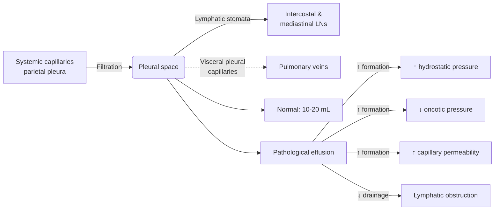

# Pleural Effusion

> [!important]
> A **pleural effusion** is an abnormal accumulation of fluid in the **pleural space** (normally 10–20 mL). The clinical approach is built on **Starling's forces** at the parietal pleura, **Light's criteria** for transudate vs exudate, and a **diagnostic algorithm** that links CXR → thoracentesis → fluid analysis → pleural biopsy. **Key FCPS/MRCP**: 200 mL fluid is the threshold for CXR blunting; **Light's criteria** (any 1 of 3 = exudate); parapneumonic effusions need **pH/glucose/LDH** to decide drainage; **malignant effusions** may need **indwelling pleural catheter** or **pleurodesis**.

Related: [[Asthma]], [[COPD]], [[Respiratory Failure]], [[ABG Interpretation]], [[Pleural Diseases/Transudate vs exudate framework|Transudate vs exudate framework]], [[Pleural Diseases/Parapneumonic effusion|Parapneumonic effusion]], [[Pleural Diseases/Malignant pleural effusion|Malignant pleural effusion]], [[Pleural Diseases/Chylothorax|Chylothorax]], [[Pleural Diseases/Hemothorax|Hemothorax]], [[Pleural Diseases/Empyema and pleural infection|Empyema and pleural infection]], [[Pleural Diseases/Pleural aspiration and chest drain basics|Pleural aspiration and chest drain basics]], [[Pneumonia]], [[Heart Failure]], [[Tuberculosis]]

> [!tip]
> **FCPS/MRCP pearl**: **First classify (transudate vs exudate)**, **then look for cause within that class**. Transudate = systemic (heart, liver, kidney). Exudate = local pleural (infection, malignancy, inflammation). A normal-looking transudate work-up that keeps producing exudate = **Light's misclassification** — re-check with **serum–effusion albumin gradient** (≥1.2 g/dL = truly transudative).

## 1. Learning Objectives
- Describe the **pleural anatomy, microcirculation, and Starling forces** that govern pleural fluid balance.
- Define a pleural effusion and explain the **pathophysiology of transudative vs exudative** accumulation.
- Apply **Light's criteria** and the **serum–effusion albumin gradient** to classify pleural fluid accurately.
- Recognise the **clinical features** (symptoms, signs, CXR) of a pleural effusion.
- Construct a **structured investigation pathway**: CXR → decubitus/USS → thoracentesis → fluid analysis → biopsy.
- Interpret **pleural fluid biochemistry, microbiology, and cytology** (pH, glucose, LDH, protein, ADA, amylase, triglycerides, culture, cytology).
- Formulate a **management plan**: treat cause, **therapeutic thoracentesis, chest drain, fibrinolytics, VATS, pleurodesis, indwelling pleural catheter**.
- Recognise **complications** (empyema, trapped lung, trapped-lung physiology) and the **empyema staging** that drives surgical decision-making.
- Distinguish pleural effusion from **pneumothorax, consolidation, atelectasis, elevated hemidiaphragm, and lung collapse**.

## 2. Definition

**Pleural effusion** is the pathological accumulation of fluid in the pleural space, sufficient to be detected clinically or radiologically. It is a **manifestation of disease**, not a diagnosis in itself.

| Threshold | Volume required |
|-----------|-----------------|
| Detection on lateral decubitus CXR | 5–50 mL |
| Blunting of costophrenic angle on PA CXR | 200–300 mL |
| Blunting of posterior costophrenic angle (lateral) | 50–100 mL |
| Hemithorax "white-out" | 1500–2000 mL |
| Symptomatic dyspnoea | Variable (depends on lung reserve & rate of accumulation) |

> [!critical] **Exam trap**: A rapid accumulation of <1 L can cause severe dyspnoea (lung has no time to compensate), whereas a slow accumulation of >2 L may be tolerated with minimal symptoms (slow mediastinal shift, recruitment of accessory muscles).

## 3. Core Anatomy

### Pleural layers
- **Visceral pleura**: covers lung and lines interlobar fissures; supplied by **bronchial arteries**; **no somatic pain fibres** (autonomic only).
- **Parietal pleura**: lines chest wall, diaphragm, and mediastinum; supplied by **intercostal arteries** (costal part), **internal mammary** (anterior mediastinal part), and **intercostal/bronchial** (mediastinal part); **rich somatic innervation** → pleuritic chest pain.
- **Pleural space (cavity)**: potential space 10–20 µm wide, containing 10–20 mL of serous fluid.

### Lymphatic drainage
- **Lymphatic stomata** (5–10 µm) on the **parietal pleura** — predominantly on the **diaphragmatic** and **mediastinal** surfaces — drain fluid into intercostal and mediastinal lymph nodes.
- **Critical concept**: the lymphatic system can increase drainage **~30-fold** (from 0.2 mL/kg/h baseline) before fluid accumulates. Pleural effusions therefore imply either a **rate of formation that overwhelms lymphatics** or **lymphatic obstruction** itself (e.g., malignancy).

### Blood supply
| Layer | Arterial supply | Venous drainage |
|-------|----------------|-----------------|
| Visceral | Bronchial arteries + some pulmonary artery | Pulmonary veins |
| Parietal (costal) | Intercostal arteries | Intercostal veins → SVC |
| Parietal (diaphragmatic) | Superior phrenic + musculophrenic | Brachiocephalic + IVC |
| Parietal (mediastinal) | Bronchial + internal mammary | Azygos + internal thoracic |

### Innervation
- **Parietal pleura (costal)**: intercostal nerves (T1–T12) → **somatic** → sharp, well-localised pleuritic pain.
- **Parietal pleura (diaphragmatic central)**: **phrenic nerve (C3–C5)** → referred pain to **ipsilateral shoulder tip (C4 dermatome)**.
- **Parietal pleura (mediastinal)**: phrenic nerve.
- **Visceral pleura**: autonomic only → dull/pressure-type discomfort; pain referred via vagus.

> [!tip] **Clinical pearl**: shoulder-tip pain after pleural procedure or with effusion = **phrenic nerve irritation of central diaphragmatic pleura** (C3–5). Always assess in laparoscopic/upper-abdo surgery and post-thoracentesis.

## 4. Core Physiology

### Starling forces in pleural fluid formation
- The pleural space behaves as a **Starling-driven system** with two opposing capillaries:
  - **Parietal pleural capillaries (systemic pressure)**: filter fluid **into** the pleural space.
  - **Visceral pleural capillaries (pulmonary pressure)**: reabsorb fluid **out** of the pleural space.
- Net filtration = `(P_cap_parietal − P_pleural)·σ − (π_cap_parietal − π_pleural)·σ`
  - **P** = hydrostatic pressure; **π** = oncotic pressure; **σ** = reflection coefficient.

| Force | Direction | Magnitude |
|-------|-----------|-----------|
| Parietal capillary hydrostatic (P_c) | Drives filtration **IN** | ~30 cmH₂O |
| Pleural hydrostatic pressure (P_pl) | Resists filtration | ~−5 cmH₂O (negative) |
| Plasma oncotic (π_c) | Resists filtration | ~34 cmH₂O |
| Pleural oncotic (π_pl) | Drives filtration | ~5 cmH₂O |

**Net result**: small net filtration from **parietal pleura** into pleural space; this is then **drained by parietal lymphatics**.

### Why a pleural space is "dry"
- Net filtration is small (~0.5–1 mL/h per hemithorax).
- **Lymphatic stomata** on parietal pleura reabsorb filtered fluid → capacity 0.2 mL/kg/h (≈ 0.7 L/day).
- Effusion forms when **formation > lymphatic capacity** OR **lymphatics are obstructed**.

### Oxygen & CO2 handling
- Visceral pleura is **very thin (≤30 µm)** and offers little diffusion barrier to gases.
- Pleural fluid is normally in equilibrium with systemic venous blood → low PO₂, high PCO₂.
- In disease, **pleural fluid pH, PO₂, PCO₂** reflect local metabolic and inflammatory activity (used in empyema, TB, rheumatoid disease).

### Pathophysiology of fluid accumulation
1. **↑ Hydrostatic pressure** in parietal/systemic capillaries (LV failure, fluid overload, constrictive pericarditis).
2. **↓ Plasma oncotic pressure** (hypoalbuminaemia: nephrotic syndrome, cirrhosis, malnutrition, protein-losing enteropathy).
3. **↑ Capillary permeability** (pleural inflammation: pneumonia, malignancy, PE, autoimmune).
4. **↓ Lymphatic drainage** (malignant infiltration of lymphatics, chylothorax from thoracic duct injury/obstruction).
5. **Fluid from another compartment** moving into pleural space (e.g., pancreatitis → pancreatic ascites tracking, oesophageal rupture → saliva, hepatic hydrothorax from diaphragmatic defects).

## 5. Normal Values / Important Cut-offs

| Parameter | Normal pleural fluid | Threshold of note |
|-----------|----------------------|-------------------|
| Volume | 10–20 mL | >50 mL detectable on decubitus |
| Protein | <1.5 g/dL (<15 g/L) | >3 g/dL = exudate criterion |
| LDH | <50% serum ULN | >2/3 ULN serum = exudate criterion |
| pH | 7.60–7.64 | <7.20 = complicated; <7.00 = empyema tendency |
| Glucose | = plasma (3.3–5.0 mmol/L) | <3.3 mmol/L = infection, RA, malignancy |
| Cells | <1000/µL, mostly mesothelial & macrophages | >10,000 neutrophils = parapneumonic; lymphocyte predominant = TB/malignancy |
| Cholesterol | <1.55 mmol/L | >1.55 = exudate (cholesterol criterion) |
| Triglyceride | <0.56 mmol/L | >1.24 mmol/L = chylothorax; 0.56–1.24 → lipoprotein analysis |

## 6. Classification

### 1. By mechanism (Light's criteria — the cornerstone)
| Type | Mechanism | Pleural problem? |
|------|-----------|------------------|
| **Transudate** | Systemic factor: ↑ hydrostatic, ↓ oncotic pressure | **No** — pleura is intact |
| **Exudate** | Local pleural factor: ↑ capillary permeability, ↓ lymphatic drainage | **Yes** — pleural disease present |

**Light's criteria** (any 1 of 3 = exudate):
1. Pleural protein / serum protein **> 0.5**
2. Pleural LDH / serum LDH **> 0.6**
3. Pleural LDH **> 2/3 upper limit of normal** for serum LDH

**Sensitivity 98% / Specificity 80%** for exudate → few exudates missed, but some transudates misclassified as exudate (especially patients on diuretics for heart failure).

**Serum–effusion albumin gradient** (to "rescue" misclassified transudates):
- Serum albumin − pleural albumin **> 1.2 g/dL** → re-classify as **transudate** (regardless of Light's).
- Serum – effusion protein gradient **> 3.1 g/dL** → also supports transudate.
- Cholesterol criterion: pleural cholesterol **> 1.55 mmol/L** → exudate.

### 2. By fluid character
- **Serous** (clear, straw-coloured): transudates, early parapneumonic
- **Turbid/purulent**: empyema, complicated parapneumonic
- **Blood-stained (haemorrhagic)**: trauma, malignancy, PE, TB
- **Frank blood** (PCV >50% serum): **haemothorax**
- **Milky/opalescent**: chylothorax, pseudochylothorax, empyema
- **Anchovy-paste (brown)**: amoebic (ruptured liver abscess)
- **Food particles**: oesophageal rupture
- **Black**: *Aspergillus* infection

### 3. By clinical course
- **Uncomplicated** vs **complicated parapneumonic** (pH <7.20, glucose <2.2, LDH >1000, positive Gram stain/culture, loculation) → needs chest drain.
- **Simple** vs **complex** (loculated, multiloculated) → may need fibrinolytics or VATS.

### 4. Empyema staging (Light's stages — drives surgical decision-making)
| Stage | Name | Pathology | Treatment |
|-------|------|-----------|-----------|
| **I** | Exudative | Free-flowing fluid, sterile; visceral pleura mobile | Antibiotics ± thoracentesis |
| **II** | Fibrinopurulent | Fibrin deposition, loculations, pus; tendency to peel | Chest drain ± fibrinolytics ± VATS |
| **III** | Organising | Fibroblast invasion, peel → trapped lung; thick rind | VATS decortication, surgery |

## 7. Etiology / Causes

### Transudates (Light's negative)
| System | Cause | Mechanism |
|--------|-------|-----------|
| Cardiac | **Left heart failure** (most common cause overall) | ↑ pulmonary capillary hydrostatic pressure |
| Cardiac | **Constrictive pericarditis** | ↑ systemic venous pressure transmitted to parietal pleura |
| Hepatic | **Hepatic hydrothorax** (cirrhosis) | Trans-diaphragmatic movement of ascitic fluid via defects |
| Renal | **Nephrotic syndrome** | ↓ plasma oncotic pressure (hypoalbuminaemia) |
| Renal | **Peritoneal dialysis** | Dialysate tracks into pleural space |
| Endocrine | **Myxoedema (hypothyroidism)** | Increased capillary permeability + ↓ lymphatic drainage |
| Nutritional | **Severe malnutrition / protein-losing enteropathy** | Hypoalbuminaemia |

### Exudates (Light's positive)

| Category | Common cause | Hallmark test |
|----------|--------------|---------------|
| **Infection** | **Parapneumonic** (most common exudate) | pH, glucose, LDH, culture |
| | **Empyema** (pus in pleural space) | Frank pus, positive Gram stain/culture |
| | **Tuberculous pleuritis** | **ADA > 40 U/L**, lymphocyte-predominant, AFB/MTB PCR |
| | Viral pleuritis, fungal, parasitic | Specific serology/PCR |
| **Malignancy** | Lung, breast, lymphoma, mesothelioma, ovarian | **Cytology**, pleural biopsy (CT-guided or thoracoscopic) |
| **Pulmonary embolism** | PE with infarction | Haemorrhagic, eosinophilic; clinical context |
| **Connective tissue** | RA, SLE, Sjögren's, vasculitis | ANA, anti-CCP, complement; very low glucose in RA |
| **GI** | **Pancreatitis** (high amylase), oesophageal rupture (**Boerhaave**, low pH, salivary amylase, food) | Pleural amylase |
| **Drugs** | Nitrofurantoin, amiodarone, methotrexate, dasatinib, bromocriptine, phenytoin | Drug history |
| **Asbestos exposure** | Benign asbestos pleural effusion | Occupational history, B-read CXR |
| **Meigs syndrome** | Ovarian fibroma + ascites + effusion | Pelvic imaging |
| **Yellow nail syndrome** | Yellow nails, lymphoedema, chronic effusion | Clinical |
| **Chylothorax** | Thoracic duct injury, lymphoma | Triglycerides > 1.24 mmol/L, chylomicrons |
| **Pseudochylothorax** | Long-standing trapped effusion (TB, RA) | Cholesterol > 6.5 mmol/L, cholesterol crystals |
| **Dressler syndrome** | Post-MI autoimmune pericarditis/pleuritis | Time course (2–10 weeks post-MI) |
| **Uraemia** | Uraemic pleuritis | Renal failure context |

> [!tip] **Mnemonic for exudative causes — "MIT"**: **M**alignancy, **I**nfection (parapneumonic, TB, empyema), **T**hromboembolism (PE). Plus "CRAP": **C**onnective tissue, **R**upture (oesophagus), **A**bdominal (pancreas), **P**ost-cardiac injury (Dressler).

*[Content truncated for rendering — see pleural-effusion.md for full content]*
