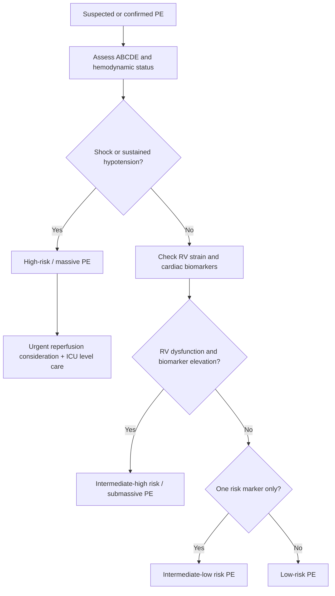
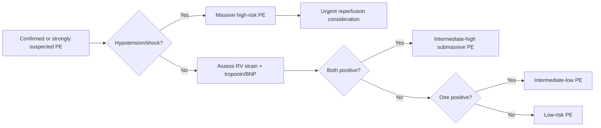

# Massive vs submassive pulmonary embolism risk stratification

> [!important]
> **Pulmonary embolism (PE) risk stratification** means identifying whether the patient has **high-risk (massive) PE**, **intermediate-risk (submassive) PE**, or lower-risk PE. The crucial issue is not clot size alone, but whether PE is causing **hemodynamic instability, right ventricular (RV) strain, myocardial injury, or imminent collapse**.

Related: [[Pulmonary Embolism]], [[Pulmonary Vascular Diseases/D-dimer, CTPA, and Wells score framework|D-dimer, CTPA, and Wells score framework]], [[Respiratory Failure]], [[ABG Interpretation]], [[Chest X-Ray Approach]], [[Pulmonary Vascular Diseases/Pulmonary hypertension|Pulmonary hypertension]]

> [!tip]
> FCPS/MRCP usually test **massive vs submassive PE definitions, shock/hypotension criteria, RV strain markers, troponin/BNP relevance, thrombolysis indications, and why a normotensive patient can still be high risk if RV failure is evolving**.

## Learning Objectives
- Define high-risk/massive and intermediate-risk/submassive PE.
- Understand the cardiopulmonary physiology behind acute RV overload and obstructive shock.
- Use clinical status, biomarkers, imaging, and ECG/echo clues for risk stratification.
- Apply risk stratification to management decisions including anticoagulation, thrombolysis, and escalation.
- Recognize important mimics, red flags, and contraindications to reperfusion therapy.

## Definition
Pulmonary embolism risk stratification is the process of categorizing confirmed or strongly suspected PE according to **early mortality risk and need for escalated therapy**.

### Practical categories
- **High-risk / massive PE**: PE with **hemodynamic instability**
- **Intermediate-risk / submassive PE**: no shock, but evidence of **RV dysfunction and/or myocardial injury**
- **Low-risk PE**: hemodynamically stable without major RV strain/biomarker concern

## Core Anatomy
### 1. Pulmonary arterial tree
- Emboli lodge in the **main, lobar, segmental, or subsegmental pulmonary arteries**.
- Central clot burden more often causes severe hemodynamic effects, but location alone does not fully determine risk.

### 2. Right ventricle
- The RV is a thin-walled chamber designed for low-pressure pulmonary circulation.
- Acute obstruction sharply increases pulmonary vascular resistance and may overwhelm the RV.

### 3. Interventricular dependence
- RV dilation shifts the interventricular septum toward the LV.
- LV filling falls, reducing cardiac output and systemic BP.

### 4. Pulmonary circulation reserve
- A large acute PE drastically reduces perfused pulmonary vascular bed.
- This increases dead space and impairs gas exchange.

> [!important]
> Massive/submassive PE is really a topic of **acute RV pressure overload and circulatory risk**, not just “big clot vs small clot.”

## Core Physiology
### 1. Acute pulmonary vascular obstruction
PE causes:
- abrupt rise in pulmonary artery resistance
- impaired RV ejection
- RV dilation and wall stress

### 2. RV failure physiology
As RV afterload rises:
- RV stroke volume falls
- septal shift reduces LV filling
- systemic output drops
- hypotension and shock may occur

### 3. Gas exchange disturbance
- ventilated but unperfused units increase **dead space**
- V/Q mismatch causes hypoxemia
- tachypnea is common

### 4. Biomarker logic
- RV strain causes **troponin** release and may increase **BNP/NT-proBNP**
- biomarker elevation suggests higher risk in the right context

### 5. Why normotension can be misleading
A patient may be temporarily normotensive yet still have:
- significant RV dysfunction
- high clot burden
- elevated troponin
- impending decompensation

## Normal Values / Important Cut-offs
### High-risk / massive PE concept
Hemodynamic instability typically means one or more of:
- sustained hypotension
- obstructive shock
- cardiac arrest / peri-arrest physiology

### Common bedside blood pressure clue
- systolic BP **<90 mmHg** or a significant pressure drop with shock features is highly concerning

### ABG
- hypoxemia common but not universal
- low PaCO2 often reflects tachypnea
- normal ABG does not exclude PE

### Biomarker/risk idea
- elevated troponin or BNP supports higher risk when combined with PE and RV strain evidence

## Classification
### 1. High-risk / massive PE
Defined by **hemodynamic instability**:
- hypotension
- shock
- cardiac arrest / collapse

### 2. Intermediate-risk / submassive PE
Hemodynamically stable **but** with evidence of RV strain and/or myocardial injury.

#### Intermediate-high risk
- RV dysfunction on imaging/echo
- **and** elevated cardiac biomarker(s)

#### Intermediate-low risk
- one but not both of the above risk markers

### 3. Low-risk PE
- stable
- no major RV dysfunction
- no major biomarker elevation

## Etiology / Causes
The clot source is usually venous thromboembolism from:
- deep vein thrombosis of lower limb or pelvis

Predisposing factors:
- immobility
- surgery
- malignancy
- pregnancy/postpartum
- estrogen therapy
- thrombophilia
- prior VTE
- heart failure
- acute medical illness

## Risk Factors for Deterioration
- hemodynamic lability
- RV dysfunction on echo/CT
- elevated troponin/BNP
- persistent tachycardia
- severe hypoxemia
- syncope
- large central clot burden
- major cardiopulmonary comorbidity

## Pathophysiology
### Massive PE
- sudden major obstruction
- RV cannot maintain forward flow
- LV preload falls
- shock develops
- death may occur from pulseless electrical activity or severe circulatory collapse

### Submassive PE
- BP may be maintained initially
- but RV is strained and injured
- risk exists for deterioration, arrhythmia, and progression to shock

## Clinical Features
### Symptoms
- sudden dyspnea
- pleuritic chest pain
- syncope or presyncope
- cough/hemoptysis occasionally

### Signs
- tachypnea
- tachycardia
- hypoxemia
- raised JVP in severe cases
- hypotension in massive PE
- signs of DVT may coexist

### High-risk clues
- shock
- syncope with instability
- cyanosis
- altered mentation
- severe RV strain pattern on bedside assessment

## Approach / Risk-Stratification Algorithm

## Investigations
### 1. ECG
Possible clues:
- sinus tachycardia
- right heart strain pattern
- S1Q3T3 is classic but neither sensitive nor specific
- new RBBB may occur

### 2. ABG
- may show hypoxemia
- low PaCO2 from hyperventilation
- normal values do not rule out PE

### 3. Troponin / BNP
- support RV strain/myocardial injury assessment
- help identify intermediate-risk PE

### 4. CTPA
- confirms PE and may show RV enlargement/strain markers

### 5. Echocardiography
Useful especially in unstable patients:
- RV dilation
- septal flattening
- RV dysfunction
- pulmonary hypertension clues

### 6. Compression ultrasound leg veins
- may support VTE diagnosis if DVT is found

## Interpretation Frameworks
### 1. Massive vs submassive framework
| Feature | Massive / high-risk PE | Submassive / intermediate-risk PE |
|---|---|---|
| Blood pressure | unstable | stable |
| Shock | present | absent |
| RV strain | often present | may be present |
| Troponin/BNP | may be elevated | may be elevated |
| Thrombolysis urgency | often considered | selective, not routine for all |

### 2. RV strain markers
Look for:
- RV dilation on CT/echo
- septal bowing
- elevated troponin
- elevated BNP
- ECG right-heart strain pattern

### 3. ABG interpretation in PE
| Pattern | Meaning |
|---|---|
| low PaO2 + low PaCO2 | common early PE pattern |
| normal ABG | does not exclude PE |
| severe hypoxemia / rising CO2 | more severe disease or alternate/additional pathology |

### 4. Chest X-ray logic
- CXR may be normal
- useful more for excluding mimics such as pneumonia or pneumothorax than proving PE

## Diagnosis
Diagnosis requires integrating:
- clinical suspicion
- imaging confirmation, usually CTPA when appropriate
- hemodynamic assessment
- RV strain evidence
- biomarker profile

Risk category is assigned **after** or alongside confirmation when urgent management is needed.

## Differential Diagnosis
| Differential | Clues favoring it |
|---|---|
| **Pneumonia** | fever, consolidation, infective syndrome |
| **Pneumothorax** | unilateral absent breath sounds, hyperresonance, pleural line |
| **ACS** | ischemic chest pain, ECG/troponin pattern more coronary |
| **Aortic dissection** | tearing pain, pulse/BP asymmetry |
| **Acute asthma/COPD** | wheeze/obstructive history predominant |
| **Heart failure** | edema pattern, crackles, orthopnea |

## Tables / Comparison Charts
### Massive vs submassive vs low-risk PE
| Category | BP status | RV strain | Biomarkers | Practical meaning |
|---|---|---|---|---|
| Massive / high-risk | unstable | often yes | often yes | urgent reperfusion consideration |
| Intermediate-high / submassive | stable | yes | yes | close monitoring, deterioration risk |
| Intermediate-low | stable | one marker only | one marker only | admit/observe carefully |
| Low-risk | stable | no major RV strain | negative/low concern | routine anticoagulation pathway |

## Management
### 1. Immediate principles
- assess ABCDE
- give oxygen if hypoxemic
- support circulation
- anticoagulate unless contraindicated when PE is confirmed or highly likely and safe to do so
- determine risk category rapidly

### 2. Massive / high-risk PE
- urgent senior/ICU involvement
- **reperfusion therapy** consideration, usually systemic thrombolysis when indicated and not contraindicated
- consider catheter-based or surgical options where appropriate/available if thrombolysis unsuitable or failing

### 3. Submassive / intermediate-risk PE
- anticoagulation is standard
- close monitoring for decompensation
- thrombolysis is **not routine for every normotensive patient**, but may be considered selectively if deterioration occurs or RV failure risk is extreme

### 4. Low-risk PE
- anticoagulation
- assess disposition based on overall clinical context

## Drug Interactions / Contraindications / Cautions
### Thrombolysis cautions
Important contraindication thinking includes:
- recent intracranial hemorrhage
- active major bleeding
- recent major surgery/trauma
- severe uncontrolled hypertension
- other major bleeding risks

### Anticoagulation cautions
- renal impairment may affect agent choice/dose
- drug interactions and bleeding history matter

> [!warning]
> Not every large-looking PE needs thrombolysis. **Hemodynamic instability and RV failure risk** drive the urgency.

## Procedures / Indications / Contraindications
### Thrombolysis
**Indication:** high-risk PE with hemodynamic instability, unless contraindicated.

### Echocardiography
**Indication:** unstable PE, RV strain assessment, bedside risk clarification.

### Catheter-directed therapy / embolectomy
**Indication:** selected patients when thrombolysis is contraindicated, unavailable, or ineffective.

## Procedure Mini-Sections
### Systemic thrombolysis
- **Goal:** rapidly reduce clot burden and RV afterload
- **Risk:** major bleeding including intracranial hemorrhage
- **Pearl:** strongest indication is unstable/high-risk PE

### Bedside echo in PE
- **Why:** identify RV strain quickly in unstable patients
- **Pitfall:** a normal echo does not completely exclude PE in all settings

## Complications
- obstructive shock
- cardiac arrest
- acute RV failure
- recurrent embolism
- chronic thromboembolic pulmonary hypertension
- bleeding complications from therapy

## Red Flags / Emergencies
- systolic hypotension / shock
- syncope with instability
- severe hypoxemia
- rising lactate / poor perfusion
- RV dysfunction with worsening tachycardia
- arrest / peri-arrest state

## Special Situations
### Pregnancy
- PE remains a major cause of maternal morbidity/mortality
- imaging and anticoagulation choices require obstetric-safe framing but risk stratification logic remains essential

### Cancer-associated thrombosis
- recurrent VTE risk is higher
- bleeding/anticoagulation complexity is greater

### Elderly/comorbid patient
- presentation may be atypical
- bleeding risk complicates thrombolysis decisions

## Prognosis
- High-risk PE has substantial early mortality without rapid treatment.
- Intermediate-risk PE needs close observation because deterioration can occur despite initial normotension.
- Long-term outcomes depend on recurrence prevention and residual pulmonary vascular burden.

## Topic Correlation
- [[Pulmonary Embolism]] provides the general PE disease framework.
- [[Pulmonary Vascular Diseases/D-dimer, CTPA, and Wells score framework|D-dimer, CTPA, and Wells score framework]] helps diagnosis before/alongside confirmation.
- [[ABG Interpretation]] and [[Chest X-Ray Approach]] support bedside reasoning.
- [[Pulmonary Vascular Diseases/Pulmonary hypertension|Pulmonary hypertension]] links to long-term sequelae.

## FCPS/MRCP High-Yield Points
- Massive PE = **hemodynamic instability**.
- Submassive PE = **normotensive but RV strain and/or biomarker elevation**.
- RV dysfunction matters more than just angiographic clot size.
- Troponin/BNP elevation supports higher risk in PE.
- Echo/CT evidence of RV strain upgrades concern.
- Thrombolysis is most clearly indicated in **high-risk unstable PE**.
- A normotensive patient can still deteriorate if RV failure is evolving.

## Common Viva Questions
- Define massive and submassive PE.
- What makes a PE high risk?
- What is the role of RV dysfunction in stratification?
- Which biomarkers are useful?
- When is thrombolysis indicated?
- Why is a stable blood pressure not always reassuring?

## Common Confusions / Exam Traps
- Equating “massive” only with clot size rather than instability.
- Thrombolysing every large PE without hemodynamic indication.
- Ignoring RV strain markers in a normotensive patient.
- Over-relying on chest X-ray to diagnose PE.
- Thinking a normal ABG excludes PE.

## Mnemonics
### **PE RISK**
- **P**ressure low?
- **E**cho RV strain?
- **R**V failure signs?
- **I**njury biomarkers raised?
- **S**hock = high-risk
- **K**eep monitoring if intermediate risk

## Mind Map
- PE risk stratification
  - high risk
    - hypotension
    - shock
    - arrest
  - intermediate risk
    - RV strain
    - troponin/BNP raised
  - investigations
    - CTPA
    - echo
    - ECG
    - ABG
  - treatment
    - anticoagulation
    - thrombolysis if unstable
    - ICU/escalation

## Flowchart

## Suggested Visuals / Image Notes
- RV strain physiology diagram with septal shift
- Massive vs submassive PE comparison table
- CTPA/echo RV enlargement example panel
- PE management escalation pathway

## Suggested Video References
- Short review on **massive vs submassive PE**
- Video on **RV strain markers in pulmonary embolism**
- Viva-style review on **thrombolysis indications in PE**

## One-Page Revision Summary
### PE risk stratification rapid sheet
- **Massive/high-risk PE:** hypotension, shock, collapse, arrest
- **Submassive/intermediate-risk PE:** stable BP but RV strain and/or troponin/BNP elevation
- **Low-risk PE:** stable with no major RV strain markers
- **Key physiology:** acute RV afterload rise → RV dilation → septal shift → ↓LV filling → shock
- **Tests:** CTPA, echo, ECG, troponin, BNP, ABG
- **ABG pearl:** low O2 + low CO2 common; normal ABG does not exclude PE
- **Treatment:** anticoagulation for most; thrombolysis mainly for unstable/high-risk PE
- **Exam trap:** massive ≠ just big clot, it means hemodynamic danger

## 24-Hour Recall Prompts
- Define massive vs submassive PE.
- What makes a PE high risk?
- Why is RV strain central to prognosis?
- When is thrombolysis indicated?
- Name four markers of intermediate-risk PE.
- Why does normal blood pressure not always reassure?

## 7-Day / 15-Day / 30-Day Revision Tracker
- **Day 1:** Write the classification of PE risk from memory.
- **Day 7:** Explain RV failure physiology in massive PE.
- **Day 15:** Compare massive vs submassive PE using three clinical cases.
- **Day 30:** Reproduce the reperfusion decision logic from a blank page.

## Must Know / Should Know / Nice to Know
### Must Know
- massive PE = instability
- submassive PE = stable BP with RV strain/biomarker concern
- RV strain markers and troponin role
- thrombolysis indication logic

### Should Know
- intermediate-high vs intermediate-low risk
- echo/CT strain clues
- major thrombolysis contraindication thinking

### Nice to Know
- detailed catheter-directed techniques and advanced risk scores

## My Weak Points
- Do I define massive PE by shock rather than clot size?
- Do I remember RV strain markers?
- Do I know that normotensive PE can still be dangerous?
- Can I explain why thrombolysis is not routine for all PE?

## Self-Test Scorecard
- Understanding /10
- Recall /10
- Risk stratification /10
- MCQ performance /10
- Viva confidence /10

**Interpretation:**
- **<35/50** = weak topic
- **35–44/50** = fair
- **45+/50** = strong exam-ready topic

## Exam Answer Modes
### Short note mode
Massive or high-risk pulmonary embolism is PE associated with hemodynamic instability such as sustained hypotension or shock. Submassive or intermediate-risk PE is defined by preserved blood pressure but evidence of right ventricular dysfunction and/or myocardial injury. Risk stratification guides therapy: unstable PE may require thrombolysis, while stable PE is usually managed with anticoagulation and close monitoring according to RV strain and biomarker status.

### Viva mode
- Define massive PE.
- Define submassive PE.
- What are RV strain markers?
- What is the role of troponin?
- When will you thrombolyse?

### Ward-case mode
In a suspected or confirmed PE, first determine hemodynamic stability. If there is shock or hypotension, treat as high-risk PE and consider urgent reperfusion. If blood pressure is preserved, assess RV strain on CT/echo and biomarkers to identify intermediate-risk PE that needs close monitoring for decompensation.

## Summary
Massive vs submassive PE risk stratification is a crucial exam and bedside skill centered on **hemodynamic status, RV strain, and myocardial injury markers**, because these determine which patients need **routine anticoagulation only** and which require **urgent escalated reperfusion-focused care**.

## MCQs (10)
1. Massive pulmonary embolism is best defined by:
   - A. any PE with chest pain
   - B. hemodynamic instability such as hypotension or shock
   - C. any embolus seen on CTPA
   - D. all saddle emboli regardless of stability
   - E. only hemoptysis

2. Submassive PE usually refers to:
   - A. normotensive PE with RV dysfunction and/or biomarker elevation
   - B. isolated calf DVT
   - C. PE with no symptoms
   - D. chronic pulmonary hypertension only
   - E. small pleural effusion

3. Which cardiac chamber is central to early hemodynamic failure in massive PE?
   - A. Left atrium
   - B. Left ventricle
   - C. Right ventricle
   - D. Right atrium only
   - E. Coronary sinus

4. Which finding most strongly supports intermediate-risk PE?
   - A. Normal CXR alone
   - B. Elevated troponin with RV dilation on imaging in a stable patient
   - C. Chronic cough only
   - D. Bradycardia without symptoms
   - E. Low ESR only

5. Which treatment is most strongly considered in high-risk unstable PE?
   - A. Routine inhaled steroid
   - B. Systemic thrombolysis if appropriate
   - C. Antibiotics only
   - D. Delayed anticoagulation for several days
   - E. No treatment until spirometry

6. A normal ABG in suspected PE means:
   - A. PE is excluded
   - B. PE is less likely but still possible
   - C. thrombolysis is mandatory
   - D. DVT is impossible
   - E. heart failure is certain

7. Which biomarker supports RV strain/myocardial injury assessment in PE?
   - A. Amylase
   - B. Troponin
   - C. Bilirubin only
   - D. Ferritin only
   - E. TSH only

8. Which statement is most correct?
   - A. Massive PE is defined only by clot size on CTPA
   - B. Hemodynamic instability defines high-risk PE
   - C. All submassive PE should be thrombolysed routinely
   - D. RV strain is irrelevant if BP is normal
   - E. Chest X-ray proves PE directly in most cases

9. Which ECG pattern may be seen in PE but is not sensitive/specific?
   - A. Delta wave
   - B. S1Q3T3
   - C. Sawtooth flutter waves only
   - D. Peaked T in all leads
   - E. Complete heart block always

10. A stable PE patient with both RV dysfunction and elevated troponin is best described as:
   - A. low-risk PE
   - B. intermediate-high risk PE
   - C. non-thrombotic PE
   - D. no PE
   - E. isolated DVT

## SBA Questions (10)
1. A 58-year-old man with confirmed PE is hypotensive, clammy, and confused. What is the best risk category?
   - A. Low-risk PE
   - B. Intermediate-low risk PE
   - C. High-risk/massive PE
   - D. Subsegmental incidental PE
   - E. Chronic thromboembolic disease only

2. A normotensive woman with CTPA-confirmed PE has RV enlargement on CT and elevated troponin. What is the most accurate classification?
   - A. Low-risk PE
   - B. Intermediate-high risk / submassive PE
   - C. Massive PE because clot is present
   - D. No PE because BP is normal
   - E. Stable angina

3. Which physiologic event most directly causes shock in massive PE?
   - A. Isolated pleural inflammation
   - B. Acute RV failure leading to reduced LV preload and output
   - C. Excess surfactant production
   - D. Bronchospasm alone
   - E. Systemic vasodilation only without RV involvement

4. A patient with PE is stable but tachycardic and hypoxemic. Echo shows RV dilation; troponin is normal. How should this be interpreted?
   - A. Intermediate-low risk PE
   - B. Massive PE
   - C. No PE
   - D. Low-risk PE for certain discharge
   - E. Aortic dissection

5. In confirmed high-risk PE without contraindication, what therapy is most likely to improve outcome urgently?
   - A. Delayed warfarin only
   - B. Systemic thrombolysis
   - C. Cough suppressant
   - D. Inhaled bronchodilator only
   - E. Statin loading alone

6. A patient has sudden dyspnea and suspected PE. Chest X-ray is normal. What is the best interpretation?
   - A. PE is excluded
   - B. PE remains possible; CXR is often normal
   - C. Massive pneumonia is proven
   - D. COPD exacerbation is certain
   - E. No further testing is needed

7. Which finding most strongly pushes a stable PE patient toward closer monitored care rather than routine low-risk pathway?
   - A. RV dysfunction on echo
   - B. Normal pulse oximetry only
   - C. Mild seasonal rhinitis
   - D. Long-standing cataract
   - E. Isolated low back pain

8. A patient with submassive PE becomes more tachycardic, hypotensive, and confused on the ward. What has most likely happened?
   - A. He has converted to low-risk PE
   - B. He is deteriorating toward high-risk PE physiology
   - C. PE can no longer be the cause
   - D. Echo is unnecessary now
   - E. Anticoagulation should be stopped immediately in all cases

9. Which marker pair is most typical of intermediate-high risk PE?
   - A. Normal echo and negative troponin
   - B. RV dysfunction plus elevated troponin/BNP
   - C. Normal ECG and normal pulse
   - D. CXR infiltrate plus neutrophilia
   - E. Hyperkalemia plus bradycardia

10. What is the key exam message about “massive” PE?
   - A. It always means a saddle embolus only
   - B. It means hemodynamic danger, not just anatomical clot size
   - C. It means recurrent DVT only
   - D. It means chronic pulmonary hypertension only
   - E. It means pleural effusion is present

## Flashcards
- Q: What defines massive/high-risk PE?
  A: Hemodynamic instability such as shock or sustained hypotension.
- Q: What defines submassive/intermediate-risk PE?
  A: Stable BP with RV dysfunction and/or myocardial injury markers.
- Q: Which ventricle fails first in major PE?
  A: The **right ventricle**.
- Q: Name two biomarkers used in PE risk stratification.
  A: **Troponin** and **BNP/NT-proBNP**.
- Q: What imaging modality may show RV strain in unstable PE?
  A: **Echocardiography** or **CTPA**.
- Q: Does a normal ABG exclude PE?
  A: No.
- Q: What is the main urgent reperfusion therapy in unstable PE when appropriate?
  A: **Systemic thrombolysis**.
- Q: What is the key mechanism of shock in massive PE?
  A: Acute RV failure causing reduced LV filling and output.
- Q: Can a normotensive PE patient still be high risk?
  A: Yes, if there is significant RV strain and biomarker evidence.
- Q: What classic but nonspecific ECG pattern may occur in PE?
  A: **S1Q3T3**.

## Answer Key with Explanations
### MCQs
1. **B. hemodynamic instability such as hypotension or shock**
   - High-risk PE is defined by instability, not just clot appearance.
2. **A. normotensive PE with RV dysfunction and/or biomarker elevation**
   - This is the essence of submassive/intermediate-risk PE.
3. **C. Right ventricle**
   - Acute RV overload drives the early hemodynamic problem.
4. **B. Elevated troponin with RV dilation on imaging in a stable patient**
   - This strongly supports intermediate-risk PE.
5. **B. Systemic thrombolysis if appropriate**
   - It is most strongly considered in unstable/high-risk PE.
6. **B. PE is less likely but still possible**
   - Normal ABG does not exclude PE.
7. **B. Troponin**
   - Troponin indicates myocardial injury from RV strain.
8. **B. Hemodynamic instability defines high-risk PE**
   - This is the exam-critical concept.
9. **B. S1Q3T3**
   - Classic but insensitive and nonspecific.
10. **B. intermediate-high risk PE**
   - RV dysfunction plus elevated biomarker in a stable patient fits this category.

### SBAs
1. **C. High-risk/massive PE**
   - Hypotension and shock features make this high risk.
2. **B. Intermediate-high risk / submassive PE**
   - She is stable but has both RV strain and biomarker elevation.
3. **B. Acute RV failure leading to reduced LV preload and output**
   - This is the central shock mechanism.
4. **A. Intermediate-low risk PE**
   - One major strain marker without biomarker elevation fits intermediate-low risk.
5. **B. Systemic thrombolysis**
   - Appropriate urgent reperfusion option in high-risk unstable PE.
6. **B. PE remains possible; CXR is often normal**
   - CXR is often more useful to exclude mimics than confirm PE.
7. **A. RV dysfunction on echo**
   - This pushes a stable patient into higher-risk observation territory.
8. **B. He is deteriorating toward high-risk PE physiology**
   - Worsening hemodynamics signal escalation.
9. **B. RV dysfunction plus elevated troponin/BNP**
   - That is the typical intermediate-high risk combination.
10. **B. It means hemodynamic danger, not just anatomical clot size**
   - This is the core exam pearl.
