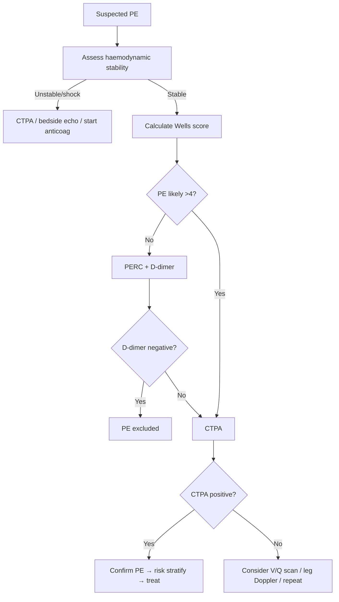

# Pulmonary Embolism (PE)

> [!important]
> **Pulmonary embolism (PE)** is the **obstruction of a pulmonary artery** (or its branches) by material — most commonly a **thrombus originating from deep veins of the lower limbs or pelvis (DVT)**. It is a **medical emergency** with presentations ranging from asymptomatic subsegmental PE to **massive PE causing obstructive shock and sudden death**.

Related: [[Respiratory Failure]], [[ABG Interpretation]], [[Hemoptysis]], [[Oxygen Therapy and NIV]], [[Chest X-Ray Approach]], [[Pulmonary Vascular Diseases/Massive vs submassive pulmonary embolism risk stratification|Massive vs submassive PE]]

> [!tip] **FCPS/MRCP pearl**: Suspect PE in **unexplained dyspnoea, pleuritic chest pain, syncope, or haemoptysis**, especially with risk factors (immobilisation, surgery, cancer, OCP, prior VTE). Confirm with **Wells score → D-dimer → CTPA**. A **normal PaCO₂ + A-a gradient is sensitive** for exclusion in low-pre-test-probability patients.

## 1. Learning Objectives
- Define PE, list risk factors, and apply Virchow's triad.
- Differentiate provoked vs unprovoked vs cancer-associated vs pregnancy-associated PE.
- Recognise clinical features and use **Wells score** + **PERC rule** for pre-test probability.
- Interpret D-dimer, CTPA, V/Q scan, leg Doppler, and bedside echocardiography.
- Classify PE by severity (massive / submassive / low-risk) and haemodynamic status.
- Manage acute PE: anticoagulation (LMWH, DOAC, UFH, warfarin), thrombolysis, embolectomy, IVC filter.
- Plan duration of anticoagulation, evaluate for CTEPH, and screen for occult cancer in unprovoked PE.

## 2. Definition

**Pulmonary embolism (PE)**: obstruction of the pulmonary arterial tree by embolic material. The vast majority (~95%) are **thromboemboli from lower-limb or pelvic DVT**. Non-thrombotic causes include:
- **Septic emboli** (endocarditis, infected lines)
- **Fat embolism** (long-bone fracture, orthopaedic surgery)
- **Amniotic fluid embolism** (peripartum)
- **Air embolism** (central lines, surgery, diving)
- **Tumour embolism** (renal cell, hepatocellular)
- **Foreign body embolism** (talc in IV drug users)

### Epidemiology
- **Incidence**: ~60–70 per 100,000 per year
- **Lifetime risk**: ~8% first-generation relatives
- **Mortality**: untreated PE ~30%; treated <5–10%
- **CTEPH**: 2–4% after symptomatic PE

## 3. Core Anatomy

### Pulmonary arterial tree
| Segment | Notes |
|---------|-------|
| **Main pulmonary artery (MPA)** | Bifurcates into right and left PA |
| **Lobar arteries** | 3 right (upper, middle, lower), 2 left (upper, lower) |
| **Segmental arteries** | 10 right, 8–10 left; corresponding to bronchopulmonary segments |
| **Subsegmental arteries** | Continue branching; smallest clinically significant PE level |

### Source of emboli
- **Proximal DVT** (popliteal, femoral, iliac, IVC) — accounts for majority
- **Pelvic vein thrombosis** — post-partum, post-pelvic surgery
- **Upper-limb DVT** (Paget-Schroetter, central lines) — ~5%
- **Right-heart thrombus** — "in transit" PE, very high mortality

## 4. Core Physiology

### Gas exchange consequences
- **V/Q mismatch** — ventilated alveoli not perfused → ↑dead space → ↓PaCO₂ initially (hyperventilation) or normal; hypoxaemia
- **Right-to-left shunt** through atelectatic lung
- **↓Pulmonary capillary blood volume** → ↓CO diffusion
- **Bronchoconstriction** from platelet-derived serotonin, thromboxane → wheeze, ↑ airway resistance
- **Surfactant dysfunction** (over hours) → atelectasis → further shunt

### Haemodynamic consequences
- **Obstruction** of ≥30–50% of cross-sectional area → ↑ pulmonary vascular resistance (PVR)
- **Right ventricular (RV) afterload ↑** → RV dilation, ↓ RV output
- **Interventricular septum bows into LV** → ↓LV preload → ↓cardiac output → **obstructive shock**
- **Neurohumoral response**: hypoxaemia → sympathetic surge → tachycardia; vasoactive mediators (TXA2, serotonin) → further ↑PVR
- **Cor pulmonale** if chronic (CTEPH)

## 5. Etiology / Causes

### Virchow's triad (pathogenesis of thrombosis)
1. **Venous stasis** — immobility, bed rest, long-haul travel, heart failure, venous obstruction
2. **Endothelial injury** — surgery, trauma, central lines, inflammation
3. **Hypercoagulability** (thrombophilia) — inherited or acquired

### Risk factors
| Provoked / strong | Unprovoked / weak | Inherited thrombophilia |
|-------------------|-------------------|-------------------------|
| Recent surgery (orthopaedic > abdominal > neuro) | Increasing age | Factor V Leiden (APCR) |
| Major trauma / spinal cord injury | Obesity | Prothrombin G20210A |
| Active cancer (esp. pancreatic, brain, ovarian) | Smoking | Protein C/S deficiency |
| Hospitalisation / immobility >3 days | Hypertension | Antithrombin deficiency |
| Prior VTE | Diabetes | Hyperhomocysteinaemia |
| Pregnancy / postpartum | Dyslipidaemia | Antiphospholipid syndrome |
| OCP / HRT (esp. 3rd-generation) | Chronic kidney disease | |
| Long-haul flight >4 h | Varicose veins | |

> [!critical] **Cancer-associated PE**: 4–7× risk; commonest in pancreatic, brain, lung, ovarian, gastric. Treat with LMWH or DOAC (consider drug–drug interactions, bleeding risk).

## 6. Pathophysiology

### Sequence in acute PE
1. **Thrombus dislodgement** from DVT → travels via IVC → RA → RV → PA
2. **Mechanical obstruction** of pulmonary vasculature
3. **Neurohumoral mediator release** (serotonin, TXA2, histamine) → **vasoconstriction** amplifies PVR rise beyond mechanical obstruction
4. **V/Q mismatch** (high V/Q = dead space) → hypoxaemia
5. **RV pressure overload** → RV dilation → septal shift → ↓LV preload → hypotension
6. **Myocardial ischaemia** (RV ischaemia, ↓coronary perfusion) → arrhythmias
7. If survives acute event → organisation / resolution / recanalisation

## 7. Clinical Features

### Symptoms (frequency)
- **Dyspnoea** (~75%) — sudden, at rest
- **Pleuritic chest pain** (~65%)
- **Cough** (~20%)
- **Haemoptysis** (~10%) — pulmonary infarction
- **Syncope / pre-syncope** — suggests massive PE
- **Calf/thigh pain or swelling** — concurrent DVT

### Signs
- **Tachypnoea** ≥20/min (most sensitive sign)
- **Tachycardia** >100/min
- **Tachypnoea + tachycardia** — most sensitive combination
- **Hypotension, shock** — massive PE
- **Pleuritic rub** — pulmonary infarction
- **Calf tenderness, swelling, erythema** — DVT
- **Pleural effusion** (often exudative, sometimes bloody)
- **Loud P2, RV heave, JVP ↑** — RV strain
- **Low-grade fever**
- **Cyanosis** (massive)

## 8. Wells Score & PERC Rule

### Wells Score for PE
| Feature | Points |
|---------|--------|
| Clinical signs of DVT | 3.0 |
| PE most likely diagnosis (vs alternative) | 3.0 |
| HR >100 | 1.5 |
| Immobilisation ≥3 days or surgery within 4 weeks | 1.5 |
| Previous DVT/PE | 1.5 |
| Haemoptysis | 1.0 |
| Active cancer | 1.0 |
| **Score interpretation** | |
| >6 | High probability |
| 2–6 | Moderate probability |
| <2 | Low probability |
| **Two-tier** | |
| >4 | PE likely |
| ≤4 | PE unlikely |

### PERC rule (Pulmonary Embolism Rule-Out Criteria)
If **all 8** negative, PE excluded (in low-risk patient):
- Age <50
- HR <100
- SpO₂ ≥95%
- No unilateral leg swelling
- No haemoptysis
- No surgery/trauma within 4 weeks
- No prior VTE
- No oral hormone use

## 9. Investigations

### First-line
| Test | Role | Typical finding in PE |
|------|------|-----------------------|
| **ABG** | Severity / exclude | ↓PaO₂, ↓PaCO₂ (hypervent), ↑A-a gradient, respiratory alkalosis |
| **D-dimer** | Exclude (if low pre-test) | ≥500 ng/mL (or age-adjusted: age × 10) |
| **CTPA** | Confirm | Filling defect in PA; gold standard |
| **CXR** | Exclude alternative | Often normal; Westermark sign, Hampton's hump, pleural effusion |
| **ECG** | Severity / exclude MI | Sinus tachy (most common), S1Q3T3 (classic but rare), RBBB, RV strain (T-inversion V1–V4) |
| **Bedside echo** | Massive PE | RV dilation, septal flattening (D-sign), McConnell's sign (akinetic RV mid-free wall + apical sparing), 60/60 sign |

### Second-line / alternative
- **V/Q scan** — pregnant, contrast allergy, severe renal impairment
- **Leg compression Doppler USS** — for concurrent DVT
- **D-dimer age-adjusted** — age × 10 ng/mL threshold in >50 years
- **Cardiac troponin / BNP** — risk stratification (raised in submassive)
- **MDCT venography** — combined with CTPA
- **Pulmonary angiography** — historical gold standard; now rarely used

### CTPA findings
- **Filling defect** in pulmonary artery (complete or partial)
- **Rim of contrast** around thrombus ("polo mint" sign on axial, "railway track" on longitudinal)
- **Wedge-shaped peripheral infarct** (Hampton's hump if visible)
- **Mosaic perfusion**, pleural effusion
- **RV/LV ratio ≥1.0** on CT — sign of severe PE

## 10. Diagnosis — diagnostic algorithm

## 11. Differential Diagnosis

| Condition | Distinguishing feature |
|-----------|------------------------|

*[Content truncated for rendering — see pulmonary-embolism.md for full content]*
