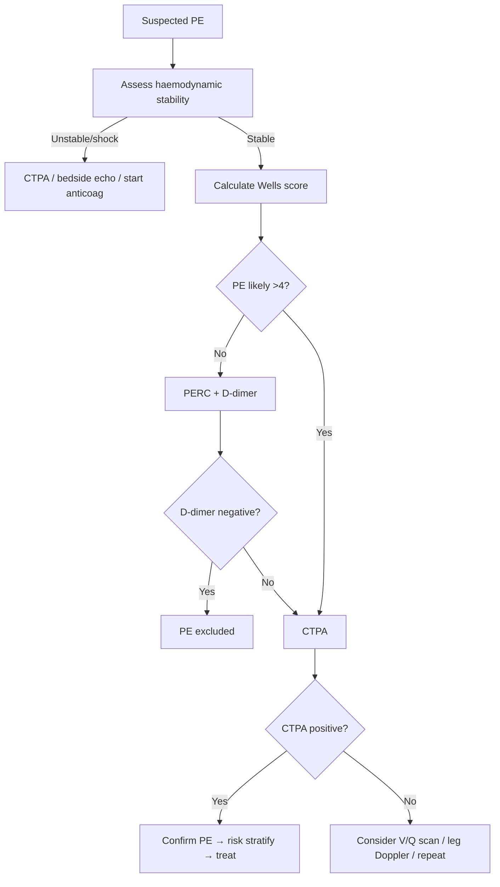
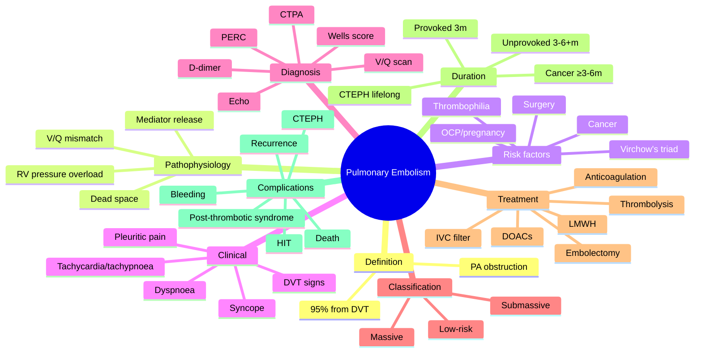
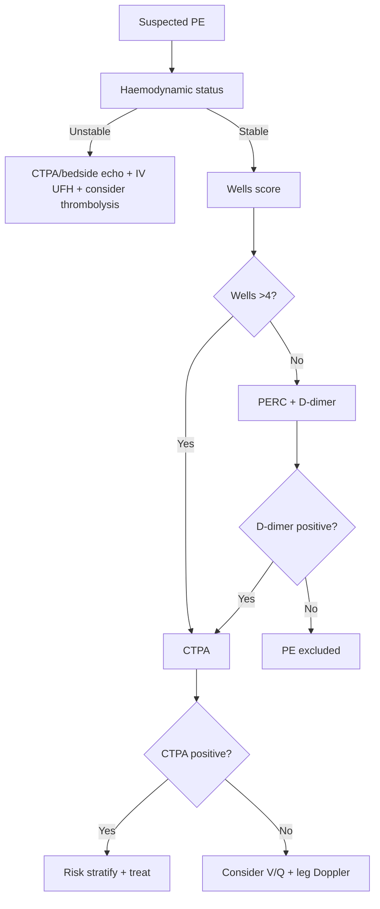

# Pulmonary Embolism (PE)

> [!important]
> **Pulmonary embolism (PE)** is the **obstruction of a pulmonary artery** (or its branches) by material — most commonly a **thrombus originating from deep veins of the lower limbs or pelvis (DVT)**. It is a **medical emergency** with presentations ranging from asymptomatic subsegmental PE to **massive PE causing obstructive shock and sudden death**.

Related: [[Respiratory Failure]], [[ABG Interpretation]], [[Hemoptysis]], [[Oxygen Therapy and NIV]], [[Chest X-Ray Approach]], [[Pulmonary Vascular Diseases/Massive vs submassive pulmonary embolism risk stratification|Massive vs submassive PE]]

> [!tip] **FCPS/MRCP pearl**: Suspect PE in **unexplained dyspnoea, pleuritic chest pain, syncope, or haemoptysis**, especially with risk factors (immobilisation, surgery, cancer, OCP, prior VTE). Confirm with **Wells score → D-dimer → CTPA**. A **normal PaCO₂ + A-a gradient is sensitive** for exclusion in low-pre-test-probability patients.

## Learning Objectives
- Define PE, list risk factors, and apply Virchow's triad.
- Differentiate provoked vs unprovoked vs cancer-associated vs pregnancy-associated PE.
- Recognise clinical features and use **Wells score** + **PERC rule** for pre-test probability.
- Interpret D-dimer, CTPA, V/Q scan, leg Doppler, and bedside echocardiography.
- Classify PE by severity (massive / submassive / low-risk) and haemodynamic status.
- Manage acute PE: anticoagulation (LMWH, DOAC, UFH, warfarin), thrombolysis, embolectomy, IVC filter.
- Plan duration of anticoagulation, evaluate for CTEPH, and screen for occult cancer in unprovoked PE.

## Definition

**Pulmonary embolism (PE)**: obstruction of the pulmonary arterial tree by embolic material. The vast majority (~95%) are **thromboemboli from lower-limb or pelvic DVT**. Non-thrombotic causes include:
- **Septic emboli** (endocarditis, infected lines)
- **Fat embolism** (long-bone fracture, orthopaedic surgery)
- **Amniotic fluid embolism** (peripartum)
- **Air embolism** (central lines, surgery, diving)
- **Tumour embolism** (renal cell, hepatocellular)
- **Foreign body embolism** (talc in IV drug users)

### Epidemiology
- **Incidence**: ~60–70 per 100,000 per year
- **Lifetime risk**: ~8% first-generation relatives
- **Mortality**: untreated PE ~30%; treated <5–10%
- **CTEPH**: 2–4% after symptomatic PE

## Core Anatomy

### Pulmonary arterial tree
| Segment | Notes |
|---------|-------|
| **Main pulmonary artery (MPA)** | Bifurcates into right and left PA |
| **Lobar arteries** | 3 right (upper, middle, lower), 2 left (upper, lower) |
| **Segmental arteries** | 10 right, 8–10 left; corresponding to bronchopulmonary segments |
| **Subsegmental arteries** | Continue branching; smallest clinically significant PE level |

### Source of emboli
- **Proximal DVT** (popliteal, femoral, iliac, IVC) — accounts for majority
- **Pelvic vein thrombosis** — post-partum, post-pelvic surgery
- **Upper-limb DVT** (Paget-Schroetter, central lines) — ~5%
- **Right-heart thrombus** — "in transit" PE, very high mortality

## Core Physiology

### Gas exchange consequences
- **V/Q mismatch** — ventilated alveoli not perfused → ↑dead space → ↓PaCO₂ initially (hyperventilation) or normal; hypoxaemia
- **Right-to-left shunt** through atelectatic lung
- **↓Pulmonary capillary blood volume** → ↓CO diffusion
- **Bronchoconstriction** from platelet-derived serotonin, thromboxane → wheeze, ↑ airway resistance
- **Surfactant dysfunction** (over hours) → atelectasis → further shunt

### Haemodynamic consequences
- **Obstruction** of ≥30–50% of cross-sectional area → ↑ pulmonary vascular resistance (PVR)
- **Right ventricular (RV) afterload ↑** → RV dilation, ↓ RV output
- **Interventricular septum bows into LV** → ↓LV preload → ↓cardiac output → **obstructive shock**
- **Neurohumoral response**: hypoxaemia → sympathetic surge → tachycardia; vasoactive mediators (TXA2, serotonin) → further ↑PVR
- **Cor pulmonale** if chronic (CTEPH)

## Etiology / Causes

### Virchow's triad (pathogenesis of thrombosis)
1. **Venous stasis** — immobility, bed rest, long-haul travel, heart failure, venous obstruction
2. **Endothelial injury** — surgery, trauma, central lines, inflammation
3. **Hypercoagulability** (thrombophilia) — inherited or acquired

### Risk factors
| Provoked / strong | Unprovoked / weak | Inherited thrombophilia |
|-------------------|-------------------|-------------------------|
| Recent surgery (orthopaedic > abdominal > neuro) | Increasing age | Factor V Leiden (APCR) |
| Major trauma / spinal cord injury | Obesity | Prothrombin G20210A |
| Active cancer (esp. pancreatic, brain, ovarian) | Smoking | Protein C/S deficiency |
| Hospitalisation / immobility >3 days | Hypertension | Antithrombin deficiency |
| Prior VTE | Diabetes | Hyperhomocysteinaemia |
| Pregnancy / postpartum | Dyslipidaemia | Antiphospholipid syndrome |
| OCP / HRT (esp. 3rd-generation) | Chronic kidney disease | |
| Long-haul flight >4 h | Varicose veins | |

> [!critical] **Cancer-associated PE**: 4–7× risk; commonest in pancreatic, brain, lung, ovarian, gastric. Treat with LMWH or DOAC (consider drug–drug interactions, bleeding risk).

## Pathophysiology

### Sequence in acute PE
1. **Thrombus dislodgement** from DVT → travels via IVC → RA → RV → PA
2. **Mechanical obstruction** of pulmonary vasculature
3. **Neurohumoral mediator release** (serotonin, TXA2, histamine) → **vasoconstriction** amplifies PVR rise beyond mechanical obstruction
4. **V/Q mismatch** (high V/Q = dead space) → hypoxaemia
5. **RV pressure overload** → RV dilation → septal shift → ↓LV preload → hypotension
6. **Myocardial ischaemia** (RV ischaemia, ↓coronary perfusion) → arrhythmias
7. If survives acute event → organisation / resolution / recanalisation

## Clinical Features

### Symptoms (frequency)
- **Dyspnoea** (~75%) — sudden, at rest
- **Pleuritic chest pain** (~65%)
- **Cough** (~20%)
- **Haemoptysis** (~10%) — pulmonary infarction
- **Syncope / pre-syncope** — suggests massive PE
- **Calf/thigh pain or swelling** — concurrent DVT

### Signs
- **Tachypnoea** ≥20/min (most sensitive sign)
- **Tachycardia** >100/min
- **Tachypnoea + tachycardia** — most sensitive combination
- **Hypotension, shock** — massive PE
- **Pleuritic rub** — pulmonary infarction
- **Calf tenderness, swelling, erythema** — DVT
- **Pleural effusion** (often exudative, sometimes bloody)
- **Loud P2, RV heave, JVP ↑** — RV strain
- **Low-grade fever**
- **Cyanosis** (massive)

## Wells Score & PERC Rule

### Wells Score for PE
| Feature | Points |
|---------|--------|
| Clinical signs of DVT | 3.0 |
| PE most likely diagnosis (vs alternative) | 3.0 |
| HR >100 | 1.5 |
| Immobilisation ≥3 days or surgery within 4 weeks | 1.5 |
| Previous DVT/PE | 1.5 |
| Haemoptysis | 1.0 |
| Active cancer | 1.0 |
| **Score interpretation** | |
| >6 | High probability |
| 2–6 | Moderate probability |
| <2 | Low probability |
| **Two-tier** | |
| >4 | PE likely |
| ≤4 | PE unlikely |

### PERC rule (Pulmonary Embolism Rule-Out Criteria)
If **all 8** negative, PE excluded (in low-risk patient):
- Age <50
- HR <100
- SpO₂ ≥95%
- No unilateral leg swelling
- No haemoptysis
- No surgery/trauma within 4 weeks
- No prior VTE
- No oral hormone use

## Investigations

### First-line
| Test | Role | Typical finding in PE |
|------|------|-----------------------|
| **ABG** | Severity / exclude | ↓PaO₂, ↓PaCO₂ (hypervent), ↑A-a gradient, respiratory alkalosis |
| **D-dimer** | Exclude (if low pre-test) | ≥500 ng/mL (or age-adjusted: age × 10) |
| **CTPA** | Confirm | Filling defect in PA; gold standard |
| **CXR** | Exclude alternative | Often normal; Westermark sign, Hampton's hump, pleural effusion |
| **ECG** | Severity / exclude MI | Sinus tachy (most common), S1Q3T3 (classic but rare), RBBB, RV strain (T-inversion V1–V4) |
| **Bedside echo** | Massive PE | RV dilation, septal flattening (D-sign), McConnell's sign (akinetic RV mid-free wall + apical sparing), 60/60 sign |

### Second-line / alternative
- **V/Q scan** — pregnant, contrast allergy, severe renal impairment
- **Leg compression Doppler USS** — for concurrent DVT
- **D-dimer age-adjusted** — age × 10 ng/mL threshold in >50 years
- **Cardiac troponin / BNP** — risk stratification (raised in submassive)
- **MDCT venography** — combined with CTPA
- **Pulmonary angiography** — historical gold standard; now rarely used

### CTPA findings
- **Filling defect** in pulmonary artery (complete or partial)
- **Rim of contrast** around thrombus ("polo mint" sign on axial, "railway track" on longitudinal)
- **Wedge-shaped peripheral infarct** (Hampton's hump if visible)
- **Mosaic perfusion**, pleural effusion
- **RV/LV ratio ≥1.0** on CT — sign of severe PE

## Diagnosis — diagnostic algorithm

## Differential Diagnosis

| Condition | Distinguishing feature |
|-----------|------------------------|
| **Pneumonia** | Fever, focal consolidation, raised WCC/CRP, no risk factors |
| **Pneumothorax** | Sudden pleuritic pain, hyperresonance, absent breath sounds |
| **Acute coronary syndrome** | Central crushing pain, ECG changes, raised troponin |
| **Aortic dissection** | Tearing interscapular pain, BP differential, mediastinal widening |
| **Musculoskeletal pain** | Reproducible, no dyspnoea, normal ABG |
| **Pericarditis** | Positional pain, pericardial rub, diffuse ST elevation |
| **Anxiety / hyperventilation** | Normal SpO₂, no A-a gradient, normal D-dimer |

## Management

### Risk stratification
- **Massive PE (high-risk)**: SBP <90 mmHg or shock → **thrombolysis** indicated
- **Submassive (intermediate-risk)**: SBP ≥90, but RV dysfunction + ↑troponin/BNP → anticoagulation ± rescue thrombolysis
- **Low-risk**: haemodynamically stable, no RV dysfunction → anticoagulation alone, early discharge

### Anticoagulation — first-line
| Drug | Class | Dose | Notes |
|------|-------|------|-------|
| **Apixaban** | DOAC | 10 mg BD ×7 days, then 5 mg BD | First-line for most haemodynamically stable PE |
| **Rivaroxaban** | DOAC | 15 mg BD ×21 days, then 20 mg OD | First-line; with food |
| **Edoxaban** | DOAC | 60 mg OD (after 5 days LMWH) | Once daily, useful in renal impairment |
| **Dabigatran** | DOAC | 150 mg BD (after 5 days LMWH) | Less commonly used in PE |
| **LMWH (enoxaparin)** | Heparin | 1 mg/kg SC BD | Preferred in cancer, pregnancy, severe renal impairment |
| **UFH** | Heparin | IV bolus 80 U/kg, infusion 18 U/kg/h | Preferred if haemodynamic instability, may need thrombolysis |
| **Warfarin** | VKA | Target INR 2–3 | Rare first-line; bridge with LMWH ≥5 days |

> [!warning] **DOAC contraindications**: severe renal impairment, active cancer (some), pregnancy, breastfeeding, mechanical heart valves, APS with high-risk triple positivity.

### Thrombolysis
- **Indication**: massive PE with hypotension/shock
- **Agent**: **Alteplase 100 mg IV over 2 h** (or 0.6 mg/kg over 15 min if cardiac arrest imminent)
- **Major bleeding risk**: ~2% intracranial haemorrhage
- **Avoid if**: recent surgery, stroke, active bleeding, intracranial neoplasm

### Other interventions
- **Catheter-directed thrombolysis** — submassive/contraindications to systemic lysis
- **Surgical embolectomy** — massive PE + contraindication to lysis
- **IVC filter** — recurrent PE despite anticoagulation, contraindication to anticoagulation, large free-floating proximal thrombus (limited evidence)
- **VA-ECMO** — bridge in massive PE

### Supportive
- **O₂** to SpO₂ 94–98%
- **IV fluids** cautiously (over-resuscitation worsens RV failure)
- **Vasopressors** (noradrenaline) for shock
- **Analgesia** (morphine) for pleuritic pain
- **Diuretics** if RV failure with congestion

### Duration of anticoagulation
| Scenario | Duration |
|----------|----------|
| **Provoked (transient risk, e.g. surgery)** | 3 months |
| **Unprovoked** | ≥3 months; consider extended (indefinite) if low bleeding risk |
| **Cancer-associated** | ≥3–6 months, often longer; LMWH or DOAC |
| **Recurrent unprovoked** | Indefinite |
| **Pregnancy** | LMWH throughout pregnancy + 6 weeks postpartum (min 3 months total) |
| **CTEPH** | Lifelong anticoagulation + specific therapy |

### Investigating for underlying cancer in unprovoked PE
- **History, exam, basic bloods, CXR**
- **Age-appropriate screening** (mammography, colonoscopy, PSA, CT abdomen/pelvis)
- **Consider PET-CT** if high suspicion (controversial)

### Thrombophilia testing
- **Generally NOT in provoked VTE** or during anticoagulation
- **Consider** in: unprovoked VTE <50 years, recurrent VTE, family history, unusual site (cerebral/splanchnic)
- **Test AFTER** stopping anticoagulation (≥2 weeks) for accurate results, except for lupus anticoagulant

## Complications

| Complication | Mechanism | Management |
|--------------|-----------|------------|
| **Death** | Massive PE, obstructive shock | Thrombolysis, embolectomy, ECMO |
| **Recurrent VTE** | Ongoing risk factors | Extended anticoagulation, address triggers |
| **Bleeding on anticoagulation** | Anticoagulant effect | Stop, reverse (vitamin K, PCC, andexanet, idarucizumab) |
| **CTEPH** | Failed resolution of thrombus | Lifelong anticoagulation, pulmonary endarterectomy, riociguat, balloon pulmonary angioplasty |
| **Pulmonary infarction** | Distal embolism + bronchial supply insufficient | Supportive; pleuritic pain settles |
| **RV failure / chronic cor pulmonale** | Sustained pressure overload | Treat underlying cause, supportive |
| **Heparin-induced thrombocytopenia (HIT)** | Heparin exposure (rare with LMWH) | Stop heparin, switch to argatroban/fondaparinux |
| **Post-thrombotic syndrome** | Venous valve damage from DVT | Compression stockings, mobility |

## Drug Details Table

| Drug | Class | Dose (PE) | Mechanism | Monitoring | FCPS/MRCP pearl |
|------|-------|-----------|-----------|------------|------------------|
| **Apixaban** | DOAC (factor Xa inhibitor) | 10 mg BD ×7 d, then 5 mg BD | Direct factor Xa inhibition | No routine; check renal function | First-line for haemodynamically stable PE |
| **Rivaroxaban** | DOAC | 15 mg BD ×21 d, then 20 mg OD | Direct factor Xa inhibition | No routine; take with food | First-line; no LMWH lead-in needed |
| **Edoxaban** | DOAC | 60 mg OD (after 5 d LMWH) | Factor Xa inhibition | Renal function | Useful in renal impairment |
| **LMWH (enoxaparin)** | Heparin | 1 mg/kg SC BD | Anti-IIa & Xa via AT-III | Anti-Xa (in pregnancy, severe renal) | First-line in cancer, pregnancy |
| **UFH** | Heparin | 80 U/kg bolus, 18 U/kg/h infusion | Anti-IIa & Xa via AT-III | APTT 1.5–2.5× control | First-line if haemodynamic instability/thrombolysis planned |
| **Warfarin** | VKA | 5 mg initial; titrate to INR 2–3 | ↓Vitamin-K-dependent factors II, VII, IX, X | INR | Bridge with LMWH for ≥5 days; not first-line |
| **Alteplase** | Thrombolytic | 100 mg IV over 2 h | tPA → plasminogen → fibrinolysis | Watch for bleeding | Massive PE only; 2% ICH risk |
| **Argatroban** | Direct thrombin inhibitor | 0.5–2 µg/kg/min IV | Direct anti-IIa | APTT | For HIT |
| **Riociguat** | sGC stimulator | 1–2.5 mg TDS | ↑cGMP → vasodilation | BP, LFTs | CTEPH (inoperable/persistent) |

## FCPS/MRCP High-Yield Summary

| Domain | Key points |
|--------|------------|
| **Definition** | Obstruction of pulmonary artery; 95% from DVT |
| **Most common symptoms** | Sudden dyspnoea + pleuritic chest pain |
| **Most sensitive signs** | Tachypnoea + tachycardia |
| **Risk factors** | Virchow's triad; immobility, surgery, cancer, OCP, pregnancy, prior VTE, thrombophilia |
| **Wells score** | >6 high, 2–6 moderate, <2 low; or >4 PE likely, ≤4 unlikely |
| **PERC rule** | If all 8 negative, PE excluded in low-risk |
| **D-dimer** | Sensitive but not specific; use age-adjusted threshold (age × 10) in >50 y |
| **CTPA** | Gold standard in stable patient; filling defect in PA |
| **V/Q scan** | In pregnancy, contrast allergy, severe CKD |
| **Massive PE** | SBP <90/shock → thrombolysis (alteplase 100 mg/2 h) |
| **Submassive PE** | Stable + RV dysfunction + ↑troponin → anticoagulation ± rescue lysis |
| **Low-risk PE** | Anticoagulation alone, early discharge |
| **Anticoagulation first-line** | DOACs (apixaban, rivaroxaban, edoxaban) or LMWH |
| **LMWH preferred in** | Cancer, pregnancy, severe renal impairment |
| **CTEPH** | 2–4% of PE; dyspnoea >3 months post-PE; treat with anticoag + riociguat/endarterectomy |
| **D-dimer negative + low pre-test** | Excludes PE |
| **Pregnancy** | V/Q scan preferred (lower fetal radiation); LMWH throughout |
| **Provoked VTE** | 3 months anticoagulation |
| **Unprovoked VTE** | ≥3 months; consider extended if low bleed risk |
| **Cancer VTE** | ≥3–6 months; LMWH or DOAC |
| **IVC filter** | Only if anticoag contraindication or recurrent PE despite anticoag |

## Common Viva Questions

| Question | Expected answer |
|----------|-----------------|
| What are the most sensitive bedside signs of PE? | Tachypnoea + tachycardia. |
| What is the Wells score for PE? | Clinical prediction rule with 7 items; ≥4 makes PE likely, <2 low probability. |
| When can D-dimer reliably exclude PE? | When pre-test probability is low or PE unlikely (Wells ≤4) and D-dimer is below threshold (age-adjusted in >50 years). |
| What is the first-line imaging for suspected PE? | CTPA in haemodynamically stable patients. |
| What is the alternative if CTPA cannot be performed? | V/Q scan (pregnancy, contrast allergy, CKD). |
| What defines a massive PE? | SBP <90 mmHg or shock requiring vasopressors. |
| What is the thrombolytic agent and dose in massive PE? | Alteplase 100 mg IV over 2 hours. |
| Why are DOACs not used in some cancer-associated PE? | Drug–drug interactions (e.g. with chemotherapy), GI absorption issues, but they are increasingly used. |
| When is an IVC filter indicated? | Anticoagulation contraindicated, recurrent PE despite adequate anticoagulation. |
| What is the minimum duration of anticoagulation for a provoked PE? | 3 months. |
| What is CTEPH? | Chronic thromboembolic pulmonary hypertension; dyspnoea persisting >3 months post-PE; treat with lifelong anticoagulation ± endarterectomy. |
| What does S1Q3T3 on ECG suggest? | Right-heart strain in massive PE; rare but classic. |
| What is McConnell's sign? | RV free wall akinesia with apical sparing on echo; specific for acute PE. |

## Common Confusions / Exam Traps

| Confusion | Clarification |
|-----------|---------------|
| "D-dimer positive = PE" | **False** — D-dimer is sensitive, not specific. Many conditions raise it (infection, cancer, pregnancy, post-surgery). |
| "CTPA is safe in pregnancy" | Significant radiation to breast and fetus; **V/Q scan preferred** in pregnancy. |
| "LMWH is always first-line" | DOACs are now first-line for most, but **LMWH in cancer and pregnancy**. |
| "Thrombolysis for all PE" | **Only massive PE**; submassive → anticoagulation ± rescue. |
| "O₂ must be high-flow in PE" | Target SpO₂ 94–98%; avoid hyperoxia. |
| "IVC filter prevents PE" | Filters reduce recurrent PE but ↑DVT and have no mortality benefit; use only if anticoag contraindicated. |
| "Cancer patients can't have DOACs" | DOACs now licensed for cancer-associated VTE (caution with GI/genitourinary cancers). |
| "Haemodynamically stable PE cannot kill" | Submassive PE can deteriorate; risk-stratify. |
| "Anticoagulation should be continued indefinitely for unprovoked PE" | ≥3 months; extended considered case-by-case. |
| "HIT is common with LMWH" | Much less common than with UFH; usually 5–10 days after exposure. |

## Mnemonics

**Wells score features** — **"SHEPHERD"**: **S**igns of DVT (3), **H**R >100 (1.5), **E**xclude alt dx — PE most likely (3), **P**rior VTE (1.5), **H**emoptysis (1), **E**xposure — immob/surgery (1.5), **R**ecent (1.5), **D**isease — cancer (1)

**Virchow's triad** — **"SHE"**: **S**tasis, **H**ypercoagulability, **E**ndothelial injury

**Massive PE triggers thrombolysis** — **"SBP < 90 = Lysis"**

**DOAC advantages** — **"NO Worries"**: **N**o monitoring, **O**ral fixed dose, **W**arfarin-beating in convenience

**CTEPH clinical clue** — **"3 months post-PE still SOB"**

**RV strain ECG** — **"T inverted V1–V4 = think RV"**

## Mind Map

## Flowchart — Diagnostic Algorithm

## One-Page Revision Summary

- **PE** = obstruction of pulmonary artery; 95% from DVT
- **Risk**: Virchow's triad (stasis, hypercoagulability, endothelial injury)
- **Symptoms**: sudden dyspnoea, pleuritic pain, syncope, haemoptysis
- **Signs**: tachypnoea, tachycardia, hypotension (massive), DVT signs
- **Wells score** + D-dimer → CTPA (or V/Q in pregnancy)
- **Massive PE** = SBP <90 → thrombolysis (alteplase)
- **Submassive** = RV dysfunction + ↑troponin → anticoag ± rescue
- **Low-risk** → DOAC (apixaban, rivaroxaban) or LMWH
- **Pregnancy / cancer / severe CKD** → LMWH
- **Provoked** = 3 months; **unprovoked** = ≥3 months consider extended
- **CTEPH** = dyspnoea >3 months post-PE → V/Q scan → anticoag + riociguat/endarterectomy
- **Anticoagulation contraindications or recurrent PE** → IVC filter
- **DOAC reversal**: andexanet alfa (factor Xa inhibitor associated bleeding), idarucizumab (dabigatran)

## 24-Hour Recall Prompts
- List Virchow's triad and 5 strongest PE risk factors.
- State the Wells score components and cut-offs.
- Outline the diagnostic algorithm (Wells → D-dimer → CTPA).
- List the criteria for massive vs submassive vs low-risk PE.
- Recall the first-line anticoagulation options and doses.
- Recall the indications for thrombolysis and IVC filter.
- State the duration of anticoagulation for provoked vs unprovoked vs cancer PE.
- Name the criteria for CTEPH and the first-line specific therapy.

## 7-Day / 15-Day / 30-Day Revision Tracker
- [ ] Day 1 completed
- [ ] 24-hour recall completed
- [ ] Day 7 revision completed
- [ ] Day 15 revision completed
- [ ] Day 30 revision completed

## Must Know / Should Know / Nice to Know

### Must Know
- Definition, Virchow's triad, common risk factors
- Wells score, PERC, D-dimer age-adjustment
- CTPA first-line; V/Q in pregnancy
- Massive vs submassive vs low-risk; thrombolysis indication and dose
- DOAC vs LMWH first-line anticoagulation
- Duration of anticoagulation by scenario

### Should Know
- McConnell's sign, RV/LV ratio on CT
- CTEPH definition and treatment
- IVC filter indications
- Cancer-associated PE management
- Thrombophilia testing indications
- DOAC reversal agents

### Nice to Know
- Catheter-directed thrombolysis
- VA-ECMO in massive PE
- Post-thrombotic syndrome
- HIT diagnosis and management
- Pregnancy-specific PE management

## My Weak Points
- 

## Self-Test Scorecard
- Understanding: /10
- Recall: /10
- MCQ Performance: /10
- SBA Performance: /10
- Viva Confidence: /10
- Total: /50

> [!tip] Interpretation: <35 = weak topic, 35–44 = acceptable but insecure, 45+ = strong exam-ready topic.

## Exam Answer Modes

### Long Answer Skeleton
- Definition (1 line) → Epidemiology → Virchow's triad → Risk factors → Pathophysiology (V/Q mismatch, RV overload) → Clinical features → Investigations (Wells, D-dimer, CTPA) → Risk stratification (massive/submassive/low) → Management (anticoagulation, thrombolysis, IVC filter) → Duration → Complications (CTEPH, recurrence)

### Short Note Skeleton
- Definition → Wells score → CTPA first-line → Massive PE = thrombolysis → DOAC/LMWH anticoagulation → 3 months provoked / ≥3 months unprovoked

### Viva One-Liners
- "Massive PE is shock + confirmed PE; treat with alteplase 100 mg IV over 2 h."
- "DOACs are first-line for haemodynamically stable PE."
- "CTEPH = dyspnoea >3 months post-PE; treat with anticoagulation + consider endarterectomy or riociguat."

### Ward-Case Discussion Points
- VTE prophylaxis for hospitalised medical patients
- D-dimer is not diagnostic — clinical probability essential
- Pregnancy — V/Q preferred over CTPA
- Anticoagulation duration by provoking factor
- Follow-up echo at 3 months to assess RV function and screen for CTEPH

### Last-Night-Before-Exam Sheet
- Virchow = SHE: Stasis, Hypercoagulability, Endothelial injury
- Wells: DVT signs, HR>100, PE most likely, immob/surgery, prior VTE, haemoptysis, cancer
- PERC: 8 criteria, all negative = PE out
- D-dimer age-adjusted: age × 10 ng/mL (in >50 y)
- Massive = SBP<90/shock → alteplase 100 mg/2h
- First-line: DOAC (apixaban/rivaroxaban) or LMWH
- Provoked 3m, unprovoked ≥3m, cancer ≥3–6m
- CTEPH = dyspnoea >3m post-PE; treat with anticoag + endarterectomy/riociguat

## Summary

Pulmonary embolism is the **obstruction of the pulmonary artery**, most commonly by thrombus from lower-limb/pelvic DVT. **Virchow's triad** (stasis, endothelial injury, hypercoagulability) underpins risk. **Wells score + D-dimer (age-adjusted in >50 years) → CTPA** is the standard diagnostic algorithm. PE is risk-stratified into **massive (SBP<90/shock → thrombolysis with alteplase)**, **submassive (RV dysfunction + ↑troponin → anticoagulation ± rescue)**, and **low-risk (DOAC/LMWH alone, often outpatient)**. **DOACs (apixaban, rivaroxaban, edoxaban) are first-line**; LMWH is preferred in pregnancy, cancer, and severe CKD. **Duration**: provoked 3 months; unprovoked ≥3 months (consider extended); cancer ≥3–6 months. **CTEPH** (chronic thromboembolic pulmonary hypertension) develops in 2–4% and requires lifelong anticoagulation ± endarterectomy or riociguat.

## MCQs (10)

1. A 65-year-old man post-hip replacement develops sudden dyspnoea and pleuritic pain 5 days after surgery. SpO₂ 90%, RR 24, HR 110. Most likely diagnosis?
   - A) Pneumonia
   - B) Pneumothorax
   - C) Pulmonary embolism
   - D) MI
   - E) Aspiration
   **Answer: C** — Recent orthopaedic surgery + sudden dyspnoea + pleuritic pain = classic PE.

2. Which of the following is **not** part of the Wells score for PE?
   - A) Clinical signs of DVT
   - B) HR >100
   - C) Haemoptysis
   - D) Pleural effusion on CXR
   - E) Active cancer
   **Answer: D** — Pleural effusion is not in the Wells score.

3. The age-adjusted D-dimer threshold in a 70-year-old is approximately:
   - A) 500 ng/mL
   - B) 700 ng/mL
   - C) 1000 ng/mL
   - D) 2000 ng/mL
   - E) 250 ng/mL
   **Answer: B** — Age × 10 ng/mL in >50 years (70 × 10 = 700 ng/mL).

4. First-line anticoagulation in a haemodynamically stable PE without cancer or pregnancy is:
   - A) Warfarin
   - B) LMWH
   - C) DOAC (apixaban/rivaroxaban)
   - D) UFH
   - E) Aspirin
   **Answer: C** — DOACs are first-line for stable PE.

5. A patient with massive PE has SBP 80 mmHg and confusion. First-line treatment:
   - A) LMWH
   - B) DOAC
   - C) IV UFH + alteplase 100 mg/2h
   - D) Aspirin
   - E) IVC filter
   **Answer: C** — Massive PE → thrombolysis with alteplase.

6. A 28-year-old woman on OCP develops PE. After 3 months of anticoagulation, when can the OCP be restarted?
   - A) Immediately
   - B) After OCP cessation confirmed and other risk factors addressed; not standard to restart OCP
   - C) At 6 months
   - D) At 1 year
   - E) Never
   **Answer: B** — OCP is the provoking factor; consider alternative contraception; restart only after risk-benefit analysis.

7. Which of the following is **not** a feature of massive PE?
   - A) SBP <90 mmHg
   - B) Cardiac arrest
   - C) Shock requiring vasopressors
   - D) Normal RV on echo
   - E) Severe hypoxaemia
   **Answer: D** — Massive PE shows RV dilation/dysfunction.

8. What is the recommended duration of anticoagulation for cancer-associated PE?
   - A) 3 months
   - B) 6 weeks
   - C) ≥3–6 months, often extended
   - D) Lifelong
   - E) 1 year only
   **Answer: C** — ≥3–6 months, often extended while cancer is active.

9. First-line imaging in suspected PE in pregnancy:
   - A) CTPA
   - B) V/Q scan
   - C) D-dimer only
   - D) Leg Doppler
   - E) Pulmonary angiography
   **Answer: B** — V/Q scan has lower fetal radiation than CTPA in pregnancy.

10. What is the most useful bedside test to confirm PE in a haemodynamically unstable patient when CTPA is unavailable?
    - A) CXR
    - B) D-dimer
    - C) Bedside echocardiography (RV dilation, septal flattening)
    - D) ABG
    - E) Troponin
    **Answer: C** — Bedside echo shows RV strain and may support decision for thrombolysis.

## SBA Questions (10)

1. A 40-year-old presents with sudden dyspnoea and pleuritic pain 2 weeks after a long flight. Wells score 4.5. D-dimer 1500 ng/mL. Next step:
   - A) Treat empirically with LMWH
   - B) CTPA
   - C) V/Q scan
   - D) Discharge with antibiotics
   - E) Repeat D-dimer in 24h
   **Answer: B** — Wells >4 (PE likely) → CTPA.

2. A 60-year-old with confirmed PE on CTPA. SBP 105 mmHg, HR 115, troponin elevated, echo shows RV dilation. Risk class:
   - A) Low-risk
   - B) Submassive (intermediate)
   - C) Massive
   - D) Not PE
   - E) Chronic PE
   **Answer: B** — Stable SBP but RV dysfunction + ↑troponin = submassive.

3. First-line treatment for massive PE:
   - A) LMWH only
   - B) DOAC
   - C) IV UFH + alteplase 100 mg over 2h
   - D) Aspirin + LMWH
   - E) Surgical embolectomy only
   **Answer: C** — Alteplase + supportive care.

4. A patient with PE and active gastric cancer. Best anticoagulant:
   - A) Apixaban
   - B) Rivaroxaban
   - C) LMWH (e.g. enoxaparin)
   - D) Warfarin
   - E) Aspirin
   **Answer: C** — LMWH is preferred in cancer-associated VTE.

5. A 35-year-old woman has unprovoked PE. After 3 months of anticoagulation, she wants to stop. Her bleeding risk is low. Best approach:
   - A) Stop now
   - B) Continue indefinitely — discuss benefits/risks
   - C) Switch to aspirin
   - D) Stop and start OCP
   - E) IVC filter
   **Answer: B** — Unprovoked PE in low bleeding-risk patient → consider extended anticoagulation.

6. IVC filter is indicated in:
   - A) All PE patients
   - B) Massive PE only
   - C) Recurrent PE despite anticoagulation or contraindication to anticoagulation
   - D) Pregnant women
   - E) Cancer patients
   **Answer: C** — IVC filter only for contraindication or recurrent PE despite anticoagulation.

7. A patient on apixaban for PE has major bleeding. Specific reversal agent:
   - A) Vitamin K
   - B) Andexanet alfa
   - C) Idarucizumab
   - D) Protamine
   - E) Tranexamic acid
   **Answer: B** — Andexanet alfa reverses factor Xa inhibitors (apixaban, rivaroxaban).

8. ECG finding most specific for RV strain in massive PE:
   - A) Sinus tachycardia
   - B) S1Q3T3
   - C) T-wave inversion V1–V4
   - D) RBBB
   - E) Atrial fibrillation
   **Answer: B** — S1Q3T3 is classic; T-inversion V1–V4 is more common.

9. A 70-year-old with unprovoked PE has persistent dyspnoea 6 months later. V/Q scan shows mismatched perfusion defects. Diagnosis:
   - A) Recurrent PE
   - B) CTEPH
   - C) Pulmonary hypertension group 1
   - D) COPD
   - E) Anxiety
   **Answer: B** — CTEPH — chronic thromboembolic pulmonary hypertension.

10. Initial treatment of confirmed CTEPH:
    - A) Lifelong anticoagulation
    - B) Thrombolysis
    - C) IVC filter
    - D) Antibiotics
    - E) Aspirin
    **Answer: A** — Lifelong anticoagulation is the foundation; consider endarterectomy or riociguat.

## Flashcards

- **Q: Most sensitive bedside sign of PE?**
  A: Tachypnoea (often combined with tachycardia).

- **Q: Wells score high vs low probability cut-offs?**
  A: >6 high, 2–6 moderate, <2 low; or >4 likely / ≤4 unlikely.

- **Q: PERC rule?**
  A: 8 criteria; if all negative, PE excluded in low-risk patient.

- **Q: D-dimer age-adjusted threshold?**
  A: Age × 10 ng/mL in patients >50 years.

- **Q: First-line imaging for suspected PE?**
  A: CTPA in stable patients.

- **Q: First-line imaging in pregnancy?**
  A: V/Q scan.

- **Q: Define massive PE?**
  A: PE + SBP <90 mmHg or shock.

- **Q: Treatment of massive PE?**
  A: Alteplase 100 mg IV over 2 hours + IV UFH.

- **Q: First-line anticoagulation in stable PE?**
  A: DOAC (apixaban, rivaroxaban) or LMWH.

- **Q: Anticoagulation in cancer-associated PE?**
  A: LMWH preferred (or DOAC).

- **Q: Duration of anticoagulation for provoked PE?**
  A: 3 months.

- **Q: What is CTEPH?**
  A: Chronic thromboembolic pulmonary hypertension — dyspnoea >3 months post-PE.

- **Q: IVC filter indication?**
  A: Anticoagulation contraindication or recurrent PE despite adequate anticoagulation.

- **Q: What is McConnell's sign?**
  A: RV free wall akinesia with apical sparing on echo — specific for acute PE.

- **Q: Reversal of apixaban?**
  A: Andexanet alfa.

- **Q: Reversal of dabigatran?**
  A: Idarucizumab.

## Answer Key with Explanations

### MCQs
1. **C** — Post-op sudden dyspnoea + pleuritic pain.
2. **D** — Pleural effusion is not part of Wells.
3. **B** — Age × 10 ng/mL.
4. **C** — DOACs are first-line for stable PE.
5. **C** — Alteplase for massive PE.
6. **B** — OCP provoked; consider alternative contraception.
7. **D** — Massive PE has RV dysfunction.
8. **C** — ≥3–6 months, often extended.
9. **B** — V/Q preferred in pregnancy.
10. **C** — Bedside echo for RV strain.

### SBAs
1. **B** — Wells >4 → CTPA.
2. **B** — Stable + RV dysfunction = submassive.
3. **C** — Alteplase + UFH.
4. **C** — LMWH for cancer.
5. **B** — Consider extended anticoagulation.
6. **C** — IVC filter only for specific indications.
7. **B** — Andexanet alfa.
8. **B** — S1Q3T3 classic (rare).
9. **B** — CTEPH.
10. **A** — Lifelong anticoagulation.

## Local Navigation
- **Parent Heading**: [[../Pulmonary Vascular Diseases|Pulmonary Vascular Diseases]]
- **Parent Topic Group**: [[../Pulmonary Vascular Diseases/Venous thromboembolic disease|Venous thromboembolic disease]]
- **Chapter Map**: [[../Davidson Chapter 17 - Respiratory Medicine Hierarchy|Respiratory Medicine Hierarchy]]
- **Chapter MOC**: [[../Respiratory MOC|Respiratory MOC]]
- **Drug Reference**: [[../../Clinical Therapeutics and Good Prescribing|Drugs]]
- **Related**: [[Pulmonary Vascular Diseases/Massive vs submassive pulmonary embolism risk stratification|Massive vs submassive PE]] · [[Pulmonary Vascular Diseases/D-dimer, CTPA, and Wells score framework|D-dimer, CTPA, Wells framework]] · [[Pulmonary Vascular Diseases/Subsegmental and incidental pulmonary embolism|Subsegmental PE]] · [[Pulmonary Vascular Diseases/Chronic thromboembolic pulmonary hypertension|CTEPH]] · [[Pulmonary Vascular Diseases/Pulmonary hypertension|Pulmonary hypertension]] · [[ABG Interpretation]] · [[Hemoptysis]] · [[Respiratory Failure]] · [[Oxygen Therapy and NIV]] · [[Chest X-Ray Approach]]

## PasTest Scenario SBAs (Clinical Vignettes)

> **Auto-generated PasTest/Mediscope-style scenario SBAs** grounded in the authored source. Each scenario tests a real clinical fact (triad, specific sign, contraindication, trial, first-line Rx) extracted from the topic. *Source: Ch 17: Respiratory Medicine — Pulmonary Embolism*

**Q1.** Which of the following is characterised by the clinical triad: stasis, hypercoagulability, endothelial injury?

  - **A.** Pulmonary Embolism
  - **B.** Asthma
  - **C.** COPD
  - **D.** Pneumonia

  > **Answer: A** — Pulmonary Embolism
  >
  > *Source:* `
## One-Page Revision Summary
- **PE** = obstruction of pulmonary artery; 95% from DVT
- **Risk**: Virchow's triad (stasis, hypercoagulability, endothelial injury)
- **Symptoms**: sudden dyspnoea, pl

**Q2.** Which of the following features is most specific or characteristic of Pulmonary Embolism?

  - **A.** False
  - **B.** A feature common to many acute inflammatory conditions
  - **C.** A non-specific sign that does not localise the diagnosis
  - **D.** An investigation finding rather than a clinical feature

  > **Answer: A** — False
  >
  > *Source:* l D-dimer |
| Confusion | Clarification |
|-----------|---------------|
| "D-dimer positive = PE" | **False** — D-dimer is sensitive, not specific

**Q3.** What is the most appropriate first-line therapy for Pulmonary Embolism?

  - **A.** Massive PE + thrombolysis + Submassive
  - **B.** An advanced/surgical therapy reserved for refractory disease
  - **C.** Symptomatic treatment only, no disease-modifying therapy
  - **D.** Empiric broad-spectrum therapy without specific indication

  > **Answer: A** — Massive PE + thrombolysis + Submassive
  >
  > *Source:* ### Risk stratification
- **Massive PE (high-risk)**: SBP <90 mmHg or shock → **thrombolysis** indicated
- **Submassive (intermediate-risk)**: SBP ≥90, but RV dysfunction + ↑troponin/BNP → anticoagula

