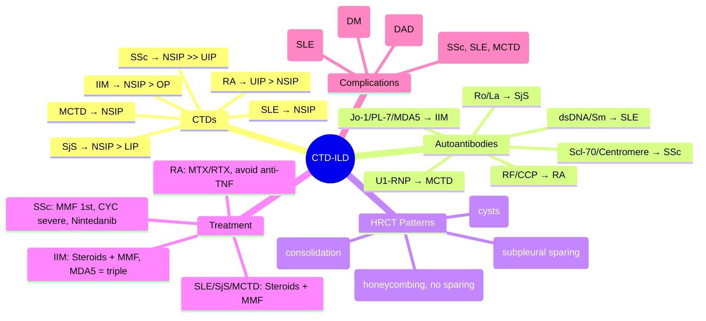

# Connective Tissue Disease-Associated ILD (CTD-ILD)

Related: [[ILD framework]], [[Sarcoidosis]], [[Hypersensitivity pneumonitis]], [[IPF]], [[Rheumatoid arthritis]], [[Systemic sclerosis]], [[SLE]], [[Polymyositis/Dermatomyositis]], [[Sjögren's]], [[Mixed connective tissue disease]], [[Antisynthetase syndrome]], [[Rheumatoid arthritis-ILD]], [[Scleroderma lung disease]]

> [!important]
> **CTD-ILD** = interstitial lung disease occurring in the context of a **connective tissue disease**. **Most common**: RA-ILD, SSc-ILD, IIM-ILD (antisynthetase), SLE, SjS, MCTD. **Key FCPS/MRCP**: **NSIP pattern most common** (vs IPF UIP), **autoantibody profile guides diagnosis**, **HRCT + PFTs + autoantibodies + BAL** for diagnosis, **treatment: immunosuppression** (steroids + steroid-sparing: MMF 1st for SSc, MTX/AZA for RA, RTX for refractory), **screen for PH**, **prognosis better than IPF** but variable by CTD.

## Learning Objectives
- Identify **CTDs associated with ILD** and their characteristic patterns
- Apply **HRCT patterns** (NSIP > UIP, OP, LIP, DAD) per CTD type
- Interpret **autoantibody panels** (RF, CCP, ANA, Scl-70, centromere, Jo-1, PL-7, PL-12, EJ, OJ, Ro/SSA, La/SSB, Sm, RNP, dsDNA)
- Use **BAL** (lymphocytosis, neutrophilia) and **PFTs** (restrictive, ↓ DLCO) for diagnosis/monitoring
- Apply **treatment algorithms** per CTD: SSc (MMF 1st, cyclophosphamide for severe), RA (MTX/RTX), IIM (steroids + MMF/AZA/RTX), SLE (MMF/RTX)
- Screen for **pulmonary hypertension** (echo, RHC) and **malignancy** (especially DM)
- Recognise **acute exacerbations** (DAD pattern) and manage aggressively

## Definition
**CTD-ILD** = interstitial lung disease occurring as a **pulmonary manifestation of a systemic connective tissue disease**. **Diagnosis requires**: (1) **defined CTD** (classification criteria met) + (2) **ILD on HRCT/PFTs** + (3) **exclusion of alternative causes** (drug, infection, HP, IPF).

> **FCPS/MRCP tip**: **NSIP is the most common HRCT/histology pattern across CTDs** (especially SSc, SLE, SjS, MCTD, IIM). **UIP also occurs** (especially RA, chronic SSc). **Antibody profile is diagnostic key**.

## CTD Types & ILD Prevalence
| CTD | ILD Prevalence | Typical HRCT Pattern | Key Autoantibodies |
|-----|----------------|---------------------|-------------------|
| **Rheumatoid Arthritis (RA)** | 10–30% (clinical), up to 60% (HRCT) | **UIP > NSIP** (also OP, LIP) | **RF, anti-CCP** (high specificity) |
| **Systemic Sclerosis (SSc)** | 30–90% (most have subclinical) | **NSIP >> UIP** | **Scl-70 (anti-topo I)** = diffuse + ILD risk; **centromere** = limited + PAH risk |
| **Idiopathic Inflammatory Myopathies (IIM)** | 20–70% (high in antisynthetase) | **NSIP > OP > UIP** | **Anti-Jo-1** (antisynthetase), PL-7, PL-12, EJ, OJ, KS, Zo |
| **Systemic Lupus Erythematosus (SLE)** | 10–20% (clinical) | **NSIP** (also OP, vasculitis, DAH) | **ANA, dsDNA, Sm, RNP, Ro, La** |
| **Sjögren's Syndrome (SjS)** | 10–20% | **NSIP > LIP > UIP** | **Ro/SSA, La/SSB**, RF |
| **Mixed Connective Tissue Disease (MCTD)** | 20–60% | **NSIP** | **U1-RNP (high titre)**, Raynaud's, puffy hands |
| **Undifferentiated CTD / IPAF** | Variable | NSIP, OP | ANA + Raynaud's + specific features (no full CTD criteria) |

## Core Pathophysiology
### Common Mechanisms
1. **Autoimmune dysregulation** → loss of self-tolerance → immune complex deposition, T-cell activation
2. **Pro-fibrotic cytokines**: **TGF-β, IL-4, IL-13, IL-6, IL-17, PDGF, CTGF**
3. **Endothelial injury** → vascular remodelling (PAH risk in SSc, SLE, MCTD)
4. **Immune complex deposition** (SLE, RA) → vasculitis, capillaritis (DAH risk)
5. **Antibody-mediated** (anti-Jo-1 → anti-synthetase → lung/myocyte cross-reactivity)

### CTD-Specific Pathways
| CTD | Key Pathogenic Features |
|-----|------------------------|
| **RA** | Citrullinated peptides → anti-CCP → immune complexes → synovitis + lung; **shared epitope** (HLA-DR4) |
| **SSc** | **Endothelial injury** → TGF-β, endothelin-1 → **fibrosis + vasculopathy** (PAH); anti-topo I (Scl-70) |
| **IIM (Antisynthetase)** | **Anti-tRNA synthetase** (Jo-1) → cross-reactivity lung/muscle; **MDA5** (clinically amyopathic DM, rapidly progressive ILD) |
| **SLE** | Immune complexes (ANA, dsDNA) → vasculitis, DAH, pleuritis; **anti-phospholipid** → thrombosis |
| **SjS** | Lymphocytic infiltration (exocrine) → LIP/NSIP; **Ro/SSA, La/SSB**; lymphoma risk |
| **MCTD** | **U1-RNP** → overlap features; high PAH risk |

## Clinical Features by CTD
### Rheumatoid Arthritis (RA-ILD)
- **Male > Female** (unlike RA overall)
- **Smoking** strong risk factor
- **Usual presentation**: Insidious dyspnoea, dry cough (often precedes joint symptoms)
- **Extra-pulmonary**: Joints, nodules, vasculitis, sicca
- **Drug-induced** (MTX pneumonitis, leflunomide, anti-TNF) — **exclude first**

### Systemic Sclerosis (SSc-ILD)
- **Raynaud's phenomenon** (often years before ILD)
- **Skin thickening** (diffuse > limited for ILD risk)
- **GERD** (universal) → microaspiration → worsens ILD
- **PAH** (major complication, screen annually)
- **Renal crisis** (ACEi, monitor renal function if on steroids)

### Antisynthetase Syndrome (IIM-ILD)
- **Triad**: **ILD + Myositis + Arthritis** (+ Raynaud's, mechanic's hands, fever)
- **Anti-Jo-1** (75% of antisynthetase) + PL-7, PL-12, EJ, OJ, KS, Zo
- **Rapidly progressive ILD** (especially **anti-MDA5** = clinically amyopathic DM, high mortality)
- **Mechanic's hands** (hyperkeratotic, fissured lateral fingers)

### SLE-ILD
- **NSIP** most common pattern
- **Acute lupus pneumonitis** (DAH, capillaritis) — emergency
- **Pleuritis** (common, exudative effusion)
- **Pulmonary vasculitis** (rare)

### Sjögren's Syndrome (SjS-ILD)
- **Sicca symptoms** (dry eyes, mouth) often precede ILD
- **LIP** (lymphocytic interstitial pneumonitis) — cysts, nodules
- **NSIP** also common
- **Lymphoma risk** (monitor for nodal enlargement, B symptoms)

### MCTD-ILD
- **Overlap**: SLE + SSc + PM + RA features
- **High titre U1-RNP**
- **High PAH risk** (screen annually)

## Investigations
### 1. Autoantibody Panel (Diagnostic Key)
| Antibody | CTD Association | Clinical Significance |
|----------|----------------|----------------------|
| **RF** | RA, SjS, MCTD | RA diagnosis (low specificity alone) |
| **Anti-CCP** | **RA** (95% specific) | **RA diagnosis**, erosive disease, ILD risk |
| **ANA** | SLE, SSc, SjS, MCTD, IIM | Screening (titers, pattern) |
| **Anti-dsDNA** | **SLE** (specific) | Disease activity (renal) |
| **Anti-Sm** | **SLE** (specific) | SLE diagnosis |
| **Anti-RNP** | **MCTD** (high titre), SLE | MCTD diagnosis |
| **Anti-Scl-70 (topo I)** | **SSc diffuse** | **ILD risk**, pulmonary fibrosis |
| **Anti-centromere** | **SSc limited** | **PAH risk**, less ILD |
| **Anti-Ro/SSA, La/SSB** | **SjS, SLE, MCTD** | Sicca, neonatal lupus, congenital heart block |
| **Anti-Jo-1** | **Antisynthetase syndrome (IIM)** | **ILD + myositis + arthritis** |
| **Anti-PL-7, PL-12, EJ, OJ, KS, Zo** | **Other antisynthetase** | Similar to Jo-1, variable myositis |
| **Anti-MDA5** | **Clinically amyopathic DM** | **Rapidly progressive ILD**, high mortality |
| **Anti-SRP, HMGCR** | **Necrotising myopathy** | Less ILD |

### 2. HRCT Patterns by CTD
| Pattern | CTDs | Description |
|---------|------|-------------|
| **NSIP** | **SSc, SLE, SjS, MCTD, IIM, IPAF** | **Most common** in CTD-ILD; bilateral basal GGO, reticulation, traction bronchiectasis; **subpleural sparing** |
| **UIP** | **RA, chronic SSc, some IIM** | Basal, subpleural honeycombing, traction bronchiectasis; **no subpleural sparing** |
| **OP (Organising Pneumonia)** | **IIM, RA, SLE, SjS** | Patchy consolidation, perilobular pattern, "reversed halo" |
| **LIP** | **SjS, SLE, HIV** | Diffuse GGO, cysts, perivascular nodules |
| **DAD (Acute Exacerbation)** | **All (acute exacerbation)** | Diffuse GGO + consolidation, hyaline membranes |
| **DAH (Diffuse Alveolar Haemorrhage)** | **SLE, MPA, GPA** | Diffuse GGO/consolidation, bloody BAL, falling Hb |

### 3. Pulmonary Function Tests
- **Restrictive pattern**: ↓ TLC, ↓ FVC, normal FEV1/FVC
- **↓ DLCO** (often disproportionate → PAH screen)
- **Serial PFTs** (3–6 monthly): **FVC decline >10% or DLCO >15%** = progression

### 4. BAL (Supportive)
| CTD-ILD | Typical BAL |
|---------|-------------|
| **NSIP (SSc, SLE, SjS)** | Lymphocytosis (20–40%), **CD4/CD8 variable** |
| **UIP (RA)** | Neutrophilia, eosinophilia |
| **DAH (SLE, vasculitis)** | **Haemosiderin-laden macrophages >20%**, bloody return |
| **Infection** | Neutrophilia, organisms on stain/culture |

### 5. Screening for Complications
| Complication | Screening | Frequency |
|--------------|-----------|-----------|
| **Pulmonary Hypertension** | **Echo** (RVSP, TAPSE), **RHC** if RVSP >40 or symptoms | **Annual** (SSc, SLE, MCTD) |
| **Malignancy** (DM) | **CT chest/abdomen/pelvis**, mammography, colonoscopy, age-appropriate | At diagnosis, then annually (DM) |
| **GERD** (SSc) | Symptom review, PPI | Every visit |
| **Cardiac** (SLE, SSc) | ECG, Echo, Troponin | Baseline, then as indicated |

## Interpretation Frameworks
### 1. Diagnostic Approach (Algorithm)
```
Patient with CTD + respiratory symptoms / abnormal CXR
    ↓
HRCT + PFTs (restrictive, ↓ DLCO)
    ↓
Autoantibody panel (if not already known CTD)
    ↓
BAL (if diagnosis uncertain): lymphocytosis → NSIP; neutrophilia → UIP/DAD; haemosiderin → DAH
    ↓
Exclude: Drug-induced (MTX, leflunomide, anti-TNF), HP, infection, IPF, sarcoid
    ↓
Diagnose: CTD + ILD on HRCT + compatible autoantibodies + exclusion
```

### 2. HRCT Pattern → CTD Likelihood
| Pattern | Most Likely CTD |
|---------|-----------------|
| **NSIP (basal GGO, reticulation, subpleural sparing)** | **SSc, SLE, SjS, MCTD, IIM** |
| **UIP (honeycombing, basal, subpleural)** | **RA, chronic SSc** |
| **OP (consolidation, reversed halo)** | **IIM, RA, SLE** |
| **LIP (GGO, cysts, perivascular nodules)** | **SjS, SLE, HIV** |
| **DAH (diffuse GGO, bloody BAL)** | **SLE, ANCA vasculitis, anti-GBM** |

### 3. Autoantibody → CTD-ILD Phenotype
| Antibody | ILD Risk | Typical Pattern | Special Features |
|----------|----------|-----------------|------------------|
| **Anti-CCP** | High (RA) | UIP > NSIP | Precedes joints |
| **Anti-Scl-70** | High (SSc diffuse) | NSIP > UIP | Early ILD, progressive |
| **Anti-centromere** | Low ILD, High PAH | Rare ILD | Calcinosis, telangiectasia |
| **Anti-Jo-1** | High (antisynthetase) | NSIP > OP | Myositis, mechanic's hands |
| **Anti-MDA5** | **Very High** (rapid) | NSIP/OP → DAD | Amyopathic DM, skin ulcers |
| **Anti-Ro/SSA** | Moderate (SjS) | NSIP > LIP | Sicca, lymphoma risk |
| **U1-RNP (high titre)** | Moderate (MCTD) | NSIP | High PAH risk |

### 4. Progression Criteria (Treatment Trigger)
| Parameter | Threshold |
|-----------|-----------|
| **FVC decline** | **>10% absolute** (or >5–10% relative) over 6–12 months |
| **DLCO decline** | **>15% absolute** (or >10–15% relative) |
| **HRCT** | Increased extent of GGO/reticulation/fibrosis |
| **Symptoms** | Worsening dyspnoea, cough, exercise intolerance |

## Diagnosis
**Definite CTD-ILD**: (1) **CTD diagnosis** (ACR/EULAR criteria) + (2) **ILD on HRCT** (NSIP/UIP/OP/LIP) + (3) **Exclusion** of drug, infection, HP, IPF, sarcoid
**Probable CTD-ILD**: **IPAF** (Interstitial Pneumonia with Autoimmune Features) — clinical/serological features of autoimmunity without full CTD criteria + ILD

**IPAF Criteria (ERS/ATS 2015)**:
- **Clinical**: Raynaud's, digital ulcers, inflammatory arthritis, mechanic's hands, etc.
- **Serological**: ANA, RF, anti-CCP, anti-Ro, anti-Scl-70, anti-centromere, anti-RNP, anti-Jo-1, etc.
- **Morphological**: NSIP, OP, LIP, UIP, pleural/pericardial effusion, intrinsic airway disease, pulmonary vasculopathy
- **≥1 from 2 domains** (clinical + serological + morphological) = IPAF

## Differential Diagnosis
| Mimic | Key Differentiators |
|-------|---------------------|
| **IPF** | **No CTD features**, UIP pattern, older male, smoking, no autoantibodies |
| **HP** | **Exposure history**, centrilobular nodules, mosaic attenuation, CD4/CD8 <1 |
| **Sarcoidosis** | **BHL, perilymphatic nodules**, ACE ↑, BAL CD4/CD8 >3.5, non-caseating granuloma |
| **Drug-induced** | **Temporal drug relationship** (MTX, leflunomide, anti-TNF, nitrofurantoin, amiodarone) |
| **Infection** | TB, fungal, viral (CMV, PJP in immunosuppressed) |
| **Malignancy** | Lymphangitic carcinomatosis, lymphomatous infiltrates |
| **COP** | Rapid steroid response, patchy consolidation, no autoantibodies |

## Management
### General Principles
1. **Treat underlying CTD** (rheumatology co-management essential)
2. **GERD management** (PPI) — especially SSc (microaspiration)
3. **Vaccinations** (flu, pneumococcal, COVID, VZV if no immunity)
4. **Bone protection** (calcium, vit D, bisphosphonate if steroids >3mo)
5. **Screen PAH annually** (echo, RHC if indicated)
6. **Screen malignancy** (DM, SSc)
7. **Multidisciplinary** (respiratory, rheumatology, radiology, pathology)

### 1. Rheumatoid Arthritis-ILD (RA-ILD)
| Scenario | Treatment |
|----------|-----------|
| **Mild/Stable** (NSIP/UIP, asymptomatic) | **Monitor** (PFTs 6mo, HRCT 12mo), **optimise RA control** (MTX if not contraindicated) |
| **Progressive** (FVC ↓>10%, symptomatic) | **Steroids** (prednisolone 0.5 mg/kg) + **MTX** (if not on) / **RTX** (if fails MTX) |
| **Severe/Refractory** | **RTX** (1g ×2, then q6mo) + **MMF** or **AZA** |
| **MTX pneumonitis** | **Stop MTX**, steroids, switch to RTX/ABA/TCZ |
| **Anti-TNF** | **Avoid** if ILD (may worsen) |

### 2. Systemic Sclerosis-ILD (SSc-ILD)
| Scenario | Treatment |
|----------|-----------|
| **Early/Progressive** (FVC ↓>5–10% or symptomatic) | **MMF** (1.5–3 g/day) **1st line** (SLS-I, SLS-II) + **PPI** |
| **Severe/Rapidly progressive** (FVC ↓>10% in 6mo, extensive HRCT) | **Cyclophosphamide** (IV 600 mg/m² q4wk ×6, then MMF) **OR** **MMF** (SLS-III non-inferior) |
| **Maintenance** | **MMF** (continue 2+ years), **Nintedanib** (SENSCIS trial) to slow FVC decline |
| **PAH** | **PAH-specific therapy** (ERA, PDE5i, prostacyclin) + immunosuppression |
| **Renal crisis risk** | **Avoid high-dose steroids** if possible (ACEi if crisis) |

### 3. Antisynthetase Syndrome / IIM-ILD
| Scenario | Treatment |
|----------|-----------|
| **Active ILD + Myositis** | **High-dose steroids** (pred 1 mg/kg) + **MMF** (1.5–3 g/day) **1st line** |
| **Severe/Rapidly progressive** (anti-MDA5) | **IV Methylprednisolone 500–1000 mg ×3–5d** + **MMF + TAC + RTX** (triple) |
| **Refractory** | **RTX** (1g ×2), **TAC**, **IVIG**, **JAK inhibitors** (emerging) |
| **Mechanic's hands / Skin** | Treat myositis (steroids + MMF/RTX) |

### 4. SLE-ILD / SjS-ILD / MCTD-ILD
| CTD | First-Line | Refractory |
|-----|-----------|------------|
| **SLE-ILD** | **MMF** (1.5–3 g/day) + steroids | RTX, AZA, TAC |
| **SjS-ILD** | **Steroids + MMF/AZA** | RTX |
| **MCTD-ILD** | **Steroids + MMF** | RTX, AZA, TAC |
| **IPAF** | Same as CTD-ILD (based on phenotype) | Same |

### 4. Acute Exacerbation / DAD (All CTD-ILD)
- **IV Methylprednisolone 500–1000 mg ×3–5 days** → oral taper
- **Broad-spectrum antibiotics** (exclude infection)
- **Cyclophosphamide** (IV 500–750 mg/m²) or **MMF** if steroid-refractory
- **Supportive**: NIV/intubation, fluid balance, nutrition
- **Anti-TNF avoided** (may worsen ILD)

### 5. Pulmonary Hypertension (SSc, SLE, MCTD)
- **RHC confirmation** (mPAP >20, PAWP ≤15, PVR >3)
- **PAH-specific therapy**: **ERA** (ambrisentan, macitentan), **PDE5i** (sildenafil, tadalafil), **Prostacyclin** (epoprostenol, treprostinil, selexipag)
- **Continue immunosuppression** (MMF, steroids)

## Drug Interactions / Contraindications / Cautions
### Methotrexate
- **Pneumonitis** (exclude before starting; stop if new GGO)
- **Folic acid 5 mg weekly**
- **Renal/hepatic impairment** (dose adjust/avoid)
- **Pregnancy** contraindicated

### Mycophenolate (MMF)
- **Teratogenic** (contraindicated pregnancy; use contraception)
- **GI intolerance** (divide dose, enteric-coated MMF)
- **Myelosuppression** (monitor FBC q3mo)
- **Infection risk** (monitor CMV, BK virus if transplant)

### Cyclophosphamide
- **Haemorrhagic cystitis** (mesna, hydration)
- **Gonadal toxicity** (fertility preservation)
- **Bladder cancer risk** (long-term)
- **Myelosuppression** (nadir 7–14 days)

### Rituximab
- **Infection screen** (TB, hepatitis, HIV) before
- **Hypogammaglobulinaemia** (IgG replacement if <4g/L)
- **Infusion reactions** (premedicate: steroid, antihistamine, paracetamol)
- **PML** (rare, monitor)

### Nintedanib
- **Diarrhoea** (loperamide, dose reduce)
- **LFT elevation** (monitor monthly)
- **Bleeding risk** (avoid with therapeutic anticoagulation)
- **Pregnancy contraindicated**

## Procedures
### Lung Biopsy (VATS)
- **Indication**: Diagnostic uncertainty (IPF vs CTD-ILD vs HP vs sarcoid)
- **Samples**: 3 lobes (RUL, RLL, LLL), include pleura
- **Risk**: Air leak (prolonged in fibrotic lung), bleeding

### RHC for PAH
- **Indication**: Echo RVSP >40, symptoms, DLCO <50% predicted
- **Diagnosis**: mPAP >20, PAWP ≤15, PVR >3 Wood units

## Complications
### Disease-Related
- **Progressive fibrosis** → respiratory failure
- **Pulmonary hypertension** (SSc >50% at autopsy, SLE, MCTD)
- **Acute exacerbation** (DAD, high mortality)
- **DAH** (SLE, vasculitis) — emergency
- **Infection** (immunosuppression, bronchiectasis)
- **Malignancy** (DM > RA > SSc > SLE; lung, lymphoma, skin)
- **PAH** → RV failure, syncope, sudden death

### Treatment-Related
- **Steroids**: Osteoporosis, diabetes, infection, cataract, myopathy
- **MMF**: GI, myelosuppression, teratogenicity
- **Cyclophosphamide**: Haemorrhagic cystitis, gonadal toxicity, malignancy
- **RTX**: Hypogammaglobulinaemia, infections, PML
- **Nintedanib**: Diarrhoea, LFT, bleeding

## Red Flags / Emergencies
- **Acute hypoxaemia** (new GGO, DAD pattern) → **IV steroids + broad antibiotics + ICU**
- **DAH** (haemoptysis, falling Hb, bloody BAL) → **IV methylpred + cyclophosphamide/RTX + ICU**
- **Rapidly progressive ILD** (anti-MDA5) → **IV steroids + TAC + MMF + RTX** (triple)
- **Renal crisis** (SSc on steroids) → **ACEi immediately**, nephrology
- **Massive haemoptysis** → BAE

## Special Situations
### Pregnancy
- **Safe**: Prednisolone, hydroxychloroquine, azathioprine, certolizumab
- **Contraindicated**: Methotrexate, mycophenolate, leflunomide, cyclophosphamide
- **RTX**: Avoid (depletes fetal B-cells), stop 6mo before conception
- **Nintedanib/pirfenidone**: Contraindicated
- **PPI** for GERD (SSc)

### IPAF (Interstitial Pneumonia with Autoimmune Features)
- **Not full CTD** but autoimmune features + ILD
- **Treat as CTD-ILD** (steroids + MMF/AZA/RTX based on phenotype)
- **Monitor for evolution** to defined CTD

### Rapidly Progressive ILD (Anti-MDA5)
- **Clinically amyopathic DM** (skin ulcers, palmar papules, oral ulcers, no myositis)
- **Rapidly progressive ILD** (DAD pattern, high mortality 50%+)
- **Triple therapy**: **IV methylpred + TAC + MMF + RTX** (early)
- **IVIG** (adjunct)
- **JAK inhibitors** (emerging, tofacitinib, baricitinib)

## Prognosis
| CTD | 5-Year Survival | Key Prognostic Factors |
|-----|-----------------|------------------------|
| **RA-ILD (UIP)** | ~50% | UIP pattern, FVC decline, age, smoking |
| **SSc-ILD (NSIP)** | ~70–80% | FVC decline >10%, extent on HRCT, PAH |
| **SSc-ILD (UIP)** | ~50% | Similar to IPF |
| **Antisynthetase (Jo-1)** | ~70% | MDA5 = poor; early treatment = better |
| **Anti-MDA5** | 30–50% (1-year) | Rapid progression, DAD, high mortality |
| **SLE-ILD** | ~80% | Often NSIP, responsive to immunosuppression |
| **SjS-ILD (NSIP/LIP)** | ~80% | LIP better than NSIP; lymphoma risk |
| **MCTD-ILD** | ~70% | PAH = worse |

## Topic Correlation
- [[ILD framework]] — diagnostic framework
- [[Rheumatoid arthritis]] — [[Scleroderma]] — [[SLE]] — [[Myositis]] — [[Sjögren's]]
- [[Sarcoidosis]] — differential
- [[HP]] — differential
- [[IPF]] — differential
- [[Pulmonary hypertension]] — complication
- [[Drug-induced ILD]] — differential (MTX, leflunomide, anti-TNF)

## FCPS/MRCP High-Yield Points
1. **NSIP most common pattern** in CTD-ILD (SSc, SLE, SjS, MCTD, IIM); **UIP in RA**
2. **Autoantibodies diagnostic key**: Scl-70 (SSc diffuse + ILD), centromere (SSc limited + PAH), Jo-1 (antisynthetase), MDA5 (rapid ILD), CCP (RA), Ro/La (SjS), U1-RNP (MCTD)
3. **SSc-ILD**: **MMF 1st line** (SLS trials); cyclophosphamide for severe; nintedanib slows decline
3. **RA-ILD**: UIP pattern common; **MTX pneumonitis differential**; RTX for refractory; avoid anti-TNF
4. **Antisynthetase (Jo-1)**: ILD + myositis + arthritis + mechanic's hands; **MDA5 = rapidly progressive, high mortality**
5. **SLE-ILD**: NSIP pattern; DAH = emergency (IV steroids + cyclophosphamide/RTX)
6. **SjS-ILD**: NSIP > LIP; lymphoma risk; Ro/La antibodies
7. **MCTD**: High U1-RNP, high PAH risk, NSIP pattern
7. **IPAF**: Autoimmune features + ILD without full CTD criteria → treat as CTD-ILD
8. **Screen PAH annually** (SSc, SLE, MCTD) — echo + RHC
8. **Acute exacerbation** = DAD pattern → IV steroids + cyclophosphamide/RTX
9. **Drug-induced ILD** (MTX, leflunomide, anti-TNF) — **exclude before escalating immunosuppression**

## Common Viva Questions
1. HRCT patterns by CTD (NSIP vs UIP)
2. Autoantibody profiles per CTD
3. SSc-ILD treatment (MMF vs cyclophosphamide, nintedanib)
4. RA-ILD (UIP pattern, MTX pneumonitis, anti-TNF avoidance)
5. Antisynthetase syndrome (Jo-1, MDA5)
6. SLE-ILD (NSIP, DAH emergency)
7. Anti-MDA5 (rapidly progressive, amyopathic DM)
8. PAH screening in SSc/SLE/MCTD
9. Acute exacerbation management
10. Drug-induced ILD (MTX, anti-TNF, leflunomide)

## Common Confusions / Exam Traps
- **NSIP = IPF** — NO (NSIP = subpleural sparing, younger, CTD context; IPF = UIP, older male)
- **All RA-ILD = UIP** — NO (NSIP also common, especially early)
- **MTX = first-line for RA-ILD** — NO (MTX can cause pneumonitis; monitor; switch to RTX if ILD)
- **Anti-TNF for RA-ILD** — **AVOID** (may worsen ILD)
- **Anti-Scl-70 = limited SSc** — WRONG (Scl-70 = diffuse; centromere = limited)
- **Anti-centromere = high ILD risk** — WRONG (centromere = limited SSc, low ILD, high PAH)
- **Anti-MDA5 = myositis** — WRONG (clinically amyopathic DM, skin ulcers, rapid ILD)
- **Nintedanib for all CTD-ILD** — NO (only SSc-ILD licensed; INBUILD for progressive fibrotic ILD)
- **DAH = infection** — NO (haemosiderin-laden macrophages, autoimmune)

## Mnemonics
- **CTD-ILD PATTERNS**: **R**A = **U**IP; **S**Sc = **N**SIP; **S**LE = **N**SIP; **S**jS = **N**SIP/**L**IP; **I**IM = **N**SIP/**O**P; **M**CTD = **N**SIP
- **SSc ANTIBODIES**: **S**cl-70 = **S**erious (diffuse, ILD); **C**entromere = **C**alm (limited, PAH)
- **ANTISYNTHETASE**: **J**o-1 = **J**oins (arthritis) + **M**uscle (myositis) + **L**ung (ILD) + **M**echanic's hands
- **MDA5**: **M**DA5 = **M**alignant (rapid, amyopathic, high mortality)
- **SSc-ILD TREATMENT**: **M**MF **1**st; **C**YCLO for severe; **N**INTEDANIB slows decline
- **RA-ILD**: **U**IP pattern; **M**TX pneumonitis risk; **R**TX for refractory; **A**VOID anti-TNF

## Mind Map


## Flowchart
```mermaid
flowchart TD
    A[Patient with CTD + Respiratory Symptoms] --> B[HRCT + PFTs]
    B --> C{HRCT Pattern}
    C -- NSIP --> D[Most CTDs (SSc, SLE, SjS, MCTD, IIM)]
    C -- UIP --> E[RA, Chronic SSc]
    C -- OP --> F[IIM, RA, SLE]
    C -- LIP --> G[SjS, SLE, HIV]
    D --> H[Autoantibody Panel]
    H --> I{Specific Antibodies}
    I -- Scl-70 --> J[SSc-ILD: MMF 1st, Nintedanib]
    I -- Centromere --> K[SSc-limited: PAH screen]
    I -- CCP --> L[RA-ILD: UIP, avoid anti-TNF, MTX/RTX]
    I -- Jo-1 / MDA5 --> M[IIM: Steroids + MMF, MDA5 = triple]
    I -- Ro/La --> N[SjS: NSIP/LIP, lymphoma screen]
    I -- U1-RNP --> O[MCTD: NSIP, PAH screen]
    I -- dsDNA/Sm --> P[SLE: NSIP, DAH emergency]
```

## Suggested Visuals / Image Notes
- HRCT: NSIP vs UIP comparison
- Autoantibody panel table per CTD
- SSc-ILD treatment algorithm (SLS trials)
- Antisynthetase syndrome features
- MDA5 rapid ILD algorithm
- PAH screening pathway
- Acute exacerbation management

## Suggested Video References
- BTS/ERS CTD-ILD guidelines
- Scleroderma lung disease (SLS I/II/III)
- RA-ILD management
- Antisynthetase syndrome
- Anti-MDA5 rapidly progressive ILD
- SLE lung involvement (DAH, NSIP)
- PAH in CTD (echo, RHC)
- Acute exacerbation management

## One-Page Revision Summary
- **NSIP = most common CTD-ILD pattern** (SSc, SLE, SjS, MCTD, IIM); **UIP in RA**
- **Key antibodies**: Scl-70 (SSc diffuse + ILD), centromere (SSc limited + PAH), CCP (RA), Jo-1 (antisynthetase), MDA5 (rapid ILD), Ro/La (SjS), U1-RNP (MCTD)
- **SSc-ILD**: **MMF 1st line** (SLS), cyclophosphamide severe, nintedanib slows decline
- **RA-ILD**: UIP common; **avoid anti-TNF**, MTX pneumonitis risk, RTX refractory
- **Antisynthetase (Jo-1)**: ILD + myositis + arthritis + mechanic's hands
- **MDA5**: Amyopathic DM, rapidly progressive ILD, high mortality → triple (steroids + TAC + MMF + RTX)
- **SLE-ILD**: NSIP; DAH = emergency (IV steroids + CYC/RTX)
- **SjS-ILD**: NSIP > LIP; lymphoma risk
- **MCTD**: High U1-RNP, NSIP, high PAH risk
- **IPAF**: Autoimmune features + ILD, no full CTD → treat as CTD-ILD
- **PAH screen**: Annual echo in SSc, SLE, MCTD
- **Acute exacerbation**: DAD → IV steroids + CYC/RTX

## 24-Hour Recall Prompts
- CTD → HRCT pattern mapping
- Key autoantibodies per CTD
- SSc-ILD treatment algorithm
- RA-ILD specifics (UIP, anti-TNF avoid)
- Antisynthetase features (Jo-1, MDA5)
- SLE-ILD emergencies (DAH)
- IPAF definition
- PAH screening

## 7-Day / 15-Day / 30-Day Revision Tracker
- [ ] Day 1 completed
- [ ] 24-hour recall completed
- [ ] Day 7 revision completed
- [ ] Day 15 revision completed
- [ ] Day 30 revision completed

## Must Know / Should Know / Nice to Know
### Must Know
- NSIP = most common CTD-ILD pattern (SSc, SLE, SjS, MCTD, IIM)
- UIP in RA; NSIP in SSc, SLE, SjS, MCTD, IIM
- Key antibodies: Scl-70, centromere, CCP, Jo-1, MDA5, Ro/La, U1-RNP, dsDNA
- SSc-ILD: MMF 1st, nintedanib, CYC severe
- RA-ILD: UIP, avoid anti-TNF, MTX pneumonitis, RTX refractory
- Antisynthetase (Jo-1, MDA5) features
- SLE-ILD: NSIP, DAH emergency
- Cardiac/pulmonary hypertension screening

### Should Know
- IPAF criteria and management
- Anti-MDA5 triple therapy
- Nintedanib in SSc-ILD (SENSCIS)
- Cyclophosphamide dosing (IV pulse)
- Rituximab dosing (1g ×2, q6mo)
- Pregnancy considerations
- Malignancy screening (DM)

### Nice to Know
- IPAF evolution to CTD
- JAK inhibitors in CTD-ILD
- Anti-fibrotics in non-SSc fibrotic CTD-ILD
- Long-term outcomes by CTD
- Cost-effectiveness of screening
- Patient-reported outcomes

## Self-Test Scorecard
- Understanding: /10
- Recall: /10
- MCQ Performance: /10
- SBA Performance: /10
- Viva Confidence: /10
- Total: /50

> [!tip]
> Interpretation: <35 = weak topic, 35-44 = acceptable but insecure, 45+ = strong exam-ready topic.

## Exam Answer Modes
### Long Answer Skeleton
- CTD-ILD overview (prevalence, patterns)
- CTD-specific: HRCT pattern, autoantibodies, clinical features
- Diagnostic approach (HRCT + PFTs + autoantibodies + BAL + exclusion)
- CTD-specific treatment algorithms (SSc, RA, IIM, SLE, SjS, MCTD)
- Acute exacerbation / DAH management
- PAH screening and management
- IPAF definition and management
- Complications and prognosis
- Drug-induced ILD exclusion

### Short Note Skeleton
- CTD → HRCT pattern table
- Autoantibody table per CTD
- Treatment algorithm per CTD
- Acute exacerbation box
- PAH screening box
- IPAF box

### Viva One-Liners
- "NSIP = most common CTD-ILD pattern (SSc, SLE, SjS, MCTD, IIM); UIP = RA"
- "SSc antibodies: Scl-70 = diffuse + ILD; centromere = limited + PAH"
- "RA-ILD: UIP pattern common; avoid anti-TNF; MTX pneumonitis risk; RTX for refractory"
- "SSc-ILD: MMF 1st line (SLS); nintedanib slows decline; CYC for severe"
- "Antisynthetase: Jo-1 = ILD + myositis + arthritis + mechanic's hands"
- "MDA5 = clinically amyopathic DM, rapidly progressive ILD, high mortality → triple therapy"
- "SLE-ILD: NSIP pattern; DAH = emergency (IV steroids + CYC/RTX)"
- "SjS-ILD: NSIP > LIP; lymphoma risk; Ro/La antibodies"
- "MCTD: High U1-RNP, NSIP pattern, high PAH risk"
- "PAH screening: annual echo in SSc, SLE, MCTD; RHC if RVSP >40"
- "Acute exacerbation = DAD pattern → IV steroids + CYC/RTX"
- "IPAF = autoimmune features + ILD without full CTD criteria → treat as CTD-ILD"
- "MTX pneumonitis: exclude before escalating RA-ILD treatment"
- "Anti-TNF AVOID in RA-ILD (may worsen)"

### Ward-Case Discussion Points
- 55F SSc (diffuse, Scl-70+), dyspnoea, HRCT NSIP basal, FVC 70% → MMF 2g/day + nintedanib 150mg BD + PPI + annual echo
- 60M RA (CCP+), 2-year dyspnoea, HRCT UIP basal, on MTX 20mg → MTX pneumonitis vs RA-ILD progression → stop MTX, start RTX 1g ×2
- 35F DM, mechanic's hands, dyspnoea, anti-Jo-1+, HRCT NSIP → steroids + MMF, monitor for myositis
- 28F, skin ulcers, palmar papules, rapid dyspnoea, HRCT diffuse GGO, anti-MDA5+ → IV methylpred + TAC + MMF + RTX (triple), IVIG adjunct

### Last-Night-Before-Exam Sheet
- NSIP = SSc/SLE/SjS/MCTD/IIM; UIP = RA
- Scl-70 = diffuse SSc + ILD; Centromere = limited + PAH
- CCP = RA; Jo-1 = antisynthetase; MDA5 = rapid ILD
- SSc-ILD: MMF 1st, nintedanib, CYC severe
- RA-ILD: UIP, avoid anti-TNF, RTX refractory
- Antisynthetase: ILD + myositis + arthritis + mechanic's hands
- MDA5: amyopathic DM, rapid ILD, triple therapy
- SLE: NSIP, DAH emergency
- SjS: NSIP/LIP, lymphoma
- MCTD: U1-RNP, PAH screen
- IPAF: autoimmunity + ILD, treat as CTD-ILD
- PAH screen: annual echo (SSc, SLE, MCTD)

## Summary
**CTD-ILD** = ILD complicating **connective tissue diseases**. **NSIP is the most common pattern** (SSc, SLE, SjS, MCTD, IIM); **UIP characterises RA-ILD**. **Autoantibodies are diagnostic key**: Scl-70 (SSc diffuse + ILD), centromere (SSc limited + PAH), anti-CCP (RA), anti-Jo-1 (antisynthetase), anti-MDA5 (rapidly progressive ILD), anti-Ro/La (SjS), U1-RNP (MCTD), dsDNA/Sm (SLE). **SSc-ILD**: **MMF 1st line** (SLS trials), **nintedanib** slows FVC decline, cyclophosphamide for severe. **RA-ILD**: UIP pattern, **avoid anti-TNF**, MTX pneumonitis differential, **rituximab for refractory**. **Antisynthetase syndrome**: anti-Jo-1 + ILD + myositis + arthritis + mechanic's hands; **anti-MDA5** = clinically amyopathic DM, **rapidly progressive ILD, high mortality** → triple therapy (steroids + tacrolimus + MMF + RTX). **SLE-ILD**: NSIP pattern; **DAH = emergency** (IV methylpred + cyclophosphamide/RTX). **SjS-ILD**: NSIP > LIP; lymphoma risk. **MCTD**: High U1-RNP, NSIP, high PAH risk. **IPAF**: Autoimmune features + ILD without full CTD criteria → treat as CTD-ILD. **Screen PAH annually** (echo) in SSc, SLE, MCTD. **Acute exacerbation** (DAD pattern) → IV steroids + cyclophosphamide/RTX.

## MCQs (10)
1. **Most common HRCT pattern** in CTD-ILD overall:
   A. UIP
   B. **NSIP**
   C. OP
   D. LIP

2. **Rheumatoid arthritis-associated ILD** most commonly shows:
   A. NSIP
   B. **UIP**
   C. OP
   D. LIP

3. **Anti-Scl-70 (topoisomerase I)** antibody in systemic sclerosis is associated with:
   A. Limited cutaneous SSc + PAH
   B. **Diffuse cutaneous SSc + high ILD risk**
   C. Calcinosis + telangiectasia
   D. No specific association

4. **Antisynthetase syndrome** (anti-Jo-1) classic tetrad:
   A. ILD + myositis + arthritis + Raynaud's
   B. **ILD + myositis + arthritis + mechanic's hands**
   C. ILD + myositis + fever + Raynaud's
   D. ILD + arthritis + mechanic's hands + fever

5. **Anti-MDA5** antibody in dermatomyositis is associated with:
   A. Severe myositis + mild ILD
   B. **Clinically amyopathic DM + rapidly progressive ILD + high mortality**
   C. Mild skin disease only
   D. Calcinosis + mechanic's hands

6. **First-line treatment for SSc-ILD** (per SLS trials):
   A. Cyclophosphamide
   B. **Mycophenolate (MMF)**
   C. Azathioprine
   D. Nintedanib alone

7. **Rheumatoid arthritis-ILD** — which biologic should be AVOIDED?
   A. Rituximab
   B. Abatacept
   C. **Anti-TNF (adalimumab, etanercept, infliximab)**
   D. Tocilizumab

8. **SLE-ILD** most common HRCT pattern:
   A. UIP
   B. **NSIP**
   C. OP
   D. LIP

9. **Diffuse alveolar haemorrhage (DAH)** in SLE — emergency management:
   A. High-dose IV steroids alone
   B. **IV methylprednisolone + cyclophosphamide or rituximab**
   C. Plasma exchange alone
   D. IVIG alone

10. **Pulmonary hypertension screening** — which CTDs require annual echo?
    A. RA, SLE
    B. **SSc, SLE, MCTD**
    C. SjS, IIM
    D. All CTDs

## SBA Questions (10)
1. A 55F diffuse SSc (Scl-70+), dyspnoea 6 months, HRCT: basal NSIP, FVC 65% predicted, DLCO 50%. Best initial treatment?
   A. Cyclophosphamide IV monthly
   B. **MMF 1.5–3 g/day + PPI**
   C. Azathioprine 2 mg/kg/day
   D. Nintedanib alone

2. A 60M RA (CCP+), on MTX 20 mg/week, new dyspnoea 3 months. HRCT: basal UIP pattern. FVC 60%. No infection. Next step?
   A. Increase MTX to 25 mg
   B. **Stop MTX, start rituximab 1g ×2**
   C. Add adalimumab
   D. Continue MTX, add prednisolone

3. A 35F dermatomyositis, mechanic's hands, dyspnoea, anti-Jo-1 positive. HRCT NSIP. Initial immunosuppression?
   A. Prednisolone alone
   B. **Prednisolone 1 mg/kg + MMF 2 g/day**
   C. Cyclophosphamide IV
   D. Rituximab alone

4. A 28F, skin ulcers, palmar papules, no muscle weakness, rapid dyspnoea 4 weeks. HRCT diffuse GGO. Anti-MDA5 positive. Best initial treatment?
   A. Prednisolone 1 mg/kg alone
   B. **IV methylprednisolone 1g ×3d + tacrolimus + MMF + rituximab (triple therapy)**
   C. IV cyclophosphamide
   C. Mycophenolate alone

5. A 45F SLE, acute dyspnoea, haemoptysis, Hb drop 30 g/L. BAL: bloody, haemosiderin-laden macrophages 40%. Management?
   A. IV methylprednisolone 500mg ×3d only
   B. **IV methylprednisolone 1g ×3d + cyclophosphamide 500mg/m² IV**
   C. Plasma exchange
   D. IVIG 2g/kg

6. A 60M MCTD (high U1-RNP), dyspnoea. HRCT NSIP. Annual screening:
   A. CXR only
   B. **Echo annually (PAH screen)**
   C. CT chest annually
   D. PFTs only

6. A 40F SjS (Ro/La+), dyspnoea, HRCT: basal GGO + cysts (LIP pattern). Associated risk:
    A. PAH
    B. **Lymphoma (monitor nodes, B symptoms)**
    C. Renal crisis
    D. Cardiac sarcoid

7. Anti-MDA5 dermatomyositis — characteristic features:
    A. Severe proximal myositis + mild ILD
    B. **Clinically amyopathic + skin ulcers + rapidly progressive ILD + high mortality**
    C. Calcinosis + mechanic's hands + mild ILD
    D. Severe arthritis + fever + rash

8. IPAF (Interstitial Pneumonia with Autoimmune Features) definition requires:
    A. Full CTD criteria + ILD
    B. **Clinical + serological + morphological features from ≥2 domains**
    C. Only serological features
    D. Only morphological features

9. Nintedanib in SSc-ILD — SENSCIS trial showed:
    A. Improved FVC
    B. **Reduced rate of FVC decline**
    C. Improved survival
    D. Improved DLCO

10. Drug-induced ILD from methotrexate — typical HRCT:
    A. UIP pattern
    B. **NSIP / hypersensitivity pattern (diffuse GGO, centrilobular nodules)**
    C. Organising pneumonia
    D. All of the above possible

## Flashcards
- Q: Most common CTD-ILD pattern
  A: NSIP
- Q: RA-ILD pattern
  A: UIP
- Q: SSc antibodies
  A: Scl-70 = diffuse + ILD; Centromere = limited + PAH
- Q: RA-ILD avoid
  A: Anti-TNF
- Q: SSc-ILD 1st line
  A: MMF
- Q: Antisynthetase
  A: Jo-1 = ILD + myositis + arthritis + mechanic's hands
- Q: MDA5
  A: Amyopathic DM + rapid ILD + high mortality
- Q: SLE-ILD pattern
  A: NSIP
- Q: DAH in SLE
  A: IV steroids + CYC/RTX
- Q: SjS-ILD
  A: NSIP > LIP, lymphoma risk
- Q: MCTD
  A: U1-RNP high, NSIP, PAH risk
- Q: MDA5 treatment
  A: Triple (steroids + TAC + MMF + RTX)
- Q: IPAF
  A: Autoimmune features + ILD, no full CTD
- Q: PAH screen
  A: Annual echo (SSc, SLE, MCTD)
- Q: MTX pneumonitis
  A: NSIP/hypersensitivity pattern

## Answer Key with Explanations
### MCQs
1. **B** — NSIP is the most frequent pattern across CTD-ILD.
2. **B** — RA-ILD most often demonstrates UIP pattern.
3. **B** — Scl-70 = diffuse SSc, high ILD risk.
4. **B** — Antisynthetase = ILD + myositis + arthritis + mechanic's hands.
5. **B** — MDA5 = clinically amyopathic DM, rapid ILD, high mortality.
6. **B** — SLS I/II/III trials established MMF as first-line for SSc-ILD.
7. **C** — Anti-TNF can worsen RA-ILD; avoid.
8. **B** — SLE-ILD predominantly NSIP.
9. **B** — DAH = life-threatening; IV steroids + CYC/RTX.
10. **B** — SSc, SLE, MCTD have highest PAH risk; annual echo recommended.

### SBAs
1. **B** — SSc-ILD with progressive NSIP → MMF 1st line (SLS trials).
2. **B** — MTX pneumonitis vs progression → stop MTX, switch to RTX (avoid anti-TNF).
3. **B** — Antisynthetase (Jo-1) → steroids + MMF first-line.
4. **B** — MDA5 = rapidly progressive → triple therapy (steroids + TAC + MMF + RTX) per guidelines.
5. **B** — DAH emergency → IV methylpred + CYC (or RTX).
6. **B** — MCTD high PAH risk → annual echo (RHC if RVSP >40).
6. **B** — SjS-ILD associated with lymphoma risk.
7. **B** — MDA5 = amyopathic DM + rapid ILD + high mortality.
8. **B** — IPAF criteria: ≥2 domains (clinical, serological, morphological).
9. **B** — SENSCIS: nintedanib reduced FVC decline rate (not absolute improvement).
10. **D** — MTX pneumonitis can mimic UIP, NSIP, OP, hypersensitivity — all patterns possible.

### Flashcards
All correct as written.

---
