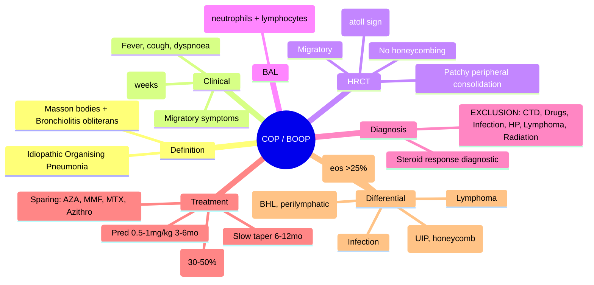
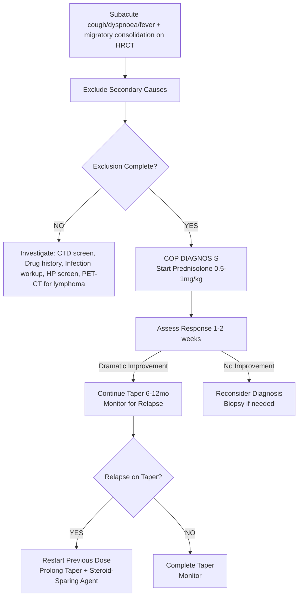

# Cryptogenic Organizing Pneumonia (COP) / BOOP

Related: [[ILD framework]], [[Organising pneumonia]], [[Connective tissue disease-associated ILD]], [[Drug-induced ILD]], [[Infection]], [[Hypersensitivity pneumonitis]], [[Lymphoma]]

> [!important]
> **Cryptogenic organizing pneumonia (COP)** = **idiopathic** organising pneumonia (formerly **BOOP** - Bronchiolitis Obliterans Organizing Pneumonia). **Organising pneumonia (OP) pattern** = buds of granulation tissue (Masson bodies) filling alveolar ducts and alveoli. **Key FCPS/MRCP**: **Subacute onset** (weeks), **patchy migratory consolidation** on HRCT, **dramatic steroid response** (diagnostic clue), **excellent prognosis** with steroids, **relapse common** on taper, **exclude secondary causes** (CTD, drugs, infection, HP, lymphoma).

## Learning Objectives
- Recognise **clinical presentation** (subacute cough, dyspnoea, fever, weight loss)
- Identify **HRCT hallmark**: **patchy, peripheral, migratory consolidation** (+/- reversed halo sign)
- Apply **diagnostic criteria** (clinical + HRCT + BAL + exclusion of secondary causes)
- Differentiate **cryptogenic (COP)** from **secondary OP** (CTD, drugs, infection, HP, lymphoma, post-radiation, post-transplant)
- Treat with **prednisolone** (0.5–1 mg/kg) — **rapid response is diagnostic clue**
- Manage **relapse on taper** (prolonged steroid course, steroid-sparing agents)
- Differentiate from **COPD exacerbation, pneumonia, lymphoma, vasculitis, eosinophilic pneumonia**

## Definition
**Cryptogenic Organizing Pneumonia (COP)** = **idiopathic** form of **organising pneumonia (OP)** — a clinicopathological entity characterised by **intraalveolar buds of granulation tissue (Masson bodies)** connecting to **bronchiolitis obliterans** (plugs of granulation tissue in bronchioles), **without identifiable cause**.

**Synonyms**: BOOP (Bronchiolitis Obliterans Organizing Pneumonia) — older term; **OP** = organising pneumonia pattern (can be cryptogenic or secondary).

> **FCPS/MRCP tip**: **COP is a diagnosis of exclusion** — must rule out secondary causes (CTD, drugs, infection, HP, lymphoma, post-radiation, post-transplant, vasculitis).

## Core Anatomy / Pathophysiology
### Organising Pneumonia (OP) Pattern
1. **Initial injury** (unknown in COP; known in secondary OP) → alveolar epithelial damage
2. **Fibrin exudation** into alveolar spaces
3. **Fibroblast proliferation** → **granulation tissue buds (Masson bodies)** grow into alveolar ducts and alveoli from bronchiolar walls
4. **Polypoid plugs** of fibroblasts, myofibroblasts, connective tissue within alveolar ducts/alveoli
5. **Bronchiolitis obliterans** component: similar plugs in bronchiolar lumens
5. **Parenchymal architecture preserved** (unlike UIP/IPF) — **reversible** with treatment

### Key Distinction: OP Pattern vs COP
| Aspect | OP Pattern | COP (Cryptogenic) |
|--------|------------|-------------------|
| **Cause** | Secondary (CTD, drugs, infection, HP, lymphoma, radiation, transplant) | **Idiopathic** (no identifiable cause after workup) |
| **Histology** | Identical (Masson bodies, bronchiolitis obliterans) | Identical |
| **Treatment response** | Variable | **Dramatic steroid response** |
| **Prognosis** | Depends on underlying cause | **Excellent** (if treated) |

## Clinical Features
### Typical Presentation (Subacute, 2–8 weeks)
- **Dry cough** (most common, >90%)
- **Progressive dyspnoea** (exertional → at rest)
- **Low-grade fever** (often present, ~50%)
- **Weight loss**, malaise, fatigue
- **Chest discomfort** (pleuritic, vague)
- **Flu-like prodrome** (myalgia, arthralgia, headache)
- **Symptoms often migratory** (consolidation shifts)

### Physical Examination
- **Bibasal inspiratory crackles** (fine, "Velcro-like" but softer than IPF)
- **Occasional wheeze** (if bronchial involvement)
- **Clubbing** (rare, <5% — if present, think alternative)
- **Normal** in mild cases
- **No digital clubbing, no rheumatoid nodules, no Raynaud's** (if present → think CTD)

## Investigations
### 1. HRCT (Hallmark Findings)
| Finding | Description |
|---------|-------------|
| **Patchy consolidation** | **Peripheral / peribronchial**, often **lower lobe predominant** |
| **Migratory** | **Key feature** — consolidations **shift location** on serial imaging |
| **Ground-glass opacity (GGO)** | Often adjacent to consolidation |
| **Reversed halo sign (Atoll sign)** | **Central GGO surrounded by crescent of consolidation** — **specific for OP** (also in sarcoid, TB, fungal) |
| **Bronchial wall thickening** | Centrilobular nodules (bronchiolitis component) |
| **No honeycombing** | **Absent** (distinguishes from UIP/IPF) |
| **No significant lymphadenopathy** | BHL uncommon |

> **FCPS/MRCP tip**: **Migratory patchy consolidation + reversed halo sign = classic COP**. **No honeycombing = not IPF**.

### 2. Pulmonary Function Tests
- **Restrictive pattern** (↓ TLC, ↓ FVC, normal FEV1/FVC)
- **↓ DLCO** (often disproportionate)
- **Normal or mildly obstructive** (if bronchial involvement prominent)
- **Rapid improvement** with steroids (serial PFTs show rapid FVC/DLCO recovery)

### 3. BAL (Bronchoalveolar Lavage)
| Parameter | COP Typical |
|-----------|-------------|
| **Total cells** | ↑ (2–4× normal) |
| **Macrophages** | ↑ (often pigmented) |
| **Lymphocytes** | **Mild-moderate ↑** (10–30%) |
| **Neutrophils** | **Often ↑** (10–50%) |
| **Eosinophils** | Variable (can be >25% = eosinophilic OP) |
| **CD4/CD8 ratio** | Variable (often normal or slightly ↓) |
| **Culture** | Negative (exclude infection) |

### 4. Histology (If Biopsy Needed)
- **Masson bodies**: Polypoid plugs of **loose connective tissue + fibroblasts + myofibroblasts** within alveolar ducts/alveoli
- **Bronchiolitis obliterans**: Similar plugs in bronchiolar lumens
- **Mild chronic inflammation** (lymphocytes, plasma cells)
- **No granulomas** (vs sarcoid, HP, TB)
- **No significant fibrosis** (vs UIP)
- **Alveolar architecture preserved** (distal airspaces intact)

### 4. Exclusion Workup (Mandatory for COP)
| Exclude | Tests |
|---------|-------|
| **Infection** | Sputum culture, viral PCR, Legionella/pneumococcal urinary Ag, TB (AFB, PCR), fungal serology/culture |
| **CTD** | ANA, RF, CCP, ENA panel, CK, ESR/CRP |
| **Drug-induced** | Temporal drug history (MTX, leflunomide, anti-TNF, nitrofurantoin, amiodarone, statins, antibiotics) |
| **HP** | Exposure history, serum precipitins, CD4/CD8 <1 |
| **Lymphoma** | PET-CT, BAL flow cytometry, biopsy if suspicious |
| **Vasculitis** | ANCA, renal function, urine microscopy |
| **Eosinophilic pneumonia** | BAL eosinophils >25%, peripheral eosinophilia |
| **Post-radiation / post-transplant** | History |

## Classification
### By Aetiology
1. **Cryptogenic (COP)** — **idiopathic**, no identifiable cause after workup
2. **Secondary Organising Pneumonia** — **identifiable trigger**
   - **CTD**: RA, SLE, SSc, PM/DM, SjS, MCTD, vasculitis
   - **Drug-induced**: MTX, leflunomide, anti-TNF, nitrofurantoin, amiodarone, statins, antibiotics, checkpoint inhibitors
   - **Infection**: Post-viral, post-bacterial, Mycoplasma, Chlamydia, Legionella, TB, fungal
   - **HP**: Chronic bird fancier's, farmer's lung
   - **Post-radiation** (radiation pneumonitis → OP)
   - **Post-transplant** (lung, HSCT — bronchiolitis obliterans syndrome)
   - **Vasculitis** (GPA, EGPA, MPA)
   - **Inhalation injury** (toxic fumes, smoke)

### By Histology (OP Pattern Variants)
| Variant | Features |
|---------|----------|
| **Classic OP** | Masson bodies in alveoli + bronchiolitis obliterans |
| **Eosinophilic OP** | **BAL eosinophils >25%**, peripheral eosinophilia, rapid steroid response |
| **Fibrotic OP** | Established fibrosis (rare, late stage) |

## Clinical Features Comparison
| Feature | COP | Secondary OP | IPF | Sarcoidosis | Eosinophilic Pneumonia |
|---------|-----|--------------|-----|-------------|------------------------|
| **Onset** | Subacute (weeks) | Variable | Insidious (months) | Variable | Acute/subacute |
| **Fever** | Common | Variable | Rare | Common | High (acute) |
| **HRCT** | **Migratory consolidation, GGO, reversed halo** | Similar | **UIP (honeycombing)** | **BHL + perilymphatic nodules** | **GGO + peripheral eosinophilia** |
| **BAL** | Mixed (lymphs, neutros) | Variable | Neutrophilia | Lymphocytosis, CD4/CD8 >3.5 | **Eosinophils >25%** |
| **Steroid Response** | **Dramatic (days)** | Variable | Poor | Good | **Dramatic** |
| **Prognosis** | Excellent | Variable | Poor | Good | Good |
| **Relapse** | Common on taper | Variable | N/A | Common | Common |

## Management
### 1. Prednisolone (First-Line, Diagnostic + Therapeutic)
| Scenario | Dose | Duration |
|----------|------|----------|
| **Typical COP** | **Prednisolone 0.5–1 mg/kg/day** (30–60 mg/day) | **3–6 months** (taper over 6–12 months) |
| **Severe/Hypoxaemic** | **IV Methylprednisolone 500–1000 mg ×3–5d** → oral taper | Same taper |
| **Mild/Asymptomatic (incidental)** | Observe or **low-dose pred 10–20 mg** | Short course (4–8 weeks) |

**Response**: **Dramatic improvement in days** (symptoms, CXR/HRCT resolution) — **diagnostic hallmark**.
**Taper**: Reduce by 5–10 mg every 2–4 weeks once symptoms/resolution; **slow taper over 6–12 months** to prevent relapse.

### 2. Relapse Management (Common: 30–50% on taper)
- **Restart previous effective dose** of prednisolone
- **Prolonged taper** (12–24 months)
- **Add steroid-sparing agent**:
  - **Azathioprine** (1.5–2.5 mg/kg/day)
  - **Mycophenolate** (1–1.5 g BD)
  - **Methotrexate** (10–25 mg/week + folate)
  - **Azithromycin** (250 mg 3x/week) — anti-inflammatory, some evidence

### 3. Steroid-Sparing / Refractory
| Agent | Indication | Dose |
|-------|------------|------|
| **Azathioprine** | Relapse on taper, steroid toxicity | 1.5–2.5 mg/kg/day |
| **Mycophenolate** | Refractory, steroid-sparing | 1–1.5 g BD |
| **Methotrexate** | Steroid-sparing (if no fibrosis) | 10–25 mg/week + folate |
| **Azithromycin** (macrolide) | Anti-inflammatory, relapse prevention | 250 mg 3x/week |
| **Cyclophosphamide** | Severe refractory (rare) | IV pulse |

### 4. Supportive Care
- **Oxygen** (if hypoxaemic)
- **Antibiotics** (if secondary infection suspected during steroids)
- **PPI** (gastric protection on steroids)
- **Bone protection** (calcium, vit D, bisphosphonate if steroids >3mo)
- **Vaccinations** (flu, pneumococcal, COVID, VZV if no immunity)
- **Pulmonary rehabilitation**

## Drug Interactions / Contraindications / Cautions
### Steroids
- **Diabetes** (monitor glucose)
- **Osteoporosis** (DEXA, calcium/vit D, bisphosphonate if >3mo)
- **Infection risk** (screen TB, hepatitis, HIV before high-dose)
- **Pregnancy** (prednisolone safe; avoid MTX, MMF, CYC)
- **Psychiatric** (mood changes, psychosis)

### Azathioprine
- **TPMT testing** before start (avoid if deficient)
- **Myelosuppression** (monitor FBC)
- **Hepatotoxicity** (LFT monitoring)

### Methotrexate
- **Pneumonitis risk** (exclude before starting; stop if new GGO)
- **Folic acid 5 mg weekly**
- **Pregnancy contraindicated**

### Azithromycin
- **QT prolongation** (ECG baseline if cardiac disease)
- **GI intolerance**

## Procedures
### Lung Biopsy (if diagnosis uncertain)
- **VATS** preferred (multiple lobes, pleural surface)
- **Transbronchial biopsy** (lower yield for OP pattern)
- **Samples**: Multiple lobes, include pleura

### EBUS / Mediastinoscopy
- **If lymphadenopathy** → exclude lymphoma, sarcoid, TB
- **EBUS-TBNA** for nodal sampling

## Complications
- **Relapse** (30–50% on steroid taper)
- **Chronic steroid toxicity** (osteoporosis, diabetes, cataract, infection, myopathy)
- **Progressive fibrosis** (rare, "fibrotic OP" — poor prognosis)
- **Secondary infection** (on steroids)
- **Secondary OP → lymphoma** (if missed)
- **Relapse after discontinuation** (may need long-term low-dose maintenance)

## Red Flags / Emergencies
- **Rapid deterioration** (new GGO, hypoxaemia) → exclude infection, DAH, acute exacerbation
- **Massive haemoptysis** (rare) → BAE
- **Acute eosinophilic pneumonia** (if eosinophilic OP) — rapid steroid response
- **Steroid-induced psychosis** (monitor mental state)

## Special Situations
### Pregnancy
- **Prednisolone safe** (low dose)
- **Azathioprine, hydroxychloroquine** compatible
- **Avoid**: MTX, MMF, CYC, leflunomide
- **Close monitoring** (maternal/fetal)

### Post-Radiation OP
- **Radiation pneumonitis → OP** (3–6 months post-RT)
- **Steroids** (pred 0.5 mg/kg) + **pentoxifylline** (some evidence)
- **Avoid re-irradiation** of affected area

### Post-Transplant (Lung/HSCT)
- **Bronchiolitis obliterans syndrome (BOS)** vs **OP**
- **BOS**: obstructive, fixed airflow limitation, no OP on biopsy
- **OP**: organizing pneumonia pattern, steroid-responsive
- **Azithromycin** prophylactic for BOS in lung transplant

### Eosinophilic OP
- **BAL eosinophils >25%**, peripheral eosinophilia
- **Rapid steroid response** (like CEP/AFEP)
- **Relapse common** on taper

## Prognosis
| Factor | Better | Worse |
|--------|--------|-------|
| **COP (idiopathic)** | >90% remission with steroids | Relapse common |
| **Secondary OP** | Depends on underlying cause | Underlying CTD/lymphoma drives prognosis |
| **Fibrotic OP** | Rare | Poor (progressive fibrosis) |
| **Relapse** | Manageable with steroid-sparing | Repeated relapses = chronic steroid dependence |
| **Mortality** | <5% at 5 years (COP) | Higher if secondary to CTD/lymphoma |

## Topic Correlation
- [[ILD framework]] — diagnostic approach
- [[Connective tissue disease-associated ILD]] — secondary OP
- [[Hypersensitivity pneumonitis]] — differential
- [[Drug-induced ILD]] — secondary OP
- [[Lymphoma]] — exclusion
- [[Eosinophilic lung disease]] — eosinophilic OP variant
- [[Sarcoidosis]] — differential (reversed halo sign)

## FCPS/MRCP High-Yield Points
1. **COP** = idiopathic organising pneumonia (BOOP); **OP pattern** = Masson bodies + bronchiolitis obliterans
2. **Clinical**: Subacute (weeks), fever, cough, dyspnoea, weight loss, migratory symptoms
3. **HRCT hallmark**: **Patchy, peripheral, migratory consolidation + GGO + reversed halo sign (atoll sign)**
3. **BAL**: Mixed neutrophilia + lymphocytosis (non-specific)
4. **Diagnosis of exclusion**: Must rule out CTD, drugs, infection, HP, lymphoma, radiation, transplant
4. **Dramatic steroid response** (days-weeks) = **diagnostic hallmark**
5. **Steroid dose**: Prednisolone 0.5–1 mg/kg (30–60 mg) ×3–6 months, slow taper 6–12 months
6. **Relapse common** (30–50% on taper) → prolong taper, add steroid-sparing (AZA, MMF, MTX)
6. **Differentials**: IPF (no honeycombing), Sarcoid (BHL, perilymphatic), Eosinophilic pneumonia (BAL eos >25%), Lymphoma (PET-CT), Infection (cultures), CTD (autoantibodies), Drug-induced (temporal)
7. **Prognosis**: Excellent with treatment (>90% remission); relapse common; fibrotic variant poor
8. **Secondary OP**: CTD, drugs (MTX, leflunomide, anti-TNF, nitrofurantoin), infection, HP, lymphoma, radiation, transplant

## Common Viva Questions
1. COP vs secondary OP vs IPF vs sarcoidosis
2. HRCT findings (consolidation, reversed halo, migratory)
3. BAL findings in COP
4. Diagnostic criteria (exclusion of secondary causes)
5. Steroid regimen and taper
6. Relapse management and steroid-sparing agents
6. Differential diagnosis (IPF, sarcoid, eosinophilic pneumonia, lymphoma, infection)
7. Reversed halo sign significance
8. Secondary causes of OP

## Common Confusions / Exam Traps
- **COP = BOOP** (old term) — same entity
- **COP = idiopathic** — MUST exclude secondary causes first
- **Reversed halosign = specific for COP** — NO (also sarcoid, TB, fungal, infarction)
- **COP = IPF** — NO (IPF = UIP/honeycombing; COP = consolidation, no honeycombing)
- **COP = always steroid-responsive** — mostly, but fibrotic variant may be refractory
- **Relapse = treatment failure** — NO (relapse on taper is expected; prolong taper + steroid-sparing)
- **Secondary OP causes** — don't forget drugs (MTX, leflunomide, anti-TNF, nitrofurantoin, amiodarone)
- **COP vs Eosinophilic pneumonia** — BAL eosinophils >25% = eosinophilic; COP = mixed

## Mnemonics
- **COP HRCT**: **C**onsolidation (patchy, peripheral), **O**perating (migratory), **P**eripheral + **R**eversed **H**alo = **COP-RH**
- **COP BAL**: **N**eutrophilia + **L**ymphocytosis = **NL** (mixed)
- **COP STEROIDS**: **D**ramatic response = **D**iagnostic; **R**elapse on taper = **R**epeat + **S**paring
- **OP CAUSES**: **C**TD, **D**rugs, **I**nfection, **H**P, **L**ymphoma, **R**adiation, **T**ransplant = **CDILRT**
- **REVERSED HALO**: **R**eversed **H**alo = **C**entral GGO + **C**rescent consolidation = **OP** (also sarcoid, TB, fungal)

## Mind Map

## Flowchart

## Suggested Visuals / Image Notes
- HRCT: Patchy peripheral consolidation, migratory, reversed halo sign
- Reversed halo sign (atoll sign) diagram
- Masson bodies histology
- Serial HRCT showing migratory consolidation
- Steroid response timeline (days-weeks)

## Suggested Video References
- ATS/ERS COP guidelines
- BTS ILD guidelines (OP section)
- Reversed halo sign interpretation
- Steroid taper and relapse management
- COP vs IPF vs Sarcoid differentiation

## One-Page Revision Summary
- **COP** = idiopathic organising pneumonia (BOOP); Masson bodies + bronchiolitis obliterans
- **Clinical**: Subacute (weeks), fever, cough, dyspnoea, migratory symptoms
- **HRCT**: **Patchy peripheral migratory consolidation + GGO + reversed halo sign** (atoll sign)
- **BAL**: Mixed neutrophilia + lymphocytosis
- **Diagnosis**: **Exclusion** (CTD, drugs, infection, HP, lymphoma, radiation)
- **Steroids**: Pred 0.5–1 mg/kg, **dramatic response diagnostic**, taper 6–12 months
- **Relapse**: 30–50% on taper → prolong taper + steroid-sparing (AZA, MMF, MTX, azithromycin)
- **Prognosis**: Excellent (>90% remission); relapse common; fibrotic variant poor
- **Differentials**: IPF (honeycombing), Sarcoid (BHL, perilymphatic), Eosinophilic PNA (eos >25%), Lymphoma, Infection, CTD, Drugs

## 24-Hour Recall Prompts
- COP definition (idiopathic OP)
- HRCT classic triad
- Reversed halo sign
- BAL findings
- Exclusion criteria for COP
- Steroid regimen and taper
- Relapse management
- Key differentials (IPF, sarcoid, eosinophilic, lymphoma)

## 7-Day / 15-Day / 30-Day Revision Tracker
- [ ] Day 1 completed
- [ ] 24-hour recall completed
- [ ] Day 7 revision completed
- [ ] Day 15 revision completed
- [ ] Day 30 revision completed

## Must Know / Should Know / Nice to Know
### Must Know
- COP definition (idiopathic OP)
- HRCT: migratory consolidation, reversed halo
- Steroid response diagnostic
- Exclusion of secondary causes
- Steroid regimen and taper
- Relapse common on taper
- Differentials (IPF, sarcoid, eosinophilic, lymphoma)

### Should Know
- Secondary OP causes (CTD, drugs, infection, HP, lymphoma, radiation)
- Reversed halo sign (not specific to COP)
- BAL findings (mixed)
- Steroid-sparing agents (AZA, MMF, MTX, azithromycin)
- Eosinophilic OP variant
- Post-radiation / post-transplant OP

### Nice to Know
- COP in children
- Fibrotic OP variant
- Azithromycin for relapse prevention
- Cost-effectiveness of steroids
- Long-term QOL outcomes
- Genetic predisposition

## Self-Test Scorecard
- Understanding: /10
- Recall: /10
- MCQ Performance: /10
- SBA Performance: /10
- Viva Confidence: /10
- Total: /50

> [!tip]
> Interpretation: <35 = weak topic, 35-44 = acceptable but insecure, 45+ = strong exam-ready topic.

## Exam Answer Modes
### Long Answer Skeleton
- Definition (COP = idiopathic OP, BOOP)
- Clinical features (subacute, migratory, fever, cough)
- HRCT findings (consolidation, GGO, reversed halo, migratory)
- BAL findings
- Diagnostic algorithm (exclusion of secondary causes)
- Secondary OP causes table (CTD, drugs, infection, HP, lymphoma, radiation)
- Treatment algorithm (steroids, taper, relapse management, steroid-sparing)
- Differential diagnosis table (IPF, sarcoid, eosinophilic, lymphoma, infection, CTD)
- Prognosis and complications

### Short Note Skeleton
- Definition box
- HRCT box
- Diagnostic algorithm flowchart
- Steroid regimen box
- Relapse management box
- Differential table

### Viva One-Liners
- "COP = idiopathic organising pneumonia (BOOP); Masson bodies + bronchiolitis obliterans"
- "HRCT: patchy peripheral migratory consolidation + GGO + reversed halo (atoll sign)"
- "BAL: mixed neutrophilia + lymphocytosis (non-specific)"
- "Diagnosis = EXCLUSION of secondary causes (CTD, drugs, infection, HP, lymphoma, radiation)"
- "Dramatic steroid response in days = diagnostic hallmark for COP"
- "Prednisolone 0.5–1 mg/kg, taper 6–12 months; relapse 30–50% on taper"
- "Relapse → restart dose, prolong taper, add steroid-sparing (AZA, MMF, MTX, azithromycin)"
- "Reversed halo sign = central GGO + crescent consolidation = OP pattern (also sarcoid, TB, fungal)"
- "COP vs IPF: COP = consolidation/migratory/no honeycombing; IPF = UIP/honeycombing"
- "COP vs Sarcoid: COP = consolidation/migratory; Sarcoid = BHL/perilymphatic nodules"
- "COP vs Eosinophilic PNA: BAL eos >25% = eosinophilic; COP = mixed"
- "Secondary OP: CTD, drugs (MTX, anti-TNF, nitrofurantoin), infection, HP, lymphoma, radiation"

### Ward-Case Discussion Points
- 55F, 6-week cough, fever, weight loss, HRCT migratory consolidation, dramatic steroid response → COP → pred 40mg taper 9mo, relapse at 10mg → add azathioprine
- 60M, post-RA diagnosis, on MTX, new consolidation → MTX pneumonitis (secondary OP) → stop MTX, steroids, switch to RTX
- 40M, fever, cough, HRCT consolidation + reversed halo, BAL eos 30% → eosinophilic OP → steroids, rapid response
- 50F, post-radiation breast CA, 4mo dyspnoea, HRCT consolidation in radiation field → radiation OP → steroids

### Last-Night-Before-Exam Sheet
- COP = idiopathic OP (BOOP)
- HRCT: Migratory consolidation + GGO + Reversed halo (atoll)
- BAL: Mixed (neutrophils + lymphocytes)
- DX = Exclusion (CTD, drugs, infection, HP, lymphoma, radiation)
- Steroids: Pred 0.5-1mg/kg, dramatic response, taper 6-12mo
- Relapse 30-50% → prolong taper + sparing (AZA, MMF, MTX)
- Diff: IPF (honeycomb), Sarcoid (BHL), Eos PNA (eos>25%), Lymphoma
- Secondary: CTD, Drugs (MTX, anti-TNF), Inf, HP, Lymphoma, Radiation

## Summary
**Cryptogenic organizing pneumonia (COP)** = **idiopathic organising pneumonia** (formerly BOOP), characterised by **Masson bodies** (intraalveolar granulation tissue plugs) and **bronchiolitis obliterans**. **Clinical**: subacute (weeks), fever, cough, dyspnoea, weight loss, migratory. **HRCT hallmark**: **patchy peripheral migratory consolidation + GGO + reversed halo (atoll) sign**. **BAL**: mixed neutrophilia + lymphocytosis. **Diagnosis of exclusion**: must rule out **CTD, drugs (MTX, leflunomide, anti-TNF, nitrofurantoin, amiodarone), infection, HP, lymphoma, radiation, transplant**. **Dramatic steroid response** (prednisolone 0.5–1 mg/kg) in days = **diagnostic hallmark**. **Taper over 6–12 months**; **relapse 30–50%** on taper → restart dose, prolong taper, add **steroid-sparing** (azathioprine, mycophenolate, methotrexate, azithromycin). **Differentials**: IPF (UIP/honeycombing), sarcoidosis (BHL, perilymphatic), eosinophilic pneumonia (BAL eos >25%), lymphoma, infection, CTD, drug-induced, post-radiation. **Prognosis**: excellent with treatment (>90% remission); relapse common; fibrotic variant poor.

## MCQs (10)
1. **Former name** of Cryptogenic Organizing Pneumonia (COP):
   A. Usual Interstitial Pneumonia (UIP)
   B. **Bronchiolitis Obliterans Organizing Pneumonia (BOOP)**
   C. Non-Specific Interstitial Pneumonia (NSIP)
   D. Acute Interstitial Pneumonia (AIP)

2. **HRCT hallmark** of COP:
   A. Basal honeycombing with traction bronchiectasis
   B. **Patchy peripheral migratory consolidation + GGO + reversed halo sign**
   C. Bilateral hilar lymphadenopathy with perilymphatic nodules
   D. Centrilobular nodules with mosaic attenuation

3. **Reversed halo sign (Atoll sign)** on HRCT:
   A. **Central GGO surrounded by crescent-shaped consolidation**
   B. Peripheral consolidation with central lucency
   C. Ring-like consolidation with central cavity
   D. Nodule with surrounding GGO halo

4. **BAL findings** in COP:
   A. Lymphocytosis >50%, CD4/CD8 >3.5
   B. Neutrophilia >50%
   C. **Mixed neutrophilia + lymphocytosis (non-specific)**
   D. Eosinophilia >25%

5. **COP diagnosis** requires:
   A. Typical HRCT + elevated ACE
   B. **Exclusion of secondary causes (CTD, drugs, infection, HP, lymphoma, radiation)**
   C. Positive serum precipitins
   D. Surgical lung biopsy mandatory

6. **Dramatic steroid response** in COP:
   A. Occurs over 3–6 months
   B. **Occurs within days to 2 weeks**
   C. Only occurs with IV methylprednisolone
   D. Absent in >50% of cases

7. **Relapse rate** on steroid taper in COP:
   A. <10%
   B. 10–20%
   C. **30–50%**
   D. >80%

8. **Secondary organising pneumonia** — which is NOT a cause?
   A. Rheumatoid arthritis
   B. Methotrexate
   C. **Idiopathic pulmonary fibrosis (IPF)**
   D. Post-radiation

9. **Reversed halo sign** (atoll sign) — which is TRUE?
   A. Pathognomonic for COP
   B. **Central GGO + crescent consolidation = OP pattern (also in sarcoid, TB, fungal)**
   C. Only seen in COP
   D. Indicates malignancy

10. **COP vs IPF** — key HRCT difference:
    A. **COP: migratory consolidation, no honeycombing; IPF: basal honeycombing (UIP)**
    B. COP: basal honeycombing; IPF: migratory consolidation
    C. Both show honeycombing
    C. Neither shows honeycombing

## SBA Questions (10)
1. A 55F, 6-week cough, fever, weight loss. HRCT: migratory patchy consolidation, reversed halo sign. BAL: mixed neutrophilia/lymphocytosis. Negative infection workup, negative autoantibodies, no drug history. Best diagnosis?
   A. IPF
   B. Sarcoidosis
   C. **Cryptogenic organizing pneumonia (COP)**
   D. Eosinophilic pneumonia

2. Same patient, started prednisolone 40 mg/day. Day 7: afebrile, cough resolved, HRCT consolidation resolved. Significance?
   A. Expected slow response
   B. **Dramatic response = diagnostic for COP**
   C. Suggests lymphoma
   C. Suggests infection

3. Same patient, tapered to prednisolone 10 mg at 4 months. Symptoms recur, HRCT shows new consolidation. Management?
   A. Increase prednisolone to 60 mg
   B. **Restart previous effective dose (40 mg), prolong taper, add steroid-sparing agent**
   C. Switch to cyclophosphamide
   D. Biopsy for lymphoma

4. COP relapse management — first-line steroid-sparing agent:
   A. Cyclophosphamide
   B. **Azathioprine or Mycophenolate**
   C. Methotrexate
   D. Cyclosporine

5. HRCT shows reversed halo sign. Which condition is LEAST likely?
   A. Cryptogenic organizing pneumonia
   B. Sarcoidosis
   C. TB / Fungal infection
   D. **Idiopathic pulmonary fibrosis (IPF)**

5. A 60M, subacute cough, fever, HRCT: patchy consolidation + reversed halo. BAL: eosinophils 35%, peripheral eosinophilia 1500/µL. Diagnosis?
   A. COP
   B. **Acute eosinophilic pneumonia / Chronic eosinophilic pneumonia**
   C. ABPA
   D. Churg-Strauss (EGPA)

7. Secondary organising pneumonia — which drug is a recognised cause?
   A. Salbutamol
   B. **Methotrexate**
   C. Prednisolone
   D. Azithromycin

8. COP vs IPF — key clinical distinction:
   A. COP: older male smoker; IPF: young female
   B. **COP: subacute, migratory consolidation, dramatic steroid response; IPF: insidious, UIP, no steroid response**
   C. COP: honeycombing; IPF: consolidation
   D. Both respond to steroids

8. COP steroid taper — recommended duration:
   A. 4–8 weeks
   B. 3–6 months
   C. **6–12 months (slow taper to prevent relapse)**
   D. 2 weeks

9. Relapsed COP on taper — next step:
   A. Switch to cyclophosphamide
   B. **Restart previous effective prednisolone dose, prolong taper, add steroid-sparing agent**
   C. Stop steroids, observe
   D. Increase to 1 mg/kg

## Flashcards
- Q: COP old name
  A: BOOP
- Q: HRCT COP
  A: Migratory consolidation + GGO + reversed halo
- Q: Reversed halo
  A: Central GGO + crescent consolidation
- Q: BAL COP
  A: Mixed neutrophils + lymphocytes
- Q: COP diagnosis
  A: Exclusion of secondary causes
- Q: Steroid response
  A: Dramatic (days-weeks) = diagnostic
- Q: Steroid dose
  A: Pred 0.5-1mg/kg 3-6mo
- Q: Relapse rate
  A: 30-50% on taper
- Q: Relapse management
  A: Restart dose, prolong taper, add sparing (AZA, MMF, MTX)
- Q: COP vs IPF
  A: COP = consolidation/migratory; IPF = UIP/honeycomb
- Q: COP vs Sarcoid
  A: COP = consolidation; Sarcoid = BHL/perilymphatic
- Q: Reversed halo
  A: Central GGO + crescent = OP (sarcoid, TB, fungal too)
- Q: Secondary OP causes
  A: CTD, Drugs, Inf, HP, Lymphoma, Radiation
- Q: Steroid taper
  A: 6-12 months slow
- Q: Sparing agents
  A: AZA, MMF, MTX, Azithro

## Answer Key with Explanations
### MCQs
1. **B** — COP was formerly called BOOP (Bronchiolitis Obliterans Organizing Pneumonia).
2. **B** — Classic HRCT: patchy peripheral migratory consolidation + GGO + reversed halo sign.
3. **A** — Reversed halo (atoll) sign = central GGO surrounded by crescent of consolidation.
4. **C** — BAL in COP shows mixed neutrophilia + lymphocytosis (non-specific).
5. **B** — COP is a diagnosis of exclusion (must rule out CTD, drugs, infection, HP, lymphoma, radiation).
6. **B** — Dramatic response within days to 2 weeks is characteristic and diagnostically helpful.
7. **C** — Relapse on taper occurs in 30–50% of patients.
8. **C** — IPF is a distinct entity (UIP pattern), not a cause of secondary OP.
9. **B** — Reversed halo = OP pattern; seen in sarcoid, TB, fungal, infarction, not just COP.
10. **A** — COP = migratory consolidation, no honeycombing; IPF = basal honeycombing (UIP).

### SBAs
1. **C** — Subacute migratory consolidation + reversed halo + negative workup = COP.
2. **B** — Dramatic response to steroids within days is diagnostically characteristic of COP.
3. **B** — Relapse on taper → restart previous effective dose, prolong taper, add steroid-sparing agent.
4. **B** — Azathioprine or mycophenolate are first-line steroid-sparing agents for COP.
5. **D** — Reversed halo = OP pattern (COP, sarcoid, TB, fungal); IPF shows UIP/honeycombing, not reversed halo.
6. **B** — BAL eosinophilia >25% + peripheral eosinophilia = eosinophilic pneumonia, not COP.
7. **B** — Methotrexate is a well-recognised cause of drug-induced OP.
9. **B** — Slow taper over 6–12 months recommended to reduce relapse.
10. **B** — Restart previous effective dose, prolong taper, add steroid-sparing agent.

### Flashcards
All correct as written.

---
