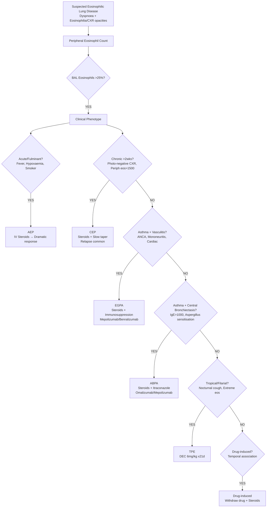

# Eosinophilic Lung Disease

Related: [[ILD framework]], [[Hypersensitivity pneumonitis]], [[ABPA]], [[EGPA]], [[Tropical pulmonary eosinophilia]], [[Drug-induced ILD]], [[Parasitic infections]], [[Charcot-Leyden crystals]], [[Corticosteroids]], [[IL-5 biologics]]

> [!important]
> **Eosinophilic lung diseases** = heterogeneous group characterised by **pulmonary eosinophilia** (BAL eosinophils >25% or tissue eosinophilia) ± **peripheral eosinophilia**. **Key FCPS/MRCP**: **Classify by chronicity** (acute vs chronic), **peripheral eosinophilia**, **BAL eosinophilia**, **HRCT pattern**; **AEP** (acute, febrile, hypoxaemic, BAL eos >25%, dramatic steroid response), **CEP** (chronic, >2wks, peripheral eos >1500, "photographic negative" CXR), **EGPA** (asthma, eosinophilia, vasculitis, ANCA+ 40%), **ABPA** (asthma, central bronchiectasis, IgE >1000, Aspergillus sensitisation), **Tropical** (filarial, DEC responsive). **Steroids mainstay**; **IL-5 biologics** for refractory EGPA/CEP.

## Learning Objectives
- Classify eosinophilic lung diseases by **acute vs chronic**, **idiopathic vs secondary**
- Recognise **clinical syndromes**: AEP, CEP, EGPA, ABPA, Tropical, Drug-induced, Parasitic
- Interpret **diagnostic criteria** (peripheral eosinophilia, BAL eosinophilia >25%, HRCT patterns)
- Differentiate **AEP vs CEP vs EGPA vs ABPA** (clinical, radiological, serological)
- Apply **treatment algorithms** (steroids 1st line, IL-5/IL-4R biologics for refractory)
- Recognise **complications** (corticosteroid dependence, fibrosis, cardiac involvement in EGPA)

## Definition
**Eosinophilic lung disease** = group of disorders characterised by **eosinophilic infiltration of lung parenchyma and airways**, with **peripheral blood eosinophilia** (often) and **BAL eosinophilia >25%**.

**Classification (by chronicity & aetiology)**:
| Category | Diseases |
|----------|----------|
| **Acute Idiopathic** | **Acute Eosinophilic Pneumonia (AEP)** |
| **Chronic Idiopathic** | **Chronic Eosinophilic Pneumonia (CEP)** |
| **Secondary (with known cause)** | **EGPA** (vasculitis), **ABPA** (fungal hypersensitivity), **Drug-induced**, **Parasitic**, **Tropical (Filarial)**, **Malignancy-associated**, **IgG4-related**, **Connective tissue disease** |

> **FCPS/MRCP tip**: **AEP = acute, febrile, hypoxaemic, BAL eos >25%, dramatic steroid response**. **CEP = chronic (>2wks), "photographic negative" CXR, peripheral eos >1500**. **EGPA = asthma + eos + vasculitis + ANCA (±)**.

## Core Pathophysiology
### Eosinophil Recruitment to Lung
1. **Antigen/Trigger** (unknown in idiopathic, Aspergillus in ABPA, drugs, parasites, etc.)
2. **Th2 activation** → **IL-4, IL-5, IL-13** release
3. **IL-5** → **eosinophil differentiation, survival, recruitment** from bone marrow → lung
4. **Eosinophil activation** → **cationic proteins** (MBP, ECP, EPO, EDN) → **epithelial damage, bronchoconstriction, fibrosis**
5. **IL-4/IL-13** → **IgE class switching**, **mucus hypersecretion**, **airway hyperresponsiveness**

### Key Cytokines
| Cytokine | Source | Effect |
|----------|--------|--------|
| **IL-5** | Th2, ILC2 | **Eosinophilopoiesis, survival, recruitment** (key) |
| **IL-4** | Th2, ILC2 | IgE switching, mucus, AHR |
| **IL-13** | Th2, ILC2 | Mucus, fibrosis, AHR, IgE |
| **TSLP/IL-33/IL-25** | Epithelium (alarmin) | **Activates ILC2, Th2** (upstream) |

## Clinical Syndromes

### 1. Acute Eosinophilic Pneumonia (AEP)
| Feature | Details |
|---------|---------|
| **Onset** | **Acute** (hours–days), **fulminant** |
| **Demographics** | Young adults (20–40), **smoking** (often recent initiation) |
| **Symptoms** | **High fever**, severe dyspnoea, **hypoxaemia**, non-productive cough, myalgia |
| **CXR/HRCT** | **Bilateral diffuse GGO**, **interlobular septal thickening** ("crazy-paving"), **pleural effusion** (common) |
| **BAL** | **Eosinophils >25%** (often 40–60%) |
| **Peripheral Eos** | Often **normal/low initially** (delayed) |
| **Course** | **Rapid progression to ARDS**, intubation common |
| **Response** | **Dramatic to steroids** (hours–days) |
| **Relapse** | Rare after treatment |

### 2. Chronic Eosinophilic Pneumonia (CEP)
| Feature | Details |
|---------|---------|
| **Onset** | **Subacute/chronic** (>2 weeks, often months) |
| **Demographics** | Women > Men, 30–50y, **asthma/allergy history** common |
| **Symptoms** | **Progressive dyspnoea**, cough, **weight loss**, night sweats, fever (low-grade) |
| **CXR** | **"Photographic negative of pulmonary oedema"** — **peripheral, upper/mid zone opacities**, migratory |
| **HRCT** | **Peripheral GGO/consolidation**, upper/lower zone, **reverse bat-wing** |
| **Peripheral Eos** | **>1500/µL** (often 3000–10,000) |
| **BAL** | **Eosinophils >25%** (often >40%) |
| **IgE** | Often elevated |
| **Response** | **Rapid to steroids** (days), **high relapse rate** on taper |

### 3. Eosinophilic Granulomatosis with Polyangiitis (EGPA / Churg-Strauss)
| Feature | Details |
|---------|---------|
| **Triad** | **Asthma + Eosinophilia + Vasculitis** |
| **ANCA** | **ANCA+ (MPO-ANCA) ~40%** (p-ANCA), **ANCA- 60%** |
| **Organ Involvement** | **Lungs** (transient infiltrates), **Skin** (purpura, nodules), **Nerves** (mononeuritis multiplex), **Heart** (myocarditis, pericarditis — **major mortality**), **GI**, **Kidney** (rare) |
| **Eosinophilia** | **>1500/µL** (often >3000) |
| **Biopsy** | **Necrotising granulomatous vasculitis**, eosinophilic infiltration |
| **Treatment** | **Steroids + immunosuppression** (CYC, RTX, MMF, **Mepolizumab/Benralizumab** for refractory) |

### 4. Allergic Bronchopulmonary Aspergillosis (ABPA)
| Feature | Details |
|---------|---------|
| **Background** | **Asthma** (or CF) + **Aspergillus fumigatus** hypersensitivity |
| **Diagnostic Criteria (ISHP/BS)** | **Mandatory**: Asthma + **Total IgE >1000 IU/mL** + **Aspergillus sensitisation** (skin test or specific IgE) + **Radiological** (central bronchiectasis, mucous plugging) + **Immunological** (Aspergillus precipitins, specific IgG) |
| **Stages** | 1. Acute → 2. Remission → 3. Exacerbation → 4. Corticosteroid-dependent → 5. Fibrosis (end-stage) |
| **CXR/HRCT** | **Central bronchiectasis** (proximal > distal), **high-attenuation mucus** (mucoid impaction), "finger-in-glove" |
| **Treatment** | **Steroids** (pred 0.5 mg/kg taper), **Itraconazole** (adjunct), **Omalizumab** (IgE <1500, refractory), **Mepolizumab** (refractory) |

### 5. Tropical Pulmonary Eosinophilia (TPE / Filarial)
| Feature | Details |
|---------|---------|
| **Cause** | **Wuchereria bancrofti / Brugia malayi** (lymphatic filariasis) |
| **Mechanism** | **Hyperimmune response** to microfilariae in lung |
| **Demographics** | **Endemic areas** (India, SE Asia, Africa), **males** (3:1), young adults |
| **Symptoms** | **Nocturnal cough/wheeze**, **weight loss**, **fever**, **hepatosplenomegaly**, **lymphadenopathy** |
| **Lab** | **Extreme eosinophilia** (>3000, often >10,000), **high IgE**, **high filarial IgG**, **filariasis antigen +ve** |
| **CXR** | **Miliary/reticulonodular**, diffuse infiltrates |
| **Treatment** | **DEC (Diethylcarbamazine) 6mg/kg/day ×21 days** — **dramatic response** |

### 6. Drug-Induced Eosinophilic Pneumonia
| Common Culprits | Notes |
|-----------------|-------|
| **NSAIDs** | Common, acute |
| **Antibiotics** (nitrofurantoin, sulfonamides, beta-lactams, minocycline) | |
| **Anticonvulsants** (carbamazepine, phenytoin) | DRESS syndrome |
| **Biologics** (checkpoint inhibitors, anti-TNF) | |
| **Statins**, **PPIs**, **ACE inhibitors** | Rare |
| **Diagnosis** | **Temporal association** (days–weeks), **resolution on withdrawal** |

## Diagnostic Workup
### 1. Peripheral Blood
- **Eosinophil count** (absolute) — **>500 = eosinophilia**, **>1500 = marked** (EGPA/CEP/TPE)
- **IgE** (total, specific)
- **ANCA** (MPO-ANCA for EGPA)
- **Filarial serology/antigen** (TPE)
- **Aspergillus specific IgE/IgG, precipitins** (ABPA)

### 2. BAL (If Diagnostic Uncertainty)
- **Eosinophils >25%** = **eosinophilic lung disease** (sensitivity ~90%)
- **CD4/CD8 ratio** (usually normal/low in eosinophilic)
- **Culture** (exclude infection)
- **Cytology** (Charcot-Leyden crystals = eosinophilic breakdown)

### 3. Imaging
| Disease | HRCT Pattern |
|---------|-------------|
| **AEP** | Diffuse GGO, crazy-paving, pleural effusion |
| **CEP** | **Peripheral upper/mid zone consolidation** (reverse bat-wing), migratory |
| **EGPA** | Transient patchy infiltrates, fleeting opacities |
| **ABPA** | **Central bronchiectasis**, high-attenuation mucus, "finger-in-glove" |
| **TPE** | Miliary/reticulonodular, diffuse |

### 4. Histology (If Biopsy)
- **Eosinophilic infiltration** (interstitial, alveolar)
- **Granulomas** (EGPA — necrotising vasculitis; CEP — eosinophilic granulomas)
- **Charcot-Leyden crystals** (eosinophil breakdown product)

## Treatment
### 1. Corticosteroids (Mainstay)
| Disease | Regimen |
|---------|---------|
| **AEP** | **IV Methylprednisolone 500–1000mg ×3–5d** → **Prednisolone 0.5–1mg/kg taper 4–8wks** |
| **CEP** | **Prednisolone 0.5–1mg/kg (30–50mg) ×2–4wks** → **slow taper 3–6mo** (high relapse) |
| **EGPA** | **Pred 1mg/kg** → taper + **steroid-sparing** (CYC/RTX/MMF, **Mepolizumab/Benralizumab** anti-IL5) |
| **ABPA** | **Pred 0.5mg/kg ×2wks** → taper 3–6mo + **Itraconazole 200mg BD ×6mo** |
| **TPE** | **DEC 6mg/kg/day ×21d** (+ steroids if severe) |
| **Drug-induced** | **Withdraw drug** + steroids if severe |

### 2. Biologics (Refractory / Steroid-Sparing)
| Agent | Target | Indications |
|-------|--------|-------------|
| **Mepolizumab** | **IL-5** | EGPA (refractory), CEP (refractory), severe eosinophilic asthma |
| **Benralizumab** | **IL-5Rα** | EGPA, severe eosinophilic asthma |
| **Dupilumab** | **IL-4Rα** | ABPA (refractory), EGPA (refractory), severe eosinophilic asthma |
| **Omalizumab** | **IgE** | ABPA (IgE 30–1500), severe allergic asthma |
| **Tezepelumab** | **TSLP** | Broad eosinophilic diseases |

### 3. Specific Therapies
| Disease | Specific |
|---------|----------|
| **TPE** | **DEC 6mg/kg/day ×21d** (curative) |
| **ABPA** | **Itraconazole 200mg BD ×6mo** (adjunct), **Omalizumab** (IgE 30–1500) |
| **EGPA** | **Mepolizumab/Benralizumab** (anti-IL5/IL5R), **RTX** (ANCA+), **CYC** (organ-threatening) |
| **Parasitic** | **Albendazole/Mebendazole** (helminths), **Praziquantel** (schistosomiasis) |

## Complications
| Disease | Complications |
|---------|---------------|
| **AEP** | ARDS, intubation, death (rare with steroids) |
| **CEP** | **Relapse on taper (50%+)**, corticosteroid dependence, fibrosis (late) |
| **EGPA** | **Cardiac** (myocarditis, pericarditis, heart failure — **leading cause of death**), **neuropathy**, **renal**, **renal**, **corticosteroid toxicity** |
| **ABPA** | **Central bronchiectasis**, **fibrosis** (end-stage), **corticosteroid dependence**, **aspergilloma** |
| **TPE** | Relapse if re-exposed, **fibrosis** (chronic) |
| **Drug-induced** | DRESS, Stevens-Johnson, chronic eosinophilic pneumonia |

## Red Flags / Emergencies
- **AEP**: Rapid hypoxaemia → **ICU, intubation, IV steroids**
- **EGPA**: **Cardiac** (chest pain, arrhythmia, heart failure), **neuropathy** (mononeuritis multiplex) → **IV steroids + CYC/RTX**
- **ABPA**: Massive haemoptysis (bronchial artery erosion) → BAE
- **TPE**: Respiratory failure (rare) → steroids + DEC

## Prognosis
| Disease | Prognosis |
|---------|-----------|
| **AEP** | **Excellent** (full recovery, rare relapse) |
| **CEP** | **Good with steroids**, but **relapse common** (50%+), some develop fibrosis |
| **EGPA** | **Variable** (5-yr survival ~80%); **cardiac involvement = poor prognosis** |
| **ABPA** | **Controlled** with steroids/itraconazole; **end-stage = fibrosis** |
| **TPE** | **Excellent with DEC**; relapse if re-exposed |
| **Drug-induced** | **Excellent** after withdrawal |

## Topic Correlation
- [[ILD framework]] — diagnostic approach
- [[ABPA]] — detailed
- [[EGPA]] — detailed
- [[Hypersensitivity pneumonitis]] — differential
- [[Drug-induced ILD]] — differential
- [[Parasitic infections]] — Tropical eosinophilia
- [[IL-5 biologics]] — mepolizumab, benralizumab

## FCPS/MRCP High-Yield Points
1. **Eosinophilic lung disease** = BAL eos >25% ± peripheral eos
2. **AEP**: Acute, febrile, hypoxaemic, smoker, **BAL eos >25%, dramatic steroid response**
2. **CEP**: Chronic (>2wks), "photo negative" CXR (peripheral), **peripheral eos >1500**, **high relapse**
3. **EGPA**: **Asthma + Eosinophilia + Vasculitis**, ANCA+ 40%, **cardiac = poor prognosis**, **Mepolizumab/Benralizumab** for refractory
4. **ABPA**: **Asthma + Central bronchiectasis + IgE >1000 + Aspergillus sensitisation**, **Itraconazole + steroids**
4. **TPE**: **Filarial**, nocturnal cough, extreme eos, **DEC curative**
5. **Drug-induced**: Temporal association, resolves on withdrawal
6. **BAL eos >25%** = eosinophilic lung disease
7. **Charcot-Leyden crystals** = eosinophil breakdown
7. **Steroids mainstay**; **IL-5/IL-4R biologics** for refractory EGPA/CEP/ABPA
8. **EGPA cardiac** = myocarditis/pericarditis = major mortality

## Common Viva Questions
1. Classification of eosinophilic lung diseases
2. AEP vs CEP vs EGPA vs ABPA differentiation
3. ABPA diagnostic criteria (IgE, bronchiectasis, Aspergillus sensitisation)
4. EGPA features (ANCA, cardiac, mononeuritis multiplex)
5. TPE (DEC treatment)
6. BAL eosinophilia interpretation
6. Charcot-Leyden crystals
7. Biologics in eosinophilic disease (IL-5, IL-4R, IgE)

## Common Confusions / Exam Traps
- **AEP vs CEP**: AEP = acute, febrile, hypoxaemic, smoker; CEP = chronic, "photo negative" CXR, female, asthma history
- **EGPA = always ANCA+** — NO (only 40% ANCA+)
- **ABPA = only in asthma** — also in **cystic fibrosis**
- **ABPA IgE >1000** = mandatory, but **not diagnostic alone** (need bronchiectasis + Aspergillus sensitisation)
- **TPE = only in tropics** — can present in travellers/migrants
- **Drug-induced eos pneumonia** = **DRESS syndrome** (if severe, multi-organ)
- **Peripheral eos normal in early AEP** — don't exclude based on normal eos
- **Charcot-Leyden crystals** = bipyramidal crystals from eosinophil breakdown (specific but not sensitive)

## Mnemonics
- **EOSINOPHILIC LUNG ACRONYM**: **A**EP (Acute), **C**EP (Chronic), **E**GPA (Vasculitis), **A**BPA (Aspergillus), **T**PE (Tropical), **D**rug-induced, **P**arasitic
- **AEP vs CEP**: **A**cute = **A**cute, **S**moker, **F**ebrile, **H**ypoxaemic; **C**EP = **C**hronic, **W**oman, **P**eripheral eos, **P**hoto-negative CXR
- **EGPA**: **E**osinophilic **G**ranulomatosis with **P**oly**A**ngiitis = **A**sthma + **E**os + **V**asculitis + **A**NCA (40%) + **C**ardiac
- **ABPA DIAGNOSIS**: **A**sthma + **I**gE >1000 + **B**ronchiectasis (central) + **A**spergillus sensitisation = **AIBA**
- **TPE**: **T**ropical = **F**ilarial + **E**xtreme eos + **D**EC curative = **TFED**

## Mind Map
```mermaid
mindmap
  root((Eosinophilic Lung Disease))
    Definition
      BAL eos >25%
      ± Peripheral eos
    Acute
      AEP: Smoker, febrile, hypoxaemic, BAL eos>25%, steroid miracle
    Chronic
      CEP: Photo-negative CXR, peripheral eos>1500, relapsing
      EGPA: Asthma + Eos + Vasculitis (ANCA 40%), Cardiac death
      ABPA: Asthma + Central bronchiectasis + IgE>1000, Itraconazole
      TPE: Filarial, DEC curative
      Drug-induced: Temporal, withdrawal cures
    Diagnosis
      Peripheral eos, BAL eos>25%, HRCT, ANCA, IgE, Filariasis Ag
    Treatment
      Steroids mainstay
      Biologics: Mepo/Benra (IL-5), Dupi (IL-4R), Omalizumab (IgE)
    Complications
      EGPA: Cardiac (death), Neuropathy
      CEP: Relapse, Fibrosis
      ABPA: Bronchiectasis, Fibrosis
```

## Flowchart


## Suggested Visuals / Image Notes
- CXR: CEP "photographic negative" peripheral opacities
- HRCT: AEP crazy-paving, CEP peripheral consolidation, ABPA central bronchiectasis
- BAL cytology: Eosinophils, Charcot-Leyden crystals
- EGPA: Cardiac MRI, mononeuritis multiplex
- ABPA: High-attenuation mucus, finger-in-glove
- TPE: Miliary pattern

## Suggested Video References
- BTS Eosinophilic Lung Disease Guidelines
- ERS/ATS Eosinophilic Lung Disease
- ABPA diagnosis and management
- EGPA (Churg-Strauss) management
- IL-5/IL-4R biologics in eosinophilic disease
- Tropical pulmonary eosinophilia

## One-Page Revision Summary
- **Eosinophilic lung disease** = BAL eos >25% ± peripheral eos
- **AEP**: Acute, smoker, febrile, hypoxaemic, **BAL eos >25%**, **steroid miracle**
- **CEP**: Chronic, **"photographic negative" CXR** (peripheral), **peripheral eos >1500**, **high relapse**
- **EGPA**: **Asthma + Eos + Vasculitis**, **ANCA+ 40%**, **cardiac = death**, **Mepolizumab/Benralizumab**
- **ABPA**: **Asthma + central bronchiectasis + IgE >1000 + Aspergillus sens**, **Itraconazole + steroids**
- **TPE**: Filarial, nocturnal cough, **DEC 6mg/kg ×21d curative**
- **Drug-induced**: Temporal, withdrawal cures
- **BAL eos >25%** = diagnostic threshold
- **Charcot-Leyden crystals** = eosinophil breakdown
- **Steroids 1st line**; **IL-5/IL-4R biologics** for refractory EGPA/CEP/ABPA

## 24-Hour Recall Prompts
- 5 idiopathic eosinophilic lung diseases
- AEP classic triad (acute, smoker, hypoxaemic)
- CEP "photographic negative" CXR
- EGPA triad (asthma, eos, vasculitis) + ANCA %
- ABPA diagnostic criteria (4 mandatory)
- TPE treatment (DEC dose/duration)
- Charcot-Leyden crystals
- Biologics: Mepo (IL-5), Benra (IL-5R), Dupi (IL-4R), Omalizumab (IgE)

## 7-Day / 15-Day / 30-Day Revision Tracker
- [ ] Day 1 completed
- [ ] 24-hour recall completed
- [ ] Day 7 revision completed
- [ ] Day 15 revision completed
- [ ] Day 30 revision completed

## Must Know / Should Know / Nice to Know
### Must Know
- AEP, CEP, EGPA, ABPA, TPE clinical features
- BAL eos >25% diagnostic threshold
- CEP "photo negative" CXR
- EGPA triad + cardiac mortality
- ABPA criteria (IgE>1000, bronchiectasis, Aspergillus)
- TPE = DEC curative
- Steroids 1st line; biologics for refractory
- Charcot-Leyden crystals

### Should Know
- EGPA ANCA+ only 40%
- ABPA in CF
- Drug-induced (DRESS)
- Charcot-Leyden crystals (specific not sensitive)
- Biologics indications (Mepo, Benra, Dupi, Omalizumab)
- EGPA cardiac = myocarditis/pericarditis = death

### Nice to Know
- IgG4-related lung disease eosinophilic
- Eosinophilic lung disease in malignancy
- Long-term outcomes of biologic therapy
- Cost-effectiveness of biologics
- Novel targets (TSLP, Siglec-8, CRTH2)
- Paediatric eosinophilic lung diseases

## Self-Test Scorecard
- Understanding: /10
- Recall: /10
- MCQ Performance: /10
- SBA Performance: /10
- Viva Confidence: /10
- Total: /50

> [!tip]
> Interpretation: <35 = weak topic, 35-44 = acceptable but insecure, 45+ = strong exam-ready topic.

## Exam Answer Modes
### Long Answer Skeleton
- Definition, classification (acute/chronic, idiopathic/secondary)
- Clinical syndromes table (AEP, CEP, EGPA, ABPA, TPE, Drug-induced)
- Diagnostic approach (peripheral eos, BAL, HRCT, serology, ANCA, IgE)
- Treatment algorithms (steroids, steroid-sparing, biologics)
- Complications and prognosis
- Special populations (pregnancy, paediatric, immunocompromised)

### Short Note Skeleton
- Classification box
- Syndrome comparison table
- Diagnostic criteria boxes (ABPA, EGPA, CEP)
- Treatment algorithm
- Biologics table

### Viva One-Liners
- "Eosinophilic lung disease = BAL eos >25% ± peripheral eos"
- "AEP = acute, smoker, febrile, hypoxaemic, BAL eos >25%, steroid miracle (hours)"
- "CEP = chronic (>2wks), 'photographic negative' CXR, peripheral eos >1500, high relapse on taper"
- "EGPA = asthma + eos + vasculitis, ANCA+ 40%, cardiac (myocarditis/pericarditis) = leading death, Mepolizumab/Benralizumab for refractory"
- "ABPA = asthma + central bronchiectasis + IgE >1000 + Aspergillus sensitisation, Itraconazole + steroids, Omalizumab if refractory"
- "TPE = filarial, nocturnal cough, extreme eos, DEC 6mg/kg ×21d curative"
- "BAL eos >25% = eosinophilic lung disease"
- "Charcot-Leyden crystals = eosinophil breakdown (bipyramidal)"
- "IL-5 biologics: Mepolizumab (IL-5), Benralizumab (IL-5Rα), Dupilumab (IL-4Rα), Omalizumab (IgE), Tezepelumab (TSLP)"
- "EGPA cardiac = myocarditis, pericarditis, heart failure = major mortality"
- "ABPA = asthma + central bronchiectasis + IgE >1000 + Aspergillus sensitisation"
- "AEP = acute, smoker, febrile, hypoxaemic, steroid miracle"

### Ward-Case Discussion Points
- 25M smoker, acute febrile hypoxaemia, BAL eos 45% → AEP → IV methylpred 1g ×3d → rapid wean
- 35F, 6-week dyspnoea, weight loss, CXR peripheral opacities, eos 4000 → CEP → pred 40mg taper 6mo, relapse at 10mg → add mepolizumab
- 40M asthma, mononeuritis multiplex, eos 3500, ANCA+ → EGPA → pred 1mg/kg + cyclophosphamide → refractory → add benralizumab
- 30M CF, recurrent wheeze, IgE 2500, central bronchiectasis, Aspergillus IgE+ → ABPA → pred + itraconazole → refractory → omalizumab

### Last-Night-Before-Exam Sheet
- AEP: Acute, smoker, febrile, hypoxaemic, BAL eos>25%, steroid miracle
- CEP: >2wks, photo-negative CXR, peripheral eos>1500, relapse
- EGPA: Asthma+Eos+Vasculitis, ANCA 40%, Cardiac death, Mepo/Benra
- ABPA: Asthma+Central Bronchiectasis+IgE>1000+Aspergillus, Itraconazole
- TPE: Filarial, DEC 6mg/kg×21d
- BAL eos>25% = eosinophilic lung disease
- Charcot-Leyden = eosinophil breakdown
- Biologics: Mepo(IL-5), Benra(IL-5R), Dupi(IL-4R), Omalizumab(IgE)

## Summary
**Eosinophilic lung diseases** = disorders with **pulmonary eosinophilia (BAL >25%)** ± **peripheral eosinophilia**. **Acute**: **AEP** (smoker, febrile, hypoxaemic, dramatic steroid response). **Chronic idiopathic**: **CEP** ("photographic negative" CXR, peripheral eos >1500, high relapse), **EGPA** (asthma + eosinophilia + vasculitis, ANCA+ 40%, **cardiac = major mortality**, mepolizumab/benralizumab for refractory). **Secondary**: **ABPA** (asthma + central bronchiectasis + IgE >1000 + Aspergillus sensitisation, itraconazole + steroids), **TPE** (filarial, nocturnal cough, **DEC 6mg/kg ×21d curative**), **Drug-induced** (temporal, withdrawal). **Diagnosis**: peripheral eos, **BAL eos >25%**, HRCT, ANCA, IgE, filarial Ag. **Treatment**: **steroids mainstay**; **IL-5 biologics** (mepolizumab, benralizumab), **IL-4R** (dupilumab), **IgE** (omalizumab) for refractory. **EGPA cardiac** (myocarditis/pericarditis) = leading cause of death. **Charcot-Leyden crystals** = eosinophil breakdown (specific, not sensitive).

## MCQs (10)
1. **BAL eosinophilia threshold** for eosinophilic lung disease:
   A. >10%
   B. >15%
   C. **>25%**
   D. >50%

2. **Acute Eosinophilic Pneumonia (AEP)** — classic demographic:
   A. Elderly woman
   B. **Young male smoker**
   C. Child with atopy
   D. Elderly man with COPD

3. **Chronic Eosinophilic Pneumonia (CEP)** — classic CXR description:
   A. **Photographic negative of pulmonary oedema**
   B. Bilateral hilar lymphadenopathy
   C. Upper lobe cavitation
   D. Miliary pattern

4. **EGPA (Churg-Strauss)** — ANCA positivity rate:
   A. 10%
   B. 20%
   C. **~40%**
   D. 80%

5. **EGPA** — leading cause of death:
   A. Respiratory failure
   B. **Cardiac involvement (myocarditis/pericarditis)**
   C. Renal failure
   D. Infection

6. **ABPA** — mandatory diagnostic criteria include:
   A. IgE >500 IU/mL
   B. **IgE >1000 IU/mL + central bronchiectasis + Aspergillus sensitisation**
   C. Peripheral eosinophilia >1500
   D. Positive Aspergillus culture

7. **Tropical Pulmonary Eosinophilia (TPE)** — curative treatment:
   A. Steroids alone
   B. **Diethylcarbamazine (DEC) 6mg/kg/day ×21 days**
   C. Albendazole
   D. Ivermectin

7. **Charcot-Leyden crystals** are derived from:
   A. Neutrophils
   B. **Eosinophils (breakdown product)**
   C. Basophils
   D. Mast cells

8. **Biologic targeting IL-5 receptor (IL-5Rα)**:
   A. Mepolizumab
   B. **Benralizumab**
   C. Dupilumab
   D. Omalizumab

9. **EGPA** — ANCA pattern when positive:
   A. c-ANCA (PR3)
   B. **p-ANCA (MPO)**
   C. Atypical ANCA
   D. ANA

10. **ABPA** — end-stage radiological finding:
    A. Honeycombing
    B. **Fibrosis (end-stage)**
    C. Cavitation
    D. Pleural effusion

## SBA Questions (10)
1. A 24M smoker, acute fever, dyspnoea, hypoxaemia (SpO2 82%), 2-day history. CXR: bilateral GGO. BAL: eosinophils 50%. Best management?
   A. Antibiotics
   B. **IV Methylprednisolone 1g ×3d → rapid steroid taper**
   C. Observation
   D. Antifungals

2. A 35F, 8-week dyspnoea, weight loss, CXR: peripheral upper zone opacities ("photo negative"), peripheral eosinophils 4500/µL. Best diagnosis?
   A. AEP
   B. **CEP**
   C. EGPA
   D. ABPA

3. A 40M with asthma, mononeuritis multiplex, eosinophils 4000, p-ANCA (MPO) positive. Echocardiogram: pericardial effusion. Best initial treatment?
   A. Prednisolone 1mg/kg alone
   B. **Prednisolone 1mg/kg + Cyclophosphamide**
   C. Mepolizumab alone
   D. Observation

4. A 30M with CF, recurrent wheeze, IgE 3000, central bronchiectasis, Aspergillus specific IgE positive. Best add-on therapy?
   A. **Itraconazole 200mg BD**
   B. Oral steroids alone
   C. Omalizumab alone
   C. Azithromycin

5. A 28M returned from India, nocturnal cough, fever, weight loss, eosinophils 12,000, filarial antigen positive. Treatment?
   A. Steroids alone
   B. **DEC 6mg/kg/day ×21 days**
   C. Albendazole
   D. Ivermectin

6. EGPA refractory to steroids — first-line biologic:
   A. Omalizumab
   B. **Mepolizumab or Benralizumab**
   C. Dupilumab
   D. Rituximab

7. ABPA end-stage complication:
   A. Emphysema
   B. **Fibrosis**
   C. Cavitation
   D. Pneumothorax

8. Charcot-Leyden crystals origin:
   A. Neutrophils
   B. **Eosinophils**
   C. Mast cells
   D. Basophils

9. A 25M, acute dyspnoea after starting nitrofurantoin, eosinophilia 3000, CXR diffuse GGO. Best management?
   A. Continue nitrofurantoin + steroids
   B. **Stop nitrofurantoin + steroids**
   C. Antibiotics
   D. Bronchoscopy

10. Mepolizumab target:
    A. IL-4Rα
    B. **IL-5**
    C. IL-5Rα
    D. IgE

## Flashcards
- Q: BAL eos threshold
  A: >25%
- Q: AEP classic
  A: Young male smoker, acute, febrile, hypoxaemic
- Q: CEP CXR
  A: Photographic negative of pulmonary oedema (peripheral)
- Q: EGPA triad
  A: Asthma + Eosinophilia + Vasculitis
- Q: EGPA ANCA
  A: p-ANCA (MPO) ~40%
- Q: EGPA death
  A: Cardiac (myocarditis/pericarditis)
- Q: ABPA criteria
  A: Asthma + Central bronchiectasis + IgE>1000 + Aspergillus sens
- Q: CEP relapse
  A: 50%+ on taper
- Q: TPE treatment
  A: DEC 6mg/kg ×21d
- Q: Biologics
  A: Mepo(IL-5), Benra(IL-5R), Dupi(IL-4R), Omalizumab(IgE)
- Q: Charcot-Leyden
  A: Eosinophil breakdown crystals
- Q: Drug-induced
  A: Temporal, withdrawal cures

## Answer Key with Explanations
### MCQs
1. **C** — BAL eosinophils >25% is the diagnostic threshold for eosinophilic lung disease.
2. **B** — AEP typically affects young male smokers (often recent smoking initiation).
3. **A** — CEP CXR = "photographic negative of pulmonary oedema" (peripheral upper zone opacities).
4. **C** — EGPA ANCA+ in ~40% (p-ANCA/MPO).
5. **B** — Cardiac involvement (myocarditis, pericarditis, heart failure) is the leading cause of death in EGPA.
6. **B** — ABPA requires: asthma + central bronchiectasis + IgE >1000 + Aspergillus sensitisation (skin test or specific IgE).
7. **B** — DEC 6mg/kg/day ×21 days is curative for TPE.
8. **B** — Charcot-Leyden crystals = eosinophil breakdown product (bipyramidal crystals).
9. **B** — Benralizumab = anti-IL-5Rα; Mepolizumab = anti-IL-5; Dupilumab = anti-IL-4Rα; Omalizumab = anti-IgE.
9. **B** — EGPA p-ANCA (MPO) in ~40%.
10. **B** — ABPA end-stage = pulmonary fibrosis.

### SBAs
1. **B** — AEP = acute fulminant, BAL eos >25% → IV steroids = dramatic response.
2. **B** — CEP = chronic, photo-negative CXR, peripheral eos >1500.
3. **B** — EGPA with organ-threatening (cardiac, neurological) → steroids + CYC (or RTX).
4. **A** — ABPA in CF/asthma → itraconazole adjunct to steroids (reduces IgE, exacerbations).
5. **B** — TPE = DEC 6mg/kg ×21d curative (filarial).
6. **B** — Refractory EGPA → anti-IL5/IL5R (mepolizumab/benralizumab) per guidelines.
7. **B** — ABPA end-stage = fibrosis.
8. **B** — Charcot-Leyden = eosinophil breakdown crystals.
9. **B** — Drug-induced eosinophilic pneumonia → stop drug + steroids.
10. **B** — Mepolizumab = anti-IL-5; Benralizumab = anti-IL-5Rα; Dupilumab = anti-IL-4Rα; Omalizumab = anti-IgE.

### Flashcards
All correct as written.

---

## PasTest Scenario SBAs (Clinical Vignettes)

> **Auto-generated PasTest/Mediscope-style scenario SBAs** grounded in the authored source. Each scenario tests a real clinical fact (triad, specific sign, contraindication, trial, first-line Rx) extracted from the topic. *Source: Ch 17: Respiratory Medicine — Eosinophilic lung disease*

**Q1.** Which of the following is characterised by the clinical triad: acute, smoker, hypoxaemic?

  - **A.** Eosinophilic lung disease
  - **B.** Asthma
  - **C.** COPD
  - **D.** Pneumonia

  > **Answer: A** — Eosinophilic lung disease
  >
  > *Source:* refractory EGPA/CEP/ABPA
## 24-Hour Recall Prompts
- 5 idiopathic eosinophilic lung diseases
- AEP classic triad (acute, smoker, hypoxaemic)
- CEP "photographic negative" CXR
- EGPA triad (asthma, eos

**Q2.** Which of the following features is most specific or characteristic of Eosinophilic lung disease?

  - **A.** ABPA IgE >1000
  - **B.** A feature common to many acute inflammatory conditions
  - **C.** A non-specific sign that does not localise the diagnosis
  - **D.** An investigation finding rather than a clinical feature

  > **Answer: A** — ABPA IgE >1000
  >
  > *Source:* = always ANCA+** — NO (only 40% ANCA+)
- **ABPA = only in asthma** — also in **cystic fibrosis**
- **ABPA IgE >1000** = mandatory, but **not diagnostic alone** (need bronchiectasis + Aspergillus sensi

