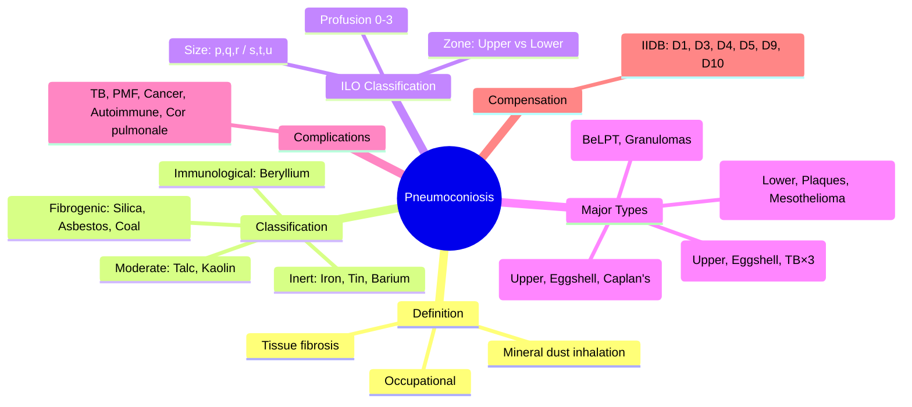
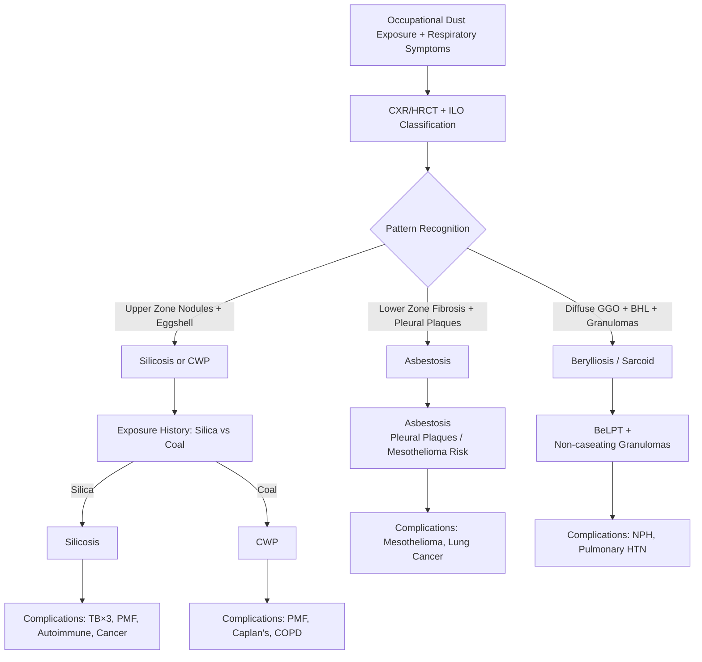

# Pneumoconiosis (Overview & Classification)

Related: [[Silicosis]], [[Asbestosis]], [[Coal workers' pneumoconiosis]], [[Berylliosis]], [[Occupational and environmental lung disease]], [[ILD framework]]

> [!important]
> **Pneumoconiosis** = **occupational lung diseases** caused by **inhalation and retention of mineral dusts** in the lungs, with **tissue reaction** (fibrosis, nodule formation). **Key FCPS/MRCP**: **Classification by dust type** (fibrogenic vs inert), **ILO radiographic classification**, **silicosis/asbestosis/coal workers'** as major forms, **TB risk**, **autoimmune associations**, **compensation** (IIDB prescribed diseases).

## Learning Objectives
- Define **pneumoconiosis** and classify by **dust type** (fibrogenic, inert, mixed)
- Apply **ILO radiographic classification** (profusion, size/shape, zone)
- Recognise **clinical features** common to all pneumoconioses
- Distinguish **major types**: silicosis, asbestosis, coal workers', berylliosis, others
- Screen for **complications** (TB, PMF, lung cancer, autoimmune, cor pulmonale)
- Guide **compensation claims** (UK IIDB prescribed diseases D1, D3, D4, D5, D9, D10)

## Definition
**Pneumoconiosis** = **occupational lung disease** resulting from **inhalation and retention of mineral/organic dust** in the lung parenchyma, causing **inflammatory and fibrotic tissue reaction**. **Excludes**: asthma, COPD, hypersensitivity pneumonitis, infections.

**Key Features**:
- **Dose-related** (cumulative exposure)
- **Latency period** (years to decades)
- **Irreversible** (progression may continue after cessation)
- **Compensable** (industrial injuries)

## Classification by Dust Type
| Category | Dusts | Fibrogenicity | Examples |
|----------|-------|---------------|----------|
| **Fibrogenic (High)** | **Crystalline silica** (quartz, cristobalite, tridymite), **Asbestos** (crocidolite, amosite, chrysotile) | **High** (cause progressive fibrosis) | **Silicosis**, **Asbestosis** |
| **Fibrogenic (Moderate)** | **Coal dust** (carbon + silica), **Silicate minerals** (talc, kaolin, mica) | **Moderate** | **Coal workers' pneumoconiosis (CWP)**, **Talcosis**, **Kaolinosis** |
| **Low/Inert** | **Iron oxide** (welding, mining), **Tin oxide** (stannous), **Barium sulphate** (barite), **Titanium dioxide** | **Low/None** (macules, minimal fibrosis) | **Siderosis**, **Stannosis**, **Baritosis** |
| **Special** | **Beryllium** (berylliosis), **Cobalt** (hard metal disease), **Aluminium** (aluminosis) | **Immunological/Allergic** | **Berylliosis**, **Hard metal disease** |

> **FCPS/MRCP tip**: **Crystalline silica + Asbestos = High fibrogenicity**. **Coal = Moderate**. **Iron/Tin/Barium = Low (inert)**. **Beryllium = Immunological (granulomatous)**.

## Common Pathophysiology
1. **Inhalation** → deposition at **alveolar ducts / respiratory bronchioles**
2. **Macrophage phagocytosis** → **frustrated phagocytosis** (if fibrogenic)
3. **Activation** → **ROS, TNF-α, IL-1, TGF-β, PDGF** → inflammation
4. **Fibroblast activation** → **collagen deposition** → **nodules / fibrosis**
5. **Lymphatic clearance** → **hilar node involvement** (eggshell calcification in silica/coal)

## Common Clinical Features
| Feature | Description |
|---------|-------------|
| **Insidious dyspnoea** | Exertional → rest, over years |
| **Chronic cough** | Often productive (coal), dry (silica/asbestos) |
| **Reduced exercise tolerance** | Progressive |
| **Weight loss**, fatigue | Advanced disease |
| **Clubbing** | Late, variable (common in asbestosis, rare in pure coal) |

## ILO International Classification of Radiographs of Pneumoconioses (Standardised)
| Parameter | Categories |
|-----------|------------|
| **Profusion** | **0/−, 0/0, 0/+, 1/0, 1/1, 1/+, 2/0, 2/1, 2/2, 2/+, 3/0, 3/1, 3/2, 3/+, 3/3** (12 subcategories in 4 major categories: 0, 1, 2, 3) |
| **Size/Shape of Opacities** | **Rounded**: **p** (<1.5mm), **q** (1.5–3mm), **r** (3–10mm) | **Irregular**: **s, t, u** (same size ranges) |
| **Zone Distribution** | **Upper (RU, LU), Middle (RM, LM), Lower (RL, LL)** — e.g., silicosis/coal = upper; asbestosis = lower |

> **FCPS/MRCP tip**: **ILO classification** is the **international standard** for pneumoconiosis reporting. **Profusion 1/0 = early**, **2/1 = moderate**, **3/2 = advanced**.

## Major Pneumoconioses — Quick Comparison
| Feature | **Silicosis** | **Asbestosis** | **Coal Workers' (CWP)** | **Berylliosis** |
|---------|---------------|----------------|------------------------|-----------------|
| **Dust** | Crystalline silica (quartz) | Asbestos fibres | Coal dust (carbon + silica) | Beryllium |
| **Fibrogenicity** | High | High | Moderate | Immunological |
| **CXR/HRCT Pattern** | **Upper zone nodules** | **Lower zone fibrosis** | **Upper zone nodules** | **Diffuse GGO, nodules, BHL** |
| **Key Sign** | **Eggshell calcification** | **Pleural plaques** | **Eggshell calcification** | **Non-caseating granulomas** |
| **PMF** | Yes (confluent >1cm) | No (diffuse fibrosis) | Yes (PMF) | No |
| **Key Complications** | TB ×3, PMF, autoimmune, lung cancer | Mesothelioma, lung cancer, pleural effusion | PMF, Caplan's, COPD | NPH, pulmonary HTN |
| **Latency** | 20–30yr (chronic) | 20–40yr | 10–20yr | Variable (months–years) |
| **ILO Zone** | **Upper** | **Lower** | **Upper** | Variable |
| **Compensation (UK)** | **IIDB D1** | **IIDB D3** | **IIDB D3/D4** | **IIDB D10** |

## Common Complications
| Complication | Silicosis | Asbestosis | CWP | Berylliosis |
|--------------|-----------|------------|-----|-------------|
| **TB** | **×3 risk** | Slight ↑ | ↑ (if PMF) | ↑ (granulomatous) |
| **PMF** | **Yes** | No | **Yes** | No |
| **Lung Cancer** | IARC Group 1 | IARC Group 1 | Slight ↑ (smoking synergy) | ↑ (IARC Group 1) |
| **Mesothelioma** | No | **Yes** (pathognomonic) | No | No |
| **Autoimmune** | RA, SSc, ANCA | No | **Caplan's (RA)** | — |
| **Cor Pulmonale** | Advanced | Advanced | Advanced | Late |

## Investigation Framework
### 1. Occupational History (Mandatory)
- **Job titles**, **tasks**, **duration**, **intensity**
- **Dust control measures** (ventilation, PPE, wet drilling)
- **Latency** (first exposure → symptoms)

### 2. Imaging
- **CXR (PA erect)** — **ILO classification** (standardised)
- **HRCT** — higher sensitivity, characterises pattern, complications

### 3. Pulmonary Function
- **Restrictive pattern** (↓ TLC, ↓ FVC, normal FEV1/FVC)
- **↓ DLCO** (early, disproportionate)
- **Obstructive component** → coexisting COPD (smoking)

### 3. Specific Tests
| Disease | Key Test |
|---------|----------|
| **Silicosis** | Asbestos bodies in BAL (>1/mL), IgRA for TB |
| **Asbestosis** | Pleural plaques, asbestos bodies, ferruginous bodies |
| **CWP** | Coal dust macules/nodules on HRCT, eggshell calcification |
| **Berylliosis** | **BeLPT** (beryllium lymphocyte proliferation test) — **gold standard** |

## Management Principles
### 1. Exposure Cessation (First Principle)
- **Remove from exposure** (redeployment, retirement)
- **No further dust exposure**

### 2. General Measures
- **Smoking cessation** (CRITICAL for all — synergy with dust)
- **Oxygen** (LTOT if PaO2 <7.3 kPa)
- **Pulmonary rehabilitation**
- **Vaccinations** (flu, pneumococcal, COVID)

### 3. Complication-Specific
| Complication | Management |
|--------------|------------|
| **TB** | Standard 4-drug regimen; **IGRA screening** for high-risk |
| **PMF** | LTOT, pulmonary rehab, diuretics for cor pulmonale |
| **Autoimmune** | Rheumatology co-management |
| **Lung Cancer** | MDT, annual LDCT screening (high-risk) |
| **Cor Pulmonale** | Diuretics, oxygen, PAH therapy if confirmed |

### 4. Disease-Specific
- **Silicosis**: Annual TB IGRA, autoimmune screen, cancer LDCT
- **Asbestosis**: Pleural cancer screening, mesothelioma vigilance
- **CWP**: Caplan's screen (RF/CCP), PMF monitoring
- **Berylliosis**: **BeLPT monitoring**, corticosteroid for symptomatic

## Compensation (UK — Industrial Injuries Disablement Benefit, IIDB)
| Prescribed Disease | Condition | Code |
|--------------------|-----------|------|
| **Silicosis** | Silicosis (with/without TB) | **D1** |
| **Asbestosis** | Asbestosis (pulmonary fibrosis) | **D3** |
| **Mesothelioma** | Mesothelioma | **D4** |
| **Coal Workers' Pneumoconiosis** | CWP (with/without PMF) | **D3/D4** |
| **Byssinosis** | Byssinosis (cotton dust) | **D5** |
| **Farmer's Lung** | Extrinsic allergic alveolitis | **D6** |
| **Hard Metal Disease** | Cobalt lung disease | **D7** |
| **Berylliosis** | Berylliosis | **D10** |
| **Pleural Plaques/Thickening** | Asbestos-related pleural disease | **D9** |

> **Civil litigation** also possible (negligence, breach of duty)

## Prevention (Hierarchy of Controls)
1. **Elimination** (substitute non-toxic material)
2. **Engineering** (enclosure, ventilation, wet methods)
3. **Administrative** (job rotation, exposure limits, health surveillance)
4. **PPE** (last resort — respirators, fit-tested)

## Prognosis
- **Variable by dust type, exposure intensity, latency, smoking**
- **Progressive** even after cessation (especially silica, asbestos)
- **Mortality**: Respiratory failure, TB, lung cancer, mesothelioma, cor pulmonale, autoimmune
- **Quality of life**: Reduced by dyspnoea, cough, anxiety, depression

## Topic Correlation
- [[Silicosis]] — detailed
- [[Asbestosis]] — detailed
- [[Coal workers' pneumoconiosis]] — detailed
- [[Berylliosis]] — detailed
- [[Occupational and environmental lung disease]] — broader
- [[ILD framework]] — diagnostic approach

## FCPS/MRCP High-Yield Points
1. **Pneumoconiosis** = mineral dust inhalation → fibrosis; **classify by dust** (fibrogenic vs inert)
2. **ILO classification** = profusion (0–3), size (p/q/r), zone (upper/lower)
3. **Major types**: Silicosis (quartz, upper zone, eggshell), Asbestosis (lower zone, pleural plaques), CWP (coal, upper, eggshell), Berylliosis (immunological, BeLPT+)
3. **Eggshell calcification** = silicosis + coal workers' (hilar nodes)
4. **PMF** = confluent nodules >1cm (silicosis, CWP)
5. **TB risk**: Silicosis ×3 (IGRA screen), CWP ↑ with PMF
5. **Caplan's** = RA + pneumoconiosis (large nodules)
6. **Compensation**: IIDB D1 (silicosis), D3 (asbestosis/CWP), D4 (mesothelioma), D9 (pleural plaques), D10 (berylliosis)
6. **Smoking cessation** = critical for all (synergy)
7. **Smoking + Asbestos** = lung cancer ×50–90; **Smoking + Silica** = lung cancer ×2–4

## Common Viva Questions
1. Pneumoconiosis definition and classification
2. ILO classification (profusion, size, zone)
3. Silicosis vs asbestosis vs CWP comparison
4. Eggshell calcification significance
5. PMF definition and types
6. TB risk in pneumoconioses
7. Caplan's syndrome
7. Berylliosis diagnosis (BeLPT)
8. Compensation categories (IIDB)

## Common Confusions / Exam Traps
- **Pneumoconiosis = any dust lung disease** — NO (excludes asthma, HP, COPD, infections)
- **All pneumoconiosis = fibrogenic** — NO (iron, tin, barium = inert)
- **Eggshell calcification = TB** — WRONG (silicosis/coal)
- **PMF = lung cancer** — WRONG (benign conglomerate fibrosis)
- **Asbestosis = upper zone** — WRONG (lower zone; silicosis = upper)
- **Coal workers' = no PMF** — WRONG (PMF common in CWP)
- **Berylliosis = infection** — WRONG (immunological granulomatous)
- **Asbestos = only cause mesothelioma** — true (but also lung cancer)

## Mnemonics
- **PNEUMOCONIOSIS TYPES**: **S**ilica, **A**sbestos, **C**oal, **B**eryllium, **I**ron, **T**in, **B**arium, **T**alc, **K**aolin = **SACBITBKT** (or **Fibrogenic: S, A, C, B; Inert: I, T, B**)
- **ILO ZONES**: **S**ilica = **U**pper; **A**sbestosis = **L**ower; **C**oal = **U**pper = **SULCU**
- **EGGSHELL**: **S**ilicosis + **C**oal = **E**ggshell (hilar nodes)
- **PMF**: **P**rogressive **M**assive **F**ibrosis = **C**onfluent >1cm
- **CAPLAN'S**: **C**aplan = **C**oal/**S**ilica + **R**A = **L**arge nodules

## Mind Map

## Flowchart

## One-Page Revision Summary
- **Pneumoconiosis** = mineral dust inhalation → fibrosis
- **Fibrogenic**: Silica (quartz), Asbestos, Coal — **cause progressive fibrosis**
- **Inert**: Iron (siderosis), Tin (stannosis), Barium (baritosis) — **minimal fibrosis**
- **Immunological**: Beryllium (berylliosis) — granulomatous, BeLPT+
- **ILO**: Profusion (0–3), Size (p<1.5mm, q 1.5–3mm, r 3–10mm), Zone (Upper/Lower)
- **Silicosis**: Upper zone, eggshell calcification, TB×3, PMF, autoimmune
- **Asbestosis**: Lower zone, pleural plaques, mesothelioma, lung cancer
- **Coal (CWP)**: Upper zone, eggshell, PMF, Caplan's (RA)
- **Berylliosis**: Non-caseating granulomas, BeLPT+, HLA-DP association
- **PMF**: Confluent nodules >1cm (silicosis, CWP)
- **Eggshell**: Hilar nodes, calcified rim (silica, coal)
- **Caplan's**: RA + pneumoconiosis = large peripheral nodules
- **Compensation**: IIDB D1 (silica), D3 (asbestos/CWP), D4 (mesothelioma), D9 (plaques), D10 (beryllium)

## 24-Hour Recall Prompts
- Pneumoconiosis definition
- Fibrogenic vs inert dusts
- ILO classification (3 parameters)
- 3 major pneumoconioses + key features each
- Eggshell calcification significance
- PMF definition
- TB risk by type
- Caplan's syndrome
- Compensation codes

## 7-Day / 15-Day / 30-Day Revision Tracker
- [ ] Day 1 completed
- [ ] 24-hour recall completed
- [ ] Day 7 revision completed
- [ ] Day 15 revision completed
- [ ] Day 30 revision completed

## Must Know / Should Know / Nice to Know
### Must Know
- Pneumoconiosis definition and classification
- ILO classification (profusion, size, zone)
- Silicosis, asbestosis, CWP — key features each
- Eggshell calcification + PMF
- TB risk, Caplan's syndrome
- Compensation categories (IIDB)

### Should Know
- Berylliosis (BeLPT, HLA-DP)
- Siderosis, stannosis, baritosis (inert)
- Talcosis, kaolinosis, aluminosis
- Byssinosis (cotton dust, D6)
- Hard metal disease (cobalt, D7)
- Health surveillance requirements

### Nice to Know
- Nanoparticle pneumoconiosis
- Mixed dust pneumoconiosis
- Genetic susceptibility (HLA, TNF)
- Radiological AI for ILO classification
- International compensation schemes
- Dust suppression technologies

## Self-Test Scorecard
- Understanding: /10
- Recall: /10
- MCQ Performance: /10
- SBA Performance: /10
- Viva Confidence: /10
- Total: /50

> [!tip]
> Interpretation: <35 = weak topic, 35-44 = acceptable but insecure, 45+ = strong exam-ready topic.

## Exam Answer Modes
### Long Answer Skeleton
- Definition, classification (fibrogenic/inert/immunological)
- ILO classification framework
- Major pneumoconioses table (dust, pattern, complications)
- Eggshell calcification + PMF
- TB risk, autoimmune, cancer
- Caplan's syndrome
- Berylliosis
- Compensation (IIDB)
- Prevention hierarchy

### Short Note Skeleton
- Definition box
- Classification table
- ILO box
- Major types comparison table
- Complications table
- Compensation box

### Viva One-Liners
- "Pneumoconiosis = mineral dust inhalation → fibrosis; occupational, dose-related, latent"
- "Fibrogenic: Silica, Asbestos, Coal; Inert: Iron, Tin, Barium; Immunological: Beryllium"
- "ILO: Profusion 0–3, Size p/q/r (rounded) s/t/u (irregular), Zone Upper/Lower"
- "Silicosis: Upper zone, eggshell calcification, TB×3, PMF, autoimmune"
- "Asbestosis: Lower zone, pleural plaques, mesothelioma, lung cancer"
- "Coal workers': Upper zone, eggshell, PMF, Caplan's (RA)"
- "Eggshell calcification = silicosis + coal workers' (hilar nodes, calcified rim)"
- "PMF = confluent nodules >1cm, retraction, volume loss (silicosis, CWP)"
- "Caplan's = RA + pneumoconiosis → large peripheral nodules, rapid"
- "Berylliosis = non-caseating granulomas, BeLPT+, HLA-DP"
- "Compensation: IIDB D1 silica, D3 asbestos/CWP, D4 mesothelioma, D9 plaques, D10 beryllium"
- "Smoking cessation CRITICAL (synergy with all dusts)"

### Ward-Case Discussion Points
- 60M sandblaster, upper zone nodules + eggshell → silicosis → TB screen, autoimmune screen, IIDB D1
- 65M shipyard worker, lower zone fibrosis, pleural plaques → asbestosis → mesothelioma screen, IIDB D3
- 55M coal miner with RA, new large peripheral nodules → Caplan's → rheumatology, PMF screen
- 35M aerospace worker, dyspnoea, BHL, GGO, BeLPT+ → berylliosis → steroids, avoid exposure

### Last-Night-Before-Exam Sheet
- Pneumoconiosis = dust inhalation → fibrosis
- Fibrogenic: Silica, Asbestos, Coal
- Inert: Iron, Tin, Barium
- Immunological: Beryllium
- ILO: Profusion 0-3, p/q/r, Zone
- Silicosis: Upper, Eggshell, TB×3, PMF
- Asbestosis: Lower, Plaques, Mesothelioma
- Coal: Upper, Eggshell, PMF, Caplan's
- Berylliosis: BeLPT, Granulomas
- Comp: D1 Silica, D3 Asbestos/CWP, D4 Mesothelioma, D9 Plaques, D10 Be

## Summary
**Pneumoconiosis** = **occupational lung diseases** from **mineral dust inhalation** causing **fibrosis**. **Classification**: **Fibrogenic** (silica, asbestos, coal — progressive fibrosis), **Moderate** (talc, kaolin), **Inert** (iron, tin, barium — minimal fibrosis), **Immunological** (beryllium). **ILO Classification**: **Profusion (0–3)**, **Size/Shape (p/q/r rounded, s/t/u irregular)**, **Zone (Upper/Lower)**. **Silicosis**: Upper zone, **eggshell calcification**, **TB ×3**, **PMF**, autoimmune. **Asbestosis**: Lower zone, **pleural plaques**, mesothelioma. **Coal Workers'**: Upper zone, eggshell, **PMF**, **Caplan's (RA)**. **Berylliosis**: Non-caseating granulomas, **BeLPT+**. **PMF** = confluent nodules >1cm. **Eggshell** = hilar node calcification (silica + coal). **Caplan's** = RA + pneumoconiosis = large nodules. **Compensation**: UK **IIDB** D1 (silica), D3 (asbestosis/CWP), D4 (mesothelioma), D9 (pleural plaques), D10 (beryllium).

## MCQs (10)
1. **Pneumoconiosis** is defined as:
   A. Any occupational lung disease
   B. **Dust inhalation causing fibrosis with tissue reaction**
   C. Occupational asthma
   D. Industrial bronchitis

2. **Most fibrogenic dust**:
   A. Iron oxide
   B. **Crystalline silica (quartz)**
   C. Tin oxide
   D. Barium sulphate

3. **ILO classification** parameters:
   A. Size, shape, colour
   B. **Profusion, size/shape, zone**
   C. Density, distribution, margin
   D. Location, size, number

4. **Eggshell calcification** of hilar nodes is characteristic of:
   A. Sarcoidosis
   B. **Silicosis and coal workers' pneumoconiosis**
   C. Asbestosis
   D. TB

5. **Progressive Massive Fibrosis (PMF)**:
   A. Single large nodule
   B. **Confluent nodules >1 cm**
   C. Pleural-based mass
   D. Lymph node enlargement

6. **Caplan's syndrome** = 
   A. Silicosis + TB
   B. **Rheumatoid arthritis + pneumoconiosis**
   C. Asbestosis + lung cancer
   D. Coal workers' + TB

7. **Asbestosis** radiographic zone predominance:
   A. Upper zones
   B. **Lower zones**
   C. Mid zones
   D. Apices only

8. **Berylliosis** diagnostic gold standard:
   A. CXR
   B. **Beryllium Lymphocyte Proliferation Test (BeLPT)**
   C. ACE level
   D. BAL CD4/CD8

9. **UK IIDB** prescribed disease for mesothelioma:
   A. D1
   B. D3
   C. **D4**
   D. D9

10. **Smoking + asbestos** lung cancer risk:
    A. Additive
    B. **Synergistic (×50–90)**
    C. No interaction
    D. Protective

## SBA Questions (10)
1. A 55M foundry worker (silica 25yr), dyspnoea, CXR: upper zone nodules, eggshell calcification. PFTs restrictive. Diagnosis?
   A. Asbestosis
   B. **Silicosis**
   C. CWP
   D. Sarcoidosis

2. A 60M coal miner (30yr), RA, new large (3cm) peripheral lung nodules. Background pneumoconiosis. Diagnosis?
   A. TB
   B. **Caplan's syndrome**
   C. Lung cancer
   D. Metastases

3. A 65M shipyard worker, dyspnoea, CXR: lower zone fibrosis, bilateral pleural plaques. No eggshell calcification. Diagnosis?
   A. Silicosis
   B. **Asbestosis**
   C. CWP
   D. IPF

4. A 40M aerospace machinist, cough, dyspnoea, HRCT: diffuse GGO, BHL, non-caseating granulomas on biopsy. BeLPT positive. Diagnosis?
   A. Sarcoidosis
   B. **Berylliosis**
   C. Hypersensitivity pneumonitis
   D. TB

5. Which pneumoconiosis has **lowest TB risk**?
   A. Silicosis
   B. **Berylliosis**
   C. Coal workers' (without PMF)
   D. Asbestosis

6. Eggshell calcification is seen in:
   A. **Silicosis and Coal workers' pneumoconiosis**
   B. Silicosis and Asbestosis
   C. Asbestosis and Coal workers'
   D. All pneumoconioses

7. A 45M welder, asymptomatic, CXR: fine diffuse micronodules. PFTs normal. Likely diagnosis?
   A. Silicosis
   B. **Siderosis (iron oxide pneumoconiosis — inert)**
   C. Stannosis
   D. Baritosis

8. **Caplan's syndrome** nodules — characteristic:
   A. Upper zone, calcified
   B. **Peripheral, well-defined, 0.5–5 cm, rapid appearance**
   C. Central, cavitating
   D. Diffuse, miliary

9. **UK IIDB** for coal workers' pneumoconiosis:
   A. D1
   B. **D3/D4** (D3 = CWP, D4 = CWP with PMF)
   C. D5
   D. D9

10. **Hard metal disease** (cobalt) — IIDB prescribed disease:
    A. D1
    B. D3
    C. D5
    D. **D7**

## Flashcards
- Q: Pneumoconiosis definition
  A: Dust inhalation → fibrosis + tissue reaction
- Q: Fibrogenic dusts
  A: Silica, Asbestos, Coal
- Q: Inert dusts
  A: Iron, Tin, Barium
- Q: Immunological dust
  A: Beryllium
- Q: ILO parameters
  A: Profusion, Size/Shape, Zone
- Q: Silicosis zone
  A: Upper
- Q: Asbestosis zone
  A: Lower
- Q: Eggshell calcification
  A: Silica + Coal
- Q: PMF
  A: Confluent nodules >1cm
- Q: Caplan's
  A: RA + pneumoconiosis
- Q: Berylliosis test
  A: BeLPT
- Q: Compensation
  A: D1 Silica, D3 Asbestos/CWP, D4 Mesothelioma, D9 Plaques, D10 Be

## Answer Key with Explanations
### MCQs
1. **B** — Pneumoconiosis = dust inhalation + tissue reaction (fibrosis).
2. **B** — Crystalline silica (quartz) is the most fibrogenic.
3. **B** — ILO = profusion, size/shape, zone.
4. **B** — Eggshell = silicosis + coal workers'.
5. **B** — PMF = confluent nodules >1cm.
6. **B** — Caplan's = RA + pneumoconiosis.
7. **B** — Asbestosis = lower zones.
8. **B** — BeLPT = gold standard for berylliosis.
9. **C** — IIDB D4 = mesothelioma.
10. **B** — Smoking + asbestos = synergistic ×50–90.

### SBAs
1. **B** — Silica exposure + upper zone nodules + eggshell = silicosis.
2. **B** — RA + pneumoconiosis + large peripheral nodules = Caplan's.
3. **B** — Shipyard + lower zone fibrosis + pleural plaques = asbestosis.
4. **B** — BeLPT+ + granulomas + exposure = berylliosis.
5. **B** — Berylliosis has lowest TB risk (no macrophage impairment).
6. **A** — Eggshell = silica + coal.
7. **B** — Welder + diffuse micronodules + normal PFTs = siderosis (inert).
8. **B** — Caplan's nodules: peripheral, well-defined, rapid.
9. **B** — IIDB D3/D4 for CWP.
10. **D** — Cobalt = D7 (hard metal disease).

### Flashcards
All correct as written.

---
