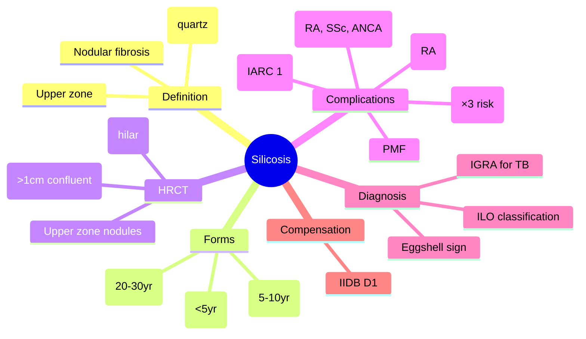

# Silicosis

Related: [[Pneumoconiosis]], [[Asbestosis]], [[Coal workers' pneumoconiosis]], [[TB]], [[Lung cancer]], [[Autoimmune diseases]], [[Occupational and environmental lung disease]], [[ILD framework]]

> [!important]
> **Silicosis** = **fibrotic lung disease** from **inhalation of crystalline silica (free silica, quartz)**. **Dose-dependent**, **latency 10–30 years** (accelerated 5–10y, acute <5y). **Key FCPS/MRCP**: **Upper zone predominant** fibrosis, **eggshell calcification** of hilar nodes (pathognomonic), **progressive massive fibrosis (PMF)**, **TB risk ×3** (impaired macrophage), **autoimmune risk** (RA, SLE, scleroderma), **lung cancer risk** (IARC Group 1), **compensable** (UK IIDB prescribed disease D1).

## Learning Objectives
- Define **silicosis** and classify by **chronic, accelerated, acute** forms
- Identify **high-risk occupations** and **silica exposure sources**
- Interpret **HRCT/CXR** findings (upper zone nodules, eggshell calcification, PMF)
- Apply **ILO classification** for pneumoconiosis (profusion, size, shape, zone)
- Recognise **complications** (TB, PMF, autoimmune, lung cancer, cor pulmonale)
- Screen for **TB** (IGRA preferred over TST) and **autoimmune disease**
- Guide **compensation claims** (UK IIDB prescribed disease D1)

## Definition
**Silicosis** = **occupational lung disease** caused by **inhalation of respirable crystalline silica dust (free silica, quartz, cristobalite, tridymite)** leading to **nodular pulmonary fibrosis**. **Irreversible**, **progressive** even after exposure cessation.

> **FCPS/MRCP tip**: **Crystalline silica (α-quartz) = pathogenic**. **Amorphous silica = non-fibrogenic**. **Latency dose-dependent**: Chronic (20–30y), Accelerated (5–10y), Acute (<5y, high exposure).

## Core Anatomy / Silica Forms
### Crystalline Silica (Pathogenic)
| Form | Properties | Uses |
|------|------------|------|
| **α-Quartz** | Most common, stable | Sand, sandstone, granite, concrete |
| **Cristobalite** | High temp form | Foundry, ceramics, refractory bricks |
| **Tridymite** | High temp form | Ceramics, refractories |

### Amorphous Silica (Non-Fibrogenic)
- **Diatomaceous earth**, **silica gel**, **fumed silica** — **NOT silicosis risk**

### Particle Size Critical
- **Respirable fraction**: **<5 µm** (reaches alveolar ducts)
- **Most fibrogenic**: **0.5–5 µm** (optimal for macrophage uptake + frustrated phagocytosis)

## Pathophysiology
1. **Inhalation** → silica particles deposit at **respiratory bronchioles / alveolar ducts**
2. **Alveolar macrophage phagocytosis** → **frustrated phagocytosis** (silica not degraded)
3. **Macrophage lysis** → release **silica + lysosomal enzymes (ROS, proteases, cytokines)**
4. **Inflammation** → **IL-1, TNF-α, IL-6, IL-8, LTB4, TGF-β** → neutrophil recruitment
5. **Fibroblast activation** → **collagen deposition** → **silicotic nodule** (concentric whorls of collagen, silica-laden macrophages)
6. **Nodule coalescence** → **progressive massive fibrosis (PMF)** (>1 cm conglomerate)
7. **Lymphatic drainage** → **hilar node involvement** → **eggshell calcification** (unique to silica/coal)

## Clinical Forms
| Form | Latency | Exposure | Features |
|------|---------|----------|----------|
| **Chronic (Classic)** | **20–30 years** | Low-moderate, prolonged | Insidious dyspnoea, cough, upper zone nodules, PMF late |
| **Accelerated** | **5–10 years** | High, intense | Faster progression, more symptomatic, PMF earlier |
| **Acute (Silicoproteinosis)** | **<5 years** | **Very high** (sandblasting, tunnelling) | **Rapid**, severe dyspnoea, **alveolar filling** (PAP-like), **high mortality** |

## Clinical Features
### Respiratory
- **Insidious dyspnoea** (exertional → rest)
- **Chronic cough** (often dry, later productive)
- **Chest tightness**
- **Weight loss**, fatigue

### Advanced
- **Clubbing** (uncommon, late)
- **Cor pulmonale** (JVP ↑, peripheral oedema, RV heave)
- **Respiratory failure** (hypoxaemia, hypercapnia)

### Systemic / Autoimmune
- **Rheumatoid arthritis** (Caplan's syndrome: RA + pneumoconiosis = large nodules)
- **Systemic sclerosis** (scleroderma)
- **SLE**
- **ANCA vasculitis** (GPA, MPA)

## Investigations
### 1. CXR / HRCT (Diagnostic Cornerstone)
| Finding | Description |
|---------|-------------|
| **Small rounded opacities** | **Upper zone predominant** (1–5 mm, innumerable) |
| **Eggshell calcification** | **Hilar/mediastinal nodes** — **calcified rim, lucent centre** — **PATHOGNOMONIC** (also in coal workers') |
| **Progressive Massive Fibrosis (PMF)** | **Confluent nodules >1 cm**, upper zones, **retraction**, volume loss |
| **Hilar retraction** | Upper lobes pulled up |
| **Emphysema** | Centrilobular, adjacent to fibrosis |
| **Pleural thickening** | Rare |

> **FCPS/MRCP tip**: **Eggshell calcification of hilar nodes = SILICOSIS (or coal workers')** — **NOT in asbestosis, TB, sarcoid, lymphoma**.

### 2. ILO Classification (Standardised Reporting)
| Parameter | Details |
|-----------|---------|
| **Profusion** | 0/– to 3/+ (4 categories, 12 subcategories) |
| **Shape/Size** | **p, q, r** (small rounded: p <1.5mm, q 1.5–3mm, r 3–10mm) |
| **Zone** | **Upper zones** (asbestosis = lower) |

### 3. Pulmonary Function Tests
| Stage | Pattern |
|-------|---------|
| **Early** | Normal or mild restriction |
| **Moderate** | **Restrictive** (↓ TLC, ↓ FVC, normal FEV1/FVC), **↓ DLCO** |
| **Advanced/PMF** | **Mixed** (restriction + obstruction from distortion), severe ↓ DLCO |

### 4. TB Screening (CRITICAL)
- **IGRA (Quantiferon/T-SPOT)** — **preferred** (BCG independent)
- **TST** — false + from BCG, false - from anergy (silicosis impairs immunity)
- **Annual CXR** for TB surveillance (high-risk)

### 5. Autoimmune Screen
- **RF, anti-CCP** (RA / Caplan's)
- **ANA, anti-Scl-70, anti-centromere** (scleroderma)
- **ANCA** (vasculitis)

### 6. Lung Cancer Screening
- **Annual LDCT** (silica = **IARC Group 1 carcinogen**, ↑ lung cancer risk independent of smoking)

## Complications
| Complication | Mechanism / Details |
|--------------|---------------------|
| **Tuberculosis** | **×3 risk** (impaired macrophage, TNF-α dysregulation); **atypical presentation**, lower zones, extrapulmonary |
| **Progressive Massive Fibrosis (PMF)** | Confluent nodules >1 cm → upper zone conglomerate masses, retraction, severe restriction |
| **Caplan's Syndrome** | **RA + pneumoconiosis** → **large, well-defined nodules** (0.5–5 cm), **peripheral**, rapid appearance |
| **Autoimmune diseases** | **RA, scleroderma, SLE, ANCA vasculitis** (silica = adjuvant) |
| **Lung cancer** | **IARC Group 1** (silica); **×2–4 risk** (synergy with smoking) |
| **Cor pulmonale / Respiratory failure** | Late, advanced fibrosis |
| **COPD** | Often coexisting (smoking, dust) |

## Management
### 1. Exposure Cessation (Mandatory)
- **Remove from silica exposure** (redeployment, retirement)
- **No further silica exposure** (progression continues even after cessation)

### 2. Symptomatic / Supportive
- **Smoking cessation** (CRITICAL — synergy for lung cancer, worsens COPD)
- **Oxygen** (LTOT if PaO2 <7.3 kPa / SpO2 <88%)
- **Pulmonary rehabilitation**
- **Vaccinations** (flu, pneumococcal, COVID)
- **Nutritional support**

### 3. Complication-Specific
| Complication | Management |
|--------------|------------|
| **TB** | **Standard 4-drug regimen** (2HRZE/4HR); **IGRA monitoring**; consider **prophylactic INH** if IGRA+ |
| **PMF** | LTOT, rehab, manage cor pulmonale, consider transplant (rare) |
| **RA / Autoimmune** | **Rheumatology co-management**; DMARDs (avoid MTX if severe fibrosis) |
| **Lung cancer** | MDT, standard oncological pathways |
| **Cor pulmonale** | Diuretics, oxygen, avoid fluid overload, consider PAH therapy if PAH confirmed |

### 4. Acute Silicoproteinosis (Rare, Severe)
- **Whole lung lavage** (similar to PAP)
- **Corticosteroids** (controversial, may increase infection risk)
- **Supportive** (often fatal)

## Drug Interactions / Contraindications / Cautions
### MTX in Silicosis
- **Pneumonitis risk** ↑ (baseline fibrosis)
- **If RA requires MTX**: Monitor closely, consider alternatives (RTX, ABA, TCZ)

### Anti-fibrotics (Off-label)
- **Nintedanib/Pirfenidone** for progressive fibrosis (extrapolated from IPF/PF-ILD)
- Monitor LFT, GI, bleeding (nintedanib)

## Procedures
### BAL for Silica Particles (Rarely Needed)
- **Birefringent particles** under polarised light
- **Not routine** (diagnosis from HRCT + exposure)

### VATS Biopsy
- **If diagnostic uncertainty** (IPF vs silicosis vs CTD-ILD)
- **Shows**: Silicotic nodules (whorled collagen, silica particles), PMF

## Compensation (UK)
### Industrial Injuries Disablement Benefit (IIDB) — Prescribed Disease **D1**
- **Silicosis** (with or without TB)
- **Requires**: Occupational exposure to silica + appropriate radiological/pathological evidence
- **Assessed by**: Medical board (respiratory function, symptoms, CXR profusion)

### Civil Litigation
- **Negligence** (failure to control dust, provide PPE, health surveillance)
- **Time limit**: 3 years from knowledge (extended for latent disease)

## Prognosis
- **Chronic silicosis**: Slow progression over decades; **PMF develops in 10–20%**
- **Accelerated**: Faster, PMF in 5–10 years
- **Acute**: **High mortality** (50%+ at 2 years)
- **Mortality**: Respiratory failure, TB, lung cancer, cor pulmonale, autoimmune
- **Factors**: Exposure intensity, smoking, PMF, TB, autoimmune, age

## Topic Correlation
- [[Pneumoconiosis]] — coal workers', asbestosis
- [[TB]] — increased risk, atypical
- [[Autoimmune diseases]] — RA, scleroderma, vasculitis
- [[Lung cancer]] — IARC Group 1, smoking synergy
- [[Occupational lung disease]] — broader context
- [[ILD framework]] — diagnostic approach

## FCPS/MRCP High-Yield Points
1. **Silicosis** = crystalline silica inhalation → nodular fibrosis, **upper zone predominant**
2. **Three forms**: Chronic (20–30yr), Accelerated (5–10yr), Acute (<5yr, silicoproteinosis)
3. **Eggshell calcification of hilar nodes** = **pathognomonic** (silica/coal)
3. **PMF** = confluent nodules >1 cm, upper zones, retraction
3. **TB risk ×3** (impaired macrophage) → **annual IGRA/CXR screening**
4. **Autoimmune risk**: RA (Caplan's), scleroderma, SLE, ANCA vasculitis
4. **Lung cancer**: Silica = IARC Group 1, synergy with smoking
5. **Chest X-ray**: **Upper zone small rounded opacities** (p, q, r), **eggshell calcification**
5. **ILO classification**: Profusion, shape (p/q/r), zone (upper)
6. **Compensation**: UK IIDB **Prescribed Disease D1**

## Common Viva Questions
1. Silicosis forms (chronic, accelerated, acute) and latency
2. HRCT/CXR findings (upper zone nodules, eggshell calcification, PMF)
3. TB risk and screening (IGRA vs TST)
5. Caplan's syndrome
6. Autoimmune associations (RA, scleroderma, vasculitis)
5. Silica as carcinogen (IARC Group 1)
6. ILO classification
7. Acute silicoproteinosis
8. Compensation (IIDB D1)

## Common Confusions / Exam Traps
- **Eggshell calcification = only silicosis** — also in **coal workers' pneumoconiosis**
- **Silicosis = lower zone** — WRONG (**UPPER zone** predominant; asbestosis = lower)
- **Acute silicosis = common** — RARE (sandblasting, tunnelling, high mortality)
- **TST for TB in silicosis** — **FALSE + from BCG, FALSE - from anergy** → **IGRA preferred**
- **Silica = amorphous** — WRONG (crystalline silica pathogenic)
- **Smoking protects** — WRONG (synergy for lung cancer, worsens COPD)
- **Caplan's = TB** — WRONG (RA + pneumoconiosis = large nodules)
- **Acute silicosis = curable** — WRONG (high mortality, whole lung lavage sometimes)

## Mnemonics
- **SILICOSIS ZONES**: **S**ilicosis = **U**pper **Z**ones; **A**sbestosis = **L**ower **Z**ones = **SUZL** (SiliCosis Upper Zones, Asbestosis Lower Zones)
- **EGGSHELL CALCIFICATION**: **S**ilicosis + **C**oal = **E**ggshell (hilar nodes)
- **SILICA TYPES**: **Q**uartz (α), **C**ristobalite, **T**ridymite = **QCT** (all crystalline)
- **PMF**: **P**rogressive **M**assive **F**ibrosis = **C**onfluent **N**odules >1**C**m
- **CAPLAN'S**: **C**aplan = **C**oal/ **S**ilica + **R**A = **L**arge **N**odules
- **SILICA RISK**: **S**ilicosis → **T**B ×3, **A**utoimmune (RA, SSc), **L**ung cancer (IARC 1)

## Mind Map


## Flowchart
```mermaid
flowchart TD
    A[Suspected Silicosis\nDyspnoea + silica exposure] --> B[HRCT Chest]
    B --> C{Upper zone nodules +\nEggshell calcification?}
    C -- YES --> D[PFTs: Restrictive + ↓DLCO]
    D --> E[IGRA for TB\nAutoimmune screen]
    E --> F[ILO Classification\nProfusion, Shape, Zone]
    F --> G[DEFINITE SILICOSIS]
    C -- NO --> H[Alternative: CTD-ILD, Sarcoid, TB, HP\nConsider biopsy]
    G --> I[Management:\nExposure cessation\nSmoking cessation CRITICAL\nTB screening annual (IGRA)\nAutoimmune monitoring\nCancer screening (LDCT)\nCompensation IIDB D1]
```

## Suggested Visuals / Image Notes
- CXR: Upper zone nodules, eggshell calcification, PMF
- HRCT: Silicotic nodules, conglomerate masses
- Eggshell calcification (hilar nodes)
- ILO classification chart
- Caplan's syndrome (large nodules in RA)
- Silica particle under polarised light

## Suggested Video References
- BTS Pneumoconiosis Guidelines
- ILO Classification of Pneumoconiosis
- Silicosis and TB
- Caplan's syndrome
- Acute silicoproteinosis
- Silica exposure control (HSE)
- Silicosis compensation UK

## One-Page Revision Summary
- **Silicosis** = crystalline silica (quartz) → **upper zone nodular fibrosis**
- **Forms**: Chronic (20–30yr), Accelerated (5–10yr), Acute silicoproteinosis (<5yr)
- **HRCT**: **Upper zone nodules**, **eggshell hilar calcification**, **PMF** (>1cm confluent)
- **Eggshell calcification** = **pathognomonic** (also coal workers')
- **TB risk ×3** → annual IGRA screening
- **Autoimmune**: RA (Caplan's), scleroderma, SLE, ANCA vasculitis
- **Lung cancer**: Silica = IARC Group 1, synergy with smoking
- **ILO**: Upper zone, small rounded (p/q/r), profusion 0–3
- **Compensation**: IIDB D1
- **Acute silicoproteinosis**: Alveolar filling, high mortality, whole lung lavage

## 24-Hour Recall Prompts
- Silicosis forms and latencies
- HRCT classic triad (nodules, eggshell, PMF)
- Eggshell calcification significance
- TB risk and screening
- Autoimmune associations
- PMF definition
- Caplan's syndrome
- Compensation category

## 7-Day / 15-Day / 30-Day Revision Tracker
- [ ] Day 1 completed
- [ ] 24-hour recall completed
- [ ] Day 7 revision completed
- [ ] Day 15 revision completed
- [ ] Day 30 revision completed

## Must Know / Should Know / Nice to Know
### Must Know
- Silicosis definition, forms, latency
- Upper zone predominance (vs asbestosis lower)
- Eggshell calcification = pathognomonic
- PMF definition
- TB risk ×3, IGRA screening
- Autoimmune associations (Caplan's, scleroderma, vasculitis)
- Silica carcinogen (IARC Group 1)
- Compensation IIDB D1

### Should Know
- ILO classification details
- Acute silicoproteinosis
- Caplan's syndrome features
- Acute silicoproteinosis management (whole lung lavage)
- Acute vs chronic radiographic differences
- Smoking cessation importance

### Nice to Know
- Silica particle physics (respirable fraction)
- Whole lung lavage technique
- Novel biomarkers (IL-1, TNF-α, CCL18)
- Genetic susceptibility (HLA, TNF polymorphisms)
- International compensation schemes
- Silica regulations (HSE, OSHA, EU)

## Self-Test Scorecard
- Understanding: /10
- Recall: /10
- MCQ Performance: /10
- SBA Performance: /10
- Viva Confidence: /10
- Total: /50

> [!tip]
> Interpretation: <35 = weak topic, 35-44 = acceptable but insecure, 45+ = strong exam-ready topic.

## Exam Answer Modes
### Long Answer Skeleton
- Definition, silica forms, particle size, pathophysiology
- Clinical forms (chronic, accelerated, acute) with latency
- Clinical features (respiratory, systemic)
- HRCT/CXR findings (nodules, eggshell, PMF, hilar retraction)
- ILO classification
- Complications (TB ×3, PMF, Caplan's, autoimmune, lung cancer)
- Diagnosis (HRCT, ILO, IGRA, autoimmune screen)
- Management (exposure cessation, smoking cessation, TB screening, autoimmune monitoring, compensation)
- Acute silicoproteinosis
- Prognosis

### Short Note Skeleton
- Definition box
- Forms table
- HRCT triad box
- Complications table
- ILO classification box
- Compensation box

### Viva One-Liners
- "Silicosis = crystalline silica → upper zone nodular fibrosis; latency 20–30y chronic, 5–10y accelerated, <5y acute"
- "HRCT: Upper zone nodules + **eggshell calcification** (hilar nodes) + PMF (>1cm confluent)"
- "Eggshell calcification = **pathognomonic** for silica/coal workers' pneumoconiosis"
- "ILO: Upper zones, small rounded opacities (p<1.5mm, q 1.5–3mm, r 3–10mm), profusion 0–3"
- "TB risk ×3 (macrophage dysfunction) → annual IGRA screening (TST unreliable)"
- "PMF = confluent nodules >1cm, upper zones, retraction, volume loss"
- "Caplan's = RA + pneumoconiosis → large peripheral nodules (0.5–5cm), rapid appearance"
- "Autoimmune: RA (Caplan's), scleroderma, SLE, ANCA vasculitis (silica = adjuvant)"
- "Silica = IARC Group 1 carcinogen; smoking synergy → lung cancer risk ×2–4"
- "Compensation: UK IIDB Prescribed Disease D1 (silicosis ± TB)"

### Ward-Case Discussion Points
- 55M sandblaster (15y), progressive dyspnoea, HRCT upper zone nodules + eggshell calcification → silicosis → TB screening (IGRA), autoimmune screen, smoking cessation, IIDB D1 claim
- 40M foundry worker, 8y exposure, rapid dyspnoea, HRCT confluent upper zone masses → accelerated silicosis + PMF → LTOT, rehab, TB screen, Caplan's screen (RF/CCP)
- 30M tunnel worker, 3y high exposure, acute severe dyspnoea, HRCT diffuse alveolar filling (crazy-paving) → acute silicoproteinosis → whole lung lavage, ICU, high mortality

### Last-Night-Before-Exam Sheet
- Silicosis = Crystalline silica → upper zone fibrosis
- Forms: Chronic 20-30yr, Accelerated 5-10yr, Acute <5yr (silicoproteinosis)
- HRCT: Upper zone nodules, Eggshell calcification, PMF
- Eggshell = Pathognomonic (silica/coal)
- TB ×3 risk → annual IGRA
- Autoimmune: RA (Caplan's), SSc, ANCA
- Cancer: IARC Group 1
- Compensation: IIDB D1
- PMF = Nodules >1cm confluent

## Summary
**Silicosis** = **fibrotic lung disease** from **crystalline silica (quartz) inhalation**. **Three forms**: **Chronic** (20–30yr latency), **Accelerated** (5–10yr), **Acute silicoproteinosis** (<5yr, very high exposure). **HRCT hallmark**: **Upper zone predominant small nodules**, **eggshell calcification of hilar nodes** (pathognomonic), **progressive massive fibrosis (PMF)** confluent >1cm masses. **Complications**: **TB risk ×3** (annual IGRA screening), **PMF**, **Caplan's syndrome** (RA + pneumoconiosis = large nodules), **autoimmune diseases** (RA, scleroderma, ANCA vasculitis), **lung cancer** (silica = **IARC Group 1**, synergy with smoking). **Diagnosis**: HRCT + exposure history + **ILO classification** (upper zone, small rounded p/q/r). **Management**: Exposure cessation, **smoking cessation critical**, TB screening, autoimmune monitoring, cancer screening (LDCT). **Compensation**: UK **IIDB Prescribed Disease D1**.

## MCQs (10)
1. **Typical HRCT distribution** of silicosis nodules:
   A. Lower zone predominant
   B. **Upper zone predominant**
   C. Diffuse, random
   C. Central perihilar

2. **Eggshell calcification** of hilar nodes is pathognomonic for:
   A. Sarcoidosis
   B. **Silicosis and coal workers' pneumoconiosis**
   C. TB
   D. Lymphoma

3. **Progressive Massive Fibrosis (PMF)** definition:
   A. Single nodule >5 mm
   B. **Confluent nodules forming mass >1 cm**
   C. Pleural thickening >1 cm
   D. Hilar nodes >2 cm

4. **TB risk** in silicosis:
   A. No increased risk
   B. ×2
   C. **×3**
   D. ×10

5. **Caplan's syndrome** = 
   A. Silicosis + TB
   B. **Rheumatoid arthritis + pneumoconiosis**
   C. Silicosis + lung cancer
   D. Silicosis + scleroderma

6. **Silicosis** — ILO radiographic zone predominance:
   A. Lower zones
   B. **Upper zones**
   C. Mid zones
   D. Apical only

7. **Acute silicoproteinosis** latency:
   A. 20–30 years
   B. 10–15 years
   C. **<5 years**
   D. 5–10 years

8. **Silica** carcinogenicity (IARC):
   A. Group 2A (probable)
   B. **Group 1 (definite)**
   C. Group 2B (possible)
   D. Group 3

9. **UK IIDB** prescribed disease for silicosis:
   A. D3
   B. **D1**
   C. D4
   D. D9

10. **TB screening** in silicosis — preferred test:
    A. TST (Mantoux)
    B. **IGRA (Quantiferon/T-SPOT)**
    C. CXR only
    D. Sputum AFB

## SBA Questions (10)
1. A 55M sandblaster (20 years), progressive dyspnoea, HRCT: innumerable upper zone nodules, eggshell calcification of hilar nodes. PFTs restrictive. Best diagnosis?
   A. Sarcoidosis
   B. **Silicosis**
   C. Coal workers' pneumoconiosis
   D. TB

2. Same patient, TB screening — which test preferred?
   A. TST (Mantoux)
   B. **IGRA (Quantiferon/T-SPOT)**
   C. CXR
   D. Sputum AFB

3. A 40M coal miner with RA, new large peripheral lung nodules on CXR (1–4 cm). Silicosis background. Diagnosis?
   A. TB
   B. **Caplan's syndrome (RA + pneumoconiosis)**
   C. Metastatic lung cancer
   D. Sarcoidosis

4. A 30M tunnel worker, 3 years high silica exposure, acute severe dyspnoea, HRCT: diffuse crazy-paving, alveolar filling. Diagnosis?
   A. **Acute silicoproteinosis**
   B. Accelerated silicosis
   C. Pulmonary alveolar proteinosis (PAP)
   D. Acute eosinophilic pneumonia

5. Silicosis + smoking — lung cancer risk:
   A. Additive
   B. **Synergistic (×2–4 independent of smoking)**
   C. No increased risk
   C. Protective

6. Eggshell calcification is also seen in:
   A. Asbestosis
   B. **Coal workers' pneumoconiosis**
   C. Sarcoidosis
   D. TB

7. ILO classification — small rounded opacity size 'q':
   A. <1.5 mm
   B. **1.5–3 mm**
   C. 3–10 mm
   D. >10 mm

8. Caplan's syndrome nodules — characteristic:
   A. Upper zone, calcified
   B. **Peripheral, well-defined, 0.5–5 cm, rapid appearance**
   C. Central, cavitating
   D. Diffuse, miliary

9. Silica IARC classification:
   A. Group 2A
   B. **Group 1**
   C. Group 2B
   D. Group 3

10. UK compensation for silicosis:
    A. IIDB D3
    B. **IIDB D1**
    C. IIDB D4
    D. IIDB D9

## Flashcards
- Q: Silicosis zone
  A: Upper zone predominant
- Q: Eggshell calcification
  A: Pathognomonic (silica/coal)
- Q: PMF definition
  A: Confluent nodules >1cm
- Q: TB risk
  A: ×3, annual IGRA
- Q: Caplan's
  A: RA + pneumoconiosis = large peripheral nodules
- Q: Forms latency
  A: Chronic 20-30yr, Acc 5-10yr, Acute <5yr
- Q: Silica IARC
  A: Group 1
- Q: Compensation
  A: IIDB D1
- Q: Acute silicoproteinosis
  A: <5yr, alveolar filling, high mortality
- Q: PMF
  A: Confluent >1cm, retraction

## Answer Key with Explanations
### MCQs
1. **B** — Silicosis = upper zone predominant (asbestosis = lower).
2. **B** — Eggshell calcification = silicosis or coal workers' pneumoconiosis.
3. **B** — PMF = confluent nodules >1cm.
4. **C** — TB risk ~3-fold in silicosis.
5. **B** — Caplan's = RA + pneumoconiosis (large nodules).
6. **B** — Silicosis upper zone; asbestosis lower zone.
7. **C** — Acute silicoproteinosis <5 years (very high exposure).
8. **B** — Crystalline silica = IARC Group 1 (definite carcinogen).
9. **B** — IIDB D1 = silicosis (D3 = asbestosis, D4 = mesothelioma, D9 = pleural plaques).
10. **B** — IGRA preferred (TST false + from BCG, false - from anergy).

### SBAs
1. **B** — Classic silicosis: sandblaster, upper zone nodules, eggshell calcification.
2. **B** — IGRA preferred for TB screening in silicosis (BCG cross-reactivity, anergy).
3. **B** — RA + pneumoconiosis + large peripheral nodules = Caplan's.
4. **A** — High exposure <5yr + alveolar filling = acute silicoproteinosis.
5. **B** — Silica = IARC Group 1, independent risk + smoking synergy.
6. **B** — Eggshell calcification also in coal workers'.
7. **B** — ILO 'q' = 1.5–3mm.
8. **B** — Caplan's nodules: peripheral, well-defined, 0.5–5cm, rapid.
9. **B** — Silica = IARC Group 1.
10. **B** — IIDB D1 = silicosis.

### Flashcards
All correct as written.

---
