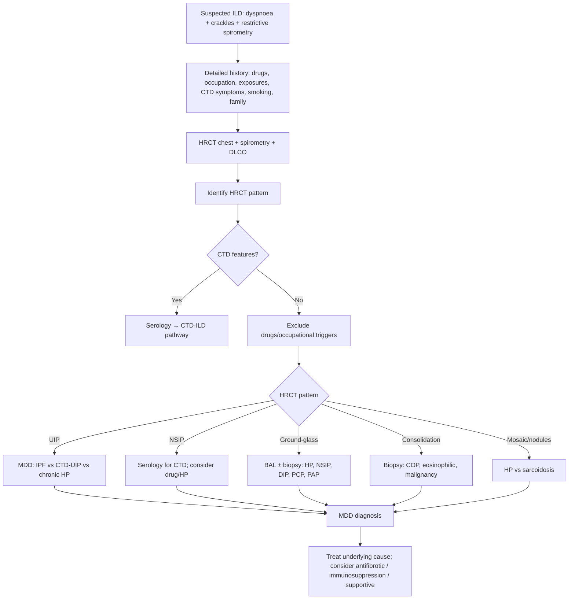
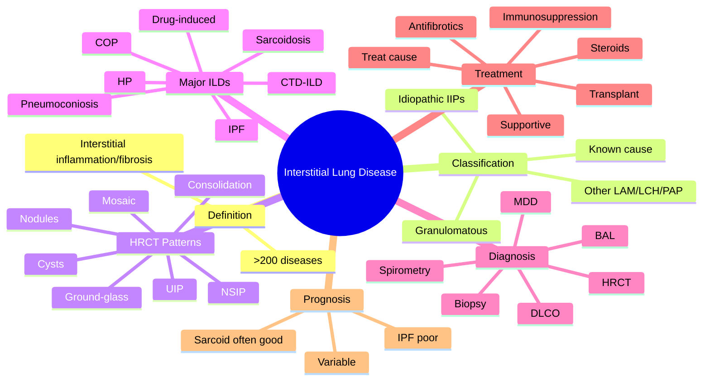
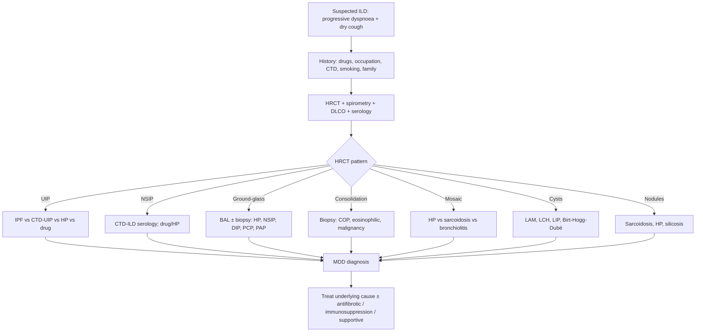

# Interstitial Lung Disease (ILD)

> [!important]
> **Interstitial lung diseases (ILDs)** are a **heterogeneous group of >200 parenchymal lung disorders** characterised by **inflammation and/or fibrosis of the pulmonary interstitium**, leading to **progressive dyspnoea, restrictive spirometry, ↓DLCO, and characteristic HRCT patterns**. Accurate diagnosis requires **multidisciplinary discussion (MDD)** between clinicians, radiologists, and pathologists.

Related: [[Respiratory Failure]], [[ABG Interpretation]], [[Spirometry Interpretation]], [[Oxygen Therapy and NIV]], [[Chest X-Ray Approach]], [[Interstitial and Diffuse Parenchymal Lung Diseases/Idiopathic pulmonary fibrosis|Idiopathic pulmonary fibrosis]]

> [!tip] **FCPS/MRCP pearl**: ILD ≠ "restrictive disease" alone. Always think **classification first** (known cause vs idiopathic, granulomatous vs non), then **HRCT pattern** (UIP vs NSIP vs ground-glass vs consolidation), then **MDD diagnosis**, then **specific treatment** (antifibrotic for IPF, steroids for sarcoid/HP, treat underlying CTD).

## Learning Objectives
- Define ILD and list the major categories (>200 diseases).
- Recognise the typical clinical presentation (progressive dyspnoea, dry cough, velcro crackles).
- Apply a structured diagnostic approach (history, exam, spirometry, HRCT, BAL, biopsy, MDD).
- Identify and interpret the major HRCT patterns (UIP, NSIP, ground-glass, mosaic, consolidation).
- Distinguish the most common ILDs: IPF, sarcoidosis, HP, CTD-ILD, COP, eosinophilic, drug-induced, pneumoconioses.
- Treat the underlying disease (antifibrotics, immunosuppression, supportive care).
- Plan supportive management: O₂, pulmonary rehabilitation, vaccinations, transplant referral.

## Definition

**Interstitial lung disease (ILD)** = a broad category of >200 parenchymal pulmonary disorders sharing:
- Involvement of the **interstitium** (alveolar walls, perivascular, perilymphatic tissue)
- Variable combinations of **inflammation** and **fibrosis**
- Common clinical pattern: **progressive exertional dyspnoea + dry cough**
- Common functional pattern: **restrictive spirometry** with **↓DLCO**
- Distinctive imaging on **HRCT**

Also called **diffuse parenchymal lung disease (DPLD)**.

## Classification (ATS/ERS 2013)

### Four main groups
1. **ILD of known cause** — drugs, occupational/environmental, CTD, infection
2. **Idiopathic interstitial pneumonias (IIPs)** — IPF, NSIP, COP, DIP, RB-ILD, AIP, LIP, AFOP, PPFE
3. **Granulomatous ILD** — sarcoidosis, HP
4. **Other forms** — LAM, PLCH, PAP, eosinophilic pneumonia

### Most common ILDs in clinical practice
- **IPF** (idiopathic pulmonary fibrosis) — most common idiopathic ILD
- **Sarcoidosis** — most common granulomatous ILD
- **HP** (hypersensitivity pneumonitis) — bird fancier's, farmer's lung
- **CTD-ILD** — RA, SSc, SLE, PM/DM, Sjögren, MCTD
- **Pneumoconioses** — asbestosis, silicosis, coal worker's
- **Drug-induced** — amiodarone, methotrexate, nitrofurantoin, bleomycin, immune checkpoint inhibitors
- **Eosinophilic ILD** — eosinophilic pneumonia, EGPA
- **COP** (cryptogenic organising pneumonia)
- **Smoking-related** — RB-ILD, DIP, Langerhans cell histiocytosis

## Pathophysiology

### Common pathway
1. **Injury** to alveolar epithelium (or vascular endothelium)
2. **Inflammatory response** (alveolitis) — lymphocytes, macrophages, eosinophils, neutrophils
3. **Repair / dysregulated repair** → fibroblast activation
4. **Extracellular matrix deposition** → fibrosis
5. **Architectural distortion** of lung parenchyma → ↓lung compliance, ↓DLCO, V/Q mismatch, hypoxaemia

### Hallmark histologic patterns
| Pattern | Histology | Clinical correlate |
|---------|-----------|--------------------|
| **UIP** (usual interstitial pneumonia) | Heterogeneous, fibroblastic foci, honeycombing, subpleural | IPF, CTD-UIP, asbestosis, chronic HP |
| **NSIP** (non-specific) | Homogeneous interstitial inflammation/fibrosis | CTD-ILD, drug, HP |
| **DAD** (diffuse alveolar damage) | Hyaline membranes, type II hyperplasia | AIP, ARDS |
| **OP** (organising pneumonia) | Masson bodies in alveoli | COP, CTD-OP, drug |
| **Granulomatous** | Non-caseating/caseating granulomas | Sarcoidosis, HP, TB, GPA |
| **DIP** | Macrophage accumulation in alveoli | Smoking-related |
| **LIP** | Lymphoid follicles | Sjögren, HIV, Castleman |

## Clinical Features

### Symptoms
- **Progressive exertional dyspnoea** (months to years)
- **Dry, non-productive cough** (often debilitating)
- **Fatigue**, weight loss, anorexia
- **Pleuritic chest pain** (rare; consider pneumothorax in LAM, LCH)
- **Haemoptysis** (consider vasculitis, malignancy)

### Signs
- **Fine inspiratory "velcro" crackles** at bases (especially IPF)
- **Digital clubbing** (60–75% in IPF; less in sarcoid/HP)
- **Cyanosis** (advanced disease)
- **RV heave, loud P2** (cor pulmonale)
- **Extrapulmonary signs** (CTD): skin tightening, joint swelling, Raynaud's, sicca

## Investigations

### First-line
| Test | Role | Typical finding in ILD |
|------|------|-----------------------|
| **CXR** | Initial screen | Reticular/reticulonodular pattern, honeycombing, ↓lung volumes, ± bilateral hilar lymphadenopathy (sarcoid) |
| **HRCT chest** | **Cornerstone of ILD diagnosis** | Specific patterns (UIP, NSIP, ground-glass, mosaic, consolidation) |
| **Spirometry + DLCO** | Severity, monitoring | Restrictive: ↓FVC, ↓TLC, FEV₁/FVC normal/↑; ↓DLCO (earliest change) |
| **Pulse oximetry / 6-min walk** | Functional capacity | Desaturation on exertion; 6MWD prognostic |
| **ABG** | Oxygenation | ↓PaO₂, ↓PaCO₂ (early; ↑PaCO₂ late) |
| **Bloods** | Exclude alternative / CTD | ANA, RF, anti-CCP, anti-Scl-70, anti-Jo-1, anti-MDA5, ANCA, ACE, IgE, eos |

### Second-line
- **BAL (bronchoalveolar lavage)** — lymphocytosis (HP, sarcoid), eosinophilia (eosinophilic pneumonia), CD1a+ (LCH)
- **Transbronchial / cryobiopsy** — for histology
- **Surgical lung biopsy (VATS)** — for definitive diagnosis when MDD can't agree
- **Echocardiogram** — for pulmonary hypertension

### HRCT patterns — the key discriminator
| Pattern | Features | Differential |
|---------|----------|--------------|
| **UIP** | Reticular, subpleural, basal; honeycombing; traction bronchiectasis; minimal GGO | IPF, CTD-UIP, asbestosis, chronic HP |
| **NSIP** | Bilateral, basal, homogeneous GGO ± fine reticulation; traction bronchiectasis | CTD-ILD (esp. SSc, PM/DM), drug, HP |
| **Ground-glass** | Hazy ↑attenuation, vessels visible | HP, NSIP, DIP, PCP, alveolar proteinosis |
| **Consolidation** | Dense ↑attenuation, vessels obscured | COP, eosinophilic pneumonia, lymphoma, adenocarcinoma |
| **Mosaic attenuation** | Patchy ↑↓density; air-trapping on expiratory | HP, sarcoid, bronchiolitis |
| **Cysts** | Thin-walled air spaces | LAM, LCH, LIP, Birt-Hogg-Dubé |
| **Nodules** | Micronodular / reticulonodular | Sarcoidosis, HP, silicosis, miliary TB |
| **Hilar/mediastinal lymphadenopathy** | Bilateral, symmetrical | Sarcoidosis, lymphoma, TB |

## Diagnostic Approach (MDD)

## Differential Diagnosis by HRCT

| HRCT pattern | Most common causes |
|--------------|---------------------|
| **UIP** | IPF, CTD-UIP (RA, SSc), asbestosis, chronic HP, drug (amiodarone, nitrofurantoin) |
| **NSIP** | CTD-ILD (SSc, PM/DM, Sjögren), drug, HP, idiopathic |
| **Ground-glass** | HP, NSIP, DIP, PCP, alveolar proteinosis, drug |
| **Consolidation** | COP, eosinophilic pneumonia, lymphoma, adenocarcinoma, lipoid pneumonia |
| **Mosaic** | HP, sarcoid, constrictive bronchiolitis, asthma |
| **Cysts** | LAM, LCH, LIP, Birt-Hogg-Dubé |
| **Centrilobular nodules** | HP, sarcoid, respiratory bronchiolitis |
| **Pleural plaques / diffuse pleural thickening** | Asbestos exposure |

## Management

### General principles
1. **Treat the underlying cause** (stop offending drug, remove exposure, treat CTD)
2. **Antifibrotic therapy** for IPF and progressive fibrosing ILD
3. **Immunosuppression** for inflammatory ILDs (sarcoidosis, CTD-ILD, COP, HP)
4. **Supportive** — O₂, pulmonary rehabilitation, vaccinations
5. **Lung transplantation** for advanced disease

### Antifibrotic therapy
| Drug | Class | Dose | Indication | Key monitoring |
|------|-------|------|-----------|-----------------|
| **Pirfenidone** | Antifibrotic | 2403 mg/day (escalate) | IPF, progressive fibrosing ILD | LFTs, GI side effects, photosensitivity |
| **Nintedanib** | Tyrosine kinase inhibitor (anti-fibrotic) | 150 mg BD | IPF, progressive fibrosing ILD, SSc-ILD | LFTs, diarrhoea, ↓ appetite |

### Immunosuppression (for inflammatory ILDs)
| Drug | Dose | Indication |
|------|------|-----------|
| **Prednisolone** | 0.5–1 mg/kg/day, taper | Sarcoidosis, COP, HP, eosinophilic pneumonia, CTD-ILD flares |
| **Methotrexate** | 7.5–25 mg/week | CTD-ILD (RA, PM/DM) |
| **Azathioprine** | 2–3 mg/kg/day | Sarcoidosis, CTD-ILD |
| **Mycophenolate mofetil** | 1–2 g/day | CTD-ILD (esp. SSc-ILD) |
| **Cyclophosphamide** | IV pulse | Severe CTD-ILD, vasculitis |
| **Rituximab** | 1 g ×2, 6-monthly | Refractory CTD-ILD, AAV |
| **Hydroxychloroquine** | 200–400 mg/day | Some CTD-ILD |

### Supportive care
- **Long-term O₂ therapy** if PaO₂ ≤7.3 kPa (55 mmHg) or ≤8.0 kPa (60 mmHg) with cor pulmonale
- **Pulmonary rehabilitation** — improves dyspnoea and quality of life
- **Vaccinations** — annual influenza, pneumococcal, COVID-19
- **Smoking cessation**
- **Vaccination against Pneumocystis** if on long-term/high-dose steroids
- **Lung transplantation** — for advanced disease (IPF, CF, SSc-ILD, LAM)

## Complications
- **Progressive respiratory failure** (Type 1 → Type 2)
- **Pulmonary hypertension** and cor pulmonale
- **Spontaneous pneumothorax** (LAM, LCH)
- **Acute exacerbation** of IPF (mortality 50–80%)
- **Lung cancer** (esp. in IPF and asbestosis)
- **Gastro-oesophageal reflux** (common; may worsen IPF)
- **Venous thromboembolism** (immobility)
- **Psychological** — anxiety, depression

## Prognosis
- **IPF**: median survival 3–5 years from diagnosis (pre-antifibrotic era); improved with antifibrotics
- **Sarcoidosis**: most remit; 10–30% chronic; 1–5% terminal
- **HP**: variable; removal of antigen critical
- **CTD-ILD**: depends on CTD and ILD extent
- **Acute exacerbation of IPF**: mortality 50–80% within 3 months

## Drug Details Table

| Drug | Class | Dose | Indication | Monitoring | FCPS/MRCP pearl |
|------|-------|------|-----------|------------|------------------|
| **Prednisolone** | Corticosteroid | 0.5–1 mg/kg/day, taper over weeks-months | Sarcoidosis, COP, HP, eosinophilic pneumonia, CTD-ILD flares | Glucose, BP, BMD, infection | Taper slowly to avoid adrenal suppression |
| **Pirfenidone** | Antifibrotic | 2403 mg/day (escalate 801 TDS) | IPF, progressive fibrosing ILD | LFTs monthly ×6 m, then 3-monthly | ↓FVC decline ~50%; GI side effects, photosensitivity |
| **Nintedanib** | Tyrosine kinase inhibitor | 150 mg BD | IPF, SSc-ILD, progressive fibrosing ILD | LFTs monthly ×3 m, then 3-monthly | ↓FVC decline; main AE: diarrhoea |
| **Methotrexate** | DMARD / immunosuppressant | 7.5–25 mg/week | CTD-ILD (RA, PM/DM) | FBC, LFT, CXR, renal | Folate 5 mg weekly; avoid in pregnancy |
| **Azathioprine** | Purine analogue | 2–3 mg/kg/day | Sarcoidosis, CTD-ILD | FBC, LFT, TPMT pre-treatment | Used as steroid-sparing agent |
| **Mycophenolate mofetil** | Purine synthesis inhibitor | 1–2 g/day | SSc-ILD, CTD-ILD | FBC, LFT, GI | Better tolerated than CYC |
| **Cyclophosphamide** | Alkylating agent | IV 500–750 mg/m² 2–4 weekly | Severe CTD-ILD, AAV | FBC, urinalysis (haemorrhagic cystitis) | With MESNA + hydration |
| **Rituximab** | Anti-CD20 mAb | 1 g ×2, 6-monthly | Refractory CTD-ILD, AAV | FBC, infection, PJP prophylaxis | Hypogammaglobulinaemia, infusion reactions |
| **Hydroxychloroquine** | DMARD | 200–400 mg/day | CTD-ILD, sarcoid skin | Retinal exam yearly | Long-term retinal toxicity |
| **Ambrisentan / Bosentan** | Endothelin receptor antagonist | Titrated | Pulmonary hypertension in ILD | LFT, Hb | For PH-ILD |
| **Sildenafil / Tadalafil** | PDE5 inhibitor | Variable | PH-ILD | BP | Symptomatic benefit |

## FCPS/MRCP High-Yield Summary

| Domain | Key points |
|--------|------------|
| **Definition** | Heterogeneous group of >200 parenchymal lung disorders with inflammation/fibrosis of interstitium |
| **Symptoms** | Progressive dyspnoea, dry cough, fatigue |
| **Signs** | Velcro crackles, clubbing (esp. IPF), cor pulmonale |
| **CXR** | Reticular/reticulonodular, honeycombing, ↓volumes, ± hilar nodes |
| **HRCT** | **Cornerstone** — UIP, NSIP, ground-glass, consolidation, mosaic, cysts, nodules |
| **Spirometry** | Restrictive: ↓FVC, ↓TLC, FEV₁/FVC normal/↑; ↓DLCO earliest |
| **MDD** | Diagnosis requires multidisciplinary discussion (clinician + radiologist ± pathologist) |
| **UIP pattern** | IPF, CTD-UIP, asbestosis, chronic HP, drug |
| **NSIP pattern** | CTD-ILD (esp. SSc, PM/DM), drug, HP |
| **IPF** | Idiopathic, UIP pattern, ageing, male, smoker; antifibrotic (pirfenidone or nintedanib) |
| **Sarcoidosis** | Non-caseating granulomas; bilateral hilar lymphadenopathy; CXR staging; steroids for symptomatic |
| **HP** | Sensitiser exposure (birds, moulds, fungi); removal of antigen + steroids |
| **CTD-ILD** | RA, SSc, PM/DM, SLE, Sjögren; treat CTD + consider immunosuppression |
| **Pneumoconiosis** | Occupational exposure (asbestos, silica, coal); prevention is key |
| **Drug-induced** | Amiodarone, methotrexate, nitrofurantoin, bleomycin, ICIs |
| **COP** | Cryptogenic organising pneumonia; consolidation, responds to steroids |
| **Antifibrotics** | Pirfenidone, nintedanib — for IPF and progressive fibrosing ILD |
| **6MWD** | Functional capacity; desaturation prognostic |
| **Vaccinations** | Influenza, pneumococcal, COVID-19 |
| **Transplant** | End-stage disease — referral early |

## Common Viva Questions

| Question | Expected answer |
|----------|-----------------|
| What is the cornerstone of ILD diagnosis? | **HRCT chest** combined with **multidisciplinary discussion (MDD)**. |
| What is the most common idiopathic ILD? | **IPF (idiopathic pulmonary fibrosis)**. |
| What is the typical HRCT pattern in IPF? | **UIP** (usual interstitial pneumonia) — subpleural, basal reticulation, honeycombing, traction bronchiectasis, minimal GGO. |
| Name the two antifibrotic drugs. | **Pirfenidone** and **nintedanib**. |
| What is the differential diagnosis of bilateral hilar lymphadenopathy? | Sarcoidosis, lymphoma, TB, fungal (histoplasmosis), silicosis. |
| What is a typical feature of sarcoidosis on biopsy? | **Non-caseating granulomas** (epithelioid + giant cells; no necrosis). |
| Name 3 drugs causing ILD. | Amiodarone, methotrexate, nitrofurantoin, bleomycin, immune checkpoint inhibitors. |
| How do you confirm hypersensitivity pneumonitis? | History of exposure + serum IgG precipitins + BAL lymphocytosis + HRCT + (often) lung biopsy; remove antigen. |
| What is the 6-minute walk test used for? | Functional capacity + desaturation; prognostic in IPF. |
| When should antifibrotic therapy be started in IPF? | At diagnosis (mild-to-severe IPF). |
| What is acute exacerbation of IPF? | Acute worsening of dyspnoea with new bilateral GGO/consolidation, no other cause; high mortality. |
| What is the role of surgical lung biopsy in ILD? | When MDD cannot reach confident diagnosis (e.g. atypical HRCT, suspected CTD). |
| When is lung transplant considered? | Progressive disease despite therapy, FVC <80% with decline, severe symptoms, suitable candidate. |
| How is CTD-ILD differentiated from IPF? | Younger age, female, multisystem features, positive serology, NSIP pattern common. |

## Common Confusions / Exam Traps

| Confusion | Clarification |
|-----------|---------------|
| "ILD is always restrictive" | Most are restrictive, but **sarcoidosis, LAM, LCH** can have mixed or even obstructive pattern. |
| "UIP = IPF" | **False** — UIP pattern can be from CTD, asbestosis, chronic HP, drug; needs clinical context. |
| "All ILDs need steroids" | **False** — IPF does NOT respond to steroids; they may cause harm. |
| "Antifibrotics cure IPF" | They **slow** FVC decline by ~50%, don't reverse fibrosis. |
| "HRCT replaces lung biopsy" | For UIP pattern in appropriate clinical context, MDD can diagnose IPF without biopsy. |
| "Sarcoidosis needs treatment in everyone" | Asymptomatic stage I often needs no treatment; treat symptomatic or organ-threatening disease. |
| "Lung biopsy is routine" | Only if MDD can't reach diagnosis. |
| "Velcro crackles are specific to IPF" | Common in IPF but also in any fibrotic ILD. |
| "Smoking only causes COPD" | Smoking is a major risk factor for **DIP, RB-ILD, LCH, IPF, lung cancer**. |
| "Bilateral hilar nodes are always sarcoidosis" | Differential: TB, lymphoma, fungal, silicosis, malignancy. |
| "CTD-ILD is one disease" | Different CTDs have different ILD patterns and prognoses (e.g. SSc-ILD = NSIP, RA-ILD = UIP). |

## Mnemonics

**Most common ILDs** — **"SCHIP"**: **S**arcoidosis, **C**TD-ILD, **H**P, **I**PF, **P**neumoconiosis

**UIP causes** — **"I CHASED"**: **I**PF, **C**TD, **H**P (chronic), **A**sbestosis, **S**arcoid (advanced), **E**mphysema (combined), **D**rugs

**Drugs causing ILD** — **"ABCDE-F"**: **A**miodarone, **B**leomycin, **C**yclophosphamide, **D**iscontinued-MTX/Nitrofurantoin, **E**rlotinib/ICIs, **F**lu-like/toxic

**Sarcoid CXR stages** — **"1-2-3-4-0"**: 1 = bilateral hilar nodes alone; 2 = nodes + parenchymal infiltrates; 3 = parenchymal only; 4 = fibrosis; 0 = normal

**IPF triad** — **"Old Male Smoker"** with UIP on HRCT

**Antifibrotics for IPF** — **"PN"**: **P**irfenidone, **N**intedanib

**Restrictive spirometry** — **"FEV₁ and FVC both ↓, ratio normal or ↑"**

## Mind Map

## Flowchart — ILD Diagnostic Algorithm

## One-Page Revision Summary

- **ILD** = >200 parenchymal lung diseases; inflammation +/or fibrosis of interstitium
- **Symptoms**: progressive dyspnoea, dry cough
- **Signs**: velcro crackles, clubbing, ± cor pulmonale
- **CXR**: reticular/reticulonodular, ↓volumes, honeycombing, ± hilar nodes
- **HRCT** = cornerstone; pattern recognition: UIP, NSIP, GGO, consolidation, mosaic, cysts, nodules
- **Spirometry**: restrictive (↓FVC, ↓TLC, normal/↑ratio), ↓DLCO earliest
- **MDD** = gold-standard diagnostic process
- **IPF**: UIP + idiopathic + ageing + male + smoker; treat with **pirfenidone or nintedanib**
- **Sarcoidosis**: non-caseating granulomas, CXR staging 0–4, treat with steroids if symptomatic
- **HP**: antigen exposure + BAL lymphocytosis; remove antigen + steroids
- **CTD-ILD**: screen with serology; treat underlying CTD
- **Pneumoconioses**: occupational; prevention
- **Drugs**: amiodarone, MTX, nitrofurantoin, bleomycin, ICIs
- **Supportive**: O₂, pulmonary rehab, vaccinations, transplant

## 24-Hour Recall Prompts
- Define ILD and classify the major categories.
- List the 7 most common HRCT patterns.
- Outline the diagnostic algorithm (HRCT + MDD).
- Distinguish IPF from CTD-ILD and HP.
- Name the two antifibrotic drugs and their indications.
- State the CXR stages of sarcoidosis.
- Name 3 drugs that cause ILD.
- Outline the management of IPF, sarcoidosis, HP, and CTD-ILD.

## 7-Day / 15-Day / 30-Day Revision Tracker
- [ ] Day 1 completed
- [ ] 24-hour recall completed
- [ ] Day 7 revision completed
- [ ] Day 15 revision completed
- [ ] Day 30 revision completed

## Must Know / Should Know / Nice to Know

### Must Know
- Definition, classification, 7 HRCT patterns
- UIP/NSIP patterns and their causes
- IPF, sarcoidosis, HP, CTD-ILD, pneumoconiosis, drug-induced
- MDD approach
- Antifibrotic drugs (pirfenidone, nintedanib)
- Steroid indications (NOT for IPF)

### Should Know
- BAL findings
- Drug list (amiodarone, MTX, etc.)
- Sarcoid CXR staging
- 6MWD
- Acute exacerbation of IPF
- Lung transplant referral criteria

### Nice to Know
- Rare ILDs (LAM, LCH, PAP, LIP)
- Surgical lung biopsy indications
- Eosinophilic pneumonia
- PPFE

## My Weak Points
- 

## Self-Test Scorecard
- Understanding: /10
- Recall: /10
- MCQ Performance: /10
- SBA Performance: /10
- Viva Confidence: /10
- Total: /50

> [!tip] Interpretation: <35 = weak topic, 35–44 = acceptable but insecure, 45+ = strong exam-ready topic.

## Exam Answer Modes

### Long Answer Skeleton
- Definition → Classification → HRCT patterns → Major ILDs (IPF, sarcoidosis, HP, CTD-ILD, pneumoconiosis) → Approach (history, exam, HRCT, spirometry, serology, BAL, biopsy, MDD) → Management (cause, antifibrotic, immunosuppression, supportive, transplant) → Complications → Prognosis

### Short Note Skeleton
- Definition → HRCT pattern → Differential → MDD → Treatment principle

### Viva One-Liners
- "IPF is UIP pattern + idiopathic + ageing + male + smoker; treat with pirfenidone or nintedanib."
- "Sarcoidosis = non-caseating granulomas + bilateral hilar lymphadenopathy."
- "HP = antigen exposure + BAL lymphocytosis; treat with antigen removal + steroids."

### Ward-Case Discussion Points
- Inhaler/oral steroids NOT useful in IPF
- Antifibrotics slow but do not reverse disease
- MDD essential for ILD diagnosis
- Vaccinate all ILD patients
- Refer for transplant early if progressive

### Last-Night-Before-Exam Sheet
- ILD = >200 parenchymal lung diseases
- HRCT = cornerstone; patterns: UIP, NSIP, GGO, consolidation, mosaic, cysts, nodules
- IPF = UIP + idiopathic + old male smoker; pirfenidone or nintedanib
- Sarcoidosis = non-caseating granulomas; treat with steroids if symptomatic
- HP = antigen exposure + BAL lymphocytosis; remove antigen
- CTD-ILD = screen with serology, treat underlying
- Drugs: amiodarone, MTX, nitrofurantoin, bleomycin, ICIs
- MDD = gold standard for diagnosis

## Summary

Interstitial lung diseases are a **heterogeneous group of >200 parenchymal lung disorders** sharing inflammation and/or fibrosis of the interstitium with progressive dyspnoea, dry cough, velcro crackles, restrictive spirometry, and ↓DLCO. **HRCT pattern recognition (UIP, NSIP, GGO, consolidation, mosaic, cysts, nodules) is the cornerstone**, and final diagnosis is made by **multidisciplinary discussion**. Major ILDs include **IPF (UIP, antifibrotics: pirfenidone or nintedanib), sarcoidosis (non-caseating granulomas, steroids if symptomatic), HP (antigen removal + steroids), CTD-ILD (treat underlying CTD), pneumoconioses (prevention), and drug-induced ILD**. **Steroids are NOT useful in IPF** and may cause harm. Supportive care (O₂, pulmonary rehab, vaccinations, transplant referral) is central to long-term management.

## MCQs (10)

1. The cornerstone of ILD diagnosis is:
   - A) CXR
   - B) Spirometry
   - C) **HRCT chest**
   - D) Bronchoscopy
   - E) Lung biopsy
   **Answer: C** — HRCT identifies pattern; combined with MDD, can usually diagnose without biopsy.

2. A 70-year-old male ex-smoker with progressive dyspnoea and dry cough has HRCT: subpleural, basal reticulation, honeycombing, traction bronchiectasis, no GGO. Most likely diagnosis?
   - A) Sarcoidosis
   - B) Hypersensitivity pneumonitis
   - C) **Idiopathic pulmonary fibrosis (IPF)**
   - D) CTD-ILD
   - E) Cryptogenic organising pneumonia
   **Answer: C** — UIP pattern in old male smoker = IPF.

3. First-line treatment for symptomatic IPF:
   - A) Prednisolone
   - B) Azathioprine
   - C) **Pirfenidone or nintedanib**
   - D) Cyclophosphamide
   - E) Mycophenolate
   **Answer: C** — Antifibrotics are first-line; steroids do not help.

4. A 35-year-old woman with SSc has progressive dyspnoea. HRCT: bilateral, basal, homogeneous GGO with fine reticulation. Pattern?
   - A) UIP
   - B) **NSIP**
   - C) Consolidation
   - D) Cysts
   - E) Mosaic
   **Answer: B** — NSIP is the most common CTD-ILD pattern in SSc.

5. Which ILD shows non-caseating granulomas on biopsy?
   - A) IPF
   - B) HP
   - C) TB
   - D) **Sarcoidosis**
   - E) Silicosis
   **Answer: D** — Sarcoidosis is the classic non-caseating granulomatous disease (silicosis can also be non-caseating, but with birefringent crystals).

6. Most sensitive functional test for early ILD:
   - A) FEV₁
   - B) FVC
   - C) **DLCO**
   - D) TLC
   - E) RV
   **Answer: C** — DLCO is the earliest spirometric abnormality.

7. A 60-year-old bird fancier with progressive dyspnoea. HRCT shows ground-glass and mosaic attenuation. BAL: lymphocytosis. Most likely?
   - A) IPF
   - B) **Hypersensitivity pneumonitis**
   - C) Sarcoidosis
   - D) NSIP
   - E) CTD-ILD
   **Answer: B** — Bird exposure + lymphocytosis + mosaic/GGO = HP.

8. Sarcoid CXR Stage I shows:
   - A) Pulmonary fibrosis
   - B) **Bilateral hilar lymphadenopathy alone**
   - C) Parenchymal infiltrates alone
   - D) Hilar nodes + infiltrates
   - E) Normal
   **Answer: B** — Stage I = bilateral hilar nodes alone.

9. A 55-year-old on amiodarone for arrhythmia develops dyspnoea. HRCT: bilateral high-attenuation GGO and consolidation. Most likely?
   - A) Pneumonia
   - B) **Amiodarone-induced ILD**
   - C) IPF
   - D) Sarcoidosis
   - E) PE
   **Answer: B** — Amiodarone causes ILD; high-attenuation lesions are characteristic.

10. Which of the following is **not** an antifibrotic drug for IPF?
    - A) Pirfenidone
    - B) Nintedanib
    - C) Prednisolone
    - D) Both A and B
    - E) Both A and C
    **Answer: C** — Prednisolone is not antifibrotic.

## SBA Questions (10)

1. A 68-year-old ex-smoker with UIP on HRCT. Best treatment:
   - A) Prednisolone
   - B) Azathioprine + N-acetylcysteine
   - C) **Pirfenidone or nintedanib**
   - D) Mycophenolate
   - E) Cyclophosphamide
   **Answer: C** — Antifibrotic first-line.

2. Most common HRCT pattern in SSc-ILD:
   - A) UIP
   - B) **NSIP**
   - C) Consolidation
   - D) Mosaic
   - E) Cysts
   **Answer: B** — NSIP is most common.

3. A patient with confirmed HP after bird exposure. Most important first management step:
   - A) Start steroids
   - B) **Remove antigen exposure**
   - C) Start antifibrotic
   - D) Lung transplant
   - E) Immunosuppressant
   **Answer: B** — Antigen removal is key.

4. Sarcoidosis with bilateral hilar nodes alone, asymptomatic. Best management:
   - A) Prednisolone
   - B) Methotrexate
   - C) **Observation (no treatment)**
   - D) Infliximab
   - E) Antifibrotic
   **Answer: C** — Asymptomatic stage I sarcoid often needs no treatment.

5. A patient with ILD has 6MWD showing SpO₂ drop from 96% to 84%. Next step:
   - A) Stop rehabilitation
   - B) **Initiate ambulatory O₂**
   - C) Start steroids
   - D) Intubation
   - E) No change
   **Answer: B** — Ambulatory O₂ for exertional desaturation.

6. First-line pharmacotherapy for symptomatic pulmonary sarcoidosis:
   - A) Methotrexate
   - B) Azathioprine
   - C) **Prednisolone**
   - D) Cyclophosphamide
   - E) Rituximab
   **Answer: C** — Prednisolone is first-line for symptomatic sarcoidosis.

7. Acute exacerbation of IPF is characterised by:
   - A) New unilateral consolidation
   - B) **Acute worsening with new bilateral GGO/consolidation**
   - C) Pneumothorax
   - D) Pulmonary embolism
   - E) Sepsis
   **Answer: B** — Acute IPF exacerbation = new bilateral GGO/consolidation with no other cause.

8. Drug most associated with ILD among these:
   - A) Paracetamol
   - B) **Amiodarone**
   - C) Metformin
   - D) Atenolol
   - E) Omeprazole
   **Answer: B** — Amiodarone commonly causes ILD.

9. The earliest functional abnormality in ILD is:
   - A) ↓FEV₁
   - B) ↓FVC
   - C) ↓TLC
   - D) **↓DLCO**
   - E) ↓PEF
   **Answer: D** — DLCO is the earliest change.

10. Which of the following is **not** typically a feature of UIP on HRCT?
    - A) Subpleural reticulation
    - B) Basal predominance
    - C) Honeycombing
    - D) **Extensive ground-glass opacity**
    - E) Traction bronchiectasis
    **Answer: D** — UIP has minimal GGO; extensive GGO suggests NSIP, HP, or other.

## Flashcards

- **Q: Cornerstone of ILD diagnosis?**
  A: HRCT + multidisciplinary discussion (MDD).

- **Q: Most common idiopathic ILD?**
  A: Idiopathic pulmonary fibrosis (IPF).

- **Q: HRCT pattern of IPF?**
  A: UIP — subpleural, basal, reticular, honeycombing, traction bronchiectasis.

- **Q: Two antifibrotic drugs?**
  A: Pirfenidone and nintedanib.

- **Q: Why are steroids avoided in IPF?**
  A: They do not slow progression and may cause harm.

- **Q: HRCT pattern in SSc-ILD?**
  A: NSIP.

- **Q: Most common finding on biopsy in sarcoidosis?**
  A: Non-caseating granulomas.

- **Q: BAL finding in HP?**
  A: Lymphocytosis (CD8+ T cells).

- **Q: HRCT finding in LAM?**
  A: Diffuse thin-walled cysts.

- **Q: Drug ILD with high-attenuation lesions?**
  A: Amiodarone.

- **Q: 6MWD significance in ILD?**
  A: Functional capacity; desaturation is prognostic.

- **Q: When to refer for lung transplant?**
  A: Progressive disease despite therapy, FVC <80% with decline.

## Answer Key with Explanations

### MCQs
1. **C** — HRCT is cornerstone.
2. **C** — UIP in old male smoker = IPF.
3. **C** — Antifibrotic.
4. **B** — NSIP in SSc.
5. **D** — Sarcoidosis.
6. **C** — DLCO.
7. **B** — HP.
8. **B** — Stage I = BHL alone.
9. **B** — Amiodarone-induced ILD.
10. **C** — Prednisolone not antifibrotic.

### SBAs
1. **C** — Pirfenidone/nintedanib.
2. **B** — NSIP.
3. **B** — Antigen removal.
4. **C** — Observation.
5. **B** — Ambulatory O₂.
6. **C** — Prednisolone.
7. **B** — Bilateral GGO/consolidation.
8. **B** — Amiodarone.
9. **D** — DLCO.
10. **D** — UIP has minimal GGO.

## Local Navigation
- **Parent Heading**: [[../Interstitial and Diffuse Parenchymal Lung Diseases|Interstitial and Diffuse Parenchymal Lung Diseases]]
- **Parent Topic Group**: [[../Interstitial and Diffuse Parenchymal Lung Diseases/ILD framework|ILD framework]]
- **Chapter Map**: [[../Davidson Chapter 17 - Respiratory Medicine Hierarchy|Respiratory Medicine Hierarchy]]
- **Chapter MOC**: [[../Respiratory MOC|Respiratory MOC]]
- **Drug Reference**: [[../../Clinical Therapeutics and Good Prescribing|Drugs]]
- **Related**: [[Interstitial and Diffuse Parenchymal Lung Diseases/Idiopathic pulmonary fibrosis|Idiopathic pulmonary fibrosis]] · [[Interstitial and Diffuse Parenchymal Lung Diseases/Sarcoidosis|Sarcoidosis]] · [[Interstitial and Diffuse Parenchymal Lung Diseases/Hypersensitivity pneumonitis|Hypersensitivity pneumonitis]] · [[Interstitial and Diffuse Parenchymal Lung Diseases/Connective tissue disease-associated ILD|CTD-ILD]] · [[Interstitial and Diffuse Parenchymal Lung Diseases/Cryptogenic organizing pneumonia|COP]] · [[Interstitial and Diffuse Parenchymal Lung Diseases/Eosinophilic lung disease|Eosinophilic lung disease]] · [[Interstitial and Diffuse Parenchymal Lung Diseases/Drug-induced interstitial lung disease|Drug-induced ILD]] · [[Spirometry Interpretation]] · [[ABG Interpretation]] · [[Respiratory Failure]] · [[Oxygen Therapy and NIV]]

## PasTest Scenario SBAs (Clinical Vignettes)

> **Auto-generated PasTest/Mediscope-style scenario SBAs** grounded in the authored source. Each scenario tests a real clinical fact (triad, specific sign, contraindication, trial, first-line Rx) extracted from the topic. *Source: Ch 17: Respiratory Medicine — Interstitial Lung Disease*

**Q1.** Which of the following features is most specific or characteristic of Interstitial Lung Disease?

  - **A.** HRCT chest
  - **B.** A feature common to many acute inflammatory conditions
  - **C.** A non-specific sign that does not localise the diagnosis
  - **D.** An investigation finding rather than a clinical feature

  > **Answer: A** — HRCT chest
  >
  > *Source:* ticulonodular pattern, honeycombing, ↓lung volumes, ± bilateral hilar lymphadenopathy (sarcoid) |
| **HRCT chest** | **Cornerstone of ILD diagnosis** | Specific patterns (UIP, NSIP, ground-glass, mosa

**Q2.** What is the most appropriate first-line therapy for Interstitial Lung Disease?

  - **A.** Long-term O₂ therapy
  - **B.** An advanced/surgical therapy reserved for refractory disease
  - **C.** Symptomatic treatment only, no disease-modifying therapy
  - **D.** Empiric broad-spectrum therapy without specific indication

  > **Answer: A** — Long-term O₂ therapy
  >
  > *Source:* **Long-term O₂ therapy** if PaO₂ ≤7.3 kPa (55 mmHg) or ≤8.0 kPa (60 mmHg) with cor pulmonale

